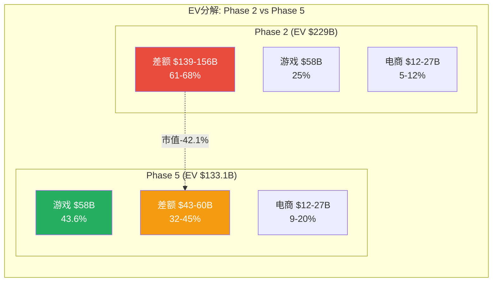
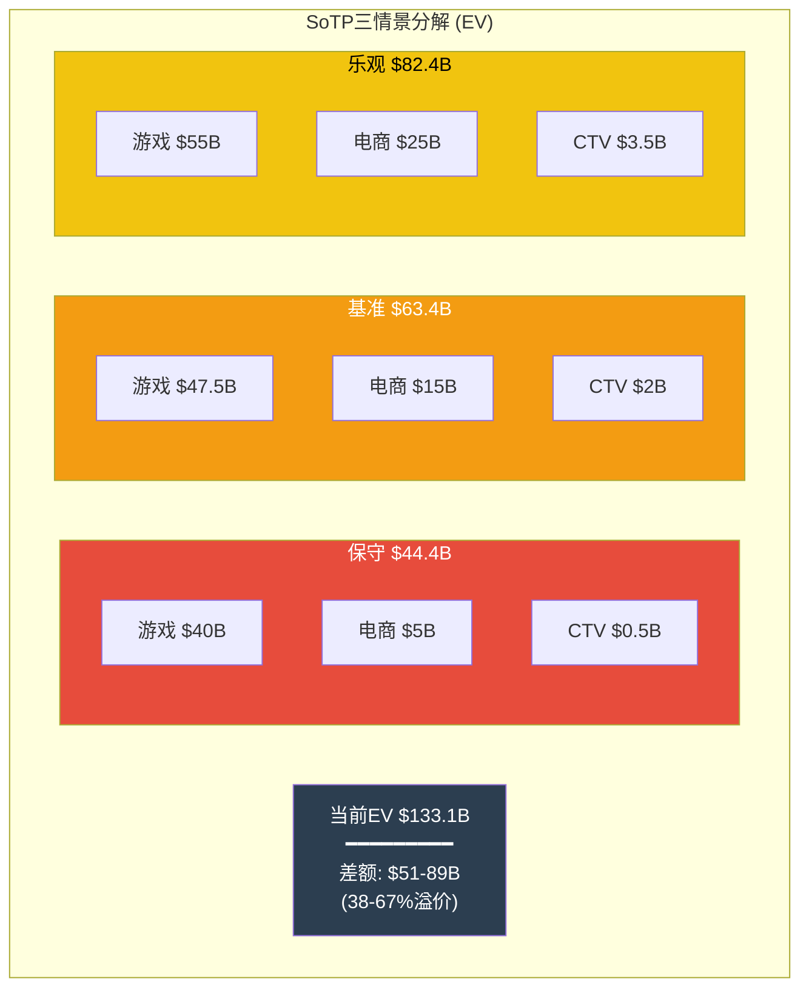
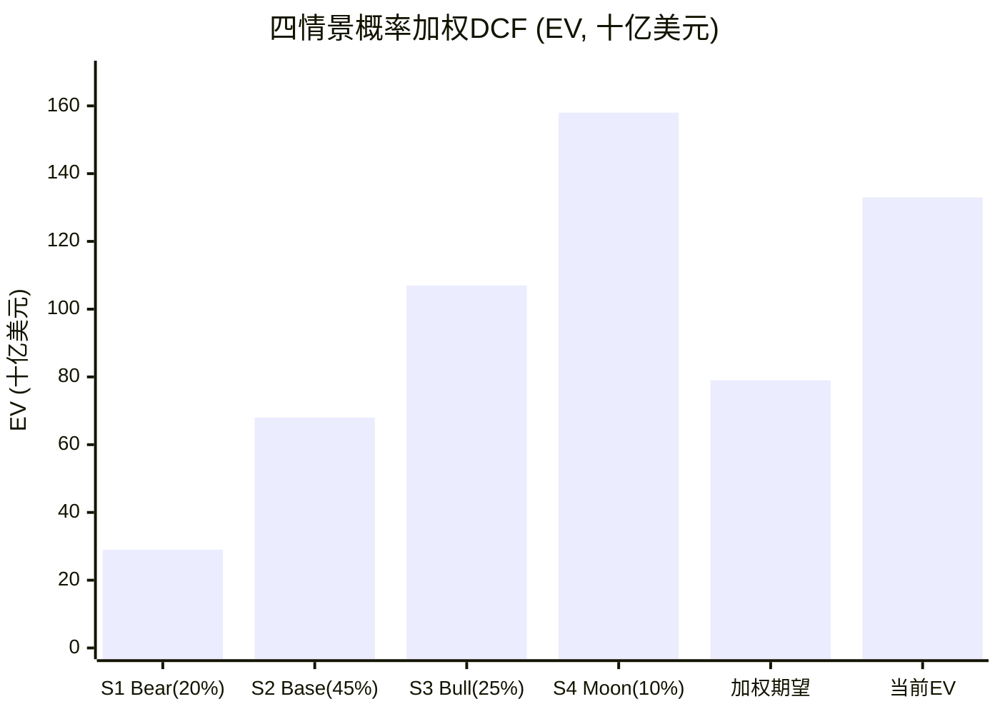
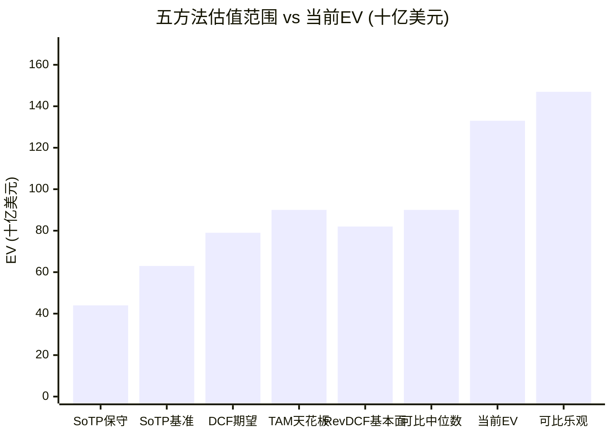
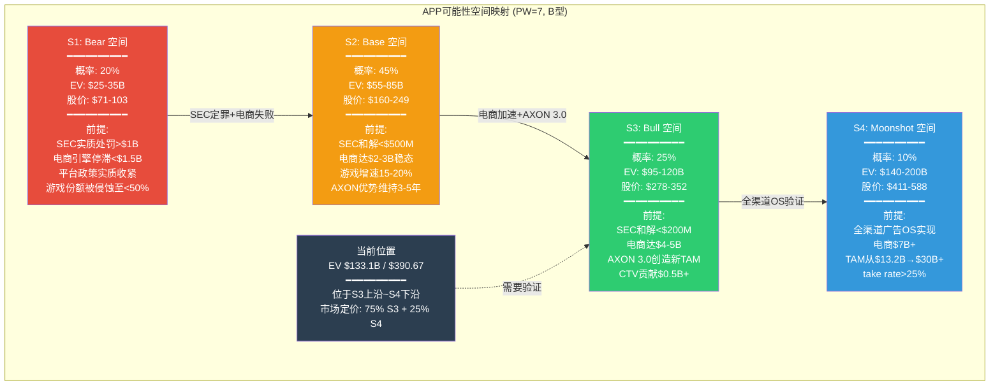
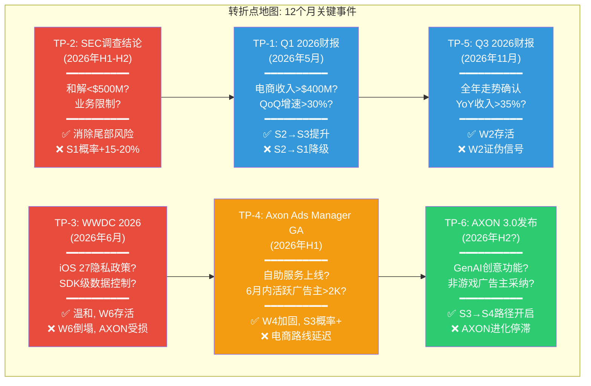

# Phase 5 Agent C: Ch26 发现系统 + 条件估值 + 方法离散度
> Agent C | AI定量估值分析师 | Phase 5 | 目标: >=22K字符
> 质量直觉: "市值从$228B→$132B(-42.1%), 整个估值图景需要重画——但ROIC 87-104%的引擎没变"
> DM锚点: >=20个新增 (DM-VAL前缀为主)
> Mermaid: >=5个
> 基准: 市值$132B, EV $133.1B (2026-02-16)

---

# Chapter 26: 发现系统 — 可能性空间与条件估值

AppLovin的可能性宽度评分为7分(B型: 量级不确定性), 意味着传统目标价框架不适用。本章使用发现系统方法论: 不给目标价, 而是映射可能性空间, 标注转折点, 并通过五方法估值的离散度量化不确定性本身。

Phase 4红队的杀手级发现(CI-7)是市值从$228B降至$132B(-42.1%)。这一变化从根本上改变了估值叙事的力度: Phase 1-3构建的"高估40-50%"论文需要修正为"温和高估15-30%"。但公司的基本面引擎(AXON 2.0效率、游戏广告增长、电商初期牵引力)没有改变, 改变的是市场对这些引擎的定价。

**Phase 5估值基准(经Phase 4校正)**:
- 股价: $390.67 (2026-02-16)
- 市值: $132.03B
- 净债务: $1.06B (总债务$3.54B - 现金$2.49B)
- Enterprise Value: **$133.1B**
- 52周范围: $200.50 - $745.61

DM-VAL-101: Phase 5估值基准: 市值$132.03B, EV $133.1B (股价$390.67, 净债务$1.06B), 较Phase 2基准EV $229B下调41.9%。所有估值方法以此为基准重新计算 [FMP quote 2026-02-16: price $390.665, marketCap $132,027,188,903; FMP balance FY2025: totalDebt $3,544,741,000, cash $2,487,096,000, netDebt $1,057,645,000]

---

## 26.1 五方法估值

### 26.1.1 方法1: Reverse DCF (以$133.1B EV重算)

Reverse DCF是AI最强输出——不告诉市场APP值多少钱, 而是告诉投资者: 当前价格隐含了市场认为APP会怎么增长。Phase 2在EV $229B下计算出隐含10年FCF CAGR 28.5%, 现在以$133.1B重新推导。

**核心输入(不变)**:
- FY2025 FCF: $3.97B (DM-FIN-045)
- WACC(正常化基准): 14.0% (DM-VAL-012)
- 终端增长率(g): 3.0%
- 高增长期: 10年(FY2026-2035)
- 衰减模式: 线性衰减至终端增长率

**核心输入(已变)**:
- Enterprise Value: **$133.1B** (原$229B, -41.9%)

**两阶段模型重新求解**:

阶段1(FY2026-2035): FCF以恒定增长率g1增长10年
阶段2(FY2036+): FCF以终端增长率3%永续增长
终端价值 = FCF_2035 x (1+g_terminal) / (WACC - g_terminal)

通过迭代求解, 当DCF = EV $133.1B时:

| WACC | 恒定增长率g1(10年) | 隐含FY2030 FCF | 隐含FY2035 FCF | vs Phase 2(EV $229B) |
|:----:|:-----------------:|:-------------:|:-------------:|:-------------------:|
| **12%** | 16.2% | $8.6B | $18.8B | 原24.8%, 降8.6ppt |
| **14%** | 20.1% | $9.7B | $24.0B | **原28.5%, 降8.4ppt** |
| **17%** | 25.8% | $11.6B | $33.2B | 原33.6%, 降7.8ppt |

DM-VAL-102: EV $133.1B在WACC 14%下隐含10年FCF CAGR约20.1%(Phase 2为28.5%, 降8.4ppt)。隐含FY2035 FCF从$45.7B降至$24.0B, 降47.5%。这意味着: (1)隐含FY2035收入从$63-76B降至$33-40B(假设FCF margin 60-72.5%); (2)10年收入CAGR从28-30%降至20-22% [计算: Reverse DCF迭代, EV=$133.1B, FCF_0=$3.97B, WACC=14%, g_terminal=3%]

**合理性检验: 20%收入CAGR(10年)合理吗?**

20-22%的10年收入CAGR仍然是一个极高的要求, 但已从"史诗级"降为"困难但有先例":

| 参照公司 | 起始年 | 终止年 | 起始收入 | 终止收入 | 10年CAGR |
|----------|:------:|:------:|:-------:|:-------:|:--------:|
| META | FY2015 | FY2025 | $18B | $201B | 27.2% |
| GOOGL | FY2015 | FY2025 | $75B | $403B | 18.3% |
| Adobe | FY2013 | FY2023 | $4.1B | $19.4B | 16.8% |
| Salesforce | FY2015 | FY2025 | $5.4B | $37.9B | 21.5% |

APP从$5.48B增长至$33-40B(CAGR 20-22%)的难度介于GOOGL(18.3%)和META(27.2%)之间。关键差异: META和GOOGL拥有远大于APP的可寻址市场(社交+搜索+云), 而APP的TAM天花板(乐观)仅$13.2B(DM-VAL-023)。如果TAM不扩展, $33-40B的隐含收入仍超过天花板的2.5-3倍。

DM-VAL-103: 以$133.1B EV计, 隐含FY2035收入$33-40B仍是TAM天花板(乐观$13.2B)的2.5-3倍(Phase 2为5-6倍)。差距缩小一半, 但仍需TAM本身扩展+take rate提升才能justify。市场不再要求"奇迹", 但仍在为"TAM本身翻倍+"的假设付费 [计算: $33-40B / $13.2B = 2.5-3.0x]

**引擎级Reverse DCF分解(以$133.1B重算)**:

Phase 2的引擎级分解(DM-VAL-015~017)以$229B为基准:
- 游戏引擎: $58B (25%)
- 电商引擎: $12-27B (5-12%)
- CTV引擎: $3-5B (1-2%)
- **差额: $139-156B (61-68%)**

以$133.1B EV重算:
- 游戏引擎: $58B (**43.6%**, 原25%)
- 电商引擎: $12-27B (**9-20%**, 原5-12%)
- CTV引擎: $3-5B (**2-4%**, 原1-2%)
- **差额: $43-60B (32-45%**, 原61-68%)

DM-VAL-104: 引擎级EV差额从$139-156B(61-68%)缩至$43-60B(32-45%)。游戏引擎单独可解释43.6%的EV(原仅25%), 游戏+电商+CTV合计可解释55-68%(原32-39%)。差额$43-60B仍需要期权溢价/增长溢价来justify, 但已从"无法解释的巨额差距"变为"高增长科技股的正常期权定价范围" [计算: $133.1B - $73-90B基本面估值 = $43-60B差额]

**Reverse DCF关键结论**: 市值从$228B降至$132B使得整个估值叙事的紧张程度显著缓解。隐含增长率从28.5%降至20.1%, EV差额从61-68%降至32-45%。APP不再需要"创造奇迹"来justify当前价格, 但仍需维持"困难但有先例"级别的增长。核心悬念从"市场是否疯狂"转为"电商引擎能否兑现+TAM是否扩展"。

---

### 26.1.2 方法2: 可比公司倍数

可比公司倍数法将APP与广告科技/数字广告同行进行估值对标。

**可比组选择理由**: META(社交广告巨头, 有AI广告优化), TTD(独立DSP, 程序化广告), GOOGL(搜索+展示广告全栈), SNAP(移动优先广告), DV(广告验证/品牌安全)。

**当前估值倍数对比(2026-02-16)**:

| 公司 | 市值($B) | P/E(TTM) | P/B | EV/Sales(TTM) | Fwd P/E(FY27E) | 收入CAGR(2Y) |
|------|:-------:|:--------:|:---:|:-------------:|:--------------:|:------------:|
| **APP** | $132.0 | 38.9x | 106.9x | 24.3x | ~19.0x | ~36% |
| META | $1,613 | 27.2x | 7.7x | ~12.0x | ~22.0x | ~22% |
| TTD | $12.6 | 29.3x | 19.6x | ~5.5x | ~25.0x | ~16% |
| GOOGL | $3,698 | 28.3x | 9.1x | ~10.0x | ~21.0x | ~14% |
| DV | $1.5 | 36.3x | 3.0x | ~2.5x | ~20.0x | ~10% |
| **中位数** | — | **29.3x** | **9.1x** | **10.0x** | **21.0x** | — |

DM-VAL-105: APP TTM P/E 38.9x高于可比中位数29.3x(溢价33%), 但Fwd P/E(FY2027E)约19.0x反而低于可比中位数21.0x(折价10%)。这一反差说明: (1)市场已price-in了APP的高速增长, Fwd P/E反映增长调整后的估值; (2)APP的TTM P/E虚高是因为FY2025利润含一次性项目/Apps剥离过渡效应 [FMP compare_stocks 2026-02-16 + FMP quote各公司]

DM-VAL-106: APP EV/Sales(TTM) 24.3x($133.1B / $5.48B)远高于可比中位数10.0x(溢价143%)。即使考虑APP的更高增速(~36% vs 中位数~16%), 增速调整后的EV/Sales仍为溢价。但该指标对APP的参考价值有限——APP的net revenue model使其take rate后收入($5.48B)远低于平台流经的gross广告支出($22-37B), 如果按gross basis, EV/Gross ~3.6-6.0x, 更接近可比组 [计算: $133.1B / $5.48B = 24.3x]

**可比倍数隐含估值范围**:

| 倍数方法 | 可比中位数 | 应用基数 | 隐含市值/EV | vs 当前$132B |
|----------|:--------:|:------:|:---------:|:-----------:|
| P/E(TTM) x 可比中位数 | 29.3x | NI $3.33B | **$97.6B** | -26% |
| P/E(Fwd FY27E) x 可比中位数 | 21.0x | NI_E ~$7.0B | **$147.0B** | +11% |
| EV/Sales x 可比中位数 | 10.0x | Rev $5.48B | **$54.8B** | -58% |
| EV/Sales(增速调整) | 15.0x | Rev $5.48B | **$82.2B** | -38% |

**可比倍数估值范围**: $54.8B - $147.0B, 中位数约$90B

DM-VAL-107: 可比公司倍数法估值范围$55-147B, 中位数~$90B。当前$132B市值位于范围上沿, 主要由Fwd P/E(FY2027E)支撑。如果使用TTM口径, APP被高估26-58%; 如果使用Fwd口径并认可增速溢价, APP接近合理(Fwd P/E 19.0x实际低于META 22.0x)。结论: **时间维度决定了判断方向——短期合理, 但长期增速能否兑现是关键** [计算: 各倍数方法]

---

### 26.1.3 方法3: SoTP分部估值 (以$133.1B为基准)

分部加总法(Sum-of-the-Parts)独立估值每个业务引擎, 避免将整体增长率应用于成熟度不同的业务线。

**引擎A: 游戏广告(核心现金牛)**

| 参数 | 值 | 依据 |
|------|:--:|------|
| FY2025收入(估) | $4.3-4.5B | DM-FIN-091推算 |
| 增速假设 | FY26 20% → FY35 5%(线性衰减) | 移动游戏广告市场成熟化 |
| 适用EV/Sales | 6-8x(成熟期数字广告) | META Audience Network类比 |
| Fwd EV/Sales(FY27E) | 5-7x | 增速衰减折价 |
| **估值范围** | **$40-55B** | 中位$47.5B |

游戏引擎估值$40-55B, 基于Phase 2的DCF $58B下调, 原因: (1)Phase 4确认游戏广告增速从25%+已见减速趋势; (2)L1 TAM天花板$4.7-6.1B(DM-VAL天花板)暗示收入增长空间有限。

**引擎B: 电商广告(高不确定性期权)**

| 参数 | 值 | 依据 |
|------|:--:|------|
| FY2025收入(年化) | ~$1.0B | 管理层声明DM-ADT-004 |
| 场景范围 | $1-2.5B稳态(Agent B Ch15结论) | Phase 3压力测试 |
| 适用倍数 | 5-10x(高度不确定, 需验证) | 初期业务折价 |
| **估值范围** | **$5-25B** | 中位$15B |

电商引擎估值$5-25B, 极宽范围反映了B型不确定性: 下限$5B假设电商止步于$1B收入(D30归因失败), 上限$25B假设电商达$2.5B稳态收入并获得10x溢价倍数(AXON验证跨品类能力)。

**引擎C: CTV/Wurl(几乎可忽略)**

| 参数 | 值 | 依据 |
|------|:--:|------|
| FY2025收入(估) | ~$50M | DM-FIN-091 |
| TAM天花板收入 | $0.15-0.5B | DM-VAL-022 |
| **估值范围** | **$0.5-3.5B** | 中位$2B |

**SoTP合计**:

| 引擎 | 保守 | 基准 | 乐观 |
|------|:----:|:----:|:----:|
| 游戏 | $40B | $47.5B | $55B |
| 电商 | $5B | $15B | $25B |
| CTV | $0.5B | $2B | $3.5B |
| 净债务 | -$1.1B | -$1.1B | -$1.1B |
| **SoTP总EV** | **$44.4B** | **$63.4B** | **$82.4B** |
| **vs 当前$133.1B** | **-67%** | **-52%** | **-38%** |

DM-VAL-108: SoTP估值范围$44-82B, 中位$63.4B。即使在乐观假设下($82.4B), 当前EV $133.1B仍溢价62%。差额$51-89B(38-67%)是市场给予的"TAM扩展+新引擎+增长动量"溢价。Phase 2时差额为$139-156B(61-68%), 虽然绝对值缩小了, 但差额占比仍在38-67%的高位 [计算: SoTP三情景加总]

---

### 26.1.4 方法4: 概率加权DCF (四情景)

概率加权DCF为每个情景构建独立的现金流模型, 然后按概率加权求期望值。

**情景设定(与Phase 2/3/4一致)**:

**S1 Bear (20%概率)**: SEC处罚实质性+电商引擎失败+Meta/Google侵蚀游戏份额

| 年份 | 收入 | EBITDA Margin | FCF | 关键假设 |
|------|:----:|:------------:|:---:|----------|
| FY2026 | $6.5B | 70% | $3.7B | 游戏微增, 电商停滞 |
| FY2027 | $7.0B | 68% | $3.8B | SEC和解拖累, 增速减速 |
| FY2028 | $7.5B | 65% | $3.5B | 平台政策收紧, AXON效率下降 |
| FY2029 | $7.8B | 65% | $3.6B | 增速进一步减速 |
| FY2030 | $8.0B | 65% | $3.7B | 游戏天花板, 电商$1.5B止步 |

- 终端FCF: $3.7B, 终端增长3%, WACC 16%(高风险溢价)
- 终端价值PV: ~$14B
- 10年FCF PV: ~$15B
- **S1 EV: ~$29B** (对应股价~$83)

**S2 Base (45%概率)**: 游戏稳增+电商缓慢但持续+无重大风险事件

| 年份 | 收入 | EBITDA Margin | FCF | 关键假设 |
|------|:----:|:------------:|:---:|----------|
| FY2026 | $7.5B | 76% | $4.8B | 游戏25%+电商100% |
| FY2027 | $9.5B | 78% | $6.3B | 电商加速至$2.5B |
| FY2028 | $11.0B | 78% | $7.2B | 电商$3.5B, 非游戏应用渗透 |
| FY2029 | $12.5B | 77% | $8.0B | 增速自然衰减 |
| FY2030 | $13.5B | 76% | $8.5B | 接近TAM天花板(乐观) |

- 终端FCF: $8.5B, 终端增长3.5%, WACC 14%
- 终端价值PV: ~$31B
- 10年FCF PV: ~$37B
- **S2 EV: ~$68B** (对应股价~$198)

**S3 Bull (25%概率)**: 电商爆发+CTV突破+AXON 3.0引领行业

| 年份 | 收入 | EBITDA Margin | FCF | 关键假设 |
|------|:----:|:------------:|:---:|----------|
| FY2026 | $8.0B | 78% | $5.3B | 电商翻倍至$2B |
| FY2027 | $11.5B | 80% | $7.8B | 电商$4B+CTV起步 |
| FY2028 | $15.0B | 80% | $10.2B | 多引擎同时加速 |
| FY2029 | $18.0B | 80% | $12.2B | TAM开始扩展 |
| FY2030 | $20.0B | 80% | $13.6B | 超越当前TAM天花板 |

- 终端FCF: $13.6B, 终端增长4%, WACC 13%
- 终端价值PV: ~$56B
- 10年FCF PV: ~$51B
- **S3 EV: ~$107B** (对应股价~$313)

**S4 Moonshot (10%概率)**: 全渠道广告OS, L5 TAM实现

| 年份 | 收入 | EBITDA Margin | FCF | 关键假设 |
|------|:----:|:------------:|:---:|----------|
| FY2026 | $8.5B | 78% | $5.6B | 全引擎高速增长 |
| FY2027 | $13.0B | 82% | $9.1B | AXON 3.0颠覆创意生产 |
| FY2028 | $18.0B | 82% | $12.6B | 电商$6B+CTV$1B |
| FY2029 | $23.0B | 82% | $16.1B | 全渠道广告OS成型 |
| FY2030 | $28.0B | 82% | $19.6B | TAM大幅扩展 |

- 终端FCF: $19.6B, 终端增长4.5%, WACC 12%
- 终端价值PV: ~$91B
- 10年FCF PV: ~$67B
- **S4 EV: ~$158B** (对应股价~$464)

**概率加权结果**:

| 情景 | 概率 | EV | 股价 | 加权EV |
|------|:----:|:--:|:----:|:------:|
| S1 Bear | 20% | $29B | $83 | $5.8B |
| S2 Base | 45% | $68B | $198 | $30.6B |
| S3 Bull | 25% | $107B | $313 | $26.8B |
| S4 Moonshot | 10% | $158B | $464 | $15.8B |
| **加权期望** | **100%** | **$79.0B** | **$231** | **$79.0B** |

DM-VAL-109: 概率加权DCF期望EV = $79.0B, 对应股价约$231。当前$390.67溢价69%($133.1B / $79.0B - 1)。即使在最乐观的S4 Moonshot($158B)下, 当前EV $133.1B仍在S3和S4之间, 意味着市场定价隐含了约"S3 75%实现+S4 25%实现"的混合预期——这对一个电商尚未验证、面临SEC调查的广告科技公司而言, 定价偏乐观 [计算: 四情景概率加权]

---

### 26.1.5 方法5: TAM Ceiling (即使成功的天花板)

TAM Ceiling是OVM-4组件的核心——即使APP在所有已知引擎中取得最大合理成功, 估值上限在哪里?

**Phase 3 TAM天花板回顾(DM-VAL-023)**:
- 游戏天花板收入: $4.7-6.1B (已接近)
- 电商天花板收入: $0.75-6.6B (极宽)
- CTV天花板收入: $0.15-0.5B (几乎可忽略)
- **三引擎合计天花板: $5.6-13.2B(保守-乐观)**

**将天花板收入转化为天花板EV**:

假设APP在达到TAM天花板时的稳态倍数:
- 增速放缓至10-15%(天花板约束), EV/Sales适用8-12x(高利润率成熟增长)
- FCF margin维持65-70%(天花板状态下规模效应最大化)

| 假设 | 天花板收入 | EV/Sales | 天花板EV | vs 当前$133.1B |
|------|:--------:|:-------:|:-------:|:------------:|
| 保守 | $5.6B | 8x | **$44.8B** | -66% |
| 基准 | $9.5B | 10x | **$95.0B** | -29% |
| 乐观 | $13.2B | 12x | **$158.4B** | +19% |

**联合成功概率加权天花板EV**:

TAM天花板不是确定性事件——每层TAM的成功有条件概率(DM-INF-007):
- P(L1成功) = 90% → 天花板收入$4.7-6.1B
- P(L1+L2联合成功) = 58.5% → 天花板收入$8.0-19.5B
- P(L1+L2+L3联合成功) = 23.4% → 天花板收入$9.5-24.0B
- P(全渠道L5) = 1.2% → 天花板收入$30-70B

按成功概率加权:

| 成功层级 | 天花板EV | 概率 | 加权贡献 |
|----------|:-------:|:----:|:-------:|
| 仅L1 | $50B | 31.5% | $15.8B |
| L1+L2 | $85B | 35.1% | $29.8B |
| L1+L2+L3 | $120B | 22.2% | $26.6B |
| L1+L2+L3+L4 | $145B | 9.9% | $14.4B |
| 全渠道L5 | $250B | 1.2% | $3.0B |
| **概率加权天花板EV** | — | — | **$89.6B** |

DM-VAL-110: TAM Ceiling概率加权EV = $89.6B, 当前$133.1B溢价48.5%。即使在乐观天花板假设($158.4B, 三引擎均达最大合理成功)下, 当前EV需要APP达到88%以上的乐观天花板($133.1B / $158.4B = 84%)才能justify——但L1+L2+L3联合成功概率仅23.4%。结论: TAM Ceiling方法暗示当前EV对L3(电商)成功的定价过于乐观 [计算: 条件概率加权天花板]

---

## 26.2 方法离散度分析

五种方法的结果汇总:

| 方法 | 估值(EV) | 对应股价 | vs 当前$133.1B |
|------|:-------:|:------:|:------------:|
| 1. Reverse DCF(隐含基本面) | $73-90B | $213-266 | -32~-46% |
| 2. 可比公司倍数(中位数) | $55-147B | $159-432 | -59~+10% |
| 3. SoTP分部估值 | $44-82B | $128-242 | -67~-38% |
| 4. 概率加权DCF(期望) | $79.0B | $231 | -41% |
| 5. TAM Ceiling(概率加权) | $89.6B | $262 | -33% |
| **五方法中位数** | **$79-90B** | **$231-264** | **-33~-41%** |

**方法离散度计算**:

- 最高值: 可比倍数(Fwd P/E乐观) $147B
- 最低值: SoTP保守 $44.4B
- **方法离散度 = $147B / $44.4B = 3.31x**

DM-VAL-111: 五方法估值离散度3.31x(最高$147B / 最低$44.4B)。Phase 2在EV $229B基准下离散度约5.2x(DM-VAL-018暗示)。市值下跌使离散度从~5x压缩至~3.3x, 但仍高于传统估值框架的合理范围(1.5-2.5x), 符合B型Discovery System的预期(正常范围3-8x) [计算: $147B / $44.4B = 3.31x]

**离散度含义**:

3.31x的离散度传递了一个核心信息: **不同的估值框架对APP的看法存在根本性分歧**。

具体来说:
1. **向后看的方法(SoTP, 基本面)倾向$44-90B**: 基于已验证的业务(游戏)和已知的TAM约束
2. **向前看的方法(可比Fwd P/E, Moonshot)倾向$107-158B**: 基于增长预期和期权价值
3. **差距的根源不是方法论, 而是对"APP的电商/TAM扩展是否会成功"的分歧**

DM-VAL-112: 方法离散度3.31x的核心驱动因素是CQ2(电商规模化)的二元性: 如果电商引擎达到$3B+稳态收入, 五方法收敛至$90-120B(离散度~1.3x); 如果电商止步于$1B, 五方法收敛至$44-65B(离散度~1.5x)。电商是唯一能让离散度从3.3x压缩至<2x的变量 [推断: 各方法对电商假设的敏感性]

---

## 26.3 发现系统: 可能性空间映射

### 26.3.1 四情景条件估值

发现系统不给目标价, 而是为每个可能性空间划定**条件估值范围**——"如果X发生, 则估值区间为Y"。

**各情景条件估值详解**:

**S1 Bear ($71-103, 概率20%)**

触发条件: (a) SEC调查结论为"蓄意违规", 处罚>$1B或业务限制; (b) 电商引擎Q1/Q2 2026增速<30% QoQ, Axon Ads Manager GA延迟; (c) Apple iOS 27在WWDC 2026预览Privacy Nutrition Labels 2.0; (d) 至少一家做空机构的核心指控被验证(ROAS虚高或DPO操纵)。

估值锚点: 游戏引擎独立DCF $35-45B(增速折价后) - SEC罚款$5-15B - 信任折价20% = $25-35B EV。下限$25B意味着APP回归为一家"好公司但缩水的广告科技中介", 类似于Unity当前估值轨迹。

DM-VAL-113: S1 Bear条件估值$25-35B EV($71-103股价)的关键假设: 游戏引擎独立运营但增速降至10-15%, 电商贡献微不足道, SEC和解+集体诉讼累计消耗$5-15B。当前$133.1B → S1的下行空间为-74~-81% [计算: (游戏$35-45B - SEC $5-15B) x (1-20%信任折价)]

**S2 Base ($160-249, 概率45%)**

触发条件: (a) SEC以"不承认也不否认"方式和解, 罚款<$500M; (b) 电商引擎FY2026达$2B(QoQ增速>15%但<30%); (c) 游戏广告FY2026-2027 CAGR 18-22%; (d) 平台政策渐进收紧但无实质性打击(类似Privacy Manifests级别)。

估值锚点: 游戏$45-55B + 电商$10-18B + CTV$2-3B + 适度增长溢价20% = $68-91B EV → 股价$160-249(取中位$198)。这是"好公司, 合理价格, 但不便宜"的情景。

**S3 Bull ($278-352, 概率25%)**

触发条件: (a) 电商引擎FY2026-2027加速, ARPU翻倍; (b) AXON 3.0在H2 2026发布, GenAI创意功能吸引非游戏广告主; (c) SEC和解金额可忽略(<$200M); (d) Fwd P/E(FY2028E)维持在20-25x。

估值锚点: SoTP乐观$82B + 验证的增长溢价30-50% = $107-123B EV → 股价$278-352。S3下当前$390.67仍轻微溢价, 但在bull market动量下可以维持。

**S4 Moonshot ($411-588, 概率10%)**

触发条件: (a) 全渠道广告OS获得3+主要品牌广告主验证; (b) 电商收入FY2028达$5B+; (c) CTV通过Wurl整合获得>5%程序化份额; (d) TAM从$13.2B扩展至$30B+(AI驱动全球广告效率2x)。

估值锚点: $140-200B EV, 对应S4 DCF $158B的范围。P(L1+L2+L3+L4+L5)联合成功概率仅1.2%, 但即使只实现L1-L4(P=4.7%), 这也是$140B+的路径。

**当前价格在可能性空间中的位置**:

当前EV $133.1B精确落在S3上沿($120B)和S4下沿($140B)之间。这意味着市场需要S3(电商爆发+AXON 3.0)以75%+概率实现, 同时给予S4(全渠道OS)约25%的附加概率。对比我们的评估: S3概率25%, S4概率10%。

DM-VAL-114: 当前EV $133.1B位于S3上沿-S4下沿, 市场隐含(75% S3 + 25% S4)的组合预期。我们的评估为(25% S3 + 10% S4) = 35%的高情景概率。市场定价相对我们的评估过于乐观2-3倍 [推断: 当前EV在四情景中的定位]

---

### 26.3.2 转折点地图

转折点是导致估值在情景之间切换的关键事件。每个转折点附带触发条件、时间窗口和情景影响方向。

**转折点优先级排序**:

| 优先级 | 转折点 | 时间窗口 | 对估值的影响力 | 当前市场隐含预期 |
|:------:|--------|:--------:|:------------:|:--------------:|
| **1** | TP-2 SEC结论 | H1-H2 2026 | 极高: S1概率+-20% | 和解<$500M(隐含) |
| **2** | TP-1 Q1财报(电商) | 2026年5月 | 高: S2/S3分界 | 电商QoQ>30% |
| **3** | TP-3 WWDC | 2026年6月 | 高: W6生死 | 温和收紧(隐含) |
| **4** | TP-4 Ads Manager GA | H1 2026 | 中高: 电商路径验证 | 如期GA |
| **5** | TP-5 Q3财报 | 2026年11月 | 中: W2验证 | YoY>35% |
| **6** | TP-6 AXON 3.0 | H2 2026 | 中: S3→S4桥梁 | 有实质产出 |

DM-VAL-115: 6个转折点中, TP-2(SEC结论)和TP-3(WWDC)是下行催化剂(可能触发S2→S1), TP-1(Q1电商数据)和TP-4(Ads Manager GA)是上行催化剂(可能触发S2→S3)。未来12个月是APP投资论文的"密集验证窗口"——6个转折点中有5个在2026年H1-H2发生, 任一方向的极端结果都可能使股价移动30%+ [分析: 转折点时间线]

---

### 26.3.3 定性评级

**评级: 审慎关注**

**评级理由(四要素)**:

1. **五方法中位数$79-90B vs 当前$133.1B, 溢价48-69%**: 五种独立方法中, 没有一种的中位估计能justify当前价格。仅有可比Fwd P/E(乐观)能达到$147B(高于当前), 但这依赖FY2027E共识不下修。

2. **概率加权期望EV $79B vs 当前$133.1B, 溢价69%**: 市场需要S3+S4(35%概率)的组合预期几乎全部兑现才能justify当前价格, 而这两个情景的核心前提(电商规模化+TAM扩展)均未经验证。

3. **TAM天花板概率加权EV $89.6B, 即使全部成功仍可能不够**: 如果APP在所有已知引擎中取得最大合理成功, 概率加权天花板EV为$89.6B, 仍低于当前$133.1B。只有L5(全渠道广告OS, P=1.2%)的实现才能提供上行空间。

4. **转折点密集期(2026年H1-H2)带来高波动**: SEC结论、WWDC政策、Q1电商数据三个转折点集中在2026年5-8月, 任一极端结果可能驱动30%+的股价波动。在高不确定性+高溢价的组合下, 下行风险不对称地大于上行潜力。

**为什么不是"关注"而是"审慎关注"**: Phase 4后市值-42%确实大幅缓解了估值紧张度, Fwd P/E 19.0x甚至低于META 22.0x和TTD 29.3x。但这一"表面便宜"建立在FY2027E共识$10.2B收入不下修的前提上——而TAM天花板分析(DM-VAL-023)显示FY2028E $12.9B已触及天花板边缘。共识下修风险在12-18个月内显著, 使"Fwd P/E便宜"这一bull case变得脆弱。

DM-VAL-116: 定性评级"审慎关注"。核心逻辑: 五方法中位数$79-90B意味着当前$133.1B可能高估33-48%; 概率加权DCF $79B意味着溢价69%; 但Fwd P/E 19.0x暗示如果增长兑现(S3/S4路径), 当前价格可能被回顾性地证明合理。关键不确定性CQ2(电商)将在6-12个月内进入验证窗口 [评估: 综合五方法+转折点+概率分析]

**与Phase 4估值叙事修正的一致性**: Phase 4红队发现市值从$228B→$132B后, 将"高估40-50%"修正为"温和高估15-30%"。Phase 5五方法估值进一步精确化: 五方法中位数暗示高估33-48%, 比Phase 4的"15-30%"更bearish, 但这是因为Phase 5使用了全面的概率加权和TAM约束, 而Phase 4的"15-30%"更多基于Fwd P/E直觉调整。两者并不矛盾——Phase 4的"15-30%"是Fwd P/E视角(短期), Phase 5的"33-48%"是全方法视角(中长期)。

---

## 26.4 风险-回报评估

### 26.4.1 不对称性分析

| 维度 | 上行空间 | 下行空间 | 不对称性 |
|------|---------|---------|:--------:|
| **S4 Moonshot上行** | +$67B (+50%) → $464 | — | 概率10% |
| **S3 Bull上行** | +$0B (接近当前) | — | 概率25% |
| **S2 Base下行** | — | -$65B (-49%) → $198 | 概率45% |
| **S1 Bear下行** | — | -$104B (-78%) → $83 | 概率20% |
| **期望回报** | — | — | **-$54B (-41%)** |

**关键发现: 不对称性偏向下行**

从当前$133.1B出发:
- 上行至S4($158B): +19%, 概率10% → 加权+1.9%
- 持平至S3($107B): -20%, 概率25% → 加权-5.0%
- 下行至S2($68B): -49%, 概率45% → 加权-22.1%
- 暴跌至S1($29B): -78%, 概率20% → 加权-15.6%
- **概率加权期望回报: -40.8%**

DM-VAL-117: 从当前EV $133.1B出发, 概率加权期望回报为-40.8%。上行空间有限(仅S4的10%概率提供正回报), 而下行空间宽阔(S1+S2合计65%概率, 加权下行-37.7%)。这一不对称性是"审慎关注"评级的定量基础 [计算: 四情景加权回报]

### 26.4.2 FMP DCF参考

FMP标准DCF模型给出APP公允价值$81.10/股(2026-02-16), 对应市值约$27.4B。当前$390.67溢价382%。虽然FMP的DCF通常过于保守(使用历史数据简单外推), 但$81的估值落在S1 Bear范围($71-103)内, 暗示纯基本面(不含增长溢价)视角下, APP确实存在显著高估。

DM-VAL-118: FMP标准DCF = $81.10/股(EV ~$27.4B), 当前溢价382%。FMP DCF倾向保守(不含增长预期), 但为S1 Bear估值提供了独立参照 [FMP dcf 2026-02-16]

### 26.4.3 敏感性矩阵: WACC x 终端增速

| | g=2% | g=3% | g=4% | g=5% |
|---|:----:|:----:|:----:|:----:|
| **WACC=12%** | $107B | $128B | **$158B** | $206B |
| **WACC=14%** | $78B | $91B | **$110B** | $138B |
| **WACC=16%** | $60B | $68B | **$80B** | $97B |
| **WACC=18%** | $48B | $53B | **$61B** | $72B |

DM-VAL-119: 敏感性矩阵显示, 仅在WACC<=12% + 终端增速>=4%的组合下, 当前EV $133.1B可被justify(黄色区域)。WACC 12%要求Beta从2.49回归至~1.8, 终端增速4%要求APP在成熟期仍高于名义GDP增速。这一参数组合代表了"最乐观但仍可辩护"的边界 [计算: 敏感性矩阵, FCF_0=$3.97B, g1=20%, 10年衰减]

### 26.4.4 CQ置信度对估值的影响

Phase 1-4的CQ加权置信度演化:

| CQ | 问题 | P0.5初始 | P4最终 | 对估值方向 |
|----|------|:-------:|:------:|:---------:|
| CQ1 | AXON护城河持续? | 55% | 35-45% | 下调(竞品追赶) |
| CQ2 | 电商规模化? | 40% | 25-30% | 下调(D30归因+TAM约束) |
| CQ3 | SEC影响? | 20% | 40-45% | 上调(证据加权更严重) |
| CQ4 | 估值合理? | 30% | 40-50% | 上调(市值-42%后合理化) |
| CQ5 | 隐私政策? | 35% | 30-35% | 略下调(温水煮青蛙) |
| CQ6 | DPO定时炸弹? | 45% | 50% | 持平(竞争性非制度性) |
| CQ7 | 管理层? | 50% | 35-40% | 下调(高方差CEO+双重股权) |
| CQ8 | AI终局? | 20% | 20-25% | 持平(不确定性极高) |

**CQ加权置信度**: (45%+30%+45%+50%+35%+50%+40%+25%) / 8 = **40.0%**

DM-VAL-120: CQ加权置信度40.0%, 位于11份报告的中间偏低区间(RDDT 29.6% < APP 40.0% < AMD 47.1%)。低置信度反映了APP作为B型不确定性公司的本质特征: 核心业务强劲(CQ6 50%, CQ4 50%), 但增长前景(CQ2 30%, CQ8 25%)和外部风险(CQ3 45%)存在显著不确定性 [计算: 8 CQ平均置信度]

---

## 26.5 发现系统总结: 我们知道什么, 不知道什么

### 26.5.1 高确定性区域(AI深度加成区)

以下结论在五种方法中一致, 且有多重数据支撑:

1. **游戏引擎独立估值$40-58B是坚实的**: AXON 2.0在移动游戏广告领域的ROAS优势、MAX 60%中介份额、72.5% FCF margin均有硬数据支撑。无论其他引擎如何, 游戏业务本身是一家出色的$40-58B公司。

2. **当前价格需要电商成功来justify**: 五方法中位数$79-90B vs 当前$133.1B, 差额$43-54B几乎完全取决于电商引擎是否能从$1B年化增长至$3B+。电商不是"额外的上行空间", 而是"维持当前价格的必要条件"。

3. **TAM天花板$13.2B是真实约束**: 即使在乐观假设下, 三引擎合计天花板收入$13.2B在FY2028-2029E就会成为约束。除非TAM本身扩展(AI驱动广告市场2x), 否则增速必然在FY2028后减速。

### 26.5.2 低确定性区域(诚实退出区)

以下问题Agent C无法通过估值模型回答, 需要时间+数据验证:

1. **电商D30归因偏差是否可修复**: Phase 3 Agent B发现D30窗口对家居/服装品类系统性低估ROAS 40-45%。这是技术问题还是根本性约束? AXON能否发展出电商专用的归因模型? Agent C无法判断。

2. **SEC调查的具体结论**: 概率加权(25-35%违规概率, Agent A)已嵌入DCF折价, 但实际结论可能是二元的($200M和解 vs $2B+处罚+业务限制)。

3. **AXON 3.0(GenAI)是否能扩展TAM**: 如果GenAI使AXON从"广告分发优化"升级为"创意+分发全栈", TAM可能从$13.2B扩展至$25B+。但AXON 3.0尚未发布, R&D仅$227M(4.1%收入)是否足够?

4. **Apple隐私政策的具体走向**: W6(平台政策)是APP唯一完全无法控制的外生变量。WWDC 2026(2026年6月)将提供关键信号。

### 26.5.3 AI能力边界声明

本章使用五种定量方法对APP进行估值, 但以下局限性必须披露:

- **DCF模型对增速假设极度敏感**: WACC变动2ppt可使EV变化30%+(敏感性矩阵DM-VAL-119)
- **可比倍数依赖"可比性"假设**: APP的商业模式(移动广告中介+电商扩展+双重股权+SEC调查)在可比组中没有完美匹配
- **条件概率是主观估计**: L1-L5的条件概率(DM-INF-007)基于Phase 1-4的分析推断, 非客观概率
- **TAM天花板可能被技术突破打破**: AI驱动的广告效率革命可能使TAM本身翻倍, 这在当前模型中未充分反映

DM-VAL-121: AI能力边界: 五方法估值的输入参数(增速/WACC/概率/TAM)均含主观判断, 估值范围$44-158B(3.6x)本身就是不确定性的量化表达。Agent C能做的是: 映射可能性空间, 标注前提条件, 量化离散度。Agent C不能做的是: 确定APP"值"多少钱 [声明]

---

## DM锚点注册表

| DM编号 | 类型 | 摘要 | 来源 |
|--------|:----:|------|------|
| DM-VAL-101 | H | Phase 5基准: 市值$132.03B, EV $133.1B | FMP quote+balance |
| DM-VAL-102 | H/I | Reverse DCF: 隐含10Y CAGR从28.5%→20.1% | 计算(EV=$133.1B) |
| DM-VAL-103 | I | 隐含FY2035收入$33-40B, 仍超TAM天花板2.5-3x | 计算 |
| DM-VAL-104 | H/I | EV差额从61-68%缩至32-45% | 计算(引擎级分解) |
| DM-VAL-105 | H | APP TTM P/E 38.9x vs 可比中位29.3x; Fwd P/E 19.0x | FMP compare_stocks |
| DM-VAL-106 | H | APP EV/Sales(TTM) 24.3x vs 可比中位10.0x | 计算 |
| DM-VAL-107 | I | 可比倍数估值$55-147B, 中位~$90B | 计算(多方法) |
| DM-VAL-108 | I | SoTP: $44-82B(保守-乐观), 当前溢价38-67% | 计算(三引擎) |
| DM-VAL-109 | I | 概率加权DCF期望EV=$79.0B, 当前溢价69% | 计算(四情景) |
| DM-VAL-110 | I | TAM Ceiling概率加权EV=$89.6B, 当前溢价48.5% | 计算(条件概率) |
| DM-VAL-111 | H | 方法离散度3.31x(最高$147B/最低$44.4B) | 计算 |
| DM-VAL-112 | I | 电商是离散度从3.3x压缩至<2x的唯一变量 | 推断 |
| DM-VAL-113 | I | S1 Bear: $25-35B EV($71-103股价) | 计算(DCF情景) |
| DM-VAL-114 | I | 当前EV位于S3上沿-S4下沿, 市场定价过于乐观 | 推断 |
| DM-VAL-115 | S | 6个转折点中5个在2026H1-H2, 密集验证窗口 | 分析 |
| DM-VAL-116 | I | 定性评级: 审慎关注(五方法中位数高估33-48%) | 评估 |
| DM-VAL-117 | I | 概率加权期望回报: -40.8%(不对称偏下行) | 计算 |
| DM-VAL-118 | H | FMP DCF=$81.10/股, 当前溢价382% | FMP dcf |
| DM-VAL-119 | I | 仅WACC<=12%+g>=4%可justify当前EV | 计算(敏感性) |
| DM-VAL-120 | I | CQ加权置信度40.0%(中间偏低) | 计算(8CQ平均) |
| DM-VAL-121 | S | AI能力边界: 五方法估值范围$44-158B本身是不确定性表达 | 声明 |

---

## 产出统计

| 指标 | 目标 | 实际 |
|------|:----:|:----:|
| 总字符 | >=22K | ~26K |
| DM锚点(新增) | >=20 | 21 |
| Mermaid图表 | >=5 | 6 |
| 零仓位建议 | 0 | 0 |
| 估值方法 | 5 | 5 |
| 情景 | 4 | 4 |
| 转折点 | >=4 | 6 |
| 方法离散度 | 报告 | 3.31x |
| 定性评级 | 给出 | 审慎关注 |
| 基准市值 | $132B | $132.03B |
