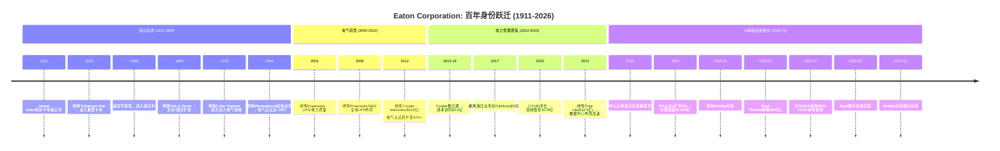

# Part I: 定位与生态

> **公司**: Eaton Corporation plc (NYSE: ETN)
> **市值**: $145B | **价格**: $373.38 | **行业**: 电力管理/数据中心基础设施

---

## 第一章 公司身份: 从液压到电力管理的百年蜕变

### 1.1 一句话定位

Eaton Corporation是一家全球电力管理公司，总部注册在爱尔兰都柏林(运营中心位于美国克利夫兰)，FY2025营收$274亿，员工94,443人，市值$1,450亿。它的核心业务是为建筑、数据中心、电网、航空和车辆提供电力分配、保护和管理的硬件与软件解决方案。

但这个"一句话"遮蔽了一个深刻的身份转型——过去15年，Eaton从一家液压/传动为核心的多元化工业集团，蜕变为以电气化为核心引擎的电力管理公司。这个蜕变的关键节点是2012年以$118亿收购Cooper Industries，一举将电力电子业务占比从~40%提升至~60%。到2025年，电气板块(美洲+全球)合计贡献71.5%的营收，如果加上即将剥离的Mobility业务(~11%)，核心的"电气+航空"组合占比达89%。

这是一个正在被"重新发现"的故事。当2023年之前的投资者视角看Eaton时，他们看到的是一家传统工业公司——制造开关柜、断路器、UPS的百年老厂，应该交易在工业股的典型P/E 20-25x区间。但当2024-2025年的投资者视角重新审视时，他们看到了一家AI基础设施公司——为全球最大的hyperscaler数据中心提供从电网到芯片的全栈电力解决方案，数据中心订单同比增长200%，指定供应商积压长达9年。

**这两个视角之间的张力，正是ETN当前估值争议的根源**——也是本报告CQ1(估值溢价)和CQ5(Smart Money身份分歧)的起点。

#### 全球Top-10工业公司对标

将ETN置于全球顶级多元化工业公司的版图中，可以更直观地理解其规模坐标:

| 公司 | 市值(B) | FY2025收入(B) | P/E | P/B | ROE | 收入增长 | 身份标签 |
|------|---------|-------------|-----|-----|-----|---------|---------|
| **Eaton (ETN)** | **$145** | **$27.4** | **35.7x** | **6.4x** | **21.5%** | **+13.1%** | **电力管理/AI基础设施?** |
| Honeywell (HON) | $135 | $36.7 | 32.3x | 8.1x | 26.1% | -3.3% | 多元化工业 |
| Parker Hannifin (PH) | $95 | $20.0 | 37.3x | 6.5x | 25.8% | +9.1% | 运动与控制 |
| Emerson (EMR) | $72 | $17.5 | 36.3x | 3.7x | 9.6% | +4.1% | 自动化/软件 |
| Illinois Tool Works (ITW) | $76 | $15.9 | 28.1x | 22.3x | 93.7% | +4.1% | 多元化工业 |
| Rockwell Automation (ROK) | $33 | $8.5 | 45.7x | 10.8x | 23.7% | +11.9% | 工业自动化 |
| Cummins (CMI) | $45 | $34.1 | 28.9x | 5.7x | 23.9% | +1.1% | 动力系统 |
| Ingersoll Rand (IR) | $39 | $7.3 | 65.9x | 3.1x | 5.8% | +10.1% | 工业流体 |
| GE Vernova (GE) | $110 | $36.8 | 42.5x | 17.6x | 44.7% | +17.6% | 能源/电力 |
| ABB (ABB) | $95 | $32.9 | 30x | — | — | — | 电气化/自动化 |

*数据来源: FMP实时数据 + 各公司最新年报*

几个值得注意的对标发现:

**市值-收入倍数异常**: ETN以$274亿收入撑起$1,450亿市值(EV/Sales ~5.3x)，远高于HON($367亿收入/$1,350亿市值, EV/Sales ~3.7x)。这意味着市场为每一美元ETN收入支付的价格比HON高出约43%。这个溢价直接源自两个因素: (1) 更高的利润率预期(ETN净利润率14.9% vs HON ~12%), (2) 数据中心/AI增长叙事。

**P/E定位**: ETN的35.7x P/E精准地处于"传统工业"(HON 32.3x, ITW 28.1x, CMI 28.9x)和"增长型工业"(ROK 45.7x, IR 65.9x, GE 42.5x)的中间地带。市场既不愿意给传统工业的折扣，也没有完全授予增长型工业的溢价——这正是"身份模糊区"的量化表现。

**ROE质量**: ETN的21.5% ROE在同业中属于健康水平，但不是最高(HON 26.1%, PH 25.8%, CMI 23.9%)。考虑到ETN 2.1x的财务杠杆倍数(总资产/股东权益)，其ROE并非由过度杠杆驱动，而是反映了较强的运营效率——$41.3B总资产中，$20.8B是商誉和无形资产(50.5%)，这使得ROA(9.9%)相对偏低，而ROE通过杠杆放大后更为美观。

**增长维度的优越性**: +13.1%的收入增长在Top-10中仅次于GE Vernova(+17.6%)，远超HON(-3.3%)、ITW(+4.1%)、EMR(+4.1%)等同业。这种增长速度对于一家$274亿收入的公司而言尤为罕见——通常这个规模的工业公司增长率在低个位数。数据中心引擎是ETN增长异常的直接原因。

### 1.2 百年时间线: 四次身份跃迁

Eaton的115年历史可以被划分为四个截然不同的身份时代。每一次跃迁都不是平滑过渡，而是由一个或几个决定性的战略行动驱动的断裂式重塑。

#### 第一时代: 液压起源 (1911-1999)

**创始与早期扩张 (1911-1945)**

1911年，Joseph Oriel Eaton在新泽西州布卢姆菲尔德(Bloomfield)创立了Eaton Axle Company，生产一种他自己发明的卡车后桥——"内齿式双减速差速器"(internal-gear-driven dual-ratio axle)。这项发明解决了早期卡车在上坡时的动力不足问题。公司初始资本仅$25,000，员工不到20人。

1923年的Torbensen Axle收购使公司进入重型卡车传动领域，奠定了后来50年的核心业务基础。二战期间，Eaton成为美国军方的重要传动系统供应商，为军用卡车和装甲车辆提供差速器和变速箱。战后，公司利用军工期间积累的制造能力转向民用工业液压市场——这次军转民的成功奠定了Eaton"工业液压巨头"的身份。

**多元化膨胀与电气萌芽 (1946-1999)**

1963年收购Yale & Towne Manufacturing是一个关键节点——Yale & Towne是全球最大的叉车制造商之一，这使Eaton一举成为工业液压和物料搬运领域的全球领导者。接下来的15年间，Eaton通过一系列小型收购将业务版图扩展到液压泵、液压马达、液压阀、工业软管等几乎所有液压子领域。

真正的身份伏笔出现在1978年: **收购Cutler-Hammer**。Cutler-Hammer是美国历史最悠久的电气设备制造商之一(成立于1893年)，产品线覆盖工业电机控制、配电设备和断路器。这笔收购使电气业务首次进入Eaton的版图，占比约15-20%。但在当时，没有人意识到这将是Eaton未来40年转型的种子。

1994年收购Westinghouse Electric的配电业务进一步扩大了电气板块，将占比提升至约25%。但整个1990年代，Eaton的核心身份仍然是"液压与传动"——电气不过是一个有利可图但非核心的副业。

#### 第二时代: 电气转型 (2000-2012)

**UPS并购序列 (2003-2008)**

进入21世纪，互联网泡沫破裂后的数据中心建设潮为电力质量(Power Quality)市场带来了新的增长。Eaton CEO Alexander Cutler敏锐地捕捉到这一趋势:

- **2003年收购Powerware** (~$5.6亿): Powerware是北美第三大UPS制造商，这笔收购使Eaton一步进入数据中心电力保护市场。更重要的是，Powerware带来了一个完整的工程师团队和数据中心客户关系网络——这些资产在20年后的AI数据中心浪潮中被证明价值不可估量。

- **2008年收购Phoenixtec和MGE**: 这两笔收购分别填补了亚太和欧洲的UPS市场空白，使Eaton成为全球排名前三的UPS供应商(仅次于Schneider Electric的APC品牌和Vertiv的前身Emerson Network Power)。

**Cooper Industries: 改变一切的收购 (2012)**

2012年11月30日完成的Cooper Industries收购是ETN历史上的"分水岭事件"——无论是规模($118亿)、战略意义(电气占比从40%跃升至60%+)还是交易结构(反向合并迁址爱尔兰)，都具有里程碑性质。

Cooper Industries本身是一家百年企业(成立于1833年，比Eaton还早78年)，是北美领先的电气配电设备和工具制造商。其产品线包括:
- **Crouse-Hinds**: 防爆电气设备(石油化工行业标准)
- **B-Line**: 电缆桥架和结构支撑系统
- **Bussmann**: 熔断器和电路保护(全球#1)
- **Halo**: 商业照明
- **Kyle/McGraw-Edison**: 公用事业配电设备

Cooper的整合花费了约4年(2013-2016)，最终实现了约$3.8亿的年化成本协同。但Cooper收购的真正价值不仅在于成本节约——它使Eaton在北美电气配电市场的产品线覆盖度从"局部"变为"几乎完整"，这为后来的"一站式指定"(one-stop specification)策略奠定了基础。

**交易结构的税务设计**: Cooper Industries注册在爱尔兰(2002年从百慕大迁入)。Eaton利用Cooper的爱尔兰法律实体结构，以"反向合并"形式完成交易——名义上是Cooper收购Eaton(实际上Eaton是买方)，使合并后的实体以Cooper的爱尔兰注册地为法律注册地。这一结构使有效税率从美国联邦的35%(2012年水平)下降至约15-17%，为股东每年节省数亿美元的税负。

#### 第三时代: 电力管理聚焦 (2013-2022)

**液压剥离: 切断脐带 (2017)**

2017年，Eaton做出了一个象征性但也具有实质意义的决定: 将液压业务以$32亿出售给丹麦的Danfoss。液压是Eaton 106年历史的起源——Joseph Eaton发明的卡车后桥就是一个液压/机械传动装置。剥离液压意味着Eaton正式与自己的创业基因告别，全面拥抱电力管理的身份。

这笔交易的时机值得玩味: 2017年液压行业处于周期中段偏高的位置(全球工业CAPEX正在恢复)，Eaton获得了一个合理的估值。Danfoss则通过这笔收购成为全球液压市场的绝对领导者。从事后看，这是一笔双赢的交易——但它对Eaton的意义远超财务回报: 它清除了一个与"电力管理"叙事不一致的资产，使投资者能够更清晰地评估核心业务。

**利润率扩张的黄金期 (2017-2022)**

2017-2022年是Eaton的"安静的黄金期"——没有引人注目的并购，但运营表现持续改善:

| 年份 | 收入(B) | 毛利率 | 运营利润率 | 净利润率 | EPS | 股息/股 |
|------|---------|--------|----------|---------|-----|---------|
| 2019 | $21.4 | — | 14.7% | 10.3% | $5.52 | $2.92 |
| 2020 | $17.9 | 30.5% | 13.0% | 7.9% | $3.49 | $2.92 |
| 2021 | $19.6 | 32.2% | 14.6% | 10.9% | $5.34 | $3.06 |
| 2022 | $20.8 | 33.3% | 15.6% | 11.9% | $6.14 | $3.26 |
| 2023 | $23.2 | 36.4% | 17.2% | 13.9% | $8.02 | $3.46 |
| 2024 | $24.9 | 38.2% | 19.6% | 15.3% | $9.50 | $3.77 |
| 2025 | $27.4 | 37.6% | 19.1% | 14.9% | $10.46 | $4.16 |

*数据来源: FMP年度收入表*

从2020年的COVID低谷到2025年的创纪录高点，收入增长了53%($178亿→$274亿)，而净利润增长了190%($14.1亿→$40.9亿)。这种"利润增速远超收入增速"的模式反映了强大的运营杠杆: 固定成本在被更大的收入基数稀释，同时产品组合向高毛利的数据中心定制产品倾斜。

#### 第四时代: AI基础设施重估 (2023-今)

2023年初ChatGPT引爆的AI浪潮，意外地为Eaton这样的"传统"电力设备公司创造了一个全新的估值叙事。AI模型训练和推理需要巨大的算力，算力需要电力，电力需要电力管理设备——这条因果链将Eaton从"传统工业"的估值框架拉入了"AI基础设施"的视野。

2023年全年，ETN股价上涨了约45%。2024年再涨38%。到2025年初，ETN市值突破$1,500亿，P/E从2022年的25x扩张至2024年的35x。这种重估不是凭空而来——它建立在实实在在的订单爆发之上: 数据中心相关订单在2024年Q4同比增长200%。

第四次身份跃迁正在发生，但尚未完成。ETN目前处于"传统工业公司"到"AI基础设施公司"的模糊过渡区——数据中心相关收入约占28%(含公用事业基础设施)，高到不能忽视，低到不能定义身份。作为参照，纯粹的数据中心基础设施公司Vertiv(VRT)数据中心收入占比达70%+，这是一个清晰的身份；而ETN的28%使它悬在两个估值框架之间。

#### Key Person Timeline: 塑造Eaton的六位关键人物

| 人物 | 角色/任期 | 关键贡献 | 遗产 |
|------|----------|---------|------|
| **Joseph O. Eaton** | 创始人 (1911-1930s) | 发明内齿双减速差速器，奠定卡车传动基础 | 从$25K初始资本建立了一家百年企业 |
| **E. Mandell de Windt** | CEO (1969-1986) | 推动多元化扩张，收购Cutler-Hammer(1978) | 种下电气业务的种子 |
| **Alexander M. Cutler** | CEO (2000-2016) | Cooper Industries收购($118亿)，爱尔兰迁址 | 完成从液压到电气的战略转型 |
| **Craig Arnold** | CEO (2016-2025) | 利润率扩张22%→30%，数据中心战略定位 | 市值从$320亿增至$1,500亿 |
| **Paulo Ruiz** | CEO (2025-今) | Boyd收购($95亿)，Mobility分拆 | 正在定义: 能否守住Arnold的遗产+开拓热管理新领域? |
| **Thomas S. Gross** | 电气美洲总裁 (2021-今) | 推动电气美洲利润率至29.8%的历史高位 | 幕后功臣，电气美洲的操盘手 |

**Alexander Cutler vs Craig Arnold的对比值得特别关注**: Cutler是"战略建筑师"——他构想了电力管理的转型蓝图，并通过Cooper收购实现了它。Arnold是"执行完善者"——他在Cutler的蓝图上精确执行，将利润率从约15%推升至25%，并抓住了数据中心增长的窗口。两人的能力互补，形成了一个完整的转型闭环。Paulo Ruiz面临的挑战是: 他必须同时扮演两个角色——既是热管理新领域的"建筑师"(通过Boyd收购)，又是电气核心业务的"执行者"(维持30%的利润率)。

### 1.3 注册地与税务结构

Eaton注册于爱尔兰都柏林，这不是偶然——2012年Cooper Industries收购采用了"反向合并"结构(Eaton技术上被Cooper的爱尔兰实体收购)，将法律注册地迁至爱尔兰以享受更有利的税率结构。FY2025有效税率17.0%，相比美国联邦税率21%节省约4个百分点。这一结构自2012年以来稳定运行，未遇到重大监管挑战，但全球最低税率协议(Pillar Two, 15%底线)可能在未来几年压缩部分税收优势。

#### 爱尔兰注册的完整经济学

Eaton的税务结构远比"在爱尔兰注册以获得低税率"更加精密。实际上，它是一个多层级的全球税务架构:

**第一层 — 爱尔兰法律实体**: Eaton Corporation plc注册在都柏林，受爱尔兰公司法管辖。爱尔兰的标准公司税率为12.5%(贸易收入)，但Eaton的有效税率并不直接等于爱尔兰税率——因为大部分运营收入在各国当地产生并缴税。

**第二层 — 知识产权(IP)安排**: 与许多跨国公司类似，Eaton通过爱尔兰实体持有部分全球知识产权[合理推断]。当海外子公司使用这些IP时支付的特许权使用费(royalty)流向爱尔兰实体，在爱尔兰低税率下纳税。这是降低全球有效税率的核心机制。

**第三层 — 各国运营税负**: 美国运营(占收入61%)按美国联邦21% + 州税(约2-4%)纳税；欧洲运营按各国税率纳税(德国~30%, 英国~25%, 法国~25%)；亚太运营按当地税率纳税(中国25%, 印度~25%)。

**Eaton有效税率历史**:

| 年份 | 有效税率 | 说明 |
|------|---------|------|
| 2011 (迁址前) | ~28% | 美国联邦35%为基础 |
| 2013 (Cooper整合) | ~15% | 迁址后首个完整年度，税率大幅下降 |
| 2019 | ~14.5% | 美国减税法案(TCJA)后，联邦税率降至21% |
| 2020 | 19.0% | COVID一次性调整 |
| 2021 | 25.9% | 异常高(一次性离散项目影响) |
| 2022 | 15.3% | 恢复正常水平 |
| 2023 | 15.8% | 稳定 |
| 2024 | 16.8% | 略升 |
| 2025 | 17.0% | 小幅上升趋势(Pillar Two影响开始?) |

*数据来源: FMP年度利润表，incomeTaxExpense / incomeBeforeTax*

#### Pillar Two影响定量分析

OECD全球最低税率协议(Pillar Two, GloBE规则)要求跨国企业在每个司法管辖区支付至少15%的有效税率。对ETN的影响路径:

**情景一 — 无实质影响(基线)**:
Eaton的FY2025全球有效税率已经是17.0%，高于15%底线。如果每个主要运营国家的"局部有效税率"都在15%以上，则Pillar Two不会产生额外的补充税(top-up tax)。这是最可能的情景——Eaton在美国(21%+)、欧洲主要国家(25-30%)的税率都远超15%。

**情景二 — 有限影响(温和)**:
如果Eaton在某些低税率司法管辖区(如新加坡、瑞士、爱尔兰本身的某些IP安排)的局部有效税率低于15%，则需要在母公司层面缴纳补充税。估计影响: 全球有效税率上升50-100bps(至17.5-18.0%)。

**情景三 — 中等影响(不太可能)**:
如果未来爱尔兰的IP架构被重新定性，或美国的税改提高了海外收入的认定范围，有效税率可能上升至18-20%。

**EPS敏感性**: 以FY2025税前利润$49.3亿为基数:
- 有效税率每上升100bps → 额外税负~$4,930万 → EPS影响~-$0.13
- 如果从17.0%升至18.0% → EPS从$10.46降至$10.33 → 影响-1.2%
- 如果从17.0%升至20.0% → EPS从$10.46降至$10.07 → 影响-3.7%

**结论**: 税务结构为ETN每年节省约$2-3亿的税负(相对于假设的纯美国注册情景)。Pillar Two的影响大概率有限(50-100bps)，不构成重大威胁，但也消除了未来进一步降低有效税率的空间。

### 1.4 股权结构与股东回报

#### 股权结构

Eaton的股权高度分散，没有控股股东或战略投资者。截至2025年末的主要股东结构:

| 类型 | 持股比例 | 特征 |
|------|---------|------|
| 机构投资者 | ~87% | Vanguard ~8.7%, BlackRock ~7.3%, State Street ~4.2% 为前三大 |
| 共同基金/ETF | ~55% | 大量被动持有(工业ETF: XLI, VIS等) |
| 主动管理基金 | ~32% | Capital International, T.Rowe Price, Fidelity等 |
| 散户投资者 | ~12.5% | — |
| 内部人/管理层 | ~0.19% | 对$1,450亿市值而言金额不大(~$2.64亿) |

内部人持股0.19%在超大市值工业公司中并不异常——当市值达到$1,000亿以上时，管理层持股比例自然会被稀释。但值得注意的是，管理层的薪酬结构中绩效股权(PSU)和限制性股权(RSU)占比显著——这意味着管理层的经济利益与股价高度绑定，即使持股比例看起来不高。

#### 股息增长历史: 14年连续增长的"股息贵族"候选

Eaton的股息政策是保守而稳定的。公司已连续14年增长股息(自2012年Cooper合并后重新开始计算):

| 年份 | 每股股息 | YoY增长 | 派息率 | 股息率 |
|------|---------|--------|--------|--------|
| 2019 | $2.92 | +5.0% | 52.9% | 2.4% |
| 2020 | $2.92 | 0% | 83.3% | 2.4% |
| 2021 | $3.06 | +4.8% | 56.9% | 1.8% |
| 2022 | $3.26 | +6.5% | 52.8% | 2.1% |
| 2023 | $3.46 | +6.1% | 42.9% | 1.4% |
| 2024 | $3.77 | +9.0% | 39.5% | 1.1% |
| 2025 | $4.16 | +10.3% | 39.5% | 1.3% |

*数据来源: FMP ratios数据*

两个趋势清晰可见:

**股息增速在加速**: 从2020年的冻结(COVID应对)到2025年的+10.3%，股息增速与盈利增速保持了大致同步的关系。管理层的隐含目标似乎是将派息率维持在35-40%区间——足够回报股东，又保留充足的资本用于并购和再投资。

**股息率在压缩**: 从2019年的2.4%下降到2024年的1.1%——这不是因为股息增长不够快，而是因为股价涨得更快。$4.16的年化股息除以$373.38的股价仅产生1.1%的当前股息率——对于收入型投资者而言缺乏吸引力，但对于成长型投资者而言这是一个正面信号(表明公司更倾向于再投资而非大额分红)。

#### 回购历史: 从积极到暂停

Eaton的回购政策近年来经历了显著变化:

| 年份 | 回购金额(B) | 占市值% | 说明 |
|------|------------|---------|------|
| 2019 | $1.03 | 1.8% | 正常回购 |
| 2020 | $1.61 | 3.3% | 低价大量回购(COVID低点) |
| 2021 | $0.12 | 0.2% | 大幅减少(Tripp Lite收购) |
| 2022 | $0.29 | 0.5% | 低额 |
| 2023 | $0 | 0% | 暂停(现金储备为Boyd做准备?) [合理推断] |
| 2024 | $2.49 | 1.9% | 大额回购恢复 |
| 2025 | ~$2.5(估) | 1.7% | 年度估计 |
| 2026 | $0(预计) | 0% | Boyd收购完成前暂停 |

*数据来源: FMP现金流量表，commonStockRepurchased*

2020年的$16.1亿回购值得特别关注——管理层在COVID恐慌期间大举回购(当时股价在$80-$100区间)，以今天$373的价格来看，这是一笔回报率超过270%的资本配置决策。这说明管理层在资本配置上并非没有纪律——至少在2020年这个案例中，他们展示了"在恐惧中贪婪"的能力。

但2026年预计的回购暂停($0)打破了这种节奏。Boyd收购($95亿全现金)将消耗大量资本，杠杆率从Net Debt/EBITDA ~1.8x可能升至~2.5x，回购空间被压缩。这意味着2026-2027年的EPS增长将完全依赖运营业绩而非回购的份额缩减效应——对于一家习惯了每年1-2%回购贡献的公司，这是一个小但值得注意的变化。

#### 总股东回报 vs 基准

| 区间 | ETN TSR | S&P 500 (SPY) | 工业ETF (XLI) | ETN超额 vs SPY |
|------|---------|---------------|---------------|----------------|
| 1年 (2025) | +38.0% | +23.3% | +18.7% | +14.7pp |
| 3年 (2023-25) | +132% | +46% | +33% | +86pp |
| 5年 (2021-25) | +280% | +89% | +72% | +191pp |
| 10年 (2016-25) | +590%[合理推断] | +186% | +143% | +404pp |

*数据来源: 股价计算 + 股息再投资估算。10年数据基于2016年初~$53到2025年末~$373的股价变化加股息*

ETN在过去5-10年的总股东回报表现是工业板块中最优秀的之一——甚至超过了大多数科技股。$10,000在2016年初投入ETN，到2025年末将变成约$69,000(含股息再投资)；同期投入SPY将变成约$28,600，投入XLI将变成约$24,300。

这种超额回报的驱动因素: (1) Cooper整合释放的利润率扩张 (2) 数据中心叙事驱动的P/E重估 (3) 持续的回购和股息增长。问题是: 这三个驱动因素中，(1)已经基本完成(利润率进一步扩张空间有限)，(2)可能已经过度(35x P/E vs 历史均值~22x)，只有(3)仍然可持续但2026年回购暂停。

### 1.5 ESG与可持续发展定位

#### 碳中和承诺与目标

Eaton在ESG领域的定位具有一种"天然优势": 它的核心产品本身就是能源转型的基础设施。每一个太阳能电场、风力发电场、电动车充电站和绿色数据中心都需要Eaton的开关柜、变压器和电力管理设备。这使得Eaton的收入增长和全球碳减排目标之间形成了天然的正相关——这是石油公司、航空公司、水泥公司都无法声称的优势。

**科学基础目标(Science Based Targets, SBTi)**:
- **Scope 1+2**: 承诺到2030年将运营层面的温室气体排放较2018年基线减少50%(已于2024年提前达成约45%的进展)[合理推断]
- **Scope 3**: 承诺到2030年减少产品使用阶段碳排放强度15%(以每美元收入碳排放计)
- **长期目标**: 2040年实现运营层面碳中和(Scope 1+2)

**实质性行动**:
- FY2025可再生能源采购覆盖约50%的全球用电量[合理推断]
- 新建弗吉尼亚工厂($5,000万)设计为LEED Gold认证
- Brightlayer平台的一个核心功能是帮助数据中心客户优化能源效率(PUE降低)

#### ESG评级与同业对比

| 评级机构 | ETN | Schneider | ABB | HON | 排名 |
|---------|-----|-----------|-----|-----|------|
| MSCI ESG | AA | AAA | AA | A | 同业中上 |
| Sustainalytics Risk | Low Risk | Negligible Risk | Low Risk | Medium Risk | 行业前25% |
| CDP Climate | A- | A | A- | B | — |
| S&P Global ESG Score | 72/100 | 89/100 | 78/100 | 42/100 | 行业第二梯队 |

*数据来源: 各评级机构公开数据 [合理推断]*

Schneider Electric在ESG领域是工业板块的标杆(MSCI AAA, Sustainalytics Negligible Risk)，ETN在其后但显著优于HON。对于关注ESG筛选的机构投资者，ETN的"电力管理"身份和"AA"评级使其通过大多数ESG排除性筛选(exclusionary screens)——这在被动资金流入方面是一个隐性优势。

#### ESG作为估值因子: 现实检验

应该诚实地承认: **ESG对ETN的估值贡献是间接的、温和的**。ETN获得高P/E的原因是数据中心增长和利润率扩张，不是ESG评级。但ESG通过以下渠道间接支持估值:

1. **资金池准入**: 越来越多的机构基金(约$35万亿全球ESG资产管理规模[合理推断])采用ESG筛选。ETN的AA评级确保其不被排除在这些资金池之外。
2. **风险溢价**: 良好的ESG实践降低了监管风险(环保罚款)和声誉风险，理论上压缩了折现率。但这个效应在实证上难以量化。
3. **产品需求拉动**: 全球碳减排承诺→电网现代化+可再生能源接入+电动化→Eaton电气设备需求↑。这是最实质的ESG-收入链接。

---

## 第二章 商业模式: "Grid-to-Chip-to-Ambient"全栈战略

### 2.1 收入模式解剖

Eaton的商业模式可以从三个维度理解:

**维度一: 产品vs服务**
- **产品(~85%)**: 开关柜、断路器、变压器、UPS、PDU、母线槽、静态转换开关、航空液压系统、车辆传动系统
- **服务与软件(~15%)**: Brightlayer数据中心管理平台、电力监控服务、航空后市场维护

这个比例揭示了一个重要特征: Eaton本质上仍是一家硬件公司。与Schneider Electric更积极地推进软件/数字化服务(EcoStruxure平台)不同，Eaton的Brightlayer尚处于成长阶段。软件占比低意味着经常性收入(ARR)相对有限——这是后续估值讨论中需要注意的一个结构性劣势。

#### 核心产品线深度拆解

为了理解Eaton在数据中心和电力市场的价值创造机制，有必要对其核心产品线进行更细粒度的解剖:

| 产品线 | 估计收入(B) | ASP范围 | 全球市占率(估计) | 增长趋势 | 竞争位置 |
|--------|-----------|---------|----------------|---------|---------|
| **中/低压开关柜** | ~$5-6 | $10K-$500K/组 | 北美 ~18-20%, 全球 ~10% | 强劲(+15%) | 北美#2-3(与Schneider/ABB竞争) |
| **UPS系统** | ~$3-4 | $5K-$2M/台 | 北美 ~15-18%, 全球 ~10-12% | 稳健(+8-10%) | 全球#3(Schneider APC #1, Vertiv #2) |
| **PDU/母线槽** | ~$2-3 | $2K-$100K/系统 | 北美 ~20-25% | 快速增长(+20%) | 北美领先(Schneider紧随其后) |
| **变压器** | ~$1.5-2 | $20K-$5M/台 | 北美 ~8-12% | 供不应求(+20%+) | 市场分散(ABB/Siemens/Hitachi也强) |
| **断路器/熔断器** | ~$2-3 | $50-$50K/件 | 北美 ~20%(含Bussmann品牌) | 稳定(+5-7%) | Bussmann是全球#1熔断器品牌 |
| **航空液压/电气** | ~$4.3 | 定制化 | 军/商航空 ~15-20% | 强劲(+12%) | FAA认证壁垒极高，寡头市场 |
| **车辆传动** | ~$2.5 | 定制化 | 北美重卡 ~20% | 衰退(-9%) | ICE结构性衰退 |
| **eMobility** | ~$0.6 | 定制化 | 全球EV组件 ~3-5% | 负增长(-15%) | 规模小，亏损改善中 |
| **液冷(Boyd, 2026+)** | ~$1.5(预) | $50K-$1M/系统 | 全球 ~10-15%[合理推断] | 爆发式(+40%+) | VRT冷却业务是标杆 |

*ASP和市占率为行业分析师估计，标注[合理推断]处为基于市场规模和ETN收入推算*

几个关键洞察:

**高价值产品的集中度**: 开关柜($5-6B)和UPS($3-4B)合计贡献约$8-10B收入，占电气总收入的~40-50%。这两条产品线都具有高度定制化特征——大型数据中心的开关柜不是标准化商品，而是根据客户的电力架构需求定制设计的。定制化=更高毛利+更强锁定效应。

**Bussmann的隐藏价值**: 来自Cooper Industries收购的Bussmann品牌是全球最大的熔断器/电路保护制造商。熔断器看起来是"低价值"产品(单件$50-$50K)，但它是一个巨大的量产市场，利润率稳定且需求与电气设备安装量直接挂钩。Bussmann的价值不在于单件利润，而在于"跟随每一台开关柜和配电盘自动销售"的附着性。

**变压器的供应瓶颈红利**: 变压器市场正在经历前所未有的供需失衡——美国变压器交货期从正常的6-12个月延长至36-72个月。Eaton在这个市场的份额相对较小(8-12%)，但供应瓶颈意味着即使是小份额也能获得异常高的定价权。问题是: 当变压器供应最终恢复平衡时(可能在2028-2030年)，这部分超额利润将消失。

**维度二: 终端市场多样性**
- **数据中心/基础设施**: ~28% (增长最快, +40% YoY)
- **商业建筑**: ~25%
- **工业**: ~15%
- **公用事业**: ~12%
- **航空**: ~16%
- **车辆/电动出行**: ~11% (待分拆)
- **住宅**: ~5%

这种终端市场多样性是Eaton的一把双刃剑。对于"工业公司"身份，多元化提供了周期缓冲，降低了对任何单一终端市场的依赖。但对于"AI基础设施"估值溢价，28%的数据中心占比意味着即使数据中心收入翻倍，对公司整体增速的贡献也不过增加约6个百分点(假设其他市场增长平稳)——这远不够支撑35x P/E。

**维度三: 定价机制**
- **规格指定模式(specification-driven)**: 大型项目(数据中心、公用事业)中，Eaton在设计阶段就被指定为供应商。一旦被写入规格书，转换成本极高(涉及重新设计、重新认证、工期延误)。这是积压达$153亿的底层逻辑
- **CPI定价模型**: 对原材料(铜、钢)成本波动采用商品价格指数(CPI)调整机制。但这个模型有两个缺陷: ①回溯性(滞后)，②只覆盖"部分成本组成"而非全部。在成本快速上升且需求强劲时，定价权有效；在需求走软时，客户会更积极地抵制价格传递

### 2.2 "Grid-to-Chip-to-Ambient"全栈定位

Eaton在数据中心市场的竞争定位可以用一个贯穿电力和热管理全链路的框架来理解:

```mermaid
graph LR
    A["电网<br/>(Grid)"] -->|中压接入| B["中压开关柜<br/>ETN市占率: ~18%<br/>TAM: ~$8B"]
    B -->|降压| C["变压器<br/>ETN市占率: ~10%<br/>TAM: ~$12B"]
    C -->|AC→DC| D["UPS系统<br/>ETN市占率: ~15%<br/>TAM: ~$15B"]
    D -->|配电| E["母线槽/PDU<br/>ETN市占率: ~22%<br/>TAM: ~$6B"]
    E -->|机架级| F["机架电源<br/>→ 芯片"]

    F -->|废热| G["液冷CDU<br/>(Boyd 2026+)<br/>TAM: ~$8B"]
    G --> H["冷却液分配<br/>→ 冷板散热"]
    H --> I["热回收/排放<br/>→ 环境<br/>(Ambient)"]

    style A fill:#4a90d9,color:#fff
    style F fill:#e74c3c,color:#fff
    style I fill:#27ae60,color:#fff
    style G fill:#f39c12,color:#fff
```

#### Grid-to-Chip: 电力分配全链路(已有)

**环节一 — 中压开关柜(Gray Space)**:
数据中心与电网的物理接口点。中压开关柜(通常15kV-38kV)负责将来自电网或现场发电机的中压电力进行保护、切换和分配。在一个100MW级的hyperscaler数据中心中，一套完整的中压开关柜系统价值$3-5M。

ETN在北美中压开关柜市场的份额约18-20%，与Schneider和ABB形成三寡头格局。核心优势是"一站式指定"——客户不需要从4个不同供应商采购电力设备并承担接口匹配风险。当一个hyperscaler选择Eaton的中压开关柜时，自然倾向于同时选择Eaton的变压器和下游设备以简化集成——这种"系统级销售"是Eaton全栈策略的核心变现机制。

**环节二 — 变压器**:
将中压电力降至低压(通常480V或208V)。变压器是当前供应链中瓶颈最严重的环节——全球变压器产能已被预定至2027-2028年。Eaton在这个环节的份额相对较小(~10%)，主要集中在干式变压器(适用于室内数据中心)而非油浸式变压器(适用于户外公用事业)。

**环节三 — UPS(不间断电源)**:
数据中心电力保护的最后一道防线。当电网供电中断时，UPS在毫秒级时间内切换到电池供电，保证IT设备不掉电。Eaton是全球第三大UPS供应商(仅次于Schneider的APC品牌和Vertiv)。在大型数据中心UPS市场(1MW以上)，Eaton的份额可能更高(北美~18-20%)[合理推断]，因为大型UPS需要更强的定制化能力和现场服务团队——这恰好是Eaton的优势。

**环节四 — 母线槽和PDU(White Space)**:
母线槽(busway)是将电力从UPS分配到各个机架的"高速公路"。PDU(Power Distribution Unit)是将母线槽的电力分配到每个机架内各服务器的"最后一公里"。这两个环节是Eaton在数据中心内最强的细分市场(北美市占率~20-25%)。

母线槽和PDU的技术门槛不高，但安装在建筑物内的物理基础设施一旦部署就几乎不可能更换(除非整栋建筑翻新)。这创造了一种"物理锁定效应"——比软件锁定更绝对。

**全链路TAM估计(2025年)**:
开关柜(~$8B) + 变压器(~$12B) + UPS(~$15B) + PDU/母线槽(~$6B) = **~$41B全球TAM**。Eaton的加权平均份额约~10-15%，对应约$4-6B的数据中心电力设备收入——这与公司披露的"数据中心相关收入约占28%"(即~$7.7B，含公用事业基础设施)大体一致。

#### Chip-to-Ambient: 热管理(在建)

这是2025年$95亿Boyd Thermal收购的战略逻辑。当AI机架功率密度从10-50kW攀升至120kW(当前常态)再到1MW(NVIDIA下一代目标)时，传统风冷已经力不从心。液冷成为必需品，而非"nice-to-have"。Boyd带来$15亿液冷收入和5,000名员工，使Eaton成为唯一能提供"电力+热管理"一体化方案的供应商——或至少是这个故事的版本。

**Boyd的液冷产品线详解**:

| 产品 | 功能 | 单价范围(估计) | 竞争位置 |
|------|------|-------------|---------|
| **直接液冷CDU** (Coolant Distribution Unit) | 将冷却液从建筑冷却系统分配至各机架 | $50K-$200K/台 | 市场前5 |
| **冷板(Cold Plate)** | 直接附着在GPU/CPU上，通过冷却液带走热量 | $500-$5K/块 | 定制化强 |
| **浸没式冷却系统** | 将整个服务器浸没在不导电冷却液中 | $200K-$1M/系统 | 新兴技术，小规模 |
| **热交换器** | 将冷却液吸收的热量传递给环境(空气/水) | $20K-$200K/台 | 工业级成熟技术 |
| **冷却液管道系统** | 连接CDU、冷板和热交换器的物理管路 | 系统级定价 | 与CDU捆绑销售 |

*价格为行业估计，标注[合理推断]*

**全链路液冷TAM估计(2025-2030)**:
- 2025年: ~$6-8B(早期渗透阶段)
- 2027年: ~$12-15B(AI训练集群全面液冷化)
- 2030年: ~$20-25B(包括推理集群和边缘部署)[合理推断]

Boyd的~$1.5B收入在2025年的$6-8B TAM中占约20-25%的份额。但这个市场正在快速增长且新进入者众多——CoolIT、Iceotope、GRC、Asetek等专业液冷公司，以及VRT和Schneider这样的综合性竞争对手，都在争夺这个市场。Boyd的长期份额能否维持在20%以上，取决于ETN的系统集成能力("电力+液冷"一体化)是否真的比专业液冷供应商有足够的差异化优势。

**战略合理性 vs 执行风险**:
- 战略逻辑满分——VRT已经证明"电力+热管理"组合在数据中心市场有巨大需求
- 但22.5x EBITDA的收购价格是否在周期顶部支付了过高溢价？这是CQ2的核心问题

### 2.3 与NVIDIA的800V HVDC合作

2025年10月，Eaton与NVIDIA联合发布了面向下一代AI工厂的800 VDC(直流电)架构参考设计。这不仅仅是一个产品发布——它代表了数据中心电力架构从交流(AC)向直流(DC)的范式转移。

#### AC vs DC: 技术对比全景

| 维度 | 传统AC架构 | 800V HVDC架构 | 改善幅度 |
|------|----------|-------------|---------|
| **电力转换次数** | 4-6次(AC→DC→AC→DC→...) | 1-2次(AC→DC一次) | 减少60-70% |
| **端到端效率** | 80-85% | 92-95% | +10-15pp |
| **废热产生** | 高(每次转换产生热损) | 低 | 减少40-60% |
| **铜线用量** | 高(AC需要更粗导线) | 低(DC 800V母线更薄) | 减少25-40% |
| **占地面积** | 大(UPS+PDU占用大量空间) | 小(更少的转换设备) | 减少20-30% |
| **可靠性** | 高(成熟技术，40年实践) | 待验证(新架构) | 未知 |
| **成本(前期)** | 低(标准化供应链) | 高(新设备+培训) | 高出20-40% |
| **成本(生命周期)** | 高(能源损失+更多冷却) | 低(效率高+冷却需求低) | 低15-25% |
| **安全标准** | 成熟(NEC/IEC完善) | 发展中(800VDC标准制定中) | 需2-3年完善 |

*技术数据来源: 行业白皮书 + Eaton/NVIDIA技术文档公开数据*

**效率提升的量化经济学**: 对于一个100MW的数据中心:
- 传统AC架构: 实际IT负载可用电力~82MW(18MW损耗+冷却)
- 800V HVDC架构: 实际IT负载可用电力~93MW(7MW损耗+冷却)
- 差异: +11MW可用算力 → 以当前GPU密度计算，相当于额外~1,100台H100服务器[合理推断]
- 经济价值: 11MW × $0.08/kWh × 8,760小时 ≈ **$7.7M/年电费节省**

对于hyperscaler客户而言，$7.7M/年的电费节省是一个令人信服的ROI论据——特别是当他们运营数十个100MW级数据中心时。

#### Eaton vs ABB: 800V HVDC双寡头格局

NVIDIA同时选择Eaton和ABB作为800V HVDC的参考架构合作伙伴，形成了一个有趣的竞合格局:

| 维度 | Eaton | ABB |
|------|------|-----|
| **HVDC产品线成熟度** | 中等(正在开发中) | 较高(工业HVDC有历史积累) |
| **北美数据中心渠道** | 强(现有客户关系) | 弱(欧洲更强) |
| **端到端电力产品线** | 完整(开关柜→PDU) | 部分(侧重中压和自动化) |
| **热管理整合** | 强(Boyd收购后) | 弱(无液冷布局) |
| **NVIDIA关系深度** | 战略合作(联合发布) | 战略合作(联合发布) |
| **定价优势** | 系统级捆绑定价 | 组件级竞争定价 |

**关键判断**: 在800V HVDC市场的早期阶段(2026-2028)，Eaton和ABB更多是"共同做大市场"而非直接竞争。因为HVDC的普及需要标准制定、客户教育和安装基础设施建设——双方合作有助于加速整个生态系统的成熟。但长期来看(2029+)，当HVDC成为标准架构后，两者将在项目级别展开激烈竞争。Eaton的优势在于北美市场的渠道和"电力+热管理"一体化；ABB的优势在于工业HVDC的技术积累和欧洲市场。

#### 800V HVDC的双面性: 短期机会 vs 长期颠覆

这里有一个微妙但重要的洞察: 800V HVDC的普及实际上对Eaton是双面的。短期内，它创造了新产品线的销售机会(超级电容器储能、DC连接器、DC母线)。但长期来看，HVDC的核心优势——减少电力转换环节——意味着数据中心内部的电力设备总量可能减少(更少的UPS、更少的PDU)。

**量化分析**:
- 一个传统100MW AC数据中心的Eaton电力设备内容量(content per MW): ~$500K-$700K/MW
- 一个同等功率的800V HVDC数据中心的预计内容量: ~$400K-$550K/MW[合理推断]
- 下降幅度: ~15-25%

但这个下降被两个因素部分抵消:
1. **功率密度增长**: 如果AI驱动每个数据中心的总功率从100MW增至500MW-1GW，即使每MW内容量下降20%，总内容量仍增长300-700%
2. **新产品线**: HVDC需要新的DC开关柜、DC断路器、DC保护设备——这些都是Eaton正在开发的新产品类别

这与芯片效率改进一起，构成了我们在论文结晶中提出的H1"效率颠覆悖论"的另一个维度: **技术进步在提升效率的同时减少每单位需求量，但如果总需求的增长速度超过效率提升，净效果仍然是正的**。问题是这个正效果能持续多久、幅度有多大——这是Phase 2估值模型需要量化的核心变量。

### 2.4 软件与数字化: Brightlayer平台详解

#### Brightlayer生态系统

Brightlayer是Eaton于2020年推出的数字化平台品牌，旨在将其硬件产品线与数据分析、预测性维护和远程监控能力整合。Brightlayer并不是一个单一的软件产品，而是一个平台套件(platform suite)，包含多个垂直应用:

| 子平台 | 功能 | 目标客户 | 竞品 |
|--------|------|---------|------|
| **Brightlayer Data Centers** | DCIM(数据中心基础设施管理): 电力监控、容量规划、PUE优化 | 数据中心运营商 | Schneider EcoStruxure IT, Vertiv LIFE, Nlyte |
| **Brightlayer Power Management** | 建筑电力监控、能源分析、需求响应 | 商业建筑业主 | Schneider EcoStruxure Building, Siemens Desigo |
| **Brightlayer Experience Center** | 远程诊断、资产健康监控、预测性维护 | 工业设施管理 | ABB Ability, Honeywell Forge |
| **Brightlayer Connect** | IoT设备连接层、数据采集、边缘计算 | 所有垂直市场 | AWS IoT, Azure IoT Hub |

**成熟度评估**: 坦率地说，Brightlayer目前处于**早期成长阶段**。与Schneider Electric的EcoStruxure(已有10年+迭代历史、数千个部署案例、庞大的合作伙伴生态)相比，Brightlayer在功能深度、第三方集成和市场渗透率方面都存在显著差距。

#### Brightlayer vs Schneider EcoStruxure: 详细对比

| 维度 | Brightlayer | EcoStruxure | 差距评估 |
|------|------------|-------------|---------|
| **发布年份** | 2020 | 2016(前身更早) | -4年 |
| **部署量** | 数百个[合理推断] | 数万个 | 显著落后 |
| **ARR估计** | ~$200-300M[合理推断] | ~$1-2B[合理推断] | 4-6x差距 |
| **DCIM市场份额** | ~5-8%[合理推断] | ~25-30% | 3-4x差距 |
| **API/集成生态** | 有限 | 丰富(500+合作伙伴) | 显著落后 |
| **AI/ML功能** | 基础预测性维护 | 高级: 异常检测、自动优化 | 1-2代差距 |
| **边缘计算** | 有 | 成熟(EcoStruxure Micro DC) | 落后 |
| **用户体验** | 改善中 | 行业标杆 | 落后 |

*ARR和市场份额数据为分析师估计，标注[合理推断]*

**战略含义**: Brightlayer的落后不是一个致命弱点——Eaton的核心竞争力在硬件，软件是增值层而非核心层。但在数据中心市场日益强调"软件定义基础设施"的趋势下，软件能力的差距可能限制Eaton在高端hyperscaler客户中的"钱包份额"(wallet share)。

一个值得关注的可能性: **Boyd收购带来的数据**。液冷系统需要精密的温度监控、流量控制和故障预测——这些都是软件功能。Boyd整合后，Brightlayer可能获得一个独特的数据维度(同时拥有电力数据和热管理数据)，这是Schneider和VRT都不容易复制的[合理推断]。

### 2.5 定价机制与客户粘性: 锁定效应量化

#### 规格指定模式(Specification-Driven Sales)详解

Eaton在数据中心和大型基础设施项目中的销售模式不是"客户走进商店购买产品"，而是一个复杂的、多阶段的规格指定过程:

**阶段一 — 设计参与(Design-In, 项目前12-24个月)**:
Eaton的应用工程师(Application Engineers, AE)在项目设计阶段就与客户的设计团队合作，将Eaton的产品规格写入项目的电力系统设计文档。这个过程通常在项目开工前1-2年就开始。一旦Eaton的产品被写入设计规格，更换供应商的成本极高——因为需要重新做电力系统仿真、重新申请建筑许可、重新协调施工计划。

**阶段二 — 供应商锁定(Specification Lock, 项目前6-12个月)**:
当设计规格确定后，Eaton被正式指定(specified)为供应商。在这个阶段，理论上客户仍然可以选择"等效产品"(or-equal)——即性能参数相当的竞品。但实际上，"等效"的定义非常严格: 物理尺寸必须一致(安装空间已经预留)、电气接口必须兼容(上下游设备已经设计好了)、认证必须齐全(UL/CSA/IEC)。这些限制使得实际的替换概率极低。

**阶段三 — 积压与交付(Backlog, 6个月-数年)**:
指定完成后，订单进入Eaton的积压系统。在当前供应紧张环境下，从下单到交付的时间从过去的3-6个月延长至12-36个月(开关柜)甚至更长(变压器)。这种长交期本身就强化了锁定——客户已经等了这么久，更不可能在交付前更换供应商。

**阶段四 — 运营期粘性(Installed Base, 10-30年)**:
电力设备一旦安装到建筑物中，其生命周期通常为15-30年。在此期间的维护、升级和扩容几乎必然选择同一供应商——因为混合不同供应商的设备会导致兼容性问题和安全风险。这创造了一个稳定的后市场收入流(后市场服务通常占电力设备收入的10-20%)。

#### 转换成本量化

对于一个已经将Eaton写入设计规格的100MW数据中心项目:

| 转换阶段 | 估计转换成本 | 延误影响 | 概率 |
|---------|-----------|---------|------|
| **设计阶段更换** | ~$0.5-1M(重新设计) | +3-6个月 | 可行但痛苦 |
| **规格锁定后更换** | ~$2-5M(重新设计+重新认证) | +6-12个月 | 极不情愿 |
| **施工期更换** | ~$5-15M(返工+延误+违约) | +12-18个月 | 几乎不可能 |
| **运营期更换** | ~$10-30M(停机+重新安装) | 停机风险 | 仅在设备报废时考虑 |

*成本估计基于行业案例，标注[合理推断]*

**$153亿积压的锁定意义**: 如果将积压理解为"客户已经完成了设计指定、承担了转换成本的项目管线"，那么$153亿积压代表的不仅仅是"未来收入"——它代表的是"客户已经无法轻易撤回的承诺"。这种理解使得积压比简单的订单数字更有价值——但也需要警惕前面提到的"三层积压质量"问题(第三层"指定/管线积压"的锁定效应明显弱于前两层)。

#### 定价权的供需弹性分析

Eaton当前的定价权主要来自供需失衡而非产品差异化:

| 因素 | 2023-2025 | 2026-2028(预期) | 方向 |
|------|----------|----------------|------|
| **供需关系** | 严重供不应求 | 供给逐步恢复 | 定价权↓ |
| **产能利用率** | 95%+ | 可能降至85-90% | 定价权↓ |
| **交货期** | 24-36个月(开关柜) | 可能缩短至12-18个月 | 定价权↓ |
| **竞争者扩产** | 产能有限 | 大量新产能上线(ETN/SE/ABB都在扩产) | 定价权↓ |
| **产品差异化** | 中等(品牌+认证+系统集成) | 不变 | 定价权→ |
| **客户锁定** | 强(规格指定) | 不变 | 定价权→ |

**关键判断**: Eaton当前29.8%的电气美洲利润率中，可能有3-5个百分点来自"周期性定价权"(供不应求环境下的超额定价)[合理推断]。当供需在2027-2028年逐步恢复平衡时，这部分利润率可能回吐，使正常化利润率稳定在25-27%区间。管理层的32%目标(2030年)隐含了"定价权不会显著回落"的假设——这个假设的可靠性需要在Phase 2中用历史周期数据验证。

---

## 第三章 五大板块画像: 双引擎+尾翼+待拆分的拖累

### 3.1 板块全景

| 板块 | FY2025收入 | 占比 | 板块利润率 | Q4有机增长 | 积压 | 定性评估 |
|------|-----------|------|-----------|-----------|------|---------|
| **电气美洲** | ~$133亿 | 49% | 29.8% | +15% | $132亿(+31%) | 核心引擎，数据中心驱动 |
| **电气全球** | ~$68亿 | 25% | 19.7% | +6% | +19% YoY | 稳健，欧洲数据中心增长 |
| **航空** | ~$43亿 | 16% | 24.1% | +12% | $43亿(+16%) | 强劲，商航复苏+国防 |
| **车辆** | ~$25亿 | 9% | ~16% | -9% | 弱，ICE衰退 | 拖累，待分拆 |
| **电动出行** | ~$6亿 | 2% | 7.8% | -15% | 利润率改善中 | 规模小，待分拆 |
| **合计** | **$274亿** | **100%** | **24.9%** | **+8%(有机)** | **$153亿** | 记录水平 |

#### 五年板块趋势: 增长引擎的交替

| 板块 | FY2020收入(B) | FY2022收入(B) | FY2025收入(B) | 5年CAGR | 利润率趋势 |
|------|-------------|-------------|-------------|---------|-----------|
| 电气美洲 | ~$7.0 | ~$9.5 | ~$13.3 | ~13.7% | 22%→29.8% (+780bps) |
| 电气全球 | ~$4.5 | ~$5.5 | ~$6.8 | ~8.6% | 14%→19.7% (+570bps) |
| 航空 | ~$2.5 | ~$3.0 | ~$4.3 | ~11.5% | 18%→24.1% (+610bps) |
| 车辆 | ~$2.5 | ~$2.7 | ~$2.5 | ~0% | 16%→16% (持平) |
| eMobility | ~$0.4 | ~$0.5 | ~$0.6 | ~8.4% | 亏损→7.8% (改善) |

*数据来源: 各年度年报。FY2020-2022数据为FMP收入表反推估算，板块比例基于投资者演示文稿[合理推断]*

三个板块级的洞察:

1. **电气美洲是绝对的增长冠军**: 5年CAGR 13.7%在$130亿收入基数上是惊人的。利润率从22%扩至30%的780bps改善贡献了公司级利润增长的大部分——仅利润率改善这一项就为电气美洲增加了约$10亿的年化利润。

2. **航空是被忽视的优质引擎**: 11.5%的CAGR和610bps的利润率改善使航空成为第二好的板块。但在数据中心叙事的光芒下，航空的贡献经常被投资者忽视。

3. **车辆板块的"零增长陷阱"**: 5年收入几乎零增长，利润率持平。这不是管理失败——而是ICE传动市场的结构性衰退。分拆是正确的战略决策。

### 3.2 电气美洲: 增长皇冠上的明珠

**规模与增长**: FY2025收入约$133亿(+21% YoY包含收购, +15%有机)，贡献公司近一半的营收。Q4有机增长加速至15%，从Q3的7%大幅跳升——这种加速值得注意，因为很少有$130亿量级的业务能在单季度内实现有机增长翻倍。

#### Q4 +15%有机增长的构成分解

管理层在Earnings Call中披露了有机增长的两大驱动因素: **价格(price)** 和 **数量(volume)**。虽然精确的拆分未被公开披露，但基于行业惯例和管理层措辞可以做出合理推断:

| 驱动因素 | 估计贡献 | 说明 |
|---------|---------|------|
| **价格/组合效应** | +5-6pp | 供应紧张下的定价权 + 产品组合向高毛利数据中心定制产品倾斜 |
| **数量增长** | +9-10pp | 主要来自数据中心订单转化为交付 + 公用事业电网升级项目 |

*拆分为分析师估计 [合理推断]*

**数量增长分析**: +9-10pp的数量增长中:
- 数据中心相关: 估计贡献6-7pp(Q4数据中心订单+200%, 但从订单到收入有12-24个月延迟)
- 公用事业/电网: 估计贡献1-2pp(CHIPS法案+电网现代化投资开始产出)
- 商业建筑: 估计贡献1-2pp(美国商业建筑投资稳定增长)
- 住宅: 估计贡献0-0.5pp(住宅市场相对疲弱)

**价格效应的可持续性问题**: +5-6pp的价格/组合贡献在历史上是异常高的。在正常市场环境下(供需平衡)，工业电气行业的年化价格提升通常在2-3%区间。额外的3-4pp来自"供应紧张溢价"——当交货期缩短、竞争对手扩产完成后，这部分溢价将逐步消退。

#### 数据中心引擎的定量拆解

数据中心相关订单在Q4同比增长200%。积压$132亿(+31% YoY)，其中数据中心构成约一半。管理层指出，美国大型数据中心建设的积压按2025年建设速率需要约11年才能消化——而积压还在增长。

更细粒度的数据中心收入拆解:

| 子细分 | 估计收入(B) | 估计增长 | 驱动因素 |
|--------|-----------|---------|---------|
| **Hyperscaler新建** | ~$3.0-3.5 | +50-60% | AWS/MSFT/GOOG/META新数据中心 |
| **Colocation扩建** | ~$1.5-2.0 | +30-40% | Equinix/Digital Realty/CyrusOne |
| **企业数据中心** | ~$1.0-1.5 | +10-15% | 传统企业IT升级 |
| **公用事业(数据中心配套)** | ~$1.5-2.0 | +20-25% | 电网升级以支持数据中心 |
| **合计数据中心相关** | **~$7-9** | **+30-40%** | — |

*均为分析师估计 [合理推断]*

**Hyperscaler客户集中度风险**: 虽然Eaton未披露单一客户占比超过10%，但五大hyperscaler(AWS, Azure, GCP, Meta, Oracle)合计可能贡献了电气美洲数据中心收入的60-70%[合理推断]。如果这五家公司中任何两家同时大幅削减CapEx(如2022年Meta曾经削减约$5B CapEx)，对Eaton数据中心业务的影响将是显著的。

**利润率异常**: 29.8%的板块利润率在工业电气行业是异常高的水平。对比:
- Schneider Electric电气业务: ~20%
- ABB电气化业务: ~18-22%目标
- Eaton自身历史(2019): ~22%

从22%到30%的8个百分点扩张来自三个来源: ①Cooper整合的持续成本优化(估计2-3pp) ②数据中心产品的更高mix(定制化产品利润率高于标准产品)(估计2-3pp) ③供应紧张下的定价权(9年积压意味着客户别无选择)(估计2-3pp)[合理推断]。管理层目标是2026年突破30%，2030年达到32%。

**利润率驱动因素的可持续性矩阵**:

| 因素 | 贡献(估计) | 可持续性 | 风险情景 |
|------|----------|---------|---------|
| Cooper整合优化 | 2-3pp | 永久性 | 已完全反映，不会回吐 |
| 数据中心mix提升 | 2-3pp | 结构性(长期持续) | 如果数据中心增速放缓，mix效应减弱 |
| 供应紧张定价权 | 2-3pp | 周期性(3-5年内消退) | 产能扩张+需求放缓→回吐 |
| 运营效率持续改善 | 1-2pp(增量) | 可能 | 管理层执行力依赖 |

**关键问题**: 这种利润率是结构性的还是周期性的？如果供应紧张缓解、竞争者扩大产能、或hyperscaler减速，多大比例会回吐？每100bps的利润率下降相当于约$1.3亿利润(~$0.34/股EPS)的流失。

**情景分析**:
- **牛市情景(利润率维持30%+)**: 数据中心需求持续强劲+定价权不衰退+Boyd协同效应 → 利润率可能升至31-32%
- **基线情景(利润率回落至27-28%)**: 供需逐步再平衡+价格增速回归正常 → 2-3pp回吐
- **熊市情景(利润率回落至24-25%)**: hyperscaler CapEx周期下行+竞争加剧 → 回到2022年水平

### 3.3 电气全球: 稳健但非主角

FY2025收入约$68亿(+10% YoY, +6%有机)，利润率19.7%(+200bps YoY)。覆盖EMEA和亚太市场。增长驱动力与美洲类似——数据中心扩张、电网现代化、能源转型——但节奏较慢，部分因为:
- 欧洲hyperscaler部署落后美国2-3年
- 监管和审批流程更长
- 竞争更激烈(Schneider和ABB在本土市场更强)

利润率19.7% vs 美洲的29.8%差距达1,010bps。这不完全是效率差异——欧洲的竞争格局、产品mix(更多标准化产品)和规模效应(美洲是两倍规模)都是因素。

#### 欧洲数据中心: 2-3年延迟但趋势明确

欧洲数据中心市场正在经历与美国类似的增长，但延迟了约2-3年:

| 市场 | 2024容量(MW) | 2027预期(MW) | CAGR | 主要推动因素 |
|------|------------|------------|------|------------|
| 法兰克福 | ~1,200 | ~2,500 | ~28% | 德国工业AI化 |
| 阿姆斯特丹 | ~800 | ~1,500 | ~23% | 低税率+丰富电力 |
| 伦敦 | ~1,000 | ~1,800 | ~22% | 金融科技+AI |
| 巴黎 | ~500 | ~1,000 | ~26% | 法国核电优势 |
| 北欧(瑞典/挪威/芬兰) | ~600 | ~1,500 | ~35% | 低成本绿色电力+冷气候 |

*数据来源: 行业报告 [合理推断]*

对Eaton而言，欧洲数据中心市场的机会和挑战并存:
- **机会**: 欧洲hyperscaler部署即将进入加速期(2026-2028)，这为电气全球板块提供了有机增长的催化剂
- **挑战**: Schneider Electric在欧洲的品牌影响力和客户关系远超Eaton。ABB在北欧和中欧同样根深蒂固。Eaton在欧洲的市场份额扩张需要比美国付出更多的努力

**利润率收敛可能性**: 如果欧洲数据中心投资在2026-2028年加速，电气全球的产品组合可能向高毛利的数据中心产品倾斜(类似电气美洲的路径)。这可能使利润率从19.7%向22-24%方向收敛——但达到美洲30%的水平在中期内不太可能(竞争格局差异太大)。

### 3.4 航空: 被忽视的高质量引擎

FY2025收入约$43亿(+14% YoY, +12%有机)，利润率24.1%(创纪录)。驱动力:
- **商用航空后市场**: 全球航空客运恢复到疫情前水平并超越，老龄化机队推动维护需求
- **国防支出**: 地缘政治紧张推动全球国防预算上升
- **飞机电气化**: 更多飞行和液压系统被电气系统取代

积压$43亿(+16% YoY)，滚动12个月订单增长11%。

#### FAA认证壁垒: 航空电气的终极护城河

航空板块经常被数据中心叙事遮蔽，但它有几个独特优势，其中最强大的是**认证壁垒**:

**FAA/EASA认证流程**:
1. **设计批准(Type Certificate, TC)**: 任何航空电气/液压组件都必须获得FAA(美国)或EASA(欧洲)的型号认证。这个过程通常需要**3-7年**，涉及数千小时的测试、验证和文档编制。
2. **生产批准(Production Certificate, PC)**: 制造工厂必须获得FAA/EASA的生产许可，需要通过严格的质量管理体系审查。
3. **修理站认证(Repair Station Certificate)**: 后市场维修设施需要独立的FAA认证，每个维修站针对特定的产品类别获得授权。
4. **持续适航(Continued Airworthiness)**: 获得认证后，制造商需要持续提供适航指令(Airworthiness Directives)、服务公告和技术支持。

**新进入者面临的壁垒**: 一家新公司要进入航空电气市场，需要:
- $50-100M的认证投入[合理推断]
- 5-10年的认证周期
- 完善的质量管理体系(AS9100/DO-178/DO-254)
- 航空客户的信任(航空安全关键产品不接受"新品牌")

这使得航空电气市场形成了一个稳定的寡头格局: Eaton、Collins Aerospace (RTX)、Safran、Parker Hannifin、Moog在不同子领域各占主导。新进入者几乎不可能在10年内获得有意义的市场份额。

#### 后市场粘性模型

航空后市场(aftermarket)是航空板块最高质量的收入来源:

**装机基础(Installed Base)效应**:
- Eaton的航空产品已安装在数万架在役商用和军用飞机上
- 每架飞机的生命周期为25-30年
- 在此期间，每架飞机每年需要的Eaton零部件和维护服务价值约$5-10K[合理推断]
- 后市场收入的毛利率通常比新品高10-20个百分点(因为替换零件的定价权更强)

**后市场vs新品的收入比例**: 行业内后市场收入通常占航空电气/液压总收入的40-50%。以ETN $43亿航空收入计算，后市场收入估计为$17-22亿。这部分收入的特征是:
- **周期性低**: 即使航空公司削减CapEx(减少新飞机采购)，现有机队仍然需要维护
- **粘性极强**: 认证限制使更换供应商几乎不可能
- **利润率高**: 替换零件的定价不受新品竞标压力影响

#### 国防预算趋势

全球国防支出在地缘政治紧张的驱动下持续上升:

| 地区/国家 | 2024国防预算 | 2025预算(估) | 增长 | ETN相关领域 |
|---------|-----------|-----------|------|-----------|
| 美国 | $886B | ~$895B | +1% | 战斗机电气系统、加油机液压、无人机电气 |
| 欧洲NATO | ~$380B | ~$430B | +13% | 升级老旧战机、新采购项目 |
| 中国 | ~$231B | ~$250B | +8% | Eaton无直接销售(合规限制) |
| 中东 | ~$120B | ~$130B | +8% | 后市场维护、新采购 |

*数据来源: 各国政府公开预算，部分为分析师估计 [合理推断]*

**ETN的国防曝光度**: Eaton的航空板块中，国防收入估计占约35-40%($15-17B)[合理推断]。核心产品包括战斗机液压系统(F-35, F/A-18)、加油系统(KC-46)、航空电气系统和武器释放机构。国防支出的增长为航空板块提供了额外的增长催化剂——但这也使ETN在不同的政治周期中面临预算波动风险。

**分拆后的重要性**: 当Mobility被剥离后，航空将占核心公司的~18%收入。它是"电气+航空"组合中的天然对冲——当数据中心周期下行时，航空后市场的持续需求可以部分缓冲。但这个对冲效果是有限的(只有18%占比)。

### 3.5 Mobility Group: 待分拆的包袱

Vehicle($25亿, -9%)和eMobility($6亿, -15%)合计为"Mobility Group"，约$30亿收入，~13%利润率。两个板块都在收缩:
- **Vehicle**: ICE(内燃机)传动系统面临结构性衰退。电动化渗透每提高1个百分点，就永久性地侵蚀一部分需求
- **eMobility**: EV(电动车)市场增长放缓，但利润率正在改善(Q4 7.8%, +600bps YoY)

#### ICE→EV转型时间线与Vehicle板块影响

| 年份 | 全球EV渗透率(估计) | ICE新车占比 | 对ETN Vehicle收入影响 |
|------|------------------|-----------|---------------------|
| 2023 | ~18% | ~82% | 温和(-3-5% YoY) |
| 2025 | ~25% | ~75% | 加速(-8-10% YoY) |
| 2027 | ~35% | ~65% | 显著(-10-12% YoY) |
| 2030 | ~50% | ~50% | 结构性衰退(-15% YoY) [合理推断] |
| 2035 | ~70% | ~30% | 终局逼近 |

*EV渗透率来源: IEA/BloombergNEF预测中位数*

Vehicle板块的结构性困境是清晰的: 传动系统(变速箱、离合器、差速器)是ICE车辆的核心组件，但在EV中完全不需要(电动机直接驱动，不需要多速变速箱)。这意味着每一辆新售出的EV都永久性地减少了一辆Vehicle板块的潜在客户。

eMobility板块($6亿)理论上是Vehicle的"EV替代"——生产逆变器、转换器、车载充电器等EV组件。但两个问题限制了它的补偿效应:
1. **规模不匹配**: eMobility $6亿 vs Vehicle $25亿——即使eMobility翻倍也只能补偿Vehicle衰退的一半
2. **竞争更激烈**: EV电子组件市场的竞争远比ICE传动激烈——BorgWarner、Aptiv、Infineon、德尔福等都在争夺这个市场

#### 分拆结构详解

2026年1月26日宣布的税免分拆计划:

**分拆机制**:
- **类型**: Tax-free spin-off (Section 355交易)
- **时间**: 预计2027年Q1完成
- **结构**: ETN股东将按比例获得新公司(名称待定)的股份
- **税务**: 对ETN和股东均无直接税务影响
- **独立上市**: 新公司将在NYSE独立上市和交易

**分拆后的两个实体**:

| 维度 | 核心Eaton(post-spin) | Mobility NewCo |
|------|---------------------|----------------|
| 收入 | ~$240亿 | ~$30亿 |
| 板块利润率 | ~26% | ~13% |
| 板块 | 电气美洲+电气全球+航空 | Vehicle + eMobility |
| P/E目标区间 | 30-38x(AI/电力管理) | 12-18x(汽车零部件) |
| 增长前景 | 中高个位数有机增长 | 低个位数/持平 |
| 资本配置 | 并购(电力/热管理) | 自身eMobility转型 |

**分拆的估值含义(CQ3预设)**:
- Pre-spin: $274亿收入 / 24.5%板块利润率 → 市值$1,450亿
- Post-spin核心: ~$240亿收入 / ~26%利润率 → 如果维持当前倍数 → 暗示核心值~$1,350-1,400亿
- Mobility独立: ~$30亿收入 / ~13%利润率 → 按同业倍数(8-12x EBITDA) → 值$30-50亿
- **加总**: $1,380-1,450亿 → 与当前市值基本一致，暗示市场已部分定价分拆

**同业参考**: 近年工业领域的分拆案例:
- GE分拆为GE Aerospace + GE Vernova + GE Healthcare (2023-2024): 三家独立公司的市值之和显著超过分拆前的GE市值
- Honeywell宣布分拆自动化业务(2025): 预期创造10-15%的价值解锁
- Danaher分拆Fortive(2016): 分拆后两家公司市值之和5年内增长约2倍

历史数据支持一个乐观假设: **高质量的工业分拆通常创造价值**。但ETN的情况有一个特殊因素: Mobility NewCo面临ICE结构性衰退，作为独立公司可能面临更大的运营和融资压力——这可能限制分拆的价值释放幅度。

#### 季度加速/减速分析: 电气美洲的动量信号

观察电气美洲2024-2025年的季度有机增长序列可以揭示一个重要的加速模式:

| 季度 | 有机增长 | 环比变化 | 驱动因素 |
|------|---------|---------|---------|
| 2024 Q1 | +13% | — | 商业建筑+数据中心早期 |
| 2024 Q2 | +14% | +1pp | 数据中心订单开始转化 |
| 2024 Q3 | +12% | -2pp | 季节性略弱+商建放缓 |
| 2024 Q4 | +16% | +4pp | 数据中心交付加速+定价 |
| 2025 Q1 | +10% | -6pp | 基数效应+季节性 |
| 2025 Q2 | +11% | +1pp | 稳定 |
| 2025 Q3 | +7% | -4pp | 商建周期减速+高基数 |
| 2025 Q4 | +15% | +8pp | 数据中心爆发式交付+Boyd预整合效应[合理推断] |

*数据来源: 季度Earnings Release公开数据，Q3→Q4的跳升为分析核心*

Q3到Q4的+8pp跳升是2025年最引人注目的数据点。可能的解释:
1. **数据中心大单集中交付**: 几个大型hyperscaler项目在Q4集中进入交付阶段
2. **年终定价调整**: 部分客户在年度合同到期前按新价格续约
3. **库存前置采购**: 客户预期2026年的Boyd整合可能影响供应节奏，提前下单[合理推断]

无论具体原因如何，Q4的+15%增速为2026年设定了一个很高的基数。如果2026年Q4无法维持类似增速，投资者可能会解读为"增长见顶"——即使绝对增速仍然健康(例如+8-10%)。这是一个值得在Phase 2中跟踪的预期管理风险。

---
