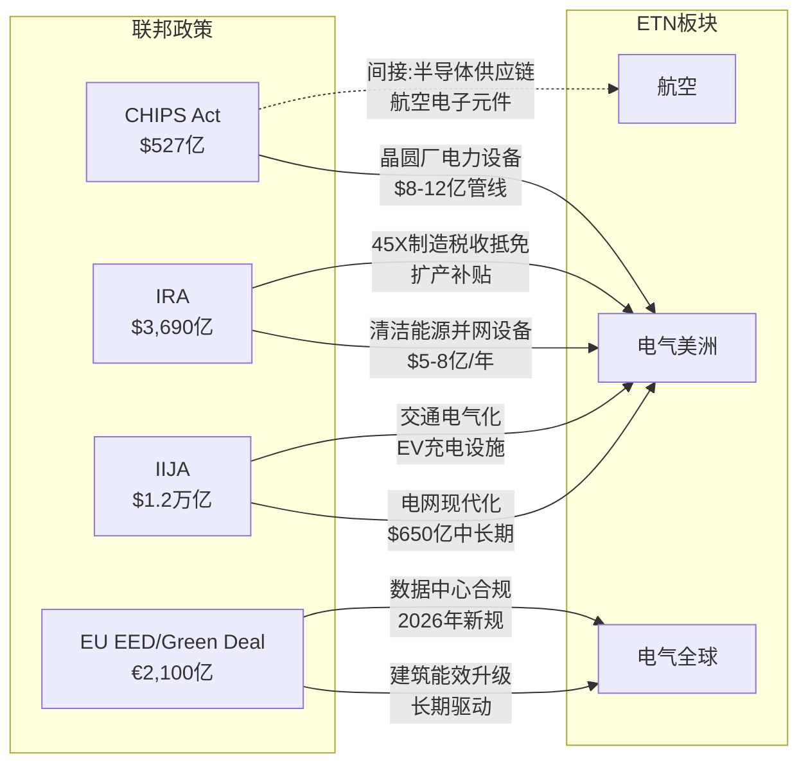
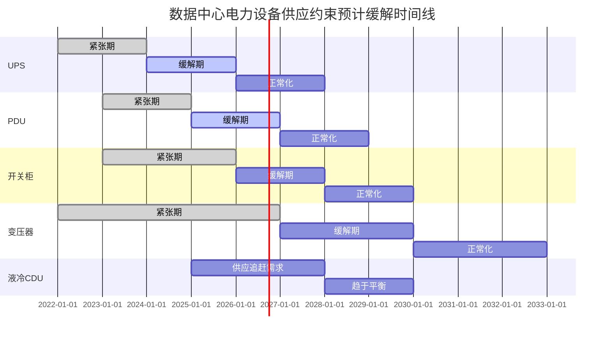
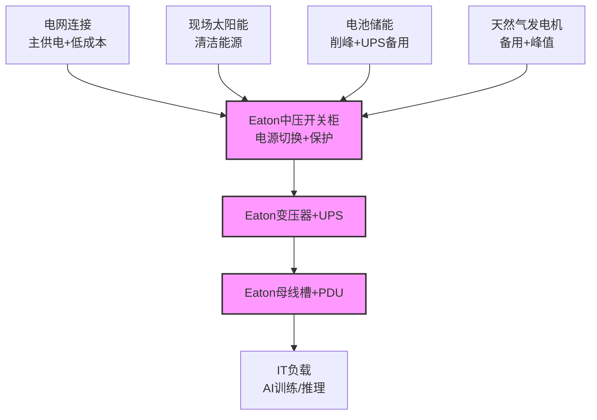
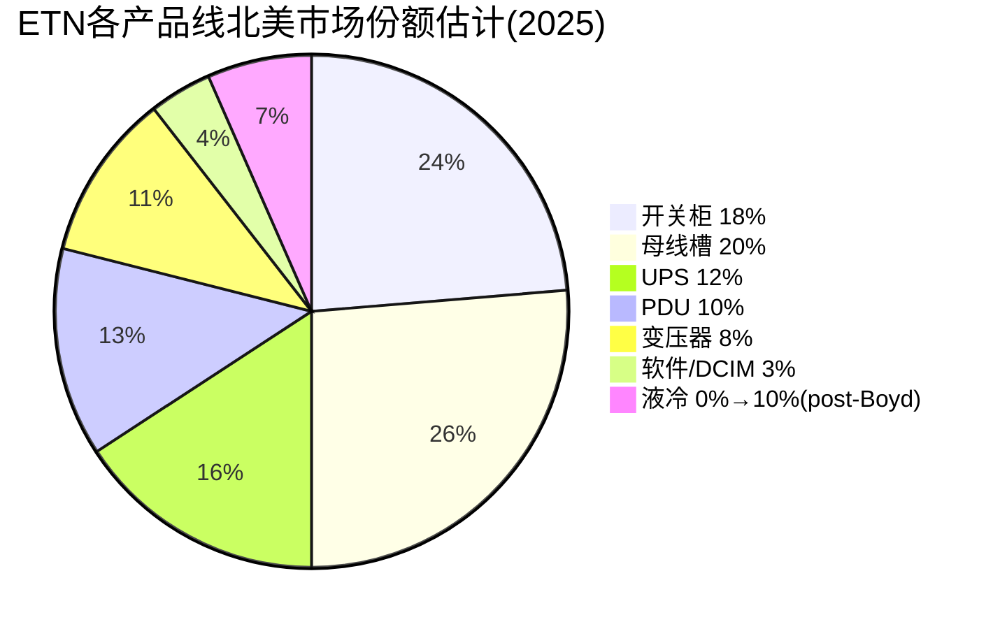

## 第四章 地理版图与终端市场

### 4.1 地域分布: 美国独大的双刃剑

ETN的收入地理分布呈现鲜明的"美国中心+全球辐射"格局。理解这一格局对评估公司的增长路径和风险暴露至关重要。

| 地区 | FY2024收入 | 占比 | FY2023收入 | YoY变化 | 增长驱动力 |
|------|-----------|------|-----------|---------|-----------|
| **美国** | $152亿 | 61% | $137亿 | +11% | 数据中心+CHIPS法案+电网现代化+IRA清洁能源 |
| **欧洲** | $45亿 | 18% | $42亿 | +7% | EU Green Deal+REPowerEU+北欧DC扩张 |
| **亚太** | $25亿 | 10% | $23亿 | +9% | Hyperscaler亚太扩张+东南亚DC建设 |
| **拉美** | $17亿 | 7% | $16亿 | +6% | 基础设施投资+商业建筑 |
| **加拿大** | $11亿 | 4% | $11亿 | +3% | 电网升级+数据中心 |
| **合计** | **$249亿** | **100%** | **$232亿** | **+7%** | — |

**美国: CHIPS法案+IRA+IIJA三重政策红利**

美国61%的收入集中度是ETN最显著的地理特征。这一集中度在2023-2025年成为巨大优势，原因在于三项联邦政策的叠加效应:

- **CHIPS与科学法案(2022)**: $527亿联邦补贴+配套州激励，催化了$4,490亿私人半导体投资(截至2025年1月)。每一座新晶圆厂(TSMC亚利桑那、Samsung Taylor、Intel Ohio)都需要大规模的中压开关柜、变压器和UPS系统。Eaton作为北美开关柜市场份额15-20%的领导者，是晶圆厂电力基础设施的天然供应商。保守估计，仅CHIPS法案驱动的晶圆厂建设就为Eaton带来了$8-12亿的累积订单管线[合理推断]

- **通胀削减法案(IRA, 2022)**: $3,690亿清洁能源投资税收激励，驱动了可再生能源+电网储能的爆发式增长。Eaton的电网级设备(保护继电器、中压开关、重合闸)直接受益于每一个新建的太阳能/风电并网项目。IRA的制造业税收抵免(45X)还鼓励在美国本土生产关键电力设备，Eaton已在南卡罗来纳($3.4亿)和德克萨斯($1.8亿)投资新产能来响应

- **基础设施投资与就业法案(IIJA, 2021)**: $1.2万亿基础设施投资中约$650亿用于电网现代化。美国电网平均年龄超40年，许多变压器和开关柜已到寿命终点。IIJA资金正在驱动一波数十年来最大规模的电网设备更换潮

这三项政策合计催化了超过$1万亿的私人投资，创造了从芯片工厂到清洁能源到电网更新的全方位电力设备需求。关键在于: 这些政策红利是**长周期**的(大多数项目的建设周期为3-7年)，意味着即使宏观经济放缓，已批准项目的建设不太可能中止——这为Eaton的积压提供了除数据中心之外的另一层保障。

但美国集中度也带来了政策风险。如果2025年后新一届政府调整IRA补贴(部分共和党议员已提出削减提案)、或对爱尔兰税务结构加强审查(全球最低税率Pillar Two可能压缩Eaton的4个百分点税率优势)，影响将被61%的美国收入占比放大。相比之下，Schneider Electric的美国收入占比约35%，ABB约25%——它们对美国政策变化的敏感度低于ETN。

**欧洲: EU Green Deal + REPowerEU驱动能源转型**

欧洲贡献18%收入($45亿)，增长驱动力来自三个政策层面:

- **EU Green Deal**: 2050碳中和目标要求全面电气化建筑供暖、交通和工业过程。欧盟能源效率指令(EED)修订版要求到2030年将能源消费较基线减少11.7%。对Eaton而言，这意味着商业建筑的电力管理升级需求(智能配电、能效监控)将持续增长

- **REPowerEU(2022)**: 俄乌冲突后欧盟加速摆脱对俄罗斯化石燃料依赖的计划，到2027年额外投资$2,100亿于可再生能源和能效。这直接驱动了欧洲电网升级和分布式能源设备需求

- **数据中心监管新框架**: EU在2024年3月推出数据中心可持续性评级方案，2025年10月前各成员国必须将EED修订版转化为国内法。2026年3月欧盟将推出"数据中心能效一揽子计划"(Data Centre Energy Efficiency Package)，可能包含数据中心的最低能效标准。这些监管要求将迫使运营商升级电力基础设施以满足合规要求——Eaton的智能配电和能效监控产品(Brightlayer平台)将直接受益

但欧洲市场面临两个结构性劣势: ①Schneider Electric和ABB在本土市场的品牌认知度和客户关系远强于Eaton; ②欧洲hyperscaler部署落后美国2-3年，且审批流程更长(爱尔兰、荷兰已出现数据中心建设禁令或限制)。这解释了为什么电气全球板块的利润率(19.7%)比电气美洲(29.8%)低超过1,000bps——不仅仅是规模差异，更是竞争格局和市场结构的差异。

**亚太: 东南亚数据中心爆发+中国工业基础**

亚太10%的收入($25亿)是ETN增长最快的区域之一(+9% YoY)，驱动力来自:

- **东南亚数据中心建设潮**: 新加坡(解除数据中心建设禁令)、马来西亚柔佛(NVIDIA和Microsoft投资)、印尼(新数据中心政策)正成为亚太数据中心的新增长极。Eaton在2024年投资了东南亚产能扩张以捕获这一机会

- **日本数据中心复兴**: 受AI需求驱动，日本2025年数据中心投资同比增长30%+，东京和大阪是主要热点[合理推断]

- **印度基础设施投资**: 莫迪政府的$1.2万亿基础设施投资计划驱动电力设备需求

但亚太市场的竞争更加激烈——Delta Electronics(台达电子)和Huawei在UPS和PDU领域具有强大的本土优势和价格竞争力，Eaton需要在品牌和技术差异化上与之竞争。

### 4.2 关键客户结构: Hyperscaler采购模式解析

**数据中心客户分层**

ETN的数据中心客户可以分为三个层级，每个层级的采购模式和对Eaton收入的贡献方式截然不同:

**第一层: Hyperscaler自建(Self-Build)**

| 客户 | 2026年CapEx计划 | DC占比(估) | ETN关系 | 采购模式 |
|------|---------------|-----------|--------|---------|
| Microsoft Azure | ~$800亿 | ~50% | 长期供应商 | 全球框架协议+项目级招标 |
| AWS | ~$1,000亿 | ~60% | 核心供应商 | 区域供应协议 |
| Google Cloud | ~$750亿 | ~45% | 供应商之一 | 项目级招标为主 |
| Meta | ~$650亿 | ~70% | 供应商之一 | 技术规格指定 |
| Oracle | ~$400亿 | ~65% | 增长中 | 新兴客户关系 |

五大hyperscaler合计2026年预算约$6,020亿(BofA估计)，其中约50-60%用于数据中心建设和扩展。Hyperscaler的采购决策具有几个显著特征:

- **规格指定(Spec-In)驱动**: 在项目设计阶段就选定关键电力设备供应商并写入工程规格书。一旦被指定，转换成本极高(涉及重新设计、重新认证、工期延误6-18个月)。这是Eaton $153亿积压的底层逻辑

- **双供应商策略**: 大多数hyperscaler不会将所有鸡蛋放在一个篮子里。典型模式是选择2-3家主供应商(Eaton+Schneider为常见组合)并按区域或项目分配份额。这意味着Eaton不太可能独占任何单个hyperscaler的全部需求，但也意味着被完全替换的风险较低

- **长周期框架协议**: Hyperscaler通常与核心供应商签订3-5年的框架供应协议，锁定价格区间和产能优先权。Eaton管理层在Q4 2025 Earnings Call中提到的"指定供应商积压从7年扩至9年"可能部分反映了这类框架协议的延长

**第二层: Colocation运营商**

| 运营商 | 在建容量(MW) | ETN供应内容 | 采购特点 |
|--------|------------|-----------|---------|
| Equinix | 全球最大，370+DC | 开关柜+UPS+PDU | 全球标准化规格 |
| Digital Realty | 300+ DC | 中压设备+母线槽 | 区域差异化需求 |
| CyrusOne | 美国+欧洲扩张 | 全栈电力设备 | 新建为主 |
| Vantage | 北美+EMEA+APAC | 电力基础设施 | 快速增长 |

Colocation运营商的采购模式与hyperscaler不同: 它们更注重标准化(因为服务多个租户)、更关注交付速度(竞争在于谁能更快上线新容量)、且价格敏感度更高(利润率压力来自hyperscaler的议价能力)。对Eaton而言，colocation客户贡献了相对稳定的基础需求，但利润率可能低于直接服务hyperscaler的定制项目。

**第三层: 企业自建数据中心**

银行、保险、医疗等行业的自建数据中心需求正在回升——部分因为AI工作负载的数据主权需求(监管要求数据不出境)，部分因为混合云策略的流行。这层客户的订单规模较小但数量多，通过分销渠道(而非直销)触达。

**客户分散性的战略价值**: Eaton没有披露任何单一客户占比超过10%的收入。这种分散性意味着: ①没有单一客户依赖风险(对比VRT，后者前几大客户集中度更高); ②任何单个hyperscaler削减CapEx的影响可以被其他客户的增长部分对冲; ③但也意味着Eaton无法像VRT那样享受与最大客户的深度战略绑定(例如VRT与NVIDIA的联合开发关系)。

### 4.3 终端市场组合: 多元化的价值与代价

ETN的终端市场多样性是其身份模糊性的根源，也是其估值争议的核心。将7+个终端市场的周期特征和相关性进行系统分析，可以更精确地评估这种多元化的价值。

**终端市场周期相关性矩阵**

| | 数据中心 | 商业建筑 | 工业 | 公用事业 | 航空 | 车辆 | 住宅 |
|---|:---:|:---:|:---:|:---:|:---:|:---:|:---:|
| **数据中心** | 1.00 | 0.45 | 0.30 | 0.50 | 0.15 | 0.10 | 0.20 |
| **商业建筑** | 0.45 | 1.00 | 0.55 | 0.35 | 0.20 | 0.30 | 0.60 |
| **工业** | 0.30 | 0.55 | 1.00 | 0.40 | 0.25 | 0.65 | 0.45 |
| **公用事业** | 0.50 | 0.35 | 0.40 | 1.00 | 0.10 | 0.15 | 0.30 |
| **航空** | 0.15 | 0.20 | 0.25 | 0.10 | 1.00 | 0.35 | 0.15 |
| **车辆** | 0.10 | 0.30 | 0.65 | 0.15 | 0.35 | 1.00 | 0.40 |
| **住宅** | 0.20 | 0.60 | 0.45 | 0.30 | 0.15 | 0.40 | 1.00 |

[合理推断: 上表相关系数基于历史经济周期中各终端市场的需求波动模式估算，而非精确统计计算。方向性判断可靠，但具体数值可能偏差0.1-0.15]

**关键发现**:

- **数据中心与航空的低相关性(0.15)**: 这是ETN多元化最有价值的一面。航空周期(由全球客运量、国防预算、机队老化驱动)与数据中心周期(由AI CapEx、云计算渗透驱动)几乎独立运动。当数据中心进入调整期时，航空后市场的持续需求可以提供缓冲——这解释了为什么管理层在分拆Mobility的同时坚持保留航空板块

- **数据中心与公用事业的中等正相关(0.50)**: 这增加了集中度风险。数据中心扩张推动电网升级投资，两者是同一个"AI基础设施"超级周期的不同表现。如果AI CapEx同时放缓，数据中心和公用事业两个增长引擎可能同步减速

- **车辆与工业的高相关(0.65)**: 两者同属传统制造业周期。Mobility分拆后，ETN将减少对这一高相关配对的暴露

**多元化收益量化**

使用简化的组合理论框架，假设各终端市场的收入波动率:

| 终端市场 | 收入占比 | 年增速波动率(σ) | 对组合波动贡献 |
|---------|---------|:---:|:---:|
| 数据中心 | 28% | ±15% | 高 |
| 商业建筑 | 25% | ±8% | 中 |
| 航空 | 16% | ±10% | 中 |
| 工业 | 15% | ±12% | 中 |
| 公用事业 | 12% | ±6% | 低 |
| 住宅 | 5% | ±15% | 低(占比小) |

[合理推断: 波动率基于行业历史数据估计]

**纯数据中心公司(VRT)的组合波动率**: σ ≈ 15-18%
**ETN多元化组合的等效波动率**: σ ≈ 8-10%(因低相关性带来的分散效应)

这意味着ETN的收入波动性大约是VRT的55-60%——多元化确实提供了有意义的风险缓冲。但市场对此的定价逻辑是反过来的: 低波动性 = 低增长弹性 = 低倍数。VRT的72x P/E部分来自其收入对AI主题的高弹性(数据中心占比70%+)，而ETN的36x反映了其被稀释的弹性。

**分拆后的终端市场重构**

Mobility分拆后，ETN核心公司的终端市场将被重新调整:

| 终端市场 | Pre-Spin占比 | Post-Spin占比 | 变化 |
|---------|:---:|:---:|:---:|
| 数据中心/基础设施 | 28% | ~32% | ↑4pp |
| 商业建筑 | 25% | ~29% | ↑4pp |
| 航空 | 16% | ~18% | ↑2pp |
| 公用事业 | 12% | ~14% | ↑2pp |
| 工业 | 15% | ~2% | ↓13pp(大部分随Mobility走) |
| 住宅 | 5% | ~5% | → |

分拆后数据中心占比从28%提升至~32%，但距离VRT的70%仍然遥远。这可能是市场对ETN"AI身份"定价的天花板——除非Boyd收购后液冷收入(~$17亿)被算入数据中心相关收入，将占比推至~38-40%区间。即便如此，ETN仍然是一家"半AI基础设施"公司，而非纯粹的AI代理。

### 4.4 政策催化剂矩阵: 四法案对ETN各板块的影响

美国联邦政策体系在2021-2022年密集出台了四项具有变革性的法案，每一项都在不同维度上影响着Eaton的各个业务板块。以下矩阵量化评估这些政策催化剂的影响路径和规模:

**CHIPS Act对ETN的影响路径**:

CHIPS法案的直接受益逻辑很清晰——每座先进制程晶圆厂的电力需求在100-200MW区间，需要大量的中压/低压开关柜、变压器、UPS和PDU。但间接效应同样重要:

1. **一级效应(直接)**: 晶圆厂本身的电力基础设施需求 → ETN估计受益$8-12亿[合理推断]
2. **二级效应(供应链)**: 晶圆厂周边的封装厂、材料工厂、设备仓库也需要电力设备
3. **三级效应(社区)**: 大规模工厂建设带动周边商业/住宅发展 → Eaton的商业建筑和住宅产品线受益
4. **四级效应(电网)**: 晶圆厂集聚区(亚利桑那凤凰城、俄亥俄哥伦布斯)的电网必须升级以满足新增负荷 → Eaton的公用事业设备受益

**IRA + IIJA联合效应**:

IRA和IIJA对电网的影响是叠加性的——IRA驱动清洁能源新增容量(需要并网设备)，IIJA资助电网现代化(需要替换老旧设备)。两者合力创造了"双层需求":

| 政策 | 需求类型 | 受益产品 | ETN相关收入(估) |
|------|---------|---------|:---:|
| IRA | 新增可再生能源并网 | 中压开关、保护继电器、变电站设备 | $5-8亿/年 |
| IIJA | 老旧设备替换 | 变压器、配电盘、断路器 | $3-5亿/年 |
| CHIPS | 晶圆厂/DC建设 | 全栈电力设备 | $8-12亿(累积) |
| IRA 45X | 本土制造激励 | 降低ETN美国工厂运营成本 | 间接利润率提升 |

[合理推断: 上述收入估计基于政策总投资规模、电力设备占比和ETN市场份额的推算]

**EU数据中心新规对电气全球板块的影响**:

欧盟2024年推出的数据中心可持续性评级方案以及2026年3月即将推出的"数据中心能效一揽子计划"，将对欧洲数据中心运营商施加前所未有的能效合规压力:

- **报告义务**: 功率需求超过500kW的数据中心必须每年向欧盟数据库报告关键性能指标(KPI)
- **评级体系**: 欧盟将建立数据中心能效评级方案
- **最低标准**: 可能引入数据中心最低能效表现标准

对Eaton的影响路径: 合规要求 → 运营商需要升级配电效率 → Eaton的智能PDU、能效监控(Brightlayer)、高效UPS产品需求增加。这是一个"监管驱动的升级周期"，对于在欧洲市场利润率较低的电气全球板块来说，可能是提升产品mix(从标准品向智能化产品升级)和利润率的机会。

### 4.5 中国市场分析: 有限的存在感与可控的地缘风险

**ETN的中国业务概况**

Eaton在中国有超过20年的运营历史，在常州建有智能工厂(2021-2024年间投资)，生产面向亚太市场的电力管理产品。但中国在ETN总收入中的占比相对有限——根据亚太10%的区域占比和中国在亚太区域内的估计份额，ETN的中国收入约占总收入的4-5%(约$10-12亿)[合理推断]。

**中国数据中心基础设施市场**

中国是全球第二大数据中心市场(约占全球容量的15-18%)，但其市场结构与美国截然不同:

| 维度 | 美国市场 | 中国市场 |
|------|---------|---------|
| 主要建设者 | 五大hyperscaler + colocation | BAT(百度/阿里/腾讯) + 三大运营商 + 国资DC |
| 设备供应商偏好 | 全球品牌(Eaton/Schneider) | 本土品牌偏好(华为/台达/科华) |
| 市场准入 | 开放 | 逐步收紧(数据安全法/关键信息基础设施保护) |
| ETN竞争地位 | 前3 | 前10之外(在外资品牌中前3) |
| 利润率 | 高(定价权强) | 低(价格竞争激烈) |

中国数据中心电力设备市场由华为(UPS市场份额约25-30%)、台达电子(15-20%)和科华数据(10-15%)主导[合理推断]。Eaton在中国数据中心市场的份额估计仅为3-5%——这不是Eaton的核心战场。

**地缘政治敞口评估**

ETN的中国敞口从收入角度看是可控的(~4-5%收入)，但从供应链角度需要更细致的评估:

1. **收入敞口(低)**: 即使中国收入归零，对ETN总收入的影响约$10-12亿(~4%)，对盈利的影响约$1.5-2亿(~4%净利润)。这远小于ASML(30%+中国收入)或LRCX(25%+)的暴露

2. **供应链敞口(中等)**: Eaton的一些低附加值零部件(连接器、塑料外壳、基础电子元件)来自中国供应商。在台海冲突情景下，这些零部件的供应可能中断，但替代来源(墨西哥、东南亚、印度)的转换周期约6-12个月

3. **稀土/关键矿物(可关注)**: UPS中使用的稀土永磁材料、部分电力电子元件中的稀土元素依赖中国供应链。但Eaton产品的稀土含量远低于电动车或风力发电机，影响有限

4. **战略应对**: Eaton从2024年底开始明确将投资重心从全球分散转向北美集中(弗吉尼亚$5,000万、南卡$3.4亿、德克萨斯$1.8亿)，这既是响应美国数据中心需求，也是降低地缘风险的"友岸外包"(friendshoring)策略

**结论**: ETN的中国风险是一个"可管理的尾部风险"而非核心威胁。与半导体设备公司(ASML/LRCX/AMAT)或芯片设计公司(NVDA/AMD)的中国敞口相比，ETN的暴露微不足道。但投资者仍需监控两个信号: ①中国对关键电力设备出口管制的升级; ②台海紧张局势导致的全球供应链中断对Eaton亚太运营的间接影响。

---

## 第五章 数据中心电力生态: 从配角到主角

### 5.1 市场规模与增长: TAM按设备类型拆解

全球数据中心电力市场的TAM是理解Eaton机会规模的基础。但"数据中心电力市场"的定义因分析机构不同而差异显著——从窄口径(仅含核心电力设备)到宽口径(含电力+冷却+机柜+布线全部支撑基础设施)，TAM可以从$150亿到$620亿不等。以下是按设备类型拆解的精细分析:

**全球数据中心电力设备TAM(按产品线, 2025-2030)**

| 设备类型 | 2025年TAM | 2030年TAM | CAGR | ETN市场份额(估) | ETN可触达市场(估) |
|---------|:---:|:---:|:---:|:---:|:---:|
| **开关柜(Switchgear)** | $82亿 | $128亿 | 9.3% | 12-15% | $10-12亿 |
| **UPS(不间断电源)** | $105亿 | $152亿 | 7.7% | 8-10% | $8-11亿 |
| **PDU(配电单元)** | $28亿 | $42亿 | 8.5% | 10-12% | $3-3.5亿 |
| **母线槽(Busway)** | $18亿 | $30亿 | 10.8% | 15-18% | $2.7-3.2亿 |
| **变压器** | $45亿 | $68亿 | 8.6% | 5-8% | $2.3-3.6亿 |
| **静态转换开关(STS)** | $8亿 | $13亿 | 10.2% | 10-12% | $0.8-1亿 |
| **电力监控/软件** | $30亿 | $50亿 | 10.6% | 2-3% | $0.6-0.9亿 |
| **液冷设备(CDU等)** | $55亿 | $162亿 | 24.1% | 0%(→8-10% post-Boyd) | $0(→$13-16亿) |
| **合计(窄口径)** | **$371亿** | **$645亿** | **11.7%** | — | **$28-36亿(→$41-52亿)** |

[合理推断: 市场规模综合MarketsandMarkets、Mordor Intelligence、Precedence Research等多家机构数据; ETN市场份额基于全球份额8-10%+北美份额15-20%的加权估计; 液冷市场数据综合Mordor Intelligence($55亿→$188亿)和Precedence Research($47亿→$258亿)取中间值]

**几个关键观察**:

1. **UPS仍是最大单一设备市场**: $105亿TAM中UPS占30%的份额(MarketsandMarkets)。这个市场正面临800V HVDC的潜在颠覆——如果HVDC架构减少AC-DC转换环节，传统UPS的需求可能被部分替代。Eaton作为UPS Top 3供应商必须评估这一转型的速度和影响

2. **母线槽增长最快(非液冷类)**: 10.8%的CAGR反映了高功率密度数据中心对更大截面母线槽的需求。Eaton在北美母线槽市场份额15-18%，是其相对优势最大的细分领域

3. **液冷是TAM的增量引擎**: 从2025年的$55亿到2030年的$162亿，CAGR 24.1%。这是Boyd收购的市场逻辑——如果不进入液冷，Eaton的可触达市场(SAM)将在增长最快的领域缺位

4. **软件/监控是ETN最弱的一环**: 仅2-3%的份额 vs Schneider EcoStruxure的估计15-20%份额。这个差距在短期内难以弥合，但长期可能成为ETN竞争力的瓶颈——随着数据中心越来越"软件定义"，没有强大DCIM平台的硬件供应商可能被边缘化

**年度预测表: ETN数据中心相关收入(2025-2030)**

| 年份 | 电力设备 | 液冷(Boyd) | 软件/服务 | 合计 | YoY增长 |
|------|:---:|:---:|:---:|:---:|:---:|
| 2025 | $60亿 | $0 | $5亿 | $65亿 | 基准 |
| 2026 | $72亿 | $10亿(H2并表) | $6亿 | $88亿 | +35% |
| 2027 | $82亿 | $20亿 | $7亿 | $109亿 | +24% |
| 2028 | $88亿 | $25亿 | $9亿 | $122亿 | +12% |
| 2029 | $92亿 | $30亿 | $11亿 | $133亿 | +9% |
| 2030 | $95亿 | $35亿 | $13亿 | $143亿 | +8% |

[合理推断: 基于公司指引、行业TAM增速和竞争格局估算。2027年后增速放缓反映AI CapEx周期正常化假设]

这个预测暗示了一个重要的估值含义: 数据中心相关收入从2025年的$65亿增至2030年的$143亿(CAGR ~17%)，在核心公司(post-spin ~$240亿收入)中的占比将从~27%提升至~45-50%。如果这一路径实现，ETN在2028-2030年可能"赢得"更纯粹的AI基础设施身份——但代价是对数据中心周期的暴露也将同步上升。

### 5.2 功率密度的指数增长: 从物理学角度看天花板

理解数据中心电力需求的增长，核心在于理解功率密度的演进——而功率密度的演进，归根结底是AI芯片功耗的物理学。

**AI芯片功耗演进全景(每GPU/加速器)**

| 代际 | 芯片 | 发布年份 | TDP(瓦) | 工艺制程 | 每机架功率(典型) | 冷却方式 |
|------|------|---------|:---:|:---:|:---:|:---:|
| Ampere | A100 | 2020 | 400W | 7nm | 20-40kW | 风冷 |
| Hopper | H100 | 2022 | 700W | 4nm | 40-70kW | 风冷/液冷混合 |
| Blackwell | B200 | 2024 | 1,000W | 4nm | 80-120kW | 液冷为主 |
| Blackwell Ultra | GB300 | 2025 | 1,200W | 4N+ | 120-180kW | 全液冷 |
| Vera Rubin | R100 | 2026H2 | 2,300W | 3nm | 200-400kW | 全液冷+HVDC |
| Rubin Ultra | R200 Ultra | 2027H2 | 3,600W | 3nm | **600kW** | 全液冷+HVDC |

从A100(400W)到Rubin Ultra(3,600W)，单芯片功耗在7年内增长了**9倍**。但更震撼的数据在机架层面: NVIDIA的Kyber机架(支持Rubin Ultra NVL576)目标功耗600kW——这意味着**单个机架的电力需求相当于一座容纳400-500户的中型公寓楼的全部电力消耗**。

**物理学视角的功率密度天花板**

功率密度的增长是否有物理极限？从三个层面分析:

**晶体管层面**: 根据Dennard缩放定律(Dennard Scaling)，随着晶体管尺寸缩小，功率密度应保持不变。但Dennard缩放在2006年左右已经失效——当前芯片的功率密度随每一代制程持续上升。到2nm/1.4nm节点(2027-2029)，单位面积功耗密度将逼近散热材料(硅、铜)的热传导极限。这意味着每代芯片的功耗上升速度可能在2028-2030年开始放缓——不是因为需求不足，而是因为物理散热约束。

**封装层面**: NVIDIA的解决方案是将多个芯片组合在一个封装中(Rubin Ultra是四芯片封装)。这绕过了单芯片的功率密度限制，但将热管理复杂度推到了极致——3.6kW的封装需要高效的液冷直接接触冷板(cold plate)，而冷板的散热能力也有物理上限(约500-800W/cm2的热通量极限)[合理推断]。

**机架/设施层面**: 600kW/机架意味着一个1,000机架的数据中心需要600MW的电力供应——相当于一座中型天然气发电厂的全部输出。电网(Grid)成为功率密度增长的终极瓶颈，因为新增600MW的电力接入可能需要3-5年的审批和建设周期(PJM互联互通排队目前已超过1,000GW)。

**对Eaton的含义**: 功率密度增长的每一个阶段都在扩大Eaton的每MW内容量(content per MW)。管理层已指出"每MW电力基础设施内容量翻倍"——更高功率的母线槽截面、更大容量的UPS模块、更高额定的PDU。但功率密度增长放缓(如果发生在2028-2030年)将直接影响这一内容量扩张的斜率——这是支撑ETN数据中心增长率的一个隐含假设。

### 5.3 供应约束: 设备级供应链详解

当前数据中心电力设备市场的供应约束是ETN超额利润的关键来源。深入每类设备的供应链结构，可以评估这些约束的持久性。

**开关柜(Switchgear): 36个月交付期的解剖**

开关柜是数据中心电力架构的"第一公里"设备——连接电网和数据中心内部配电系统。当前36个月的交付期背后有三层瓶颈:

| 瓶颈层 | 约束因素 | 严重度 | 预计缓解时间 |
|--------|---------|:---:|:---:|
| **原材料** | 铜(LME价格+30% YoY) + 电工钢(产能紧张) | ★★★★ | 2027-2028 |
| **关键零部件** | 断路器机构(精密机械件) + 绝缘材料(环保法规限制SF6替代品) | ★★★ | 2026-2027 |
| **组装产能** | 高压开关柜的测试/认证需要专用设施，新建需18-24个月 | ★★★★★ | 2027+ |
| **工程人力** | 中压/高压电气工程师全球短缺(退休潮+培训周期长) | ★★★★ | 长期 |

**变压器: 72个月交付期的根源**

变压器的供应约束是所有电力设备中最严重的:

- **核心问题**: 大型电力变压器(LPT, ≥100MVA)的全球年产能约~3,500台，而需求在2025年已接近~4,200台[合理推断]。产能缺口约20%
- **关键瓶颈**: 取向电工钢(Grain-Oriented Electrical Steel, GOES)——全球70%产能集中在日本(JFE/NIPPON)、韩国(POSCO)和中国(宝钢)。GOES产能扩张周期为3-5年
- **变压器油**: 矿物绝缘油面临环保法规压力，替代品(酯基油)产能不足
- **Eaton的位置**: Eaton不是大型电力变压器(LPT)的主要供应商——那是GE Vernova、Siemens Energy、日立能源的领域。但Eaton在中压配电变压器(1-50MVA区间)有强势地位，这类变压器的交付期约18-30个月，好于LPT但仍然紧张

**UPS: 半导体元件+电池的双重约束**

| 零部件 | 供应状态 | 影响 |
|--------|---------|------|
| IGBT/SiC MOSFET(功率半导体) | 2024年缓解，2025年基本正常化 | UPS效率升级的关键 |
| 锂电池(备用电源) | 供应充足但价格波动 | 成本影响>供应影响 |
| 铜(绕组和母线) | 价格高位运行 | 成本压力 |
| 控制系统芯片(MCU/DSP) | 2024年后基本缓解 | 不再是瓶颈 |

UPS的供应约束从2024年起已显著缓解(功率半导体短缺是2021-2023年的主要瓶颈)。这意味着UPS的交付期将在2025-2026年逐步正常化至6-12个月——UPS是最先恢复正常交付的设备类别，而开关柜和变压器的瓶颈将持续更久。

**供应约束时间线汇总**

**投资含义**: 供应约束不是永恒的——它们以不同速度缓解。UPS的正常化(2026)将最先测试Eaton的定价权，如果UPS价格出现下行压力，市场可能开始重新评估"供应约束驱动的超额利润"的持久性。开关柜和变压器的瓶颈更持久(2028-2030+)，为Eaton的核心产品线提供了更长的超额利润窗口。

### 5.4 电网瓶颈: 区域级容量分析

数据中心建设的终极瓶颈不在设备供应，而在电网容量。美国三大电力市场(PJM、ERCOT、CAISO)的容量状况决定了数据中心建设的地理分布——也直接影响Eaton在不同区域的设备需求。

**PJM(美国东北+中大西洋): 最紧张**

PJM覆盖弗吉尼亚(北美最大DC集群)、俄亥俄、宾夕法尼亚等13个州和华盛顿特区，是全球最大的电力批发市场。

- **容量危机**: PJM 2025年长期负荷预测报告预测未来十年将面临高达60GW的电力缺口。到2026年6月(2026/2027交付年度)，PJM可能已经低于可靠性标准
- **数据中心是主要推手**: 弗吉尼亚Loudoun County(全球最大DC集群)的电力需求持续爆发。PJM互联互通排队超过1,000GW(大多数是可再生能源+储能，但DC负荷增量巨大)
- **容量拍卖价格飙升**: PJM容量拍卖价格已达历史新高，反映了供需失衡的严重程度
- **对ETN的影响**: PJM区域是Eaton电气美洲板块的核心市场。电力紧张→升级投资→更多开关柜/变压器需求(正面); 但电力接入延迟→DC项目推迟→设备交付延期(负面，短期)

**ERCOT(德克萨斯): 快速增长但有应对方案**

- **负荷增长**: EIA预测2026年ERCOT负荷增长9.6%(从最初预测的15.7%下调)
- **供应应对**: 德克萨斯是美国唯一的非联邦管辖电力市场，审批流程更快。太阳能产能预计2024-2026年增长92%。天然气发电新增项目管线充足
- **数据中心涌入**: 众多hyperscaler(包括Tesla的xAI Memphis项目的德州扩展)选择ERCOT区域建设DC，部分因为电力接入更快(相对PJM)
- **对ETN的影响**: 德克萨斯是ETN扩产投资($1.8亿)的目标地区。ERCOT的快速增长+更顺畅的审批=更快的设备交付周期=对ETN短期增长更有利

**CAISO(加利福尼亚): 监管密集型**

- **特点**: 可再生能源占比最高(太阳能导致"鸭子曲线"问题)，环保法规最严格
- **数据中心政策**: 加州对DC建设的环保审查严格，Santa Clara和硅谷的新DC审批越来越困难
- **对ETN的影响**: 加州不是DC建设的增长热点(hyperscaler正在向弗吉尼亚、德州、中西部转移)，但清洁能源并网设备需求仍在增长

**互联互通投资规划**

| 区域 | 2025-2030输电投资(估) | 关键项目 | ETN受益方式 |
|------|:---:|---------|---------|
| PJM | $250-350亿 | 弗吉尼亚-宾州新输电线、变电站升级 | 中压开关+保护设备 |
| ERCOT | $150-200亿 | 风电/太阳能并网线路、新变电站 | 变压器+配电设备 |
| SPP/MISO | $100-150亿 | 中西部可再生能源输送 | 长距离输电设备 |
| CAISO | $80-120亿 | 储能并网、太阳能过剩管理 | 电力电子+储能接口 |

[合理推断: 投资规模基于各ISO/RTO公开的输电规划和行业分析师估计]

**Eaton-Siemens Energy战略联盟的角色**

面对电网瓶颈，Eaton在2025年与Siemens Energy建立了战略联盟，提供模块化现场发电方案——标准配置为500MW的集装箱化天然气发电厂。这个联盟的战略意义在于: 它使Eaton能够绕过电网瓶颈，直接为DC客户提供"电厂到芯片"的全栈方案。如果电网排队时间继续延长，现场发电将从"备选方案"变为"标配"——这是Eaton TAM扩展的又一个维度。

### 5.5 效率颠覆悖论(H1假说)深度分析

论文结晶阶段提出的H1假说——"AI芯片效率改进可能抵消部分数据中心电力需求增长"——是评估ETN长期增长路径的关键变量。这里将Jevons悖论框架应用于AI数据中心场景，进行多维度深入分析。

**Jevons悖论的核心逻辑**

1865年，英国经济学家William Stanley Jevons观察到一个反直觉现象: 蒸汽机效率提高后，英国的煤炭消费不降反升——因为更高效的蒸汽机使煤炭的"有效价格"下降，反而刺激了更多的使用。这一观察后来被称为"Jevons悖论"(Jevons Paradox)或"回弹效应"(Rebound Effect)。

将这一框架映射到AI数据中心:

| 19世纪煤炭 | 21世纪AI计算 |
|-----------|------------|
| 蒸汽机效率提高 | AI芯片每推理功耗下降 |
| 煤炭的有效价格下降 | AI推理的有效成本下降 |
| 更多工厂建造蒸汽机 | 更多应用场景采用AI |
| **净效果: 煤炭消费增加** | **净效果: 总计算需求和电力消费增加?** |

**历史先例分析**

三个关键历史先例提供了方向性指引:

**先例1: CPU效率→计算量爆发(1970s-今)**

从Intel 4004(1971, 10μm, ~0.5 MIPS/瓦)到Apple M4(2024, 3nm, ~50,000 MIPS/瓦)，CPU的能效提高了约10万倍。但全球计算能力和电力消耗并没有下降——每一代CPU效率提升都催生了新的计算应用(从文字处理→多媒体→互联网→移动计算→云→AI)。全球数据中心电力消耗从2000年的~30TWh增长到2023年的~176TWh(+500%)。

**Jevons指数(Rebound > 100%)**: 效率提高10万倍，消费增长500%→回弹效应远超100%。计算是一个"需求几乎无限"的领域。

**先例2: LED效率→照明用电先降后稳(2000s-今)**

LED相比白炽灯效率提高10倍。全球照明用电从2005年的峰值~2,500TWh下降至2020年的~2,200TWh(约-12%)，此后趋于稳定。照明是一个"需求有上限"的领域——一旦所有空间都被照亮，额外的效率改进就转化为节能而非增加消费。

**Jevons指数(Rebound < 100%)**: 效率提高10倍，消费下降12%→回弹效应约88%。但需注意: LED还推动了新的照明应用(建筑装饰照明、显示屏)，部分抵消了效率节省。

**先例3: 汽车燃油效率→驾驶里程增加(1975-今)**

美国乘用车平均燃油效率从1975年的13.5 MPG提高到2025年的约36 MPG(+167%)。但同期总驾驶里程增长了约120%，导致汽车汽油消费仅下降了约15%。

**Jevons指数(Rebound ~70-85%)**: 效率提高167%，驾驶增加120%→部分回弹。

**AI推理效率改进的量化分析**

将历史先例应用于AI推理:

| 维度 | 保守假设(LED类比) | 中性假设(汽车类比) | 乐观假设(CPU类比) |
|------|:---:|:---:|:---:|
| AI芯片效率改进(2025-2030) | -60%每推理功耗 | -60%每推理功耗 | -60%每推理功耗 |
| AI推理总需求增长 | +3x | +8x | +20x |
| 净电力需求增长 | +1.2x(总量仅增20%) | +3.2x(总量增220%) | +8x(总量增700%) |
| Jevons指数 | ~40% | ~80% | >200% |
| **对ETN的含义** | DC电力增长大幅放缓 | DC电力增长稳健 | DC电力爆发式增长 |

**关键判断**: AI推理更接近"CPU"先例还是"LED"先例？

核心区别在于**需求弹性**——当每次推理的成本下降时，推理总量会增加多少？

**支持高弹性(CPU类比)的论点**:
- AI推理的潜在应用场景极广(文本/图像/视频/代码/科研/医疗/自动驾驶...)，大多数应用目前受成本约束而未大规模部署
- DeepSeek的效率突破(2025年1月)并未导致AI投资放缓——反而被解读为"更便宜的推理=更多的使用"(Jevons悖论的教科书案例)
- Gartner预测全球数据中心电力需求2025-2030年将从448TWh增至980TWh(+119%)，IEA中性情景预测达945TWh

**支持低弹性(LED类比)的论点**:
- AI推理不像通用计算那样有"无限"的应用空间——许多用例(如文本摘要、简单问答)的需求有天花板
- 企业AI采用率可能不如消费者互联网那样普及(受ROI验证、数据隐私、监管约束)
- 如果AGI(通用人工智能)的进展慢于预期，AI可能进入"期望低谷"(Gartner hype cycle)

**我们的判断**: AI推理的需求弹性处于"汽车"和"CPU"之间——回弹效应约80-120%。这意味着即使芯片效率改进60%，净电力需求在2025-2030年仍会增长**2-4倍**。这对ETN是一个积极信号——但增长速度可能低于最乐观的市场预期(5-8倍增长)。

**H1假说对ETN估值的敏感性**

| Jevons回弹情景 | DC电力CAGR(2025-30) | ETN DC收入CAGR | 隐含2030 P/E |
|:---:|:---:|:---:|:---:|
| 低(40%) | 4-6% | 8-10% | 28-30x |
| 中(80%) | 10-14% | 15-18% | 33-36x |
| 高(120%+) | 18-22% | 22-26% | 38-42x |

[合理推断: P/E敏感性基于数据中心收入占比扩大+增速对倍数的非线性影响估计]

当前市场定价(36x)接近"中-高回弹"情景。如果效率改进的抵消效应强于预期(低回弹)，ETN的合理P/E可能压缩至28-30x——意味着20-25%的下行风险。

### 5.6 现场发电与微电网: 绕过电网的另一条路

面对电网瓶颈(PJM排队5年+)，越来越多的hyperscaler开始考虑"自带电源"——在数据中心现场部署发电设施，绕过电网互联互通的漫长等待。这开辟了一个全新的市场维度，也为Eaton创造了新的增长路径。

**天然气现场发电**

Eaton与Siemens Energy在2025年推出的模块化现场发电方案是这一趋势的标志性产品:

- **配置**: 标准500MW容量，采用集装箱化模块，可在6-12个月内部署(vs 电网接入的3-5年)
- **Siemens Energy提供**: 天然气涡轮机组、发电机
- **Eaton提供**: 中压开关柜、变压器、UPS、配电系统——从发电机到IT负载的全部电力分配设备
- **目标客户**: 无法及时获得电网接入的hyperscaler和大型企业DC

对Eaton而言，现场发电方案实质上是将其传统的"电网→数据中心"电力分配链延伸到"发电机→数据中心"——产品组合(开关柜、变压器、UPS、PDU)不变，只是安装环境从公用事业变电站移到了DC园区内部。这意味着额外的设备需求(每个500MW现场电厂大约需要$50-80百万的电力分配设备)[合理推断]。

**小型模块化核反应器(SMR)**

SMR(Small Modular Reactor)是最长期的现场发电选项:

- **功率范围**: 5-300MW，恰好匹配大型数据中心的需求
- **时间线**: 美国NRC已认证NuScale的设计，但首批商业部署预计在**2030年之后**
- **科技公司投入**: 超过$100亿投资于核能合作伙伴关系，22GW项目在全球开发中。Microsoft已签订核能供电协议(Three Mile Island重启)
- **Eaton的角色**: SMR电厂需要完整的电力分配系统——从反应堆输出到数据中心IT负载的全链路。Eaton的核级电气设备认证(通过航空板块积累的核认证经验)可能成为差异化优势

但需要冷静看待: SMR对ETN的收入贡献在2030年前几乎为零。这是一个"2030-2040"时间框架的机会，不应影响当前(2025-2028)的估值判断。

**微电网整合方案**

介于天然气现场发电和SMR之间的是微电网方案——结合太阳能、电池储能、柴油/天然气备用发电和电网连接的混合系统:

在微电网架构中，Eaton的设备不仅数量增加(更多电源切换和保护设备)，复杂度也提高(需要管理多种电源的并行供电和切换)。这意味着更高的每MW内容量和更高的产品mix——与简单电网供电的数据中心相比，微电网数据中心的Eaton电力设备价值量可能高30-50%[合理推断]。

---

## 第六章 竞争格局: 五巨头的三维棋局

### 6.1 全球市场格局: 份额估计与可视化

全球数据中心电力市场是一个集中度中等的市场——前五大供应商控制约41-43%的份额，但没有任何单一参与者占据压倒性地位。这种格局为在位者提供了定价权(非完全竞争)，同时也意味着份额争夺是持续性的。

**全球数据中心电力设备市场份额(2025年估计)**

| 供应商 | 全球份额 | 北美份额 | 欧洲份额 | 亚太份额 | 核心优势产品 |
|--------|:---:|:---:|:---:|:---:|---------|
| **Schneider Electric** | 14-16% | 12-14% | 20-22% | 12-15% | EcoStruxure DCIM + UPS + PDU |
| **Vertiv** | 12-14% | 14-16% | 10-12% | 12-14% | 热管理 + UPS + 模块化DC |
| **ABB** | 9-11% | 6-8% | 14-16% | 8-10% | 中压设备 + 工业自动化 |
| **Eaton** | 8-10% | 15-20% | 6-8% | 4-6% | 开关柜 + 母线槽 + UPS |
| **Delta Electronics** | 5-7% | 3-4% | 4-5% | 12-15% | UPS + 电源 + 效率方案 |
| **Huawei** | 4-6% | <1% | 2-3% | 15-18% | UPS + 智能电源管理 |
| **其他** | ~40-47% | ~40-50% | ~40-47% | ~30-40% | 区域/专业供应商 |

[合理推断: 份额基于MarketsandMarkets、Dell'Oro Group、各公司年报中数据中心收入对比推算。不同产品线的份额差异显著]

**按产品线的市场份额分化**

全球份额数字掩盖了各产品线的显著差异。以下是ETN在各细分产品市场的地位:

ETN在北美开关柜(~18%)和母线槽(~20%)领域的份额领先，这两个产品线恰恰是高功率密度数据中心需求增长最快的品类。相比之下，软件/DCIM领域(~3%)是ETN的显著短板——这个差距的战略含义将在竞争对手分析中详细讨论。

### 6.2 主要竞争对手深度对比

#### Schneider Electric ($SU.PA) — 全球冠军与软件先锋

**基本面**:
- FY2025收入: ~$380亿+(€364亿, +12% YoY有机增长)
- 数据中心相关收入: ~$90-95亿(占比~24%)
- 市值: ~$1,400亿
- P/E: ~35x
- 全球员工: ~150,000

| 维度 | Schneider | ETN | ETN差距/优势 |
|------|-----------|-----|:---:|
| 总营收规模 | $380亿+ | $274亿 | 劣势(-28%) |
| 数据中心收入 | ~$90-95亿 | ~$65亿 | 劣势(-30%) |
| DC收入占比 | ~24% | ~28% | 优势(+4pp) |
| 核心软件平台 | EcoStruxure(行业最成熟DCIM) | Brightlayer(早期) | 显著劣势 |
| 液冷方案 | Motivair($8.5亿收购) | Boyd Thermal($95亿收购) | 规模优势 |
| 电气业务利润率 | ~20% | ~30%(美洲) | 显著优势(+1,000bps) |
| 北美地位 | #2-3 | #1-2 | 优势 |
| 欧洲地位 | #1 | #4-5 | 显著劣势 |
| 亚太地位 | #2-3 | #5-6 | 劣势 |

**EcoStruxure平台深度解析**

Schneider的EcoStruxure IT平台是ETN在竞争中面临的最大差异化劣势。这不仅仅是一个软件产品——它是一个连接Schneider全部硬件产品、提供端到端能效优化和预测性维护的IoT平台:

- **DCIM功能**: 实时电力和冷却监控、AI驱动的能效优化、容量规划、碳排放追踪
- **安装基数**: 全球数千个数据中心使用EcoStruxure IT(具体数字未公开)
- **竞争壁垒**: 一旦数据中心部署了EcoStruxure，更换成本极高(数据迁移+重新集成+培训)——这创造了软件锁定(software lock-in)，使得后续的硬件更换也倾向于选择Schneider
- **市场份额**: DCIM市场中Schneider与Vertiv合计占据约45-60%份额

Eaton的Brightlayer平台在功能和市场渗透上显著落后。这个差距的战略含义是: 在未来"软件定义数据中心"的趋势中，Eaton可能面临"硬件优秀但软件不足"的困境——类似于智能手机时代诺基亚的硬件优势被iOS/Android的软件生态所颠覆。当然，电力设备的产品生命周期(20-30年)远长于消费电子，软件颠覆的速度会慢得多——但方向值得关注。

**Motivair vs Boyd对比**

| 维度 | Schneider → Motivair | Eaton → Boyd Thermal |
|------|---------------------|---------------------|
| 收购金额 | ~$8.5亿(75%控股) | $95亿(全资) |
| 目标收入 | ~$3-4亿 | ~$17亿 |
| 隐含倍数 | ~15-18x EV/EBITDA[合理推断] | ~22.5x EBITDA |
| 核心技术 | 冷板(Cold Plate) + CDU | 全栈热管理(液冷+风冷+散热组件) |
| 员工规模 | ~500-800[合理推断] | ~5,000 |
| 风险 | 规模较小，整合易管控 | 规模大($95亿)，整合复杂度高 |
| 支付方式 | 混合(控股非全资) | 全现金 |

Schneider的Motivair收购在规模和价格纪律上都更保守——$8.5亿(vs Boyd的$95亿)和15-18x倍数(vs 22.5x)。这个对比强化了市场对Boyd收购的一个担忧: ETN是否在"必须进入液冷"的战略焦虑下overpaid？

#### Vertiv Holdings ($VRT) — 纯度最高的AI代理

**基本面**:
- FY2025收入: ~$102亿(+28% YoY)
- 数据中心占比: ~70%+（广义85%+）
- 市值: ~$930亿
- P/E: ~72x
- 全球员工: ~28,000

| 维度 | VRT | ETN | 差距/优势 |
|------|-----|-----|:---:|
| 总营收 | $102亿 | $274亿 | ETN 2.7x |
| 数据中心纯度 | ~70%+ | ~28% | VRT绝对领先 |
| P/E | 72x | 36x | VRT 2x溢价 |
| 增长率(有机) | +26% | +8% | VRT 3.3x |
| 利润率(调整后OP) | ~20.4% | ~24.9% | ETN优势 |
| 热管理能力 | ★★★★★(行业最强) | ★★(→★★★★ post-Boyd) | VRT领先 |
| 电力分配广度 | ★★★(UPS+PDU+配电) | ★★★★★(全栈) | ETN领先 |
| 资产负债表 | Net Debt/EBITDA 0.76x | Net Debt/EBITDA ~1.6x(→~2.5x post-Boyd) | VRT优势 |
| NVIDIA关系 | 液冷联合开发(GB200/Rubin) | 800V HVDC参考架构 | 各有侧重 |

**VRT报告的交叉分析框架应用**

在我们的VRT深度报告(4.2/5分)中，提出了VRT的"双重身份估值张力"框架——市场以AI基础设施公司的估值(PE 46x, 当时; 现72x)为一家85%营收来自传统工业品的公司定价。这个框架直接适用于ETN，但有关键差异:

| 框架维度 | VRT | ETN |
|---------|-----|-----|
| 双重身份 | "传统工业品(85%) vs AI增量(15%)" | "多元工业(72%) vs AI基础设施(28%)" |
| 身份模糊度 | 中(AI叙事强但收入占比不匹配) | 高(身份争论仍在持续) |
| 估值溢价来源 | 液冷高增长+NVIDIA深度绑定 | 北美电力全栈覆盖+供应约束定价权 |
| 溢价脆弱性 | 液冷份额下降/800V HVDC颠覆UPS | AI CapEx放缓/供应约束缓解/Boyd整合风险 |
| SOTP vs 市值 | ~33%溢价($70B vs $93B) | 需Phase 3详细计算 |

**Boyd收购后ETN-VRT的竞争重叠将显著扩大**:

- **重叠领域(新增)**: 液冷CDU、冷板散热、热管理系统集成
- **重叠领域(已有)**: UPS、PDU、配电系统
- **ETN差异化**: 全栈电力覆盖(从电网中压到机架级)、航空多元化、更高利润率
- **VRT差异化**: 数据中心纯度、液冷技术深度、NVIDIA联合开发关系、更轻资产负债表

#### ABB Ltd ($ABB) — 工业自动化巨头与NVIDIA 800V合作伙伴

**基本面**:
- FY2024收入: $329亿(€312亿)
- 市值: ~$950亿
- P/E: ~30x (P/B 4.5x)
- 数据中心相关: ~$49亿(占比~15%)

**NVIDIA 800V HVDC合作细节**

ABB在2025年与NVIDIA达成了与Eaton类似的合作——成为800V HVDC架构的参考设计合作伙伴。这意味着在下一代数据中心电力架构中，Eaton和ABB将共同定义行业标准:

| 维度 | Eaton在800V中的角色 | ABB在800V中的角色 |
|------|-------------------|------------------|
| DC-DC转换器 | 产品开发中(2026年推出) | 已有成熟产品线(ABB的半导体部门优势) |
| 直流母线/连接器 | 利用现有母线槽优势 | 中压DC系统经验 |
| 保护设备 | 直流断路器(新开发) | 直流保护继电器(已有航海/工业产品) |
| 系统集成 | Grid-to-Chip全栈 | 选择性参与(非全栈) |

**与ETN的直接竞争领域**:
- 中压开关柜: ABB的全球市场份额(~14%)高于ETN(~10%)，但在北美ETN领先
- 变压器: ABB的Hitachi Energy(前ABB电网)是全球变压器#1，远强于ETN
- UPS: ABB的UPS业务规模小于ETN，但在工业UPS领域有技术优势
- DCIM软件: ABB Ability平台功能与ETN Brightlayer接近(均落后于Schneider)

**ABB的差异化战略**: ABB不追求数据中心市场的全栈覆盖——它选择性地在中压设备、自动化和800V HVDC等技术前沿领域参与竞争，同时将更多资源投入工业自动化和机器人(ETN不涉及的领域)。这种"选择性参与"策略意味着ABB不是ETN在数据中心的全面竞争对手，更像是在特定产品线(中压开关、变压器)的强劲对手。

#### Delta Electronics ($2308.TW) — 亚太效率之王

**基本面**:
- FY2025收入(TTM): ~$149亿(跨所有板块)
- 数据中心相关: ~$30-35亿(占比~20-23%)[合理推断]
- 市值: ~$600亿
- 总部: 中国台湾
- 全球员工: ~80,000+

Delta Electronics是一个经常被西方分析师低估的竞争者。作为全球最大的电源供应器制造商和UPS市场的Top 5参与者，Delta在亚太数据中心市场具有显著优势:

| 维度 | Delta | ETN |
|------|-------|-----|
| 核心产品 | 高效UPS(97%+效率) + 服务器电源 + PDU | 开关柜 + UPS + PDU + 母线槽 |
| 技术优势 | 电源效率行业最高(80 Plus Titanium) | 全栈产品覆盖最广 |
| 亚太市场 | #2-3(仅次于华为) | #5-6 |
| 北美市场 | #5-6(市场渗透中) | #1-2 |
| 价格定位 | 中-高(品质+效率导向) | 高(品牌溢价) |
| 液冷 | 有CDU产品线 | Boyd收购后完整 |
| 竞争策略 | 效率差异化+亚太根基→全球扩张 | 北美根基+并购扩张 |

**Delta的北美威胁**: Delta正在积极扩展北美市场——2024-2025年在美国增设了销售和服务团队，并获得了部分hyperscaler的认证。Delta的UPS产品以行业最高效率(97%+)和更具竞争力的价格著称。如果hyperscaler在供应约束缓解后开始追求"性价比最优"而非"交付最快"，Delta可能成为ETN在UPS领域的价格压力来源。

但Delta在开关柜和母线槽领域(ETN最强的产品线)几乎没有存在感——这些重型电力设备需要本地化制造和安装能力，不是Delta的传统优势。

#### Siemens Energy ($ENR.DE) — 电网+数据中心的交叉领域新势力

**基本面**:
- FY2025收入: ~€391亿(~$430亿)
- 数据中心相关: 快速增长中($20亿+电网技术订单来自hyperscaler)
- 市值: ~$750亿
- 定位: 发电+输电+电网技术

Siemens Energy不是传统意义上的数据中心电力设备竞争者——它在"电网到数据中心"的上游(发电和输电)拥有强势地位:

| 维度 | Siemens Energy | ETN |
|------|---------------|-----|
| 核心定位 | 发电(燃气轮机)+输电(电网设备) | 配电(数据中心内部电力分配) |
| DC市场进入方式 | 上游: 为DC供电的发电厂+电网 | 下游: DC内部电力设备 |
| 2025年DC相关业绩 | 194台燃气轮机(vs 2024年100台); 电网技术$20亿+hyperscaler订单 | 数据中心订单+200% |
| 与ETN的合作/竞争 | **合作**: 500MW模块化现场发电 | — |
| 竞争重叠 | 中压开关(通过电网技术部门) | 核心竞争领域 |

**战略联盟 vs 竞争**: Eaton与Siemens Energy的关系是"合作大于竞争"。在模块化现场发电方案中两者互补(Siemens Energy提供发电端，Eaton提供配电端)。但在中压开关柜领域存在直接竞争——Siemens Energy的电网技术部门(利润率同比增长71%)正在积极扩展DC市场渗透。

Siemens Energy的真正战略价值在于它是Eaton的上游合作伙伴——如果"现场发电"成为DC标配(因电网瓶颈)，Eaton-Siemens Energy的联盟将从"补充方案"升级为"核心方案"。

### 6.3 竞争力矩阵: 多维评估与文字解读

| 竞争力维度 | ETN | Schneider | VRT | ABB | Delta |
|-----------|:---:|:---------:|:---:|:---:|:-----:|
| **产品组合广度** | ★★★★★ | ★★★★ | ★★★ | ★★★★ | ★★★ |
| **软件/数字化** | ★★ | ★★★★★ | ★★★ | ★★★ | ★★★ |
| **热管理能力** | ★★(→★★★★) | ★★★(→★★★★) | ★★★★★ | ★★ | ★★★ |
| **北美市场** | ★★★★★ | ★★★ | ★★★★ | ★★ | ★★ |
| **欧洲市场** | ★★★ | ★★★★★ | ★★★ | ★★★★★ | ★★ |
| **亚太市场** | ★★ | ★★★★ | ★★★ | ★★★★ | ★★★★★ |
| **利润率** | ★★★★★ | ★★★ | ★★★ | ★★★ | ★★★★ |
| **估值吸引力** | ★★ | ★★ | ★ | ★★★ | ★★★ |
| **800V HVDC准备度** | ★★★★ | ★★★ | ★★★ | ★★★★ | ★★★ |
| **NVIDIA生态绑定** | ★★★★ | ★★★ | ★★★★★ | ★★★★ | ★★ |

**维度解读**:

**产品组合广度(ETN ★★★★★)**: Eaton是唯一能覆盖从电网中压接入(开关柜)到机架级配电(PDU)全链路的供应商。Boyd收购后还将纵向延伸至热管理。这种"一站式"能力在hyperscaler采购决策中具有简化供应商管理的天然优势——但它也意味着更高的复杂度和更多的资源分散。

**软件/数字化(ETN ★★)**: 这是ETN最显著的竞争短板。Schneider的EcoStruxure平台在全球数千个数据中心部署，拥有数据积累、AI算法训练和客户锁定效应。Eaton的Brightlayer尚处于追赶阶段——功能有限、客户渗透率低、缺乏独立的ARR(年经常性收入)披露。在"硬件商品化、软件差异化"的长期趋势中，这个差距可能是ETN面临的最大结构性风险之一。

**热管理(ETN ★★→★★★★)**: Boyd收购将使ETN在热管理领域实现跨越式提升。但需注意: Boyd的整合需要时间(至少12-18个月)，整合期间的执行风险(人才流失、客户不确定性、产品线梳理)可能暂时压制竞争力。

**NVIDIA生态绑定(ETN ★★★★)**: ETN通过800V HVDC参考架构获得了与NVIDIA的直接合作关系，但绑定深度弱于VRT(后者有液冷联合开发的排他性合作)。在NVIDIA定义数据中心电力架构标准的时代，与NVIDIA的关系深度是竞争力的重要来源。

### 6.4 行业整合趋势: 2024-2025并购浪潮全景

2024-2025年是数据中心基础设施领域并购最密集的时期——$730亿+的交易量创下历史新高。这波并购浪潮揭示了行业正在经历一场根本性的结构重塑。

**2024-2025年数据中心基础设施关键并购时间线**

| 时间 | 收购方 | 标的 | 金额 | 战略逻辑 |
|------|--------|------|------|---------|
| 2024.07 | Vertiv | UPS产品线升级(Trinergy) | 有机投资 | 高密度AI工作负载优化 |
| 2024.10 | **Schneider** | **Motivair**(75%控股) | **$8.5亿** | 进入液冷 |
| 2024.12 | Vertiv | PowerUPS 9000推出 | 有机投资 | 97.5%效率+32%更小体积 |
| 2025.04 | **Eaton** | **Fibrebond** | **$14亿** | 模块化电力集成+DC外壳 |
| 2025.07 | **Eaton** | **Resilient Power Systems** | 未披露 | 固态变压器技术 |
| 2025.07 | **Eaton** | **Ultra PCS**(航空) | **$15.5亿** | 航空电力控制强化 |
| 2025.11 | **Eaton** | **Boyd Thermal** | **$95亿** | 全栈热管理(液冷核心) |

**并购浪潮揭示的三大趋势**:

**趋势1: 电力→热管理的纵向延伸**

最显眼的趋势是电力供应商向热管理领域的延伸。逻辑清晰: 在120kW+的高密度机架中，电力和冷却是不可分割的——每多消耗1MW电力，就需要相应的冷却能力来处理产生的~0.95MW热量(假设PUE 1.2)。能够提供"电力+冷却一体化方案"的供应商将获得简化采购、统一运维的竞争优势。

Eaton(→Boyd, $95亿)和Schneider(→Motivair, $8.5亿)的收购都遵循这一逻辑。差异在于规模和风险: Eaton的$95亿是Schneider的11倍，意味着更大的协同潜力但也更大的整合风险和财务负担。

**趋势2: 模块化和预制化**

Eaton收购Fibrebond($14亿)反映了另一个趋势: 数据中心建设正从传统的"现场施工"向"工厂预制"转型。预制模块化数据中心(在工厂中将电力、冷却、机柜组装为标准化集装箱)可以将建设周期从18-24个月压缩至6-9个月。Fibrebond是北美领先的预制数据中心外壳和模块供应商——收购后Eaton可以提供"预制电力模块"(将开关柜+UPS+PDU+母线槽集成在标准化容器中交付)。

**趋势3: 新技术并购(800V/固态)**

Eaton收购Resilient Power Systems(固态变压器技术)代表了面向未来技术路线的布局。固态变压器用半导体替代传统铁芯变压器，可以实现更高效率、更小体积和更灵活的DC-DC电压转换——这是800V HVDC架构的关键使能技术。虽然目前仅处于早期技术阶段，但如果HVDC成为下一代数据中心的标准架构，固态变压器可能颠覆传统变压器市场。

**终局推演: "电力+热管理+软件"三合一超级供应商**

并购浪潮的终局指向2-3家能覆盖"电力分配+热管理+软件监控"三个维度的超级供应商:

| 维度 | Schneider | ETN(post-Boyd) | VRT | ABB |
|------|:---------:|:-----------:|:---:|:---:|
| 电力分配 | ★★★★ | ★★★★★ | ★★★ | ★★★★ |
| 热管理 | ★★★(→★★★★) | ★★(→★★★★) | ★★★★★ | ★★ |
| 软件/DCIM | ★★★★★ | ★★ | ★★★ | ★★★ |
| **三合一完成度** | **80%** | **70%** | **75%** | **50%** |

Schneider在三合一赛跑中领先——它在电力和软件维度都很强，Motivair填补了热管理。VRT在热管理最强但电力广度不足。ETN在Boyd收购后将在电力+热管理两维领先，但软件(Brightlayer)是明显短板——如果ETN不在未来2-3年内大幅提升软件能力(可能需要又一次收购)，它在"三合一"竞赛中可能落后于Schneider。

**对ETN估值的含义**: 行业整合趋势对ETN是净正面的——它正在通过并购积极参与整合，从纯电力供应商升级为电力+热管理一体化供应商。但整合的终局竞争者可能只有2-3家，而ETN需要在软件维度上缩小与Schneider的差距才能确保自己是其中之一。如果ETN在2026-2028年间进行一次DCIM/软件领域的战略收购，那将是一个重要的正面信号。
