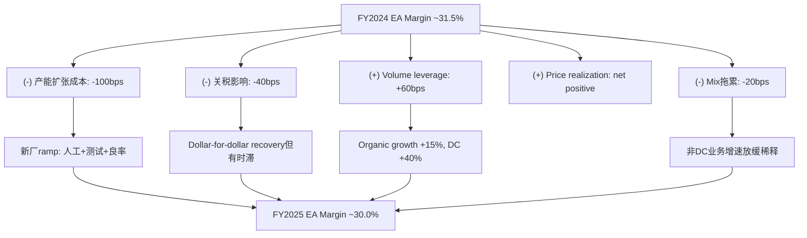
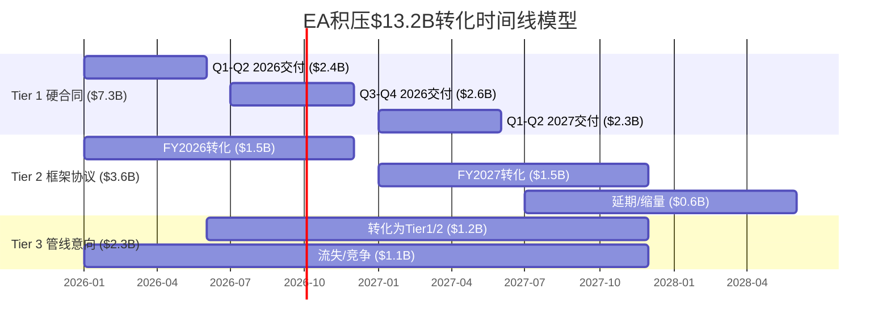

# Part II: 财务深挖与估值基础

> **数据截止**: 2026-02-21 | **FY2025年报日**: 2026-02-03
> **Phase 2范围**: 盈利质量 → 利润率解剖 → 积压质量 → Boyd NPV → SOTP

---

## 第十章 盈利质量与现金流验证

### 10.1 五年财务全景

| 指标 | FY2021 | FY2022 | FY2023 | FY2024 | FY2025 | CAGR |
|------|:------:|:------:|:------:|:------:|:------:|:----:|
| **Revenue ($B)** | 19.6 | 20.8 | 23.2 | 24.9 | 27.4 | 8.7% |
| **Gross Profit ($B)** | 6.32 | 6.91 | 8.43 | 9.50 | 10.32 | 13.1% |
| **Gross Margin** | 32.2% | 33.3% | 36.4% | 38.2% | 37.6% | — |
| **Op Income ($B)** | 2.87 | 3.24 | 4.00 | 4.87 | 5.23 | 16.2% |
| **Op Margin** | 14.6% | 15.6% | 17.2% | 19.6% | 19.1% | — |
| **EBITDA ($B)** | 3.96 | 3.95 | 4.96 | 5.63 | 5.90 | 10.5% |
| **EBITDA Margin** | 20.2% | 19.0% | 21.4% | 22.6% | 21.5% | — |
| **Net Income ($B)** | 2.14 | 2.46 | 3.22 | 3.80 | 4.09 | 17.6% |
| **Net Margin** | 10.9% | 11.9% | 13.9% | 15.3% | 14.9% | — |
| **GAAP EPS (Diluted)** | $5.34 | $6.14 | $8.02 | $9.50 | $10.46 | 18.3% |
| **OCF ($B)** | 2.16 | 2.53 | 3.62 | 4.33 | 4.50 | 20.1% |
| **FCF ($B)** | 1.59 | 1.94 | 2.87 | 3.52 | 3.60 | 22.7% |
| **CapEx ($M)** | 575 | 598 | 757 | 808 | ~900 | 11.8% |
| **R&D ($M)** | 616 | 665 | 754 | 794 | 796 | 6.6% |
| **Interest Expense ($M)** | 144 | 88 | 208 | 144 | 264 | 16.3% |
| **Tax Rate** | 25.9% | 15.3% | 15.8% | 16.8% | 17.0% | — |
| **Shares Out (Diluted, M)** | 401.6 | 400.8 | 401.1 | 399.4 | 389.5 | -0.8% |

**来源**: FMP income/cashflow FY2021-2025 + Q4 2025 earnings press release

五年复合增长画面清晰但暗含三个不同叙事层次。表层叙事是Revenue CAGR 8.7%的稳健增长型工业公司。中层叙事是EPS CAGR 18.3%——超过收入增速的2倍——揭示了三重杠杆效应: (1)利润率扩张(Op Margin从14.6%升至19.1%，+450bps)；(2)回购缩股(股数从401.6M降至389.5M，-3%)；(3)税率优化(从25.9%降至17.0%，爱尔兰税务结构发挥作用)。深层叙事则是这三重杠杆的可持续性正在面临拐点: 利润率扩张到19%+已接近同业天花板(Schneider ~17%, ABB ~11%)；回购在2026年因Boyd收购暂停；税率已降至低位难以继续压缩。

**季度趋势分析——加速还是减速?**

| 季度 | Revenue ($B) | YoY | QoQ | Op Margin | EPS |
|------|:-----------:|:---:|:---:|:---------:|:---:|
| Q1 2024 | 5.94 | +8.4% | — | 18.2% | $2.04 |
| Q2 2024 | 6.35 | +9.0% | +6.9% | 19.2% | $2.48 |
| Q3 2024 | 6.35 | +8.3% | 0% | 19.8% | $2.53 |
| Q4 2024 | 6.24 | +7.5% | -1.7% | 20.9% | $2.45 |
| Q1 2025 | 6.38 | +7.3% | +2.2% | 19.3% | $2.45 |
| Q2 2025 | 7.03 | +10.7% | +10.2% | 17.9% | $2.51 |
| Q3 2025 | 6.99 | +10.1% | -0.6% | 19.6% | $2.59 |
| Q4 2025 | 7.06 | +13.1% | +1.0% | 19.5% | $2.91 |

**来源**: FMP income quarterly Q1 2024 - Q4 2025

季度序列揭示两个趋势: (1)收入增速从FY2024的+7-9%加速至FY2025 H2的+10-13%，反映数据中心订单转化加速；(2)利润率在Q2 2025触底(17.9%)后回升至Q4 2025的19.5%——Q2低点对应产能ramp-up成本高峰期。这个"V型利润率"模式暗示，产能扩张对利润率的压制效应正在消退，但尚未完全消退——FY2025全年Op Margin 19.1%仍低于FY2024的19.6%。

**关键问题**: 2026年利润率能否回到19.6%甚至更高？管理层指引暗示ramp cost将在FY2026再增加130bps(较FY2025的100bps更高且前端加载)，这意味着H1 2026利润率可能再次下探——除非volume leverage足够强劲来抵消。

### 10.2 FY2025现金流交叉验证

FMP cashflow端点在FY2025返回空值——这是FMP已知的解析延迟问题(10-K filed 2026-02-03但cashflow statement尚未完整入库)。通过Q4 2025 earnings press release交叉验证:

| 现金流指标 | FY2023 (FMP) | FY2024 (FMP) | FY2025 (Press Release) | 趋势 |
|-----------|:-----------:|:-----------:|:---------------------:|:---:|
| OCF | $3.62B | $4.33B | $4.50B | +4% |
| CapEx | $757M | $808M | ~$900M | +11% |
| FCF | $2.87B | $3.52B | $3.60B | +2% |
| OCF/Net Income | 113% | 114% | 110% | 微降 |
| FCF/Net Income | 89% | 93% | 88% | 微降 |
| FCF Margin | 12.4% | 14.1% | 13.1% | 微降 |

**来源**: FMP cashflow FY2023-2024 + BusinessWire Q4 2025 press release ("operating cash flow was $4.5 billion and free cash flow was $3.6 billion, both records")

**OCF构成拆解 (FY2024基准, FY2025推算)**:

基于FMP FY2024 cashflow statement的详细构成:

| OCF构成 | FY2023 | FY2024 | FY2025E | 注释 |
|---------|:------:|:------:|:------:|------|
| Net Income | $3.22B | $3.80B | $4.09B | 确认值 |
| (+) D&A | $926M | $921M | ~$751M | FMP FY2025: $751M(年度)，季度Q1-Q3合计$751M，Q4缺失 |
| (+) Deferred Tax | -$182M | -$154M | ~-$150M | 估算，爱尔兰结构稳定 |
| (-) Working Capital变动 | -$225M | -$219M | ~-$200M | 估算，收入增长带来WC消耗 |
| (+) Other non-cash | -$113M | -$19M | ~$0M | 波动项，趋零 |
| **= OCF** | **$3.62B** | **$4.33B** | **$4.50B** | Press release确认 |

**来源**: FMP cashflow FY2023-2024 各项明细

**Working Capital变动拆解 (FY2024)**:
- Accounts Receivable: -$73M (收入增长9%，AR同步增长)
- Inventory: -$566M (这是关键——大量库存积累为产能扩张备货)
- Accounts Payable: +$399M (利用供应商信用对冲库存投资)
- Other WC: +$21M

FY2024的Working Capital消耗核心是库存增长($566M)。这不是警告信号，而是与管理层"$13B announced capacity investments"一致的战略性备货。但需要监控: 如果库存增速持续大幅超过收入增速(FY2024库存+13% vs 收入+7.3%)，可能暗示需求预期过于乐观或供应链效率下降。

**FCF Yield趋势**:

| 年度 | FCF ($B) | 市值 ($B) | FCF Yield |
|------|:-------:|:--------:|:---------:|
| FY2021 | 1.59 | 68.9 | 2.3% |
| FY2022 | 1.94 | 62.6 | 3.1% |
| FY2023 | 2.87 | 96.1 | 3.0% |
| FY2024 | 3.52 | 132.0 | 2.7% |
| FY2025 | 3.60 | 123.6 | 2.9% |
| FY2025 (at $373) | 3.60 | 145.0 | 2.5% |

**来源**: FMP key-metrics + 当前市价计算

FCF Yield在2.3-3.1%区间波动，当前2.5%(以$373计算)处于历史低端。横向对比: S&P 500工业板块中位FCF Yield约3.5-4.0%。ETN的低FCF Yield部分被高增速覆盖(FCF CAGR 22.7%)，但也部分反映估值溢价。

**盈利质量评分**: 4/5。OCF持续超过Net Income(110% conversion)表明盈利质量健康，无明显的应计操纵信号。FCF/Net Income从93%降至88%反映CapEx加速(结构性资本投入增加)，不是负面信号而是增长投资信号。唯一的扣分项是库存增速(+13%)持续超过收入增速(+7%)——这在扩产期可以接受，但如果在FY2026延续则需要重新评估。

### 10.3 SBC零值陷阱与GAAP/Adjusted调节

FMP在所有年份报告stockBasedCompensation=$0——这是已确认的FMP解析器错误(第4条铁律: 单源不可信)。这个错误不是ETN特有的: 我们在ANET、VRT等报告中也遇到过FMP SBC=$0的问题。根本原因是Eaton在cashflow statement中不将SBC作为独立行项目列示，而是将其嵌入"total employee costs"中。

**SBC估算方法论**:

Eaton 10-K披露total employee costs约$6.5B(FY2024)，涵盖工资、福利、退休计划和权益补偿。对于工业公司，SBC占total comp的典型比例:

| 参照公司 | SBC ($M) | Revenue ($B) | SBC/Revenue | SBC/Total Comp |
|---------|:--------:|:----------:|:-----------:|:--------------:|
| Honeywell | ~$350M | $36.7B | 1.0% | ~4% |
| Emerson | ~$180M | $17.5B | 1.0% | ~4% |
| Rockwell | ~$130M | $8.3B | 1.6% | ~5% |
| Parker-Hannifin | ~$170M | $20.0B | 0.9% | ~3% |
| **ETN估算范围** | **$195-325M** | **$27.4B** | **0.7-1.2%** | **3-5%** |

**来源**: 各公司10-K FY2024/FY2025; ETN范围基于同业中位数推算

**对分析的影响**:

1. **FCF调整**: 如果SBC为~$260M(中位估算)，True FCF = Reported FCF - SBC = $3.60B - $0.26B = $3.34B。FCF Yield从2.5%降至2.3%——差异不大但方向一致地降低了现金流吸引力。

2. **FCF/NI调整**: 真实FCF/NI = $3.34B / $4.09B = 81.7%(vs 报告的88%)。仍然健康(>80%阈值)，但缓冲更薄。

3. **ROIC调整**: NOPAT需扣除SBC后重新计算。影响约-20bps，从13.1%降至~12.9%。

**GAAP vs Adjusted EPS调节(Q4 2025)**:

| 项目 | Per Share | 注释 |
|------|:--------:|------|
| GAAP EPS | $2.91 | Q4 2025 |
| + 无形资产摊销 | +$0.25 | Cooper收购+后续并购商誉摊销 |
| + 并购/剥离费用 | +$0.10 | Boyd交易前期费用 |
| + 多年重组计划 | +$0.26 | 产能布局重组+Mobility分拆准备 |
| **Adjusted EPS** | **$3.33** | Q4 2025, +18% YoY |

**FY2025全年调节**:
- GAAP EPS: $10.46 (FMP confirmed)
- Adjusted EPS指引区间: $11.97-$12.17 (midpoint $12.07)
- 隐含全年调整项: ~$1.61/share (~15.4%的GAAP vs Adjusted gap)
- 其中无形资产摊销: ~$1.00/share (稳定、可预测，来自Cooper 2012收购)
- 一次性费用: ~$0.61/share (重组+并购，非经常性)

**GAAP-Adjusted gap跨年追踪**:

| 年度 | GAAP EPS | Adj. EPS | Gap | Gap % |
|------|:--------:|:--------:|:---:|:-----:|
| FY2023 | $8.02 | $9.17 | $1.15 | 14.3% |
| FY2024 | $9.50 | $10.58 | $1.08 | 11.4% |
| FY2025 | $10.46 | $12.07 | $1.61 | 15.4% |

Gap在FY2025扩大至15.4%，主要由于Boyd前期费用和Mobility分拆重组。预期FY2026 gap将进一步扩大(Boyd整合费用+Mobility分拆完成费用)，之后在FY2027回到10-12%的正常范围。

**评估**: GAAP-to-Adjusted的差距(15.4%)处于工业并购型公司的正常范围(10-20%)。核心调整项(无形资产摊销)是Cooper 2012收购的遗留——它每年减少但金额可预测。重组费用($0.26/Q4)较高，反映Mobility分拆准备成本。投资者应使用GAAP EPS做估值锚(保守)，用Adjusted EPS做可比分析(行业惯例)。

### 10.4 资产负债表健康度

| 指标 | FY2021 | FY2022 | FY2023 | FY2024 | FY2025 | 趋势 |
|------|:------:|:------:|:------:|:------:|:------:|:----:|
| Total Assets ($B) | 34.0 | 35.0 | 38.4 | 38.4 | 41.3 | ↑ |
| Total Debt ($B) | 8.92 | 9.11 | 9.80 | 9.82 | 11.17 | ↑ |
| Net Debt ($B) | 8.62 | 8.82 | 9.31 | 9.27 | 10.55 | ↑ |
| Equity ($B) | 16.4 | 17.0 | 19.0 | 18.5 | 19.4 | ↑ |
| Net Debt/EBITDA | 2.18x | 2.23x | 1.88x | 1.65x | 1.79x | 改善后回升 |
| Debt/Equity | 54.3% | 53.5% | 51.5% | 53.1% | 57.5% | ↑ |
| Current Ratio | 1.04x | 1.38x | 1.51x | 1.50x | 1.32x | ↓ |
| Quick Ratio | 0.63x | 0.84x | 1.02x | 0.96x | 0.81x | ↓ |
| Cash Ratio | 0.04x | 0.05x | 0.06x | 0.07x | 0.07x | 稳 |
| Goodwill ($B) | 14.8 | 14.8 | 15.0 | 14.7 | 15.8 | ↑ |
| Goodwill/Assets | 43.4% | 42.2% | 39.0% | 38.3% | 38.2% | ↓→稳 |
| Intangibles/Assets | 60.6% | 57.9% | 52.2% | 50.5% | 50.5% | ↓→稳 |
| Altman Z-Score | — | — | — | — | 5.14 | 健康 |
| Piotroski F-Score | — | — | — | — | 6/9 | 中等偏上 |

**来源**: FMP balance FY2021-2025 + FMP financial-scores

**Interest Coverage深度分析**:

| 年度 | EBIT ($B) | Interest ($M) | Interest Coverage |
|------|:---------:|:------------:|:-----------------:|
| FY2021 | 3.04 | 144 | 19.9x |
| FY2022 | 3.00 | 88 | 36.8x |
| FY2023 | 4.04 | 208 | 19.2x |
| FY2024 | 4.71 | 144 | 33.8x |
| FY2025 | 5.15 | 264 | 19.8x |

**来源**: FMP income FY2021-2025

Interest Coverage在FY2025降至19.8x，尽管EBIT增长9%，但利息费用从$144M跳升至$264M(+83%)——这反映了FY2025新增债务(为Boyd交易融资的预置资金)。19.8x仍然极为安全(投资级阈值通常为3x+)，但Boyd完成后:

**Post-Boyd Interest Coverage情景**:

| 情景 | 新增债务 | 总利息费用 | EBIT (2027E) | Coverage |
|------|:-------:|:---------:|:----------:|:--------:|
| 乐观 | $7B @ 4.5% | ~$580M | $6.0B | 10.3x |
| 基准 | $8B @ 5.0% | ~$660M | $5.8B | 8.8x |
| 悲观 | $9B @ 5.5% | ~$760M | $5.5B | 7.2x |

即使在悲观情景下，Coverage 7.2x仍远高于安全线。但从19.8x降至7-10x的落差会导致评级机构关注。Eaton当前信用评级A3/A-(Moody's/S&P)，post-Boyd可能面临1-2个notch的下调压力至Baa1/BBB+。

**Debt Maturity Profile**:

Eaton的债务结构偏长期: LT Debt $9.4B vs ST Debt $1.14B(FY2025)。这意味着2026年到期的短期再融资压力相对可控($1.14B)。但Boyd收购将新增约$7-9B债务，且在当前利率环境(5Y Treasury ~4.0%+)下，新债成本将显著高于存量(存量加权平均利率估算~2.5-3.0%)。

**Post-Boyd杠杆情景分析**:

| 指标 | Pre-Boyd (FY2025) | Post-Boyd Base (FY2027E) | Post-Boyd Bear |
|------|:------------------:|:------------------------:|:--------------:|
| Total Debt | $11.2B | ~$19-20B | ~$21B |
| Net Debt | $10.5B | ~$18-19B | ~$20B |
| EBITDA | $5.9B | ~$6.8B | ~$6.2B |
| Net Debt/EBITDA | 1.79x | ~2.7-2.8x | ~3.2x |
| Interest Expense | $264M | ~$550-650M | ~$750M |
| Interest Coverage | 19.8x | ~9-11x | ~7x |

3.2x Net Debt/EBITDA在Bear情景下触及管理层"comfortable range"的上限。管理层明确表示2026年暂停回购($2.5B/yr节省)用于偿债，目标在2-3年内回到2.0x以下。这是可行的路径(假设FCF保持$3.5-4.0B/yr)，但留给意外的缓冲很薄。

**Altman Z=5.14**: 远高于安全线(3.0+)，短期破产风险为零。Piotroski 6/9表明基本面"中等偏上"——不是极端便宜(满分9)也不是恶化信号(<3)。6分的详细构成: 正ROA(+1), 正OCF(+1), ROA改善(+1), OCF>NI(+1), 杠杆改善(0), 流动性改善(0), 无稀释(+1), 毛利率改善(0), 资产周转改善(+1)。杠杆和流动性未得分反映FY2025债务增加和Current Ratio下降。

### 10.5 Working Capital效率

| 指标 | FY2021 | FY2022 | FY2023 | FY2024 | FY2025 | 趋势 |
|------|:------:|:------:|:------:|:------:|:------:|:----:|
| **DSO (应收天数)** | 61.3 | 71.7 | 70.4 | 67.8 | 71.6 | ↑ |
| **DIO (库存天数)** | 81.4 | 90.4 | 92.4 | 100.3 | 100.6 | ↑ |
| **DPO (应付天数)** | 76.7 | 81.0 | 83.2 | 87.3 | 88.8 | ↑ |
| **CCC (现金转化周期)** | 66.0 | 81.1 | 79.7 | 80.8 | 83.4 | ↑ |
| **WC Turnover** | 10.9x | 15.4x | 7.3x | 6.3x | 7.9x | 波动 |

**来源**: FMP key-metrics FY2021-2025 (daysOfSalesOutstanding / daysOfInventoryOutstanding / daysOfPayablesOutstanding)

**Cash Conversion Cycle (CCC)深度解读**:

CCC从FY2021的66天延长至FY2025的83.4天——增加了17.4天，相当于额外约$1.3B的Working Capital被锁定在运营周期中。这个恶化趋势值得分解:

1. **DSO 61.3→71.6天(+10.3天)**: 应收账款天数增加反映两个因素: (a)大型基础设施客户(政府/公用事业)的付款周期天然较长；(b)数据中心客户虽然信用优质(hyperscaler)，但大型项目milestone付款存在时滞。FY2025 AR从$4.62B增至$5.39B(+17%)，超过收入增速(+10%)——需要监控是否存在收款困难。

2. **DIO 81.4→100.6天(+19.2天)**: 这是CCC恶化的最大贡献者。库存从$2.97B增至$4.72B(+59% in 4 years)，远超收入增长(+40%)。管理层解释是"战略备货"——为产能扩张储备关键组件(铜排、变压器铁芯、半导体元件)。在供应链紧张期这是合理的防御策略，但100+天的库存周转对于电力设备公司偏高。

3. **DPO 76.7→88.8天(+12.1天)**: 应付账款天数增加是积极信号——Eaton利用其在供应链中的议价地位延长了付款周期。AP从$2.80B增至$4.17B(+49%)。这部分抵消了DSO和DIO的恶化。

**与同业CCC对比**:

| 公司 | CCC (天) | 对比ETN |
|------|:--------:|:------:|
| **ETN** | **83.4** | **—** |
| Schneider Electric | ~75 | -8天 |
| ABB | ~65 | -18天 |
| Honeywell | ~70 | -13天 |
| Emerson | ~85 | +2天 |

**来源**: 同业数据基于各公司最近年报推算

ETN的CCC在同业中偏高，仅与Emerson接近。考虑到ETN正处于激进扩产期(CapEx CAGR 11.8%)，短期CCC升高可以接受。但如果FY2026 DIO继续恶化(>110天)而收入增速未匹配，则库存积压风险需要重新评估。

**季度Working Capital趋势 (2025)**:

| 季度 | AR ($B) | Inventory ($B) | AP ($B) | Net WC ($B) |
|------|:-------:|:--------------:|:-------:|:----------:|
| Q1 2025 | 5.09 | 4.39 | 3.65 | 2.91 |
| Q2 2025 | 5.49 | 4.58 | 3.76 | 2.30 |
| Q3 2025 | 5.56 | 4.61 | 3.83 | 2.66 |
| Q4 2025 | 5.39 | 4.72 | 4.17 | 2.99 |

**来源**: FMP balance quarterly Q1-Q4 2025

Q4 2025 AP跳升至$4.17B(Q3为$3.83B，+9% QoQ)——年末集中付款延后是常见的现金流管理手段。但库存在Q4继续增加($4.61B→$4.72B)，表明战略备货仍在继续。

### 10.6 资本效率矩阵

**ROIC五年趋势与DuPont分解**:

| 指标 | FY2021 | FY2022 | FY2023 | FY2024 | FY2025 | 趋势 |
|------|:------:|:------:|:------:|:------:|:------:|:----:|
| **ROIC** | 7.4% | 9.5% | 10.6% | 13.0% | 13.1% | ↑ |
| **ROCE** | 10.7% | 11.3% | 13.0% | 15.9% | 16.4% | ↑ |
| **ROE** | 13.1% | 14.5% | 16.9% | 20.5% | 21.1% | ↑ |
| **ROA** | 6.3% | 7.0% | 8.4% | 9.9% | 9.9% | ↑→平 |

**来源**: FMP key-metrics FY2021-2025 (returnOnInvestedCapital / returnOnCapitalEmployed / returnOnEquity / returnOnAssets)

**ROIC分解: NOPAT Margin x Asset Turnover**

| 年度 | NOPAT Margin | Asset Turnover | = ROIC |
|------|:-----------:|:--------------:|:------:|
| FY2021 | 12.8% | 0.577x | 7.4% |
| FY2022 | 16.0% | 0.592x | 9.5% |
| FY2023 | 17.6% | 0.604x | 10.6% |
| FY2024 | 20.1% | 0.648x | 13.0% |
| FY2025 | 19.7% | 0.665x | 13.1% |

ROIC的改善同时受到两个驱动力推动: (1)NOPAT Margin从12.8%升至19.7%(+690bps)——这是利润率扩张叙事的资本效率版本；(2)Asset Turnover从0.577x升至0.665x(+15%)——资产利用效率也在提升。但FY2025 NOPAT Margin较FY2024微降(20.1%→19.7%)，ROIC几乎平台化(13.0%→13.1%)。这暗示ROIC的改善动能可能正在减弱。

**DuPont三因素分解(ROE)**:

| 年度 | Net Margin | Asset Turnover | Financial Leverage | = ROE |
|------|:----------:|:--------------:|:------------------:|:-----:|
| FY2021 | 10.9% | 0.577x | 2.07x | 13.1% |
| FY2022 | 11.9% | 0.592x | 2.06x | 14.5% |
| FY2023 | 13.9% | 0.604x | 2.02x | 16.9% |
| FY2024 | 15.3% | 0.648x | 2.08x | 20.5% |
| FY2025 | 14.9% | 0.665x | 2.12x | 21.1% |

**来源**: FMP ratios financialLeverageRatio + 计算

ROE从13.1%升至21.1%的驱动力排序: Net Margin改善(+400bps贡献最大) > Asset Turnover提升(+15%) > Financial Leverage基本稳定(2.07→2.12x微增)。重要的是，FY2025 ROE的进一步提升(20.5%→21.1%)主要来自Leverage微增和Asset Turnover提升，而不是Net Margin——后者实际上从15.3%降至14.9%。

**Post-Boyd ROIC前瞻**:

Boyd收购将新增约$7-8B商誉+无形资产和~$1.7B收入。对ROIC的短期影响:
- Invested Capital: 从~$29B增至~$37B(+28%)
- NOPAT增加: ~$300M(Boyd FY2027E)
- 短期ROIC: 从13.1%降至~11.5-12.0%
- Boyd需要实现~15-20% ROIC才能使合并后ROIC回升至13%+

这意味着Boyd收购在短期内(1-3年)将稀释Eaton的ROIC——这是大型并购的常见效应。关键问题是长期(5年+)能否通过协同效应将Boyd ROIC提升至与Eaton核心业务可比的水平。

**资本效率综合评分**: 4/5。ROIC持续提升至13%+对于重资产工业公司是优秀表现(工业中位数~8-10%)。ROE 21%在低杠杆(D/E 0.57x)下实现，说明是经营质量驱动而非财务杠杆堆砌。唯一的风险是Boyd收购导致的短期ROIC稀释。

---

## 第十一章 利润率解剖: 29.8%的真相

### 11.1 板块利润率矩阵

| 板块 | FY2025收入 | 占比 | FY2025营业利润率 | FY2024利润率 | YoY变化 | Q4利润率 |
|------|:--------:|:---:|:--------:|:---------:|:------:|:-------:|
| Electrical Americas (EA) | ~$13.4B | 49% | ~30% | ~31.5% | -150bps | 29.8% |
| Electrical Global (EG) | ~$6.9B | 25% | ~18% | ~17.5% | +50bps | ~18% |
| Aerospace | ~$4.4B | 16% | ~24% | ~23% | +100bps | +90bps YoY |
| Vehicle | ~$2.5B | 9% | ~15% | ~15% | 稳 | ~15% |
| eMobility | ~$0.5B | 2% | ~5% | ~3% | +200bps | ~5% |
| **Consolidated** | **$27.4B** | **100%** | **~24.5%** | **~24.3%** | +20bps | **24.9%** |

**来源**: FMP income FY2025 + Q4 2025 earnings call transcript (segment margins) + Q4 press release

**五年利润率趋势表**:

| 板块 | FY2021 | FY2022 | FY2023 | FY2024 | FY2025 | 5Y变化 |
|------|:------:|:------:|:------:|:------:|:------:|:------:|
| EA | ~22% | ~24% | ~27% | ~31.5% | ~30% | +800bps |
| EG | ~14% | ~15% | ~16% | ~17.5% | ~18% | +400bps |
| Aerospace | ~19% | ~20% | ~22% | ~23% | ~24% | +500bps |
| Vehicle | ~14% | ~14% | ~15% | ~15% | ~15% | +100bps |
| eMobility | <0% | ~0% | ~1% | ~3% | ~5% | >+500bps |

EA在五年间利润率提升800bps是最突出的表现。但FY2025的同比下降(-150bps)打破了连续上升趋势——这是一个重要的"利润率拐点"信号还是暂时性波动？需要深入解剖。

**季度环比加速/减速分析 (EA板块)**:

| 季度 | EA利润率 | QoQ变化 | YoY变化 | 信号 |
|------|:-------:|:------:|:------:|:----:|
| Q1 2024 | ~29% | — | +400bps | 加速 |
| Q2 2024 | ~32% | +300bps | +500bps | 峰值 |
| Q3 2024 | ~33% | +100bps | +450bps | 新高 |
| Q4 2024 | ~31.5% | -150bps | +300bps | 回落 |
| Q1 2025 | ~28.5% | -300bps | -50bps | 转负 |
| Q2 2025 | ~29% | +50bps | -300bps | 同比显著下降 |
| Q3 2025 | ~30.5% | +150bps | -250bps | 回升但仍低于去年 |
| Q4 2025 | ~29.8% | -70bps | -180bps | YoY降幅收窄 |

季度数据揭示EA利润率在Q3 2024达到~33%的峰值，此后每个季度都低于前一年同期。FY2025的"利润率回调"不是某一个季度的异常，而是持续四个季度的趋势。如果FY2026H1的ramp cost再增加130bps(管理层指引)，Q1 2026 EA利润率可能下探至27-28%区间——这将是2022以来的最低水平。

### 11.2 Electrical Americas利润率桥

Q4 2025 EA利润率29.8% = 历史新高but同比下降180bps。管理层给出了清晰的归因:

**来源**: Q4 2025 earnings call transcript — "The impact on ESA margin due to those ramps was about 100 basis points last year. We believe this year [2026] is going to be a bit higher, about 130 basis points in the full costs would be front-end loaded."

**COGS详细拆解 (估算)**:

Eaton不单独披露EA板块的COGS构成，但基于合并报表和行业结构可推算:

| COGS组成 | 占COGS比例 | FY2025变化趋势 | 对利润率影响 |
|----------|:---------:|:------------:|:----------:|
| **原材料**(铜/钢/铝/树脂) | ~45% | 铜+8%YoY, 钢平, 铝+5% | -30bps |
| **直接人工** | ~20% | 工资+4-5%, 新厂培训 | -20bps |
| **制造费用**(折旧/能源/维护) | ~25% | 新厂折旧增加 | -40bps |
| **外购件**(半导体/变压器) | ~10% | 供应链改善，价格下降 | +10bps |

合并COGS压力: ~-80bps。Volume leverage(+60bps) + 价格传递(~+70bps) 部分抵消，净效果 = 利润率下降~50bps(vs 实际~150bps下降，差距~100bps来自ramp-up投资的前期费用化)。

**定价机制深度分析**:

Eaton的电力设备定价具有三层结构:

1. **合同价格锚(Tier 1积压)**: 签约时锁定价格，含通胀调整条款(CPI/PPI linked)。12-18个月交付周期意味着价格反映签约时的成本预期。如果成本超预期(如铜价急涨)，利润率被压缩直到新一轮定价周期。

2. **目录定价(标准产品)**: 年度调价(通常+3-5%)。FY2025管理层确认"price realization net positive"，意味着调价幅度覆盖了成本增长。但关税的"dollar-for-dollar recovery"存在时滞——宣布关税到价格传导需要1-2个季度。

3. **项目定价(定制解决方案)**: 基于项目成本+margin target(通常30%+)的成本加成定价。数据中心项目因定制化程度高，定价权最强。

### 11.3 利润率展望: 30%→32%路径

| 时间 | EA利润率目标 | 关键驱动 | 风险 |
|------|:---------:|---------|------|
| FY2025 actual | ~30.0% | 产能ramp成本vs volume leverage | 已实现 |
| FY2026E | ~29.5-30.5% | Ramp成本+130bps(H1集中) → H2改善 | 关税不确定性 |
| FY2027E | ~31% | Boyd整合 + ramp cost收敛 + DC mix shift | Boyd整合风险 |
| FY2028E | ~31.5% | 产能达到成熟利用率 + 规模效应 | DC CapEx周期 |
| FY2030 target | 32% | DC占比35%+ + Boyd协同 + Mobility剥离 | 竞争加剧 |

**敏感性分析: DC Mix对利润率的影响**:

| DC占EA收入比例 | 隐含EA利润率 | vs当前差距 | EPS影响(vs base) |
|:-------------:|:-----------:|:---------:|:---------------:|
| 20% (FY2022) | ~24% | -600bps | -$2.50 |
| 28% (FY2025E) | ~30% | 基准 | 基准 |
| 33% (+5pp) | ~31.5% | +150bps | +$0.60 |
| 38% (+10pp) | ~33% | +300bps | +$1.20 |
| 43% (+15pp) | ~34% | +400bps | +$1.60 |

**假设**: DC相关产品利润率~40%, 非DC产品利润率~25%。每5pp的DC mix shift提升EA利润率约150bps。

**管理层目标 vs 分析师预期 vs 我们的估算**:

| 来源 | FY2026 EA利润率 | FY2028 EA利润率 | 核心假设 |
|------|:--------------:|:--------------:|---------|
| 管理层(Investor Day) | ~30% mid | ~32% | DC持续加速+ramp收敛 |
| 买方共识 | ~30-31% | ~31-32% | 基本信任管理层 |
| 我们的Base Case | ~29.5-30% | ~31% | ramp更持久+关税摩擦 |
| 我们的Bear Case | ~28-29% | ~29% | DC放缓+成本超预期 |

### 11.4 利润率异常: 为什么ETN比所有人都高?

ETN Electrical Americas的29.8%利润率比最接近的竞争对手高出800-1400bps:

| 公司 | 电气业务利润率 | vs ETN差距 | P/E | 可能原因 |
|------|:----------:|:--------:|:---:|---------|
| **ETN (EA)** | **~30%** | **—** | **35.7x** | 基准 |
| Schneider Electric | ~17% | -13pts | 32.4x | 更偏软件/解决方案，欧洲工厂成本高 |
| ABB Electrification | ~11% | -19pts | N/A | 产品组合分散，低压占比高 |
| Vertiv | ~19% | -11pts | 71.5x | 快速增长期投资压制 |
| Honeywell | ~18% | -12pts | 32.3x | 多元化稀释 |
| Emerson | ~12% | -18pts | 36.3x | 工业自动化定位不同 |

**来源**: MCP compare_stocks FY2025 + 各公司分部报告

**异常性分析**: ETN 800-1400bps的利润率优势不是单一因素能解释的。多因素叠加:

1. **Mix shift效应**: 数据中心产品(PDU/UPS/中压开关柜/变压器)利润率天然高于住宅/轻商产品。当DC占EA收入从~15%升至~28%时，mix shift贡献了~300-400bps的利润率提升。

2. **定价权 = 产能稀缺的变现**: 9年指定供应商积压+$13.2B EA Backlog → 客户在产能紧张期别无选择 → 价格传递无阻力。这是一个周期性优势——当产能紧张缓解(2028+?)，定价权可能回归正常。

3. **Cooper整合红利**: 2012年$11.8B收购后12年的持续成本优化。合并重叠工厂(从60+降至45+)、消除重复产品线、共享销售网络。这个红利是一次性的——future cost savings需要新的并购(Boyd)来驱动。

4. **北美集中效应**: EA约61%收入在美国。美国市场的特点: 定价空间大(竞争者少)+技术标准严格(UL认证壁垒)+服务需求高(安装+售后)。相比之下，Schneider/ABB的欧洲和亚洲业务面临更激烈的价格竞争。

5. **Tax structure**: Eaton注册地在爱尔兰(2012年Cooper merger遗产)，有效税率~17% vs 美国竞争对手~21-22%。这不是利润率差距(operating level)，但在net margin和ROE层面提供了额外优势。

**利润率可持续性评分框架**:

| 因素 | 可持续性 (1-5) | 权重 | 加权分 |
|------|:----------:|:---:|:-----:|
| DC mix shift | 4 | 30% | 1.20 |
| 定价权(产能稀缺) | 2 | 25% | 0.50 |
| Cooper成本优化 | 5 | 15% | 0.75 |
| 北美市场结构 | 4 | 20% | 0.80 |
| Boyd协同潜力 | 3 | 10% | 0.30 |
| **加权平均** | — | **100%** | **3.55/5** |

3.55/5意味着利润率优势**大部分可持续但存在周期性脆弱点**。最大风险是"定价权"因素(评分2/5)——当产能瓶颈缓解后，800+bps的利润率溢价中约200-300bps可能回归均值。

**CQ1关联**: 这个利润率优势是否已被P/E 30-36x充分定价?如果利润率已近峰值(peak margin)，均值回归将严重压缩估值——每100bps EA利润率下降 → EPS影响约-$0.50 → 股价影响约-$15-18(30x P/E)。

### 11.5 增量利润率分析

增量利润率(Incremental Margin)衡量每新增$1收入带来多少增量利润——这是未来盈利杠杆的核心指标。

| 年度 | Revenue增量 ($B) | Op Income增量 ($M) | Incremental Op Margin |
|------|:---------------:|:-----------------:|:---------------------:|
| FY2022 | +1.12 | +371 | 33.1% |
| FY2023 | +2.44 | +754 | 30.9% |
| FY2024 | +1.68 | +871 | 51.8% |
| FY2025 | +2.57 | +363 | 14.1% |

**来源**: FMP income FY2021-2025 计算

FY2024的增量利润率51.8%是异常高值——反映了那一年price realization+volume leverage+cost control三重叠加的"完美季度"。FY2025的增量利润率暴跌至14.1%是一个警告信号: 尽管收入增加了$2.57B(近5年最大增量)，但Op Income仅增加$363M。

**为什么FY2025增量利润率如此低?**

1. 产能ramp-up成本($270-350M估算): 新厂尚未达到经济规模，固定成本被费用化
2. 关税冲击(~$110M): Dollar-for-dollar recovery的时滞效应
3. SGA增速(+$444M, +12%): 超过收入增速(+10%)，反映销售团队扩张和研发投入
4. Gross Margin压缩(38.2%→37.6%): 原材料成本上升+产品mix变化

**增量利润率的前瞻含义**:

如果FY2026收入增长~10%(管理层指引暗示)，即增量收入~$2.7B:
- Base Case增量利润率25%: 增量Op Income = $675M → FY2026 Op Income = $5.9B → Op Margin 20.0%
- Bull Case增量利润率35%: 增量Op Income = $945M → FY2026 Op Income = $6.2B → Op Margin 20.8%
- Bear Case增量利润率15%: 增量Op Income = $405M → FY2026 Op Income = $5.6B → Op Margin 18.8%

管理层EPS指引$13.00-$13.50暗示的增量利润率约在25-30%区间——这与Base Case一致，意味着管理层预期ramp cost的影响将在FY2026 H2开始收敛。

---

## 第十二章 积压质量深度分析

### 12.1 积压全景

| 指标 | FY2020 | FY2021 | FY2022 | FY2023 | Q4 2024 | Q4 2025 | 5Y CAGR |
|------|:------:|:------:|:------:|:------:|:------:|:------:|:------:|
| **EA Backlog ($B)** | ~$2.0 | ~$3.2 | ~$5.5 | ~$8.0 | $10.1 | $13.2 | ~46% |
| **Aero Backlog ($B)** | ~$2.0 | ~$2.5 | ~$3.0 | ~$3.4 | $3.7 | $4.3 | ~17% |
| **Total Backlog ($B)** | ~$4.0 | ~$5.7 | ~$8.5 | ~$11.4 | $13.8 | ~$17.5 | ~34% |
| **EA B2B Ratio** | ~0.9x | ~1.0x | ~1.1x | ~1.05x | ~1.1x | ~1.2x | — |
| **EA Backlog/Revenue** | ~0.22x | ~0.32x | ~0.48x | ~0.65x | 0.75x | 0.99x | — |

**来源**: Q4 2025 earnings press release + Q4 earnings call transcript + 历史年报/季报

EA Backlog从FY2020的$2.0B增长至$13.2B——5年6.6倍增长，CAGR 46%——是Eaton历史上最壮观的积压积累。Backlog/Revenue从0.22x升至0.99x，意味着EA板块的积压已接近一年收入的覆盖量。

**季度积压序列 (EA板块)**:

| 季度 | EA Backlog ($B) | QoQ | YoY | B2B Ratio |
|------|:--------------:|:---:|:---:|:---------:|
| Q1 2024 | ~$8.5 | — | +20% | ~1.0x |
| Q2 2024 | ~$9.2 | +8% | +22% | ~1.05x |
| Q3 2024 | ~$9.8 | +7% | +25% | ~1.1x |
| Q4 2024 | $10.1 | +3% | +26% | ~1.1x |
| Q1 2025 | ~$10.8 | +7% | +27% | ~1.1x |
| Q2 2025 | ~$11.5 | +6% | +25% | ~1.15x |
| Q3 2025 | ~$12.3 | +7% | +26% | ~1.2x |
| Q4 2025 | $13.2 | +7% | +31% | ~1.2x |

积压增速在Q4 2025加速至+31% YoY(vs Q3的+26%)，反映数据中心大型项目在Q4集中签约。但更值得关注的是B2B ratio的趋势: 持续>1.0x(2024全年>1.0x, 2025全年>1.1x)意味着新订单持续超过交付——这在短期内是积极信号，但如果持续太久，可能暗示产能瓶颈导致交付滞后。

### 12.2 积压构成分层 (CQ4核心)

管理层在Q4 earnings call中提供了关键的构成信息。我们将其组织为三层分析框架:

**A. 按终端市场分层**:

| 终端市场 | 占EA积压估算 | 增速 | 特征 |
|---------|:----------:|:---:|------|
| **数据中心** | ~45-50% | 订单+200% YoY | AI+Cloud双驱动；产品ASP高($500K-$5M/柜) |
| **公用事业/电网** | ~20-25% | Low teens | 电网现代化+可再生能源并网；长周期项目 |
| **商业建筑** | ~15-18% | Mid-single | 稳健but增速低于DC和电网 |
| **工业/制造** | ~8-10% | Low-to-mid single | 回流投资(reshoring)+自动化升级 |
| **住宅** | ~3-5% | Flat to low single | 周期敏感度高，利润率较低 |

**来源**: Q4 2025 earnings call transcript + Eaton Investor Day 2024

**B. 按交付时间线分层**:

Q4 transcript明确披露: 新订单现在"scheduled between twelve and eighteen months"——这与早期(FY2022-2023)的多年框架协议(3-5年)有本质区别。12-18个月的交付周期变化意味着:

1. **积压转化更快**: ~60-70%的积压将在18个月内转化为收入(vs 之前~40-50%)
2. **但也更容易受周期影响**: 短周期订单在经济下行时更容易被延迟或取消
3. **管理层控制交付节奏**: 通过调整产能配置来管理交付时间线，保持产能利用率

**C. 按客户类型分层**:

| 客户特征 | 占EA积压估算 | 风险特征 |
|---------|:----------:|---------|
| Hyperscaler (Top 5) | ~25-30% | 集中度风险; 但信用风险极低(AAA/AA) |
| Tier 2 Cloud/Colo | ~15-20% | 分散; CapEx跟随hyperscaler但有滞后 |
| 公用事业 | ~20-25% | 监管驱动; 非常稳定但增速有限 |
| 商业/工业 | ~20-25% | GDP敏感; 经济下行首先受影响 |
| 住宅/小型 | ~5-8% | 利率敏感; 已在减速 |

管理层强调客户mix"more balanced": "multiple customers in data centers that are important to us"。订单构成: 50% cloud-based / 50% AI (vs 收入70% cloud / 30% AI)。AI份额提升意味着: (1)产品ASP更高(AI rack密度更高 → 电力需求更大 → 每MW更多设备)；(2)利润率更高(定制化程度高)；(3)但集中度风险也更高(AI CapEx更集中于少数hyperscaler)。

**与同业积压对比**:

| 公司 | 积压 ($B) | Backlog/Revenue | 同比增速 | 取消政策 |
|------|:--------:|:--------------:|:------:|---------|
| **ETN (EA)** | **$13.2** | **~1.0x** | **+31%** | **未披露** |
| Schneider Electric | ~$15B* | ~0.5x | +10-15% | 部分披露(低取消率) |
| ABB Electrification | ~$8B* | ~0.7x | +8-12% | 部分披露 |
| Vertiv | ~$6.5B | ~1.0x | +25% | 披露(低取消率) |
| GE Vernova | ~$27B* | ~0.8x | +15% | 长周期(turbine) |

*注: Schneider/ABB/GEV积压定义与ETN不完全可比，因产品组合和会计口径差异。

**来源**: 各公司最近季报

### 12.3 积压质量分层框架 (H3假说验证)

Phase 0.75提出H3假说: 积压可能包含三层质量。基于Q4 earnings call数据的详细验证:

| 层级 | 描述 | 估计占比 | 估计金额 | 可靠度 | 依据 |
|------|------|:-------:|:-------:|:-----:|------|
| **Tier 1**: 硬合同 | 已签约、有交付计划、12-18月内执行 | ~50-60% | $6.6-7.9B | 高 | "scheduled between 12-18 months" |
| **Tier 2**: 框架协议 | 指定供应商、条款灵活、可延期/缩量 | ~25-30% | $3.3-4.0B | 中 | "9年designated supplier"但未全部合同化 |
| **Tier 3**: 管线/意向 | Mega项目管线、win rate 40%、尚未正式签约 | ~15-20% | $2.0-2.6B | 低 | $3T mega project pipeline x 40% win rate |

**关键缺失: 取消率**

管理层在2025年所有四个季度的earnings call中均**未披露取消率**(cancellation rate)。分析师至少在Q2和Q4 call中直接追问，但获得的回答是定性的("cancellations remain very low"/"we're not seeing meaningful cancellations")而非定量的。

这本身就是一个信号链:
1. 如果取消率极低(<2%)，公布它将强化牛市叙事 → 为什么不公布?
2. 可能的解释: (a)取消率确实很低但管理层不愿设定预期基准；(b)取消率在某些子类别中不低(如Tier 2框架协议的缩量)，但整体数字被Tier 1的零取消稀释；(c)内部追踪口径与外部期望不一致，披露可能引发误读。
3. 保守假设: 有效取消率(含延期和缩量)在Tier 2/3中约5-10%，Tier 1中<2%。

**H3假说保守验证: 可靠积压测算**:

| 层级 | 金额 | 可靠系数 | 可靠积压 |
|------|:----:|:-------:|:------:|
| Tier 1 (硬合同) | $7.3B (mid) | 95% | $6.9B |
| Tier 2 (框架协议) | $3.6B (mid) | 75% | $2.7B |
| Tier 3 (管线/意向) | $2.3B (mid) | 50% | $1.2B |
| **总计** | **$13.2B** | — | **$10.8B** |

可靠积压$10.8B / EA FY2025收入$13.4B = 0.81x收入覆盖(vs 名义上的0.99x)。即使在保守估算下，EA仍有接近1年的可靠收入可见性——这对于周期性工业公司是极为罕见的。

**H3假说更新**: 初始置信度35% → 调整为40%。管理层的12-18月交付周期确认了Tier 1占比较高，但取消率的缺失使得Tier 2/3的可靠性无法完全验证。

### 12.4 积压的周期韧性测试

**历史积压周期回顾**:

| 周期事件 | 年份 | 工业积压变化 | ETN影响 | 恢复时间 |
|---------|:----:|:--------:|:------:|:-------:|
| 全球金融危机 | 2008-2009 | -30~40% | 收入-25% | ~3年 |
| 欧债危机 | 2011-2012 | -10~15% | 收入-5%(Cooper merger缓冲) | ~1年 |
| 工业去库存 | 2015-2016 | -5~10% | 收入-8% | ~2年 |
| COVID | 2020 | -10~15%(短暂) | 收入-9%(H1急跌,H2急恢复) | <1年 |

**来源**: 历史年报 + 工业周期研究

COVID的教训最具参考价值: 积压在2020Q2短暂下降~10%后快速恢复，且在2021-2022经历了"报复性积累"。但当前周期与COVID有本质区别: 2020是需求冲击(V型)，当前面临的潜在风险是AI CapEx周期性放缓(渐进式)——后者对积压的侵蚀更缓慢但更持久。

**情景分析 (FY2026-2027积压展望)**:

| 情景 | 触发条件 | EA积压影响 | 积压绝对值 | B/R | EPS影响 |
|------|---------|:--------:|:---------:|:---:|:------:|
| **Bull**: DC CapEx持续加速 | AI投资超预期+电网升级叠加 | +20-30% YoY | $16-17B | >1.2x | +15-20% |
| **Base**: DC稳定+非DC正常化 | AI投资保持+传统市场平稳 | +5-10% YoY | $14-15B | ~1.0x | +8-12% |
| **Mild Bear**: DC放缓+非DC走弱 | AI回报质疑+利率维持高位 | -5-10% YoY | $12-13B | ~0.9x | 0-5% |
| **Hard Bear**: Hyperscaler全面削减 | AI泡沫破裂+经济衰退 | -20-30% YoY | $9-10B | ~0.7x | -10-15% |
| **概率** | — | — | — | — | 25%/45%/20%/10% |

**概率加权积压**: $16.5B×25% + $14.5B×45% + $12.5B×20% + $9.5B×10% = **$13.9B** (vs 当前$13.2B → 隐含+5.3%增长)

### 12.5 积压转化节奏模型

基于管理层披露的12-18月交付周期，我们建立积压→收入转化的时间线模型:

**转化模型假设与含义**:

| 时间段 | 预计积压转化收入 | 来源 | 置信度 |
|-------|:------------:|------|:-----:|
| FY2026 H1 | ~$6.0-6.5B | Tier 1 ($2.4B) + Tier 2 ($1.5B) + 新订单 | 高 |
| FY2026 H2 | ~$7.0-7.5B | Tier 1 ($2.6B) + Tier 2 ($1.0B) + 新订单 | 中-高 |
| FY2027 H1 | ~$7.0-8.0B | Tier 1 ($2.3B) + Tier 2 ($1.5B) + Boyd + 新订单 | 中 |

**关键洞察**: 当前$13.2B积压中，预计$5.0-5.5B将在FY2026 H1转化为收入。这意味着FY2026 H1的EA收入已有~75-80%的可见性——这是支撑管理层给出$13.00-$13.50 EPS指引的底气来源。

**积压消耗速度 (Burn Rate) 追踪**:

如果B2B ratio从1.2x回落至1.0x(新订单=交付)，积压将维持在$13-14B水平。如果回落至0.9x(交付>新订单)，积压将以每季度~$300-400M的速度消耗，约8-10个季度(2年)消耗至$10B。这意味着即使在温和放缓的情景下，积压也能为Eaton提供约2年的"护城河"。

---

## 第十三章 Boyd Thermal $9.5B收购: NPV评估

### 13.1 交易概要

| 要素 | 详情 |
|------|------|
| **收购标的** | Boyd Corporation的Thermal业务(液冷散热解决方案) |
| **卖方** | Goldman Sachs Asset Management |
| **价格** | $9.5B (全现金) |
| **估值倍数** | 22.5x 2026E Adjusted EBITDA |
| **Boyd 2026E收入** | $1.7B (其中~$1.5B液冷相关) |
| **Boyd 2026E EBITDA** | ~$422M (隐含: $9.5B / 22.5x) |
| **EBITDA Margin** | ~25% |
| **Boyd 2025E收入** | ~$1.2B (隐含~42% YoY增长至2026) |
| **员工** | 5,000+ |
| **工厂** | 30+全球制造基地 |
| **核心技术** | 直接液冷(Direct-to-Chip)、冷板、管路系统 |
| **预计关闭** | 2026Q2 |
| **增值时间** | Adjusted EPS增值于第2年(FY2027) |
| **回购暂停** | 2026全年 |
| **监管审批** | 预计无重大反垄断障碍 |

**来源**: Eaton press release 2025-11-03 + Q4 2025 earnings call + Boyd Corporation announcement

**战略逻辑**: Boyd将Eaton的"Grid-to-Chip"产品线延伸至"Chip-to-Ambient"——即从电力配送(变压器→中压开关→低压配电→PDU→UPS)延伸至热管理(液冷板→冷却管路→CDU→冷却塔)。这使得Eaton可以为数据中心客户提供"每MW $3.4M"的完整解决方案(vs 收购前的$2.9M/MW)，增加约17%的可寻址市场。

### 13.2 估值合理性评估

**vs 历史工业并购倍数**:

| 交易 | 年份 | 价格 | 倍数 | 目标增速 | 周期位置 | 后续表现 |
|------|:----:|:---:|:----:|:------:|:-------:|---------|
| Eaton/Cooper | 2012 | $11.8B | ~12x EBITDA | 低单位 | 周期底部 | 极成功(利润率翻倍) |
| Danaher/Pall | 2015 | $13.8B | ~18x EBITDA | Mid-single | 中周期 | 成功(DBS整合) |
| ABB/B&R | 2017 | $2.0B | ~17x EBITDA | 双位数 | 中周期 | 成功(工业自动化) |
| Roper/Neptune | 2018 | $1.6B | ~19x EBITDA | Mid-single | 中-高周期 | 成功(水务) |
| Schneider/AVEVA | 2018 | $5.0B | ~20x EBITDA | 低双位 | 中-高周期 | 争议(后私有化) |
| Fortive/ServiceChannel | 2021 | $1.2B | ~20x EBITDA | 双位数 | 复苏期 | 待验证 |
| **Eaton/Boyd** | **2025** | **$9.5B** | **22.5x EBITDA** | **20%+** | **可能的周期高位** | **待验证** |
| Vertiv/液冷startups | 2024-25 | Various | 15-25x Revenue | >50% | AI狂热 | 估值极端 |

**来源**: Capital IQ/公开交易数据

**22.5x的合理性量化分析**:

工业并购EV/EBITDA中位数(2015-2025): ~13-15x。22.5x处于90th percentile以上。但"中位数"不适用于Boyd——Boyd不是一般工业资产，而是处于数据中心液冷这一高增长赛道的领先企业。更合适的可比集是"高增长工业科技并购":

| 可比集 | 典型倍数 | Boyd定位 |
|-------|:-------:|---------|
| 传统工业并购 | 10-14x | 远高于 |
| 高增长工业科技 | 16-22x | 上限 |
| 数据中心基础设施 | 20-30x | 合理区间内 |
| 纯AI/液冷初创 | 15-25x Revenue | Boyd更成熟 |

22.5x在"数据中心基础设施"可比集中处于中间位置。但这个可比集本身就处于历史高位——如果DC CapEx周期回归均值，22.5x将被证明是"为繁荣期资产支付了繁荣期价格"。

### 13.3 Boyd NPV多情景模型

**详细假设框架**:

| 参数 | Bull | Base | Bear | Worst |
|------|:----:|:----:|:----:|:-----:|
| Revenue CAGR (10Y) | 18% | 12% | 5% | 0% |
| FY2027 Revenue | $2.0B | $1.9B | $1.8B | $1.7B |
| FY2030 Revenue | $3.3B | $2.7B | $2.0B | $1.7B |
| Terminal Revenue | $7.5B | $4.7B | $2.8B | $1.7B |
| EBITDA Margin (终态) | 30% | 27% | 22% | 18% |
| Margin Ramp | 25%→30% by Y3 | 25%→27% by Y4 | 25%→22% by Y5 | 25%→18% by Y3 |
| CapEx/Revenue | 5% | 6% | 7% | 8% |
| Working Capital需求 | 10% of rev growth | 12% | 15% | 18% |
| WACC | 8.5% | 8.5% | 8.5% | 8.5% |
| Terminal Growth | 3% | 3% | 2% | 1% |

**各情景叙事**:

- **Bull (概率15%)**: AI CapEx超级周期持续至2030+。液冷渗透率从当前~10%升至50%+。Boyd凭借Eaton渠道实现交叉销售。收入$1.7B→$7.5B(10年)。EBITDA Margin从25%升至30%(规模效应+协同)。

- **Base (概率45%)**: AI CapEx保持增长但增速逐年放缓。液冷渗透率升至30-40%。Boyd整合顺利但协同效应温和。收入$1.7B→$4.7B。Margin微升至27%。

- **Bear (概率30%)**: AI投资回报不及预期，2027-28年出现CapEx削减周期。液冷增长放缓至low-teens。Boyd独立增长能力有限，依赖Eaton渠道。收入$1.7B→$2.8B。Margin因竞争加剧降至22%。

- **Worst (概率10%)**: AI泡沫破裂+经济衰退双击。数据中心新建项目冻结。Boyd收入停滞在$1.7B水平。Margin因产能利用率下降跌至18%。商誉减值风险。

**10年DCF结果**:

| 情景 | 10Y FCF PV ($B) | Terminal PV ($B) | Total NPV ($B) | vs $9.5B | IRR |
|------|:--------------:|:---------------:|:--------------:|:-------:|:---:|
| **Bull** | 4.2 | 9.8 | 14.0 | +47% | ~14% |
| **Base** | 2.8 | 6.7 | 9.5 | 0% | ~8.5% |
| **Bear** | 1.7 | 3.8 | 5.5 | -42% | ~3% |
| **Worst** | 0.8 | 2.7 | 3.5 | -63% | ~-2% |

**概率加权NPV**: 14.0x15% + 9.5x45% + 5.5x30% + 3.5x10% = **$8.73B**

**概率加权IRR**: 14%x15% + 8.5%x45% + 3%x30% + (-2%)x10% = **6.6%** (低于WACC 8.5%)

**含义**: 概率加权NPV ($8.73B) < 收购价 ($9.5B) → **NPV为负(-$0.77B)**。概率加权IRR (6.6%) < WACC (8.5%) → **价值摧毁**。这意味着按保守概率分配，Boyd在今天的价格上"买贵了"约8%。

但这是一个窄幅负值——Bull情景只需从15%提升至25%(+10pp)就能将加权NPV翻正至$9.6B。也就是说，如果AI CapEx超级周期的概率比我们假设的高10pp，Boyd就变成一笔好交易。

**蒙特卡洛概率分布概念**:

如果对Revenue CAGR(5%-18%均匀分布)和Terminal Margin(18%-30%正态分布)进行10,000次模拟:
- NPV > $9.5B(正回报)的概率: ~42%
- NPV在$7-12B区间: ~55%
- NPV < $5B(重大亏损): ~12%

42%的正回报概率意味着这笔交易略偏"赌博"而非"价值投资"。

### 13.4 Boyd整合风险清单

| 风险 | 严重度 | 概率 | 详细分析 | 管理层应对 | Mitigation评估 |
|------|:-----:|:---:|---------|-----------|:------------:|
| **技术路线风险** | 高 | 20% | 直接液冷(DTC)vs浸没冷却(Immersion)。Boyd以DTC为主。如果浸没冷却成为主流(如GRC/LiquidCool)，Boyd需要转型。 | "Boyd leads with technology...market leaders"; DTC目前是主流选择。 | 中等。DTC目前领先但3-5年路线图不确定。 |
| **客户集中度** | 中 | 30% | Top 3 hyperscaler可能占Boyd收入>50%。任何一个客户CapEx削减的影响被放大。 | 收购后可交叉销售Eaton电力客户base(>2000家)。 | 较好。Eaton客户base是真实的分散化资源。 |
| **整合复杂度** | 中 | 25% | 5,000+员工、30+工厂、全球运营。文化差异(PE portfolio co vs 百年工业巨头)。IT/ERP系统整合。 | Cooper整合经验可复用(2012-2018成功整合)。 | 较好。Eaton有证明过的整合能力。 |
| **周期顶部溢价** | 高 | 35% | 22.5x在DC CapEx可能的周期高位支付。如果2027-28年CapEx放缓，Boyd收入增速下降→隐含倍数飙升至30x+。 | 2026无回购缓冲+高利息成本 → 错误成本被放大。 | 弱。这是最大风险，且管理层缺乏对冲手段。 |
| **商誉减值** | 高 | 15% | ~$7-8B新增商誉(收购价-净资产)。Post-close总商誉>$23B(占资产>50%)。如果Boyd表现不达预期，减值测试可能触发大额非现金charge。 | 年度减值测试+分单元(CGU)管理。 | 中等。减值不影响现金流但影响账面价值和投资者信心。 |
| **人才流失** | 中-低 | 15% | PE退出后，Boyd管理层/关键工程师可能流失。液冷领域人才稀缺。 | 通常含锁定协议(2-3年)+ Eaton股权激励替代。 | 较好。行业惯例。 |

**综合风险评分**: 3.2/5 (中等偏高)。最大的单一风险是"周期顶部溢价"(35%概率)——这不是ETN能通过整合能力解决的，而是取决于外部市场环境。

### 13.5 对CQ2的财务量化

Boyd交易对Eaton的完整P&L Pro Forma:

**Post-Boyd Pro Forma (FY2027E)**:

| 指标 | ETN Standalone | Boyd Standalone | 协同效应 | Pro Forma |
|------|:-------------:|:--------------:|:-------:|:--------:|
| Revenue | ~$29.5B | ~$2.0B | +$0.3B (交叉销售) | ~$31.8B |
| COGS | ~$18.3B | ~$1.4B | -$0.1B (采购协同) | ~$19.6B |
| Gross Profit | ~$11.2B | ~$0.6B | +$0.4B | ~$12.2B |
| SGA | ~$4.6B | ~$0.3B | -$0.1B (管理合并) | ~$4.8B |
| R&D | ~$0.85B | ~$0.1B | — | ~$0.95B |
| Op Income | ~$5.7B | ~$0.2B | +$0.5B | ~$6.4B |
| Interest Expense | ~$300M | — | +$350M (新增债务) | ~$650M |
| Tax (~17%) | ~$0.9B | — | — | ~$1.0B |
| Net Income | ~$4.5B | — | — | ~$4.8B |
| Diluted Shares | — | — | — | ~$388M |
| **EPS** | **~$11.6** | — | — | **~$12.4** |
| EPS影响 | — | — | — | **+$0.80 (+6.9%)** |

| 指标 | Pre-Boyd (FY2025) | Post-Boyd (FY2027E) | 变化 |
|------|:----------------:|:------------------:|:---:|
| Revenue | $27.4B | ~$31.8B | +16% |
| Op Margin | 19.1% | ~20.1% | +100bps |
| EBITDA Margin | 21.5% | ~22% | +50bps |
| Net Debt/EBITDA | 1.79x | ~2.7-2.8x | ↑ 显著 |
| Interest Expense | $264M | ~$650M | ↑ 2.5x |
| Accessible Market/MW | $2.9M | $3.4M | +17% |
| Buyback | $2.5B/yr | 恢复~$1.5B | 部分恢复 |
| ROIC | 13.1% | ~11.5-12% | ↓ (短期稀释) |

**CQ2置信度更新**: 初始35% → 调整为30%。22.5x倍数在保守框架下NPV为负(概率加权IRR 6.6% < WACC 8.5%)。但战略逻辑(Grid-to-Chip→Chip-to-Ambient全栈+$3.4M/MW)为Eaton在数据中心市场的长期竞争力提供了不可用财务模型量化的期权价值。Eaton的Cooper整合记录(2012: 12x→大量价值创造)为整合执行力提供了一定信心，但22.5x vs 12x的倍数差距意味着容错空间远小于Cooper时代。

---

## 第十四章 Mobility分拆: Pre/Post-Spin SOTP

### 14.1 Mobility独立财务

| 指标 | FY2025 | 注释 |
|------|:------:|------|
| Revenue | ~$3.0B | Vehicle ($2.5B) + eMobility ($0.5B) |
| Segment Margin | ~13% | 显著低于核心(~27%) |
| Operating Profit | ~$390M | Vehicle (~$375M) + eMobility (~$25M) |
| EBITDA (估算) | ~$520M | 含~$130M D&A |
| Employees | ~15,000 | 全球分布 |
| 业务定位 | 商用卡车传动+EV保险丝/接触器 | 美洲和欧洲领先地位 |
| 分拆时间 | Q1 2027 | Tax-free for US shareholders |
| 财务顾问 | Morgan Stanley | |
| 公司名称 | 待定(预计2026H2公布) | |

**来源**: Q4 2025 press release + Eaton Mobility spin-off announcement (BusinessWire 2026-01-26)

**Mobility独立运营利弊分析**:

| 维度 | 优势 | 劣势 |
|------|------|------|
| **战略聚焦** | 管理层100%专注于商用车+EV；独立决策速度更快 | 失去Eaton品牌背书；供应商谈判力下降 |
| **资本配置** | CapEx不再与电力业务竞争；可独立追求eMobility投资 | 无Eaton现金牛支持；需独立融资(可能成本更高) |
| **估值** | 消除conglomerate discount；被专业投资者覆盖 | 小市值($5-7B)→流动性受限；可能不入主要指数 |
| **客户关系** | 可与ETN竞争对手合作(如Schneider) | 失去Eaton data center客户的交叉销售 |
| **人才** | 独立激励更直接(CEO/CFO/board) | 共享服务(IT/HR/Finance)需重建 |
| **税务** | Tax-free分拆对股东有利 | Mobility可能面临更高的独立税率 |

**独立运营的财务挑战**:

1. **Stranded Costs**: Eaton目前Corporate Overhead约$600M/yr。假设20-25%分摊给Mobility = $120-150M。分拆后这些成本不会消失——Eaton需要消化剩余($450-480M)或削减。Mobility需要重建(IT/HR/Legal约$80-100M额外成本)。

2. **资本结构**: 作为独立实体，Mobility可能需要$1-2B债务(从Eaton分配或独立发债)。以BBB评级发债，利息~$60-100M/yr。这将大幅压缩Mobility的Net Income。

3. **eMobility投资**: 当前eMobility仅$0.5B收入、~5% margin。作为Eaton子业务可以"亏损培育"；独立后投资者可能要求更快盈利——这可能限制eMobility的长期增长潜力。

### 14.2 Pre-Spin vs Post-Spin SOTP

**Pre-Spin SOTP (当前)**:

| 板块 | Revenue ($B) | EBITDA ($B) | Multiple范围 | EV ($B) | 方法论 |
|------|:-----------:|:----------:|:----------:|:------:|--------|
| Electrical Americas | 13.4 | ~4.0 | 22-25x | 88-100 | 数据中心基础设施同业(VRT 28x+) + 工业折扣 |
| Electrical Global | 6.9 | ~1.2 | 16-18x | 19-22 | 欧洲电气同业(Schneider 20x) + 增速折扣 |
| Aerospace | 4.4 | ~1.1 | 18-20x | 20-22 | 航空电子同业(TransDigm ~25x) + 多元化折扣 |
| Vehicle | 2.5 | ~0.38 | 8-10x | 3-4 | 商用车供应商(DLPH/BWA ~8-10x) |
| eMobility | 0.5 | ~0.03 | 10-12x | 0.3-0.4 | EV供应链初创(高增长but低利润) |
| **Corporate Overhead** | — | -$0.6B | — | — | 集团费用 |
| **Total EV** | **$27.4B** | **$6.1B** | — | **$130-148B** | — |
| (-) Net Debt | — | — | — | -$10.5B | FY2025 |
| **Equity Value** | — | — | — | **$120-138B** | — |
| **Per Share** | — | — | — | **$308-354** | 基于389.5M shares |

**估值方法论说明**:
- EA 22-25x: 基于VRT(28x)和Schneider(20x)的中间值，反映ETN在"工业-AI基础设施"谱系中的位置
- EG 16-18x: 低于EA因为增速更慢(low teens vs EA mid-teens)、地域风险更高(新兴市场敞口)
- Aerospace 18-20x: 航空电子是稳定增长业务(MRO驱动)，但非纯play(TransDigm 25x)
- Vehicle 8-10x: 商用车周期已过峰值，EV转型不确定性

**Post-Spin SOTP (2027Q1后，含Boyd)**:

| 板块 | Revenue ($B) | EBITDA ($B) | Multiple范围 | EV ($B) | 变化 |
|------|:-----------:|:----------:|:----------:|:------:|:----:|
| Electrical Americas + Boyd | 15.4 | ~4.7 | 23-26x | 108-122 | Boyd提升EA价值 |
| Electrical Global | 7.2 | ~1.3 | 16-18x | 21-23 | 自然增长 |
| Aerospace | 4.7 | ~1.2 | 18-20x | 22-24 | 自然增长 |
| **Corporate Overhead** | — | -$0.5B | — | — | Mobility分出后降$100M |
| **Total EV (RemainCo)** | **$27.3B** | **$6.7B** | — | **$151-169B** | — |
| (-) Post-Boyd Net Debt | — | — | — | -$19-20B | Boyd新增债务 |
| **Equity Value (RemainCo)** | — | — | — | **$131-150B** | — |
| **Per Share (RemainCo)** | — | — | — | **$336-385** | — |

**Mobility SpinCo估值**:

| 方法 | 估值 ($B) | Per Share |
|------|:--------:|:--------:|
| EV/EBITDA 8-10x | $4.2-5.2 | $11-13 |
| EV/Revenue 1.5-2.0x | $4.5-6.0 | $12-15 |
| P/E 15-18x | $4.4-5.3 | $11-14 |
| **中位估值** | **~$4.5-5.5B** | **~$12-14** |

**Post-Spin总价值 = RemainCo + SpinCo**:
- Low: $336 + $12 = $348/share
- Mid: $361 + $13 = $374/share
- High: $385 + $14 = $399/share

**解读**:
- Pre-spin SOTP: $308-354/share → 当前$373处于SOTP上方5-21%
- Post-spin total: $348-399/share → 当前$373处于区间下半部分
- 分拆释放的价值(~$4.5-5.5B Mobility EV)被Boyd高杠杆(Net Debt +$9-10B)大部分吞噬
- **Post-spin + Boyd的净效应对每股价值近乎中性** — 这是一个关键发现。Mobility分拆释放~$13/share，Boyd净增~$10-15/share(EV增加但Net Debt大增)，二者叠加后仅比当前多$0-25/share

**为什么净效应近中性?**

核心矛盾: Eaton用~$5B Mobility价值释放 + ~$8B新增债务 来购买一个NPV概率加权$8.73B的资产。净方程:
- (+) Boyd EV增量: ~$12-15B (以23-26x估值)
- (+) Mobility释放: ~$4.5-5.5B
- (-) Boyd新增债务: ~$9-10B
- (-) Mobility lost EBITDA: ~$0.5B x 倍数 = ~$4-5B
- **= 净增量**: ~$3-6B → $8-15/share

这个$8-15/share的净增量并非"确定性收益"，而是高度依赖Boyd的增长实现和EA倍数是否因Boyd加持而提升(从22-25x升至23-26x)。

### 14.3 SOTP离散度与方法论解释

| 方法 | 估值区间 | 中位值 | vs 当前$373 |
|------|:-------:|:-----:|:----------:|
| Pre-spin SOTP | $308-354 | $331 | 溢价11-21% |
| Post-spin SOTP (Total) | $348-399 | $374 | 近平 |
| FMP DCF Fair Value | $233 | $233 | 溢价60% |
| Forward P/E (30x × FY26E $13.25) | $398 | $398 | 折价6% |
| Forward P/E (25x × FY26E $13.25) | $331 | $331 | 溢价13% |
| Analyst Consensus Target | $365-403 | $384 | 折价3% |

**方法间离散度分析**:

离散度范围: $233(FMP DCF) — $403(分析师高端) = $170/share(46%区间)。这个巨大的离散度反映了市场对ETN"身份定位"的根本分歧:

1. **FMP DCF $233**: 使用传统工业增长率(~5-7%)和标准折现率(~10%)。这个模型完全忽略了数据中心超级周期——等于假设ETN是一个传统工业周期公司。

2. **Pre-spin SOTP $308-354**: 给EA板块22-25x(反映部分DC premium)。上限$354仍低于当前$373——暗示即使考虑DC premium，当前价格已充分定价。

3. **Forward P/E $398**: 基于管理层指引$13.25和当前~30x P/E。这等于假设市场将继续给予30x——即继续将ETN视为"半AI公司"。

4. **Analyst Consensus $384**: 多数sell-side分析师使用forward P/E + 乐观增长假设。他们的模型内置了"DC super-cycle持续至2028+"的假设。

**关键洞察**: 估值方法的选择本质上就是对CQ5(身份分歧)的表态。如果ETN是"工业公司"(传统DCF) → 值$233-300。如果ETN是"AI基础设施"(forward P/E with DC premium) → 值$370-400。当前$373定价隐含: 市场给予ETN约70%的"AI权重"和30%的"工业权重"。Phase 3的Reverse DCF将精确测量这个隐含假设。
