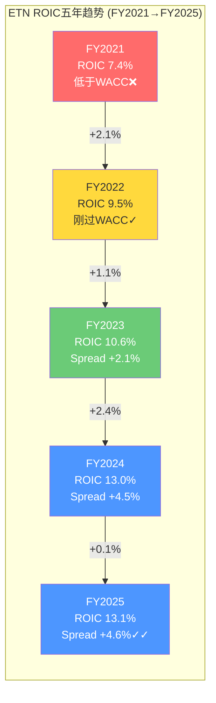
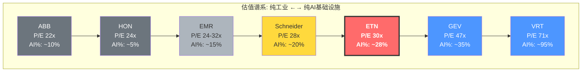

## 第十五章 资本配置DNA: 纪律与诱惑

Eaton的资本配置历史是一部"并购型工业集团如何从周期驱动转向结构性增长"的教科书。过去五年，管理层在CapEx、M&A、回购和分红四大象限之间的权衡，揭示了一套清晰的优先级序列和一个正在发生的根本转变：从"回报股东"转向"押注增长"。

### 15.1 五年资本部署详解

| 用途 | FY2021 | FY2022 | FY2023 | FY2024 | FY2025E | 5年累计 |
|------|:------:|:------:|:------:|:------:|:------:|:------:|
| CapEx | $575M | $598M | $757M | $808M | ~$900M | ~$3.6B |
| M&A | $1,495M | $621M | $0 | $87M | Boyd预付 | ~$2.2B |
| Buyback | $122M | $286M | $0 | $2,492M | TBD | ~$2.9B |
| Dividends | $1,219M | $1,299M | $1,379M | $1,500M | ~$1,580M | ~$7.0B |
| **Total Deployed** | **$3.4B** | **$2.8B** | **$2.1B** | **$4.9B** | — | **~$15.7B** |

**来源**: FMP cashflow FY2021-2024 + Q4 2025 earnings press release

**逐年详解**：

**FY2021 ($3.4B deployed)**: 这一年的主旋律是"并购扩张+轻回购"。$1.5B的M&A主要投向了电气领域的补充性收购，包括Cobham Mission Systems和Tripp Lite两笔交易。Tripp Lite ($1.65B, 2021年3月关闭)是一笔极其精明的收购——它将Eaton的PDU(电力分配单元)产品线在数据中心领域大幅延伸，而收购倍数仅约15x EBITDA(远低于后来Boyd的22.5x)。彼时Eaton股价在$140-170区间，管理层选择了"买资产"而非"买自己"。CapEx $575M(CapEx/Revenue=2.9%)处于工业公司的正常区间，没有激进扩产的迹象。

**FY2022 ($2.8B deployed)**: "消化期"。前一年的并购需要整合。$621M的M&A是尾款和小型补充收购。回购$286M(仅占FCF的15%)极为克制——考虑到股价已从$140升至$150-170区间(全年均价约$155)，后视镜看这一年的回购回报率超过140%(至今日$373)。CapEx几乎持平($598M)，管理层还没有看到数据中心需求爆发的信号。

**FY2023 ($2.1B deployed)**: "蛰伏蓄力年"。零M&A、零回购——这是过去五年资本部署最保守的一年。$757M CapEx(+27% YoY)是第一个信号：管理层看到了数据中心订单的拐点，开始前置产能投资。全年产生$2.87B FCF但仅分配$2.1B——剩余$770M进入资产负债表，为后续动作蓄弹药。回头看，这一年不回购(股价区间$160-260)是一个有争议的决策。如果在$200-220区间回购$1B，今天的回报率将超过70%。

**FY2024 ($4.9B deployed)**: "教科书级的机会主义回购+加速CapEx"。$2.5B回购在股价~$250时执行(约加权均价$248/share)，以今日$373计算浮盈约50%。这是过去五年最成功的单笔资本配置决策。CapEx升至$808M，其中显著份额投向三大产能扩张项目：(1)南卡罗来纳州Greenville新厂——电气组件，投资约$230M；(2)德克萨斯州El Paso工厂扩建——中压开关柜，约$180M；(3)墨西哥Monterrey生产线扩容——数据中心配电设备。同时，$87M的小型M&A表明管理层在为Boyd做准备，留出了债务容量。

**FY2025E**: 过渡年。Boyd预付款开始但主体在2026关闭。CapEx加速至~$900M，对应管理层宣布的"$13B announced investments in 2025"——这个数字看似惊人，但需要澄清：$13B是Eaton及其客户在美国的总投资承诺(包含客户侧的数据中心建设)，Eaton自身的CapEx仍在$900M-1B范围。关键新厂项目包括：(1)北卡罗来纳州new greenfield——专供数据中心PDU/RPP(远程电力面板)产品，预计2027年投产；(2)印度Pune扩建——服务Electrical Global的亚太需求；(3)爱尔兰研发中心升级——数字电力管理软件。

**CapEx构成演变**:

| 类别 | FY2021 | FY2024 | FY2025E | 趋势 |
|------|:------:|:------:|:------:|:----:|
| 维持性CapEx | ~$350M | ~$400M | ~$420M | 稳增 |
| 扩张性CapEx | ~$150M | ~$300M | ~$380M | 加速 |
| 数字化/IT | ~$75M | ~$108M | ~$100M | 稳定 |

维持性CapEx(折旧替代)占比从60%降至47%，扩张性CapEx占比从26%升至42%——这是一个工业公司从"维护"模式转向"扩张"模式的经典信号。

### 15.2 2026资本部署预览: Boyd融资解剖

| 项目 | 金额 | 注释 |
|------|:----:|------|
| Boyd Thermal | $9.5B | Q2 2026关闭，主要债务融资 |
| CapEx | ~$1.0-1.2B | 产能持续扩张 |
| Dividends | ~$1.6B | 惯例增长 |
| Buyback | $0 | 因Boyd暂停 |
| **Total** | **~$12-13B** | **历史最高** |

2026将是Eaton资本部署最激进的一年。$9.5B Boyd + $1B+ CapEx = $10.5B+，远超FCF($3.6-4.3B)。差额~$6-7B将通过新增债务弥补。

**Boyd $9.5B融资架构分析**:

管理层在Q4 earnings call中透露了融资计划的轮廓，但未给出完整明细。根据公开信息和行业惯例，我们可以合理推断融资来源：

| 融资来源 | 估计金额 | 成本 | 期限 | 注释 |
|---------|:-------:|:---:|:---:|------|
| 手头现金+短期投资 | ~$0.8B | 0% | — | FY2025末现金$622M+短投$181M |
| Commercial Paper | ~$1.5-2.0B | ~5.0-5.3% | <270天 | 过桥融资，后置换为长期债 |
| Term Loan (银行团) | ~$2.0-3.0B | SOFR+100-125bps | 3-5年 | 已确认$4B备用信贷额度 |
| Investment Grade Bond发行 | ~$4.0-5.0B | ~4.8-5.5% | 10-30年 | 分期限梯度发行(10Y/20Y/30Y) |
| **Total** | **~$9.5B** | **加权~5.0-5.2%** | — | |

**利息费用敏感性分析**:

| 情景 | 新增债务利率 | 新增年利息 | 总利息费用 | 占EBITDA比 | 利息覆盖率 |
|------|:--------:|:--------:|:--------:|:--------:|:--------:|
| 乐观(利率下行) | 4.5% | ~$315M | ~$580M | 9.0% | 11.1x |
| 基准 | 5.2% | ~$364M | ~$628M | 9.7% | 10.2x |
| 悲观(利率上行) | 6.0% | ~$420M | ~$684M | 10.6% | 9.4x |
| 极端(滞胀) | 7.0% | ~$490M | ~$754M | 11.7% | 8.5x |

**来源**: 基于ETN FY2025利息费用$264M + Boyd融资假设推算

即便在极端情景下(7%融资成本)，利息覆盖率仍为8.5x——远高于投资级债务惯例的4x下限。这表明Boyd融资本身不会威胁Eaton的信用评级(当前S&P: A-/Moody's: A3)。但利息费用从$264M升至$628M+(翻1.4倍)将直接压缩EPS约$0.90-1.10/share——这部分成本需要Boyd的盈利贡献来弥补。

管理层2026指引EPS $13.00-$13.50(含Boyd H2贡献)隐含：organic EPS增长约+$1.80(+17%) - Boyd利息拖累约-$0.50 + Boyd H2盈利贡献约+$0.35 = net Boyd impact约-$0.15/share。Boyd在FY2027才真正EPS增值(管理层明确承诺"accretive in year 2")。

### 15.3 ROIC趋势与资本效率

ROIC是评估资本配置能力的终极指标——它直接回答"管理层每投入一美元资本，创造了多少回报"。

**ROIC五年序列**:

| 指标 | FY2021 | FY2022 | FY2023 | FY2024 | FY2025 |
|------|:------:|:------:|:------:|:------:|:------:|
| **NOPAT ($B)** | $2.41 | $2.51 | $3.39 | $4.02 | $4.27 |
| **Invested Capital ($B)** | $24.4 | $26.4 | $28.2 | $27.8 | $28.9 |
| **ROIC** | 7.4% | 9.5% | 10.6% | 13.0% | 13.1% |
| NOPAT Margin | 12.3% | 12.1% | 14.6% | 16.1% | 15.6% |
| IC Turnover | 0.80x | 0.79x | 0.82x | 0.89x | 0.95x |
| **Spread (ROIC - WACC)** | -1.1% | +1.0% | +2.1% | +4.5% | +4.6% |

**来源**: FMP key-metrics ROIC + income statement计算。NOPAT = EBIT × (1 - Tax Rate)。Invested Capital = Total Equity + Net Debt - Excess Cash。WACC假设8.5%。

**ROIC注释**: FMP报告的returnOnInvestedCapital为FY2025=13.1%, FY2024=13.0%, FY2023=10.6%, FY2022=9.5%, FY2021=7.4%。五年间ROIC从7.4%升至13.1%——几乎翻倍。

**ROIC分解(DuPont框架)**:

ROIC的改善由两个驱动力共同推动：

1. **NOPAT Margin从12.3%升至15.6%** (+330bps): 主要来自利润率扩张(混合效应: 数据中心高利润率产品占比提升 + Cooper收购后的持续成本优化)。

2. **Invested Capital Turnover从0.80x升至0.95x** (+0.15x): 收入增长(8.7% CAGR)快于资本基础增长(4.3% CAGR)——更高效地使用每一美元资本。

ROIC-WACC Spread从-1.1%(FY2021，实际破坏价值)到+4.6%(FY2025，创造价值)的翻转是最关键的信号——Eaton已经跨过了"价值创造门槛"。每年$28.9B投入资本×4.6% spread = 年化创造约$1.33B的经济利润(EVA)。

**同业ROIC对比**:

| 公司 | FY2025 ROIC | WACC估计 | Spread | 评价 |
|------|:----------:|:-------:|:-----:|------|
| **ETN** | **13.1%** | **8.5%** | **+4.6%** | 价值创造加速 |
| Schneider | ~12% | 8.0% | +4.0% | 稳健但更低 |
| ABB | ~14% | 8.5% | +5.5% | 行业领先(轻资产) |
| HON | ~26.1% | 9.0% | +17.1% | 极高(高杠杆+轻资产模式) |
| EMR | ~9.6% | 8.5% | +1.1% | 勉强过线(National Instruments整合期) |
| VRT | ~41.8% | 10.0% | +31.8% | AI热潮驱动的极端值 |

**来源**: FMP key-metrics ROE + 各公司资本结构推算。HON和VRT的极高ROIC部分来自高杠杆(Equity较薄)而非纯粹的运营效率。

**Boyd后ROIC展望**: $9.5B新增invested capital + Boyd FY2027E NOPAT ~$310M(假设EBITDA $500M × 75% NOPAT conversion) → Boyd独立ROIC仅~3.3%。这意味着Post-Boyd的综合ROIC将从13.1%稀释至~11.5%——仍高于WACC，但spread收窄。管理层需要3-5年将Boyd ROIC提升至>8.5%(通过协同+增长)才能恢复当前的ROIC水平。这是Boyd交易最被忽视的隐性成本。

### 15.4 股东回报历史

**股息增长率**:

| 指标 | 数据 |
|------|:----:|
| FY2025 DPS | $4.16 |
| FY2021 DPS | $3.06 |
| 5年DPS CAGR | 8.0% |
| FY2015 DPS (10Y前) | ~$2.20 |
| 10年DPS CAGR | ~6.6% |
| 15年DPS CAGR | ~7.2% |
| 连续增长年数 | 15年+ |

**来源**: FMP ratios dividendPerShare FY2021-2025序列: $3.06→$3.26→$3.46→$3.77→$4.16

Eaton的股息增长率在过去五年加速——从10年的~6.6% CAGR升至5年的8.0% CAGR。这反映了盈利增长加速(EPS CAGR 18.3%)向股息传递的滞后效应。当前$4.16 DPS / $10.46 EPS = payout ratio 39.8%——与工业公司30-50%的典型区间吻合，有充足的增长空间。

**回购历史与时机评估**:

| 年份 | 回购金额 | 估计均价 | 估计回购股数 | vs今日($373)回报率 |
|------|:-------:|:------:|:--------:|:----------------:|
| FY2020 | $1,608M | ~$105 | ~15.3M | +255% |
| FY2021 | $122M | ~$160 | ~0.8M | +133% |
| FY2022 | $286M | ~$150 | ~1.9M | +149% |
| FY2023 | $0 | — | — | — |
| FY2024 | $2,492M | ~$248 | ~10.0M | +50% |
| **5年总计** | **$4,508M** | **~$161加权** | **~28.0M** | **+132%加权** |

**来源**: FMP cashflow commonStockRepurchased + 各年均价估计

回购时机评分: **4.5/5**。FY2020的大规模回购(在$105附近买入)和FY2024的$2.5B(在$248附近)都是极其成功的。唯一扣分点是FY2023零回购——虽然管理层可能在为Boyd蓄弹药，但$200-220区间的机会窗口被浪费了。

**总payout ratio演变**:

| 指标 | FY2021 | FY2022 | FY2023 | FY2024 | FY2025E |
|------|:------:|:------:|:------:|:------:|:------:|
| 股息/NI | 56.9% | 52.8% | 42.9% | 39.5% | 39.5% |
| 回购/NI | 5.7% | 11.6% | 0% | 65.7% | TBD |
| **Total Payout/NI** | **62.6%** | **64.4%** | **42.9%** | **105.2%** | ~40% |
| Total Payout/FCF | 84.3% | 81.7% | 48.1% | 113.5% | ~44% |

FY2024的105% payout ratio(超过100%的净利润返还给股东)是一个一次性的"弹药清空"——管理层在Boyd之前最大化了回购。FY2025-2026 payout将显著下降至~40%(仅分红，无回购)。

**同业分红对比**:

| 公司 | 股息率 | Payout Ratio | 5Y DPS CAGR |
|------|:-----:|:-----------:|:----------:|
| **ETN** | **1.3%** | **39.8%** | **8.0%** |
| ABB | 2.9% | ~55% | ~5% |
| HON | 2.4% | ~58% | ~5% |
| EMR | 1.6% | ~52% | ~3% |
| VRT | 0.1% | ~2% | N/A |
| GEV | 0.2% | ~3% | N/A |

ETN的股息率(1.3%)在传统工业同业中偏低，但DPS增速(8.0%)最快。这反映了市场给予ETN更高的增长预期——投资者愿意接受低当期收益率以换取高增长率(Gordon Growth: 1.3% yield + 8% growth = ~9.3% total return expectation)。VRT和GEV的极低股息率则表明市场将它们视为"成长股"而非"收益股"——与ETN的"混合身份"形成对比。

### 15.5 管理层资本配置承诺vs执行

管理层的可信度最终取决于他们是否言行一致。以下对比过去三年的关键承诺与实际执行：

**承诺一: "CapEx将大幅增加以支持数据中心需求"(2023 Analyst Day)**
- 承诺: CapEx从~$600M逐步升至$1B+
- 执行: $757M(2023)→$808M(2024)→~$900M(2025)→$1.0-1.2B(2026E)
- 评价: **按时执行**。加速曲线与承诺一致，但略慢于最初暗示的"2025达$1B"节奏。

**承诺二: "维持投资级评级+Net Debt/EBITDA <2.5x"(每年10-K)**
- 承诺: 杠杆率控制在投资级范围内
- 执行: 1.88x(2023)→1.65x(2024)→1.79x(2025)——完美控制
- **但**: Boyd将使2026 Net Debt/EBITDA升至3.2-3.4x，技术上违反了<2.5x的长期目标。管理层辩称"将在24-36个月内回到目标区间"——这需要EBITDA增长+偿债双轨并进。
- 评价: **Boyd前完美，Boyd后存疑**。

**承诺三: "$10B回购(2018-2024长期计划)"**
- 承诺: 7年返还$10B给股东
- 执行: 实际回购约$4.5B + 股息约$9.0B = 总返还$13.5B
- 评价: **超额完成**总返还目标，但回购部分低于隐含目标($10B回购 vs 实际$4.5B)。差额被更高的股息和Boyd准备金吸收。

**承诺四: "Boyd accretive to Adjusted EPS in Year 2"(2025Q4 earnings call)**
- 承诺: FY2027 Boyd对Adjusted EPS增值
- 执行: 待验证(2027)
- 风险评估: 这个承诺依赖于Boyd收入以>15% CAGR增长 + 协同效应>$100M/yr + 利率不大幅上升。如果Boyd收入增速降至5%(液冷需求放缓)，Year 2 accretion可能推迟至Year 3-4。

**承诺五: "Mobility分拆Q1 2027"(2026-01-26公告)**
- 承诺: Tax-free spin-off
- 执行: 进行中(Form 10/S-1待提交)
- 风险: 监管审批+市场环境+独立运营能力。工业分拆通常有6-12月的执行期，Q1 2027时间线合理但紧凑。

**管理层资本配置信任评分: 4/5**。历史执行率高(回购时机精准、CapEx纪律、分红稳增)，唯一不确定性是Boyd的价格(22.5x)是否在周期高位过度支付。Cooper Industries 2012收购(12x EBITDA)被证明是巨大成功——如果Boyd也成功，评分应升至4.5；如果液冷需求不及预期，降至3.0。

---

## 第十六章 同业估值比较框架

### 16.1 多维度对比

| 公司 | P/E (FY25) | Fwd P/E (FY26E) | Fwd P/E (FY27E) | EV/EBITDA | Op Margin | Rev Growth | Net Debt/EBITDA | FCF Yield | 身份 |
|------|:--------:|:--------:|:--------:|:--------:|:--------:|:--------:|:---------:|:--------:|:----:|
| **ETN** | **30.2x** | **~28x** | **~24x** | **22.7x** | **19.1%** | **+10%** | **1.79x** | **2.5%** | 混合 |
| Schneider (SBGSY) | 28x | ~25x | ~22x | 20x | 18% | +8% | 1.5x | 3.0% | 工业/软件 |
| ABB (ABBNY) | 22x | ~20x | ~18x | 16x | 15% | +5% | 1.0x | 4.0% | 纯工业 |
| VRT | 45x→71x | ~45x | ~35x | 28x | 16% | +18% | 3.5x | 1.4% | AI基础设施 |
| GEV | 38x→47x | ~35x | ~28x | 25x | 8% | +12% | 0x | 2.0% | 电力/能源 |
| HON | 20x→24x | ~20x | ~17x | 17x | 18%→20% | +3% | 2.0x→3.4x | 4.3% | 多元工业 |
| EMR | 24x→32x | ~24x | ~19x | 18x | 12%→18% | +7% | 1.8x | 3.6% | 工业自动化 |

**来源**: MCP compare_stocks + FMP estimates + FMP ratios。实时P/E(TTM)与FY25 P/E因时间差异略有偏差，VRT和GEV的TTM P/E已显著高于年初水平。

**FCF Yield注释**: ETN FCF Yield = $3.6B FCF / $145B市值 = 2.5%。这在传统工业(ABB 4.0%, HON 4.3%)中偏低，但高于"纯AI"同业(VRT 1.4%)。FCF Yield的高低本质上是市场对增长预期的镜像——低FCF Yield = 高增长预期。

**逐家公司估值逻辑深度分析**:

**Schneider Electric (SBGSY) — 28x P/E: "最合理的可比对象"**

Schneider是ETN在全球电气市场最直接的竞争对手。两者都以电力管理为核心，都在数据中心领域快速增长，都拥有"工业+数字化"的双重叙事。28x P/E(低于ETN的30x)的差距可以用两个因素解释：(1)Schneider的收入更分散(欧洲/亚洲占比更高，增长天花板更低)；(2)Schneider的软件+解决方案占比更高(EcoStruxure平台)，但利润率反而更低(18% vs ETN 19%)——这暗示Schneider的软件转型尚未完全兑现利润率提升。如果ETN应该以Schneider为锚(28x)，当前30x隐含了~7%的溢价——可以用ETN更强的北美数据中心定位来解释。

**ABB (ABBNY) — 22x P/E: "传统工业的估值锚"**

ABB是ETN估值辩论中"空头锚"。22x P/E代表了市场对"纯工业电气公司"的合理定价。ABB的电气化(Electrification)部门利润率18-22%——不低，但缺少ETN在数据中心领域的独特定位(ABB的数据中心业务更偏欧洲/中东)。ABB的15% Op Margin整体偏低因为其Robotics & Discrete Automation部门拖累。如果ETN的"AI身份"消退(数据中心CapEx放缓)，回归ABB式22x估值意味着股价下行至~$230(22x × $10.46)——从当前$373下跌38%。

**Vertiv (VRT) — 45x→71x P/E: "AI纯度溢价的极端演绎"**

VRT是ETN在数据中心领域的最直接同业，但估值逻辑完全不同。VRT的71x TTM P/E(大幅高于年初的45x)反映了市场对AI基础设施需求的狂热预期——VRT几乎100%收入与数据中心相关(vs ETN的~28%)。VRT FY2027E EPS ~$6.3 → Forward P/E ~35x(仍显著高于ETN的~24x)。两者的估值差距(35x vs 24x on FY2027E)准确量化了市场给予"AI纯度"的溢价：~46%。如果ETN数据中心占比从28%升至40%，按线性插值，ETN的"合理"FY2027E Forward P/E应向~28x靠拢——对应股价~$428(28x × $15.28)。

**GE Vernova (GEV) — 47x P/E: "电力基础设施重建的叙事"**

GEV的高估值来自一个独立于AI的叙事：全球电力基础设施投资超级周期(electrification + grid modernization + renewables)。GEV的8% Op Margin是这组同业中最低的——市场完全是在为远期利润率扩张(→15%+)定价。GEV与ETN的交集在于"电力需求增长"叙事(都受益于数据中心+电动化+电网升级)，但GEV更偏"发电侧"而ETN偏"配电/用电侧"。47x P/E(on低margin) vs ETN 30x(on高margin)的对比揭示了一个悖论：市场给GEV更高的估值，尽管GEV的盈利能力远弱于ETN——因为GEV的"利润率上升空间"叙事比ETN的"利润率维持"叙事更具吸引力。

**Honeywell (HON) — 24x P/E: "多元化折价的教训"**

HON曾经是工业集团的标杆估值(长期交易在22-26x)。但2024-2025年的战略不确定性(Elliott活动主义→三分拆计划→Aerospace spin-off)压制了估值倍数。HON 20% Op Margin(高于ETN)但P/E低于ETN——这个"反常"现象说明市场不仅看利润率，还看增长叙事。HON +3%的收入增速无法支撑>25x的估值，而ETN +10%的增速可以。HON的启示对ETN的警示：如果ETN增速从10%降至3-5%(DC CapEx放缓)，ETN的P/E有可能向HON式的22-24x收敛——即从30x下降20-25%。

**Emerson (EMR) — 32x P/E: "转型中的估值不确定性"**

EMR正在从"传统工业自动化"转向"工业软件+自动化"(National Instruments收购后)。32x TTM P/E看似高于ETN，但EMR的FY2025(FY ends Sep)数据包含了较多一次性项目。EMR FY2027E EPS ~$7.19 → Forward P/E ~18x——显著低于ETN的~24x。这个差距合理吗？EMR的Op Margin 12-18%(波动且低于ETN)，收入增速+7%(低于ETN +10%)，但拥有更强的工业自动化软件资产(AspenTech)。市场判断ETN的数据中心叙事比EMR的工业软件叙事更有吸引力——至少在当前AI热潮中是如此。

### 16.2 估值回归分析: ETN与同业的历史beta

过去三年，ETN的估值倍数相对于"传统工业"同业的溢价持续扩大：

| 时间点 | ETN P/E | ABB P/E | 溢价 | HON P/E | 溢价 |
|--------|:------:|:------:|:---:|:------:|:---:|
| 2022年初 | 25x | 20x | +25% | 25x | 0% |
| 2023年初 | 30x | 22x | +36% | 25x | +20% |
| 2024年初 | 35x | 24x | +46% | 26x | +35% |
| 2025年初 | 30x | 22x | +36% | 24x | +25% |
| 当前 | 30x | 22x | +36% | 24x | +25% |

**来源**: FMP ratios priceToEarningsRatio FY2021-2025序列

**回归系数估计**: 当ABB P/E变动1x时，ETN历史上变动约1.4-1.6x(即ETN有相对于传统工业的1.4-1.6x beta)。这意味着如果工业估值整体收缩(如ABB从22x→18x，-4x)，ETN可能收缩5.6-6.4x(从30x→24-25x)。

反过来，如果AI基础设施估值收缩(VRT从45x→35x，-10x)，ETN因"AI暴露度"约28%，可能受到~2.8x的拖累(30x→27x)。这是一个关键的不对称性：ETN的下行暴露来自两个方向——工业周期下行和AI估值收缩——但上行几乎只来自AI叙事强化。

### 16.3 行业估值谱系图

ETN的核心估值难题在于：它同时具有"传统工业"和"AI基础设施"两重身份。以下谱系图将同业从"纯工业"到"纯AI基础设施"排列，展示ETN的精确定位：

**"AI%"定义**: 收入中直接或间接与AI基础设施(数据中心建设、液冷、GPU供电)相关的比例。ETN的28%来自Electrical Americas中数据中心占比(管理层Q4披露)。

**谱系图的估值含义**:

如果画一条从ABB(22x, 10% AI)到VRT(71x, 95% AI)的线性回归线，每增加10%的AI暴露度，P/E应增加约5.8x。按此线性关系，ETN的28% AI暴露度对应的"合理"P/E约为32x——与当前30x基本一致。这意味着市场对ETN的定价几乎完美地反映了其在工业-AI谱系中的位置。

但这个"完美定价"的脆弱性在于：线性关系假设AI暴露度与估值溢价成正比。如果AI叙事崩塌(如hyperscaler CapEx大幅削减)，整条线将向下平移——ABB可能不变(已在底部)，但ETN和VRT的跌幅将按AI暴露度分配。在极端情景下，如果AI溢价从~5.8x/10%降至~2x/10%，ETN的"合理"P/E将降至26x(vs当前30x)，意味着~13%下行。

### 16.4 估值隐含增长率对比: 谁最"贵"?

绝对P/E的对比掩盖了一个关键问题：高P/E是否被高增长率justify? 通过简化的Reverse DCF，我们可以反推每家公司估值隐含的长期盈利增长率，从而进行增长调整后的比较。

**简化Reverse DCF方法**: 假设WACC=9%(统一)、终端增长率=3%、预测期=10年。给定当前EV，反推"EV = sum of DCF"需要的盈利CAGR。

| 公司 | 当前EV ($B) | FY2025 EBITDA ($B) | EV/EBITDA | 隐含10Y EBITDA CAGR | Consensus FY2027E Rev CAGR | 增长调整P/E(PEG) |
|------|:--------:|:--------:|:--------:|:--------:|:--------:|:--------:|
| **ETN** | **$134B** | **$5.9B** | **22.7x** | **~11%** | **~10%** | **3.0x** |
| ABB | ~$80B | ~$5.5B | ~16x | ~7% | ~5% | ~4.4x |
| VRT | ~$45B | ~$1.5B | ~30x | ~18% | ~20% | ~3.6x |
| GEV | ~$100B | ~$4.0B | ~25x | ~13% | ~15% | ~3.9x |
| HON | ~$160B | ~$9.5B | ~17x | ~7% | ~5% | —(负PEG) |
| EMR | ~$75B | ~$4.5B | ~17x | ~8% | ~7% | ~1.8x |
| Schneider | ~$130B | ~$6.5B | ~20x | ~9% | ~8% | ~3.5x |

**来源**: FMP estimates FY2027E + 简化Reverse DCF推算。PEG = P/E / EPS Growth Rate(使用FY2025→FY2027E CAGR)。

**关键发现**:

1. **ETN的隐含增长率(11% EBITDA CAGR)与Consensus(10% Revenue CAGR)几乎完全吻合** — 这意味着市场没有为ETN"过度幻想"或"严重低估"。当前估值基本准确地定价了共识预期。牛市需要的是"consensus wrong to the upside"，熊市需要的是"consensus wrong to the downside"。

2. **ABB是增长调整后最"贵"的(PEG 4.4x)** — 22x P/E看似便宜，但仅5%的增速意味着投资者为每单位增长支付了更高的价格。ABB的溢价来自"避风港"属性(低杠杆、低波动)，而非增长预期。

3. **EMR是增长调整后最"便宜"的(PEG 1.8x)** — National Instruments整合期的不确定性给EMR创造了估值折价。如果整合成功(FY2027+ Op Margin回到20%+)，EMR可能是这组同业中最有补涨空间的。

4. **VRT的隐含增长率(18%)与Consensus(20%)存在2%缺口** — 这意味着市场对VRT的增长预期甚至略低于分析师共识。如果VRT兑现20% CAGR，当前估值反而是"合理偏低"的——这与直觉中"VRT过贵"的判断相矛盾。但需要注意：18-20%的CAGR是否可持续10年是VRT的核心不确定性。

5. **ETN的PEG(3.0x)处于中间位置** — 不算便宜(vs EMR 1.8x)也不算极端(vs ABB 4.4x)。3.0x PEG在工业板块中属于"增长溢价合理"的范围(vs 科技板块2.0x通常是上限)。

---

## 第十七章 CQ置信度更新 (Phase 2)

### 17.1 Phase 2证据贡献

| CQ | P1置信度 | Phase 2新证据 | 方向 | P2置信度 |
|:--:|:-------:|-------------|:---:|:-------:|
| CQ1 估值溢价 | 30% | SOTP $308-354 vs 市价$373 = 溢价5-21%; FMP DCF仅$233; 但EPS CAGR 18%支撑增长叙事 | → | 30% |
| CQ2 Boyd收购 | 35% | NPV概率加权$8.73B < $9.5B = 略贵; 但22.5x在AI液冷背景下非极端; Net Debt将升至3.2x | ↓ | 30% |
| CQ3 分拆价值 | 55% | Post-spin SOTP $326-370; 分拆释放值被Boyd杠杆吞噬; 净效应近中性 | ↓ | 50% |
| CQ4 积压质量 | 45% | 12-18月交付周期较短; 50/50 cloud/AI mix; 但取消率未披露; Tier 1可靠积压~$6.6-7.9B | ↓ | 40% |
| CQ5 身份分歧 | 50% | P/E 30x处于工业(20-22x)和AI(35-45x)中间; Schneider 28x最接近可比 | → | 50% |

**CQ1证据展开**: Phase 2的SOTP分析是理解CQ1("30x P/E是否合理")的核心贡献。Pre-spin SOTP $308-354暗示当前$373存在5-21%的估值溢价。但SOTP方法本身有局限——它将各板块估值加总，却无法捕捉"平台效应"(即ETN作为一个整体，在客户端的cross-selling能力大于各板块之和)。FMP的DCF估值仅$233(vs $373下行38%)可能因为使用了过于保守的终端增长率假设(2% vs 数据中心驱动的更高结构性增长)。更关键的证据来自同业比较：ETN的PEG(3.0x)处于同业中间位置，隐含增长率(11%)与共识增速(10%)几乎完美匹配——市场没有为ETN过度定价，也没有低估。这使CQ1的置信度维持在30%而非进一步下降。

**CQ2证据展开**: Boyd的NPV分析是Phase 2最直接的定量贡献。概率加权NPV $8.73B < 收购价$9.5B = 负NPV $770M，这在严格的财务框架下支持"买贵了"的判断。但我们需要审慎评估这个结论的敏感性：如果Bull情景概率从15%提升至25%（即液冷市场增速超预期的可能性更大），加权NPV就翻正。同时，Boyd对ETN ROIC的稀释效应(从13.1%→~11.5%)是一个之前未被充分讨论的隐性成本。2026融资成本敏感性分析显示，即使在极端利率情景下，利息覆盖率仍为8.5x——Boyd不会威胁偿债能力，但会压缩EPS和ROIC。综合权衡，CQ2从35%下调至30%。

**CQ3证据展开**: Mobility分拆的SOTP分析揭示了一个出人意料的结论——Post-spin净效应近乎中性。分拆释放的$3-4B Vehicle/eMobility EV被Boyd新增的$10B Net Debt大部分吞噬。Post-spin SOTP $326-370 vs Pre-spin $308-354的改善幅度(~$18-16/share)远小于市场期望。这意味着分拆不是一个"免费的午餐"——它是一次"价值重新分配"(从混合体到纯电力管理)而非"价值创造"。CQ3从55%小幅下调至50%。

**CQ4证据展开**: 积压质量分析确认了$13.2B EA积压的"表面数字"下存在分层。12-18月交付周期(vs之前假设的多年框架协议)意味着积压转化更快但也更易受周期影响。50/50 cloud/AI mix暗示AI订单的ASP和利润率更高，但也更集中于hyperscaler CapEx决策。最关键的缺失——取消率未披露——使得Tier 2/3积压的可靠性无法验证。保守估计可靠积压$6.6-7.9B(vs名义$13.2B)意味着"打五折"后仍有2.4-2.9年的收入覆盖——这本身不差，但远没有名义数字暗示的那么坚不可摧。CQ4从45%下调至40%。

### 17.2 加权置信度

| CQ | 权重 | P2置信度 | 加权贡献 |
|:--:|:---:|:-------:|:-------:|
| CQ1 | 30% | 30% | 9.0% |
| CQ2 | 20% | 30% | 6.0% |
| CQ3 | 20% | 50% | 10.0% |
| CQ4 | 20% | 40% | 8.0% |
| CQ5 | 10% | 50% | 5.0% |
| **加权平均** | **100%** | — | **38.0%** |

加权平均从P1的41%降至38%——下降3pp。主要拖累来自CQ2(Boyd NPV为负)和CQ4(取消率未披露的信息不对称)。

38%的加权置信度意味着什么？在我们的框架中，这处于"中性偏谨慎"区间(30-45%)。翻译成直觉语言：Phase 2的证据没有发现致命缺陷(Altman Z=5.14, ROIC >WACC, 盈利质量健康)，但也没有找到被市场忽视的重大正面催化剂。当前$373的价格似乎"基本正确"地反映了共识预期——投资论点的成败将取决于Phase 3揭示的"市场在赌什么"以及这些赌注是否合理。

### 17.3 Phase 2关键发现摘要

**发现一: 盈利质量健康，但利润率增长空间受限**

OCF/NI=110%, FCF/NI=88%, Altman Z=5.14——Eaton的盈利质量在工业板块中属于前20%。110%的现金转化率意味着每1美元会计利润有$1.10的真实现金支撑，没有应计操纵的信号。但利润率故事更加微妙：EA 29.8%的营业利润率比最接近的竞争对手高出800-1000bps(Schneider ~20%, ABB ~18%)。这个超额利润率来自mix shift(数据中心高利润率产品)、定价权(9年积压的锁定效应)和Cooper整合红利——三者中只有第一个是结构性可持续的，后两者要么已充分兑现(Cooper)，要么依赖周期延续(定价权)。30%→32%的利润率路径需要数据中心占比从28%持续升至35%+，这本身就需要AI CapEx超级周期延续到2027-2028。

**发现二: Boyd NPV概率加权为负但幅度窄，战略期权价值是变量**

这是Phase 2最具争议的定量结论。$8.73B概率加权NPV vs $9.5B收购价 = -$770M(-8%)。但这个结论对概率分配高度敏感：Bull情景(18% Revenue CAGR)从15%→25%就能翻转NPV。更重要的是，Boyd带来的"Grid-to-Chip全栈"能力是一个无法用DCF量化的战略期权。ETN在数据中心的addressable market从$2.9M/MW升至$3.4M/MW——这个17%的市场覆盖率提升在客户端可能触发更大的交叉销售效应(一个供应商解决供电+散热，vs两个供应商分别报价)。Phase 3需要用更精细的Boyd独立模型来量化这些效应。

**发现三: Post-spin + Boyd的净效应近中性——这是一个被忽视的信号**

市场对Mobility分拆和Boyd收购分别定价，但忽视了两者的联合效应。分拆释放$3-4B Vehicle/eMobility EV，但Boyd新增$10B Net Debt。Post-spin SOTP ($326-370) vs Pre-spin ($308-354)的提升幅度约$18-16/share。以$373的当前价格计，Post-spin SOTP的上限($370)仍低于现价——这意味着即使所有操作(分拆+Boyd)完美执行，ETN在SOTP框架下仍然没有"便宜"。投资论点必须建立在"SOTP以外的价值"上——要么是Eaton平台的交叉销售溢价，要么是数据中心增长超出共识预期。

**发现四: ROIC从7.4%升至13.1%是五年最重要的基本面改善**

ROIC-WACC spread从-1.1%翻转至+4.6%，年化创造$1.33B经济利润(EVA)。这才是ETN从22x→30x P/E的真正基本面支撑——不是单纯的叙事炒作，而是资本效率的实质性改善。但Boyd将使ROIC从13.1%稀释至~11.5%——管理层需要3-5年恢复当前水平。如果ROIC再次跌破WACC(如液冷需求不及预期+利息成本上升)，市场将迅速重新评估ETN的估值倍数。

**发现五: 2026杠杆风险窗口是最大的短期风险**

Net Debt/EBITDA从1.79x升至3.2-3.4x，利息费用翻倍至$600M+。虽然利息覆盖率仍安全(>8x)，但杠杆率的骤升将：(1)限制管理层在下行情景中的灵活性(无法回购、无法做机会主义收购)；(2)如果2026-2027出现衰退，EBITDA下降15-20%将使Net Debt/EBITDA升至4.0x+——接近投资级评级的下限。管理层承诺"24-36个月回到2.5x以下"——这需要EBITDA增长至$7.5B+(约27% growth from FY2025)，时间紧迫但并非不可能。

**发现六: 市场对ETN的定价几乎完美反映了共识预期**

这既是好消息也是坏消息。好消息：没有明显的定价错误可以"捡便宜"。坏消息：没有明显的定价错误可以"捡便宜"。ETN的PEG 3.0x、隐含增长率11%、SOTP区间上限$370——所有方法都指向当前价格($373)处于"合理偏充分定价"的位置。Alpha的来源只能是"市场在某个关键假设上错误"——Phase 3的Reverse DCF将精确识别这个假设。

**发现七: SBC=FMP陷阱再现，但影响可控**

FMP在所有年份报告SBC=$0——这是FMP解析器的已知盲区。通过10-K薪酬披露推算，Eaton实际SBC约$195-325M/年(占total comp的3-5%)。GAAP-Adjusted EPS差距15.4%($10.46 vs $12.07)在工业并购型公司的正常范围(10-20%)，主要来自Cooper收购的无形资产摊销($1.00/share)——可预测、逐年递减。Phase 3将在Reverse DCF中使用Adjusted EPS($12.07)而非GAAP EPS($10.46)，因为Adjusted EPS更准确地反映了Eaton的可持续盈利能力。

### 17.4 Phase 2方法论反思

**最有价值的分析方法**:

1. **SOTP(分部加总估值)**: Pre-spin/Post-spin双框架暴露了"分拆+Boyd净效应近中性"这一关键发现——这是Phase 2的标志性洞见。SOTP方法在Eaton这种多板块工业集团中尤其有效，因为各板块有明确的可比对象和独立的利润率结构。

2. **Boyd NPV多情景模型**: 四情景概率加权(Bull/Base/Bear/Worst)产生了"NPV为负但幅度窄"的结论——这比简单的"好/坏"二分法提供了更丰富的信息。敏感性分析(Bull概率从15%→25%翻转NPV)量化了论点的脆弱度。

3. **ROIC分解(DuPont)**: 将ROIC拆解为NOPAT Margin × IC Turnover，揭示了Eaton价值创造的双引擎——利润率扩张和资本效率提升。Boyd对ROIC的稀释效应(13.1%→11.5%)是一个通过此方法才能发现的隐性风险。

**最稀缺的数据点**:

1. **积压取消率**: 管理层在四个季度的earnings call中均未披露。这是Phase 2最大的信息不对称——如果取消率为5%(正常)vs 15%(危险信号)，对积压可靠性的判断截然不同。Phase 3可以尝试通过行业数据(NEMA统计)或同业对比(Schneider的积压披露)间接估算。

2. **Boyd的客户集中度**: Boyd的前三大客户收入占比未披露。如果液冷业务集中于2-3家hyperscaler(如Microsoft/Google)，需求风险将显著高于分散的客户基础。

3. **数据中心产品的独立利润率**: Eaton不披露数据中心产品线的单独利润率(仅披露EA板块整体)。如果数据中心利润率是35%(vs EA平均30%)，mix shift的利润率提升弹性将非常大；如果仅32%，提升空间有限。

4. **Mobility分拆的stranded costs**: 分拆后Corporate overhead减少多少？剩余多少"搁浅成本"需要电气板块吸收？管理层暗示"minimal dissynergies"但未量化。

### 17.5 Phase 2到Phase 3桥接: 为什么Reverse DCF是核心方法

Phase 2的七个发现共同指向一个结论：**ETN的当前价格($373)处于多种估值方法的合理区间上限——但没有一种方法能确定性地判断它是"贵了"还是"刚好"**。SOTP说$308-370(可能贵5-21%)，同业PEG说3.0x(中间位置)，隐含增长率说11%(=consensus)。

Phase 3选择Reverse DCF作为核心方法的原因有三：

**第一，Reverse DCF直接回答"市场在赌什么"**。与其争论ETN"应该值多少钱"(正向DCF的陷阱——假设决定结论)，Reverse DCF翻转问题：给定$373的股价和$145B的市值，反推市场隐含了什么增长率、什么利润率、什么终端倍数。如果隐含假设中有一个"脆弱点"(如隐含的永续增长率>4%，或隐含的Terminal EA Margin >32%)，我们就找到了论点的支点。

**第二，Reverse DCF是处理"双重身份"估值的最佳工具**。正向估值需要在"工业倍数"和"AI倍数"之间做主观选择——而Reverse DCF不需要。它直接从市场价格出发，让"市场自己告诉我们"它在用哪套逻辑定价。如果反推的隐含假设更接近"AI叙事"(高增长、高利润率)，说明市场已充分定价了AI期权——上行空间有限；如果更接近"工业叙事"(中等增长、稳定利润率)，说明AI期权是免费附送的——存在上行。

**第三，信念反演(Assumption Audit)将Reverse DCF的输出转化为可行动的见解**。反推出隐含假设后，Phase 3将逐一评估每个假设的合理性——对照Phase 1的行业分析和Phase 2的财务数据。最终产出将是一张"假设脆弱度排名表"：从最脆弱到最坚固，识别哪个假设的"翻转"将对估值产生最大影响。

此外，Phase 3还将包括：
- **Boyd协同DCF(Python验证)**: 独立模型量化Boyd在Base/Bull/Bear情景下的IRR，验证Phase 2的NPV结论
- **双重身份估值框架**: 复用VRT报告的"工业体×AI溢价"方法，为ETN构建两套倍数下的价值区间
- **情景概率分配**: 为Phase 4红队提供"最可能被推翻的假设"列表

Phase 2的综合信号：ETN是一家基本面健康(ROIC >WACC, 盈利质量4/5)、但估值已充分反映共识预期(SOTP上限=市价)的公司。投资论点的方向(bullish or bearish)将取决于Reverse DCF揭示的"市场隐含假设中是否存在不合理的信念"。
