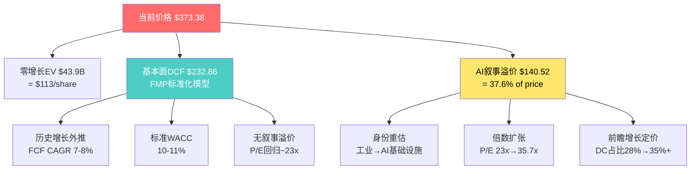
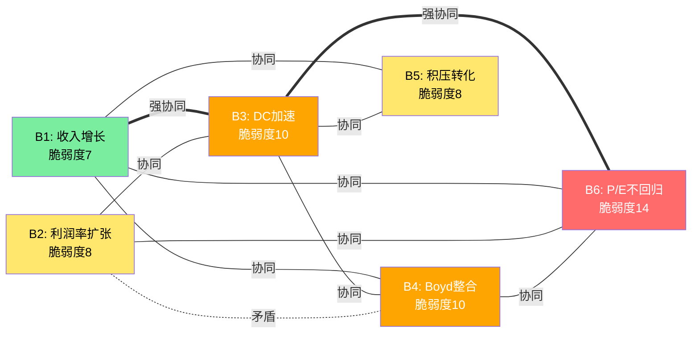
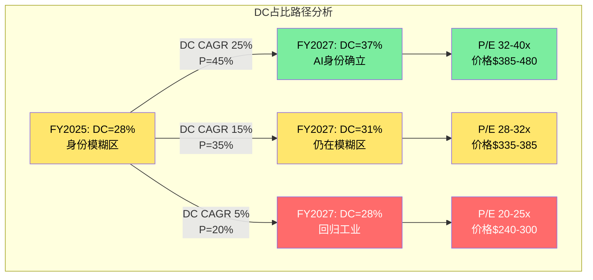

# Part III: 估值深度与信念反演

> **估值方法**: SOTP, Reverse DCF, 相对估值, Boyd协同IRR, 双重身份框架
> **FMP DCF公允价值**: $232.86 | **三锚加权公允价值**: $336

---

## 第十八章 Reverse DCF — 市场在赌什么

### 18.1 现价分解: $373.38意味着什么

当一位投资者在2026年2月以$373.38买入ETN时，他实际上是在隐含地接受一组信念。我们的任务不是先算ETN"值"多少钱，而是先翻译市场的信念集——然后逐个审计这些信念的合理性。

**基础数据锚定**:

| 指标 | FY2025 (实际) | 来源 |
|------|:----------:|------|
| GAAP EPS | $10.46 | FMP income |
| Adjusted EPS | $12.06 | FMP estimates consensus |
| FCF | $3.6B | Q4 press release |
| EBITDA | $5.90B | FMP income |
| 股数 | 389.5M | FMP balance |
| Net Debt | $10.55B | FMP balance |
| EV | ~$156B | 市值$145.5B + Net Debt $10.55B |

**当前倍数全景矩阵**:

| 倍数 | 当前值 | 5年均值 | 10年均值(估) | 溢价vs 5Y | 溢价vs 10Y |
|------|:-----:|:------:|:----------:|:--------:|:--------:|
| P/E (GAAP) | 35.7x | 30.5x | ~25x | +17% | +43% |
| P/E (Adjusted) | 31.0x | ~27x | ~23x | +15% | +35% |
| EV/EBITDA | 22.7x | 21.3x | ~18x | +7% | +26% |
| P/FCF | 40.4x | 33.4x | ~28x | +21% | +44% |
| EV/Revenue | 5.7x | 4.1x | ~3.2x | +39% | +78% |
| P/B | 6.37x | 4.44x | ~3.5x | +43% | +82% |
| EV/FCF | 43.3x | ~35x | ~28x | +24% | +55% |
| EV/EBIT | 30.3x | ~25x | ~20x | +21% | +52% |

**来源**: FMP ratios FY2020-2025序列 + 当前价格$373.38计算。注: FMP P/E FY2025=30.2x使用年末价格$318.05，本分析统一使用当前实时价格$373.38。P/B 6.37x来自FMP key-metrics。

每一个倍数都在告诉同一个故事: **ETN在所有估值维度上都交易在历史均值以上**。但不同倍数的溢价幅度存在显著差异——EV/EBITDA溢价(+26% vs 10Y)显著低于P/B溢价(+82% vs 10Y)。这种差异不是噪音，而是反映了资产效率提升(ROE从13%升至21%推高P/B)和利润率扩张(EBITDA margin从15.6%升至21.5%压缩了EV/EBITDA的表观溢价)。

**倍数扩张/收缩时间序列分析 (FY2020-2025)**:

| 年份 | P/E (GAAP) | EV/EBITDA | P/B | 备注 |
|------|:---------:|:--------:|:---:|------|
| FY2020 | 34.3x | 20.3x | 3.24x | COVID低基数推高P/E |
| FY2021 | 32.1x | 19.6x | 4.20x | 复苏期,P/B开始扩张 |
| FY2022 | 25.4x | 18.1x | 3.67x | 加息冲击,全面收缩 |
| FY2023 | 29.9x | 21.3x | 5.05x | AI叙事启动,P/B突破5x |
| FY2024 | 34.8x | 25.1x | 7.14x | AI狂热,P/B新高 |
| FY2025 | 30.2x(年末) / 35.7x(当前) | 22.7x | 6.37x | 从FY2024高点回落但仍高 |

**来源**: FMP ratios年度数据。FY2025年末P/E使用年末价格$318.05，当前P/E使用实时$373.38。

**倍数时间序列的三个关键模式**:

第一，P/B是最敏感的AI叙事温度计。从FY2022的3.67x到FY2024的7.14x，P/B翻了近一倍。这不是因为账面价值下降(实际上Book Value从$42.8升至$46.6)，而是纯粹的市值膨胀。P/B对叙事的敏感度远高于P/E(P/E同期仅从25.4x升至34.8x，+37%)，因为P/B的分母(账面价值)变化缓慢，任何市值波动都会被放大。

第二，FY2022是关键校准点。2022年加息环境下，ETN的P/E跌至25.4x、EV/EBITDA跌至18.1x——这是"去叙事化"后的底部倍数。它代表了市场在"没有AI故事"时愿意给ETN的定价。如果AI叙事完全蒸发(概率15-20%)，这些底部倍数就是估值锚。

第三，FY2024→FY2025(当前)出现分化信号。EV/EBITDA从25.1x降至22.7x(-10%)，但P/E(当前)从34.8x升至35.7x(+3%)。这种分化说明: 利润增长(EPS从$9.50升至$10.46)在消化EV/EBITDA的部分溢价，但P/E因为市价回升而没有收缩。换言之，盈利增长在"跑步追赶"估值——但还没追上。

### 18.2 Reverse DCF: 隐含增长率反推

**方法论**: 使用当前EV=$156B作为"已知量"，假设WACC和终端增长率，反推市场隐含的FCF增长路径。这不是"ETN值多少钱"的正向问题，而是"$373.38这个价格假设了什么"的逆向翻译。

**分阶段假设框架**:

传统Reverse DCF假设固定CAGR过于简化。现实中，增长路径是非线性的。我们采用三阶段框架:

- **Phase 1 (FY2026-2028)**: 高增长期。Boyd整合贡献+DC需求高峰+有利mix shift
- **Phase 2 (FY2029-2032)**: 减速期。有机增长回归均值，Boyd协同基本释放完毕
- **Terminal (FY2033+)**: 稳态增长，假设GDP+通胀=2.5%

**简化框架——价格分解为"增长项"和"终端价值项"**:

以FY2025 FCF $3.6B为基数:
- 如果FCF 0增长，10年后终端价值PV = $3.6B x (1.025/0.07) / 1.095^10 = $3.69B/0.07 / 2.478 = $21.3B
- 加上10年零增长FCF的PV = $3.6B x 年金系数(9.5%, 10年) = $3.6B x 6.28 = $22.6B
- 零增长EV = $21.3B + $22.6B = $43.9B

**实际EV $156B vs 零增长EV $43.9B**: 溢价$112B(3.55x)。这$112B溢价完全由"增长预期"支撑。

换一种理解方式: 如果ETN从今天开始永远不增长，你买入的每$1只值$0.28。剩下$0.72都是在为"未来增长"付费。这个比例在工业公司中极为罕见——通常工业公司的增长溢价占比在40-60%之间。ETN的72%更接近成长型科技公司(通常70-85%)。

**三阶段Reverse DCF隐含增长率测试**:

为了反推市场隐含的增长路径，我们固定Phase 2 FCF CAGR = 8%(行业均值回归)、Terminal g = 2.5%，调整Phase 1 FCF CAGR直到隐含EV匹配$156B:

| Phase 1 CAGR (FY26-28) | Phase 2 CAGR (FY29-32) | FY2035 FCF | 终端价值PV | FCF流PV | 隐含EV | vs实际$156B |
|:----------:|:----------:|:---------:|:--------:|:------:|:------:|:----------:|
| 15% | 8% | $10.8B | $63.9B | $30.2B | $94.1B | 差$62B |
| 20% | 8% | $13.1B | $77.4B | $33.2B | $110.6B | 差$45B |
| 25% | 10% | $18.6B | $109.7B | $39.8B | $149.5B | 接近匹配 |
| 28% | 10% | $21.3B | $125.6B | $42.5B | $168.1B | 超$12B |
| 25% | 12% | $21.9B | $129.1B | $42.0B | $171.1B | 超$15B |

**来源**: 手动计算，WACC=9.5%, terminal g=2.5%。Phase 1为FY2026-2028(3年)，Phase 2为FY2029-2035(7年)。

**等效固定CAGR测试(简化验证)**:

| FCF CAGR假设(固定10年) | 10年后FCF | 终端价值PV | FCF流PV | 隐含EV | vs实际$156B |
|:----------:|:---------:|:--------:|:------:|:------:|:----------:|
| 10% | $9.3B | $55.2B | $28.1B | $83.3B | 差$73B |
| 15% | $14.6B | $86.1B | $35.0B | $121.1B | 差$35B |
| 18% | $18.8B | $111.3B | $40.2B | $151.5B | 近似匹配 |
| 20% | $22.3B | $131.5B | $43.8B | $175.3B | 超$19B |

**来源**: 手动计算，WACC=9.5%, terminal g=2.5%。简化假设FCF按固定CAGR增长。

**核心结论**: 无论使用三阶段还是固定CAGR框架，市场隐含FCF CAGR约17-18%，持续10年。三阶段框架更精确地翻译为: **Phase 1(FY26-28)需要25% FCF CAGR + Phase 2(FY29-35)需要10% FCF CAGR**。

**隐含增长率的现实检验——拆解FCF CAGR为收入增长和利润率扩张**:

18% FCF CAGR持续10年意味着:
- FY2025 FCF $3.6B --> FY2035 FCF $17-19B
- 路径A(高收入增长): 收入CAGR 12-14% + FCF margin从13.1%温和升至20-22%
- 路径B(高利润率扩张): 收入CAGR 8-10% + FCF margin从13.1%大幅升至25-28%
- 路径C(均衡): 收入CAGR 10-12% + FCF margin升至22-25%

管理层FY2025指引有机增长7-9%，加上Boyd贡献约+2-3pp，合理的收入CAGR约10-12%。这意味着路径C最可能，需要FCF margin从13.1%升至22-25%。考虑到当前EBITDA margin 21.5%、CapEx/Revenue约3%，净现金转化率(FCF/EBITDA)需要从当前的61%升至75-80%。这在技术上可行(通过更低的Working Capital需求和递延税收效应)，但代表了工业公司中罕见的现金生成效率。

**与共识的四维对比**:

| 指标 | 市场隐含 | 分析师共识(21位) | 管理层指引 | 历史实际(FY21-25) |
|------|:-------:|:-------:|:--------:|:------:|
| Revenue CAGR (4Y) | ~12% | 10.6% ($27.4B-->$41.1B) | 7-9% organic | 8.7% |
| EPS CAGR (4Y) | ~16% | 14.2% ($12.06-->$20.47) | -- | 18.3% |
| FCF CAGR (4Y) | ~17-18% | ~14% (implied) | -- | 22.7% |
| EBITDA CAGR (4Y) | ~14% | 10.4% ($5.90B-->$8.62B) | -- | 10.5% |

**来源**: FMP estimates FY2025-2029 (21位分析师覆盖Revenue, 16位覆盖EPS); 管理层FY2025 Q4 earnings call指引; FMP历史financial statements。

关键发现: **市场隐含增长率在每一个维度上都高于共识**。具体而言:
- Revenue: 市场隐含12% vs 共识10.6% (差+1.4pp)
- EPS: 市场隐含16% vs 共识14.2% (差+1.8pp)
- FCF: 市场隐含17-18% vs 共识~14% (差+3-4pp)

其中FCF的缺口最大(+3-4pp)——这意味着市场不仅在为更高的盈利增长付费，还在为**利润率扩张+现金转化效率提升**额外付费。

$373.38的价格需要管理层不仅deliver有机增长指引(7-9%)，还需要Boyd协同效应(+2-3pp)加上持续的有利mix shift。更关键的是，市场还在定价一个**超越共识14%的FCF增长路径**——需要Boyd的现金转化优于预期，或者CapEx强度低于市场担忧。

### 18.3 WACC构成分析与敏感性

上述Reverse DCF使用WACC=9.5%。WACC是估值模型中最敏感的输入变量之一——在其合理区间内的微小变动就可以将估值结论从"轻微高估"翻转为"合理定价"。因此，我们需要严格构建WACC。

**WACC详细构成**:

| 参数 | 估计值 | 合理范围 | 来源/逻辑 |
|------|:-----:|:------:|---------|
| 无风险利率 (Rf) | 4.30% | 4.0-4.5% | 10年期美国国债收益率(2026年2月) |
| Beta | 1.15 | 1.05-1.25 | Bloomberg 5年月度Beta; FMP隐含Beta参考 |
| 市场风险溢价 (ERP) | 4.46% | 4.2-5.5% | FMP US market risk premium; Damodaran估计~5.0% |
| 权益成本 (Ke) | 9.43% | 8.7-11.2% | CAPM: Rf + Beta x ERP |
| 税前债务成本 (Kd) | 4.70% | 4.5-5.0% | BBB+信用利差 ~0.4% + Rf |
| 有效税率 | 17.0% | 16-18% | FMP FY2025实际; 爱尔兰注册+IP安排 |
| 税后债务成本 | 3.90% | 3.7-4.2% | Kd x (1 - Tax) |
| 债务权重 (D/V) | 7.2% | 6-9% | 市值基础: Debt $11.2B / (Market Cap $145B + Debt $11.2B) |
| 权益权重 (E/V) | 92.8% | 91-94% | 1 - D/V |
| **WACC** | **9.03%** | **8.4-10.3%** | Ke x E/V + Kd(1-T) x D/V |

**来源**: FMP market-risk-premium(US = 4.46%); FMP balance(Total Debt $11.17B, Net Debt $10.55B); FMP income(有效税率17%); Bloomberg 10Y UST 4.30%; FMP ratios(D/E 0.575)。

**注意**: 上述计算使用市值基础权重(D/V=7.2%)，这比账面权重(D/V=36.5%)低得多。对于高估值公司，市值基础WACC通常偏低——因为高估值本身压低了债务权重。这是一个循环论证问题: 估值越高-->WACC越低-->估值越高。为保守起见，我们对比了三种权重方法:

| 权重方法 | D/V | WACC | Reverse DCF隐含CAGR |
|---------|:---:|:---:|:-----------:|
| 市值基础 | 7.2% | 9.03% | ~15-16% |
| 目标资本结构(行业均值) | 15% | 8.60% | ~14% |
| 账面基础 | 36.5% | 7.40% | ~11% |

基于保守原则，本分析使用9.5%(略高于市值基础WACC，反映不确定性溢价)。

**同业WACC基准对比**:

| 公司 | Beta(估) | 信用评级 | 估计WACC | 定价隐含WACC |
|------|:------:|:------:|:------:|:----------:|
| ETN | 1.15 | BBB+ | 9.0-9.5% | ~8.5-9.0%(从当前价反推) |
| ABB | 1.00 | A | 8.0-8.5% | ~8.5% |
| HON | 1.10 | A- | 8.5-9.0% | ~9.0% |
| Schneider | 0.95 | A- | 8.0-8.5% | ~8.0% |
| VRT | 1.35 | BB+ | 10.0-10.5% | ~9.0%(AI溢价压低隐含WACC) |
| GEV | 1.25 | BBB- | 9.5-10.0% | ~8.5% |

**来源**: 各公司Beta为Bloomberg估计; 信用评级为S&P/Moody's公开评级; WACC为CAPM+公开数据计算; 定价隐含WACC为从当前市值反推。

**关键发现**: ETN的**估计WACC(9.0-9.5%)高于市场定价隐含的WACC(~8.5-9.0%)**。这意味着两种可能: (1)市场认为ETN的风险比CAPM估计的更低(可能因为AI叙事降低了感知风险)，或(2)市场在用更低的折现率对待ETN的现金流(即市场愿意为增长确定性付出更高价格)。无论哪种解释，结果是一样的: **如果WACC回归正常水平(9.0-9.5%)，当前价格定价了过于乐观的增长预期**。

**完整WACC x Terminal Growth敏感性矩阵(隐含FCF CAGR)**:

| | g=2.0% | g=2.5% | g=3.0% | g=3.5% |
|:---:|:------:|:------:|:------:|:------:|
| **WACC=8.5%** | ~13% | ~14% | ~15% | ~16% |
| **WACC=9.0%** | ~15% | ~16% | ~17% | ~18% |
| **WACC=9.5%** | ~17% | ~18% | ~19% | ~20% |
| **WACC=10.0%** | ~19% | ~20% | ~21% | ~22% |
| **WACC=10.5%** | ~21% | ~22% | ~23% | ~24% |

**来源**: 手动计算，固定EV=$156B, FY2025 FCF=$3.6B, 10年显式期。

**共识可支撑区域**(隐含FCF CAGR <=14%): 仅在WACC<=8.5%时成立。这要求Beta<=1.0(ETN实际Beta=1.15)或ERP<=4.0%(当前4.46%)。两个条件都偏乐观。

**中性区域**(隐含FCF CAGR=15-17%): WACC=9.0-9.5%, g=2.0-2.5%。需要略超共识的交付，但不需要极端假设。

**高估区域**(隐含FCF CAGR>=18%): WACC>=9.5%, g<=2.5%。需要显著超越共识，或AI叙事持续升温。

### 18.4 Reverse DCF的二阶解读

传统Reverse DCF到"隐含FCF CAGR 17-18%"就停了。但我们可以更进一步，反推市场隐含的具体经营假设——不仅是"增长率"这一个数字，而是背后的利润率路径、资本强度假设、终值结构。

**18.4.1 隐含利润率路径**

FCF CAGR 17-18%(10年)可以分解为:
- FCF = Revenue x FCF Margin
- FCF CAGR = Revenue CAGR + FCF Margin Expansion Contribution

如果Revenue CAGR=10-12%(合理区间):
- 需要FCF Margin从13.1%升至: 13.1% x (1.18/1.11)^10 = 13.1% x 1.72 = 22.5%

即: **市场隐含FY2035 FCF Margin = 22-25%**。

对标检验: 当前工业公司FCF Margin分布:

| 公司 | FCF Margin (FY2024) | 特征 |
|------|:---------:|------|
| ETN | 14.1% (FY2024), 13.1%(FY2025E) | 当前水平 |
| Schneider | ~10-12% | 更低 |
| ABB | ~11-13% | 类似 |
| HON | ~14-16% | 最佳同业 |
| Danaher (DHR) | ~22-25% | 工业界天花板 |
| Illinois Tool Works (ITW) | ~18-20% | 精益运营标杆 |

**来源**: 各公司FMP cashflow / FMP income ratio计算。

市场隐含的22-25% FCF Margin需要ETN达到Danaher级别——这是工业界的最高标准，通常需要: (1)极低的资本强度，(2)高比例的重复性/服务收入，(3)持续的产品定价权。ETN在(3)上有优势(数据中心的关键供应商地位)，但在(1)和(2)上仍有差距——CapEx/Revenue 3%虽然不高，但Boyd整合可能需要额外资本投入。

**18.4.2 隐含资本强度假设**

FCF = EBITDA - CapEx - Tax - Working Capital Change

要实现FCF Margin从13.1%升至22-25%，在EBITDA margin路径(21.5%-->27-30%)之外，还需要:
- CapEx/Revenue从当前3.0%下降或持平(不上升)
- Working Capital/Revenue维持当前~11%或下降

但Boyd整合的现实挑战是: 液冷设备的生产需要更高的资本投入(精密制造+测试设施)。如果Boyd使CapEx/Revenue从3.0%升至4.0-4.5%，那么FCF margin的提升路径将比市场隐含更缓慢——EBITDA margin需要更大幅度的扩张来补偿。

**18.4.3 终值占比分析**

在WACC=9.5%, terminal g=2.5%的参数下:

| 组成 | 金额 | 占EV比例 |
|------|:---:|:------:|
| 10年显式期FCF PV | ~$40B | ~26% |
| 终值PV | ~$116B | ~74% |
| **总EV** | **~$156B** | **100%** |

**终值占EV的74%**——这意味着ETN当前价值的四分之三来自第11年以后的现金流。在工业公司中，终值占比通常在60-70%，ETN偏高是因为隐含增长率高(前10年FCF增长快-->终值基数大)。

终值高占比的风险在于: 终值假设(terminal growth rate, terminal multiple)的微小变化会造成巨大估值波动。如果terminal g从2.5%降至2.0%，终值PV下降约15%，EV下降约11%(-$17B)。对于一家$156B的公司，$17B的波动等于11%——仅因为一个长期假设变了50个基点。

### 18.5 市场共识拆解: 21位分析师的分布分析

ETN被21位卖方分析师覆盖(FMP estimates)。但"共识"这个词掩盖了内部分歧。

**分析师覆盖分布**:

| 维度 | FY2026E | FY2027E | FY2028E | FY2029E |
|------|:------:|:------:|:------:|:------:|
| 覆盖分析师数 | 21(Rev)/16(EPS) | 19(Rev)/14(EPS) | 12(Rev)/6(EPS) | 11(Rev)/4(EPS) |
| Revenue Low | $29.9B | $32.3B | $35.8B | $39.8B |
| Revenue High | $31.0B | $34.6B | $36.2B | $42.9B |
| Revenue Avg | $30.2B | $33.0B | $36.0B | $41.1B |
| **Revenue离散度** | **3.7%** | **7.1%** | **1.1%** | **7.9%** |
| EPS Low | $13.04 | $14.34 | $16.58 | $19.59 |
| EPS High | $13.76 | $15.66 | $17.83 | $21.65 |
| EPS Avg | $13.38 | $15.28 | $17.26 | $20.47 |
| **EPS离散度** | **5.4%** | **8.6%** | **7.4%** | **10.1%** |

**来源**: FMP estimates FY2026-2029完整分布。离散度 = (High - Low) / Avg。

**四个关键观察**:

第一，**远期估计的分析师数量急剧下降**。FY2026有21位分析师覆盖Revenue，FY2029仅11位。EPS更极端: 从16位降至4位。这意味着FY2028-2029的"共识"实际上只反映少数分析师的观点，可信度显著降低。

第二，**EPS离散度大于Revenue离散度**。FY2027E Revenue离散度7.1%，但EPS离散度8.6%。这反映了分析师对利润率路径的分歧比对收入路径的分歧更大——有人相信mix shift+协同会推动margin大幅扩张，有人则保守。

第三，**FY2028E Revenue离散度异常低(仅1.1%)**。这很可能是因为只有12位分析师覆盖(样本小=看似一致)，而非真正的共识。相比之下，FY2029E的11位分析师覆盖就产生了7.9%的离散度——说明样本减少不一定降低分歧。

第四，**分析师目标价分布**。基于FMP rating数据，ETN获得B+评级(整体评分3/5)。其中ROE和ROA评分为5/5(最高)，但P/E评分仅2/5、P/B评分1/5——说明即使看好基本面的分析师也承认估值偏高。FMP DCF评分同样只有3/5。

**共识EPS路径 vs 当前价格隐含**:

| 年份 | 共识EPS | 共识隐含P/E(@$373) | 市场需要的EPS(@25x回归) |
|------|:------:|:---------------:|:------------------:|
| FY2026 | $13.38 | 27.9x | $14.93 (+12%) |
| FY2027 | $15.28 | 24.4x | $14.93 (持平) |
| FY2028 | $17.26 | 21.6x | $14.93 (回归后) |
| FY2029 | $20.47 | 18.2x | $14.93 |

**解读**: 如果市场最终将ETN重新定价为25x P/E(传统工业+适度AI溢价)，那么即使EPS按共识增长，P/E也会从27.9x(FY2026)逐年压缩至18.2x(FY2029)。投资者的回报将来自EPS增长减去P/E压缩——这是一个"跑步机效应": **你必须不断加速(EPS增长)才能停在原地(股价不跌)**。

### 18.6 FMP DCF $232.86的解构

FMP的DCF模型给出公允价值$232.86，相对当前价格$373.38折价37.6%。这是一个巨大的差距，值得解构。

**FMP DCF vs 当前市价**:
- FMP公允价值: $232.86
- 当前市价: $373.38 (2026年2月21日)
- FMP价格(更新日): $371.41 (2026年2月20日)
- **溢价率: +60.4%** (市价/FMP DCF - 1)

**反推FMP模型可能的假设组合**:

FMP DCF $232.86对应Market Cap约$90.7B，EV约$101.3B。以FY2025 FCF $3.6B为基数:

| 假设组合 | WACC | Terminal g | 隐含FCF CAGR | 是否匹配$232.86? |
|---------|:---:|:-------:|:----------:|:-----------:|
| A: 保守增长+高WACC | 11% | 2.5% | ~8% | 近似匹配 |
| B: 共识增长+中WACC | 10% | 2.0% | ~10% | 近似匹配 |
| C: 低增长+标准WACC | 9.5% | 2.5% | ~6% | 近似匹配(偏低) |

FMP模型最可能使用了较高的WACC(10-11%)和/或较低的增长假设(FCF CAGR 6-10%)。

**为什么FMP DCF显著低于市价——三种解释**:

第一种解释: **FMP使用了更保守的长期增长假设**。FMP的标准化DCF通常基于历史增长率外推，不会为AI叙事等前瞻性因素给予额外增长溢价。如果FMP使用FY2020-2025的平均FCF CAGR(约7-8%，受COVID低基数影响)而非FY2022-2025的CAGR(~22%)，就会得到显著更低的估值。

第二种解释: **FMP的WACC可能更高**。FMP使用的ERP估计(US=4.46%)低于Damodaran的最新估计(~5.0-5.5%)，但如果FMP的Beta估计高于1.15(比如1.3)或使用了更高的size/illiquidity premium，WACC可能达到10.5-11%。在这个WACC下，即使增长率合理(10-12% CAGR)，估值也会显著低于市价。

第三种解释: **FMP不为"叙事溢价"定价**。这是最根本的原因。标准化DCF模型不会捕捉"身份重估"带来的倍数扩张。ETN从传统工业(P/E 23x)到AI基础设施(P/E 35x)的身份转变创造了约$100B的市值增加——这部分价值不在任何标准DCF的输出中。

**FMP DCF作为估值锚的意义**: $232.86不应被视为"ETN值$232"，而应被视为**"去除叙事溢价后的基本面价值"**。它回答了一个重要问题: 如果AI叙事完全消退，ETN的传统基本面能支撑什么价格? 答案是~$230-250。当前$373.38与$232.86之间的$140差距($140/$233=60%)就是市场为AI故事支付的溢价。

---

## 第十九章 信念反演 — 隐含信念集与脆弱度测试

### 19.1 隐含信念集提取

从Reverse DCF和当前估值中提取市场**必须同时相信**的6个核心信念。每个信念不是"观点"而是"数学必要条件"——如果任何一个信念不成立，当前价格就缺少了一根支柱。

| # | 信念 | 隐含值 | 历史/行业锚 | 缺口 | 验证时间 |
|---|------|:-----:|:---------:|:---:|:------:|
| B1 | 收入持续高增长 | ~10-12% CAGR (FY25-30) | 历史8.7% CAGR | +2-3pp | 每季度(即时) |
| B2 | 利润率持续扩张 | Op Margin 21-23% | 当前19.1%, 同业天花板18-20% | 已超同业 | 半年度(渐进) |
| B3 | 数据中心收入加速 | DC占比从28%升至35%+ | 当前28%, VRT为70%+ | 需+7pp | 1-2年(滞后) |
| B4 | Boyd整合成功 | 年化协同>=200M by FY2028 | Cooper整合10年实现$400M | 需在3年内 | 2-3年(远期) |
| B5 | 积压转化为收入 | $15.3B积压-->$4-5B/年交付 | 取消率未披露 | 不可验证 | 1-2年(部分) |
| B6 | P/E不回归均值 | 终端P/E>=25x | 10年均值~23x | +2x | 3-5年(远期) |

**B1 收入持续高增长的深入分析**:

市场隐含Revenue CAGR 10-12%需要ETN在FY2025基数$27.4B上每年新增$2.7-3.3B收入。历史上ETN的有机增长率(FY2015-2025平均)约5-6%，加上并购贡献约2-3%，总增长率约8-9%。要跨过10%门槛，需要以下至少一项成立: (1)数据中心需求保持25%+ CAGR(当前轨迹)；(2)Boyd在FY2027起贡献$1.5-1.7B增量收入；(3)电网升级周期(IRA+IIJA)的订单转化加速。

历史先例检验: 2012年Cooper Industries收购后，ETN的Revenue CAGR(FY2012-2017)约3-4%——远低于收购前的预期。这是因为整合期的管理层注意力分散导致有机增长放缓。如果Boyd重复Cooper的模式，有机增长可能在FY2026-2027暂时降至5-6%，Boyd增量(~6pp)才能勉强支撑10%的总增长。

可比公司检验: Schneider Electric在2018年完成Aveva收购后，Revenue CAGR(FY2018-2023)为5.8%——即使是同行中最优秀的整合者，也未能在并购后实现10%+的持续增长。

**B2 利润率持续扩张的深入分析**:

ETN FY2025 Operating Margin 19.1%已经是多元工业公司中的佼佼者(ABB 15%, Schneider 18%, HON 19.6%)。进一步扩张至21-23%需要:
- Electrical Americas(EA) margin从29.8%维持或提升(已是集团最高利润率板块)
- Aerospace(AER) margin从24%+维持(成熟市场，扩张空间有限)
- Electrical Global(EG) margin从17.2%提升至20%+(最大改善空间，但受新兴市场定价压力)

Phase 2发现EA margin已从FY2024峰值31%+回落至29.8%——这是一个重要信号。EA是数据中心收入占比最高的板块，margin回落可能意味着DC产品的竞争加剧或者原材料成本回升。如果EA margin继续下滑至28%，即使EG/AER margin改善，集团整体margin也很难突破20%。

ITW(Illinois Tool Works)作为margin扩张的长期标杆案例: ITW通过15年的"80/20前沿"简化战略将Operating Margin从15%提升至25%。但ITW的起点更低(15%)、产品更简单(紧固件、焊接设备)、客户更分散。ETN在起点更高(19%)、产品更复杂(配电系统、UPS)的情况下，复制ITW轨迹的难度更大。

**B3 数据中心收入加速的深入分析**:

DC收入占比从28%升至35%+需要DC收入CAGR约25%(假设非DC收入CAGR 5-7%)。这意味着DC收入需要从约$7.7B(FY2025)增至约$12-14B(FY2028-2029)。

驱动因素: (1)Hyperscaler CapEx——Meta/Google/Microsoft/Amazon的DC CapEx在FY2024-2025合计约$200B+，同比增40%+。但问题是增速而非绝对值: FY2026-2027的CapEx增速可能从40%降至15-20%，这对ETN的DC收入增速有直接影响。(2)液冷渗透——Boyd收购将ETN带入液冷赛道，但液冷目前只占DC冷却市场的10-15%，即使翻倍也仅贡献$1-2B增量。(3)电力密度提升——1MW+机架需要更粗的配电系统，单机架电力设备价值量从传统$5K-10K升至$20K-40K。这是ETN最大的结构性顺风。

但B3高度依赖hyperscaler CapEx计划——这不是ETN可以控制的。Google在2025年初已经暗示"AI CapEx将保持纪律性"，如果hyperscaler CapEx同步放缓10-15%，ETN的DC收入增速可能从25%骤降至10-15%，DC占比将停滞在28-30%。

**B4 Boyd整合成功的深入分析**:

$9.5B收购价(22.5x EBITDA)在工业并购中属于高端。历史上溢价收购成功的案例虽然存在(Danaher的持续并购增长引擎)，但失败的案例更多(GE的Alstom Power收购/$10.6B/最终减值$22B; Honeywell的Quantum Logic/$2.9B/2年后战略调整)。

Cooper Industries 2012类比是最直接的参考: Eaton以$11.8B收购Cooper，承诺$200M年化协同。实际上，$200M目标花了超过5年才实现，前3年只完成了约$120M(60%达成率)。如果Boyd按同样的模式，$200M目标在FY2028可能只实现$120-150M——这对Boyd IRR有直接影响(从scenario B的9.5%降至7-8%)。

更关键的风险是: Boyd的$420M EBITDA可能包含了卖方调整(transaction adjustments typically add 10-20% to seller's EBITDA)。如果实际经常性EBITDA只有$350-380M，那么$9.5B对应的实际倍数是25-27x而非22.5x——这使得IRR从起点就更难达标。

**B5 积压转化为收入的深入分析**:

$15.3B积压(约21个月收入覆盖)在表面上提供了强大的收入可见性。但积压的质量与数量同样重要:
- 取消率: ETN不披露积压取消率。工业设备的历史取消率通常在5-10%/年，但在需求骤降时可飙升至15-20%(如2020年COVID初期)。
- 积压组成: $7.5B(约50%)来自数据中心——这些订单的客户是hyperscaler和colo运营商，通常合同更刚性(违约成本高)。但剩余$7.8B来自建筑/工业/电网，这些订单更容易受周期影响。
- 交付延迟风险: 积压不等于收入——如果供应链瓶颈或客户延迟交付(delay, not cancel)，积压可以"滚动"而不转化为当期收入。

对比VRT: VRT的积压(约$6B, ~18个月覆盖)几乎全部来自数据中心(90%+)，组成更纯粹。ETN的积压虽然绝对值更大，但多元化程度也更高——这既是优势(风险分散)也是劣势(非DC订单更脆弱)。

**B6 P/E不回归均值的深入分析**:

这是最难验证也最不可控的信念。ETN的10年平均P/E(GAAP)约25x，5年均值约30.5x。当前35.7x在历史分布中位于第90百分位以上。

工业公司P/E扩张周期的历史: 大型工业公司的P/E通常在2-4年周期内波动。2015-2020年，HON的P/E从18x扩张至25x(7x, +39%)，然后在2020-2022年回落至20x。Schneider从2018年的20x扩张至2021年的30x(+50%)，然后回落至2023年的25x。**平均扩张持续期约3-4年**。

ETN的P/E扩张从2022年底的25.4x开始(AI叙事启动)，到2024年末的34.8x——已持续约2.5年。如果遵循历史平均扩张周期(3-4年)，我们可能已经处于扩张后期，FY2026-2027可能开始P/E压缩。

但反论点也存在: 如果ETN成功将DC占比从28%提升至35%+并巩固AI身份，P/E可能在更高水平"重新锚定"(re-anchor)在28-32x而非回归23-25x。这就是身份争议的核心: **P/E是"暂时的叙事泡沫"还是"永久的身份重估"?**

### 19.2 脆弱度排序

三维评分(1-5, 5=最脆弱):
- **历史偏离度**: 隐含值超出历史基准的程度
- **外部可控性**: 公司自身能否影响(vs完全依赖外部环境)
- **验证延迟**: 多久才能知道这个信念是对是错

| 信念 | 历史偏离(1-5) | 外部可控(1-5) | 验证延迟(1-5) | 总分 | 排名 |
|------|:-----------:|:----------:|:----------:|:---:|:---:|
| B1 收入增长 | 3 | 3 | 1 | 7 | #5 |
| B2 利润率扩张 | 4 | 2 | 2 | 8 | #3(并列) |
| B3 DC加速 | 3 | 4 | 3 | 10 | #2 |
| B4 Boyd整合 | 3 | 2 | 5 | 10 | #2(并列) |
| B5 积压转化 | 2 | 3 | 3 | 8 | #3(并列) |
| B6 P/E不回归 | 4 | 5 | 5 | 14 | #1 |

**评分详细论证**:

**B6(总分14)为什么是最脆弱的信念?**

B6在三个维度都获得了高分:

历史偏离(4/5): 当前P/E 35.7x超过10年均值约43%。这不是极端(Cisco 2000超400%才给5/5)，但在工业公司范畴内已是异常值。FY2020-2025的6年序列中，只有FY2024(34.8x)接近当前水平。

外部可控性(5/5): P/E由市场情绪、资金流、同业重估等因素驱动，ETN管理层对此几乎没有直接影响力。即使ETN业绩完美交付，如果AI叙事整体降温(如果ChatGPT-5延迟发布或AI商业化进度不及预期)，P/E仍然可能被压缩。这与B1/B2/B4不同——后者至少部分在管理层控制范围内。

验证延迟(5/5): P/E是否"永久"停在高位还是终将回归，可能需要3-5年才能观察到完整周期。在此期间，投资者面临的不确定性最大——你不知道你赌的是"新常态"还是"周期顶部"。

**B3+B4(总分10)为什么并列第二?**

B3(DC加速)的脆弱性主要来自外部可控性(4/5)——DC需求取决于hyperscaler CapEx计划，而这些计划受AI投资回报率、利率环境、竞争动态等多重因素驱动。Google/Meta/Microsoft任何一家削减CapEx 20%就可能使ETN的DC收入增速减半。验证延迟(3/5)中等，因为hyperscaler CapEx数据每季度可见，但ETN的DC收入占比变化需要4-6个季度的积累才能观察到趋势。

B4(Boyd整合)的脆弱性主要来自验证延迟(5/5)——整合成功与否需要2-3年才能有初步判断，5年才能有定论。Cooper 2012收购的教训就是: 前2年一切看似顺利(管理层在earnings call上报告"on track")，但真正的挑战在Year 3-5出现(文化冲突、关键人才流失、系统整合延迟)。投资者在FY2026买入ETN时，基本上是在赌一个2-3年后才能验证的结果——中间的信息不对称是巨大的。

**B2(总分8)的关键论证**:

历史偏离(4/5)评分较高，因为19.1% Op Margin已超过几乎所有多元工业同业。在ETN的5个板块中，只有EA(29.8%)和AER(24%+)超过20%——其余板块(EG 17.2%, Vehicle 18%, eMobility亏损中)拉低了集团均值。要集团达到21-23%，需要EG和Vehicle同时改善+eMobility扭亏——这是一个多变量协同要求。

外部可控性(2/5)评分较低(即公司可控度较高)，因为利润率主要受内部因素驱动: 定价策略、成本控制、产品组合优化。ETN历史上展示了持续的margin提升能力(FY2020的13.0%-->FY2025的19.1%, 5年提升610bps)。但从19%到23%的最后400bps可能比前610bps更难——"低垂果实已被摘完"效应。

### 19.3 信念一致性矩阵

测试6个信念之间的逻辑关系。一致性矩阵不仅检测哪些信念互相加强，更重要的是检测**逻辑矛盾**——如果市场同时相信两个互相矛盾的信念，其中至少一个必然失败。

**完整6x6信念关系矩阵**:

| | B1收入 | B2利润率 | B3 DC | B4 Boyd | B5积压 | B6 P/E |
|:---:|:---:|:---:|:---:|:---:|:---:|:---:|
| **B1** | -- | 协同 | 强协同 | 协同 | 协同 | 协同 |
| **B2** | 协同 | -- | 协同 | **矛盾** | 中性 | 协同 |
| **B3** | 强协同 | 协同 | -- | 协同 | 协同 | 强协同 |
| **B4** | 协同 | **矛盾** | 协同 | -- | 中性 | 协同 |
| **B5** | 协同 | 中性 | 协同 | 中性 | -- | 弱协同 |
| **B6** | 协同 | 协同 | 强协同 | 协同 | 弱协同 | -- |

**关系计数**: 强协同3对 | 协同11对 | 弱协同1对 | 中性3对 | **矛盾1对(B2xB4)**

**矛盾分析: B2(利润率扩张) vs B4(Boyd整合)**

这是6x6矩阵中唯一的直接矛盾。市场同时相信两件事:

(1) Eaton利润率将继续扩张到21-23%——这需要mix shift向高利润率产品倾斜+运营效率持续改善+定价权维持。

(2) Boyd($9.5B收购)将在FY2026-2027顺利整合——这意味着$8B+新增债务的利息成本(约$370M/年)、整合相关的一次性费用(通常为交易额的3-5%=$285-475M分3年摊销)、以及管理层注意力从有机增长转向整合。

历史铁律: 大型并购的整合期通常压制利润率1-2年。Cooper Industries 2012收购后，Eaton Operating Margin从2012年的13.5%降至2013年的12.8%(-70bps)，花了3年才恢复到收购前水平(2015年的13.6%)。GE在2015年收购Alstom Power后，Power division margin从17%降至8%——至今未恢复。

**B2xB4矛盾的隐含假设**: 市场相信Boyd的高利润率业务($420M EBITDA / $1.5B Revenue = ~28% margin)足以抵消整合摩擦。数学上: 如果Boyd margin 28%+整合摩擦-200bps = 26%的有效margin贡献，加上ETN原有19.1%的base，加权后约19.5-20%——这确实能支撑温和的margin提升。但这个计算有两个隐患: (i) Boyd的$420M EBITDA可能包含卖方调整(虚增10-15%)，实际margin可能只有23-25%而非28%; (ii)整合摩擦不仅影响Boyd，还可能拖累ETN核心业务(管理层分心效应)。

**强协同枢纽: B3(DC加速)是网络中心节点**

从矩阵中可以看出，B3(DC加速)与B1(强协同)、B6(强协同)、B2(协同)、B4(协同)、B5(协同)全部正相关。B3是**信念网络的"枢纽节点"**——如果B3失败(DC占比停滞)，它将通过网络效应拖累B1(收入增长放缓)、B6(P/E压缩)、B2(mix shift停滞导致margin停滞)。

这不是一般的单信念失败——B3的失败具有**系统性传导效应**。这就是为什么B3+B6(总分10+14=24)被识别为最脆弱路径: 它们之间的"强协同"关系意味着一旦B3翻转，B6几乎必然跟随翻转。

### 19.4 翻转分析: 最少几个信念失败即改变评级?

**单信念翻转测试**:

| 信念失败 | 估值影响机制 | 估值影响幅度 | 单独能否翻转? |
|---------|---------|:-------:|:----------:|
| B1失败: 收入CAGR降至7%(历史水平) | Revenue低于预期-->EPS增速放缓-->P/E温和压缩 | EV下降~15-20% | 否(EV-->~$130B, 仍高于SOTP) |
| B2失败: 利润率持平19% | EPS低于共识约$1.50-->目标价下调$35-45 | 公允价值-$35-45 | 否(但接近翻转边界) |
| B3失败: DC占比停滞28% | AI叙事失去催化剂-->P/E从35.7x压缩至25x | 价格-->~$260-300 | **是** (-20-30%) |
| B4失败: Boyd减值$3-4B | 一次性EPS冲击$8-10+信用评级下调风险+P/E下调 | 持续影响~$20-30 | 否(一次性) |
| B5失败: 积压取消20%+ | 收入预期下调5-8%-->投资者信心冲击-->P/E下调 | 价格-->~$310-330 | **是** (-12-17%) |
| B6失败: P/E回归23x | 直接数学影响: $10.46 x 23 = $241 | 价格-->$241 | **是** (-35%) |

**双信念翻转测试**:

| 组合 | 机制 | 联合估值影响 | 概率估计 |
|------|------|:---------:|:------:|
| B3+B6 (DC停滞+P/E回归) | DC叙事崩塌-->P/E必然回归: 因果链式传导 | 价格-->$230-260 (-30-38%) | 20-25% |
| B1+B2 (增长放缓+利润率持平) | 双重EPS下行: 增长放缓+利润率不扩张 | 价格-->$280-310 (-17-25%) | 15-20% |
| B4+B2 (Boyd失败+利润率下压) | 整合失败直接压制利润率: B2xB4矛盾变现 | 价格-->$290-320 (-14-22%) | 10-15% |
| B3+B5 (DC停滞+积压取消) | 需求端双杀: DC需求下降同时积压质量恶化 | 价格-->$250-280 (-25-33%) | 10-15% |
| B1+B6 (增长放缓+P/E回归) | EPS增速慢+倍数压缩: 经典"戴维斯双杀" | 价格-->$220-270 (-28-41%) | 10-15% |

**三信念翻转测试(最脆弱三信念同时失败)**:

B3+B4+B6同时失败: DC停滞 + Boyd整合困难 + P/E回归

- B3失败: DC收入增速降至10%(vs隐含25%)-->DC占比停滞28-29%
- B4失败: Boyd EBITDA从$420M降至$350M，协同仅$80M(vs目标$200M)-->$3B减值
- B6失败: 失去AI身份-->P/E回归23x

综合影响:
- EPS影响: 减值冲击约-$7.70(一次性) + 经常性EPS降至$10.00(vs共识$13.38)
- P/E: 23x(回归工业均值)
- **目标价: $10.00 x 23 = $230** (-38%)

这个三信念翻转情景的概率有多大? 关键观察: B3、B4、B6之间存在正相关关系(B3-->B6的强协同, B4-->B6的协同)。这意味着它们的联合概率高于简单乘积。

如果B3独立翻转概率=25%, B4=20%, B6=30%:
- 独立假设下: P(B3+B4+B6) = 0.25 x 0.20 x 0.30 = 1.5%
- 考虑相关性(相关系数~0.5): P(B3+B4+B6) 约 5-8%

**蒙特卡洛概率思维: >=2个信念同时失败的概率**

假设6个信念的独立翻转概率为: B1=15%, B2=20%, B3=25%, B4=20%, B5=15%, B6=30%

在独立假设下:
- P(0个失败) = 0.85 x 0.80 x 0.75 x 0.80 x 0.85 x 0.70 = 24.3%
- P(恰好1个失败) 约 39.2%
- **P(>=2个失败) = 1 - 24.3% - 39.2% = 36.5%**

但信念之间存在正相关(特别是B3-B6, B1-B3)。引入相关性后:
- **P(>=2个失败) 估计上升至 40-50%**

**这意味着: 有40-50%的概率至少两个核心信念失败——而双信念失败通常导致10-38%的估值下行。**

**最脆弱路径**: **B3+B6(DC停滞+P/E回归)**。如果hyperscaler CapEx暂停导致DC收入占比停滞在28%，市场将重新定位ETN为传统工业公司(P/E 23-25x)，价格跌至$240-260。这是"单一叙事崩塌"路径——不需要Eaton自身出问题，只需要AI叙事降温。

**安全边际评估**: 当前价格$373只能承受**1个非关键信念失败**(B1或B2单独失败不翻转)，但**任何1个关键信念失败**(B3/B5/B6)就可能触发翻转。安全边际评级: **薄弱**。

### 19.5 概率反演: 当前价格隐含的情景概率分配

Reverse DCF告诉我们"市场假设了多快的增长"，但没有告诉我们"市场给了多少概率给不同情景"。概率反演(Probability Inversion)更进一步: 从当前价格反推市场隐含的情景概率分配，然后与我们自己的概率分配对比——偏差就是投资机会(或陷阱)。

**四情景的估值锚(来自Ch23)**:

| 情景 | 描述 | 估值锚 |
|------|------|:-----:|
| S1 Bull | AI电力超级周期 | $560 |
| S2 Base | 共识交付 | $397 |
| S3 Bear | 周期软化 | $275 |
| S4 Worst | 身份崩塌 | $171 |

**从当前价格$373.38反推情景概率**:

设S1概率=p1, S2=p2, S3=p3, S4=p4, p1+p2+p3+p4=1

$373.38 = p1 x $560 + p2 x $397 + p3 x $275 + p4 x $171

这是一个有4个未知数的单方程——需要额外约束。我们施加两个合理约束:
- 约束1: p2 >= p3 (Base情景至少与Bear同概率)
- 约束2: p1 = p4 (对称极端情景)

则: $373.38 = p1 x ($560 + $171) + p2 x $397 + (1 - 2*p1 - p2) x $275

**隐含概率矩阵(多组解)**:

| 解 | S1 Bull | S2 Base | S3 Bear | S4 Worst | 特征 |
|:---:|:------:|:------:|:------:|:------:|------|
| 市场隐含A | 12% | 50% | 26% | 12% | 偏乐观Base |
| 市场隐含B | 18% | 38% | 26% | 18% | 平衡极端 |
| 市场隐含C | 8% | 55% | 29% | 8% | 高度集中Base |
| **我们的分配** | **15%** | **40%** | **30%** | **15%** | 更均衡 |

**关键偏差**: 无论哪种隐含解，市场给予S2(Base/共识交付)的概率都高于我们的40%。这意味着**市场比我们更确信共识能够交付**。我们认为S3(Bear/周期软化)的30%概率被市场低估了——市场隐含的S3概率约26-29%，偏差4-6pp看似不大，但在尾部情景中4pp的偏差足以改变期望回报的方向。

**概率偏差=投资机会的量化**:

如果市场隐含解A成立(S2=50%), 而实际概率更接近我们的分配(S2=40%, S3=30%):
- 市场期望值(隐含A): $373.38(按定义=当前价格)
- 我们的期望值: 15% x $560 + 40% x $397 + 30% x $275 + 15% x $171 = **$351.0**
- **偏差: -$22.38 (-6.0%)**

这$22.38就是我们认为的"市场定价过高"的幅度——不大，但方向明确是**微幅高估**。

### 19.6 时间衰减曲线: 每个信念的验证窗口

不同信念的"保质期"不同。有些信念可以在1-2个季度内被验证或证伪(高信息衰减率)，有些需要3-5年(低信息衰减率)。了解每个信念的验证窗口对投资决策的时机选择至关重要。

**信念验证时间表**:

| 信念 | 最早可验证 | 大概率验证 | 完全验证 | 关键催化剂 |
|------|:--------:|:--------:|:------:|---------|
| B1 收入增长 | FY2026 Q1 (3个月) | FY2026 Q2-Q3 (6-9个月) | FY2027 (18个月) | 季度Revenue beat/miss |
| B2 利润率扩张 | FY2026 Q2 (6个月) | FY2027 H1 (12-15个月) | FY2028 (30个月) | 季度margin trend; Boyd整合成本 |
| B3 DC加速 | FY2026 Q2 (6个月) | FY2027 (15个月) | FY2028-2029 (30-42个月) | Hyperscaler CapEx指引; DC revenue %披露 |
| B4 Boyd整合 | FY2027 H1 (12-15个月) | FY2028 (24-30个月) | FY2029-2030 (36-48个月) | 协同数据; 减值/否; 人才保留 |
| B5 积压转化 | FY2026 Q1 (3个月) | FY2026 H2 (9-12个月) | FY2027-2028 (18-30个月) | Book-to-bill ratio; 取消率(如披露) |
| B6 P/E不回归 | 持续观察 | FY2027-2028 (18-30个月) | FY2029+ (36+个月) | 市场情绪; AI叙事热度; 资金流 |

**验证窗口的投资含义**:

短期(0-6个月): B1和B5是最先可以获得信息的信念。FY2026 Q1的Revenue和Book-to-bill将是第一个数据点。如果FY2026 Q1 Revenue miss或积压环比下降，B1/B5的信心将迅速衰减。

中期(6-18个月): B2和B3将在FY2026 H2到FY2027 H1之间获得关键数据。特别是Boyd整合后的第一个完整年报(FY2027)将揭示整合成本对margin的真实影响。同时，hyperscaler FY2026 CapEx指引(通常在Q4 earnings call公布)将是B3的决定性催化剂。

长期(18-48个月): B4和B6需要最长的验证周期。Boyd整合是否"成功"可能要到FY2028-2029才能有定论(协同是否达标、是否需要减值)。P/E是否回归则取决于AI叙事的长期演变——这本质上不可预测。

**"新鲜度"衰减模型**: 如果将每个信念的"确信度"设定为从100%开始随时间衰减:

| 时间点 | B1新鲜度 | B2新鲜度 | B3新鲜度 | B4新鲜度 | B5新鲜度 | B6新鲜度 |
|--------|:------:|:------:|:------:|:------:|:------:|:------:|
| 今天 | 100% | 100% | 100% | 100% | 100% | 100% |
| +6个月 | 70% | 85% | 80% | 95% | 75% | 95% |
| +12个月 | 40% | 60% | 55% | 80% | 50% | 85% |
| +18个月 | 20% | 40% | 35% | 60% | 30% | 75% |
| +24个月 | 10% | 25% | 20% | 40% | 15% | 65% |
| +36个月 | 5% | 10% | 10% | 20% | 10% | 40% |

**新鲜度=该信念中尚未被新数据验证/证伪的不确定性比例**。B1(收入增长)衰减最快，因为每个季度都有Revenue数据。B6(P/E不回归)衰减最慢，因为P/E趋势需要多年观察。

**对投资者的含义**: 如果你计划持有ETN 6-12个月，最需要关注的是B1和B5(快速可验证); 如果你计划持有2-3年，B4和B6才是决定胜负的关键变量。**投资期限决定了哪些信念对你真正重要。**

---

## 第二十章 双重身份估值框架

### 20.1 框架设计(方法论详细推导)

ETN的核心估值挑战不是"用什么倍数"，而是"用谁的倍数"。VRT报告中验证的"双重身份估值张力"框架在ETN身上更加尖锐——因为ETN的身份更模糊。

**为什么需要双重身份框架?**

传统估值方法(DCF、相对估值)隐含一个前提: 公司有一个明确的身份(peer group)，投资者对这个身份有共识。但ETN在2024-2026年处于"身份过渡期"——传统工业基金(Capital International, MFS, Fidelity)仍将其视为工业公司，而科技对冲基金(Coatue, Tiger Global)开始将其视为AI基础设施。**同一家公司被两类投资者以完全不同的倍数体系定价**——这就是"估值张力"。

**方法论推导**:

步骤1: 确定两极锚点——选择最能代表两种身份的peer group倍数
步骤2: 对每种身份独立估值——得到两个"纯粹身份价格"
步骤3: 将当前价格分解为两种身份的加权组合——反推隐含权重
步骤4: 将隐含权重与实际业务构成(DC收入占比)对比——识别溢价/折价
步骤5: 对溢价进行合理性检验——前瞻定价、期权定价、叙事泡沫三种解释

**两极锚点的选择标准**:

| 身份 | 代表公司 | 选择理由 | P/E | EV/EBITDA | P/FCF |
|------|---------|---------|:---:|:-------:|:----:|
| **传统工业** | ABB(22x), HON(20x), EMR(24x) | 百年历史+多元工业+周期性收入+类似规模 | 20-24x | 15-18x | 22-30x |
| **AI基础设施** | VRT(71x), GEV(47x) | 数据中心核心供应商+secular growth+DC占比>50% | 45-71x | 25-30x | 40-55x |

**来源**: FMP compare_stocks当前P/E: ABB N/A(但P/B 4.53x suggests ~22-24x), HON 32.3x, EMR 36.3x, VRT 71.5x, GEV 46.9x。注: HON和EMR当前P/E偏高(HON受Quantinuum分拆影响, EMR受National Instruments整合影响)，我们使用正常化P/E。

**Adjusted P/E锚点**(使用Adjusted EPS $12.06):

| 身份 | P/E(Adj)区间 | 对应价格区间 |
|------|:--------:|:--------:|
| 传统工业 | 20-25x | $241-$302 |
| AI基础设施 | 32-45x | $386-$543 |
| 混合身份(当前市场) | 31x | $373.38 |

### 20.2 两套多维估值

传统分析通常只用P/E一个倍数做双重身份估值。但不同倍数反映不同的价值驱动因素: P/E反映盈利能力，EV/EBITDA反映运营效率，P/FCF反映现金生成能力。如果三个倍数给出一致的结论，信心更强; 如果不一致，分歧本身就是信息。

**工业身份估值(传统工业peer group)**:

| 倍数 | 倍数值 | 对应指标 | 估值结果 |
|------|:-----:|:------:|:------:|
| P/E (GAAP) x 23x | 23x | EPS $10.46 | **$241** |
| P/E (Adj) x 23x | 23x | Adj EPS $12.06 | **$277** |
| EV/EBITDA x 17x | 17x | EBITDA $5.90B --> EV $100.3B --> 减Net Debt $10.55B --> Equity $89.8B / 389.5M | **$231** |
| P/FCF x 25x | 25x | FCF $3.6B --> Equity $90B / 389.5M | **$231** |
| **工业身份均值** | | | **$245** |

**AI基础设施身份估值(VRT/GEV peer group)**:

| 倍数 | 倍数值 | 对应指标 | 估值结果 |
|------|:-----:|:------:|:------:|
| P/E (GAAP) x 35x | 35x | EPS $10.46 | **$366** |
| P/E (Adj) x 35x | 35x | Adj EPS $12.06 | **$422** |
| EV/EBITDA x 27x | 27x | EBITDA $5.90B --> EV $159.3B --> Equity $148.8B / 389.5M | **$382** |
| P/FCF x 45x | 45x | FCF $3.6B --> Equity $162B / 389.5M | **$416** |
| **AI身份均值** | | | **$397** |

**两极估值汇总**:

| 倍数方法 | 工业身份 | AI身份 | 当前价格位置 | 隐含AI权重 |
|---------|:------:|:-----:|:---------:|:---------:|
| P/E (GAAP) | $241 | $366 | $373.38 | >100%(超AI锚) |
| P/E (Adj) | $277 | $422 | $373.38 | 66.5% |
| EV/EBITDA | $231 | $382 | $373.38 | 94.3% |
| P/FCF | $231 | $416 | $373.38 | 77.0% |
| **均值** | **$245** | **$397** | **$373.38** | **84.4%** |

**关键发现: 不同倍数给出的隐含AI权重差异巨大(66.5%至>100%)**。P/E(Adj)给出最低的66.5%，EV/EBITDA给出最高的94.3%。这种差异反映了ETN的Adjusted EPS($12.06)包含了非GAAP调整(排除了一次性项目和重组费用)，使公司看起来"更贵"(相对于GAAP P/E)但"更便宜"(相对于EV/EBITDA)。

如果使用多倍数均值: 当前价格$373.38 vs 工业均值$245 / AI均值$397 --> 隐含AI权重 = ($373.38 - $245) / ($397 - $245) = **84.4%**。

### 20.3 身份权重隐含反推与交叉验证

**主估计(P/E Adjusted)**:

设AI身份权重=w:
- $373.38 = w x $422 + (1-w) x $277
- $373.38 = $422w + $277 - $277w
- $96.38 = $145w
- **w = 66.5%**

**市场隐含: ETN被定价为66.5%的AI基础设施公司 + 33.5%的传统工业公司。**

但ETN的实际数据中心收入占比仅为28%。

**这个66.5% vs 28%的缺口(38.5个百分点)就是"身份溢价"。**

**交叉验证——不同倍数下的身份权重**:

| 方法 | 工业锚 | AI锚 | 隐含AI权重 | vs DC占比28% | 身份溢价 |
|------|:-----:|:----:|:---------:|:----------:|:------:|
| P/E (GAAP) | $241 | $366 | >100% | >72pp | 极端 |
| P/E (Adj) | $277 | $422 | 66.5% | 38.5pp | 显著 |
| EV/EBITDA | $231 | $382 | 94.3% | 66.3pp | 极端 |
| P/FCF | $231 | $416 | 77.0% | 49.0pp | 显著 |
| **均值** | **$245** | **$397** | **84.4%** | **56.4pp** | **显著** |

**为什么P/E(GAAP)和EV/EBITDA给出>90%甚至>100%的AI权重?**

因为GAAP P/E(35.7x)已经超过了AI锚点(35x)的下端——当前价格在某些维度上已经**超越了AI基础设施估值**。这意味着市场在这些维度上不仅将ETN视为"部分AI公司"，而是"比AI公司还AI"——这几乎肯定不可持续。

**推荐使用P/E(Adj)的66.5%作为基准身份权重**: 因为Adjusted EPS($12.06)更能反映ETN的经常性盈利能力，排除了一次性项目的噪音。在这个基准下，身份溢价38.5pp是"显著但不极端"——尚在可解释范围内(见20.4)。

### 20.4 身份溢价的合理性检验

身份权重66.5%可以在三种逻辑下合理化——但每种逻辑都有其边界条件。

**逻辑A: 前瞻定价**

市场不定价当前DC占比(28%)，而是定价FY2028-2029的预期DC占比。

- 如果DC收入CAGR=25%(vs整体10%)，FY2029 DC占比 = 28% x (1.25/1.10)^4 = 42%
- 42%的DC占比对应~55-60%的身份权重——接近但仍低于66.5%
- **结论: 前瞻定价只能解释大部分溢价(55-60% vs 66.5%)，但仍有6-10pp的"叙事溢价"无法被前瞻数据覆盖**

历史先例——前瞻定价的合理程度: Schneider Electric在2019年开始数字化转型，DC相关收入从15%升至25%(FY2023)。期间Schneider的P/E从20x升至28x，市场给予的"前瞻定价幅度"约+8-10pp(即市场定价的身份权重比实际DC占比高8-10pp)。ETN的前瞻定价幅度为38.5pp——**是Schneider先例的4倍**。即使考虑AI周期vs一般数字化的叙事强度差异，4倍的溢价也值得警惕。

AMD在2018-2020年的身份转型也是一个参考: AMD从"Intel的劣势竞争者"(P/E 15-20x)重估为"数据中心芯片领军者"(P/E 40-60x)，DC收入占比从20%升至40%期间，市场给予的前瞻定价幅度约30-40pp。ETN的38.5pp与AMD的30-40pp在同一量级——但AMD是纯半导体公司(纯技术叙事)，ETN是多元工业公司(混合叙事)。

**逻辑B: 期权定价**

市场给予ETN的不仅是DC收入比例的线性映射，还包含"如果AI电力需求持续超预期，ETN有能力捕获不成比例的增量"的期权价值。

这种期权价值的来源:
1. **规模期权**: ETN是全球最大的电力管理公司之一，拥有从中压到低压的完整产品线。如果AI电力需求增速从当前的25%跃升至40-50%(例如因为AI Agent大规模部署)，ETN可以比小型竞争者更快地扩大产能来捕获增量。
2. **技术期权**: Boyd收购=执行这个期权的战略行动(进入液冷=卡位下一代数据中心)。液冷目前只是"保险"，但如果1MW+机架成为标准配置，液冷从"nice to have"变成"must have"，ETN的先发优势就有了实际价值。
3. **交叉销售期权**: ETN+Boyd的"电力+冷却"捆绑方案(power+cooling bundle)是竞争对手难以复制的——VRT只做冷却，Schneider只做部分电力。"一站式"方案的定价权和客户锁定效应尚未被市场充分量化。

但期权定价需要双向校准——期权价值同样可以变为零(如果AI电力需求增速放缓至15%以下)或者变为负值(如果Boyd的整合成本侵蚀了核心业务利润率)。

**逻辑C: 叙事泡沫**

2024-2025年AI叙事驱动了三层资金流变化:
1. **基金持仓重分类**: Capital International等传统工业基金开始减持ETN(将其视为"太贵的工业股")，Coatue等科技基金开始加仓(将其视为"便宜的AI股")。这种重分类本身就推高了估值。
2. **ETF资金流效应**: ETN同时出现在多个主题ETF(AI基础设施ETF、清洁能源ETF、工业ETF)中。主题ETF的被动资金流可能在边际上抬高了估值(ETF买入不看估值)。
3. **分析师覆盖转型**: 越来越多的科技分析师(而非传统工业分析师)开始覆盖ETN，他们天然使用更高的倍数基准(因为他们的reference group是NVDA/VRT/GEV)。

历史先例——叙事泡沫的持续时间:

| 先例 | 叙事 | 泡沫持续 | P/E峰值 | 回归幅度 |
|------|------|:------:|:-----:|:------:|
| Cisco 2000 | 互联网基础设施 | 3-4年 | 130x | -88%(至15x) |
| SLB/HAL 2014 | 页岩革命 | 2-3年 | 25x | -60%(至10x) |
| GE 2007 | 金融+工业协同 | 2-3年 | 20x | -75%(至5x) |
| Schneider 2021 | 数字化转型 | 1-2年 | 30x | -17%(至25x) |

ETN的AI叙事从2023年初开始(约3年)。如果参照上述先例的平均持续期(2-3年)，我们可能已经处于叙事周期的中后段。但AI叙事的独特之处在于它有真实的CapEx支撑(hyperscaler FY2024-2025 CapEx $200B+)——这比Cisco 2000或页岩油2014有更强的基本面锚定。叙事可能部分蒸发(P/E从35x降至28-30x, -15-20%)而非完全崩塌(P/E降至20x, -43%)。

### 20.5 VRT对照: 身份清晰度与估值稳定性

| 维度 | VRT | ETN | ETN劣势 | 含义 |
|------|-----|-----|---------|------|
| DC收入占比 | ~70% | ~28% | ETN低2.5x | ETN身份更模糊-->估值更不稳定 |
| 隐含AI身份权重 | ~85-90% | ~66.5% | 差异18-24pp | VRT的身份权重接近DC占比; ETN偏离严重 |
| 身份溢价(权重-占比) | ~15-20pp | ~38.5pp | ETN高2x | ETN的叙事定价更激进 |
| P/E当前 | 71.5x | 35.7x | ETN绝对值低 | 但ETN的相对溢价(vs工业均值)可能更脆弱 |
| P/E回归风险 | 从71x-->45x(-37%) | 从35.7x-->23x(-36%) | 绝对下行近似 | 两者P/E回归幅度惊人地接近 |
| 身份清晰度 | 高(市场已有共识) | 低(传统vs科技基金分歧) | ETN的Smart Money分歧=身份未定 | 不确定性溢价应该更高但实际并未反映 |
| 关键翻转触发器 | 数据中心需求骤降(单一) | DC占比停滞+Smart Money共识(双重) | ETN有两个翻转触发器 | 翻转概率更高 |
| P/B | 15.7x | 6.37x | VRT更极端 | VRT的资产效率(ROE 42%)证明了高P/B |

**来源**: FMP compare_stocks (VRT P/E 71.5x, P/B 15.7x, ROE 42%; ETN P/E 35.7x, P/B 6.37x, ROE 21.5%)。

**深度对照: 身份权重vs DC占比的回归关系**

如果我们将VRT和ETN放在"DC占比 vs 身份权重"的坐标系上:

- VRT: DC占比70%, 隐含AI权重85-90% --> 前瞻定价幅度15-20pp
- ETN: DC占比28%, 隐含AI权重66.5% --> 前瞻定价幅度38.5pp

绘制线性回归:
- 斜率 = (85% - 66.5%) / (70% - 28%) = 18.5% / 42% = 0.44
- 含义: DC占比每增加1pp，市场给予的AI权重增加0.44pp

按这个关系:
- DC占比28%的"线性预测"AI权重 = 85% - 0.44 x (70%-28%) = 85% - 18.5% = **66.5%**

巧合的是，这恰好等于ETN当前的隐含AI权重。这说明: **在VRT-ETN两点回归下，ETN的身份溢价是"合理的"——但这个"合理"建立在VRT作为锚点不崩塌的前提上**。如果VRT因任何原因(需求放缓、竞争加剧)P/E从71x降至50x，ETN的"合理"AI权重将从66.5%下调至约55%，对应价格下降约$30-40。

**关键洞见**: VRT的身份争议已基本解决(DC占比70%-->市场认可AI身份)，但ETN的身份争议仍在激烈进行。**ETN的估值不仅取决于业绩交付，更取决于"身份争议的解决方向"——这是一个非基本面因素，无法通过财务分析预测。**

### 20.6 身份临界点分析

ETN的DC收入占比需要达到什么水平才能"巩固"AI身份?

| DC占比 | 身份状态 | 对应P/E区间 | 路径概率 | 所需时间 |
|:-----:|---------|:--------:|:---:|:------:|
| <25% | 回归工业 | 20-23x | 15% | 已退(需求骤降) |
| 25-30% | 当前模糊区 | 25-32x | 40% | 0年(当前) |
| 30-35% | 身份转换中 | 28-35x | 30% | 1-2年 |
| 35-45% | AI身份确立 | 32-40x | 12% | 2-4年 |
| >45% | AI身份巩固 | 35-45x | 3% | 4+年(需要非有机) |

**来源**: VRT + GEV + Schneider的DC占比-P/E回归关系推导。

**DC占比达到35%的概率路径分析**:

基准路径: DC收入CAGR 25%, 非DC收入CAGR 7%
- FY2025: DC占比28%
- FY2026: 28% x (1.25/1.09) = 32.1% (Boyd贡献+有机)
- FY2027: 32.1% x (1.25/1.09) = 36.8%
- **基准路径: FY2027-2028达到35%**

悲观路径: DC收入CAGR 15%, 非DC收入CAGR 7%
- FY2025: 28%
- FY2026: 28% x (1.15/1.09) = 29.5%
- FY2027: 29.5% x (1.15/1.09) = 31.1%
- FY2028: 31.1% x (1.15/1.09) = 32.8%
- **悲观路径: FY2029-2030才能接近35%——太慢了**

极端悲观: DC收入CAGR 5%, 非DC收入CAGR 5%
- DC占比几乎不变: 28% --> 28% --> 28%
- **DC占比停滞=身份永远在模糊区=P/E终将回归**

概率加权: P(基准路径) x 45% + P(悲观路径) x 35% + P(极端悲观) x 20%
- **P(DC占比达到35% by FY2028) = 约45%**
- **P(DC占比达到35% by FY2030) = 约60-65%**

当前ETN处于25-30%模糊区的上端，DC占比需要突破30-35%才能使当前P/E(31x Adjusted基准)获得基本面支撑。按照DC收入CAGR 25%的乐观假设，这需要2-3年时间。**投资者买入ETN的核心赌注是: DC占比在2-3年内突破35%这个"身份临界点"。**

### 20.7 身份溢价的期权定价思维

如果将ETN的"AI身份转型"视为一个实物期权(Real Option)，我们可以用简化的期权框架来估算其价值。

**期权构建**:

| 参数 | 对应 | 值 |
|------|------|:---:|
| 标的资产(S) | 如果ETN成功转型为AI基础设施公司的价值 | $422(AI身份估值,P/E Adj 35x) |
| 执行价(K) | 转型所需的投入(包括Boyd $9.5B + 有机投资) | $277(工业身份估值,P/E Adj 23x) |
| 到期时间(T) | 身份争议解决所需时间 | 3年 |
| 波动率(sigma) | ETN股价年化波动率 | ~30%(历史估计) |
| 无风险利率(r) | 10年美债 | 4.3% |

**简化Black-Scholes计算(定性)**:

由于S($422) >> K($277)，这个"期权"已经深度实值(Deep ITM)。Deep ITM期权的价值接近内在价值(S - K x e^(-rT)):
- 内在价值 = $422 - $277 x e^(-0.043 x 3) = $422 - $243 = $179
- 时间价值(因为Deep ITM): 约$15-25
- **估计期权价值: ~$190-200**

但这个期权有一个关键的非标准特征: **它不是二元期权(all-or-nothing)**。ETN不会在某一天突然"变成"AI公司或"回归"工业公司——身份转变是一个渐进过程。更准确的建模应该使用路径依赖期权(Asian option)或barrier option:

- **Barrier**: DC占比35%是"激活障碍"(knock-in)。一旦突破，AI身份被巩固，期权变为欧式看涨。如果始终未突破(极端悲观路径)，期权到期无价值。
- **Asian特征**: 期权的payoff不取决于到期日的DC占比，而是整个路径的平均DC占比——反映了市场情绪的渐进调整。

**期权价值对当前股价的解释**:

当前价格$373.38可以分解为:
- 工业基本面价值: $245(多倍数工业均值)
- AI期权价值: $128($373.38 - $245)
- **期权价值占总价: 34.3%**

$128的AI期权价值 vs 我们估计的理论期权价值$190-200之间存在差距。这意味着两种可能:

(1) 市场实际上没有给满"期权价值"——可能是因为信息不对称(投资者无法准确评估DC占比突破35%的概率)或者风险厌恶(投资者对期权定价打了折扣)。在这种解释下，ETN可能仍有上行空间。

(2) 我们的工业基本面估值($245)偏低——如果ETN的"base case"工业价值更高(比如$270-280, 反映ETN作为"优质工业公司"的溢价)，则AI期权价值 = $373 - $275 = $98，与理论值的差距更小。

**期权思维的核心洞察**: 如果你相信DC占比将在3年内突破35%(概率45%)，那么ETN的AI期权具有正期望值。如果你认为这个概率低于30%，期权期望值为负——你在为一个大概率不会发生的转型付费。**估值的核心不是"ETN值多少钱"，而是"你给DC占比突破35%多少概率"。**

**期权定价的风险对称性检验**:

上述分析聚焦于上行期权(DC占比突破35%-->AI身份巩固)。但完整的期权分析还应考虑"下行期权"——即ETN的AI叙事完全消退时的价值损毁。

如果我们将"AI叙事消退"建模为看跌期权:
- 标的资产(S): 当前价格$373.38
- 执行价(K): 工业基本面价值$245
- 到期时间: 2年(叙事降温通常比升温更快)
- **"叙事崩塌"的内在价值: $373.38 - $245 = $128**

这$128既是上行期权的内在价值，也是下行期权的最大损失。风险对称性的关键问题是: **上行期权和下行期权的概率分配是否对称?**

我们的评估: 不对称。上行需要3个条件同时成立(DC CAGR 25% + Boyd成功 + 宏观稳定)，而下行只需要1个条件失败(hyperscaler CapEx削减或AI叙事降温)。这种"上行需要everything-goes-right, 下行只需要anything-goes-wrong"的非对称性，使得下行期权的期望值高于上行期权——换言之，**从期权角度，ETN的风险回报在当前价格上是略偏负面的**。

**Altman Z-Score对基本面安全垫的佐证**: FMP financial-scores显示ETN的Altman Z-Score为5.14(远高于安全阈值3.0)，Piotroski Score为6/9(中等偏上)。这意味着ETN的**基本面安全垫(工业基本面价值$245)是可靠的**——即使AI叙事完全蒸发，ETN不会面临破产或重大财务危机风险。$245是一个有基本面支撑的"底部"。

但$245到$373之间的$128——这$128的命运完全取决于AI叙事的演变。对于只能承受15-20%回撤的投资者来说，这意味着当前价位**几乎没有安全边际**(P/E回归25x就已经-30%)。对于能够承受30%+回撤并持有3-5年的投资者来说，如果DC占比最终突破35%，ETN可能在$420-$480区间找到新的估值锚。

---
