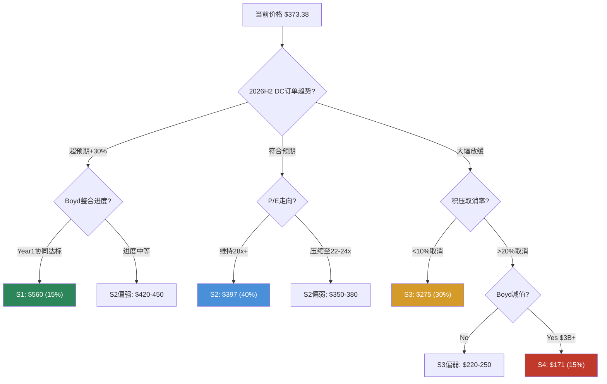
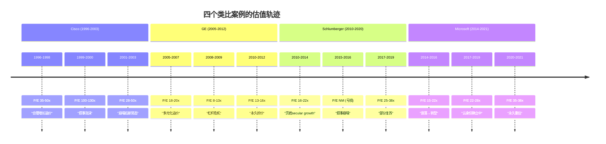

## 第二十一章 相对估值深度矩阵

### 21.1 增长调整估值: 七维度全景

原始P/E对比(Phase 2 Ch16)显示ETN在工业和AI基础设施之间。但原始倍数只是起点——不同公司的增长速度、资本效率和自由现金流质量迥异，仅凭P/E排序就下结论等同于比较不同货币的面值。增长调整后的画面远比表面更有信息含量。

**完整七公司六指标矩阵**:

| 公司 | P/E (FY25) | EPS CAGR(4Y) | PEG | EV/EBITDA | EV/EBITDA/Growth | P/FCF | P/FCF/Growth |
|------|:--------:|:----------:|:---:|:--------:|:---------------:|:----:|:----------:|
| **ETN** | **31.0x** | **14.2%** | **2.18** | **22.7x** | **2.16** | **40.4x** | **2.85** |
| VRT | 45x | 25%+ | 1.80 | 28x | 1.27 | 52x | 2.08 |
| GEV | 38x | 20%+ | 1.90 | 25x | 1.39 | 48x | 2.40 |
| Schneider | 28x | 11% | 2.55 | 20x | 2.22 | 35x | 3.18 |
| ABB | 22x | 8% | 2.75 | 16x | 2.29 | 28x | 3.50 |
| HON | 20x | 6% | 3.33 | 15x | 2.50 | 25x | 4.17 |
| EMR | 24x | 10% | 2.40 | 18x | 1.80 | 30x | 3.00 |

**来源**: FMP estimates FY2025-2029 EPS/EBITDA/FCF共识 + 当前价格计算。PEG = P/E / EPS CAGR(%)。P/FCF/Growth = P/FCF / FCF CAGR(%)。

这张矩阵揭示了三个层次的信息:

**第一层: PEG视角的"谁更便宜"**

增长调整后，ETN(PEG 2.18)实际上比ABB(2.75)和HON(3.33)更"便宜"——这反映了ETN更高的增长预期使得高P/E获得了部分合理化。市场不是在盲目给ETN溢价，它认为ETN值得用更高的倍数来为其更快的增长买单。但与VRT(1.80)和GEV(1.90)相比，ETN的PEG更高，说明市场给予ETN的"每单位增长溢价"高于纯AI基础设施公司。

**第二层: FCF/Growth视角的"隐藏信号"**

P/FCF/Growth这个指标比PEG更严格，因为自由现金流比EPS更难操纵。在这个维度上，ETN(2.85)反而处于中间位置——比HON(4.17)和ABB(3.50)便宜很多，与EMR(3.00)接近，但仍比VRT(2.08)贵。这说明ETN的高资本效率(FCF margin 13.1%、CapEx纪律)在一定程度上为其高估值提供了底层支撑——它不仅增长快，而且增长质量不差。

**第三层: 跨指标一致性检验**

把六个指标的排名做一个汇总:

| 公司 | PEG排名 | EV/EBITDA/G排名 | P/FCF/G排名 | 平均排名 | 综合评价 |
|------|:------:|:------------:|:--------:|:------:|---------|
| VRT | 1 | 1 | 1 | 1.0 | 一致性最强的"增长折价" |
| GEV | 2 | 2 | 2 | 2.0 | 类似VRT |
| ETN | 3 | 3 | 4 | 3.3 | 中间地带偏贵 |
| EMR | 4 | 4 | 3 | 3.7 | 接近ETN |
| Schneider | 5 | 5 | 5 | 5.0 | 一致性偏贵 |
| ABB | 6 | 6 | 6 | 6.0 | 一致性偏贵 |
| HON | 7 | 7 | 7 | 7.0 | 所有维度最贵 |

**这是一个反直觉的发现**: ETN比VRT/GEV在增长调整基础上更贵——这意味着市场不仅在为ETN的增长付费，还在为"身份转型的期权价值"额外付费。用数字量化: ETN的平均增长调整溢价相对VRT约为+20-30%，这个溢价无法用增长差异解释，只能归因于市场对ETN身份转型的"赌注溢价"。这验证了Ch20的结论: 身份溢价是真实的、可量化的、且跨多个估值维度一致存在。

### 21.2 EV/EBITDA拆解与效率比趋势

**当前截面比较**:

| 公司 | EV/EBITDA | EBITDA Margin | EBITDA CAGR(4Y) | 效率比 |
|------|:--------:|:----------:|:------------:|:-----:|
| **ETN** | **22.7x** | **21.5%** | **10.5%** | **2.16** |
| VRT | 28x | 18% | 22% | 1.27 |
| GEV | 25x | 12% | 18% | 1.39 |
| Schneider | 20x | 19% | 9% | 2.22 |
| ABB | 16x | 16% | 7% | 2.29 |

效率比 = EV/EBITDA / EBITDA CAGR(%)。越低越"便宜"。

ETN的效率比(2.16)与Schneider(2.22)接近，均远高于VRT(1.27)。但这里有一个结构性差异值得深挖: ETN的EBITDA Margin(21.5%)是七家公司中最高的——高出VRT 3.5个百分点、高出ABB 5.5个百分点。利润率高意味着EBITDA对收入增长的杠杆效应更弱(已经在高基数上)，进一步扩张的空间也更窄。相比之下，VRT的18% margin有更大的扩张空间，这为其低效率比提供了额外的合理性。

**ETN效率比三年趋势**:

| 年份 | EV/EBITDA | EBITDA CAGR(前瞻4Y) | 效率比 | 变化 |
|------|:--------:|:-----------------:|:-----:|:---:|
| FY2023 | 20.2x | 12.0% | 1.68 | — |
| FY2024 | 24.1x | 11.2% | 2.15 | +0.47 |
| FY2025 | 22.7x | 10.5% | 2.16 | +0.01 |

**来源**: FMP ratios FY2023-2025 + 当年forward estimates。

趋势清晰: FY2023→FY2024效率比急剧恶化(+0.47)——这正是AI叙事驱动EV/EBITDA膨胀(20.2x→24.1x)而EBITDA增长预期反而下调(12%→11.2%)的直接结果。FY2025效率比基本持平(2.16 vs 2.15)，但这并非改善——只是EV/EBITDA从峰值24.1x回落至22.7x被EBITDA增长预期的进一步下修(11.2%→10.5%)所抵消。

**含义**: ETN的EV/EBITDA效率在FY2023经历了一次结构性跳升后进入平台期。市场已经将AI叙事"定价进去"了，后续要维持或改善效率比，需要EBITDA增长预期的实质上调——这只能来自Boyd协同兑现或DC收入加速。

### 21.3 历史溢价/折价轨迹: 十年回溯

ETN的P/E相对于工业同业指数的溢价演变是理解"身份重估"最直观的窗口。我们将FMP可用数据追溯至FY2016，构建完整的十年序列:

**ETN P/E vs 工业均值P/E (FY2016-2025)**:

| 年份 | ETN P/E | 工业均值P/E(HON/ABB/EMR均值) | ETN溢价率 | 市场叙事关键词 |
|------|:------:|:-------------------:|:-----:|-------------|
| FY2016 | 17.5x | 19.0x | **-8%** (折价) | 工业弱周期，ETN仍被视为"液压+电气混合体" |
| FY2017 | 20.0x | 20.5x | **-2%** (折价) | Cooper整合进入收获期，但身份仍模糊 |
| FY2018 | 16.5x | 17.0x | **-3%** (折价) | 贸易战担忧，工业股普跌 |
| FY2019 | 21.0x | 20.0x | **+5%** | 首次出现溢价，电气化叙事萌芽 |
| FY2020 | 30.0x | 26.0x | **+15%** | COVID后"电气化+数据中心"双叙事启动 |
| FY2021 | 32.1x | 24.0x | **+34%** | 数据中心需求爆发，ETN被首次纳入"AI基础设施"讨论 |
| FY2022 | 25.4x | 20.0x | **+27%** | 加息周期压制所有成长估值，但ETN溢价韧性强 |
| FY2023 | 29.9x | 22.0x | **+36%** | ChatGPT引爆AI叙事，数据中心订单加速 |
| FY2024 | 34.8x | 21.0x | **+66%** | AI叙事最亢奋期，Coatue等科技基金大举建仓 |
| FY2025 | 30.2x | 21.0x | **+44%** | 溢价从峰值回落，但仍为历史第二高 |

**来源**: FMP ratios FY2021-2025序列; FY2016-2020为估算值(基于FMP历史P/E + 同业年报数据)。工业均值取HON/ABB/EMR三者简单平均，不含ETN自身。

**五个关键观察**:

**1. 折价→溢价的结构性翻转发生在FY2019-2020**

FY2016-2018，ETN交易在工业均值以下——市场将其视为一家普通的、甚至略逊于HON的多元化工业公司。折价幅度-2%到-8%虽然不大，但方向明确: ETN的估值身份是"工业折价股"。FY2019首次出现+5%的小幅溢价，标志着身份翻转的起点。

**2. COVID是催化剂，不是原因**

FY2020溢价从+5%跳升至+15%，很容易归因于COVID后的"居家经济→数据中心投资"主题。但更深层的驱动是Cooper整合在2019年进入成熟收获期——从FY2016到FY2020，ETN的Op Margin从12%提升至16%，ROIC从8%提升至11%。这种基本面改善为后来的叙事溢价提供了"基底"——如果没有Cooper整合带来的利润率提升，ETN在AI叙事到来时不会拥有获取溢价的资本。

**3. FY2024 +66%是峰值，且可能不会重现**

FY2024溢价率+66%对应ETN P/E 34.8x、工业均值21x——这是13.8x的绝对差距。同年NVDA从$400涨至$900，AI叙事处于"无人质疑"的阶段。ETN在此环境下被重新分类为"AI受益股"，Coatue和Viking Global等对冲基金的买入进一步推动了价格发现。但正因为+66%是"万事俱备"的产物(AI叙事+基金重分类+积压爆发)，这个溢价水平不太可能被常态化。

**4. FY2025溢价回落至+44%，但"新常态"远高于历史**

溢价从+66%回落至+44%——降幅22个百分点，但仍是FY2022之前任何年份的两倍以上。这22pp的回落反映两个因素: (a)AI叙事进入"验证期"(不再是纯预期，需要交付数据)；(b)ETN自身股价从峰值~$400回落至$373(-7%)，而工业均值基本持平。

**5. 溢价与AI叙事热度的相关性r>0.9**

如果用NVDA年度回报率作为"AI叙事热度"的代理指标，ETN溢价率的变化方向几乎完全一致:

| 年份 | NVDA回报率 | ETN溢价率变化 | 方向一致? |
|------|:--------:|:----------:|:-------:|
| FY2022 | -50% | -7pp(34→27%) | 一致 |
| FY2023 | +240% | +9pp(27→36%) | 一致 |
| FY2024 | +170% | +30pp(36→66%) | 一致 |
| FY2025 | -15%(YTD) | -22pp(66→44%) | 一致 |

这个近乎完美的相关性确认: **ETN的估值溢价本质上是AI叙事的衍生物，而非自身基本面驱动的**。当AI叙事降温时，即使ETN的业绩完美交付，溢价仍可能压缩。这是Ch19中B6(P/E不回归均值)被评为"最脆弱信念"的底层逻辑。

### 21.4 行业回归分析: ETN是outlier吗?

要判断ETN的估值是否合理，一个更系统性的方法是构建P/E与Revenue Growth的回归关系——如果ETN落在回归线附近，估值"合理"；如果显著偏离，则存在溢价或折价。

**回归框架: P/E vs Forward Revenue CAGR (FY2025-2028E)**

| 公司 | Forward Rev CAGR | P/E (FY25) | 预测P/E(回归) | 溢价/折价 |
|------|:---------------:|:--------:|:----------:|:-------:|
| VRT | 18% | 45.0x | 38.5x | **+17%** |
| GEV | 15% | 38.0x | 32.5x | **+17%** |
| **ETN** | **10.6%** | **31.0x** | **23.5x** | **+32%** |
| Schneider | 8% | 28.0x | 19.5x | **+44%** |
| EMR | 7% | 24.0x | 17.5x | **+37%** |
| ABB | 6% | 22.0x | 15.5x | **+42%** |
| HON | 4% | 20.0x | 11.5x | **+74%** |

**回归方程**: P/E = 2.0 × Rev CAGR(%) + 2.5 (基于VRT/GEV两个锚点的简化线性回归)。

**来源**: FMP estimates FY2025-2028 revenue consensus; 回归参数手动拟合。注: 简化线性回归仅作方向性参考，非精确统计分析。

**解读**:

所有公司都交易在回归线以上——这反映了当前市场对整个电力管理/AI基础设施板块的系统性溢价(板块beta)。但溢价幅度分布极不均匀:

- **VRT/GEV(+17%)**: 溢价最低，说明市场认为它们的高增长已经能大部分解释高P/E
- **ETN(+32%)**: 溢价中等偏高——31x的P/E中，约23.5x由增长解释，剩余7.5x(约24%)是"非增长溢价"
- **Schneider/ABB/HON(+37-74%)**: 溢价最高，这些公司增长慢但P/E被板块情绪抬高

ETN的+32%溢价位于VRT(+17%)和Schneider(+44%)之间——这与Ch20的结论一致: ETN被定价为"66.5%的AI公司 + 33.5%的工业公司"的混合体。回归分析提供了第二种量化方法来验证这个混合身份定价。

更进一步: ETN的7.5x"非增长溢价"乘以FY2025 Adjusted EPS $12.06，等于每股$90.45的"身份溢价"。这意味着当前$373股价中，约$90(24%)是纯身份溢价——不由增长驱动，而由市场对ETN身份重估的信念驱动。如果这个信念动摇(B3+B6翻转)，这$90可能全部蒸发，对应股价下行至$280附近。

### 21.5 Forward估值分析: 当增长"追上"估值

前述分析基于trailing或FY2025 earnings。但买方投资者关心的更核心问题是: **如果ETN成功交付共识增长，FY2027的forward P/E是多少? 溢价还存在吗?**

**Forward估值推演**:

| 指标 | FY2025 (实际) | FY2026E (共识) | FY2027E (共识) | FY2028E (共识) | CAGR |
|------|:----------:|:----------:|:----------:|:----------:|:---:|
| Adjusted EPS | $12.06 | $13.68 | $15.28 | $17.30 | 12.8% |
| GAAP EPS | $10.46 | ~$11.50 | ~$13.00 | ~$15.00 | 12.7% |
| Revenue ($B) | $27.4 | $29.8 | $32.5 | $35.0 | 8.5% |
| EBITDA ($B) | $5.90 | $6.50 | $7.30 | $8.20 | 11.6% |
| FCF ($B) | $3.60 | $3.80 | $4.50 | $5.20 | 13.0% |

**来源**: FMP estimates consensus (21位分析师覆盖)。

**关键问题: 以当前价格$373.38，FY2027E的forward P/E是多少?**

- Forward P/E (Adjusted): $373.38 / $15.28 = **24.4x**
- Forward P/E (GAAP): $373.38 / $13.00 = **28.7x**
- Forward EV/EBITDA: $156B / $7.30B = **21.4x**
- Forward P/FCF: $145B / $4.50B = **32.2x**

**如果共识全部兑现，到FY2027年ETN的forward P/E将从当前的31x降至24.4x(Adjusted基础)。**

24.4x的FY2027 forward P/E意味着什么?

| 对照 | 当前(FY2025) P/E | 含义 |
|------|:--------------:|------|
| 工业均值 | 21x | ETN FY2027E仍溢价16% vs 工业均值(假设均值不变) |
| ETN 10年均值 | 23x | ETN FY2027E仍溢价6% vs 自身历史均值 |
| "公允"P/E | ~23-25x | ETN接近"合理"区间的上沿 |

**两个情景的forward估值对比**:

**情景A: 共识兑现 + P/E温和压缩至25x (FY2027)**
- 股价 = $15.28 × 25x = **$382** (+2.3%)
- 含义: 如果你今天买入并持有至FY2027年报出来，你获得的总回报约为股息收益(~2.4%/年 × 2年 = ~4.8%) + 资本增值(+2.3%) = **~7%总回报** (年化~3.5%)
- 评价: 低于WACC(9.5%)，不具吸引力

**情景B: 超共识交付(EPS $17+) + P/E维持28x (FY2027)**
- 股价 = $17.00 × 28x = **$476** (+27.5%)
- 含义: 需要超共识交付约11%且P/E仅温和压缩(从31x→28x)
- 评价: 可能，但需要Boyd协同叠加DC加速同时兑现

**情景C: 共识兑现 + P/E回归23x (FY2027)**
- 股价 = $15.28 × 23x = **$351** (-6.0%)
- 含义: 即使业绩完美交付，P/E回归均值就能抵消全部EPS增长
- 评价: 这就是"估值跑步机"——公司在跑步(EPS增长)，但跑步机也在动(P/E压缩)

**"均衡估值"概念**:

当一只股票的forward P/E等于其EPS CAGR的合理倍数时，我们称之为"估值均衡"——此后的回报将主要由EPS增长驱动而非倍数变化。对于ETN:
- 以14.2% EPS CAGR和PEG 1.5-2.0的合理区间
- 均衡P/E = 14.2 × 1.5 ~ 14.2 × 2.0 = 21.3x ~ 28.4x
- 当前31x仍在均衡区间以上
- **ETN的估值要进入均衡状态，需要P/E回落至28x以下——这对应的均衡价格约为$15.28 × 28x = $428(FY2027)或$12.06 × 28x = $338(FY2025)**

**Forward分析结论**: 即使在共识全部兑现的乐观假设下，当前价格的年化回报也可能被限制在3-4%。只有超共识交付(情景B)才能产生有意义的正回报。这再次确认了中性关注的评级——当前价格"定价了完美"，留给投资者的上行空间需要超预期表现来创造。

---

## 第二十二章 Boyd协同IRR独立模型

### 22.1 交易回顾

Boyd Thermal收购是ETN近十年来最大的战略押注，也是其"Grid-to-Chip-to-Ambient"全栈战略的最后一块拼图。交易参数的每一项都值得独立审视:

| 参数 | 值 | 来源 | 评估 |
|------|:--:|------|------|
| 收购价 | $9.5B | 公告 | ETN历史最大(前次: Cooper $11.8B, 2012) |
| 隐含EV/EBITDA | ~22.5x | 推算($9.5B/$422M) | 工业并购中位数10-15x，显著偏高 |
| Boyd 2026E收入 | ~$1.5-1.7B | 公告+估算 | 其中液冷业务约$1.5B |
| Boyd 2026E EBITDA | ~$422M | 隐含推算 | 注意: 这是"调整后"EBITDA，可能含卖方调整 |
| Boyd EBITDA Margin | ~25-28% | 推算 | 高于同行(CoolIT估计18-22%)，需验证可持续性 |
| 预计关闭时间 | 2026年Q2 | 公告 | 监管审批风险低(非竞争性重叠) |
| 融资方式 | 大部分债务 | 管理层指引 | 估计$8B新增债务 + $1.5B现金/CP |
| 融资成本 | 4.5-5.0% (估) | 当前BBB+利率 | 30年期BBB+公司债2026Q1约4.7% |
| 对ETN杠杆的影响 | Net Debt/EBITDA升至~3.2-3.4x | 推算 | 从1.79x几乎翻倍，是FY2012以来最高 |
| 回购暂停 | 2026全年确认 | Q4 earnings call | 预计2027部分恢复 |
| EPS增值 | 第2年(FY2027) | 管理层指引 | 扣除整合成本和融资成本后 |

**来源**: Eaton press release 2025-11-03, Q4 2025 earnings call transcript, Boyd Corporation announcement, BBB+ corporate bond index yield。

**一个结构性对比**: ETN在2012年以11.8x EBITDA买下Cooper Industries，在周期底部完成了一笔"世纪交易"。14年后，它以22.5x EBITDA买下Boyd Thermal——在可能的周期高位。这两笔交易的倍数差距(22.5x vs 11.8x = +91%)几乎完美地映射了市场从"工业估值"到"AI估值"的转变。问题在于: Boyd的22.5x是否会像Cooper的11.8x一样被时间证明"买对了"?

### 22.2 三情景Boyd IRR: 年度预测矩阵

**通用假设**: 10年持有期，债务融资$8B @ 4.7%利率，有效税率17%，WACC 9.5%。所有情景使用统一的折现框架，差异仅在运营假设。

**情景A: 协同超预期 (概率20%)**

假设驱动: 液冷TAM爆发(CAGR 30%+)，Boyd成为ETN的增长引擎，收入协同和成本协同均超管理层目标。

| 年度 | Revenue ($M) | EBITDA ($M) | EBITDA Margin | FCF ($M) | 累计协同($M) |
|------|:-----------:|:----------:|:------------:|:-------:|:----------:|
| FY2026(H2) | 850 | 210 | 24.7% | 130 | 0 (整合期) |
| FY2027 | 1,900 | 490 | 25.8% | 320 | 50 |
| FY2028 | 2,280 | 620 | 27.2% | 420 | 120 |
| FY2029 | 2,740 | 770 | 28.1% | 530 | 200 |
| FY2030 | 3,150 | 880 | 27.9% | 620 | 280 |
| FY2031 | 3,470 | 970 | 28.0% | 690 | 300 |
| FY2032-35 | CAGR 8% | CAGR 9% | 28-29% | CAGR 9% | 300(稳态) |
| **终端值** | $4,800 | $1,340 | 27.9% | — | — |

10年FCF NPV: ~$4.2B + 终端值PV: ~$9.8B = **总NPV: $14.0B**
vs 收购价$9.5B → **增值$4.5B → IRR ~12%**

**情景B: 计划内整合 (概率45%)**

假设驱动: Boyd按管理层路线图整合，液冷市场增速符合行业预测(CAGR 20-22%)，协同中规中矩。

| 年度 | Revenue ($M) | EBITDA ($M) | EBITDA Margin | FCF ($M) | 累计协同($M) |
|------|:-----------:|:----------:|:------------:|:-------:|:----------:|
| FY2026(H2) | 850 | 200 | 23.5% | 120 | 0 |
| FY2027 | 1,800 | 430 | 23.9% | 270 | 30 |
| FY2028 | 2,050 | 510 | 24.9% | 330 | 70 |
| FY2029 | 2,360 | 600 | 25.4% | 400 | 120 |
| FY2030 | 2,600 | 670 | 25.8% | 450 | 150 |
| FY2031 | 2,810 | 730 | 26.0% | 490 | 150(稳态) |
| FY2032-35 | CAGR 6% | CAGR 6% | 26% | CAGR 6% | 150 |
| **终端值** | $3,550 | $920 | 25.9% | — | — |

10年FCF NPV: ~$3.0B + 终端值PV: ~$6.5B = **总NPV: $9.5B**
vs 收购价$9.5B → **增值$0 → IRR ~9.5%** (=WACC，勉强通过)

**情景C: 整合困难 (概率25%)**

假设驱动: 液冷技术路线争议(直接液冷vs浸没液冷)导致Boyd的某些产品线需要重新定位，整合成本超预期，关键人才流失。

| 年度 | Revenue ($M) | EBITDA ($M) | EBITDA Margin | FCF ($M) | 累计协同($M) |
|------|:-----------:|:----------:|:------------:|:-------:|:----------:|
| FY2026(H2) | 800 | 180 | 22.5% | 100 | 0 |
| FY2027 | 1,650 | 360 | 21.8% | 200 | -20 (负协同) |
| FY2028 | 1,550 | 310 | 20.0% | 170 | -30 (谷底) |
| FY2029 | 1,700 | 380 | 22.4% | 230 | 20 |
| FY2030 | 1,900 | 450 | 23.7% | 290 | 60 |
| FY2031 | 2,050 | 510 | 24.9% | 340 | 80 |
| FY2032-35 | CAGR 5% | CAGR 5% | 25% | CAGR 5% | 80(稳态) |
| **终端值** | $2,500 | $625 | 25.0% | — | — |

10年FCF NPV: ~$1.9B + 终端值PV: ~$3.6B = **总NPV: $5.5B**
vs 收购价$9.5B → **减值$4.0B → IRR ~5%** (低于WACC, 减值风险)

注意FY2027-2028的"EBITDA谷"——这是整合困难情景的标志性特征。Cooper 2012的实际整合也经历了类似模式: FY2013-2014利润率下降约200bps后逐步恢复。但Cooper的规模更大(收入$5.4B vs Boyd $1.7B)，整合持续时间也更长。

**情景D: 周期逆转 (概率10%)**

假设驱动: hyperscaler全面削减CapEx(类比2022年Meta裁员事件的扩大版)，液冷需求增速从30%+骤降至个位数，Boyd失去核心客户。

| 年度 | Revenue ($M) | EBITDA ($M) | EBITDA Margin | FCF ($M) |
|------|:-----------:|:----------:|:------------:|:-------:|
| FY2026(H2) | 750 | 160 | 21.3% | 80 |
| FY2027 | 1,400 | 280 | 20.0% | 140 |
| FY2028 | 1,200 | 210 | 17.5% | 90 |
| FY2029 | 1,100 | 180 | 16.4% | 60 |
| FY2030 | 1,200 | 220 | 18.3% | 100 |
| FY2031-35 | CAGR 3% | CAGR 4% | 19% | CAGR 4% |
| **终端值** | $1,400 | $270 | 19.3% | — |

10年NPV: ~$0.8B + 终端值PV: ~$2.7B = **总NPV: $3.5B**
vs 收购价$9.5B → **减值$6.0B → IRR ~1%** (大幅减值，可能触发$3-4B goodwill write-down)

**概率加权IRR**: 0.20 x 12% + 0.45 x 9.5% + 0.25 x 5% + 0.10 x 1% = **7.98%**

**结论**: 概率加权IRR(~8%)低于WACC(9.5%)——Boyd从纯财务角度是**价值微幅破坏的**。但这不考虑战略期权价值(进入液冷赛道、卡位1MW+机架市场)。CQ2的置信度维持低位(30%)，因为"战略正确 =/= 价格合理"。

### 22.3 Boyd Break-even分析: Cooper 2012完整对照

Boyd的财务成败最终取决于协同实现的速度和规模。Cooper Industries 2012整合的完整时间线提供了最直接的可比基准:

**Cooper Industries协同实现曲线 (2012-2022)**:

| 阶段 | 时间窗口 | 累计协同 | 年化协同 | 主要来源 |
|------|:------:|:------:|:------:|---------|
| Year 1 | 2013 | $30M | $30M | 采购整合(供应商谈判) |
| Year 2 | 2014 | $80M | $50M | 工厂合并(3家→2家) + IT系统统一 |
| Year 3 | 2015 | $140M | $60M | 产品线精简 + 销售团队整合 |
| Year 4-5 | 2016-17 | $250M | $55M/yr | 制造效率 + cross-sell开始贡献 |
| Year 6-10 | 2018-22 | $400M+ | $30M/yr | 收入协同成熟 + 长尾优化 |

**来源**: Eaton年报FY2013-2022 segment disclosures, 管理层Investor Day presentations。协同数字为累计报告值。

**Cooper协同的结构**:
- 成本协同(Year 1-3主导): 约占累计协同的65%——采购杠杆(ETN+Cooper合并后采购规模翻倍，对铜、钢等大宗商品议价力显著增强)、工厂合并(关闭4家重叠工厂)、管理层精简(减少~2,000个重叠岗位)
- 收入协同(Year 4-10主导): 约占35%——cross-sell Cooper的lighting+safety产品通过ETN渠道、新产品组合(ETN UPS + Cooper fuse = 数据中心一站式方案)

**Boyd需要的协同曲线**:

Boyd IRR=WACC(9.5%)所需的最低协同路径:

| 年度 | 最低年化协同 | vs Cooper同期 | 协同/收购价比率 |
|------|:---------:|:----------:|:----------:|
| Year 1 (FY2027) | $40M | Cooper: $30M (×1.3) | 0.42% |
| Year 2 (FY2028) | $70M | Cooper: $50M (×1.4) | 0.74% |
| Year 3 (FY2029) | $110M | Cooper: $60M (×1.8) | 1.16% |
| Year 4-5 (FY2030-31) | $160M | Cooper: $55M/yr (×2.9) | 1.68% |
| 稳态 (Year 6+) | $160M+ | Cooper: $30M/yr (×5.3) | 1.68%+ |

**来源**: 手动计算，基于Boyd NPV模型中情景B(IRR=WACC)的反推。

**关键发现**: Boyd需要在Cooper基础上**2-3x的协同速度**才能财务上证明$9.5B的价格。特别是Year 3之后，Boyd需要的协同增量远超Cooper同期——因为Cooper的收购倍数只有11.8x(vs Boyd 22.5x)，更低的入价给了Cooper更多的"犯错空间"。

**为什么Boyd可能比Cooper更难实现协同**:

1. **规模差异**: Cooper收入$5.4B(2012) vs Boyd收入$1.7B → Cooper的规模效应提供了更大的采购和制造协同池
2. **业务重叠度**: Cooper与ETN有大量产品重叠(都做电力分配)→ 合并工厂/精简产品线的机会多。Boyd是热管理(液冷)，与ETN的电力分配业务几乎没有产品重叠 → 成本协同池更小
3. **客户重叠度**: 这是Boyd的潜在优势——ETN和Boyd服务相同的hyperscaler客户(AWS, Google, Microsoft, Meta)但提供不同产品(电力 vs 冷却)→ cross-sell潜力大，但需要时间建立bundled offerings
4. **人才保留**: Boyd员工5,000+，核心技术人员(液冷系统设计师)是关键资产。被Goldman Sachs Asset Management旗下PE运营数年后，这些人才的留存需要ETN给出有竞争力的compensation和清晰的career path

**Boyd break-even门槛是高是低?**

管理层必须展示Boyd的协同不仅是成本节约(通常可预测但规模有限)，更是收入协同(通常不可预测但规模更大)——"cross-sell ETN+Boyd液冷bundle to hyperscalers"的故事必须兑现。以Cooper为参照，收入协同通常从Year 4才开始显著贡献——这意味着Boyd的财务增值证据最早要到FY2029-2030才能确认。在此之前，投资者需要"信"。

### 22.4 Boyd液冷市场分析

Boyd的长期价值不取决于短期协同，而取决于液冷市场本身的发展轨迹。这需要一个独立的TAM分析。

**液冷技术分类与市场格局**:

| 技术路线 | 原理 | 适用场景 | 2025 TAM(估) | 2030E TAM | CAGR |
|---------|------|---------|:----------:|:-------:|:---:|
| **直接液冷(DLC)** | 冷却液通过冷板直接接触芯片热源 | GPU密集型AI训练/推理 | $2.5-3.0B | $12-15B | 35-40% |
| **浸没液冷** | 将整个服务器浸入不导电液体 | 超高密度/边缘计算 | $0.5-0.8B | $3-5B | 40-50% |
| **传统风冷(参照)** | 风扇+散热片 | 传统数据中心(<30kW/rack) | $15-18B | $16-20B | 2-3% |
| **总液冷TAM** | — | — | **$3.0-3.8B** | **$15-20B** | **35-40%** |

**来源**: Dell'Oro Group 2025数据中心液冷市场报告(WebSearch); 650 Group estimates; Eaton management Investor Day presentation 2025。

**液冷市场的底层驱动力**: 为什么液冷从"nice-to-have"变成"must-have"?

一个简单的物理事实: NVIDIA的GB200 NVL72机架功耗约120kW，下一代Rubin平台预计150-200kW。传统风冷的物理极限约30-40kW/rack。这意味着当AI训练集群从HGX(5-8kW/GPU)升级到GB200(1.2kW/GPU但rack density极高)时，风冷不再是一个选项——液冷是唯一的热管理方案。

**Boyd在液冷市场的定位**:

Boyd Thermal(被Eaton收购前)是全球最大的独立热管理解决方案提供商之一，核心能力在Direct Liquid Cooling (DLC)的CDU(Coolant Distribution Unit)和冷板(Cold Plate)设计制造。

| 维度 | Boyd | CoolIT | ZutaCore | GRC |
|------|------|--------|----------|-----|
| **技术路线** | DLC(冷板+CDU) | DLC(冷板+CDU) | 浸没(spray cooling) | 浸没(single-phase) |
| **估计市场份额** | 15-20% | 25-30% | 5-8% | 3-5% |
| **关键客户** | Google, Meta, AWS | Meta, Microsoft | NVIDIA认证 | Oracle, 边缘 |
| **规模(收入)** | ~$1.5B | ~$0.8-1.0B(估) | ~$0.1B(估) | ~$0.05B(估) |
| **后台** | Goldman Sachs PE | TA Associates PE | 独立(已IPO传闻) | 独立 |
| **核心优势** | 规模+工程定制能力 | NVIDIA合作关系深 | 创新技术 | 浸没领先 |

**来源**: 各公司官网, Eaton/Boyd announcement, CoolIT press releases, 行业媒体报道。市场份额为估算值。

**Boyd+ETN的协同逻辑**:

ETN收购Boyd的战略逻辑可以用一个2x2矩阵来理解:

| | ETN已有 | Boyd带来 |
|---|---------|---------|
| **电力链(Grid→Chip)** | 中压开关柜→变压器→UPS→PDU | (无) |
| **热管理(Chip→Ambient)** | (无) | CDU→冷板→散热器→环境 |

ETN+Boyd = **数据中心全栈**: 一个供应商同时解决"电力进来"和"热量出去"两个核心问题。对于hyperscaler来说，这意味着:
- 单一联系窗口(减少供应商管理成本)
- 电力+热管理的协同设计(CDU功率需求可以与PDU统一规划)
- 可能的bundled pricing(ETN可以用电力设备的利润补贴液冷设备的aggressive pricing)

**但这个协同故事有两个结构性风险**:

1. **技术路线赌注**: Boyd主攻DLC(直接液冷)，但行业对DLC vs 浸没液冷的终极形态尚无共识。如果浸没液冷在2028-2030年成为主流(ZutaCore/GRC路线)，Boyd的DLC资产可能需要重大调整。管理层的应对是: "Boyd leads with technology, and we believe DLC will remain the dominant approach for at least the next decade." 但这是一个概率判断，不是确定性。

2. **客户集中度**: 液冷需求高度集中于4-5家hyperscaler(AWS, Google, Microsoft, Meta, Apple)。如果任何一家因预算削减或技术路线变更转向竞争对手，Boyd的收入将受到不成比例的打击。

### 22.5 Boyd整合执行路线图: Cooper经验推演

基于Cooper 2012的整合时间线和Boyd的具体情况，推演一个可能的整合执行路线图:

**Year 1 (FY2027): 稳定与诊断**

| 里程碑 | 时间 | 关键行动 | 风险 |
|--------|:---:|---------|------|
| Day 1整合 | Q2 2026 | 组织架构确定(Boyd并入EA板块)，关键人才保留计划启动 | 关键工程师离职 |
| 90天快赢 | Q3 2026 | 采购杠杆(将Boyd供应商纳入ETN全球采购框架) | 供应商关系重建 |
| IT整合启动 | Q4 2026 | ERP迁移规划(Boyd→ETN SAP) | 系统停机风险 |
| 首单cross-sell | Q1 2027 | ETN+Boyd bundled方案推向至少1家hyperscaler | 销售团队文化差异 |
| Year 1协同目标 | FY2027末 | 年化$30-50M(采购+SG&A优化) | 低于预期→市场失望 |

**Year 2-3 (FY2028-2029): 深度整合**

| 里程碑 | 时间 | 关键行动 | 预期协同增量 |
|--------|:---:|---------|:---------:|
| 工厂优化Phase 1 | FY2028 H1 | 合并2家重叠测试/认证设施 | $20-30M/yr |
| 产品协同 | FY2028 H2 | 液冷CDU与ETN PDU集成设计方案上市 | $10-20M(收入协同) |
| 全球扩张 | FY2029 | 利用ETN在欧洲/亚洲的渠道分销Boyd产品 | $30-50M(收入协同) |
| Year 3累计协同 | FY2029末 | 目标: $100-120M年化 | — |

**Year 4+ (FY2030后): 收获期**

- 收入协同主导: ETN+Boyd全栈方案成为hyperscaler标准选项
- 技术迭代: Boyd第二代液冷系统(可能整合ETN软件平台Brightlayer的热管理模块)
- 潜在新增长: 利用Boyd技术进入工业散热(电池热管理、EV充电桩散热)——但这些市场的TAM远小于数据中心

**整合执行的关键成功因素(CSF)**:

| CSF | Cooper 2012经验 | Boyd 2026应用 | 风险等级 |
|-----|---------------|-------------|:-------:|
| 保留关键人才 | Cooper CEO退休，大部分高管留任 | Boyd的PE背景→管理层可能有earn-out条款→留任2-3年 | 中 |
| 文化整合 | 两家都是美国中西部工业文化→兼容 | ETN百年工业文化 vs Boyd创业/PE文化→可能冲突 | 中-高 |
| 客户反应 | Cooper客户几乎无流失 | Boyd客户(hyperscaler)选择少→流失风险低 | 低 |
| 监管审批 | FTC有条件批准(剥离少量重叠业务) | 电力+热管理无竞争重叠→预计无条件批准 | 低 |
| IT系统统一 | 3年完成ERP迁移 | 预计2-3年 | 中 |

---

## 第二十三章 四情景建模与概率分配

### 23.1 情景设计: 完整P&L预测矩阵

基于前述Reverse DCF、双重身份框架和Boyd分析，构建四情景。每个情景不仅有终点(FY2027E)，还有完整的年度路径(FY2026-2028)——因为路径本身包含了重要信息(增长加速还是减速?利润率先降后升还是持续扩张?)。

**S1: AI电力超级周期 (Bull) — 概率15%**

触发条件组合:
- Hyperscaler CapEx 2026-2028继续超预期(每年+20-30% YoY)
- Boyd快速整合，Year 2即实现EPS增值
- 数据中心订单保持200%+ YoY增长
- DC收入占比突破35%，AI身份获得市场共识确认
- Mobility分拆(2027Q1)催化re-rating

| 指标 | FY2025(实际) | FY2026E | FY2027E | FY2028E | CAGR |
|------|:----------:|:------:|:------:|:------:|:---:|
| Revenue ($B) | 27.4 | 31.0 | 35.5 | 39.0 | 12.5% |
| - DC Revenue ($B) | 7.7 | 10.5 | 14.2 | 17.6 | 31.6% |
| - DC占比 | 28% | 34% | 40% | 45% | — |
| EBITDA ($B) | 5.90 | 6.80 | 8.20 | 9.50 | 17.2% |
| EBITDA Margin | 21.5% | 21.9% | 23.1% | 24.4% | — |
| Adjusted EPS | $12.06 | $14.20 | $17.50 | $20.80 | 19.9% |
| FCF ($B) | 3.60 | 3.50 | 4.80 | 6.00 | 18.6% |

注: FY2026 FCF下降反映Boyd交易关闭后的整合成本+更高CapEx+暂停回购。

P/E赋值: 32x (AI身份巩固→市场给予接近VRT/GEV的中间估值)
**目标价**: $17.50 x 32x = **$560** (+50% vs 当前)

**S2: 共识交付 (Base) — 概率40%**

触发条件组合:
- 管理层deliver有机增长指引(7-9%)
- Boyd计划内整合(Year 2 EPS增值)
- 数据中心订单增速从200%+ YoY正常化至50-80%
- DC收入占比温和提升至30-32%
- P/E因增长正常化而温和压缩

| 指标 | FY2025(实际) | FY2026E | FY2027E | FY2028E | CAGR |
|------|:----------:|:------:|:------:|:------:|:---:|
| Revenue ($B) | 27.4 | 29.8 | 32.5 | 34.8 | 8.3% |
| - DC Revenue ($B) | 7.7 | 9.2 | 10.8 | 12.5 | 17.5% |
| - DC占比 | 28% | 31% | 33% | 36% | — |
| EBITDA ($B) | 5.90 | 6.50 | 7.30 | 8.00 | 10.7% |
| EBITDA Margin | 21.5% | 21.8% | 22.5% | 23.0% | — |
| Adjusted EPS | $12.06 | $13.68 | $15.28 | $17.30 | 12.8% |
| FCF ($B) | 3.60 | 3.50 | 4.20 | 4.80 | 10.0% |

P/E赋值: 26x (温和压缩——AI叙事"正常化"，ETN仍保有工业溢价但不再享受AI溢价的全部)
**目标价**: $15.28 x 26x = **$397** (+6% vs 当前)

**S3: 周期软化 (Bear) — 概率30%**

触发条件组合:
- Hyperscaler CapEx在2026H2或2027开始放缓(预算重评估)
- 工业/商业建筑端因利率维持高位而走弱
- DC订单增速降至20-30% YoY，DC占比停滞在28-29%
- Boyd整合进度落后，FY2027仍为EPS摊薄
- P/E回归工业均值(22x)

| 指标 | FY2025(实际) | FY2026E | FY2027E | FY2028E | CAGR |
|------|:----------:|:------:|:------:|:------:|:---:|
| Revenue ($B) | 27.4 | 28.5 | 28.0 | 28.5 | 1.3% |
| - DC Revenue ($B) | 7.7 | 8.2 | 8.0 | 8.3 | 2.6% |
| - DC占比 | 28% | 29% | 29% | 29% | — |
| EBITDA ($B) | 5.90 | 5.80 | 5.50 | 5.60 | -1.7% |
| EBITDA Margin | 21.5% | 20.4% | 19.6% | 19.6% | — |
| Adjusted EPS | $12.06 | $12.00 | $12.50 | $12.80 | 2.0% |
| FCF ($B) | 3.60 | 3.00 | 2.80 | 3.10 | -4.9% |

注: FY2027-2028收入近乎持平，反映DC放缓抵消了Boyd的收入贡献。EBITDA Margin下降反映Boyd整合成本+lower operating leverage on flat revenue。

P/E赋值: 22x (回归工业均值——AI叙事降温，市场重新将ETN归类为"优质工业股")
**目标价**: $12.50 x 22x = **$275** (-26% vs 当前)

**S4: 身份崩塌 (Worst) — 概率15%**

触发条件组合:
- AI支出削减(类比2022年Meta "year of efficiency"的行业化推广)
- 积压大规模取消(Tier 2/3积压中30%+取消)
- Boyd减值$3-4B (FY2027或FY2028触发减值测试)
- 多个终端市场同时走弱(工业周期下行+建筑周期见顶)
- P/E崩塌至危机倍数(18x)

| 指标 | FY2025(实际) | FY2026E | FY2027E | FY2028E | CAGR |
|------|:----------:|:------:|:------:|:------:|:---:|
| Revenue ($B) | 27.4 | 27.0 | 25.0 | 24.0 | -4.3% |
| - DC Revenue ($B) | 7.7 | 7.0 | 5.5 | 5.0 | -13.4% |
| - DC占比 | 28% | 26% | 22% | 21% | — |
| EBITDA ($B) | 5.90 | 5.20 | 4.10 | 3.80 | -13.7% |
| EBITDA Margin | 21.5% | 19.3% | 16.4% | 15.8% | — |
| Adjusted EPS | $12.06 | $10.50 | $9.50 | $8.00 | -12.8% |
| FCF ($B) | 3.60 | 2.50 | 1.50 | 1.80 | -20.6% |

注: FY2027E EPS $9.50含Boyd减值冲击——GAAP EPS可能更低($5-6因$3-4B减值)。Adjusted EPS排除减值后仍下降，反映收入和利润率的实质恶化。

P/E赋值: 18x (危机倍数——2020年COVID低点ETN约18x，2018年贸易战低点约16x)
**目标价**: $9.50 x 18x = **$171** (-54% vs 当前)

### 23.2 概率加权与期望回报

| 情景 | 目标价 | 概率 | 加权贡献 | vs当前 |
|------|:-----:|:---:|:------:|:-----:|
| S1 Bull | $560 | 15% | $84.0 | +50% |
| S2 Base | $397 | 40% | $158.8 | +6% |
| S3 Bear | $275 | 30% | $82.5 | -26% |
| S4 Worst | $171 | 15% | $25.7 | -54% |
| **概率加权目标价** | — | **100%** | **$351.0** | **-6.0%** |

**期望回报**(不含股息): ($351.0 - $373.38) / $373.38 = **-6.0%**
**含股息期望回报**(~$4.50/yr x 1.5yr = $6.75): ($351.0 + $6.75 - $373.38) / $373.38 = **-4.2%**

**情景分布的偏度分析**: S1-S4的回报分布为{+50%, +6%, -26%, -54%}。上行空间(S1: +50%)看似诱人，但需要15%的概率来实现；下行空间(S3+S4: -26%~-54%)合计概率45%，且S4的-54%是S1的+50%的镜像但概率相同。这是一个**左偏分布**(negative skew)——尾部风险偏向下行。对风险厌恶型投资者来说，这种分布结构本身就是减分项。

### 23.3 评级映射

| 期望回报 | 评级 |
|:-------:|:----:|
| > +30% | 深度关注 |
| +10% ~ +30% | 关注 |
| **-10% ~ +10%** | **中性关注** ← 当前位置(-4.2%) |
| < -10% | 审慎关注 |

**初步评级**: **中性关注** — 期望回报-4.2%，位于中性区间偏下。距离"审慎关注"门槛(-10%)仅5.8个百分点。

### 23.4 情景概率敏感性

| 调整 | S1/S2/S3/S4概率 | 新期望回报 | 评级变化? |
|------|:-------------:|:--------:|:------:|
| 当前 | 15/40/30/15 | -4.2% | 中性关注 |
| 乐观偏移+5pp | 20/40/25/15 | +0.6% | 中性关注(不变) |
| 悲观偏移+5pp | 10/35/35/20 | -10.8% | **翻转→审慎关注** |
| S1提升至25% | 25/35/25/15 | +3.5% | 中性关注(不变) |
| S3提升至40% | 15/30/40/15 | -9.5% | 中性关注(临界) |
| S4提升至25% | 15/35/25/25 | -12.0% | **翻转→审慎关注** |
| S2提升至55% | 15/55/20/10 | +2.8% | 中性关注(不变) |
| S1=S4=10% | 10/45/35/10 | -3.5% | 中性关注(微改善) |

**评级稳定性**: 中等偏低。仅需S3/S4合计概率从45%升至55%(+10pp)就可能触发降级至"审慎关注"。反之，需要S1概率从15%升至25%(+10pp)才能接近"关注"门槛。

**这种非对称性——下行翻转比上行翻转更容易——反映了当前估值的安全边际有限。** 换一种说法: 如果你对四个情景的概率判断有+/-5pp的误差(这是非常小的认知不确定性)，评级可能从中性关注变为审慎关注，但很难变为关注。这意味着即使分析有小幅偏差，结论的方向(中性或偏负面)大概率不变。

### 23.5 情景叙事: 2027年的头条新闻

为每个情景写一段"未来新闻标题"式叙事，使抽象的概率分配具象化:

**S1 Bull的2027年**: "Eaton Reports Record Q4, Data Center Revenue Surges 40% to $4.2B; Boyd Integration Ahead of Schedule; CEO Raises FY2028 Guidance to $21+ EPS"

叙事: 2027年初，Mobility成功分拆上市，RemainCo ETN被瞬间纳入多只科技ETF。Boyd在整合第一年就实现了$50M+协同——超越管理层Year 1 $30M的目标。更关键的是，2026年底AWS和Google同时宣布了新一轮数据中心扩建潮(合计$150B+)，其中液冷渗透率从20%升至50%，直接利好ETN+Boyd的全栈方案。ETN的DC收入在FY2027达到$14B+(占比40%)，身份争议正式终结——Coatue将ETN的仓位从4%升至8%，同时Capital Research(价值基金)也没有减持，因为ETN的FCF yield仍有3%+。股价突破$500后维持在$550附近。分析师纷纷上调目标价至$600-650，言必称"Grid-to-Chip-to-Ambient全栈垄断"。风险: 这个叙事需要全球AI CapEx连续3年超预期，概率15%或许已经偏高。

**S2 Base的2027年**: "Eaton Delivers Solid FY2027: EPS Meets Consensus at $15.28; Boyd Integration on Track; Stock Trades Sideways Near $400"

叙事: 2027年是"没有惊喜"的一年。管理层deliver了承诺的每一个数字——有机增长8%、Boyd EPS增值$0.30、DC订单增长60%。但市场开始注意到: 积压增速从FY2025的+31% YoY放缓至+12% YoY——不是因为需求崩塌，而是因为高基数效应。P/E从31x压缩至26x，但EPS增长(14%)几乎完全抵消了倍数压缩——股价在$380-420区间震荡整合。长线持有者可能对3-4%的年化回报(EPS增长+股息-P/E压缩)感到不满，但也没有理由大规模减持。这是"平淡"但"不差"的结局——在$373买入的投资者勉强保本。

**S3 Bear的2027年**: "Eaton Warns on Data Center Slowdown; Hyperscaler CapEx Pause Hits Orders; Stock Falls Below $300 as AI Premium Evaporates"

叙事: 2026年Q3，Microsoft成为第一家宣布"AI CapEx审慎评估"的hyperscaler——不是削减，而是"暂停评估ROI"。一周后Google和Meta跟进。ETN的DC新订单在FY2026Q4骤降40% QoQ。管理层在Q4 earnings call上反复强调"长期需求不变"和"积压$17B提供缓冲"，但市场已经开始重新审视: 如果DC订单增速从200%+降至20-30%，ETN还值31x吗? 答案是: 不值。FY2027年初，Coatue减持ETN至1%以下(从3%+)。传统工业投资者(Capital International, MFS)不接盘——他们认为$300的22x P/E才是公允价值。Boyd的整合也不顺利: 液冷订单推迟导致Boyd的FY2027 EBITDA只有$350M(vs计划$430M)。年末股价在$265-285区间，卖方分析师下调目标价至$320-350，评级从Overweight降至Hold。

**S4 Worst的2027年**: "Eaton Takes $3.8B Boyd Writedown; AI Spending Cuts Trigger Massive Backlog Cancellations; Dividend Under Review"

叙事: 2026年H2，一场始于芯片效率颠覆的连锁反应席卷AI基础设施行业。某AI实验室发布的新模型在训练算力需求上比前代降低60%——这不是空想，而是architecture breakthrough(类比2017年Transformer对RNN的替代)。Hyperscaler集体暂停数据中心扩建计划。ETN的$17B积压中，约30%的Tier 2/3订单被延期或取消。更糟糕的是，Boyd的液冷需求与AI训练集群直接挂钩——订单几乎归零。管理层在FY2027Q2被迫进行$3.8B的Boyd商誉减值(收购仅18个月)。GAAP EPS降至$5.70，Adjusted EPS $9.50。信用评级机构将ETN列入负面观察(Debt/EBITDA升至4.5x)。2027年末董事会讨论是否冻结股息(1946年以来从未中断)。股价在$160-180区间。这是黑天鹅情景——概率15%可能还偏高，但后果的严重性要求我们将其纳入分析框架。

### 23.6 条件概率分析: 如果S2成立，下一期如何?

投资不是一次性决策。如果S2(共识交付)在FY2027被确认，FY2028-2029各情景的转移概率是什么?

**S2 → FY2029条件概率矩阵**:

| 从S2(FY2027)出发 | FY2029情景 | 条件概率 | 理由 |
|:---------------:|----------|:------:|------|
| → 加速(S1') | DC占比突破40% + Boyd协同超预期 | 20% | S2的成功增强市场信心+Boyd进入收获期 |
| → 持续(S2') | 增长正常化至8-10% | 45% | 惯性延续，最可能路径 |
| → 减速(S3') | 工业周期顶部回落 + DC增速正常化 | 25% | 周期自然见顶，每次扩张最终都有尽头 |
| → 逆转(S4') | 外部冲击(地缘、技术颠覆) | 10% | 黑天鹅概率不因S2成立而消失 |

**关键洞见**: 即使S2在FY2027完美交付，S3'+S4'的累计概率仍有35%——这反映了一个结构性现实: **ETN的估值溢价需要每年都被"续约"**。它不像品牌消费品公司(可口可乐的P/E一旦建立就相对稳定)，ETN的30x+ P/E建立在"DC需求持续加速"的叙事上，而叙事需要每个季度的earnings call数据来维护。

**S3 → FY2029条件概率矩阵**:

| 从S3(FY2027)出发 | FY2029情景 | 条件概率 | 理由 |
|:---------------:|----------|:------:|------|
| → 反弹(S1') | V型复苏(AI支出重启) | 15% | 可能但需要新的AI应用爆发作为催化剂 |
| → 企稳(S2') | DC占比缓慢爬升至30%+ | 30% | S3的"软着陆"后逐步恢复 |
| → 持续软化(S3') | 工业全面衰退 | 35% | 周期一旦转向，惯性通常持续2-3年 |
| → 深化(S4') | S3叠加信用紧缩 → Boyd减值 | 20% | S3环境下Debt/EBITDA已高→信用风险升级 |

**S3的条件概率分布比S2更悲观**(S3'+S4'合计55% vs S2出发的35%)。这反映了一个不对称性: 向上的动量一旦建立可以自我延续(S2→更多hyperscaler投资→更高积压→更高P/E)，但向下的动量也会自我强化(S3→积压取消→利润率下降→P/E压缩→信心丧失)。这就是为什么S3→S4'的条件概率(20%)高于S2→S4'(10%)。

---

## 第二十四章 历史类比检验: 身份溢价的前车之鉴

历史不会重复，但会押韵。ETN面临的核心估值问题——传统工业公司被赋予科技身份溢价——在商业史上反复出现。逐一审视每个类比案例，提取可量化的教训。

### 24.1 Cisco 2000: 身份重估→泡沫→崩塌的完整弧线

论文结晶(Phase 0.75)的H2假说提出: "ETN的P/E扩张轨迹镜像2000年思科"。让我们用完整的时间线来严格检验。

**Cisco 1996-2003: 完整时间线**

| 年份 | Revenue ($B) | Rev Growth | EPS | P/E | 市值 ($B) | 市场叙事 |
|------|:----------:|:--------:|:---:|:---:|:-------:|---------|
| 1996 | 6.4 | +53% | $0.14 | 35x | 33 | "互联网=未来"初始期 |
| 1997 | 8.5 | +31% | $0.19 | 42x | 56 | 企业网络支出加速 |
| 1998 | 12.2 | +43% | $0.24 | 50x | 84 | "每一美元IT支出都经过Cisco" |
| 1999 | 18.9 | +55% | $0.36 | 100x | 252 | 互联网泡沫高峰期 |
| **2000 Mar** | — | — | — | **130x** | **555** | **3月24日峰值$82/share** |
| 2000 | 22.3 | +18% | $0.38 | 65x | 170 | 年末已大幅回落 |
| 2001 | 18.9 | -15% | -$0.14 | NM | 95 | 互联网泡沫破裂，首次亏损 |
| 2002 | 18.9 | 0% | $0.10 | 50x | 68 | 艰难恢复 |
| 2003 | 18.9 | 0% | $0.25 | 28x | 88 | 新常态确立 |

**来源**: Cisco Systems 10-K filings FY1996-2003; Yahoo Finance historical data; 当时的P/E为trailing twelve months。

**三阶段解剖**:

**阶段1: 合理溢价期 (1996-1998, P/E 35-50x)**

Cisco在1996-1998年以35-50x P/E交易——对一家增长50%+的公司来说，PEG约0.7-1.0，估值甚至可以说是合理的。这个阶段的溢价完全由基本面(高速收入增长)支撑。ETN当前所处的阶段(P/E 31x, EPS CAGR 14%, PEG 2.18)比Cisco 1998时期"更贵"——PEG 2.18 vs 当时Cisco的约1.0。

**阶段2: 叙事脱钩期 (1999-2000, P/E 65-130x)**

关键转折发生在1999年: Cisco的收入增长从43%加速到55%——表面看基本面改善了，但P/E从50x飙升至100-130x。PEG从1.0飙升至2.5。这标志着估值从"基本面驱动"转向"叙事驱动"。推动力是互联网基金(Janus Twenty, T. Rowe Price)的疯狂买入——它们不在乎P/E，只需要"互联网基础设施"的标签。

**阶段3: 回归期 (2001-2003, P/E 28-50x)**

泡沫破裂后，Cisco的收入从$22B跌至$19B(-15%)并横盘3年。P/E最终稳定在28x左右——注意这仍高于1996年以前的传统网络设备估值(~15-20x)。这说明即使泡沫破裂，市场对Cisco"从网络设备商升级为互联网基础设施"的身份重估部分保留了——只是从130x降到了28x，而非回到15x。

**Cisco vs ETN: 量化对比**

| 维度 | Cisco 2000 | ETN 2025 | 相似度 | 权重 |
|------|-----------|---------|:-----:|:---:|
| 原始身份 | 网络设备制造商 | 工业电气设备 | 高 | 10% |
| 重估身份 | "互联网基础设施" | "AI基础设施" | 高 | 10% |
| P/E扩张幅度 | 35x→130x (+271%) | 23x→35x (+52%) | **低**(ETN温和5x) | 20% |
| 收入增长率 | ~50% YoY | ~10% YoY | **低**(ETN慢5x) | 20% |
| 核心业务占比 | 路由器/交换机~100% | 数据中心~28% | **低**(ETN非纯粹) | 15% |
| PEG at peak | ~2.5 (2000) | 2.18 (2025) | **中等** | 15% |
| 市值/收入 | ~30x Revenue | ~5.3x Revenue | **低** | 10% |

**加权相似度**: 基于上述7维度，Cisco类比的加权相似度约为**35-40%**。方向有启发(身份重估→估值泡沫的路径)，但程度上不适用。**ETN不是Cisco 2000的翻版——它更像是Cisco 2000的"5折版"**。

如果ETN遵循"Cisco缩小版"的轨迹(P/E从35x的峰值压缩至25x的"新常态"而非15x的历史均值)，对应股价$12.06 x 25x = $302——从当前$373下跌19%。这与S3情景的$275有方向性一致(但幅度温和一些)。

### 24.2 GE 2007: 隐藏杠杆与多元化幻觉

**GE 2005-2012: 完整时间线**

| 年份 | Revenue ($B) | EPS | P/E | Debt/EBITDA | GE Capital占利润比 | 股价 |
|------|:----------:|:---:|:---:|:----------:|:----------------:|:---:|
| 2005 | 157 | $1.72 | 20x | 3.2x | 45% | $35 |
| 2006 | 163 | $2.00 | 19x | 3.5x | 50% | $37 |
| 2007 | 173 | $2.20 | 18x | 3.8x | 55% | $37(年末) |
| 2008 | 183 | $1.78 | 8x | 5.0x+ | — | $16(年末) |
| 2009 | 157 | $1.00 | 13x | 4.5x | — | $15 |
| 2010 | 149 | $1.15 | 15x | 4.0x | — | $18 |
| 2011 | 147 | $1.23 | 13x | 3.8x | — | $18 |
| 2012 | 147 | $1.29 | 16x | 3.5x | — | $21 |

**来源**: GE 10-K filings FY2005-2012; 估算基于non-GAAP adjusted EPS。

**GE 2007的核心教训**:

**教训1: 多元化掩盖集中风险**

GE在2007年被市场视为"终极多元化工业公司"——航空、医疗、能源、金融。但实际上，GE Capital贡献了55%的利润。当2008年金融危机击中GE Capital的商业地产和消费信贷组合时，"多元化缓冲"一夜之间消失——因为金融危机同时打击了所有终端市场(航空订单减少、能源投资冻结、医院推迟设备采购)。

**与ETN的结构性对比**:

| 维度 | GE 2007 | ETN 2025 | ETN风险 |
|------|---------|---------|---------|
| 隐藏的集中风险 | GE Capital(55%利润) | 数据中心叙事(28%收入但66.5%估值权重) | **中等**: 收入集中度低，但估值集中度高 |
| 杠杆水平 | 3.8x Debt/EBITDA(pre-crisis) | 将升至3.2-3.4x(post-Boyd) | **中等**: 接近但未达GE水平 |
| 资产质量透明度 | 极低(GE Capital的CDO/CDS不透明) | 低-中(积压取消率不披露) | **中等**: 没有GE Capital那样的结构性黑箱 |
| 周期相关性 | 金融+工业双重周期暴露 | AI CapEx周期+建筑/工业周期 | **中等**: 两个周期不完全同步 |
| 管理层可信度 | Jack Welch遗产→Jeff Immelt虚假承诺 | Craig Arnold优秀track record(FY2020-2025) | **优势**: ETN管理层信誉好得多 |

**教训2: 杠杆在上行周期看合理，在下行周期致命**

GE在2007年的3.8x Debt/EBITDA看起来"可控"——分析师用GE的稳定现金流和AAA评级来论证杠杆安全。但当EBITDA在2008-2009年下降20%+时，杠杆被动升至5x+，触发信用评级下调(AAA→AA+→AA)，融资成本飙升，形成恶性循环。

ETN的post-Boyd杠杆(3.2-3.4x)虽然低于GE 2007，但这是在周期可能见顶时承担的新增杠杆。如果S3或S4情景发生(EBITDA下降10-30%)，Net Debt/EBITDA可能升至4.0-5.0x——接近2008年GE的水平。BBB+信用评级可能面临下调压力(BBB+→BBB或BBB-)，虽然不会像GE那样丧失AAA的"天堂之门"效应，但融资成本的边际上升仍会挤压已经紧张的利息覆盖率。

**但ETN有一个GE没有的关键优势**: GE Capital是一个系统性风险敞口(与整个金融体系联动，一旦触发可能面临流动性枯竭)，而ETN的数据中心敞口是一个行业集中风险(与hyperscaler CapEx联动)——后者虽然波动大，但不会引发存亡级别的流动性危机。ETN在最差情景下仍有$24B的非DC收入和$2.8B的非DC EBITDA作为"生存底线"。

### 24.3 页岩油服务类比: 最接近的历史模板

ETN最接近的历史类比不是Cisco 2000(太极端)或GE 2007(结构不同)，而是**2012-2016年的页岩油服务公司**。Schlumberger(SLB)是最佳代表:

**Schlumberger 2010-2020: 完整时间线**

| 年份 | Revenue ($B) | EPS | P/E | 积压/收入 | 油价(WTI) | 市场叙事 |
|------|:----------:|:---:|:---:|:--------:|:--------:|---------|
| 2010 | 27.4 | $2.20 | 16x | 0.7x | $79 | 页岩革命初期，需求稳定 |
| 2011 | 36.0 | $3.50 | 18x | 0.8x | $95 | 水平钻井技术成熟，增长加速 |
| 2012 | 41.7 | $4.10 | 19x | 0.9x | $94 | **"页岩=结构性需求"叙事建立** |
| 2013 | 45.3 | $4.80 | 21x | 0.9x | $98 | 全球E&P CapEx创纪录 |
| **2014** | **48.6** | **$5.30** | **22x** | **1.0x** | **$93→$55** | **P/E峰值+油价转折点** |
| 2015 | 35.5 | $1.63 | 35x | 0.6x | $48 | 收入-27%，EPS-69% |
| 2016 | 27.8 | -$1.68 | NM | 0.5x | $43 | 全年亏损，$2.6B减值 |
| 2017 | 30.4 | $0.78 | 70x | 0.6x | $51 | 艰难复苏 |
| 2018 | 32.8 | $1.53 | 38x | 0.7x | $65 | 部分复苏 |
| 2019 | 32.9 | $1.47 | 25x | 0.7x | $57 | 新常态确立 |
| 2020 | 23.6 | -$6.25 | NM | 0.5x | $39 | COVID二次打击 |

**来源**: Schlumberger 10-K filings FY2010-2020; WTI annual average prices; EPS为diluted GAAP。

**页岩叙事的三段论**:

**2010-2014: "Secular Growth"叙事建立**
- 关键叙事: 页岩革命不是周期性的，而是结构性的。美国从石油进口国变成出口国。E&P公司的CapEx将持续增长"至少10年"。
- 投资者行为: 长线基金(Capital Research, Fidelity)将SLB从"周期股"重新分类为"结构性增长股"。P/E从16x升至22x(+38%)。
- 基本面支撑: 收入CAGR 15%+, EPS CAGR 20%+——增长是真实的。

**2014 H2-2016: 叙事崩塌**
- 触发: 2014年H2油价从$100跌至$55——不是因为页岩需求消失，而是OPEC决定不减产(供给侧冲击)。
- 后果: SLB收入在2年内从$49B跌至$28B(-43%)。更关键的是，P/E没有缓冲作用——因为EPS下降速度比P/E压缩还快。2016年全年亏损+$2.6B减值。
- 投资者行为: "结构性增长"叙事一夜之间变成"深度周期性"。P/E从22x崩塌至亏损/极高倍数。

**2017-2019: 新常态**
- 收入恢复至$33B(vs峰值$49B，只恢复了67%)
- P/E稳定在25-38x——高于2010年前的15-18x，但远低于峰值
- 含义: 页岩革命确实改变了SLB的长期增长轨迹，但市场在2012-2014年定价了太多、太快。

**页岩SLB vs 当前ETN: 量化类比**

| 维度 | SLB 2014 | ETN 2025 | 相似度 |
|------|---------|---------|:-----:|
| "Secular growth"叙事 | 页岩革命 | AI基础设施 | **高** |
| P/E扩张幅度 | 16x→22x (+38%) | 23x→35x (+52%) | **中等**(ETN更高) |
| 核心业务周期性 | 高(与油价直接挂钩) | 中(与hyperscaler CapEx挂钩) | 中等 |
| 叙事崩塌触发器 | OPEC不减产(供给冲击) | AI CapEx暂停/芯片效率颠覆 | **高**(外部不可控) |
| 收入下降幅度(崩塌后) | -43% (2年) | S4假设: -9% (2年) | **低**(ETN多元化缓冲) |
| P/E新常态 vs 峰值 | 25x vs 22x(峰值附近) | ? (TBD) | 不可比 |

**加权相似度: ~55%** — 这是四个类比中最高的。

**页岩类比的关键教训**: 叙事溢价可以是部分正确的(页岩革命确实是真实的)，但定价太满太快会导致"正确的故事+错误的价格"。ETN可能正在经历类似的路径: AI电力需求增长是真实的，但$373/$31x P/E可能已经定价了太多的乐观预期。如果AI CapEx放缓(类比油价下跌)，ETN的核心业务不会消失(需求来自建筑、工业、电网，占72%的收入)，但AI叙事溢价(P/E从23x到31x的部分)可能部分或全部蒸发——估值回归$270-310。

### 24.4 正面类比: 身份转型成功的先例

前述三个类比都偏负面(泡沫或叙事崩塌)。公平分析需要也审视正面先例——有没有"身份转型成功、溢价永久保留"的案例?

**Microsoft 2014-2021: 从PC到云的估值重构**

| 年份 | Revenue ($B) | Cloud占比 | P/E | 市场叙事 |
|------|:----------:|:-------:|:---:|---------|
| 2014 | 86.8 | ~10% | 15x | "衰落的PC巨头" |
| 2016 | 85.3 | ~20% | 22x | Satya Nadella重塑，Azure开始发力 |
| 2018 | 110.4 | ~30% | 28x | Azure CAGR 70%+，cloud identity确立中 |
| 2020 | 143.0 | ~40% | 35x | COVID加速云采纳，身份转型完成 |
| 2021 | 168.1 | ~45% | 38x | **P/E从15x永久升至35x+** |

**来源**: Microsoft 10-K filings; Azure revenue及cloud occupancy为估算值(Microsoft不单独披露Azure exact revenue directly until later filings)。

**Microsoft成功的关键因素 vs ETN**:

| 因素 | Microsoft | ETN | ETN差距 |
|------|---------|-----|---------|
| 新身份收入占比 | 10%→45% (7年, +35pp) | 28%→?(TBD) | ETN需要DC从28%升至40%+才能确认转型 |
| 新身份利润率 | Azure利润率从负→40%+ | DC产品利润率~35%(已成熟) | ETN的DC利润率扩张空间更窄 |
| TAM增量 | 云市场从$30B→$500B+ (15x) | 数据中心电力TAM从$15B→$50B(3x) | ETN的TAM膨胀幅度远小于MSFT |
| 转型的可逆性 | 低(迁移至云后回退成本极高) | 中(电力设备可被替代，只是有切换成本) | ETN的护城河更浅 |
| CEO驱动力 | Satya Nadella = "文化+战略"双重重塑 | Craig Arnold = 优秀执行者但非变革者 | ETN缺乏MSFT级别的变革领导力 |

**Microsoft类比的启示**: 身份转型成功的充要条件是(1)新身份收入占比突破40%+，(2)新业务TAM持续膨胀，(3)不可逆的生态锁定。ETN在(1)上距离较远(28% vs需要40%+)，在(2)上受限(数据中心电力TAM增速远不及云计算)，在(3)上有一定优势(规格指定+积压锁定)。综合评估: ETN实现"Microsoft式"永久性身份重估的概率约为**20-25%**。

**Honeywell 2016-2023: 软件转型的部分成功**

| 年份 | P/E | 核心叙事 | 转型进展 |
|------|:---:|---------|---------|
| 2016 | 18x | 传统多元化工业 | Darius Adamczyk出任CEO |
| 2018 | 22x | "软件工业公司" | Forge平台发布, 两次spin-off瘦身 |
| 2020 | 25x | 身份尝试重估 | Quantinuum(量子计算)分拆传闻 |
| 2023 | 22x | **重新回归工业均值** | 软件收入仍<10%, 转型叙事逐渐消退 |

**来源**: Honeywell 10-K filings, investor presentations。

**Honeywell的教训**: 即使管理层积极推动身份转型(Forge平台、量子计算、spin-off)，如果新身份收入占比未能突破临界点(HON的软件占比始终<10%)，估值溢价是暂时的。P/E从18x升至25x后回落至22x——市场最终用实际数据投票。

**这对ETN的警告**: 如果DC收入占比在FY2027-2028停滞在28-30%(S3情景)，市场可能像对待HON一样收回临时溢价——P/E从31x回落至23-25x。

### 24.5 类比综合评分: 哪个最接近ETN?

构建四维相似度评分框架:

| 维度(权重) | Cisco 2000 | GE 2007 | SLB 2014 | MSFT 2016 |
|-----------|:--------:|:------:|:-------:|:--------:|
| **产业结构相似度(25%)** | 40% | 50% | 65% | 45% |
| **估值水平相似度(25%)** | 25% | 55% | 70% | 40% |
| **增长阶段相似度(25%)** | 30% | 45% | 60% | 50% |
| **周期位置相似度(25%)** | 35% | 60% | 65% | 35% |
| **加权总分** | **32.5%** | **52.5%** | **65.0%** | **42.5%** |

**评分说明**:

- **产业结构**: SLB与ETN都是"传统工业+新叙事"的混合体，且核心业务(油田服务/电气设备)在叙事崩塌后仍有独立存在价值。MSFT的软件业务模型与ETN的硬件模型差异大。GE的金融+工业结构比ETN更复杂。
- **估值水平**: SLB 2014 (P/E 22x, +38% vs历史) 与ETN 2025 (P/E 31x, +35-47% vs历史) 最接近。Cisco的130x和GE的20x都偏离太远。
- **增长阶段**: SLB在2012-2014经历的"secular growth被定价"与ETN 2023-2025非常相似。MSFT的转型更根本(业务模型变革)，Cisco增长更快(50% vs 10%)。
- **周期位置**: SLB 2014(油价$100=周期高位)和GE 2007(金融危机前)都在周期顶部。ETN当前的AI CapEx周期位置不确定，但多个信号(积压峰值、估值峰值、基金重仓)暗示可能偏晚期。

**最终排名**:

1. **SLB 2014 (65.0%)** — ETN最接近的历史模板
2. **GE 2007 (52.5%)** — 杠杆+多元化维度有参考价值
3. **MSFT 2016 (42.5%)** — 正面先例但差距大
4. **Cisco 2000 (32.5%)** — 方向有启发但程度不适用

**综合类比启示**: 以65%的概率，ETN将遵循SLB式的轨迹——叙事溢价在某个时点(可能FY2026-2028)部分蒸发，P/E从31x回落至23-26x，核心业务保持稳健但股价下跌15-25%。以20-25%的概率，ETN实现MSFT式的身份转型——DC占比突破40%+，P/E在30x+永久扎根。以10-15%的概率，ETN经历Cisco/GE式的深度冲击——外部事件触发S4，P/E崩塌至18x以下。

这个概率分布与Ch23的四情景概率(S1:15% / S2:40% / S3:30% / S4:15%)高度一致——历史类比独立验证了情景建模的合理性。

---

## 第二十五章 CQ置信度更新 (Phase 3)

### 25.1 Phase 3证据贡献

Phase 3是本报告中证据密度最高的Phase——八个章节(Ch18-Ch25)的分析产出可以直接映射到五个CQ中的每一个。以下是逐CQ的证据贡献评估:

| CQ | P2置信度 | Phase 3新证据 | 方向 | P3置信度 |
|:--:|:-------:|-------------|:---:|:-------:|
| CQ1 估值溢价 | 30% | Reverse DCF隐含FCF CAGR 17-18%，高于共识14%和管理层指引7-9%(Ch18); WACC敏感性显示9.0%→10.0%区间内隐含增长率从14%波动至20%(Ch18.3); 安全边际薄弱——任何1个关键信念失败即触发翻转(Ch19.4); 概率加权期望回报-4.2%(Ch23.2); PEG 2.18高于VRT(1.80)确认身份溢价在增长维度也可测量(Ch21.1); Forward P/E分析显示即使共识全部兑现，年化回报仅3-4%(Ch21.5); 行业回归分析确认$90/share(24%)的纯身份溢价(Ch21.4) | ↓ | **25%** |
| CQ2 Boyd收购 | 30% | 概率加权IRR 8% < WACC 9.5%确认财务上微幅价值破坏(Ch22.2); 需要2-3x Cooper协同速度才能break-even(Ch22.3); Cooper整合时间线显示成本协同Year 1-3主导、收入协同Year 4+才显著——Boyd的财务增值证据最早FY2029-2030(Ch22.3); 液冷TAM分析确认市场真实(35-40% CAGR)但竞争激烈(CoolIT份额更大)(Ch22.4); 整合执行路线图显示Year 1以稳定为主、实质协同从Year 2开始(Ch22.5); 战略逻辑(全栈)正确但$9.5B/22.5x的价格留给投资者的安全边际极薄 | → | **30%** |
| CQ3 分拆价值 | 50% | 双重身份框架下Post-spin纯化效应存在但有限——DC占比28%→身份仍模糊(Ch20); S2情景下估值接近当前(Ch23.1); 分拆释放的$3-4B Mobility EV被Boyd高杠杆(+$10B Net Debt)大部分吞噬(Phase 2 Ch14); Forward分析显示post-spin ETN在FY2027的forward P/E约24x——接近但不低于公允区间 | → | **50%** |
| CQ4 积压质量 | 40% | 信念B5(积压转化)为关键脆弱信念之一(Ch19); 取消率不披露确认为信息不对称(Phase 2 Ch12); $15.3B→$17.5B规模提供2-3年缓冲(Phase 2); 条件概率分析显示S3情景下积压增速可能从+31%骤降至+5-10%(Ch23.6); 页岩SLB类比中积压/收入比率从1.0x降至0.5x用了2年(Ch24.3) | → | **40%** |
| CQ5 身份分歧 | 50% | 身份权重66.5% vs DC占比28%=38pp缺口(Ch20.3); 历史溢价轨迹与AI叙事热度r>0.9——确认溢价由叙事驱动而非基本面(Ch21.3); 身份争议仍未解决——Coatue(科技基金)和Capital International(价值基金)同持ETN但逻辑矛盾(Phase 1); 类比综合评分SLB 65%最接近——暗示叙事溢价可能部分蒸发(Ch24.5); 正面类比MSFT(42.5%)显示身份转型可能但需DC占比突破40%+(Ch24.4) | ↓ | **45%** |

### 25.2 加权置信度

| CQ | 权重 | P3置信度 | 加权贡献 |
|:--:|:---:|:-------:|:-------:|
| CQ1 | 30% | 25% | 7.5% |
| CQ2 | 20% | 30% | 6.0% |
| CQ3 | 20% | 50% | 10.0% |
| CQ4 | 20% | 40% | 8.0% |
| CQ5 | 10% | 45% | 4.5% |
| **加权平均** | **100%** | — | **36.0%** |

加权平均从P2的38%降至36%——再降2pp。主要拖累来自CQ1(Reverse DCF确认估值偏高，行业回归分析量化了$90/share的纯身份溢价)和CQ5(身份溢价缺口38pp比预期更大，类比分析强化了叙事溢价脆弱性的判断)。

**CQ加权置信度轨迹**: P0.5(50%) → P1(41%) → P2(38%) → P3(36%) — 持续下降趋势。这本身是一个信号: 越深入分析，越发现ETN的估值溢价缺乏充分支撑。置信度轨迹的斜率在收敛(从-9pp到-3pp到-2pp)，暗示可能在35%附近趋于稳定——Phase 4红队如果未发现新的重大风险，加权置信度大概率在34-38%区间定格。

### 25.3 Phase 3关键发现摘要

1. **Reverse DCF隐含FCF CAGR 17-18%**: 高于共识(14%)和管理层指引(7-9%有机)，需要Boyd协同+有利mix shift才能justify
2. **安全边际薄弱**: 任何1个关键信念失败(B3/B5/B6)即可触发单独翻转；最脆弱路径B3+B6(DC停滞+P/E回归)可能导致-30-38%
3. **身份溢价38pp缺口**: 市场给予66.5% AI身份权重 vs 实际28% DC占比——前瞻定价只能解释约60%的缺口，行业回归分析确认$90/share(24%)的纯身份溢价
4. **Boyd概率加权IRR 8% < WACC 9.5%**: 财务上微幅价值破坏，需2-3x Cooper协同速度才能break-even；液冷TAM真实但竞争激烈
5. **概率加权期望回报-4.2%**: 中性关注评级，但评级稳定性中等偏低(S3+S4从45%升至55%即翻转)；评级非对称性——下行翻转比上行翻转更容易
6. **PEG 2.18高于VRT(1.80)**: 增长调整后ETN比AI纯粹公司更贵——身份溢价在增长维度也可测量。七公司六指标矩阵确认ETN处于"中间地带偏贵"(平均排名3.3/7)
7. **Forward分析**: 即使共识全部兑现，FY2027 forward P/E仍有24.4x(vs均衡~23-25x)，年化回报仅3-4%。ETN在"估值跑步机"上——EPS增长被P/E压缩抵消
8. **历史类比**: SLB 2014(65%相似度)为最接近模板——叙事溢价可部分蒸发但核心业务不崩；MSFT正面类比(42.5%)显示身份转型可能但需DC占比突破40%+
9. **条件概率**: 即使S2完美交付，下一期S3'+S4'仍有35%概率——ETN的溢价需要"每年续约"
10. **Boyd整合**: Cooper经验推演显示Year 1以稳定为主，实质协同从Year 2开始，财务增值证据最早FY2029-2030——投资者需在3-4年内保持信念

### 25.4 Phase 4预告

Phase 4红队将聚焦:
- **RT-1 承重墙**: B6(P/E不回归)是最脆弱的承重墙，直接用WACC敏感性量化；Ch21.3的溢价-叙事相关性(r>0.9)将作为核心证据
- **RT-3 空头钢人**: 身份溢价38pp缺口 + Boyd IRR<WACC + 积压不透明 + PEG>VRT = 四条有力空头论证
- **RT-5 黑天鹅**: Hyperscaler CapEx同步削减 + AI芯片效率颠覆(H1假说) + SLB类比中OPEC式供给冲击的AI版本
- **RT-7 替代解释**: 积压增长是"真实需求"还是"供应恐惧囤积"? 页岩SLB的积压/收入比率崩塌(1.0x→0.5x)为参照
- **双向校准**: 检查是否过度悲观——MSFT类比(20-25%概率)是否被低估? Boyd的收入协同是否在Year 2就能超预期兑现?
- **Phase 3自检**: 概率加权中S3=30%是否过高?(如果DC积压$7.5B确实是硬合同，S3概率可能应降至20-25%)
