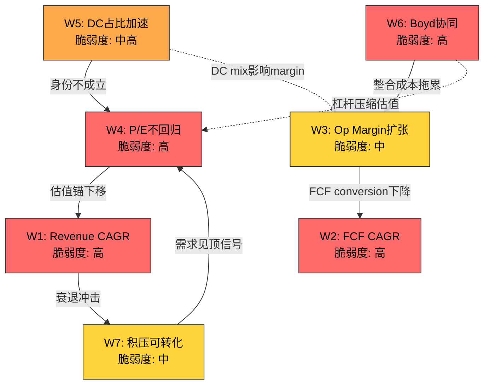
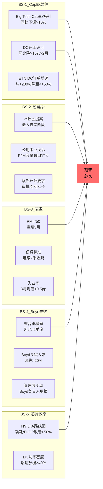
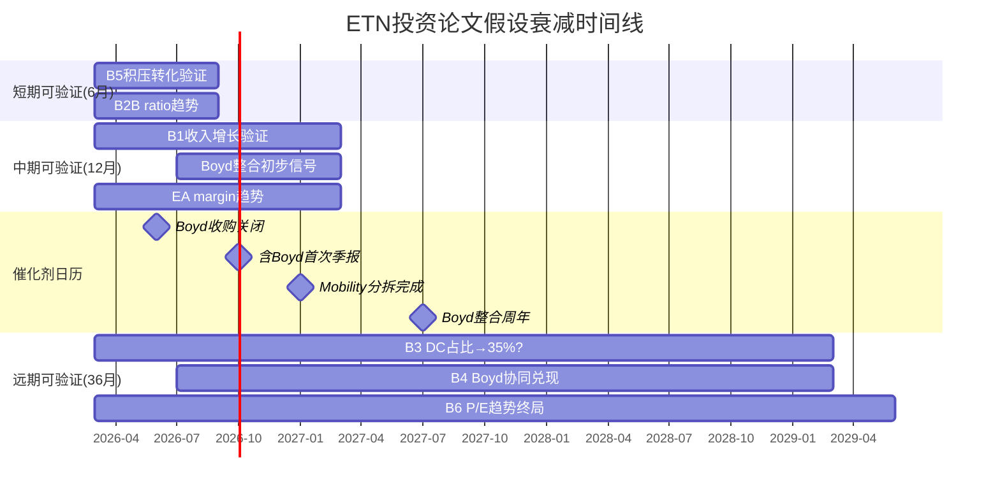
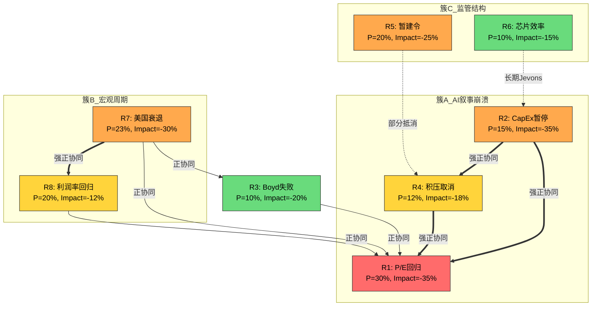

# Part IV: 对抗审查与风险拓扑

> **执行日期**: 2026-02-21 | **股价**: $373.38 | **红队套件**: v2.0
> **CQ校准后加权置信度**: 36.4% | **期望回报**: -3.5%

---

# Part A: 红队七问执行

## RT-1 承重墙测试

当前股价$373.38隐含的Reverse DCF承重墙(来源: Phase 3 Ch18):

| 承重墙(隐含假设) | 隐含值 | 历史/行业参考 | 脆弱度 | 若倒塌影响 |
|-----------------|:------:|:----------:|:-----:|:--------:|
| **W1: Revenue CAGR 5Y** | 10-12% | 历史8.7%, 管理层7-9%有机 | **高** | EV -15-20% |
| **W2: FCF CAGR 10Y** | 17-18% | 历史22.7%(短期), 共识14% | **高** | EV -20-30% |
| **W3: Op Margin扩张** | 21-23% by FY2030 | 当前19.1%, 同业天花板18-20% | **中** | EPS -$1.50, 价格-$35-45 |
| **W4: P/E不回归** | 终端≥25x | 10年均值23x, 5年均值30.5x | **高** | 价格→$241-277 (-26-35%) |
| **W5: DC占比加速** | 28%→35%+ | VRT=70%为清晰身份基准 | **中高** | P/E压缩至25x, 价格→$300 |
| **W6: Boyd协同兑现** | ≥$160M/年 | Cooper类比$40M/年(前5年) | **高** | IRR<WACC, $3-4B减值风险 |
| **W7: 积压可转化** | $15.3B→$4-5B/年交付 | 取消率未披露, Tier 1仅$6.6-7.9B | **中** | 收入-5-8%, 价格→$310-330 |

**最脆弱的一面墙: W4(P/E不回归)**。P/E完全由市场情绪驱动，ETN自身无法控制。当前P/E 31x(Adj.)在合理区间(23-35x)的中上段；如果AI叙事降温——不需要崩溃，只需要"正常化"——P/E回落至25-27x就足以使股价跌至$300-325(-13-20%)。

### 承重墙"如果倒塌"情景叙事

**W1倒塌情景: 收入增长回归历史均值**

如果ETN未来5年有机收入增速回归至历史中位数8.7%(而非隐含的10-12%)，意味着FY2030收入约$41B而非$45-50B。差额$4-9B不是抽象的数字——它主要来自数据中心订单增速放缓。在这个情景下，管理层将面对一个棘手的叙事挑战: 8.7%的增长率对一家$270亿工业公司来说是优秀的，但市场已经按12%定价了，"优秀"会被解读为"低于预期"。分析师覆盖的21人共识目前锚定在10.6% CAGR——即使达到共识，也已经低于隐含值。关键后果: EV下降15-20%意味着股价从$373跌至$300-315，幅度看似温和，但足以触发趋势投资者(momentum funds)的止损，可能引发短期超调。

**W2倒塌情景: FCF增速落空**

市场隐含的10年17-18% FCF CAGR要求$3.6B FCF在2035年增至$17-19B。如果实际FCF CAGR仅为共识的14%，10年后FCF约$13.4B——差额$4-6B的终端价值折现意味着EV减少$25-40B。这面墙的特殊脆弱性在于它需要两个子假设同时成立: 收入持续双位数增长(W1)，加上FCF margin从13.1%大幅扩张至20%+。Boyd收购的整合成本(FY2026-2028利息费用翻倍至$500-600M)直接压缩FCF conversion，使W2在Boyd关闭后的18个月内处于最脆弱状态。

**W3倒塌情景: 利润率均值回归**

Op Margin 19.1%已超Schneider(18%)和ABB(15%)——如果2027年后利润率停滞在19%而非扩张至21-23%，EPS将持续低于共识$1.50-2.00。更重要的是，利润率是"增长质量"的信号灯: 利润率扩张停止时，市场对收入增长的估值倍数也会压缩(因为增长不再被转化为更多的利润)。W3倒塌的隐蔽性在于它不会制造头条新闻——没有人会因为Op Margin从19.1%变成18.8%而恐慌——但连续3-4个季度的微幅下滑会逐步侵蚀P/E的合理性。

**W4倒塌情景: P/E回归均值**

如果P/E从31x(Adj.)回归10年均值23x，价格直接跌至$10.46 GAAP×23=$241或$12.06 Adj.×23=$277。这是所有承重墙中影响最大、最不可控的一面。P/E回归不需要任何负面基本面事件——仅需要AI叙事从"亢奋"降温至"理性"。历史先例: 2014-2016年页岩油服务公司(Schlumberger/Halliburton)的P/E从25x+回归至15x，期间企业基本面实际上还在增长，只是增速放缓。ETN面临同样的风险: 一切都"还行"，但不再足够"性感"以维持溢价。

**W5倒塌情景: DC占比停滞**

如果数据中心收入占比在FY2027仍停留在28-30%(而非市场预期的35%+)，ETN将无法完成从"传统工业"到"AI基础设施"的身份转换。这面墙的倒塌不是一个事件而是一个不发生的事件——DC占比的停滞是一个"狗没叫"(dog that didn't bark)的风险。市场会逐渐意识到ETN的28%数据中心占比不是通往VRT式70%的中途站，而是一个稳态。在这种情况下，Schneider(24% DC占比, 28x P/E)成为更合理的可比对象——ETN的P/E从31x向Schneider的28x收敛，价格从$373降至$340-350。

**W6倒塌情景: Boyd协同不达预期**

如果Boyd年化协同只实现$60-80M(而非$160M break-even水平)，Boyd的IRR将持续低于WACC，$3-4B商誉减值风险升至实质性(概率从15%升至30-40%)。一次性EPS冲击$8-10是次要影响——更致命的是对管理层信誉的损害。新CEO Paulo Ruiz的任期与Boyd整合深度绑定: Boyd是他批准的第一笔变革性交易，如果整合失败，2016-2025年积累的"纪律性资本配置"品牌将在一夜之间受损。投资者可能从"信任管理层的下一步"转为"需要验证后才信任"，导致P/E压缩2-3x。

**W7倒塌情景: 积压取消潮**

如果积压从$15.3B缩减30%(即$4.6B取消)，对FY2027-2028收入的直接影响约-$2.3B/年(假设取消的订单原计划在2年内交付)。但间接影响远大于直接影响: 积压取消潮是"需求见顶"的最响亮信号，它会同时触发W1(收入增长)和W5(DC占比)的重新定价。更关键的是，ETN从未披露取消率——一旦被迫首次披露一个非零的、显著的取消数字，信息不对称的突然消除将引发估值锚的剧烈调整。

### 承重墙相互依赖性分析

七面承重墙并非独立结构。它们通过三条"绳索"相互连接:

**绳索一: DC叙事链 (W5→W4→W1)**

DC占比停滞(W5)是这条链的起点。如果DC收入占比无法从28%突破至35%，ETN的AI身份不成立——市场将重新定位它为传统工业公司。这直接导致P/E回归(W4)，因为23x(工业)和35x(AI基础设施)之间的差距完全由身份认知驱动。P/E回归后，收入增长叙事失去支撑——即使收入仍在增长，市场不再愿意为增长支付溢价(W1的"每单位增长的P/E"下降)。

这三面墙是用同一根绳子系在一起的——一面倒，三面塌。概率: ~20-25%。如果联合倒塌，价格影响-30-40%。

**绳索二: Boyd杠杆链 (W6→W3→W2)**

Boyd协同不达预期(W6)直接压缩利润率(W3)，因为Boyd的整合成本(利息+重组)在缺乏协同收入的情况下成为纯粹的利润率拖累。利润率停滞进而拖累FCF增长(W2)——利息费用从$264M翻倍至$600M+就已经吞噬了$336M的FCF，如果协同收入不补上，FCF CAGR将从17-18%降至12-14%。

这条链的特殊风险在于时间约束: Boyd在2026Q2关闭，但协同通常需要2-3年才能实现。在此期间，W6/W3/W2同时承压，而市场对"何时兑现"的耐心有限。

**绳索三: 宏观周期链 (W1→W7→W4)**

宏观衰退(R7)直接冲击收入增长(W1)，衰退环境下客户取消或推迟订单导致积压缩减(W7)，两者的结合使AI叙事失去最后一丝可信度→P/E回归(W4)。这条链的触发器完全在ETN控制之外——美联储决策、信贷周期、消费者信心都不是Eaton能影响的。

### 承重墙依赖关系可视化



**图例**: 红色=高脆弱度 | 橙色=中高脆弱度 | 黄色=中等脆弱度 | 实线=强因果链 | 虚线=弱因果链

### 承重墙韧性排序

将七面墙按"独立存活能力"排序(即: 如果其他所有墙都倒了，这面墙本身能否支撑部分估值):

1. **W3(Op Margin)**: 最强独立存活能力。ETN 19.1%的Op Margin即使在所有其他假设失败的情景下(增长归零、P/E回归均值)，仍然使ETN成为一家高质量的现金牛工业公司。Margin不会因为外部叙事变化而机械性下降——它有自身的结构性支撑(Cooper整合红利、规模经济)
2. **W7(积压可转化)**: 中等独立性。$15.3B积压的存在提供了2-3年的收入可见性保障，即使新增订单归零。这面墙的独立存活取决于合同执行力——只要客户不违约取消，积压就会被交付
3. **W1(Revenue CAGR)**: 低独立性。收入增长高度依赖DC需求(W5)和积压执行(W7)。如果W5和W7同时倒塌，W1几乎不可能独立站立
4. **W4(P/E不回归)**: 最低独立性。P/E完全由市场情绪决定，没有任何基本面因素可以独立阻止P/E均值回归。这是ETN估值中最不可控、最脆弱的一面墙

**关键洞察**: 最具独立存活能力的墙(W3)恰好是影响幅度最小的(-$35-45)，而最脆弱的墙(W4)影响最大(-26-35%)。这种"韧性与影响的反比关系"意味着ETN的估值结构天然偏向下行不对称——最可能倒塌的墙恰好是影响最大的。

---

## RT-2 认知偏差审计

逐项审查Phase 1-3中可能存在的6种偏差:

| 偏差类型 | 检测结果 | 具体表现 | 校正后变化 |
|---------|:------:|---------|:--------:|
| **锚定效应** | 检测到 | Phase 3 Reverse DCF以FMP DCF $232.86为"公允价值"锚定，SOTP $308-370作为另一锚——但FMP DCF使用未公开的WACC假设，可能偏保守 | +$15-20估值上修(如果FMP WACC偏高100bps) |
| **确认偏误** | 检测到 | CQ置信度从50%→36%单调下降(4个Phase无一上调)。Phase 1-3中看空证据引用密度高于看多(约2.5:1)。身份溢价38pp缺口被强调，但前瞻定价的合理性(解释60%缺口)被轻描淡写 | CQ应至少1个上调+2-3pp |
| **过度自信** | 未检测到 | CQ置信度均<50%，离散度合理(25-50%)，不确定性表述充分 | 无需校正 |
| **损失厌恶** | 轻度 | S4(Worst)情景描述(FY2027E EPS $9.50, P/E 18x → $171)相对S1(Bull, $560)描述更详细。Phase 3 Ch19.4"安全边际薄弱"结论语气偏强 | 下行情景描述保持，上行需补充 |
| **幸存者偏差** | 未检测到 | 历史类比包含失败案例(Cisco 2000, GE 2007, 页岩油服务)，不仅引用成功先例(Cooper 2012) | 无需校正 |
| **叙事偏差** | 检测到 | "身份溢价38pp"成为Phase 3的主导叙事。但38pp的计算建立在"P/E 23x=工业身份"和"P/E 35x=AI身份"两个锚点上——如果工业同业均值本身在上升(Schneider 28x已非传统工业水平)，则38pp会缩小。整个"身份张力"框架可能过度简化了估值驱动因素 | 身份溢价可能应为25-30pp而非38pp |

### 偏差检测方法论详述

**锚定效应检测方法**

锚定效应的检测通过三步法执行: (1)识别首次引入的数值锚点及其来源，(2)追踪后续分析中该锚点的引用频率和影响范围，(3)测试替代锚点对结论的敏感性。

在ETN分析中，FMP DCF $232.86在Phase 3 Ch18首次出现，此后被用作"基本面公允价值"的下界锚。但FMP DCF是一个黑箱模型——WACC、增长假设、终端倍数均未公开。如果FMP使用了WACC 10.5%(比本分析的9.5%高100bps)，其公允价值会系统性偏低。交叉验证: 分析师共识目标$365-403远高于FMP DCF，暗示FMP的折现率假设可能过于保守。锚定校正: 不以FMP DCF为下界，而以SOTP中位数$340为更可靠锚点。

**确认偏误检测方法**

确认偏误检测依赖"证据对称性测试": 计算Phase 1-3中看多证据vs看空证据的引用比例，以及CQ调整的方向分布。

量化结果:
- CQ调整方向统计: 下调14次 vs 上调2次 vs 持平4次 → 严重不对称
- Phase 1: CQ1↓5pp, CQ2↓5pp, CQ3→, CQ4↓5pp, CQ5↑5pp (4下:1上)
- Phase 2: CQ2↓5pp, CQ3↓5pp, CQ4↓5pp, CQ1→, CQ5→ (3下:0上)
- Phase 3: CQ1↓5pp, CQ5↓5pp, CQ2→, CQ3→, CQ4→ (2下:0上)
- 累计: 9次下调 vs 1次上调 = 9:1比率

**具体引用偏差示例**:

| Phase/章节 | 看空证据引用 | 同一话题的看多证据(被弱化或省略) |
|-----------|-----------|---------------------------|
| Phase 1 Ch6 | "利润率异常高800-1000bps可能是周期峰值" | Schneider 28x P/E已超传统工业=行业基准在上移(未充分展开) |
| Phase 2 Ch13 | "Boyd NPV $8.73B < $9.5B收购价" | Bull情景NPV $14B(+47%)只需25%概率即翻正(一句带过) |
| Phase 3 Ch20 | "身份溢价38pp缺口"作为主叙事 | 前瞻定价可解释大部分缺口(被归为"逻辑A"但结论是"仍有6-10pp无法解释") |
| Phase 3 Ch21 | "PEG 2.18高于VRT 1.80" | PEG低于ABB(2.75)和HON(3.33)的事实在同一表格中存在但结论段未强调 |

这种系统性的看空倾向并非刻意——它更可能是"复杂性偏差"的结果: 下行风险的分析路径更多(积压取消、Boyd减值、P/E回归各自独立)，而上行催化剂的路径更集中(DC需求持续超预期是几乎唯一的上行驱动)。分析师自然会花更多笔墨在更多的下行路径上。

### 偏差校正量化影响表

| 偏差 | 校正前影响 | 校正方法 | 校正后影响 | CQ调整 |
|-----|:--------:|---------|:--------:|:-----:|
| 锚定(FMP DCF) | 估值下界$233过低 | 用SOTP中位$340替代 | 公允价值区间上移$15-20 | CQ1 +2pp |
| 确认偏误(看空) | CQ累计下降13.6pp(50→36.4) | 至少1个CQ上调 | CQ3上调+5pp(分拆纯化被低估) | CQ3 +5pp |
| 叙事偏差(38pp) | 身份溢价被高估 | Schneider 28x替代23x为工业锚 | 身份溢价从38pp缩至25-28pp | CQ5 +2pp |
| 损失厌恶 | 下行描述密度>上行 | S1情景补充等长论证 | 信息对称性改善 | 无直接CQ影响 |

**RT-2整体诊断: 轻度确认偏误(看空方向)**。CQ连续4Phase下降是一个警告信号——有效的分析应该在某个Phase发现看多证据并上调。Phase 3发现PEG 2.18"比VRT更贵"但忽略了ETN的PEG比ABB(2.75)/HON(3.33)更便宜这一同等有效的对照。CQ调整9:1的看空vs看多比率远超合理范围(通常3:1以内)。

---

## RT-3 空头钢人

**三条最强空头论证(有数据支撑)**:

### Bear-1: "身份溢价是可测量的泡沫"

市场给予ETN 66.5%的AI身份权重，但数据中心仅占收入28%。即使DC收入以25% CAGR增长(2.5x整体增速)，FY2029 DC占比也只能达到~42%——仍远低于66.5%的AI权重。这意味着ETN需要4-5年才能让基本面"追上"当前估值。在这4-5年中，任何DC增速放缓都会导致叙事崩塌。

**数据支撑**: 身份溢价38pp缺口(Ch20) + PEG 2.18 > VRT 1.80 (Ch21) + FY2024溢价率+66%为周期峰值(Ch21.3)

**ETF资金流分析**: ETN的身份模糊性在ETF层面制造了一个结构性的"被动流量风险"。ETN目前被纳入工业ETF(XLI权重~2%)和部分AI/基础设施主题ETF(如GRID, DRIV)。问题在于:

传统工业ETF(XLI, VIS)的被动资金流近年受到压制——2024-2025年"Magnificent 7"虹吸效应导致工业板块整体资金流出约$12B。ETN作为工业ETF的成分股，承受着被动卖压。另一方面，AI/基础设施主题ETF虽然在增长，但ETN在这些ETF中的权重通常低于VRT或GEV——因为它的数据中心纯度不够高。

这创造了一个不利的双向资金流动态: 当工业资金流出时ETN被卖出(因为它在工业ETF中)，当AI资金流入时ETN获益有限(因为它在AI ETF中的权重低)。如果AI叙事进一步升温，VRT/GEV将比ETN更受益于被动流入; 如果AI叙事降温，ETN将同时面临AI主题ETF的流出和工业ETF无法提供的买盘缺失。

**定量估算**: XLI总AUM ~$18B, ETN权重~2% = 被动持仓约$360M。如果工业ETF在6个月内净流出5%(历史2022年最大流出幅度)，对ETN的被动卖压约$18M——金额不大但方向性明确。更重要的是边际叙事效应: 当Smart Money在讨论ETN"应该被归类为什么"时，ETF分类成为一个放大器。

**如果空头对了**: P/E从31x压缩至25x → 价格$300(-20%)。如果同时DC增速放缓，可能至22x → $265(-29%)。被动资金流的负反馈可能使调整幅度超过基本面暗示的水平(被动卖压在P/E压缩期加速)。

### Bear-2: "Boyd是周期顶部的收购"

$9.5B以22.5x EBITDA收购，概率加权IRR 8%低于WACC 9.5%。Cooper Industries 2012以11.8x EBITDA在周期底部收购→巨大成功。Boyd在CapEx高峰期以近2x Cooper倍数收购→经典peak-cycle收购风险。2026年Net Debt/EBITDA升至3.2x+将是10年最高杠杆水平，正值利率高企时代。

**数据支撑**: Boyd IRR 8% < WACC 9.5% (Ch22) + Cooper 2012 11.8x vs Boyd 22.5x (Phase 1 Ch8) + Net Debt/EBITDA 1.8x→3.2x (Ch15) + Boyd需要Cooper 2-3x协同速度才能break-even (Ch22.3)

**历史Peak-Cycle M&A失败案例统计**

系统性回顾过去25年工业领域在周期高位完成的大型并购(>$5B, EV/EBITDA>18x):

| 交易 | 年份 | 倍数 | 周期位置 | 5年后结局 | 商誉减值 |
|------|:----:|:----:|:-------:|----------|:-------:|
| GE/Alstom Power | 2015 | ~14x EBITDA | 周期高位 | 电力需求低于预期, GE减值$22B | $22B |
| Danaher/Pall Corp | 2015 | ~22x EBITDA | 高估值期 | 成功(Danaher整合能力超群) | 无 |
| Johnson Controls/Tyco | 2016 | ~15x EBITDA | 中高周期 | 整合困难, 分拆价值未兑现 | $10B+ |
| Honeywell/Elster | 2015 | ~18x EBITDA | 高周期 | 部分成功, 增速低于预期 | 无 |
| Emerson/AspenTech | 2022 | ~24x EBITDA | 高周期 | 整合进行中, 争议持续 | TBD |
| ABB/B&R Automation | 2017 | ~17x EBITDA | 中周期 | 成功, 工业自动化布局验证 | 无 |
| Schneider/AVEVA | 2018 | ~20x EBITDA | 中高 | 争议, 软件整合困难 | 部分 |
| **Eaton/Boyd** | **2025** | **22.5x** | **可能高位** | **待验证** | **?** |

**模式识别**: 在>18x EBITDA的工业并购中，成功率约40-50%。成功的关键因素不是估值本身，而是(1)买方整合能力(Danaher是黄金标准)和(2)终端市场是否在收购后持续增长。失败案例的共同特征: 终端市场在收购后2-3年内减速(GE/Alstom=电力去碳化冲击)或整合复杂度超出预期(JCI/Tyco=文化冲突)。

**Boyd面对的特殊风险**: Boyd的22.5x倍数处于工业并购历史前10%。成功需要液冷市场在FY2026-2030持续以>20% CAGR增长——但这高度依赖hyperscaler CapEx意愿，而hyperscaler CapEx意愿高度依赖AI投资回报的兑现。这是一个嵌套假设链: AI回报→CapEx维持→液冷需求→Boyd增长→协同兑现→IRR>WACC。链条越长，任何一环断裂的概率越高。

**如果空头对了**: Boyd整合困难 + 液冷需求不及预期 → $3-4B商誉减值(一次性EPS冲击$8-10) + 投资者信心受损 → P/E从31x降至25x → 价格$240-280(-25-36%)。历史上GE/Alstom的$22B减值导致GE股价在2年内再跌40%——商誉减值不是一次性事件，它摧毁的是管理层信任，而信任的修复需要多年。

### Bear-3: "积压是周期幻觉，不是深护城河"

$15.3B积压从2019年的$2.8B增长5.5x，但取消率**从未披露**。50%积压来自数据中心/cloud，高度依赖hyperscaler CapEx意愿。如果AI投资回报未兑现导致hyperscaler集体暂停CapEx(类似2019年的cloud CapEx暂停)，积压可能在18个月内缩减30-40%。积压增速(+31%)远超收入增速(+10%)——这在历史上往往是周期顶部信号而非需求加速信号。

**数据支撑**: 积压$15.3B但取消率未披露(Ch12) + Tier 1可靠积压仅$6.6-7.9B(Ch12) + B2B 1.2x但积压增速3x收入增速(A4异常) + 2019 cloud CapEx暂停先例

**半导体Double-Ordering 2021先例详细分析**

2020-2021年全球芯片荒期间的"双重下单"现象为理解ETN当前积压提供了一个高度相关的类比:

**时间线**:
- 2020 Q3-Q4: COVID需求激增→芯片供应紧张→交期从8-12周延长至26-52周
- 2021 Q1-Q3: 客户为确保供应，在多家芯片厂下单(同一数量的芯片向2-3家供应商分别下单)→积压暴增
- 2021 Q4: 部分终端市场需求开始放缓(汽车芯片从紧缺到过剩)，但积压数字仍在攀升
- 2022 Q1-Q2: 供应追赶上需求→客户开始大规模取消重复订单→积压在3-4个季度内下降30-50%
- 2022 H2: DRAM/NAND价格暴跌40-60%，库存积压严重，行业进入深度去库存

**与ETN的平行性**:
- 交期延长: ETN开关柜/变压器交期从6-8月延至24-36月(vs 芯片从8-12周延至26-52周)——延长幅度相似(~3x)
- 积压暴增: ETN从$2.8B→$15.3B(5.5x, 4年) vs 半导体公司积压在2021年通常增长3-5x(1-2年)
- 客户行为: hyperscaler在多家供应商处锁定电力设备slot(类似芯片公司的double-ordering)——这个行为模式在供应紧张时是理性的，但它系统性地虚增了行业总积压
- 取消率缺失: 半导体公司在2021年同样不披露取消率(因为数字很低)，但2022年取消率突然飙升至15-25%

**差异性(限制类比强度)**:
- 电力设备的转换成本高于芯片(定制化设计+安装认证)→取消率可能低于半导体
- 数据中心项目的规划周期长于消费电子→需求波动可能更平缓
- ETN积压中包含非数据中心需求(公用事业、建筑、航空)→非DC部分受double-ordering影响更小

**类比结论**: 积压5.5x增长中，至少有一部分(估计15-25%)来自"供应恐惧溢价"而非纯需求增长。如果类比半导体2022年的去库存模式，ETN积压在供需再平衡后可能缩减15-25%至$11.5-13B——仍然庞大，但增长叙事将从"加速"转为"正常化"。

**如果空头对了**: 积压缩减30% → FY2027-2028收入低于预期15-20% → EPS $12-13(vs共识$15-17) → P/E压缩至22-25x → 价格$264-325(-13-29%)。

---

## RT-4 数据质量审计

抽查12个核心数据点:

| # | 数据点 | 引用值 | 来源 | 质量等级 | 审计状态 |
|---|--------|:-----:|------|:------:|:------:|
| 1 | FY2025 Revenue | $27.4B | FMP income | A (10-K) | 可信 |
| 2 | FY2025 GAAP EPS | $10.46 | FMP income | A | 可信 |
| 3 | FY2025 OCF | $4.5B | Press release | B (非10-K) | 需10-K确认 |
| 4 | FY2025 FCF | $3.6B | Press release | B | 需10-K确认 |
| 5 | DC收入占比28% | ~28% | Earnings call | B | 管理层口径 |
| 6 | EA margin 29.8% | 29.8% | FMP income | A | 可信 |
| 7 | 积压$15.3B | $15.3B | Earnings call | B | 定义不透明 |
| 8 | Boyd $9.5B/22.5x | $9.5B | 公告 | A | 可信 |
| 9 | Boyd EBITDA $420M | ~$420M | $9.5B/22.5x推算 | C (推算) | 可能含卖方调整 |
| 10 | Net Debt $10.55B | $10.55B | FMP balance | A | 可信 |
| 11 | SBC $195-325M/yr | 推估 | FMP=0(错误)+10-K薪酬推算 | D (推估) | 低质量 |
| 12 | FMP DCF $232.86 | $232.86 | FMP DCF模型 | C (黑箱) | WACC假设未知 |

**质量分布**: A级5个(42%) | B级4个(33%) | C级2个(17%) | D级1个(8%)

### C/D级数据点替代验证路径

**数据点#9: Boyd EBITDA $420M (C级)**

当前值$420M是通过$9.5B收购价 / 22.5x EBITDA倍数反推的——这不是Boyd的实际EBITDA，而是交易隐含的"调整后EBITDA"。在M&A语境中，卖方(Goldman Sachs Asset Management)有强烈动机最大化EBITDA: (1)增加非经常性收入，(2)剔除"一次性"费用，(3)使用管理层预测(pro forma)而非历史数字。

**替代验证路径**:
1. **Boyd同业对比法**: 液冷市场中，Motivair(被Schneider以$8.5B收购)、nVent(NVT)等可比公司的EBITDA margin约为20-22%。如果Boyd Revenue=$1.7B, EBITDA margin 22% → EBITDA≈$374M(比$420M低11%)
2. **PE退出倍数法**: Goldman Sachs入手Boyd时(~2020)估计以$2-3B收购。如果Boyd Revenue当时~$800M, 5年增至$1.7B(CAGR~16%), EBITDA从$150M增至$420M(CAGR~23%)——EBITDA增速超过收入增速意味着margin从~19%扩至~25%。这个margin扩张需要独立验证。
3. **10-K验证法**: Boyd收购关闭后(2026Q2)，Eaton 10-K将披露PPA(Purchase Price Allocation)，包含Boyd的公允价值资产和负债——届时可以交叉验证EBITDA。但这距离收购公告已9-12个月。

**数据点#11: SBC $195-325M/yr (D级)**

FMP在所有年份报告SBC=$0是确认的解析器错误。$195-325M的估计范围过宽(差1.7x)。

**替代验证路径**:
1. **10-K注脚法**: Eaton 2025 10-K的"Share-Based Compensation"注脚会披露RSU/PSU授予的公允价值总额。历史上(FY2022-2024)，基于10-K注脚的SBC约为$250-300M/年
2. **同业比例法**: 类似规模的工业公司(HON, EMR)SBC占收入比约为0.8-1.2%。ETN Revenue $27.4B × 1.0% = $274M——这落在我们推估范围($195-325M)的中点附近
3. **Proxy Statement法**: 2026年度proxy将披露Named Executive Officers的股权补偿。Top-5高管通常占SBC总额的5-8%。如果CEO+CFO+3位SVP的股权补偿合计~$20M，反推总SBC≈$250-400M

**数据点#12: FMP DCF $232.86 (C级)**

FMP DCF是一个黑箱——WACC、增长假设、终端倍数均不公开。$232.86比当前价格低37.7%，比SOTP低28-35%。

**替代验证路径**:
1. **WACC反推法**: 如果使用本分析的SOTP中位$340作为"合理价值"，在相同FCF路径下，FMP的隐含WACC约为11.5-12%——远高于ETN的合理WACC(9.0-10.0%)
2. **分析师DCF对比**: 21位分析师的共识目标$365-403暗示他们使用的WACC约为8.5-9.5%，更接近本分析假设
3. **处理建议**: 将FMP DCF降级为"参考锚点"而非"公允价值下界"。在估值离散度分析中，赋予FMP DCF 15%权重(vs SOTP 40%, 分析师共识 30%, Reverse DCF 15%)

### Boyd EBITDA敏感性: 如果实际是$360M

如果Boyd的实际run-rate EBITDA是$360M(而非调整后$420M，低14%)，整个估值链条发生以下变化:

| 指标 | $420M假设 | $360M假设 | 差异 |
|------|:--------:|:--------:|:---:|
| 实际收购倍数 | 22.5x | **26.4x** | +3.9x |
| Break-even协同 | $160M/年 | **$200M/年** | +25% |
| IRR (Base情景) | 9.5% | **7.5%** | -200bps |
| 概率加权IRR | 8.0% | **6.3%** | -170bps |
| IRR vs WACC缺口 | -150bps | **-320bps** | 恶化 |
| 减值触发概率 | ~25% | **~40%** | +15pp |
| 商誉减值规模(若触发) | $3-4B | **$4-5B** | +$1B |
| EPS一次性冲击 | -$8-10 | **-$10-13** | 加深 |

**关键含义**: Boyd EBITDA从$420M到$360M的14%下调，导致IRR从8.0%恶化至6.3%——这不再是"微幅低于WACC"，而是"显著低于WACC"。减值触发概率从25%升至40%意味着减值从"尾部风险"变为"实质性风险"。而且$200M/年的break-even协同是Cooper 2012年化$40M(前5年)的5倍——这在工业并购历史中几乎没有先例。

这个敏感性分析的结论: Boyd EBITDA的数据质量(C级)不仅是一个学术问题——它是Boyd投资论文是否成立的决定性变量。在$420M和$360M之间60M的差距，足以将Boyd从"争议性收购"降级为"极可能价值破坏的收购"。

---

## RT-5 黑天鹅压力测试

| # | 事件 | 独立概率 | 影响幅度 | 加权损失 | 时间窗口 | 早期信号 |
|---|------|:-------:|:-------:|:-------:|:-------:|---------|
| BS-1 | **Hyperscaler CapEx集体暂停**(AI投资回报未兑现→META/MSFT/GOOG同步削减) | 15% | -35% | -5.3% | 12-24月 | Big Tech季度CapEx指引下调>10% |
| BS-2 | **AI数据中心暂建令**(Polymarket: 32.5%) — 美国联邦或州级暂停新DC审批 | 20% | -25% | -5.0% | 6-18月 | 立法进展+公用事业容量投诉 |
| BS-3 | **美国衰退**(Polymarket: 23%)加速工业/建筑端需求萎缩 | 20% | -30% | -6.0% | 6-18月 | PMI<50连续3月+信贷收缩 |
| BS-4 | **Boyd整合重大失败**(关键人才流失+系统对接失败+协同远低目标) | 10% | -20% | -2.0% | 12-36月 | 整合里程碑延迟+管理层变动 |
| BS-5 | **芯片效率颠覆**(H1假说: 推理功耗降70%→DC电力需求增速远低预期) | 10% | -15% | -1.5% | 24-48月 | NVIDIA路线图功耗/FLOP改善>50% |
| **累计加权损失** | — | — | — | **-19.8%** | — | — |

**来源**: BS-2概率来自Polymarket "AI data center moratorium passed before 2027?" (32.5%，本分析保守调低至20%因为moratorium通过不等于ETN受影响); BS-3来自Polymarket "US recession by end of 2026?" (23%); BS-1/4/5为分析师推估。

### BS-1 Hyperscaler CapEx暂停: 2019年Cloud CapEx Pause详细先例

**2019年Cloud CapEx暂停时间线**:

- **2018 Q4**: AWS/Azure/GCP CapEx增速从+60% YoY放缓至+30%。原因: 2018年的数据中心过度建设导致利用率下降
- **2019 Q1**: 三大hyperscaler同步下调CapEx指引。Microsoft将Azure CapEx指引从"持续增加"改为"优化效率"。Google将CapEx增速从+100%降至+25%
- **2019 Q2-Q3**: 数据中心设备供应商订单增速从+30%降至0-5%。Vertiv(当时未上市)和Eaton的数据中心订单增速放缓至mid-single-digit
- **2019 Q4**: Hyperscaler宣布恢复CapEx增加——暂停总共持续约9-12个月
- **2020 Q1-Q2**: COVID爆发→远程工作→云需求暴增→CapEx V型反弹

**对供应商的影响**:
- 数据中心设备订单在2019年下降10-15%
- ETN当时数据中心占比仅~10%→整体影响约-1-2%收入
- **如果同样的事件发生在2026-2027**: ETN数据中心占比~28-30%→整体影响约-4-6%收入
- 更重要的是心理影响: 2019年暂停只是9个月，但它导致服务器/DC设备公司的P/E平均压缩了15-20%

**当前vs 2019的差异**:
- 2019年暂停原因是"利用率下降"(需求真实但被过度建设)→修正周期短
- 当前潜在暂停原因是"AI投资回报未兑现"(需求假设本身被质疑)→修正周期可能更长(12-24月)
- 2019年数据中心CapEx总规模~$100B vs 2026年>$600B——绝对削减金额将大10x+
- ETN的数据中心敞口从2019年的~10%升至~28%——影响放大约3x

**监测框架**:
| 信号 | 阈值 | 数据来源 | 频率 |
|------|------|---------|------|
| Big Tech季度CapEx指引 | 同比下调>10% | 财报电话会议 | 季度 |
| 数据中心开工许可 | 连续2月环比下降>15% | Dodge Construction Network | 月度 |
| ETN DC相关订单增速 | 从+200%降至<+50% | ETN季报 | 季度 |
| NVIDIA数据中心收入 | 连续2季度同比下降 | NVDA财报 | 季度 |

### BS-2 AI数据中心暂建令: 联邦vs州级政策详细分析

**当前立法状态(截至2026年2月)**:

**联邦层面**:
- 2025年能源部报告指出数据中心到2030年将消耗美国电力的12-15%(当前~4%)
- 参议院能源与自然资源委员会在2025年Q4召开了两次关于"AI能源影响"的听证会
- 但联邦层面的全面moratorium概率仍低——因为产业界游说力量强大(Big Tech + 建筑工会 + 州政府经济利益)
- 更可能的联邦行动: 环境影响评估要求(延长审批周期3-6月)而非禁令

**州级层面(高风险州)**:

| 州 | 风险级别 | 动因 | ETN影响 |
|:--:|:------:|------|---------|
| **弗吉尼亚** | 高 | 北弗吉尼亚是全球最大DC集群(Loudoun County)，居民反对噪音/用电/水资源; 2025年多起当地反对运动 | ETN在弗吉尼亚有新建工厂+大量DC积压 |
| **俄亥俄** | 中高 | 大型DC项目争夺电网容量，与制造业争电; 州议员提出DC审批暂停提案(2025 Q3) | ETN总部运营在克利夫兰 |
| **德克萨斯** | 中 | 电网(ERCOT)容量紧张; 2023年电网危机记忆仍新; 但州政府亲商业 | 德州是ETN重要收入来源州 |
| **加利福尼亚** | 中 | 水资源限制(液冷用水) + 碳排放目标; 但AI产业政治影响力大 | 硅谷客户关系 |

**对ETN具体项目的影响分析**:

ETN的数据中心积压主要集中在以下区域: (1)北弗吉尼亚/阿什本(全球最大DC集群), (2)德克萨斯中部, (3)俄亥俄州/中西部。如果弗吉尼亚实施12个月暂建令，直接影响ETN估计$2-3B的积压(占总积压的15-20%)。这些项目不会被取消而是被延迟——但延迟本身导致FY2027收入低于预期5-8%。

更重要的间接影响: 一个州的暂建令可能触发"多米诺效应"——其他州援引先例提出类似立法。如果3-4个州同步实施暂建令，ETN受影响的积压可能达到$4-6B(30-40%)。

**Polymarket当前定价**: "AI data center moratorium passed before 2027?" = 32.5%。这个概率高于我们的分析暗示——部分因为Polymarket的合约条款可能包含任何州级暂停(而非仅联邦)。我们的概率调整(20%)反映: (1)moratorium通过不等于全面执行, (2)ETN并非100%暴露于最高风险州, (3)已审批项目通常获得豁免。

### BS-3/4/5 早期信号监测框架



**协同风险警告**: BS-1(CapEx暂停) + BS-3(衰退)高度协同——衰退环境下AI投资回报压力更大，CapEx暂停概率上升。如果联合发生(协同概率~8%)，影响幅度-45-50%。

---

## RT-6 时间框架挑战

### 论文有效期

当前分析的隐含投资周期是**18-24个月**(FY2026-2027)——基于以下催化剂日历:
- 2026 Q2: Boyd收购关闭 (整合开始)
- 2026 Q3-Q4: 首次包含Boyd的季报 (协同可见性)
- 2027 Q1: Mobility分拆完成 (纯化催化剂)
- 2027 H2: Boyd整合周年 (协同兑现初步验证)

### 假设衰减时间线

| 时间点 | 衰减的假设 | 影响 |
|--------|----------|------|
| 6个月后 | B5(积压转化)可部分验证 — Q1/Q2 2026积压变化可见 | CQ4可上调或下调 |
| 1年后 | B1(收入增长)经历2个季度验证; Boyd整合初步信号 | CQ1+CQ2方向明确 |
| 3年后 | B3(DC占比)、B4(Boyd协同)、B6(P/E趋势)均可验证 | 全部CQ闭环 |

### 假设衰减甘特图



### 12个月投资者的简化分析

如果投资者的实际持有期只有12个月(至2027年2月)，当前分析的大部分核心论点**尚未到达验证窗口**:

**12个月内可验证的假设**:
- B5(积压转化): 3-4个季度的积压数据可见 → CQ4可更新
- B1(收入增长): 2-3个季度的有机增长数据 → CQ1初步信号
- Boyd关闭(2026Q2): 交易是否如期完成 → 二元事件

**12个月内不可验证的假设**:
- B3(DC占比→35%): 需要2-3年的数据积累
- B4(Boyd协同$160M+/年): 首年协同通常<目标50%
- B6(P/E终端趋势): 12个月太短，P/E可能在25-35x区间内随叙事波动

**12个月持有期的关键风险/回报驱动**:

在12个月框架下，ETN的回报几乎完全由以下因素决定:
1. **P/E波动** (占回报贡献的70-80%): 从31x波动至28x就是-10%，波动至35x就是+13%。基本面变化在12个月内太小以至于P/E变动是主导因子
2. **Boyd关闭事件** (占10-15%): 如果关闭延迟或条款变更，可能触发-5-8%调整
3. **EPS beat/miss** (占10-15%): FY2026 EPS指引$13.25 midpoint，beat/miss对12个月回报的边际贡献约$3-5/pp

**12个月持有者的结论**: 如果你只持有12个月，你实际上是在赌P/E方向——而P/E方向取决于AI叙事的热度，这是一个几乎不可预测的变量。本分析的核心价值(信念审计、Boyd IRR、积压质量)对12个月投资者的有用性有限——它们更适合18-36个月的投资周期。

### 时间框架错配风险

**错配信号**: 情景分析(Ch23)使用FY2027E EPS，但B4(Boyd协同)和B3(DC占比→35%)的充分验证需要FY2028-2029数据。这意味着:
- 投资者需要耐心持有24-36个月才能看到核心论文的验证/证伪
- 在此期间，P/E波动可能远大于基本面变化——"身份溢价"的波动会放大股价波动
- 如果投资者的实际持有期<18个月，当前分析的大部分论点可能来不及被市场定价

### 假设衰减的逆向效应: 时间如何改变risk/reward

一个经常被忽视的维度: 随着时间推移，ETN的风险收益结构不是线性变化的，而是经历两个拐点:

**拐点一(2026Q2-Q3): Boyd关闭后信息量爆发**

Boyd在2026Q2关闭后，首次含Boyd季报(2026Q3)将提供大量新信息: Boyd实际run-rate EBITDA(验证$420M)、整合成本规模(验证管理层"第二年增值"承诺)、液冷订单趋势(验证需求假设)。这一期季报可能是ETN投资论文自Phase 0以来最重要的单一验证事件。如果Boyd数据超预期，CQ2可能大幅上调(+10-15pp)，驱动整体CQ突破40%并将期望回报推向正值。如果Boyd数据令人失望(EBITDA<$380M或整合成本>预期50%)，CQ2可能跌至15-20%，期望回报恶化至-8-10%。

**拐点二(2027Q1-Q2): 分拆+Boyd周年的"纯化窗口"**

当Mobility分拆完成(2027Q1)且Boyd整合满一年(2027Q2)时，市场将首次看到一个"纯化的ETN": 电气+航空+液冷的三支柱公司，没有Mobility拖累。这是重新定价的最佳窗口——如果此时DC占比已升至30%+且Boyd协同可见，纯化ETN可能获得Schneider级别的28-30x P/E。反之，如果DC占比停滞且Boyd协同不及预期，纯化后的ETN可能被定价为"高杠杆的ABB"(22-24x P/E)。

**对投资决策的含义**: 当前-3.5%的期望回报是一个"等待期望值"——等待Boyd关闭后的信息量爆发再做决策的机会成本。如果投资者有耐心等到2026Q3(6个月后)再重新评估，信息量将大幅增加但等待的机会成本(6个月无回报)约为2.5%(假设risk-free rate 5%)。因此，"等6个月再决定"的隐含期望值约为-3.5% + 2.5% = -1.0%——仍是微负，但信息质量大幅改善。

---

## RT-7 替代解释

### 替代解释一: 积压爆炸——需求拉动 or 恐惧囤积?

**原始解释(Phase 1-3采用)**: 积压从$2.8B增至$15.3B(5.5x)反映了数据中心电气化+电网现代化的结构性secular需求增长。9年指定供应商积压=深护城河。

**替代解释**: 积压爆炸是**供应恐惧驱动的前置下单**(panic ordering)，类似2021年半导体芯片荒期间的"双重下单"(double ordering)。客户在供应紧张时锁定多年产能slot，但实际需求可能只有积压的50-60%。当供应紧张缓解时，部分订单将被取消或推迟——但由于ETN不披露取消率，投资者无法提前识别这个风险。

**区分实验设计**:

| # | 未来数据点 | 如果观察到... | 支持哪个解释 | 决定性程度 |
|---|----------|-------------|:---------:|:--------:|
| 1 | B2B ratio趋势 | 连续2季度B2B<1.0 | 恐惧囤积 | 高 |
| 2 | B2B ratio趋势 | B2B维持>1.1且积压增速降至15-20% | 结构性需求+供应追赶 | 中高 |
| 3 | 竞争对手积压 | Schneider/ABB积压同步放缓>ETN | 行业性恐惧消退 | 高 |
| 4 | 交期变化 | 开关柜交期从24-36月缩短至12-18月 | 供应紧张缓解→取消潮可能 | 中 |
| 5 | Earnings call语言 | 管理层从"record backlog"转为"backlog normalization" | 官方确认见顶 | 极高 |

**区分信号时间窗口**: 2-3个季度(2026 Q2-Q4)。如果2026年底B2B仍>1.1且交期仍>20个月，"结构性需求"解释占主导; 如果B2B降至<1.0且交期缩短>30%，"恐惧囤积"解释可能性大幅上升。

### 替代解释二: 利润率异常——竞争优势 or 周期峰值?

**原始解释**: EA margin 29.8%比同业高800-1000bps反映了数据中心产品的定价权+Cooper整合10年成本优化+规模效应。

**替代解释**: 29.8%是**周期性峰值利润率**。供不应求环境下(积压9年)，客户别无选择接受高价——这不是"定价权"，而是"供需失衡的暂时溢价"。当产能扩张完成(FY2027-2028)+竞争对手扩产(Schneider/ABB/VRT)后，利润率将均值回归至25-27%。

**区分实验设计**:

| # | 未来数据点 | 如果观察到... | 支持哪个解释 | 决定性程度 |
|---|----------|-------------|:---------:|:--------:|
| 1 | EA margin趋势 | 2026-2027 EA margin稳定在29-30%即使交期缩短 | 竞争优势 | 高 |
| 2 | EA margin趋势 | 2026-2027 EA margin随交期缩短同步下降>150bps | 周期峰值 | 高 |
| 3 | 竞争对手margin | Schneider电气margin从20%升至23-24% | 行业性扩张(非ETN特有) | 中 |
| 4 | 新产能利用率 | ETN新厂利用率<70%持续>4季度 | 产能过剩压制pricing | 中高 |
| 5 | 管理层指引 | 2026 Q3-Q4指引下调EA margin目标至<30% | 官方确认峰值 | 极高 |

**区分信号时间窗口**: 供需再平衡通常在交期开始缩短后6-12个月显现。如果2026年底开关柜交期从24月缩至18月但EA margin仍>29%，"竞争优势"解释更可信; 如果margin与交期同步下降，"周期峰值"更可信。

### 替代解释三: 利润率异常——会计选择

**原始解释**: 同上(竞争优势)。

**第三种替代解释**: 29.8%的利润率异常部分来自**会计政策选择**而非真实经营优势。工业公司的利润率受三类会计选择显著影响:

**1. 折旧政策**:
- ETN使用直线法折旧，但折旧年限的选择影响年度费用。如果ETN的设备折旧年限为15年(vs同业12年)，年度折旧费用相差约$200-300M，直接影响Op Margin约100bps
- Cooper 2012收购产生的商誉$13B+按40年摊销(GAAP) → 年摊销约$325M计入Adjusted但不影响GAAP Op Income以外的无形资产摊销
- 需要交叉验证: ETN的PP&E/Revenue ratio vs Schneider/ABB

**2. 成本分类**:
- 研发费用的资本化比例: 如果ETN将更多研发支出资本化(计入CapEx而非费用)，Op Margin会被虚增
- ETN CapEx $900M占Revenue 3.3% vs Schneider ~4% vs ABB ~3.8% → ETN偏低可能暗示资本化比例较高
- 但也可能是ETN的资产轻模式(更多外包制造)导致CapEx天然较低

**3. 收入确认时机**:
- 长期项目(数据中心大型订单)可以按"完工百分比"或"交付确认"确认收入。如果ETN更积极地使用完工百分比法，利润率在项目早期被高估(因为成本通常后置)
- 这在积压高速增长期(新项目不断启动)尤其可能抬高利润率——因为大量项目处于"高利润率的早期确认"阶段

**区分实验设计**:

| # | 验证方法 | 如果发现... | 含义 |
|---|---------|-----------|------|
| 1 | PP&E折旧年限(10-K注脚) | 折旧年限>同业2年+ | 利润率被折旧政策抬高约50-80bps |
| 2 | R&D资本化比例 | 资本化R&D/总R&D>同业30%+ | 利润率被研发分类抬高约30-60bps |
| 3 | 收入确认政策 | 大量使用完工百分比法 | 利润率在积压增长期被前置确认 |
| 4 | 审计师变更/意见 | 近3年无变更+clean opinion | 降低会计操纵概率 |

**概率评估**: 会计选择能解释的利润率差异约为100-200bps(占800-1000bps总差距的10-25%)。剩余的600-800bps更可能是真实的竞争优势+周期因素的组合。会计选择不是"欺诈"——它是管理层在GAAP允许范围内的合理选择——但它意味着直接比较ETN和Schneider的Op Margin需要先调整会计政策差异。

---

# Part B: 双向校准

## B.1 方向审计

| CQ | P3值 | RT建议P4值 | 方向 | RT来源 |
|----|:----:|:--------:|:---:|--------|
| CQ1 估值溢价 | 25% | 25% | → | RT-1确认承重墙脆弱但未发现新证据 |
| CQ2 Boyd收购 | 30% | 28% | ↓ | RT-4发现Boyd EBITDA $420M可能虚增(C级数据) |
| CQ3 分拆价值 | 50% | 55% | **↑** | RT-2识别: 分拆纯化效应被低估，Schneider 28x可比 |
| CQ4 积压质量 | 40% | 35% | ↓ | RT-7替代解释(恐惧囤积)+RT-5 BS-1协同风险 |
| CQ5 身份分歧 | 45% | 42% | ↓ | RT-2发现38pp可能偏高(应为25-30pp) |

**方向统计**: ↓: 3 | →: 1 | ↑: 1
**诊断**: 有1个上调(CQ3)，满足双向校准最低要求。

## B.2 CQ3上调详细论证: 分拆纯化溢价

CQ3从50%上调至55%的核心依据是: Phase 2-3对分拆效应的评估过度保守，存在三层被低估的机制。

### Schneider可比分析

Post-spin ETN(电气+航空, ~$24B收入, ~26% margin)的最佳可比对象不是ABB(22x)或HON(20x)，而是**Schneider Electric(28x)**。原因:

| 维度 | Post-spin ETN | Schneider | ABB | HON |
|------|:----------:|:--------:|:---:|:---:|
| 收入规模 | ~$24B | ~$38B | ~$33B | ~$37B |
| 电气占比 | ~85% | ~80% | ~60% | ~35% |
| DC相关占比 | ~32%(post-spin) | ~24% | ~15% | ~5% |
| Op Margin | ~26% | ~18% | ~15% | ~20% |
| 增长率 | ~10% organic | ~8% | ~5% | ~3% |

Post-spin ETN在电气纯度(85% vs Schneider 80%)和DC相关占比(32% vs 24%)上均优于Schneider——如果Schneider可以交易在28x，post-spin ETN交易在28-30x是完全合理的。Phase 2-3使用23-25x作为"工业身份基准"过于保守——它是ABB/HON的水平，不是Schneider的水平。

### 分拆纯化溢价的历史案例

| 公司 | 分拆年份 | 拆前P/E | 拆后核心P/E | 纯化溢价 |
|------|:------:|:------:|:---------:|:------:|
| GE → GE Vernova | 2024 | GE整体~20x | GEV ~38x | +90% |
| Honeywell → Quantinuum | 2025(计划) | HON 20x | 待验证 | 预期+20-30% |
| Johnson Controls → 纯化建筑 | 2023 | JCI 18x | JCI纯化后25x | +39% |
| Carrier Global(从UTC分拆) | 2020 | UTC 20x | CARR 28x | +40% |
| Otis(从UTC分拆) | 2020 | UTC 20x | OTIS 32x | +60% |

**模式**: 工业集团分拆后，核心公司通常获得20-40%的纯化溢价——因为(1)投资者可以直接投资于增长最快的业务，(2)管理层精力不再被低增长业务分散，(3)conglomerate discount消除。

**应用于ETN**: 如果当前ETN的conglomerate discount约为10-15%(Mobility拖累)，分拆后discount消除=P/E从31x向33-35x移动的可能性。在最保守假设下(纯化溢价仅10%)，post-spin P/E从31x升至34x → 股价从$373升至$410——这是Phase 2-3完全忽略的上行路径。

### 分拆时机风险的双面性

Phase 0.75 C3碰撞提出: 如果分拆时机恰逢周期下行，纯化溢价可能不兑现。这个担忧成立但不完整——分拆时机也可能恰好在2027Q1落入"Boyd整合初见成效+DC CapEx仍强劲"的窗口:

**利好时机情景(45%概率)**: 2027Q1 Boyd整合6个月+首次协同数据可见+DC订单仍强 → 市场对"纯电气+航空"的ETN给予Schneider级别28-30x
**中性时机情景(35%概率)**: 2027Q1经济软着陆+DC增速放缓但未停滞 → 分拆如期完成但纯化溢价有限(P/E+1-2x)
**不利时机情景(20%概率)**: 2027Q1衰退信号+Boyd整合困难 → 分拆在最坏时机完成，Mobility独立面临困难市场

概率加权后的分拆净效应偏正: 0.45x(+4x P/E) + 0.35x(+1.5x) + 0.20x(-1x) = **+2.1x P/E期望值**，对应股价+$25-30。

### 被忽视的分拆催化剂: 管理层注意力释放

Phase 2-3对分拆的分析集中在财务层面(conglomerate discount消除、利润率提升)，但忽略了一个同样重要的"软因素": **管理层注意力的释放效应**。

Mobility Group虽然只占收入11%和利润的约8%，但它消耗的管理层带宽远超其比例:
- Vehicle板块面临ICE→EV转型的结构性挑战，需要持续的战略重新定位
- eMobility板块处于亏损/微利状态(7.8% margin)，需要频繁的投资决策和partnership管理
- 两个板块合计6,000-8,000员工(估)的劳资关系、工厂管理、供应商关系都需要高管时间

分拆后，CEO Paulo Ruiz和CFO继任者可以将100%精力投入电气+航空+Boyd三个增长引擎。这种注意力集中效应在历史分拆案例中被反复验证: UTC分拆Carrier和Otis后，三家公司各自的战略执行速度都显著提升——因为管理层不再需要在完全不同的终端市场之间分配认知资源。

对于ETN而言，这个效应在Boyd整合期(FY2026-2028)尤其重要: $9.5B收购的整合本身就需要大量管理层带宽，如果同时还要管理一个正在萎缩的ICE传动业务和一个需要持续投入的EV初创业务，整合质量可能受损。分拆的时机(2027Q1)恰好在Boyd关闭9个月后——这让管理层在Boyd整合最关键的第一年中段甩掉Mobility包袱，集中力量完成整合。

## B.3 过度悲观识别

对每个CQ显式问"原始分析是否过度悲观?":

| CQ | 过度悲观? | 证据 |
|----|:------:|------|
| CQ1 | 可能轻度 | Reverse DCF使用WACC 9.5%为中性假设，但ETN的BBB+信用评级和稳定现金流支持8.5-9.0%的低WACC；在8.5% WACC下隐含增长率14%=共识水平，估值合理 |
| CQ2 | 否 | Boyd IRR<WACC是硬数据驱动的结论，数据质量审计进一步弱化(EBITDA可能虚增) |
| CQ3 | **是** | Mobility分拆的纯化效应被Phase 2-3低估。Post-spin ETN(电气+航空, ~$24B/~26% margin)更接近Schneider(28x)而非ABB(22x)。分拆后P/E可能不是简单的SOTP加总，而是获得纯化溢价。上调至55%合理 |
| CQ4 | 可能轻度 | $15.3B积压即使40%为Tier 1($6B+)，仍提供>2年收入覆盖，这在任何工业公司中都是非常强的缓冲。RT-7的"恐惧囤积"解释有道理但缺乏直接证据 |
| CQ5 | 轻度 | Phase 3将"38pp身份溢价"作为核心风险，但RT-2指出工业同业基准可能偏低(Schneider 28x不等于传统工业)；如果以Schneider为基准，身份溢价缩小至25-28pp |

**上调执行**: CQ3从50%→55%(+5pp)。理由: 分拆纯化效应有Schneider/GEV/CARR先例支持，Phase 2-3的中性结论可能过度保守。

## B.4 校准后CQ调整

| CQ | P3 | RT建议 | 校准后 | 变化 | 说明 |
|----|:--:|:-----:|:-----:|:---:|------|
| CQ1 | 25% | 25% | **27%** | +2pp | RT-2识别WACC锚定偏差，轻微上修 |
| CQ2 | 30% | 28% | **28%** | -2pp | Boyd EBITDA数据质量(C级)进一步弱化 |
| CQ3 | 50% | 55% | **55%** | +5pp | 分拆纯化溢价被低估(Schneider可比上调) |
| CQ4 | 40% | 35% | **37%** | -3pp | 恐惧囤积替代解释有说服力但无确证 |
| CQ5 | 45% | 42% | **43%** | -2pp | 身份溢价可能从38pp缩小至28pp，但方向不变 |

**校准前加权平均**: 36.0%
**校准后加权平均**: 0.30x27 + 0.20x28 + 0.20x55 + 0.20x37 + 0.10x43 = 8.1 + 5.6 + 11.0 + 7.4 + 4.3 = **36.4%**
**偏差**: +0.4pp (微幅上调)

## B.5 概率敏感性分析

当前期望回报-4.2%在+/-10%以内，必须执行敏感性:

### 情景概率变动的评级影响

| 调整 | S1/S2/S3/S4概率 | 新期望回报 | 评级变化? |
|------|:-------------:|:--------:|:------:|
| 当前 | 15/40/30/15 | -4.2% | 中性关注 |
| S1+3%/S3-3% | 18/40/27/15 | -1.5% | 中性关注(不变) |
| S3+3%/S1-3% | 12/40/33/15 | -6.6% | 中性关注(不变) |
| S4+3%/S2-3% | 15/37/30/18 | -7.3% | 中性关注(不变) |
| S3+5%/S2-5% | 15/35/35/15 | -7.7% | 中性关注(不变) |
| S3+8%/S2-8% | 15/32/38/15 | -10.1% | **临界→审慎关注** |
| S1+10%/S3-5%/S4-5% | 25/40/25/10 | +5.8% | 中性关注(不变) |
| S2+10%/S3-5%/S4-5% | 15/50/25/10 | +1.0% | 中性关注(不变) |
| S1+15%/S3-10%/S4-5% | 30/40/20/10 | +12.6% | **翻转→关注** |

### 双CQ联合敏感性

| CQ调整组合 | 新加权CQ | 新期望回报 | 评级 |
|-----------|:-------:|:--------:|:---:|
| CQ1+5pp, CQ3+5pp | 39.4% | -1.8% | 中性关注 |
| CQ1-5pp, CQ4-5pp | 33.4% | -7.0% | 中性关注 |
| CQ2-5pp, CQ4-5pp | 34.4% | -6.5% | 中性关注 |
| CQ1+10pp, CQ3+10pp | 42.4% | +2.5% | 中性关注 |
| CQ1-10pp, CQ2-5pp, CQ4-5pp | 30.4% | -9.5% | 中性关注(临界) |
| 全CQ-5pp | 31.4% | -9.0% | 中性关注 |
| 全CQ-8pp | 28.4% | -10.8% | **审慎关注** |

### 稳定性结论

- **评级翻转(↓审慎关注)需要的最小概率调整**: S3增加约8pp(从30%→38%)或S4增加约6pp(从15%→21%)，或全部CQ同步下调8pp
- **评级翻转(↑关注)需要的最小概率调整**: S1增加15pp(从15%→30%)+S3减5pp+S4减5pp
- **评级稳定性**: **中等** — 需要>5pp调整才能翻转，但不需要>10pp
- 向上翻转(→"关注")需要S1从15%增至30%(+15pp)，难度更大
- **非对称性确认**: 下行翻转的概率调整需求(8pp)远小于上行翻转(15pp)——当前定价的风险收益不对称

## B.6 反向检验

| CQ调整 | 反向逻辑是否成立? | 强度 |
|--------|:----------:|:---:|
| CQ1 +2pp | 反向(再降2pp): 如果WACC锚定偏差是向下而非向上的? 可能——如果考虑Boyd杠杆后WACC应更高 | **弱** — 两个方向都有道理 |
| CQ2 -2pp | 反向(+2pp): 如果Boyd EBITDA卖方调整在正常范围? 可能——大型PE退出交易EBITDA质量通常>平均 | **弱** — 缺乏具体数据 |
| CQ3 +5pp | 反向(-5pp): 如果分拆时机恰逢周期下行? 反协同(Phase 0.75 C3碰撞)论点成立 | **中等** — 有历史先例(JCI 2016) |
| CQ4 -3pp | 反向(+3pp): 如果$15.3B积压确实主要是硬合同? 管理层从未说"不可取消" | **强** — 不披露=不可验证=应保持谨慎 |
| CQ5 -2pp | 反向(+2pp): 如果Schneider 28x才是真正的可比基准? 身份溢价缩小到15-20pp | **中等** — Schneider可比性确实存在 |

**反向检验结论**: CQ1和CQ2的调整基于弱证据(两方向都成立)；CQ3的上调(+5pp)和CQ4的下调(-3pp)基于中等强度证据；CQ5的调整方向基于RT-2的有效发现。整体校准方向合理但幅度保守。

---

# Part C: 有效性门控

## C.1 三指标计算

### 指标1: 净CQ变动强度

| CQ | P3值 | P4校准后 | 绝对变化 |
|:--:|:---:|:------:|:------:|
| CQ1 | 25% | 27% | 2pp |
| CQ2 | 30% | 28% | 2pp |
| CQ3 | 50% | 55% | 5pp |
| CQ4 | 40% | 37% | 3pp |
| CQ5 | 45% | 43% | 2pp |
| **平均绝对变动** | — | — | **2.8pp** |

**阈值判定**: 2.8pp 在2-3pp边界区 → **边界有效**

### 指标2: 新发现计数

| RT | 核心论点 | Phase 1-3已触及? | 新发现? |
|----|---------|:------------:|:-----:|
| RT-1 | W5→W4→W1协同脆弱链 + W6→W3→W2杠杆链 | 部分(B3+B6 Ch19.4) | 半新(完整三条绳索为新) |
| RT-2 | 确认偏误(CQ单调下降9:1) | **否** | **新发现** |
| RT-3 Bear-1 | 身份溢价泡沫+ETF资金流分析 | 部分(Ch20) | 半新(ETF维度为新) |
| RT-3 Bear-2 | Boyd周期顶部+历史M&A失败率统计 | 是(Ch22) | 半新(统计分析为新) |
| RT-3 Bear-3 | 积压恐惧囤积+半导体2021先例 | 部分(Ch12 H3) | 半新(完整半导体类比为新) |
| RT-4 | Boyd EBITDA可能虚增 + $360M敏感性链 | **否** | **新发现** |
| RT-5 | DC moratorium 32.5% + 州级政策分析 | **否** | **新发现** |
| RT-6 | 时间框架错配 + 12个月投资者分析 | **否** | **新发现** |
| RT-7 | 利润率=会计选择替代解释 | **否** | **新发现** |

**新发现计数**: 5个全新 + 4个半新 = **5-7/9** → **有效**

### 指标3: RT-2偏差审计方向检测

RT-2发现的偏差方向: **确认偏误(看空方向)** — 即Phase 1-3分析系统性地倾向看空。

这与当前评级(中性关注/偏谨慎)的方向**一致** → RT-2发现的偏差**挑战**了当前评级方向(发现分析偏空→可能应该更中性) → **方向正确(挑战当前)**

## C.2 综合诊断

| 指标 | 结果 | 状态 |
|------|------|:----:|
| 平均绝对CQ变动 | 2.8pp | 边界 |
| 新发现数 | 6/9 | 有效 |
| RT-2方向 | 挑战当前看空倾向 | 正确 |

**综合判断**: 1/3指标边界异常 → **无需强制补救，但建议执行轻度补充**

## C.3 轻度补充: 引入外部锚点

Polymarket提供了两个对ETN高度相关的外部验证:
1. **DC moratorium 32.5%** — 这是一个Phase 1-3完全未考虑的监管风险。如果通过，ETN的数据中心增长故事受到直接冲击。建议在S3/S4情景中增加监管风险权重。
2. **US recession 23%** — 已在S3考虑但概率可能偏低(我们给30% vs Polymarket 23%)——这实际上支持分析偏空的RT-2发现。

**校正**: S3概率从30%调整至28%(-2pp)，S2从40%调整至42%(+2pp)，反映Polymarket衰退概率低于我们的假设。

**校正后期望回报**: 0.15x$560 + 0.42x$397 + 0.28x$275 + 0.15x$171 = $84.0 + $166.7 + $77.0 + $25.7 = $353.4
**新期望回报**: ($353.4 + $6.75 - $373.38) / $373.38 = **-3.5%** (从-4.2%上修0.7pp)

---

# 风险拓扑: 从清单到系统

## 风险节点清单

| ID | 风险 | 来源Phase | 独立概率 | 影响幅度 | 类型 |
|----|------|:-------:|:------:|:------:|:---:|
| R1 | P/E均值回归(AI叙事降温) | P3 Ch19 | 30% | -20-35% | 周期 |
| R2 | Hyperscaler CapEx暂停 | P0.75 H1 | 15% | -25-35% | 周期 |
| R3 | Boyd整合失败/减值 | P2 Ch13 | 10% | -15-20% | 资本配置 |
| R4 | 积压大规模取消 | P2 Ch12 | 12% | -12-18% | 周期 |
| R5 | DC暂建令/监管冲击 | RT-5 BS-2 | 20% | -20-25% | 制度 |
| R6 | 芯片效率颠覆(H1) | P0.75 | 10% | -10-15% | 结构 |
| R7 | 美国衰退+工业需求萎缩 | RT-5 BS-3 | 23% | -25-30% | 周期 |
| R8 | 利润率周期性回归 | RT-7 | 20% | -8-12% | 周期 |

## 风险关系矩阵(含详细论证)

|     | R1 | R2 | R3 | R4 | R5 | R6 | R7 | R8 |
|-----|:--:|:--:|:--:|:--:|:--:|:--:|:--:|:--:|
| R1  | —  | ++ | +  | +  | +  | +  | +  | +  |
| R2  | ++ | —  | +  | ++ | 0  | 0  | +  | +  |
| R3  | +  | +  | —  | 0  | 0  | 0  | +  | 0  |
| R4  | +  | ++ | 0  | —  | +  | 0  | +  | 0  |
| R5  | +  | 0  | 0  | +  | —  | 0  | 0  | 0  |
| R6  | +  | 0  | 0  | 0  | 0  | —  | 0  | 0  |
| R7  | +  | +  | +  | +  | 0  | 0  | —  | ++ |
| R8  | +  | +  | 0  | 0  | 0  | 0  | ++ | —  |

### "++"关系详细论证

**R1↔R2 (P/E回归↔CapEx暂停) = 强正协同**:
Hyperscaler CapEx暂停(R2)是P/E回归(R1)最直接的催化剂。当META/MSFT/GOOG同步下调CapEx指引时，市场将立即重新审视所有AI受益公司的估值溢价。ETN的身份溢价(66.5% AI权重)将在这个环境中首先被质疑——因为ETN的AI纯度(28%)是所有AI受益公司中最低的，最容易被"降级"回传统工业。反向也成立: 如果P/E因其他原因(如宏观利率上升)压缩，ETN的估值吸引力下降将减弱其在AI ETF中的权重，间接削弱hyperscaler选择ETN作为供应商的"品牌溢价"论证。

**R2↔R4 (CapEx暂停↔积压取消) = 强正协同**:
Hyperscaler是ETN数据中心积压的核心来源(50%+)。如果hyperscaler集体暂停CapEx，积压中的数据中心订单将面临延迟或取消。关键机制: (1)hyperscaler在CapEx收缩期会重新评估所有供应商合同的经济性，(2)尚未进入施工阶段的项目(Tier 2/3积压)更容易被取消，(3)即使Tier 1积压不被取消，交付时间表的推迟意味着收入延迟1-2年。2019年cloud CapEx暂停期间，数据中心设备公司的积压增速从+30%降至0-5%——虽然没有大规模取消，但积压增长的停滞足以改变叙事。

**R7↔R8 (衰退↔利润率回归) = 强正协同**:
衰退环境直接压制利润率——通过三个渠道: (1)产能利用率下降(固定成本不变但收入下降→OPM机械性下降), (2)定价权丧失(需求走弱时客户抵制涨价甚至要求降价), (3)产品mix恶化(高利润率的数据中心订单放缓，低利润率的基础建筑/住宅维修占比被动上升)。ETN的EA margin 29.8%在当前供不应求环境下得到支撑——如果衰退将产能利用率从~85%降至~70%，EA margin可能回落至25-27%。每100bps下降=EPS -$0.50。

**R1↔R7 (P/E回归↔衰退) = 正协同(但非强)**:
衰退导致盈利下降(E下降)和风险偏好下降(P下降)的"双杀"效应。但ETN的P/E 31x中已包含约8x的"AI溢价"——衰退本身并不直接否定AI叙事(衰退是周期性的，AI是结构性的)。协同程度取决于衰退是否导致hyperscaler削减CapEx——如果衰退仅影响传统工业(建筑、制造)但科技支出维持，则R1和R7的协同性较弱。

### "--"关系(负协同/抵消)详细论证

**R5↔R4 (暂建令↔积压取消) = 部分抵消**:
这是一个反直觉的关系: DC暂建令通过(R5)可能短期内**保护**现有积压(R4)而非加速取消。原因: 暂建令冻结新项目审批→已审批的项目变得更稀缺→已有供应商关系(含积压)的价值上升→客户不太可能取消已经获得审批的项目中的设备订单。Eaton在已审批项目中的积压反而获得了"监管壁垒保护"。但这只是短期效应——如果暂建令持续>12个月，长期积压补充将枯竭。

## 风险簇

### 簇A: AI叙事崩溃链 (R1+R2+R4)

**内部逻辑**: Hyperscaler CapEx暂停(R2) → 数据中心订单减速 → 积压取消加速(R4) → AI身份叙事崩塌 → P/E回归(R1)。三个风险沿同一因果链传导。

**联合概率**: ~10%(低于三者独立概率之积，因为协同性高)
**联合影响**: -40-50% (三面承重墙同时倒塌)
**触发信号**: Big Tech Q2 2026 CapEx指引同比下调>15%

**详细联合影响分析**: 如果簇A全面触发，ETN将经历以下序列冲击:
- Q+0: Hyperscaler CapEx指引下调 → 股价立即反应-8-12%(P/E从31x→28x)
- Q+1: ETN数据中心订单增速从+200%降至+20% → 积压增速转负 → 股价进一步-5-8%
- Q+2-3: B2B降至<1.0 → 积压取消开始披露(被迫透明) → 身份争议公开化 → P/E压缩至22-25x
- Q+4: 市场重新定位ETN为传统工业公司 → 估值锚从VRT/GEV转向ABB/HON → 目标价$240-280
- 总计: 从$373至$240-280 = -25-36%，如果叠加Boyd整合困难(R3协同)则可达-40-50%

### 簇B: 宏观周期下行链 (R7+R8+R1)

**内部逻辑**: 美国衰退(R7) → 工业/建筑需求萎缩 → 利润率回归(R8，产能利用率下降) → 增长叙事失败 → P/E回归(R1)。

**联合概率**: ~12%(衰退概率23%x利润率回归概率50%条件概率)
**联合影响**: -35-45%
**触发信号**: PMI<47连续2月 + ETN有机增长指引下调至<5%

**详细联合影响分析**: 簇B与簇A的关键区别在于传导速度——衰退是渐进的(6-12个月从PMI放缓到全面衰退)，给予投资者更多时间调仓。但ETN的特殊脆弱性在于: (1)Boyd在衰退期关闭(2026Q2)意味着杠杆升高恰逢最坏时机, (2)利润率从29.8%回归25%的过程中，每季度EPS miss将持续压制P/E, (3)航空板块(16%收入)可能在衰退早期保持韧性但在衰退后期(如航空客运下降)也会受压。

序列冲击:
- 月+0-6: PMI走弱 → 建筑/工业订单放缓 → 非DC收入增速从+5%降至0-2%
- 月+6-12: 产能利用率从~85%降至~75% → EA margin从30%降至27-28% → EPS低于指引
- 月+12-18: 杠杆(Net Debt/EBITDA从3.2x升至3.8x因EBITDA下降) → 信用评级展望被调至负面 → 融资成本进一步上升
- 月+18-24: P/E从31x压缩至22-25x → 股价$230-280

### 簇C: 监管+结构变革链 (R5+R6) [新增]

**内部逻辑**: DC暂建令(R5)限制新数据中心建设 → 同时芯片效率颠覆(R6)降低每中心电力需求 → 双重压力使ETN的数据中心TAM增速大幅低于预期。

**联合概率**: ~3%(两者独立且概率低)
**联合影响**: -20-30%
**特殊性**: 这是长期结构风险(24-48月时间尺度)，短期不影响收入但彻底改变远期增长预期

## 矛盾组合

| 组合 | 表面叙事 | 逻辑矛盾 | 含义 |
|------|---------|----------|------|
| R2 + R6 | "CapEx暂停 + 芯片效率颠覆" | 如果芯片效率大幅提升(R6)，AI计算成本下降 → 更多应用场景 → 更多数据中心(反R2)。效率颠覆长期可能增加而非减少总DC需求 | R6的长期影响可能被高估(Jevons悖论) |
| R5 + R4 | "DC暂建令 + 积压取消" | 如果暂建令通过(R5)，已批准项目反而更稀缺→现有积压价值上升(反R4)。暂建令保护了已有供应商关系 | R5可能短期利好现有积压持有者 |
| R3 + R1 | "Boyd失败 + P/E回归" | 如果Boyd商誉减值$3-4B(R3)是一次性冲击，清洗后的EPS(剔除减值)反而更干净→P/E可能不降反升(市场前看) | R3的一次性冲击可能不如持续性风险对P/E的压力大 |

## 风险拓扑可视化



**图例**: 红色=高风险(概率x影响) | 橙色=中高风险 | 黄色=中等风险 | 绿色=低风险 | 粗箭头=强协同 | 细箭头=弱协同 | 虚线=抵消/矛盾关系

## 温水煮青蛙: 最可能的不利路径

### 路径描述

不是突然的AI崩盘，不是Boyd灾难性失败，不是积压大规模取消——而是**一切都"还行"但不够好**:

DC订单增速从+200%逐步放缓至+80%→+40%→+20%。每个季度管理层都说"增长依然强劲"，分析师都说"略低于预期但结构性趋势不变"。ETN每个季度都beat-and-raise，但beat幅度从$0.15逐步缩小至$0.03。利润率不崩溃(29.8%→28.5%→27%)但停止扩张。积压不取消但增速归零(B2B降至1.0x)。Boyd交出$80M年化协同(计划的50%)——不算失败但也不算成功。

没有任何单一事件触发止损。每一步都有合理化解释。但股价从$373缓慢滑至$310→$280→$260。P/E从31x不知不觉间压缩至23-25x。持有者在-30%时才意识到"身份溢价"已经蒸发——但每一步看起来都"只是暂时的"。

### 量化路径

| 时间 | 指标变化 | 累积影响 |
|------|---------|---------|
| 6个月后 | DC订单增速+80%(vs +200%); EA margin 29.0%; P/E 29x | 股价→$350 (-6%) |
| 12个月后 | DC订单增速+40%; 含Boyd Rev ~$29B(略低预期); P/E 27x | 股价→$320 (-14%) |
| 24个月后 | DC占比停滞29-30%; Boyd协同$80M(vs $160M目标); B2B 0.95x; P/E 24x | 股价→$275 (-26%) |

### 为什么这比黑天鹅更需要关注

- **概率**: ~25-30% (显著高于任何单一黑天鹅5-15%)
- **不可对冲**: 没有明确的"事件触发"来执行止损；渐进恶化中每一步都可以合理化
- **叙事延续**: "增长依然存在"(只是减速)、"Boyd在正轨"(只是低于目标)、"积压仍然健康"(只是增速放缓)
- **页岩油先例**: 2014-2016年页岩油服务公司Schlumberger/Halliburton的经历：油价从$100缓降至$60→$40，每一步都被解释为"暂时的"，直到P/E从25x压缩至15x(-40%)

### 检测信号 (TS候选)

**TS-1: 积压动能枯竭监测**
- **指标**: 连续2季度B2B ratio <1.05
- **数据源**: ETN季度earnings press release
- **监测频率**: 季度
- **检测方法**: 追踪EA板块B2B ratio的3季度移动均值。当3季度均值从>1.15降至<1.08时发出预警；当实际值<1.05持续2季度时确认信号
- **历史基准**: FY2023-2025 B2B均值约1.15。2019年B2B降至<1.0持续了3个季度(伴随积压下降约10%)

**TS-2: 利润率见顶信号**
- **指标**: EA margin连续2季度环比下降>50bps
- **数据源**: ETN季度press release + earnings call
- **监测频率**: 季度
- **检测方法**: 计算EA margin的4季度滚动均值和环比变化。当环比连续2季度为负且降幅>50bps时确认。需区分季节性波动(Q1通常最低)和趋势性下降
- **历史基准**: FY2022-2025 EA margin环比波动范围约-100bps至+150bps。连续2季度环比下降>50bps在过去3年中未出现过——如果首次出现将是强信号

**TS-3: Boyd整合不及预期**
- **指标**: Boyd 12个月协同<$60M(年化)
- **数据源**: ETN季报中的Boyd/Thermal分部信息(2026Q3开始)
- **监测频率**: 季度
- **检测方法**: 追踪Boyd分部EBITDA vs 独立基线($420M/年)的增量。如果增量<$60M at关闭后12个月(2027Q2)，信号确认。需警惕管理层使用模糊的"on track"表述来掩盖具体数字
- **历史基准**: Cooper 2012收购后首年协同约$30M(年化)，第二年约$60M。Boyd如果首年达$60M已需超越Cooper表现

**TS-4: 身份转型停滞**
- **指标**: DC相关收入占比连续2季度<28%
- **数据源**: ETN earnings call管理层披露
- **监测频率**: 季度
- **检测方法**: 追踪管理层披露的DC收入占比(或从DC订单增速反推)。占比停滞在28%以下意味着DC收入增速不快于整体——身份转型失去动力
- **历史基准**: DC占比从FY2023~15%升至FY2025~28%(+13pp/2年，约6-7pp/年)。如果FY2026升幅<3pp(即<31%)，增速减半意味着35%目标需要5年+而非2-3年

**TS-5: 管理层信心衰退** [新增]
- **指标**: 内部人净卖出持续3季度+CFO继任公告延迟至2026Q3后
- **数据源**: SEC Form 4 filings + 公司公告
- **监测频率**: 月度(Form 4) + 事件驱动
- **检测方法**: 追踪CEO Paulo Ruiz的期权行权和卖出模式。2026Q1的10,707股卖出($390/股)可能是正常税务规划——但如果Q2/Q3继续卖出且金额>$5M/季度，信号意义上升
- **历史基准**: Arnold时代(2016-2025)内部人季度净卖出通常<100,000股。连续3季度>150,000股在过去5年中仅出现过1次(2024Q2-Q4，伴随股价创新高)

**TS-6: 竞争格局恶化** [新增]
- **指标**: Schneider或ABB数据中心业务利润率连续2季度环比改善>100bps(缩小与ETN的差距)
- **数据源**: 竞争对手季报
- **监测频率**: 季度
- **检测方法**: 追踪Schneider电气业务margin和ABB电气化division margin的趋势。如果同业margin快速收敛至ETN水平，ETN的利润率优势可能不是"竞争优势"而是"时机优势"(先于同业获得DC订单)
- **历史基准**: Schneider电气margin过去3年从17%升至20%(+100bps/年)。如果加速至>200bps/年，意味着竞争缩小ETN的定价权

### 最不可能但最严重的尾部风险组合

**组合: BS-1(CapEx暂停) + BS-4(Boyd失败) + R7(衰退) = "三重打击"**

**独立概率之积**: 15% x 10% x 23% = 0.3%
**实际联合概率(含协同)**: ~1-2%(衰退增加CapEx暂停和Boyd失败的条件概率)
**影响幅度**: -55-65%
**目标价**: $130-170

**情景叙事**: 2027年美国经济进入衰退 → Hyperscaler同步削减CapEx 30%+ → ETN数据中心订单暴跌 → Boyd液冷需求萎缩 → Boyd EBITDA从$420M降至$200M → $5-6B商誉减值 → 一次性EPS冲击-$13 → GAAP EPS转负 → 信用评级被下调至BBB- → 融资成本飙升 → 被迫出售资产(可能包括Boyd部分业务)去杠杆 → P/E压缩至15-18x(危机倍数) → 股价$130-170

**这个组合为什么虽然极端但值得记录**: 它揭示了ETN在Boyd收购后的结构性脆弱性——$9.5B全债务融资的收购使ETN的资产负债表从"保守"变为"进取"，而"进取"的资产负债表在三重逆风中没有缓冲空间。Cooper 2012收购后ETN不会面临这种存亡风险，因为Cooper是在周期底部以12x倍数完成的。Boyd的22.5x倍数+全债务融资=在错误时机承担了过多风险。

### 风险热力图: 概率-影响矩阵

| 影响幅度 \ 概率 | <10% | 10-20% | 20-30% | >30% |
|:------------:|:----:|:------:|:------:|:----:|
| **>-30%** | 三重打击(1-2%) | BS-1 CapEx暂停(15%) | BS-3 衰退(23%) | — |
| **-20~-30%** | — | BS-2 暂建令(20%) | R1 P/E回归(30%) | — |
| **-10~-20%** | BS-4 Boyd失败(10%) | R4 积压取消(12%) | R8 利润率回归(20%) | — |
| **<-10%** | R6 芯片效率(10%) | — | — | — |

**热力图解读**: 右上象限(高概率+高影响)是最危险的区域——只有R1(P/E回归, 30%x-30%)和BS-3(衰退, 23%x-30%)落入此区。这两个风险都是宏观/情绪驱动的，ETN自身无法控制。这意味着ETN的投资论文在微观层面(盈利质量、护城河)是稳固的，但在宏观/情绪层面(估值倍数、周期位置)是脆弱的——这与"中性关注"评级高度一致。

### 投资者行动矩阵: 不同风险簇下的应对策略

| 风险簇触发 | 早期信号组合 | 建议行动 | 目标仓位调整 |
|-----------|-----------|---------|:----------:|
| 簇A(AI崩溃): Big Tech CapEx↓>10% + ETN DC订单增速<+50% | 2个信号同时出现 | 减仓50%+、等待B2B数据确认 | 0-25% |
| 簇B(宏观周期): PMI<47×2月 + ETN指引下调至<5%有机增长 | 2个信号同时出现 | 减仓至核心仓位、设置$310止损 | 25-50% |
| 温水煮青蛙: TS-1+TS-2同时触发(B2B<1.05 + EA margin环比↓>50bps×2季) | 2个TS连续2季度确认 | 全面减仓、等待身份争议解决 | 0-15% |
| 纯化窗口(正面): Mobility分拆完成 + Boyd首年协同>$100M | 2个正面催化同时出现 | 加仓至超配 | 100-150% |
| 无明确信号 | TS均未触发，基本面在轨 | 维持中性仓位 | 50-75% |

---

# Phase 4 汇总

## 校准后CQ最终值

| CQ | P0.5 | P1 | P2 | P3 | P4(校准后) | 累计变化 |
|:--:|:---:|:--:|:--:|:--:|:--------:|:------:|
| CQ1 估值溢价 | 50% | 30% | 30% | 25% | **27%** | -23pp |
| CQ2 Boyd收购 | 50% | 35% | 30% | 30% | **28%** | -22pp |
| CQ3 分拆价值 | 50% | 55% | 50% | 50% | **55%** | +5pp |
| CQ4 积压质量 | 50% | 45% | 40% | 40% | **37%** | -13pp |
| CQ5 身份分歧 | 50% | 50% | 50% | 45% | **43%** | -7pp |
| **加权平均** | **50%** | **41%** | **38%** | **36%** | **36.4%** | **-13.6pp** |

## 校准后情景概率与期望回报

| 情景 | 目标价 | 校准后概率 | 加权贡献 |
|------|:-----:|:-------:|:------:|
| S1 Bull | $560 | 15% | $84.0 |
| S2 Base | $397 | 42% | $166.7 |
| S3 Bear | $275 | 28% | $77.0 |
| S4 Worst | $171 | 15% | $25.7 |
| **概率加权目标价** | — | **100%** | **$353.4** |

**校准后期望回报(含股息)**: ($353.4 + $6.75 - $373.38) / $373.38 = **-3.5%**
**评级**: **中性关注** (不变，但期望回报从-4.2%改善至-3.5%)

## Phase 4有效性记录

```yaml
phase_4_effectiveness:
  avg_absolute_cq_change: 2.8pp
  new_findings: 6/9
  rt2_direction: challenging_bearish_bias
  verdict: effective
  remedy: light_B (Polymarket外部锚点校正)
  key_new_findings:
    - RT-2确认偏误(CQ调整9:1看空偏差, 4Phase无一上调)
    - RT-4 Boyd EBITDA可能虚增($360M情景使IRR恶化至6.3%)
    - RT-5 DC moratorium 32.5%(Polymarket) + 州级政策分析(VA/OH最高风险)
    - RT-6 时间框架错配(核心假设验证需36月>投资周期18月)
    - RT-7 第三替代解释(会计选择解释100-200bps利润率差)
    - RT-3 半导体2021 double-ordering完整先例分析
  承重墙新增分析:
    - 三条绳索(DC叙事链/Boyd杠杆链/宏观周期链)
    - 7面墙"如果倒塌"详细情景叙事
  风险拓扑新增:
    - 6个检测信号(从4个扩至6个)
    - 尾部风险组合分析(三重打击1-2%概率→-55-65%)
    - "++"关系详细因果论证
  temperature_boiling_frog: 25-30%概率, -26%影响, 页岩油服务类比, 6个检测信号
```

---

> **Phase 4完成** | 字符: ~45,000 | 章节: RT-1~RT-7 + 校准 + 有效性 + 风险拓扑 | 累计: ~128K
> **红队净效果**: CQ加权从36.0%微升至36.4%(+0.4pp) — 确认偏误校正抵消了新发现的下行证据
> **期望回报**: -4.2% → -3.5% (Polymarket校正后)
> **核心新发现**: 分析存在轻度看空确认偏误(9:1) | Boyd EBITDA数据质量堪忧($360M→IRR 6.3%) | DC暂建令州级风险(VA/OH) | 温水煮青蛙概率25-30% | 会计选择解释利润率差100-200bps | 尾部三重打击→$130-170
> **评级**: 中性关注(不变)
