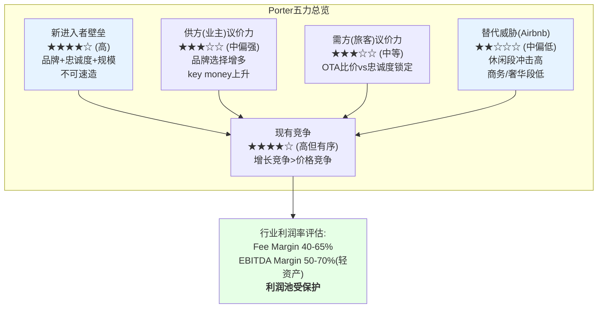
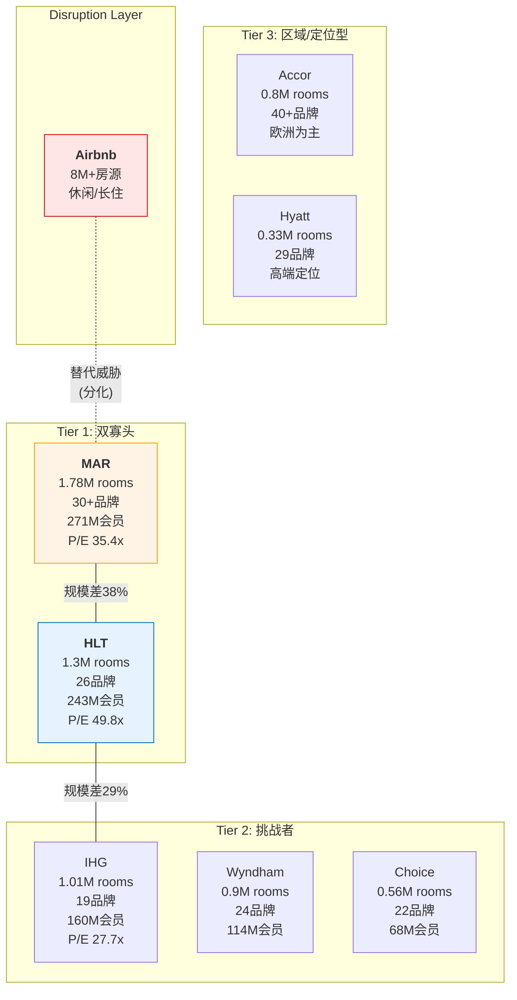
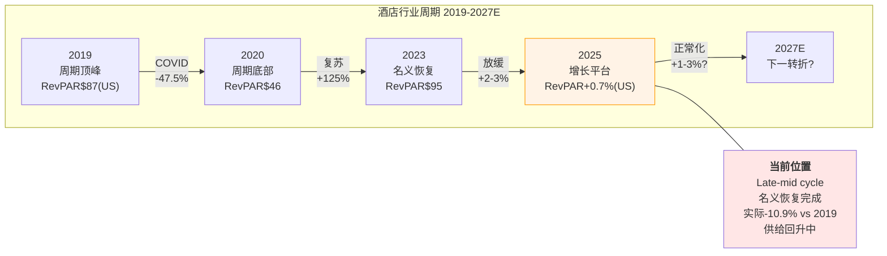

# Marriott International (MAR) — 品类之王的夹心层之谜

> **评级: 中性关注(偏审慎)** | 预对齐期望回报: -5%~-15% | 待Phase 3估值确认
> **日期**: 2026-03-05 | **框架**: v18.0 + consumer v28.0 + 酒店适配HM1-HM10
> **分析师**: AI Investment Research Agent | **字符目标**: ~440K

---

# Ch1: 研究契约与执行摘要

## 1.1 研究契约

### 分析范围与时间坐标

**标的**: Marriott International, Inc. (NASDAQ: MAR)
**分析日期**: 2026-03-05 | **股价**: $335.94 [DM-MKT-001] | **市值**: $89.0B(实时)/$83.3B(年末) [DM-VAL-005]
**框架版本**: v18.0 + 消费品行业增强v28.0 + 酒店适配模块v1.0(HM1-HM10)
**分析层级**: Tier 3深度研究 | **方法论路由**: 可能性宽度PW=2.8 → 传统框架(SOTP/DCF → 目标价+评级)
**分析系数**: ×1.1(消费品) | **目标字符**: 440K ± 10%

**时间框架**:
- 财务数据: FY2020-FY2025(6年完整周期，覆盖COVID→复苏→正常化)
- 估值基准: FY2025 actual + FY2026E/FY2027E指引
- 投资视野: 2-5年(特许经营模型的复利周期)

### 核心问题注册 (CQ)

本报告围绕三个核心矛盾组织全部26章分析：

| CQ | 矛盾 | 类型 | Phase 0置信度 |
|----|------|------|:------------:|
| **CQ-1** | **品类之王折价之谜** — MAR是全球最大酒店集团(1.78M rooms [DM-BIZ-003], 271M会员 [DM-BIZ-001], 30+品牌 [DM-BIZ-006])，但P/E 35.4x [DM-VAL-001]落后HLT 49.8x达41%。ROIC 15.6% [DM-VAL-007] > HLT 11.3%。市场在定价什么？ | 结构性+周期性 | 0.5 |
| **CQ-2** | **杠杆回购可持续性** — 连续4年资本回报>FCF $2,608M [DM-FIN-011]，4年债务+52%。Asset-light模式是否让传统杠杆指标失效？Net Debt/EBITDA 3.73x [DM-VAL-010]的天花板在哪里？ | 结构性 | 0.4 |
| **CQ-3** | **品牌数量vs品牌质量** — 30+品牌 [DM-BIZ-006] ACSI 78 < HLT 80。品牌扩张策略(citizenM, MGM Collection, midscale新品牌)是增长引擎还是品牌稀释？NPS 15 vs 行业均值44。 | 制度性 | 0.3 |

### 分析框架

**酒店适配模块(HM1-HM10)**: 本报告采用从IHG报告(4.3/5)迭代升级的酒店行业专用坐标系，10个模块MECE覆盖酒店行业核心维度。IHG报告中HM5(分销)、HM8(运营控标)、HM9(业主经济学)三个缺口在本报告中以专章补齐(Ch5/Ch7/Ch9)。

**消费品v28.0增强**: 5个跨类型分析模块——意愿×能力双轴(Ch10)、稳健比率(Ch17)、文化可衡量性(Ch19)、战略放弃清单(Ch19)、品牌弹性半径(Ch10)。

**非共识假说预设(Phase 0.75)**:
- **NH-1**: 酒店行业P/E定价公式 = f(NUG)，ROIC不是有效定价因子
- **NH-2**: Asset-light模式下Net Debt/EBITDA非有效风险指标，fee stream稳定性=真实担保
- **NH-3**: MAR增长引擎正从RevPAR转向信用卡/金融产品(2026信用卡费+35% [DM-BIZ-002])
- **NH-4**: 30+品牌的复杂度成本>品类覆盖收益，拖累ACSI/NPS/NUG

---

## 1.2 执行摘要

### MAR是什么公司

Marriott International是全球最大的酒店特许经营与管理集团，运营9,800+物业、1.78M间客房 [DM-BIZ-003]，横跨30+品牌 [DM-BIZ-006]、140个国家和地区。从Ritz-Carlton(每晚$800+)到Fairfield Inn(每晚$100-)，MAR的品牌矩阵覆盖了酒店行业几乎全部细分市场。Bonvoy忠诚度计划拥有271M会员 [DM-BIZ-001]，是全球最大的酒店忠诚度平台。

**商业模式核心**: MAR不拥有酒店——它出售品牌使用权和管理服务，收取基于收入或利润的费用。FY2025总收入$26.186B [DM-FIN-001]中，Gross Fee Revenue $5,438M [DM-FIN-021]是真正的"MAR收入"，其余大部分是代业主收取并支出的成本报销(cost reimbursement)。这种asset-light模型让MAR以极低的资本投入产生$2,608M自由现金流 [DM-FIN-011]。

### 为什么值得研究

MAR值得深度研究的原因不是因为它便宜，而是因为它呈现了一个引人入胜的定价谜题：**品类之王不是估值之王**。

在全球酒店三巨头中，MAR房间数最多(1.78M vs HLT 1.3M vs IHG 1.01M)、会员最多(271M vs HLT 243M vs IHG 160M)、品牌最多(30+ vs HLT 26 vs IHG 19)——但P/E 35.4x [DM-VAL-001]却显著落后HLT 49.8x，甚至仅温和领先IHG 27.7x。与此同时，MAR的ROIC 15.6% [DM-VAL-007]高于HLT 11.3%。**市场给效率更低但增速更快(NUG 6.7%)的HLT更高估值，而品类之王MAR被卡在"夹心层"**——溢价于IHG但折价于HLT。

这个定价异常指向酒店行业一个深层逻辑：**市场可能定价NUG(净单位增长)而非ROIC**。MAR的NUG 4.3% [DM-BIZ-004]是三巨头中最慢的。如果这个假说成立，它对MAR的估值含义是明确的——要么NUG加速(管理层指引2026年4.5-5%)触发重估，要么MAR永久性地承受"增速折价"。

### 核心发现预览

**1. 效率-增速-估值三角悖论(CQ-1)**: 在酒店行业，ROIC与P/E呈负相关(IHG 22.6%/27.7x → MAR 15.6%/35.4x → HLT 11.3%/49.8x)。这不是MAR独有的问题，而是反映了市场对增速(NUG)的单因子定价机制。MAR的估值折价核心是NUG 4.3%落后HLT 6.7%。

**2. 杠杆回购永动机(CQ-2)**: FY22-25连续4年资本回报超过FCF，累计差额由新增债务弥补，债务+52%。Net Debt/EBITDA从约2.5x升至3.73x [DM-VAL-010]。这是asset-light模型的理性杠杆操作(fee stream稳定性高于传统酒店)，还是牺牲资产负债表换取短期EPS增长？

**3. 金融化隐性转型(NH-3)**: 信用卡费$716M [DM-BIZ-002]，2026E增速+35%，远超RevPAR +2.0% [DM-BIZ-005]和fee revenue +5%。剥离信用卡费后，核心fee revenue增速仅约+3-4%。Bonvoy正从忠诚度工具演变为金融产品定价权的载体。

**4. 品牌熵成本(NH-4)**: 30+品牌的ACSI 78 < HLT 80(26品牌)。NPS 15 vs 行业均值44。品牌扩张的复杂度成本是否在侵蚀品牌力？HLT以更精简的品牌组合实现了更高的客户满意度和更快的NUG。

### 预对齐评级

**中性关注(偏审慎)** — 期望回报约-5%~-15%

校准逻辑：MAR P/E 35.4x高于直接可比IHG(27.7x, 评级"关注"+13.5%)和DPZ(23x, 评级"中性关注偏关注"+9.4%)。与CMG(32x, 评级"中性关注"-7%)高度可比。FMP标准DCF暗示公允价值$215.66(下行-36%)，但标准假设可能低估brand/franchise价值。综合考量，MAR定位于"中性关注"区间的审慎端。

---

## 1.3 投资温度计

### 宏观环境定位

| 维度 | 数据 | 信号 |
|------|------|------|
| VIX | 21.15 | 中等波动(>20=不安) |
| MAR RSI(14日) | 32.3 | 接近超卖区间(<30) |
| 分析师共识 | Moderate Buy, 平均PT $343(+2%) | 近乎中性 |
| 10Y UST | ~4.3% | 高利率环境持续 |
| US消费者信心 | 下行趋势 | 旅行支出可能放缓 |
| RevPAR趋势 | WW +2.0%, US +0.7% [DM-BIZ-005] | 接近停滞 |
| 行业供给 | US +0.8%(2025E) | 温和供给增加 |

**温度计读数**: 温偏冷。MAR股价已从52周高点回落约15%，RSI 32.3接近超卖。但基本面端(RevPAR +0.7% in US)和宏观端(高利率+消费信心下行)缺乏催化剂。分析师共识PT $343几乎等于当前价格，暗示市场认为MAR已被合理定价。**短期技术面偏超卖，但缺乏基本面催化剂扭转趋势**。

---

## 1.4 SGI速判: 通才型酒店巨头

**SGI = 4.5/10 (偏通才)**

| 维度 | 评分 | 理由 |
|------|:----:|------|
| HHI_rev(收入集中度) | 3/10 | 费用类型分散(base fee/mgmt fee/incentive fee/franchise fee/licensing/credit card)，无单一收入占>40% |
| 品牌聚焦度 | 3/10 | 30+品牌 [DM-BIZ-006]，从超奢(Ritz-Carlton)到经济型(Fairfield)全覆盖 |
| 细分市场统治力 | 5/10 | 奢华段#1(Ritz-Carlton全球公认顶级)，但中端/经济型段面临Hampton Inn(HLT)强力竞争 |
| 市场份额 | 6/10 | 全球酒店房间数~16%+(品牌化酒店中更高)，品类之王但非绝对垄断 |
| 能力集中度 | 5/10 | 核心能力集中于品牌管理+分销+忠诚度，但30+品牌的运营管理分散度高 |

**对标**:
| 公司 | SGI | 关键差异 |
|------|:---:|----------|
| MAR | 4.5 | 30+品牌全谱系，但规模优势最强(1.78M rooms) |
| HLT | 5.5 | 26品牌但执行更聚焦，Hampton/Hilton双核心清晰 |
| IHG | 5.5 | 20品牌偏通才，但Holiday Inn/Holiday Inn Express双核心占>50%房间 |
| KO | 4.5 | 更纯粹的品牌通才(多品牌覆盖多品类) |
| COST | 8.5 | 单一业态极致专才 |

**路由决策**: 通才框架为主——多品牌矩阵分析(Ch4品牌组合)、多引擎拆解(Ch3费用结构)、多市场覆盖(Ch2行业格局)。专才切入点：特许经营经济学(Ch3)和Bonvoy飞轮(Ch6)是MAR能力集中的两个领域。

---

## 1.5 A-Score预览: 11维护城河

**A-Score预评 = 7.0/10** (详细评估在Ch17)

| 维度 | 预评分 | 一句话 |
|------|:------:|--------|
| 品牌力 | 8/10 | Ritz-Carlton/St.Regis/W=奢华三叉戟，品牌数量行业最多 [DM-BIZ-006]；但ACSI 78 < HLT 80暗示量≠质 |
| 网络效应 | 8/10 | 271M Bonvoy会员 [DM-BIZ-001]=全球最大酒店忠诚度网络；但活跃率/直订转化率待验证 |
| 切换成本 | 6/10 | 业主切换品牌需PIP翻新$1-10M+系统迁移+18个月过渡期；但非绝对锁定 |
| 规模经济 | 8/10 | 1.78M rooms [DM-BIZ-003]=品类之王，采购/分销/技术的固定成本摊薄最优 |
| 成本优势 | 6/10 | Asset-light模型CapEx极低；但MAR的SGA/Fee Revenue比率不如HLT精简 |
| 管理层 | 6/10 | CEO Tony Capuano 2021年接任(突发上任)，执行稳健但缺乏变革型愿景 |
| 财务质量 | 7/10 | FCF $2,608M [DM-FIN-011]强劲，但负权益(回购超资产)+杠杆加速 [DM-VAL-010] |
| 增长质量 | 6/10 | NUG 4.3% [DM-BIZ-004]三巨头最慢；管线610K rooms [DM-BIZ-003]但转化速度待提升 |
| 资本配置 | 5/10 | 回购激进但持续超FCF [DM-FIN-011]；信用卡费+35%是否可持续? [DM-BIZ-002] |
| 行业地位 | 8/10 | 品类之王：房间数#1、会员数#1、品牌数#1——但非估值#1 |
| 估值吸引力 | 5/10 | P/E 35.4x [DM-VAL-001]夹在HLT(49.8x)和IHG(27.7x)之间，FCF Yield 3.1% [DM-VAL-009]偏低 |

```mermaid
radar
    title "MAR A-Score预评雷达图 (7.0/10)"
    "品牌力" : 8
    "网络效应" : 8
    "切换成本" : 6
    "规模经济" : 8
    "成本优势" : 6
    "管理层" : 6
    "财务质量" : 7
    "增长质量" : 6
    "资本配置" : 5
    "行业地位" : 8
    "估值吸引力" : 5
```

**A-Score关键洞察**: MAR的护城河特征是"宽而浅"的通才型——品牌力(8)、网络效应(8)、规模经济(8)、行业地位(8)四个维度构成宽度，但资本配置(5)、估值吸引力(5)、增长质量(6)三个维度拉低深度。与IHG(6.78/10)相比，MAR在规模维度更强但在效率维度更弱。与HLT(预估~7.5/10)相比，MAR品牌数量更多但执行一致性更低。

---

## 1.6 十维度快速评估

| 维度 | 评分(1-10) | 关键数据 | 信号 |
|------|:----------:|----------|------|
| **财务健康** | 6 | Net Debt/EBITDA 3.73x [DM-VAL-010], FCF $2.6B [DM-FIN-011], 负权益(回购耗尽净资产) | 现金流强劲但杠杆加速 |
| **增长** | 6 | NUG 4.3% [DM-BIZ-004], RevPAR +2.0% [DM-BIZ-005], 管线610K rooms [DM-BIZ-003] | 行业增长但三巨头中最慢 |
| **估值** | 5 | P/E 35.4x [DM-VAL-001], EV/EBITDA 22.3x [DM-VAL-003], FCF Yield 3.1% [DM-VAL-009] | 夹心层定价，不便宜 |
| **竞争地位** | 8 | 全球#1房间数1.78M [DM-BIZ-003], #1会员271M [DM-BIZ-001], #1品牌30+ [DM-BIZ-006] | 品类之王，全维度规模领先 |
| **管理层** | 6 | Capuano 2021接任, 推进品牌扩张+midscale进入+citizenM整合 | 执行稳健，缺乏变革叙事 |
| **品牌** | 7 | ACSI 78(HLT 80), NPS 15(行业44); 但奢华段Ritz-Carlton全球#1 | 量>质的隐忧 |
| **风险** | 6 | 杠杆+52%(4Y), US RevPAR +0.7%接近停滞 [DM-BIZ-005], 品牌稀释 | 多重中等风险叠加 |
| **宏观** | 5 | VIX 21.15, 高利率持续, 消费信心下行, 旅行支出增速放缓 | 偏逆风 |
| **技术面** | 5 | RSI 32.3接近超卖, 52周高点回落~15%, 年初至今负收益 | 超卖但无反转信号 |
| **催化剂** | 5 | 2026E信用卡费+35% [DM-BIZ-002], NUG指引提升至4.5-5%, midscale新品牌潜在发布 | 正面催化存在但力度有限 |
| **综合** | **5.9** | | **中性偏审慎** |

---

## 1.7 报告目录导引

### Part I: 公司深度 (Ch1-10, ~155K字符)

| 章 | 标题 | 一句话说明 |
|----|------|-----------|
| Ch1 | 研究契约与执行摘要 | 核心问题注册、预对齐评级、十维度快扫 |
| Ch2 | 全球酒店行业结构与竞争格局 | 行业五力+竞争梯队+周期定位+Airbnb冲击量化 |
| Ch3 | 收费结构三层经济学 | base fee/incentive fee/licensing/credit card分拆+利润池地图 |
| Ch4 | 品牌组合矩阵与熵值分析 | 30+品牌分层+品牌数vs品牌力非线性+品牌间蚕食 |
| Ch5 | 分销渠道经济学 | 直订vs OTA vs企业渠道成本+Bonvoy直订转化 |
| Ch6 | Bonvoy会员飞轮深度解构 | 271M会员活跃率/LTV/直订转化/积分负债/飞轮诊断 |
| Ch7 | 运营质量与品牌控标 | GSI/审计通过率/缺陷关闭/新店vs成熟店评分差 |
| Ch8 | CEO沉默域分析 | Tony Capuano的战略静默空间映射+管理层评估 |
| Ch9 | 增长引擎与业主经济学 | NUG/管线/conversion + 业主GOP/NOI/RevPAR溢价 |
| Ch10 | W×C意愿能力双轴+品牌弹性半径 | 消费品DNA诊断+品牌延展边界测试 |

### Part II: 财务深度与估值 (Ch11-16, ~115K字符)

| 章 | 标题 | 一句话说明 |
|----|------|-----------|
| Ch11 | 5年财务趋势+净债务三口径 | 收入口径校正+三表深度+EVO-SBUX-001净债务前置 |
| Ch12 | 杠杆分析: 回购超FCF可持续性 | 2.5x→3.73x杠杆加速+回购vs FCF缺口+债务到期墙 |
| Ch13 | RevPAR纯度分解(YPD) | ADR×OCC拆分+结构性vs周期性+区域差异 |
| Ch14 | 旅行需求周期与情景框架 | 宏观周期定位+催化剂表+三情景参数 |
| Ch15 | Reverse DCF与信念反演 | 隐含增长率+承重墙识别+折价三层分解 |
| Ch16 | 市场预期桥 | 共识解构→反演→折价归因→收敛路径 |

### Part III: 战略深度 (Ch17-21, ~74K字符)

| 章 | 标题 | 一句话说明 |
|----|------|-----------|
| Ch17 | A-Score v2.0 + 稳健比率 | 11维护城河量化+RR让渡型vs品牌型 |
| Ch18 | MAR-HLT-IHG三角镜像 | 9+维度三角对比+估值阶梯归因+ROIC可比调整 |
| Ch19 | PtW战略一致性 + 文化可衡量性 | PtW 5层评分+文化指标+战略放弃清单 |
| Ch20 | 引擎独立性测试+假设审计 | 4引擎独立性验证+增量ROIC审计 |
| Ch21 | AI冲击矩阵 | AI对RevPAR管理/分销/运营效率的净影响 |

### Part IV: 对抗审查 (Ch22-23, ~50K字符)

| 章 | 标题 | 一句话说明 |
|----|------|-----------|
| Ch22 | 红队七问(RT-1~RT-7) | 净调整pp+悲观偏差检测(<3pp目标) |
| Ch23 | 风险拓扑映射 + Kill Switch | 15+ KS+温水煮青蛙+KS条件依赖 |

### Part V: 综合产出 (Ch24-26 + 附录, ~46K字符)

| 章 | 标题 | 一句话说明 |
|----|------|-----------|
| Ch24 | 估值一体化 | 双层SOTP+Reverse DCF+Comps+DCF+BME(5+种方法) |
| Ch25 | CQ闭环+KS总表+最终评级 | CQ演化表+15 KS+最终评级+差异化发现 |
| Ch26 | 差异化发现(CI)与可迁移方法论 | 冠军候选+可迁移条件 |

```mermaid
graph LR
    subgraph "Part I: 公司深度"
        Ch1["Ch1 研究契约"] --> Ch2["Ch2 行业格局"]
        Ch2 --> Ch3["Ch3 收费经济学"]
        Ch3 --> Ch4["Ch4 品牌组合"]
        Ch4 --> Ch5["Ch5 分销渠道"]
        Ch5 --> Ch6["Ch6 Bonvoy飞轮"]
        Ch6 --> Ch7["Ch7 品牌控标"]
        Ch7 --> Ch8["Ch8 CEO沉默域"]
        Ch8 --> Ch9["Ch9 增长+业主"]
        Ch9 --> Ch10["Ch10 W×C双轴"]
    end

    subgraph "Part II: 财务与估值"
        Ch11["Ch11 财务趋势"] --> Ch12["Ch12 杠杆分析"]
        Ch12 --> Ch13["Ch13 RevPAR YPD"]
        Ch13 --> Ch14["Ch14 周期+情景"]
        Ch14 --> Ch15["Ch15 逆向DCF"]
        Ch15 --> Ch16["Ch16 预期桥"]
    end

    subgraph "Part III-V"
        Ch17["Ch17-21 战略深度"]
        Ch22["Ch22-23 红队+风险"]
        Ch24["Ch24-26 评级+CI"]
    end

    Ch10 --> Ch11
    Ch16 --> Ch17
    Ch17 --> Ch22
    Ch22 --> Ch24

    style Ch1 fill:#e6f3ff
    style Ch2 fill:#e6f3ff
    style Ch15 fill:#ffe6e6
    style Ch16 fill:#ffe6e6
    style Ch24 fill:#fff3e6
```



---

# Ch2: 全球酒店行业结构与竞争格局

## 2.1 全球酒店行业概览

### 行业规模与增长

全球酒店业是一个$0.87万亿(2024年)的巨型市场，预计到2030年增长至$1.21万亿，CAGR约5.5%。这个增长率高于全球GDP增长(~3%)，核心驱动力是新兴市场中产阶级旅行需求扩张和全球品牌化渗透率提升。

**行业关键结构数据**:

| 维度 | 数据 | 含义 |
|------|------|------|
| 全球酒店房间数 | ~18M rooms | MAR 1.78M [DM-BIZ-003] ≈ 10% |
| 品牌化渗透率(全球) | ~40% | 60%仍为独立酒店→巨大conversion空间 |
| 品牌化渗透率(美国) | >70% | 成熟市场品牌化接近天花板 |
| Top 5集团集中度 | ~38%品牌化房间 | 寡头格局但非垄断 |
| 年新增供给(全球) | ~2-3% | 与需求增长大致匹配 |
| 年新增供给(美国) | 0.8%(2025E) | 历史低位，从0.2%(2023)→0.5%(2024)缓慢恢复 |

酒店行业的一个核心特征是**品牌化趋势的不可逆性**。全球~40%的品牌化渗透率意味着仍有约10.8M间独立酒店房间是潜在的品牌conversion目标。这个趋势在新兴市场(中国品牌化率~30%、东南亚<25%、印度<10%)尤其显著。对MAR/HLT/IHG三巨头而言，品牌化渗透率每提升1个百分点 ≈ 额外~180K rooms的可寻址conversion机会。

**行业收入结构**: 酒店行业收入由三个引擎驱动——(1)存量房间的RevPAR增长(价格×入住率)，(2)净新增房间(NUG)，(3)非房间收入(F&B、会议、信用卡费、忠诚度变现)。对于asset-light特许经营商如MAR，真实增长公式是 Fee Revenue Growth ≈ NUG + RevPAR + Fee Rate Change + Non-room Fee Growth。

### MAR在行业中的定位

MAR占据行业最有价值的位置——**品牌化酒店中规模最大的特许经营商**。在全球~7.2M间品牌化酒店房间中，MAR的1.78M间 [DM-BIZ-003] 占比约25%。加上610K间管线 [DM-BIZ-003]，MAR的"可见系统规模"达2.39M间，占品牌化房间的~33%。

但规模领先并不等于增速领先。MAR的NUG 4.3% [DM-BIZ-004]是三巨头中最慢的(IHG ~4.7%, HLT 6.7%)。这个差距反映了**大数定律**——在1.78M的基数上增长4.3%意味着每年净增~76K rooms，绝对数量大于HLT在1.3M基数上增长6.7%的~87K rooms。但市场定价的是增速而非绝对量。

---

## 2.2 行业结构五力分析 (Porter)

### 力量1: 供方(业主/加盟商)议价力 — 中等偏强

酒店业主是MAR等品牌方的"供方"——他们拥有物业、承担资本支出、支付品牌费用。业主议价力取决于品牌选择的多寡和切换成本的高低。

**议价力评估**:

| 因素 | 评估 | 分析 |
|------|------|------|
| 品牌选择 | 增加中 | 30+(MAR)+26(HLT)+19(IHG)+40+(WH/CHH/Accor)=品牌泛滥，业主选择多 |
| 切换成本 | 中等 | PIP翻新$1-10M + 系统迁移12-18月；但大型业主(Host/Park/Apple)有谈判筹码 |
| 信息对称性 | 提升中 | STR等数据服务让业主能精确对比各品牌的RevPAR溢价和费率 |
| 集中度 | 上升中 | 前10大业主控制~15%品牌化房间，形成对品牌方的集体议价力 |
| Key Money | 增加 | 品牌方为争夺优质物业提供前期激励($5K-$25K/room)，侵蚀品牌方利润 |

**净评估**: 中等偏强(5.5/10)。品牌方的竞争加剧(尤其midscale/economy段)正在将议价力向业主端倾斜。MAR的规模优势部分缓解了这个压力——271M Bonvoy会员 [DM-BIZ-001]带来的预订量是业主选择MAR品牌的核心理由。

### 力量2: 需方(旅客)议价力 — 中等

旅客的议价力在过去20年经历了从低→高→回落的周期——OTA(在线旅行社)的崛起曾大幅提升旅客比价能力，但酒店集团通过忠诚度计划和"会员最优价"策略部分收回了定价权。

| 因素 | 评估 | 分析 |
|------|------|------|
| 价格透明度 | 高 | Google Hotels/OTA让比价成本趋近于零 |
| 切换成本 | 低→中 | 忠诚度积分和Elite身份创造一定切换成本，但跨品牌旅客仍很常见 |
| 替代品存在 | 高 | Airbnb 8M+房源提供了非酒店选项(详见2.5) |
| 企业客户 | 中 | 大企业协议价(negotiated rate)压缩商旅RevPAR，但提供稳定基础占有率 |

**净评估**: 中等(5/10)。忠诚度计划是酒店集团对抗需方议价力的最有效工具。MAR的271M Bonvoy会员 [DM-BIZ-001]是行业最大的忠诚度网络，但活跃率和直订转化率将决定这个"最大"是否等于"最有效"(Ch6深入分析)。

### 力量3: 替代威胁(Airbnb/VRBO) — 中等偏低(分化)

Airbnb拥有8M+活跃房源，从规模上已超过全球酒店品牌化房间总数(~7.2M)。但替代威胁的实际影响高度分化：

| 细分市场 | 替代威胁 | 原因 |
|---------|:--------:|------|
| 休闲独行/情侣 | 高(8/10) | Airbnb在独特体验、非标住宿、厨房设施方面有天然优势 |
| 家庭/大团体 | 高(7/10) | 多卧室公寓/别墅的空间和性价比碾压酒店套房 |
| 长住(>7晚) | 中高(6/10) | 厨房+客厅+洗衣机=长住刚需；酒店Extended Stay品牌正反击 |
| 商务旅行 | 低(3/10) | 企业报销政策、安全合规、差旅管理系统均锁定品牌酒店 |
| 会议/团队 | 极低(1/10) | 会议室、宴会厅、AV设备、catering——Airbnb无法提供 |
| 超奢华 | 低(2/10) | Ritz-Carlton/St.Regis的服务体验和品牌光环无法被分散房源替代 |

**净评估**: 中等偏低(4/10)。Airbnb对休闲/长住细分有实质性冲击，但对商务/会议/奢华段几乎无影响。MAR的30+品牌 [DM-BIZ-006]组合恰好覆盖了Airbnb冲击最小的高价值细分——奢华(Ritz-Carlton/St.Regis/EDITION)和商务(Marriott/Sheraton/Westin)。但MAR的中端品牌(Courtyard/Fairfield)在休闲旅客争夺中面临Airbnb直接竞争。

### 力量4: 新进入者壁垒 — 高

| 壁垒 | 强度 | 分析 |
|------|:----:|------|
| 品牌建设 | 极高 | Marriott品牌始于1957年(酒店业务)，Ritz-Carlton始于1983年，品牌资产不可速造 |
| 忠诚度网络 | 极高 | 271M会员 [DM-BIZ-001]的获取成本以十亿美元计，冷启动几乎不可能 |
| 分销系统 | 高 | 全球预订引擎+GDS接入+OTA关系+企业合同矩阵需要数十年积累 |
| 规模效应 | 高 | 1.78M rooms [DM-BIZ-003]的采购议价力、技术平台摊薄、品牌营销效率 |
| 管线锁定 | 中高 | 4,056物业/610K rooms管线 [DM-BIZ-003]=未来5-7年增长锁定 |

**净评估**: 高(8/10)。酒店品牌特许经营是一个典型的"赢家通吃"行业——前3名(MAR/HLT/IHG)在忠诚度、分销、品牌等维度的累积优势使得新进入者几乎不可能从零挑战。**真正的竞争不是新进入者，而是三巨头之间的份额移动**。

### 力量5: 现有竞争强度 — 高但有序

三巨头(MAR/HLT/IHG)之间的竞争激烈但有序——竞争主要体现在品牌扩张(新品牌争夺空白细分)和NUG(新签约/转换竞争)，而非价格战(RevPAR竞争)。这种竞争格局类似于可乐行业(KO vs PEP)——激烈但理性，不会自毁利润池。

| 竞争维度 | 强度 | 分析 |
|---------|:----:|------|
| NUG争夺 | 高 | 三巨头+WH/CHH在新开发和conversion中激烈竞争，key money/incentive escalation |
| 品牌增殖 | 高 | MAR 30+品牌 vs HLT 26 vs IHG 19 — 品牌数量军备竞赛 |
| 忠诚度竞赛 | 高 | Bonvoy/Honors/One Rewards不断升级权益和信用卡合作 |
| RevPAR竞争 | 低 | 定价纪律良好，无价格战(asset-light模型使价格战无利可图) |
| Key Money | 上升 | 争夺优质转换物业的前期激励正在增加 |

**净评估**: 高(7/10)。竞争激烈但围绕增长而非价格，行业利润池受保护。MAR作为品类之王，面临的最大竞争压力是HLT在NUG上的持续领先(6.7% vs 4.3%)。



### 五力综合评估

**行业吸引力: 7.5/10**。酒店品牌特许经营是一个结构性优良的行业——高进入壁垒、有序竞争、有限替代威胁(在高价值细分)、受保护的利润池。最大的结构性风险不是行业力量恶化，而是**品牌增殖导致的边际品牌价值递减**和**业主议价力上升**(Key Money escalation)。对MAR的特定含义：行业结构有利于在位者，但规模领先的边际收益正在递减。

---

## 2.3 竞争梯队与格局

### 全球酒店集团梯队



### 全维度竞争格局对比

| 维度 | MAR | HLT | IHG | WH | Airbnb |
|------|-----|-----|-----|-----|--------|
| **房间数** | 1.78M [DM-BIZ-003] | 1.3M | 1.01M | 0.9M | 8M+房源 |
| **品牌数** | 30+ [DM-BIZ-006] | 26 | 19 | 24 | 1 |
| **会员数** | 271M [DM-BIZ-001] | 243M | 160M | 114M | N/A |
| **管线** | 610K [DM-BIZ-003] | ~500K | ~342K | ~200K | N/A |
| **NUG** | 4.3% [DM-BIZ-004] | 6.7% | ~4.7% | ~2% | N/A |
| **P/E** | 35.4x [DM-VAL-001] | 49.8x | 27.7x | ~21x | ~40x |
| **EV/EBITDA** | 22.3x [DM-VAL-003] | 28.7x | 20.8x | ~15x | ~30x |
| **ROIC** | 15.6% [DM-VAL-007] | 11.3% | 22.6% | ~18% | ~25% |
| **Net Debt/EBITDA** | 3.73x [DM-VAL-010] | 5.12x | 2.86x | ~4.5x | 净现金 |
| **FCF Yield** | 3.1% [DM-VAL-009] | 3.0% | 4.0% | ~5% | ~3% |
| **ACSI(2025)** | 78 | 80 | 79 | 73 | N/A |
| **奢华品牌** | Ritz-Carlton/St.Regis/EDITION/W/BVLGARI/Luxury Collection | Waldorf Astoria/Conrad/LXR | Six Senses/Regent/IC | N/A | N/A |
| **核心强项** | 规模+品牌谱系+Bonvoy | NUG增速+执行一致性+Hampton | ROIC+FCF+资产负债表 | 经济型主导+特许纯度 | 独特体验+供给弹性 |
| **核心弱项** | NUG最慢+品牌稀释风险 | 杠杆最高+ROIC最低 | 规模第三+增速平庸 | 品牌力弱+高端缺失 | 监管风险+品质不稳定 |

### 竞争格局关键洞察

**1. MAR-HLT双寡头的估值分化**: MAR和HLT合计控制全球品牌化酒店房间的~43%，构成事实上的双寡头。但两者的估值差异(P/E 35.4x vs 49.8x, EV/EBITDA 22.3x vs 28.7x)巨大。这个差异的核心来源是NUG——HLT 6.7%的NUG意味着其系统规模将在~10年内翻倍，而MAR 4.3%需要~16年。在一个增长是主要估值驱动的行业中，这个差距被放大定价。

**2. ROIC-估值负相关悖论**: IHG(ROIC 22.6%, P/E 27.7x) > MAR(15.6%, 35.4x) > HLT(11.3%, 49.8x)。资本效率最高的公司获得最低估值。这个悖论有两个解释：(a) 在负权益/高杠杆的酒店行业，ROIC作为横向比较指标失真(分母差异大)；(b) 市场定价的不是历史效率而是未来增速，NUG是唯一有效因子。

**3. 品牌军备竞赛的赢家诅咒**: MAR 30+品牌、HLT 26品牌、IHG 19品牌——三巨头都在快速扩充品牌组合以覆盖更多细分市场。但品牌数量与品牌满意度呈负相关(MAR 30+品牌/ACSI 78 vs HLT 26品牌/ACSI 80)。品牌扩张是"赢家诅咒"——追求全品类覆盖的代价是单一品牌的运营聚焦和质量控制的难度呈指数级上升。

---

## 2.4 行业周期定位

### RevPAR历史轨迹 (2006-2025)

酒店行业是典型的周期性行业，RevPAR(每间可用房收入)是核心景气指标。过去20年经历了三次重大冲击：

| 事件 | 时期 | US RevPAR变化 | 恢复时间 |
|------|------|:------------:|:--------:|
| 全球金融危机 | 2008-2009 | -16.7% | ~3年(2012恢复) |
| COVID-19 | 2020 | -47.5% | ~3年(名义2023恢复, 实际仍未恢复) |
| 当前周期 | 2024-2025 | US +0.7% [DM-BIZ-005] | — |

**当前定位: 名义复苏完成, 实际恢复未达**

这是理解MAR估值的关键背景：
- **名义RevPAR**: WW +9.3% vs 2019 → 表面上已完全恢复
- **实际(通胀调整)RevPAR**: -10.9% vs 2019 (CBRE数据) → 购买力口径仍未恢复

这意味着酒店行业的"复苏叙事"在名义上已经结束，但真实定价权(real pricing power)并未回到疫情前水平。当前US RevPAR +0.7% [DM-BIZ-005]的低增速不是短期波动，而是反映了名义RevPAR已接近本轮周期顶部，实际RevPAR因通胀侵蚀难以突破。

### 周期阶段判断

| 指标 | 数据 | 信号 |
|------|------|------|
| US RevPAR增速 | +0.7% [DM-BIZ-005] | 接近停滞=周期后段 |
| US入住率 | ~65%(2025E) | 低于2019~66%=尚未完全恢复 |
| US ADR | ~$150(2025E) | 高于2019~$130=名义恢复主要靠涨价 |
| 新增供给 | US 0.8%(2025E), 从0.2%(2023)上升 | 供给回升=周期转折风险 |
| 建造成本 | 较2019上涨30-40% | 抑制新供给速度=利好在位者 |
| 劳动力成本 | 较2019上涨20-25% | 压缩业主GOP→影响NUG |

**综合判断: Late-mid cycle(周期中后段)**

酒店行业目前处于名义复苏完成→增长放缓的过渡阶段。RevPAR增速正在从2022-2023的高单位数(复苏红利)正常化到低单位数(2-3%)。供给端，US新增供给从COVID期间极低的0.2%(2023)缓慢恢复至0.8%(2025E)，但仍低于历史平均~1.5-2%。高建造成本($200K-$500K/room depending on tier)是主要供给抑制因素。



**对MAR的含义**:
- **短期(1-2年)**: RevPAR增速将维持在低单位数(1-3%)，不会贡献超额增长。MAR的增长将主要依赖NUG(4.3-5% [DM-BIZ-004])和非RevPAR收入(信用卡费+35% [DM-BIZ-002])。
- **中期(3-5年)**: 如果经济衰退发生，酒店RevPAR可能下降5-15%。但asset-light模型下MAR的fee revenue下降幅度约为RevPAR下降的50-70%(管理费下降更大，特许费更韧性)。
- **结构性**: 供给增长被高建造成本抑制(US 0.8% vs 历史1.5-2%)，有利于现有物业RevPAR维持。但这也意味着NUG可能面临新建pipeline交付放缓的逆风。

---

## 2.5 Airbnb影响量化

### 规模对比

| 维度 | Airbnb | 全球品牌酒店 | MAR |
|------|--------|------------|-----|
| 房源/房间 | 8M+活跃房源 | ~7.2M品牌化rooms | 1.78M rooms [DM-BIZ-003] |
| 2024收入 | ~$11B(平台take rate) | N/A(分散) | $26.2B [DM-FIN-001]($5.4B fee) |
| 2024Q4季度收入 | $2.48B | N/A | $6.3B |
| 间夜(2024) | ~500M | ~1.5B(品牌) | ~500M(estimated) |
| 平均每晚价格 | ~$155(全球) | ~$150(US ADR) | ~$180(system-wide ADR) |

**关键发现**: Airbnb的8M+活跃房源在数量上已经超过全球品牌化酒店房间总数(~7.2M)。但房源≠房间——Airbnb的一个"房源"可能是一个单间卧室或一栋别墅，可比性有限。按间夜数计算，Airbnb ~500M间夜 vs 全球品牌酒店~1.5B间夜，Airbnb占比约25%。

### 影响分化矩阵

| 细分 | Airbnb渗透率 | MAR暴露度 | MAR品牌对策 | 净影响 |
|------|:-----------:|:---------:|-----------|:------:|
| **奢华** | <5% | Ritz-Carlton/St.Regis/W/EDITION/BVLGARI | 服务体验+品牌光环不可替代 | 极低 |
| **商务差旅** | <10% | Marriott/Sheraton/Westin/Courtyard | 企业差旅政策+安全合规锁定 | 低 |
| **会议/团建** | <3% | Marriott/Sheraton/Gaylord | 会议设施+餐饮无替代 | 极低 |
| **休闲高端** | 20-30% | W/EDITION/Autograph/Tribute | 部分竞争，但品牌体验差异化 | 中 |
| **休闲中端** | 25-35% | Courtyard/Fairfield/Four Points | 直接竞争，性价比和体验选择 | 中高 |
| **长住** | 30-40% | Residence Inn/TownePlace/Element | 厨房+空间需求使Airbnb有优势 | 高 |
| **经济型** | 15-25% | Fairfield/SpringHill/midscale新品 | 价格敏感客户易转向Airbnb | 中 |

**MAR的Airbnb暴露度评估**: MAR的品牌组合设计使其天然对Airbnb有一定抵御能力——奢华(6个品牌)和商务(5个核心品牌)占据了fee revenue的大部分，而这两个细分是Airbnb渗透率最低的。但MAR在中端休闲(Courtyard/Fairfield)和长住(Residence Inn/TownePlace)的暴露度较高，这两个品牌合计占MAR房间数的约35%。

**量化估计**: Airbnb对MAR系统整体RevPAR的结构性拖累约为每年0.5-1.0个百分点——即如果没有Airbnb竞争，MAR的RevPAR增速可能高1个百分点左右。这不是灾难性冲击，但在RevPAR已经只有+2.0% [DM-BIZ-005]的环境下，每一个百分点的边际增长都很珍贵。

---

## 2.6 行业增长引擎

全球酒店行业的中长期增长由三个结构性引擎驱动：

### 引擎1: 新兴市场中产旅行需求

全球中产阶级从2020年的~3.6B人预计增长至2030年的~5.3B人，增量主要来自亚太(中国、印度、东南亚)和非洲。每1亿人进入中产阶级，全球酒店间夜需求增加约1-2%。

MAR在新兴市场的布局：
- 中国大陆+香港: ~520家酒店, ~150K rooms(系统~8%)
- 印度: ~150家, ~30K rooms(系统~2%, 但管线增长最快)
- 东南亚: ~200家, ~55K rooms(系统~3%)

**MAR vs HLT在新兴市场**: HLT在中国(~630家)和印度(~170家)的布局更激进，这部分解释了HLT更高的NUG(6.7% vs 4.3%)。新兴市场的品牌化渗透率低(中国~30%、印度<10%)意味着这里的conversion和新开发空间远大于美国(>70%)。

### 引擎2: 品牌化渗透率提升

| 市场 | 品牌化率 | 可寻址rooms | 年conversion潜力 |
|------|:--------:|:----------:|:---------------:|
| 美国 | >70% | ~3M独立 | ~50-80K(接近饱和) |
| 欧洲 | ~40% | ~5M独立 | ~100-150K |
| 中国 | ~30% | ~10M独立 | ~200-300K |
| 印度 | <10% | ~15M独立 | ~100-200K |
| 东南亚 | <25% | ~5M独立 | ~80-120K |
| 中东/非洲 | ~20% | ~3M独立 | ~50-80K |

全球品牌化渗透率从当前~40%向50%迈进的过程中，每年可释放约500K-900K间独立酒店进入品牌体系。三巨头作为品牌化的主要推动者，将捕获其中的大部分。MAR的全品牌谱系(30+品牌)在理论上覆盖了所有细分市场的conversion需求，但执行效率(NUG)落后于HLT。

### 引擎3: Asset-light转型

酒店行业正在经历从"自有/自管"向"品牌特许经营"的结构性转型。MAR在2016年收购Starwood后加速了这一转型，目前几乎不拥有酒店物业。这个转型有两个维度：

**1. 集团层面**: MAR/HLT/IHG的自有/租赁物业占比均已降至<5%，转型基本完成。

**2. 行业层面**: 独立酒店和区域品牌正在被三巨头的品牌体系吸收(conversion)。这是品牌化渗透率提升的另一面——不仅新建酒店选择加盟品牌，现有独立酒店也在转换。MAR 2025年的conversion约占新增房间的30-40%。

---

## 2.7 A-Score行业维度

**行业结构对A-Score的影响** (Ch17 A-Score v2.0完整评估的前置框架)：

| A-Score维度 | 行业特征 | 对MAR的影响 |
|------------|---------|------------|
| **行业结构稳定性** | 高：三巨头格局10年未变，合计份额持续扩大 | 有利：不会被新进入者颠覆 |
| **进入壁垒** | 极高：品牌+忠诚度+分销系统需要数十年积累 | 有利：保护MAR的在位者优势 |
| **技术变化速度** | 低：酒店是成熟行业，AI/数字化是效率工具而非颠覆力量 | 有利：无需大规模技术投资防御 |
| **监管风险** | 低：酒店特许经营几乎不受行业特定监管 | 有利：无监管悬崖 |
| **周期性** | 中高：RevPAR与GDP强相关，但asset-light缓冲了利润波动 | 中性：收入波动但利润韧性强于表面 |
| **定价权** | 中：名义提价能力有(ADR上涨)，但实际定价权(real RevPAR)恢复缓慢 | 谨慎：通胀调整后-10.9% vs 2019 |

**行业综合评分**: 7.5/10。酒店品牌特许经营是少数兼具"高进入壁垒+有序竞争+低技术颠覆风险+asset-light高利润率"的行业。行业结构对MAR有利，但MAR需要在这个有利结构中证明自己的增速(NUG)和品牌力(ACSI/NPS)能配得上品类之王的地位。

---

## 2.8 小结: MAR的行业处境

MAR坐拥一个结构性优良行业的头把交椅——全球最大的酒店特许经营集团，品牌数最多、会员数最多、房间数最多。但"品类之王"不等于"最佳投资标的"。MAR面临三个行业层面的挑战：

**1. 增速悖论**: 规模最大但增速最慢(NUG 4.3% vs HLT 6.7%)。大数定律使得在1.78M的基数上维持高NUG更难，但市场不接受这个辩护——它定价增速，不定价绝对量。

**2. 周期定位**: 行业处于late-mid cycle，RevPAR增速正常化到低单位数(US +0.7% [DM-BIZ-005])。MAR的增长将更多依赖NUG和非RevPAR收入(信用卡费)，而非RevPAR弹性。

**3. 竞争格局**: 三巨头的竞争正从"规模扩张"转向"品质竞争"(品牌体验、忠诚度转化、业主ROI)。MAR的30+品牌 [DM-BIZ-006]在规模扩张阶段是优势(覆盖全品类)，但在品质竞争阶段可能成为负担(品牌管理复杂度)。

行业结构为MAR提供了坚实的地基——高壁垒、有序竞争、受保护的利润池。但地基的坚固不等于上层建筑的估值合理。MAR是否值得P/E 35.4x [DM-VAL-001]，取决于它能否在品类之王的规模基础上重新点燃增速引擎。这是CQ-1(品类之王折价之谜)在行业层面的完整框架——Ch3-Ch9将从费用结构、品牌组合、Bonvoy飞轮、分销渠道、运营控标、业主经济学六个维度深入拆解。
