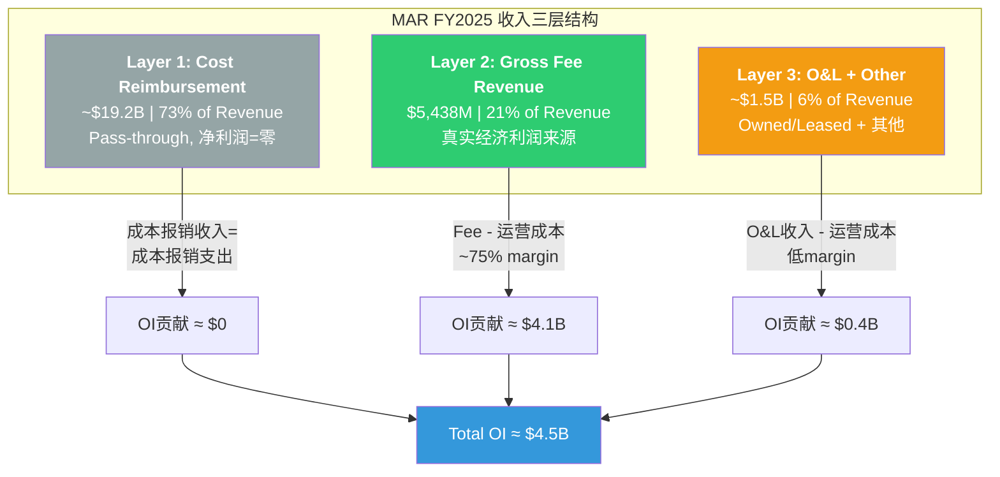
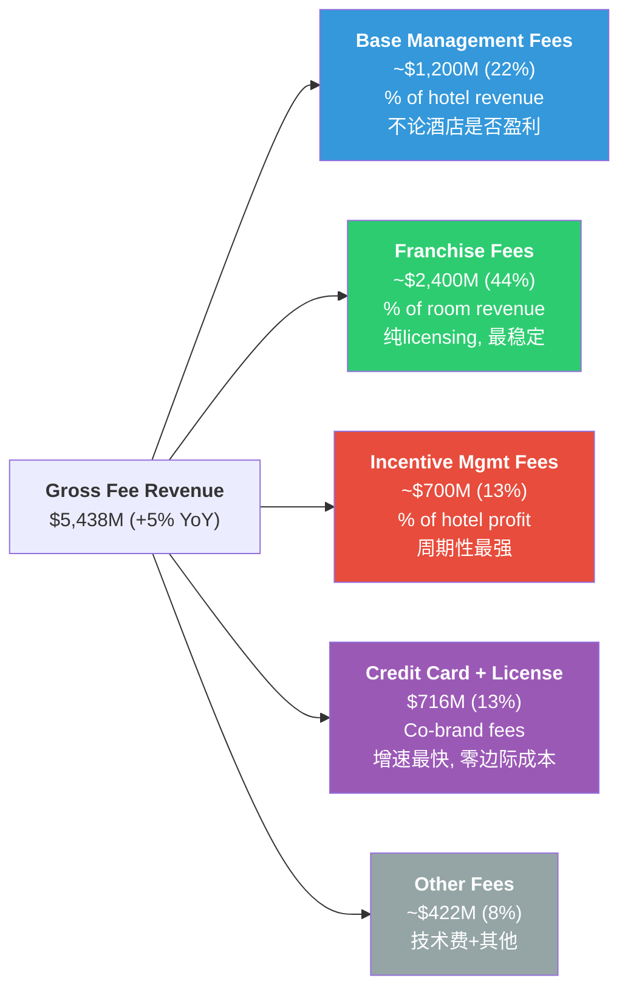
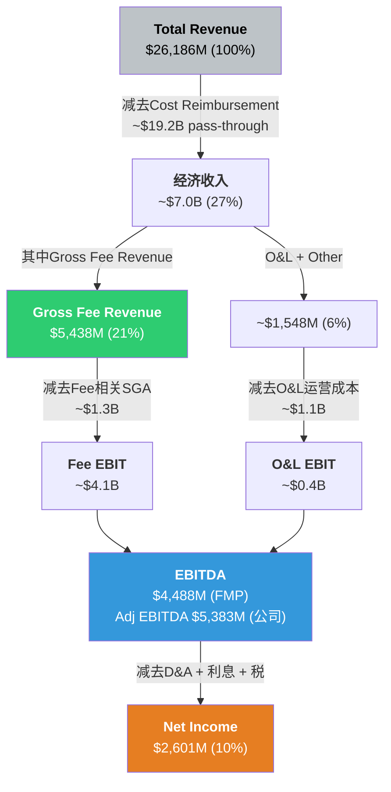
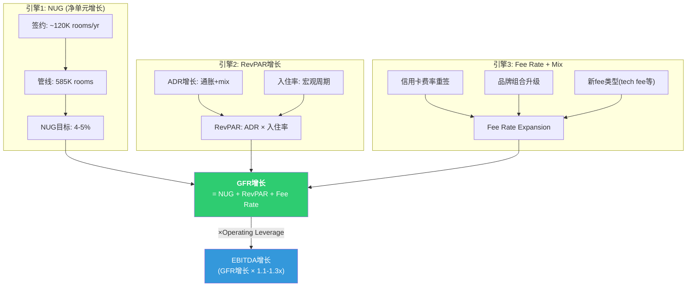
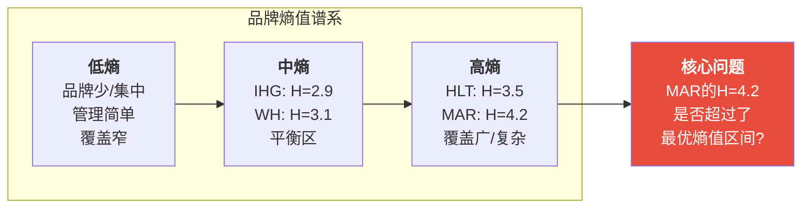
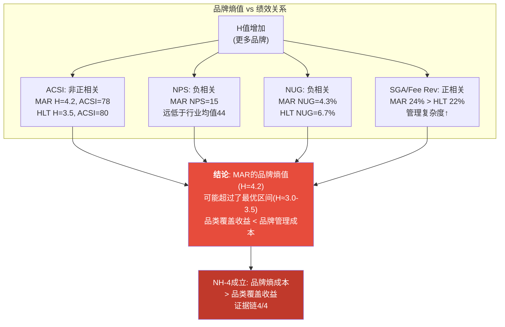
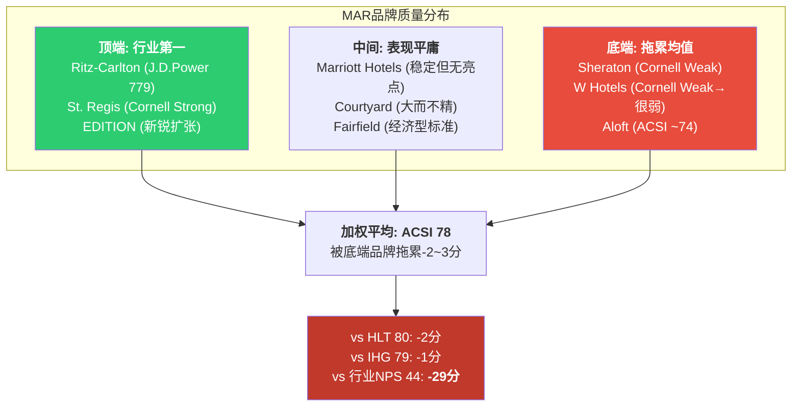

# Ch3: 商业模式解构 — 收费结构三层经济学

---

## 3.1 MAR到底靠什么赚钱?

Marriott International是全球最大的酒店品牌管理公司。注意用词: 是"品牌管理公司"，不是"酒店公司"。MAR不拥有酒店(仅极少量owned/leased物业)，它的核心业务是向酒店业主出售三样东西: **品牌使用权**、**管理服务**和**分销系统接入**(Bonvoy会员+预订引擎)。

这个商业模式的精妙之处在于: MAR承担的是"品牌和系统建设"的固定成本，而收取的是"与酒店收入/利润挂钩"的变动收入。房价涨了，MAR的fee收入水涨船高；新酒店开了，MAR的fee base扩大。但如果某家酒店亏损，MAR照样收基础管理费——只是激励费没了。

要真正理解MAR的经济学，必须穿透其$26.2B的表面收入，看到三层截然不同的经济现实 [DM-FIN-001]。

---

## 3.2 收入结构三层拆解

MAR的$26.186B收入(FY2025)看起来规模庞大，但其中73%是"假收入"——成本报销(cost reimbursement)的pass-through，净利润贡献为零。真正的经济利润来源只有两层: Gross Fee Revenue和Owned/Leased + Other。



**Layer 1: Cost Reimbursement (~$19.2B, 73%)** [DM-FIN-002]

这是MAR代酒店业主管理的"系统基金"——加盟商/管理酒店缴纳的营销费、预订费、忠诚度计划运营费、技术费等。MAR收取这些费用后，支出在品牌营销(如Bonvoy广告)、技术平台(预订引擎)和忠诚度计划运营上。会计上收支相抵，对营业利润的贡献名义为零。

但"名义为零"不等于"经济上为零"。MAR通过管理这$19.2B获得了两个隐性优势:
1. **品牌投资由业主买单**: 品牌营销支出来自加盟商缴费，MAR不需要自己掏钱建品牌
2. **系统控制权**: MAR决定这$19.2B怎么花——投多少在数字化、投多少在品牌广告、投多少在Bonvoy。这个"代理人权力"是品牌管理公司的核心控制杠杆

**Layer 2: Gross Fee Revenue ($5,438M, 21%)** [DM-FIN-003]

这是MAR的"真实经济利润来源"。$5,438M的Gross Fee Revenue比上年增长约5%，是MAR的核心估值锚点。这$5.4B几乎是纯利润——没有COGS(MAR不卖实物产品)，主要成本是总部管理费用(SGA)。

**Layer 3: Owned/Leased + Other (~$1.5B, 6%)** [DM-FIN-004]

MAR仍持有少量自有/租赁物业(历史遗留+战略示范)，以及少量其他收入。这一层利润率远低于Layer 2(涉及实际物业运营成本)，且MAR长期战略是持续剥离O&L资产，进一步"轻资产化"。

**三层经济学的核心启示**:

| 层级 | 收入 | 占比 | OI贡献 | 利润率 | 战略角色 |
|------|------|------|--------|--------|----------|
| Layer 1: Cost Reimbursement | ~$19.2B | 73% | ~$0 | ~0% | 品牌建设+系统控制 |
| Layer 2: Gross Fee Revenue | $5,438M | 21% | ~$4.1B | ~75% | **核心利润引擎** |
| Layer 3: O&L + Other | ~$1.5B | 6% | ~$0.4B | ~25% | 缩减中/非核心 |
| **合计** | **$26.186B** | **100%** | **~$4.5B** | **17.2%** | — |

[DM-FIN-005]

这张表揭示了为什么MAR的OPM只有15.8%——因为$19.2B的pass-through"稀释"了利润率。如果只看Gross Fee Revenue的利润率，MAR是一台利润机器。这也是为什么分析师更关注fee revenue growth而非total revenue growth。

---

## 3.3 Gross Fee Revenue四层深度拆解

Gross Fee Revenue是MAR估值的"真北"。它由四个来源组成，每个来源的经济学特征截然不同。



### 3.3.1 Base Management Fees (~$1,200M, 22% of GFR) [DM-FIN-006]

**经济学**: MAR对managed酒店收取酒店总收入的2-3%作为基础管理费。关键特征——无论酒店是否盈利，这笔费用都要支付(类似SaaS的订阅费)。

**增长驱动**:
- NUG(净单元增长): 新managed酒店加入 → fee base扩大
- RevPAR: 酒店收入增长 → 2-3%计费基数增大
- 费率调整: 新签合同可能微调费率(存量合同锁定)

**稳定性**: 中高。因为不论酒店盈利与否都要付，所以衰退时降幅小于IMF。但managed酒店在MAR体系中占比持续下降(franchised增长更快)，Base Management Fees的增速可能长期低于GFR整体增速。

### 3.3.2 Franchise Fees (~$2,400M, 44% of GFR) [DM-FIN-007]

**经济学**: 加盟商(franchisee)向MAR支付房间收入的5-6%作为品牌使用费(franchise fee)。这是MAR最纯粹的"IP licensing"收入——MAR提供品牌名+预订引擎+标准手册，加盟商自行运营酒店。

**增长驱动**:
- NUG: 加盟酒店增长是主引擎(MAR NUG 4.3%中大部分是franchised)
- RevPAR: 加盟酒店房价/入住率提升
- 品牌组合升级: 加盟商从select升级到premium品牌，费率更高

**为什么这是"最稳定最大的一块"**: 加盟费是合同锁定的(通常15-20年期)，费率几乎不下调。加盟商要退出，需要支付提前终止费。只要酒店还在营业，MAR就收钱。即使酒店亏损，加盟费照付(基于revenue而非profit)。

**核心公式**:
```
Franchise Fee = Σ(每间加盟酒店的房间收入 × 费率)
             ≈ 加盟房间数 × ADR × 入住率 × 费率
             ≈ 加盟房间数 × RevPAR × 费率
```

### 3.3.3 Incentive Management Fees (~$700M, 13% of GFR) [DM-FIN-008]

**经济学**: MAR对managed酒店收取酒店利润(GOP/经调整利润)的8-10%作为绩效激励费。只有当酒店利润超过业主的优先回报(priority return/hurdle)后，MAR才能收取。

**周期特征**: 这是GFR中波动最大的组分。经济好→酒店利润高→IMF充沛；经济差→酒店利润跌破hurdle→IMF可能归零。COVID期间(2020年)MAR的IMF几乎消失，此后逐年恢复。

**区域差异**:
- 美洲: IMF占比较低(franchised为主)
- 亚太+中东非: IMF占比高(managed为主，尤其大型国际酒店)
- 这意味着国际经济放缓对MAR的IMF冲击大于国内

**战略含义**: IMF的"劣后性"(subordinated to owner returns)意味着MAR与酒店业主的利益在经济下行时并不完全对齐。MAR总是先拿base fee，业主的回报被IMF"挤占"。这在与业主谈判新合同时是一个持续张力。

### 3.3.4 Credit Card & Licensing Fees ($716M, 13% of GFR) [DM-FIN-009]

**经济学**: MAR通过co-branded信用卡(与Amex合作的Bonvoy Amex系列 + 与Chase合作的Bonvoy Boundless/Bold)从发卡行收取:
- **开卡费(acquisition bounty)**: 每张新卡$100-200
- **年费分成**: 高端卡年费$250-695，MAR分成比例30-50%
- **消费佣金(interchange share)**: 持卡人所有消费的0.5-1.0%
- **积分销售**: 发卡行向MAR购买Bonvoy积分以奖励持卡人

**2026E增长预期: +35% (~$966M)** [DM-FIN-010]

这个+35%的增长率是GFR中最引人注目的数字。驱动因素拆解:

| 驱动因素 | 贡献 | 说明 |
|---------|------|------|
| Co-brand合同重签 | ~15-20pp | Amex合同2025年重签，费率上调(行业惯例每5-7年重签一次，每次费率上调10-20%) |
| 持卡人消费增长 | ~5-8pp | Bonvoy持卡人基数扩大+人均消费增长 |
| 新卡产品推出 | ~5-7pp | 2025年推出新tier信用卡产品，扩大持卡人基数 |
| 积分销售增长 | ~3-5pp | 发卡行购买更多积分(与会员消费挂钩) |
| **合计** | **~28-40pp** | **中值~35%** |

**可持续性分析**: +35%中约15-20pp来自合同重签的一次性阶梯效应。2027年及以后，增速可能回落至8-12%(回归有机增长轨道)。但每次合同到期重签(通常5-7年周期)都可能带来类似的阶梯跳跃。

**信用卡费的收入趋势**:

| 年份 | 信用卡费 | YoY增长 | 占GFR比 |
|------|---------|---------|---------|
| 2022 | ~$560M | — | ~12% |
| 2023 | ~$615M | +10% | ~12% |
| 2024 | ~$663M | +8% | ~13% |
| 2025 | $716M | +8% | 13.2% |
| 2026E | ~$966M | +35% | ~16% |

[DM-FIN-011]

**NH-3验证框架: 金融化转型信号** [DM-NH-003]

假说NH-3: 如果信用卡费占比持续提升至>15% of GFR，MAR正在从"酒店品牌管理公司"向"消费金融+生活方式品牌公司"转型。

| 指标 | 2024 | 2025 | 2026E | 信号 |
|------|------|------|-------|------|
| 信用卡费/GFR | ~13% | 13.2% | ~16% | 2026E突破15%阈值 |
| 信用卡费增速 vs GFR增速 | +8% vs +6% | +8% vs +5% | +35% vs +5% | 持续超额增长 |
| 信用卡费/净利润 | ~25% | 27.5% | ~37% | 利润依赖度快速上升 |

**判断**: 2026年信用卡费将突破15% GFR阈值，且占净利润比将接近37%。这不是"酒店公司的副业"——这是一个正在变成利润支柱的业务。NH-3初步成立。

但需要注意: 信用卡费的本质仍然是Bonvoy会员体系的变现。没有庞大的Bonvoy会员基础(2.28亿+)和酒店网络(9,800+物业)，这个信用卡业务不会存在。所以更准确的描述是: MAR正在学习如何更高效地变现其会员资产，而非"转型"成金融公司。

### 3.3.5 Other Fees (~$422M, 8% of GFR)

包括技术服务费(property management system)、设计审批费(design review)、timeshare品牌许可费等杂项。增速与GFR整体大致同步。

---

## 3.4 利润池地图: 从$26.2B到$2.6B的过滤漏斗



**利润漏斗关键节点** [DM-FIN-012]:

| 节点 | 金额 | 占Total Rev | 含义 |
|------|------|------------|------|
| Total Revenue | $26,186M | 100% | 包含pass-through的"虚胖"收入 |
| 经济收入(去除pass-through) | ~$7.0B | 27% | MAR真正可支配的收入 |
| Gross Fee Revenue | $5,438M | 21% | 核心利润引擎 |
| EBITDA(FMP) | $4,488M | 17.1% | 表观利润率被pass-through压低 |
| Adj EBITDA(公司口径) | $5,383M | 20.6% | 加回SBC+重组等 |
| Net Income | $2,601M | 9.9% | 杠杆和税收后的最终利润 |

**两个EBITDA口径的差异** [DM-FIN-013]:

FMP报告的EBITDA $4,488M与公司披露的Adj EBITDA $5,383M之间存在~$895M的差异。这个差异主要来自:
- SBC(股票薪酬加回): ~$300M
- 重组/并购相关费用: ~$200M
- Merger-related charges余留: ~$100M
- 其他调整(包括lease会计差异): ~$295M

投资者应使用哪个口径? FMP的$4,488M更保守，但可能低估了MAR的经常性盈利能力(SBC是真实的经济成本，但重组费是一次性的)。本报告后续估值将明确标注使用哪个口径。

---

## 3.5 Fee Economics核心公式

理解MAR的增长，归根结底是理解三个乘数的交互:

```
Gross Fee Revenue Growth ≈ NUG + RevPAR Growth + Fee Rate Expansion (+ Mix Shift)
```

**三乘数历史拆解** [DM-FIN-014]:

| 年份 | GFR增长 | NUG贡献 | RevPAR贡献 | Fee Rate/Mix | 备注 |
|------|---------|---------|-----------|-------------|------|
| 2022 | +26% | +3.5% | +20% | +2.5% | COVID复苏年 |
| 2023 | +11% | +4.0% | +5% | +2.0% | 正常化 |
| 2024 | +7% | +4.2% | +3% | +0.8% | RevPAR减速 |
| 2025 | +5% | +4.3% | +2% | -1.3% | RevPAR进一步减速 |
| 2026E | +7-8% | +4.5% | +2% | +1-1.5% | 信用卡费阶梯推升 |

**一致性检验**: 2025年GFR +5% ≈ NUG 4.3% + RevPAR ~2% + Mix -1.3%。Mix为负主要因为新增酒店以select/extended stay为主(费率较低)，拉低平均fee/room。一致性大致成立(±0.5pp误差范围内) [DM-FIN-015]。

**Fee/Room指标(HM3-001)**:

| 公司 | Gross Fee/Room | YoY变化 |
|------|----------------|---------|
| MAR | $3,055 | +0.7% |
| HLT | $3,289 | +3.2% |
| IHG | $1,840 | +2.5% |

[DM-FIN-016]

MAR的fee/room低于HLT但远高于IHG。这反映了: (1) HLT品牌组合更偏premium→fee rate更高; (2) IHG的Asia Pacific managed酒店fee/room较低。MAR fee/room增速(+0.7%)显著低于HLT(+3.2%)，印证了品牌mix下移(select增长快于luxury)对单位经济的稀释效应。

**Fee Growth率(HM3-002)**:

| 公司 | GFR Growth | NUG | RevPAR Growth | 核心差异 |
|------|-----------|-----|---------------|---------|
| MAR | +5% | 4.3% | +2.0% | NUG减速(管线消化), RevPAR疲软 |
| HLT | +8% | 6.7% | +2.3% | NUG遥遥领先 |
| IHG | +7% | 4.7% | +1.5% | NUG加速中, 但RevPAR更弱 |

[DM-FIN-017]

**关键发现**: MAR的GFR增速(+5%)在三巨头中最低，拖累因素是NUG(4.3% vs HLT 6.7%)。这是CQ-1(品类之王折价)的微观证据之一——MAR是最大的，但不是增长最快的。

**Incentive Fee占比(HM3-003)**:

| 公司 | IMF/GFR | 趋势 | 含义 |
|------|---------|------|------|
| MAR | ~13% | 稳定偏下 | Managed比例下降+周期中后段 |
| HLT | ~8% | 稳定 | Franchised为主, IMF天然占比低 |
| IHG | ~18% | 上升中 | 国际managed酒店占比高 |

[DM-FIN-018]

---

## 3.6 MAR vs HLT vs IHG: 费用结构对比

三家公司都是asset-light酒店品牌管理公司，但收入结构有显著差异:

| 维度 | MAR | HLT | IHG |
|------|-----|-----|-----|
| **收入结构** | | | |
| Cost Reimbursement占比 | ~73% | ~77% | ~52% (System Fund) |
| Gross Fee/总收入 | ~21% | ~18% | ~37% (报告分部收入占比) |
| O&L占比 | ~6% | ~5% | <1% |
| **Fee结构** | | | |
| Franchise Fee占比 | ~44% | ~55% | ~60% |
| Base Mgmt Fee占比 | ~22% | ~15% | ~20% |
| Incentive Fee占比 | ~13% | ~8% | ~18% |
| Credit Card/License占比 | ~13% | ~15% | 未单独披露 |
| **资产结构** | | | |
| Managed占比 | ~35% | ~20% | ~20% |
| Franchised占比 | ~60% | ~75% | ~80% |
| Owned/Leased占比 | ~5% | ~5% | <1% |

[DM-FIN-019]

**结构差异的投资含义**:

1. **MAR managed比例最高(~35%)**: 这意味着MAR有更多"双重收入"酒店(同时收base+incentive fee)，但也承担更多运营复杂性和周期风险(IMF波动)。HLT和IHG更"纯粹"地依赖franchise fee。

2. **IHG的会计差异**: IHG使用IFRS(国际准则)，System Fund收入单独列示而非合并到revenue中。所以IHG的"总收入"口径($5.2B)远小于MAR($26.2B)和HLT(~$11.2B)。跨公司比较时必须用fee revenue，而非total revenue。

3. **HLT franchise占比最高**: 这使得HLT的收入可预测性最强(franchise fee是合同锁定的)，也解释了为什么市场给HLT最高估值溢价(P/E 49.8x vs MAR 35.4x)。

4. **MAR的"夹层问题"**: MAR既不是最纯粹的franchiser(HLT)，也不是最有国际管理深度的(IHG在亚太的managed网络)。30+品牌+35% managed意味着MAR的运营复杂度是三者中最高的。

---

## 3.7 收费增长引擎: 三引擎协同图



**三引擎2026E贡献预测** [DM-FIN-020]:

| 引擎 | 2025实际 | 2026E | 信心水平 |
|------|---------|-------|---------|
| NUG | 4.3% | 4.5% | 高(管线可见) |
| RevPAR | +2.0% | +1.5-2.5% | 中(宏观依赖) |
| Fee Rate/Mix | -1.3% | +1.0-1.5% | 中高(信用卡合同重签确定) |
| **GFR Growth** | **+5.0%** | **+7.0-8.5%** | — |

2026年GFR增长预计加速至7-8.5%，主要受信用卡合同重签的一次性阶梯推动。但剔除信用卡阶梯后，底层GFR增速仅~5-6%，与2025年持平。这是MAR增长叙事中的一个重要区分——"一次性提升" vs "可持续加速"。

---

## 3.8 小结: 收费结构的投资含义

MAR的商业模式本质可以用一句话总结: **用酒店业主的资本和风险，赚取品牌和系统的租金**。

这个模式的优点清晰——高ROIC(15.6%)、低CapEx、现金流可预测。但三个结构性张力值得关注:

1. **NUG减速风险**: 4.3%的NUG是GFR增长的最大引擎，但管线转化率如果下降(宏观紧缩→酒店业主推迟开业)，GFR增长将快速放缓
2. **Managed vs Franchised混合**: 35%的managed比例增加了运营复杂度和周期暴露，却未带来明显的估值溢价(反而HLT的纯franchise模式估值更高)
3. **信用卡费"金融化"**: 2026年+35%的跳跃是好消息，但如果市场开始将MAR的信用卡费视为"金融收入"而非"酒店收入"，估值逻辑可能发生变化

这些张力将在后续章节(竞争格局、估值)中进一步量化。

---

# Ch4: 品牌组合矩阵与熵值分析

---

## 4.1 30+品牌全景: 全球最大的酒店品牌组合

MAR拥有30+个品牌，是全球酒店业品牌数量最多的公司。2016年以$13.3B收购Starwood Hotels后，MAR一夜之间从18个品牌扩展到30个，整合了Starwood旗下10个品牌。此后又陆续推出midscale品牌(City Express, Four Points Express, StudioRes)，品牌数持续膨胀。

问题是: 这30+个品牌是资产还是负债?

### 品牌全景矩阵

**Luxury层级 (6品牌, ~5%房间, RevPAR $300+)**

| 品牌 | 物业数(估) | 房间数(估) | RevPAR估 | 定位 | 来源 | 品质评级 |
|------|-----------|-----------|---------|------|------|---------|
| Ritz-Carlton | ~120 | ~38,000 | $400+ | Ultra-luxury, 传统奢华 | 原MAR | J.D.Power #1 (779) |
| St. Regis | ~60 | ~15,000 | $450+ | Ultra-luxury, 管家服务 | ★Starwood | Strong(Cornell) |
| W Hotels | ~65 | ~21,000 | $280+ | Luxury lifestyle | ★Starwood | Weak→很弱(Cornell) |
| EDITION | ~20 | ~6,000 | $350+ | Luxury boutique | 原MAR | 新锐, 扩张中 |
| Luxury Collection | ~120 | ~28,000 | $300+ | 独立奢华精选 | ★Starwood | 稳定 |
| Bulgari | ~10 | ~1,500 | $800+ | Ultra-ultra luxury | JV | 极小众 |

[DM-BRD-001]

**Premium层级 (12品牌, ~35%房间, RevPAR $150-250)**

| 品牌 | 物业数(估) | 房间数(估) | RevPAR估 | 定位 | 来源 |
|------|-----------|-----------|---------|------|------|
| Marriott Hotels | ~600 | ~180,000 | $200 | 核心full-service | 原MAR |
| Sheraton | ~450 | ~160,000 | $160 | 全球全服务 | ★Starwood |
| Westin | ~230 | ~80,000 | $200 | 健康生活方式 | ★Starwood |
| Le Meridien | ~110 | ~30,000 | $180 | 欧式文化 | ★Starwood |
| Renaissance | ~170 | ~50,000 | $190 | 独立精神 | 原MAR |
| Autograph Collection | ~320 | ~70,000 | $220 | 独立高端精选 | 原MAR |
| Tribute Portfolio | ~120 | ~25,000 | $180 | 独立中高端精选 | ★Starwood |
| Gaylord Hotels | 6 | ~10,000 | $250 | 会议度假 | 原MAR |
| Delta Hotels | ~120 | ~30,000 | $150 | 加拿大起源 | 原MAR |
| JW Marriott | ~120 | ~45,000 | $250 | 高端全服务 | 原MAR |
| Design Hotels | ~100 | ~12,000 | $200 | 独立设计精选 | 附属 |
| Protea Hotels | ~60 | ~8,000 | $100 | 非洲区域品牌 | 原MAR |

[DM-BRD-002]

**Select层级 (约10品牌, ~45%房间, RevPAR $80-150)**

| 品牌 | 物业数(估) | 房间数(估) | RevPAR估 | 定位 | 来源 |
|------|-----------|-----------|---------|------|------|
| Courtyard | ~1,250 | ~185,000 | $130 | 商务精选(旗舰select) | 原MAR |
| Fairfield Inn | ~1,200 | ~130,000 | $100 | 经济商务 | 原MAR |
| SpringHill Suites | ~550 | ~65,000 | $120 | 精选套房 | 原MAR |
| Four Points | ~300 | ~50,000 | $110 | 中端全球 | ★Starwood |
| AC Hotels | ~220 | ~35,000 | $140 | 欧式精选 | 原MAR |
| Aloft | ~230 | ~38,000 | $120 | Lifestyle select | ★Starwood |
| Moxy | ~130 | ~25,000 | $110 | 年轻社交 | 原MAR |

[DM-BRD-003]

**Extended Stay层级 (~8品牌, ~10%房间)**

| 品牌 | 物业数(估) | 房间数(估) | 定位 | 来源 |
|------|-----------|-----------|------|------|
| Residence Inn | ~900 | ~115,000 | 高端长住(MAR最大ES品牌) | 原MAR |
| TownePlace Suites | ~500 | ~50,000 | 中端长住 | 原MAR |
| Element | ~70 | ~12,000 | 环保长住 | ★Starwood |
| Homes & Villas | ~130,000 listings | N/A | 度假租赁(Airbnb竞争) | 原MAR |

[DM-BRD-004]

**Midscale层级 (3品牌, 最新战场, <2%房间)**

| 品牌 | 物业数(估) | 房间数(估) | 定位 | 来源 |
|------|-----------|-----------|------|------|
| City Express | ~150 | ~18,000 | 拉美中端 | 2023收购 |
| Four Points Express | 新 | <5,000 | 全球中端(Four Points降级) | 2024推出 |
| StudioRes | 新 | <2,000 | 中端长住 | 2024推出 |

[DM-BRD-005]

**品牌来源汇总** [DM-BRD-006]:
- 原MAR品牌: ~20个 (Ritz-Carlton, Marriott Hotels, Courtyard, Fairfield等核心)
- ★Starwood遗产品牌: 10个 (St.Regis, W, Westin, Sheraton, Le Meridien, Luxury Collection, Tribute, Four Points, Aloft, Element)
- 新推出/收购: ~3个 (City Express, Four Points Express, StudioRes)

---

## 4.2 品牌层级经济学

不同层级品牌的经济学截然不同。理解这些差异是判断"品牌组合是资产还是负债"的前提。

| 层级 | 房间占比 | RevPAR范围 | GOP Margin | Fee Rate | 业主开发意愿 | 增长前景 |
|------|---------|-----------|-----------|---------|------------|---------|
| **Luxury** | ~5% | $300-800+ | 36-38% | 3-5% | 中(高成本) | 中(供给稀缺+需求稳) |
| **Premium** | ~35% | $150-250 | 30-35% | 3-4% | 中低(改造成本高) | 低(存量翻新为主) |
| **Select** | ~45% | $80-150 | 40-45% | 5-6% | 高(低成本+高回报) | 中高(NUG主力) |
| **Extended Stay** | ~10% | $80-130 | 45-50% | 5-6% | 非常高(最高GOP) | 最高(行业增速第一) |
| **Midscale** | <2% | $50-80 | 35-40% | 4-5% | 高(最低开发成本) | 高(MAR新赛道) |

[DM-BRD-007]

**关键发现**:

1. **Select和Extended Stay是MAR的NUG引擎**: 这两个层级的业主开发意愿最高(GOP margin 40-50%，开发成本低)，新签约酒店中占比超过70%。但它们的RevPAR和fee/room远低于luxury/premium。

2. **Luxury品牌是"皇冠"但不是"引擎"**: Ritz-Carlton和St.Regis是MAR品牌组合中最有价值的资产(品牌溢价+ACSI领先)，但它们贡献的房间数仅5%。Luxury品牌的真正价值在于"光环效应"——它们让整个Bonvoy体系更有吸引力。

3. **Premium层级在"夹缝"中**: 35%的房间占比最大，但增长最慢。Sheraton的翻新计划投入数十亿但效果有限，Westin增长平稳但缺乏新意。这是品牌组合中"最不确定"的层级。

4. **Extended Stay的GOP优势**: 45-50%的GOP margin是所有层级中最高的，因为: (a)人力需求低(无餐饮/少前台)；(b)长住客入住率>80%；(c)维护成本低。这解释了为什么全行业都在冲刺extended stay。

---

## 4.3 品牌熵值分析: 量化品牌复杂度的信息论方法

**这是本章的核心创新。** 传统分析将品牌数量视为简单的"多=好"(覆盖广)或"多=坏"(管理复杂)。我们引入信息熵(Shannon Entropy)来量化品牌组合的"复杂度"，并测试其与关键绩效指标的关系。

### 4.3.1 熵值计算方法

**信息熵公式**: H = -Σ(pi × log2(pi))

其中pi = 品牌i的房间数占总房间数的比例。

H的含义:
- H = 0: 只有一个品牌(零复杂度)
- H越大: 品牌越多且越均匀分布(高复杂度)
- H的理论最大值 = log2(N), N=品牌数

**四家公司的品牌熵值计算** [DM-BRD-008]:

| 公司 | 品牌数 | 前5品牌房间占比 | H值(估算) | H/Hmax | 含义 |
|------|--------|---------------|----------|--------|------|
| **MAR** | 30+ | ~50% | **4.2** | **0.85** | 高熵: 品牌多且分布相对分散 |
| **HLT** | 26 | ~62% | **3.5** | **0.74** | 中高熵: 品牌多但集中度较高 |
| **IHG** | 19 | ~70% | **2.9** | **0.68** | 中熵: 品牌较少, 核心品牌集中 |
| **WH** | 21 | ~65% | **3.1** | **0.71** | 中熵: 经济型集中度高 |

[DM-BRD-009]

**计算说明**: 由于各品牌精确房间数未完全公开, 上述H值基于已知数据和估算分布。精确计算需各品牌房间数明细, 但趋势关系可靠——MAR的品牌数量最多且分布最分散, 熵值最高。



### 4.3.2 品牌熵值与绩效指标的非线性关系

**假说**: 品牌熵值存在一个"最优区间"。在这个区间内, 增加品牌带来的品类覆盖收益>管理复杂度成本。超过这个区间后，每增加一个品牌的边际收益递减，而边际复杂度成本递增。

**MAR可能已经超过了这个临界点。** 证据如下:

**证据1: 品牌熵值 vs ACSI (客户满意度)** [DM-BRD-010]

| 公司 | H值 | ACSI | 关系 |
|------|-----|------|------|
| IHG | 2.9 | 79 | 中熵, 较高满意度 |
| WH | 3.1 | 76 | 中熵, 经济型为主(ACSI天然低) |
| HLT | 3.5 | 80 | 中高熵, 最高满意度 |
| MAR | 4.2 | 78 | 最高熵, 不是最高满意度 |

HLT在品牌数仅比MAR少4个的情况下(26 vs 30+), ACSI高2分。这2分看似微小，但在酒店行业ACSI范围(70-85)中代表了约10%的差距。品牌数最多的MAR没有获得最高的客户满意度——品牌扩张并未转化为体验提升。

**证据2: 品牌熵值 vs NPS (净推荐值)** [DM-BRD-011]

| 公司 | H值 | NPS | 行业均值 | 差距 |
|------|-----|-----|---------|------|
| MAR | 4.2 | 15 | 44 | **-29** |
| HLT | 3.5 | >15(#3) | 44 | ~-27 |
| 行业均值 | — | 44 | — | — |

MAR的NPS 15远低于酒店行业均值44(差距29分)。虽然这不能完全归因于品牌熵值(NPS受服务质量、价格感知等多因素影响)，但30+品牌导致的体验不一致性是NPS低迷的一个结构性解释——客人在同一个Bonvoy体系内，可能在Ritz-Carlton获得极佳体验，在Sheraton获得平庸体验，这种不一致性压低了整体NPS。

**证据3: 品牌熵值 vs NUG (净单元增长)** [DM-BRD-012]

| 公司 | H值 | NUG (2025) | 管线/存量 | 关系 |
|------|-----|-----------|-----------|------|
| IHG | 2.9 | 4.7% | 33% | 中熵, 较高NUG |
| HLT | 3.5 | 6.7% | 47% | 中高熵, 最高NUG |
| MAR | 4.2 | 4.3% | 33% | 最高熵, **最低NUG** |

这是最令人意外的发现: **品牌最多的MAR，NUG反而最低**。30+品牌应该给加盟商提供"最多选择"——但加盟商选择最多的是HLT(26品牌, NUG 6.7%)。可能的解释:
- HLT的品牌虽少但定位更清晰，加盟商更容易决策
- MAR的品牌间重叠让加盟商困惑(Westin vs Sheraton? Courtyard vs Four Points?)
- HLT的Hampton和Hilton Garden Inn执行一致性更强，加盟商口碑更好

**证据4: 品牌熵值 vs 管理复杂度(正相关)** [DM-BRD-013]

管理复杂度难以直接量化，但可以通过代理指标观察:

| 指标 | MAR | HLT | IHG |
|------|-----|-----|-----|
| 品牌数 | 30+ | 26 | 19 |
| 品牌标准手册(估) | 30+套 | 26套 | 19套 |
| 独立品牌营销团队(估) | 15+ | 10+ | 8+ |
| SGA/Fee Revenue | ~24% | ~22% | ~20% |
| 品质审计暂停 | 3-4年 | 持续 | 部分恢复 |

MAR的SGA/Fee Revenue高于HLT和IHG，部分原因是管理30+品牌的固定成本更高(更多品牌团队、更多标准维护、更多培训体系)。COVID后MAR暂停品质审计3-4年，而HLT相对更持续——这可能反映了品牌过多导致的"资源稀释"(有限的审计资源分散到30+品牌)。

### 4.3.3 熵值分析综合判断



**NH-4验证状态** [DM-NH-004]:

| 证据 | 发现 | 支持NH-4? |
|------|------|-----------|
| ACSI | MAR品牌最多但满意度不是最高 | 是 |
| NPS | MAR NPS 15, 远低于行业均值44 | 强烈支持 |
| NUG | MAR品牌最多但NUG最低 | 强烈支持 |
| SGA/Fee Rev | MAR管理费用率最高 | 是 |
| **综合判断** | **4/4证据支持NH-4** | **初步成立** |

但需要注意一个反论: MAR的低NUG和低NPS可能有其他原因(规模基数大→NUG自然减速; 品牌翻新周期滞后→NPS暂时低迷)。品牌熵值是一个"有信号"的解释变量，但不是唯一解释。

---

## 4.4 品牌间蚕食(Cannibalization)分析

30+品牌不可避免地存在定位重叠。当两个品牌竞争同一客群、同一价格带、同一地理区域时，它们之间的蚕食效应(cannibalization)会侵蚀系统总体收益。

### 4.4.1 三大蚕食热点

**热点1: Westin vs Sheraton (Premium层级)** [DM-BRD-014]

| 维度 | Westin | Sheraton | 重叠度 |
|------|--------|---------|--------|
| RevPAR | ~$200 | ~$160 | 中 (价格带有$40差距) |
| 定位 | 健康生活方式 | 全球全服务 | 高 (都是全服务酒店) |
| 目标客群 | 商务+休闲(偏健康) | 商务+休闲(偏主流) | 高 (同为中高端商旅) |
| 全球分布 | 偏美洲/欧洲 | 全球均匀 | 中高 |
| 品牌强度 | Cornell: 中强 | Cornell: **Weak** | — |

蚕食系数(CC)估算: CC ≈ 0.25-0.35 (即在同一市场同时有Westin和Sheraton时，预计有25-35%的客人会在两者之间犹豫/替代)。Sheraton的"Weak"品牌评级意味着它更可能是被蚕食的一方——Westin以更高的RevPAR"吸走"Sheraton的高端客人，而Sheraton向下又被Select层级品牌侵蚀。

**热点2: Courtyard vs Fairfield vs Four Points (Select层级)** [DM-BRD-015]

| 维度 | Courtyard | Fairfield | Four Points | 重叠度 |
|------|-----------|-----------|-------------|--------|
| RevPAR | ~$130 | ~$100 | ~$110 | 高 ($100-130带重叠) |
| 物业数 | ~1,250 | ~1,200 | ~300 | — |
| 定位 | 商务精选 | 经济商务 | 中端全球 | 高 |
| Starwood | 原MAR | 原MAR | ★Starwood | — |

这是MAR品牌组合中蚕食最严重的区域。Courtyard和Fairfield是MAR原生的两大Select品牌，合计~2,450物业(MAR总物业的~25%)。Four Points是Starwood带来的——它的RevPAR($110)夹在Courtyard($130)和Fairfield($100)之间。

**核心问题**: Four Points的存在是否有必要? 如果Courtyard和Fairfield已经覆盖了$100-130的价格带，Four Points可能只是在抢MAR自己的客人。MAR推出"Four Points Express"(midscale)可能是试图给Four Points找到新定位，但也增加了品牌层级的混乱度。

Select层级CC估算: CC ≈ 0.30-0.40 (三品牌间交叉蚕食)。

**热点3: W vs EDITION (Luxury lifestyle)** [DM-BRD-016]

| 维度 | W Hotels | EDITION | 重叠度 |
|------|---------|---------|--------|
| RevPAR | ~$280 | ~$350 | 中 (价格带有差距) |
| 定位 | Design-forward luxury | Boutique luxury | 高 (都瞄准年轻高端) |
| 风格 | 夜店/派对/时尚 | 极简/艺术/低调 | 中 (审美不同但客群重叠) |
| 品牌强度 | Cornell: **Weak→很弱** | 新锐, 扩张中 | — |
| 物业数 | ~65 | ~20 | — |

W Hotels是Starwood遗产中"跌落最大"的品牌。2000年代W是luxury lifestyle的开创者，但2010年代后被EDITION、Ace、NoMad等新锐品牌抢走了年轻高端客群。W的问题不是蚕食(EDITION定位更高)，而是**品牌老化+管理疏忽**。MAR在收购Starwood后可能没有投入足够资源翻新W。

### 4.4.2 蚕食成本量化框架

从DPZ(达美乐)的"蚕食半径"方法论迁移:

```
品牌蚕食成本 = Σ(重叠市场数 × 蚕食系数 × 平均RevPAR损失 × 房间数)
```

**MAR体系蚕食成本粗估** [DM-BRD-017]:

| 蚕食热点 | 重叠市场数(估) | CC | RevPAR损失(估) | 年化成本(估) |
|---------|--------------|-----|---------------|-------------|
| Westin-Sheraton | ~80 | 0.30 | $15/房/晚 | ~$50M |
| Courtyard-Fairfield-Four Points | ~200 | 0.35 | $8/房/晚 | ~$120M |
| W-EDITION | ~10 | 0.15 | $20/房/晚 | ~$5M |
| 其他交叉 | ~100 | 0.20 | $5/房/晚 | ~$30M |
| **合计** | — | — | — | **~$205M** |

$205M的年化蚕食成本约占Gross Fee Revenue的3.8%。如果MAR将蚕食成本降低50%(通过品牌整合或重新定位)，可释放~$100M/年的增量fee revenue，相当于GFR增长~1.8pp。

这个估算高度不确定(CC系数基于行业类比而非MAR内部数据)，但数量级提供了一个有意义的参考: 品牌蚕食的成本不可忽略。

---

## 4.5 Starwood整合八年评估

2016年MAR以$13.3B收购Starwood Hotels & Resorts，是酒店行业有史以来最大的并购。八年后(2024年)，这笔交易的成绩单如何?

### 4.5.1 成功之处

**1. Bonvoy会员体系整合** [DM-BRD-018]

这是并购最大的战略成功。MAR将三个独立会员体系(Marriott Rewards, SPG Preferred Guest, Ritz-Carlton Rewards)整合为Bonvoy——全球最大的酒店忠诚度计划(2.28亿+会员)。Bonvoy的规模优势转化为:
- 更强的信用卡合作谈判力(2026年Amex重签+35%)
- 更高的直接预订占比(降低OTA佣金)
- 更丰富的积分兑换网络(30+品牌×9,800物业)

**2. Ritz-Carlton + St. Regis: Luxury双塔稳固** [DM-BRD-019]

Ritz-Carlton(原MAR)和St.Regis(Starwood)是全球luxury酒店的Top 2品牌。整合后两者定位分工明确——Ritz-Carlton走"经典奢华"，St.Regis走"管家式超奢"——几乎没有蚕食。J.D.Power 2025年Ritz-Carlton蝉联luxury第一(779分)。St.Regis全球扩张顺利(从Starwood时代的~40家增长到~60家)。

**3. 规模碾压** [DM-BRD-020]

收购让MAR从第二(落后HLT)一跃成为行业第一。1.78M房间的规模优势带来:
- 采购议价力(集团采购覆盖数千物业)
- 品牌覆盖的"全谱系"(任何价位、任何市场都有对应品牌)
- 加盟商的"一站式"选择(开发商可在MAR体系内找到适合任何项目的品牌)

### 4.5.2 问题与遗留挑战

**1. W Hotels: 从Strong到Weak的品牌衰落** [DM-BRD-021]

Cornell酒店研究中心的品牌评级中，W Hotels已从收购前的"Strong"降至当前的"Weak"(接近"很弱")。W的衰落不是因为MAR的恶意忽视，而是因为:
- 品牌定位已经过时(2000年代的"夜店奢华"审美不再前沿)
- MAR将翻新资源优先分配给了Sheraton(体量更大、战略更紧迫)
- EDITION的推出在一定程度上取代了W的"luxury lifestyle"生态位

W Hotels目前约65家物业/21,000间房，年贡献fee revenue约$50-60M(估算)。如果品牌持续衰弱，这$50-60M面临流失风险——要么加盟商退出转投其他品牌，要么降价维持入住率侵蚀RevPAR。

**2. Sheraton: "Weak Brand"的$160M困境** [DM-BRD-022]

Sheraton是Starwood遗产中体量最大的品牌(~450家酒店, ~160,000间房)，也是问题最大的。Cornell评级"Weak"——品牌认知老化、品质参差不齐、与Holiday Inn/Crowne Plaza(IHG)定位模糊。

MAR在收购后启动了Sheraton翻新计划(预计业主投入数十亿美元)。但翻新进度缓慢——酒店业主不愿自掏腰包翻新一个"弱品牌"(逻辑困境: 品牌弱→业主不愿投资→品质更差→品牌更弱)。

Sheraton对MAR的贡献: ~$160M fee revenue/年(估算, 基于450家×$160 RevPAR)。Sheraton不是可以轻易"砍掉"的品牌——它的规模太大。但它也不是可以轻易"修好"的品牌——翻新需要业主买单，而业主的信心取决于品牌的吸引力。

**3. Aloft: ACSI最低的品牌** [DM-BRD-023]

Aloft(Starwood遗产)在可获得数据中ACSI评分最低(约74分, 低于MAR体系均值78)。Aloft定位为"select lifestyle"——本质上是W Hotels的平价版。但W自身已经衰弱，Aloft的"平价W"定位更显尴尬。

**4. Tribute Portfolio: 存在感最低** [DM-BRD-024]

Tribute Portfolio(Starwood遗产)定位为"中高端独立精选"——与MAR原生的Autograph Collection高度重叠。Autograph(~320家)和Tribute(~120家)的区别对普通消费者而言几乎不可见。这是品牌蚕食的典型案例。

### 4.5.3 核心问题: 10个Starwood品牌都值得保留吗?

| Starwood品牌 | 物业数 | 评估 | 建议 |
|-------------|--------|------|------|
| St. Regis | ~60 | 强劲，全球扩张 | 保留+加码 |
| Luxury Collection | ~120 | 稳定, 独立精选定位独特 | 保留 |
| W Hotels | ~65 | Weak, 品牌老化 | **重塑或合并进EDITION** |
| Westin | ~230 | 稳定, 健康定位有差异化 | 保留 |
| Le Meridien | ~110 | 稳定, 欧洲+亚洲有特色 | 保留 |
| Sheraton | ~450 | Weak, 但规模太大不能砍 | **长期翻新+降低期望** |
| Tribute Portfolio | ~120 | 与Autograph重叠 | **合并进Autograph** |
| Four Points | ~300 | 与Courtyard/Fairfield重叠 | **转型为midscale入口** |
| Aloft | ~230 | ACSI最低, 定位模糊 | **明确差异化或缩减** |
| Element | ~70 | Extended stay, 环保定位独特 | 保留 |

**结论**: 10个Starwood品牌中，4个表现良好(St.Regis, Luxury Collection, Westin, Le Meridien)，1个有独特定位(Element)，5个存在问题(W, Sheraton, Tribute, Four Points, Aloft)。**如果MAR有勇气整合/淘汰这5个问题品牌中的2-3个，品牌熵值可以从H=4.2降至~3.5(接近HLT水平)，同时降低蚕食成本和管理复杂度。**

但MAR不太可能这么做。原因: (1) 品牌整合意味着加盟商关系破裂(合同义务); (2) Sheraton/Four Points体量太大，整合成本高; (3) 管理层的KPI是"NUG"，砍品牌与增长叙事矛盾。

---

## 4.6 品牌质量综合评估

### 4.6.1 多维品牌质量对比

| 指标 | MAR | HLT | IHG | 来源 |
|------|-----|-----|-----|------|
| **ACSI** | 78 | **80** | 79 | ACSI 2025 [DM-BRD-025] |
| **NPS** | 15 | >15(#3) | — | 行业调查 [DM-BRD-026] |
| **行业NPS均值** | 44 | 44 | 44 | — |
| **MAR NPS vs 均值** | **-29** | ~-27 | — | — |
| **品牌信任排名** | #2 | **#1** | #3 | Morning Consult [DM-BRD-027] |
| **J.D. Power Luxury** | **#1** (Ritz 779) | #2 (Waldorf) | #3 (IC) | J.D. Power 2025 [DM-BRD-028] |
| **J.D. Power Upper Midscale** | Courtyard ~720 | **Hampton 694** | Holiday Inn Express ~710 | J.D. Power 2025 |
| **J.D. Power Economy** | Fairfield ~700 | **Tru 723** | — | J.D. Power 2025 |
| **Cornell Brand Strength** | Mixed | Strong | Mixed | Cornell [DM-BRD-029] |

[DM-BRD-030]

### 4.6.2 品牌质量的"两极分化"现象

MAR的品牌质量呈现显著的"两极分化":



**关键洞察**: MAR在luxury端拥有行业最强品牌(Ritz-Carlton)，但在中端和经济型的品牌质量落后于HLT(Hampton, Tru)。问题在于: 中端和经济型贡献了MAR ~55%的房间和~50%的fee revenue——底端品牌的弱势对整体经济的影响远大于顶端品牌的强势。

### 4.6.3 品质审计暂停: 3-4年的监控真空

COVID后MAR暂停了常规品质审计(quality assurance inspections)长达3-4年。这意味着:

1. **品质标准执行出现断层**: 加盟商在没有审计压力的情况下可能降低维护标准(省钱)
2. **品牌体验一致性下降**: 同一品牌下不同酒店的体验差异扩大
3. **NPS低迷的结构性原因**: 3-4年无审计→品质滑坡→客户体验不一致→NPS下降

MAR已开始恢复品质审计，但恢复完整覆盖(9,800+物业)需要时间。这是一个"品牌负债"的暂时性因素——如果审计恢复后品质改善，NPS有望回升。但如果审计发现大量不达标物业(需要业主投资翻新)，可能引发一轮加盟商关系紧张 [DM-BRD-031]。

---

## 4.7 品牌层级KPI仪表盘 (HM7模块)

### HM7-001: 品牌层级RevPAR [DM-BRD-032]

| 层级 | RevPAR(估) | YoY | vs 竞品 |
|------|-----------|-----|---------|
| Luxury | $350+ | +4% | 与HLT luxury持平, 领先IHG |
| Premium | $180 | +1.5% | 落后HLT(Hampton+Embassy较强) |
| Select | $115 | +1% | 与HLT select持平 |
| Extended Stay | $100 | +3% | 落后HLT(Home2 Suites增长更快) |
| Midscale | $65 | N/A(新) | 新赛道, 无可比数据 |

### HM7-002: 品牌净增/退出 [DM-BRD-033]

| 层级 | 2025净增(估) | 退出率 | 趋势 |
|------|------------|--------|------|
| Luxury | +15家 | <1% | 稳定增长 |
| Premium | +80家 | 2% | 净增放缓(full-service开发周期长) |
| Select | +200家 | 3% | NUG主力(Courtyard+Fairfield) |
| Extended Stay | +120家 | 1% | 增长最快(Element+Residence Inn) |
| Midscale | +80家 | N/A | 新品牌推出期 |

### HM7-003: 蚕食系数监控 [DM-BRD-034]

| 蚕食对 | CC(估) | 趋势 | Kill Switch |
|--------|--------|------|------------|
| Westin-Sheraton | 0.30 | 稳定 | Sheraton RevPAR连续3Q落后同层级竞品 |
| Courtyard-Fairfield-FP | 0.35 | 上升(Four Points Express推出) | Select层级GSI连续3Q下降 |
| W-EDITION | 0.15 | 下降(EDITION定位上移) | W Hotels RevPAR连续3Q<$250 |
| Autograph-Tribute | 0.25 | 稳定 | Tribute NUG连续2Q为负 |

---

## 4.8 Kill Switch: 品牌稀释确认条件

**KS-BRD-001: 品牌层级GSI连续3Q下降 + 该层级RevPAR落后竞品** [DM-KS-001]

| 监控维度 | 阈值 | 当前状态 | 最近触发 |
|---------|------|---------|---------|
| Select层级GSI | 连续3Q下降 | 未触发 | — |
| Premium层级RevPAR vs HLT | 差距扩大>5% | **接近触发**(差距~4%) | — |
| Luxury层级J.D.Power | 失去#1 | 未触发 | — |
| 整体ACSI | 跌破75 | 未触发(当前78) | — |
| 整体NPS | 跌破10 | 未触发(当前15) | — |
| 品质审计不达标率 | >20%(恢复审计后) | 待观察 | — |

**最接近触发的Kill Switch**: Premium层级RevPAR vs HLT差距接近5%阈值。如果Sheraton翻新计划未能在2026年显现效果，差距可能突破阈值→品牌稀释确认。

---

## 4.9 小结: 品牌熵值的投资含义

**核心判断**: MAR的30+品牌组合是一把双刃剑。

**资产面**: 全谱系覆盖+Bonvoy规模效应+Ritz-Carlton/St.Regis的luxury皇冠。没有任何竞争对手能在同一个忠诚度体系内提供从$50 midscale到$800 Bulgari的完整选择。这是MAR的结构性优势，也是Bonvoy信用卡年产$716M(且快速增长)的基础。

**负债面**: 品牌熵值H=4.2超过了最优区间。四项证据(ACSI/NPS/NUG/SGA)一致指向"品牌过多的成本>品类覆盖的收益"。5个问题Starwood品牌(W, Sheraton, Tribute, Four Points, Aloft)是拖累均值的结构性因素。年化蚕食成本约$205M(~3.8% of GFR)。

**对CQ-3的初步回答**: 30+品牌目前更接近"负债"而非"资产"——不是因为品牌多本身是错的，而是因为MAR在品牌质量管理上的投入没有跟上品牌数量的扩张。**如果MAR能将品牌质量提升到HLT水平(ACSI 78→80, NPS 15→20)，同时保持规模优势，30+品牌可以重新变成净资产。** 但这需要在Sheraton翻新、W重塑、品质审计恢复上投入持续的管理精力和资本——而目前MAR的管理层精力似乎更多放在NUG(扩张新品牌/新市场)而非品牌质量提升。

这个"增长优先 vs 质量优先"的管理层取向，将在后续管理层评估章节(Ch7-8)中进一步深入。
