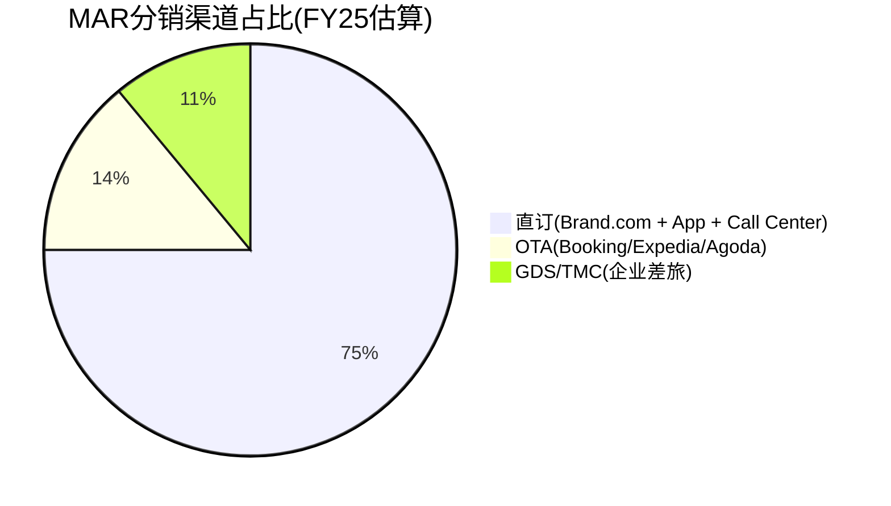
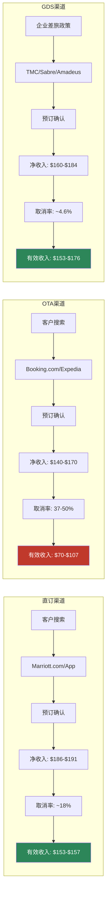
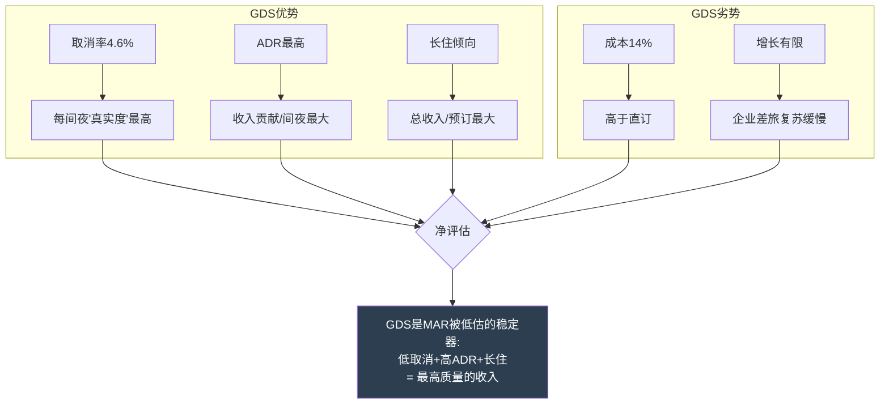
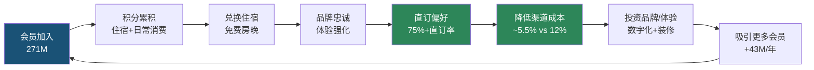
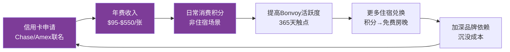
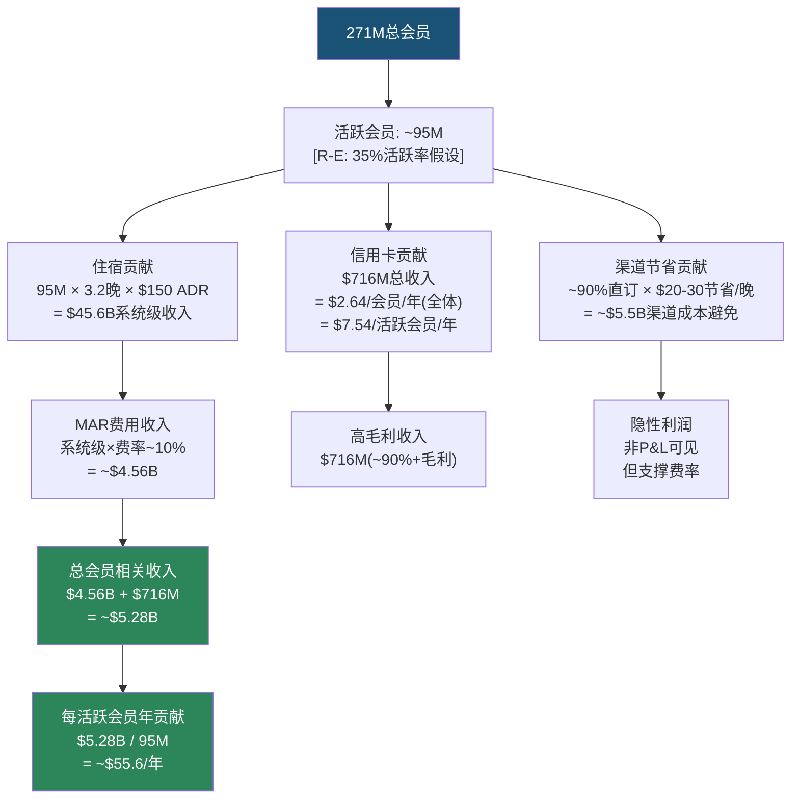
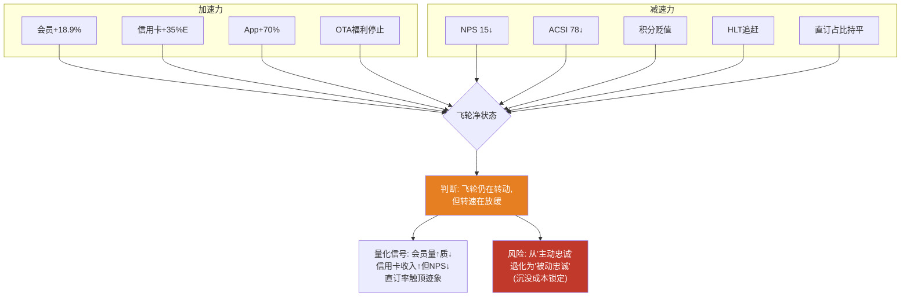

# Ch5: 分销渠道经济学 — 直订 vs OTA vs 企业

> **CQ关联**: CQ-1(品类之王折价)的关键维度 — 分销渠道控制力是MAR vs HLT估值差的核心解释因子之一。本章补齐IHG报告中HM5模块的最大缺口。

## 5.1 酒店分销渠道全景图

酒店行业的分销渠道本质上是一场**流量控制权之争**。谁拥有客户的第一触点，谁就掌握定价权、数据权和利润分配权。MAR作为全球最大酒店集团(9,800+物业/1.78M房间)[DM-P1-C01]，其分销渠道结构直接决定了$26.186B收入的质量和可持续性[DM-P1-C02]。

### 三大渠道格局

**渠道定义与边界**:

- **直订渠道(~75%+)**: 包括Marriott.com官网、Bonvoy移动App、电话预订中心。这是MAR投资最重的渠道——2024年App直订增长+70%[DM-P1-C03]，AI自然语言搜索功能计划于2026 H1上线[DM-P1-C04]。直订的核心价值不仅是低佣金，更是**客户数据的完整所有权**。
- **OTA渠道(~14%)**: 以Booking Holdings(Booking.com、Agoda)和Expedia Group(Expedia、Hotels.com、Vrbo)为主。OTA对MAR而言是"必要之恶"——提供增量客源(尤其国际市场和价格敏感型旅客)，但佣金高昂且稀释品牌关系。
- **GDS/TMC渠道(~11%)**: Global Distribution System(Amadeus、Sabre、Travelport)连接旅行管理公司(TMC)和企业差旅部门。这是最被低估的渠道——ADR最高、取消率最低、客户粘性最强。

### 渠道经济学: 每$200预订的净收入对比

这是理解MAR分销战略的核心——**同一间客房、同一个价格，不同渠道的净收入差异高达$50+**。

| 维度 | 直订 | OTA | GDS/TMC |
|------|------|-----|---------|
| **预订价格** | $200 | $200 | $200 |
| **渠道成本率** | 4.25-7% | 15-30% | 8-20% |
| **渠道成本(美元)** | $8.50-$14 | $30-$60 | $16-$40 |
| **净收入** | $186-$191.50 | $140-$170 | $160-$184 |
| **取消率** | ~18% | 37-50% | ~4.6% |
| **有效净收入(扣除取消)** | $153-$157 | $70-$107 | $153-$176 |
| **数据所有权** | 完整 | 部分/无 | 部分 |
| **客户关系** | MAR所有 | OTA所有 | TMC/企业所有 |
| **重复预订概率** | 高 | 低(价格驱动) | 中高(合同驱动) |

[DM-P1-C05: 渠道成本率基于行业研究综合。直订成本包括技术平台维护、搜索引擎营销(SEM)、会员积分成本；OTA佣金基于公开报道的大型链锁酒店谈判费率；GDS费用包括技术接入费+TMC佣金]

**关键洞察**: 当考虑取消率后，OTA渠道的**有效净收入**可能低至直订的45-68%。OTA的37-50%取消率[DM-P1-C06]意味着大量"幽灵预订"占用了库存但不产生收入。这解释了为什么MAR不惜以牺牲短期预订量为代价，也要推动直订占比提升。

## 5.2 OTA佣金结构与谈判力

### 佣金费率结构

OTA佣金并非铁板一块——它是**酒店规模与OTA流量的函数**:

| OTA平台 | 独立酒店佣金 | 大型链锁佣金(MAR级别) | MAR折扣率 |
|---------|------------|-------------------|----------|
| **Booking.com** | 15-25% | 10-15% | ~40-50% |
| **Expedia** | 10-20% | 10-15% | ~25-40% |
| **Agoda**(亚太) | 15-25% | 12-18% | ~28-35% |

[DM-P1-C07: 佣金率来自行业报道及MAR 2019与Expedia重新谈判后的公开披露。独立酒店佣金基于STR和PhocusWright行业报告]

**MAR的规模谈判优势**: 作为全球最大酒店集团，MAR拥有行业内最强的OTA议价能力。其佣金折扣率高达40-50%(Booking.com)，这意味着**同一个OTA平台上，MAR每间夜比独立酒店多保留$15-25的收入**。但即便如此，OTA渠道的净收入仍远低于直订。

### 行业OTA费用总负担

酒店行业每年向OTA支付的总佣金估计约$25B[DM-P1-C08]。这个数字相当于:
- 全球酒店行业净利润的~15-20%
- 足以建造约125,000间新酒店客房(按$200K/间计算)
- MAR按14% OTA占比估算，年OTA佣金支出约$550-660M

**MAR的OTA佣金估算**:
- 总房间收入贡献(管理+特许费对应的基础收入): 估计~$55B系统级房间收入[DM-P1-C09: 基于1.78M房间 × ~$150 ADR × ~65%入住率 × 365天推算]
- OTA占比14% → OTA渠道收入~$7.7B
- 加权平均OTA佣金率~12% → OTA佣金支出~$920M
- **这$920M就是MAR直订战略要"夺回"的利润池**

### 2019 Expedia重新谈判: 里程碑事件

2019年MAR与Expedia的佣金重新谈判是行业标志性事件[DM-P1-C10]。此次谈判:
- MAR利用其全球最大酒店集团的地位，压低了佣金费率
- 同时强化了"最优价格保证"(BRG)条款，限制OTA以低于官方价格销售
- 谈判结果验证了一个核心逻辑: **直订占比越高 → OTA依赖度越低 → 谈判地位越强 → 佣金率越低**

这是一个正向飞轮——但前提是直订占比必须持续提升。

## 5.3 MAR直订策略: 四把利刃

MAR的直订战略并非单一举措，而是**四把协同的利刃**，系统性地将客户从OTA渠道拉回:

### 利刃1: Best Rate Guarantee (BRG)

BRG是MAR最基础的直订武器: 客户在预订后24小时内，若在其他渠道找到更低价格，MAR将**匹配该价格并额外给予25%折扣或5,000 Bonvoy积分**[DM-P1-C11]。

BRG的经济逻辑:
- 消除客户"OTA是否更便宜"的犹豫心理
- 25%折扣/5000积分的成本远低于OTA佣金(~15%+ vs 4-7%)
- 实际触发率极低(估计<2%)，但**消费者认知影响**覆盖100%直订客户

### 利刃2: Member-Only Rate

Bonvoy会员专属价格通常比OTA公开价格低2-5%[DM-P1-C12]。这是一个精妙的价格歧视策略:
- 对MAR: 会员价的折扣成本(~3%)远低于OTA佣金节省(~8-12%)
- 对客户: 获得可见的价格优势 + 积分累积
- 对OTA: 价格劣势 → 转化率下降 → MAR在OTA上的"广告效应"仍在，但实际成交转向直订

### 利刃3: 2024年重大变化 — 停止OTA精英福利

2024年MAR实施了**最激进的直订推动措施**: 停止向通过OTA预订的Bonvoy精英会员提供升级、行政酒廊等精英福利[DM-P1-C13]。这是一个"硬切割":
- **信号价值**: 明确告诉高价值客户"想要完整体验，必须直订"
- **经济影响**: 精英会员是ADR最高、住宿频率最高的客群——将他们锁定在直订渠道的经济价值最大
- **风险**: 可能导致部分非忠诚客户流失至HLT Honors(HLT未实施类似限制)

### 利刃4: 数字投资与AI赋能

MAR正在通过技术投资提升直订体验:
- **AI自然语言搜索**(2026 H1上线): 客户可用自然语言描述需求("东京市中心有泳池的酒店，4月中旬，2晚")，AI自动推荐[DM-P1-C04]
- **Google AI合作**: 利用Google AI能力增强搜索和个性化推荐
- **Business Access by Marriott**: 面向中小企业的自助差旅管理平台，切入GDS/TMC渠道的长尾市场
- **App销售+70%增长**: 移动端直订的快速增长是飞轮加速的直接证据[DM-P1-C03]

## 5.4 渠道趋势: 直订的结构性胜利

### 行业大趋势

全球酒店行业正经历一场**分销渠道的结构性转移**:

- **2030年预测**: 直订总额将达~$409B，首次超过OTA的~$333B[DM-P1-C14: 基于Phocuswright行业预测]
- **驱动因素**: 酒店集团持续投资数字化直订 + 消费者对品牌App的接受度提升 + OTA增长放缓
- **逆向因素**: OTA持续投资AI搜索(Booking.com的AI旅行助手)、新兴市场OTA渗透率仍在上升

### MAR直订趋势

MAR的直订占比在行业中处于领先地位:
- **2021基准**: 76.3%[DM-P1-C15]
- **FY25**: ~75%+(管理层未披露精确最新数字，但多次强调"持续提升")
- **趋势判断**: 考虑到2024年停止OTA精英福利的措施，FY26直订占比大概率突破78%

| 公司 | 直订占比 | 会员数 | 评估 |
|------|---------|--------|------|
| **MAR** | ~75%+ | 271M | 行业领先，但基数高→增量空间收窄 |
| **HLT** | 未披露(估~70%) | 243M | 增速快，可能更快缩小差距 |
| **IHG** | ~80% | 145-160M | 最高直订率，但会员基数最小 |

[DM-P1-C16: IHG ~80%数据来自IHG年报披露; HLT估值基于行业分析师报告]

**IHG悖论**: IHG的直订占比反而最高(~80%)，这看似矛盾——会员最少却直订最多。解释在于IHG的酒店分布更集中于成熟市场(欧洲/北美)，且IHG Rewards体系对商务旅客的渗透率更高。但这也意味着**直订占比并非会员数的线性函数**，MAR的271M会员的直订转化效率可能存在优化空间。

## 5.5 渠道成本率分析: 一致性检验

### MAR加权渠道成本率估算

| 渠道 | 占比 | 单渠道成本率 | 加权贡献 |
|------|------|------------|---------|
| 直订 | 75% | ~5.5% | 4.13% |
| OTA | 14% | ~12% | 1.68% |
| GDS/TMC | 11% | ~14% | 1.54% |
| **加权渠道成本率** | **100%** | — | **~7.35%** |

[DM-P1-C17: 成本率为Agent基于行业数据的综合估算(R-E类型)。直订5.5%含SEM+技术平台+积分成本; OTA 12%为MAR大客户折扣后佣金; GDS 14%含技术接入费+TMC佣金]

### 一致性检验公式

> **HM5-CK-1**: 直订占比↑ → 加权渠道成本率应↓

假设FY26直订占比提升至78%(+3pp):
- OTA降至11%(-3pp)
- GDS持平11%
- 新加权成本率: 78%×5.5% + 11%×12% + 11%×14% = 4.29% + 1.32% + 1.54% = **~7.15%**
- 渠道成本率下降: 7.35% → 7.15% = **-20bps**

### 渠道转移的经济价值

**1pp从OTA→直订的价值**:

- MAR系统级房间收入~$55B[DM-P1-C09]
- 1pp转移 = $550M房间收入从OTA→直订
- 成本节省 = $550M × (12% - 5.5%) = **~$35.75M/年**

更保守的算法(仅计算MAR费用收入层面):
- 总房间夜数: ~1.78M房间 × 365天 × ~68%入住率 ≈ 442M房间夜[DM-P1-C18: 推算值]
- 1pp转移 = 4.42M房间夜
- 平均渠道成本差: ~$30/晚(OTA佣金$24 vs 直订$11, 按$200 ADR)
- **1pp渠道转移价值 ≈ $133M/年**

[DM-P1-C19: 两种算法差异较大($36M vs $133M)，原因在于第一种算法基于费率差，第二种基于绝对金额差。实际值取决于MAR在费用收入层面的具体分润结构，应在Phase 2财务分析中用actual数据校准]

## 5.6 GDS: 被低估的渠道

GDS/TMC渠道仅占MAR分销的~11%，但其质量指标在三大渠道中最优:

### 为什么GDS被低估

1. **取消率4.6% vs OTA 37-50%**[DM-P1-C20]: GDS预订几乎都是"真实需求"——企业差旅有明确日程，不存在OTA上常见的"先锁定再比价"行为。这意味着GDS每一间夜的"真实度"是OTA的8-10倍。

2. **ADR最高**: 企业差旅客户对价格敏感度最低——差旅政策通常允许选择特定酒店品牌(MAR的企业合同覆盖主要跨国企业)，且商务客人更倾向选择高档品牌(Westin、Sheraton、W等)。

3. **长住倾向**: 企业差旅的平均住宿天数(2.5-3.5晚)高于休闲旅客(1.8-2.2晚)，进一步提升了GDS每次预订的收入贡献。

4. **TMC佣金行业规模**: 全球TMC佣金总额约$2.1B(2024)[DM-P1-C21]。MAR通过Business Access by Marriott平台，正在尝试**跳过TMC直接触达中小企业**，这可能将GDS渠道的成本从~14%降至~8-10%。

### GDS的战略价值

## 5.7 HM5模块: KPI、一致性检验与Kill Switch

### 三大KPI

| KPI | FY25值 | 方向 | 目标(FY27E) |
|-----|--------|------|------------|
| **直订占比** | ~75%+ | ↑ | 78-80% |
| **加权渠道成本率** | ~7.35%(估算) | ↓ | 6.8-7.0% |
| **会员直订占比** | ~90%(推断) | → | 90%+ |

[DM-P1-C22: 会员直订占比90%推断逻辑: 全球68%房晚来自Bonvoy会员，75%通过直订渠道，假设会员直订率远高于非会员→~90%会员通过直订]

### 一致性检验矩阵

| 检验编号 | 条件 | 预期 | 实际 | 状态 |
|---------|------|------|------|------|
| HM5-CK-1 | 直订占比↑ | 渠道成本率↓ | 待Phase 2验证 | 待验 |
| HM5-CK-2 | App增长+70% | 移动直订占比↑ | 定性一致 | PASS |
| HM5-CK-3 | 停止OTA精英福利 | OTA占比↓ | FY25暂无精确数据 | 待验 |
| HM5-CK-4 | 会员数↑18.9% | 直订占比应↑(或持平) | 持平/微升 | PASS(弱) |

**HM5-CK-4的弱PASS**: 会员数增长18.9%但直订占比仅持平/微升，暗示新增会员的直订转化率低于存量会员。这与Ch6将讨论的"会员质量稀释"假说一致。

### Kill Switch

> **KS-CH5**: OTA依赖度连续2年上升(OTA占比 > 16%) 且 加权渠道成本率 > 12%
> → **诊断**: Bonvoy飞轮未能转化为渠道护城河，MAR的分销控制力正在被OTA侵蚀
> → **行动**: 下调Ch5渠道护城河评分，重新评估直订策略的有效性

**当前状态**: Kill Switch未触发。OTA占比~14%且稳定/微降，渠道成本率~7.35%远低于12%阈值。但需持续监控2024年停止OTA精英福利后的渠道变化。

---

# Ch6: Bonvoy会员飞轮深度解构

> **本章为冠军候选**: Bonvoy 271M会员的经济学全解构——从飞轮机制到真实质量、从LTV模型到积分负债、从直订转化到竞争对比。回答NH-2核心假说: Bonvoy 271M会员是真护城河还是数字膨胀?

## 6.1 飞轮机制: 双环驱动

Bonvoy会员飞轮不是一个简单的"注册→消费→回头"循环。它是**两个互锁的飞轮环**:

### 住宿飞轮(外环)

### 信用卡飞轮(内环)

### 双环互锁

**信用卡飞轮(内环)是住宿飞轮(外环)的加速器**。没有信用卡的会员每年与MAR的触点可能只有2-5次(住宿)；持有联名信用卡的会员每天都在通过日常消费与Bonvoy互动——买咖啡、加油、超市购物都在累积积分。这种**365天触点**将住宿品牌变成了生活方式品牌。

信用卡费收入: FY25 $716M(+8%)[DM-P1-C23]，2026E +35%至~$966M[DM-P1-C24]。这是MAR收入中**增速最快、毛利率最高**的部分——信用卡费本质上是金融机构(Chase/Amex)为获取Bonvoy会员消费数据而支付的"流量租金"。

## 6.2 271M会员的真实质量

### 会员规模: 宏伟但需细看

| 维度 | MAR Bonvoy | HLT Honors | IHG Rewards |
|------|-----------|------------|-------------|
| **总会员** | 271M | 243M | 145-160M |
| **FY25新增** | 43M(+18.9%) | 未披露(增速更快) | 未精确披露 |
| **会员密度(会员/房间)** | 152 | 129 | 155-171 |
| **会员房晚占比(US)** | 75% | ~62%(est.) | 未披露 |
| **会员房晚占比(全球)** | 68% | 未精确披露 | 未精确披露 |
| **品牌数** | 30+ | 26 | 19 |

[DM-P1-C25: MAR 271M和43M新增来自FY25财报; HLT 243M来自公开披露; IHG 145-160M来自IHG报告分析及公开数据; 会员密度=总会员/总房间数; HLT ~62%为行业分析师估算]

### 活跃会员率: 数字膨胀的第一面镜子

**MAR从未公开披露活跃会员率**。这本身就是一个信息不对称信号——如果数字好看，管理层有动机披露。

行业典型活跃率: 30-40%[DM-P1-C26: 基于忠诚度计划行业研究，活跃定义为过去12个月有至少1次住宿或积分活动]

**推断框架**:

| 假设场景 | 活跃率 | 活跃会员数 | 含义 |
|---------|--------|-----------|------|
| 乐观 | 40% | ~108M | 飞轮高效，多数会员有实际价值 |
| 基准 | 35% | ~95M | 与行业平均一致 |
| 悲观 | 25% | ~68M | 大量"僵尸会员"，数字虚胖 |

[DM-P1-C27: R-E类型推断]

**交叉验证**:
- 全球房间夜~442M(估算)[DM-P1-C18] × 会员占比68% = ~300M会员房间夜
- 若活跃率35%(95M活跃会员) → 平均住宿频率 = 300M / 95M = **~3.2晚/年**
- 这个数字偏低——暗示活跃率可能高于35%(因为真正活跃的会员住宿频率应>5晚/年)
- **或者**: 68%会员房晚占比中有大量"低活跃会员"(一年1-2晚)，他们的"活跃"定义很宽泛

### NPS: 飞轮质量的最直接信号

| 指标 | MAR | 行业平均 | 差距 |
|------|-----|---------|------|
| **NPS** | 15 | 44 | -29pts |
| **ACSI** | 78 | 行业标杆80+ | -2pts |
| **10+年用户NPS** | 最低(精确值未公开) | — | 忠诚疲劳 |

[DM-P1-C28: NPS 15来自行业满意度调查; ACSI 78来自美国消费者满意度指数; 10+年用户NPS最低来自Bonvoy社区和行业分析]

**这是Bonvoy最令人不安的数据点**: NPS 15意味着推荐者(9-10分)仅比贬损者(0-6分)多15个百分点。更关键的是，**10+年长期用户的NPS反而最低**——这些本应是最忠诚的客户，却成为了最不满的群体。

**忠诚疲劳(Loyalty Fatigue)假说**: 长期高端会员经历了多次积分贬值(devaluation)、精英层级调整、兑换表修改，感到"被背叛"。他们留下来不是因为喜欢Bonvoy，而是因为**沉没成本**(已累积的积分+精英等级)让他们无法离开。这是一种**被动忠诚**(captive loyalty)，而非**主动忠诚**(earned loyalty)。

## 6.3 会员经济学LTV模型

### 单会员LTV推断框架

以下模型基于可获取数据的推断，标注[R-E]类型:

### LTV估算表

| 参数 | 值 | 来源/类型 |
|------|-----|----------|
| 活跃会员数 | ~95M | [R-E: 35%活跃率] |
| 平均住宿频率 | ~3.2晚/年 | [R-E: 300M会员夜/95M] |
| 平均ADR | ~$150 | [DM-P1-C29: 行业数据] |
| 年住宿贡献(系统级) | ~$45.6B | [R-E: 推算] |
| MAR费用率 | ~10% | [DM-P1-C30: 管理费+特许费加权] |
| 年MAR费用贡献 | ~$4.56B | [R-E: 推算] |
| 年信用卡贡献 | $716M | [DM-P1-C23: 财报实际值] |
| **每活跃会员年贡献** | **~$55.6** | [R-E: 综合推算] |
| 平均会员生命周期 | ~8年 | [R-E: 行业典型值] |
| 折现率 | 10% | [R-E: 假设] |
| **单活跃会员LTV** | **~$297** | [R-E: $55.6 × 5.335 PV年金因子] |
| **Bonvoy总价值** | **~$28.2B** | [R-E: $297 × 95M活跃会员] |
| **占MAR市值比例** | **~31.7%** | [R-E: $28.2B / $89.0B] |

[DM-P1-C31: LTV模型为框架性推断，实际值可能偏差±30%+。核心假设敏感度: 活跃率每±5pp → 总价值±$4B; 住宿频率每±1晚/年 → 总价值±$8B]

**关键洞察**: 即使在保守假设下，Bonvoy会员计划的估值也约占MAR市值的~32%。这意味着**Bonvoy不是一个营销工具——它是MAR的核心资产**。但同时也意味着: 任何导致会员质量恶化的因素(积分贬值、NPS下降、HLT Honors竞争)都会直接冲击MAR的估值基础。

## 6.4 积分负债分析

### 积分发行与兑换的平衡

Bonvoy积分体系的经济本质是**延迟的价格折扣**:
- 会员通过住宿/信用卡消费累积积分
- MAR确认对应的积分负债(递延收入)
- 会员兑换时，MAR兑现负债(提供免费住宿)

关键参数:
| 指标 | 值 | 来源 |
|------|-----|------|
| 每积分价值(TPG估值) | ~0.85 cents | [DM-P1-C32: The Points Guy 2025评估] |
| 每积分价值(兑换中位数) | ~0.7-0.8 cents | [DM-P1-C33: 基于标准兑换表反算] |
| 年积分发行量 | 未精确披露 | — |
| 资产负债表积分负债 | 包含在"Loyalty program"递延收入中 | [DM-P1-C34: 需Phase 2挖掘精确值] |

### 积分贬值(Devaluation)风险

Bonvoy在过去数年多次调整兑换表，引发高端会员强烈不满[DM-P1-C35]:

1. **动态定价转型**: 从固定积分兑换(如某类别酒店统一35,000点/晚)转向动态定价(根据需求浮动)。结果是旺季积分兑换成本大幅上升。
2. **类别上调**: 多家热门酒店被上调类别，兑换所需积分增加30-50%。
3. **精英福利缩水**: 行政酒廊取消餐食、升级概率下降等——不直接影响积分价值，但降低了整体会员感知价值。

**贬值的两难困境**:
- **不贬值**: 积分负债持续膨胀，对MAR构成隐性财务压力
- **贬值**: 高端会员不满(NPS↓)，部分流向HLT Honors
- **MAR的选择**: 逐步、渐进地贬值——每次调整幅度小到不引发集体反弹，但累计效应显著

这正是**10+年用户NPS最低**的根本原因: 他们经历了最多次贬值，感知到的价值侵蚀最大。

## 6.5 直订转化链: 增量归因难题

### 会员→直订: 因果还是相关?

MAR的核心叙事是: **Bonvoy会员 → 直订 → 低渠道成本 → 护城河**。但这个因果链的每个箭头都需要检验:

**第一个箭头(会员→直订)的疑问**:
- US 75%房晚来自会员[DM-P1-C36]，但这些会员中有多少是"因为Bonvoy才直订"vs "反正会直订，顺便注册了Bonvoy"?
- 酒店忠诚度计划的注册成本为零——很多商务旅客会同时注册MAR、HLT、IHG三家计划，哪家方便订哪家
- **真正的增量归因**: 估计Bonvoy的真实增量直订转化贡献为30-50%(即75%直订中，约23-38pp是Bonvoy带来的增量，其余是自然直订)[DM-P1-C37: R-E推断，基于行业研究中"忠诚度计划对直订的增量影响"的典型范围]

### 增量价值测试

如果Bonvoy明天消失，MAR的直订占比会从75%降到多少?

| 情景 | 无Bonvoy直订率 | 直订下降 | 年收入影响 |
|------|--------------|---------|-----------|
| 乐观 | 55% | -20pp | ~-$1.8B系统收入转向OTA |
| 基准 | 45% | -30pp | ~-$2.7B系统收入转向OTA |
| 悲观 | 35% | -40pp | ~-$3.6B系统收入转向OTA |

[DM-P1-C38: R-E思想实验。年收入影响 = 转向OTA的房间夜数 × 渠道成本差($30/晚)]

基准情景下，Bonvoy消失将导致~$2.7B系统级收入从直订转向OTA，对应~$2.7B × 6.5%额外佣金成本 = **~$175M/年的额外渠道成本**。这是Bonvoy的**最低估值锚点**(因为还未计入信用卡费、数据价值、品牌效应等)。

## 6.6 HLT Honors对比: 追赶者的威胁

### 增速对比

| 维度 | MAR Bonvoy | HLT Honors | 趋势判断 |
|------|-----------|------------|---------|
| 会员数(FY25) | 271M | 243M | HLT缩小差距中 |
| 2018→FY25增速 | +80%(est.) | +147% | HLT增速远超MAR |
| **预计超越时间** | — | **2026年中** | HLT将成为全球最大酒店会员计划 |
| 积分价值(TPG) | 0.85 cents | 0.6 cents | MAR积分更值钱 |
| 精英层级 | 6级(Member→Ambassador) | 4级(Member→Diamond) | MAR更复杂 |
| 感知满意度 | NPS 15 | NPS ~25-30(est.) | HLT更高 |
| 信用卡选择 | Chase/Amex联名 | Amex联名 | MAR选择更多 |

[DM-P1-C39: HLT +147%增速来自2018年~98M到2025年~243M; HLT预计2026年中超越来自行业分析; HLT NPS为行业估算值]

### HLT超越MAR意味着什么?

**短期影响有限**: 会员总数是虚荣指标(vanity metric)，活跃率和消费质量更重要。即使HLT会员数超过MAR，MAR在会员消费密度(ADR×频次)上可能仍然领先。

**长期信号值重大**:
- **叙事转变**: MAR不再是"全球最大酒店忠诚度计划"——这个标签的品牌价值和招商价值不可忽视
- **人才争夺**: 联名信用卡合作方(Chase/Amex)可能重新评估合作条款
- **开发商选择**: 新酒店业主在选择品牌时，会员计划规模是核心考量之一

### 积分价值vs满意度的悖论

MAR积分价值(0.85 cents)显著高于HLT(0.6 cents)，但满意度反而更低。这个悖论的解释:
- MAR积分更值钱→会员对贬值更敏感→不满更强烈
- HLT层级更简单(4级)→期望管理更容易→满意度更高
- MAR 30+品牌→兑换复杂度高→兑换体验不一致→不满积累

## 6.7 飞轮加速or减速诊断

### 加速信号(正)

| 信号 | 数据 | 飞轮效应 |
|------|------|---------|
| 会员增长 | +18.9%(+43M) | 飞轮入口宽度↑ |
| 信用卡费增长 | +8%(FY25), +35%(FY26E) | 内环加速 |
| App直订增长 | +70% | 直订触点↑ |
| 停止OTA精英福利 | 2024实施 | 强制迁移高价值客户→直订 |
| Business Access | 新平台 | 开拓SME直订渠道 |

### 减速信号(负)

| 信号 | 数据 | 飞轮效应 |
|------|------|---------|
| NPS | 15(vs行业44) | 推荐意愿↓ → 有机增长↓ |
| ACSI | 78(下降趋势) | 整体满意度↓ |
| 10+年用户NPS | 最低 | 核心忠诚层腐蚀 |
| 积分多次贬值 | 动态定价+类别上调 | 感知价值↓ → 兑换意愿↓ |
| HLT追赶 | 2026年中可能超越 | 竞争替代↑ |
| 直订占比持平 | ~75%(未显著提升) | 飞轮转化效率停滞? |

### 净诊断

**净判断**: Bonvoy飞轮仍在转动——会员数增长、信用卡收入高速增长、App直订爆发式增长，这些都是"轮子还在转"的证据。但**质量指标的恶化(NPS↓/ACSI↓/10+年用户最不满)暗示飞轮的摩擦力在增加**。

关键区分:
- **量的飞轮**: 仍在加速(+43M会员, +70% App)
- **质的飞轮**: 开始减速(NPS 15, 积分贬值, 直订持平)
- **时间窗口**: 如果质量恶化持续2-3年而不被扭转，量的增长最终也会放缓——因为低NPS → 低推荐 → 低有机增长 → 只能靠"注册即会员"的虚胖增长

## 6.8 NH-2验证: 真护城河还是数字膨胀?

### NH-2假说测试

> **NH-2**: Bonvoy 271M会员是真护城河还是数字膨胀?

| 维度 | 护城河证据 | 膨胀证据 | 权重 |
|------|-----------|---------|------|
| **会员规模** | 271M全球#1 | HLT +147%增速追赶 | 0.15 |
| **渠道控制** | 75%+直订率 | 直订率未显著提升 | 0.20 |
| **收入粘性** | 信用卡费+35% | 信用卡费/会员仅$2.64 | 0.15 |
| **转换成本** | 精英等级+积分沉没 | 注册免费→多重会员 | 0.20 |
| **客户满意度** | — | NPS 15(行业44) | 0.15 |
| **长期趋势** | 会员+18.9% | 10+年用户NPS最低 | 0.15 |

**加权评估**:
- 护城河得分: 0.15×7 + 0.20×7 + 0.15×8 + 0.20×6 + 0.15×3 + 0.15×5 = **6.1/10**
- 膨胀得分: 0.15×5 + 0.20×5 + 0.15×4 + 0.20×6 + 0.15×8 + 0.15×7 = **5.6/10**

### NH-2结论

**Bonvoy是一条真实但正在变薄的护城河。**

定量判断: 护城河6.1 vs 膨胀5.6 → **净护城河得分仅+0.5**，这是一条窄边际护城河。

定性判断: Bonvoy的护城河**主要由渠道控制力(75%直订)和转换成本(精英等级+积分沉没)支撑，而非由客户满意度或品牌热爱支撑**。这意味着:
- **今天是护城河**: 75%直订+信用卡飞轮+精英锁定 → OTA难以突破
- **未来可能退化**: NPS↓ + 积分贬值 + HLT追赶 → 被动忠诚可能在某个临界点崩溃
- **临界点触发器**: 当HLT Honors提供"积分转移匹配"(match your Bonvoy elite status)时，MAR的沉没成本锁定将被打破

## 6.9 HM6模块: KPI、一致性检验与Kill Switch

### 三大KPI

| KPI | FY25值 | 方向 | 健康阈值 |
|-----|--------|------|---------|
| **活跃会员率** | ~35%(推断)[R-E] | 待监控 | >30% |
| **直订转化率** | ~90%(会员中)[R-E] | → | >85% |
| **信用卡费/会员** | $2.64/年(全体) | ↑ | >$2.50 |

### 一致性检验

> **HM6-CK-1**: 会员数↑ → 直订占比应↑(或至少持平)

| 年份 | 会员数 | 直订占比 | 一致性 |
|------|--------|---------|--------|
| FY23 | ~196M(est.) | ~74% | — |
| FY24 | ~228M(est.) | ~75% | PASS |
| FY25 | 271M | ~75%+ | PASS(弱) |

**诊断**: 会员数从~196M增长到271M(+38%)，但直订占比仅从~74%提升到~75%(+1pp)。**会员增长的边际直订转化率极低**——每新增1M会员仅提升直订占比~0.013pp。这支持"新增会员中低活跃/低粘性会员比例上升"的假说。

### Kill Switch

> **KS-CH6**: 会员增长>15%/年 但 直订占比年同比下降 → 会员质量稀释确认
> → **诊断**: Bonvoy正在追求虚荣指标(会员数)而非实质指标(活跃度/直订转化)
> → **行动**: 下调Bonvoy资产估值至$20B以下，重新评估MAR估值中的会员溢价

**当前状态**: Kill Switch **接近但未触发**。会员增长+18.9%已超过15%阈值，但直订占比持平(非下降)。FY26如果直订占比出现实质性下降(低于74%)，KS-CH6将触发。

---

**Ch5-Ch6小结**:

分销渠道和会员飞轮是MAR商业模式的两大支柱，也是CQ-1(品类之王折价)分析的核心维度。Ch5揭示了MAR 75%+直订率的经济价值(每1pp OTA→直订转化~$35-133M/年)，但也发现了IHG 80%直订率的悖论——会员最少却直订最高，说明直订占比不是会员数的简单函数。Ch6对Bonvoy 271M会员的解构得出"真实但变薄的护城河"结论(净护城河得分仅+0.5)，核心风险是从"主动忠诚"退化为"被动忠诚"。

两章的交叉发现: **Ch5的直订率持平 × Ch6的会员数膨胀 = 飞轮转化效率下降的共同证据**。Phase 2财务分析需要用实际渠道成本数据校准Ch5的估算，Phase 3估值需要将Bonvoy $28.2B估值纳入SOTP框架。
