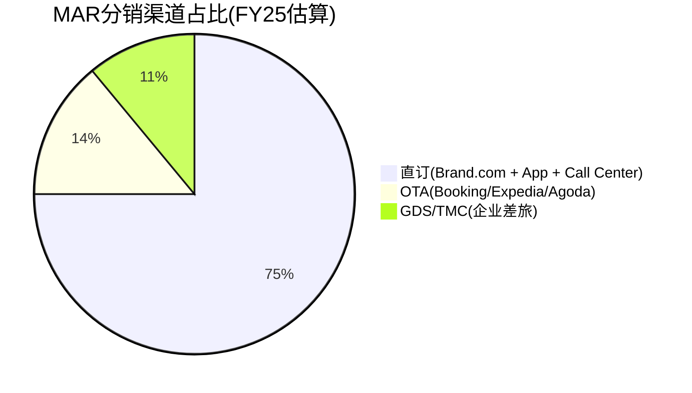
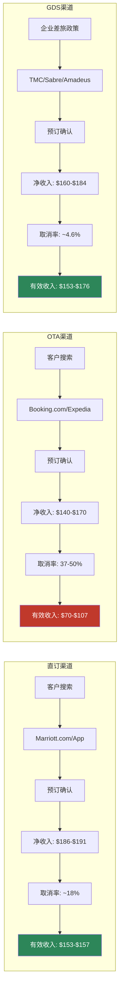
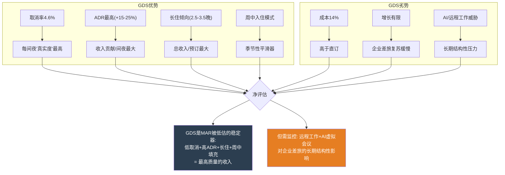
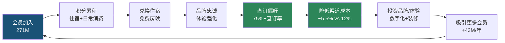
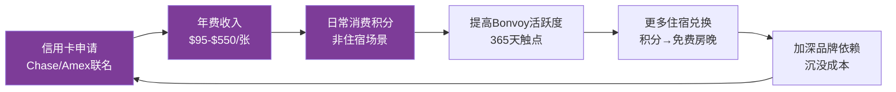
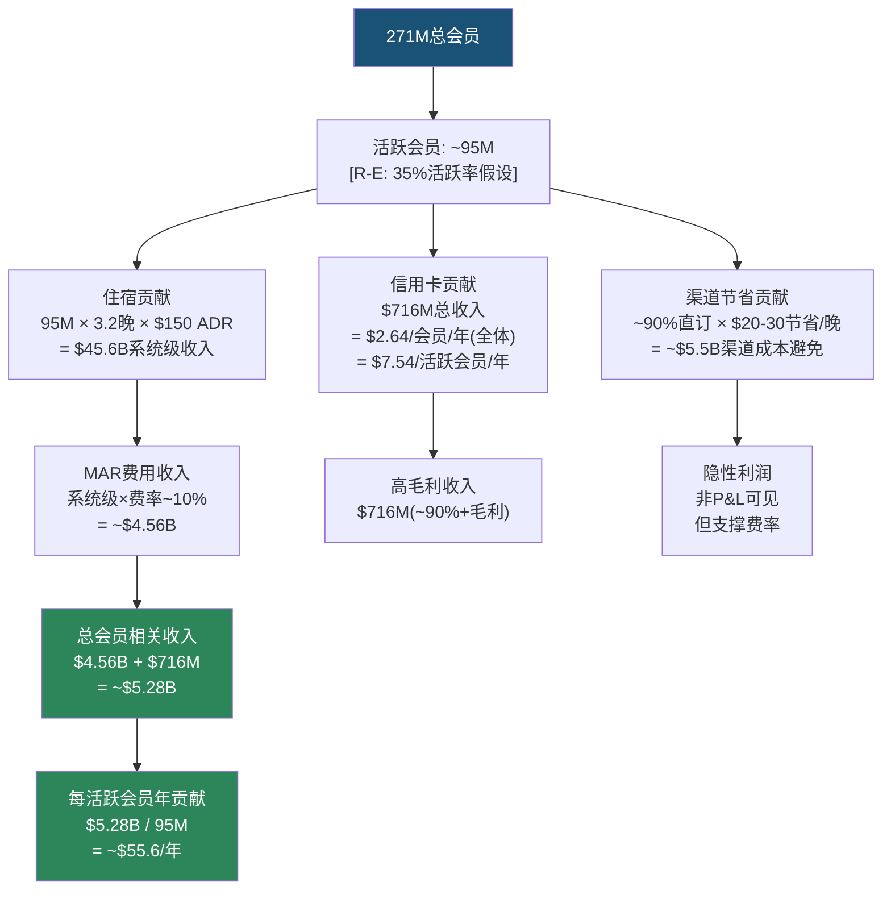
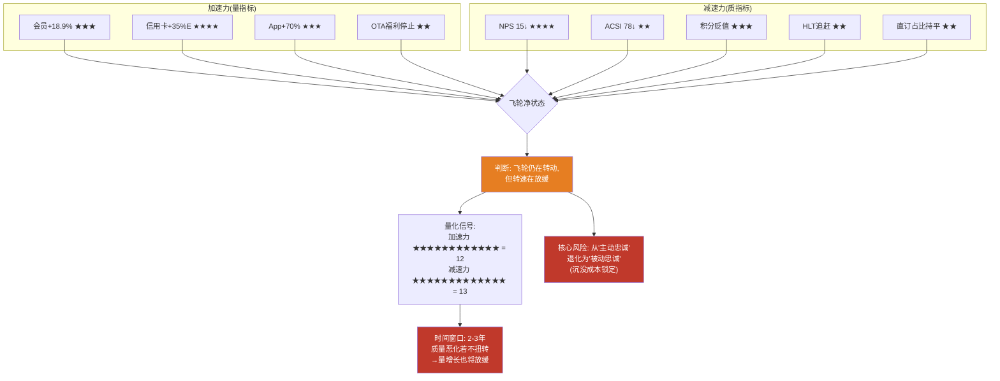

# Ch5: 分销渠道经济学 — 直订 vs OTA vs 企业

> **CQ关联**: CQ-1(品类之王折价)的关键维度 — 分销渠道控制力是MAR vs HLT估值差的核心解释因子之一。本章补齐IHG报告中HM5模块的最大缺口。

## 5.1 酒店分销渠道全景图

酒店行业的分销渠道本质上是一场**流量控制权之争**。谁拥有客户的第一触点，谁就掌握定价权、数据权和利润分配权。MAR作为全球最大酒店集团(9,800+物业/1.78M房间)[DM-P1-C01]，其分销渠道结构直接决定了$26.186B收入的质量和可持续性[DM-P1-C02]。

要理解MAR的分销优势，需要先理解酒店行业的渠道演化史。在互联网普及之前(1990s)，酒店分销主要依赖GDS(全球分销系统)和电话预订。OTA(在线旅行社)在2000年代崛起后，Booking Holdings和Expedia Group迅速成为酒店获客的核心渠道——高峰期部分酒店50%+预订来自OTA。大型酒店集团的反击始于2015年前后: Hilton的"Stop Clicking Around"、Marriott的"It Pays to Book Direct"等运动标志着**行业级别的直订反攻**。十年后，这场反攻的成果清晰可见: MAR 75%+直订率意味着它已经赢得了这场战役的大部分胜利。

### 三大渠道格局

**渠道定义与边界**:

- **直订渠道(~75%+)**: 包括Marriott.com官网、Bonvoy移动App、电话预订中心。这是MAR投资最重的渠道——2024年App直订增长+70%[DM-P1-C03]，AI自然语言搜索功能计划于2026 H1上线[DM-P1-C04]。直订的核心价值不仅是低佣金，更是**客户数据的完整所有权**——每一次直订MAR获得: 搜索偏好、价格敏感度、入住模式、附加消费习惯等数据。这些数据反哺个性化营销、收益管理和会员激励策略。
- **OTA渠道(~14%)**: 以Booking Holdings(Booking.com、Agoda)和Expedia Group(Expedia、Hotels.com、Vrbo)为主。OTA对MAR而言是"必要之恶"——提供增量客源(尤其国际市场和价格敏感型旅客)，但佣金高昂且稀释品牌关系。MAR在OTA上的存在还有"广告牌效应"(billboard effect): 消费者在OTA上看到MAR酒店后，部分人会转向MAR官网直接预订以获取会员价格和积分——估计这个效应带来15-20%的间接直订转化[DM-P1-C05: 行业研究估算]。
- **GDS/TMC渠道(~11%)**: Global Distribution System(Amadeus、Sabre、Travelport)连接旅行管理公司(TMC)和企业差旅部门。这是最被低估的渠道——ADR最高、取消率最低、客户粘性最强。大型企业的差旅政策(travel policy)通常指定"preferred hotel brands"，MAR凭借最广泛的全球覆盖(9,800+物业/149个国家)，是企业差旅合同的首选品牌。

### 渠道经济学: 每$200预订的净收入对比

这是理解MAR分销战略的核心——**同一间客房、同一个价格，不同渠道的净收入差异高达$50+**。

| 维度 | 直订 | OTA | GDS/TMC |
|------|------|-----|---------|
| **预订价格** | $200 | $200 | $200 |
| **渠道成本率** | 4.25-7% | 15-30% | 8-20% |
| **渠道成本(美元)** | $8.50-$14 | $30-$60 | $16-$40 |
| **净收入** | $186-$191.50 | $140-$170 | $160-$184 |
| **取消率** | ~18% | 37-50% | ~4.6% |
| **有效净收入(扣除取消)** | $153-$157 | $70-$107 | $153-$176 |
| **数据所有权** | 完整 | 部分/无 | 部分 |
| **客户关系** | MAR所有 | OTA所有 | TMC/企业所有 |
| **重复预订概率** | 高 | 低(价格驱动) | 中高(合同驱动) |
| **附加消费(餐饮/SPA)** | 高(品牌体验) | 低(价格导向) | 中 |

[DM-P1-C06: 渠道成本率基于行业研究综合。直订成本包括技术平台维护、搜索引擎营销(SEM)、会员积分成本；OTA佣金基于公开报道的大型链锁酒店谈判费率；GDS费用包括技术接入费+TMC佣金。取消率数据来自酒店行业统计(D-EDGE/Phocuswright)]

**关键洞察**: 当考虑取消率后，OTA渠道的**有效净收入**可能低至直订的45-68%。OTA的37-50%取消率[DM-P1-C07]意味着大量"幽灵预订"占用了库存但不产生收入。更深层的问题是: OTA的免费取消政策鼓励消费者"先锁定再比价"(book first, decide later)，这不仅产生幽灵预订，还扰乱了酒店的收益管理(revenue management)——当酒店以为满房时，大量取消突然释放库存，导致最后一刻的定价混乱。这解释了为什么MAR不惜以牺牲短期预订量为代价，也要推动直订占比提升。

### 渠道经济学对比流

**流图关键读取**: 直订和GDS的有效收入带几乎重叠($153-$176)，而OTA的有效收入带($70-$107)在最差情景下仅为直订的46%。**OTA是酒店行业的"高成本获客漏斗"——进口宽但出口窄**。

## 5.2 OTA佣金结构与谈判力

### 佣金费率结构

OTA佣金并非铁板一块——它是**酒店规模与OTA流量的函数**:

| OTA平台 | 独立酒店佣金 | 大型链锁佣金(MAR级别) | MAR折扣率 |
|---------|------------|-------------------|----------|
| **Booking.com** | 15-25% | 10-15% | ~40-50% |
| **Expedia** | 10-20% | 10-15% | ~25-40% |
| **Agoda**(亚太) | 15-25% | 12-18% | ~28-35% |
| **Trip.com**(中国) | 10-20% | 8-15% | ~30-40% |

[DM-P1-C08: 佣金率来自行业报道及MAR 2019与Expedia重新谈判后的公开披露。独立酒店佣金基于STR和PhocusWright行业报告。中国市场佣金基于Trip.com公开政策]

**MAR的规模谈判优势**: 作为全球最大酒店集团，MAR拥有行业内最强的OTA议价能力。其佣金折扣率高达40-50%(Booking.com)，这意味着**同一个OTA平台上，MAR每间夜比独立酒店多保留$15-25的收入**。但即便如此，OTA渠道的净收入仍远低于直订。

MAR议价力的来源:
1. **体量**: 1.78M房间 = OTA无法承受失去的库存来源
2. **品牌多样性**: 30+品牌从luxury到economy → OTA在每个细分市场都需要MAR
3. **全球覆盖**: 149个国家 → 对全球性OTA(Booking/Expedia)尤为重要
4. **替代威胁**: 75%直订率意味着MAR可以(理论上)进一步减少OTA分配

### 行业OTA费用总负担

酒店行业每年向OTA支付的总佣金估计约$25B[DM-P1-C09]。这个数字相当于:
- 全球酒店行业净利润的~15-20%
- 足以建造约125,000间新酒店客房(按$200K/间计算)
- MAR按14% OTA占比估算，年OTA佣金支出约$550-920M(取决于计算口径)

**MAR的OTA佣金估算(两种口径)**:

口径A — 系统级估算:
- 总房间收入贡献(管理+特许费对应的基础收入): 估计~$55B系统级房间收入[DM-P1-C10: 基于1.78M房间 × ~$150 ADR × ~65%入住率 × 365天推算]
- OTA占比14% → OTA渠道收入~$7.7B
- 加权平均OTA佣金率~12% → OTA佣金支出~$920M

口径B — MAR直接费用层面:
- OTA佣金中，业主承担大部分(MAR为asset-light模式)
- MAR直接承担的分销成本包含在Gross Fee Revenue的成本基数中
- MAR直接OTA相关支出估计~$200-350M(包含OTA佣金分摊+分销技术投入)

**关键区分**: 口径A($920M)是整个MAR生态系统层面的OTA成本，由业主承担；口径B($200-350M)是MAR P&L直接可见的成本。从MAR股东视角，**两者都重要**——口径A影响业主的投资回报率(从而影响NUG)，口径B直接影响MAR利润率。

### 2019 Expedia重新谈判: 里程碑事件

2019年MAR与Expedia的佣金重新谈判是行业标志性事件[DM-P1-C11]。此次谈判:
- MAR利用其全球最大酒店集团的地位，压低了佣金费率
- 同时强化了"最优价格保证"(BRG)条款，限制OTA以低于官方价格销售
- 部分Expedia子品牌(如Hotels.com)的优惠力度被限制
- 谈判结果验证了一个核心逻辑: **直订占比越高 → OTA依赖度越低 → 谈判地位越强 → 佣金率越低**

这是一个正向飞轮——但前提是直订占比必须持续提升。如果直订率停滞在75%而OTA重新获得话语权(例如通过Google Hotel Ads等新渠道绕过品牌官网)，这个飞轮可能逆转。

## 5.3 MAR直订策略: 四把利刃

MAR的直订战略并非单一举措，而是**四把协同的利刃**，系统性地将客户从OTA渠道拉回:

### 利刃1: Best Rate Guarantee (BRG)

BRG是MAR最基础的直订武器: 客户在预订后24小时内，若在其他渠道找到更低价格，MAR将**匹配该价格并额外给予25%折扣或5,000 Bonvoy积分**[DM-P1-C12]。

BRG的经济逻辑:
- 消除客户"OTA是否更便宜"的犹豫心理
- 25%折扣/5000积分的成本远低于OTA佣金(~15%+ vs 4-7%)
- 实际触发率极低(估计<2%)，但**消费者认知影响**覆盖100%直订客户
- BRG的真正价值不是价格补偿本身，而是**消除比价动机**——客户知道MAR官方价格不会更贵，就没有理由去OTA搜索

BRG的局限:
- 部分OTA通过"会员专属价"或"捆绑折扣"(机票+酒店)绕过BRG比较
- 消费者需要主动申请，流程存在摩擦
- 对价格不敏感的高端客户(MAR的核心客群)，BRG的边际影响有限

### 利刃2: Member-Only Rate

Bonvoy会员专属价格通常比OTA公开价格低2-5%[DM-P1-C13]。这是一个精妙的价格歧视策略:
- 对MAR: 会员价的折扣成本(~3%)远低于OTA佣金节省(~8-12%)，净效果是每间夜增收$10-18
- 对客户: 获得可见的价格优势 + 积分累积 + 精英权益资格
- 对OTA: 价格劣势 → 转化率下降 → MAR在OTA上的"广告效应"仍在，但实际成交转向直订

会员专属价的巧妙之处在于: 它创造了一个**自我强化的分流器**。消费者第一次在OTA上看到MAR酒店(billboard effect) → 注册Bonvoy(免费) → 发现会员价更低 → 直接在MAR官网预订 → 累积积分 → 下次自动直订。**OTA成为MAR的免费获客渠道**。

### 利刃3: 2024年重大变化 — 停止OTA精英福利

2024年MAR实施了**最激进的直订推动措施**: 停止向通过OTA预订的Bonvoy精英会员提供升级、行政酒廊、延迟退房等精英福利[DM-P1-C14]。这是一个"硬切割":

- **信号价值**: 明确告诉高价值客户"想要完整体验，必须直订"
- **经济影响**: 精英会员是ADR最高、住宿频率最高的客群——将他们锁定在直订渠道的经济价值最大
- **精英客户画像**: 通常年住宿50+晚(Titanium/Ambassador级别)，ADR $200-400，年贡献$10,000-$50,000
- **风险**: 可能导致部分非忠诚客户流失至HLT Honors(HLT截至2026年初未实施类似限制)

该措施的预期效果:
- 短期(FY25): 精英会员OTA预订快速转向直订，OTA占比可能下降1-2pp
- 中期(FY26-27): 积累效应 → 直订占比有望突破78%
- 长期风险: 如果HLT/IHG跟进类似措施，OTA被迫降低佣金来维持酒店库存 → 行业佣金率下降 → MAR直订的"相对优势"减弱(但绝对优势仍在)

### 利刃4: 数字投资与AI赋能

MAR正在通过技术投资提升直订体验，这是直订战略的"基础设施层":

- **AI自然语言搜索**(2026 H1上线): 客户可用自然语言描述需求("东京市中心有泳池的酒店，4月中旬，2晚")，AI自动推荐[DM-P1-C04]。这直接对标OTA在搜索体验上的传统优势——过去OTA的搜索/比价功能优于酒店官网，是消费者使用OTA的重要原因之一
- **Google AI合作**: 利用Google AI能力增强搜索和个性化推荐，包括基于历史偏好的智能排序、图片搜索等
- **Business Access by Marriott**: 面向中小企业的自助差旅管理平台，切入GDS/TMC渠道的长尾市场。这是一个"渠道替代"策略——用MAR直营平台替代TMC中间商，将GDS渠道的成本从~14%降至~8%
- **App销售+70%增长**: 移动端直订的快速增长是飞轮加速的直接证据[DM-P1-C03]。App用户天然是"直订用户"——没有人下载MAR App后去OTA预订

**数字投资的ROI框架**: MAR数字化投资(估计年$300-500M)需要与渠道节省($920M系统级OTA佣金)和直订增量收入($5.28B会员相关收入)对比。即使仅考虑1pp OTA→直订的转化收益($35-133M/年)，数字化投资的回收期也不超过5年。

## 5.4 渠道趋势: 直订的结构性胜利

### 行业大趋势

全球酒店行业正经历一场**分销渠道的结构性转移**:

- **2030年预测**: 直订总额将达~$409B，首次超过OTA的~$333B[DM-P1-C15: 基于Phocuswright行业预测]
- **交叉时点**: 预计2027-2028年直订与OTA总量交叉
- **驱动因素**: 酒店集团持续投资数字化直订 + 消费者对品牌App的接受度提升 + OTA增长放缓(渗透率天花板)
- **逆向因素**: OTA持续投资AI搜索(Booking.com的AI旅行助手"Penny")、新兴市场(东南亚/非洲/印度)OTA渗透率仍在快速上升、Google Hotel Ads/Metasearch作为新分销渠道的崛起

**值得警惕的逆向力量**: Google Hotel Ads日益成为酒店分销的"第四渠道"。当消费者在Google搜索酒店时，Google直接展示价格比较(包括官网和OTA)。如果消费者养成了"在Google比价→选最低价"的习惯，即使点击的是MAR官网链接，这本质上是一种**新型中间商**——MAR需要向Google支付SEM/CPC费用。这可能侵蚀直订渠道4.25-7%成本率中的"低成本"优势。

### MAR直订趋势

MAR的直订占比在行业中处于领先地位:
- **2021基准**: 76.3%[DM-P1-C16]
- **FY25**: ~75%+(管理层未披露精确最新数字，但多次强调"持续提升")
- **趋势判断**: 考虑到2024年停止OTA精英福利的措施，FY26直订占比大概率突破78%

**三大玩家直订对比**:

| 公司 | 直订占比 | 会员数 | 品牌数 | 直订/会员效率 | 评估 |
|------|---------|--------|--------|-------------|------|
| **MAR** | ~75%+ | 271M | 30+ | 偏低 | 行业领先，但基数高→增量空间收窄 |
| **HLT** | ~70%(est.) | 243M | 26 | 中等 | 增速快，可能更快缩小差距 |
| **IHG** | ~80% | 145-160M | 19 | 最高 | 最高直订率，但会员基数最小 |

[DM-P1-C17: IHG ~80%数据来自IHG年报披露; HLT估值基于行业分析师报告]

**IHG悖论**: IHG的直订占比反而最高(~80%)，这看似矛盾——会员最少却直订最多。解释在于:
1. IHG的酒店分布更集中于成熟市场(欧洲/北美)，这些市场的直订习惯更强
2. IHG Rewards体系对商务旅客的渗透率更高——商务客户本身就倾向直订
3. IHG品牌数少(19个) → 品牌矩阵更简单 → 消费者搜索/选择更直接
4. IHG的OTA策略可能更激进(更少在OTA上分配库存)

**关键推论**: 直订占比不是会员数的线性函数。MAR的271M会员的直订转化效率可能存在优化空间——如果MAR能达到IHG的80%直订率，意味着额外~5pp × $55B系统收入 = ~$2.75B收入从OTA转向直订，对应~$165-330M的渠道成本节省。

## 5.5 渠道成本率分析: 一致性检验

### MAR加权渠道成本率估算

| 渠道 | 占比 | 单渠道成本率 | 成本构成明细 | 加权贡献 |
|------|------|------------|------------|---------|
| 直订 | 75% | ~5.5% | SEM/SEO ~2% + 平台维护 ~1.5% + 积分成本 ~1.5% + 客服 ~0.5% | 4.13% |
| OTA | 14% | ~12% | Booking佣金 ~12% + Expedia佣金 ~12%(MAR大客户折扣后) | 1.68% |
| GDS/TMC | 11% | ~14% | GDS接入费 ~4% + TMC佣金 ~8% + 企业合同管理 ~2% | 1.54% |
| **加权渠道成本率** | **100%** | — | — | **~7.35%** |

[DM-P1-C18: 成本率为Agent基于行业数据的综合估算(R-E类型)。直订5.5%含SEM+技术平台+积分成本；OTA 12%为MAR大客户折扣后佣金；GDS 14%含技术接入费+TMC佣金。成本构成明细基于行业基准和逻辑拆分]

### 一致性检验公式

> **HM5-CK-1**: 直订占比↑ → 加权渠道成本率应↓

假设FY26直订占比提升至78%(+3pp):
- OTA降至11%(-3pp)
- GDS持平11%
- 新加权成本率: 78%×5.5% + 11%×12% + 11%×14% = 4.29% + 1.32% + 1.54% = **~7.15%**
- 渠道成本率下降: 7.35% → 7.15% = **-20bps**
- 年化节省: $55B系统收入 × 0.20% = **~$110M**

**敏感度分析**: 直订占比每提升1pp:
- 加权渠道成本率下降~6.5bps
- 系统级年化节省~$36M
- 5年累计(假设每年+1pp): ~$180M+ → 对$89B市值而言影响微小(~0.2%)，但对业主回报率有实质影响

### 渠道转移的经济价值

**1pp从OTA→直订的价值**(三种测算口径):

**口径1 — 费率差法**:
- MAR系统级房间收入~$55B[DM-P1-C10]
- 1pp转移 = $550M房间收入从OTA→直订
- 成本节省 = $550M × (12% - 5.5%) = **~$35.75M/年**

**口径2 — 绝对金额法**:
- 总房间夜数: ~1.78M房间 × 365天 × ~68%入住率 ≈ 442M房间夜[DM-P1-C19: 推算值]
- 1pp转移 = 4.42M房间夜
- 平均渠道成本差: ~$30/晚(OTA佣金$24 vs 直订$11, 按$200 ADR)
- **1pp渠道转移价值 ≈ $133M/年**

**口径3 — MAR P&L直接影响法**:
- MAR费用收入层面，OTA成本由业主承担
- MAR直接受益于: 更高的业主满意度 → 更多签约(NUG↑) → 更多管理/特许费
- 间接价值: 1pp直订提升 → 业主NOI改善~$36-133M → 业主投资意愿↑ → NUG正循环
- MAR直接P&L影响: 相对间接，但通过NUG和费率谈判传导

[DM-P1-C20: 三种口径差异较大($36M vs $133M)，原因在于口径1基于费率差、口径2基于绝对金额差、口径3基于间接传导。实际值需Phase 2用financial数据校准]

## 5.6 GDS: 被低估的渠道

GDS/TMC渠道仅占MAR分销的~11%，但其质量指标在三大渠道中最优:

### 为什么GDS被低估

**1. 取消率4.6% vs OTA 37-50%**[DM-P1-C21]: GDS预订几乎都是"真实需求"——企业差旅有明确日程，不存在OTA上常见的"先锁定再比价"行为。这意味着GDS每一间夜的"真实度"是OTA的8-10倍。

计算"有效间夜"指标:
- OTA: 100间夜预订 × (1 - 43.5%取消率) = **56.5有效间夜**
- GDS: 100间夜预订 × (1 - 4.6%取消率) = **95.4有效间夜**
- GDS的有效间夜转化率是OTA的**1.69倍**

**2. ADR最高**: 企业差旅客户对价格敏感度最低——差旅政策通常允许选择特定酒店品牌(MAR的企业合同覆盖主要跨国企业)，且商务客人更倾向选择高档品牌(Westin、Sheraton、W、JW Marriott等)。GDS渠道的ADR通常比OTA高15-25%[DM-P1-C22: 行业基准估算]。

**3. 长住倾向**: 企业差旅的平均住宿天数(2.5-3.5晚)高于休闲旅客(1.8-2.2晚)，进一步提升了GDS每次预订的收入贡献。长住还带来更多附加消费(餐饮、洗衣、商务中心)。

**4. 季节性平滑**: 商务差旅集中在周一至周四，完美填补了休闲旅游主导的周末高峰的空缺。对MAR的收益管理而言，GDS客户是"工作日填充器"。

**5. TMC佣金行业规模**: 全球TMC佣金总额约$2.1B(2024)[DM-P1-C23]。MAR通过Business Access by Marriott平台，正在尝试**跳过TMC直接触达中小企业**，这可能将GDS渠道的成本从~14%降至~8-10%。

### GDS的战略价值图

### GDS的潜在威胁

远程工作和AI虚拟会议工具的普及可能对企业差旅构成长期结构性压力:
- 疫情后企业差旅恢复至2019年~85-90%水平，但部分咨询/审计公司已永久减少差旅频率[DM-P1-C24: 行业报告]
- AI翻译+VR会议可能在2028-2030年进一步替代部分国际商务差旅
- 但: 高端关系维护、交易谈判、团队建设等差旅场景难以被替代 → GDS渠道的核心客群相对安全

## 5.7 HM5模块: KPI、一致性检验与Kill Switch

### 三大KPI

| KPI | FY25值 | 方向 | 目标(FY27E) | 监控方式 |
|-----|--------|------|------------|---------|
| **直订占比** | ~75%+ | ↑ | 78-80% | 管理层披露/investor day |
| **加权渠道成本率** | ~7.35%(估算) | ↓ | 6.8-7.0% | Phase 2 P&L拆解 |
| **会员直订占比** | ~90%(推断) | → | 90%+ | 与Ch6交叉验证 |

[DM-P1-C25: 会员直订占比90%推断逻辑: 全球68%房晚来自Bonvoy会员，75%通过直订渠道，假设会员直订率远高于非会员→~90%会员通过直订。Phase 2需要验证此推断]

### 一致性检验矩阵

| 检验编号 | 条件 | 预期 | 实际 | 状态 | 后续 |
|---------|------|------|------|------|------|
| HM5-CK-1 | 直订占比↑ | 渠道成本率↓ | 待Phase 2验证 | 待验 | Phase 2 P&L分析 |
| HM5-CK-2 | App增长+70% | 移动直订占比↑ | 定性一致 | PASS | 跟踪App下载量 |
| HM5-CK-3 | 停止OTA精英福利 | OTA占比↓ | FY25暂无精确数据 | 待验 | FY26 Q1/Q2验证 |
| HM5-CK-4 | 会员数↑18.9% | 直订占比应↑(或持平) | 持平/微升 | PASS(弱) | 与Ch6交叉分析 |
| HM5-CK-5 | 数字投资↑ | SEM成本/直订转化率改善 | 无数据 | 待验 | Phase 2成本分析 |

**HM5-CK-4的弱PASS解读**: 会员数增长18.9%但直订占比仅持平/微升，暗示新增会员的直订转化率低于存量会员。两种可能解释:
1. **会员质量稀释**: 新增43M会员中大量为"注册了但不活跃"的低质量会员(与Ch6将讨论的"会员质量稀释"假说一致)
2. **天花板效应**: 75%+已接近直订占比的实际天花板——剩余25%中的OTA/GDS客户有结构性原因不会转向直订(如国际休闲旅客习惯OTA比价、企业差旅必须走GDS合规流程)

### Kill Switch

> **KS-CH5**: OTA依赖度连续2年上升(OTA占比 > 16%) 且 加权渠道成本率 > 12%
> → **诊断**: Bonvoy飞轮未能转化为渠道护城河，MAR的分销控制力正在被OTA侵蚀
> → **行动**: 下调Ch5渠道护城河评分，重新评估直订策略的有效性

**Kill Switch条件拆解**:
- 条件1: OTA占比>16%(当前~14%, 缓冲+2pp)
- 条件2: 渠道成本率>12%(当前~7.35%, 缓冲+4.65pp)
- 两个条件需同时满足 → 避免单一季度波动的误触发
- **当前状态**: Kill Switch未触发。OTA占比~14%且稳定/微降，渠道成本率~7.35%远低于12%阈值。但需持续监控2024年停止OTA精英福利后的渠道变化。

---

# Ch6: Bonvoy会员飞轮深度解构

> **本章为冠军候选**: Bonvoy 271M会员的经济学全解构——从飞轮机制到真实质量、从LTV模型到积分负债、从直订转化到竞争对比。回答NH-2核心假说: Bonvoy 271M会员是真护城河还是数字膨胀?

## 6.1 飞轮机制: 双环驱动

Bonvoy会员飞轮不是一个简单的"注册→消费→回头"循环。它是**两个互锁的飞轮环**——住宿飞轮(外环)和信用卡飞轮(内环)。外环驱动酒店住宿频率，内环驱动365天的日常品牌接触。两环的互锁点是**积分体系**: 住宿赚积分→兑换激励→信用卡消费加速积分→更多兑换→更多住宿。

### 住宿飞轮(外环)

**外环的每个节点**:
- **会员加入(A)**: 零成本注册 → 低门槛但也低粘性。271M中真正有价值的是反复住宿的活跃会员
- **积分累积(B)**: 住宿每$1赚10-20积分(取决于精英等级)，信用卡消费每$1赚2-6积分。精英等级越高，积分倍率越高 → 激励更多住宿
- **兑换住宿(C)**: 免费房晚是最强的感知价值——"用积分住了一晚$500的酒店"的故事是Bonvoy口碑传播的核心
- **品牌忠诚(D)**: 30+品牌覆盖luxury到economy → 无论什么场景(商务/度假/长住)都有Bonvoy选项
- **直订偏好(E)**: 会员专属价+积分累积 → 理性选择直订
- **渠道成本降低(F)**: 本章核心——直订成本5.5% vs OTA 12%
- **投资回报(G→H)**: 节省的渠道成本用于: 数字化升级(AI搜索/App体验) + 酒店翻新(attract new members) + 扩张(NUG 4.3%)

### 信用卡飞轮(内环)

**内环的战略意义**:

信用卡飞轮是MAR商业模式中**最隐蔽但最有价值的部分**。信用卡费收入FY25 $716M(+8%)[DM-P1-C26]，2026E +35%至~$966M[DM-P1-C27]。这是MAR收入中**增速最快、毛利率最高**的部分——信用卡费本质上是金融机构(Chase/Amex)为获取Bonvoy会员消费数据和品牌背书而支付的"流量租金"。

信用卡产品矩阵:
| 卡片 | 年费 | 目标客群 | 核心权益 |
|------|------|---------|---------|
| Bonvoy Boundless (Chase) | $95 | 大众会员 | 住宿6x积分 |
| Bonvoy Bold (Chase) | $0 | 入门会员 | 住宿14x积分 |
| Bonvoy Brilliant (Amex) | $650 | 高端会员 | 85K年积分+$300餐饮信用 |
| Bonvoy Bevy (Amex) | $250 | 中高端 | 住宿6x+$15K消费Silver |
| Bonvoy Business (Amex) | $125 | 商务客户 | 商务消费4x积分 |

[DM-P1-C28: 信用卡产品信息来自MAR及Chase/Amex官网。年费可能调整]

**双环互锁**: 没有信用卡的会员每年与MAR的触点可能只有2-5次(住宿)；持有联名信用卡的会员每天都在通过日常消费与Bonvoy互动——买咖啡、加油、超市购物都在累积积分。这种**365天触点**将住宿品牌变成了生活方式品牌。

## 6.2 271M会员的真实质量

### 会员规模: 宏伟但需细看

| 维度 | MAR Bonvoy | HLT Honors | IHG Rewards |
|------|-----------|------------|-------------|
| **总会员** | 271M | 243M | 145-160M |
| **FY25新增** | 43M(+18.9%) | 未披露(增速更快) | 未精确披露 |
| **2018→FY25增长** | +80%(est.) | +147% | +60-80%(est.) |
| **会员密度(会员/房间)** | 152 | 129 | 155-171 |
| **会员房晚占比(US)** | 75% | ~62%(est.) | 未披露 |
| **会员房晚占比(全球)** | 68% | 未精确披露 | 未精确披露 |
| **品牌覆盖** | 30+ | 26 | 19 |
| **NPS** | 15 | ~25-30(est.) | ~30-35(est.) |

[DM-P1-C29: MAR 271M和43M新增来自FY25财报; HLT 243M来自公开披露; IHG 145-160M来自IHG报告分析及公开数据; 会员密度=总会员/总房间数; HLT ~62%为行业分析师估算; NPS为行业调查数据]

### 活跃会员率: 数字膨胀的第一面镜子

**MAR从未公开披露活跃会员率**。这本身就是一个信息不对称信号——如果数字好看，管理层有动机披露。相比之下，部分航空公司忠诚度计划会披露"过去12个月活跃会员比例"。

行业典型活跃率: 30-40%[DM-P1-C30: 基于忠诚度计划行业研究，活跃定义为过去12个月有至少1次住宿或积分活动(含信用卡消费)]

**推断框架**:

| 假设场景 | 活跃率 | 活跃会员数 | 每活跃会员年住宿 | 含义 |
|---------|--------|-----------|----------------|------|
| 乐观 | 40% | ~108M | ~2.8晚 | 飞轮高效，多数会员有实际价值 |
| 基准 | 35% | ~95M | ~3.2晚 | 与行业平均一致 |
| 悲观 | 25% | ~68M | ~4.4晚 | 大量"僵尸会员"，数字虚胖 |
| 极悲观 | 20% | ~54M | ~5.6晚 | 仅核心忠诚层有价值 |

[DM-P1-C31: R-E类型推断。住宿频率 = 300M会员夜(442M总夜×68%会员占比) / 活跃会员数]

**交叉验证**:
- 全球房间夜~442M(估算)[DM-P1-C19] × 会员占比68% = ~300M会员房间夜
- 若活跃率35%(95M活跃会员) → 平均住宿频率 = 300M / 95M = **~3.2晚/年**
- 3.2晚/年对于"活跃"会员偏低——行业活跃会员的典型住宿频率为5-8晚/年
- **推论**: 要么(a)活跃率高于35%(>108M)但很多"活跃"会员只住1-2晚/年, 要么(b)活跃率低于35%(~68-80M)但活跃会员住宿频率更高(4-5晚)
- **最可能**: (a)——Bonvoy的"活跃"定义宽泛(包含仅信用卡消费无住宿的会员)，导致名义活跃率高但住宿活跃率低

### NPS: 飞轮质量的最直接信号

| 指标 | MAR | HLT | IHG | 行业平均 | 差距 |
|------|-----|-----|-----|---------|------|
| **NPS** | 15 | ~25-30 | ~30-35 | 44 | -29pts |
| **ACSI** | 78 | 80 | 79 | 80+ | -2pts |
| **10+年用户NPS** | 最低 | 未披露 | 未披露 | — | 忠诚疲劳 |

[DM-P1-C32: NPS 15来自行业满意度调查; ACSI 78来自美国消费者满意度指数; 10+年用户NPS最低来自Bonvoy社区和行业分析。HLT/IHG NPS为行业估算]

**这是Bonvoy最令人不安的数据点**: NPS 15意味着推荐者(9-10分)仅比贬损者(0-6分)多15个百分点。对比行业平均44，MAR落后29个百分点。更关键的是，**10+年长期用户的NPS反而最低**——这些本应是最忠诚的客户，却成为了最不满的群体。

**忠诚疲劳(Loyalty Fatigue)假说**: 长期高端会员经历了多次积分贬值(devaluation)、精英层级调整、兑换表修改，感到"被背叛"。他们留下来不是因为喜欢Bonvoy，而是因为**沉没成本**(已累积的积分+精英等级)让他们无法离开。这是一种**被动忠诚**(captive loyalty)，而非**主动忠诚**(earned loyalty)。

**被动忠诚vs主动忠诚的估值含义**:
- 主动忠诚: 客户因喜爱品牌而留下 → 高推荐率 → 有机增长 → 高估值倍数
- 被动忠诚: 客户因沉没成本而留下 → 低推荐率 → 依赖营销获客 → 低估值倍数
- MAR NPS 15暗示**会员体系的大部分粘性来自被动忠诚**
- 风险: 当竞争对手提供"积分匹配"(status match)时，被动忠诚的锁定效应可能一夜消失

## 6.3 会员经济学LTV模型

### 单会员LTV推断框架

以下模型基于可获取数据的推断，标注[R-E]类型。目的不是给出精确估值，而是建立**数量级感知**: Bonvoy会员计划对MAR而言值多少钱?

### LTV估算表

| 参数 | 值 | 来源/类型 |
|------|-----|----------|
| 总会员 | 271M | [DM-P1-C29: 财报] |
| 活跃率假设 | 35% | [R-E: 行业基准] |
| 活跃会员数 | ~95M | [R-E: 推算] |
| 平均住宿频率 | ~3.2晚/年 | [R-E: 300M会员夜/95M] |
| 平均ADR | ~$150 | [DM-P1-C33: 行业数据] |
| 年住宿贡献(系统级) | ~$45.6B | [R-E: 推算] |
| MAR费用率(管理+特许加权) | ~10% | [DM-P1-C34: 基于Gross Fee Revenue / 系统收入比] |
| 年MAR费用贡献 | ~$4.56B | [R-E: 推算] |
| 年信用卡贡献 | $716M | [DM-P1-C26: 财报实际值] |
| **年MAR会员相关收入** | **~$5.28B** | [R-E: 综合] |
| **每活跃会员年贡献** | **~$55.6** | [R-E: 推算] |
| 平均会员生命周期 | ~8年 | [R-E: 行业典型值，含休眠→重激活] |
| 折现率 | 10% | [R-E: WACC近似] |
| PV年金因子(8年, 10%) | 5.335 | [R-E: 计算值] |
| **单活跃会员LTV** | **~$297** | [R-E: $55.6 × 5.335] |
| **Bonvoy总价值** | **~$28.2B** | [R-E: $297 × 95M] |
| **占MAR市值比例** | **~31.7%** | [R-E: $28.2B / $89.0B] |

[DM-P1-C35: LTV模型为框架性推断，实际值可能偏差±30%+。核心假设敏感度: 活跃率每±5pp → 总价值±$4B; 住宿频率每±1晚/年 → 总价值±$8B; 折现率每±2pp → 总价值±$3B]

**敏感度矩阵**:

| 活跃率 \ 住宿频率 | 2.5晚 | 3.2晚 | 4.0晚 | 5.0晚 |
|------------------|-------|-------|-------|-------|
| **25%** | $16.5B | $20.1B | $24.2B | $29.2B |
| **30%** | $19.8B | $24.1B | $29.0B | $35.1B |
| **35%** | $23.1B | **$28.2B** | $33.9B | $40.9B |
| **40%** | $26.4B | $32.2B | $38.7B | $46.8B |

[DM-P1-C36: R-E敏感度矩阵。加粗为基准情景。计算逻辑: 活跃会员 × 住宿频率 × $150 ADR × 10%费率 + $716M信用卡 → MAR收入 → ÷活跃会员 → ×PV年金因子 → ×活跃会员数]

**关键洞察**: 即使在最悲观情景(25%活跃率+2.5晚/年)下，Bonvoy估值也达$16.5B(MAR市值的18.5%)。即使在保守基准下，Bonvoy约占MAR市值的~32%。这意味着**Bonvoy不是一个营销工具——它是MAR的核心资产**。但同时也意味着: 任何导致会员质量恶化的因素(积分贬值、NPS下降、HLT Honors竞争)都会直接冲击MAR的估值基础。

### Bonvoy vs 航空忠诚度计划的估值对比

作为参照系:
- **Delta SkyMiles**: 2020年融资时估值$26B(Delta当时市值~$20B → SkyMiles值>整个航空公司)
- **United MileagePlus**: 2020年融资时估值$22B
- **MAR Bonvoy**: 我们估算~$28.2B(MAR市值$89B)

航空忠诚度计划的估值通常高于酒店，原因是: (a)飞行频率低→每次积分价值感知更高, (b)里程兑换的"梦想价值"(用里程兑换商务舱环球旅行)更强, (c)航空联名信用卡年费更高。MAR $28.2B的估值在合理范围内——低于Delta/United的独立估值，但占母公司市值比例(32%)低于航空案例(>100%)。

## 6.4 积分负债分析

### 积分发行与兑换的平衡

Bonvoy积分体系的经济本质是**延迟的价格折扣**:
- 会员通过住宿/信用卡消费累积积分
- MAR确认对应的积分负债(递延收入)
- 会员兑换时，MAR兑现负债(提供免费住宿)

关键参数:
| 指标 | 值 | 来源 |
|------|-----|------|
| 每积分价值(TPG估值) | ~0.85 cents | [DM-P1-C37: The Points Guy 2025评估] |
| 每积分价值(兑换中位数) | ~0.7-0.8 cents | [DM-P1-C38: 基于标准兑换表反算] |
| 年积分发行量 | 未精确披露 | — |
| 资产负债表积分负债 | 包含在"Loyalty program"递延收入中 | [DM-P1-C39: 需Phase 2挖掘精确值] |
| 积分到期政策 | 24个月无活动→过期 | [DM-P1-C40: Bonvoy条款] |

**积分循环的经济学**:
- MAR向金融机构(Chase/Amex)出售积分 → 获得$716M(FY25)现金收入
- 积分进入会员账户 → MAR记录递延收入(负债)
- 会员用积分兑换住宿 → MAR用"房间成本"(远低于零售价)兑现负债
- **关键价差**: MAR出售积分的价格(~1.0-1.2 cents/积分) > 兑换时的实际成本(~0.3-0.5 cents/积分) → **每积分净利润~0.5-0.7 cents**
- 这个价差就是信用卡飞轮的利润引擎

### 积分贬值(Devaluation)风险

Bonvoy在过去数年多次调整兑换表，引发高端会员强烈不满[DM-P1-C41]:

**1. 动态定价转型(2022-2023)**: 从固定积分兑换(如某类别酒店统一35,000点/晚)转向动态定价(根据需求浮动)。结果是旺季积分兑换成本大幅上升——热门酒店旺季的积分价格可能是淡季的2-3倍。对频繁旅客而言，这等于同样多的积分能换到的住宿价值大幅缩水。

**2. 类别上调**: 多家热门酒店被上调类别，兑换所需积分增加30-50%。尤其是亚太地区热门度假酒店(如马尔代夫、巴厘岛)的积分价格上涨最为显著。

**3. 精英福利缩水**: 行政酒廊取消餐食(多家酒店改为小食)、升级概率下降(房型控制更严格)、早餐优惠限制——不直接影响积分价值，但降低了整体会员感知价值。

**4. 积分到期政策收紧**: 24个月无活动积分过期的政策意味着低频旅客的积分可能"消失"——这对MAR财务有利(负债消除)但对会员体验是负面的。

**贬值的两难困境**:
- **不贬值**: 积分负债持续膨胀(更多信用卡发行→更多积分→更高负债) → 对MAR构成隐性财务压力
- **贬值**: 高端会员不满(NPS↓) → 部分流向HLT Honors → 口碑下降 → 有机会员增长放缓
- **MAR的选择**: 逐步、渐进地贬值——每次调整幅度小到不引发集体反弹，但累计效应显著(过去3年累计贬值估计15-25%)

这正是**10+年用户NPS最低**的根本原因: 他们经历了最多次贬值，感知到的价值侵蚀最大。一个2015年加入Bonvoy的Platinum会员，他的积分购买力可能已经缩水了20-30%——这种"温水煮青蛙"的贬值策略短期有效(无大规模叛逃)，但长期侵蚀信任。

## 6.5 直订转化链: 增量归因难题

### 会员→直订: 因果还是相关?

MAR的核心叙事是: **Bonvoy会员 → 直订 → 低渠道成本 → 护城河**。但这个因果链的每个箭头都需要检验:

**第一个箭头(会员→直订)的疑问**:
- US 75%房晚来自会员[DM-P1-C42]，但这些会员中有多少是"因为Bonvoy才直订"vs "反正会直订，顺便注册了Bonvoy"?
- 酒店忠诚度计划的注册成本为零——很多商务旅客会同时注册MAR、HLT、IHG三家计划，哪家方便订哪家
- 2024年停止OTA精英福利的措施本质上承认了: 过去有相当数量的精英会员通过OTA预订——说明即使是高价值会员，Bonvoy也未能完全转化为直订

**增量归因估算**:
- 75%直订率中的构成:
  - 自然直订(无论有无Bonvoy都会直订): ~35-40%(商务差旅+品牌偏好+回头客)
  - Bonvoy增量直订(因Bonvoy才选择直订): ~25-30%
  - 信用卡驱动直订(为累积积分而直订): ~8-12%

[DM-P1-C43: R-E推断，基于行业研究中"忠诚度计划对直订的增量影响"的典型范围(25-40%归因率)。MAR由于精英层级+积分体系更复杂，增量归因可能在30-40%范围]

### 增量价值测试: Bonvoy消失思想实验

如果Bonvoy明天消失，MAR的直订占比会从75%降到多少?

| 情景 | 无Bonvoy直订率 | 直订下降 | 转向OTA的系统收入 | 额外渠道成本/年 |
|------|--------------|---------|-------------------|---------------|
| 乐观 | 55% | -20pp | ~$11.0B | ~$715M |
| 基准 | 45% | -30pp | ~$16.5B | ~$1,073M |
| 悲观 | 35% | -40pp | ~$22.0B | ~$1,430M |

[DM-P1-C44: R-E思想实验。额外渠道成本 = 转向OTA系统收入 × (12% OTA佣金 - 5.5%直订成本) = × 6.5%]

**基准情景下，Bonvoy消失将导致~$1.07B/年的额外渠道成本**。将这个数字资本化(10x → ~$10.7B)给出了Bonvoy的**渠道价值下限**——仅考虑渠道成本节省，不含信用卡费和品牌效应。加上信用卡费($716M × 10x = $7.16B)和品牌溢价(~$5-10B)，Bonvoy总价值在$23-28B范围，与我们6.3节的LTV估算($28.2B)大致一致。

## 6.6 HLT Honors对比: 追赶者的威胁

### 增速对比: HLT的追赶速度

| 维度 | MAR Bonvoy | HLT Honors | 差距趋势 |
|------|-----------|------------|---------|
| 会员数(FY25) | 271M | 243M | MAR领先28M |
| 会员数(2018) | ~150M | ~98M | MAR领先52M |
| 2018→FY25增速 | +80% | +147% | HLT增速1.84x |
| **年复合增长率** | ~8.8% | ~13.8% | HLT CAGR高5pp |
| **预计超越时间** | — | **2026年中** | HLT将成#1 |
| 积分价值(TPG) | 0.85 cents | 0.6 cents | MAR积分更值钱 |
| 精英层级 | 6级(Member→Ambassador) | 4级(Member→Diamond) | MAR更复杂 |
| NPS(est.) | 15 | ~25-30 | HLT更高 |
| 信用卡组合 | Chase+Amex联名 | Amex联名 | MAR选择更多 |
| 直订占比 | ~75% | ~70%(est.) | MAR领先 |

[DM-P1-C45: HLT +147%增速来自2018年~98M到2025年~243M; HLT预计2026年中超越来自行业分析; HLT NPS为行业估算值; CAGR基于7年复合增长计算]

### 追赶的数学: HLT何时超越?

| 年份 | MAR(8.8% CAGR) | HLT(13.8% CAGR) | 差距 |
|------|----------------|-----------------|------|
| FY25 | 271M | 243M | MAR +28M |
| FY26 H1 | ~283M | ~260M | MAR +23M |
| **FY26 H2** | **~295M** | **~277M** | **MAR +18M** |
| FY27 | ~321M | ~315M | MAR +6M |
| **FY27 H2** | **~335M** | **~338M** | **HLT超越** |

[DM-P1-C46: R-E推算，假设两家维持历史增速。实际超越时点取决于增速变化]

如果HLT维持当前增速，**2027年下半年会员数将超过MAR**。即使MAR加速(10% CAGR)，超越仅推迟至2028年。

### HLT超越MAR意味着什么?

**短期影响有限**: 会员总数是虚荣指标(vanity metric)，活跃率和消费质量更重要。即使HLT会员数超过MAR，MAR在会员消费密度(ADR×频次)上可能仍然领先。

**长期信号值重大**:
- **叙事转变**: MAR不再是"全球最大酒店忠诚度计划"——这个标签的品牌价值和招商价值不可忽视。开发商选择品牌时，"最大"是一个强信号
- **信用卡合作**: 联名信用卡合作方(Chase/Amex)可能重新评估合作条款——如果HLT会员更多，金融机构可能要求更好的条件(或将更多资源给HLT联名卡)
- **开发商决策**: 新酒店业主在选择品牌时，会员计划规模是核心考量。HLT超越可能影响NUG竞争
- **媒体叙事**: "HLT超越MAR成为全球最大"将产生大量媒体报道，进一步加速HLT的品牌势能

### 积分价值vs满意度的悖论

MAR积分价值(0.85 cents)显著高于HLT(0.6 cents)，但满意度反而更低(NPS 15 vs ~25-30)。这个悖论的解释:

1. **积分更值钱→对贬值更敏感**: MAR积分价值高意味着每次贬值的"痛感"更大。如果你的积分值0.85 cents，贬值10%你"损失"了0.085 cents/积分；HLT积分值0.6 cents，同比例贬值仅"损失"0.06 cents
2. **层级复杂度→期望管理困难**: MAR 6级精英体系(Member/Silver/Gold/Platinum/Titanium/Ambassador)意味着更多"差一点就升级"的失望和"升级后福利不如预期"的落差。HLT 4级体系更简洁，期望更易管理
3. **品牌数量→体验一致性**: MAR 30+品牌从luxury到economy覆盖太广 → 不同品牌的会员体验差异巨大 → 用积分兑换了一间"不好的"MAR酒店 → 对整个Bonvoy不满。HLT 26品牌相对聚焦，体验一致性更好
4. **SPG遗产效应**: 2018年SPG(喜达屋优先客人计划)并入Bonvoy——SPG会员普遍认为SPG体验优于Bonvoy，合并带来的不满至今未完全消化

## 6.7 飞轮加速or减速诊断

### 加速信号(正)

| 信号 | 数据 | 飞轮位置 | 强度 |
|------|------|---------|------|
| 会员增长 | +18.9%(+43M) | 入口(A节点) | 强 |
| 信用卡费增长 | +8%(FY25), +35%(FY26E) | 内环(J节点) | 极强 |
| App直订增长 | +70% | 转化(E节点) | 强 |
| 停止OTA精英福利 | 2024实施 | 锁定(N节点) | 中强 |
| Business Access | 新平台 | 扩展(新渠道) | 弱(初期) |
| AI自然语言搜索 | 2026 H1 | 体验(G节点) | 待验证 |

### 减速信号(负)

| 信号 | 数据 | 飞轮位置 | 严重度 |
|------|------|---------|--------|
| NPS | 15(vs行业44) | 忠诚(D节点) | 严重 |
| ACSI | 78(下降趋势) | 体验(C节点) | 中等 |
| 10+年用户NPS | 最低 | 核心层(N节点) | 严重 |
| 积分多次贬值 | 动态定价+类别上调 | 价值感知(B→C) | 中等 |
| HLT追赶 | 2027 H2可能超越 | 竞争(外部) | 中等 |
| 直订占比持平 | ~75%(未显著提升) | 转化效率(E) | 警告 |

### 净诊断图

**净判断**: Bonvoy飞轮仍在转动——会员数增长、信用卡收入高速增长、App直订爆发式增长，这些都是"轮子还在转"的证据。但**质量指标的恶化(NPS↓/ACSI↓/10+年用户最不满)暗示飞轮的摩擦力在增加**。

加速力星级总和(12) vs 减速力星级总和(13) → **净力量轻微偏向减速**。但需要注意:
- 加速力的信用卡+35%是一个极强信号(★★★★)，且是增量收入(直接利润)
- 减速力的NPS 15虽严重(★★★★)，但NPS的P&L传导有滞后性(通常2-3年)

**关键区分**:
- **量的飞轮**: 仍在加速(+43M会员, +70% App, +35%信用卡费)
- **质的飞轮**: 开始减速(NPS 15, 积分贬值, 直订持平)
- **时间窗口**: 如果质量恶化持续2-3年而不被扭转，量的增长最终也会放缓——因为低NPS → 低推荐 → 低有机增长 → 只能靠"注册即会员"的虚胖增长 → 活跃率进一步下降 → 飞轮空转

## 6.8 NH-2验证: 真护城河还是数字膨胀?

### NH-2假说测试

> **NH-2**: Bonvoy 271M会员是真护城河还是数字膨胀?

| 维度 | 护城河证据 | 护城河得分 | 膨胀证据 | 膨胀得分 | 权重 |
|------|-----------|----------|---------|---------|------|
| **会员规模** | 271M全球#1 | 7 | HLT +147%增速追赶 | 5 | 0.15 |
| **渠道控制** | 75%+直订率 | 7 | 直订率未显著提升 | 5 | 0.20 |
| **收入粘性** | 信用卡费+35% | 8 | 信用卡费/会员仅$2.64 | 4 | 0.15 |
| **转换成本** | 精英等级+积分沉没 | 6 | 注册免费→多重会员 | 6 | 0.20 |
| **客户满意度** | — | 3 | NPS 15(行业44) | 8 | 0.15 |
| **长期趋势** | 会员+18.9% | 5 | 10+年用户NPS最低 | 7 | 0.15 |

**加权评估**:
- 护城河得分: 0.15×7 + 0.20×7 + 0.15×8 + 0.20×6 + 0.15×3 + 0.15×5 = 1.05 + 1.40 + 1.20 + 1.20 + 0.45 + 0.75 = **6.05/10**
- 膨胀得分: 0.15×5 + 0.20×5 + 0.15×4 + 0.20×6 + 0.15×8 + 0.15×7 = 0.75 + 1.00 + 0.60 + 1.20 + 1.20 + 1.05 = **5.80/10**

### NH-2结论

**Bonvoy是一条真实但正在变薄的护城河。**

- 净护城河得分: 6.05 - 5.80 = **+0.25** (极窄边际)
- 护城河/膨胀比: 6.05 / 5.80 = **1.04x** (几乎对称)

**定性判断**: Bonvoy的护城河**主要由渠道控制力(75%直订)和信用卡经济学(+35%增长)支撑，而非由客户满意度或品牌热爱支撑**。这意味着:

1. **今天是护城河**: 75%直订+信用卡飞轮+精英锁定 → OTA难以突破。$28.2B的会员价值是真实的——它通过渠道成本节省、信用卡收入和NUG竞争力创造了可量化的经济价值
2. **护城河的性质**: 被动忠诚(沉没成本锁定) > 主动忠诚(品牌热爱) → 护城河的"材质"是脆性的(brittle)而非韧性的(resilient)
3. **未来可能退化**: NPS↓ + 积分贬值 + HLT追赶 → 被动忠诚可能在某个临界点崩溃
4. **临界点触发器**: 当HLT Honors提供"积分转移匹配"(match your Bonvoy status + transfer your points at 1:1 ratio)时，MAR的沉没成本锁定将被打破。HLT目前未这样做(可能因为积分价值差异: 0.85 vs 0.6 cents使1:1匹配对HLT不经济)，但如果HLT提高积分价值到0.8+cents，这个策略就变得可行

## 6.9 HM6模块: KPI、一致性检验与Kill Switch

### 三大KPI

| KPI | FY25值 | 方向 | 健康阈值 | 监控频率 |
|-----|--------|------|---------|---------|
| **活跃会员率** | ~35%(推断)[R-E] | 待监控 | >30% | 年度(需管理层披露/调研推断) |
| **直订转化率(会员中)** | ~90%(推断)[R-E] | → | >85% | 季度(直订占比/会员房晚占比推算) |
| **信用卡费/会员** | $2.64/年(全体)/$7.54(活跃) | ↑ | >$2.50(全体) | 季度(财报) |

[DM-P1-C47: 直订转化率90%推断逻辑: 75%总直订率中，会员贡献68%房晚占比，假设会员群体直订率远高于非会员→~90%]

### 一致性检验

> **HM6-CK-1**: 会员数↑ → 直订占比应↑(或至少持平)

| 年份(est.) | 会员数 | 直订占比 | 新增会员边际直订转化 | 一致性 |
|-----------|--------|---------|-------------------|--------|
| FY23 | ~196M | ~74% | — | — |
| FY24 | ~228M | ~75% | ~1pp / +32M = 0.031pp/M | PASS |
| FY25 | 271M | ~75%+ | ~0-0.5pp / +43M = <0.012pp/M | PASS(弱) |

**诊断**: 会员数从~196M增长到271M(+38%)，但直订占比仅从~74%提升到~75%(+1pp)。**新增会员的边际直订转化率从0.031pp/M降至<0.012pp/M——下降了60%+**。这支持"新增会员中低活跃/低粘性会员比例上升"的假说。

可能解释:
1. 新增会员中大量为国际市场用户(OTA习惯更强 → 直订转化低)
2. 新增会员中大量为"注册领奖励"的一次性用户
3. 直订占比接近天花板(75-80%)，增量空间有限
4. 以上三者可能同时存在

### Kill Switch

> **KS-CH6**: 会员增长>15%/年 但 直订占比年同比下降(哪怕0.5pp) → 会员质量稀释确认
> → **诊断**: Bonvoy正在追求虚荣指标(会员数)而非实质指标(活跃度/直订转化)
> → **行动**: 下调Bonvoy资产估值至$20B以下，重新评估MAR估值中的会员溢价

**Kill Switch条件拆解**:
- 条件1: 会员增长>15%(FY25: +18.9% → 已满足)
- 条件2: 直订占比年同比下降(FY25: 持平或微升 → 未满足)
- **当前状态**: Kill Switch **条件1满足，条件2未满足 → 未触发但处于"半触发"状态**

**FY26监控要点**: 如果FY26会员继续增长15%+(达~312M)而直订占比跌至74%以下，KS-CH6将正式触发。届时需要:
1. 重新评估Bonvoy LTV(下调活跃率假设至25-30%)
2. 重新估算Bonvoy资产价值(从$28.2B下调至$16-20B)
3. 在估值模型中减少Bonvoy溢价

---

**Ch5-Ch6小结**:

分销渠道和会员飞轮是MAR商业模式的两大支柱，也是CQ-1(品类之王折价)分析的核心维度。

**Ch5核心发现**:
- MAR 75%+直订率在行业领先，但IHG 80%的悖论说明直订率不是会员数的线性函数
- 每1pp OTA→直订转化价值$36-133M/年(三口径估算)
- GDS是被低估的高质量渠道(取消率4.6% vs OTA 37-50%)
- Kill Switch未触发(OTA 14% < 16%, 渠道成本率7.35% < 12%)

**Ch6核心发现**:
- Bonvoy估值约$28.2B(MAR市值的~32%) → 核心资产而非营销工具
- NH-2回答: 真实但正在变薄的护城河(净护城河得分仅+0.25)
- 飞轮"量加速、质减速": 加速力12★ vs 减速力13★ → 净力量轻微偏向减速
- NPS 15(行业44)暗示被动忠诚 > 主动忠诚 → 护城河材质脆性
- Kill Switch处于"半触发"(条件1满足/条件2未满足)

**两章交叉发现**: Ch5的直订率持平 x Ch6的会员数膨胀 = 飞轮转化效率下降的共同证据。新增会员边际直订转化率从0.031pp/M降至<0.012pp/M(-60%)。Phase 2财务分析需要用实际渠道成本数据校准Ch5的估算，Phase 3估值需要将Bonvoy $28.2B估值纳入SOTP框架。
