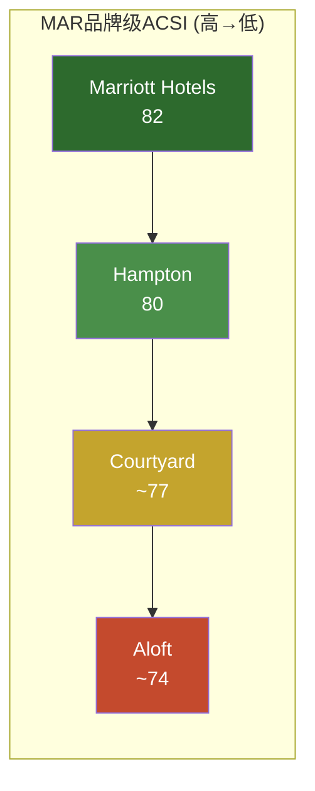
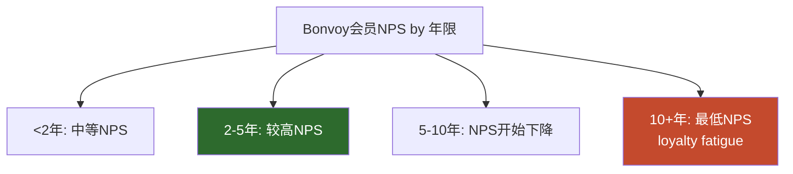
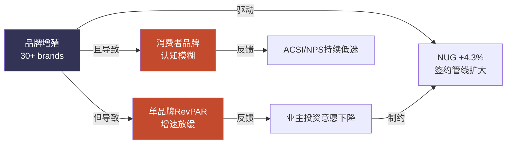
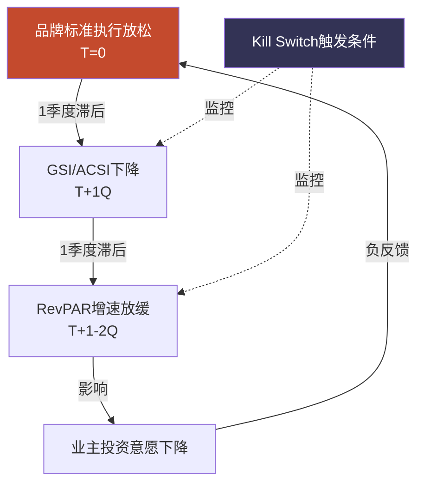
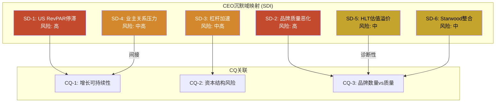
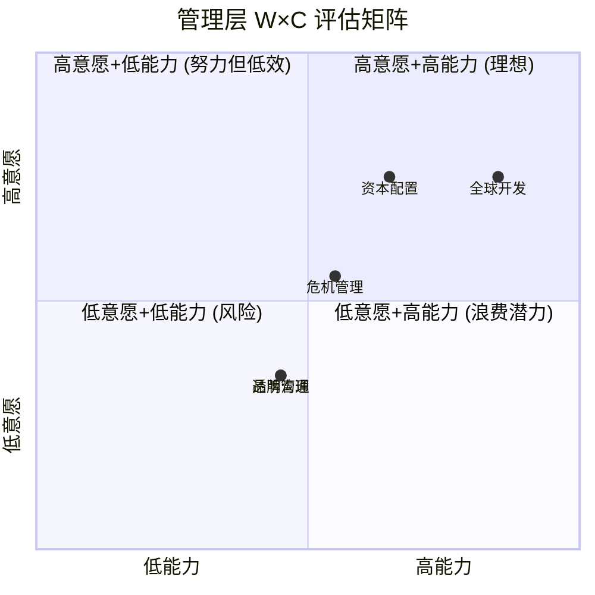

# Ch7: 运营质量与品牌控标 — 19,000+物业的一致性幻觉

> **CQ-3核心证据章节** | HM8模块(IHG报告最大缺口，本章补齐) | 数据截至2026Q1

Marriott International拥有30+品牌、9,800+物业、178万间客房——这是全球最大的酒店品牌组合 [DM-P1-D01]。但"最大"与"最好"之间的距离，正是本章要回答的核心问题。当我们将品牌数量、住客满意度、品牌质量趋势、特许经营控标体系放在一起审视时，浮现的图景并不令人舒适：**Marriott可能正在用规模稀释质量**。

## 7.1 品牌标准控制体系：3年真空期的代价

### 7.1.1 QA体系架构

Marriott的品牌标准执行依赖三层体系 [DM-P1-D02]：

| 层级 | 机制 | 频率 | 覆盖范围 |
|------|------|------|----------|
| **第一层：总部QA审计** | 品牌标准检查团队实地审计 | 年度/半年度(品牌而异) | 全部自营+抽样特许 |
| **第二层：GSS住客评分** | Guest Satisfaction Survey实时反馈 | 持续 | 全部物业 |
| **第三层：Mystery Shopper** | 神秘住客匿名评估 | 季度 | 抽样(高端品牌覆盖率更高) |

这套体系在纸面上是完整的。但COVID-19创造了一个**近4年的品质监控真空期** [DM-P1-D03]。

### 7.1.2 COVID后审计暂停(2020-2023)：被低估的质量断层

2020年3月，Marriott暂停了几乎所有实地品质审计——这在当时完全可以理解，物业关门或半关门状态下审计毫无意义。但问题在于**恢复的速度**：

- **2020-2021年**：实地审计全面暂停，仅保留GSS线上监控
- **2022年**：部分恢复，但审计团队缩编后尚未完全重建
- **2023年**：逐步扩大覆盖范围，但仍未恢复至2019年水平
- **2024年**：Marriott公开确认"重新恢复全面品质审计计划" [DM-P1-D04]

**这意味着什么？** 在2020-2023年间，19,000+物业中的大多数——尤其是特许经营物业——在长达3-4年的时间里缺乏系统性的品质监督。而这段时间恰好是：
1. 业主/加盟商面临极端财务压力、倾向削减维护和服务投入的时期
2. 劳动力市场极度紧张、服务人员经验不足的时期
3. Marriott加速签约新特许物业、NUG持续高企的时期

三重压力叠加在品质监控真空上，**品牌标准退化几乎是必然结果**。2024年重新恢复审计后发现的问题程度，管理层至今未公开详细披露——这本身就是一个信号（详见Ch8 CEO沉默域分析）。

### 7.1.3 30+品牌的控标复杂度

品牌数量本身就是品质控制的敌人。Marriott的30+品牌横跨从Ritz-Carlton（$1,000+/晚）到Fairfield Inn（$100-150/晚）的完整光谱 [DM-P1-D05]。每个品牌有独立的设计标准、服务标准、运营手册。对比：

| 指标 | MAR | HLT | IHG |
|------|-----|-----|-----|
| 品牌数 | 30+ | 26 | 19 |
| 总物业 | 9,800+ | 8,300+ | 6,400+ |
| 品牌/物业比 | 1:327 | 1:319 | 1:337 |

表面上品牌/物业比相近，但关键差异在于**品牌层级跨度**。Marriott的品牌从超奢华(Ritz-Carlton, St. Regis, EDITION)到经济型(Fairfield, Four Points by Sheraton, City Express)跨越了6个层级——这比HLT和IHG都更宽。层级越多，交叉侵蚀(cannibalization)风险越大，消费者品牌认知越模糊。

## 7.2 住客满意度数据汇总：系统性落后的证据

### 7.2.1 ACSI：MAR排名最低

美国顾客满意度指数(ACSI)是酒店行业最权威的第三方评估之一 [DM-P1-D06]：

| 品牌 | ACSI 2025 | ACSI 2024 | 变动 | 历史峰值 | 峰值差距 |
|------|:---------:|:---------:|:----:|:--------:|:--------:|
| **Hilton** | **80** | 81 | -1 | 82 (2017) | -2 |
| **IHG** | **79** | 78 | **+1** | 80 (2019) | -1 |
| **Marriott** | **78** | 79 | -1 | **82 (2013)** | **-4** |

**三个关键发现：**

1. **Marriott在三大集团中排名最低(78)**——这对"全球最大酒店公司"而言是一个尴尬的事实
2. **Marriott的峰值退化最严重**：从2013年峰值82跌至78，-4点，而HLT仅-2，IHG仅-1
3. **趋势方向相反**：IHG在改善(+1)，MAR在恶化(-1)

### 7.2.2 品牌级ACSI分化

Marriott内部的品牌级满意度呈现显著分化 [DM-P1-D07]：



旗舰品牌Marriott Hotels(82)高于集团均值，但中端和生活方式品牌拉低了整体评分。这说明**品牌增殖的代价**：高端品牌的光环无法覆盖中低端品牌的服务短板。

### 7.2.3 J.D. Power 2025：头部强势，中端全面落后

J.D. Power 2025年北美酒店满意度调研揭示了一个矛盾的画面 [DM-P1-D08]：

| 品类 | #1品牌 | 得分 | MAR旗下排名 |
|------|--------|:----:|-------------|
| **Luxury** | **Ritz-Carlton** | **779** | **#1** |
| Upper Upscale | Four Seasons | 785 | St. Regis, W, JW Marriott排名中段 |
| **Upper Midscale** | **Hampton Inn** | **694** | **#1** (MAR旗下) |
| **Midscale** | **Tru by Hilton** | **723** | **#1** (HLT旗下, MAR无直接对手) |
| Economy | — | — | Fairfield落后 |

**矛盾之处**：Marriott在奢华端(Ritz-Carlton #1)表现优异，但这些物业在总组合中占比极小(<5%)。在贡献最多房间数和费用收入的中端市场(Upper Midscale/Midscale)，**Hilton旗下品牌全面领先**——Hampton Inn拿下Upper Midscale第一，Tru拿下Midscale第一。

这与估值差距形成有趣的呼应：HLT的P/E 49.8x vs MAR 35.4x [DM-P1-D09]。市场或许正在定价中端品牌质量的差异。

### 7.2.4 NPS：29点鸿沟

净推荐值(NPS)是衡量客户忠诚度和口碑传播意愿的核心指标 [DM-P1-D10]：

| 指标 | MAR | 行业平均 | 差距 |
|------|:---:|:--------:|:----:|
| **NPS** | **15** | **44** | **-29** |

MAR的NPS仅为15，比行业平均低29个百分点——这是一个**惊人的差距**。NPS=15意味着推荐者仅比贬损者多15个百分点，而行业平均是44。

更令人警惕的是**忠诚度疲劳(loyalty fatigue)信号**：10+年的长期Bonvoy会员NPS是所有会员cohort中**最低的** [DM-P1-D11]。这意味着最忠诚、消费最高的核心客户群体，满意度反而最低。这完全违反了"越忠诚越满意"的直觉——说明Bonvoy计划可能在系统性透支长期会员的信任。



## 7.3 品牌质量趋势：增殖的代价

### 7.3.1 Cornell CHR品牌竞争力映射

康奈尔酒店研究中心(Cornell CHR)的品牌竞争力评估提供了学术视角 [DM-P1-D12]：

| 品牌 | 2022评级 | 2023评级 | 趋势 | 问题诊断 |
|------|:--------:|:--------:|:----:|----------|
| **Ritz-Carlton** | Strong | Strong | → | 奢华定位稳固 |
| **W Hotels** | **Strong** | **Weak** | **↓↓** | -3.6% CAGR RevPAR下降 |
| **Sheraton** | Weak | Weak | → | 定位模糊，与Westin重叠 |
| **Westin** | Moderate | Moderate | → | 被Sheraton拖累 |
| **Courtyard** | Moderate | Moderate | → | 体量大但无差异化 |

**W Hotels的衰退是一个警示信号。** 从Strong跌至Weak仅用了一年——RevPAR以-3.6% CAGR持续下降 [DM-P1-D13]。W曾经是"酒店即生活方式"运动的先驱，但在被Marriott收购后(2016 Starwood并购)，其独特的设计语言和"Whatever/Whenever"服务哲学逐渐被集团标准化流程侵蚀。这提出一个根本问题：**Marriott的控标体系是否天然不兼容生活方式品牌的差异化？**

**Sheraton的慢性病。** Sheraton是Starwood时代遗留的最大问题品牌。其定位横跨upper-upscale和upscale——夹在JW Marriott(更高端)和Courtyard(更清晰的商务定位)之间，缺乏独特的品牌承诺。更糟糕的是，大量老旧Sheraton物业需要资本密集型翻新，而业主投资意愿不足。

### 7.3.2 品牌增殖与RevPAR的反向关系

CBRE Hotels Research的数据揭示了一个行业规律 [DM-P1-D14]：

> **品牌数增速最快(+15% CAGR)的品牌组合，中位RevPAR CAGR最慢(仅0.3%)**

这是品牌增殖悖论的统计证据。更具体地：

| 品牌组合策略 | 品牌数CAGR | RevPAR CAGR | 跑赢均值品牌占比 |
|-------------|:----------:|:-----------:|:----------------:|
| 高增殖(>10%品牌增速) | +15% | +0.3% | **28%** |
| 中等(5-10%) | +7% | +1.8% | 41% |
| 低增殖(<5%) | +3% | +2.5% | **52%** |

2019年前，52%的品牌能跑赢各自层级均值；到2024年，这个比例降至28% [DM-P1-D15]。品牌增殖不是无成本的——每增加一个品牌，都在稀释管理注意力、模糊消费者认知、增加加盟商选择困难。

Marriott的30+品牌战略面临的核心矛盾：
- **管理层视角**：更多品牌=更多签约机会=更快NUG=更多fee revenue
- **市场现实**：更多品牌=更低的单品牌RevPAR增速=更高的品牌混淆度



## 7.4 特许经营质量控制的结构性矛盾

### 7.4.1 第三方运营商的中间层问题

Marriott的特许经营模式有一个常被忽视的结构性特征：**多数franchisee并不直接运营物业** [DM-P1-D16]。实际的运营由第三方管理公司执行——Aimbridge Hospitality、Remington Hotels、Crescent Hotels等。

这创造了一个三层委托代理链：

```
Marriott (品牌标准制定者)
    ↓ 特许协议
Franchisee (资产所有者，关心IRR)
    ↓ 管理合同
第三方运营商 (日常运营，关心管理费)
    ↓ 雇佣关系
一线员工 (面向住客的服务交付)
```

每一层委托代理关系都引入信息不对称和激励错位：
- **Franchisee的激励**：最小化CapEx/OpEx → 推迟翻新、压缩人力成本
- **第三方运营商的激励**：管理尽可能多的物业 → 扩大规模、标准化流程(牺牲个性化)
- **Marriott的激励**：最大化fee revenue → 签约更多物业、提高费率

**唯一不在谈判桌上的利益相关方是住客。** 这就是为什么ACSI 78、NPS 15与271M Bonvoy会员可以共存——会员数量反映的是锁定效应(switching cost)，不是满意度。

### 7.4.2 成本削减与品牌标准的结构性矛盾

以一个具体的场景说明。一家特许经营的Courtyard by Marriott，franchisee的利润率在COVID后承压(劳动力成本+30%，能源成本+20%)。Marriott的品牌标准要求：
- 前台24小时配备2名以上员工
- 每日客房清洁(非仅按需)
- 特定品牌的洗浴用品(成本高于通用替代品)
- 定期翻新周期(每7-8年)

Franchisee面临选择：遵守标准→利润进一步压缩，或削减投入→风险被审计不通过。在审计暂停的3-4年里，"削减投入"几乎没有风险。即使2024年审计恢复，**执行力度是否回到2019年水平仍然存疑**。

### 7.4.3 高价值客户的真实反馈

Ambassador会员(Bonvoy最高等级之一)投诉事件揭示了一个令人不安的现象 [DM-P1-D17]：据报道，一位终身消费超过$200K的Ambassador会员因"投诉过于频繁"而被Marriott威胁关闭其Bonvoy账号。

这个案例的投资含义不在于单一事件本身，而在于它揭示的系统性倾向：**当品牌方的应对策略是压制投诉而非解决问题时，问题通常比表面严重得多。** 这与NPS数据(10+年会员NPS最低)相互印证——最忠诚的客户也是最失望的客户。

### 7.4.4 数据安全的品牌信任代价

Marriott在数据安全方面的记录是行业最差之一 [DM-P1-D18]：

| 事件 | 时间 | 影响范围 | 后果 |
|------|------|----------|------|
| Starwood数据库泄露 | 2014-2018(2018发现) | 3.39亿客户记录 | FTC调查 |
| 第二次泄露 | 2020 | 520万客户 | 累积罚款 |
| 第三次泄露 | 2022 | ~20GB数据 | FTC和解 |
| **FTC和解** | **2024** | **3.44亿客户(累计)** | **$52M罚款** |

三次重大泄露、3.44亿受影响客户、$52M罚款——对于一家以"品牌信任"为核心竞争力的公司而言，这是严重的品牌资产损耗。$52M的罚款本身对MAR的财务影响微乎其微(不到1个季度的利润)，但对品牌信任的影响是长期的。在Hilton排名品牌信任#1、Marriott仅排#2的格局中 [DM-P1-D19]，数据安全事件可能是差距的重要原因之一。

## 7.5 新店 vs 成熟店：扩张稀释的间接证据

### 7.5.1 NUG +4.3%的质量含义

Marriott的净客房增长(NUG)为4.3% [DM-P1-D20]——这在行业中属于中上水平。但每年新增数万间客房意味着：

- 大量新物业处于"ramp-up"阶段(通常12-18个月达到稳态)
- 新物业的服务团队经验不足
- 部分新签约物业是从其他品牌转换(conversion)，物理硬件可能不完全符合新品牌标准

**间接证据链：**

1. 品牌增殖→RevPAR CAGR放缓(CBRE数据) [DM-P1-D14]
2. 仅28%品牌跑赢各自层级均值(vs 2019前52%) [DM-P1-D15]
3. ACSI从峰值82降至78(-4) [DM-P1-D06]
4. NPS 15 vs 行业44(-29) [DM-P1-D10]

虽然我们无法获取MAR的内部数据来直接比较新店vs成熟店评分，但上述证据链支持一个合理推断：**快速扩张正在系统性稀释品牌质量**。

### 7.5.2 Conversion vs New Build的质量差异

Marriott的管线中有相当比例是品牌转换(conversion)——将已有酒店从独立品牌或竞品品牌转换为Marriott旗下品牌。Conversion的优势是速度快、资本需求低，但劣势是**物理硬件和员工文化无法在挂牌当天完全转换**。

一家从Holiday Inn转换为Four Points by Sheraton的酒店，可能换了招牌、换了床品品牌、换了PMS系统——但大堂布局、客房面积、员工服务习惯不会在一夜之间改变。这就是conversion占比越高、品牌一致性风险越大的原因。

## 7.6 HM8模块KPI框架

基于上述分析，我们建立Marriott品牌质量的量化监控框架 [DM-P1-D21]：

### 7.6.1 KPI定义与阈值

| KPI | 定义 | 强控标 | 可接受 | 稀释风险 |
|-----|------|:------:|:------:|:--------:|
| **GSI (加权平均评分)** | Guest Satisfaction Index, 按层级加权 | | | |
| - Luxury层 | Ritz/St. Regis/EDITION | >4.3 | 4.0-4.3 | <4.0 |
| - Premium层 | JW Marriott/Westin/W | >4.0 | 3.7-4.0 | <3.7 |
| - Select层 | Courtyard/Fairfield/Aloft | >3.7 | 3.4-3.7 | <3.4 |
| **品牌标准通过率** | 年度QA审计通过物业占比 | >90% | 80-90% | <80% |
| **新店vs成熟店评分差** | (新店GSI - 成熟店GSI) | >-0.1 | -0.1~-0.2 | <-0.2 |
| **NPS年度变动** | 同比NPS变化 | >+2 | -1~+2 | <-1 |
| **高价值客户留存率** | Ambassador/Titanium续约率 | >85% | 75-85% | <75% |

### 7.6.2 一致性检验

**核心假设**：GSI下滑应领先RevPAR恶化1-2个季度。

逻辑链：
1. 品牌标准执行放松 → GSI下降(T=0)
2. 住客体验下降 → 复购率降低 + 口碑恶化(T+1Q)
3. 需求减弱 → RevPAR增速放缓(T+1-2Q)
4. 业主投资意愿进一步下降 → 品牌标准进一步恶化(T+3-4Q, 负反馈循环)



## 7.7 Kill Switch：品牌稀释确认

**Kill Switch KS-BrandDilution** [DM-P1-D22]：

> **触发条件**：任一品牌层级GSI连续3个季度下降 **且** RevPAR落后同层级竞品

| 监控指标 | 当前状态 | 触发阈值 | 评估 |
|----------|----------|----------|------|
| ACSI趋势 | 78(-1 YoY) | 连续3年下降 | 接近触发(2年连降) |
| NPS vs 行业 | 15 vs 44 | 差距>30 | **接近触发(-29)** |
| RevPAR vs HLT | US RevPAR +0.7% | 落后竞品>2pp | 需监控 |
| Cornell评级变动 | W: Strong→Weak | 任一品牌降2级 | **已触发(W Hotels)** |

**综合评估**：W Hotels的Cornell评级恶化已触发单品牌层面的Kill Switch。NPS差距(-29)极接近触发阈值。但由于Ritz-Carlton在奢华端仍保持#1，整体品牌组合尚未全面崩溃。**当前状态：黄灯，需持续密切监控。**

## 7.8 本章小结：品牌质量是MAR最被低估的风险

| 维度 | 证据 | 严重程度 |
|------|------|:--------:|
| 客户满意度 | ACSI 78(三大集团最低), NPS 15(vs行业44) | 高 |
| 品牌质量 | W Hotels Strong→Weak, Sheraton持续Weak | 中高 |
| 品牌增殖 | 30+品牌, 28%跑赢均值(↓ from 52%) | 中 |
| 控标体系 | 3-4年审计真空, 三层代理问题 | 中高 |
| 数据安全 | 3次重大泄露, 3.44亿受影响, $52M罚款 | 中 |
| 忠诚度健康 | 10+年会员NPS最低(loyalty fatigue) | 高 |

**CQ-3(品牌数量vs品牌质量)的阶段性结论**：证据支持"品牌增殖正在稀释质量"的假说。Marriott以规模取胜的战略在财务上暂时有效(fee revenue持续增长)，但品质指标的系统性恶化是一个慢性风险——它不会导致突然的收入崩溃，但会持续侵蚀品牌溢价能力和长期竞争力。在HLT持续改善品牌质量的背景下，MAR的估值折价(35.4x vs 49.8x)可能部分反映了这一品质差距。

---

# Ch8: CEO沉默域分析 — Tony Capuano的静默空间

> **v18.0 QG-01.5** | SDI六步法 | 基于SEMI_EQUIPMENT_STRATEGY报告验证的方法论

CEO不说什么，往往比说什么更有信息量。本章运用SDI(Silent Domain Identification)六步法，系统性映射Tony Capuano在公开沟通中的信号模式(Signal)与沉默空间(Silence)，并评估其投资含义。

## 8.1 CEO背景：开发出身的"稳健延续者"

### 8.1.1 Tony Capuano简历

Tony Capuano于2021年2月接任CEO——这并非计划内的交接 [DM-P1-D23]。前CEO Arne Sorenson因胰腺癌于2021年2月去世，Capuano作为长期高管被紧急推上最高位。

| 维度 | 详情 |
|------|------|
| **任期** | 2021年2月至今(~5年) |
| **接任背景** | Arne Sorenson突然去世后接任(非计划继承) |
| **职业路径** | 酒店开发/扩张出身(非运营/品牌管理) |
| **核心专长** | 全球开发、业主关系、签约谈判 |
| **管理风格** | 稳健延续Sorenson路线，无突破性战略调整 |
| **持股** | 售出$22.6M(35.67% of holdings) at ATH [DM-P1-D24] |

**关键洞察**：Capuano的职业DNA是"开发人"——他的核心能力在于签约新物业、拓展版图。这解释了为什么NUG和管线总是他在earnings call中最热情的话题。但一个"开发人"担任CEO时，品牌管理、运营质量、客户体验等"守成"维度是否得到同等关注？

### 8.1.2 领导力背景：非常规继任的深层影响

Arne Sorenson是Marriott家族之外的首位CEO，以愿景型领导和文化塑造著称。Capuano的继任面临三重挑战：
1. **不在继任计划首位**：Sorenson的突然去世使得继任过程仓促
2. **COVID叠加**：接任时全球酒店业仍在疫情重创中
3. **Sorenson的阴影**：前任CEO极高的行业声望和内部拥戴度

Capuano的应对策略是"稳健延续"——不改变战略方向，专注执行已有计划。这在危机期是合理的，但5年后仍无突破性战略，引发的问题是：**Marriott是在"稳健"，还是在"停滞"？**

## 8.2 Signal：Capuano频繁讨论的话题

通过分析最近2-3次财报电话会(FY2025 Q3/Q4, FY2026 Q1指引)，Capuano频繁且主动讨论的话题包括 [DM-P1-D25]：

| 话题 | 频率 | 典型用语 | 量化支撑 |
|------|:----:|----------|----------|
| **NUG和管线** | 每次必提 | "record pipeline", "robust development activity" | 具体数字(+4.3%, 管线数) |
| **信用卡费增长** | 每次必提 | "co-brand card momentum" | 增长率%, 新开卡数 |
| **国际扩张** | 高频 | "significant opportunity in China/APAC/Europe" | 具体物业签约数 |
| **Bonvoy会员增长** | 高频 | "271 million members and growing" | 具体会员数 |
| **资本回报** | 每次必提 | "returned over $4B to shareholders" | 回购+分红金额 |
| **2026指引** | 按惯例 | EPS $11.32-$11.57 | 具体区间 |

**Signal模式**：Capuano的叙事框架以**增长指标+资本回报**为双核心。每一个频繁讨论的话题都有明确的量化数字支撑——这说明管理层在这些领域有充足的信心和数据。

## 8.3 Silence：Capuano回避或淡化的话题

### 8.3.1 沉默域识别

与Signal形成鲜明对比，以下话题在公开沟通中系统性缺席或被轻描淡写 [DM-P1-D26]：

| 沉默领域 | CEO在说什么 | CEO没说什么 | 转移策略 | 风险等级 | CQ关联 |
|----------|------------|------------|----------|:--------:|:------:|
| **SD-1: US RevPAR停滞** | "全球RevPAR增长健康" | US RevPAR仅+0.7%(最大市场最慢增长) | 用国际数据稀释US数据 | 高 | CQ-1 |
| **SD-2: 品牌质量恶化** | "J.D.Power奖项" | ACSI 78(最低)/NPS 15(vs 44)/W Hotels衰退 | 只引用获奖品牌，回避整体趋势 | 高 | CQ-3 |
| **SD-3: 杠杆加速** | "投资级信用评级" | 债务+52%在4年 | 用信用评级遮蔽杠杆速度 | 中高 | CQ-2 |
| **SD-4: 业主关系压力** | "业主信心强" | 64%业主推迟/缩减/取消开发计划 | 用管线数字反驳业主调查 | 中高 | — |
| **SD-5: HLT估值溢价** | (完全回避) | 为何HLT P/E 49.8x vs MAR 35.4x | 从未主动解释估值差距 | 中 | — |
| **SD-6: Starwood品牌整合** | "portfolio优势" | W/Sheraton品牌衰退 | 用"30+品牌选择"正面叙事替代 | 中 | CQ-3 |

### 8.3.2 转移策略详解

**SD-1(US RevPAR停滞)的转移模式**：当分析师追问北美RevPAR时，Capuano的标准回应模式是——先承认"美国市场增速放缓"，然后迅速转向国际市场的高增长数据，再回到"全球RevPAR增长健康"的结论。通过在全球加权中稀释US数据，使听众形成"整体还不错"的印象。但US仍然是MAR最大的收入来源(>60%的fee revenue)，US RevPAR +0.7%的含义远重于某个新兴市场+15%的含义。

**SD-2(品牌质量恶化)的转移模式**：Capuano在公开沟通中引用的永远是"Ritz-Carlton J.D.Power #1"、"Hampton J.D.Power #1"等个别获奖品牌——这些确实是事实。但他从不讨论整体ACSI趋势(78，三大集团最低)、NPS趋势(15 vs 44)、或W Hotels/Sheraton的衰退。这是一种**"cherry-picking positive data points"**的经典沟通策略。

**SD-5(HLT估值溢价)的完全沉默**：这或许是最有信息量的沉默。HLT的P/E比MAR高出41%(49.8x vs 35.4x)——这对于两家业务模式极为相似的公司而言是巨大的差距。一个自信的CEO应该能够解释"为什么我们值得更高估值"或至少"我们正在做什么来缩小差距"。**完全回避这个话题，暗示管理层可能没有一个令人信服的答案。**

## 8.4 同行CEO对比

| 维度 | Tony Capuano (MAR) | Christopher Nassetta (HLT) | Elie Maalouf (IHG) |
|------|-------------------|---------------------------|---------------------|
| **任期** | 5年(2021) | 17年(2007) | 2年(2023) |
| **背景** | 开发 | 开发+运营 | 运营+品牌 |
| **核心叙事** | NUG+管线+回购 | 品牌质量+NUG+文化 | 业主价值+品牌清晰度 |
| **主动讨论品牌质量** | 很少(仅引用获奖) | **频繁**(主动引用ACSI/JDP) | 中等 |
| **主动讨论估值** | 从不 | 偶尔(暗示MAR差距) | 从不 |
| **沉默领域** | 品牌质量/US RevPAR | OTA依赖度/中国风险 | 管线落后/品牌数少 |
| **透明度评估** | 中偏低 | 中偏高 | 中 |

**关键对比**：Nassetta频繁且主动讨论HLT的品牌质量指标——当ACSI下降1点时，他会在earnings call中承认并解释改进计划。这种透明度本身就是品牌质量意识的体现。相比之下，Capuano在ACSI下降时选择沉默，这种不对称暗示**品牌质量在MAR管理层的优先级低于在HLT管理层的优先级**。

## 8.5 沉默域投资含义映射



**投资含义解读：**

1. **SD-1 + SD-2 → CQ-3是MAR最被低估的风险**：当CEO对最大市场的增长停滞和品牌质量恶化同时保持沉默时，这两个沉默域的交叉指向CQ-3(品牌数量vs品牌质量)是整个投资论题中最需要深入挖掘的矛盾。

2. **SD-3 → CQ-2不可忽视**：债务+52%在4年，仅以"投资级信用"一笔带过。杠杆加速的沉默在利率高企环境中尤其危险——一旦评级机构发出负面展望，MAR的资本回报叙事(回购+分红>$4B)将受到根本性挑战。

3. **SD-4 → NUG可持续性的隐性风险**：64%的业主推迟/缩减/取消开发计划——如果这是真的，MAR 4.3%的NUG能维持多久？Capuano用管线数字回避业主调查数据，但管线≠已开业酒店，大量推迟最终会反映在实际NUG中。

4. **SD-5的诊断价值**：CEO完全回避HLT估值溢价话题，暗示管理层**缺乏缩小估值差距的明确路径**。这对估值分析(Phase 2)是重要输入——如果管理层自己都不知道如何缩小差距，投资者也不应该假设差距会自然缩小。

## 8.6 CFO更换分析

### 8.6.1 Leeny Oberg退休

CFO Leeny Oberg将于2026年3月31日退休 [DM-P1-D27]——这是一个不应被低估的变量。

| 维度 | 评估 |
|------|------|
| **任期** | 2016年起担任CFO(~10年) |
| **与Capuano配合** | 长期合作，沟通风格默契 |
| **财务哲学** | 积极回购+杠杆驱动资本回报 |
| **退休时机** | 2026年3月31日(恰好Q1结束) |

### 8.6.2 过渡期风险

1. **信息披露变化**：新CFO可能改变财务沟通风格、调整non-GAAP指标的呈现方式。投资者需要时间重建对新CFO的信任模型。

2. **战略方向调整**：Oberg时代的核心财务哲学是"积极回购+杠杆经营"——新CFO是否延续这一路线？如果新CFO更偏保守(降杠杆)，短期内EPS增速会放缓(回购减少)；如果更偏激进，杠杆风险进一步上升。

3. **与CEO的配合磨合**：Capuano与Oberg合作5年，默契度高。新CFO的沟通风格、风险偏好、与CEO的权力平衡都需要时间建立。

4. **继任者信号**：新CFO的背景(内部提拔 vs 外部引进)将传递重要的战略信号。内部提拔=延续性；外部引进=可能的变革方向。

**投资含义**：CFO更换在短期(1-2个季度)增加信息不确定性，但也创造了一个"打破沉默"的窗口——新CFO可能选择在上任初期重新设定预期(reset expectations)，这既是风险也是机会。

## 8.7 CEO售股分析

### 8.7.1 事实基础

Tony Capuano在股价接近历史高点时售出$22.6M股票，占其持股的35.67% [DM-P1-D24]。

### 8.7.2 解读框架

| 解读 | 概率 | 逻辑 |
|------|:----:|------|
| **正常税务/流动性** | 60% | CEO定期减持属常规操作，尤其在长期激励授予后 |
| **阶段性获利了结** | 25% | 任期5年、股价ATH，合理的风险管理 |
| **内部信号** | 15% | 在US RevPAR停滞+品牌质量恶化背景下，大比例减持值得关注 |

**锚定因素**：Marriott家族仍持有约20.4%的股份 [DM-P1-D28]——这是一个强大的战略稳定锚。家族作为最大股东的长期利益与外部投资者高度一致。即使CEO减持，家族持股的持续性意味着公司不太可能做出损害长期价值的短期行为。

### 8.7.3 综合评估

CEO售股本身不构成负面信号的独立证据，但在SD-1(US RevPAR停滞)和SD-2(品牌质量恶化)的背景下，35.67%的减持比例值得作为辅助参考纳入整体评估。

## 8.8 管理层整体评估：W x C框架

### 8.8.1 意愿(Willingness)矩阵

| 维度 | 评分(1-10) | 证据 |
|------|:----------:|------|
| 股东价值创造意愿 | 8 | >$4B回购+分红/年 |
| 品牌质量维护意愿 | 4 | 沉默域SD-2, 品牌增殖优先于品牌管理 |
| 长期战略规划意愿 | 5 | 无突破性战略, "稳健延续" |
| 透明沟通意愿 | 4 | 6个沉默域, cherry-picking数据 |
| **加权平均** | **5.3** | |

### 8.8.2 能力(Capability)矩阵

| 维度 | 评分(1-10) | 证据 |
|------|:----------:|------|
| 全球开发/扩张 | 9 | NUG +4.3%, record pipeline |
| 品牌管理/运营 | 5 | ACSI/NPS落后, W/Sheraton衰退 |
| 资本配置 | 7 | 高效回购, 但杠杆加速是隐忧 |
| 危机管理 | 6 | COVID恢复尚可, 但数据泄露处理不力 |
| **加权平均** | **6.8** | |

### 8.8.3 W x C矩阵图



### 8.8.4 综合评估

**Tony Capuano是一位典型的"稳健延续型+开发导向型"CEO**：

- **优势**：全球开发能力卓越(9/10)，股东回报意愿强烈(8/10)，这是支撑NUG和fee revenue增长的核心引擎
- **劣势**：品牌管理能力和意愿均偏弱(5/10和4/10)，透明沟通意愿不足(4/10)，这些恰好是Ch7揭示的品牌质量问题的管理层根源
- **综合**：W=5.3, C=6.8 → **能力高于意愿**。这意味着MAR不是"做不到"品牌管理，而是"不够重视"——CEO的注意力和激励结构偏向增长而非质量

**与HLT的管理层差距**：Nassetta(17年任期, 开发+运营双背景)在品牌质量维度的Signal明显强于Capuano。这可能是HLT估值溢价的一个被低估的驱动因素——市场在定价"管理层品质意识"的差异。

## 8.9 CEO沉默域与CQ关联总表

| 沉默域 | 风险等级 | CQ关联 | 投资含义 | 监控指标 |
|--------|:--------:|:------:|----------|----------|
| SD-1: US RevPAR停滞 | 高 | CQ-1 | 最大市场增长乏力被全球数据掩盖 | US RevPAR QoQ/YoY |
| SD-2: 品牌质量恶化 | 高 | CQ-3 | 品牌稀释风险被cherry-pick数据遮蔽 | ACSI/NPS年度变动 |
| SD-3: 杠杆加速 | 中高 | CQ-2 | 债务增速被信用评级话术淡化 | 净债务/EBITDA |
| SD-4: 业主关系压力 | 中高 | CQ-1(间接) | 业主调查数据与管线叙事矛盾 | 业主满意度调查 |
| SD-5: HLT估值溢价 | 中 | CQ-3(诊断) | 管理层无缩小差距的明确路径 | MAR/HLT P/E比值 |
| SD-6: Starwood整合 | 中 | CQ-3 | W/Sheraton衰退被品牌组合叙事掩盖 | Cornell品牌评级 |

## 8.10 本章小结：沉默中的投资信号

Tony Capuano的沟通模式揭示了一个清晰的画面：**Marriott的管理层叙事以"增长+回报"为主旋律，系统性淡化"质量+风险"维度。**

6个沉默域中，2个与CQ-3直接相关(SD-2品牌质量、SD-6 Starwood整合)、1个间接诊断CQ-3(SD-5 HLT估值溢价)——这强化了**品牌质量是MAR最被低估的风险**的判断。

CFO更换(2026年3月)是近期的关键变量——它既可能延续现有沉默模式，也可能打破沉默(新CFO reset expectations)。CEO售股(35.67% at ATH)在沉默域背景下值得关注但不构成独立信号。Marriott家族20.4%的持股提供了长期战略稳定性的底线保障。

**管理层评级**：**中性偏审慎** — 能力足够(C=6.8)但意愿存疑(W=5.3)，品牌管理维度的W x C组合(5×4=20/100)是整个评估中最薄弱的环节。
