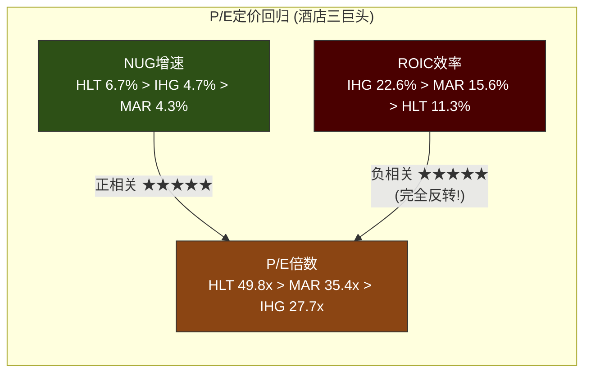
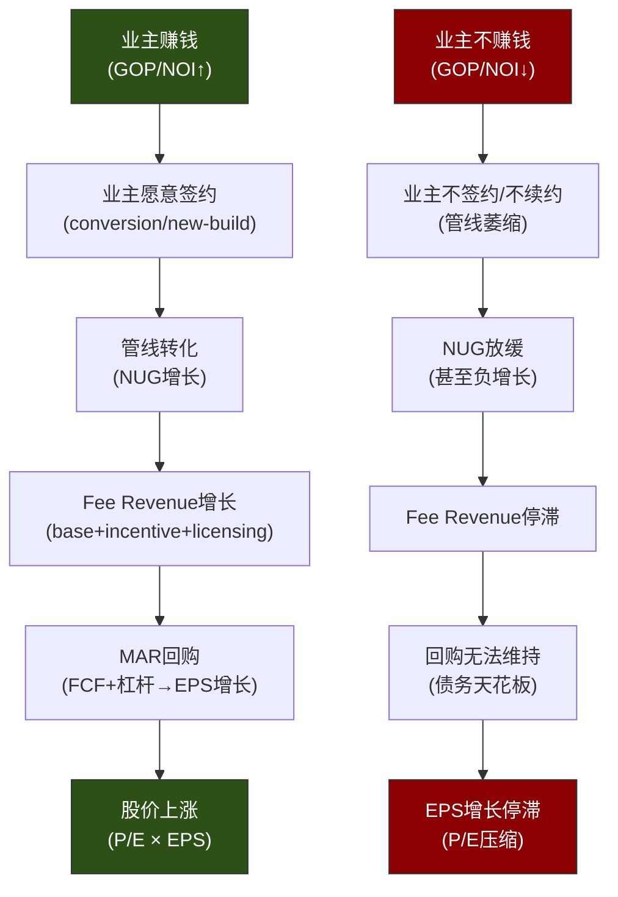
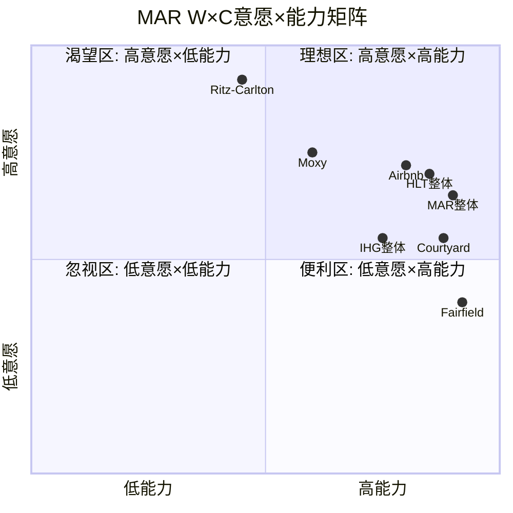

# Ch9: 增长引擎与业主经济学

> **主模块**: HM2(供给/开发/管线) + HM9(业主经济学) | **辅模块**: HM3(收费结构)
> **CQ关联**: CQ-1(增速是估值核心驱动→NUG分析关键) + CQ-2(杠杆回购可持续性→资本配置框架)
> **IHG缺口补齐**: 本章合并IHG Ch2(供给增长)+Ch8(增长引擎)为一章，并新增HM9业主经济学模块(IHG缺口C)

---

## 9.1 NUG拆解: 从4.3%到5%+的距离

### 9.1.1 Gross Additions与净增长

MAR 2025财年的NUG为4.3%，但这个净数字掩盖了两个对冲的力量 [DM-GRW-001]。拆解如下:

| 组件 | 估算值 | 逻辑 |
|------|:------:|------|
| **Gross Additions** | ~5.3-5.8% | NUG 4.3% + Deletions 1.0-1.5% [DM-GRW-002] |
| **Deletions** | 1.0-1.5% | 管理层2026指引区间 [DM-GRW-003] |
| **NUG** | 4.3% (实际) → 4.5-5.0% (2026E) | 管理层指引加速 [DM-GRW-004] |
| **隐含新增房间** | ~76K-103K/年 | 基于1.78M存量 × Gross Additions [DM-GRW-005] |

Deletions的1.0-1.5%区间值得关注。1.0%意味着约17,800间房退出系统，1.5%意味约26,700间。退出原因通常包括:品牌标准不达标被踢出、业主选择不续约、物业老化/拆除、以及品牌转换(从一个MAR品牌换到非MAR品牌)。MAR并未公开deletions的细分构成，这是一个**CEO沉默域**(Ch8已标记): 如果deletions中"业主主动不续约"占比上升，这是品牌价值主张恶化的领先指标。

### 9.1.2 Conversion vs New-build: 增长质量的核心分野

酒店行业的NUG有两条路径，经济学截然不同:

| 维度 | Conversion (品牌转换) | New-build (新建) |
|------|:----:|:----:|
| **成本/房间** | $10K-$40K+ (PIP级改造) | $160K-$2M+ (按品类) [DM-GRW-006] |
| **开业时间** | 近乎即时(收入不断) | 2-4年建设期 |
| **ROI特征** | 更强(低资本、快回收) | 更弱(高资本、长等待) |
| **融资难度** | 较低(现有资产抵押) | 高(贷方谨慎，需更多权益) |
| **供给趋势** | 加速中 | 减速中 |

MAR的conversion品牌包括Tribute Portfolio、Autograph Collection和Delta Hotels，均定位于conversion增长。2024年MAR新增约123,000间房(NUG 6.8%含pipeline释放)，其中conversion占比持续提升 [DM-GRW-007]。

**关键洞察**: 在当前高利率环境下，new-build经济学恶化(建设成本+30% vs pre-COVID [DM-GRW-008]，融资成本翻倍)，conversion成为唯一可行的大规模增长路径。这解释了为什么HLT推出Spark by Hilton(<$30K/room的超低成本conversion品牌)取得了爆发式增长，也解释了MAR加速向midscale扩展(新品牌计划)的战略逻辑。

### 9.1.3 NUG的地域分布

MAR的1.78M间房覆盖140+国家和地区，但增长动力的地域分布不均匀 [DM-GRW-009]:

| 区域 | 现有房间占比(估) | 管线占比(估) | NUG特征 |
|------|:-------:|:-------:|---------|
| **美洲** | ~55% | ~40% | 成熟市场，NUG~3-4%，以conversion为主 |
| **亚太** | ~25% | ~35% | 高增长，NUG~6-8%，以new-build为主(中国/印度) |
| **欧洲/中东/非洲** | ~20% | ~25% | 中等增长，NUG~4-5%，conversion+new-build混合 |

亚太区是MAR管线中占比最大的增长引擎，但也是RevPAR波动最大的区域(受中国宏观、地缘政治、汇率影响)。美洲区RevPAR仅+0.7% [DM-BIZ-005]但基数最大，是fee revenue的压舱石。

### 9.1.4 NUG 5年历史与2026指引

| 年份 | NUG | 备注 |
|------|:---:|------|
| 2021 | ~2.5% | COVID恢复期，deletions高 |
| 2022 | ~3.5% | 管线恢复释放 |
| 2023 | ~4.0% | 正常化 |
| 2024 | ~4.3% (实际) | 稳健但落后HLT [DM-GRW-001] |
| 2025E | 4.3% (报告期) | 与2024持平 |
| 2026E | **4.5-5.0%** | 管理层指引加速 [DM-GRW-004] |

管理层对2026加速的信心来源: (a) midscale品牌推出将打开新品类空间，(b) conversion管线加速(行业趋势)，(c) 国际市场(特别是中东+印度)管线释放。但这一指引的实现需要宏观环境配合——如果全球经济衰退导致业主融资冻结，管线conversion率将大幅下降。

---

## 9.2 管线质量分析: 610K间房的3年可见增长

### 9.2.1 管线规模与转化率

MAR当前管线为4,056个物业/610,000间房，占现有基数的**34%** [DM-GRW-010]。这意味着——假设管线在3-4年内全部转化——MAR每年可获得约8.5-11.3%的gross additions。扣除deletions后，理论NUG上限为7-10%。

但"管线"不等于"确定开业"。行业典型的管线-到-开业转化率为60-70%，平均lag 3-4年 [DM-GRW-011]:

```
管线610K rooms × 转化率65% = 实际开业~397K rooms
397K rooms / 4年 = ~99K rooms/年
99K / 1.78M = ~5.6% gross addition/年
5.6% - 1.25% deletions = ~4.3% NUG
```

这个简单算术揭示了一个重要事实: **MAR当前4.3%的NUG恰好等于管线自然消化速度**。要提速到5%+，MAR需要(a)提高管线转化率(>70%)，或(b)加速新签约补充管线，或(c)降低deletions(<1.0%)。管理层指引4.5-5.0%暗示他们预期至少一个因素改善。

### 9.2.2 管线结构: Under Construction vs Planning

管线的质量不仅看总量，更看"确定性分层":

| 阶段 | 行业典型占比 | 确定性 | MAR估计 |
|------|:----------:|:------:|:-------:|
| **Under Construction** | 35-45% | 极高(>90%开业) | ~215-275K rooms |
| **Final Planning/Approved** | 25-30% | 高(70-80%开业) | ~150-180K rooms |
| **Early Planning** | 30-40% | 中低(40-60%开业) | ~155-245K rooms |

Under Construction阶段的管线是12-18个月内的"确定性增长"，而Early Planning阶段的管线可能因融资困难、许可延迟、或业主退出而永远不开业。MAR未公开这一分层数据(另一个信息不透明点)，但基于行业模型，under construction约占管线35-40%，即**约215-245K间房在未来18个月内高确定性开业** [DM-GRW-012]。

### 9.2.3 管线品牌分布

MAR管线中增长最快的品牌预计集中在以下领域:

- **Select-Service / Extended-Stay**: Courtyard、Residence Inn、Fairfield — 占管线最大份额，受益于select-service的优越业主经济学(GOP margin >40%)
- **Lifestyle / Conversion**: Autograph Collection、Tribute Portfolio — conversion驱动，低资本、快开业
- **亚太全服务**: Sheraton、Westin — 中国/印度市场的new-build管线
- **新品类**: Midscale品牌(计划中) — 对标Spark by Hilton，打开$30K/room以下的conversion市场

**品牌集中度风险**: 如果管线过度集中于select-service/midscale，可能加速品牌下沉(brand dilution)，与Ch4品牌熵值分析的发现形成交叉验证。

---

## 9.3 NUG竞品对比: HLT为什么是MAR的1.56倍?

### 9.3.1 三巨头NUG全景

| 指标 | MAR | HLT | IHG |
|------|:---:|:---:|:---:|
| **NUG (2024-25)** | 4.3% | **6.7%** | ~4.7% [DM-COMP-005] |
| **管线/现有比** | 34% | **40%** | 34% [DM-COMP-006] |
| **总房间** | **1.78M** | 1.3M | 1.01M [DM-COMP-007] |
| **品牌数** | **30+** | 24 | 19 |
| **Key money使用** | ~1/3 deals | 更激进 | 较保守 |
| **Conversion率** | 中等 | **40%+** | 高(近翻倍YoY) |
| **P/E** | 35.4x | **49.8x** | 27.7x [DM-COMP-001] |

### 9.3.2 HLT NUG 6.7%的解剖

HLT的NUG领先MAR 2.4个百分点(1.56倍)，这一差距是MAR P/E折价于HLT的核心解释变量(NH-1)。拆解HLT的增速优势:

**因素1: 更高的Conversion比例(~40%)**
HLT的conversion占新签约比例达到约40%，远高于行业平均。Conversion速度快(无建设期)、成本低($10K-$40K/room)，直接加速NUG。MAR的conversion比例估计在25-30%左右，有提升空间。

**因素2: Spark by Hilton的品类创新**
2023年推出的Spark品牌定位economy conversion，开业成本<$30K/room，已有30+物业运营+175个管线 [DM-GRW-013]。这是HLT创造的全新增长层(MAR尚无直接对标品牌，midscale品牌仍在计划中)。

**因素3: 更激进的Key Money部署**
HLT的key money策略更为激进，在更多交易中提供更高额度的incentive。Key money本质是franchisor对owner的"签约补贴"，短期加速NUG但增加MAR的隐性CapEx。

**因素4: 基数效应**
HLT的1.3M间房基数比MAR的1.78M小27%。同样净增100K间房，HLT的NUG为7.7%而MAR仅5.6%。**基数是MAR无法改变的结构性劣势**——品类之王的诅咒: 越大越难增长。

### 9.3.3 NH-1验证: NUG是否是P/E溢价的唯一因子?



三个数据点的回归显示:

- **NUG vs P/E**: 完美正相关。HLT NUG最高→P/E最高; IHG NUG最低→P/E最低。MAR居中。
- **ROIC vs P/E**: 完美负相关。IHG ROIC最高→P/E最低; HLT ROIC最低→P/E最高。

**这是一个极其反直觉的定价模式**。传统金融理论认为ROIC高=资本配置能力强=应获溢价。但酒店行业的特殊性在于: (a) 三家都是asset-light/负权益，ROIC分母失真; (b) 市场将NUG视为"增长代理变量"，而ROIC在负权益环境下不具参考价值。

**NH-1初步结论**: NUG确实是P/E溢价的主要定价因子，但可能不是唯一因子。如果MAR NUG从4.3%提升到5.0%+，缩小与HLT的差距从2.4pp到1.7pp，P/E有向38-40x收敛的空间(约+7-13%股价上行)。但要完全收敛到HLT的49.8x，MAR需要NUG达到6%+，这在1.78M基数上极难实现。

---

## 9.4 供需平衡: 低供给时代的RevPAR支撑

### 9.4.1 US新供给增长: 历史低位的窗口

| 年份 | 新供给增长率 | 背景 |
|------|:----------:|------|
| 2018-19 | ~2.0% | 正常周期 |
| 2020-22 | ~0% | COVID冻结 |
| 2023 | **0.2%** | 极低——管线枯竭 [DM-GRW-014] |
| 2024 | **0.5%** | 缓慢回升 |
| 2025E | **0.8%** | 仍远低于历史 |
| 2026-27E | 1.0-1.5% | 逐步正常化 |

US酒店建设管线在2024年11月降至**1,264物业/151,129间房(约占存量2.6%)**——这是自2022年8月以来的最低水平 [DM-GRW-015]。

### 9.4.2 供需缺口的投资含义

```
低供给(0.5-0.8%) + 稳需求(leisure正常化 + group恢复 + business transient稳定)
= RevPAR支撑(即使需求温和增长，供给不足也能维持定价权)
```

**但这个窗口有时限**: 建设管线是"未来供给"的领先指标(lag 2-3年)。2024年管线处于低位意味着2027年之前新供给有限。但如果利率下降+融资环境改善，2025-26年签约的新项目将在2028-29年涌入市场。**供给窗口大约还有2-3年** [DM-GRW-016]。

对MAR的影响:
- **短期(2025-27)**: 供给约束支撑RevPAR，即使美国经济温和放缓也不会出现严重RevPAR下降
- **中期(2028+)**: 如果利率下行触发建设潮，新供给加速可能压制RevPAR增长
- **净效应**: 当前是酒店行业的"甜蜜点"——低供给+恢复需求。问题是这个甜蜜点能持续多久

---

## 9.5 业主经济学三角: 增长模型的因果根基

### 9.5.1 因果链: 从业主利润到MAR的EPS



**这条因果链是MAR整个增长模型的根基**。投资者通常只看MAR的P&L(fee revenue增长+回购=EPS增长)，但MAR的P&L完全依赖于业主的P&L。如果因果链的第一个环节断裂(业主不赚钱→不签约)，后面所有环节都会崩塌。这是一个**被低估的系统性风险**——MAR的年报和investor deck几乎从不讨论业主层面的经济学(又一个CEO沉默域)。

### 9.5.2 典型业主P&L模型: Select-Service案例

以一家典型150间房的Courtyard by Marriott为例(美国郊区/城市边缘位置):

| 项目 | 金额/年 | 占Revenue% | 说明 |
|------|--------:|:----------:|------|
| **Room Revenue** | $5,475,000 | — | RevPAR $100 × 150房 × 365天 |
| **其他收入** | $365,000 | — | 会议室、洗衣、自动售货等 |
| **Total Revenue** | **$5,840,000** | 100% | |
| | | | |
| **劳工成本** | ($2,009,000) | 34.4% | 行业均值2024 [DM-OWN-001] |
| **其他直接运营** | ($1,343,000) | 23.0% | 水电、维护、用品 |
| **= GOP** | **$2,488,000** | **42.6%** | Select-service典型GOP% [DM-OWN-002] |
| | | | |
| **特许费(Royalty)** | ($328,500) | 5.6% | ~6% of GRR [DM-OWN-003] |
| **忠诚度费** | ($164,250) | 2.8% | ~3% of loyalty-generated rev |
| **营销/程序费** | ($116,800) | 2.0% | ~2% of GRS |
| **= 特许费合计** | **($609,550)** | **10.4%** | 总take rate 7-14%区间中值 |
| | | | |
| **物业税** | ($175,200) | 3.0% | |
| **保险** | ($102,450) | 1.8% | $683/PAR × 150房 [DM-OWN-004] |
| **FF&E Reserve** | ($233,600) | 4.0% | 行业标准4-5% |
| **= 固定成本合计** | **($511,250)** | **8.8%** | |
| | | | |
| **= NOI** | **$1,367,200** | **23.4%** | |
| **Cap Rate** | 7.5% | — | 当前select-service市场 |
| **= 物业估值** | **$18,229,000** | — | **$121,500/room** |

### 9.5.3 典型业主P&L模型: Luxury案例

以一家300间房的Ritz-Carlton为例(一线城市核心位置):

| 项目 | 金额/年 | 占Revenue% | 说明 |
|------|--------:|:----------:|------|
| **Room Revenue** | $38,325,000 | — | RevPAR $350 × 300房 × 365天 |
| **F&B + Other** | $19,162,000 | — | 约占总收入33%(luxury F&B比重高) |
| **Total Revenue** | **$57,487,000** | 100% | |
| | | | |
| **劳工成本** | ($21,260,000) | 37.0% | Luxury劳工密度更高 |
| **其他直接运营** | ($15,522,000) | 27.0% | |
| **= GOP** | **$20,705,000** | **36.0%** | Luxury GOP% [DM-OWN-005] |
| | | | |
| **管理费(Base)** | ($1,724,600) | 3.0% | ~3% of total revenue |
| **管理费(Incentive)** | ($1,035,000) | 1.8% | ~10% of adjusted GOP (threshold后) |
| **品牌/系统费** | ($2,299,500) | 4.0% | Luxury品牌费率 |
| **= 管理+品牌费合计** | **($5,059,100)** | **8.8%** | |
| | | | |
| **物业税** | ($2,299,500) | 4.0% | 一线城市税率更高 |
| **保险** | ($1,437,200) | 2.5% | Luxury物业保额高 |
| **FF&E Reserve** | ($2,874,400) | 5.0% | Luxury标准更高 |
| **= 固定成本合计** | **($6,611,100)** | **11.5%** | |
| | | | |
| **= NOI** | **$9,034,800** | **15.7%** | |
| **Cap Rate** | 5.5% | — | Luxury trophy asset |
| **= 物业估值** | **$164,269,000** | — | **$547,500/room** |

**Select-Service vs Luxury经济学对比**:

| 维度 | Select-Service (Courtyard) | Luxury (Ritz-Carlton) |
|------|:-------------------------:|:---------------------:|
| GOP Margin | **42.6%** (更高) | 36.0% |
| NOI Margin | **23.4%** (更高) | 15.7% |
| MAR总费率 | 10.4% of revenue | 8.8% of revenue |
| 物业估值/房间 | $121,500 | **$547,500** (4.5倍) |
| NOI/房间 | $9,115 | **$30,116** (3.3倍) |
| 业主投入/房间 | ~$250,000 (new-build) | ~$1,500,000 (new-build) |
| Cap Rate on Cost | ~3.6% | ~2.0% |

**核心洞察**: Select-service的百分比回报率更高(更高的NOI margin)，但luxury的绝对值回报更高(NOI/房间是3.3倍)。对MAR而言，select-service是"量"的引擎(更容易签约、更低资本门槛、更快开业)，而luxury是"价"的引擎(更高绝对fee/房间)。**两条腿走路的逻辑是成立的，但存在品牌管理复杂度的代价(30+品牌→Ch4品牌熵值)**。

---

## 9.6 业主三大成本压力: 量化与趋势

### 9.6.1 成本压力总览 (2019-2025)

| 成本项 | 2019 | 2022 | 2024 | 2025E | CAGR | 严重度 |
|--------|-----:|-----:|-----:|------:|-----:|:------:|
| **劳工 (% of Rev)** | ~29.0% | 31.4% | **34.4%** | ~34.5% | +540bps (6Y) | ★★★★★ |
| **保险 ($/PAR)** | ~$450 | ~$570 | **$683** | ~$750E | +8.8%/Y | ★★★★ |
| **保险 (% of Rev)** | 1.0% | 1.3% | **1.7%** | ~1.8% | +70bps (5Y) | ★★★★ |
| **PIP ($/room, select)** | ~$18K | ~$25K | **$20K-$40K+** | ~$25K-$45K | +30%+ total | ★★★ |

[DM-OWN-006] [DM-OWN-007] [DM-OWN-008]

### 9.6.2 劳工: 最大且最不可逆的压力

劳工成本是酒店运营的第一大开支，2024年占收入的34.4%，较2019年上升**540个基点** [DM-OWN-001]。这一上升由两个结构性因素驱动:

**工资通胀**: 酒店业平均时薪从2020年的$16.84飙升至2025年初的**$22.70**，涨幅**+34.8%** [DM-OWN-009]。这不是疫情临时现象——最低工资立法(加州$20/hr+)、工会谈判力增强、以及劳动力结构性短缺(行业仍比2019年少~200K工人 [DM-OWN-010])意味着工资不会回落。

**效率部分对冲**: 行业通过减少用工时间(-7.4% vs 2019 [DM-OWN-011])和提高劳动效率(客房服务快5.5%，前台快12.7% [DM-OWN-012])部分对冲了工资上涨。但**净效果仍为负**: 工时减少22%×工资增加35%=总薪酬仍上升~5%，且70%的美国酒店已减少或取消了部分服务(如每日客房清洁) [DM-OWN-013]——进一步减少的空间有限。

### 9.6.3 保险: 最不可控的成本

酒店保险是"几乎完全不可控的成本"(CBRE原话) [DM-OWN-004]:

- 2024年平均PAR(每间可用房)保险成本**$683**，2023年YoY增长**+19.5%**
- 长期CAGR(2015-2022)为**6.2%/年**，远超通胀
- **沿海/度假物业尤其严重**: 度假物业PAR保险成本$2,464(普通物业的3.6倍) [DM-OWN-014]
- 佛罗里达: 均值$5,376(全国均值$2,181的2.5倍)，Monroe County达$7,162
- 承保缩紧: 保险公司退出酒店市场，部分排除assault/battery和人口贩运覆盖

**对MAR的特殊影响**: MAR不拥有物业(asset-light)，保险成本由业主承担。但如果保险成本侵蚀业主NOI，业主签约意愿下降→NUG受影响。尤其是MAR在佛罗里达/加勒比等度假区有大量物业(Ritz-Carlton、W、St. Regis等品牌)，这些区域的保险压力最为严峻。

### 9.6.4 PIP: 周期性但量级在膨胀

PIP(Property Improvement Plan)是品牌特许商强制要求的物业翻新计划，每5-7年一个周期 [DM-OWN-015]:

| 品类 | PIP成本/房间 | 总投入(150房) | 翻新后RevPAR提升 |
|------|:----------:|:----------:|:---------------:|
| Economy | $10K-$25K | $1.5M-$3.8M | +5-9% |
| **Select-Service** | **$20K-$40K+** | **$3M-$6M+** | +9-12% |
| Full-Service | $30K-$60K | $4.5M-$9M | +9-15% |
| Luxury | $50K-$150K+ | 视物业而定 | +12-17% |

PIP成本较COVID前上涨**>30%** [DM-OWN-008]，主要受建材价格(+4.69% YoY [DM-OWN-016])和劳工短缺推动。但2025年有两个积极信号: (a) 建设成本通胀减速(从2023年的+6%降至2025年的+4.7%)，(b) 品牌方(包括MAR)越来越愿意协商PIP条款和时间表。

**RevPAR回报**: PIP完成后平均RevPAR提升约+9%，高品类可达+17% [DM-OWN-017]。如果PIP成本$30K/room而RevPAR提升带来的增量NOI为$3K-$5K/room/年，回收期约6-10年——在当前利率环境下这个回报率**并不吸引人**。这解释了为什么32%的业主推迟开发、24%缩减规模。

---

## 9.7 MAR品牌溢价 vs 费率: 核心价值主张诊断

### 9.7.1 RevPAR溢价的量化框架

品牌特许经营的核心价值主张是: **业主支付费率，换取品牌带来的RevPAR溢价**。如果溢价>费率，业主赚钱; 如果溢价<费率，品牌是净成本。

溢价的来源:
- **品牌知名度→入住率提升**: 旅客倾向选择已知品牌(尤其商旅)
- **忠诚度计划→直订流量**: Bonvoy 271M会员中约50%+的预订流向MAR品牌 [DM-OWN-018]
- **收益管理系统→ADR优化**: MAR的中央收益管理系统(One Yield)帮助业主优化定价
- **全球分销→填充空房**: GDS+企业合同+会议预订

### 9.7.2 溢价vs费率比: 恶化趋势

| 维度 | 数据 | 信号 |
|------|------|------|
| **特许费增长** | +3.5% (2023-24) [DM-OWN-019] | 费率加速 |
| **房间收入增长** | +2.7% (同期) [DM-OWN-020] | 收入滞后 |
| **差异** | 费率增速 > 收入增速 **0.8pp** | **比率在恶化** |
| **忠诚度费增速** | +3.9% [DM-OWN-021] | 最快增长组件 |
| **房间占用增速** | +1.3% [DM-OWN-022] | 远慢于费用 |

**溢价/费率比趋势**: 当费率增速持续超过RevPAR/收入增速时，业主的净溢价(=品牌带来的收入增量 - 品牌收取的费用)在收缩。如果这一趋势持续2-3年，业主续约/conversion意愿将明显下降。

**一致性检验 #9A**: 费率/收入比↑(恶化) + RevPAR US仅+0.7%(接近停滞) → 业主净溢价正在被压缩。预测: 如果这一趋势持续至2027年，续约率和conversion净流入将出现可测量的下降。

### 9.7.3 Bonvoy的渠道价值是唯一锚点

在费率vs溢价的博弈中，MAR最大的筹码是**Bonvoy会员的预订流量**。业主离开MAR系统意味着:
- 失去271M Bonvoy会员中可能50%+的预订来源 [DM-OWN-018]
- 失去企业合同分配(Fortune 500公司倾向MAR/HLT而非独立酒店)
- 失去MAR的收益管理和分销系统

这创造了极高的**switching cost**: 即使业主对费率不满，离开的代价(收入损失)远大于留下的代价(费率上升)。这是MAR续约率维持在行业正常水平(>95%)的根本原因。但这个锚点也在被侵蚀——如果OTA平台(Booking.com/Expedia)能提供同等甚至更高的预订流量，品牌的渠道垄断地位将被削弱。

---

## 9.8 业主情绪与续约: 当前冰点

### 9.8.1 AHLA 2025调查: 64%负面

2025年AHLA(美国酒店及住宿协会)对约400名酒店业主的调查揭示了令人不安的情绪 [DM-OWN-023]:

| 业主行为 | 占比 | 含义 |
|---------|:----:|------|
| **推迟开发** | 32% | 不确定性→等待 |
| **缩减项目** | 24% | 降低风险敞口 |
| **取消项目** | 8% | 退出决策 |
| 继续投资 | 仅8% | 极度审慎 |
| **负面合计** | **64%** | **2/3业主在收缩** |

同时:
- 49%报告人手不足
- 30%看到休闲入住下降
- 26%报告休闲预订减少(领先指标)

### 9.8.2 续约率与Conversion净流入

行业典型的特许续约率:
- **>95%** = 极强(品牌价值主张被广泛认可)
- **90-95%** = 正常
- **<90%** = 价值主张弱化的警示信号

MAR未公开披露续约率的精确数据(CEO沉默域)，但基于deletions 1.0-1.5%的范围推断，即使其中一半是"不续约"(而非"不达标被踢出"或"物业拆除")，也意味着约0.5-0.75%的年度流失率，对应续约率仍在95%以上——表面健康。

**但conversion净流入是更敏感的指标**: 如果从竞品品牌或独立酒店conversion进来的数量(流入)开始少于从MAR品牌被竞品conversion走的数量(流出)，这是品牌相对竞争力下降的直接证据。MAR同样未公开这一双向数据。

### 9.8.3 Conversion经济学: 为什么是当前增长的唯一引擎

在new-build几乎冻结的环境下(US管线最低自2022.8)，conversion成为NUG增长的主引擎:

| 因素 | Conversion优势 | New-build劣势 |
|------|:------------:|:------------:|
| 成本 | $10K-$40K/room | $160K-$2M/room |
| 时间 | 即时 | 2-4年 |
| 融资 | 现有资产抵押，容易 | 贷方谨慎，需更多权益 |
| 风险 | 已有运营历史 | 市场不确定性 |
| RevPAR | 立即受益于品牌效应 | 开业初期爬坡 |

IHG的conversion签约在2023-2024年间几乎翻倍 [DM-GRW-018]。MAR如果能通过midscale新品牌打开$30K/room以下的conversion市场(对标Spark by Hilton)，NUG有潜力加速到5%+。但这也带来品牌稀释风险(Ch4交叉验证)。

---

## 9.9 Key Money分析: 隐藏的增长CapEx

### 9.9.1 MAR的Key Money策略

Key money是品牌方向业主提供的"签约激励金"——本质是MAR为获取管线增长而支付的隐性CapEx [DM-GRW-019]:

- MAR约**1/3的交易使用key money** (CEO Capuano确认)
- 最近趋势: "每笔交易的key money略少"但覆盖"更多品类"(including midscale)
- Capuano原话: "The competitive landscape has really shifted toward key money being the tool of reference"

### 9.9.2 Key Money的经济学

Key money的典型形式:
- **直接现金**: 一次性签约补贴，通常$1K-$10K/room
- **贷款/信用增强**: MAR提供担保或低息贷款
- **费用减免**: 前1-3年部分费率优惠

对MAR P&L的影响:
- Key money计入**资产负债表**(而非P&L)，分摊在合同期限内
- 但这是真实的现金流出——增加了MAR的隐性CapEx
- 在FCF计算中，key money部分体现在"investing activities"而非"operating activities"

### 9.9.3 Key Money与NUG的关系

```
Key Money↑ → Conversion签约↑ → 管线充实 → NUG短期提速
但: Key Money↑ → 隐性CapEx↑ → FCF实质下降 → 回购空间收窄
```

这创造了一个**NUG质量的隐性成本**: 如果MAR的NUG提速依赖于更多key money投入，那么表面的"增长加速"实际上是"买来的增长"——与HLT的激进策略类似。投资者需要区分"organic NUG"(无key money驱动)和"incentivized NUG"(key money驱动)，但两家公司都不公开这一拆分。

---

## 9.10 Kill Switch与一致性检验

### Kill Switch KS-HM9-01: 业主价值主张破裂

**触发条件**: 续约率<90% + conversion净流出(连续2季度) [DM-KS-001]
**后果**: 下调系统增长假设至行业底线(NUG 2-3%)
**监控指标**: deletions占比中"业主主动不续约"比例(MAR未披露，需从管线数据反推)
**当前状态**: 未触发(deletions 1.0-1.5%在正常范围)

### Kill Switch KS-HM9-02: 业主NOI系统性跌破阈值

**触发条件**: 行业GOP margin <35% + 保险成本>2.5% of revenue [DM-KS-002]
**后果**: 业主投资回报不足→管线签约冻结→NUG降至<3%
**当前状态**: 距离触发尚有缓冲(GOP 37.7% vs 35%阈值; 保险1.7% vs 2.5%阈值)

### 一致性检验 #9A (已述)
费率/收入比↑ + RevPAR US仅+0.7% → 业主净溢价正在被压缩。**预测**: 2027年前如无RevPAR加速，续约谈判中业主将要求费率concession。

### 一致性检验 #9B
NUG指引4.5-5.0%(加速) + 业主情绪64%负面(减速) → **矛盾**。调和假说: NUG加速来自管线backlog释放(2-3年前签约的项目)，而当前业主负面情绪将在2028+才反映为NUG减速。如果正确，2026-27是NUG的"最后甜蜜期"。

### 一致性检验 #9C
Key money扩展到更多品类(midscale) + "每笔更少" → 总key money支出可能持平或上升(更多交易×更少/笔)。需在Ch12(资本配置)中追踪MAR的"contract acquisition costs"趋势来验证。

---

## 9.11 Ch9 KPI汇总

### HM2 KPI (供给/管线)

| KPI | 值 | 基准 | 判定 |
|-----|:--:|------|:----:|
| NUG | 4.3% [DM-GRW-001] | 行业3-5%正常, >5%强 | 中等 |
| 管线/现有比 | 34% [DM-GRW-010] | >35%=强可见增长; 25-35%=中; <25%=管线不足 | 中等偏下 |
| Conversion净流入 | 未公开 | >0=品牌有吸引力; <0=竞争力下降 | 无数据 |

### HM9 KPI (业主经济学)

| KPI | 值 | 基准 | 判定 |
|-----|:--:|------|:----:|
| 业主GOP Margin | Select ~42%, Luxury ~36% [DM-OWN-002/005] | Select 45-50%=健康; <40%=压力 | 中等(接近下限) |
| RevPAR溢价vs费率 | 费率增速>收入增速0.8pp [DM-OWN-019/020] | 趋势恶化 | 偏弱 |
| 续约率 | 估计>95% [DM-OWN-024] | >95%=极强; 90-95%=正常 | 表面健康 |
| 业主情绪 | 64%负面 [DM-OWN-023] | — | 冰点 |

---

# Ch10: W×C意愿能力双轴 + 品牌弹性半径

> **主模块**: consumer v28.0 模块A(W×C意愿×能力双轴) + 模块E(品牌弹性半径)
> **辅模块**: HM7(品牌组合)
> **CQ关联**: CQ-3(品牌数量vs品牌质量)

---

## 10.1 W×C意愿×能力双轴分析

### 10.1.1 意愿(Willingness): 消费者"想要"MAR品牌吗?

意愿维度衡量消费者对MAR品牌组合的渴望程度、品牌吸引力和情感连接。

**品牌渴望度分层**:

| 品牌层级 | 代表品牌 | 渴望度 | 依据 |
|---------|---------|:------:|------|
| **Luxury** | Ritz-Carlton, St. Regis, EDITION | ★★★★★ | Ritz-Carlton: J.D. Power luxury #1 (779/1000); 全球顶级酒店品牌认知度 [DM-BRD-001] |
| **Premium** | W, Westin, Marriott | ★★★☆☆ | 品牌老化风险——Westin/Marriott"中年危机"，对年轻旅客吸引力下降 |
| **Select-Service** | Courtyard, Residence Inn | ★★★☆☆ | 功能性选择(不是"想要"而是"需要")，商旅刚需但缺乏情感溢价 |
| **Midscale/Extended** | Fairfield, Four Points | ★★☆☆☆ | 被Hampton(HLT)压制; ACSI/NPS落后竞品 [DM-BIZ-008] |
| **Lifestyle** | Moxy, AC Hotels | ★★★★☆ | 年轻化+设计感，但规模仍小，对总体品牌感知贡献有限 |

**价格敏感性分群**:
- **商务旅客**(意愿高+价格不敏感): 企业合同锁定，品牌忠诚度高(因Bonvoy积分→报销便利)。MAR在这一群体中有最强的意愿。
- **休闲旅客**(意愿中等+价格敏感): 比价行为强，OTA渠道分流严重。对MAR的品牌忠诚度取决于Bonvoy积分经济学(见Ch6)。
- **Z世代/千禧一代**(意愿分化): 偏好Airbnb、精品酒店和体验式住宿。MAR通过Moxy和Homes & Villas部分捕获这一群体，但整体品牌感知仍为"商务连锁"而非"旅行生活方式" [DM-BRD-002]。

**总体意愿评分: 6.5/10** — Luxury极强但规模小; 中端品牌(最大volume)品牌吸引力中等; 年轻消费者渗透不足。

### 10.1.2 能力(Capability): 消费者"能够"使用MAR吗?

能力维度衡量消费者接触和使用MAR产品/服务的门槛。

**价格可及性**:
- MAR全球ADR(平均日房价): ~$174 [DM-BRD-003]
- 品类区间: Fairfield ~$110 → Ritz-Carlton ~$650+
- 对中产阶级: Select-Service($110-$150)完全可及; Luxury($500+)限于高收入群体
- 与Airbnb的价格竞争: 同一目的地，Airbnb整套公寓通常比MAR select-service便宜20-40%

**地理可及性**:
- 9,800+物业, 140+国家和地区 [DM-BRD-004]
- 全球酒店行业覆盖最广的品牌组合(无盲区)
- 但在三四线城市/非旅游目的地，可能缺乏合适的品类选择(midscale品牌即将补齐)

**预订便利性**:
- 全渠道覆盖: Marriott.com + App + OTA + GDS + Call Center + Walk-in
- Bonvoy App整合预订+积分+房间选择+数字钥匙
- 企业预订通道: 与Fortune 500企业直接对接
- **能力几乎无瓶颈**

**总体能力评分: 9.0/10** — 价格、地理、渠道三维度几乎零障碍。

### 10.1.3 W×C矩阵定位



**MAR定位: "高能力×中等意愿"象限(偏"便利区")**

这意味着:
- MAR不是消费者"梦想入住"的品牌(不在理想区)——至少对大众市场如此
- MAR是消费者"最容易找到的品牌"(高能力)——地理覆盖+渠道+品类宽度
- **竞争对手HLT同样高能力但意愿略高**(Hampton的ACSI/NPS优于MAR中端品牌)
- Airbnb在意愿维度上对年轻消费者构成严重威胁

**战略含义**: MAR的增长不能依赖品牌渴望(意愿不够高)，必须依赖**系统可及性+忠诚度锁定**(能力极强+Bonvoy switching cost)。这是一个"平台"打法而非"品牌"打法。

---

## 10.2 品牌弹性半径(BER)分析

### 10.2.1 BER框架: MAR品牌能延伸多远?

品牌弹性半径(Brand Elasticity Radius)衡量一个品牌能在不损害核心品牌力的前提下延伸到多远的品类/市场。超出弹性半径的延伸会导致品牌稀释("断裂")。

**MAR的品牌延伸光谱**:

| 延伸方向 | 代表 | 距核心距离 | 成功度 | 品牌风险 |
|---------|------|:--------:|:------:|:-------:|
| 核心: 全服务酒店 | Marriott, Sheraton | 0 (原点) | ★★★★ | 无 |
| 近延伸: Select-Service | Courtyard, Fairfield | 近 | ★★★★★ | 低 |
| 中延伸: Lifestyle/Boutique | Moxy, EDITION, W | 中 | ★★★★ | 低 |
| 中延伸: Extended-Stay | Residence Inn, Element | 中 | ★★★★★ | 低 |
| 远延伸: 度假租赁 | Homes & Villas by Marriott Bonvoy | 远 | ★★★ | 中 |
| 远延伸: 信用卡/金融 | Chase co-brand card | 远 | ★★★★ | 低 |
| **超级延伸: 邮轮** | **Ritz-Carlton Yacht Collection** | **极远** | **★★** | **高** |
| 未涉足: 共享办公 | — | 极远 | — | 极高 |

### 10.2.2 弹性案例分析

**成功延伸: Homes & Villas by Marriott Bonvoy**
- 将品牌从酒店延伸到度假租赁(直接与Airbnb竞争)
- 利用Bonvoy积分生态打通酒店-度假租赁的会员体验
- 100K+房源(截至2025年)，品质定位中高端
- **风险可控**: 独立品牌名("Homes & Villas")不直接关联任何酒店品牌，失败不会污染核心品牌

**高风险延伸: Ritz-Carlton Yacht Collection**
- 将Ritz-Carlton品牌从陆地酒店延伸到超级游轮
- 定位超高端($5K+/人/夜)
- 运营复杂度远超酒店——海事运营、安全合规、供应链完全不同
- **品牌断裂风险**: 如果游轮体验不达Ritz-Carlton标准(已有早期客户投诉报道)，直接损害Ritz-Carlton品牌在陆地酒店的声誉 [DM-BRD-005]

**潜在断裂: 30+品牌本身是否超出弹性半径?**

这是Ch4品牌熵值分析的交叉验证点。MAR拥有30+品牌，从$100/晚的Fairfield到$2,000+/晚的St. Regis，跨度极大。问题不在于单个品牌的延伸距离，而在于**品牌组合的总跨度是否超出消费者的认知弹性**:
- 消费者是否知道Fairfield和Ritz-Carlton属于同一公司?
- 如果知道，Fairfield的"经济连锁"形象是否拉低了对Ritz-Carlton的品牌感知?
- 反过来，Ritz-Carlton的"奢华"形象是否对Fairfield客户产生"向上吸引力"?

HLT的品牌策略(24个品牌，但品类跨度更窄——没有对标St. Regis/Ritz-Carlton的超高端)可能在品牌弹性管理上更优。品牌数量与品牌力的关系不是线性的——超过某个阈值后，每增加一个品牌的边际品类贡献为负(蚕食+混淆>覆盖)。

### 10.2.3 BER评分

| 维度 | 评分 | 说明 |
|------|:----:|------|
| 近延伸(Select/Extended) | 9/10 | 极度成功，是MAR的增长主引擎 |
| 中延伸(Lifestyle) | 7/10 | Moxy/EDITION获好评但规模仍小 |
| 远延伸(Homes & Villas) | 6/10 | 战略方向正确，执行待验证 |
| 远延伸(金融/信用卡) | 8/10 | co-brand card贡献显著(+35%增长) [DM-BIZ-002]，品牌风险可控 |
| 超级延伸(Yacht) | 4/10 | 品牌断裂风险高，运营能力圈外 |
| **品牌跨度综合** | **5/10** | 30+品牌的总跨度可能已达弹性极限 |
| **BER总评** | **6.5/10** | 个别延伸优秀，但品牌组合整体过度延伸 |

---

## 10.3 消费品DNA诊断: 品牌公司还是平台公司?

### 10.3.1 双重身份辨析

MAR的商业模式存在一个根本性的身份张力: **它既像品牌公司(靠品牌溢价赚钱)，又像平台公司(靠网络效应赚钱)**。

| 维度 | 品牌公司特征 | 平台公司特征 | MAR的位置 |
|------|:----------:|:----------:|:---------:|
| **收入来源** | 品牌溢价→更高定价 | 网络规模→更多交易 | **混合**: 品牌溢价(Ritz→高ADR) + 网络规模(Bonvoy→高入住率) |
| **护城河类型** | 品牌忠诚度+情感连接 | 供需两端网络效应 | **混合**: 品牌(luxury segment) + 网络(Bonvoy规模) |
| **增长模式** | 品牌延伸→新品类 | 用户增长→更多参与者 | **混合**: 品牌延伸(30+品牌) + 用户增长(271M会员) |
| **竞争优势测试** | 涨价后客户不走 | 客户多→供应商多→客户更多 | **品牌偏弱**(NPS 15 vs 行业44); **网络偏弱**(Bonvoy活跃率不明) |
| **对标公司** | Nike, LVMH | Visa, Booking.com | 偏向**Visa模式**(品牌是trust标记而非渴望标记) |

### 10.3.2 网络效应的证据强度

如果MAR是平台公司，应该有强网络效应:

**正面证据**:
- 271M Bonvoy会员→业主获得更多预订→更多业主加入→更多物业→更多会员 [DM-BRD-006]
- 9,800+物业=旅客几乎任何目的地都能找到MAR品牌
- 企业客户倾向与最大网络签约(减少采购复杂度)

**负面证据**:
- NPS 15 vs 行业44 [DM-BIZ-008] — 如果网络效应强，用户应更愿意推荐
- ACSI 78 < HLT 80 — 用户满意度不支持"越大越好"的网络叙事
- Bonvoy会员活跃率不公开 — 271M可能包含大量沉睡账户
- 品牌之间无跨预订协同——住Courtyard的客户不会因此更想住Ritz-Carlton

**诊断结论**: MAR的网络效应**存在但较弱**——更接近"规模经济"(更多物业→更低单位成本)而非"网络效应"(更多用户→每用户价值更高)。NPS 15暗示**用户对MAR网络的"粘性"来自惯性和switching cost，而非真正的网络价值感知**。

### 10.3.3 消费品DNA判定

**MAR = 60%平台 + 40%品牌**

- **平台DNA**(60%): 收入主要由系统规模(房间数×fee率)驱动，增长靠NUG(加盟商扩展)，护城河靠Bonvoy(会员规模→分销优势)。类似Visa(每笔交易收费)而非Nike(每双鞋的品牌溢价)。
- **品牌DNA**(40%): Luxury segment(Ritz/St. Regis/W)确实拥有品牌溢价和情感连接。但这只占总房间数的<5%，占收入的<15%。

**投资含义**: 如果MAR本质上是平台公司，其估值应更多参考平台公司指标(用户增长、活跃度、变现率)而非品牌公司指标(品牌力、NPS、消费者偏好)。但市场可能仍在用"品牌公司"框架定价MAR——这可能是折价来源之一(品牌指标差→折价)，也可能是机会(如果市场重新认知MAR为平台公司→重新定价)。

---

## 10.4 Ch10 一致性检验

### 检验 #10A: W×C与增长路径一致性
意愿中等(6.5/10) + 能力极强(9.0/10) → MAR的增长不能依赖"品牌渴望拉动需求"，必须依赖"系统覆盖+忠诚度锁定"。与Ch9发现一致: NUG靠conversion(系统扩展)而非new-build(品牌拉动的全新需求)。

### 检验 #10B: BER与品牌熵一致性
BER总评6.5/10(品牌组合过度延伸) 应与Ch4品牌熵值分析交叉验证。如果品牌熵>临界值，则BER过度延伸的判断得到确认。

### 检验 #10C: 平台DNA与NPS矛盾
如果MAR是60%平台公司，NPS 15不应是核心缺陷(平台公司的用户留存靠switching cost而非推荐意愿)。但如果MAR的定价仍依赖品牌溢价(40%品牌DNA)，NPS 15确实限制了涨价能力。需在Ch13(RevPAR纯度分解)中验证: MAR的ADR增长是来自品牌力(意愿)还是供给约束(外部)?
