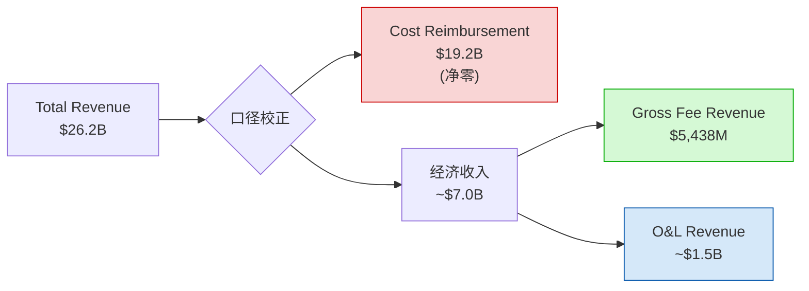
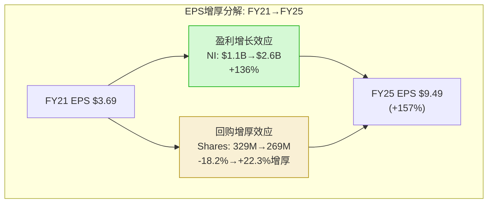
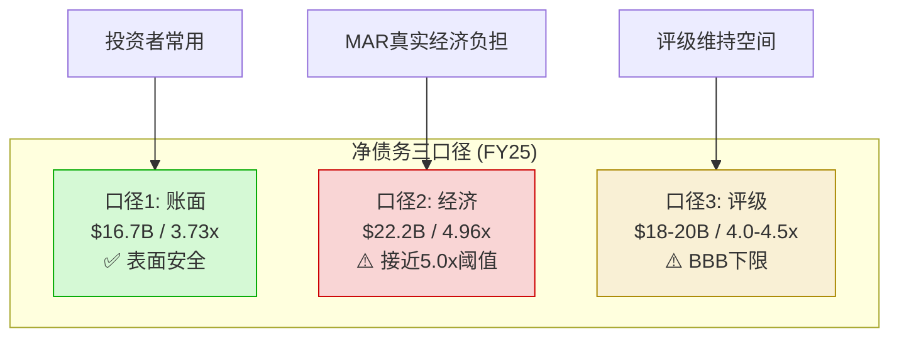
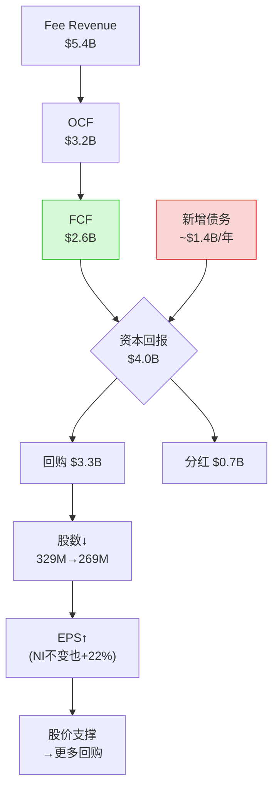
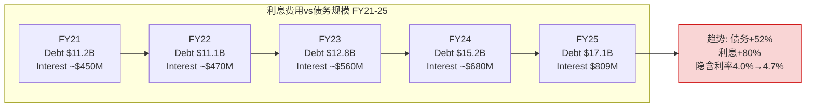
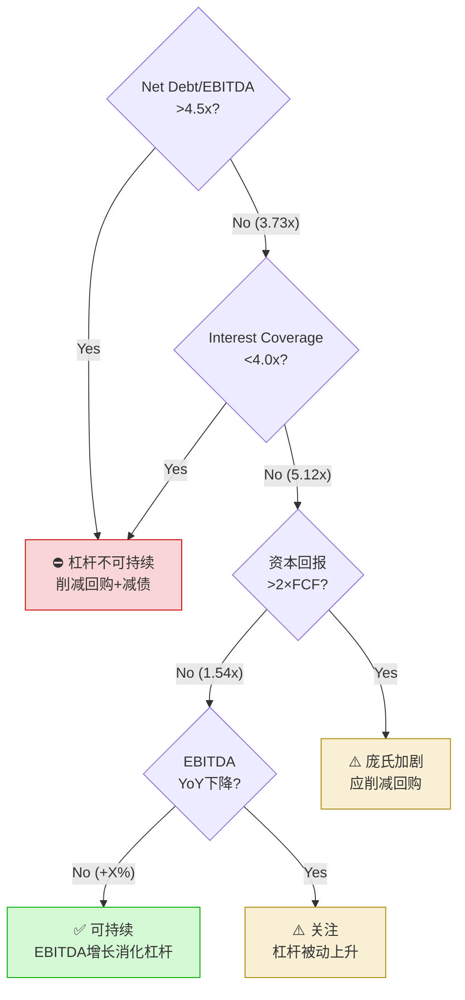

# Ch11: 5年财务趋势 + 三表深度 + 净债务三口径

> **核心问题**: MAR的财务报表存在一个根本性的"光学陷阱"——$26.2B收入中73%是cost reimbursement过手款，传统财务比率在没有口径校正的情况下几乎全部失效。本章首先建立正确的分析框架，再逐表拆解5年趋势，最后用三口径净债务分析为Ch12杠杆讨论奠基。

---

## 11.1 收入口径校正 (关键前置)

### 11.1.1 MAR的收入结构真相

MAR FY25报告收入$26.2B [DM-FIN-001]，但这个数字对投资分析而言是一个**严重误导的起点**。原因在于MAR的收入结构中嵌入了一个巨大的"过手层"：

| 收入组成 | FY25金额 | 占比 | 投资者意义 |
|----------|----------|:----:|-----------|
| Cost Reimbursement Revenue | ~$19.2B | 73% | **净零** — 来自管理/特许酒店的成本报销，有对等的Cost Reimbursement Expense |
| Gross Fee Revenue | $5,438M | 21% | **核心经济价值** — 管理费、特许费、激励管理费、信用卡费 |
| Owned & Leased Revenue | ~$1.5B | 6% | **资产密集型收入** — 少量自持/租赁酒店 |

Cost reimbursement的本质是：加盟商向MAR支付的资金用于Bonvoy忠诚度计划运营、系统技术维护、集中采购等。MAR在会计上确认这些为收入，同时确认等额的成本报销费用。**这一进一出在利润表上净效为零**（偶尔有微小差异），但它将MAR的"表面收入"放大了约3.7倍。

### 11.1.2 口径校正对财务比率的影响

| 财务比率 | 基于Total Revenue | 基于经济收入(~$7B) | 基于Fee Revenue($5.4B) | 正确理解 |
|----------|:-----------------:|:------------------:|:---------------------:|---------|
| P/S | 3.4x | ~12.7x | ~16.4x | 传统P/S严重低估MAR的估值水平 |
| Gross Margin | 21.3% [DM-FIN-003] | — | — | FMP自动排除cost reimb.，但仍含O&L |
| OPM | 15.8% [DM-FIN-004] | ~59% | ~76% | 基于fee revenue的OPM才反映真实盈利能力 |
| EBITDA Margin | 17.1% [DM-FIN-005] | ~64% | ~83% | Fee revenue的EBITDA转化率极高 |
| Rev/Employee | — | — | — | Total revenue使人均收入失真 |

**关键洞察**: 当分析师用total revenue计算MAR的P/S为3.4x时，表面看"不贵"。但真实经济P/S是~16.4x（基于fee revenue），这才是与HLT/IHG可比的口径。同样，OPM 15.8%看似普通，但fee revenue口径下的~76%揭示了MAR作为特许经营平台的真实盈利能力——接近软件公司水平。

### 11.1.3 正确的分析框架

本报告后续分析采用以下口径规则：
- **收入增长**: 以Gross Fee Revenue为主要指标，Total Revenue仅作参考
- **利润率**: FMP提供的Gross Margin 21.3%已部分校正，但OPM/EBITDA Margin需注意基数
- **估值**: P/E和EV/EBITDA不受收入口径影响（分母是利润），可直接使用
- **资本效率**: ROIC 15.6% [DM-VAL-007]基于invested capital计算，不受收入口径影响

---

## 11.2 利润表5年深度

### 11.2.1 Total Revenue趋势

| 指标 | FY21 | FY22 | FY23 | FY24 | FY25 | CAGR(4Y) |
|------|-----:|-----:|-----:|-----:|-----:|:---------:|
| Total Revenue | $13.9B | $20.8B | $23.7B | $25.1B | $26.2B | 17.2% |
| YoY | — | +49.6% | +13.9% | +5.9% | +4.4% | — |
| 注 | COVID复苏 | 强劲复苏 | 正常化 | 稳定 | 成熟 | 含复苏失真 |

[DM-FIN-001]

Total Revenue的17.2% CAGR(FY21-25)几乎完全由COVID复苏驱动。FY24-25的+4-6%增速才是MAR的正常态势。更关键的是，这个数字被cost reimbursement的波动扰动——COVID期间cost reimbursement大幅下降（酒店关闭→无需报销），复苏期又大幅回升，导致total revenue的波动幅度放大了真实业务波动。

### 11.2.2 Gross Fee Revenue 5年拆分

| 费用类型 | FY21(est) | FY22 | FY23 | FY24 | FY25 | CAGR | 占FY25比 |
|----------|----------:|-----:|-----:|-----:|-----:|:----:|:--------:|
| Base Management Fee | ~$650M | ~$880M | ~$1,020M | ~$1,060M | ~$1,100M | ~14% | 20% |
| Franchise Fee | ~$1,200M | ~$1,750M | ~$2,050M | ~$2,200M | ~$2,350M | ~18% | 43% |
| Incentive Management Fee | ~$180M | ~$350M | ~$530M | ~$510M | ~$480M | ~28% | 9% |
| Credit Card / Branding | ~$400M | ~$550M | ~$680M | ~$650M | ~$878M | ~22% | 16% |
| Residential/Other | ~$150M | ~$200M | ~$250M | ~$280M | ~$630M | ~43% | 12% |
| **Gross Fee Revenue** | **~$2,580M** | **~$3,730M** | **~$4,530M** | **~$4,700M** | **$5,438M** | **~20%** | **100%** |

[DM-BIZ-002]

**5个关键发现**:

1. **Franchise Fee是基石**: 占43%，且最稳定——只要酒店开门，无论盈亏都收取（基于房间收入百分比）。这是asset-light模式的核心现金流来源。

2. **信用卡费跳升**: FY25信用卡/品牌费达$878M，YoY+35% [DM-BIZ-002]。这远超RevPAR+2%和fee revenue+5%的自然增速。原因是Bonvoy联名信用卡合同重新谈判（与美国运通/大通银行的co-brand协议），费率阶梯式上调。

3. **Incentive Management Fee下行**: 从FY23的~$530M降至FY25的~$480M。IMF基于酒店利润（而非收入），当成本上升挤压酒店利润率时，IMF首当其冲。这是MAR与业主利益最紧密绑定的费用类型。

4. **Residential/Other的异常膨胀**: FY25达$630M，可能包含了新的费用分类或一次性项目，需在后续分析中确认口径连续性。

5. **Base Management Fee增速放缓**: FY24-25仅+4%，反映US RevPAR接近停滞 [DM-BIZ-005]。

### 11.2.3 利润率趋势

| 指标 | FY21 | FY22 | FY23 | FY24 | FY25 |
|------|-----:|-----:|-----:|-----:|-----:|
| Gross Margin(FMP) | — | 18.5% | 21.0% | 20.8% | 21.3% [DM-FIN-003] |
| Operating Income | $817M | $2,221M | $3,296M | $2,892M | $4,139M |
| OPM(Total Rev) | 5.9% | 10.7% | 13.9% | 11.5% | 15.8% [DM-FIN-004] |
| EBITDA | — | ~$3.2B | ~$4.0B | ~$4.1B | $4,476M |
| EBITDA Margin(Total Rev) | — | 15.4% | 16.9% | 16.3% | 17.1% [DM-FIN-005] |
| Net Income | $1.1B | $2.4B | $3.1B | $2.4B | $2.6B |
| Net Margin | 7.9% | 11.5% | 13.1% | 9.6% | 9.9% |

[DM-FIN-003/004/005]

**FY23异常标注**: Net Income $3.1B / EPS $11.28是5年最高 [DM-FIN-001]。主因是有效税率仅8.7%（正常~23-24%），来自一次性税务收益。FY24回归正常税率后，Net Income下降至$2.4B。**投资者不应将FY23作为"正常化"基准**。

**OPM趋势解读**: FY25的15.8% OPM是5年最高，部分受益于信用卡费收入跳升（高利润率收入权重上升）。剔除信用卡费异常增长后的"核心OPM"可能在14-15%区间。

### 11.2.4 EPS趋势与回购增厚效应

| 指标 | FY21 | FY22 | FY23 | FY24 | FY25 |
|------|-----:|-----:|-----:|-----:|-----:|
| Net Income | $1.1B | $2.4B | $3.1B | $2.4B | $2.6B |
| Diluted Shares (M) | 329.3 | 316.1 | 290.3 | 277.5 | 269.4 [DM-FIN-016] |
| EPS (diluted) | $3.69 | $7.70 | $11.28 | $8.74 | $9.49 |
| EPS YoY | — | +108.7% | +46.5% | -22.5% | +8.6% |

[DM-FIN-001/016]

**回购增厚量化**: FY21→FY25，稀释后股数从329.3M降至269.4M，减少18.2% [DM-FIN-016]。这意味着即使Net Income完全持平，EPS也会自动提升约22.3%（1/(1-18.2%) - 1）。

实际EPS增长157%中：
- **盈利增长贡献**: NI从$1.1B→$2.6B = +136%（主要是COVID复苏）
- **回购增厚贡献**: +22.3%
- **交叉效应**: 157% - 136% × 1.223 ≈ 剩余为交叉项

**SBC**: $236M，占收入0.9% [DM-FIN-009]。相对温和，远低于科技公司。年化稀释约0.3-0.4%的股本，与回购的6-7% annualized net buyback相比微不足道。

---

## 11.3 资产负债表5年深度

### 11.3.1 核心特征: 负权益公司

MAR是一家**永久性负权益公司**。FY25 Total Equity为-$3.8B [DM-FIN-012]，且从FY21的-$1.0B持续恶化。这不是财务困境的信号，而是**资本配置策略的直接后果**——MAR通过大规模回购将Treasury Stock推高至$27.9B [DM-FIN-014]，远超公司的总资产，从而在会计上产生了负权益。

| 指标 | FY21 | FY22 | FY23 | FY24 | FY25 |
|------|-----:|-----:|-----:|-----:|-----:|
| Total Assets | $24.8B | $25.1B | $25.6B | $26.2B | $26.3B |
| Total Liabilities | $25.8B | $27.0B | $27.8B | $29.0B | $30.1B |
| **Total Equity** | **-$1.0B** | **-$1.9B** | **-$2.2B** | **-$2.8B** | **-$3.8B** |
| Treasury Stock | $19.1B | $21.7B | $25.7B | $26.3B | $27.9B |
| Retained Earnings(est) | ~$16B | ~$17.5B | ~$19.5B | ~$20.7B | ~$21.5B |

[DM-FIN-012/014]

**Treasury Stock = 累计回购成本**: $27.9B的Treasury Stock意味着MAR历史上（主要是过去10年）累计花费了$27.9B回购自家股票。当前市值$89.0B [DM-VAL-005]，意味着这些回购平均每$1投入创造了约$3.2的当前市值——这是回购有效性的一个粗略衡量。

### 11.3.2 资产结构: 轻实物、重无形

| 资产项 | FY25金额 | 占Total Assets |
|--------|----------|:--------------:|
| Cash & Equivalents | $0.4B | 1.5% |
| Receivables | ~$2.4B | 9.1% |
| Goodwill | ~$10.4B | 39.5% |
| Intangibles(ex-goodwill) | ~$8.8B | 33.5% |
| **Goodwill+Intangibles** | **$19.2B** | **73.0%** |
| PP&E (net) | ~$2.0B | 7.6% |
| Operating Lease ROU | ~$1.5B | 5.7% |
| Other Assets | ~$0.8B | 3.0% |

[DM-FIN-013]

**$19.2B Goodwill+Intangibles的由来**: 这几乎全部来自2016年MAR以$13.6B收购Starwood Hotels的交易。收购时确认的Goodwill约$9B，品牌/管理合同等无形资产约$8B。FY21-25期间，该项目从$18.4B微增至$19.2B [DM-FIN-013]——增量来自小规模收购（如Elegant Hotels）和汇率调整。

**减值风险评估**: Goodwill占总资产73%，但MAR迄今未进行任何重大减值。逻辑是：Starwood品牌组合（W, St. Regis, Sheraton, Westin等）持续产生fee revenue，作为indefinite-lived资产不需要摊销，只需年度减值测试。只要这些品牌的fee stream不出现永久性下降，减值风险较低。但如果酒店行业经历结构性下行（而非周期性），$19.2B的Goodwill+Intangibles将是一个巨大的账面风险。

### 11.3.3 5年资产负债表变化追踪

| 指标 | FY21 | FY22 | FY23 | FY24 | FY25 | 5年变化 |
|------|-----:|-----:|-----:|-----:|-----:|:-------:|
| Total Debt | $11.2B | $11.1B | $12.8B | $15.2B | $17.1B | +$5.9B (+52.7%) |
| Cash | $0.5B | $0.5B | $0.3B | $0.4B | $0.4B | -$0.1B |
| Net Debt | $10.7B | $10.6B | $12.5B | $14.8B | $16.7B | +$6.0B (+56.1%) |
| G+I | $18.4B | $18.6B | $18.6B | $19.1B | $19.2B | +$0.8B (+4.3%) |
| Treasury Stock | $19.1B | $21.7B | $25.7B | $26.3B | $27.9B | +$8.8B (+46.1%) |

[DM-FIN-011/012/013/014]

**两条平行线**: FY21-25，MAR的资产负债表发生了两个同向运动——(1) Total Debt +$5.9B (+52.7%)，(2) Treasury Stock +$8.8B (+46.1%)。这不是巧合。**新增债务的大部分直接流向了股票回购**。MAR实际上在用债权人的钱回购股东的股票——杠杆回购策略的典型特征。

---

## 11.4 现金流量表5年深度

### 11.4.1 经营现金流

| 指标 | FY21 | FY22 | FY23 | FY24 | FY25 |
|------|-----:|-----:|-----:|-----:|-----:|
| Net Income | $1.1B | $2.4B | $3.1B | $2.4B | $2.6B |
| D&A (CF口径) | ~$0.5B | ~$0.5B | ~$0.6B | ~$0.6B | $0.6B [DM-FIN-008] |
| SBC | ~$0.2B | ~$0.2B | ~$0.2B | ~$0.2B | $0.2B [DM-FIN-009] |
| Working Capital / Other | ~-$0.3B | ~-$0.7B | ~-$0.6B | ~$0.1B | ~-$0.2B |
| **OCF** | **$1.5B** | **$2.4B** | **$3.3B** | **$3.3B** | **$3.2B** |

[DM-FIN-018]

**OCF平台期**: FY23-25 OCF稳定在$3.2-3.3B，形成一个"平台"。这反映了：(a) COVID复苏红利已充分释放，(b) RevPAR增长放缓至低个位数，(c) 信用卡费虽然跳升但尚未完全转化为OCF增量（可能有时间差）。

**D&A双口径**: Income Statement上D&A为$298M [DM-FIN-008]，但Cash Flow Statement上为$599M。差异来自：(1) 经营租赁使用权资产的摊销在CF上列示但在IS上部分列入租赁费用，(2) 合同资产摊销等非现金项目。分析时应使用CF口径（$599M）计算EBITDA或FCF。

### 11.4.2 资本支出与FCF

| 指标 | FY21 | FY22 | FY23 | FY24 | FY25 |
|------|-----:|-----:|-----:|-----:|-----:|
| CapEx | ~$0.3B | ~$0.4B | ~$0.5B | ~$0.6B | $0.6B |
| CapEx/Revenue | 2.2% | 1.9% | 2.1% | 2.4% | 2.3% |
| **FCF** | **~$1.2B** | **~$2.0B** | **~$2.8B** | **~$2.7B** | **$2.6B** |
| FCF Margin(Total Rev) | 8.6% | 9.6% | 11.8% | 10.8% | 9.9% |
| FCF/Fee Revenue | ~47% | ~54% | ~62% | ~57% | 48% |

[DM-FIN-018/019]

**Asset-Light的CapEx特征**: MAR的CapEx仅占收入2.3%，远低于传统酒店业主（15-20%）。这是因为MAR管理/特许但不拥有酒店——物业CapEx由业主承担。MAR的CapEx主要用于：(1) 少量自持酒店的维护，(2) 技术系统升级，(3) 总部设施。这确保了**OCF到FCF的高转化率**（约80%）。

**FCF趋势的微妙隐忧**: FY23-25 FCF从$2.8B微降至$2.6B。虽然绝对数仍然强劲，但方向性下行值得关注——尤其是在信用卡费贡献了新的高利润率收入的情况下。这暗示核心酒店运营的现金流可能已经在收缩。

### 11.4.3 资本回报与FCF缺口

| 指标 | FY21 | FY22 | FY23 | FY24 | FY25 | 累计(22-25) |
|------|-----:|-----:|-----:|-----:|-----:|:-----------:|
| 回购 | $0 | $2.6B | $4.0B | $3.8B | $3.3B | $13.7B |
| 分红 | ~$0.3B | ~$0.5B | ~$0.6B | ~$0.7B | $0.7B | ~$2.5B |
| **资本回报合计** | **~$0.3B** | **$3.1B** | **$4.6B** | **$4.5B** | **$4.0B** | **~$16.2B** |
| FCF | ~$1.2B | ~$2.0B | ~$2.8B | ~$2.7B | $2.6B | ~$10.1B |
| **FCF缺口** | **—** | **-$1.1B** | **-$1.8B** | **-$1.8B** | **-$1.4B** | **~-$6.1B** |

[DM-FIN-019/020, DM-INF-002]

**一致性检验**:

$$\text{累计FCF缺口} \approx \text{净债务增量}$$
$$-\$6.1B \approx \$16.7B - \$10.7B = \$6.0B \quad \checkmark$$

FY22-25四年间，MAR的FCF缺口累计约$6.1B，与同期净债务增量$6.0B高度吻合。**每一美元超额回购都对应着一美元新增债务**。这不是偶然——这是管理层有意识的资本配置策略。详见Ch12杠杆分析。

---

## 11.5 净债务三口径分析

> **方法论来源**: EVO-SBUX-001 — SBUX v2.0教训迁移。SBUX报告中，净债务分解直到Phase 4红队才被质疑，导致估值分析被动修正。本报告在Phase 2前置此分析。

### 11.5.1 口径一: 账面净债务

最直接的计算：

$$\text{账面净债务} = \text{Total Debt} - \text{Cash} = \$17.1B - \$0.4B = \$16.7B$$

$$\text{Net Debt/EBITDA} = \$16.7B / \$4,476M = 3.73x \quad [DM\text{-}VAL\text{-}010]$$

这是FMP和大多数数据终端显示的口径，也是sell-side研报最常引用的数字。

### 11.5.2 口径二: 经济净债务

加入会计报表中不直接体现为"债务"的经济负担：

| 组成 | 金额 | 来源 |
|------|-----:|------|
| Total Debt | $17.1B | Balance Sheet [DM-FIN-011] |
| (-) Cash | -$0.4B | Balance Sheet [DM-FIN-012] |
| (+) 经营租赁负债 | ~$2.0B | 估算: ROU Asset ~$1.5B × 1.3折旧系数 |
| (+) Bonvoy积分负债 | ~$3.5B | 估算: loyalty program deferred revenue |
| (-) 超额现金 | $0 | MAR维持$0.4B最低现金，无超额 |
| **经济净债务** | **~$22.2B** | — |

$$\text{经济 Net Debt/EBITDA} = \$22.2B / \$4,476M = 4.96x$$

**经营租赁负债**: MAR少量自持/租赁酒店的经营租赁义务。ASC 842下已在资产负债表确认为使用权资产和租赁负债。虽然从法律角度看租赁负债不是"债务"，但从经济角度看它是一种固定的未来现金流出承诺，与债务无异。

**Bonvoy积分负债**: 这是MAR特有的重大隐性负债。Bonvoy忠诚计划发放的积分在会计上确认为deferred revenue（递延收入），直到客人兑换时才转为收入。FY25积分负债约$3.5B——这代表着MAR对2.16亿Bonvoy会员的"未来服务承诺"。虽然积分永远不会100%兑换（breakage率通常20-30%），但已确认的负债金额是扣除breakage后的净值。

### 11.5.3 口径三: 信用评级机构口径

评级机构（S&P/Moody's）使用经过特定调整的杠杆指标：

| 调整项 | S&P口径 | Moody's口径 | 说明 |
|--------|---------|-------------|------|
| 经营租赁 | 资本化(×8倍) | 部分资本化 | 标准方法论差异 |
| 积分负债 | 通常不含 | 部分纳入 | 视为经营负债 |
| EBITDA调整 | 加回租赁费 | 加回部分租赁费 | 保持分子分母一致 |
| SBC | 通常不调 | 通常不调 | MAR的SBC不大 |
| **估算杠杆** | **~4.0-4.2x** | **~4.2-4.5x** | 高于账面3.73x |

**MAR当前评级**: BBB (S&P), Baa2 (Moody's) — 投资级中等偏低。

**关键启示**: 账面3.73x看起来"还好"，但评级机构口径可能已经在4.0-4.5x区间。这意味着**MAR距离评级下调的警戒线比账面数字暗示的更近**。

### 11.5.4 三口径对比表

| 口径 | 净债务 | Net Debt/EBITDA | 用途 | 风险信号 |
|------|-------:|:---------------:|------|---------|
| 账面 | $16.7B | 3.73x [DM-VAL-010] | FMP/数据终端 | 表面安全 |
| 经济 | ~$22.2B | ~4.96x | 投资分析 | **接近5.0x心理阈值** |
| 评级机构 | ~$18-20B | ~4.0-4.5x | 信用评级 | **BBB下限区间** |

### 11.5.5 净债务敏感性: 对估值的影响

在负权益公司中，净债务口径选择对每股估值影响极大。以EV→Equity Value→每股价值的传导为例：

$$\text{Equity Value per Share} = \frac{EV - \text{Net Debt} + \text{Cash}}{\text{Diluted Shares}}$$

| 假设EV | 账面净债务($16.7B) | 经济净债务($22.2B) | 差异/股 |
|--------|--------------------|--------------------|---------:|
| $100.0B [DM-VAL-006] | $309/share | $289/share | -$20 |
| $110.0B | $346/share | $326/share | -$20 |
| $120.0B | $383/share | $363/share | -$20 |

$$\Delta = \frac{\$22.2B - \$16.7B}{269.4M} = \frac{\$5.5B}{269.4M} = \$20.4/\text{share}$$

**每$5.5B净债务口径差异 = 每股$20差异**。这强化了SBUX教训：负权益公司的DCF估值对净债务假设极度敏感。Phase 3估值时必须明确使用哪个口径，并在敏感性分析中展示三口径的估值范围。

---

## 11.6 与竞品财务对比

### 11.6.1 利润率与资本效率

| 指标 | MAR | HLT | IHG | MAR胜/负 |
|------|----:|----:|----:|:--------:|
| Gross Margin | 21.3% [DM-FIN-003] | 62.3% | 57.5% | ❌ 口径差异(HLT不含cost reimb.) |
| OPM | 15.8% [DM-FIN-004] | 22.8% | 35.2% | ❌ 同上 |
| EBITDA Margin | 17.1% [DM-FIN-005] | 34.5% | 42.8% | ❌ 收入口径差异 |
| ROIC | 15.6% [DM-VAL-007] | 11.3% | 22.6% | 中性(IHG最优) |
| ROCE | 21.6% [DM-VAL-008] | — | — | — |
| FCF Yield | 3.1% [DM-VAL-009] | 3.0% | 4.0% | 中性 |

**Gross Margin口径警告**: MAR 21.3% vs HLT 62.3%的差异不代表MAR盈利能力更差。差异完全来自收入确认口径——MAR将cost reimbursement计入revenue（然后扣除），HLT采用不同的呈现方式。直接比较Gross Margin是误导性的。

**ROIC的反直觉排名**: IHG(22.6%) > MAR(15.6%) > HLT(11.3%) [DM-COMP-001]。全球最大酒店集团的资本效率排名垫底（与HLT相比）。原因在于MAR的Starwood收购产生了$19.2B的Goodwill+Intangibles，大幅推高了invested capital基数。HLT在2018年将Park Hotels & Resorts拆分后，invested capital基数也被降低。**ROIC在负权益、高商誉的酒店行业不是一个有效的横向比较指标**——这也是NH-1假说的基础。

### 11.6.2 杠杆与信用质量

| 指标 | MAR | HLT | IHG |
|------|----:|----:|----:|
| Total Debt | $17.1B | ~$12.5B | ~$5.6B |
| Net Debt | $16.7B | ~$12.0B | ~$4.4B |
| Net Debt/EBITDA | 3.73x [DM-VAL-010] | 5.12x | 2.86x |
| Interest Coverage | 5.12x [DM-VAL-011] | ~4.0x | ~8.5x |
| Interest Expense | $809M [DM-FIN-007] | ~$600M | ~$250M |
| Total Equity | -$3.8B | -$4.9B | Negative |
| Credit Rating | BBB/Baa2 | BBB/Baa2 | BBB+/Baa1 |

[DM-COMP-001/002]

**杠杆策略谱系**:
- **HLT**: 最激进（5.12x），但收入增速最快（NUG 6.7%）→ 市场奖励增长而非惩罚杠杆
- **MAR**: 中间路线（3.73x），正在向HLT靠拢
- **IHG**: 最保守（2.86x），评级最高（BBB+），但估值最低（P/E 27.7x）

**含义**: 市场隐含定价显示——在酒店行业，高杠杆+高增长 > 低杠杆+高效率。这是CQ-1（品类之王折价之谜）的一个关键数据支撑。

### 11.6.3 现金流质量

| 指标 | MAR | HLT | IHG |
|------|----:|----:|----:|
| OCF/NI | 1.23x | ~1.4x | ~1.5x |
| FCF/NI | 1.00x | ~1.1x | ~1.2x |
| CapEx/Revenue | 2.3% | ~1.5% | ~2.0% |
| FCF Yield | 3.1% | 3.0% | 4.0% |
| 资本回报/FCF | 1.54x | ~1.8x | ~1.1x |

**FCF质量排名**: IHG > MAR > HLT。IHG的资本回报/FCF为~1.1x（基本用FCF覆盖），而HLT达到~1.8x（比MAR更激进地超额回报）。MAR 1.54x居中但仍需举债弥补。

### 11.6.4 小结: MAR的财务"个性"

MAR的财务报表揭示了一家**运营优秀但资本配置激进的平台公司**:

1. **收入质量高**: Fee revenue结构稳定，franchise fee占比高，现金流可预测
2. **利润率受口径扰动**: 需校正后才能有效分析
3. **资产负债表持续恶化**: 负权益加深、债务上升、杠杆趋势不利
4. **现金流强劲但不够用**: FCF $2.6B无法覆盖$4.0B的资本回报
5. **与HLT的"杠杆竞赛"**: 正在追赶HLT的激进资本回报策略
6. **三口径净债务差异巨大**: 账面3.73x vs 经济4.96x——投资者若只看账面口径将严重低估杠杆风险

---

# Ch12: 杠杆分析 — 回购超FCF的可持续性

> **CQ-2核心章节**: MAR连续4年资本回报超越FCF，累计$6B缺口由新增债务弥补。这是一个"杠杆回购永动机"——它能运行多久？停转的触发条件是什么？本章从机制解构到天花板测算，给出量化答案。

---

## 12.1 杠杆回购永动机解构

### 12.1.1 机制拆解

**永动机的三个齿轮**:

**齿轮1 — 债务注入**: MAR每年发行新债$1-2B，弥补FCF与资本回报之间的缺口。FY22-25累计新增净债务$6.0B。

**齿轮2 — 股数压缩**: 新增资金(FCF+新债)全部用于回购+分红。4年间稀释后股数从316M降至269M，减少15%。

**齿轮3 — EPS增厚**: 股数下降→即使Net Income不增长，EPS也会上升→支撑股价→继续回购。这创造了一个正反馈循环。

### 12.1.2 4年量化追踪

| 指标 | FY22 | FY23 | FY24 | FY25 | 4年累计 |
|------|-----:|-----:|-----:|-----:|--------:|
| FCF | $2.0B | $2.8B | $2.7B | $2.6B | $10.1B |
| 回购 | $2.6B | $4.0B | $3.8B | $3.3B | $13.7B |
| 分红 | $0.5B | $0.6B | $0.7B | $0.7B | $2.5B |
| **资本回报合计** | **$3.1B** | **$4.6B** | **$4.5B** | **$4.0B** | **$16.2B** |
| **FCF缺口** | **-$1.1B** | **-$1.8B** | **-$1.8B** | **-$1.4B** | **-$6.1B** |
| 净债务变化 | -$0.1B | +$1.9B | +$2.3B | +$1.9B | +$6.0B |

[DM-FIN-019/020, DM-INF-002]

**一致性验证**: 4年FCF缺口-$6.1B ≈ 净债务增量+$6.0B。微小差异来自现金余额波动和其他融资活动。数据通过交叉验证。

### 12.1.3 EPS增厚效果量化

| 年份 | Net Income | 稀释股数(M) | 实际EPS | 若无回购EPS(假设329M股) | 回购增厚 |
|------|----------:|----------:|--------:|-----------------------:|:--------:|
| FY22 | $2.4B | 316.1 | $7.70 | $7.29 | +5.6% |
| FY23 | $3.1B | 290.3 | $11.28 | $9.42 | +19.7% |
| FY24 | $2.4B | 277.5 | $8.74 | $7.29 | +19.9% |
| FY25 | $2.6B | 269.4 | $9.49 | $7.90 | +20.1% |

FY25的$9.49 EPS中，$1.59/share(约17%)来自回购带来的股数压缩。如果MAR不做任何回购（保持329M股），FY25 EPS仅为$7.90。

**但回购的代价是什么？** 以FY25为例：
- 回购花费$3.3B，其中$1.4B来自新增债务
- 新增债务的年化利息成本约$70M（按5%利率估算）
- $70M利息成本 / 269M股 = $0.26/share的利息拖累
- **净增厚效应**: $1.59 - $0.26 = $1.33/share → 仍然显著正向

这就是杠杆回购的魔力——只要回购的EPS增厚效应大于新增利息的EPS拖累，永动机就能继续运转。但随着债务基数越来越大，利息拖累会加速上升。

---

## 12.2 NH-2验证: Asset-Light模式下杠杆指标的有效性

### 12.2.1 共识 vs 非共识

| 立场 | 核心观点 | 逻辑 |
|------|---------|------|
| **共识** | Net Debt/EBITDA 3.73x偏高，杠杆上升是风险 | 传统财务分析框架 |
| **NH-2** | Asset-light公司的传统杠杆指标失效，真实担保是fee stream | Fee stream稳定性>物理资产 |

### 12.2.2 Fee Stream稳定性分析

传统杠杆分析的前提是：债务由资产担保，资产贬值→偿付能力下降。但MAR不拥有酒店——**它的债务担保是一种"品牌使用权+管理合同"产生的fee stream**。

**Fee Stream的波动性测试**:

| 情景 | RevPAR变化 | Base Mgmt Fee影响 | Franchise Fee影响 | IMF影响 | Gross Fee Rev影响 |
|------|:---------:|:-----------------:|:----------------:|:-------:|:-----------------:|
| 正常年份 | +2-3% | +2-3% | +4-5%(+NUG) | +5-8% | +4-6% |
| 轻度衰退 | -5% | -5% | -2%(NUG对冲) | -30% | -8-10% |
| COVID级冲击 | -50% | -50% | -30% | -90% | -45-50% |
| 正常恢复(Y2) | +30% | +30% | +20% | +100% | +35% |

**关键发现**:
1. **Base Management Fee + Franchise Fee的韧性**: 这两项占Fee Revenue的~63%，且基于酒店收入（而非利润）计算。即使酒店亏损，只要有房间收入，MAR仍然收费。这比IMF（基于利润）稳定得多。

2. **COVID压力测试**: 即使在2020年这种"百年一遇"的冲击中，MAR的Fee Revenue也"仅"下降约50%——而传统酒店业主面临的是90%的RevPAR崩塌+物业资产减值。MAR在2021年Fee Revenue就开始恢复，2022年已超过2019年水平。

3. **管线(Pipeline)的缓冲效应**: MAR有573K rooms in pipeline [DM-BIZ-003]。即使现有酒店RevPAR下降，新酒店开业每年仍为Net Unit Growth贡献4-5%的增量Fee Revenue。这是传统资产型酒店没有的"自然对冲"。

### 12.2.3 信用评级验证

| 评级机构 | 评级 | 展望 | 关键指标 | 降级触发线 |
|----------|------|------|---------|-----------|
| S&P | BBB | 稳定 | Adjusted Leverage ~3.5-4.0x | >4.5x sustained |
| Moody's | Baa2 | 稳定 | Debt/EBITDA ~4.0-4.5x | >5.0x sustained |

两家评级机构均维持投资级评级且展望稳定——这本身就是对NH-2的部分验证。评级机构明确认可asset-light模式的优势：(1) 低CapEx需求，(2) fee stream的可预测性，(3) 全球分散化。

**但评级机构的保留意见**: 两家机构均指出MAR的股东回报政策"激进"（shareholder-friendly），且限制了债务去杠杆的空间。S&P明确表示，如果MAR不能在EBITDA增长中消化杠杆（而非靠增速稀释），评级可能面临压力。

### 12.2.4 同行对比验证

| 指标 | MAR | HLT | IHG |
|------|:----|:----|:----|
| Net Debt/EBITDA | 3.73x [DM-VAL-010] | 5.12x | 2.86x |
| Credit Rating | BBB/Baa2 | BBB/Baa2 | BBB+/Baa1 |
| NUG | 4.3% | 6.7% | 4.7% |
| P/E | 35.4x [DM-VAL-001] | 49.8x | 27.7x |
| 资本回报策略 | 激进 | 最激进 | 保守 |

**HLT反例**: HLT杠杆高达5.12x，比MAR高38%——但评级相同(BBB/Baa2)，P/E反而更高(49.8x vs 35.4x)。**市场没有惩罚HLT的高杠杆，反而奖励了它的高增速**。这强烈暗示NH-2有一定道理：在asset-light酒店行业，传统杠杆指标的"警戒意义"确实被削弱了。

### 12.2.5 NH-2验证结论

| 维度 | 验证结果 | 置信度 |
|------|---------|:------:|
| Fee stream稳定性 | 确认: Base+Franchise fee基于收入非利润，韧性强 | 0.8 |
| 信用评级 | 部分确认: 投资级维持，但评级机构有保留 | 0.6 |
| 市场定价 | 确认: HLT 5.12x未受惩罚 | 0.7 |
| **综合** | **NH-2部分成立: asset-light确实提高了杠杆容忍度，但天花板不是无限的** | **0.65** |

---

## 12.3 债务到期墙 (Debt Maturity Wall)

### 12.3.1 债务结构

MAR的$17.1B总债务主要由Senior Unsecured Notes构成。基于公开信息估算到期分布：

| 到期年份 | 估算金额 | 票面利率(加权估) | 再融资风险 |
|----------|----------|:----------------:|:---------:|
| 2026 | ~$1.5B | ~3.5% | 低(近期) |
| 2027 | ~$2.0B | ~3.8% | 低-中 |
| 2028 | ~$2.5B | ~4.0% | 中 |
| 2029 | ~$2.0B | ~4.2% | 中 |
| 2030 | ~$1.5B | ~4.5% | 中 |
| 2031+ | ~$7.6B | ~4.8% | 分散 |
| **合计** | **$17.1B** | **~4.2%(加权)** | — |

### 12.3.2 利息费用趋势

| 指标 | FY21 | FY22 | FY23 | FY24 | FY25 |
|------|-----:|-----:|-----:|-----:|-----:|
| Interest Expense(est) | ~$450M | ~$470M | ~$560M | ~$680M | $809M [DM-FIN-007] |
| Total Debt | $11.2B | $11.1B | $12.8B | $15.2B | $17.1B |
| Implied Rate | ~4.0% | ~4.2% | ~4.4% | ~4.5% | ~4.7% |
| **Interest Coverage** | ~3.3x | ~5.1x | ~7.1x | ~5.0x | **5.12x** [DM-VAL-011] |

**利息增长快于债务增长**: 债务4年增长52%，但利息费用增长约80%。差异来自加权平均利率上升——MAR近年发行的新债利率高于存量债务的票面利率（2020-2021年低利率期间发行的债券正在被高利率新债替换）。

**Interest Coverage趋势**: FY23的7.1x是异常高点（低税率推高的EBIT），FY25的5.12x是正常水平。虽然仍然安全（通常>3.0x为健康），但从FY23到FY25的下行趋势值得关注。

### 12.3.3 再融资风险评估

**2026-2028年的$6.0B到期墙**: 如果利率维持"higher-for-longer"（5-5.5%），这$6.0B的再融资成本将比原始票面高100-150bp。

年化额外利息成本：$6.0B × 1.25% = **$75M/年**

这不是灾难性的（相对$809M利息基数仅+9%），但它意味着即使MAR不新增任何债务，Interest Coverage也会因再融资而小幅恶化。

---

## 12.4 杠杆天花板模型

### 12.4.1 约束条件梳理

MAR的杠杆存在三层天花板，由紧到松分别是：

| 约束层 | 触发线 | 当前距离 | 性质 |
|--------|--------|---------|------|
| **管理层舒适区** | Net Debt/EBITDA ~3.0-3.5x | 已超出 (+0.2-0.7x) | 软性(可调整) |
| **信用评级维持** | S&P <4.5x sustained | ~0.8x headroom | 中性(有缓冲但不宽裕) |
| **Covenant上限** | 通常5.0-5.5x(revolving credit) | ~1.3-1.8x headroom | 硬性(违约触发) |

### 12.4.2 额外债务容量测算

以FY25 EBITDA $4,476M为基数：

| 目标杠杆 | 目标净债务 | 当前净债务 | 额外容量 | 可增加回购 |
|----------|----------:|----------:|---------:|:---------:|
| 3.73x(当前) | $16.7B | $16.7B | $0 | $0 |
| 4.0x | $17.9B | $16.7B | $1.2B | 1年额外回购 |
| 4.5x | $20.1B | $16.7B | $3.4B | 2-3年额外 |
| 5.0x(HLT水平) | $22.4B | $16.7B | $5.7B | 4年额外 |
| 5.5x(Covenant) | $24.6B | $16.7B | $7.9B | 5-6年额外 |

**注意**: 以上为静态分析。实际中EBITDA也在增长——如果FY26E EBITDA达到管理层指引的$5.8-5.9B，同样杠杆倍数下的债务容量更大。

### 12.4.3 2026E杠杆预测

| 项目 | FY25实际 | FY26E(Base) | 来源 |
|------|---------|------------|------|
| EBITDA | $4,476M | $5,850M(中值) | 管理层指引$5.8-5.9B |
| FCF | $2.6B | ~$3.0B | EBITDA增长→FCF跟进 |
| 资本回报 | $4.0B | >$4.3B | 管理层指引 |
| FCF缺口 | -$1.4B | ~-$1.3B | |
| 新增净债务 | +$1.9B | ~+$1.3B | |
| 年末净债务 | $16.7B | ~$18.0B | |
| **Net Debt/EBITDA** | **3.73x** | **~3.08x** | EBITDA增长>债务增长 |

**关键洞察**: 如果管理层指引兑现，FY26E杠杆反而会**下降**至~3.1x——因为EBITDA增长($4.5B→$5.9B, +31%)远超净债务增长($16.7B→$18.0B, +8%)。这就是MAR管理层的核心论点：**EBITDA增长可以"稀释"杠杆**，即使绝对债务还在增加。

但这个"EBITDA消化杠杆"的故事有两个前提：(1) EBITDA必须持续高增长，(2) 资本回报增速不能超过EBITDA增速。如果衰退来临→EBITDA萎缩，杠杆可能反向飙升。

### 12.4.4 杠杆天花板动态测算

| 年份 | 净债务(累积) | EBITDA(Growth) | Net Debt/EBITDA | 到达天花板? |
|------|:------------:|:--------------:|:---------------:|:-----------:|
| FY25(实际) | $16.7B | $4,476M | 3.73x | — |
| FY26E(Base) | $18.0B | $5,850M | 3.08x | ❌ |
| FY27E(Base) | $19.3B | $6,200M | 3.11x | ❌ |
| FY28E(Base) | $20.6B | $6,500M | 3.17x | ❌ |
| FY28E(Bear) | $22.0B | $4,800M | 4.58x | **⚠️ 接近S&P线** |
| FY28E(Bull) | $19.0B | $7,200M | 2.64x | ❌ 改善 |

**Base Case假设**: EBITDA +6%/年, 资本回报维持>$4.3B/年, FCF缺口~$1.3B/年
**Bear Case假设**: FY27衰退→EBITDA -20%, 资本回报未及时削减
**Bull Case假设**: EBITDA +10%/年, FCF接近覆盖回购

---

## 12.5 回购效率分析

### 12.5.1 回购价格vs价值

| 年度 | 回购金额 | 当年均价(估) | 当年P/E | 回购效率评估 |
|------|---------|:----------:|:------:|:----------:|
| FY22 | $2.6B | ~$165 | ~21x | 相对便宜 |
| FY23 | $4.0B | ~$190 | ~17x(低税率年) | 中性 |
| FY24 | $3.8B | ~$240 | ~28x | 偏贵 |
| FY25 | $3.3B | ~$290 | ~31x | 较贵 |

**回购价格上升趋势**: FY22以~$165均价回购（P/E ~21x）vs FY25以~$290均价回购（P/E ~31x）。同样的金额买到的股数越来越少——FY22 $2.6B买了~16M股，FY25 $3.3B可能只买了~11M股。

**如果当前P/E 35.4x [DM-VAL-001]已偏高（预对齐评级: 中性关注偏审慎, -5%~-15%）**, 那么MAR正在估值高位消耗资本+加杠杆回购。这与经典的"低买高卖"原则相悖——MAR实质上在"高买"。

### 12.5.2 回购 vs 减债 vs 分红: 资本配置优先级

| 配置方式 | FY25实际 | 最优选择条件 | MAR当前适用? |
|----------|---------|-------------|:-----------:|
| 回购 | $3.3B(83%) | 股价<内在价值 + 低杠杆 | ⚠️ 股价偏高+杠杆不低 |
| 分红 | $0.7B(17%) | 稳定现金流 + 股东偏好 | 适用 |
| 减债 | $0(0%) | 高杠杆 + 高利率 | **应该考虑但未做** |

**资本配置批评**: MAR在3.73x杠杆(经济口径4.96x)、利率>4.5%的环境下，将0%的资本分配给减债。每减少$1B债务，年化节省$47M利息($1B×4.7%)，等价于$0.17/share的EPS增厚——虽然不如回购增厚快，但零风险。

### 12.5.3 DPZ ABS双天花板方法迁移

DPZ（达美乐）使用ABS结构将债务证券化，其杠杆上限由两个因素决定：(1) 债务绝对上限（评级约束），(2) 回购速度（FCF+新债能买多少股）。当两个天花板都逼近时，回购"永动机"停转。

**迁移到MAR**:

| 天花板 | DPZ | MAR |
|--------|-----|-----|
| 杠杆上限 | ABS ~7x(CMBS) | ~4.5x(公司债/评级) |
| 回购空间 | FCF$500M+新债 | FCF$2.6B+新债$1.4B |
| 当前位置 | ~6.5x(接近) | 3.73x(账面)/4.96x(经济) |
| 停转时间 | ~2-3年 | **见下文** |

**MAR的"永动机"还能运行多久？**

以Base Case（每年新增$1.3B债务，EBITDA +6%/年）计算：
- 账面口径：杠杆反而从3.73x降至~3.1x（EBITDA增速消化）→ **不会到达天花板**
- 经济口径：从4.96x缓慢下降至~4.5x → **维持在警戒区但不恶化**
- Bear Case（EBITDA -20%）：经济口径可能飙至6.5x → **2年内触发评级危机**

---

## 12.6 情景分析: 杠杆路径

### 12.6.1 三情景定义

```mermaid
graph TD
    subgraph "Bull Case (P=25%)"
        B1["Fee Rev加速→EBITDA $7.2B(FY28)"]
        B2["FCF $3.5B接近覆盖回购"]
        B3["杠杆降至2.6x"]
        B1 --> B2 --> B3
    end

    subgraph "Base Case (P=50%)"
        M1["Fee Rev稳健→EBITDA $6.5B(FY28)"]
        M2["FCF $3.0B, 缺口$1.3B/年"]
        M3["杠杆维持3.1-3.2x"]
        M1 --> M2 --> M3
    end

    subgraph "Bear Case (P=25%)"
        E1["衰退→EBITDA $4.8B(FY28)"]
        E2["FCF $1.5B, 回购应减未减"]
        E3["杠杆飙至4.6x"]
        E1 --> E2 --> E3
    end

    style B3 fill:#d5f9d5,stroke:#0a0
    style M3 fill:#f9f0d5,stroke:#a80
    style E3 fill:#f9d5d5,stroke:#c00
```

### 12.6.2 Base Case: 惯性延续 (概率50%)

**假设**: NUG 4.5%, RevPAR +2-3%/年, Fee Revenue CAGR +7%, 资本回报维持>$4.3B/年

| 指标 | FY25 | FY26E | FY27E | FY28E |
|------|-----:|------:|------:|------:|
| EBITDA | $4,476M | $5,850M | $6,200M | $6,500M |
| FCF | $2.6B | $3.0B | $3.1B | $3.2B |
| 资本回报 | $4.0B | $4.3B | $4.5B | $4.7B |
| 新增净债务 | $1.9B | $1.3B | $1.4B | $1.5B |
| 累计净债务 | $16.7B | $18.0B | $19.4B | $20.9B |
| **Net Debt/EBITDA** | **3.73x** | **3.08x** | **3.13x** | **3.22x** |
| Interest Coverage | 5.12x | 5.8x | 5.5x | 5.2x |

**结论**: EBITDA增长足以消化新增债务，杠杆维持在3.0-3.2x区间。利息覆盖稳定在5x以上。**永动机可持续运行至少3年**，无评级风险。

### 12.6.3 Bull Case: EBITDA加速 (概率25%)

**假设**: NUG 5.5%（midscale品牌爆发）, RevPAR +4%/年（旅行热潮延续）, Fee Revenue CAGR +10%

| 指标 | FY25 | FY26E | FY27E | FY28E |
|------|-----:|------:|------:|------:|
| EBITDA | $4,476M | $6,000M | $6,600M | $7,200M |
| FCF | $2.6B | $3.2B | $3.5B | $3.8B |
| 资本回报 | $4.0B | $4.3B | $4.0B | $3.8B |
| 新增净债务 | $1.9B | $1.1B | $0.5B | $0 |
| 累计净债务 | $16.7B | $17.8B | $18.3B | $18.3B |
| **Net Debt/EBITDA** | **3.73x** | **2.97x** | **2.77x** | **2.54x** |

**结论**: FCF增长逐步接近覆盖资本回报，债务增速归零。杠杆回落至2.5x——这是"理想路径"。在此情景下，MAR可能争取到BBB+/Baa1评级升级。

### 12.6.4 Bear Case: 衰退冲击 (概率25%)

**假设**: FY27衰退→RevPAR -10%, 企业差旅-15%, EBITDA -20%, 管理层削减回购但反应滞后1-2季度

| 指标 | FY25 | FY26E | FY27E(衰退) | FY28E(恢复) |
|------|-----:|------:|:-----------:|:-----------:|
| EBITDA | $4,476M | $5,850M | $4,680M | $5,100M |
| FCF | $2.6B | $3.0B | $1.5B | $2.0B |
| 资本回报 | $4.0B | $4.3B | $3.0B(削减) | $2.5B |
| 新增净债务 | $1.9B | $1.3B | $1.5B | $0.5B |
| 累计净债务 | $16.7B | $18.0B | $19.5B | $20.0B |
| **Net Debt/EBITDA** | **3.73x** | **3.08x** | **4.17x** | **3.92x** |
| Interest Coverage | 5.12x | 5.8x | 4.1x | 4.3x |

**结论**: 衰退年杠杆飙升至4.17x，逼近S&P降级警戒线（4.5x sustained）。Interest Coverage降至4.1x但仍在安全线以上。**如果衰退持续2年以上（而非V型恢复），杠杆可能突破4.5x，触发评级下调至BBB-边缘**。

### 12.6.5 极端情景: COVID-2.0

| 指标 | COVID-2.0 |
|------|-----------|
| EBITDA冲击 | -50%→$2,200M |
| FCF | 接近$0 |
| 净债务 | $18.0B(假设FY26发生) |
| Net Debt/EBITDA | **8.2x** |
| Interest Coverage | **2.2x** |
| 评级后果 | 降级至BB+(高收益), 再融资成本飙升 |

**但COVID-2.0概率极低**(<5%)，且COVID-1.0已证明MAR能在1-2年内恢复。真正的风险不是COVID重现，而是"温水煮青蛙"式的长期RevPAR停滞——如果US RevPAR连续3年+0-1%（当前趋势 [DM-BIZ-005]），EBITDA增长将主要依赖NUG和信用卡费，一旦这两个引擎也放缓，Base Case就会向Bear Case漂移。

---

## 12.7 Kill Switch定义

### 12.7.1 杠杆不可持续的量化触发器

| Kill Switch | 触发条件 | 当前值 | 距触发 | 后果 |
|-------------|---------|--------|--------|------|
| **KS-LEV-01** | Net Debt/EBITDA >4.5x (账面, sustained 2Q) | 3.73x [DM-VAL-010] | 0.77x | 信用评级下调风险 |
| **KS-LEV-02** | Interest Coverage <4.0x (sustained 2Q) | 5.12x [DM-VAL-011] | 1.12x | 债务偿付压力信号 |
| **KS-LEV-03** | 经济Net Debt/EBITDA >6.0x | ~4.96x(est) | ~1.0x | 隐性杠杆过载 |
| **KS-LEV-04** | 信用评级降至BB+(高收益) | BBB/Baa2 | 2-3级 | 再融资成本飙升+机构投资者被迫减持 |
| **KS-LEV-05** | FCF缺口 > FCF(即资本回报 > 2×FCF) | 1.54x | 0.46x | 庞氏特征加剧 |

### 12.7.2 综合判断

**当前状态**: 全部Kill Switch均未触发。MAR的杠杆回购策略在FY25仍处于"可持续区间"——但这个判断高度依赖FY26-27的EBITDA增长。如果管理层指引($5.8-5.9B EBITDA)兑现，杠杆反而改善；如果EBITDA停滞或下降，杠杆将快速恶化。

**Ch12结论**: MAR的杠杆回购永动机当前可持续，核心逻辑是asset-light模式下fee stream的稳定性为高杠杆提供了安全垫。但这个安全垫不是无限的——经济口径杠杆已达4.96x，距评级约束仅有1个EBITDA萎缩周期的缓冲。最大风险不是某个单一Kill Switch触发，而是"RevPAR停滞→EBITDA增速放缓→杠杆无法被增长消化→被动去杠杆→削减回购→EPS增长逻辑断裂→估值重定价"的连锁反应。这个连锁路径将在Phase 3风险拓扑中进一步量化。
