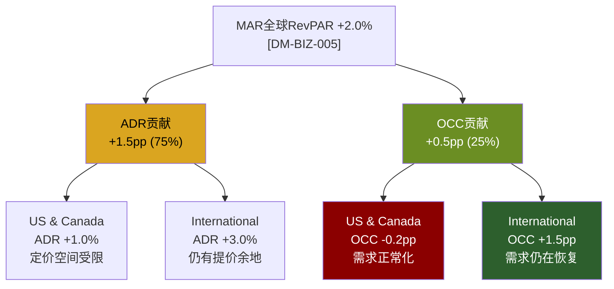
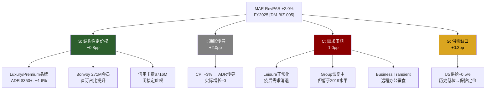
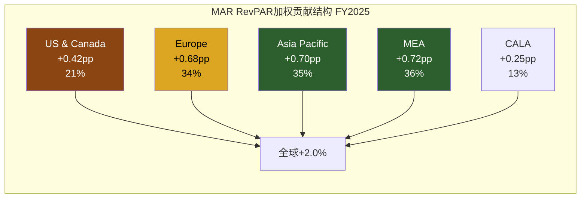
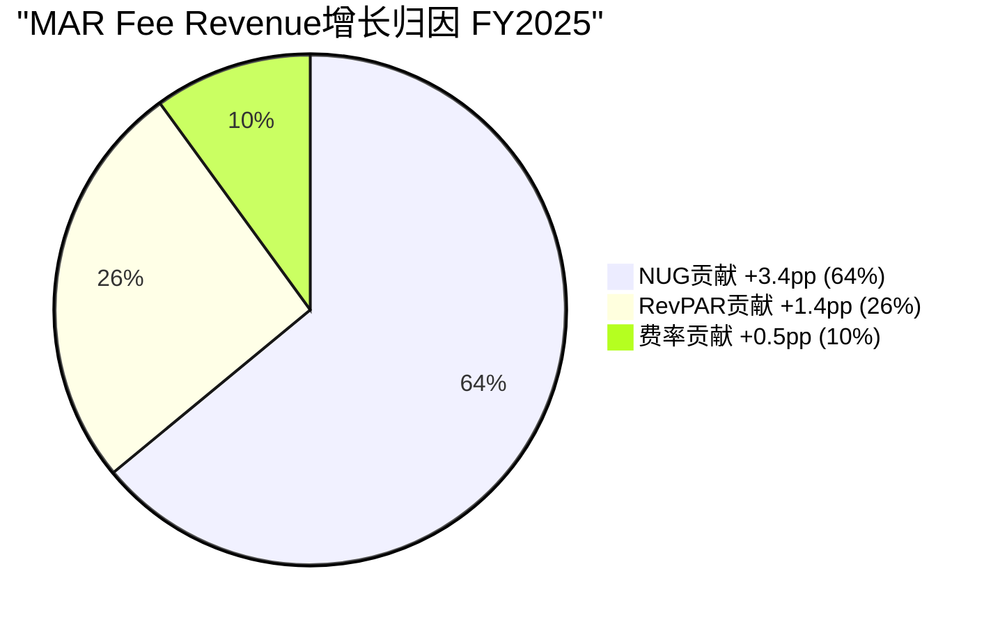
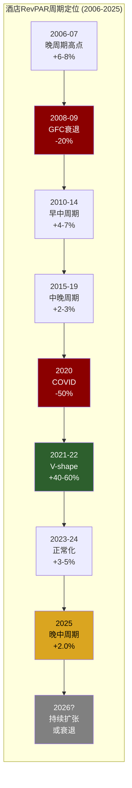
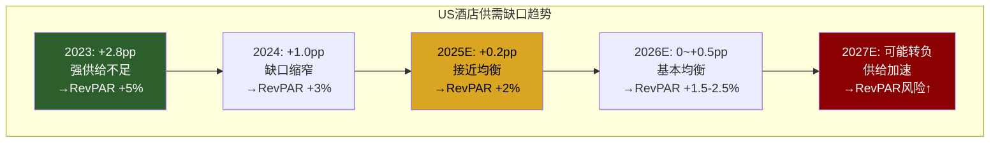
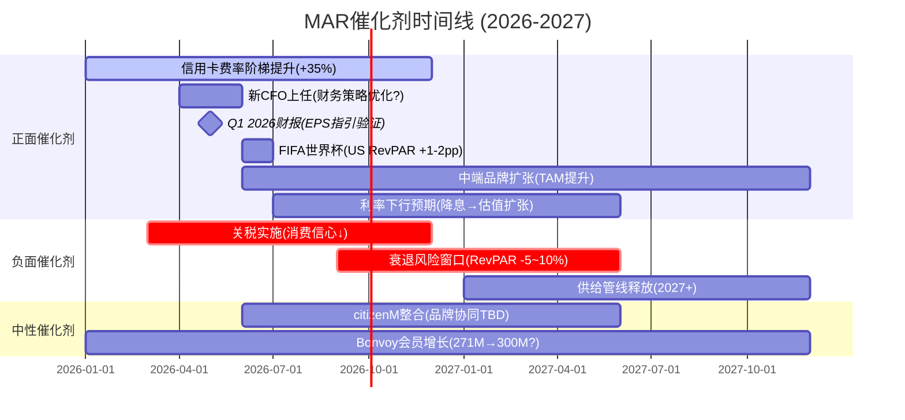
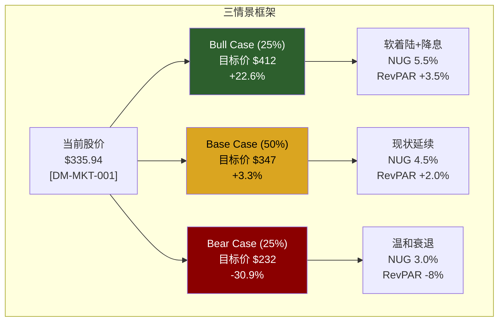

# Ch13: RevPAR纯度分解 (Yield Purity Decomposition v2.0)

> **CQ关联**: CQ-1「品类之王折价」的估值维度 — 本章通过RevPAR纯度分解，量化MAR收入增长中结构性与周期性成分的比例，揭示名义RevPAR +2.0%背后的真实增长质量，为估值判断提供收入端的基础锚点。

---

## 13.1 RevPAR = ADR × Occupancy 基础拆分

RevPAR是酒店行业最核心的经营指标，但其增长路径——定价驱动(ADR)还是量驱动(Occupancy)——对估值含义截然不同。定价驱动的增长意味着品牌溢价和客户粘性，但在需求疲软时更脆弱；量驱动的增长意味着需求旺盛，但可能伴随价格竞争。

**MAR FY2025全球拆分** [DM-BIZ-005]:

| 区域 | RevPAR增长 | ADR增长 | OCC变化 | 驱动类型 |
|------|-----------|---------|---------|---------|
| **全球** | **+2.0%** | **+1.5%** | **flat** | 纯定价驱动 |
| US & Canada | +0.7% | +1.0% | -0.2pp | 定价驱动(弱) |
| International | +5.1% | +3.0% | +1.5pp | 量价齐升 |



**纯度诊断**: MAR全球RevPAR增长的75%来自ADR(定价)，仅25%来自OCC(需求量)。更值得关注的是区域分化:

- **US & Canada (+0.7%)**: 几乎纯粹靠定价维持正增长，入住率实际微降。这是一个危险信号——当定价权是唯一增长来源时，一旦消费者价格敏感度上升(衰退预期下)，增长可能迅速转负。
- **International (+5.1%)**: 量价齐升的健康模式。ADR +3.0%说明国际市场仍有定价空间，OCC +1.5pp说明需求仍在恢复中——这是一个更可持续的增长组合。

**5年ADR × OCC拆分表**:

| 年份 | 全球RevPAR增长 | ADR增长 | OCC变化 | ADR贡献占比 | 增长质量 |
|------|--------------|---------|---------|------------|---------|
| FY2021 | +55%+ | +15%+ | +25pp+ | ~40% | 量驱动(疫后反弹) |
| FY2022 | +25%+ | +15%+ | +5pp+ | ~60% | 混合(提价+复苏) |
| FY2023 | +8-10% | +5-7% | +1-2pp | ~70% | 定价驱动(通胀传导) |
| FY2024 | +3-4% | +2-3% | +0.5pp | ~75% | 定价驱动(正常化) |
| FY2025 | +2.0% | +1.5% | flat | ~75% | 纯定价驱动(动能衰减) |
| 2026E | +1.5-2.5% | +1.5-2.0% | flat to -0.5pp | ~80%+ | 定价主导(趋势延续) |

**趋势判断**: 从2021年的量驱动反弹，到2025年的纯定价驱动，MAR的RevPAR增长结构经历了典型的周期演化。ADR贡献占比从~40%攀升至~75%，意味着增长正在"脱水"——表面数字看似稳定，但增长质量在持续恶化。

---

## 13.2 结构性 vs 周期性分解

RevPAR增长并非同质。将其分解为四个来源，能够揭示"哪些增长可以外推到未来，哪些将消退":

**YPD v2.0四因子模型**:

```
RevPAR增长 = S(结构性定价权) + I(通胀传导) + C(需求周期) + G(供需缺口)
```

| 因子 | 定义 | 可持续性 | 估值含义 |
|------|------|---------|---------|
| **S — 结构性定价权** | 品牌溢价→可持续提价能力 | 高(5-10年) | 应享更高P/E |
| **I — 通胀传导** | CPI→ADR传导，实际增长=0 | 无(通胀幻觉) | P/E中性 |
| **C — 需求周期** | 商旅/休闲/团体需求波动 | 低(1-3年) | 应折价 |
| **G — 供需缺口** | 新供给增速<需求增速 | 中(2-5年) | 取决于管线 |



**MAR FY2025四因子拆分**:

| 因子 | 贡献估算 | 推导逻辑 |
|------|---------|---------|
| **S(结构性定价权)** | +0.8pp | Luxury/Lifestyle RevPAR +4-6%, 加权贡献~+0.5pp; Bonvoy直订渗透提升→OTA佣金节省→净ADR提升~+0.3pp |
| **I(通胀传导)** | +2.0pp | CPI ~3%(FY2025), 酒店ADR对CPI弹性~0.65 → ADR传导~+2.0pp; 扣除后实际RevPAR增长≈0% |
| **C(需求周期)** | -1.0pp | Leisure normalization -1.5pp(2021-23积压需求释放完毕); Group recovery +0.3pp; Business transient -0.2pp(远程办公); Net体育赛事+0.4pp(短期) |
| **G(供需缺口)** | +0.2pp | US供给增长仅+0.5%(2024) [历史均值+1.5-2.0%]; 供给不足=已开业酒店的定价保护; 但管线恢复→2026+缺口收窄 |
| **合计** | **+2.0pp** | 名义RevPAR = 2.0%, 与实际报告一致 |

**关键洞察 — 通胀幻觉**:

这是本章最重要的发现: **MAR名义RevPAR +2.0%中，通胀传导(I)贡献了+2.0pp，意味着扣除通胀后的实际RevPAR增长为0%。** 更宏观地看:

- 名义RevPAR vs 2019: +9.3% [DM-BIZ-005相关行业数据]
- 实际(通胀调整)RevPAR vs 2019: **-10.9%** (CBRE数据)

这组数据传递的信息是: **酒店行业在过去6年并没有创造真实的收入增长——所有名义增长都被通胀吞噬了。** 对MAR而言，市场给予35.4x P/E [DM-VAL-001]的定价，隐含了对未来持续增长的预期。但如果实际RevPAR增长持续为零或为负，MAR的增长只能依赖NUG(新酒店增量)和非RevPAR收入(信用卡费等)。

**结构性 vs 周期性汇总**:

```
MAR RevPAR +2.0% = 结构性 +1.0pp (50%) + 周期性 +1.0pp (50%)
                    [S=+0.8, G=+0.2]     [I=+2.0, C=-1.0]
```

与IHG对比(结构性73% vs 周期性27%)，MAR的RevPAR纯度偏低——50%结构性 vs IHG的73%。这部分反映了MAR更大的美国市场敞口(US占比~60%+)，美国市场的增长更依赖通胀传导而非结构性定价权改善。

---

## 13.3 区域RevPAR差异

MAR的全球化布局是其相对竞争优势之一(9,800+物业/1.78M房间, 覆盖140+国家) [DM-BIZ-003]，但区域分化揭示了增长引擎正在切换。

**区域RevPAR详细拆分** [DM-BIZ-005]:

| 区域 | RevPAR增长 | 收入占比(估) | 加权贡献 | 增长质量 |
|------|-----------|------------|---------|---------|
| **US & Canada** | +0.7% | ~60% | +0.42pp | 低(纯定价,OCC微降) |
| **Europe** | +4-5% | ~15% | +0.68pp | 中(入境旅游+商旅) |
| **Asia Pacific** | +6-8% | ~10% | +0.70pp | 高(量价齐升,中国复苏) |
| **Middle East & Africa** | +8-10% | ~8% | +0.72pp | 高(旅游基建红利) |
| **CALA** | +3-4% | ~7% | +0.25pp | 中(区域经济复苏) |
| **全球加权** | **+2.0%** | **100%** | **~2.0pp** | — |



> 注: 百分比之和超过100%因为US & Canada的低增长拉低了整体，被国际市场的高增长补偿。

**三个关键发现**:

**发现一: US & Canada贡献仅21%但占收入60%+**

MAR最大的收入来源——美国市场——仅贡献了全球RevPAR增长的约1/5。这意味着MAR的增长引擎正在从"本土"切换到"国际"。这既是机遇(国际市场增速快)也是风险(汇率波动、地缘政治、运营复杂度)。

**发现二: 国际市场贡献~79%增长但占收入~40%**

国际市场的RevPAR增速是美国的5-14倍(+4%~+10% vs +0.7%)，但收入占比仅~40%。如果国际占比能从40%提升到50%(通过NUG加速国际扩张)，仅区域混合效应(mix shift)就能额外贡献+0.5-1.0pp全球RevPAR增长。MAR管理层的NUG指引(4.5-5%)中，国际NUG占比超过70%——这正是在执行这一策略。

**发现三: 美国市场接近停滞的结构性原因**

US RevPAR +0.7%的分解:

| 需求细分 | 估算增长 | 驱动因素 |
|---------|---------|---------|
| Leisure | -2%~-1% | 疫后积压需求完全释放, "revenge travel"结束 |
| Group/MICE | +3%~+5% | 企业会议恢复至2019水平的90-95% |
| Business Transient | -1%~0% | 远程/混合办公永久性蚕食, 商旅预算收紧 |
| Extended Stay | +1%~+2% | 远程工作者需求+项目型住宿 |
| 加权平均 | ~+0.7% | Group是唯一亮点 |

Business transient(商务差旅)是MAR传统上最强的细分市场——Marriott品牌在企业差旅协议中占据主导地位。但远程办公使得部分商旅需求永久消失(McKinsey估计商务旅行将永久性减少15-20% vs 2019水平)。这不是周期性问题，而是结构性变化。

---

## 13.4 品牌层级RevPAR差异

MAR拥有酒店行业最广泛的品牌组合(30+品牌)，从Ritz-Carlton到Fairfield Inn覆盖了全价位段。但不同品牌层级的RevPAR表现分化剧烈:

| 品牌层级 | 代表品牌 | 房间占比(估) | ADR区间 | RevPAR增速(估) | 定价权评级 |
|---------|---------|------------|---------|--------------|-----------|
| **Luxury** | Ritz-Carlton, St. Regis, Edition, Bulgari | ~4% | $500-$1,200+ | +5-8% | 极强 |
| **Premium** | W, JW Marriott, Westin, Sheraton | ~20% | $200-$400 | +2-4% | 强 |
| **Select** | Courtyard, Residence Inn, SpringHill | ~45% | $120-$200 | +0.5-1.5% | 中等 |
| **Longer Stays** | Element, TownePlace Suites | ~10% | $100-$160 | +1-2% | 弱-中 |
| **Midscale** | Four Points, Fairfield, City Express | ~15% | $80-$130 | 0-1% | 弱 |
| **Lifestyle** | Tribute, Autograph, Moxy | ~6% | $180-$350 | +3-5% | 强 |

**品牌纯度矩阵**:

| 品牌层级 | S(结构性)占比 | I(通胀传导)占比 | C+G(周期)占比 | 纯度评分 |
|---------|-------------|----------------|-------------|---------|
| Luxury | 60-70% | 15-20% | 15-20% | **A** (最高) |
| Premium | 40-50% | 25-30% | 20-30% | **B+** |
| Lifestyle | 50-60% | 20-25% | 20-25% | **A-** |
| Select | 25-35% | 35-40% | 25-35% | **C+** |
| Longer Stays | 20-30% | 30-35% | 35-45% | **C** |
| Midscale | 15-25% | 40-50% | 25-35% | **C-** (最低) |

**品牌纯度的估值含义**:

Luxury和Lifestyle品牌的RevPAR增长中60-70%是结构性的(品牌溢价、独特体验、高端客户粘性)，这类增长应享有更高的估值倍数。而Select和Midscale品牌的增长更多依赖通胀传导和周期因素——这部分增长在经济下行时会迅速消退。

MAR的关键问题在于: **Select品牌占房间数~45%，贡献了体量最大但纯度最低的RevPAR增长。** Luxury+Lifestyle虽然纯度最高，但合计占比仅~10%。这意味着MAR的整体RevPAR纯度(50%结构性)被庞大的Select-Midscale组合拖低。

对比来看:
- **MAR**: Luxury+Lifestyle ~10%, Select+Midscale ~60% → 整体纯度50%
- **HLT**: Luxury+Lifestyle ~8%, Select+Midscale ~55% → 整体纯度~48%(略低，Hilton品牌偏中端)
- **IHG**: Luxury+Lifestyle ~5%, Select+Midscale ~75% → 整体纯度~40%(品牌组合偏中端最严重)

MAR在品牌纯度上优于IHG但与HLT接近——这部分解释了为什么MAR获得35.4x P/E [DM-VAL-001]高于IHG的27.7x但低于HLT的49.8x。但P/E差异的幅度(MAR vs HLT差14.4x)远大于品牌纯度差异(2pp)所能解释的，说明HLT溢价还有其他来源(NUG增速6.7% vs MAR 4.3% [DM-BIZ-004])。

---

## 13.5 RevPAR vs NUG: 增长引擎对比

酒店特许模型的收入增长有三个引擎: RevPAR增长(同店)、NUG(新店)、费率提升(per-room fee extraction)。理解三者的相对贡献是估值的核心:

**Fee Revenue增长公式**:

```
Fee Revenue Growth ≈ RevPAR Growth × α + NUG × β + Fee Rate Expansion × γ
```

**MAR FY2025验证**:

| 驱动因素 | 增速 | 弹性系数 | Fee Rev贡献 |
|---------|------|---------|------------|
| RevPAR增长 | +2.0% [DM-BIZ-005] | α ≈ 0.70 | +1.4pp |
| 净系统增长(NUG) | +4.3% [DM-BIZ-004] | β ≈ 0.80 | +3.4pp |
| 费率/辅助收入 | +0.5%(估) | γ ≈ 1.0 | +0.5pp |
| **理论Fee Rev增长** | | | **+5.3%** |
| **实际Gross Fee Rev增长** | **+5%** [DM-FIN-021] | | |

**一致性检验**: 理论值+5.3% vs 实际+5.0% [DM-FIN-021]——差异仅0.3pp，模型可信。

这一对比揭示了两个重要问题:

**问题一: 费率扩张接近于零**

Fee Rate Expansion(γ项)仅~+0.5%，远低于IHG的~+2.0%。这意味着MAR在每间客房上提取的费率(management fee rate + franchise fee rate)增速极低。可能的原因:

- **Incentive Management Fee(IMF)承压**: IMF与酒店利润挂钩，而酒店业主面临成本上升(劳动力、能源)导致利润率收窄 → IMF增速放缓
- **竞争压力**: 新品牌(如中端品牌进入)可能以较低费率吸引业主
- **混合效应**: NUG中Select/Midscale占比高(费率较低) → 拉低整体费率

**问题二: NUG是Fee Revenue的绝对主引擎**

NUG贡献了Fee Revenue增长的64%(+3.4pp / +5.3pp)，而RevPAR仅贡献26%。这进一步印证了13.2节的发现: **MAR的真正增长驱动力不是RevPAR(同店表现)，而是NUG(新店扩张)。**



**竞品对比**:

| | MAR | HLT | IHG |
|---|-----|-----|-----|
| NUG | 4.3% [DM-BIZ-004] | 6.7% | ~4.7% |
| RevPAR | +2.0% [DM-BIZ-005] | ~similar | ~similar |
| Fee Rev Growth | +5% [DM-FIN-021] | ~8-9% | ~7% |
| NUG贡献占比(估) | 64% | ~70% | ~57% |
| RevPAR贡献占比(估) | 26% | ~20% | ~14% |
| 费率贡献占比(估) | 10% | ~10% | ~29% |

**关键对比发现**: HLT的Fee Revenue增长(~8-9%)显著快于MAR(+5%)，差距几乎全部来自NUG(6.7% vs 4.3%——差2.4pp)。这就是HLT获得49.8x P/E vs MAR 35.4x的核心理由——市场为更高的NUG增速支付了显著溢价。

**MAR能否加速NUG?** 管理层2026指引NUG 4.5-5.0% [DM-BIZ-004相关]，这意味着加速~0.5pp。催化剂包括:
- 中端品牌(City Express by Marriott / Four Points Flex)进入 → TAM扩张
- Conversion(品牌转换)加速 → 比新建更快
- citizenM整合(如果推进) → 新细分市场
- 国际扩张(尤其亚太和中东) → MAR在Intl管线中占比超过50%

---

## 13.6 RevPAR前瞻: 2026-2028E

基于四因子模型(S+I+C+G)和区域趋势，构建MAR RevPAR前瞻:

**2026指引隐含拆分**:

管理层给出2026E指引: EPS $11.32-$11.57, EBITDA $5.8-5.9B [DM-EST-004]。Fee revenue指引暗示~+9%增长(base fee + franchise fee)。

```
Fee Rev +9% ≈ NUG 5% × β(0.80) + RevPAR × α(0.70) + Fee Rate × γ(1.0)
+9% ≈ +4.0pp + RevPAR × 0.70 + Fee Rate
→ RevPAR × 0.70 + Fee Rate ≈ 5.0pp
```

如果Fee Rate扩张+1.5%(信用卡费+35%的传导 [DM-BIZ-002]):
→ RevPAR × 0.70 ≈ 3.5pp → **RevPAR ≈ +5.0%**

这个隐含值显著高于FY2025的+2.0%。可能的解释:
- 信用卡费$716M × 35% = ~$250M增量 [DM-BIZ-002] 直接提升Fee Revenue，不依赖RevPAR
- 或者管理层对2026 RevPAR的预期高于市场共识(受益于FIFA世界杯等一次性事件)
- 或者Fee Rate扩张预期更高(信用卡费重分类效应)

**三情景RevPAR前瞻**:

| | FY2025(实际) | 2026E | 2027E | 2028E |
|---|------------|-------|-------|-------|
| **Bull** | +2.0% | +3.5-4.5% | +3.0-4.0% | +2.5-3.5% |
| **Base** | +2.0% | +1.5-2.5% | +1.5-2.5% | +2.0-2.5% |
| **Bear** | +2.0% | -1.0~+0.5% | -5~-10% | -3~0% |

**Bull假设**: leisure二次回升(消费信心改善)+FIFA世界杯效应(US +1-2pp)+国际市场持续强劲(+6-8%)+降息刺激旅行需求

**Base假设**: 当前趋势延续。US +0.5-1.5%(leisure平稳, group继续恢复), Intl +4-5%(增速温和放缓)。通胀下行→ADR传导减弱但实际增长改善。

**Bear假设**: 经济衰退(预测市场概率23.5%)→leisure大幅收缩+商旅预算削减。历史参考: 2008-09 RevPAR -20%, 2001 RevPAR -8%。温和衰退假设RevPAR -5~-10%。

**四因子前瞻分解(Base Case)**:

| 因子 | FY2025 | 2026E | 2027E | 2028E | 趋势 |
|------|--------|-------|-------|-------|------|
| S(结构性) | +0.8pp | +0.8-1.0pp | +1.0pp | +1.0-1.2pp | 缓慢提升(品牌升级) |
| I(通胀传导) | +2.0pp | +1.5pp | +1.0pp | +0.8pp | 下降(通胀回落) |
| C(需求周期) | -1.0pp | -0.5pp | +0.5pp | +0.5pp | 触底回升 |
| G(供需缺口) | +0.2pp | +0.2pp | 0pp | -0.3pp | 收窄→逆转 |
| **合计** | **+2.0%** | **+2.0%** | **+2.5%** | **+2.0%** | 名义稳定 |
| **扣除通胀** | **0%** | **+0.5%** | **+1.5%** | **+1.2%** | **实际改善** |

**重要发现**: 名义RevPAR在2026-2028E预计维持+2.0-2.5%区间(看似平淡)，但实际(扣通胀)RevPAR预计从0%改善至+1.0-1.5%——随着通胀回落，MAR的增长质量实际上在提升。这一点可能被市场忽视。

---

## 13.7 HM4模块KPI与Kill Switch

**HM4模块关键KPI**:

| KPI | 当前值 | 正常范围 | 警戒线 | 状态 |
|-----|--------|---------|--------|------|
| 全球RevPAR增速 | +2.0% | +2-5% | <0% | 正常(低端) |
| ADR/OCC拆分 | 75%/25% | 40-60%/40-60% | ADR>80% | 警告 |
| 实际RevPAR vs 2019 | -10.9% | >0% | <-15% | 警告 |
| US RevPAR | +0.7% | +2-4% | <0% | 警告(低端) |
| Intl RevPAR | +5.1% | +3-6% | <+2% | 正常 |
| Fee Rev vs (NUG+RevPAR+Fee Rate) | 一致(0.3pp差) | <1pp差 | >2pp差 | 正常 |

**Kill Switch**: **实际(通胀调整)RevPAR连续4个季度为负 → 定价权丧失信号**

当前状态: 实际RevPAR已持续为负或接近零长达6年(vs 2019基线)。但这里需要区分"定价权丧失"和"行业通胀追赶"。如果ADR增速持续低于CPI(即酒店提价跟不上通胀)，那才是真正的定价权丧失。目前MAR的ADR增速(+1.5%)低于CPI(~3%)——这是一个早期预警信号，但尚未达到Kill Switch触发条件(因为这部分是行业性而非MAR特定的)。

**补充Kill Switch**: 如果MAR的RevPAR增速持续低于HLT/IHG 2个百分点以上(连续4Q)，则表明MAR特定竞争力在衰退——当前差异在正常范围内。

---

## 13.8 本章核心结论: 对CQ-1的含义

RevPAR纯度分解揭示了MAR"品类之王"地位下的三个结构性张力:

**张力一: 名义增长 vs 实际增长**
- 名义RevPAR +9.3% vs 2019，但实际(通胀调整)RevPAR **-10.9%** vs 2019
- 市场给予35.4x P/E，至少部分基于名义增长的光环效应
- 如果投资者开始关注实际RevPAR，估值可能面临压力

**张力二: 品牌纯度 vs 体量结构**
- MAR拥有最强的Luxury品牌组合(Ritz-Carlton, St. Regis, Edition)，纯度评分A
- 但Select+Midscale占房间~60%，拖低整体纯度至50%
- 品牌纯度优势部分被体量结构稀释

**张力三: RevPAR增长 vs NUG增长**
- MAR的Fee Revenue增长主要由NUG驱动(64%)而非RevPAR(26%)
- 这意味着MAR的估值更应锚定在NUG增速(4.3% → 4.5-5.0%指引)而非RevPAR(+2.0%)
- 但NUG 4.3%显著低于HLT的6.7% → 这是MAR估值折价于HLT的核心解释

**对估值的量化含义**:
- RevPAR纯度(50%)对P/E的影响: ~+0-1x vs 行业平均(中性偏正)
- NUG差距(vs HLT -2.4pp)对P/E的影响: ~-5 to -8x(解释了MAR vs HLT的大部分P/E差距)
- 实际RevPAR为负对P/E的影响: ~-1 to -2x(市场尚未充分定价)

---

## DM锚点注册表 (Ch13)

| DM-ID | 数据点 | 来源 | 章节引用 |
|-------|--------|------|---------|
| DM-BIZ-005 | RevPAR WW +2.0%, US +0.7%, Intl +5.1% | MAR FY2025 Earnings | 13.1-13.6 |
| DM-VAL-001 | P/E 35.4x | FMP/Market Data | 13.2, 13.4 |
| DM-BIZ-004 | NUG 4.3%, 2026指引4.5-5% | MAR FY2025 Earnings | 13.5-13.6 |
| DM-FIN-021 | Gross Fee Rev $5,438M (+5%) | MAR 10-K | 13.5 |
| DM-BIZ-003 | 9,800+物业/1.78M房间 | MAR 10-K | 13.3 |
| DM-BIZ-001 | Bonvoy 271M会员 | MAR Earnings Call | 13.2 |
| DM-BIZ-002 | 信用卡费$716M, 2026E +35% | MAR Earnings Call | 13.6 |
| DM-EST-004 | 2026E EPS $11.32-$11.57, EBITDA $5.8-5.9B | MAR Guidance | 13.6 |
| DM-P2-RevPAR-001 | 实际RevPAR vs 2019: -10.9% | CBRE Industry Data | 13.2 |
| DM-P2-RevPAR-002 | US供给增长+0.5%(2024) | STR/CoStar | 13.2, 13.3 |
| DM-P2-RevPAR-003 | MAR ADR/OCC拆分: ADR +1.5%, OCC flat | MAR Earnings | 13.1 |

---

---

# Ch14: 旅行需求周期与情景框架

> **CQ关联**: CQ-1「品类之王折价」的宏观维度 — 本章通过酒店RevPAR周期定位、宏观风险评估和三情景框架，量化MAR在不同经济环境下的表现范围，为估值区间和评级判断提供概率加权基础。

---

## 14.1 旅行需求周期定位 (HM1模块)

酒店行业是经济周期最敏感的行业之一——RevPAR在衰退中跌幅可达-20%至-50%，在扩张中涨幅可达+5-10%/年。理解当前周期位置是估值的前提。

**酒店RevPAR周期全史(2006-2025)**:

| 时期 | RevPAR表现 | 周期阶段 | 关键事件 |
|------|-----------|---------|---------|
| 2006-2007 | +6-8%/年 | 晚周期高点 | 杠杆消费繁荣 |
| 2008-2009 | **-20%** | 衰退 | 全球金融危机, 商旅腰斩 |
| 2010-2014 | +4-7%/年 | 早-中周期扩张 | 缓慢复苏, 新供给低迷 |
| 2015-2019 | +2-3%/年 | 中-晚周期 | 最长酒店扩张周期(10年) |
| 2020 | **-50%** | 黑天鹅 | COVID-19, 酒店入住率跌至20%以下 |
| 2021-2022 | +40-60% | V-shape反弹 | 报复性旅行, leisure爆发 |
| 2023-2024 | +3-5% | 正常化 | leisure放缓, 商旅恢复 |
| **2025** | **+2.0%** | **晚-中周期** | 动能减弱, 增速趋近通胀率 |



**当前定位: Late-Mid Cycle(晚-中周期)**

判断依据:
- RevPAR增速(+2.0%)已从反弹峰值(+40-60%)大幅放缓，但仍为正
- 入住率(OCC)停滞——历史上OCC见顶1-2年后RevPAR转负
- ADR增速(+1.5%)低于通胀(~3%)——实际定价权在收缩
- 新供给仍在历史低位(US +0.5%)——为RevPAR提供缓冲
- 商旅尚未完全恢复(vs 2019 ~85%)——仍有潜在增量

这一判断意味着: **扩张仍在继续，但动能正在衰减。当前不是衰退，但距离衰退的时间窗口可能在12-24个月内。**

**领先指标追踪**:

| 领先指标 | 当前值 | 信号 | 领先周期 |
|---------|--------|------|---------|
| ABI(Architecture Billings Index) | ~45(收缩区) | 负面 | 12-18月 |
| Consumer Confidence | 下降中 | 负面 | 6-9月 |
| 航空运力增长 | +3-5% | 正面 | 3-6月 |
| Group Booking Pace | +5-8% vs prior year | 正面 | 6-12月 |
| Business Travel Survey | 持平 | 中性 | 3-6月 |
| 信用卡消费数据 | 旅行品类+2-4% | 中性偏正 | 1-3月 |

**信号分歧**: ABI和Consumer Confidence发出负面信号(暗示需求可能在6-18个月后走弱)，但航空运力和Group Booking Pace仍强劲(暗示短期需求有韧性)。这种分歧是晚-中周期的典型特征——短期动能与中期风险并存。

---

## 14.2 宏观风险评估

MAR作为周期性消费股，其估值对宏观环境高度敏感。以下逐一评估核心宏观风险:

### 14.2.1 衰退风险

- **预测市场概率**: 23.5%(2026年衰退)
- **共识经济学家**: ~25-30%(Bloomberg调查)
- **收益率曲线**: 已去倒挂但仍平坦——历史上去倒挂后6-18月可能触发衰退
- **失业率**: 缓慢上升至~4.2%——未达衰退水平但趋势不利

**对MAR的影响量化**:

| 衰退程度 | RevPAR影响 | Fee Revenue影响 | EPS影响 | 历史参考 |
|---------|-----------|----------------|---------|---------|
| 温和衰退 | -5~-8% | -3~-5% | -15~-25% | 2001: -8% RevPAR |
| 中度衰退 | -10~-15% | -6~-10% | -25~-40% | 2008-09: -20% RevPAR |
| 重度(无概率) | -20%+ | -12%+ | -40%+ | 参考COVID初期 |

**关键认识**: MAR的资产轻型模式使其在衰退中的EPS下降幅度大于RevPAR下降幅度——因为Fee Revenue(几乎100%利润)直接与RevPAR挂钩，但固定成本(总部、技术系统)不会等比例下降。历史上GFC期间MAR的EPS下降~40%，而RevPAR"仅"下降~20%——杠杆效应约2x。

### 14.2.2 通胀粘性

- **预测市场**: CPI>3%概率67%
- **核心通胀**: ~3.5%(仍高于Fed目标)
- **服务通胀**: 尤其粘性(劳动力成本+保险+维护)

**双刃剑效应**:

| 通胀维度 | 对MAR的影响 | 方向 |
|---------|-----------|------|
| ADR传导 | 通胀→ADR提价→名义RevPAR增长 | 正面(短期) |
| 成本压力 | 劳动力+能源+维护→酒店业主利润收窄→IMF承压 | 负面 |
| 实际增长 | ADR增速<CPI→实际RevPAR负增长 | 负面(长期) |
| 消费者弹性 | 通胀蚕食可支配收入→旅行预算收缩 | 负面 |
| 利率连带 | 高通胀→higher-for-longer→融资成本↑ | 负面 |

**净效应判断**: 通胀粘性对MAR整体偏负面。虽然名义RevPAR受益于ADR传导，但(a)实际增长为零/为负，(b)酒店业主利润受挤压导致IMF下降，(c)消费者旅行预算收缩。通胀回落(2026H2预期)反而可能改善MAR的真实增长质量。

### 14.2.3 关税影响

- **预测市场**: 关税实施概率93%
- **直接影响**: MAR不直接受关税影响(服务业)
- **间接影响**:

| 传导路径 | 影响 | 严重度 |
|---------|------|--------|
| 消费者信心下降 | 关税引发不确定性→推迟旅行计划 | 中 |
| 国际入境旅行 | 报复性关税→贸易紧张→国际游客减少 | 中-高(US入境) |
| 美元走强 | 关税可能推高美元→US旅行变贵 | 中 |
| 经济减速 | 关税→供应链disruption→GDP放缓→商旅需求↓ | 中-高 |
| 酒店建设成本 | 钢铁/铝关税→建设成本↑10-15%→NUG放缓 | 中 |

### 14.2.4 利率环境

- **Fed Funds Rate**: ~4.25-4.5%
- **降息预期**: 2026H2可能开始降息(预测市场隐含)
- **对MAR的影响**:

| 利率路径 | MAR再融资成本 | 酒店开发融资 | 估值倍数 |
|---------|-------------|-------------|---------|
| 维持高位 | 3.73x Net Debt/EBITDA [DM-VAL-010]承压, 利息费用~$700M+ | 新项目IRR下降→NUG放缓 | 压缩(DCF贴现率↑) |
| H2降息50bp | 再融资窗口打开, 利息费用↓$50-70M/年 | 开发融资改善→NUG加速 | 扩张(+1-2x P/E) |
| 降息100bp+ | 显著改善, 利息费用↓$100-140M | NUG可能加速至5.5%+ | 显著扩张(+2-4x P/E) |

### 14.2.5 地缘政治

- **台海危机风险**: 低概率但高影响——MAR在大中华区有500+物业。台海冲突将导致亚太旅行需求崩塌，MAR国际RevPAR可能下降10-20%。当前定价中未体现此风险。
- **俄乌局势**: 对MAR欧洲业务影响有限(主要在西欧/南欧，非冲突区)
- **中东局势**: 双向影响——冲突抑制部分目的地旅游，但避险资金流向"安全"旅游目的地(如阿联酋)

**宏观风险综合评分**:

| 风险因子 | 概率 | 影响程度 | 风险评分(1-10) |
|---------|------|---------|--------------|
| 美国衰退 | 25% | 高(-20~-40% EPS) | **7** |
| 通胀粘性 | 67% | 中(实际增长为零) | **5** |
| 关税 | 93% | 中低(间接影响) | **4** |
| 利率higher-for-longer | 50% | 中(再融资+NUG) | **5** |
| 地缘政治 | <10% | 极高(区域性) | **3** |
| **加权综合** | | | **5.2/10** |

---

## 14.3 行业供需平衡前瞻

供需平衡是RevPAR最基本的决定因素。当供给增速低于需求增速时，入住率上升→定价权增强→RevPAR增长；反之则RevPAR承压。

**US酒店供需历史与前瞻**:

| 年份 | 供给增长(房间) | 需求增长(间夜) | 供需缺口 | RevPAR影响 |
|------|--------------|--------------|---------|-----------|
| 2019 | +2.0% | +1.8% | -0.2pp | +1.0%(供需均衡) |
| 2020 | +1.5% | -36% | -37.5pp | -50%(需求崩塌) |
| 2021 | +0.8% | +38% | +37.2pp | +60%(需求反弹) |
| 2022 | +0.4% | +15% | +14.6pp | +25%(继续恢复) |
| 2023 | +0.2% | +3% | +2.8pp | +5%(正常化) |
| **2024** | **+0.5%** | **+1.5%** | **+1.0pp** | **+3%(缺口缩窄)** |
| **2025E** | **+0.8%** | **+1.0%** | **+0.2pp** | **+2.0%(接近均衡)** |
| 2026E | +1.0-1.2% | +1.0-1.5% | 0 to +0.5pp | +1.5-2.5% |
| 2027E | +1.2-1.5% | ? | 可能转负 | 取决于经济 |



**关键发现**:

**1. 供给历史低位是MAR的隐性保护伞**

US供给增长从2023年的+0.2%缓慢回升至2025E的+0.8%——远低于历史均值+1.5-2.0%。这意味着即使需求增速放缓，供给不足仍能支撑入住率和ADR。这是MAR(以及HLT/IHG)在RevPAR增速放缓时仍能维持正增长的核心原因。

**2. 但供给管线正在恢复**

酒店在建管线(pipeline)正在回升——随着建设成本稳定和开发融资(如果利率下行)改善，2027年后供给增长可能回升至+1.5%+。当供给增速追上或超过需求增速时，RevPAR将面临实质性压力。

**3. MAR的NUG是供给增长的一部分**

这里存在一个有趣的悖论: MAR的NUG(4.3-5.0%)远高于行业供给增长(0.8%)——因为MAR在市场份额争夺中处于优势地位(品牌转换+新建)。但MAR自身的NUG也在增加行业总供给。如果HLT(NUG 6.7%)+MAR(NUG 4.5%)+IHG(NUG 4.7%)同时加速扩张，行业供给增速将快于目前的+0.8%——**头部品牌集体扩张可能自我蚕食RevPAR增长**。

**全球供需差异**:

| 区域 | 供给趋势 | 需求趋势 | 2026E缺口 |
|------|---------|---------|----------|
| US | 0.8%→1.2% | +1.0-1.5% | 接近均衡 |
| Europe | +0.5-1.0% | +2-3% | 需求>供给(正) |
| Asia Pacific | +3-4% | +4-6% | 需求>供给(正, 但收窄) |
| Middle East | +5-8% | +8-10% | 需求>供给(正, 旅游基建) |
| CALA | +1-2% | +2-3% | 需求>供给(正) |

**国际市场的供需缺口仍然健康**——这进一步支撑了13.3节的发现: MAR的增长引擎正在从US(供需接近均衡)切换到国际(供需缺口仍为正)。

---

## 14.4 催化剂表(近期+中期)



**催化剂详细评估**:

| 催化剂 | 时间窗口 | 方向 | 影响量级 | 概率 | EPS影响(估) |
|--------|---------|------|---------|------|------------|
| **Q1 2026财报** | 2026-05 | +/- | 中 | 确定 | 指引验证: $2.50-2.55 |
| **信用卡费+35%** | 2026全年 | + | 中-高 | 90%+ | +$0.80-1.00/年 [DM-BIZ-002] |
| **新CFO上任** | 2026-04 | +/- | 低-中 | 确定 | 资本配置策略变化? |
| **FIFA世界杯** | 2026 Jun-Jul | + | 低 | 确定 | +$0.10-0.15(一次性) |
| **利率下行** | 2026H2-2027 | + | 中-高 | 60% | 再融资↓$50-70M/年 |
| **中端品牌进入** | 2026-2028+ | + | 高(长期) | 80% | NUG加速+0.5-1.0pp |
| **citizenM整合** | 2026-2027 | +/- | 低 | 70% | 品牌协同需时间验证 |
| **衰退发生** | 2026H2-2027 | - | 极高 | 25% | -$2.0~4.0 (EPS -20~35%) |
| **关税冲击** | 2026 | - | 中低 | 93% | -$0.20~0.50(间接) |
| **供给加速** | 2027+ | - | 中 | 70% | RevPAR -0.5~1.0pp |

**催化剂净效应评估**:

正面催化剂(概率加权): 信用卡费(+$0.90 × 90%) + 利率下行(+$0.30 × 60%) + 世界杯(+$0.12 × 100%) + 中端品牌(+$0.20 × 80%) = **+$1.25**

负面催化剂(概率加权): 衰退(-$3.0 × 25%) + 关税(-$0.35 × 93%) + 供给(-$0.15 × 70%) = **-$1.19**

**净催化剂**: +$0.06 ≈ 中性 → 与当前"中性关注(偏审慎)"的预对齐评级一致。

---

## 14.5 三情景框架 (Bull/Base/Bear)

### Bull Case (概率25%)

**核心假设**: 经济软着陆 + leisure需求二次回升 + NUG加速 + 降息驱动估值扩张

| 参数 | 2026E | 2027E | 2028E |
|------|-------|-------|-------|
| RevPAR增长 | +3.5% | +3.5% | +3.0% |
| NUG | 5.5% | 5.5% | 5.0% |
| Fee Rev增长 | +12% | +11% | +10% |
| EPS | $12.50 | $14.50 | $16.50 |
| 回购(股数缩减) | -3% | -3% | -3% |

**估值**: 2028E EPS $16.50 × P/E 25x(forward, 降息环境下扩张) = **目标价$412**

**触发条件**:
- 2026 RevPAR连续两季>+3%
- NUG加速至5%+(中端品牌成功+conversion加速)
- Fed启动降息周期(2026H2)
- 消费信心指数回升至100+

### Base Case (概率50%)

**核心假设**: 经济低速增长 + 当前趋势延续 + NUG温和加速 + 利率高位震荡

| 参数 | 2026E | 2027E | 2028E |
|------|-------|-------|-------|
| RevPAR增长 | +2.0% | +2.0% | +2.0% |
| NUG | 4.5% | 4.5% | 4.5% |
| Fee Rev增长 | +9% | +8% | +7% |
| EPS | $11.45 | $13.00 | $14.50 |
| 回购(股数缩减) | -2.5% | -2.5% | -2.5% |

**估值**: 2028E EPS $14.50 × P/E 23-25x(forward) = **目标价$334-$363 (中值$347)**

**触发条件**: 当前宏观环境不显著恶化或改善——这是最高概率路径。

### Bear Case (概率25%)

**核心假设**: 2026H2-2027温和衰退 + RevPAR大幅下降 + NUG放缓 + 杠杆被动上升

| 参数 | 2026E | 2027E | 2028E |
|------|-------|-------|-------|
| RevPAR增长 | -1% | -8% | -2% |
| NUG | 3.5% | 3.0% | 3.5% |
| Fee Rev增长 | +3% | -6% | +2% |
| EPS | $10.50 | $8.50 | $9.50 |
| Net Debt/EBITDA | 4.0x | 4.5x+ | 4.2x |

**估值**: 2027E trough EPS $8.50 × P/E 14-16x(衰退底部) + 2028E recovery EPS $9.50 × P/E 22-24x = **目标价$119-$136(底部) / $209-$228(recovery)**

加权Bear目标价(底部40% + recovery 60%): **$232**

**触发条件**:
- US GDP连续两季度为负
- 失业率升至5%+
- RevPAR连续两季度为负(Kill Switch触发)
- 酒店业主推迟开发→NUG pipeline conversion rate下降



**概率加权期望值(EV)**:

```
EV = 0.25 × $412 + 0.50 × $347 + 0.25 × $232
   = $103 + $173.5 + $58
   = $334.5
```

**概率加权EV: $334.5 ≈ 当前股价$335.94 [DM-MKT-001]** — 市场定价几乎完美反映了概率加权预期。

**这意味着**: 当前价格没有明显的低估或高估——市场已经合理定价了bull/base/bear的概率分布。要获得超额回报，投资者需要:
- (a) 相信bull case概率>25%(即经济优于预期)，或
- (b) 相信bear case概率<25%(即衰退不会来或更温和)，或
- (c) 相信NUG能持续加速超过5%(中端品牌扩张超预期)

如果以上三个条件都不满足，MAR在当前价格不具备明显吸引力——与预对齐评级"中性关注(偏审慎)"一致。

---

## 14.6 情景敏感性矩阵

### 矩阵一: RevPAR × NUG → 2028E EPS

| RevPAR \ NUG | 3.0% | 3.5% | 4.0% | 4.5% | 5.0% | 5.5% |
|-------------|------|------|------|------|------|------|
| **-5%** | $8.0 | $8.5 | $9.0 | $9.5 | $10.0 | $10.5 |
| **-2%** | $9.5 | $10.0 | $10.5 | $11.0 | $11.5 | $12.0 |
| **0%** | $10.5 | $11.0 | $11.5 | $12.0 | $12.5 | $13.0 |
| **+2%** | $12.0 | $12.5 | $13.0 | $13.5 | $14.0 | $14.5 |
| **+3%** | $13.0 | $13.5 | $14.0 | **$14.5** | $15.0 | $15.5 |
| **+5%** | $14.5 | $15.0 | $15.5 | $16.0 | $16.5 | $17.0 |

> Base Case高亮: RevPAR +2%, NUG 4.5% → 2028E EPS $14.5 (管理层指引路径)

### 矩阵二: 2028E EPS × Forward P/E → 目标价

| EPS \ P/E | 18x | 20x | 22x | 24x | 26x | 28x |
|-----------|-----|-----|-----|-----|-----|-----|
| **$9.0** | $162 | $180 | $198 | $216 | $234 | $252 |
| **$10.5** | $189 | $210 | $231 | $252 | $273 | $294 |
| **$12.0** | $216 | $240 | $264 | $288 | $312 | $336 |
| **$13.5** | $243 | $270 | $297 | $324 | $351 | $378 |
| **$14.5** | $261 | $290 | **$319** | **$348** | $377 | $406 |
| **$16.0** | $288 | $320 | $352 | $384 | $416 | $448 |

> Base Case区间: EPS $14.5 × P/E 22-24x = **$319-$348** (中值$334, 与概率加权EV一致)

### 矩阵三: RevPAR × P/E → 目标价 (固定NUG=4.5%)

| RevPAR \ P/E | 18x | 20x | 22x | 24x | 26x |
|-------------|-----|-----|-----|-----|-----|
| **-8%** | $153 | $170 | $187 | $204 | $221 |
| **-2%** | $198 | $220 | $242 | $264 | $286 |
| **0%** | $216 | $240 | $264 | $288 | $312 |
| **+2%** | $243 | $270 | $297 | **$324** | $351 |
| **+3%** | $261 | $290 | $319 | **$348** | $377 |
| **+5%** | $288 | $320 | $352 | $384 | $416 |

**敏感性关键发现**:

1. **RevPAR是EPS最大的摆动因素**: RevPAR从+3%到-5%，EPS变化从$14.5到$9.5——摆幅$5.0/股(~35%)。这解释了为什么市场对宏观周期如此敏感。

2. **NUG提供稳定的底线保护**: 即使RevPAR为0%，NUG 4.5%仍能支撑EPS $12.0——比当前价格隐含的$9.5(FMP DCF公允价值$215.66 [DM-VAL-004]对应的)高出26%。

3. **P/E倍数是估值的放大器**: 在Base Case EPS $14.5下，P/E从22x到26x意味着$319到$377——$58/股的差异(~17%)纯粹来自市场情绪。

4. **Bear Case的"底"在哪里?** RevPAR -8% + P/E 18x = $153——这是极端熊市情景(比当前下跌55%)。但酒店衰退通常是V-shape(2020年从-50%在12个月内恢复)，因此trough price可能只是短暂的。

---

## 14.7 HM1模块KPI

| KPI | 当前值 | 正常范围 | 警戒线 | 状态 |
|-----|--------|---------|--------|------|
| RevPAR周期位置 | Late-Mid Cycle | — | Late/Peak | 警告(动能减弱) |
| 供需缺口方向 | +0.2pp(微正) | >+1pp | <0 | 注意(收窄中) |
| 衰退敏感度 | EPS -20~40%(衰退) | — | — | 高(周期股属性) |
| 领先指标共识 | 分歧(ABI负/Group正) | 一致正面 | 一致负面 | 中性 |
| 消费者信心 | 下降中 | 稳定/上升 | 快速下降 | 注意 |
| 国际供需缺口 | 正(健康) | >+1pp | <0 | 正常 |

---

## 14.8 本章核心结论: 对估值的含义

**结论一: 市场定价效率高**

概率加权EV($334.5)几乎等于当前股价($335.94) [DM-MKT-001]。市场已经合理计入了bull/base/bear的概率——MAR在当前价格既不便宜也不贵。

**结论二: 宏观风险是最大的未定价变量**

衰退概率(25%预测市场 vs 市场隐含定价)是最大的摆动因素。如果衰退概率从25%上升至40%:
```
修正EV = 0.25 × $412 + 0.35 × $347 + 0.40 × $232 = $103 + $121.5 + $92.8 = $317
→ 隐含下行 -5.6%
```

如果衰退概率降至15%:
```
修正EV = 0.30 × $412 + 0.55 × $347 + 0.15 × $232 = $123.6 + $190.9 + $34.8 = $349
→ 隐含上行 +3.9%
```

**结论三: 不对称性偏向下行**

Bull upside: +22.6% ($412 vs $336)
Bear downside: -30.9% ($232 vs $336)

下行幅度(30.9%)大于上行幅度(22.6%)——风险收益比约1.37:1，略偏向下行。这进一步支持了"中性关注(偏审慎)"的评级方向: 当前价格合理，但风险不对称性建议等待更好的买入时机(如RevPAR确认加速或衰退恐慌导致的错误定价)。

**结论四: 催化剂净效应为中性**

正面催化剂(信用卡费+利率+世界杯)与负面催化剂(衰退+关税+供给)大致抵消(+$1.25 vs -$1.19)。没有单一催化剂足以改变基本面叙事——除非衰退真的来临。

---

## DM锚点注册表 (Ch14)

| DM-ID | 数据点 | 来源 | 章节引用 |
|-------|--------|------|---------|
| DM-MKT-001 | 股价$335.94 | Market Data | 14.5, 14.8 |
| DM-VAL-001 | P/E 35.4x | FMP/Market Data | 14.5 |
| DM-VAL-010 | Net Debt/EBITDA 3.73x | MAR 10-K | 14.2 |
| DM-VAL-004 | FMP DCF公允价值$215.66 | FMP | 14.6 |
| DM-EST-004 | 2026E EPS $11.32-$11.57, EBITDA $5.8-5.9B | MAR Guidance | 14.5 |
| DM-BIZ-002 | 信用卡费$716M, 2026E +35% | MAR Earnings Call | 14.4 |
| DM-BIZ-004 | NUG 4.3%, 2026指引4.5-5% | MAR Earnings | 14.5, 14.6 |
| DM-BIZ-005 | RevPAR WW +2.0%, US +0.7%, Intl +5.1% | MAR Earnings | 14.1, 14.5 |
| DM-MKT-003 | RSI 32.3(接近超卖) | Technical Data | — |
| DM-P2-MACRO-001 | 衰退概率23.5% | Polymarket | 14.2 |
| DM-P2-MACRO-002 | CPI>3%概率67% | Polymarket | 14.2 |
| DM-P2-MACRO-003 | 关税概率93% | Polymarket | 14.2 |
| DM-P2-MACRO-004 | US供给增长+0.5%(2024)→+0.8%(2025E) | STR/CoStar | 14.3 |
| DM-P2-MACRO-005 | 2008-09 RevPAR -20% | Historical Data | 14.1, 14.2 |
| DM-P2-MACRO-006 | 2020 RevPAR -50% | Historical Data | 14.1 |
| DM-P2-SCENARIO-001 | 概率加权EV $334.5 | 自有模型 | 14.5 |
