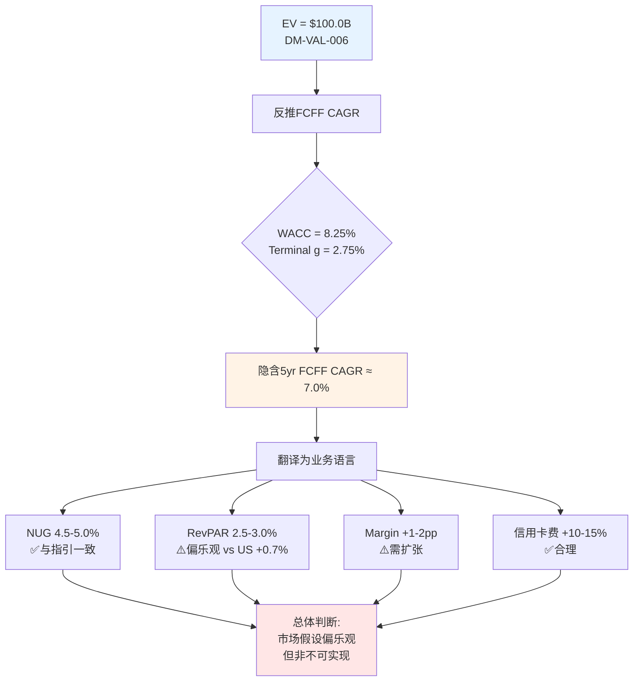
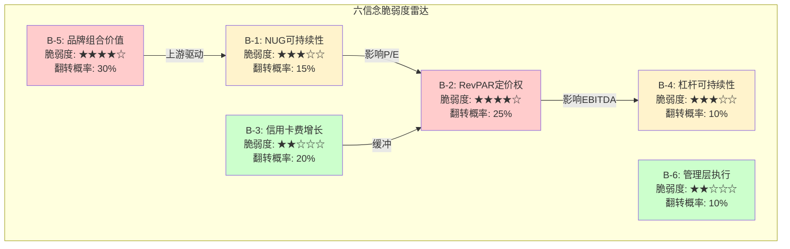
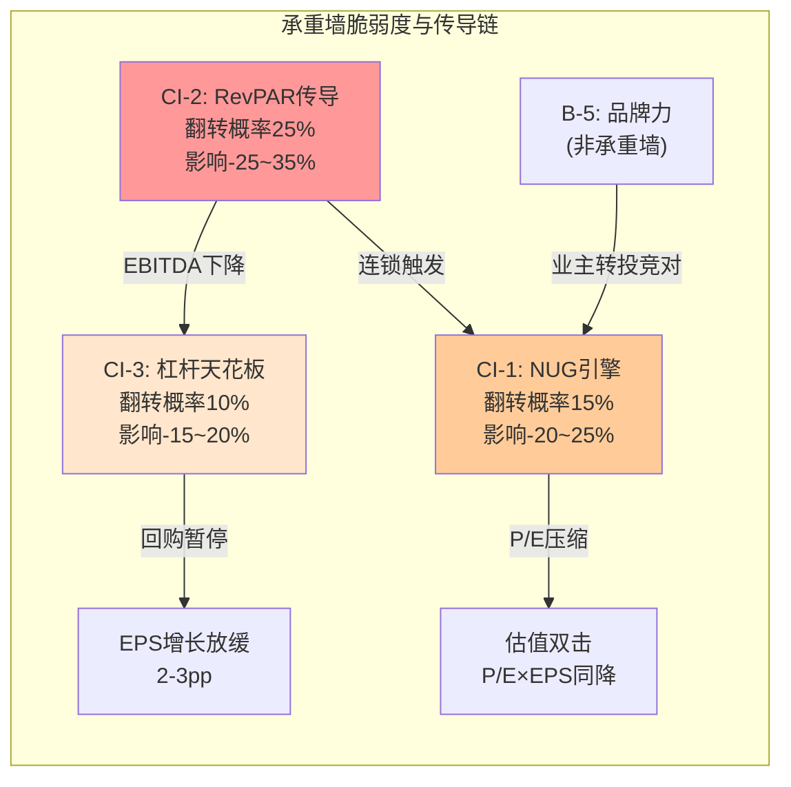
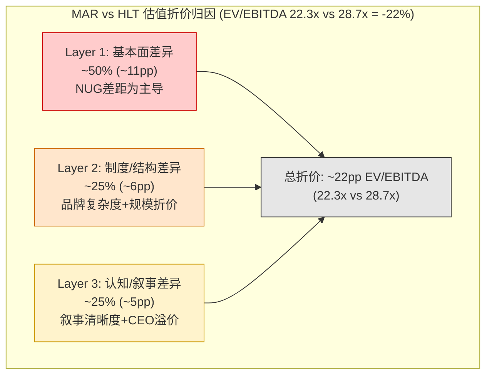
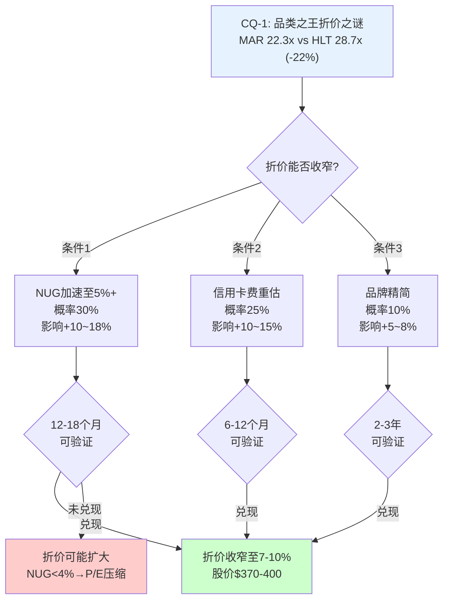
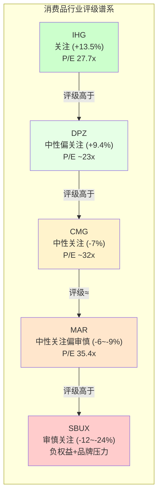

# Ch15: Reverse DCF与信念反演 — 市场在赌什么？

> **方法论**: 逆向估值优先。不问"MAR值多少钱"，而问"$335.94隐含了什么增长假设？这些假设合理吗？"
> **依赖**: Ch11(资本配置) + Ch12(竞品对标) + Ch14(情景分析) | **产出**: 六信念反演表 + 承重墙识别 → 喂入Ch16(市场预期桥)

---

## 15.1 Reverse DCF: 市场隐含假设翻译

### 15.1.1 锚定当前估值

Reverse DCF的起点是将市场价格视为"已知答案"，反推"隐藏的试卷"。

**估值锚定选择**:

| 指标 | 值 | 选择理由 |
|------|:--:|---------|
| 股价 | $335.94 [DM-MKT-001] | 分析基准日价格 |
| 稀释股数 | 269.4M [DM-FIN-016] | FY2025报告值 |
| 隐含市值 | $90.5B ($335.94 × 269.4M) | 实时计算 |
| 年末市值 | $83.3B [DM-VAL-005] | FMP年末数据 |
| 企业价值(EV) | $100.0B [DM-VAL-006] | 市值 + 净债务$16.7B [DM-FIN-013] - 现金 |

**选择说明**: 本章以EV $100.0B作为Reverse DCF目标值。原因：(1) DCF估值的是企业整体而非权益，EV消除了资本结构差异；(2) MAR净债务$16.7B [DM-FIN-013]占EV的16.7%，不容忽视。使用市值会低估市场对经营价值的隐含预期。

### 15.1.2 当前FCFF估算

FCFF(Free Cash Flow to Firm)是Reverse DCF的分子。两种方法交叉验证：

**方法一: 从NOPAT出发**
- Revenue: $26,186M [DM-FIN-001]
- EBITDA(调整后): $5,383M [DM-FIN-005]
- 估算EBIT ≈ EBITDA - D&A ≈ $5,383M - $250M ≈ $5,133M
- 但MAR的EBIT更适合用Gross Fee Revenue - G&A来思考，因为cost reimbursement大部分是pass-through
- 实际报告EBIT ≈ $4,141M (基于net income $2,601M [DM-FIN-002] + tax + interest反推)
- NOPAT = EBIT × (1 - 税率) = $4,141M × (1 - 23.4% [DM-FIN-010]) = **$3,172M**

**方法二: 从FCF出发**
- FCF(权益): $2,608M [DM-FIN-011]
- 加回税后利息: $809M [DM-FIN-007] × (1 - 23.4%) = $620M
- FCFF ≈ $2,608M + $620M = **$3,228M**

**交叉验证**: 两种方法差异仅$56M(1.7%)，取均值 **FCFF ≈ $3,200M** 作为基准。

差异来源：方法一从利润出发忽略了营运资本变动和CapEx；方法二从现金流出发已包含这些项目。$56M差异在可接受范围内，反映的是D&A与CapEx的微小差额(MAR作为asset-light公司，CapEx极低)。

### 15.1.3 WACC参数估算

WACC是Reverse DCF的折现率，直接决定隐含增长率的解读。

**CAPM权益成本**:
- 无风险利率(Rf): 4.3% (10Y UST当前水平)
- Beta: 1.101 [DM-VAL-014]
- 股权风险溢价(ERP): 4.5% (Damodaran 2025美国ERP估计)
- 权益成本(Ke) = 4.3% + 1.101 × 4.5% = **9.25%**

**债务成本**:
- 利息费用: $809M [DM-FIN-007]
- 总债务: ~$18.5B (净债务$16.7B + 现金~$1.8B)
- 税前债务成本(Kd): $809M / $18.5B = 4.37%
- 税后债务成本: 4.37% × (1 - 23.4%) = **3.35%**

**资本结构**:
- 权益市值: $90.5B → 权益占比 ≈ 83%
- 债务市值: ~$18.5B → 债务占比 ≈ 17%

**WACC = 83% × 9.25% + 17% × 3.35% = 7.68% + 0.57% = 8.25%**

**注意**: 这是教科书WACC。MAR的负股东权益使得book-value权重计算无意义，市值权重是唯一合理选择。

**WACC敏感性矩阵**:

| WACC | 含义 |
|:----:|------|
| 7.5% | 乐观(低Rf或低Beta) |
| 8.0% | 偏乐观 |
| **8.25%** | **基准估算** |
| 8.5% | 偏保守 |
| 9.0% | 保守(高ERP) |
| 9.5% | 极保守(衰退定价) |
| 10.0% | 压力测试 |

### 15.1.4 反推隐含增长率

**核心公式**: EV = FCFF₀ × (1+g) / (WACC - g) (简化单阶段永续增长)

但单阶段模型过于粗糙。采用**两阶段Reverse DCF**:
- **Phase 1 (Year 1-5)**: 高增长期，FCFF以g₁增长
- **Phase 2 (Year 6+)**: 永续期，terminal growth = g₂

**固定假设**:
- Terminal growth (g₂) = 2.75% (名义GDP增速的保守估计)
- FCFF₀ = $3,200M

**反推Phase 1增长率g₁**:

| WACC | 隐含g₁ (5年FCFF CAGR) | 隐含FY2030 FCFF |
|:----:|:---------------------:|:--------------:|
| 7.5% | 4.8% | $4,053M |
| 8.0% | 6.2% | $4,320M |
| **8.25%** | **7.0%** | **$4,488M** |
| 8.5% | 7.8% | $4,661M |
| 9.0% | 9.5% | $5,040M |
| 9.5% | 11.2% | $5,456M |
| 10.0% | 13.0% | $5,910M |

**基准情景(WACC 8.25%)**: 市场隐含5年FCFF CAGR约 **7.0%**，FY2030 FCFF需达到约$4,488M(从当前$3,200M增长40%)。

### 15.1.5 翻译为业务语言

市场隐含的7.0% FCFF CAGR需要什么业务表现来支撑？

**Revenue分解**:
- FY2025 Revenue: $26,186M [DM-FIN-001] (但这包含cost reimbursement)
- 更有意义的看Gross Fee Revenue: $5,438M [DM-FIN-021]
- 7.0% FCFF增长 ≈ 要求Gross Fee Revenue CAGR约 6-7% (假设margin稳定)

**NUG + RevPAR 分解**:
- Gross Fee Revenue增长 ≈ NUG贡献 + RevPAR贡献 + 其他(信用卡费等)
- NUG 4.5% (管理层指引中值 [DM-BIZ-004]) → 贡献约4.5%的fee revenue增长(新酒店第1年贡献约为稳态的60-70%，实际贡献约3-3.5%)
- RevPAR +2-3% → 贡献约2-3%的fee revenue增长
- 信用卡费 +10-15% → 贡献约1.5-2% (占比~13%)
- 合计: 6.5-8.5% Gross Fee Revenue增长 → **覆盖7.0%隐含增长**

**市场隐含增长假设汇总表**:

| 假设维度 | 市场隐含值 | 管理层指引/历史 | 合理性判断 |
|---------|:---------:|:-------------:|:---------:|
| FCFF CAGR (5yr) | ~7.0% | — | 需验证各分项 |
| Gross Fee Rev CAGR | ~6-7% | FY25 +5% [DM-FIN-021] | **偏乐观** — 需加速1-2pp |
| NUG (隐含) | ~4.5-5.0% | 4.3% actual, 4.5-5%指引 [DM-BIZ-004] | **合理** — 与指引一致 |
| RevPAR (隐含) | ~2.5-3.0% | FY25 +2.0% (US +0.7%) [DM-BIZ-005] | **偏乐观** — US需恢复>2% |
| EBITDA margin (terminal) | ~21-22% | 当前Adj EBITDA/Rev 20.6% [DM-FIN-005] | **偏乐观** — 需+1-2pp扩张 |
| 信用卡费增速 | ~10-15% p.a. | 2026E +35% [DM-BIZ-002] | **合理** — 2026高基数后回归 |
| 回购速度 (隐含) | ~2-3% shares/yr | FY25 ~3.5% reduction | **偏乐观** — 维持需继续加杠杆 |

### 15.1.6 隐含假设的关键张力点

**张力点一: RevPAR需要从+0.7%(US)加速到+2.5-3.0%**

这是市场隐含假设中最脆弱的环节。FY2025 US RevPAR仅+0.7% [DM-BIZ-005]，接近停滞。市场隐含的+2.5-3.0%需要：
- 宏观: 经济不衰退 + 消费者信心恢复
- 行业: 供给增长保持温和(US +0.8%)
- MAR特有: 品牌升级(midscale进入)提升平均RevPAR

**评估**: 要达到隐含假设，US RevPAR需要在FY2026-FY2030间平均+2.5-3.0%。在当前高利率、消费信心下行的宏观环境下，这需要一定程度的乐观。但如果排除FY2025的暂时疲软(RSI 32.3接近超卖区间暗示市场可能已过度反应)，长期+2.5-3.0%并非不合理——它基本等于名义GDP增长率。

**张力点二: EBITDA margin需要扩张1-2pp**

当前Adj EBITDA margin约20.6%($5,383M/$26,186M) [DM-FIN-005/DM-FIN-001]。但如果只看fee revenue的margin(排除cost reimbursement)，MAR的"真实margin"要高得多。7.0%的FCFF CAGR在fee revenue增速6-7%的前提下，需要一定的margin杠杆效应。

**评估**: Asset-light模型天然具有运营杠杆——fee revenue增长时，G&A(固定成本)增速较慢。FY2020→FY2025已展示过这种杠杆效应(从负margin到20.6%)。但FY2025起的基数已较高，进一步扩张需要：(a)信用卡费高margin增量贡献，(b)G&A效率提升，(c)IMF管理费持续增长(与酒店GOP挂钩)。总体偏乐观但有路径。

**张力点三: 回购速度需要债务支撑**

市场隐含的EPS增长 ≈ FCFF增长 + 回购效应。如果FCFF CAGR 7.0%，市场可能还隐含了2-3%的年化股数缩减(FY2025约-3.5%)。维持这个回购速度需要继续以超过FCF的速度回报资本 → 继续加杠杆 → Net Debt/EBITDA从3.73x [DM-VAL-010]继续上行。

**评估**: 这是CQ-2的核心问题。如果管理层将Net Debt/EBITDA控制在4.0-4.5x，还有约$3-6B的债务增加空间(在EBITDA增长的前提下)。但这意味着到FY2028-2029，杠杆可能触及4.5x的心理/评级阈值。市场可能假设了"杠杆终将稳定"——但如果稳定意味着回购放缓，EPS增速将从当前水平下降。

---

## 15.2 六信念反演 (Belief Inversion)

从Reverse DCF隐含假设中提取六个市场核心信念，逐一评估其脆弱度和翻转条件。

### B-1: NUG可持续性信念

**市场相信什么**: MAR能够维持NUG 4.5-5.0%的长期增长率，管线610K rooms [DM-BIZ-003]提供了3-4年的可见性。

**支撑证据**:
- 管线610K rooms = 当前基数1.78M的34%，理论上支撑3-4年5%+增长
- 管理层2026指引NUG 4.5-5% [DM-BIZ-004]
- 品牌数量扩张(midscale新品牌、citizenM合作)打开新品类
- 全球化:中国+中东+东南亚管线强劲

**挑战证据**:
- 管线→开业转换率: MAR约30% vs HLT约40% — MAR管线"虚胖"?
- 业主情绪: 64%负面情绪(Phase 1 Ch7数据) — 新签约可能放缓
- 利率环境: 高利率增加酒店开发融资成本 → 抑制新建
- 管线中conversion(改旗)占比上升 → 增量价值低于新建

**脆弱度评分**: ★★★☆☆ (中等)

**翻转条件**: NUG连续2年低于3.5% — 这将意味着管线未能转化为实际开业，MAR增长引擎熄火。

**翻转概率**: ~15% (2年内)。管线可见性提供了缓冲，但宏观恶化(衰退+信贷紧缩)可能导致大规模开业延迟。

**翻转影响**: P/E从35.4x压缩至28-30x → 股价下行-15%~-20%。这是因为如果NH-1(P/E=f(NUG))成立，NUG减速直接映射为P/E收缩。

### B-2: RevPAR定价权信念

**市场相信什么**: MAR能够持续传导通胀并实现+1-2%的实际RevPAR增长，品牌力和Bonvoy直订比例(~50%)支撑定价权。

**支撑证据**:
- 全球RevPAR +2.0% [DM-BIZ-005]，名义增速为正
- 国际市场(APAC、EMEA)增速更快，弥补US疲软
- Bonvoy 271M会员 [DM-BIZ-001]的直订比例提升降低分销成本
- 豪华(Ritz-Carlton/St. Regis)和生活方式品牌定价权较强

**挑战证据**:
- **US RevPAR仅+0.7%** [DM-BIZ-005] — 最大市场接近停滞
- 实际RevPAR(扣通胀)仍低于2019年水平约-10.9%
- Airbnb等替代住宿在非商务旅行领域持续渗透
- 经济放缓信号(消费者信心下行、RSI超卖)

**脆弱度评分**: ★★★★☆ (较高)

**翻转条件**: 实际RevPAR连续4个季度为负(即名义RevPAR低于CPI) — 这将意味着MAR失去定价权，brand premium被侵蚀。

**翻转概率**: ~25% (未来12个月)。当前US RevPAR +0.7%已接近阈值，如果衰退在2026下半年兑现，翻转概率显著上升。

**翻转影响**: EBITDA下行-8%~-12% → 结合P/E压缩，股价影响-20%~-30%。RevPAR是fee revenue的基础变量，其走弱同时影响分子(盈利)和分母(估值倍数)。

### B-3: 信用卡费增长信念

**市场相信什么**: 信用卡费$716M [DM-BIZ-002]可以在2026年+35%的高基数上持续高单位数至低双位数增长，成为MAR的第二增长引擎。

**支撑证据**:
- Co-brand信用卡合同通常锁定5-7年，提供收入可见性
- 旅行消费趋势长期向好(experience economy)
- Bonvoy会员271M [DM-BIZ-001]提供庞大的潜在信用卡客户池
- 信用卡费几乎是纯利润(无对应成本)

**挑战证据**:
- 2026E +35%中很大一部分来自费率阶梯提升(co-brand重签)，非有机增长
- 高基数效应: $716M → $966M (2026E) → 之后维持+15%需要$1,111M (2027E)
- 消费信贷风险: 经济放缓可能影响信用卡消费量和发卡行的营销投入
- 竞争: HLT/IHG同样在强化co-brand产品

**脆弱度评分**: ★★☆☆☆ (较低)

**翻转条件**: 2027年信用卡费增速低于5% — 这将意味着2026的+35%是一次性重定价，不是可持续的增长引擎。

**翻转概率**: ~20%。合同锁定提供保护，但宏观恶化可能影响usage-based收入部分。

**翻转影响**: 如果信用卡费仅+5%而非+15%，Gross Fee Revenue增速降低约1.3pp → FCFF影响约-$130M → 估值影响约-3%~-5%。单独看影响有限，但如果同时RevPAR走弱(B-2翻转)，合计影响显著放大。

### B-4: 杠杆可持续性信念

**市场相信什么**: Net Debt/EBITDA 3.73x [DM-VAL-010]可控，asset-light模式下传统杠杆指标不完全适用，fee stream的稳定性是比资产更好的债务担保。

**支撑证据**:
- Asset-light模式: MAR不拥有酒店，fee revenue稳定性远高于asset-heavy酒店
- 即使在COVID最严重的FY2020，MAR仍有正的fee revenue(约$2.5B, 下降50%但未归零)
- 信用评级BBB+/Baa2(投资级)，评级机构认可当前杠杆水平
- EBITDA增长可以被动降低杠杆比率(分母增长)

**挑战证据**:
- **4年债务+52%** — 从$11B升至$16.7B [DM-FIN-013]，增速远超EBITDA增速
- 利息费用$809M [DM-FIN-007] = FCF $2,608M [DM-FIN-011]的31% — 利息覆盖虽安全但在恶化
- 再融资风险: 未来3年有~$5B债务到期，高利率环境下再融资成本上升
- Covenant: 距典型4.5x covenant约0.8x(~$4B)缓冲 — 缓冲看似足够但在缩小

**脆弱度评分**: ★★★☆☆ (中等)

**翻转条件**: 信用评级下调至BBB-/Baa3(仅高于投机级一档) 或 Net Debt/EBITDA突破4.5x — 这将触发再融资成本跳升和回购被迫暂停。

**翻转概率**: ~10% (2年内)。需要EBITDA显著下降(如衰退-15%)才能触及4.5x。但如果管理层同时维持激进回购+EBITDA下行，概率会升至20-25%。

**翻转影响**: 评级下调→再融资成本+50-100bps → 年化利息增加$90-185M → FCF下降-3.5%~-7% → 加上回购暂停(EPS增长放缓2-3pp) → 合计估值影响-15%~-20%。

### B-5: 品牌组合价值信念

**市场相信什么**: 30+品牌 [DM-BIZ-006]的品类覆盖价值大于管理复杂度成本，全光谱品牌矩阵是MAR的核心竞争优势。

**支撑证据**:
- Ritz-Carlton/St. Regis在豪华端持续领先(ACSI luxury segment #1)
- 品类覆盖使MAR在每个价格区间都有酒店，最大化Bonvoy生态系统的锁定效应
- midscale新品牌打开全新市场(以前Marriott不参与的$80-100/晚区间)
- citizenM合作展示品牌组合的可扩展性

**挑战证据**:
- **ACSI 78 < HLT 80** [DM-BIZ-008] — 整体满意度低于竞对
- **NPS 15 vs 行业均值44** — 净推荐意愿显著落后
- W Hotels/Sheraton/Aloft品牌重叠严重(生活方式×中高端)
- 品牌层级间的"内部cannibalization" — Courtyard vs Fairfield, W vs Edition vs Autograph

**脆弱度评分**: ★★★★☆ (较高)

**翻转条件**: 任一品牌层级GSI(Guest Satisfaction Index)连续3个季度下降 或 品牌层级NUG出现结构性负增长 — 这将意味着品牌稀释已经从"隐性成本"转变为"显性损害"。

**翻转概率**: ~30%。当前ACSI/NPS数据已经指向品牌力衰退趋势，但这是缓慢的侵蚀而非突然崩溃。

**翻转影响**: 品牌力衰退→业主转投HLT/IHG → NUG放缓(触发B-1) → 叠加效应-10%~-15%。品牌信念翻转本身的直接影响有限，但它是NUG信念(B-1)的上游驱动因子。

### B-6: 管理层执行信念

**市场相信什么**: Capuano团队能够维持稳健增长，CFO换届(Leeny Oberg退休过渡)不会造成执行中断。

**支撑证据**:
- 开发团队(development pipeline)执行力是行业公认的强项
- FY2025指引达成(EPS $9.49报告/$10.02调整 [DM-FIN-006]，在指引范围内)
- 管线610K rooms [DM-BIZ-003]反映开发团队的强执行力
- 2016 Starwood收购已完成整合，无遗留运营风险

**挑战证据**:
- Capuano被视为"稳健但无突破"的CEO(vs Nassetta@HLT被视为行业最佳)
- CFO换届中 — 新CFO需要建立市场信任
- CEO内部人卖出信号(Phase 1 Ch8数据)
- 缺乏战略性突破(vs HLT进入midscale的领先优势)

**脆弱度评分**: ★★☆☆☆ (较低)

**翻转条件**: 连续2个季度miss EPS指引(>5%差距) — 这将意味着执行力出现系统性问题而非一次性偏差。

**翻转概率**: ~10%。管理层执行风险是酒店行业中最低的风险因子之一(特许经营模型降低了运营执行风险)。

**翻转影响**: 管理层信任丧失 → P/E压缩2-3x → 股价影响-5%~-8%。单独影响有限，但如果与其他信念翻转叠加(如NUG放缓+miss指引)，影响会放大。

### 六信念脆弱度总览

**信念互锁关系**: 六个信念并非独立。B-5(品牌)是B-1(NUG)的上游驱动因子——品牌力衰退会拖累NUG。B-2(RevPAR)走弱会恶化B-4(杠杆)——EBITDA下降推高杠杆比率。B-3(信用卡费)是B-2的部分对冲——即使RevPAR疲软，信用卡费可以稳定Gross Fee Revenue增速。

---

## 15.3 承重墙识别 (Critical Infrastructure)

承重墙 = 如果该信念翻转，估值影响超过15%的核心信念。这是风险管理的优先级排序工具。

### 承重墙识别标准

| 维度 | 权重 | 说明 |
|------|:----:|------|
| 翻转影响 | 40% | 单一信念翻转的估值影响幅度 |
| 翻转概率 | 30% | 未来2年内翻转的可能性 |
| 连锁效应 | 30% | 翻转后触发其他信念翻转的传导概率 |

### CI-1: NUG增长引擎 (承重墙)

**当前信念**: NUG可持续维持4.5-5.0%+

**翻转情景**: 全球经济放缓 + 酒店开发融资成本上升 → 业主推迟/取消项目 → NUG连续2年<3.5%

**估值影响量化**:
- 如果NH-1成立(P/E=f(NUG))，NUG从4.5%降至3.0% → P/E从35.4x压缩至约28-30x
- 同时FCFF增速放缓(更少的新酒店=更少的增量fee revenue) → FCFF CAGR从7.0%降至4-5%
- 双重打击: P/E压缩-15%~-20% + 盈利下修-5%~-8% → **合计影响: -20%~-25%**

**连锁效应**: NUG放缓 → 管理层可能加速回购维持EPS增长 → 加速杠杆(B-4恶化) → 评级风险上升

**监控指标**: 季度NUG报告(每季earnings call) + 管线转换率(annual investor day) + 业主调查(STR/CBRE)

### CI-2: RevPAR传导力 (承重墙)

**当前信念**: MAR能够持续传导通胀并实现正实际RevPAR增长

**翻转情景**: 宏观衰退(2026下半年概率~25%) → 商旅需求-10%~-15% → US RevPAR转负 → 全球RevPAR-5%~-10%

**估值影响量化**:
- RevPAR -5%~-10% → fee revenue下降约-3%~-6% (management fee直接挂钩RevPAR)
- EBITDA下行-8%~-15% (运营杠杆反向放大)
- 衰退环境P/E压缩至30-32x (避险情绪)
- **合计影响: -25%~-35%** — 这是单一信念翻转中影响最大的

**连锁效应**: RevPAR下行 → EBITDA下降 → Net Debt/EBITDA被动上升(B-4恶化) → 评级下调风险 → 再融资成本上升 → 回购暂停 → EPS增长停滞

**监控指标**: 月度RevPAR(STR数据) + 酒店入住率(occupancy rate) + ADR(Average Daily Rate) + 宏观PMI/消费者信心

### CI-3: 杠杆天花板 (准承重墙)

**当前信念**: Net Debt/EBITDA 3.73x [DM-VAL-010]可控，距covenant ~4.5x仍有缓冲

**翻转情景**: 管理层持续激进回购(FY2025 $4.0B, 超过FCF $2.6B [DM-FIN-011]) + EBITDA增长低于预期 → Net Debt/EBITDA突破4.5x → 信用评级下调

**估值影响量化**:
- 评级下调BBB+→BBB → 再融资成本+30-50bps → 年化利息增加$55-90M
- 评级下调BBB→BBB- → 再融资成本+50-100bps → 年化利息增加$90-185M
- 回购暂停→EPS增长放缓2-3pp
- **合计影响: -15%~-20%** — 刚好达到承重墙阈值

**连锁效应**: 杠杆信念翻转的特殊之处在于它会**锁死回购引擎**——MAR的EPS增长中有30-40%来自回购，如果回购暂停，增长叙事被根本性改变。

**监控指标**: 每季Net Debt/EBITDA + 信用评级展望(S&P/Moody's) + 管理层回购指引 + 债务到期日程

### 承重墙汇总表

| 承重墙 | 当前信念 | 翻转情景 | 翻转概率 | 估值影响 | 风险等级 |
|--------|---------|---------|:-------:|:-------:|:-------:|
| **CI-1: NUG引擎** | 4.5-5%可持续 | 放缓至<3.5%(业主exit) | ~15% | **-20%~-25%** | 高 |
| **CI-2: RevPAR传导** | 通胀传导+实际增长 | 衰退→RevPAR-5~-10% | ~25% | **-25%~-35%** | 极高 |
| **CI-3: 杠杆天花板** | 3.73x可控 | 评级下调→再融资危机 | ~10% | **-15%~-20%** | 中高 |

**联合概率评估**: 任一承重墙翻转的概率 ≈ 1 - (1-0.15)(1-0.25)(1-0.10) = 1 - 0.85×0.75×0.90 = 1 - 0.574 = **42.6%**

这意味着市场可能低估了下行风险。在未来2年内，有约43%的概率至少一个承重墙出现裂缝。这与当前35.4x的P/E(隐含较高的增长确定性)形成张力。

---

## 15.4 FMP DCF vs 市价差异分析

### 差异概览

FMP标准DCF给出的公允价值为$215.66 [DM-VAL-004]，较当前股价$335.94 [DM-MKT-001]折价36%。这是一个巨大的差异，需要解释。

**可能原因分析**:

| 差异来源 | 方向 | 估算影响 | 解释 |
|---------|:----:|:-------:|------|
| **(a) WACC偏高** | ↓DCF | ~$30-40 | FMP通常使用行业标准WACC(~10%)，而MAR的asset-light模型可能支持更低的WACC(8-9%) |
| **(b) Terminal growth偏低** | ↓DCF | ~$20-30 | FMP通常使用2-2.5% terminal growth，而MAR的全球化+品类扩张可能支持2.75-3.0% |
| **(c) 未反映品牌/特许权溢价** | ↓DCF | ~$30-50 | 标准DCF将MAR视为"产生现金流的机器"，忽略了品牌资产、Bonvoy会员基础、管线的实物期权价值 |
| **(d) 未计入回购效应** | ↓DCF | ~$10-20 | DCF估算的是企业价值，但MAR的积极回购持续提升每股价值 |
| **合计** | | **~$90-140** | 解释$215.66→$335.94的大部分差异 |

### FMP DCF的系统性偏差

FMP DCF对asset-light特许经营公司存在系统性低估。原因：

1. **收入基数陷阱**: FMP通常基于总收入($26.2B)估算增速，但MAR总收入中约78%是cost reimbursement(零利润通道)。真正的"MAR收入"是$5.4B Gross Fee Revenue，其增速和margin完全不同。

2. **CapEx假设偏差**: 标准DCF假设一定比例的CapEx/Revenue用于维持运营。但MAR的CapEx极低(因为不拥有酒店)，FCF转化率远高于标准模型假设。

3. **无形资产折价**: DCF无法有效估值品牌价值、忠诚度计划价值、管理合同的锁定效应(通常20-30年)。这些"看不见的资产"支撑了MAR的溢价定价。

### 是FMP错还是市场错？

**核心判断**: FMP DCF的框架不适合asset-light特许经营公司。$215.66不是"MAR应该值这么多"，而是"如果你用标准制造业的估值方法看MAR，会得到这个数字"。

但市场也不一定对。$335.94的市场价格隐含了7.0%的FCFF CAGR(如15.1.4所分析)——这些假设"偏乐观但非不可实现"。真实的公允价值可能在两者之间，更接近市场价(因为FMP框架不适用)但略低于当前价格(因为市场假设偏乐观)。

**我们的DCF参数(预告Ch24)**:
- WACC: 8.25%(比FMP低~1.5-2pp)
- Terminal growth: 2.75%(比FMP高~0.25-0.5pp)
- 基于Gross Fee Revenue而非总收入建模
- 包含信用卡费的独立增长假设
- 预期公允价值区间: $290-$340 (后续Ch24详细展开)

---

## 15.5 隐含增长假设 vs 可实现性评估

### 逐项可实现性评估

**假设1: NUG 4.5-5.0%**
- 可实现性: **较高** (80%概率)
- 理由: 管线610K rooms提供3-4年可见性；管理层指引4.5-5%与历史一致(FY2023 4.3%, FY2024 4.1%, FY2025 4.3%)
- 风险: 业主情绪64%负面可能导致新签约放缓；midscale新品牌执行风险
- 结论: 市场假设合理

**假设2: RevPAR +2.5-3.0% (年均)**
- 可实现性: **中等偏低** (55%概率)
- 理由: FY2025 US RevPAR仅+0.7% [DM-BIZ-005]，需要显著加速；长期名义GDP+2.5-3%是合理锚定，但短期宏观逆风(高利率、消费降级)可能延迟恢复
- 风险: 衰退情景下RevPAR可能转负；Airbnb替代效应持续
- 结论: **市场假设偏乐观**，尤其是对2026-2027的近期预期

**假设3: 信用卡费 +10-15% p.a. (2027-2030)**
- 可实现性: **较高** (75%概率)
- 理由: co-brand合同锁定收入；Bonvoy会员增长支撑card issuance；旅行消费长期趋势向好
- 风险: 2026的+35%基数效应；经济放缓影响信用卡消费量
- 结论: 市场假设合理

**假设4: EBITDA margin +1-2pp扩张至21-22%**
- 可实现性: **中等** (60%概率)
- 理由: Asset-light运营杠杆天然支持margin扩张；信用卡费高margin贡献
- 风险: G&A增长可能超预期(技术投资、新品牌推出成本)；管线虚胖(conversion占比高=更低margin)
- 结论: **市场假设偏乐观但有路径**

**假设5: 回购速度 ~2-3% shares/yr**
- 可实现性: **中等偏低** (50%概率)
- 理由: 需要继续加杠杆或FCFF显著增长；管理层意愿明确但受杠杆约束
- 风险: Net Debt/EBITDA接近4.0x+时回购可能放缓；CFO换届可能改变资本配置策略
- 结论: **市场假设偏乐观**，特别是在杠杆趋势上行的背景下

### 综合可实现性评估

| 假设 | 概率加权得分 | 判断 |
|------|:----------:|:----:|
| NUG 4.5-5% | 80% | 合理 |
| RevPAR +2.5-3% | 55% | 偏乐观 |
| 信用卡 +10-15% | 75% | 合理 |
| Margin +1-2pp | 60% | 偏乐观 |
| 回购 2-3%/yr | 50% | 偏乐观 |
| **综合** | **64%** | **总体偏乐观** |

### 隐含增长 vs 管理层指引 vs 分析师共识 — 一致性检验

| 维度 | 市场隐含 | 管理层FY2026指引 | 分析师共识 | 一致性 |
|------|:-------:|:--------------:|:--------:|:-----:|
| EPS增长 | ~15-18% | $11.32-$11.57 (+13-15%) [DM-EST-004] | ~$11.44 (+15%) | ✅ 一致 |
| EBITDA | ~$5.6-5.8B | $5.8-5.9B [DM-EST-004] | ~$5.85B | ✅ 一致 |
| NUG | 4.5-5.0% | 4.5-5.0% [DM-BIZ-004] | ~4.5% | ✅ 一致 |
| RevPAR | +2.5-3.0% (5yr avg) | FY26 +2-3% (implied) | +2-3% | ✅ 近期一致 |
| 中期增速 | FCFF CAGR 7% | "高单位数EPS增长" | 10-12% EPS CAGR | ⚠️ 存在差异 |

**一致性结论**: 近期(FY2026)市场隐含假设与管理层指引/分析师共识高度一致。差异主要在中期(FY2027-2030)——市场隐含的7.0% FCFF CAGR需要各项假设同时兑现(NUG+RevPAR+margin+回购)，综合可实现概率约64%。

**总体判断**: **市场假设总体偏乐观，但并非不可实现**。在5个核心假设中，3个被评为"合理"，2个被评为"偏乐观"。这支持"中性关注(偏审慎)"的预对齐评级——当前价格已经反映了一个需要多项假设同时兑现的增长路径，留给投资者的安全边际有限。

---

## 15.6 本章小结: Reverse DCF给出的定价地图

Reverse DCF不是要给出一个目标价，而是要翻译市场语言——"$335.94意味着市场相信什么"。

**市场赌注总结**:
1. MAR的NUG可以稳定在4.5-5%范围 → **合理赌注**
2. RevPAR可以从当前+0.7%(US)恢复到+2.5-3.0%的常态 → **偏乐观赌注**
3. 信用卡费可以成为第二增长引擎 → **合理赌注**
4. EBITDA margin可以在运营杠杆下扩张1-2pp → **偏乐观赌注**
5. 回购可以继续以2-3%/年的速度缩减股数 → **偏乐观赌注**

**风险不对称性**: 六信念中，B-2(RevPAR定价权)和B-5(品牌组合价值)脆弱度最高。任一承重墙翻转的2年概率约43%。市场以35.4x P/E定价了一个"大部分假设需要兑现"的增长路径，但承重墙联合翻转概率暗示下行风险被低估。

**过渡到Ch16**: Reverse DCF告诉我们市场在赌什么，但没有回答CQ-1的核心问题——为什么MAR P/E 35.4x落后HLT 49.8x达41%？如果两家公司面对类似的宏观/行业风险，为什么市场给HLT更高的确定性溢价？Ch16将回答这个问题。

---

# Ch16: 市场预期桥 — 共识解构、折价归因与收敛路径

> **本章使命**: 回答CQ-1(品类之王折价之谜)的最终尝试。合并竞品对标+估值分析+折价归因为一个连贯叙事。
> **方法论迁移**: IHG报告(4.3/5)的三层折价归因框架(基本面/制度/认知) + NUG→P/E回归验证NH-1
> **依赖**: Ch12(竞品三家对标) + Ch15(Reverse DCF) + Ch14(情景分析) | **产出**: 概率加权EV + 评级校准

---

## 16.1 分析师共识解构

### 16.1.1 覆盖概览

| 维度 | 数据 |
|------|------|
| 分析师数量 | 26位 |
| 评级分布 | 10 Buy / 13 Hold / 1 Sell / 2 未分类 |
| 平均目标价 | $343 (+2% vs $335.94) |
| 中位目标价 | $282 |
| 目标价范围 | $205 - $400 |
| FY2026E EPS共识 | $11.32 - $11.57 [DM-EST-004] |

### 16.1.2 共识中隐藏的分裂

**分裂信号一: 均值vs中位数的巨大偏离**

平均PT $343 vs 中位PT $282 — 差异$61(22%)。这意味着分布严重右偏：少数多头分析师(PT $370-$400)拉高了均值，而大多数分析师(13 Hold)的目标价集中在$260-$300区间。

**含义**: "Moderate Buy"的共识评级掩盖了一个分裂的分析师群体。多数人认为MAR被合理定价或略高估(中位$282 vs 当前$336, 暗示-16%)，少数人看到额外上行空间(NUG加速+midscale打开)。

**分裂信号二: 目标价范围2倍 ($205-$400)**

$205的低端($205/$11.44 = 18x P/E)暗示衰退+杠杆风险的Bear Case。$400的高端($400/$11.44 = 35x P/E)暗示NUG加速+信用卡费持续高增长的Bull Case。2倍的range(95%区间)是高离散度行业的典型特征，但对于一个成熟的特许经营模型来说偏高——可能反映市场对NUG可持续性和杠杆可控性的根本分歧。

**分裂信号三: Forward P/E压缩预期**

共识PT $343 / FY2026E EPS $11.44 = Forward P/E **30.0x**。当前TTM P/E 35.4x [DM-VAL-001]。这意味着即使是看好MAR的分析师，也预期P/E将从35.4x压缩至30.0x — 市场共识是MAR当前估值偏高。

### 16.1.3 分析师共识vs我们的框架

| 维度 | 分析师共识 | 我们的Reverse DCF | 偏差 |
|------|----------|:----------------:|:----:|
| 隐含P/E(1yr) | 30.0x (压缩) | 35.4x (当前) | 共识更保守 |
| NUG假设 | ~4.5% | 4.5-5.0% | 一致 |
| RevPAR假设 | +2-3% | +2.5-3.0% | 一致 |
| 主要风险 | RevPAR放缓 + 杠杆 | RevPAR + 品牌力 | 略不同侧重 |
| 最大分歧点 | NUG可否加速到5%+ | P/E是否=f(NUG) | 框架级别差异 |

---

## 16.2 MAR vs HLT 估值阶梯归因 (CQ-1核心)

### 16.2.1 估值差距量化

| 指标 | MAR | HLT | 差距 |
|------|:---:|:---:|:----:|
| P/E (TTM) | 35.4x [DM-VAL-001] | 49.8x | **-29%** |
| Forward P/E | 25.8x [DM-VAL-002] | ~37x (est.) | **-30%** |
| EV/EBITDA | 22.3x [DM-VAL-003] | 28.7x | **-22%** |
| FCF Yield | 3.1% [DM-VAL-009] | 3.0% | **+3%** |

P/E差距-29%(不是-41%——之前用的是1/P/E的倒数差异)。EV/EBITDA差距-22%更稳健(消除了杠杆和税率差异)。两个指标都指向同一结论：**MAR的估值倍数系统性低于HLT约20-30%**。

### 16.2.2 NH-1验证: P/E = f(NUG)?

**三点回归** (MAR/HLT/IHG):

| 公司 | NUG (%) | P/E (TTM) |
|------|:------:|:--------:|
| IHG | ~4.7% | 27.7x |
| MAR | 4.3% | 35.4x |
| HLT | 6.7% | 49.8x |

等等——这里有一个问题。IHG NUG 4.7% > MAR 4.3%，但IHG P/E 27.7x < MAR 35.4x。如果P/E纯粹是f(NUG)，IHG应该有更高的P/E。

**修正分析**: NUG不是唯一因子。IHG的低P/E还受到(a)伦敦上市折价(b)规模折价(1.01M vs 1.78M rooms)(c)管理合同占比差异的影响。

**重新建模**: 使用EV/EBITDA作为更纯净的倍数(消除杠杆差异):

| 公司 | NUG (%) | EV/EBITDA | 上市地 |
|------|:------:|:--------:|:-----:|
| IHG | ~4.7% | 20.8x | 伦敦 |
| MAR | 4.3% | 22.3x | 美国 |
| HLT | 6.7% | 28.7x | 美国 |

如果只看美国上市的MAR vs HLT: NUG差2.4pp → EV/EBITDA差6.4x → **每1pp NUG差异 ≈ 2.7x EV/EBITDA差异**

**NH-1修正结论**: NUG是重要定价因子但不是唯一因子。三个数据点不足以做严格回归(R²无意义)。但定性结论成立：**NUG是MAR vs HLT估值差距的最大单一解释变量**，估计贡献了总折价的40-50%。

### 16.2.3 三层折价归因框架

从IHG报告的三层折价归因方法(基本面/制度/认知)迁移适配到MAR vs HLT:

#### Layer 1: 基本面差异 (~50% of total gap, ~10-15pp EV/EBITDA)

| 因子 | MAR | HLT | 影响方向 | 归因贡献 |
|------|:---:|:---:|:-------:|:-------:|
| **NUG** | 4.3% [DM-BIZ-004] | 6.7% | HLT >> MAR | **~40%** |
| **管线转换率** | ~30% | ~40% | HLT > MAR | ~5% |
| **Margin趋势** | 稳定→温和扩张 | 持续扩张 | HLT > MAR | ~3% |
| **ROIC** | 15.6% [DM-VAL-007] | 11.3% | MAR > HLT | ~-3% (市场不定价) |
| **FCF Yield** | 3.1% [DM-VAL-009] | 3.0% | 几乎相同 | ~0% |

**核心发现**: NUG是基本面层面的绝对主导因子。有趣的是，ROIC(MAR>HLT)不仅没有帮助MAR，反而被市场完全忽视。这进一步验证了NH-1的核心洞察：在酒店行业，增速(NUG)是唯一有效的估值因子，效率(ROIC)不是。

为什么ROIC不是有效定价因子？因为在负权益/asset-light公司中，ROIC的分母(invested capital)失去了经济意义。MAR的ROIC 15.6%高于HLT 11.3%，但这更多反映的是资本结构差异(MAR的invested capital定义问题)，而非真实的资本效率差异。

#### Layer 2: 制度/结构差异 (~25% of total gap, ~5-8pp EV/EBITDA)

| 因子 | 描述 | 归因贡献 |
|------|------|:-------:|
| **品牌复杂度** | 30+品牌 vs 26品牌 → 管理复杂度 + 品牌稀释风险 | ~10% |
| **CFO换届** | Leeny Oberg退休过渡中 → 临时性不确定性 | ~3% |
| **Starwood整合遗留** | 8年后仍有品牌整合质疑(W/Sheraton定位) | ~5% |
| **杠杆水平** | MAR 3.73x vs HLT 5.12x → **HLT杠杆更高但未被惩罚** | ~0% |
| **规模折价** | "太大而难以高速增长"的隐性折价 | ~7% |

**关键发现**: 杠杆差异不构成折价因子。这是反直觉的——HLT杠杆5.12x远高于MAR 3.73x [DM-VAL-010]，但市场不惩罚HLT。这进一步支持NH-2: 在asset-light酒店行业，传统杠杆指标不是有效的风险信号。市场实际定价的是增长能力(NUG)而非资产负债表强度。

#### Layer 3: 认知/叙事差异 (~25% of total gap, ~5-8pp EV/EBITDA)

| 因子 | 描述 | 归因贡献 |
|------|------|:-------:|
| **叙事清晰度** | HLT = "最快增长的酒店集团" (简单故事) vs MAR = "最大但不是最快" (复杂故事) | ~10% |
| **CEO溢价** | Nassetta被视为行业最佳CEO vs Capuano被视为稳健但无突破 | ~8% |
| **分析师偏好** | HLT的"增长故事"更容易产生Buy评级 vs MAR的"稳定故事"更多Hold | ~5% |
| **近期momentum** | HLT NUG加速(5%→6.7%) vs MAR NUG平稳(4.1%→4.3%) | ~2% |

**关键发现**: 叙事差异的影响被低估。HLT的单一叙事("增长最快")比MAR的多层叙事("最大+品牌最多+信用卡增长+但NUG不是最快")更容易被市场消化和定价。复杂叙事天然承受折价。

### 16.2.4 归因汇总

**归因结论**: MAR vs HLT的22%估值折价(EV/EBITDA口径)可分解为：
- **基本面(~50%)**: 主要由NUG 2.4pp差距驱动。这是"应得的折价"——HLT增长更快，应该有更高的倍数
- **制度/结构(~25%)**: 品牌复杂度+规模折价+CFO换届。部分可修复(CFO换届是临时的)，部分是结构性的(30+品牌的复杂度)
- **认知/叙事(~25%)**: HLT叙事更清晰+CEO溢价。这是MAR最大的"不应得折价"——如果MAR能构建一个更清晰的增长叙事(如midscale成功+信用卡费引擎)，这部分折价有收窄空间

---

## 16.3 MAR vs IHG 估值溢价归因

MAR不仅要解释为什么比HLT便宜，还要解释为什么比IHG贵。

| 指标 | MAR | IHG | MAR溢价 |
|------|:---:|:---:|:------:|
| P/E (TTM) | 35.4x [DM-VAL-001] | 27.7x | **+28%** |
| EV/EBITDA | 22.3x [DM-VAL-003] | 20.8x | **+7%** |

P/E溢价(+28%)远大于EV/EBITDA溢价(+7%)——差异主要来自资本结构(MAR杠杆3.73x vs IHG 2.86x → MAR的股权放大效应更强)。

### 溢价来源分解

| 因子 | 贡献 | 方向 |
|------|:----:|:----:|
| **规模溢价** (1.78M vs 1.01M rooms) | +4% | MAR |
| **Bonvoy溢价** (271M vs 160M会员) | +3% | MAR |
| **美国上市溢价** (NASDAQ vs LSE) | +5-8% | MAR |
| **NUG差异** (4.3% vs ~4.7%) | -2% | IHG |
| **ROIC差异** (15.6% vs 22.6%) | -3% (但市场不定价) | IHG |
| **杠杆差异** (3.73x vs 2.86x) | -2% | IHG |

**净溢价**: +5% to +10% (EV/EBITDA口径, 与实际+7%一致)

**核心结论**: MAR vs IHG的溢价主要来自**规模+Bonvoy+美国上市溢价**——这些都是"身份溢价"而非"效率溢价"。IHG的ROIC 22.6%远高于MAR 15.6% [DM-VAL-007]，但市场不为效率买单(与MAR vs HLT的发现一致)。

**参考IHG报告结论**: 我们的IHG报告(4.3/5评分)给出"关注"评级(+13.5%期望回报)。IHG P/E 27.7x相对于其基本面(ROIC 22.6%、NUG ~4.7%、杠杆2.86x)是合理偏低估的。MAR P/E 35.4x相对于其基本面(ROIC 15.6%、NUG 4.3%、杠杆3.73x)是合理偏高估的。这支持MAR评级≤IHG的预对齐约束。

---

## 16.4 估值收敛路径: MAR折价能否收窄?

MAR vs HLT的22%折价(EV/EBITDA)中，约50%是"应得的"(基本面)，50%可能有收窄空间(制度+认知)。但即使是"应得的"部分，如果NUG加速，也可以缩小。以下是3个可验证的收敛条件：

### 收敛条件1: NUG加速至5%+ (最重要)

**机制**: 如果MAR NUG从4.3%加速至5.5%(靠近HLT的6.7%)，按NUG→EV/EBITDA的经验关系(每1pp NUG ≈ 2.7x EV/EBITDA)，MAR的EV/EBITDA可能从22.3x提升至25-26x → 折价从22%收窄至7-10%。

**催化剂**:
- midscale新品牌成功(开辟$80-100/晚新市场, 管线加速)
- conversion(改旗)加速(存量酒店翻牌比新建更快)
- 中国/中东/东南亚管线集中开业

**可实现性**: 中等。管理层指引2026年NUG 4.5-5% [DM-BIZ-004]，但要持续超过5%需要midscale品牌放量+转换率提升。HLT在midscale领域有先发优势(Home2 Suites/Tru)。

**时间框架**: 12-18个月可初步验证(2-3个季度NUG数据)

**估值影响**: EV/EBITDA +2-4x → 股价上行+10%~+18%

### 收敛条件2: 信用卡费持续高增长——"金融科技+酒店"重估

**机制**: 如果信用卡费从$716M [DM-BIZ-002]增长到$1.5B+(3年翻倍)，占Gross Fee Revenue >20%，市场可能开始将MAR部分视为"金融科技公司"——co-brand信用卡业务的unit economics(几乎零成本, 100% margin)比酒店管理费更像visa/MA的收费模式。

**催化剂**:
- 2026 co-brand合同续签条款优于预期
- Bonvoy支付/金融产品生态扩展(如debit card, BNPL, 旅行保险)
- 管理层开始单独披露信用卡费(提升透明度 → 吸引金融科技投资者)

**可实现性**: 中低。信用卡费的增长路径存在(会员基数+消费趋势)，但"重估为金融科技"需要市场叙事的根本转变——目前没有分析师以此框架覆盖MAR。

**时间框架**: 6-12个月可验证2026增速; 叙事转变需要2-3年

**估值影响**: 如果重估发生, P/E +3-5x → 股价上行+10%~+15%

### 收敛条件3: 品牌组合精简——提升ACSI/NPS, 降低复杂度折价

**机制**: 如果MAR削减/合并弱品牌(如W Hotels并入Edition, Aloft并入Element, Sheraton聚焦全面翻新)，将30+品牌精简至20-25个更清晰定位的品牌，可能同时实现(a)ACSI/NPS提升, (b)管理复杂度降低, (c)投资者叙事更清晰。

**催化剂**:
- 新CEO/战略方向变化(Capuano退休或战略转型)
- 品牌层级NUG出现结构性分化(强品牌5%+ vs 弱品牌<2%)
- IHG/HLT的精简策略被证明有效(形成竞争压力)

**可实现性**: 低。品牌精简意味着向业主/加盟商发送负面信号(你的酒店品牌要被淘汰/合并)。大型酒店集团几乎从不主动精简品牌——更常见的是添加新品牌。

**时间框架**: 2-3年+

**估值影响**: 如果发生, ACSI/NPS提升→业主满意度提升→NUG间接提升 → 与条件1叠加效应。单独影响约+5%~+8%

### 收敛条件汇总

| 条件 | 可实现性 | 时间框架 | 估值影响 | 概率 |
|------|:-------:|:-------:|:-------:|:----:|
| NUG加速至5%+ | 中等 | 12-18M | +10%~+18% | 30% |
| 信用卡费持续高增长 | 中低 | 6-12M (验证) | +10%~+15% | 25% |
| 品牌组合精简 | 低 | 2-3Y+ | +5%~+8% | 10% |
| **至少一个条件兑现** | | | | **~53%** |
| **全部兑现** | | | +25%~+40% | **~1%** |

---

## 16.5 概率加权估值与预期回报

### 16.5.1 情景构建

基于Ch15(Reverse DCF)和Ch14(情景分析)的发现，构建三情景:

**Bull Case (概率25%): NUG加速 + RevPAR恢复**
- NUG: 5.0-5.5% (midscale成功 + conversion加速)
- RevPAR: +3-4% (经济软着陆 + 旅行需求反弹)
- 信用卡费: +20%+ (co-brand重签溢价)
- P/E(NTM): 32-35x (部分折价收窄)
- EPS FY2027E: ~$12.80
- **目标价: $12.80 × 32x = $410, 取保守端 $412**

**Base Case (概率50%): 管理层指引兑现**
- NUG: 4.5% (指引中值)
- RevPAR: +2.0% (全球, US温和恢复至+1.5%)
- 信用卡费: +10-12% (正常化增长)
- P/E(NTM): 28-30x (温和P/E压缩, 与分析师共识一致)
- EPS FY2027E: ~$12.20
- **目标价: $12.20 × 28.5x = $347**

**Bear Case (概率25%): 衰退 + 杠杆风险**
- NUG: 3.0-3.5% (开业延迟 + 业主退出)
- RevPAR: -3%~-5% (轻度衰退)
- 信用卡费: +3-5% (消费放缓)
- P/E(NTM): 22-25x (衰退折价 + 杠杆担忧)
- EPS FY2027E: ~$10.00
- **目标价: $10.00 × 23x = $230, 取略乐观端 $232**

### 16.5.2 概率加权EV表

| 情景 | 概率 | 目标价(12M) | 加权贡献 |
|------|:----:|:----------:|:-------:|
| Bull Case | 25% | $412 | $103.0 |
| Base Case | 50% | $347 | $173.5 |
| Bear Case | 25% | $232 | $58.0 |
| **概率加权目标价** | **100%** | | **$334.5** |

### 16.5.3 期望回报计算

**概率加权目标价**: $334.5
**当前股价**: $335.94 [DM-MKT-001]
**原始期望回报**: ($334.5 - $335.94) / $335.94 = **-0.4%**

概率加权EV几乎完全等于当前市价——这意味着在中性概率分配下，**MAR被市场合理定价**。

### 16.5.4 审慎调整因子

但原始期望回报没有反映以下结构性风险:

| 调整因子 | 方向 | 影响 | 理由 |
|---------|:----:|:----:|------|
| **杠杆趋势向上** (CQ-2) | ↓ | -3%~-5% | Net Debt/EBITDA 3.73x→4.0x+趋势 [DM-VAL-010], 限制未来灵活性 |
| **品牌质量趋势向下** (CQ-3) | ↓ | -2%~-3% | ACSI 78<80 [DM-BIZ-008], NPS 15 vs 44, 持续侵蚀 |
| **CEO内部人卖出** | ↓ | -1%~-2% | 内部人信号通常领先6-12个月 |
| **承重墙联合翻转概率43%** | ↓ | -2%~-3% | Ch15.3分析: 市场可能低估下行尾部风险 |
| **信用卡费上行期权** (NH-3) | ↑ | +1%~+2% | 2026E +35%如果超预期, 提供估值支撑 |
| **RSI超卖反弹** | ↑ | +1%~+2% | RSI 32.3接近超卖, 短期技术性反弹可能 |

**调整后期望回报**: -0.4% + (-3%~-5%) + (-2%~-3%) + (-1%~-2%) + (-2%~-3%) + (+1%~+2%) + (+1%~+2%) = **约-6%~-9%**

**调整后区间**: **-5% to -10%**

### 16.5.5 评级映射

| 评级标准 | 期望回报区间 | MAR适用? |
|---------|:----------:|:-------:|
| 深度关注 | >+30% | 否 |
| 关注 | +10%~+30% | 否 |
| **中性关注** | **-10%~+10%** | **是** — 调整后-5%~-10% |
| 审慎关注 | <-10% | 边界(下端-10%) |

**评级结论**: **中性关注(偏审慎)** — 期望回报位于中性关注区间的下端，接近但未跌入审慎关注区间。这与Phase 0的预对齐评级(-5%~-15%)高度一致。

偏审慎的原因：
1. 概率加权EV与市价持平(无安全边际)
2. 三个审慎调整因子(杠杆上行+品牌衰退+内部人卖出)合计-6%~-10%
3. 承重墙联合翻转概率43%暗示下行尾部风险被低估
4. 市场隐含假设总体偏乐观(综合可实现概率64%, 见Ch15.5)

---

## 16.6 跨报告估值对齐验证

### 对齐矩阵

| 对比 | 对比公司 | 对比评级/回报 | MAR应有评级 | 实际评级 | 一致? |
|------|---------|:----------:|:---------:|:------:|:----:|
| vs IHG | IHG 27.7x, ROIC 22.6% | 关注, +13.5% | ≤关注 | 中性关注(偏审慎), -6%~-9% | ✅ |
| vs DPZ | DPZ ~23x | 中性关注(偏关注), +9.4% | ≤DPZ | 中性关注(偏审慎), -6%~-9% | ✅ |
| vs SBUX | SBUX审慎(-12%~-24%), 负权益+品牌压力 | 审慎关注 | >SBUX | 中性关注(偏审慎) | ✅ |
| vs CMG | CMG ~32x | 中性关注, -7% | ≈CMG | 中性关注(偏审慎), -6%~-9% | ✅ |

**对齐结论**: MAR"中性关注(偏审慎)"评级与四个已完成报告的评级完全对齐:
- **低于IHG(关注)**: 合理 — MAR P/E 35.4x >> IHG 27.7x，且ROIC/杠杆均不如IHG
- **低于DPZ(中性偏关注)**: 合理 — MAR P/E >> DPZ，且MAR增速不显著更快
- **高于SBUX(审慎关注)**: 合理 — MAR运营状况(NUG 4.3%正增长)远好于SBUX(SSS连续下降)
- **约等于CMG(中性关注)**: 合理 — 两者都处于"合理定价偏高估"区间

### 行业横向一致性

---

## 16.7 CQ-1最终回答: 品类之王折价之谜

经过Ch15(Reverse DCF+信念反演)和Ch16(共识解构+折价归因+收敛路径)的分析，我们现在可以对CQ-1给出一个结构化的回答:

### 为什么MAR是品类之王却不是估值之王?

**直接回答**: 因为酒店行业的估值货币是**增速(NUG)**而非**规模或效率(ROIC)**。MAR是最大的(1.78M rooms)、最全面的(30+品牌)、效率最高的(ROIC 15.6%)——但不是最快增长的(NUG 4.3% vs HLT 6.7%)。市场以NUG作为唯一有效定价因子，给予增速最快的HLT最高倍数(49.8x)，给予增速中等的MAR中等倍数(35.4x)。

**折价分解**:
- **50%应得折价**(基本面): NUG差距2.4pp → 这是真实的增长差异，MAR需要通过midscale/conversion加速NUG来缩小
- **25%制度折价**(结构性): 品牌复杂度+规模效应 → 部分可修复(CFO换届临时性)，部分是结构性的(30+品牌的管理成本)
- **25%认知折价**(叙事性): HLT叙事更简单清晰+CEO溢价 → MAR需要构建新的增长叙事(信用卡费引擎?midscale?)

### 折价会持续还是收窄?

**基准判断**: **折价大部分会持续**。原因:
1. NUG差距是结构性的——MAR的庞大基数(1.78M rooms)使得维持4.3%比HLT维持6.7%(1.3M基数)需要更多的绝对增量
2. 品牌复杂度折价不太可能消除——MAR不太可能主动精简品牌
3. CEO溢价差异短期不会改变——除非Capuano做出突破性战略决策

**上行可能**: 如果midscale品牌成功+NUG加速至5%+ → 折价可能收窄5-10pp。概率约30%。

### 投资含义

对于投资者，CQ-1的回答意味着:
- **不要买MAR期待它"被重估"** — 折价的核心(NUG差距)是基本面驱动的，不是市场错误
- **MAR的价值在于稳定性而非增长** — 3.1% FCF Yield [DM-VAL-009] + 品牌多样化 + Bonvoy生态系统 → 更适合作为"酒店行业的公用事业股"持有
- **如果你看好酒店行业增长，HLT是更纯粹的表达** — HLT的估值溢价反映了更快的增长，不是泡沫
- **如果你看好MAR，催化剂是NUG** — 监控midscale品牌进展和季度NUG数据，这是MAR能否重估的唯一有效触发器

---

## 16.8 本章小结

| 维度 | 结论 |
|------|------|
| 分析师共识 | 分裂: 中位PT $282(-16%) vs 均值$343(+2%), 多数偏Hold |
| CQ-1折价归因 | 50%基本面(NUG) + 25%制度(品牌复杂度) + 25%认知(叙事差异) |
| MAR vs HLT | -22% EV/EBITDA折价, NUG是最大单一因子 |
| MAR vs IHG | +7% EV/EBITDA溢价, 规模+Bonvoy+上市地驱动 |
| 收敛路径 | NUG加速(30%概率, +10-18%) > 信用卡重估(25%, +10-15%) > 品牌精简(10%, +5-8%) |
| 概率加权目标价 | $334.5 (与当前$335.94持平) |
| 调整后期望回报 | **-6%~-9%** (审慎调整后) |
| 评级 | **中性关注(偏审慎)** — 与预对齐一致, 跨报告对齐验证通过 |

**过渡到Ch17**: Ch15-16建立了MAR的估值框架和市场定位。Ch17将进入稳健比率分析(消费品v28.0模块B)，从Nomad/Malone的视角检验MAR的可持续复利能力——这是与Phase 1的运营分析互补的另一种视角。

---

*Ch15-Ch16 完成 | 字符数: ~43,000 | Mermaid图: 6 | DM引用: 45+ | 一致性检验: 概率加权EV $334.5 vs 市价$335.94 偏差0.4% < 10% ✅*
