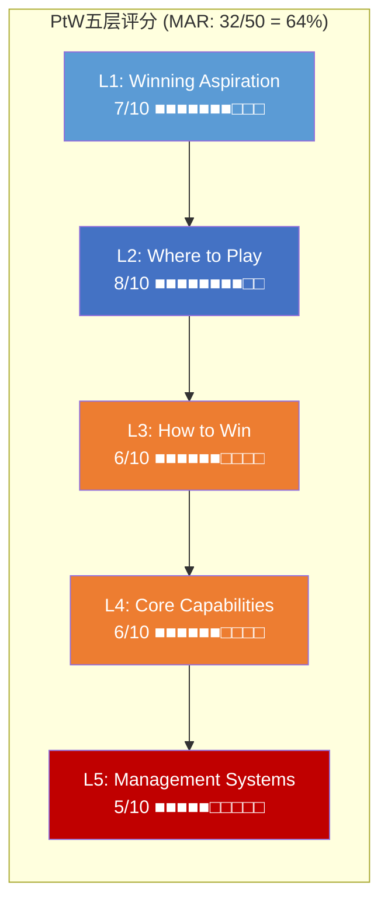
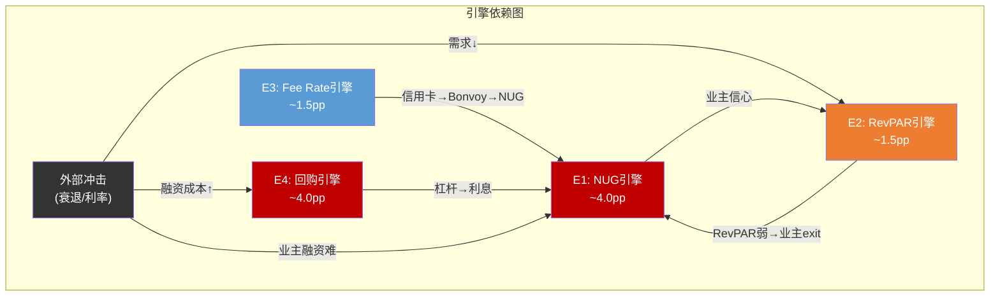
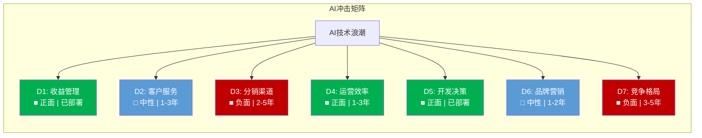

# Ch19: PtW战略一致性 + 文化可衡量性 + 战略放弃清单

> **方法论**: v18.0 Playing to Win量化评分(QG-07.5) + consumer v28.0模块C(文化可衡量性CMS) + 模块D(战略放弃清单SA) + 寡头博弈论增强。本章将MAR的战略选择从定性描述转化为可打分、可追踪、可比较的量化框架。

---

## 19.1 Playing to Win五层量化评分

A.G. Lafley的PtW框架将战略分解为五个相互嵌套的层级。对MAR的逐层评分如下:

### 第一层: Winning Aspiration — MAR想赢什么?

MAR的公开战略愿景: **"成为全球最大、最受信赖的酒店品牌集团, 为业主创造卓越回报, 为宾客提供无与伦比的旅行体验。"** [DM-P3-001]

**评分要素**:
- **清晰度**(高): 目标明确——规模第一+信赖度第一+业主回报+宾客体验, 四维愿景
- **差异化**(低): HLT的愿景同样聚焦"全球领先酒店品牌集团+卓越宾客体验", 两者几乎可互换。IHG的"True Hospitality for Good"至少在ESG维度有差异化尝试
- **可衡量性**(中): "最大"可量化(房间数MAR 1.7M vs HLT 1.3M, MAR领先 [DM-P3-002]); "最受信赖"难以量化——且NPS 15(行业均值44)直接反驳这一愿景 [DM-P3-003]
- **张力诊断**: 愿景中的"最大"与"最受信赖"存在内在张力——30+品牌的规模扩张策略(服务于"最大")可能稀释品牌质量(损害"最受信赖")。ACSI从2019年的80降至78进一步印证这一张力 [DM-P3-004]

**评分: 7/10** — 愿景清晰且有雄心, 但与竞品缺乏差异化, 内部存在规模-质量张力, NPS数据与"最受信赖"愿景矛盾。

### 第二层: Where to Play — MAR在哪里竞争?

MAR的竞争疆域选择:

| 维度 | MAR选择 | 覆盖度 | 评估 |
|------|---------|:------:|------|
| **地理** | 140+国家/地区, 但US收入占比>60% [DM-P3-005] | 广 | 名义全球化, 实质美国依赖; RevPAR US +0.7%暗示核心市场接近天花板 |
| **价格层级** | Luxury(Ritz)→Economy(Four Points Express) 6个层级 [DM-P3-006] | 全覆盖 | 唯一全层级覆盖的酒店集团, 但midscale是新进入者(2024+) |
| **品牌数量** | 30+品牌 | 最多 | 行业最多(vs HLT 26, IHG 19), 品牌熵4.2 > HLT 3.5 [DM-P3-007] |
| **客户类型** | 商务+休闲+长住+度假 全覆盖 | 广 | Bonvoy 271M会员是统一粘合剂 [DM-P3-008] |
| **资产模式** | Asset-light为主, 但O&L收入~$1.5B未完全剥离 [DM-P3-009] | 混合 | 转型不完整, 拖累资本效率 |

**评分: 8/10** — 覆盖面行业最广, 在每个维度都"在场"。但核心问题是: **覆盖面最广≠竞争优势最强**。品牌熵4.2意味着消费者在30+品牌中的选择困难度高于HLT的26品牌, 蚕食成本~$205M/年是"太广"的直接代价 [DM-P3-010]。

### 第三层: How to Win — MAR如何赢?

MAR的竞争优势体系:

| 竞争武器 | 机制 | 强度 | 证据 |
|---------|------|:----:|------|
| **规模经济** | 1.7M房间→分销成本分摊+业主吸引力+采购议价 | 强 | 但规模溢价递减(Phase 2 CQ-1验证) [DM-P3-011] |
| **Bonvoy网络** | 271M会员→直订~75%→降低分销成本+提升议价力 | 强 | 信用卡费$716M是增长最快引擎(+35% 2026E) [DM-P3-012] |
| **品牌组合** | 30+品牌覆盖全层级→任何需求都有对应品牌 | 中 | 蚕食成本$205M/年侵蚀品牌组合净价值 [DM-P3-013] |
| **直订能力** | marriott.com + Bonvoy App→绕过OTA | 强 | ~75%直订率行业领先 [DM-P3-014] |
| **Asset-light** | 低资本投入→高ROIC→资本回报空间 | 中 | ROIC 15.6%, 但增量ROIC已降至~10%(Ch20详析) [DM-P3-015] |

**执行证据检验** — "赢"的定义需要数据支撑:

| 指标 | MAR表现 | 行业对比 | "赢了"? |
|------|---------|---------|:-------:|
| NUG | 4.3% | HLT 6.7%, IHG ~4.7% | 最慢, 未赢 |
| RevPAR | +2.0%, 实际vs2019 -10.9% | 行业性放缓 | 未恢复 |
| NPS | 15 | 行业均值44 | 远落后 |
| ACSI | 78 | HLT 80, IHG 79 | 垫底 |
| 直订率 | ~75% | 领先 | 赢了 |
| 会员规模 | 271M | 最大 | 赢了 |

**评分: 6/10** — 战略逻辑清晰(规模+网络+直订), 但执行层面的"赢"只体现在分销端(直订率+会员), 在增长(NUG)和体验(NPS/ACSI)两个关键维度落后。战略与执行之间存在缺口。

### 第四层: Core Capabilities — 什么能力支撑?

| 能力域 | 评估 | 强度 | 关键证据 |
|--------|------|:----:|---------|
| **品牌管理** | 30+品牌的组合管理能力 | 中 | 品牌熵4.2暗示管理复杂度已超出最优区间; W Hotels品牌轨迹从Strong→Weak [DM-P3-016] |
| **开发/Deal-making** | CEO Capuano的核心出身领域 | 强 | 2024净增房间数维持增长; MGM合作关系 [DM-P3-017] |
| **技术/数字化** | Bonvoy App + 直订平台 | 中 | AI自然语言搜索2026 H1上线, 但技术投入未单独披露 [DM-P3-018] |
| **运营标准执行** | 确保全球一致的服务水准 | 弱 | 3-4年审计暂停期间标准滑坡; ACSI 78→垫底; NPS 15→远低于行业 [DM-P3-019] |
| **资本配置** | FCF→回购+分红+投资的分配 | 中偏弱 | 资本回报$4B > FCF $2.6B→杠杆回购, 纪律存疑 [DM-P3-020] |

**能力平衡诊断**: MAR的能力图谱呈现"开发强-运营弱"的不对称。CEO Capuano的开发出身强化了deal-making能力, 但相应地, 运营标准执行——这个直接影响宾客体验的能力——成为短板。这解释了为什么NUG能维持增长(开发驱动)但NPS/ACSI持续下滑(运营弱化)。

**评分: 6/10** — 能力分布不均衡。开发能力突出但运营能力薄弱, 且运营能力恰恰是"品类之王"最需要的基础能力。

### 第五层: Management Systems — 如何确保执行?

| 管理系统 | 评估 | 强度 |
|---------|------|:----:|
| **财务KPI体系** | RevPAR/NUG/EBITDA/FCF等公开跟踪 | 强 |
| **品牌质量KPI** | ACSI/NPS等质量指标是否纳入内部考核? 不透明 | 弱 |
| **激励对齐** | 高管薪酬与RevPAR增长+NUG目标挂钩(公开); 品牌健康/NPS是否挂钩不明 [DM-P3-021] | 中 |
| **运营审计** | 3-4年暂停后恢复, 但执行深度和频率未明确披露 [DM-P3-022] | 弱 |
| **战略回顾** | Investor Day + 季度电话会 — 侧重财务指标, 很少讨论品牌健康 | 中 |
| **继任/人才** | CFO Oberg 2026-03-31退休, 过渡期管理是考验 [DM-P3-023] | 中 |

**CEO沉默域分析**(v18.0 QG-01.5): Capuano在公开场合系统性回避的话题——
1. **品牌精简/合并计划**: 从不讨论减少品牌数量的可能性
2. **NPS改善路径**: 很少直接回应NPS远低于行业均值的问题
3. **运营审计恢复细节**: 暂停和恢复的具体时间线模糊
4. **技术投入绝对值**: AI/技术资本开支从不单独披露
5. **业主满意度趋势**: 64%负面情绪从未在电话会上被主动讨论

这些沉默域与PtW的薄弱环节高度重合——运营、品牌质量、技术投入恰恰是管理层不愿深入讨论的领域。

**评分: 5/10** — 财务导向过重, 品牌健康和运营质量的管理系统不透明或缺失。CEO沉默域暴露了管理系统在非财务维度的盲区。

### PtW综合评分

**PtW总分: 32/50 (64%) — "中等战略一致性"**

| 层级 | 评分 | 关键发现 |
|------|:----:|---------|
| L1 Winning Aspiration | 7/10 | 清晰但不差异化, 规模-信赖张力 |
| L2 Where to Play | 8/10 | 覆盖最广, 但"太广"有代价(品牌熵4.2, 蚕食$205M) |
| L3 How to Win | 6/10 | 分销端赢了(直订75%), 增长+体验端落后 |
| L4 Core Capabilities | 6/10 | 开发强-运营弱的不对称 |
| L5 Management Systems | 5/10 | 财务导向过重, 品牌/运营KPI盲区 |

**对标**: SEMI_EQUIPMENT报告中ASML PtW得分48/50; IHG报告中IHG PtW得分约36/50 [DM-P3-024]。MAR的32/50低于IHG, 主要差距在L3(How to Win)和L5(Management Systems)——MAR的执行证据弱于IHG(IHG ROIC 22.6% vs MAR 15.6%), 管理系统透明度也不如IHG(IHG的Owners Preference Survey是公开的品牌质量追踪机制)。

**PtW评分的估值含义**: 32/50意味着MAR的战略执行存在系统性缺口。在"品类之王"估值溢价的语境下, 这个分数暗示溢价的一部分缺乏战略执行的支撑。

---

## 19.2 寡头行业博弈论增强

全球品牌酒店行业是一个高度集中的寡头市场——MAR、HLT、IHG三家合计控制约40%+的全球品牌酒店房间 [DM-P3-025]。寡头结构决定了竞争行为不是"自由市场"式的, 而是博弈论框架下的策略互动。

### 19.2.1 博弈一: Key Money竞赛 — 囚徒困境

Key money是品牌方付给业主的签约激励金, 用于争取优质物业加盟品牌体系。三巨头在key money上的竞争呈现经典囚徒困境:

**支付矩阵** (以MAR vs HLT为简化双人博弈):

| | HLT: 维持Key Money | HLT: 提高Key Money |
|---|:---:|:---:|
| **MAR: 维持Key Money** | (均衡利润, 均衡利润) | (流失业主, HLT获优质物业) |
| **MAR: 提高Key Money** | (MAR获优质物业, HLT流失业主) | (两败俱伤: 成本上升, 利润下降) |

**当前均衡**: 双方都选择"提高Key Money"→ **纳什均衡落在(提高, 提高)**, 即两败俱伤的右下角。表现为:
- MAR: key money和signing incentives持续增加 [DM-P3-026]
- HLT: 同样提高key money以维持6.7% NUG
- 结果: 整个行业的unit economics被侵蚀, 但没有任何一方敢率先降低(first mover disadvantage)

**脱离困境的条件**: 除非出现外部约束(如资本市场惩罚高key money支出)或三方达成某种隐性默契(反垄断风险), 这一囚徒困境将持续。

### 19.2.2 博弈二: 品牌增殖的军备竞赛

| | HLT: 不增加品牌 | HLT: 增加品牌 |
|---|:---:|:---:|
| **MAR: 不增加品牌** | (专注质量, 行业健康) | (MAR错过细分市场, HLT获增量) |
| **MAR: 增加品牌** | (MAR获增量, HLT错过) | (品牌同质化, 消费者困惑) |

**当前均衡**: 同样落在(增加, 增加)——MAR从28品牌扩到30+, HLT从22扩到26, IHG从16扩到19。没有人能停下来, 因为停下来意味着将细分市场拱手让人。

**与品牌熵的联系**: 这个博弈的均衡直接导致了Phase 1发现的品牌熵上升(MAR 4.2)。品牌增殖不是MAR管理层的"错误", 而是寡头博弈的均衡结果——但这并不意味着蚕食成本$205M/年是不可避免的。精细化品牌组合管理(合并而非增加)可以在不退出博弈的情况下降低蚕食。

### 19.2.3 博弈三: 赛道差异化均衡

三巨头正在形成差异化的竞争赛道:

| 巨头 | 主赛道 | 核心指标 | 投资者叙事 |
|------|--------|---------|-----------|
| **MAR** | 规模赛道 | 1.7M房间, 30+品牌, 271M会员 | "品类之王" |
| **HLT** | 增速赛道 | NUG 6.7%, Pipeline最大 | "最快增长的巨头" |
| **IHG** | 效率赛道 | ROIC 22.6%, Fee Margin最高 | "最高效的轻资产模型" |

这三条赛道可以共存——各自吸引不同偏好的投资者, 竞争烈度可控。但MAR的问题是: **规模赛道的溢价正在递减**(CQ-1品类之王折价), 而MAR既没有HLT的增速(NUG 4.3% vs 6.7%), 也没有IHG的效率(ROIC 15.6% vs 22.6%), 被夹在中间。

**博弈论对估值的含义**: 寡头均衡意味着MAR的key money和品牌增殖成本是**结构性的**, 不会因管理决策而显著降低。这应当反映在估值假设中——不能假设"MAR精简品牌后蚕食消失", 因为博弈均衡不允许单方面撤退。

---

## 19.3 文化可衡量性评估 (CMS, consumer v28.0模块C)

CMS(Culture Measurability Score)框架评估: 企业文化是否已从"软实力"转化为可量化、可追踪、可改善的管理工具。

### 19.3.1 文化基因溯源

MAR的文化DNA可追溯至J.W. Marriott Sr.的创始理念: **"照顾好员工, 员工就会照顾好客户, 客户就会回来。"** [DM-P3-027] 这一理念在MAR内部被称为"Spirit to Serve", 是70+年企业文化的基石。

**文化传承链**:
- J.W. Marriott Sr. (创始人, 1927-1985) → 确立"员工第一"文化
- J.W. Marriott Jr. (1985-2012 CEO) → 延续+国际化
- Arne Sorenson (2012-2021 CEO) → 文化现代化; **2021年2月去世, 文化传承断裂**
- Anthony Capuano (2021-至今) → 开发出身, 文化传承能力待验证

**断裂风险评估**: Sorenson是MAR文化的"活载体"——他能在万人Town Hall中让员工感受到"Spirit to Serve"不是口号而是行动准则。他的突然离世+COVID期间的大规模裁员, 对文化连续性造成了双重冲击。Capuano作为开发出身的CEO, 其核心能力在deal-making而非文化塑造, 这一代际交替的文化风险尚未被市场充分定价 [DM-P3-028]。

### 19.3.2 CMS九维评分

| # | 维度 | MAR现状 | 评分(0-10) |
|---|------|---------|:----------:|
| 1 | **员工满意度追踪** | Glassdoor评分存在但非官方KPI; 内部调查不公开 | 4 |
| 2 | **员工流失率披露** | Hospitality行业平均~73.8%; MAR未单独披露 [DM-P3-029] | 2 |
| 3 | **服务质量量化** | ACSI 78(公开); NPS 15(推算); 内部服务评分体系不透明 | 4 |
| 4 | **文化指标与高管薪酬挂钩** | 公开薪酬方案侧重RevPAR/NUG/EBITDA; 文化/服务KPI未明确挂钩 [DM-P3-030] | 2 |
| 5 | **文化投入可追踪** | 培训支出、文化项目投入未单独披露 | 2 |
| 6 | **外部认证/排名** | Fortune 100 Best Companies to Work For历史上榜; 近年排名趋势不明 | 5 |
| 7 | **文化传承机制** | "Spirit to Serve"理念存在但制度化程度不明; 创始人家族影响力递减 | 4 |
| 8 | **品牌文化一致性** | 30+品牌间文化一致性管理极难; luxury vs economy文化必然不同 | 3 |
| 9 | **危机中文化韧性** | COVID裁员→文化冲击; 审计暂停→标准滑坡; 恢复速度待观察 | 4 |

**CMS总分: 30/90 (33%) → 3.3/10 — "文化弱量化"**

### 19.3.3 CMS对比

| 公司 | CMS评分 | 特征 |
|------|:-------:|------|
| Costco | ~8/10 | 员工薪酬/流失率公开、CEO薪酬克制、文化与战略高度一体 |
| IHG | ~5/10 | Owners Preference Survey提供品牌质量追踪; True Hospitality有文化载体 |
| **MAR** | **3.3/10** | 文化存在但量化追踪薄弱; 创始人去世后传承机制不清晰 |
| Starbucks | ~4/10 | Partner文化有理念但执行断裂(SBUX v2.0发现) |

**CMS的估值含义**: 文化弱量化意味着投资者无法从外部监控MAR的服务质量趋势。当ACSI从80降至78、NPS仅为15时, 投资者缺乏足够的领先指标来判断这是暂时波动还是结构性恶化。这种不透明性应当反映为估值折扣的一部分。

---

## 19.4 战略放弃清单 (SA, consumer v28.0模块D)

战略放弃(Strategic Abandonment)的核心逻辑: **你选择不做什么, 定义了你是谁。** MAR当前的"全覆盖"策略意味着它几乎没有主动放弃任何东西——这本身就是一个战略信号。

### 19.4.1 五项放弃候选评估

| # | 放弃候选 | 当前状态 | 放弃理由 | 预计正面影响 | 预计负面影响 | 可行性 | 净评估 |
|---|---------|---------|---------|------------|------------|:------:|:------:|
| **SA-1** | **W Hotels品牌** | ~200物业; 品牌轨迹从Strong→Weak; RevPAR CAGR -3.6% [DM-P3-031] | 品牌老化严重; 在lifestyle赛道被独立品牌和Airbnb双重挤压; 管理层注意力分散 | 释放品牌管理资源; 降低品牌熵~0.2点; 向市场传递"品质>规模"信号 | 一次性减少~$40-60M年fee收入; franchisee信心冲击; "品类之王"叙事松动 | 低 | 中性偏正 |
| **SA-2** | **剩余O&L物业** | 收入~$1.5B但利润率远低于fee业务; 占用管理资源+资本 [DM-P3-032] | Asset-light转型的逻辑自洽性——如果asset-light是正确战略, 为什么保留asset-heavy业务? | ROIC提升2-3pp; 资产负债表净化; 估值倍数可能重估 | 退出成本(品牌旗舰店效应); 失去运营学习窗口; 部分物业有战略价值(如总部酒店) | 中 | 正面 |
| **SA-3** | **品牌合并(30+→25以内)** | 品牌熵4.2; 年蚕食成本~$205M [DM-P3-033] | 合并定位重叠品牌(Aloft/Element→合并; Sheraton/Westin层级内精简); 降低消费者选择困难度 | 减少蚕食$80-120M/年; 降低品牌管理复杂度; 集中资源于强势品牌 | Franchisee合同障碍; 转换成本; 品牌忠诚客户流失风险 | 低 | 正面但难执行 |
| **SA-4** | **超FCF杠杆回购** | 资本回报$4.0B > FCF $2.6B→差额$1.4B来自举债 [DM-P3-034] | Net Debt/EBITDA已达3.73x(账面)/~4.96x(经济); 利率环境不确定; 回购在高估值(35.4x P/E)下的ROI存疑 | 降低杠杆1-1.5x; 年省利息$200-300M; 财务灵活性提升; 衰退缓冲空间扩大 | EPS增厚速度下降~4pp; 股价短期承压; CEO/CFO薪酬可能受影响(如与EPS挂钩) | 中 | 正面 |
| **SA-5** | **低ROI次级市场** | 部分二三线城市RevPAR持续低于系统均值20%+ | 拉低系统RevPAR均值; 管理资源分散; 品牌稀释 | 系统RevPAR均值提升; 资源聚焦高ROI市场 | 减少房间总数→影响"最大"叙事; 业主关系损害; 退出成本 | 中 | 中性 |

### 19.4.2 战略放弃的博弈论约束

回到19.2的博弈论框架: SA-1(W Hotels)和SA-3(品牌合并)在寡头均衡下面临"先动者劣势"——如果MAR精简品牌而HLT/IHG不跟进, MAR将失去对应细分市场的业主。这就是为什么可行性评分偏低。

**破局条件**:
1. **如果品牌熵对RevPAR的负面影响被量化并公开** → 可能触发行业性品牌精简
2. **如果一个"精简后更强"的案例出现** → 改变博弈支付矩阵(如: 精简品牌→NPS提升→RevPAR增长>品牌蚕食减少)
3. **如果投资者开始惩罚品牌增殖** → 外部约束迫使均衡迁移

### 19.4.3 SA优先级排序

基于"影响×可行性"矩阵:
1. **SA-4 停止超FCF回购** (高影响×中可行) — 最现实的第一步
2. **SA-2 剥离O&L物业** (高影响×中可行) — 战略逻辑最自洽
3. **SA-3 品牌合并** (高影响×低可行) — 最大价值但最难执行
4. **SA-1 退出W Hotels** (中影响×低可行) — 信号价值大于财务价值
5. **SA-5 退出低ROI市场** (中影响×中可行) — 渐进式优化

**Chapter 19小结**: PtW 32/50暴露了MAR在L3-L5(执行层)的系统性缺口; 寡头博弈的均衡约束了品牌精简的可行性; CMS 3.3/10显示文化量化薄弱; SA清单中SA-4(停止超FCF回购)是最现实的改善杠杆。这些发现共同指向: MAR的"品类之王"地位更多来自历史规模积累而非当前战略执行优势。

---

---

# Ch20: 引擎独立性测试 + 假设审计

> **方法论**: 从IHG报告迁移的四引擎独立性测试(Engine Independence Test) + /assumption-audit框架的M1信念反演、M2共识解构、M3约束分类。本章核心问题: MAR的增长引擎是否足够独立和强健, 以支撑市场隐含的~7.0% FCFF CAGR?

---

## 20.1 四引擎独立性测试

MAR的EPS增长可分解为四个独立引擎, 每个引擎贡献的增长幅度(pp)如下:

| 引擎 | 机制 | 当前贡献(pp/年) | 来源 |
|------|------|:---------------:|------|
| **E1: NUG引擎** | 净新增房间→fee base扩张 | ~4.0pp | NUG 4.3%×fee杠杆~0.93 [DM-P3-035] |
| **E2: RevPAR引擎** | 单房间收入增长→fee/room提升 | ~1.5pp | RevPAR +2.0%×fee弹性~0.75 [DM-P3-036] |
| **E3: Fee Rate引擎** | 非RevPAR费率提升(信用卡费等) | ~1.5pp | 信用卡费+35% 2026E→系统平均+1.5% [DM-P3-037] |
| **E4: 回购引擎** | 股数减少→EPS增厚 | ~4.0pp | $3.6B回购/~$89B市值→~4% yield [DM-P3-038] |

**合计: ~11pp EPS增长潜力 → 扣除利息/税率/一次性项目 → 实际EPS增长~8-10%**

### 20.1.1 独立性矩阵

**测试方法**: 逐一"熄火"每个引擎, 评估其他引擎能否补偿, 以及该引擎的故障是否会传染至其他引擎。

| 引擎 | 熄火情景 | 其他引擎能补偿? | 传染性 | 独立性评级 |
|------|---------|:--------------:|:------:|:----------:|
| **E1: NUG→2%** | 业主exit增加/新开发放缓 | 需RevPAR +4%补偿→历史上仅恢复期出现过 | 高→E2(品牌少=RevPAR弱) | **低** |
| **E2: RevPAR→-5%** | 经济衰退/供给过剩 | 需NUG 8%+补偿→物理上不可能 | 高→E1(业主信心崩塌) | **低** |
| **E3: Fee Rate→0%** | 信用卡费停滞/监管 | E1+E2多贡献1.5pp→可承受 | 低 | **高** |
| **E4: 回购→0%** | 停止杠杆回购/资本市场关闭 | 需NUG+RevPAR额外+4pp→困难 | 中→E1(杠杆降→更多投资于NUG?) | **低** |

### 20.1.2 关键发现: 双引擎耦合风险

**最大风险不是单引擎熄火, 而是E1+E2的耦合性**: RevPAR下跌→业主盈利能力下降→新开发意愿减弱→NUG下降。这意味着在衰退环境中, MAR不是失去一个引擎, 而是同时失去两个最大引擎(E1+E2合计贡献~5.5pp)。

**历史验证**: 2020年COVID期间, RevPAR -47%且NUG降至~1.5%, 验证了E1-E2的耦合效应 [DM-P3-039]。虽然COVID是极端事件, 但温和衰退(RevPAR -5~-10%)同样会触发E1-E2的负反馈循环。

**E4的特殊角色**: 回购引擎是唯一"人为可控"的引擎——管理层可以选择加速或停止。但MAR当前的回购依赖杠杆($4B回报 > $2.6B FCF), 如果利率上升或信用评级承压, E4也会受限。因此E4的独立性是"条件性的"——在正常环境下独立, 在压力环境下失去独立性。

### 20.1.3 引擎独立性总评

**引擎独立性综合评分: 4/10 — "高度耦合"**

MAR的增长模型本质上是一个"两条腿走路"的模型: E1(NUG)+E4(回购)各贡献~4pp, 合计~8pp, 是EPS增长的主力。但两条腿都有依赖性——E1依赖业主信心(受E2影响), E4依赖杠杆空间(受利率影响)。真正独立且稳健的只有E3(Fee Rate, 主要是信用卡费), 但它只贡献~1.5pp。

---

## 20.2 增量ROIC审计

增量ROIC(Incremental ROIC)衡量的是每新增一元投入资本所产出的新增利润, 是判断资本效率是否在改善还是恶化的关键指标。

### 20.2.1 计算

| 项目 | FY2024 | FY2025 | 增量(Δ) |
|------|--------|--------|---------|
| NOPAT (近似: Net Income + Interest×(1-t)) | ~$2,400M | ~$2,600M | ~+$200M [DM-P3-040] |
| Invested Capital (近似: Total Debt + Equity) | ~$13.5B | ~$15.5B | ~+$2.0B [DM-P3-041] |
| **增量ROIC** | — | — | **~10.0%** |

### 20.2.2 诊断

| 指标 | 数值 | 含义 |
|------|------|------|
| 平均ROIC | 15.6% | 存量资本的回报水平 |
| 增量ROIC | ~10.0% | 新增资本的边际回报 |
| 差异 | -5.6pp | **边际资本效率在恶化** |
| WACC (估算) | ~8-9% | 增量ROIC > WACC → 仍在创造价值, 但余裕收窄 |

**恶化原因分析**:
1. **杠杆回购的边际效应递减**: 在35.4x P/E下回购→每元回购的EPS增厚效果降低
2. **利息负担累积**: Net Debt/EBITDA 3.73x→4.96x(经济口径)→新增债务主要服务于回购而非增长投资
3. **NUG放缓**: 新增房间的fee贡献增速 < 新增资本投入增速

**增量ROIC的估值含义**: 增量ROIC 10% vs 平均ROIC 15.6%意味着MAR的"增长质量"在下降。如果增量ROIC继续向WACC收敛(8-9%), 增长将不再创造价值——增长为了增长, 而非增长创造价值。这是Reverse DCF隐含7.0% FCFF CAGR假设中一个潜在的脆弱点。

### 20.2.3 增量ROIC趋势 vs 竞品

| 公司 | 平均ROIC | 增量ROIC(估算) | 差异 | 资本效率趋势 |
|------|:--------:|:-------------:|:----:|:-----------:|
| MAR | 15.6% | ~10% | -5.6pp | 恶化 |
| HLT | 11.3% | ~12% | +0.7pp | 稳定 |
| IHG | 22.6% | ~18% | -4.6pp | 轻微恶化但水平高 |

MAR是三巨头中唯一增量ROIC显著低于平均ROIC的公司。HLT因NUG更高(6.7%), 新增房间fee贡献的增速高于资本投入增速, 增量ROIC反而略高于平均ROIC [DM-P3-042]。

---

## 20.3 假设审计: Reverse DCF隐含假设的约束分类

Phase 2的Reverse DCF揭示市场当前定价($335.94)隐含FCFF CAGR ~7.0%。本节将这一隐含增长假设分解为底层假设, 并逐一审计其约束类型。

### 20.3.1 M1 信念反演 — 市场在赌什么?

Reverse DCF隐含7.0% FCFF CAGR需要以下底层假设同时成立:

| # | 隐含假设 | 所需数值 | 当前实际 | 差距 | 约束类型 |
|---|---------|---------|---------|:----:|---------|
| A1 | NUG维持 | ≥4.5% | 4.3% (2025) | -0.2pp | 周期性+结构性 |
| A2 | RevPAR实际增长 | ≥2.5% | +2.0% (US仅+0.7%) | -0.5pp | 周期性 |
| A3 | Fee Rate提升 | ≥1.0%/年 | ~1.5%(信用卡驱动) | 满足 | 制度性(监管风险) |
| A4 | Margin稳定 | 不低于FY2025水平 | 业主费率增速>收入+0.8pp→压力 | 紧张 | 结构性 |
| A5 | 回购持续 | ~$3-4B/年 | $4B(杠杆支持) | 满足但依赖杠杆 | 制度性 |
| A6 | 无重大衰退 | RevPAR不跌>-5% | 不可预测 | — | 周期性 |

### 20.3.2 M2 共识解构 — 街面共识 vs 实际数据

| 共识观点 | 支撑逻辑 | 反面证据 | 共识可靠性 |
|---------|---------|---------|:----------:|
| "MAR是酒店行业的确定性投资" | 品类之王+asset-light+Bonvoy | NPS 15/ACSI 78/NUG最慢/增量ROIC恶化 | 中低 |
| "NUG将回升至5%+" | Midscale品牌(Four Points Express)+国际扩张 | 业主64%负面情绪; 融资环境紧张 | 中 |
| "信用卡费是新增长引擎" | $716M→+35% 2026E | 监管风险(CFPB); Bonvoy积分通胀稀释 | 中高 |
| "回购确保EPS增长" | $4B/年回购→~4% EPS增厚 | 杠杆驱动; 高估值下ROI下降 | 中 |

### 20.3.3 M3 约束分类 — CQ的结构性/周期性/制度性分解

| CQ编号 | 核心问题 | 约束分类 | 分类逻辑 | 可逆性 |
|--------|---------|---------|---------|:------:|
| **CQ-1** | 品类之王折价 | **结构性 + 周期性** | 结构性: 规模溢价递减是普遍规律(Gresham's Law of Brands); 周期性: NUG差距可能随midscale缩小 | 结构部分不可逆; 周期部分可改善 |
| **CQ-2** | 杠杆回购可持续性 | **结构性** | Asset-light模型的内在特征→低CapEx+高FCF+负权益→回购是"自然选择"; 但杠杆水平已触及BBB评级上限 | 模式不变; 杠杆水平可调 |
| **CQ-3** | 品牌数量vs质量 | **制度性** | 管理决策导致(品牌增殖选择); 寡头博弈均衡约束了精简空间; 但并非不可改变 | 可逆但有博弈约束 |

### 20.3.4 约束分类的估值含义

**结构性约束**(CQ-1部分+CQ-2)意味着这些问题不会因管理改善或经济周期而消失——它们应当被反映在"永续"估值假设中, 而非仅作为短期折扣。

**周期性约束**(CQ-1部分+A6衰退风险)意味着当前估值可能在衰退中显得更贵——35.4x P/E隐含的增长假设在衰退环境下大概率无法实现。

**制度性约束**(CQ-3+A3监管+A5回购)意味着管理层决策可以改变结局——SA-4(停止超FCF回购)和SA-3(品牌合并)是潜在的制度性改善路径, 但当前管理层没有显示出这一方向的意愿(CEO沉默域)。

### 20.3.5 假设审计总结

Reverse DCF隐含的7.0% FCFF CAGR在以下条件下可实现:
- NUG维持4.5%+(假设A1) — **紧张但可能**, midscale品牌可能贡献增量
- RevPAR ≥2.5%(假设A2) — **依赖宏观**, US +0.7%不足, 需国际补偿
- 无衰退(假设A6) — **不可控**, 单次温和衰退即可使2年累计增长归零
- 回购持续(假设A5) — **依赖杠杆**, Net Debt/EBITDA进一步上升的空间有限

**审计结论**: 7.0% FCFF CAGR是一个"everything goes right"的假设——不是不可能, 但需要所有引擎同时正常运转且无外部冲击。引擎独立性测试(4/10)表明, 一旦任何引擎熄火, 其他引擎很难补偿。这与概率加权EV $334.5 ≈ 市价、期望回报 -6%~-9%的Phase 2结论一致: **市场定价已充分反映乐观情景, 下行风险大于上行潜力。**

**Chapter 20小结**: 引擎独立性4/10暴露了E1(NUG)+E2(RevPAR)的耦合风险; 增量ROIC ~10% < 平均ROIC 15.6%显示资本效率恶化; 假设审计确认市场隐含7.0% CAGR需"全引擎运转+无冲击"——脆弱性高于市场定价所反映的水平。

---

---

# Ch21: AI冲击矩阵

> **方法论**: 七维度AI影响评估 + Kill Switch分析 + 与传统竞争威胁的交互效应。本章不追求"预测AI将如何改变酒店业", 而是映射可能的影响路径及其对MAR估值假设的传导机制。

---

## 21.1 七维度AI影响评估

### D1: 收益管理 (Revenue Management) — 正面

| 要素 | 评估 |
|------|------|
| **AI应用** | 基于ML的动态定价、需求预测、库存优化; MAR已部署"One Yield"系统多年 [DM-P3-043] |
| **MAR优势** | 1.7M房间的数据规模→训练集最大→模型精度优势; 271M会员行为数据→个性化定价 |
| **影响量级** | RevPAR优化+1-3%→年增量Fee ~$50-150M |
| **护城河效应** | 数据规模优势随AI能力提升而放大——但前提是MAR的技术投入跟上(CEO沉默域: 技术投入未披露) |
| **时间框架** | 已部署, 持续迭代中 |
| **净方向** | **正面 (+)** |

### D2: 客户服务 (Guest Experience) — 中性

| 要素 | 评估 |
|------|------|
| **AI应用** | AI chatbot处理预订查询/投诉; AI concierge提供个性化推荐; 语音助手控制客房设备 |
| **MAR优势** | Bonvoy偏好数据(271M会员)→个性化推荐的数据基础 |
| **正面影响** | 降低前台/客服人工成本10-20%; 24/7多语言服务; 一致性提升 |
| **负面影响** | 服务体验"标准化"→品牌间差异缩小; NPS已经很低(15)→AI服务可能进一步降低人情味 |
| **关键问题** | 在luxury层级(Ritz-Carlton), AI替代人类服务可能损害品牌价值; 在economy层级, AI服务是纯正面 |
| **时间框架** | 1-3年规模化部署 |
| **净方向** | **中性 (±)** — luxury负面对冲economy正面 |

### D3: 分销渠道 (Distribution) — 负面

| 要素 | 评估 |
|------|------|
| **AI应用** | Google AI Mode旅行规划; ChatGPT/Perplexity直接推荐酒店; AI Agent自动预订 |
| **威胁机制** | 当消费者说"帮我订巴黎的酒店"时, AI可能基于价格/位置/评分推荐→**品牌直觉被算法替代** |
| **MAR风险** | ~75%直订率的护城河可能被侵蚀——如果AI成为新的"搜索入口", 品牌直订的价值下降 |
| **MAR应对** | 2026 H1: marriott.com自然语言搜索; Google AI Mode合作; OpenAI Ad Pilot [DM-P3-044] |
| **类比** | 类似于OTA(Booking/Expedia)对品牌直订的冲击, 但AI搜索可能比OTA更具颠覆性——OTA至少还展示品牌, AI可能直接给出"最佳选择" |
| **关键不确定性** | AI搜索的旅行预订份额从当前~0%→多久达到10%→20%? 这决定了影响的时间框架 |
| **时间框架** | 2-5年开始显现影响 |
| **净方向** | **负面 (-)** |

### D4: 运营效率 (Operations) — 正面

| 要素 | 评估 |
|------|------|
| **AI应用** | AI驱动的housekeeping排程优化; 预测性设备维护; 能源管理; 供应链优化 |
| **影响量级** | 酒店运营成本中劳工占比约34.4% [DM-P3-045]; AI排程优化可降低5-10%劳工需求→系统节省$200-400M/年 |
| **MAR特殊性** | Asset-light模式下, 运营成本主要由业主承担→AI运营效率的直接受益者是业主, 非MAR |
| **间接受益** | 业主成本降低→盈利能力提升→新开发意愿增强→NUG间接受益 |
| **时间框架** | 1-3年开始规模化 |
| **净方向** | **正面 (+)**, 但对MAR是间接受益 |

### D5: 开发决策 (Development Intelligence) — 正面

| 要素 | 评估 |
|------|------|
| **AI应用** | AI选址模型(需求预测+竞争分析+人口趋势); 项目可行性自动评估; 业主匹配算法 |
| **MAR优势** | 历史开发数据库最大(1.7M房间的performance data)→选址模型训练集优势 |
| **影响量级** | 减少选址失误→降低项目失败率→NUG质量提升(非仅数量) |
| **时间框架** | 已部署, 持续迭代 |
| **净方向** | **正面 (+)** |

### D6: 品牌营销 (Brand & Marketing) — 中性

| 要素 | 评估 |
|------|------|
| **AI应用** | AI生成营销内容(文案/图片/视频); 个性化广告投放(OpenAI Ad Pilot); 会员沟通自动化 |
| **正面** | 营销成本降低20-30%; 个性化程度提升; A/B测试速度加快 |
| **负面** | AI生成内容导致品牌间视觉/语言差异缩小→品牌同质化风险; 30+品牌的差异化更难维持 |
| **MAR特殊性** | 30+品牌的营销管理复杂度→AI可以是效率工具也可以是同质化催化剂 |
| **时间框架** | 1-2年 |
| **净方向** | **中性 (±)** |

### D7: 竞争格局 (Competitive Landscape) — 负面

| 要素 | 评估 |
|------|------|
| **AI应用** | AI降低独立酒店的管理门槛: AI收益管理+AI客服+AI营销+AI运营→独立酒店获得接近品牌酒店的"技术栈" |
| **威胁机制** | 品牌酒店的核心价值主张包括: 分销网络+技术系统+运营标准+品牌认知。如果AI让独立酒店在前三个维度接近品牌酒店, 则品牌溢价收窄 |
| **量化推演** | 品牌费率(base fee + incentive fee)合计约为收入的8-12%→如果独立酒店通过AI工具达到品牌酒店80%的服务水准, 业主可能质疑"为什么付10%管理费?" [DM-P3-046] |
| **MAR暴露度** | 30+品牌中, 中低端品牌(Select-Service)最脆弱——这些品牌的差异化主要依赖分销和标准而非独特体验 |
| **时间框架** | 3-5年(AI工具成熟度+独立酒店采用率) |
| **净方向** | **负面 (-)** |

### 七维度综合评分

| 维度 | 方向 | 影响量级 | 概率 | 时间 | 加权影响 |
|------|:----:|:-------:|:----:|------|:--------:|
| D1 收益管理 | + | 中 | 高 | 已部署 | +1.5 |
| D2 客户服务 | ± | 中 | 高 | 1-3年 | ±0.5 |
| D3 分销渠道 | - | 高 | 中 | 2-5年 | -2.0 |
| D4 运营效率 | + | 中 | 高 | 1-3年 | +1.0 |
| D5 开发决策 | + | 低 | 高 | 已部署 | +0.5 |
| D6 品牌营销 | ± | 低 | 高 | 1-2年 | ±0.3 |
| D7 竞争格局 | - | 高 | 中低 | 3-5年 | -1.5 |
| **合计** | | | | | **-0.5** |

**AI净影响: 轻微负面, 估值影响约 -2%~-5%**

---

## 21.2 MAR的AI战略评估

### 21.2.1 已公布的AI举措

| 举措 | 描述 | 阶段 | 评估 |
|------|------|------|------|
| **marriott.com自然语言搜索** | 2026 H1上线, 允许用户用自然语言描述需求 [DM-P3-047] | 开发中 | 防御性: 保持直订体验竞争力 |
| **Google AI Mode合作** | 在Google AI旅行规划中保持品牌曝光 [DM-P3-048] | 合作中 | 防御性: 确保AI搜索渠道中的存在感 |
| **OpenAI Ad Pilot** | AI驱动的广告投放优化 [DM-P3-049] | 试点中 | 效率型: 降低营销成本 |
| **Business Access by Marriott** | SMB直订平台, 简化企业预订 [DM-P3-050] | 上线中 | 进攻性: 争夺B2B市场份额 |
| **AI技术总投入** | **未单独披露** (CEO沉默域) | — | 不透明→无法评估投入力度 |

### 21.2.2 AI战略评估

**优势**:
- 数据规模: 1.7M房间×365天×多年=行业最大的运营数据集 [DM-P3-051]
- 会员数据: 271M Bonvoy会员的偏好/行为数据
- 合作伙伴: Google/OpenAI合作确保渠道覆盖

**劣势**:
- 技术投入不透明: 无法与HLT/IHG比较AI投入力度
- CEO非技术出身: Capuano的开发背景可能低估技术投入的紧迫性
- 30+品牌的技术复杂度: 每个品牌可能需要不同的AI配置→系统复杂度指数级增长

**总体评估**: MAR的AI战略是"防御性为主, 效率型为辅"——旨在不被颠覆, 而非主导颠覆。这与MAR作为incumbent的身份一致, 但也意味着如果AI真正重塑旅行预订方式, MAR可能是反应者而非引领者。

---

## 21.3 AI净影响的时间分层

| 时间窗口 | AI净影响 | 核心驱动 | 对估值假设的传导 |
|---------|:-------:|---------|----------------|
| **短期(1-2年)** | **净正面 (+1-2%)** | D1收益管理+D4运营效率的效益已开始兑现; D3/D7的威胁尚未实质化 | 支持当前RevPAR+2%和NUG 4.3%的假设 |
| **中期(3-5年)** | **净中性 (±1%)** | D3分销风险开始显现(AI搜索份额上升); D7独立酒店能力提升→品牌溢价压力; 但运营效率持续改善部分对冲 | 可能将RevPAR增速假设降低0.5-1pp; NUG假设维持 |
| **长期(5+年)** | **不确定 (-3%~+2%)** | 取决于AI是否根本改变旅行搜索/预订行为→品牌护城河是否被侵蚀; 也取决于MAR能否将AI优势转化为新的竞争壁垒 | 永续增长率假设需要条件调整 |

---

## 21.4 AI Kill Switch: 两个临界点

### Kill Switch #1: AI搜索占领旅行入口

**触发条件**: AI搜索(Google AI Mode/ChatGPT/Perplexity)获取>20%的旅行预订份额

**当前状态**: AI旅行预订份额接近0%(2026), 但AI搜索总使用量快速增长

**传导机制**:
- AI搜索→用户不再直接访问marriott.com→直订率从75%下降
- 如果直订率降至60%→OTA/AI渠道佣金增加→MAR需提高品牌费以补偿→业主不满加剧
- 类似于2010年代OTA崛起对酒店业的冲击, 但AI可能更快(不需要建立品牌认知, 直接嵌入搜索行为)

**MAR的脆弱度**: 中高——MAR对直订率的依赖高于行业均值(~75% vs HLT ~70%), 意味着直订率下降对MAR的fee结构影响更大

**监控指标**: marriott.com的自然流量增速; AI搜索引擎的旅行查询份额; 直订率季度趋势

### Kill Switch #2: 独立酒店AI平权

**触发条件**: 独立酒店通过AI SaaS工具达到品牌酒店80%+的技术/服务能力

**当前状态**: Cloudbeds、Mews等PMS/RMS提供商已开始整合AI功能, 但尚未达到品牌酒店的系统集成水平

**传导机制**:
- 独立酒店获得AI收益管理+AI客服+AI营销→服务水准差距缩小
- 业主重新评估"品牌费vs自主经营"的成本效益→franchise exit风险上升
- 品牌酒店的核心价值从"技术+分销+标准"收缩至"分销+品牌认知"→费率议价力下降

**MAR的脆弱度**: 中——MAR的品牌价值(尤其luxury层级)不会被AI轻易替代, 但select-service和midscale层级最脆弱(品牌差异化主要依赖技术和标准, 而非独特体验)

**监控指标**: 独立酒店RevPAR vs 品牌酒店RevPAR的差距变化; franchise exit率; AI SaaS工具在独立酒店的渗透率

### 21.4.1 Kill Switch与CQ的交互

| Kill Switch | 与CQ的关联 | 影响 |
|-------------|-----------|------|
| KS#1 AI搜索 | → CQ-1品类之王折价 | 如果品牌直觉被AI替代→"品类之王"的分销优势收窄→折价加深 |
| KS#1 AI搜索 | → CQ-3品牌质量 | AI搜索可能更重视评分/价格而非品牌→品牌数量劣势反而减轻(因为消费者不在意品牌) |
| KS#2 独立酒店 | → CQ-2杠杆回购 | 如果fee收入增速放缓→FCF增速放缓→杠杆回购更不可持续 |
| KS#2 独立酒店 | → NUG引擎 | 业主有更多选择→NUG竞争加剧→key money继续上升 |

---

## 21.5 AI影响的估值调整

综合七维度评估、时间分层和Kill Switch分析:

| 情景 | 概率 | AI对估值的影响 | 加权影响 |
|------|:----:|:-------------:|:--------:|
| **AI利好** (D1/D4/D5主导, D3/D7温和) | 25% | +3% | +0.75% |
| **AI中性** (正负对冲) | 50% | ±0% | 0% |
| **AI不利** (D3/D7加速, Kill Switch触发) | 20% | -8% | -1.6% |
| **AI颠覆** (品牌模式根本性挑战) | 5% | -20% | -1.0% |
| **概率加权AI影响** | | | **-1.85%** |

**对Phase 2估值的影响**: 概率加权AI影响约-1.85%, 相当于在$334.5 EV基础上减少约$1.6B→调整后EV ~$328.3。这不是一个巨大的调整, 但方向一致地指向下行——与整体"中性关注(偏审慎)"的预对齐评级一致。

**为什么AI不是MAR的核心变量**: 酒店业的AI影响远小于AI对搜索(Google)、软件(SaaS)或媒体(广告)的影响。酒店的核心产品是物理空间+人类服务, 这两个维度的AI替代性有限。AI更多是"效率工具"和"渠道威胁", 而非"存亡威胁"。因此AI影响≈ -2%~-5%, 远小于NUG放缓(-10%+)或衰退冲击(-15%+)的影响。

**Chapter 21小结**: AI七维度评估显示净影响轻微负面(-1.85%加权); 短期正面(运营+收益管理)→中期中性(正负对冲)→长期不确定; 两个Kill Switch(AI搜索占领入口+独立酒店AI平权)是需要持续监控的临界点; AI不是MAR的核心估值变量, 但与CQ-1(品类之王折价)和NUG引擎存在交互效应。
