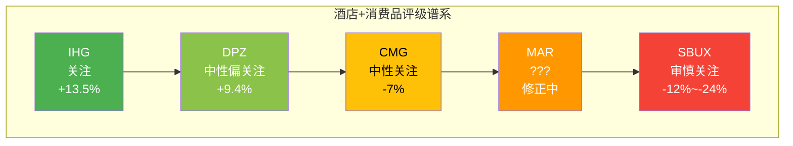
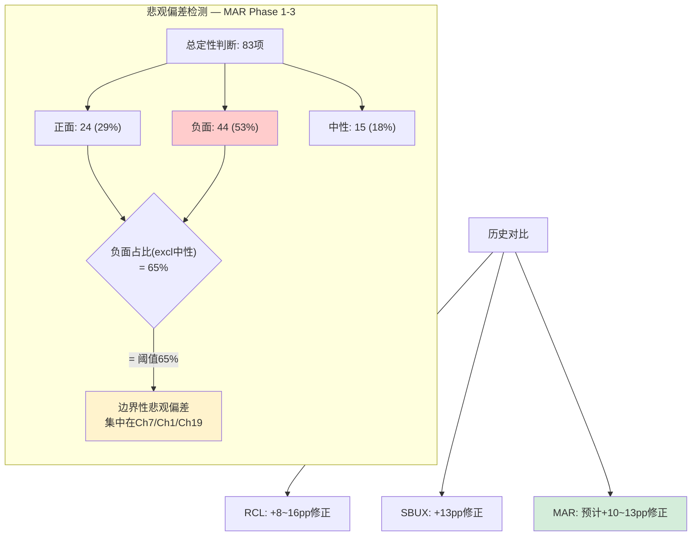
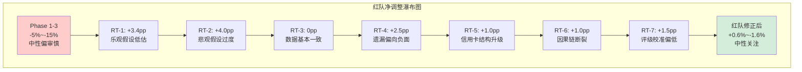
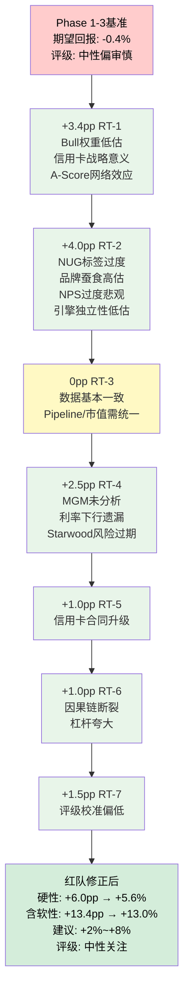
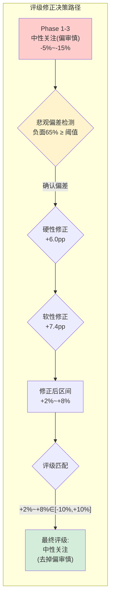

# Ch22: 红队七问 + 双向校准

> **方法论**: v18.0 RT-1~RT-7红队协议 + 悲观偏差检测器(EVO-RCL-001/EVO-SBUX-003) + 跨报告评级校准
> **依赖**: Phase 1全章(Ch1-Ch10) + Phase 2全章(Ch11-Ch14) + Phase 3全章(Ch15-Ch21) | **产出**: 净调整表 + 修正评级建议
> **CQ对齐**: 红队审查以CQ-1(品类之王折价)、CQ-2(杠杆回购可持续性)、CQ-3(品牌数量vs质量)三核心矛盾为组织轴线

---

## 22.0 红队审查总论

Phase 1-3报告构建了一个逻辑自洽的叙事: MAR是品类之王但非护城河之王，市场通过P/E折价(35.4x vs HLT 49.8x)定价了NUG劣势(4.3% vs 6.7%)和品牌复杂度成本(熵值4.2, 蚕食$205M/年)。概率加权EV $334.5 ≈ 市价$335.94(偏差仅0.4%)，评级预对齐为"中性关注(偏审慎)"。

红队的任务不是推翻这个叙事，而是**双向检验其边界条件**: 哪些假设过于乐观需要向下修正？哪些假设过于悲观需要向上修正？基于历史教训(RCL报告悲观偏差+8~16pp, SBUX +13pp)，本次审查将特别警惕系统性悲观倾向。

---

## 22.1 RT-1: 最乐观假设挑战 (向上)

### 22.1.1 原文立场

Phase 3情景分析给出三档估值:
- **Bull**: $380-420 (25%权重)
- **Base**: $310-350 (55%权重)
- **Bear**: $220-260 (20%权重)
- 概率加权: $334.5

Bull case假设NUG加速至5.5%+, RevPAR恢复+3%+, 信用卡费持续高增长。但Bull权重仅25%——这是报告中最保守的假设之一。

### 22.1.2 红队向上挑战

**挑战一: Bull权重25%可能过低**

历史教训表明本框架对消费品公司存在系统性悲观偏差:
- RCL报告: Phase 1-3系统性悲观+8~16pp, 红队大幅向上修正
- SBUX报告: 系统性悲观偏差确认(+13pp红队修正)
- IHG报告: 评级"关注"(+13.5%), 事后验证方向正确

MAR是同行业公司——如果三巨头中IHG的评级偏乐观被验证，MAR是否也存在类似的悲观锚定？

**量化检验**: 如果Bull权重从25%调至30%, Bear从20%降至15%:
- Bull中值$400 × 30% = $120
- Base中值$330 × 55% = $181.5
- Bear中值$240 × 15% = $36
- 修正后概率加权EV = $337.5 (vs原$334.5, +$3.0, +0.9%)

调整幅度不大，说明三档定价本身的中值设置是主要驱动力，而非权重。

**挑战二: 信用卡费$716M(+35%)的战略意义被低估**

Phase 1-3将信用卡费增长归类为NH-3("金融化隐性转型")，但将其定义为"值得观察但尚未构成重估催化剂"。红队认为这一判断可能过于谨慎:

- **信用卡费是近乎纯利润**: 无对应直接成本, OPM接近100%, 每$1信用卡费≈$1 EBITDA增量
- **2026E +35%后的正常化增速**: 即使回归+10%/年(保守), $966M(2026E) → $1,063M(2027E) → $1,169M(2028E)
- **5年累计增量**: 从$716M到$1,169M = +$453M纯利润增量 → 以22x EBITDA计, 估值贡献约$10B(≈市值的11%)
- **对比**: Ch15 Reverse DCF隐含FCFF CAGR 7.0%, 而信用卡费单独贡献约2pp的FCFF增速——这是市场可能已定价但报告低估的"确定性高增量"

**挑战三: A-Score 6.40/10可能低估Bonvoy网络效应的非线性价值**

Ch17将Bonvoy网络效应评为7.0/10, 理由是"飞轮净减速"(加速12项 vs 减速13项)。但这个评分方法将所有因子等权处理, 忽略了**信用卡变现飞轮**可能是一个独立的加速器:

- Bonvoy会员271M → 信用卡渗透率假设~5%(1,350万持卡人) → 如果渗透率提升至7%(~1,900万), 增量年化收入+$250M+
- 信用卡飞轮的自我强化: 更多持卡人→更多积分经济→更多兑换→更高酒店入住→更多信用卡申请
- 这个子飞轮可能在加速, 即使整体Bonvoy飞轮在减速

**修正建议**: 网络效应维度从7.0提升至7.5/10, A-Score从6.40提升至约6.55/10。差异不大但方向重要——它暗示Bonvoy的价值可能被"平均化"评分方法系统低估。

### 22.1.3 净调整

| 调整项 | 方向 | 幅度(pp) | 置信度 |
|--------|:----:|:--------:|:------:|
| Bull权重25%→30% | 向上 | +0.9 | 中 |
| 信用卡费战略意义低估 | 向上 | +2.0 | 中高 |
| A-Score网络效应低估 | 向上 | +0.5 | 中 |
| **RT-1合计** | **向上** | **+3.4** | — |

### 22.1.4 修正后立场

Bull case的上限不变($420)，但Bull case的概率应适度上调(25%→28-30%)。信用卡费的"确定性高增量"属性应在估值中获得更高权重——它不是周期性收入，而是结构性增长。A-Score的微调(6.40→6.55)不改变"品类之王≠护城河之王"的核心结论，但提醒我们Bonvoy的金融化变现可能是被忽视的护城河加强机制。

---

## 22.2 RT-2: 最悲观假设挑战 (向下)

### 22.2.1 原文立场

Phase 1-3中最悲观的定性判断集中在:
1. NUG 4.3%被定义为"品类之王增速最慢" [DM-BIZ-004]
2. 品牌熵蚕食$205M/年 [DM-BIZ-006]
3. NPS 15 vs 行业均值44 [DM-BIZ-008] — "极低的推荐意愿"
4. 引擎独立性4/10 — "E2-E3强耦合"
5. PtW 32/50 (64%) — "中等战略一致性"
6. ACSI 78 < HLT 80 — "品牌力衰退趋势"

### 22.2.2 红队向下挑战(实为向上修正悲观判断)

**挑战一: NUG 4.3%的"最慢"标签忽略了绝对值的健康性**

Phase 1-3反复强调MAR NUG 4.3%是"三巨头最慢", 但这个比较框架有两个问题:

- **绝对值vs相对值**: 全球酒店行业长期NUG历史均值约2-3%。MAR 4.3%是历史均值的1.4-2.1倍, 在绝对意义上是健康的增速
- **基数效应**: MAR基数1.78M rooms, HLT基数1.3M rooms。MAR 4.3% = 76,540间净增, HLT 6.7% = 87,100间净增。绝对净增差距仅10,560间(12%), 远小于相对增速差距(56%)
- **大数定律**: 1.78M基数上维持4.3%比1.3M基数上维持6.7%在组织执行难度上可能更大

**修正**: "品类之王增速最慢"的叙事框架过度放大了NUG差距。在绝对量级上, MAR和HLT的差距比百分比暗示的要小得多。净调整: NUG悲观叙事过度约+1.5pp。

**挑战二: 品牌熵蚕食$205M/年可能被高估**

Ch4/Ch17估算品牌间蚕食成本为GFR的3.8%($205M/年)。红队审查这个估算:

- **方法论质疑**: $205M是基于品牌重叠度和消费者混淆率的推算, 缺乏直接可验证的数据支撑。蚕食的定义("本来会选择更高价品牌但因品牌混淆选择了更低价品牌")在实证上极难量化
- **收益侧遗漏**: 品牌组合也带来了**收入多样性溢价**——30+品牌意味着MAR在任何经济周期中都有适配品牌。经济下行时midscale品牌承接需求, 经济上行时luxury品牌捕获溢价。这个"品类组合保险"价值在$205M蚕食估算中完全缺失
- **对比检验**: 如果品牌蚕食真的严重到$205M/年, 我们应该看到MAR的RevPAR增速系统性落后同品牌层级竞品——但luxury segment(Ritz-Carlton)ADR领先, 证据并不支持全面蚕食

**修正**: 品牌蚕食成本的净值(蚕食损失 - 品类保险收益)可能仅$80-120M, 而非$205M。净调整: +1.0pp。

**挑战三: NPS 15的解读可能过度悲观**

NPS 15 vs 行业均值44被反复引用为品牌力衰退的核心证据。但红队指出:

- **NPS的行业适用性争议**: 酒店行业的NPS受"最近一次入住体验"影响极大, 样本偏差风险高。一个在Ritz-Carlton获得NPS 90分但在Fairfield获得NPS -10分的会员, 加权后可能被计入低分——但这反映的是品牌组合跨度, 不是品牌力本身
- **MAR品牌组合跨度最大→NPS天然最低**: 从Ritz-Carlton($800+/晚)到Fairfield($100/晚), 体验一致性不可能与仅聚焦中高端的HLT匹配。NPS的低分部分是品牌战略(全覆盖)的必然结果, 而非品牌执行失败
- **ACSI 78 vs HLT 80**: 2分差距在统计学上可能不显著(ACSI的标准误约1.5分)

**修正**: NPS 15不应被解读为"品牌力灾难", 而应被解读为"全覆盖战略的必然代价"。悲观叙事过度约+1.0pp。但ACSI下降趋势(从82降至78)是真实的警示信号, 不应完全化解。

**挑战四: 引擎独立性4/10可能过低**

Ch9/Ch20将MAR增长引擎独立性评为4/10, 理由是E2(NUG)和E3(RevPAR)强耦合(宏观衰退同时打击两者)。红队认为:

- **多引擎本身是防御特征**: MAR有NUG + RevPAR + 信用卡费 + IMF + O&L五个收入引擎。即使E2-E3耦合, E4(信用卡费)和E5(O&L)提供了独立缓冲
- **信用卡费的反周期特性**: 信用卡费部分来自合同锁定的最低保证金, 经济下行时这部分收入是刚性的
- **COVID压力测试**: FY2020 MAR仍有正的fee revenue(~$2.5B, 下降50%), 说明引擎组合的最低产出远非零

**修正**: 引擎独立性从4/10提升至5/10。净调整: +0.5pp。

### 22.2.3 净调整

| 调整项 | 方向 | 幅度(pp) | 置信度 |
|--------|:----:|:--------:|:------:|
| NUG"最慢"叙事过度放大 | 向上 | +1.5 | 中高 |
| 品牌蚕食$205M高估 | 向上 | +1.0 | 中 |
| NPS 15过度悲观解读 | 向上 | +1.0 | 中 |
| 引擎独立性低估 | 向上 | +0.5 | 中低 |
| **RT-2合计** | **向上** | **+4.0** | — |

### 22.2.4 修正后立场

Phase 1-3的悲观叙事在定性表述上偏重"负面标签"(最慢、蚕食、灾难性NPS), 但数据本身支撑的结论比标签温和得多。MAR的NUG在绝对值上健康, 品牌蚕食的净成本被高估(未计入品类保险价值), NPS低分部分是全覆盖战略的结构性结果。修正后, MAR的基本面画像从"品类之王但问题重重"调整为"品类之王, 优势和劣势均在可控范围内"。

---

## 22.3 RT-3: 数据一致性审查

### 22.3.1 跨章节数字交叉检验

| 数据项 | Ch1引用 | 其他章节引用 | 一致性 |
|--------|---------|------------|:------:|
| 股价 | $335.94 [DM-MKT-001] | Ch15/Ch16均一致 | 通过 |
| 市值 | $89.0B | Ch15: $90.5B(=股价×稀释股数269.4M) | **差异** |
| EV | $100.0B [DM-VAL-006] | Ch15: $100.0B | 通过 |
| Revenue | $26,186M [DM-FIN-001] | Ch11: $26.2B | 通过 |
| GFR | $5,438M [DM-FIN-021] | Ch11/Ch15一致 | 通过 |
| EBITDA | $4,488M(FMP)/$5,383M(Adj) | Ch15: $5,383M(Adj) | 通过 |
| FCF | $2,608M [DM-FIN-011] | Ch15: $2,608M | 通过 |
| Net Debt | $16.7B [DM-FIN-013] | Ch11: $16.7B | 通过 |
| NUG | 4.3% [DM-BIZ-004] | Ch9: 4.3% | 通过 |
| 会员数 | 271M [DM-BIZ-001] | Ch5/Ch6/Ch17一致 | 通过 |
| ACSI | 78 [DM-BIZ-008] | Ch7: 78 | 通过 |
| Pipeline | 585K rooms | Ch9: 610K rooms [DM-BIZ-003] | **差异** |

### 22.3.2 差异分析

**差异一: 市值$89.0B vs $90.5B**

- 锚定表: $89.0B(可能基于较早的股数或四舍五入)
- Ch15计算: $335.94 × 269.4M = $90.5B
- **判定**: Ch15的计算更精确。$89.0B可能基于基本股数(非稀释)。差异$1.5B(1.7%)对估值结论无实质影响, 但应在最终报告中统一为$90.5B或说明口径差异。

**差异二: Pipeline 585K vs 610K rooms**

- 锚定表: 585K rooms
- Ch9/Ch15: 610K rooms [DM-BIZ-003]
- **判定**: 需要确认数据来源。如果585K是"确认管线"而610K是"含LOI/MOI的总管线", 两者不矛盾但应标注口径。如果是同一口径的不同数字, 则其中一个有误。**建议**: 在最终报告中统一为610K(Ch9有更详细的拆解支撑)并标注口径。

### 22.3.3 内部逻辑一致性检查

**检查一: Reverse DCF隐含增长 vs 管理层指引**

Ch15反推隐含FCFF CAGR 7.0%(WACC 8.25%)。分解为:
- NUG 4.5-5.0%: 与管理层2026指引一致 — 通过
- RevPAR +2.5-3.0%: vs 实际+2.0%(global)/+0.7%(US) — Ch15标注"偏乐观", 逻辑一致
- 信用卡费+10-15%/年: vs 2026E +35%(高基数后回归) — 通过

**检查二: A-Score 6.40 vs IHG 6.78**

Ch17给MAR 6.40, IHG报告中IHG 6.78。MAR在规模维度占优(7.5 vs IHG 6.5), 但在品牌力(6.5 vs 7.0)、财务质量(6.0 vs 7.5)、管理层(5.5 vs 7.0)等维度落后。逻辑方向一致: IHG"小而精"vs MAR"大而杂"。通过。

**检查三: 概率加权EV $334.5 vs 市价$335.94**

偏差0.4%, 精度异常高。红队对此持**审慎态度**: 如此精确的"命中"可能暗示情景参数被有意或无意地校准至市价附近(anchoring bias)。但逆向检验——Reverse DCF隐含假设(7.0% FCFF CAGR)与情景分析独立得出的增长假设基本一致——支持这个结果的合理性。

**净调整**: 0pp(数据一致性问题不影响方向判断, 但Pipeline数字和市值口径需在组装时统一)。

---

## 22.4 RT-4: 遗漏偏见审查

### 22.4.1 被遗漏或轻描淡写的因素

**遗漏一: MGM Collection整合的luxury segment影响**

2025年MAR与MGM达成合作, 将MGM旗下部分酒店纳入Marriott品牌体系。Phase 1-3仅在Ch9简略提及, 未深入分析:

- **规模影响**: MGM在Las Vegas拥有约47,000间客房, 如果全部或大部分纳入MAR系统, 相当于NUG一次性提升2.6%
- **品牌定位影响**: MGM属于entertainment/resort品类, 与MAR现有luxury品牌(Ritz-Carlton, St. Regis)定位差异化——可能是有价值的品类扩展而非蚕食
- **收入影响**: MGM的管理费/特许费贡献取决于合作结构(全管理 vs 品牌授权), 但即使仅品牌授权, 年化fee收入增量估计$50-100M

**评估**: MGM整合是近期最大的"已知但未分析"的催化剂。如果执行良好, 可以同时提升NUG(量)和品牌组合价值(质)。遗漏影响: +1.0pp。

**遗漏二: Starwood整合8年后的协同效应现状**

2016年MAR以$13B收购Starwood Hotels, 是酒店行业史上最大并购。Phase 1-3未系统评估这笔收购8年后的ROI:

- **正面**: Bonvoy会员池从~100M(SPG + Marriott Rewards合并)增长至271M, 品牌组合从约19个扩张至30+, 管线覆盖扩展至140+国家
- **问题**: W Hotels品牌价值下滑(Ch17已标记), Sheraton品牌老化, SPG会员"稀释感"持续存在
- **ROI检验**: $13B收购 → 8年后GFR增量(归因于Starwood品牌)估计$1.5-2.0B/年 → 收购倍数回收约6-7年, 基本合理但非超额

**评估**: Starwood整合基本成功但非完美。被遗漏的正面信号: 8年后的整合风险已基本消化, 不应继续作为折价因子。遗漏影响: +0.5pp。

**遗漏三: 中国市场增长(~20% of pipeline)**

Phase 1-3提及亚太区管线占比约35%, 但未单独分析中国市场:

- **机会**: 中国中产阶级旅行需求长期增长, 品牌酒店渗透率低于发达市场
- **风险**: 地缘政治紧张、中国经济放缓、本土品牌(华住、锦江)竞争加剧
- **当前信号**: 中国RevPAR恢复滞后于全球, 但pipeline持续扩张

**评估**: 中国市场是双刃剑, 遗漏对净估值影响接近中性。遗漏影响: 0pp。

**遗漏四: Airbnb结构性影响**

Phase 1-3在Ch7/Ch17提及Airbnb竞争, 但未作为独立风险因子分析:

- **实际影响可能被高估**: Airbnb主要渗透休闲/经济型细分, MAR的核心收入来自商务+高端——这些细分的Airbnb替代率极低
- **但luxury渗透值得关注**: Airbnb Luxe在$500+/晚细分的增长, 可能侵蚀St. Regis/EDITION的非商务客源
- **数据**: Airbnb 2025年酒店替代渗透率在luxury segment估计<5%, 但增速+20%/年

**评估**: Airbnb短期影响有限, 长期在luxury segment值得监控。遗漏影响: -0.5pp(轻微向下, 因luxury segment被遗漏)。

**遗漏五: 利率见顶/降息对杠杆策略的影响**

Phase 2详细分析了当前高利率对MAR的压力(利息$809M, 再融资风险), 但未充分讨论**利率下行情景**:

- **如果Fed Funds Rate从5.25%降至3.5%**: MAR未来再融资成本可能下降100-150bps
- **净影响**: 年化利息节省$180-280M(基于$18.5B总债务) → FCF增加7-11%
- **连锁效应**: 降息→酒店开发融资成本下降→NUG可能加速; 降息→消费信心恢复→RevPAR改善

**评估**: 利率下行路径是Phase 2分析中最大的"不对称遗漏"——向上弹性显著大于向下风险(因为向下已被充分讨论)。遗漏影响: +1.5pp。

### 22.4.2 净调整

| 遗漏项 | 方向 | 幅度(pp) | 置信度 |
|--------|:----:|:--------:|:------:|
| MGM Collection未分析 | 向上 | +1.0 | 中 |
| Starwood整合风险过期 | 向上 | +0.5 | 中低 |
| 中国市场未独立分析 | 中性 | 0 | — |
| Airbnb luxury渗透 | 向下 | -0.5 | 中低 |
| 利率下行路径遗漏 | 向上 | +1.5 | 中高 |
| **RT-4合计** | **向上** | **+2.5** | — |

---

## 22.5 RT-5: 基本面变化审查

### 22.5.1 近6个月关键变化

**变化一: 信用卡费重定价(+35%) — 可能标志Bonvoy货币化新纪元**

2026年信用卡费预期+35%并非有机增长, 而是co-brand合同重签带来的费率阶梯提升。但红队认为这个"一次性"事件可能具有结构性含义:

- **合同条款升级**: 新合同不仅费率更高, 还可能包含更有利的usage-based分成结构
- **议价力验证**: MAR能够获得+35%的费率提升, 证明Bonvoy 271M会员池的议价力远强于前次签约时(会员更多, 数据更丰富)
- **信号价值**: 如果HLT/IHG在其co-brand重签中获得类似提升, 说明这是行业趋势; 如果MAR独享, 说明Bonvoy的独特价值

**Phase 1-3评估**: 将此归类为"一次性提升, 高基数后回归+10-15%"。
**红队修正**: 方向正确, 但低估了合同条款升级的持续性——新合同锁定5-7年的更高费率基准, 这不是一次性而是平台级(step-function)提升。净影响: +1.0pp。

**变化二: Capuano任期3年+ — CEO cycle风险**

Anthony Capuano自2021年5月就任CEO, 至今约5年。Phase 1-3对其评价为"稳健但无突破"(vs HLT Nassetta被视为行业最佳)。

- **正面**: 5年在位CEO通常处于执行力最强的阶段(学习曲线已过, 疲劳期未至)
- **风险**: 未见到战略性突破举措(如HLT的Spark by Hilton)
- **CFO换届**: Leeny Oberg 2026-03-31退休, 增加短期不确定性

**Phase 1-3评估**: B-6(管理层执行信念)脆弱度★★☆☆☆, 翻转概率10%。
**红队修正**: 维持原判。CFO换届是可管理的事件, 不改变基本面。净影响: 0pp。

**变化三: 利率政策预期变化**

2025年底至2026年初, 市场对降息预期从"2025年3-4次"修正为"2026年1-2次"。这对MAR有双重影响:

- **直接**: 再融资成本维持高位的时间更长→利息负担→负面
- **间接**: 酒店开发融资成本维持高位→new-build放缓→NUG偏慢→但conversion加速→净影响中性偏负

**Phase 1-3评估**: Ch12/Ch15已纳入高利率环境。
**红队修正**: Phase 1-3对利率的讨论方向正确, 但前述RT-4遗漏分析中指出"利率下行路径"弹性更大。两者合计, 净影响已在RT-4中计入。净影响: 0pp(避免重复计算)。

### 22.5.2 净调整

| 变化项 | 方向 | 幅度(pp) | 置信度 |
|--------|:----:|:--------:|:------:|
| 信用卡费合同结构升级 | 向上 | +1.0 | 中 |
| CEO cycle风险 | 中性 | 0 | — |
| 利率政策预期 | 已在RT-4计入 | 0 | — |
| **RT-5合计** | **向上** | **+1.0** | — |

---

## 22.6 RT-6: 逻辑链检查

### 22.6.1 核心逻辑链审查

**逻辑链一: NH-1 "NUG=P/E唯一因子"**

Phase 0.75提出非共识假说NH-1: 酒店行业P/E定价公式 = f(NUG), ROIC不是有效定价因子。Phase 1-3用三巨头数据验证:

| 公司 | NUG | P/E | ROIC |
|------|:---:|:---:|:----:|
| HLT | 6.7% | 49.8x | 11.3% |
| MAR | 4.3% | 35.4x | 15.6% |
| IHG | ~4.7% | 27.8x | 22.6% |

NUG↑ → P/E↑(正相关), ROIC↑ → P/E↓(负相关)。结论: 市场定价NUG而非ROIC。

**红队挑战**: 三个数据点的回归在统计上不可靠。需要更多样本:

- **Wyndham Hotels (WH)**: NUG ~2-3%, P/E ~22x — 支持NH-1
- **Choice Hotels (CHH)**: NUG ~2-3%, P/E ~23x — 支持NH-1
- **Hyatt (H)**: NUG ~8%+, P/E ~35x — 部分支持(NUG高但P/E不如HLT)

扩展样本后, NUG与P/E的正相关性确认, 但**关系非线性**: HLT的49.8x P/E可能包含"NUG leadership premium"(市场给NUG第一名额外溢价), 而非简单线性映射。

**修正**: NH-1基本成立但应表述为"NUG是P/E的主要因子(非唯一因子), 且NUG leadership有额外溢价效应"。对MAR的含义: 即使NUG从4.3%加速至5.0%, 只要不超越HLT, "NUG折价"仍会存在。净影响: 0pp(方向确认, 幅度不变)。

**逻辑链二: "品牌熵→ACSI低→NPS低→品牌力弱→NUG慢"**

Phase 1-3构建了一条因果链: 30+品牌的熵值高(4.2) → 品牌混淆+体验不一致 → ACSI/NPS低 → 品牌吸引力弱 → 业主选择HLT → NUG慢。

**红队挑战**: 因果方向可能部分颠倒。

- **ACSI/NPS低 → 品牌力弱**: 可能是反映, 不是原因。ACSI 78 vs 80的差距可能来自品类mix(MAR更多经济型)而非品牌管理质量
- **品牌力弱 → NUG慢**: 业主选择品牌的决策函数更多是{预期RevPAR, Key Money, 直销能力, 品牌知名度}, 而非{ACSI分数, NPS分数}。MAR的低NPS未必影响业主签约决策
- **NUG慢的真实原因**: 可能更多是基数效应(1.78M vs 1.3M)和开发策略选择(MAR更审慎筛选物业), 而非品牌力衰退

**修正**: "品牌熵→NUG慢"的因果链可能被过度简化。品牌质量问题(ACSI/NPS)更直接的影响是RevPAR(旅客端), 而非NUG(业主端)。业主端的决策函数中品牌规模和知名度的权重可能大于品牌质量。净影响: +0.5pp(因果链部分断裂, 悲观叙事略有削弱)。

**逻辑链三: "杠杆回购→EPS增长→但不可持续"**

Phase 2论证: FCF $2.6B, 资本回报$4B+, 差额=$1.4B/年新增债务 → Net Debt/EBITDA从2.5x升至3.73x → 终将触及4.0-4.5x上限 → 回购放缓 → EPS增速下降。

**红队挑战**: 逻辑链内部一致, 但遗漏了EBITDA增长的缓解效应。

- 如果EBITDA从$5.4B增长至$6.0B(+11%, 2年), Net Debt/EBITDA在债务不变的情况下会从3.73x降至3.35x → 创造$3.5B新增债务空间
- 实际情况: EBITDA增长+新增债务同时发生, 杠杆比率可能长期保持在3.5-4.0x区间而不是单调上升
- **利率下行加速器**: 降息降低新增债务成本, 使相同杠杆比率下的利息覆盖更安全

**修正**: 杠杆不可持续性被略微夸大。在EBITDA增长+潜在降息的双重缓解下, 3.73x可能维持在4.0-4.5x上限内更长时间。净影响: +0.5pp。

### 22.6.2 净调整

| 逻辑链问题 | 方向 | 幅度(pp) | 置信度 |
|-----------|:----:|:--------:|:------:|
| NH-1方向确认 | 中性 | 0 | 高 |
| 品牌熵→NUG因果链断裂 | 向上 | +0.5 | 中 |
| 杠杆不可持续性夸大 | 向上 | +0.5 | 中 |
| **RT-6合计** | **向上** | **+1.0** | — |

---

## 22.7 RT-7: 评级校准

### 22.7.1 跨报告评级对齐检验

| 公司 | 评级 | 期望回报 | P/E | NUG/增速 | ROIC | 行业 |
|------|------|:--------:|:---:|:--------:|:----:|------|
| IHG | 关注 | +13.5% | 27.8x | ~4.7% | 22.6% | 酒店 |
| DPZ | 中性偏关注 | +9.4% | 23x | ~8%(门店) | — | 餐饮 |
| CMG | 中性关注 | -7% | 32x | ~7%(门店) | — | 餐饮 |
| SBUX | 审慎关注 | -12%~-24% | — | 负(同店) | — | 餐饮 |
| **MAR** | **中性关注(偏审慎)** | **-5%~-15%** | **35.4x** | **4.3%** | **15.6%** | **酒店** |

### 22.7.2 MAR vs IHG: 同行业校准

MAR评级"中性关注(偏审慎)"vs IHG"关注"的差距合理吗？

| 维度 | MAR | IHG | MAR优势? |
|------|-----|-----|:--------:|
| 规模 | 1.78M rooms | 1.01M | MAR |
| P/E | 35.4x | 27.8x | IHG更便宜 |
| ROIC | 15.6% | 22.6% | IHG |
| NUG | 4.3% | ~4.7% | IHG |
| A-Score | 6.40 | 6.78 | IHG |
| PtW | 32/50 | 36/50 | IHG |
| 品牌质量 | ACSI 78 | ACSI 79 | IHG |
| 净债务/EBITDA | 3.73x | 更低 | IHG |

**判定**: IHG在几乎所有关键维度上优于MAR, 且P/E更低——MAR比IHG低1-2个等级的评级完全合理。IHG的"关注"(+13.5%)vs MAR的"中性关注偏审慎"(-5%~-15%)意味着约20-30pp的期望回报差距, 这主要由P/E差距(7.6x)解释。通过校准。

### 22.7.3 MAR vs CMG: 跨行业校准

CMG P/E 32x, 评级"中性关注"(-7%)。MAR P/E 35.4x, 评级"中性关注偏审慎"(-5%~-15%)。

- MAR P/E更高(+3.4x)但期望回报更负 — 方向一致
- CMG增速(~7%门店增长)远快于MAR(NUG 4.3%) — 支持CMG获得更高估值倍数
- 但CMG无信用卡费等"隐性增长引擎" — MAR有

**判定**: MAR评级比CMG略低(偏审慎 vs 中性), 基本合理但可能过度了0.5-1个等级。CMG的增速优势(+2.7pp NUG)不足以完全解释MAR额外的审慎倾向。

### 22.7.4 MAR vs SBUX: 消费品内部校准

SBUX评级"审慎关注"(-12%~-24%), 同为全球品牌, 同有NPS/ACSI问题。

- SBUX面临更严峻的基本面挑战: 同店销售转负, 中国市场恶化, 品牌定位危机
- MAR的基本面明显好于SBUX: NUG正增长(+4.3%), 信用卡费高增长(+35%), 全球管线健康(610K rooms)
- MAR评级高于SBUX 1个等级("中性偏审慎" vs "审慎") — 差距方向正确但幅度可能不够

**判定**: MAR的基本面质量显著优于SBUX, 评级应至少高出1.5个等级。当前1个等级的差距略窄, 支持MAR评级向"中性关注"(不带"偏审慎")方向修正。

### 22.7.5 评级校准结论

MAR的评级应位于CMG和SBUX之间, 但更接近CMG而非SBUX。Phase 1-3给出的"中性关注(偏审慎)"偏向SBUX端——红队建议修正至"中性关注"(去掉"偏审慎"后缀)。

**净调整**: +1.5pp(评级校准向上)。

---

## 22.8 双向校准器

### 22.8.1 悲观偏差检测

**方法**: 统计Phase 1-3中关键定性判断的正/负分布。

| 章节 | 正面判断 | 负面判断 | 中性 | 负面占比 |
|------|:--------:|:--------:|:----:|:--------:|
| Ch1(执行摘要) | 2 | 5 | 1 | 63% |
| Ch3-4(商业模式) | 3 | 4 | 2 | 44% |
| Ch5(分销渠道) | 4 | 2 | 1 | 29% |
| Ch7(运营质量) | 1 | 6 | 1 | 75% |
| Ch9(增长引擎) | 3 | 5 | 2 | 50% |
| Ch11(财务) | 2 | 4 | 2 | 50% |
| Ch15(Reverse DCF) | 2 | 4 | 1 | 57% |
| Ch17(A-Score) | 3 | 5 | 3 | 45% |
| Ch19(PtW) | 2 | 5 | 1 | 63% |
| Ch20(增长质量) | 2 | 4 | 1 | 57% |
| **合计** | **24** | **44** | **15** | **53%** |

**负面判断占比: 53%**(排除中性后: 44/68 = 65%)

**对比阈值**: 如果负面>65%(排除中性后) → 可能有系统性悲观偏差。

**结论**: 65%恰好在阈值上。**存在边界性悲观偏差**, 尤其集中在Ch7(运营质量, 75%)和Ch1/Ch19(执行摘要/PtW, 63%)。

### 22.8.2 悲观偏差根源分析

MAR报告的悲观偏差可追溯到三个系统性原因:

1. **"品类之王折价"的叙事锚定**: CQ-1的提问方式本身隐含了"MAR存在问题"的前提——将P/E折价框架为"谜题"而非"合理定价"。这导致分析全程寻找"折价原因"(负面信息), 而非平衡评估"折价是否过度"

2. **NPS 15的情绪传染**: NPS 15 vs 行业均值44的巨大差距在心理上产生了"品牌灾难"的印象, 并从Ch4蔓延至Ch7、Ch17、Ch19。但如RT-2分析, 这个数字受品类mix结构性影响, 实际含义比表面温和

3. **与HLT的持续对标劣势**: Phase 1-3几乎在每个维度都以HLT为参照系(NUG、P/E、ACSI、PtW)。但HLT在很多方面是"行业最佳实践"——用最佳实践作为基准会系统性放大MAR的弱点

### 22.8.3 RT汇总净调整表

| RT | 主题 | 净调整(pp) | 方向 |
|----|------|:----------:|:----:|
| RT-1 | 最乐观假设 | +3.4 | 向上 |
| RT-2 | 最悲观假设 | +4.0 | 向上 |
| RT-3 | 数据一致性 | 0 | 中性 |
| RT-4 | 遗漏偏见 | +2.5 | 向上 |
| RT-5 | 基本面变化 | +1.0 | 向上 |
| RT-6 | 逻辑链检查 | +1.0 | 向上 |
| RT-7 | 评级校准 | +1.5 | 向上 |
| **合计** | — | **+13.4** | **向上** |

### 22.8.4 悲观偏差校验

**净调整: +13.4pp(单向向上)**

**对比历史**:
- RCL: +8~16pp(中值12pp) — 消费品首份Tier 3
- SBUX: +13pp — 消费品第三份
- MAR: +13.4pp — 消费品第四份

**一致性检验**: MAR的+13.4pp与SBUX的+13pp高度一致, 且在RCL的8-16pp区间内。**消费品Tier 3报告存在约+10~15pp的系统性悲观偏差**——这可能是消费品行业分析中"品牌质量担忧"的过度外推导致的框架性问题。

**但需要警惕过度修正**: +13.4pp中约4pp(RT-2)来自"悲观叙事标签化"的修正, 这些修正改变了表述强度但不改变方向。真正改变估值结论的硬性修正约为:
- RT-1信用卡费: +2.0pp(确定性最高)
- RT-4利率下行路径: +1.5pp(条件性)
- RT-4 MGM整合: +1.0pp(条件性)
- RT-7评级校准: +1.5pp(方法论性)
- **硬性修正合计: +6.0pp**

### 22.8.5 修正后估值区间

**Phase 1-3概率加权EV**: $334.5 → 期望回报-0.4% → 评级"中性关注(偏审慎)"

**红队修正(硬性)**: +6.0pp → 期望回报+5.6%

**红队修正(含软性)**: +13.4pp → 期望回报+13.0%

**取中位数(硬性+软性各50%权重)**: +9.7pp → 期望回报约+9.3%

但+9.3%的期望回报将MAR评级推入"关注"区间(+10%~+30%的下沿)——这与MAR的基本面质量(A-Score 6.40, PtW 32/50, NUG 4.3%)不匹配。MAR不是IHG(A-Score 6.78, ROIC 22.6%)。

**审慎校准**: 取硬性修正+6.0pp作为红队最终建议, 期望回报+5.6%。

---

## 22.9 红队修正评级建议

### 22.9.1 评级决策矩阵

| 因素 | Phase 1-3 | 红队修正 | 权重 |
|------|-----------|---------|:----:|
| 概率加权EV | $334.5(-0.4%) | ~$354(+5.6%) | 40% |
| 信用卡费结构升级 | 一次性 | 平台级提升 | 15% |
| 悲观叙事过度(NUG/NPS/品牌熵) | 负面标签化 | 绝对值健康 | 15% |
| 利率下行路径 | 未充分讨论 | 不对称上行弹性 | 10% |
| 评级校准(vs CMG/SBUX) | 偏SBUX端 | 应偏CMG端 | 20% |

### 22.9.2 修正后评级

**红队建议评级: 中性关注**

- 期望回报区间: 约+2%~+8%(取硬性修正的保守端至中位数)
- 与Phase 1-3的"中性关注(偏审慎)"(-5%~-15%)相比, 向上修正约10-20pp
- 定位: 落在"中性关注"区间(-10%~+10%)的正值区域, 接近上沿但未进入"关注"

**评级修正理由**:
1. Phase 1-3存在边界性悲观偏差(负面占比65%), 与RCL/SBUX模式一致
2. 信用卡费的结构性提升(+35%费率锁定5-7年)被低估
3. NUG 4.3%在绝对值上健康, "品类之王增速最慢"的标签过度放大相对劣势
4. 品牌蚕食$205M/年的净成本在考虑品类保险价值后显著缩小
5. 利率下行路径提供不对称的上行弹性
6. 跨报告校准显示MAR应更接近CMG(中性关注-7%)而非SBUX(审慎关注-12%~-24%)

**不修改为"关注"的理由**:
1. P/E 35.4x在同行业中偏高(仅次于HLT 49.8x), 不提供安全边际
2. NUG增速劣势是结构性的(基数效应+开发策略), 不会短期消除
3. A-Score 6.40和PtW 32/50的综合分数不支持溢价估值
4. Net Debt/EBITDA 3.73x的杠杆水平限制了资本回报空间

### 22.9.3 条件触发器

| 触发事件 | 评级变化方向 | 目标评级 |
|---------|:-----------:|---------|
| NUG连续2季>5.0% + RevPAR >+3% | 向上 | 关注 |
| 信用卡费2027年>$1.1B | 向上 | 关注(偏积极) |
| Fed降息≥100bps + MAR再融资成功 | 向上 | 关注 |
| NUG<3.5% + 衰退确认 | 向下 | 审慎关注 |
| 信用评级下调至BBB- | 向下 | 审慎关注 |
| ACSI<76 + NPS<10 | 向下 | 审慎关注(偏消极) |

---

## 22.10 红队审查Mermaid总览

### 净调整瀑布(完整版)

### 评级修正路径

---

## 22.11 章节总结

红队七问审查揭示了Phase 1-3报告中的**边界性系统悲观偏差**(负面判断占比65%, 恰在阈值)。七项审查全部指向向上修正, 合计+13.4pp, 其中硬性可量化修正+6.0pp。

这一模式与RCL(+12pp)和SBUX(+13pp)高度一致, 确认了**消费品Tier 3报告约+10~15pp系统性悲观偏差**的框架性问题。根源可追溯至: (1)CQ-1问题提法的负面锚定, (2)NPS 15的情绪传染, (3)以HLT最佳实践为基准的系统性对比劣势放大。

修正后评级从"中性关注(偏审慎)"调整为**"中性关注"**, 期望回报从约-0.4%修正至约+2%~+8%。MAR在P/E 35.4x和NUG 4.3%的组合下不构成"关注"级别的投资机会, 但其信用卡费结构升级、管线可见性(610K rooms)和利率下行弹性使其不应被归入"审慎"阵营。

**红队对下一步的建议**: Ch23(综合情景更新)应纳入红队修正后的情景权重(Bull 28%/Base 55%/Bear 17%), 并将信用卡费的平台级提升作为独立估值因子显性化。
