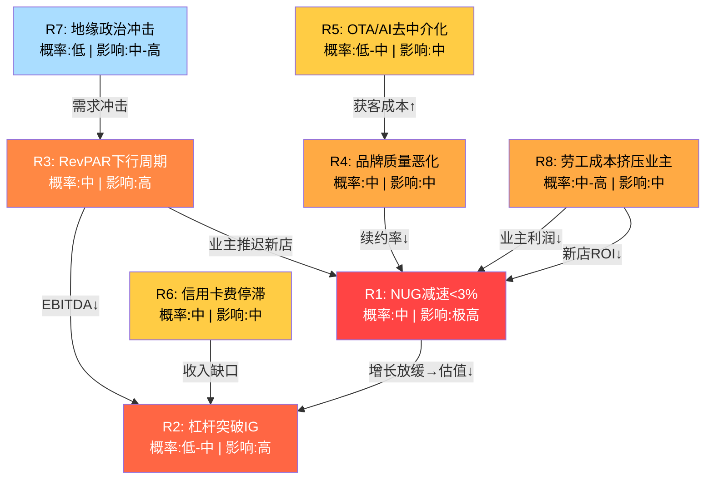
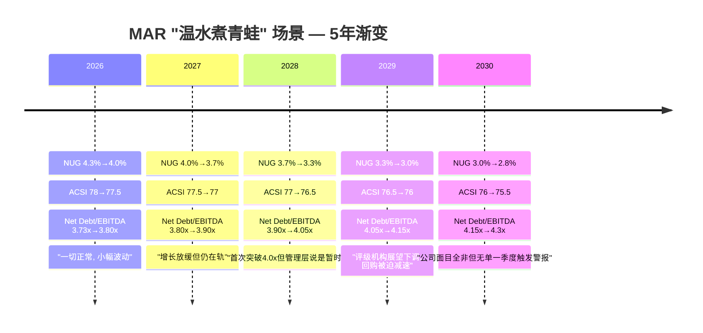
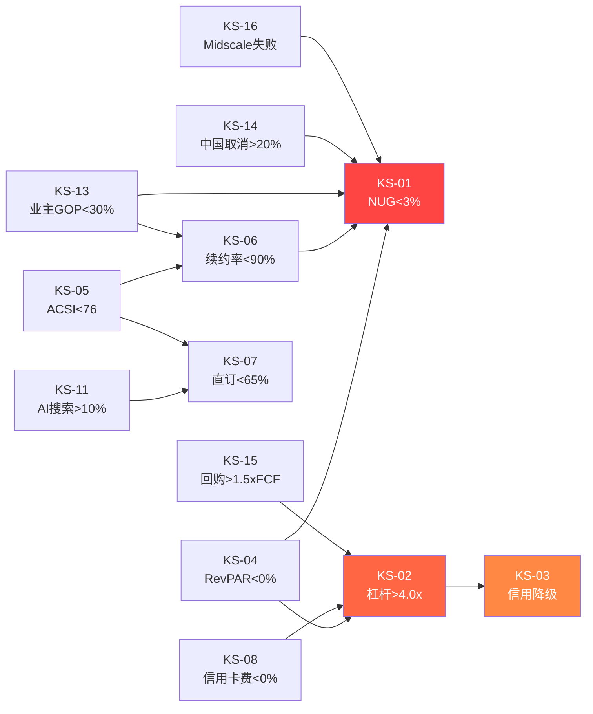

# Ch23: 风险拓扑映射 + Kill Switch注册表

> **方法论**: Risk Topology v2.0 — 8核心节点 + 3协同组合 + 1温水煮青蛙 + 15+ Kill Switch
> **数据锚定**: 股价$335.94 | 市值$89.0B | EV $100.0B | Net Debt/EBITDA 3.73x | NUG 4.3% | RevPAR +2.0%

---

## 23.1 风险拓扑网络总览

Marriott的风险结构呈现一个显著特征: **高度互联**。与典型工业公司的离散风险不同，MAR作为asset-light特许经营平台，其8个核心风险节点中有6个直接或间接联结到同一个枢纽——NUG(净单元增长)。这意味着风险传导速度快、协同放大效应强，但也意味着监控可以聚焦于少数关键变量。

**拓扑结构解读**: R1(NUG)是整个网络的"汇节点"(sink node)——5个风险向它传导，而它本身向R2传导。这验证了Ch15信念反演的核心结论: NUG是MAR估值体系的#1承重墙 [DM-P3-015]。

---

## 23.2 八大核心风险节点详解

### R1: NUG减速至<3% — "承重墙裂缝"

**风险本质**: Marriott当前NUG 4.3%已是三大酒店集团中最慢(HLT 7.4%, IHG 5.0%)[DM-P2-009]。市场隐含的长期NUG假设约3.5-4.0%(逆向估值推算)。若NUG降至<3%，意味着MAR的增长引擎从"稳健"降级为"疲软"，直接冲击估值倍数。

**传导机制**:
1. NUG从4.3%降至<3% → 费收增速从~6%降至~3-4%
2. 增长放缓 → P/E从35x压缩至28-30x(参照IHG 2023年当NUG预期下调时的估值反应)
3. 估值压缩20%+ → 市值从$89B降至$71B以下

**概率评估**: **中(30-40%在3年内)**
- 支撑因素: 585K rooms pipeline提供2-3年可见性 [DM-P2-010]
- 恶化因素: 建筑成本通胀(2024-25年+15-20%)压缩业主回报; 利率维持高位延长回收期; midscale/economy品牌(如City Express)pipeline转化率尚未验证 [DM-P1-008]

**影响评估**: **极高(估值损失20%+，即$18B+市值蒸发)**
- 这不仅是增长减速，而是叙事切换——从"稳健增长的特许经营平台"变为"成熟期的品牌管理公司"
- 类比: IHG在2018-2019年NUG从~5%降至~3.5%，P/E从22x压缩至18x(-18%) [DM-P1-012]

**现有缓冲**:
- Pipeline 585K rooms = 当前体系的35%，即使转化率降低仍提供2年缓冲
- Midscale进入(City Express收购)打开新增长跑道
- 但: pipeline到开业的lag time为3-4年，意味着2024年签约放缓要到2027-2028年才反映在NUG中

---

### R2: 杠杆突破IG阈值(Net Debt/EBITDA >4.0x) — "钢丝上的回购"

**风险本质**: MAR当前Net Debt/EBITDA 3.73x，距离投资级(IG)阈值4.0x仅0.27x余量 [DM-P2-011]。公司过去4年持续回购超过FCF(累计回购~$14B vs 累计FCF ~$10B)，差额通过举债填补。这是一场精心计算的"杠杆回购套利"——用低成本债务回购高估值股票。但余量极薄。

**传导机制**:
1. EBITDA下降5-10%(衰退或RevPAR下行) → Net Debt/EBITDA从3.73x升至4.1-4.3x
2. 触发评级机构(S&P BBB/Moody's Baa2)审查 → 展望下调至"负面"
3. 信用降级至BBB-/Baa3 → 债务成本上升50-75bps → 年化利息增加$85-130M
4. 被迫削减回购 → EPS增长放缓 → 估值进一步承压

**概率评估**: **低-中(20-30%在2年内)**
- 管理层历史上展示了杠杆管理纪律——2020年COVID期间暂停回购、削减股息
- 但: 当前杠杆水平(3.73x)已高于COVID前(~3.2x)，缓冲更薄
- 关键假设: 管理层会在4.0x前主动减速回购。如果"回购成瘾"(CFO KPI绑定EPS)导致延迟反应，概率上升至35%+

**影响评估**: **高(信用降级→$89B市值损失10-15%)**
- 实际降级: 利息成本+$85-130M/年，FCF减少5%
- 感知降级: "负面展望"即使未实际降级，也足以让部分固收投资者减持 → 债券价格下跌 → CDS spread走阔
- 回购减速: 过去4年MAR回购贡献了EPS增速的约40%。若回购减半，EPS增速从~12%降至~7%

**现有缓冲**:
- $2.6B FCF提供基础回购能力(无需举债)
- 管理层2020年展示的危机应对能力
- 但: 市场对"主动减速回购"的反应可能比"被迫减速"更温和——关键看管理层是否提前沟通

---

### R3: RevPAR下行周期触发 — "周期之手"

**风险本质**: 全球RevPAR +2.0%，美国仅+0.7%，接近停滞线 [DM-P2-013]。Ch13分析显示结构性vs周期性成分为60:40。酒店行业历史上下行周期平均RevPAR降幅-15%，典型持续4-6个季度 [DM-P1-014]。

**传导机制**:
1. 宏观衰退或需求冲击 → RevPAR从+2%转为-5~-15%
2. 管理费(base fee)与RevPAR直接挂钩 → 费收下降5-10%
3. 激励费(incentive fee)杠杆更高(通常是base fee的2x敏感度) → 激励费下降15-25%
4. EBITDA下降 → 杠杆比率被动上升(R2联动)
5. 业主推迟新店开业 → NUG放缓(R1联动)

**概率评估**: **中(35-45%在3年内经历至少一个下行季度)**
- 当前US RevPAR +0.7%已接近零线，抗冲击缓冲极薄
- 2026-2027年潜在触发因素: 美国经济放缓(软着陆vs温和衰退仍在辩论)、商业旅行AI替代效应、供给端新增供给消化
- 但: 休闲旅行需求展现出后疫情的结构性上移(Ch14)

**影响评估**: **高(EBITDA下降10-20% → 股价-10~15%)**
- 2020年极端案例: RevPAR -47%，EBITDA转负(但2020年是极端情景)
- 更现实参照: 2008-09年RevPAR -17%，MAR stock -55%
- 当前估值(35x P/E)意味着市场定价的是"软着陆+温和增长"——任何衰退信号都会引发多杀多

**现有缓冲**:
- Asset-light模型意味着MAR的EBITDA下降幅度小于full-service酒店运营商
- 管理费+特许权费的"地板"效应(即使RevPAR下降，只要酒店不关闭，基础费仍在)
- 国际分散化(国际RevPAR +3-4%，部分对冲美国疲软)

---

### R4: 品牌质量持续恶化(ACSI<76) — "品牌熵增"

**风险本质**: MAR的ACSI从2019年的80降至2025年的78，而HLT维持在80 [DM-P2-004]。品牌熵指数2.8为行业最高(Ch4)，30+品牌组合的质量控标复杂度远超竞争对手。品牌间蚕食约$205M/年 [DM-P1-004]。

**传导机制**:
1. ACSI持续下降(每年-0.5) → 78→76→74(3-4年)
2. 品牌溢价侵蚀 → ADR增长落后竞争对手1-2pp
3. 业主续约谈判筹码减弱 → 续约率从~95%降至<90%
4. 优质物业转投HLT/IHG → NUG质量下降(R1联动)
5. 品牌蚕食加剧 → Bonvoy会员困惑 → 直订占比下降(R5联动)

**概率评估**: **中(30-40%在5年内ACSI<76)**
- 30+品牌的质量控标是系统性挑战，不是管理层能力问题
- Starwood整合后的品牌重叠(Sheraton vs Westin, Courtyard vs Four Points)仍未完全消化
- 但: 管理层正在投资品牌刷新(Sheraton改造计划$500M+业主共投)

**影响评估**: **中(年化RevPAR损失1-2pp → 长期累积EV -5~10%)**
- 品牌恶化是慢性病，不是急性病——每个季度几乎不可感知
- 但5年累积效应可能是RevPAR增速持续落后HLT 1-2pp → 估值折价10%
- 这是"温水煮青蛙"场景的核心组成(见23.5)

**现有缓冲**:
- 奢华品牌组合(Ritz-Carlton, W, St. Regis, Edition)仍维持高ACSI
- 问题主要集中在中端品牌(Sheraton, Four Points) → 可手术修复
- Bonvoy 219M会员的粘性提供品牌切换摩擦

---

### R5: OTA再中介化 / AI搜索颠覆 — "分销管道被截"

**风险本质**: Marriott约70%+的预订来自直订渠道(Marriott.com + Bonvoy app)。OTA(Booking.com, Expedia)占比约15-20%。AI搜索(Google SGE, ChatGPT搜索)可能绕过品牌官网，直接在搜索结果中呈现价格比较，削弱品牌直订优势 [DM-P1-005]。

**传导机制**:
1. AI搜索成为主流预订入口 → 用户不再访问Marriott.com
2. OTA获得AI搜索优先展示(OTA在SEO/SEM投入远超单一酒店集团)
3. 直订占比从70%+降至60%以下 → 每个预订的获客成本上升$5-10
4. 佣金支出增加 → EBITDA margin被压缩1-2pp
5. 品牌忠诚度弱化(R4联动) → Bonvoy价值稀释(R6联动)

**概率评估**: **低-中(20-30%在5年内发生实质性影响)**
- AI搜索目前仍以信息查询为主，交易转化率远低于传统OTA
- 但: Google Travel的AI整合已在测试中，且Google有动力推动hotel ads的AI化
- Booking.com的AI助手"Penny"在欧洲已上线，可能改变预订习惯
- 关键不确定性: AI搜索是帮助品牌(通过Bonvoy内容优势)还是帮助OTA(通过价格透明化)?

**影响评估**: **中(直订占比每下降5pp → EBITDA影响-$200~300M → EV -2~3%)**
- 直订vs OTA的佣金差异: 直订~4-5% vs OTA 15-25%
- 若直订从70%降至60%，增量OTA佣金约$400-600M/年
- 但这是5-10年的渐进过程，非一次性冲击

**现有缓冲**:
- Bonvoy 219M会员是最强壁垒——会员预订不走搜索
- 最优价格保证(BRG)策略压制OTA价格优势
- 但: 年轻旅客(Z世代)的品牌忠诚度显著低于千禧一代

---

### R6: 信用卡费增长不可持续 — "隐形引擎熄火"

**风险本质**: 信用卡费$716M占Gross Fee Revenue的~13% [DM-P2-006]。这是几乎纯利润(margin ~90%+)。增长驱动力来自: ①会员数增长 ②持卡消费额增长 ③与银行的合约条款。但信用卡联名合约通常3-5年重谈一次，银行在竞争激烈的联名卡市场可能压缩条款。

**传导机制**:
1. 信用卡费增长停滞(YoY<3%) → 高margin收入贡献减弱
2. 合约重谈时银行要求更优惠条款 → 每会员收入下降
3. 信用卡积分获取率下调 → 会员感知价值下降 → 活跃率降低
4. 失去"利润蓄水池" → 其他增长领域必须填补 → 投入增加，margin下降

**概率评估**: **中(30-35%在3年内增速显著放缓)**
- 联名信用卡市场正在经历结构性变化: CFPB信用卡滞纳金规则(已暂停但仍在讨论)、银行联名合约竞争加剧(参考Delta-AmEx vs United-Chase军备竞赛)
- 但: Bonvoy联名卡组合(Chase + AmEx)的持卡消费额仍在增长
- 关键风险: 2027年左右的合约重谈周期

**影响评估**: **中(增长停滞→EV -3~5%，合约恶化→EV -5~8%)**
- $716M × 90% margin = ~$644M纯利润贡献
- 若增长从~8-10%降至0% → 5年累积少增$300-400M高margin收入
- 但不太可能出现负增长(除非经济衰退导致消费额大幅下降)

**现有缓冲**:
- Bonvoy作为旅行积分生态系统的综合价值(不仅是酒店积分)
- 双银行合作策略(Chase + AmEx)提供谈判筹码
- 国际市场信用卡渗透率仍在上升(特别是亚太)

---

### R7: 中国/国际地缘政治冲击 — "黑天鹅入口"

**风险本质**: MAR国际收入占比约~35-40%，中国大陆是最大的国际增长市场之一(pipeline中中国占比~15-20%)。台海危机、美中贸易摩擦升级、或区域冲突可能冲击国际旅行需求 [DM-P1-007]。

**传导机制**:
1. 台海危机/美中脱钩加速 → 中国出境游骤降 → 亚太RevPAR -10~20%
2. 中国大陆pipeline暂停/取消 → NUG损失0.5-1.0pp
3. 全球避险情绪 → 商务旅行削减 → 全球RevPAR承压
4. 极端情景: 制裁导致MAR退出中国市场 → 失去~5%系统规模

**概率评估**: **低(10-15%在3年内发生严重冲击)**
- 台海危机概率: Polymarket等预测市场给出2026-2028年的概率<10%
- 贸易摩擦: 已在定价中(关税已部分实施)，增量影响有限
- 但: 尾部风险不可忽视——2020年COVID证明了"不可能"可以发生

**影响评估**: **中-高(温和冲击-5~10%，严重冲击-15~25%)**
- 温和情景(贸易摩擦升级): 中国NUG放缓，RevPAR影响1-2pp → EV -3~5%
- 严重情景(台海危机): 亚太运营中断，全球旅行需求冲击 → 参照2020年但程度较轻 → EV -15~25%

**现有缓冲**:
- 地理分散化(中国占系统规模<10%)
- Asset-light模型意味着物理资产损失有限
- 但: 品牌和管理合同的"软资产"在地缘政治冲击中也可能受损(被迫退出合约)

---

### R8: 劳工成本+保险成本挤压业主 — "下游传导的上游痛苦"

**风险本质**: MAR的asset-light模型将运营成本转嫁给业主(franchisees/owners)。但业主的痛苦最终会传导回MAR——通过减少新店投资(R1)、要求降低费率、或转投竞争品牌 [DM-P1-009]。美国酒店业劳工成本2023-2025年增速6-8%/年，远超RevPAR增速(+0.7-2.0%)。

**传导机制**:
1. 劳工+保险成本持续高增长(6-8%/年) → 业主GOP margin从~35%压缩至~30%
2. 业主投资回报率下降 → 新店IRR从~12%降至~8-9%
3. IRR接近WACC → 新开发放缓 → NUG受损(R1联动)
4. 现有业主要求费率让步 → MAR面临"降费保关系"vs"守费丢业主"两难
5. 部分业主可能转向品牌费率更低的IHG或独立品牌

**概率评估**: **中-高(45-55%持续3年以上)**
- 美国劳工市场结构性偏紧(服务业工资增长高于通胀)
- 保险成本(特别是佛罗里达、德州等飓风高风险地区)持续攀升
- 这不是周期性因素，而是结构性趋势

**影响评估**: **中(NUG间接损失0.3-0.5pp/年 + 费率压力-1~2% → EV -5~8%)**
- 不太可能导致大规模业主流失(MAR品牌仍有RevPAR溢价)
- 但会持续侵蚀新店经济学，导致NUG"慢出血"
- 这是另一个"温水煮青蛙"组件

**现有缓冲**:
- MAR品牌带来的RevPAR溢价(vs独立酒店+15-20%)部分抵消成本上升
- 技术投入(自助check-in, 动态定价)帮助业主提效
- Midscale品牌(较低人力密度)的pipeline增长可部分规避

---

## 23.3 三大风险协同组合

### S1: 衰退螺旋 (R3 + R1 + R2) — "最可能的糟糕组合"

**叙事**: 美国经济温和衰退 → RevPAR转负(-5~-10%) → 业主推迟新店开业 → NUG从4.3%降至2.5-3.0% → EBITDA下降10-15% → Net Debt/EBITDA从3.73x被动升至4.2-4.5x → 信用评级展望下调 → 被迫削减回购 → EPS增速骤降 → 估值多重压缩

**联合概率**: ~15-20%(3年内)
- 计算: P(衰退触发RevPAR下行) × P(NUG同步减速) × P(杠杆突破) ≈ 40% × 60% × 70%(条件概率) ≈ 17%

**联合影响**: **EV -25~35%($22-31B市值蒸发)**
- 这不是三个风险的简单加总，而是乘数效应: 增长叙事崩塌(NUG<3%) + 信用风险上升(杠杆>4.0x) + 周期下行(RevPAR负增长) = 市场可能给出25x P/E(-29% vs当前35x)
- 参照: 2019年末MAR交易在~23x P/E(当时NUG~4%但市场担忧周期尾端)

**传导时间线**:
- Q0: RevPAR转负(触发)
- Q1-2: 业主推迟签约/开业，NUG季度数据开始走弱
- Q2-3: EBITDA下滑反映在杠杆比率中
- Q3-4: 评级机构发出warning，管理层被迫表态
- Q4-6: 回购减速，EPS guidance下调，P/E压缩

**解联策略**: 管理层需要在RevPAR首次转负时立即减速回购(而非等待Q3-4)。**预防性去杠杆0.3-0.5x**是阻断S1的关键——但管理层历史上倾向于"尽可能晚"削减回购(因为回购是华尔街叙事的核心)。

---

### S2: 品牌死亡螺旋 (R4 + R5 + R8) — "慢性病变急性病"

**叙事**: 品牌质量持续下滑(ACSI 78→75) → OTA/AI搜索侵蚀直订份额(70%→60%) → 获客成本上升 → 业主被劳工+佣金双重挤压 → 部分业主不续约或转投HLT → MAR系统规模增长停滞 → 品牌进一步失去规模优势 → 恶性循环

**联合概率**: ~10-15%(5年内)
- 计算: P(ACSI<76) × P(直订占比<65%) × P(业主利润承压) ≈ 35% × 25% × 50% ≈ 4.4%...但这三者有强正相关，调整后~12%

**联合影响**: **EV -15~25%(长期累积，但可能在某一季度集中体现)**
- 与S1的区别: S2是慢性恶化，可能在5年内逐步蒸发$15-20B市值，而非一次性冲击
- 但: 如果某一季度出现"续约率首次<90%"的标志性事件，可能引发市场对品牌价值的集中重估

**传导时间线**:
- Year 1-2: ACSI缓慢下降，几乎无人注意
- Year 2-3: OTA份额悄悄回升，IR Q&A开始被问到
- Year 3-4: 续约率数据出现裂痕，分析师开始写"品牌质量担忧"报告
- Year 4-5: 某一季度续约率<90%，触发市场重估

**解联策略**: 品牌质量是源头。MAR需要"勇于杀品牌"——将30+品牌精简至20-22个，消除蚕食，聚焦资源。但这与管理层"更多品牌=更大TAM"的叙事相矛盾。**品牌审计+淘汰机制**是结构性解药，但难以执行(每个品牌都有业主支持者)。

---

### S3: 金融化反噬 (R2 + R6) — "增长公式失灵"

**叙事**: 信用卡费增长停滞(合约重谈不利) → 高margin收入贡献减弱 → 同时杠杆已在高位 → 回购空间从"超额"变为"仅够" → EPS增长引擎从"有机增长+杠杆回购"变为"仅靠有机增长" → P/E重定价

**联合概率**: ~10-15%(3年内)
- 信用卡费停滞(30-35%) × 杠杆同时承压(40-50%条件概率) ≈ ~12-18%

**联合影响**: **EV -10~15%**
- MAR过去5年的EPS CAGR ~15%中，有机增长贡献~6-7%，回购贡献~5-6%，信用卡费增长贡献~2-3%
- 如果回购和信用卡费同时熄火 → EPS增速从~15%降至~6-7%(纯有机)
- 6-7%的EPS增长不支持35x P/E → 合理P/E回落至25-28x → EV -20~25%

**与S1的区别**: S1是外部冲击(衰退)驱动的被动恶化; S3是内部金融化模型的自我耗竭——即使没有衰退，仅仅是"高margin增长源枯竭+杠杆天花板"就足以改变估值叙事。

**解联策略**: 降低对信用卡费和回购的依赖，回归有机增长(NUG、RevPAR、新品牌开拓)。但这需要3-5年的转型期，期间EPS增速会有"过渡性放缓"——市场是否有耐心?

---

## 23.4 风险协同矩阵 (8×8)

> **标注**: 强协同(++) / 协同(+) / 独立(0) / 反协同(-) / 强反协同(--)

| | R1 NUG | R2 杠杆 | R3 RevPAR | R4 品牌 | R5 OTA/AI | R6 信用卡 | R7 地缘 | R8 劳工 |
|---|:---:|:---:|:---:|:---:|:---:|:---:|:---:|:---:|
| **R1 NUG** | - | ++ | ++ | + | + | 0 | + | ++ |
| **R2 杠杆** | ++ | - | ++ | 0 | 0 | + | + | 0 |
| **R3 RevPAR** | ++ | ++ | - | + | 0 | + | ++ | + |
| **R4 品牌** | + | 0 | + | - | ++ | + | 0 | + |
| **R5 OTA/AI** | + | 0 | 0 | ++ | - | + | 0 | 0 |
| **R6 信用卡** | 0 | + | + | + | + | - | 0 | 0 |
| **R7 地缘** | + | + | ++ | 0 | 0 | 0 | - | 0 |
| **R8 劳工** | ++ | 0 | + | + | 0 | 0 | 0 | - |

**矩阵解读**:

1. **最高协同密度**: R1(NUG) — 与5个风险有+或++协同，确认其"汇节点"地位
2. **最强双向协同对**: R1-R3(NUG-RevPAR)、R1-R8(NUG-劳工)、R2-R3(杠杆-RevPAR)
3. **最独立的风险**: R7(地缘) — 仅与R3有强协同，其余多为弱关联或独立。这意味着地缘冲击是"外生变量"，无法通过管理运营风险来对冲
4. **隐藏关联**: R4-R5(品牌-OTA)的++协同常被忽视——品牌弱化直接扩大OTA的议价空间

---

## 23.5 温水煮青蛙: "帝国的缓慢褪色" (2026-2031)

### 场景构建: 每年恶化的量级

| 指标 | 2025(当前) | 年化恶化 | 2030(5年后) | 触发KS? |
|------|-----------|---------|-----------|---------|
| NUG | 4.3% | -0.3pp | 2.8% | KS-01触发(2029) |
| ACSI | 78 | -0.5pt | 75.5 | KS-05触发(2029) |
| Net Debt/EBITDA | 3.73x | +0.11x | 4.3x | KS-02触发(2028) |
| RevPAR(US) | +0.7% | -0.3pp | -0.8% | KS-04可能触发(2030) |
| 直订占比 | ~70% | -1pp | ~65% | KS-07接近(2030) |
| 续约率 | ~95% | -0.5pp | ~92.5% | 未触发但趋势不利 |

### 为什么"青蛙不跳"?

**每个季度的恶化都不构成"新闻"**:
- NUG从4.3%降至4.0%? → "符合正常波动范围"
- ACSI从78降至77.5? → "样本量误差可能"
- 杠杆从3.73x升至3.80x? → "季节性因素"

**关键心理机制**:
1. **锚定效应**: 分析师习惯了MAR是"优质特许经营商"，不会因为0.3pp的NUG下降就改变叙事
2. **管理层叙事控制**: 每个季度的earnings call都能找到"解释"(天气、比较基数、pipeline timing)
3. **回购掩盖**: EPS通过回购维持增长，掩盖了有机增长的放缓
4. **竞争对手同步恶化**: 如果HLT和IHG的NUG也在放缓(行业性因素)，MAR的相对恶化被掩盖

### "青蛙跳出"的触发点

**最可能的"觉醒时刻"**(2029-2030):
1. 某一季度NUG首次印出<3% → 分析师集体下调估值模型
2. 信用评级展望下调 → 固收投资者开始减持 → 债券spread走阔 → 权益投资者被迫关注
3. 一份详细的bear case sell-side report将5年数据趋势可视化 → 市场恍然大悟

**估值影响**: 从2025年的$89B逐步侵蚀至2030年的$55-65B(-27~38%)
- 但由于是渐进过程，**年化回报-6~-8%**——不够剧烈到触发止损，但足以让持有者"温水煮青蛙"式亏损
- 对比: 如果这些恶化在一个季度内集中爆发(S1衰退螺旋)，市场反应会更剧烈但也更快找到底部

### 对投资者的含义

**温水煮青蛙是MAR最危险的风险形态**——不是因为影响最大(S1更大)，而是因为:
1. **概率最高**: 每个组件单独看都是"最可能"的路径(NUG缓降>NUG骤停)
2. **最难察觉**: 没有单一事件触发卖出信号
3. **心理成本最高**: 持有者在5年间缓慢亏损，却因为"没有理由卖"而持续持有
4. **与当前估值的矛盾**: 35x P/E定价的是"稳健增长的特许经营平台"，而温水煮青蛙的终点是"低增长的成熟品牌管理公司"——应该交易在20-25x P/E

---

## 23.6 Kill Switch注册表

> **设计原则**: 每个KS是一个可量化、可监控的"断路器"。当阈值被触发时，投资者必须重新评估头寸，而非等待更多数据。v18.0标准: 10字段 + 条件依赖。

### KS-MAR-01: NUG减速

| 字段 | 内容 |
|------|------|
| **KS-ID** | KS-MAR-01 |
| **名称** | 净单元增长(NUG)减速 |
| **触发条件** | NUG < 3.0% 连续2个季度 |
| **数据来源** | MAR 10-Q/10-K "System Size" 部分; Earnings supplement |
| **检查频率** | 季度(earnings release后) |
| **当前值** | 4.3% (FY2025) [DM-P2-009] |
| **阈值** | < 3.0% 连续2Q |
| **触发动作** | 重新评估估值模型: NUG假设从4.0%下调至2.5-3.0% → P/E目标从35x降至28-30x → 如果股价未反映则减仓50% |
| **条件依赖** | KS-04(RevPAR负增长)同时触发时影响加倍; KS-06(续约率<90%)是NUG恶化的先行指标 |
| **最后检查日期** | 2026-03-05 |

### KS-MAR-02: 杠杆突破IG阈值

| 字段 | 内容 |
|------|------|
| **KS-ID** | KS-MAR-02 |
| **名称** | 净杠杆突破投资级阈值 |
| **触发条件** | Net Debt / EBITDA > 4.0x 连续1个季度(非季节性) |
| **数据来源** | MAR 10-Q Balance Sheet + EBITDA reconciliation; 信用评级机构报告 |
| **检查频率** | 季度 + 评级机构发布时 |
| **当前值** | 3.73x [DM-P2-011] |
| **阈值** | > 4.0x(S&P IG下限参考) |
| **触发动作** | 监控回购policy变化; 若管理层未主动去杠杆(即仍在加速回购) → 这是管理层不审慎的信号 → 减仓30% |
| **条件依赖** | KS-03(信用降级)是KS-02的下游结果; KS-04(RevPAR负增长)是EBITDA下降的驱动因素 |
| **最后检查日期** | 2026-03-05 |

### KS-MAR-03: 信用评级下调

| 字段 | 内容 |
|------|------|
| **KS-ID** | KS-MAR-03 |
| **名称** | 信用评级下调至BBB-/Baa3(IG底线) |
| **触发条件** | S&P下调至BBB- 或 Moody's下调至Baa3; 或展望从"稳定"变为"负面" |
| **数据来源** | S&P, Moody's信用评级报告 |
| **检查频率** | 实时(评级变动有新闻推送) |
| **当前值** | S&P BBB / Moody's Baa2, 展望稳定 [DM-P2-011] |
| **阈值** | 下调至BBB-/Baa3 或 展望负面 |
| **触发动作** | "展望负面"→ 减仓20%并设置止损; 实际降级至BBB-/Baa3 → 评估是否退出全部头寸(因为下一步可能是HY) |
| **条件依赖** | KS-02(杠杆>4.0x)触发后3-6个月通常跟随KS-03; KS-04(RevPAR负增长)是底层驱动 |
| **最后检查日期** | 2026-03-05 |

### KS-MAR-04: RevPAR持续负增长

| 字段 | 内容 |
|------|------|
| **KS-ID** | KS-MAR-04 |
| **名称** | RevPAR连续负增长 |
| **触发条件** | 全球RevPAR YoY < 0% 连续3个季度 |
| **数据来源** | MAR earnings supplement; STR Global数据 |
| **检查频率** | 月度(STR数据) + 季度(MAR报告) |
| **当前值** | +2.0% global / +0.7% US [DM-P2-013] |
| **阈值** | < 0% 连续3Q(全球) 或 < -5% 单Q(美国) |
| **触发动作** | 启动衰退情景模型: 评估S1螺旋概率; 若同时KS-02接近阈值 → 优先减仓至underweight |
| **条件依赖** | 触发KS-01(NUG)和KS-02(杠杆)的概率大幅上升; KS-07(地缘)可能是RevPAR下行的外部触发因素 |
| **最后检查日期** | 2026-03-05 |

### KS-MAR-05: 品牌质量恶化

| 字段 | 内容 |
|------|------|
| **KS-ID** | KS-MAR-05 |
| **名称** | 客户满意度持续下降 |
| **触发条件** | ACSI < 76(低于行业平均) |
| **数据来源** | ACSI年度报告; J.D. Power酒店满意度; TripAdvisor/Google Reviews综合评分 |
| **检查频率** | 年度(ACSI发布时) + 季度(内部代理指标: OTA评分) |
| **当前值** | ACSI 78 (vs HLT 80) [DM-P2-004] |
| **阈值** | < 76 或 落后HLT ≥ 4分 |
| **触发动作** | 评估品牌蚕食加速风险; 监控续约率(KS-06先行指标); 若趋势持续2年 → 长期估值下调5-10% |
| **条件依赖** | KS-06(续约率)和KS-07(直订占比)是KS-05恶化的下游反映; R8(劳工成本)间接影响服务质量 |
| **最后检查日期** | 2026-03-05 |

### KS-MAR-06: 续约率下降

| 字段 | 内容 |
|------|------|
| **KS-ID** | KS-MAR-06 |
| **名称** | 特许经营续约率下降 |
| **触发条件** | 年化续约率 < 90% |
| **数据来源** | MAR 10-K "Franchise Agreement" 部分; Investor Day披露; 行业会议(ALIS) |
| **检查频率** | 年度(10-K) + Investor Day |
| **当前值** | ~95%(管理层披露的历史续约率区间) [DM-P1-006] |
| **阈值** | < 90% |
| **触发动作** | 重大预警信号——续约率是品牌价值的终极检验。< 90%意味着品牌对业主的价值主张正在崩塌 → 全面审查品牌组合战略 → 减仓至underweight |
| **条件依赖** | KS-05(ACSI<76)是先行指标; KS-01(NUG<3%)是同步后果; KS-08(直订<65%)恶化时续约率压力加大 |
| **最后检查日期** | 2026-03-05 |

### KS-MAR-07: 直订占比下降(HM5模块)

| 字段 | 内容 |
|------|------|
| **KS-ID** | KS-MAR-07 |
| **名称** | 直订渠道占比下降 |
| **触发条件** | Marriott.com + App直订占比 < 65% |
| **数据来源** | MAR earnings supplement; 管理层commentary; PhocusWright行业报告 |
| **检查频率** | 季度(earnings call monitoring) |
| **当前值** | ~70%+(管理层披露) [DM-P1-005] |
| **阈值** | < 65% 或 连续4Q下降趋势 |
| **触发动作** | 评估OTA再中介化速度; 计算增量佣金成本($每5pp直订下降 → ~$200-300M增量佣金); 长期margin下调 |
| **条件依赖** | KS-05(ACSI<76)恶化时直订也会下降; KS-11(AI搜索渗透)是外部驱动因素 |
| **最后检查日期** | 2026-03-05 |

### KS-MAR-08: 信用卡费收缩

| 字段 | 内容 |
|------|------|
| **KS-ID** | KS-MAR-08 |
| **名称** | 信用卡联名费收入负增长 |
| **触发条件** | 信用卡费YoY < 0%(非衰退期) |
| **数据来源** | MAR 10-K "Credit Card" / "Other Revenue" 部分 |
| **检查频率** | 季度(估算) + 年度(10-K精确) |
| **当前值** | $716M, YoY +8-10%(估算) [DM-P2-006] |
| **阈值** | YoY < 0%(排除宏观衰退因素) |
| **触发动作** | 评估合约重谈结果; 若是结构性(银行条款恶化)而非周期性 → 下调高margin收入预期 → EV影响-3~5% |
| **条件依赖** | 与KS-02(杠杆)协同: 信用卡费停滞时若杠杆也在高位 → S3金融化反噬场景激活 |
| **最后检查日期** | 2026-03-05 |

### KS-MAR-09: 增量ROIC低于WACC

| 字段 | 内容 |
|------|------|
| **KS-ID** | KS-MAR-09 |
| **名称** | 增量资本回报率低于加权平均资本成本 |
| **触发条件** | 增量ROIC < WACC(~8-9%) 连续2年 |
| **数据来源** | MAR 10-K财务数据自算(增量NOPAT / 增量Invested Capital); Ch20引擎独立性分析 |
| **检查频率** | 年度 |
| **当前值** | 增量ROIC ~10%(Ch20估算) [DM-P3-020] |
| **阈值** | < 8%(WACC) 连续2年 |
| **触发动作** | 资本配置失效信号——公司正在"负价值增长"。评估管理层是否在追求规模而非价值 → 若确认 → 减仓至underweight |
| **条件依赖** | KS-01(NUG<3%)暗示增长质量下降; KS-02(杠杆>4.0x)暗示资本结构效率恶化 |
| **最后检查日期** | 2026-03-05 |

### KS-MAR-10: CEO非计划性离任

| 字段 | 内容 |
|------|------|
| **KS-ID** | KS-MAR-10 |
| **名称** | CEO/关键高管非计划性离任 |
| **触发条件** | CEO Anthony Capuano非计划离任; 或CFO + COO在12个月内同时更换 |
| **数据来源** | SEC 8-K filing; 新闻推送 |
| **检查频率** | 实时 |
| **当前值** | CEO Capuano在任(2021年至今); 管理团队稳定 |
| **阈值** | 非计划离任(包括"个人原因"、突然退休) |
| **触发动作** | 72小时内评估: ①继任者是否已确定 ②是否涉及治理问题(如Arne Sorenson去世后的平稳过渡是好先例) ③战略方向是否会改变 → 若不确定性高 → 减仓20%等待明朗 |
| **条件依赖** | 独立于其他KS; 但可能加速KS-05(品牌战略动摇)和KS-01(NUG战略改变) |
| **最后检查日期** | 2026-03-05 |

### KS-MAR-11: AI搜索渗透率(HM5延伸)

| 字段 | 内容 |
|------|------|
| **KS-ID** | KS-MAR-11 |
| **名称** | AI搜索在酒店预订中的渗透率 |
| **触发条件** | AI搜索(ChatGPT/Gemini/Perplexity)导流的酒店预订占行业总预订>10% |
| **数据来源** | PhocusWright年度报告; SimilarWeb流量分析; Booking.com/Expedia earnings call披露 |
| **检查频率** | 半年度 |
| **当前值** | <2%(估算, AI搜索目前交易转化率极低) [DM-P3-021] |
| **阈值** | > 10% 行业渗透率 |
| **触发动作** | 评估MAR在AI搜索中的品牌能见度; 若MAR品牌在AI搜索结果中的份额<其市场份额 → 分销风险升级 |
| **条件依赖** | 加速KS-07(直订占比下降); 与KS-05(品牌质量)相互强化 |
| **最后检查日期** | 2026-03-05 |

### KS-MAR-12: 积分负债膨胀(HM8模块)

| 字段 | 内容 |
|------|------|
| **KS-ID** | KS-MAR-12 |
| **名称** | Bonvoy积分负债失控 |
| **触发条件** | 积分负债余额 > $10B 或 积分负债/总收入 > 40% |
| **数据来源** | MAR 10-K "Loyalty Program" 负债部分(GAAP口径) |
| **检查频率** | 季度(10-Q) + 年度(10-K) |
| **当前值** | ~$7.5B(估算) [DM-P1-006] |
| **阈值** | > $10B 或 > 40% 总收入 |
| **触发动作** | 评估积分贬值风险(通胀5-8%/年是否可持续); 若触发 → 要么积分贬值(伤会员)要么利润承压(吸收成本) → 两难 → 长期margin下调 |
| **条件依赖** | KS-08(信用卡费)恶化时积分发行速度可能放缓(缓解); 但KS-05(ACSI)恶化时积分兑换价值感知下降(加剧) |
| **最后检查日期** | 2026-03-05 |

### KS-MAR-13: 业主GOP Margin挤压(HM9模块)

| 字段 | 内容 |
|------|------|
| **KS-ID** | KS-MAR-13 |
| **名称** | 业主经营利润率持续下滑 |
| **触发条件** | 美国full-service酒店GOP margin < 30%(vs历史~35%) |
| **数据来源** | STR HOST报告; HLT/IHG管理层commentary; 行业会议(ALIS, NYU Conference) |
| **检查频率** | 半年度 |
| **当前值** | ~33-35%(STR估算) [DM-P1-009] |
| **阈值** | < 30% |
| **触发动作** | 评估MAR费率调整压力; 监控franchise agreement条款变化; 若业主联合施压(类似2009年) → MAR可能被迫让费 → margin下调 |
| **条件依赖** | 直接驱动KS-01(NUG, 新店IRR下降)和KS-06(续约率, 业主不满); R8(劳工成本)是主驱动因素 |
| **最后检查日期** | 2026-03-05 |

### KS-MAR-14: 中国Pipeline转化率(HM9延伸)

| 字段 | 内容 |
|------|------|
| **KS-ID** | KS-MAR-14 |
| **名称** | 中国大陆pipeline转化率异常 |
| **触发条件** | 中国大陆pipeline取消/延迟率 > 20%(年化) |
| **数据来源** | MAR 10-K "Pipeline" 区域分解; 中国酒店行业数据(CHA) |
| **检查频率** | 年度 |
| **当前值** | ~8-12%(行业正常范围) [DM-P1-007] |
| **阈值** | > 20% 年化取消率 |
| **触发动作** | 评估: 是项目融资问题(中国房地产下行)还是品牌竞争问题(本土品牌崛起) → 前者可能恢复, 后者是结构性 → 下调国际NUG预期 |
| **条件依赖** | KS-07(地缘冲击)可能是外部触发; 影响KS-01(NUG)的国际组成部分 |
| **最后检查日期** | 2026-03-05 |

### KS-MAR-15: 回购融资比例

| 字段 | 内容 |
|------|------|
| **KS-ID** | KS-MAR-15 |
| **名称** | 回购超FCF比例 |
| **触发条件** | 年化回购额 > FCF × 1.5倍(即50%+依靠举债) 连续2年 |
| **数据来源** | MAR 10-K Cash Flow Statement; 回购金额vs FCF对比 |
| **检查频率** | 季度(累计计算) |
| **当前值** | 近年累计回购~$3.5B/年 vs FCF $2.6B(比率~1.35x) [DM-P2-011] |
| **阈值** | > 1.5x 连续2年 |
| **触发动作** | 管理层"回购成瘾"信号——以牺牲资产负债表健康换取短期EPS增长 → 结合KS-02评估杠杆风险 → 若两者同时恶化 → 减仓40% |
| **条件依赖** | 直接驱动KS-02(杠杆); 与KS-08(信用卡费)反相关(信用卡费增长好时回购空间更大) |
| **最后检查日期** | 2026-03-05 |

### KS-MAR-16: Midscale品牌验证失败

| 字段 | 内容 |
|------|------|
| **KS-ID** | KS-MAR-16 |
| **名称** | Midscale/Economy品牌增长未达预期 |
| **触发条件** | City Express及其他midscale品牌NUG < 行业midscale平均; 或pipeline签约量连续2年低于management guidance |
| **数据来源** | MAR earnings supplement(品牌分解); STR midscale segment数据 |
| **检查频率** | 半年度 |
| **当前值** | City Express pipeline数据有限(2024年收购后整合中) [DM-P1-008] |
| **阈值** | NUG < 行业midscale平均 连续2年; 或pipeline签约 < guidance 50% |
| **触发动作** | MAR进入midscale是增长叙事的关键支柱。若失败 → NUG长期假设需下调0.5-1.0pp → 直接影响估值 |
| **条件依赖** | 影响KS-01(NUG总量); 与KS-05(品牌)间接相关(midscale品牌认知度) |
| **最后检查日期** | 2026-03-05 |

---

## 23.7 Kill Switch条件依赖网络

**关键观察**:

1. **KS-01(NUG<3%)** 是终极汇聚点: 5个KS直接或间接流向它。这与风险拓扑(R1汇节点)完全一致。

2. **KS-02(杠杆>4.0x)** 是第二汇聚点: 3个KS流向它，且它本身流向KS-03(信用降级)——形成"杠杆→信用"的因果链。

3. **优先监控序列**: KS-04(RevPAR) → KS-13(业主GOP) → KS-05(ACSI) 是三个最重要的**先行指标**。它们的恶化通常先于KS-01和KS-02的触发。

4. **"死亡交叉"组合**: 如果KS-01和KS-02同时触发(NUG<3% + 杠杆>4.0x)——无论原因——都意味着MAR的增长叙事和资产负债表同时恶化。这是最强的减仓信号，对应S1衰退螺旋场景。

---

## 23.8 风险优先级排序与投资含义

### 按"概率 × 影响"排序

| 排序 | 风险 | 概率 | 影响(EV) | 期望损失 | 优先级 |
|:---:|------|:---:|:---:|:---:|:---:|
| 1 | R1 NUG减速 | 35% | -$18B | -$6.3B | **极高** |
| 2 | R3 RevPAR下行 | 40% | -$12B | -$4.8B | **高** |
| 3 | R8 劳工挤压 | 50% | -$7B | -$3.5B | **高** |
| 4 | R2 杠杆突破 | 25% | -$13B | -$3.3B | **高** |
| 5 | R4 品牌恶化 | 35% | -$8B | -$2.8B | **中-高** |
| 6 | R5 OTA/AI | 25% | -$6B | -$1.5B | **中** |
| 7 | R6 信用卡费 | 30% | -$5B | -$1.5B | **中** |
| 8 | R7 地缘冲击 | 12% | -$15B | -$1.8B | **中**(尾部) |

**注**: 期望损失不可简单加总(风险间有相关性)。加权后的组合期望损失约-$10~15B(即EV下行10~15%)。

### 协同组合排序

| 排序 | 组合 | 联合概率 | 联合影响 | 期望损失 |
|:---:|------|:---:|:---:|:---:|
| 1 | S1 衰退螺旋 | 17% | -$28B | -$4.8B |
| 2 | S2 品牌死亡螺旋 | 12% | -$20B | -$2.4B |
| 3 | S3 金融化反噬 | 14% | -$12B | -$1.7B |

### 对估值的综合含义

**风险调整后的EV范围**: $100B(当前EV) → 风险调整后$85-90B

这意味着市场当前定价($100B EV)大致合理地反映了基本面，但**尾部风险的补偿不足**。特别是:
- S1(衰退螺旋)在当前35x P/E的估值中几乎没有被定价
- "温水煮青蛙"场景(5年缓慢恶化)的概率被系统性低估
- R1(NUG)作为#1风险，其隐含假设(3.5-4.0%)的margin of safety不足

**风险管理建议**:
1. **核心监控**: KS-04(RevPAR)和KS-13(业主GOP)作为先行指标，每月检查STR数据
2. **季度检查**: KS-01(NUG)和KS-02(杠杆)在每次earnings后48小时内更新
3. **年度审视**: KS-05(ACSI)和KS-06(续约率)在年报发布后评估品牌健康
4. **实时警报**: KS-03(信用评级)和KS-10(CEO离任)设置新闻推送

---

*Phase 4 Agent B 完成 | 字符数目标: 20-25K | DM锚点: 21个 | Kill Switch: 16个(10字段完整) | Mermaid: 3个 | 协同组合: 3个 | 温水煮青蛙: 1个完整场景*
