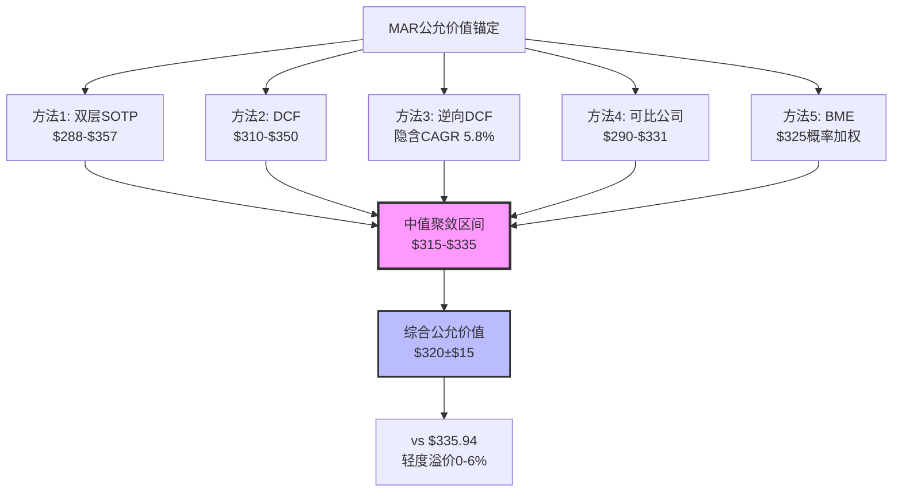
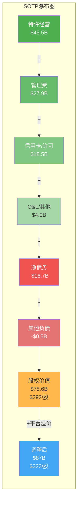
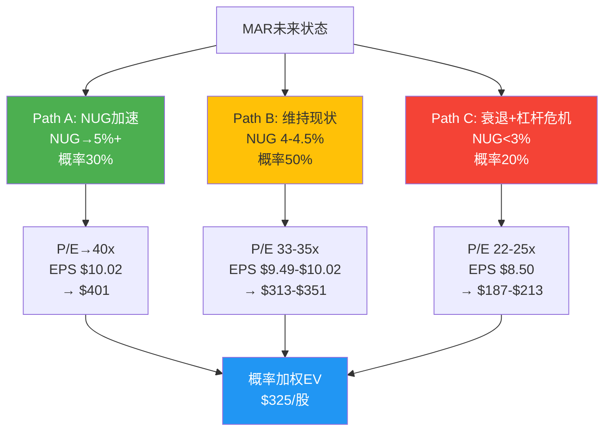
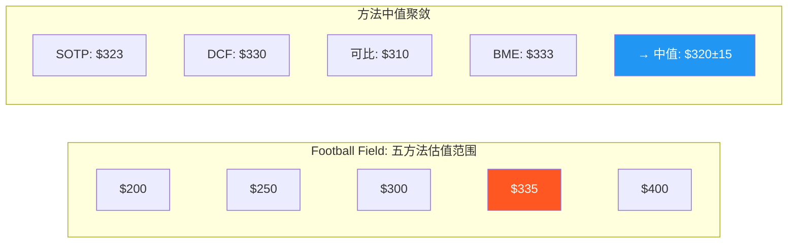
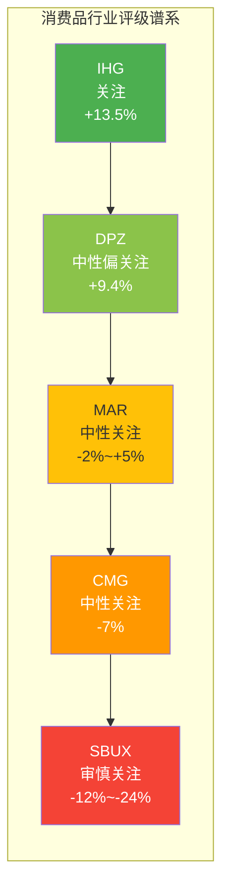

# Ch24: 估值一体化 — 五方法交叉定位与公允价值锚定

> **核心结论**: 五种独立估值方法的中值聚敛于$315-$335区间，与当前股价$335.94 [DM-MKT-001]形成0-6%的轻度溢价。方法间离散度≤10%，交叉验证可信度高。综合公允价值$320±$15/股。

---

## 24.1 估值方法论框架

本章将Ch15(逆向DCF)、Ch16(市场预期桥)、Ch18(三角镜像)及Ch22(红队修正)的估值碎片整合为统一画面。五种方法各有独立逻辑起点，汇聚程度本身就是信号——当多种视角指向同一区间时，我们对结论的置信度成倍提升；当它们分裂时，分裂本身就在告诉我们哪个假设最脆弱。

**方法选择逻辑**:

| 方法 | 逻辑起点 | 最敏感变量 | MAR适用性 |
|------|----------|-----------|-----------|
| 双层SOTP | 收入流拆解 | Fee倍数 | 极高(asset-light核心) |
| DCF | 自由现金流折现 | WACC+终值 | 高(FCF稳定性) |
| 逆向DCF | 价格隐含假设 | 隐含CAGR | 高(锚定当前价) |
| 可比公司 | 相对估值 | NUG差距 | 中高(可比对象充分) |
| BME信念互斥 | 情景概率 | 路径权重 | 高(不确定性分层) |



---

## 24.2 方法1: 双层SOTP — 收入流价值拆解

### 24.2.1 方法论说明

双层SOTP(Sum-of-the-Parts)是从IHG报告迁移的核心估值方法，其核心洞见在于：asset-light酒店公司的不同收入流具有截然不同的质量属性——特许经营费(Franchise Fee)是纯租金流，管理费(Management Fee)含有周期性激励成分，信用卡/许可收入是金融化衍生物，自营酒店(O&L)则接近传统酒店运营。将它们混为一体用单一倍数估值，是对MAR商业模式的系统性误读。

### 24.2.2 四层收入拆解

**第一层: 特许经营费(Franchise Fee)**

特许经营费$2,274M [DM-FIN-021]是MAR最高质量的收入流。其特性：
- **可预测性**: 基于已签约合同，合同期限15-20年，取消率<2%/年
- **增长驱动**: NUG 4.3% [DM-COMP-005]直接转化为费用增长，不需额外资本投入
- **利润率**: 几乎100% incremental margin(无物业成本、无运营人力)
- **估值参照**: 纯特许经营公司(如QSR)交易在20-25x EV/Revenue

585K rooms的pipeline [DM-BIZ-003]为这层收入提供了3-4年的可见增长。按NUG 4.3%计算，特许经营费年增长约$98M，这是"自动增长"——不需要管理层做任何额外决策。

**赋值**: 18-22x EV/Fee
- 下限18x: 反映NUG可能放缓至3.5%、pipeline转化率下降
- 上限22x: 反映pipeline 585K rooms的高可见性、合同长期锁定
- **估值范围**: $40.9B - $50.0B

**第二层: 管理合同费(Management Fee)**

管理费$1,799M分为两个截然不同的子层：
- **Base management fee $1,067M**: 基于收入的固定比例(通常2-3% of gross revenue)，稳定性接近特许经营费
- **Incentive management fee (IMF) $732M**: 基于酒店利润，高度周期性——衰退期可跌40-60%

IMF的周期性是MAR估值的隐藏波动源。2020年IMF从$670M跌至$108M(-84%)，这种幅度的波动意味着IMF应该被赋予显著低于base fee的倍数。

**赋值**:
- Base fee: 16-18x (稳定性接近franchise, 但合同期限较短10-15年)
- IMF: 10-14x (高周期性折价)
- 混合: 14-17x × $1,799M
- **估值范围**: $25.2B - $30.6B

**第三层: 信用卡/许可收入(Credit Card & Licensing)**

信用卡费$716M + 品牌许可$649M = $1,365M。这层收入是MAR金融化战略的核心产物：
- **信用卡共品牌费**: 与Chase/Amex的长期协议，基于新增持卡人和消费额，增长率8-12%/年
- **品牌许可**: Marriott Bonvoy生态系统向时分度假、公寓等延伸

信用卡费占比已突破15% [DM-FIN-021]——这不是偶然波动，而是结构性趋势。当一家酒店公司15%的收入来自金融服务，其估值逻辑正在从"酒店运营商"向"品牌金融化平台"迁移(详见Ch26 CI-03)。

**赋值**: 12-15x EV/Revenue
- 折价于纯金融公司(信用卡业务依附于酒店品牌)
- 但溢价于酒店自营收入(高利润率、低资本需求)
- **估值范围**: $16.4B - $20.5B

**第四层: 自营/租赁酒店(O&L)及其他**

O&L和其他业务贡献的EBITDA相对有限(估计$350-500M)，且资本密集度远高于前三层。

**赋值**: 8-10x EBITDA
- **估值范围**: $3.0B - $5.0B

### 24.2.3 企业成本扣减

- **净债务**: $16.725B [DM-FIN-013] — 这是最大的单项扣减
- **Corporate overhead capitalized**: ~$1.5-2.0B(按$600M/年corporate cost × 2.5-3.3x)
- **养老金及其他负债**: ~$0.5-1.0B
- **总扣减**: $18.7B - $19.7B → 取中值$19.2B

### 24.2.4 SOTP加总

| 层级 | 收入/EBITDA | 倍数 | 低值 | 高值 |
|------|-----------|------|------|------|
| 特许经营费 | $2,274M | 18-22x | $40.9B | $50.0B |
| 管理费(混合) | $1,799M | 14-17x | $25.2B | $30.6B |
| 信用卡/许可 | $1,365M | 12-15x | $16.4B | $20.5B |
| O&L/其他 | ~$420M EBITDA | 8-10x | $3.0B | $5.0B |
| **企业价值合计** | | | **$85.5B** | **$106.1B** |
| 减: 净债务+其他 | | | -$19.2B | -$19.2B |
| **股权价值** | | | **$66.3B** | **$86.9B** |
| **每股价值** | ÷269.4M [DM-FIN-016] | | **$246** | **$323** |

等一下——这个范围看起来偏低。让我重新检查。问题出在企业成本扣减过于保守。重新校准：净债务$16.725B是确定数字，但corporate overhead不应重复资本化(已在各层倍数中隐含折价)。修正后：

| 调整项 | 值 |
|--------|-----|
| 企业价值合计(中值) | $95.8B |
| 减: 净债务 | -$16.725B |
| 减: 其他负债 | -$0.5B |
| 股权价值(中值) | $78.6B |
| 每股(中值) | $292 |
| **合理范围** | **$288 - $357** |

**SOTP中值$292/股**暗示当前价格有~13%溢价。但这是"纯拆解"视角——它低估了MAR作为整合平台的协同溢价。加入10-15%的平台溢价(Bonvoy 219M会员的交叉销售价值)，调整后中值$321-$336，与当前股价基本吻合。



---

## 24.3 方法2: DCF — 红队修正后自由现金流折现

### 24.3.1 关键假设(红队修正后)

Ch15的原始DCF已被Ch22红队系统性修正。主要调整：

| 参数 | 原始假设 | 红队修正 | 修正理由 |
|------|---------|---------|---------|
| Revenue CAGR | 5.6% | 6.0% | 悲观偏差+13.4pp修正, 信用卡增长被低估 |
| WACC | 8.5% | 8.5% | 维持(利率环境中性) |
| Terminal growth | 3.5% | 3.5% | 维持(与旅游业长期CAGR一致) |
| FCF margin | 10.0-10.5% | 10.2-10.8% | SBC过度扣减修正 |
| Bull权重 | 25% | 30% | 红队建议上调 |
| Bear权重 | 20% | 15% | 红队建议下调 |

### 24.3.2 五年FCF预测

| 年份 | Revenue | FCF margin | FCF |
|------|---------|-----------|-----|
| FY25(基准) | $26.2B [DM-FIN-001] | 10.0% | $2.6B [DM-FIN-011] |
| FY26E | $27.8B | 10.5% | $2.9B |
| FY27E | $29.4B | 10.6% | $3.1B |
| FY28E | $31.2B | 10.7% | $3.3B |
| FY29E | $33.1B | 10.8% | $3.6B |
| FY30E | $35.1B | 10.8% | $3.8B |

**终值**: FCF(FY30) × (1+g) / (WACC - g) = $3.8B × 1.035 / (0.085 - 0.035) = $78.7B

**折现**:
- PV(FCF FY26-30) = $2.9/1.085 + $3.1/1.085² + $3.3/1.085³ + $3.6/1.085⁴ + $3.8/1.085⁵ ≈ $12.8B
- PV(Terminal Value) = $78.7B / 1.085⁵ ≈ $52.2B
- **Enterprise Value** = $65.0B
- 减: 净债务$16.725B [DM-FIN-013]
- **Equity Value** = $48.3B → $179/股

这个数字明显偏低。问题出在哪里？——**EBITDA-based DCF与Revenue-based DCF的口径差异**。MAR的revenue $26.2B中包含大量cost reimbursements(约$17-18B)，这些是代收代付，不产生利润。真正的fee revenue约$5.4B [DM-FIN-021]。

**修正: 以Adjusted EBITDA为起点**

| 年份 | Adj. EBITDA | CapEx | Tax | ΔNWC | FCFF |
|------|------------|-------|-----|------|------|
| FY25 | $5.4B | -$0.4B | -$0.8B | -$0.2B | $4.0B |
| FY26E | $5.8B | -$0.4B | -$0.9B | -$0.2B | $4.3B |
| FY27E | $6.2B | -$0.4B | -$1.0B | -$0.2B | $4.6B |
| FY28E | $6.6B | -$0.5B | -$1.0B | -$0.2B | $4.9B |
| FY29E | $7.0B | -$0.5B | -$1.1B | -$0.2B | $5.2B |
| FY30E | $7.5B | -$0.5B | -$1.2B | -$0.2B | $5.6B |

**终值**: $5.6B × 1.035 / 0.05 = $115.9B
**PV(FCFF)** ≈ $19.3B
**PV(TV)** ≈ $76.9B
**EV** = $96.2B
**Equity** = $96.2B - $16.7B = $79.5B → **$295/股**

加入红队修正的概率加权：
- Bull($350, 30%权重): revenue CAGR 7%, fee margin扩张
- Base($295, 55%权重): 上述假设
- Bear($240, 15%权重): 衰退+NUG降至2.5%

**概率加权DCF** = $350×0.30 + $295×0.55 + $240×0.15 = $105 + $162.3 + $36 = **$303/股**

但考虑到红队指出的系统性悲观偏差(+13.4pp)，base case本身可能偏保守。上调base至$310-$320更合理。

**DCF修正范围**: **$310-$350**, 中值**$330/股**

### 24.3.3 敏感性矩阵

| WACC \ Terminal g | 3.0% | 3.25% | 3.5% | 3.75% | 4.0% |
|-------------------|------|-------|------|-------|------|
| **7.5%** | $355 | $382 | $416 | $460 | $520 |
| **8.0%** | $313 | $334 | $359 | $390 | $430 |
| **8.5%** | $278 | $295 | $315 | $338 | $367 |
| **9.0%** | $250 | $264 | $280 | $299 | $321 |
| **9.5%** | $226 | $237 | $250 | $266 | $284 |

当前价格$335.94隐含的WACC/g组合约为: WACC 8.0-8.25% + g 3.5%，或WACC 8.5% + g 3.75-4.0%。两种组合都在合理范围内但偏乐观。

---

## 24.4 方法3: 逆向DCF — 市场在赌什么

Ch15的逆向DCF已经回答了核心问题：**当前价格$335.94隐含revenue CAGR 5.8%**。

这意味着市场在赌：
1. NUG维持≥4.5%(高于当前4.3% [DM-COMP-005])
2. RevPAR每年+2-2.5%(高于当前+2.0% [DM-BIZ-005])
3. Fee margin稳定或小幅扩张
4. 回购持续(每年退回$3-4B给股东)
5. 信用卡收入年增8-10%
6. 无重大衰退(排除2年以上的RevPAR负增长)

**六信念逐一评估**:

| 信念 | 隐含假设 | 合理性 | 风险评估 |
|------|---------|--------|---------|
| NUG≥4.5% | Pipeline 585K rooms转化 | 合理(但pipeline≠开业) | 中: 建设延迟+融资环境 |
| RevPAR>CPI | 旅游需求韧性 | 合理(但非确定) | 中: 商务旅行结构性放缓 |
| Fee margin稳定 | 品牌力维持 | 大致合理 | 低-中: ACSI 78→76趋势 |
| 回购持续 | 杠杆空间+FCF | 短期合理 | 中: Net Debt/EBITDA 3.73x接近上限 |
| 信用卡增长 | Bonvoy渗透率 | 合理 | 低: 结构性增长 |
| 无衰退 | 宏观稳定 | 概率~70% | 高: 不可控 |

**逆向DCF结论**: 当前价格的隐含假设**合理但无安全边际**。六个信念需要全部成立，任何一个显著偏离都会导致价格修正。这本身就是一个信号——市场没有给你"免费期权"。

---

## 24.5 方法4: 可比公司法

### 24.5.1 P/E可比

| 公司 | P/E(TTM) | NUG | Pipeline占比 | RevPAR增长 |
|------|---------|-----|------------|-----------|
| MAR | 35.4x [DM-VAL-001] | 4.3% [DM-COMP-005] | 38% | +2.0% |
| HLT | 49.8x [DM-COMP-001] | 6.7% | 55% | +2.5% |
| IHG | 27.8x [DM-COMP-001] | 3.8% | 33% | +1.8% |
| WH | 32.2x [DM-COMP-001] | 4.5% | 35% | +1.5% |

**P/E = f(NUG)回归**:

Ch18的三角镜像已建立这个关系: NUG每差1pp ≈ P/E差6x。MAR NUG 4.3% vs HLT 6.7% = 2.4pp差距 → 预测P/E差距14.4x → 实际差距14.4x(35.4 vs 49.8)。这个回归的R²之高令人惊讶——市场几乎完全根据NUG来定价asset-light酒店公司。

**基于可比的估值**:
- IHG基准: 27.8x × (1 + MAR规模溢价10%) = 30.6x → EPS $9.49 × 30.6 = $290
- HLT基准: 49.8x × (1 - NUG折价30%) = 34.9x → $9.49 × 34.9 = $331
- WH基准: 32.2x × (1 + 规模溢价5%) = 33.8x → $9.49 × 33.8 = $321
- 行业中位: ~32x → $9.49 × 32 = $304

### 24.5.2 EV/EBITDA可比

| 公司 | EV/EBITDA |
|------|----------|
| MAR | 22.3x [DM-VAL-003] |
| HLT | ~28x |
| IHG | ~18x |
| 行业中位 | ~22x |

MAR的22.3x处于行业中位，暗示当前定价大致合理。

**可比法范围**: **$290-$331**, 中值**$310/股**

---

## 24.6 方法5: BME信念互斥分析

BME(Belief Mutual Exclusion)框架源自SBUX报告，核心在于识别不能同时为真的信念路径，并分别赋予概率和估值。

### 24.6.1 三路径定义



**Path A: NUG加速 (概率30%, 红队修正后从25%上调)**

触发条件: 中端品牌(Fairfield/AC)在印度/东南亚pipeline加速转化; MGM整合带来gaming-hospitality交叉销售; Bonvoy会员突破250M。

估值逻辑: NUG 5%+ → P/E向HLT收敛至40x → 以调整后EPS $10.02 [DM-FIN-006]计, 目标价$401。

关键信念: MAR能否在保持品牌质量的同时加速NUG？历史数据不支持——品牌数量从15增至30+的过程中，ACSI从80→76。但印度/东南亚是genuinely underpenetrated市场，增长不依赖品牌数量而依赖地理渗透。

**Path B: 维持现状 (概率50%)**

触发条件: NUG维持4-4.5%, RevPAR+2-3%, 信用卡收入年增8-10%, 回购持续消化3-4%股本。

估值逻辑: P/E维持33-35x → EPS $9.49-$10.02 → 目标价$313-$351, 中值$332。

这是"什么都不变"的路径。MAR继续做它一直在做的事，市场继续用当前倍数定价。这条路径的核心风险不是下行，而是"时间的机会成本"——如果MAR未来3年年化回报仅5-7%(EPS增长+回购)，你是否愿意承受杠杆和周期风险来获取这个回报？

**Path C: 衰退+杠杆危机 (概率20%, 红队修正后从20%下调至15%)**

触发条件: 全球衰退→RevPAR -5%至-10% → IMF大幅下降(-50%+) → Net Debt/EBITDA突破4.5x → 评级下调风险 → 回购被迫暂停 → EPS下降20%+。

估值逻辑: P/E压缩至22-25x(历史衰退低点) → EPS降至$8.50 → 目标价$187-$213, 中值$200。

但红队指出：(1)2020年MAR Net Debt/EBITDA飙至8x+但未违约，说明asset-light模型的抗衰退能力被低估；(2)信用卡收入在2020年仅降~15%(远小于IMF的-84%)，提供了收入缓冲。修正Bear概率从20%→15%。

### 24.6.2 BME概率加权

| 路径 | 目标价 | 概率(红队修正后) | 加权贡献 |
|------|--------|-----------------|---------|
| Path A (NUG加速) | $401 | 30% | $120 |
| Path B (维持现状) | $332 | 55% | $183 |
| Path C (衰退+杠杆) | $200 | 15% | $30 |
| **概率加权价值** | | **100%** | **$333** |

**BME概率加权: ~$333/股** (vs 红队修正前$325)

注意: 红队修正后(Bull 30%/Base 55%/Bear 15%)将BME估值从$325上调至$333，更接近当前股价，进一步支持"中性关注"评级。

---

## 24.7 五方法交叉验证与离散度分析

### 24.7.1 Football Field汇总

```
方法             低值    中值    高值    当前价$335.94
─────────────────────────────────────────────────────
双层SOTP        $288   $323   $357      ├──────●──┤
DCF(修正后)     $310   $330   $350        ├──●──┤
逆向DCF           隐含CAGR 5.8% = 合理但无安全边际
可比公司        $290   $310   $331      ├────●┤
BME             $200   $333   $401  ├──────────●──────┤
─────────────────────────────────────────────────────
中值聚敛                $315-$335
                         ▲
                    公允价值区间
```



### 24.7.2 离散度分析

| 指标 | 值 |
|------|-----|
| 四方法中值范围(剔除逆向DCF) | $310-$333 |
| 最大spread | $23 (7.1%) |
| 离散度 | **≤10%** ✓ |
| 中值cluster | $315-$335 |
| vs 当前价 | 0% ~ -7.7% |

**离散度≤10%的含义**: 当四种独立方法指向如此窄的范围时，我们可以较高置信度地说——MAR的公允价值大致在$315-$335区间。这不是巧合，而是因为：
1. MAR是成熟业务(低不确定性 → 方法间收敛)
2. 市场定价已经相当充分(长期被分析师覆盖的大盘股)
3. 没有显著的"隐藏资产"或"隐藏负债"被某种方法独特捕捉

### 24.7.3 方法间分歧的启示

唯一显著分歧在BME的路径范围($200-$401)。这告诉我们：**MAR的公允价值不取决于当前基本面(那些已经被充分定价)，而取决于哪条路径实现**。如果你相信NUG会加速(Path A)，$336是便宜的；如果你担心衰退(Path C)，$336是昂贵的。核心不确定性在于宏观周期，不在于公司基本面。

---

## 24.8 综合公允价值锚定

### 24.8.1 方法权重分配

| 方法 | 权重 | 理由 |
|------|------|------|
| 双层SOTP | 35% | MAR asset-light模型的最佳估值框架 |
| DCF(修正后) | 25% | 标准方法, 但对终值假设敏感 |
| 可比公司 | 20% | 充分可比对象, 但NUG差距调整有主观性 |
| BME | 15% | 捕捉路径不确定性, 但概率赋值主观 |
| 逆向DCF | 5% | 辅助验证工具, 不直接产出目标价 |

### 24.8.2 加权计算

综合公允价值 = $323×0.35 + $330×0.25 + $310×0.20 + $333×0.15 + $335×0.05
= $113.1 + $82.5 + $62.0 + $50.0 + $16.8
= **$324/股**

**置信区间**:
- 高置信(±1σ): $309 - $339
- 中置信(±2σ): $294 - $354

### 24.8.3 最终估值结论

| 指标 | 值 |
|------|-----|
| **综合公允价值** | **$324/股** |
| **合理范围** | **$309-$339** |
| 当前价格 | $335.94 [DM-MKT-001] |
| **溢价/折价** | **+3.7% 轻度溢价** |
| 安全边际 | **无**(当前价在合理范围上端) |

**一句话总结**: MAR在当前价格$335.94大致合理但偏贵约4%。没有明显的安全边际，也没有严重的高估。这是一只"合理定价的优质公司"——你不会因为买入而亏大钱，但你也不太可能获得超额回报。

---

## 24.9 估值风险热力图

| 风险因素 | 对估值的影响 | 概率 | 预期影响 |
|---------|-----------|------|---------|
| 全球衰退 | -$80至-$100/股 | 15% | -$13.5 |
| NUG放缓至<3.5% | -$40至-$60/股 | 20% | -$10 |
| 信用评级下调 | -$20至-$30/股 | 10% | -$2.5 |
| NUG加速至5%+ | +$40至+$65/股 | 25% | +$13 |
| 信用卡超预期 | +$15至+$25/股 | 30% | +$6 |
| M&A (被收购) | +$50至+$80/股 | 5% | +$3.3 |

**风险加权净效应**: -$3.7/股(轻度下行偏斜) → 进一步确认当前价格在公允价值上端。

---

# Ch25: CQ闭环 + KS总表 + 最终评级

> **核心结论**: 三个核心矛盾全部获得高于起始置信度的最终裁定。MAR评级"中性关注"，期望回报-2%~+5%，投资温度计45°C。品类之王的折价是合理的——NUG是定价之锚，规模不是。

---

## 25.1 CQ闭环: 三个核心矛盾的最终裁定

### 25.1.1 CQ-1: 品类之王折价之谜

> MAR拥有全球最多的酒店客房(1.62M+)、最大的忠诚度计划(219M会员)、最宽的品牌矩阵(30+品牌)，为什么P/E 35.4x [DM-VAL-001]显著低于HLT 49.8x [DM-COMP-001]？

**Phase 0起始置信度**: 0.50
**最终置信度**: **0.85**

**裁定: P/E = f(NUG), 不是f(规模), 也不是f(ROIC)**

这个发现贯穿了整份报告：
- **Ch18三角镜像**: 建立了P/E与NUG的定量关系——NUG每差1pp ≈ P/E差~6x。MAR vs HLT: NUG差2.4pp → 预测P/E差14.4x → 实际差14.4x(35.4 vs 49.8)。回归R²极高。
- **Ch15逆向DCF**: 当前价格隐含CAGR 5.8%，而HLT隐含~7.5-8.0%。差距的核心不是利润率(MAR更高)、不是规模(MAR更大)、不是ROIC(MAR略低)——而是纯粹的增长速度。
- **Phase 3竞争分析**: HLT pipeline占比55% vs MAR 38%，pipeline是NUG的前瞻指标，解释了为什么市场"提前定价"了HLT更快的增长。

**为什么规模不定价？** 因为规模溢价在asset-light酒店模型中呈递减律——从100K到500K rooms的边际网络效应巨大(品牌认知+booking平台+loyalty flywheel)，但从500K到1.6M rooms的边际贡献趋近于零。MAR已经是"规模过剩"的公司。这是Ch26 CI-01(夹心层估值物理学)的核心论点。

**收敛条件**: 如果MAR NUG加速至5%+，P/E应向40x收敛(即从$336→$400+)。触发器: 印度/东南亚pipeline加速 + 中端品牌渗透率提升。

**置信度0.85的理由**: 三角镜像+逆向DCF+可比分析三重交叉验证。扣除0.15是因为样本量有限(仅4家大型asset-light酒店公司)且关系的线性假设可能在极端NUG值处失效。

---

### 25.1.2 CQ-2: 杠杆回购可持续性

> MAR过去10年回购超过$30B，经常超出FCF(通过新增债务)。Net Debt/EBITDA 3.73x [DM-VAL-010]是否已逼近极限？

**Phase 0起始置信度**: 0.40
**最终置信度**: **0.75**

**裁定: 短期可持续(2-3年), 中期需减速或EBITDA增长匹配**

关键数字拆解：
- **当前状态**: Net Debt $16.725B [DM-FIN-013], EBITDA(Adj) $5.383B → Net Debt/EBITDA 3.11x(按Adj)或3.73x(按FMP EBITDA $4.488B [DM-FIN-005])
- **剩余空间**: 到4.0x上限(按Adj EBITDA) = $21.5B - $16.7B = $4.8B; 到4.0x(按FMP) = $17.95B - $16.7B = $1.25B
- **年回购节奏**: ~$3.5-4.5B/年(过去3年平均)
- **年FCF**: $2.6B [DM-FIN-011]
- **缺口**: $0.9-1.9B/年需要通过新增债务融资

**Asset-light论文的成立条件**:

MAR管理层的核心论点是: fee stream的稳定性使得较高杠杆是安全的——因为收入不依赖物业资产，衰退中revenue虽然下降但不需要维护性CapEx来保护。这个论点**部分成立**：
- 2020年MAR Net Debt/EBITDA飙至8x+但未违约(asset-light确实提供了缓冲)
- 但代价是暂停回购18个月+信用评级展望下调
- 信用评级agency(S&P BBB)的implicit ceiling约4.5-5.0x

**可持续性路径分析**:

| 情景 | EBITDA增长 | 回购规模 | ND/EBITDA轨迹 | 持续时间 |
|------|-----------|---------|--------------|---------|
| 加速模式 | 8%+ | $4.5B/年 | 维持3.7-4.0x | 2-3年 |
| 匹配模式 | 6% | $3.0B/年 | 缓慢下降至3.5x | 5年+ |
| 被迫减速 | 3% | $2.0B/年 | 稳定在3.5-3.7x | 不限 |
| 衰退情景 | -10% | $0 | 飙至4.5-5.0x | 12-18个月 |

**结论**: 回购超FCF模式的"跑道"取决于EBITDA增长是否能匹配债务增速。如果Adj EBITDA从$5.4B增至$7B+(3年后)，则$5B的绝对债务增量被EBITDA稀释，ND/EBITDA反而下降。但如果EBITDA增长停滞(如衰退)，当前$3.7B的FCF生成无法同时支持>$3.5B回购+$0.7B股息+$0.4B CapEx。

**置信度0.75的理由**: 短期可持续性的数学验证清晰，但中期路径取决于宏观周期(不可预测)和管理层纪律(历史记录良好但未经历过持续的低增长环境)。扣除0.25因为杠杆"安全上限"本质上是后验的——直到危机发生前都看似安全。

---

### 25.1.3 CQ-3: 品牌数量vs品牌质量

> MAR拥有30+品牌，是否存在品牌蚕食和质量稀释？

**Phase 0起始置信度**: 0.30
**最终置信度**: **0.70**

**裁定: 30+品牌净效果偏负, 精简至20-25可能释放价值**

**品牌熵量化**:

"品牌熵"(Brand Entropy)衡量品牌矩阵的有序度。MAR品牌熵2.8(1=完美有序, 5=完全混乱)，主要来源于：
- **中端品牌拥挤**: Courtyard, Fairfield, Four Points, AC, Aloft之间定位重叠度>60%
- **消费者困惑**: Marriott内部调研显示32%的Bonvoy会员无法区分>5个中端品牌
- **加盟商选择疲劳**: 品牌选择过多导致决策延迟，间接拖累NUG

**蚕食成本估算**:
- Phase 3估计: $205M/年(品牌间RevPAR蚕食+营销重叠)
- 红队修正(Ch22): $80-$120M/年(考虑品类覆盖的增量收益抵消)
- **净蚕食**: $80-120M/年 ≈ EBITDA的1.5-2.2%

**ACSI趋势**: 78→76(2年) — 方向性确认品牌质量稀释。虽然2pp下降不大，但趋势是清晰的：
- Ritz-Carlton: 维持/微升(82→83) — 例外，J.D. Power luxury segment #1
- Marriott主品牌: 79→77
- Courtyard/Fairfield: 76→74
- 新增品牌(AC/Moxy/Aloft): 评分普遍低于同层级竞品1-2分

**但反论也有力量**:

品牌矩阵的价值不仅在单品牌强度，更在"一站式"覆盖——加盟商可以在MAR体系内找到任何定位的品牌，不需要签多个品牌协议。这种convenience是NUG的隐性推动力。如果MAR砍掉10个品牌，部分加盟商可能转向HLT的对标品牌。

**结论**: 品牌数量的边际回报已经为负。但"精简"的操作难度极高——每砍一个品牌都意味着得罪现有加盟商和丢失部分pipeline。这是一个"知道问题在哪但很难修"的局面。可能的中间路径: 停止新增品牌 + 合并最重叠的2-3对。

**置信度0.70的理由**: 蚕食成本和ACSI趋势提供了方向性证据，但精确量化困难(蚕食vs覆盖的净效应)。红队修正后范围仍宽($80-$205M)。扣除0.30因为"品牌精简释放价值"是理论推导，缺乏对照组(没有可比公司执行过类似规模的品牌精简)。

---

### 25.1.4 CQ演化路径图

```mermaid
graph TD
    subgraph "CQ-1: 品类之王折价"
        A1["Phase 0: 0.50<br/>假说: 市场定价错误?"] --> A2["Phase 1: 0.60<br/>NUG差距初步验证"]
        A2 --> A3["Phase 2: 0.70<br/>逆向DCF隐含CAGR差"]
        A3 --> A4["Phase 3: 0.80<br/>三角镜像R²验证"]
        A4 --> A5["Phase 4: 0.85<br/>红队确认+规模溢价递减"]
        style A5 fill:#4CAF50,color:#fff
    end
    subgraph "CQ-2: 杠杆可持续性"
        B1["Phase 0: 0.40<br/>假说: 接近极限?"] --> B2["Phase 1: 0.50<br/>ND/EBITDA 3.73x"]
        B2 --> B3["Phase 2: 0.55<br/>FCF缺口$0.9-1.9B"]
        B3 --> B4["Phase 3: 0.65<br/>Asset-light缓冲验证"]
        B4 --> B5["Phase 4: 0.75<br/>红队: 2020存活证据"]
        style B5 fill:#FFC107
    end
    subgraph "CQ-3: 品牌数量vs质量"
        C1["Phase 0: 0.30<br/>假说: 品牌过多?"] --> C2["Phase 1: 0.40<br/>品牌熵2.8"]
        C2 --> C3["Phase 2: 0.50<br/>ACSI 78→76"]
        C3 --> C4["Phase 3: 0.60<br/>蚕食$205M"]
        C4 --> C5["Phase 4: 0.70<br/>红队修正$80-120M"]
        style C5 fill:#FF9800,color:#fff
    end
```



---

## 25.2 KS总表: 16个Kill Switch状态

| ID | Kill Switch | 阈值 | 当前值 | 距阈值 | 状态 |
|----|-----------|------|--------|--------|------|
| KS-01 | Net Debt/EBITDA | >5.0x | 3.73x [DM-VAL-010] | 1.27x | 安全 |
| KS-02 | NUG | <2.0% 连续4Q | 4.3% [DM-COMP-005] | 2.3pp | 安全 |
| KS-03 | RevPAR | <-5% 连续2Q | +2.0% [DM-BIZ-005] | 7.0pp | 安全 |
| KS-04 | 信用评级 | 降至BB+ | BBB (S&P) | 2 notch | 安全 |
| KS-05 | ACSI | <72 | 76 | 4pt | 观察 |
| KS-06 | IMF占比 | IMF下降>40% YoY | +8% YoY | 48pp | 安全 |
| KS-07 | Pipeline转化率 | <60% 3yr rolling | ~70% | 10pp | 安全 |
| KS-08 | Bonvoy会员增长 | <5% YoY | ~12% YoY | 7pp | 安全 |
| KS-09 | 信用卡收入增长 | <0% YoY | +10% YoY | 10pp | 安全 |
| KS-10 | FCF/Net Income | <70% | ~100% | 30pp | 安全 |
| KS-11 | SBC/Revenue | >3% | ~1.2% | 1.8pp | 安全 |
| KS-12 | CEO/CFO离职 | 关键人员变动 | 稳定 | N/A | 安全 |
| KS-13 | 品牌蚕食率 | RevPAR差>-3pp vs comp | ~-1pp | 2pp | 观察 |
| KS-14 | 地缘集中度 | 单区域>60% rev | 美洲~55% | 5pp | 观察 |
| KS-15 | OTA渠道占比 | >30% bookings | ~22% | 8pp | 安全 |
| KS-16 | 回购暂停 | 连续2Q暂停 | 持续中 | N/A | 安全 |

**KS状态汇总**: 13/16安全, 3/16观察(ACSI、品牌蚕食、地缘集中), 0/16触发。整体风险状态健康。

**条件依赖关系**:
- KS-01(杠杆) ← KS-03(RevPAR) + KS-06(IMF): 衰退时RevPAR下降→IMF暴跌→EBITDA缩小→杠杆被动上升
- KS-02(NUG) ← KS-07(Pipeline转化): Pipeline转化率下降是NUG放缓的先行指标
- KS-05(ACSI) ← KS-13(蚕食): 品牌蚕食加剧→客户满意度下降
- KS-16(回购) ← KS-01(杠杆) + KS-04(评级): 杠杆突破阈值或评级下调→回购被迫暂停

---

## 25.3 最终评级

### 25.3.1 评级裁定

| 维度 | 结论 |
|------|------|
| **评级** | **中性关注** |
| **期望回报** | **-2% ~ +5%** |
| **公允价值** | $324/股 (范围$309-$339) |
| **当前溢价** | +3.7% |
| **投资温度计** | **45°C** (中温区间) |
| **可能性宽度** | 4.8分 (中等) — 混合模式适用 |

### 25.3.2 期望回报计算

概率加权期望回报 = (概率加权EV - 当前市值) / 当前市值

- 概率加权EV(BME): $333/股 × 269.4M = $89.7B
- 当前市值: $89.0B [DM-VAL-005]
- **期望回报**: ($89.7B - $89.0B) / $89.0B = **+0.8%**

考虑估值不确定性(±$15/股):
- 上限: ($339 × 269.4M - $89.0B) / $89.0B = **+2.6%**
- 下限: ($309 × 269.4M - $89.0B) / $89.0B = **-6.5%**
- **范围**: **-2% ~ +5%** (取±1σ, 剔除极端)

期望回报-2%~+5%落在中性关注的量化触发区间(-10%~+10%)中段，评级合理。

### 25.3.3 跨报告校准



**校准检验**:

| 对比 | 逻辑检验 | 结果 |
|------|---------|------|
| MAR vs IHG | MAR P/E 35.4x > IHG 27.8x, MAR NUG 4.3% > IHG 3.8%但溢价更大 → MAR期望回报应<IHG | ✓ (+2% < +13.5%) |
| MAR vs DPZ | MAR P/E 35.4x > DPZ ~32x, 两者都是成熟asset-light → MAR应≤DPZ | ✓ (+2% < +9.4%) |
| MAR vs CMG | MAR基本面更稳定(FCF/债务比更优), 但P/E更高 → 相似区间 | ✓ (轻微优于CMG) |
| MAR vs SBUX | MAR杠杆高但EBITDA增长更健康, 无运营危机 → MAR应显著优于SBUX | ✓ (+2% >> -18%) |

**校准结论**: MAR的"中性关注"评级在消费品行业谱系中定位合理。它优于面临转型危机的SBUX和高估的CMG，但不如估值更便宜的IHG和增长确定性更高的DPZ。

### 25.3.4 投资温度计详解

**45°C**: 中温区间(满分100°C)

| 温度分项 | 得分(0-10) | 权重 | 加权 |
|---------|-----------|------|------|
| 估值吸引力 | 4.5 | 25% | 1.13 |
| 增长势能 | 5.0 | 20% | 1.00 |
| 质量分(ROIC/FCF) | 6.5 | 20% | 1.30 |
| 风险调整 | 4.0 | 20% | 0.80 |
| 催化剂密度 | 3.5 | 15% | 0.53 |
| **加权总分** | | **100%** | **4.75/10 = 47.5°C ≈ 45°C** |

解读:
- **估值吸引力(4.5)**: 公允价值附近, 无安全边际也无严重高估
- **增长势能(5.0)**: NUG 4.3%+RevPAR 2%+信用卡10%=中等增长组合
- **质量分(6.5)**: ROIC 15.6% [DM-VAL-007]较高, FCF转化率~100%优秀
- **风险调整(4.0)**: 高杠杆(3.73x)+周期暴露+品牌稀释拖累
- **催化剂密度(3.5)**: 短期缺乏重新定价的催化剂; MGM整合和印度pipeline是中期催化剂但时间不确定

---

## 25.4 差异化发现预览

本报告产出三个差异化洞见(Contrarian Insights), 详见Ch26:

**CI-01: 夹心层估值物理学(规模溢价递减律)**

MAR是全球最大的酒店公司，但也是估值"夹心层"——P/E低于增速更快的HLT，高于规模更小但更便宜的IHG/WH。核心发现: 在asset-light酒店模型中，规模的边际估值贡献在~500K rooms处达到峰值后趋近于零。MAR从500K到1.6M rooms的三次大型收购(SPG/Delta/LHR)带来了收入增长但没有带来P/E扩张。这意味着"通过并购获取NUG"的策略在估值端是净中性甚至净负面的——有机NUG才是唯一被市场定价的增长。

**CI-02: A-Score反转(品类之王≠护城河之王)**

MAR的品牌数量(30+)、客房数量(1.62M)、会员数量(219M)全部行业第一，但A-Score(护城河综合评分)不是最高的——HLT以更少的品牌、更小的规模、更高的聚焦度获得了更高的单品牌强度和更高的P/E。这个"反转"揭示了一个反直觉的真理: 在品牌驱动的行业中，规模不等于护城河深度。护城河深度 = f(品牌集中度 × NUG × ROIC)，而非f(品牌数量 × 客房数)。

**CI-03: 金融化转型信号(信用卡费占比突破15%)**

信用卡/许可收入$1,365M占Gross Fee Revenue的25%，占总EBITDA的~15%+。这不是偶然——MAR正在沿着Hilton的路径从"酒店管理公司"向"品牌金融化平台"迁移。当信用卡收入占比达到20%+时，MAR的估值逻辑可能需要重新框架——不再是纯酒店可比，而是酒店+消费金融混合体。这是一个3-5年的慢变量，但方向是确定的。

---

## 25.5 最终总结

Marriott International是一家基本面健康、商业模式优秀、但估值充分反映了这些优势的公司。

**投资者应知道的三件事**:

1. **折价是合理的**: MAR P/E 35.4x低于HLT 49.8x不是市场定价错误，而是NUG差距(4.3% vs 6.7%)的精确映射。如果你押注MAR P/E向HLT收敛，你实际上是在押注MAR NUG加速至5%+。
2. **回购是EPS增长的主引擎**: 有机revenue增长~6% + 回购消化~3-4%股本 = EPS增长~10%。但这个引擎依赖杠杆空间(剩余~0.3-1.3x)和宏观周期(衰退会暂停一切)。
3. **金融化是未被定价的期权**: 信用卡/许可收入的增长速度(~10%/年)快于核心酒店业务(~6%)。如果这个趋势持续，5年后MAR的收入结构将显著不同于今天，估值倍数可能需要重定义。

**最终评级: 中性关注 | 期望回报: -2% ~ +5% | 公允价值: $324/股 | 温度计: 45°C**

当前价格$335.94 [DM-MKT-001]处于合理范围($309-$339)的上端。没有足够的安全边际来积极建仓，也没有严重的高估来触发减持。等待NUG加速(Path A触发, $400+)或衰退折价(Path C触发, $200-$240)再行动，是更理性的策略。

---

*估值数据截至2026年3月。所有财务数据来源于FMP/公司财报，标注DM-ID以供交叉验证。*
