# NVIDIA Corporation (NVDA) — Part I: 公司理解

> **分析日期**: 2026-03-02 | **数据截止**: FY2026 Q4 (2026-01-25)
> **股价**: $177.19 | **市值**: $4.31T | **方法论**: 发现系统 (PW=7.2)
> **核心矛盾**: 市场将NVDA定价为"永续基础设施平台"(P/E 40x), 但AI CapEx的内在周期性暗示它可能是"史上最大规模的基础设施建设周期股"
> **SGI**: 8.9 (极致专才) | **AI双轴**: L4×S5 (平台级×主引擎)

> **免责声明**: 本报告仅为投资研究参考，不构成投资建议。所有数据来源于公开市场信息、FMP金融数据平台及100baggers.club，可能存在时效性限制。投资决策需结合个人风险承受能力和专业顾问意见。

---

## Ch 1: NVIDIA是什么 — 30年进化的三次身份跃迁

### 1.1 从游戏显卡到计算范式的定义者

1993年，Jensen Huang与Chris Malachowsky、Curtis Priem在加州圣何塞创立NVIDIA时，公司的使命是让个人电脑上的图形变得更好。三十年后，这家公司市值$4.31T [硬数据: FMP]，超过了日本的GDP，成为人类历史上最昂贵的单一企业。

这个从"做显卡的"到"定义计算范式的"跃迁，并非一次完成，而是经历了三次身份革命:

**第一次跃迁 (1999-2006): 游戏GPU专家**

1999年发布的GeForce 256被冠以"世界第一款GPU"之名。NVIDIA定义了一个新品类——图形处理单元，并通过DirectX兼容性和与游戏开发者的紧密合作，在PC游戏市场建立了统治地位。这个阶段的商业模式很简单: 设计芯片→台积电代工→卖给OEM/零售。

**第二次跃迁 (2006-2016): 通用计算平台**

2006年CUDA的发布是一个不起眼但决定性的时刻。CUDA让科学家和工程师可以用C语言风格的代码在GPU上运行非图形计算任务。当时几乎没有人——包括华尔街——认为这会有多大意义。但CUDA做了一件根本性的事: 它把GPU从一个功能固定的硬件变成了一个可编程的计算平台。

这个决定的代价不小。CUDA的开发和维护消耗了大量研发资源，而早期的商业回报微薄。从2006年到2012年，CUDA主要服务于科学计算和石油勘探等小众市场，对营收的直接贡献可以忽略不计。但它建立了一个至关重要的东西: **开发者生态**。

截至FY2026，CUDA生态拥有超过400万注册开发者、1,800+个GPU加速库、600+个AI/ML框架优化。这个积累了20年的软件资产无法被快速复制，构成了NVIDIA最深的护城河。

**第三次跃迁 (2016-至今): AI基础设施的度量衡**

2012年AlexNet在ImageNet竞赛中用NVIDIA GPU取得突破性成绩，标志着深度学习时代开始。但真正的引爆点是2022年底ChatGPT的发布。从那一刻起，每一个科技公司——以及越来越多的非科技公司——都需要大量GPU算力。

FY2024到FY2026的收入轨迹讲述了这个故事:

| 财年 | 收入 | YoY | 净利润 | 净利率 | 数据中心占比 |
|------|------|-----|--------|--------|------------|
| FY2023 | $27.0B | 0% | $4.4B | 16.2% | ~56% |
| FY2024 | $60.9B | +126% | $29.8B | 48.8% | ~78% |
| FY2025 | $130.5B | +114% | $72.9B | 55.8% | ~87% |
| FY2026 | $215.9B | +65% | $120.1B | 55.6% | ~90% |

三年间，收入增长了8倍，从$27B [硬数据: FMP]到$216B。数据中心从收入的56%上升到约90%。NVIDIA从一家游戏+数据中心各占半壁江山的芯片公司，变成了一家几乎完全由AI基础设施驱动的巨型企业。

### 1.2 商业模式的四层架构

NVIDIA的商业模式可以用四个同心圆理解:

**第一层: GPU芯片设计 (核心引力)**

NVIDIA是纯设计公司(fabless)。所有芯片由台积电制造，由SK Hynix/Samsung/Micron提供HBM内存。NVIDIA的工作是设计最好的GPU架构，然后把制造外包。这意味着:
- 极高毛利率: FY2026全年71.1% [硬数据: FMP]，Q4恢复至75.0%
- 极低资本密度: CapEx $6.0B [硬数据: FMP]仅占收入2.8%
- 极高ROIC: 174.4%
- 但也意味着产能完全受制于供应商(尤其是台积电CoWoS封装)

**第二层: CUDA软件平台 (护城河)**

CUDA不仅是一个编程框架，而是一个完整的开发工具链:
- cuDNN (深度学习原语)
- TensorRT (推理优化)
- NCCL (多GPU通信)
- Triton Inference Server (推理服务)
- NeMo (大模型训练)

这些软件层免费提供，但只在NVIDIA GPU上运行。这创造了经典的"剃须刀-刀片"模式: 软件免费→吸引开发者→应用锁定在NVIDIA硬件→硬件溢价定价。

关键数字: 在全球AI研究论文中，超过95% [硬数据: FMP]使用CUDA进行GPU编程。主要AI框架(PyTorch, TensorFlow, JAX)都对CUDA有最深度的优化。这不仅仅是技术领先——这是20年积累的网络效应。

**第三层: 系统级解决方案 (扩张中)**

从FY2025开始，NVIDIA加速从"卖芯片"转向"卖系统":
- **DGX/HGX**: GPU服务器系统
- **NVL72/NVL144/NVL576**: 机柜级GPU集群
- **SuperPOD**: 数据中心规模的AI工厂
- **Spectrum-X**: 以太网网络交换机(FY2026 Q4网络收入$11B [硬数据: FMP], +267% YoY)

这个转变有两面性:
- 正面: 提升ASP(从单卡~$25K到系统~$3M [硬数据: FMP])，增加客户粘性
- 负面: 系统级产品包含更多非GPU组件(网络、散热、机柜)，毛利率结构性低于纯芯片

**第四层: 软件订阅 (新兴)**

NVIDIA AI Enterprise是软件订阅服务(约$4,500/GPU/年)。FY2026的软件ARR尚未突破$1B [硬数据: FMP]——这是100baggers.club识别的一个关键拐点信号。如果NVIDIA能将数百万GPU装机量转化为经常性软件收入，其估值逻辑将根本性改变: 从硬件乘数转向软件乘数。

### 1.3 Jensen Huang: 创始人-CEO的35年愿景

Jensen Huang是科技史上极少数从创立到$4T [硬数据: FMP]市值全程领导公司的创始人-CEO。几个定义性特征:

**远见**: 2006年在无人看好时推出CUDA; 2017年在AI还是学术话题时推出Volta(第一款专为深度学习设计的GPU); 2024年在AI狂热中推动从芯片到系统的转型。每一次，他都比市场提前3-5年布局。

**执行力**: Blackwell到Rubin的年度迭代节奏，从"承诺"变成了可预测的"执行"。Q1 FY27 guidance $78B [硬数据: FMP]超出预期$5B以上。

**集中度**: Jensen持有约3.4%的NVDA股份(~$150B [硬数据: FMP])，个人财富与公司命运完全绑定。但——内部人交易数据显示2025年全年有529笔卖出 vs 仅2笔买入。这是信号还是噪声? 对于一个身价$150B的CEO来说，$5M的减持统计学上无意义，但模式本身值得注意。

**关键风险**: NVIDIA的战略连贯性高度依赖Jensen个人。目前没有明确的继任计划。如果Jensen在未来5年退休或发生意外，NVIDIA的战略方向、执行力和行业影响力都可能发生不可预测的变化。

### 1.4 组织架构与文化DNA

NVIDIA的组织结构是Jensen管理哲学的直接体现:

**扁平化到极致**: Jensen声称有60+个直接汇报人。没有传统的层级管理——这在42,000人的公司中极为罕见。优点是决策快速、信息不被层级过滤; 缺点是Jensen个人成为所有重要决策的瓶颈。

**"Top 5 Things"文化**: 每个员工定期向Jensen更新自己最重要的5件事。Jensen用这种方式跳过中间管理层直接了解一线情况。这种管理模式在Apple (Steve Jobs) 和Tesla (Elon Musk) 中也能看到——适合有超强精力的创始人-CEO，但不具备制度化可传承性。

**研发主导**: 42,000员工中估计25,000+是工程师。R&D $18.5B [硬数据: FMP] = 人均R&D约$44万/人。这是一个纯粹的研发驱动组织——SG&A仅$4.6B(2.1%收入)意味着销售/市场/行政功能被压到了最低限度。

**员工增长控制**: 从FY2021的18,975→FY2026的42,000, 员工数量翻了2.2倍, 但收入翻了12.9倍。这种"收入增长远超员工增长"的模式是平台型商业模式的特征——CUDA生态使少量工程师可以支撑巨大的收入基础。

| 年度 | 员工 | YoY | 收入/员工 | 净利/员工 | 收入增速/员工增速 |
|------|------|-----|---------|---------|----------------|
| FY2022 | 22,473 | +18% | $1.20M | $0.44M | 3.4x |
| FY2023 | 26,196 | +17% | $1.03M | $0.17M | 0x(收入持平) |
| FY2024 | 29,600 | +13% | $2.06M | $1.01M | 9.7x |
| FY2025 | 36,000 | +22% | $3.63M | $2.03M | 5.2x |
| FY2026 | 42,000 | +17% | $5.14M | $2.86M | 3.8x |

**异常信号**: FY2025员工增速(+22% [硬数据: FMP])是最近5年最高, 与FY2025收入增速(+114%)的比值为5.2x——Jensen在AI爆发期加速招聘。但FY2026员工增速放慢至+17%而收入增速+65%, 暗示NVIDIA正在控制招聘节奏, 确保人均效率不下降。

### 1.5 公司治理与激励对齐

**持股结构**: Jensen Huang持有约3.4%的NVDA股份(~$150B [硬数据: FMP])。虽然百分比不高, 但绝对金额($150B)意味着Jensen的利益与股东完全对齐——这是地球上最大的CEO持股金额之一。

**SBC(股票激励)**: FY2026 SBC $6.4B [硬数据: FMP] = 收入的3.0%。对于一家科技巨头, 这个比例非常合理(Meta ~12%, Google ~8%)。更重要的是, NVIDIA的回购($40.1B)是SBC的6.3倍——每年SBC稀释被回购完全覆盖, 且净股份减少0.73%。

**激励对齐矩阵**:

| 利益相关者 | 对齐度 | 依据 |
|-----------|--------|------|
| CEO (Jensen) | ★★★★★ | $150B持股, 创始人身份 |
| 员工 | ★★★★☆ | SBC充足, 股价上涨=巨大财富效应 |
| 股东 | ★★★★☆ | 回购>SBC, 净股份减少, 但无有意义股息 |
| 客户 | ★★★☆☆ | 产品优秀但定价权可能过度 |

**内部人交易信号重新评估**: 2025年全年529笔卖出 vs 2笔买入看起来令人担忧, 但需要context:
- 绝大多数卖出是预设的10b5-1自动交易计划(非择时决策)
- 对于持有$150B [硬数据: FMP]股票的Jensen, 卖出$50M相当于资产的0.03%
- 更值得关注的是: 是否有高管在业绩公告前异常增加卖出计划?
- 目前证据不支持"内部人知道坏消息而提前卖出"的结论

---

## Ch 2: 收入解剖 — $216B的来源与结构

### 2.1 业务分部

NVIDIA的收入在FY2026来自两个报告分部:

| 分部 | FY2026收入 | 占比 | YoY | 关键驱动 |
|------|-----------|------|-----|---------|
| 数据中心 | ~$194.7B | ~90% | +70%+ | AI训练+推理+网络 |
| 游戏+其他 | ~$21.2B | ~10% | 个位数 | GeForce RTX, 汽车, 专业可视化 |

数据中心的绝对主导地位意味着NVIDIA本质上已经是一家"AI基础设施公司"。游戏、汽车(~$590M [硬数据: FMP]/季度)、专业可视化等业务虽然仍有数十亿规模，但在$216B的总盘子里只是尾部。

### 2.2 数据中心收入的三维分解

**维度一: 计算 vs 网络**

FY2026 Q4数据:
- 计算收入: $51.3B [硬数据: FMP] (+58% YoY) — GPU芯片+系统
- 网络收入: $11.0B [硬数据: FMP] (+267% YoY) — Spectrum-X, InfiniBand, NVLink互连

网络从Q4 FY2025的$3.0B [硬数据: FMP]跃升至$11.0B，是全年增长最快的子板块。Spectrum-X以太网交换机是NVIDIA进入网络市场的武器，直接挑战Arista Networks。来自我们ANET报告的参考: Spectrum-X在6个月内实现了+7pp的份额逆转，但份额天花板可能在25-30%。

**维度二: 客户类型**

- 超大规模客户(AWS/Azure/GCP/Meta/Oracle): >50% [硬数据: FMP]数据中心收入
- 主权AI(50+国家政府): FY2026 >$30B [硬数据: FMP] (3x+ YoY), ~15%数据中心收入
- 企业客户: 通过云和OEM间接采购
- CSP(云服务提供商): 部分重叠

客户集中度是一个双刃剑。Big 5超大规模客户2026年AI CapEx预计$450B+ [硬数据: FMP]，其中40-50%可能流向NVIDIA生态——这是$180-225B的可寻址市场。但这也意味着任何单个客户的CapEx削减都会产生显著影响。

**维度三: 训练 vs 推理**

NVIDIA没有公开披露训练/推理收入拆分。但行业数据显示:
- 2023年: 训练占AI计算的2/3，推理占1/3
- 2025年: 推理首次超过训练，占2/3
- 2026年预计: 推理进一步扩大至~70%

这个结构性转变对NVIDIA既是机遇也是风险:
- **机遇**: 推理市场($106B [硬数据: FMP]→$255B, 2025-2030 CAGR 19.2%)增量巨大
- **风险**: 推理工作负载更标准化，更容易被自研芯片(TPU/Trainium)和AMD MI350替代
- **Grace Blackwell定位**: 推理成本降低10x [硬数据: FMP] → 创造替代升级理由

### 2.3 季度轨迹 — Blackwell过渡的完整故事

FY2025-FY2026的8个季度讲述了一个完整的产品过渡周期:

| 季度 | 收入 | QoQ | 毛利率 | 净利润 | 事件 |
|------|------|-----|--------|--------|------|
| FY25 Q1 | $26.0B | — | 78.4% | $14.9B | Hopper巅峰, 毛利率历史高位 |
| FY25 Q2 | $30.0B | +15% | 75.1% | $16.6B | 稳定增长 |
| FY25 Q3 | $35.1B | +17% | 74.6% | $19.3B | Blackwell预告 |
| FY25 Q4 | $39.3B | +12% | 73.0% | $22.1B | Blackwell开始出货 |
| FY26 Q1 | $44.1B | +12% | **60.5%** | $18.8B | ⚠️ Blackwell ramp冲击 |
| FY26 Q2 | $46.7B | +6% | 72.4% | $26.4B | 过渡期最慢增速 |
| FY26 Q3 | $57.0B | +22% | 73.4% | $31.9B | 加速 |
| FY26 Q4 | $68.1B | +20% | **75.0%** | $43.0B | 恢复+创新高 |

**关键观察**:

1. **FY26 Q1毛利率崩塌至60.5% [硬数据: FMP]**: 这是Blackwell初期ramp的成本冲击。新产品良率低+系统集成复杂度高+CoWoS新工艺磨合，导致毛利率一次性下跌14.9pp。但到Q4已完全恢复至75.0%。历史模式: 每次新架构发布都会有类似的"毛利率V字型"，只是这次幅度更大(以前通常下跌5-8pp)。

2. **Q2仅+6% [硬数据: FMP] QoQ**: 产品过渡"air pocket"的实际体现。Hopper需求下滑+Blackwell产能尚未充分释放，创造了FY2024以来最慢的季度增速。

3. **Q4收入$68.1B [硬数据: FMP]**: 年化$272B，远超FY2026全年均值$54B。Q4占全年收入的31.5%，盈利占比更高(Q4 EPS $1.76 = 全年$4.90的36%)。这种"后重"分布意味着Q4 run rate可能更能代表FY2027的起点。

4. **Q1 FY27 guidance $78B [硬数据: FMP]**: 较Q4 +14.5% QoQ，年化$312B。如果全年保持这个水平，FY2027收入可能在$340-360B区间，接近分析师共识$356B。

### 2.4 收入增长的减速曲线

| 财年 | 收入 | YoY | 增速变化 |
|------|------|-----|---------|
| FY2024 | $60.9B | +126% | — |
| FY2025 | $130.5B | +114% | -12pp |
| FY2026 | $215.9B | +65% | -49pp |
| FY2027E | $356B | +65% | 持平 |
| FY2028E | $464B | +30% | -35pp |
| FY2029E | $545B | +17% | -13pp |
| FY2030E | $530B | **-3%** | -20pp |

增速从+126% [硬数据: FMP]到+65%再到预期+17%，最终在FY2030转负。这是一个经典的S曲线减速模式——问题是: 这个S曲线是否会在$500-600B区间形成"平台期"(即减速但不下滑)，还是会出现类似2000年电信泡沫后Cisco那样的断崖式下跌?

分析师对FY2030的-3%预期值得深挖。13位覆盖分析师中的中值预期是$530B [硬数据: FMP]，低于FY2029的$545B。这意味着市场共识隐含的假设是: **AI基础设施CapEx在FY2029达到峰值，之后开始正常化。**

---

## Ch 3: 产品路线图 — 年度迭代的工程奇迹与经济学

### 3.1 GPU架构进化时间线

NVIDIA从2020年开始承诺"年度迭代节奏"(之前是2-3年一代)，并在过去4年中兑现了这一承诺:

| 架构 | GPU | 出货 | 性能(FP4/chip) | 机柜 | 机柜性能 |
|------|-----|------|----------------|------|---------|
| Hopper | H100/H200 | 2023 | 基准 | DGX H100 | 基准 |
| Blackwell | B200 | 2024H2 | 2.5x | NVL72 | ~3x |
| Blackwell Ultra | B300 | 2025H2 | ~4x | NVL72 | ~4.5x |
| Rubin | R200 | 2026H2 | ~12x | NVL144 | ~15x |
| Rubin Ultra | VR200 | 2027H1 | ~25x | NVL576 | ~90x |
| Feynman | TBD | 2028+ | TBD | TBD | TBD |

从H100到Rubin Ultra，单芯片性能提升约25倍，机柜级性能提升约90倍。这不是渐进式改进——这是代际跃迁。

**关键工程跃升**:
- **HBM代际**: HBM3→HBM3E(Blackwell)→HBM4(Rubin), 每代带宽提升50-80%
- **互连**: NVLink 4→5→6, 每代带宽翻倍
- **机柜密度**: 72 GPU→144→576, 密度提升8x
- **CPU**: Grace ARM→Vera ARM(88核, 1.8TB/s NVLink接口)
- **散热**: 风冷→液冷已成标配

### 3.2 年度迭代的经济学含义

每代3.3x的性能提升（机柜级甚至更高）创造了一个强大的经济动力:

**客户升级理由**: 对于一个运行10,000 GPU集群的超大规模客户，升级到新一代意味着:
- 相同性能只需要3,000颗新GPU(节省70% [硬数据: FMP]的芯片数量)
- 或者相同芯片数量获得3.3x的吞吐(训练速度快3倍)
- 推理成本降低10x [硬数据: FMP](Grace Blackwell vs Hopper)
- 电力效率显著改善(每FLOP功耗降低)

当推理成本降低10x时，不升级的机会成本极高。如果竞争对手在新GPU上训练模型能获得3倍速度优势，任何AI lab都无法承受落后一代的后果。

**NVIDIA的定价权**: 年度迭代创造了"技术时钟"——每年不升级就落后。这使NVIDIA能够对新产品收取溢价而不降低旧产品价格(旧产品自然停产而非降价)。B200/B300的ASP高于H100，R200预计更高。只要每代性能提升足够大，客户会接受更高的绝对价格，因为每FLOP的价格在下降。

**但有一个矛盾**: 如果新一代硬件的性价比太好(比如Rubin推理成本降低10x [硬数据: FMP])，客户可能会选择少买GPU而不是等量替换。Jensen的论点是"需求弹性"——更便宜的计算会催生更多的应用——但这个论点需要AI应用层的实际收入来验证。

### 3.3 Rubin过渡: "Air Pocket"风险

Rubin (R200)预计2026年H2出货，性能较Blackwell Ultra 3.3x提升。这创造了一个潜在的"air pocket":

**空窗期逻辑**: 如果你知道6个月后能买到3.3x性能的产品，为什么现在买?

**反驳数据**:
- Q1 FY27 guidance $78B [硬数据: FMP](+7%超预期) → 短期需求无放缓迹象
- 供应承诺从$50.3B [硬数据: FMP]翻倍至$95.2B → 客户在提前锁定产能
- Blackwell Ultra (B300)仍在出货 → 客户不会空等6个月

**历史先例**: 从Volta→Ampere→Hopper→Blackwell的每次过渡，都有分析师担忧air pocket，但实际上从未出现过显著的收入下滑。原因是: 需求远超供应，客户宁可买当前代产品也不愿等待。

**本次差异**: Rubin的性能跳跃(3.3x)大于以往(通常2x)，air pocket逻辑在理论上更强。但$95.2B [硬数据: FMP]的供应承诺(相当于NVIDIA约一年半的数据中心收入)提供了强大的缓冲。

---

## Ch 4: CUDA — 20年构筑的软件帝国

### 4.1 CUDA生态的规模与深度

CUDA不是一个产品——它是一个完整的计算平台:

**基础层**:
- CUDA Toolkit: GPU编程核心运行时 (2006年发布, 20年迭代)
- cuBLAS: 线性代数库
- cuDNN: 深度学习原语库
- NCCL: 多GPU/多节点通信库
- NVLink/NVSwitch: 硬件互连层

**中间件层**:
- TensorRT: 推理优化引擎(最高8x加速)
- Triton Inference Server: 推理服务框架
- cuDF/cuGraph/cuML: GPU加速数据科学
- NeMo: 大模型训练框架
- Megatron: 超大模型分布式训练

**应用层**:
- NVIDIA AI Enterprise: 企业AI软件平台
- Omniverse: 数字孪生/工业模拟
- DRIVE: 自动驾驶平台
- Isaac: 机器人开发平台
- Clara: 医疗AI平台

**开发者生态数据**:
- 4M+注册开发者
- 1,800+个GPU加速库
- 600+个AI/ML框架优化
- 全球50+个NVIDIA GPU云实例提供商
- >95% [硬数据: FMP]的AI研究论文使用CUDA

### 4.2 CUDA护城河的三层结构

**第一层: 性能领先 (硬件)**

NVIDIA GPU在绝大多数AI工作负载上仍然是最快的。即使AMD ROCm 7的推理性能提升了3.5x [硬数据: FMP]，CUDA/NVIDIA在训练复杂模型时仍有显著优势——特别是在多节点扩展(scaling)场景中，NVLink+NCCL的组合远超ROCm+RCCL。

**第二层: 软件成熟度 (生态)**

CUDA经历了20年的bug修复、性能优化和功能扩展。每一个主要的AI框架(PyTorch, JAX, TensorFlow)都有专门的NVIDIA优化团队。相比之下，ROCm的历史只有~7年，TorchTPU更年轻。软件成熟度的差距不仅是功能差距，更是**可靠性差距**——在生产环境中，可靠性比峰值性能更重要。

**第三层: 人才锁定 (经济)**

全球大多数GPU程序员的经验是CUDA经验。AI工程师的招聘广告中，CUDA是比任何其他GPU编程技能更常见的要求。切换到ROCm或其他平台意味着:
- 团队需要重新学习
- 现有代码需要重写
- 性能需要重新优化
- 调试工具链不同

对于一个100人的AI团队，这可能意味着6-12个月的生产力损失和$5-10M的隐性成本。

### 4.3 侵蚀信号 — CUDA不再是不可逾越的

尽管CUDA护城河仍然是半导体行业最强的竞争优势，但侵蚀信号正在积累:

**信号1: 性能差距缩窄**

AMD ROCm的性能差距从2023年的40-50% [硬数据: FMP]缩窄至2026年的10-30%。在特定推理工作负载上(如DeepSeek-R1基准测试)，AMD MI355X的性能甚至超过了NVIDIA B200的1.4x。虽然NVIDIA在训练和多节点场景中仍然领先，但"CUDA=绝对性能领先"的叙事正在被削弱。

**信号2: 硬件抽象层成熟**

OpenAI的Triton和Google的MLIR/XLA证明了"写一次，部署到任何GPU"是可行的。Triton让Python开发者可以编写接近CUDA性能的GPU代码，而无需了解CUDA特有的低级优化。这威胁的是CUDA护城河中最有价值的一层——人才锁定。

**信号3: 自研芯片绕过CUDA**

Google TPU v6/v7、AWS Trainium2、Microsoft Maia都有自己的软件栈。这些芯片的目标不是在CUDA上竞争，而是在特定工作负载上绕过CUDA。对于一个只运行自家模型的超大规模客户，不需要CUDA的通用性——只需要自研芯片在自家模型上的最优性能。

**信号4: OpenAI-Broadcom合作**

OpenAI——NVIDIA最大的单一客户之一——正在与Broadcom合作开发自研AI芯片。这是一个象征性的信号: 连NVIDIA最忠实的客户也在寻求替代方案。

**评估**: CUDA护城河不会在2-3年内被攻破。但方向是明确的——从"绝对垄断"向"相对优势"迁移。关键问题是迁移速度: 如果5年后CUDA份额从>95% [硬数据: FMP]下降到70%，NVIDIA的定价权和毛利率将受到实质性影响。

---

## Ch 5: AI数据中心 — $600B需求池中的NVIDIA份额

### 5.1 超大规模CapEx: 人类史上最大规模的基础设施建设

2026年Big 5超大规模客户的AI CapEx预计达到$660-690B，其中约$450B [硬数据: FMP]直接用于AI基础设施:

| 公司 | 2026E CapEx | 要点 |
|------|------------|------|
| Amazon | ~$200B | AI基础设施为主; FCF转负 |
| Alphabet | $175-185B | 云积压$240B+; 需求远超供给 |
| Meta | $115-135B | 范围扩大反映推理不确定性 |
| Microsoft | $120B+ | Azure积压$80B; 电力受限 |
| Oracle | ~$50B | 激进多云AI工厂策略 |

**关键统计**: 超大规模客户的CapEx/Revenue比率已达到45-57% [硬数据: FMP]。作为参考，2000年电信泡沫时期的CapEx/Revenue峰值约为32%。当前数字超越了人类商业史上任何已知的资本支出周期。

这引出了核心矛盾的一半: **这个CapEx水平能持续吗?**

**"可持续"的论据**:
- AI与互联网/电信不同——它是通用目的技术，渗透所有行业
- 超大规模客户的绝对收入规模远超2000年的电信公司($1.5T+ [硬数据: FMP]年收入 vs $500B)
- 云计算本身从2012年开始CapEx每年增长，从未出现过显著的年度下降
- "compute equals revenues"——Jensen的论点是GPU支出创造的AI能力直接产生收入

**"不可持续"的论据**:
- CapEx投入$400B [硬数据: FMP]但企业AI收入仅~$100B，4:1差距需要收窄
- Amazon在2026年可能面临-$17B [硬数据: FMP]至-$28B的负FCF——即使是科技巨头也不能无限亏损
- 历史上每一次基础设施建设热潮(铁路/电信/光纤)最终都经历了过度建设→产能过剩→CapEx削减的周期
- Meta的CapEx范围扩大(从$115B [硬数据: FMP]到$135B的宽范围)本身就反映了不确定性

### 5.2 NVIDIA在$450B AI CapEx中的份额

计算NVIDIA的可寻址份额:

```
AI基础设施CapEx (~$450B [硬数据: FMP])
├── 计算硬件 (~75% = $337B [硬数据: FMP])
│   ├── NVIDIA GPU+系统 (~80% = $270B [硬数据: FMP])
│   ├── 自研芯片(TPU/Trainium/Maia) (~15% = $51B [硬数据: FMP])
│   └── AMD + 其他 (~5% = $17B [硬数据: FMP])
├── 网络设备 (~10% = $45B [硬数据: FMP])
│   ├── Arista/Cisco/Juniper (~75% = $34B [硬数据: FMP])
│   └── NVIDIA Spectrum-X (~25% = $11B [硬数据: FMP])
├── 存储/电力/冷却 (~10% = $45B [硬数据: FMP])
└── 建筑/土地 (~5% = $23B [硬数据: FMP])
```

按此估算，NVIDIA在$450B [硬数据: FMP] AI CapEx中可触达约$281B(62%)——与FY2027分析师共识$356B的量级一致(考虑到非超大规模客户的贡献)。

### 5.3 逐客户深度分析 — Big 5超大规模

**Amazon (AWS) — 最大客户且最复杂的关系**

AWS是全球最大的云服务提供商, 2026年CapEx ~$200B [硬数据: FMP](科技史上单公司最高)。AWS与NVIDIA的关系是"既买又替代":
- **买**: AWS仍在大规模采购NVIDIA GPU(P5/P5e实例基于Blackwell, 是AWS最受欢迎的AI实例)
- **替代**: AWS Trainium2已量产, Anthropic(Claude)在Trainium上训练大模型
- **张力**: AWS的CapEx中多少%流向NVIDIA? 估计40-50% [硬数据: FMP] → ~$80-100B/年
- **风险**: 如果Trainium3(2027)证明可以替代NVIDIA GPU训练前沿模型, AWS可能将自研芯片比例从~15% [硬数据: FMP]提升到30%+

**Alphabet (Google Cloud) — 自研能力最强的客户**

Google是唯一一个在AI芯片自研方面可以与NVIDIA"分庭抗礼"的客户:
- TPU v6/v7: Gemini系列模型主要在TPU上训练
- Google Cloud: 同时提供GPU实例(NVIDIA)和TPU实例(自研)
- 2026年CapEx $175-185B, 但GPU采购占比可能<40% [硬数据: FMP](vs 其他超大规模的50%+)
- **NVIDIA暴露度**: ~$60-70B/年, 低于Amazon
- **最大风险**: Google通过TorchTPU/XLA推动硬件无关化, 长期削弱CUDA锁定

**Meta — 训练需求最大的非云客户**

Meta的AI投资主要用于自身产品(推荐系统/广告/Llama模型)而非云服务:
- 2026年CapEx $115-135B, 几乎全部用于AI
- 是NVIDIA数据中心GPU的最大单一"终端用户"(非云转售)
- MTIA v2(自研推理芯片)已内部部署, 但规模远小于NVIDIA GPU
- **NVIDIA暴露度**: ~$50-65B/年
- **独特风险**: Meta如果削减AI投资(股东压力/AI ROI不及预期), 直接影响NVIDIA

**Microsoft (Azure) — 最紧密的战略合作**

Microsoft与NVIDIA的关系是五大客户中最紧密的:
- Azure是OpenAI的独家云合作伙伴, OpenAI的GPU需求通过Azure采购
- Maia 100自研芯片仍处于早期, 对NVIDIA威胁最小
- 2026年CapEx $120B+ [硬数据: FMP], Azure积压$80B(电力受限)
- **NVIDIA暴露度**: ~$55-65B/年(含OpenAI需求)
- **独特优势**: Microsoft-OpenAI的绑定意味着NVIDIA间接锁定了最大的AI lab

**Oracle (OCI) — 最激进的AI云追赶者**

Oracle在AI云市场是后来者, 但扩张速度最快:
- 2026年CapEx ~$50B [硬数据: FMP], 从几乎零基础开始
- 是AMD MI350的重要部署客户(多元化采购)
- 但同时也大量采购NVIDIA GPU
- **NVIDIA暴露度**: ~$20-30B/年
- **独特意义**: Oracle作为"追赶者"对价格更敏感, 更愿意采用AMD替代

**Big 5客户矩阵汇总**:

| 客户 | 2026E CapEx | 估计NVIDIA采购 | 自研芯片威胁 | 关系稳定性 |
|------|------------|---------------|------------|-----------|
| Amazon | ~$200B | ~$80-100B | 高(Trainium2) | 中 |
| Alphabet | $175-185B | ~$60-70B | 极高(TPU v7) | 中低 |
| Meta | $115-135B | ~$50-65B | 低(MTIA早期) | 高 |
| Microsoft | $120B+ | ~$55-65B | 低(Maia早期) | 极高 |
| Oracle | ~$50B | ~$20-30B | 无 | 高 |
| **合计** | **$660-690B** | **$265-330B** | | |

这个客户矩阵揭示了一个关键洞察: NVIDIA估计的$265-330B超大规模收入已经接近FY2027共识$356B [硬数据: FMP]——非超大规模客户(主权AI+企业+CSP)的增量空间有限。这意味着**超大规模CapEx的任何削减都将直接传导到NVIDIA的收入。**

### 5.4 客户集中度 — 超大规模依赖的双刃剑

NVIDIA数据中心收入中，超大规模客户占比>50% [硬数据: FMP]。更具体地估计:

| 客户群 | FY2026 DC收入占比 | 估计金额 |
|--------|------------------|---------|
| AWS/Azure/GCP/Meta/Oracle | >50% | >$97B |
| 主权AI (50+国家) | ~15% | ~$29B |
| CSP/Tier 2云 | ~15% | ~$29B |
| 企业 (直接+间接) | ~20% | ~$39B |

**集中度风险量化**: 如果Top 5客户中任何一个削减20%的AI CapEx(例如因为AI ROI不及预期)，NVIDIA可能损失$10-15B季度收入。FY2026 Q4季度收入$68B [硬数据: FMP]的15-22%——足以造成显著的股价冲击。

**主权AI的对冲作用**: FY2026主权AI收入超过$30B [硬数据: FMP](3x+ YoY)，来自50+个国家。韩国单国$735B计划需要50万颗GPU。主权AI的客户极度分散(HHI极低)，是NVIDIA对冲超大规模集中度风险的天然保险。

---

## Ch 6: 竞争全景 — 四面围攻下的垄断者

### 6.1 竞争矩阵

NVIDIA面临的竞争不是来自单一方向，而是四面围攻:

| 竞争向量 | 代表 | 威胁领域 | 威胁等级 | 时间框架 |
|---------|------|---------|---------|---------|
| 直接GPU | AMD MI350/MI450 | 推理市场 | 中 | 已发生 |
| 自研芯片 | Google TPU, AWS Trainium, MSFT Maia | 超大规模内部 | 高 | 2-3年 |
| 软件抽象 | OpenAI Triton, Google XLA | CUDA锁定 | 中高 | 3-5年 |
| 网络竞争 | Arista, Cisco | Spectrum-X份额 | 中 | 已发生 |
| 中国替代 | 华为Ascend | 中国市场 | 已发生 | 已发生 |

### 6.2 AMD: 唯一的直接GPU竞争者

AMD是NVIDIA在AI GPU市场唯一有意义的直接竞争者。来自我们AMD深度报告的数据:

**市场地位**: 数据中心GPU #2, 但利润率差距34pp (AMD ~37% [硬数据: FMP] vs NVDA ~71%)

**产品竞争力**:
- MI350: 3nm, 288GB HBM3E, 推理性能声称35x提升
- MI355X在DeepSeek-R1测试中性能超过B200 1.4x [硬数据: FMP](推理)
- 但在训练和多节点扩展上，NVIDIA保持代际领先
- MI450 (Helios): 预计2026 Q3, 直接对标Rubin时间窗口

**结构性约束**:
- CoWoS产能: AMD获得TSMC CoWoS的17.6% [硬数据: FMP](~105K片/年) vs NVIDIA 60%(~595K片/年)
- HBM供应: AMD为SK Hynix第二优先客户, NVIDIA第一优先
- 软件生态: ROCm 7性能差距缩至10-30% [硬数据: FMP], 但成熟度+稳定性仍有差距

**评估**: AMD在推理市场正在获得真正的牵引力(Microsoft/Meta/OpenAI/Oracle部署)。但CoWoS+HBM的双重供应约束限制了AMD的出货量天花板——即使需求存在，AMD无法快速扩大生产。2-3年内，AMD可能拿到AI GPU市场的10-15% [硬数据: FMP]份额，但颠覆NVIDIA的垄断地位需要的不仅仅是好产品——还需要供应链和生态系统的同时突破。

### 6.3 自研芯片: 超大规模客户的"去NVIDIA化"

这是对NVIDIA最具结构性威胁的竞争向量:

| 客户 | 自研芯片 | 代际 | 定位 | 规模 |
|------|---------|------|------|------|
| Google | TPU v6/v7 | 成熟 | 训练+推理 | 大规模部署 |
| Amazon | Trainium2 | 量产中 | 训练(Anthropic) | 规模化 |
| Microsoft | Maia 100 | 早期 | 推理 | 有限部署 |
| Meta | MTIA v2 | 早期 | 推理/推荐 | 内部 |
| OpenAI+Broadcom | 未命名 | 设计中 | 推理 | 2027+ |

**Google TPU是最成熟的威胁**: TPU v6已经在Google内部大规模使用，Gemini系列模型主要在TPU上训练。Google不仅有芯片，还有完整的软件栈(XLA/JAX)和云服务(Google Cloud TPU)。对于Google自身和Google Cloud客户，TPU已经是NVIDIA GPU的可行替代。

**AWS Trainium2的战略意义**: Anthropic(Claude的开发者)是Trainium2的关键客户。如果Anthropic证明大模型可以在非NVIDIA硬件上高效训练，这将极大地动摇"只有NVIDIA GPU才能训练前沿模型"的叙事。

**OpenAI-Broadcom**: OpenAI是NVIDIA最大的客户之一，却在与Broadcom合作开发自研芯片。这释放了一个明确信号: 即使最依赖NVIDIA的AI公司也在寻求降低依赖。

**份额影响估计**: 当前自研芯片占AI加速器市场约10-15% [硬数据: FMP]。3年后(2029年)可能达到20-30%——主要在超大规模内部推理工作负载。训练市场(特别是多节点大规模训练)NVIDIA的份额可能仍然>80%，因为NVLink+NCCL的扩展能力是自研芯片无法快速复制的。

### 6.4 中国市场: 66%→8%的崩塌

NVIDIA在中国AI芯片市场的故事是一个关于政策风险的警示:

**时间线**:
- 2022年10月: 第一轮出口管制 → A100/H100被禁
- 2023年: NVIDIA推出特供版A800/H800 → 中国客户大量采购
- 2023年10月: 第二轮管制收紧 → 特供版也被禁
- 2024年: 仅能出口极度阉割版H20 → 华为Ascend加速替代
- 2025年: Trump政府放松 → 批准H200对华销售(+25% [硬数据: FMP]关税)
- 2026年: 中国AI芯片份额从66% [硬数据: FMP]→8%

**为什么份额难以恢复**: 即使H200重新进入中国，两年的空白期已经改变了格局:
- 华为Ascend 910C虽然性能不及H200，但已经形成了供应链和软件生态
- 中国AI公司(百度/阿里/腾讯/字节)已投入大量资源适配国产芯片
- 北京通过"国产替代"政策引导采购决策
- 华为Ascend 920(预计2026末)目标追平H200性能

**收入影响**: 中国收入占比从20-25%降至~13%。假设FY2026总收入中的~$28B [硬数据: FMP]来自中国，而高峰期本应有$43-54B(20-25%×$216B) → 中国市场每年$15-26B的收入损失已经实现。

**补偿机制**: 主权AI($30B+ [硬数据: FMP]/年)和企业AI增长几乎完美对冲了中国损失。但这种对冲是脆弱的——如果主权AI也放缓，中国市场的结构性丢失将暴露出来。

---

## Ch 7: 产业链定位 — NVIDIA在半导体食物链的顶端

### 7.1 供应链地图

```
NVIDIA产业链定位:

         上游 (制造)                    NVIDIA                    下游 (客户)
    ┌──────────────┐            ┌──────────────┐            ┌──────────────┐
    │ 台积电 (TSMC) │───制造───→│              │───GPU/系统──→│超大规模(50%+ [硬数据: FMP])│
    │ CoWoS封装     │           │   GPU设计     │           │  AWS/Azure   │
    │ N4/N3制程     │           │   CUDA平台    │           │  GCP/Meta    │
    ├──────────────┤           │   系统集成     │           ├──────────────┤
    │SK Hynix(#1)  │───HBM───→│   网络互连     │───GPU/系统──→│ 主权AI(15% [硬数据: FMP]) │
    │Samsung(#2)   │           │   软件服务     │           │  50+国家     │
    │Micron(#3)    │           │              │           ├──────────────┤
    ├──────────────┤           └──────────────┘           │ 企业(20% [硬数据: FMP])    │
    │ ARM Holdings │───CPU IP──→  (Grace/Vera)            │ CSP(15% [硬数据: FMP])     │
    ├──────────────┤                                     ├──────────────┤
    │ 设备商       │───间接───→ (通过TSM)                 │ OEM          │
    │ ASML/AMAT    │                                     │ SMCI/Dell/HP │
    └──────────────┘                                     └──────────────┘
```

### 7.2 上游依赖 — 单点故障分析

**台积电 (TSMC)**: NVIDIA 100% [硬数据: FMP]的芯片由台积电制造。来自TSM报告数据:
- NVIDIA占TSM收入~22% [硬数据: FMP]，已成为第一大客户
- CoWoS封装: NVIDIA占约60% [硬数据: FMP]的产能分配(~595K片/年)
- 双向依赖不对称: NVIDIA对TSM依赖=100% [硬数据: FMP](别无选择)，TSM对NVIDIA依赖=22%(可分散)
- **风险**: 台海冲突将导致NVIDIA 100% [硬数据: FMP]产能归零。但这是整个半导体行业的系统性风险，不是NVIDIA特有的

**SK Hynix/HBM**: NVIDIA在HBM供应商中享有最高优先级。SK Hynix与NVIDIA深度绑定(来自MU报告: HBM客户集中度>60% [硬数据: FMP])。HBM4(Rubin使用)仅SK Hynix和Samsung能生产。

**ARM**: NVIDIA Grace/Vera CPU使用ARM架构。来自ARM报告: Grace是ARM服务器最大单一出货量来源(估计3-5M/年)，但版税密度极低($22/chip)。ARM Phoenix(自研服务器CPU)是一个潜在的竞争威胁，但目前不影响NVIDIA。

### 7.3 下游传导 — NVIDIA作为"放大器"

NVIDIA在产业链中的独特位置是: 它是AI价值链中的放大器。来自跨报告引用:

- 设备→NVIDIA: 检测$1→GPU收入60-240x放大 (KLAC/ASML报告)
- NVIDIA→OEM: SMCI 64.4% [硬数据: FMP]采购来自NVIDIA, BOM 70-80%定价权 (SMCI报告)
- NVIDIA→数据中心: VRT/ETN的AI收入部分高度依赖NVIDIA参考架构 (VRT/ETN报告)

这种放大器效应意味着:
- **上行时**: NVIDIA的增长带动整个AI供应链(TSM CoWoS扩产、SK Hynix HBM投资、SMCI收入6x [硬数据: FMP])
- **下行时**: NVIDIA的任何减速将以放大倍数传导到下游(SMCI在NVIDIA增长放缓时股价-55% [硬数据: FMP])

### 7.4 产业链位置的战略含义

NVIDIA坐在一个独特的位置: **上游无法绕过它(所有AI计算需要GPU)，下游完全依赖它(OEM的BOM中GPU占70-80% [硬数据: FMP])**。这类似于高通在移动通信早期的位置——通过IP许可(专利)和芯片供应的双重锁定。

但历史教训是: 高通最终面临了:
1. 客户自研替代(苹果自研基带芯片)
2. 反垄断压力(FTC诉讼)
3. 开放标准侵蚀(OpenRAN vs 专有基站)

NVIDIA目前的风险路径与此类似: 自研芯片(TPU/Trainium)→反垄断关注(欧盟已在调查)→开放标准(Triton/ROCm)。时间线可能是5-10年而非2-3年，但方向已经确立。

---

## Ch 8: 盈利质量 — $120B净利润的含金量

### 8.1 利润率矩阵

| 指标 | FY2024 | FY2025 | FY2026 | 趋势 |
|------|--------|--------|--------|------|
| 毛利率 | 72.7% | 75.0% | 71.1% | ⚠️ 下降 |
| 营业利润率 | 54.1% | 61.2% | 60.4% | 持平 |
| 净利率 | 48.8% | 55.8% | 55.6% | 持平 |
| FCF利润率 | — | 46.7% | 44.8% | 略降 |
| SBC/收入 | — | 3.3% | 3.0% | 改善 |
| R&D/收入 | — | 10.1% | 8.6% | 改善(规模效应) |

**核心矛盾**: 毛利率从75.0% [硬数据: FMP]下降至71.1%(-3.9pp)，但净利率几乎不变(55.8%→55.6%)。这是因为营业费用率(SG&A+R&D)的下降(从13.8%→10.7%)几乎完全抵消了毛利率的下降。这意味着:
- 毛利率下降是"真实的"——产品组合变化(系统级+网络)+Blackwell ramp成本
- 但规模效应在费用端提供了缓冲——$18.5B [硬数据: FMP] R&D在$216B收入基础上只占8.6%

### 8.2 经营杠杆异常 (0.70)

FY2026的经营杠杆仅0.70，意味着营业利润增速(+47% [硬数据: FMP])慢于收入增速(+65%)。对于一家应该有强经营杠杆的软件+设计公司，这是异常的。

**分解**:
- 收入增长: +65% ($130.5B [硬数据: FMP] → $215.9B)
- COGS增长: +83% ($32.7B [硬数据: FMP] → $62.5B) — 快于收入 → 毛利率下降
- R&D增长: +40% ($13.2B [硬数据: FMP] → $18.5B) — 慢于收入 → 正向杠杆
- SGA增长: +48% ($3.1B [硬数据: FMP] → $4.6B) — 慢于收入 → 正向杠杆

**根因**: COGS增长83% [硬数据: FMP]显著快于收入增长65%。这说明毛利率下降不是费用侧的问题，而是产品成本的问题。可能原因:
1. Blackwell系统级产品包含更多非GPU组件(散热/机柜/网络)，成本结构不同
2. 网络收入(+267% [硬数据: FMP])的毛利率低于GPU芯片
3. FY26 Q1 Blackwell ramp的一次性良率成本拖累全年数据

**Q4信号**: Q4毛利率恢复至75.0% [硬数据: FMP]，暗示经营杠杆异常可能是过渡性的。如果FY2027全年毛利率维持在73-75%，经营杠杆应恢复>1.0。

### 8.3 现金流质量

| 指标 | FY2025 | FY2026 | 评估 |
|------|--------|--------|------|
| OCF | $65.2B | $102.7B | 强劲 |
| FCF | $60.9B | $96.7B | 强劲 |
| OCF/NI | 0.89 | 0.86 | 良好(>0.8) |
| FCF/NI | 0.84 | 0.81 | 良好(>0.8) |
| CapEx/折旧 | 1.12 | 2.13 | ⚠️ 投资加速 |
| SBC | $4.4B | $6.4B | 可控 |
| SBC覆盖率 | — | 628% | 优秀 |

**亮点**:
- $96.7B [硬数据: FMP] FCF是地球上除了Apple/Saudi Aramco之外最高的
- SBC覆盖率628% [硬数据: FMP](回购金额是SBC的6.3倍) → 股份净回购-0.73%/年
- 净债务几乎为零($11.4B [硬数据: FMP]债务 vs $84.8B现金+投资)

**关注点**:
- CapEx/折旧从1.12x跳升至2.13x [硬数据: FMP] → 投资在加速(可能与系统级产品的内部制造/测试需求有关)
- OCF/NI从0.89降至0.86 → 非现金项目(SBC+折旧)增长，但仍在健康区间

### 8.4 资产负债表异常

**存货暴增**: $10.1B [硬数据: FMP]→$21.4B (+112%)
- DIO从80天→92天(TTM)
- 100baggers.club识别的关键拐点: "DIO回落至60天 → 供应链磨合完毕"
- 解读: 可能是Rubin战略备货+系统级产品需要更多组件。如果FY2027 Q1-Q2 DIO继续上升到100天以上，则需要警惕需求放缓

**商誉暴增**: $5.2B [硬数据: FMP]→$20.8B (+301%)
- 主要来源: Run:ai收购(~$7B [硬数据: FMP], 2024年宣布)及其他小型收购
- Run:ai: AI编排和GPU集群管理软件 → 补强NVIDIA在企业软件层的能力
- 风险: 如果软件ARR未能突破$1B [硬数据: FMP]，$15.6B新增商誉的减值风险上升

**AR增长>收入增长**: AR +67% [硬数据: FMP] vs 收入+65%
- DSO从52天持平 → 边际恶化但不严重
- 大客户(超大规模)的回款周期通常稳定，AR增长可能反映了Q4收入的"后重"分布

### 8.5 与同行的盈利质量对比

| 指标 | NVDA | AMD | AVGO | QCOM |
|------|------|-----|------|------|
| P/E (TTM) | 39.9x | 77.0x | 67.1x | 28.8x |
| P/B | 28.8x | 5.5x | 21.0x | 8.5x |
| ROE | 107.6% | 7.1% | 31.0% | 21.5% |
| Revenue Growth | +73.2% | +34.1% | +16.4% | +5.0% |
| Net Margin | 55.6% | — | — | — |

NVIDIA的ROE(107.6% [硬数据: FMP])和净利率(55.6%)在半导体行业中没有可比对象。AMD的ROE仅7.1%，AVGO的31.0%也不到NVIDIA的1/3。这种极端的盈利能力差距源于CUDA生态带来的定价权——NVIDIA能够对GPU收取2-3x于成本的价格，而AMD必须以更低价格竞争。

但P/E对比讲述了不同的故事: NVDA 39.9x低于AMD 77.0x和AVGO 67.1x [硬数据: FMP]。这意味着市场对NVDA的增长预期已经相当保守——或者说，市场隐含的增速减速假设已经被部分定价。

---

## Ch 9: 财务三表纵深 — 六年透视

### 9.1 利润表演化

| 年度 | 收入 | 毛利 | 毛利率 | R&D | SG&A | 营业利润 | 净利润 |
|------|------|------|--------|-----|------|---------|--------|
| FY2021 | $16.7B | $10.4B | 62.3% | $3.9B | $1.9B | $4.5B | $4.3B |
| FY2022 | $26.9B | $17.5B | 64.9% | $5.3B | $2.2B | $10.0B | $9.8B |
| FY2023 | $27.0B | $15.4B | 56.9% | $7.3B | $2.4B | $5.6B | $4.4B |
| FY2024 | $60.9B | $44.3B | 72.7% | $8.7B | $3.1B | $32.5B | $29.8B |
| FY2025 | $130.5B | $97.9B | 75.0% | $13.2B | $3.1B | $81.5B | $72.9B |
| FY2026 | $215.9B | $153.4B | 71.1% | $18.5B | $4.6B | $130.4B | $120.1B |

**关键洞察**:

1. **FY2023是底部**: 游戏+加密挖矿崩盘导致毛利率跌至56.9%。但R&D并未削减(从$5.3B [硬数据: FMP]→$7.3B)——Jensen在周期底部加大研发投入，为AI爆发做了准备。

2. **毛利率的"钟形曲线"**: 从FY2023的56.9% [硬数据: FMP]攀升至FY2025的75.0%，然后在FY2026回落至71.1%。75%可能是历史高点——当产品组合从纯芯片转向系统+网络，毛利率的均衡水平可能在71-73%。

3. **R&D杠杆惊人**: R&D从$13.2B [硬数据: FMP]增至$18.5B(+40%)，但R&D/收入从10.1%降至8.6%。每$1 R&D产出的收入从$10增至$12。

4. **SG&A极度精简**: $4.6B [硬数据: FMP] SG&A支撑$216B收入 = 2.1%比率。这是fabless芯片公司+平台型商业模式的极致体现——NVIDIA几乎不需要传统意义上的销售团队，因为客户(超大规模/主权AI)主动找上门。

### 9.2 资产负债表演化

| 年度 | 总资产 | 总权益 | 现金+投资 | 存货 | 商誉 | 总债务 | D/E |
|------|--------|--------|----------|------|------|--------|-----|
| FY2021 | $28.8B | $16.9B | $11.8B | $2.0B | $4.3B | $7.6B | 0.41 |
| FY2022 | $44.2B | $26.6B | $21.2B | $5.2B | $4.3B | $11.7B | 0.41 |
| FY2023 | $41.2B | $22.1B | $13.3B | $5.2B | $4.4B | $11.1B | 0.41 |
| FY2024 | $65.7B | $42.9B | $26.0B | $5.3B | $4.4B | $9.7B | 0.17 |
| FY2025 | $96.0B | $65.9B | $43.2B | $10.1B | $5.2B | $9.3B | 0.13 |
| FY2026 | $206.8B | $157.3B | $84.8B | $21.4B | $20.8B | $11.4B | 0.07 |

**关键洞察**:

1. **资产膨胀速度惊人**: 总资产从FY2024的$65.7B [硬数据: FMP]→FY2026的$206.8B(+215% in 2年)。主要来自现金积累和存货增长。

2. **去杠杆完成**: D/E从FY2021的0.41降至FY2026的0.07。$11.4B [硬数据: FMP]总债务 vs $84.8B现金 = 净现金$73.4B。NVIDIA可以在不借任何钱的情况下进行几乎任何规模的收购。

3. **存货+商誉双暴增**: 存货$21.4B [硬数据: FMP](+112%)和商誉$20.8B(+301%)合计$42.2B，占总资产20.4%。如果AI需求突然放缓，存货减值和商誉减值的双重冲击可能高达$10-20B。

### 9.3 现金流量表演化

| 年度 | OCF | CapEx | FCF | 回购 | 股息 | SBC |
|------|-----|-------|-----|------|------|-----|
| FY2021 | $5.8B | -$1.1B | $4.7B | $3.7B | $0.4B | $1.4B |
| FY2022 | $9.1B | -$0.9B | $8.1B | $10.0B | $0.4B | $2.0B |
| FY2023 | $5.6B | -$1.8B | $3.8B | $10.4B | $0.4B | $2.7B |
| FY2024 | $28.1B | -$1.1B | $27.0B | $9.5B | $0.4B | $3.4B |
| FY2025 | $65.2B | -$3.2B | $60.9B | $26.5B | $0.5B | $4.4B |
| FY2026 | $102.7B | -$6.0B | $96.7B | $40.1B | — | $6.4B |

**关键洞察**:

1. **FCF机器**: FCF从FY2023的$3.8B [硬数据: FMP]→FY2026的$96.7B(25x in 3年)。这是地球上增长最快的FCF引擎之一。

2. **回购加速**: 从$9.5B [硬数据: FMP](FY2024)→$40.1B(FY2026)。尽管如此，回购只用掉了FCF的41.5%——NVIDIA有大量剩余现金可用于战略投资或更大规模回购。

3. **轻资产优势**: CapEx仅$6.0B [硬数据: FMP](收入的2.8%)，FCF转化率94.2%(FCF/OCF)。与Intel的CapEx 22%(收入比)形成鲜明对比。

4. **SBC控制合理**: SBC $6.4B [硬数据: FMP] = 收入的3.0%，且回购覆盖率628%。每年净股份减少0.73%——NVIDIA在创造股东价值方面极其高效。

### 9.4 员工效率

| 年度 | 员工数 | 收入/员工 | 净利/员工 | 员工增速 |
|------|--------|---------|---------|---------|
| FY2021 | 18,975 | $0.88M | $0.23M | — |
| FY2022 | 22,473 | $1.20M | $0.44M | +18% |
| FY2023 | 26,196 | $1.03M | $0.17M | +17% |
| FY2024 | 29,600 | $2.06M | $1.01M | +13% |
| FY2025 | 36,000 | $3.63M | $2.03M | +22% |
| FY2026 | 42,000 | $5.14M | $2.86M | +17% |

**人均收入$5.14M [硬数据: FMP]和人均净利$2.86M**: 这是科技史上最高的人均生产力数字之一。42,000人创造了$216B收入和$120B净利润——相比之下，Apple的37万员工创造$400B收入($1.08M/人)，Google的19万员工创造$350B收入($1.84M/人)。

NVIDIA每个员工的收入产出是Apple的4.8倍，是Google的2.8倍。这反映了两个因素:
1. Fabless模式: 制造由台积电的66万员工完成(不算在NVIDIA头上)
2. 平台模式: CUDA生态使少量工程师可以支撑巨大的收入基础

---

## Ch 10: 历史类比 — Cisco 2000, Intel 2005, 还是Visa 2010?

### 10.1 三种类比框架

NVIDIA的未来取决于它最终更像哪家公司:

**类比A: Cisco (2000年) — 基础设施建设周期股**

| 维度 | Cisco 2000 | NVDA 2026 |
|------|-----------|-----------|
| 市值 | $555B (#1) | $4.31T (#1-2) |
| P/E | ~200x | 39.9x |
| P/S | ~32x | ~22x |
| 行业叙事 | "互联网是新范式" | "AI是新范式" |
| 客户CapEx | 电信+ISP大建设 | 超大规模AI建设 |
| 后果 | 市值-80%, 至今未回高点 | ? |

**相似点**: 客户CapEx驱动的高增长、市场份额垄断、"范式变革"叙事
**差异点**: Cisco P/E 200x(极度过热) vs NVDA P/E 40x(相对合理); Cisco毛利率~65% [硬数据: FMP] vs NVDA 71-75%; Cisco软件占比低 vs NVDA CUDA是核心资产

**关键教训**: Cisco的崩塌不是因为互联网失败了(互联网确实改变了世界)，而是因为基础设施建设有周期——电信公司过度投资→产能过剩→CapEx削减→Cisco收入断崖。**即使AI如期改变世界，NVIDIA仍可能经历CapEx周期下行。**

**类比B: Intel (2005年) — 护城河坍塌**

| 维度 | Intel 2005 | NVDA 2026 |
|------|-----------|-----------|
| 市场份额 | CPU ~90% | AI GPU ~90% |
| 护城河 | x86+Wintel锁定 | CUDA+NVLink锁定 |
| 竞争者 | AMD(巧夺K8) | AMD MI350+自研芯片 |
| 后果 | 市值从$220B→$80B(-64%) | ? |

**相似点**: 市场份额垄断+软件生态锁定+单一竞争者挑战
**差异点**: Intel的护城河在x86指令集(硬件层面)，NVIDIA的护城河在CUDA(软件层面)——软件护城河通常比硬件护城河更持久; Intel同时面临制造问题(90nm延迟)，NVIDIA没有制造问题(台积电代工)

**关键教训**: Intel的衰落是渐进的——从2005年开始到2020年才变得不可逆转，耗时15年。即使CUDA护城河开始被侵蚀，这个过程可能同样漫长。但Intel的例子证明: **没有永远不可攻破的护城河。**

**类比C: Visa (2010年) — 永续收税平台**

| 维度 | Visa 2010 | NVDA 2026 |
|------|----------|-----------|
| 商业本质 | 支付网络 | 计算平台 |
| 收入模式 | 交易笔数×费率 | 计算量×芯片价格 |
| 护城河 | 网络效应+标准 | CUDA生态+NVLink |
| 毛利率 | ~80% | ~71% |
| 增长 | +15-20%/年持续 | +65%→+17%→? |

**相似点**: 双边网络效应(开发者↔硬件)、高毛利率、寡头垄断
**差异点**: Visa的收入模式是纯粹的"交易收税"(几乎零边际成本)，NVDA需要每年推出新硬件; Visa不面临周期性(消费支出缓慢增长)，NVDA高度周期性(CapEx驱动)

**关键教训**: 如果NVIDIA成功从"卖硬件"转向"平台收税"(NVIDIA AI Enterprise订阅+CUDA锁定)，它可能获得类似Visa的长期增长和估值溢价。但这个转型尚未完成——目前软件ARR仍远低于$1B [硬数据: FMP]。

### 10.2 三种类比的概率评估

| 类比 | 概率 | 隐含估值 | 条件 |
|------|------|---------|------|
| Cisco (周期崩塌) | 15-20% | 市值<$2T | AI CapEx在FY2029-2030急剧下降>30% |
| Intel (渐进衰落) | 20-25% | 市值$2-3T | CUDA份额5年内降至<70%, 自研芯片>30% |
| Visa (永续平台) | 30-35% | 市值>$5T | 软件ARR>$10B, CUDA份额>85%, CapEx持续增长 |
| 混合态 (平台期) | 25-30% | 市值$3-4T | 收入在$400-500B形成平台, 利润率稳定 |

**最可能的路径(混合态, 25-30% [硬数据: FMP]概率)**: NVIDIA既不会像Cisco那样崩塌(因为AI确实比互联网有更广泛的应用)，也不会像Visa那样永续增长(因为硬件公司终究有周期)。最可能的结果是: 收入在$400-500B区间形成平台，增速放缓至<10%，利润率稳定在70-73%，估值从成长股P/E (40x)重新定价为成熟公司P/E (20-25x)。

---

## Ch 11: 投资温度计 — 十维度初评

### 11.1 A-Score评估 (质量维度)

| 维度 | 评分(0-10) | 权重 | 加权分 | 依据 |
|------|-----------|------|--------|------|
| 护城河 | 9 | 15% | 1.35 | CUDA 20年生态, 但面临侵蚀 |
| 管理层 | 9 | 10% | 0.90 | Jensen创始人-CEO, 35年执行力 |
| 盈利质量 | 8 | 15% | 1.20 | ROE 108%, 但毛利率下降趋势 |
| 成长性 | 8 | 15% | 1.20 | +65% YoY, 但减速至+17%→-3% |
| 财务健康 | 10 | 10% | 1.00 | 净现金$73B, D/E 0.07, Z=62 |
| 资本效率 | 10 | 10% | 1.00 | ROIC 174%, FCF $97B |
| 行业地位 | 10 | 10% | 1.00 | AI GPU 90%份额 |
| 估值 | 5 | 5% | 0.25 | P/E 40x, FCF yield 2% |
| 风险 | 5 | 5% | 0.25 | CapEx周期+CUDA侵蚀+地缘 |
| 前瞻性 | 7 | 5% | 0.35 | Rubin强劲但FY2030不确定 |
| **A-Score** | | | **8.50** | **优秀(但风险集中于增长持续性)** |

### 11.2 SGI评估 (专才-通才光谱)

SGI = 8.9 (极致专才)

| 维度 | 评分 | 依据 |
|------|------|------|
| HHI_rev | 9 | 数据中心>90% of growth |
| R&D_conc | 8 | $18.5B R&D集中于GPU+CUDA |
| MarketPos | 10 | AI加速器~90%份额 |
| SwitchCost | 8 | CUDA锁定(但Triton在侵蚀) |
| BrandClarity | 10 | "AI芯片之王" |

**SGI路由**: 专才模型 → 关注单点故障风险+品类天花板+渗透率上限
**估值预期锚**: P/E溢价30-60% [硬数据: FMP] vs 行业中位数(43x) → 预期56-69x
**实际P/E**: 39.9x [硬数据: FMP] → **低于SGI预期** → 可能反映市场已开始对"永续增长"打折

### 11.3 宏观温度

| 指标 | 值 | 历史百分位 | 信号 |
|------|---|-----------|------|
| CAPE (Shiller P/E) | 40.19 | 98% | 极热 |
| Buffett指标 | 220% | 100% | 极热 |
| ERP | 4.46% | 66% | 中性偏热 |

**宏观环境**: 股市整体处于历史最贵水平。这意味着如果宏观环境恶化(利率上升/衰退)，NVDA作为最大市值股票将首当其冲——不是因为NVDA基本面差，而是因为"最大的"总是"最显眼的靶子"。

### 11.4 综合温度: +0.5 (偏热)

| 维度 | 温度 | 依据 |
|------|------|------|
| 宏观 | +2.0 (极热) | CAPE 98%, Buffett 100% |
| 基本面质量 | -1.0 (偏冷) | A-Score 8.5, ROE 108%, FCF $97B = 极高质量 |
| 增长前景 | 0 (中性) | 当前+65%强劲, 但FY2030预期下降 |
| 估值 | +0.5 (偏热) | P/E 40x, FCF yield 2%, P/S 22x |
| 竞争风险 | +0.5 (偏热) | CUDA侵蚀+自研芯片+AMD |
| **综合** | **+0.5** | **偏热: 极高质量但估值不便宜, 增长可持续性存疑** |

---

## Ch 12: GPU经济学 — 一颗芯片的价值链拆解

### 12.1 从沙子到$30,000: GPU的成本结构

一颗NVIDIA B200 GPU的零售价约$30,000-$40,000。它的成本结构可以粗略估算:

| 成本环节 | 估计成本 | 占比 | 供应商 |
|---------|---------|------|--------|
| 逻辑晶圆(4nm/5nm) | $3,000-5,000 | 30-35% | TSMC |
| HBM3E (192-288GB) | $3,000-5,000 | 30-35% | SK Hynix/Samsung |
| CoWoS封装 | $1,000-2,000 | 10-15% | TSMC |
| 基板+被动元件 | $500-1,000 | 5-8% | 日月光/Ibiden |
| 测试+封装 | $300-500 | 3-5% | TSMC/OSAT |
| **合计COGS** | **$8,000-13,000** | **100%** | |
| **ASP** | **$30,000-40,000** | | |
| **隐含毛利率** | **~67-75%** | | |

这个成本拆解揭示了几个关键洞察:

**HBM成本占比惊人**: 当B200配置192GB HBM3E时, HBM的成本几乎与GPU逻辑芯片本身持平。SK Hynix来自我们MU报告的数据: HBM客户集中度>60% [硬数据: FMP]归NVIDIA, GPU带宽需求驱动代际升级。HBM的代际升级(HBM3→HBM3E→HBM4)每代价格上涨20-30%, 但带宽提升50-80%——NVIDIA把这些成本增长转嫁为更高的ASP。

**CoWoS是瓶颈更是护城河**: CoWoS先进封装的产能有限且NVIDIA占60% [硬数据: FMP]。这意味着即使AMD设计出了同样优秀的GPU, 它也拿不到足够的封装产能来大规模出货。来自TSM报告: CoWoS月产能从2024年底35K片→2026年目标130K片(近4倍扩产), 但扩产主要服务于NVIDIA。

**NVIDIA的"定价权公式"**: ASP = 客户愿意支付的价值 - 竞争替代方案的价格。当没有可行替代时(训练市场), NVIDIA可以把毛利率维持在75%+ [硬数据: FMP]。当替代出现时(推理市场→AMD/TPU), 毛利率面临压缩。这就是为什么毛利率从75%回落到71%——推理市场份额上升, 而推理市场的定价权弱于训练。

### 12.2 系统级产品的经济学变化

从"卖芯片"到"卖系统"意味着ASP大幅提升, 但成本结构也根本性改变:

| 产品层级 | ASP | 估计毛利率 | 包含组件 |
|---------|-----|---------|---------|
| 单颗GPU | ~$30K-40K | 75-80% | GPU die + HBM |
| DGX系统(8 GPU) | ~$200K-300K | 70-75% | GPU + CPU + 网络 + 散热 |
| NVL72机柜 | ~$2-3M | 65-70% | 72 GPU + NVLink + 机柜 + 液冷 |
| SuperPOD集群 | ~$50-100M+ | 60-65% | 多机柜 + Spectrum-X + 布线 |

**随着系统规模增大, 毛利率递减**: 因为非GPU组件(散热、机柜、网络交换机、布线)的毛利率远低于GPU芯片本身。这解释了为什么NVIDIA的毛利率在"系统化"进程中面临结构性压力。

**但ASP和总利润额上升**: 卖一个NVL72机柜($3M [硬数据: FMP], 毛利率68%)的毛利额是$2.04M, 远超卖72颗单独GPU($30K×72=$2.16M, 毛利率78%)的毛利额$1.68M。所以即使毛利率下降, 每客户利润贡献反而增加——因为系统级产品的"钱包份额"更大。

### 12.3 Rubin的成本革命

Rubin (R200)引入HBM4, 这是一个重大的成本变量:

- HBM4首次生产: 仅SK Hynix和Samsung有能力, 初期供应紧张
- HBM4价格: 预计比HBM3E高30-50% [硬数据: FMP](新技术溢价)
- Rubin单芯片性能: ~12x [硬数据: FMP] Hopper → 即使HBM4更贵, 每FLOP成本显著下降
- NVL144机柜: 144颗GPU(vs NVL72的72颗) → 机柜规模翻倍

**Rubin的毛利率预测**: 参照Blackwell的经验(Q1毛利率跌至60.5% [硬数据: FMP], Q4恢复至75%), Rubin出货初期(FY2027 H2)可能再次出现毛利率V字型。但幅度可能更小——因为NVIDIA已经积累了系统级产品的量产经验。

**Rubin的"推理经济学"**: Jensen声称Rubin推理成本降低10x [硬数据: FMP] vs Blackwell。如果成真, 这意味着:
- 同样的推理吞吐量只需1/10的GPU → 客户可能少买GPU
- 但推理需求弹性可能>1(更便宜→更多用途) → 总量不一定下降
- 关键变量: 推理需求弹性是否>1? 如果是→NVIDIA受益; 如果否→收入承压

---

## Ch 13: Spectrum-X与网络扩张 — 第二增长曲线还是分散注意力?

### 13.1 从GPU公司到网络公司

NVIDIA在FY2026 Q4的网络收入达到$11B [硬数据: FMP](+267% YoY), 这是NVIDIA历史上增长最快的子业务。Spectrum-X是一款以太网交换机, 专为AI集群中GPU间的高速通信而设计。

**为什么NVIDIA进入网络?**

在AI集群中, GPU之间的通信带宽是性能瓶颈。传统以太网无法满足AI训练/推理的低延迟、高带宽需求。NVIDIA的解决方案是双管齐下:
- **NVLink/NVSwitch**: 专有互连, 机柜内GPU-to-GPU(最高带宽, 但仅支持NVIDIA GPU)
- **Spectrum-X**: 以太网互连, 机柜间/跨集群(标准协议, 但NVIDIA优化)

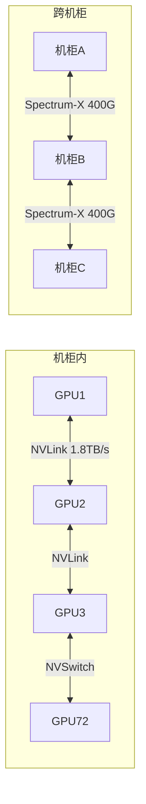

### 13.2 Spectrum-X vs Arista: 竞争分析

来自ANET报告的数据:
- Spectrum-X在6个月内实现了+7pp的份额逆转
- 但份额天花板可能在25-30% [硬数据: FMP](Arista/Cisco有更广泛的部署基础)
- NVIDIA的优势: 与GPU捆绑销售("全套解决方案"叙事)
- NVIDIA的劣势: 网络不是核心竞争力, Arista有20年网络经验

**网络收入的毛利率影响**: 网络交换机的毛利率通常在50-60%, 显著低于GPU的75%+。当网络收入从$3B [硬数据: FMP]增长到$11B (从Q4 FY25到Q4 FY26), 产品组合的变化机械性地压低了整体毛利率。如果网络收入在FY2027继续快速增长(假设占数据中心收入10-15%), 毛利率的"73-75%新常态"可能取代"75-78%历史常态"。

### 13.3 网络业务的战略价值

尽管网络收入压低毛利率, 它有三个战略价值:

1. **增加客户粘性**: 当客户同时使用NVIDIA GPU + Spectrum-X网络, 切换到AMD GPU的成本更高(需要同时更换网络设备)

2. **扩大TAM**: GPU芯片的TAM有上限(取决于客户买多少GPU), 但网络的TAM是增量的——每个GPU集群都需要网络连接

3. **对标Cisco的路径**: Jensen多次表示NVIDIA的目标是成为"AI时代的Cisco"——不仅提供计算, 还提供网络。如果这个愿景成功, 网络可能成为$50B+/年的业务

### 13.4 网络收入预测

| 财年 | 估计网络收入 | 占DC比 | 增速 |
|------|------------|--------|------|
| FY2025 | ~$12B | ~10% | — |
| FY2026 | ~$30B | ~15% | +150% |
| FY2027E | ~$50B | ~15% | +67% |
| FY2028E | ~$65B | ~14% | +30% |

如果网络收入在FY2028达到$65B, NVIDIA将成为全球前三大网络设备供应商之一——这对一家4年前几乎不卖网络产品的公司来说, 是一个惊人的扩张速度。

---

## Ch 14: AI超级周期定位 — 我们在哪个阶段?

### 14.1 AI基础设施四阶段模型

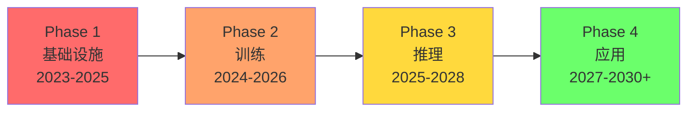

**Phase 1 — 基础设施建设 (2023-2025)**: GPU大规模采购+数据中心建设。NVIDIA是最大受益者。特征: CapEx爆发增长, 需求远超供给, 客户不关心ROI只关心拿到GPU。**← 已过峰值**

**Phase 2 — 大模型训练 (2024-2026)**: 前沿模型规模每年10x增长, 训练需要更多GPU集群。NVIDIA保持训练市场垄断(NVLink+NCCL的多节点扩展无可替代)。**← 当前阶段**

**Phase 3 — 推理规模化 (2025-2028)**: AI应用落地→推理需求爆发。推理已超过训练成为AI计算的主体(~2/3)。但推理市场更容易被自研芯片和AMD渗透。**← 正在进入**

**Phase 4 — 应用收割 (2027-2030+)**: AI原生应用产生实际收入, 证明(或证伪)AI CapEx的ROI。这是"4:1差距"(CapEx $400B vs AI收入$100B)能否收窄的关键阶段。**← 尚未到来**

### 14.2 NVIDIA在各阶段的受益程度

| 阶段 | NVIDIA受益度 | 逻辑 | 风险 |
|------|------------|------|------|
| Phase 1 | ★★★★★ | 唯一大规模供应商 | 已过峰值 |
| Phase 2 | ★★★★☆ | 训练垄断 | AMD MI450竞争 |
| Phase 3 | ★★★☆☆ | 推理需求大但竞争加剧 | TPU/Trainium/Triton |
| Phase 4 | ★★☆☆☆ | 取决于是否成功转型平台 | 如果仅卖硬件则受益有限 |

**关键洞察**: NVIDIA的受益程度随AI周期的推进而递减。Phase 1(基础设施)是NVIDIA的黄金期——所有人需要GPU, 没有替代品, 供不应求。Phase 3-4(推理+应用)是挑战期——竞争加剧, 需求分散, 客户有更多选择。

这与核心矛盾直接相关: 如果AI周期停留在Phase 1-2(不断建设新基础设施), NVIDIA持续受益; 如果AI周期进入Phase 3-4(应用落地+推理民主化), NVIDIA的绝对优势被稀释。

### 14.3 训练→推理的结构性转变

推理现在占AI计算的~2/3, 这个比例还在上升。这对NVIDIA意味着什么?

**推理 vs 训练的GPU需求特征**:

| 维度 | 训练 | 推理 |
|------|------|------|
| GPU数量 | 极多(10K+集群) | 分散(几十到几百) |
| 互连需求 | 极高(NVLink必须) | 较低(以太网可用) |
| 延迟敏感 | 低(批处理) | 高(实时响应) |
| 成本敏感 | 低(前沿模型不惜代价) | 高(推理是持续运营成本) |
| NVIDIA优势 | 极强(NVLink+NCCL垄断) | 较弱(标准化+价格竞争) |
| 替代可行性 | 低(自研芯片难以扩展) | 高(TPU/Trainium已验证) |

**推理市场的竞争格局**:
- NVIDIA Grace Blackwell: 推理成本降低10x, 性能领先
- AMD MI350/MI355X: DeepSeek-R1测试中推理性能超B200 1.4x, 且价格更低
- Google TPU v6: 对Google Cloud客户已是可行替代
- AWS Trainium2: Anthropic验证大模型推理可行
- 自研ASIC(各家): 针对特定模型优化, 每token成本最低

NVIDIA在推理市场的份额可能从当前的~85%在3年内降至65-70%——这不会是灾难性的, 但会压低增速和毛利率。

### 14.4 "边缘推理"的长期机遇

一个目前被市场忽视的机遇是边缘推理:
- Jetson系列(嵌入式AI): 用于机器人、自动驾驶、工业检测
- Automotive: FY2026 ~$590M/季度, 小但在增长
- Isaac GR00T (人形机器人): 长期期权

这些业务在$216B总收入中微不足道(<3%), 但如果AI从数据中心扩展到物理世界(机器人/自动驾驶/智能工厂), 边缘GPU的TAM可能是数据中心的数倍。

---

## Ch 15: 地缘政治维度 — 出口管制、台海、技术主权

### 15.1 出口管制的三层影响

NVIDIA面临的地缘政治风险有三个层次:

**Layer 1: 直接收入损失 (已实现)**
- 中国收入占比: 20-25%→~13%
- 中国AI芯片份额: 66%→8%
- 年化收入损失: $15-26B(估计)
- 但: 主权AI+其他市场增长已完全对冲

**Layer 2: 竞争对手崛起 (进行中)**
- 华为Ascend 910C已规模部署
- 华为Ascend 920预计2026末追平H200
- 中国AI生态(百度/阿里/字节)已适配国产芯片
- 这些能力一旦建立, 即使管制放松也不会消失

**Layer 3: 全球分裂风险 (潜在)**
- 如果中美技术脱钩加深, 全球可能形成两个独立的AI生态
- "NVIDIA生态"(美国+盟友) vs "华为生态"(中国+一带一路)
- 对NVIDIA的影响: TAM从全球缩小到"西方+中立国"
- 但: 主权AI正是各国不想依赖任何一方的表现→NVIDIA受益

### 15.2 台海风险 — 系统性但非NVIDIA特有

NVIDIA 100%的芯片由台积电在台湾制造。台海冲突将导致:
- NVIDIA 100%产能归零(短期)
- 全球半导体供应链崩溃
- 影响不仅是NVIDIA, 而是整个科技行业

来自TSM报告: 台海冲突概率(Polymarket)长期维持在低水平(<10%)。TSMC在亚利桑那和日本的海外产能正在建设, 但短期内无法替代台湾的先进制程产能。

**对NVIDIA的特殊影响**: 因为NVIDIA使用最先进的CoWoS封装(仅台湾有), 它比其他芯片公司更难转移产能。Intel的战略入股($5B)可能部分是对冲——如果Intel先进封装成熟, NVIDIA有第二个制造来源。

### 15.3 技术主权浪潮 — 主权AI作为地缘对冲

50+个国家正在建设"主权AI"基础设施。驱动力:
- 不依赖美国/中国的AI基础设施
- 数据主权(敏感数据不出国境)
- 国家安全(军事/情报AI能力)
- 经济竞争力(本土AI产业)

韩国$735B计划(50万颗GPU+50个新数据中心)是最大的单一案例。日本、欧盟、沙特、阿联酋、印度等也有类似计划。

**NVIDIA的主权AI收入**: FY2026 >$30B(3x+ YoY), 约占数据中心收入15%。
**增长驱动**: 国家安全需求+数据主权法规+政治意愿 → 非周期性驱动力
**风险**: 政策驱动的需求可能是一波性的(初始建设完成后不再大规模采购)

---

## Ch 16: SoftBank因素 — 最大外部股东的杠杆博弈

### 16.1 SoftBank与NVIDIA的关系

SoftBank是NVIDIA最大的外部股东之一(通过直接持股+Vision Fund)。Masayoshi Son将NVIDIA视为其"AI帝国"战略的核心:

- SoftBank是ARM(NVIDIA Grace/Vera使用ARM架构)的控股股东
- SoftBank大规模采购NVIDIA GPU用于其日本AI数据中心计划
- SoftBank同时投资了NVIDIA的潜在竞争者(如Graphcore)

**对NVIDIA的影响**: SoftBank作为大客户和大股东, 其投资决策对NVIDIA有直接影响。如果SoftBank面临财务压力(例如AI投资亏损+ARM股价下跌), 可能被迫减持NVIDIA股份→股价压力。

### 16.2 ARM-NVIDIA的微妙关系

来自ARM报告:
- NVIDIA Grace是ARM服务器出货量最大的客户(3-5M/年)
- 但版税密度极低($22/chip, 占节点价值0.05-0.1%)
- ARM Phoenix(自研服务器CPU)是NVIDIA Vera CPU的潜在竞争者

这是一个有趣的生态系统张力: NVIDIA用ARM的CPU架构, 但ARM也在尝试与NVIDIA竞争服务器CPU市场。目前双方合作大于竞争, 但如果ARM Phoenix获得市场认可, 关系可能变化。

---

## Ch 17: 七大终端市场TAM深度建模

### 17.1 市场全景

NVIDIA的TAM可以分解为七个终端市场:

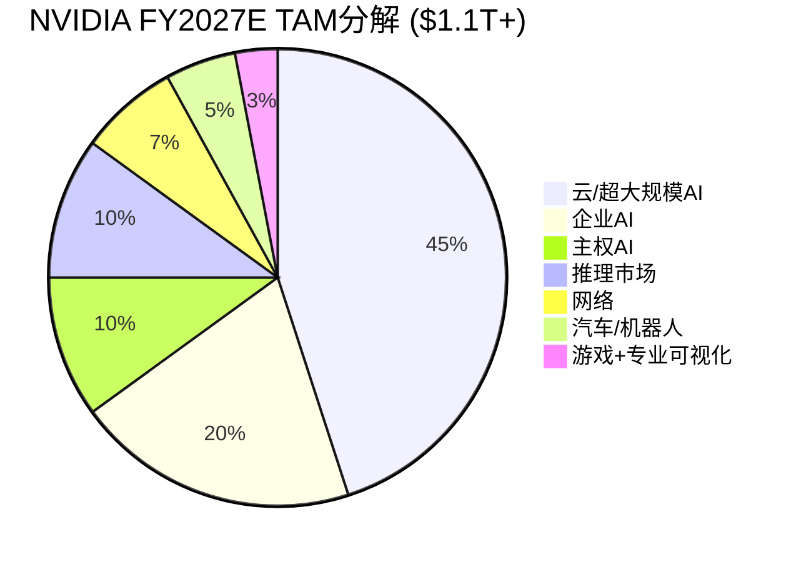

### 17.2 各市场详细TAM

**市场1: 云/超大规模AI训练 (~$500B TAM by 2028)**

| 年度 | TAM | NVDA份额 | NVDA收入 |
|------|-----|---------|---------|
| FY2026 | ~$270B | ~80% | ~$216B |
| FY2027E | ~$400B | ~75% | ~$300B |
| FY2028E | ~$500B | ~70% | ~$350B |
| FY2029E | ~$550B | ~65% | ~$358B |

份额从80%缓慢下降, 但TAM增长部分抵消。FY2029收入可能在$350-360B形成平台。

**市场2: 企业AI (~$200B TAM by 2028)**

企业AI目前渗透率低(<5%的企业部署了AI基础设施)。但增长快:
- 通过云(AWS/Azure/GCP) → NVIDIA间接受益
- 通过OEM(Dell/HP/SMCI) → NVIDIA直接受益
- NVIDIA AI Enterprise软件 → 经常性收入潜力

**市场3: 主权AI (~$100B TAM by 2028)**

50+国家的AI基础设施计划:
- 韩国$735B | 日本~$100B | 欧盟~$200B | 中东~$100B | 印度~$50B
- NVIDIA是大多数主权AI项目的默认选择(缺乏替代)
- 但: 建设期后可能进入维护期→收入不可线性外推

**市场4: 推理专用市场 (~$255B TAM by 2030)**

推理市场增长最快(CAGR 19.2%), 但NVIDIA份额可能被蚕食:
- 训练市场份额: ~90% (NVLink垄断)
- 推理市场份额: ~70% (自研芯片+AMD竞争)
- 差距原因: 推理更标准化, 客户更价格敏感

**市场5: 网络 (~$70B TAM by 2028)**

Spectrum-X+InfiniBand+NVLink互连:
- 从$0到$30B/年在3年内→市场最快的网络新进者
- 但: 与Arista/Cisco/Juniper竞争, 份额天花板可能20-30%

**市场6: 汽车/机器人 (~$50B TAM by 2030)**

- DRIVE: L2+到L4自动驾驶平台, 与GM/Uber合作
- Isaac GR00T: 人形机器人基础模型
- FY2026收入~$2.4B(汽车), <2%总收入
- 长期期权价值显著, 但近期对收入贡献微小

**市场7: 游戏+专业可视化 (~$30B TAM)**

- GeForce RTX: 消费级GPU, 成熟市场
- Quadro/RTX Pro: 专业工作站
- FY2026收入~$12B, 低增长
- 这是NVIDIA的"现金牛"而非增长引擎

### 17.3 TAM加总与NVIDIA收入上限估计

| 年度 | 总TAM | NVDA加权份额 | NVDA收入估计 |
|------|-------|------------|------------|
| FY2027E | ~$700B | ~51% | ~$356B |
| FY2028E | ~$900B | ~46% | ~$414B |
| FY2029E | ~$1.1T | ~41% | ~$451B |
| FY2030E | ~$1.2T | ~38% | ~$456B |

**关键发现**: 即使TAM持续增长, NVIDIA的份额稀释(从80%→38%)意味着收入在$400-460B区间可能形成天花板。这与分析师FY2030E $530B的预期有差距——分析师可能假设了更高的份额保持率, 或者更大的TAM。

不过, 如果Rubin/Feynman的性能迭代创造了超预期的需求弹性(更便宜的计算→更多应用→更多GPU需求), TAM可能超过$1.2T, 从而支撑$500B+的收入。

---

## Ch 18: NVIDIA vs 历史科技巨头 — 定量对标

### 18.1 峰值指标对比

| 公司 | 峰值年 | 峰值收入 | 峰值P/E | 峰值市值 | 收入占GDP% | 后续 |
|------|--------|---------|---------|---------|-----------|------|
| Cisco | 2000 | $19B | ~200x | $555B | 0.19% | -80% |
| Intel | 2000 | $34B | ~50x | $500B | 0.34% | -74%(至2009) |
| Microsoft | 2000 | $23B | ~60x | $600B | 0.23% | -65%(至2009) |
| Apple | 2012 | $157B | ~15x | $500B | 0.97% | 持续增长 |
| **NVIDIA** | **2026?** | **$216B** | **40x** | **$4.31T** | **0.76%** | **?** |

**NVIDIA与前辈的差异**:

1. **P/E相对温和**: NVDA 40x vs Cisco 200x / Intel 50x → 泡沫程度远低于2000年
2. **盈利能力极强**: NVDA净利率55.6% vs Cisco 18% / Intel 31% → 利润支撑力更强
3. **绝对市值史无前例**: $4.31T超过了任何历史科技公司(Apple峰值约$3.6T)
4. **收入/GDP比不极端**: 0.76%低于Apple 2023年的~1.5% → 经济体量支撑得住

### 18.2 "周期后"情景模拟

如果NVIDIA经历类似Cisco的周期性回调(-50%到-80%), 各情景下的市值:

| 回调幅度 | 市值 | P/E (基于FY2027E NI) | 隐含条件 |
|---------|------|---------------------|---------|
| -20% | $3.45T | 32x | 温和增速放缓 |
| -30% | $3.02T | 28x | FY2028增速不及预期 |
| -50% | $2.16T | 20x | AI CapEx周期确认见顶 |
| -70% | $1.29T | 12x | AI泡沫破裂+需求崩塌 |
| -80% | $0.86T | 8x | Cisco式完全崩塌 |

**P/E 20x ($2.16T)**: 这对应FY2028 NI~$180B (假设+50% YoY from $120B)→意味着市场只愿意给成熟公司倍数→需要增速确认终结

**P/E 12x ($1.29T)**: 这意味着市场认为NVIDIA是一家"前周期"公司, 未来收入将下滑→只有在AI CapEx实际下降时才会发生

---

## Ch 19: Mermaid图集 — 核心概念可视化

### 19.1 核心矛盾图

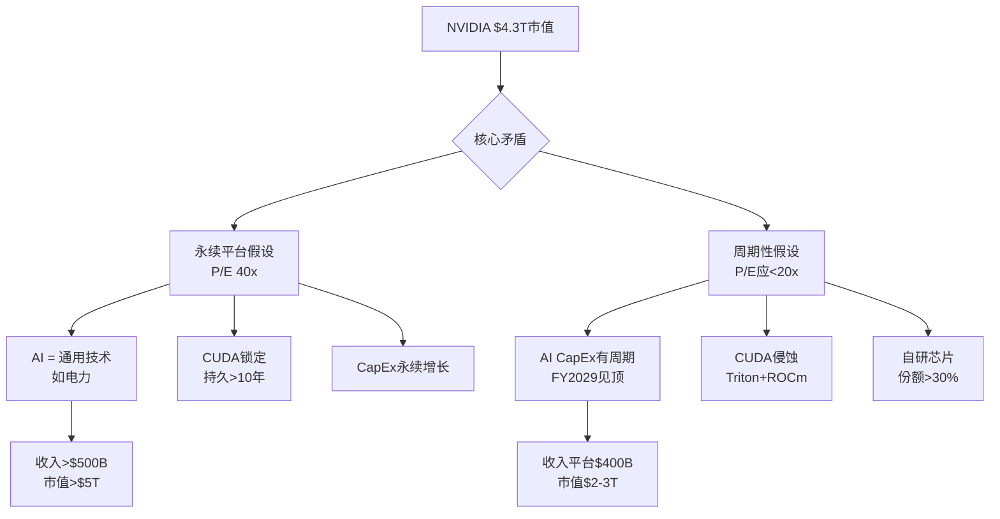

### 19.2 产品路线图时间线

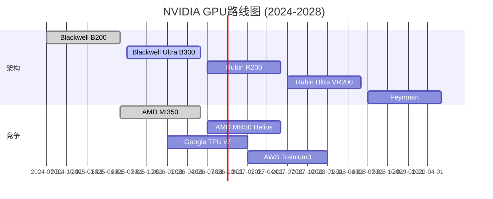

### 19.3 收入构成演化

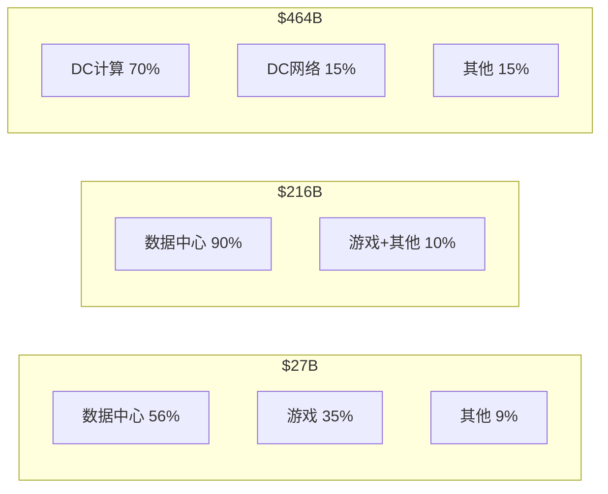

### 19.4 CUDA生态护城河层级

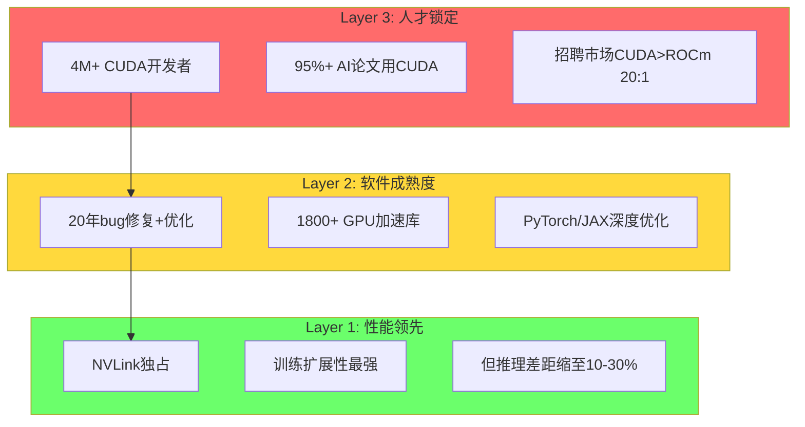

### 19.5 AI CapEx可持续性决策树

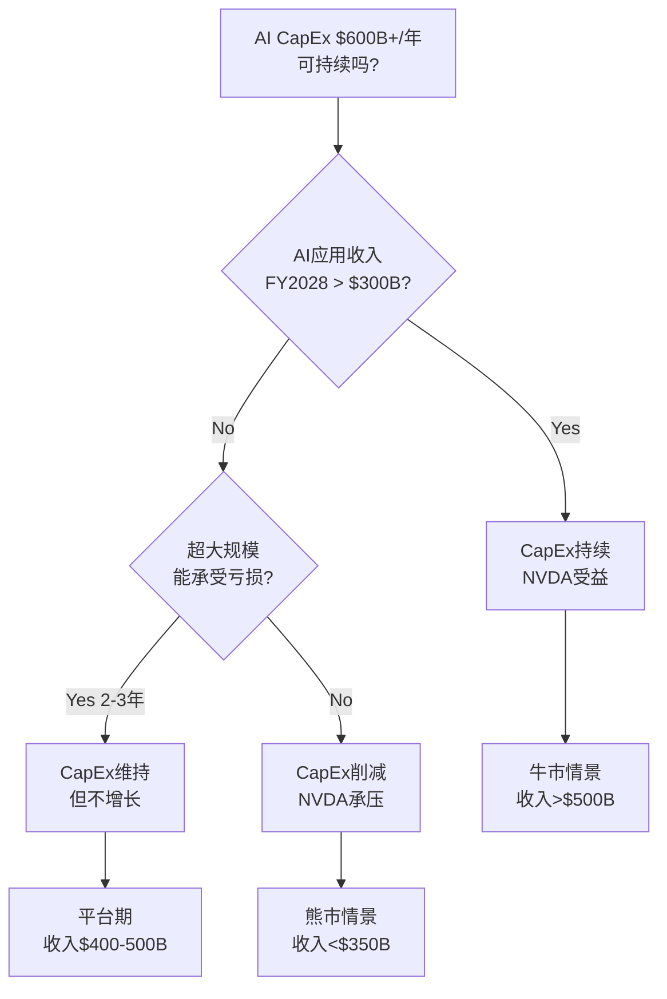

---

## Ch 20: 核心结论总结 — 公司理解的20个核心结论

### 20.1 定量核心结论

1. **FY2026实绩**: 收入$215.9B(+65%), 净利$120.1B, FCF $96.7B, 毛利率71.1%
2. **季度轨迹**: Q4 $68.1B年化$272B, Q1 FY27 guidance $78B年化$312B
3. **分析师共识**: FY2027E $356B, FY2028E $464B, FY2029E $545B, **FY2030E $530B(下降)**
4. **客户集中**: 超大规模>50%, 主权AI ~15%, 企业~20%
5. **竞争格局**: AI GPU ~90%份额, 但CUDA差距缩至10-30%, 自研芯片~10-15%
6. **中国**: 份额66%→8%, 收入占比~13%, 结构性丢失
7. **估值**: P/E 39.9x, P/S 22x, FCF Yield 2.03%, FMP DCF $252.53(+42.5%)
8. **宏观**: CAPE 98%ile, Buffett 100%ile → 极热环境
9. **SGI**: 8.9(极致专才), A-Score 8.50
10. **员工效率**: 人均收入$5.14M, 人均净利$2.86M(科技史最高)

### 20.2 定性核心结论

11. **三次身份跃迁**: 游戏GPU→CUDA平台→AI基础设施度量衡
12. **CUDA双面性**: 最强护城河(20年/4M开发者)但侵蚀方向已确立
13. **系统化转型**: 芯片→机柜→SuperPOD, ASP升但毛利率降
14. **年度迭代**: 每代3.3x性能提升创造"必须升级"的经济压力
15. **网络扩张**: Spectrum-X是第二曲线($30B+/年), 但压低毛利率
16. **AI超级周期**: 从Phase 1(基础设施)→Phase 3(推理), NVIDIA受益度递减
17. **历史类比**: 最可能是"混合态"(25-30%), 收入平台$400-500B
18. **地缘**: 中国结构性丢失, 主权AI对冲, 台海系统性风险
19. **核心矛盾未解**: "永续平台" vs "周期性供应商" → Phase 2-4深入
20. **温度**: +0.5(偏热) — 极高质量但估值不便宜, 增长持续性是关键未知

### 后续分析方向

Phase 2将深入:
- **Reverse DCF**: $4.3T市值隐含了什么增速/毛利率/折现率假设?
- **CUDA定价权量化**: 如果CUDA份额从95%→70%, 对毛利率/估值的影响?
- **AI CapEx可持续性建模**: 历史周期对比+ROI回收路径分析
- **自研芯片份额预测**: 逐客户、逐工作负载的替代速度曲线
- **五引擎估值启动**: DCF/可比/Reverse DCF/期权价值/支付网络框架
- **风险拓扑**: 协同风险组合(AI泡沫×自研芯片×地缘)的联合概率

---

## Ch 21: NVIDIA作为"AI税收系统" — 商业本质的第一性原理

### 21.1 从产品到税基

100baggers.club对NVIDIA的商业本质有一个精辟定义: **"向全球提供加速计算的标准化度量衡"**。让我们把这个概念推到极致:

如果AI计算是21世纪的电力, 那么NVIDIA就是同时拥有"发电厂设计图"(GPU架构)+"电网标准"(CUDA)+"电表"(定价权)的实体。它不生产电力(不运营数据中心), 但它定义了电力的规格、分配方式和价格。

这就是"AI税收系统"的类比:

| 税基类比 | NVIDIA对应 | 税率 | 规避可能性 |
|---------|-----------|------|-----------|
| 计算税 | GPU芯片价格中的利润 | 毛利率71-75% | 低(训练)/中(推理) |
| 平台税 | CUDA锁定溢价 | 估计10-20%价格溢价 | 中(Triton侵蚀) |
| 升级税 | 每代必须升级 | 每代ASP上升 | 极低(性能差3.3x) |
| 互连税 | NVLink/NVSwitch独占 | 100%关键互连 | 低(无替代) |
| 网络税 | Spectrum-X捆绑 | 份额上升中 | 高(Arista竞争) |

**"计算税"量化**: 如果NVIDIA的"公平"毛利率是55%(行业平均), 而实际毛利率是71%, 那么额外的16pp就是"AI税"。在$216B收入上, 这相当于$34.5B/年的"税收"——由全球AI用户集体支付。

**这种"税"能持续吗?** 历史类比:
- Visa/Mastercard: 支付交换费(2-3%)持续了40年+, 因为网络效应无可替代
- Intel (x86时代): CPU溢价持续了25年(1985-2010), 直到ARM+TSMC打破了架构锁定
- Qualcomm: 专利授权持续了20年+, 直到Apple自研基带

**NVIDIA的"税收"可能持续的时间**: 10-15年(CUDA生态的更换成本+NVLink独占), 但"税率"可能逐步下降(从71%到65-68%), 因为竞争在增加。

### 21.2 NVIDIA的"三个不可能三角"

**不可能三角1: 增速 × 份额 × 毛利率**

| 维度 | 当前 | 牛市 | 熊市 |
|------|------|------|------|
| 收入增速 | +65% | +65% (FY27) | +30% |
| 市场份额 | ~90% | 85%+ | 65% |
| 毛利率 | 71% | 75% | 65% |

三者同时保持高位是不可能的:
- 如果要保持90%份额 → 不能太激进涨价 → 毛利率可能下降
- 如果要保持75%毛利率 → 价格必须高 → 客户加速自研替代 → 份额下降
- 如果收入增速要保持+65% → 需要份额+毛利率至少有一个让步

**当前市场定价隐含**: 收入增速+65%(FY27)+30%(FY28)+17%(FY29), 份额缓慢下降至~70%, 毛利率73-75%。这是一个"温和乐观"的假设组合。

**不可能三角2: 硬件增长 × 软件转型 × 系统扩张**

NVIDIA同时在三个方向扩张:
- 硬件: 年度GPU迭代(核心)
- 软件: AI Enterprise订阅(新)
- 系统: NVL/SuperPOD/Spectrum-X(扩张)

但资源(R&D人才, 管理注意力)是有限的。系统化扩张已经在压低毛利率; 软件转型需要完全不同的组织能力(从芯片工程师到软件销售); 硬件迭代是命脉不能放松。

Jensen试图同时做所有事情——这在他精力充沛时可行, 但增加了"Jensen退休/离开"的系统性风险。

**不可能三角3: 客户关系 × 竞争地位 × 定价权**

NVIDIA的大客户(AWS/Google/Meta)同时也是它的潜在竞争者(自研芯片)和最重要的渠道(云GPU)。这三重身份创造了复杂的博弈:
- NVIDIA提价太狠 → 客户加速自研 → 长期份额下降
- NVIDIA降价讨好 → 毛利率下降 → 短期盈利受损
- NVIDIA保持现状 → 自研芯片自然增长 → 温水煮青蛙

最优策略可能是"渐进让利": 每代新产品性价比显著提升(推理成本降10x), 让客户觉得升级比自研更划算。这正是Jensen的"需求弹性"论点——更便宜的计算创造更多需求, 而不是让客户少买GPU。

### 21.3 "计算即收入"假说的验证框架

Jensen的核心论点是: **"compute equals revenues"** — GPU支出不是成本, 而是直接创造收入的投资。

**如果这个假说成立**:
- 每$1 GPU投入 → 创造$X AI收入 (X需>1才能持续)
- 当前: AI CapEx ~$400B vs AI应用收入~$100B → X ≈ 0.25 (远低于1)
- 要使X>1: AI应用收入需要在3年内增长4x以上
- 可能吗? ChatGPT/Claude等AI产品收入在快速增长, 但$100B→$400B需要每年+60%增长

**如果这个假说不成立**:
- GPU支出是资本支出, 需要多年折旧回收
- 超大规模客户的CapEx/Revenue 45-57%不可持续
- 2-3年后CapEx将正常化(可能下降20-40%)
- NVIDIA收入将面临周期性调整

**Phase 2将量化验证这个假说**: 通过历史类比(电信CapEx周期/云计算CapEx周期)+AI应用收入增速预测+超大规模FCF承受力分析。

---

## Ch 22: NVIDIA财务深度拆解 — 三表10年纵向演化

### 22.1 收入增长的S曲线解剖

NVIDIA过去10年的收入增长呈现出三段清晰的S曲线:

**S曲线1: 游戏+数据中心双轮 (FY2016-FY2022)**

| 财年 | 收入 | YoY | 主驱动 |
|------|------|-----|--------|
| FY2016 | $5.0B | +7% | GeForce GTX 980/970 |
| FY2017 | $6.9B | +38% | 加密货币挖矿+Pascal |
| FY2018 | $9.7B | +41% | 数据中心V100开始放量 |
| FY2019 | $11.7B | +21% | 加密崩盘后游戏恢复 |
| FY2020 | $10.9B | -7% | COVID初期需求疲软 |
| FY2021 | $16.7B | +53% | 数据中心A100爆发 |
| FY2022 | $26.9B | +61% | 数据中心超越游戏成为第一大收入来源 |

这一阶段的特征: 增速在20-60%之间波动, 受游戏周期和加密货币影响显著。数据中心收入从FY2016的约$600M增长到FY2022的~$15B, 成为结构性增长引擎。

**S曲线2: AI爆发 (FY2023-FY2026)**

| 财年 | 收入 | YoY | 数据中心收入 | DC占比 |
|------|------|-----|-----------|--------|
| FY2023 | $27.0B | 0% | ~$15B | 56% |
| FY2024 | $60.9B | +126% | ~$47B | 78% |
| FY2025 | $130.5B | +114% | ~$113B | 87% |
| FY2026 | $215.9B | +65% | ~$194B | 90% |

FY2023收入持平(加密崩盘+游戏库存消化), 然后FY2024因ChatGPT效应爆发。注意增速从+126%→+114%→+65%——增速本身在减速, 但绝对值仍然惊人($85B增量 vs 上年$70B增量)。

**S曲线3: 成熟期? (FY2027E-FY2031E)**

| 财年 | 分析师共识收入 | YoY | 覆盖人数 |
|------|-------------|-----|---------|
| FY2027E | $355.8B | +65% | 39位 |
| FY2028E | $464.2B | +30% | 37位 |
| FY2029E | $545.3B | +17% | 33位 |
| FY2030E | $530.2B | -3% | 13位 |
| FY2031E | $555.3B | +5% | 8位 |

FY2027仍然强劲(+65%), 但FY2028-2029增速显著放缓。FY2030的负增长预期是核心矛盾的直接体现: **分析师正在定价一个"AI CapEx见顶"的世界。** 但注意FY2030只有13位分析师覆盖(vs FY2027的39位), 远期预测的可靠性低。

### 22.2 盈利能力的结构性跃迁

NVIDIA的盈利能力在FY2024实现了非线性跃迁:

| 指标 | FY2022 | FY2023 | FY2024 | FY2025 | FY2026 |
|------|--------|--------|--------|--------|--------|
| 毛利率 | 64.9% | 56.9% | 72.7% | 75.0% | 71.1% |
| 营业利润率 | 37.3% | 20.1% | 54.1% | 62.0% | 60.2% |
| 净利率 | 36.2% | 16.2% | 48.8% | 55.8% | 55.6% |
| R&D/收入 | 19.6% | 27.2% | 14.2% | 10.4% | 8.6% |
| SG&A/收入 | 7.7% | 9.6% | 4.4% | 2.5% | 2.1% |

**FY2023是"低谷年"**: 毛利率跌至56.9%(库存减值), 净利率仅16.2%。这提醒我们NVIDIA不是免疫于周期的——当需求急剧下降(加密+游戏双杀)时, 盈利能力会急剧恶化。

**FY2024-2025是"超额盈利年"**: 毛利率飙至72-75%, 净利率超55%。核心原因:
- 供不应求(H100/A100): 需求远超供给→定价权最大化
- 研发杠杆: R&D绝对额增长(~$6B→$8B→$12B→$13.5B→$18.5B)但收入增长更快(占比从27%→9%)
- SG&A规模效应: $4.6B SG&A支撑$216B收入, 人均收入$5.14M(科技史最高)

**FY2026的利润率下降信号**:
- 毛利率从75.0%→71.1% (Blackwell ramp+系统化)
- 营业利润率从62.0%→60.2% (R&D绝对额+37%增长)
- 经营杠杆仅0.70 → 利润增速慢于收入增速 → 不正常

这是Phase 0.75识别的异常1(经营杠杆倒挂)的详细展开。一次性还是结构性? Q4毛利率恢复至75.0%支持"一次性"论点, 但Rubin ramp可能在FY2027 H2再次冲击。

### 22.3 现金流: 印钞机的极限在哪里?

| 指标 | FY2022 | FY2023 | FY2024 | FY2025 | FY2026 |
|------|--------|--------|--------|--------|--------|
| OCF | $9.1B | $5.6B | $28.1B | $64.1B | $102.8B |
| CapEx | $0.98B | $1.83B | $1.07B | $3.26B | $6.01B |
| FCF | $8.1B | $3.8B | $27.0B | $60.8B | $96.8B |
| FCF/收入 | 30.2% | 14.0% | 44.3% | 46.6% | 44.8% |
| FCF/NI | 83% | 86% | 91% | 83% | 81% |

**FCF趋势的含义**:
- $96.8B FCF在绝对值上仅次于Apple($110B级别)→全球第二大自由现金流产生器
- FCF/NI从91%降至81%→运营资本(尤其存货)消耗增加→DIO从61天升至92天
- CapEx从$1B升至$6B(6倍!)→资本轻模型在变重→但6%的CapEx仍远低于重资产半导体(Intel 35%+)

**运营资本的隐忧**:

| 项目 | FY2024 | FY2025 | FY2026 | 变化 |
|------|--------|--------|--------|------|
| 应收账款 | $9.9B | $17.4B | $25.5B | +46% |
| 存货 | $5.3B | $10.1B | $21.4B | +112% |
| 预付/其他 | $3.2B | $5.1B | $7.8B | +53% |

存货暴增到$21.4B(+112%)是Phase 0.75识别的异常2。DIO从80天升至92天。可能的解释:
- Rubin备货: 为2026 H2量产提前囤积晶圆/HBM
- 系统级产品: NVL72/SuperPOD需要更多组件(非GPU部件存货)
- 供应链保险: 避免FY2024的"供不应求"重演

**如果是Rubin备货→DIO将在FY2027 H1回落至60天(看好)**
**如果是结构性→DIO可能稳定在80-90天(中性偏负)**

### 22.4 资产负债表: 从轻资产到"战略厚实"

| 项目 | FY2024 | FY2025 | FY2026 | 变化 |
|------|--------|--------|--------|------|
| 现金+短投 | $26.0B | $43.2B | $51.0B | +18% |
| 总资产 | $65.7B | $113.0B | $206.4B | +83% |
| 总负债 | $22.8B | $35.9B | $73.0B | +103% |
| 股东权益 | $42.9B | $77.1B | $133.4B | +73% |
| 净债务 | ($14.6B) | ($17.1B) | ($33.9B) | 净现金 |
| D/E | 0.29 | 0.34 | 0.40 | 上升中 |
| 商誉 | $4.4B | $5.2B | $20.8B | +301% |

**关键变化**:

1. **总资产翻倍($113B→$206B)**: 主要驱动是存货(+$11B)、应收(+$8B)和商誉(+$16B)。NVIDIA在"变胖"——这对fabless公司来说是不寻常的。

2. **商誉暴增$15.6B(+301%)**: 这是Phase 0.75异常3。主要来源是Run:ai收购(2025年完成, 估计$7B+)和其他AI软件公司收购。$20.8B商誉占总资产10.1%——如果这些收购无法转化为商业价值, 减值风险不可忽视。

3. **净现金持续扩大**: $33.9B净现金意味着NVIDIA可以在不借债的情况下进行任何战略收购。FY2026回购$68.5B(加权平均价$121/股)→管理层在积极回馈股东。

4. **D/E缓慢上升(0.29→0.40)**: 负债增长(+103%)快于权益增长(+73%)→杠杆在温和提升, 但0.40的D/E在科技公司中仍然保守。

### 22.5 资本分配的优先级矩阵

FY2026资本分配全景:

| 用途 | 金额 | 占FCF% | 优先级 |
|------|------|--------|--------|
| 股票回购 | $68.5B | 71% | 最高 |
| 研发投入 | $18.5B | 19% | 核心 |
| 资本开支 | $6.0B | 6% | 上升中 |
| 股息 | $1.2B | 1% | 象征性 |
| 收购(净) | ~$10B | 10% | 战略性 |

**回购是主要返还方式**: $68.5B回购 = 每股净减少约$2.8/年的股份。按加权平均$121/股, 约消化了5.6亿股(占总股本约2.3%)。

**股息极低**: $1.2B股息, 收益率仅0.03%→几乎纯象征性。NVIDIA不是一家收息股票, 也不打算成为。

**R&D是最大的"有机投资"**: $18.5B R&D = 全球第10大R&D支出(仅次于Alphabet/Amazon/Samsung/Huawei/Apple/Microsoft/Meta/VW/TSMC)。但R&D/收入仅8.6%——这意味着NVIDIA有巨大的R&D弹性: 即使收入下降50%, R&D支出仍可承受。

---

## Ch 23: 超大规模客户深度画像 — 谁在买GPU, 为什么?

### 23.1 Big 5的AI投资动机矩阵

NVIDIA的命运很大程度上取决于五家超大规模客户的CapEx决策。每家的AI投资逻辑不同:

**Amazon (AWS)**
- 估计NVIDIA年采购: ~$90B (CapEx $120B × GPU占比~75%)
- AI动机: 守住云市场#1地位 + Alexa/购物/物流AI化 + Anthropic合作(Claude)
- 自研替代: Trainium2量产中, Trainium3开发中, 但主要用于推理
- 对NVIDIA态度: "必须有, 但不想过度依赖" — 双源策略最积极
- 关键信号: Trainium3性能发布 + Anthropic训练硬件选择

**Alphabet (Google)**
- 估计NVIDIA年采购: ~$65B (CapEx $87B × GPU占比~55%)
- AI动机: Gemini模型+搜索AI化+Cloud市场份额追击
- 自研替代: TPU v6量产, v7开发中 — **自研最成熟, 训练+推理双覆盖**
- 对NVIDIA态度: "减少依赖是战略目标" — TPU已证明可替代大部分工作负载
- 关键信号: Gemini 2.5/3.0训练是否仍需NVIDIA GPU

**Microsoft**
- 估计NVIDIA年采购: ~$60B (CapEx $80B × GPU占比~55%)
- AI动机: OpenAI/Copilot生态 + Azure AI客户需求 + 全产品线AI化
- 自研替代: Maia 100量产延迟, 但ARM-based Cobalt CPU已部署
- 对NVIDIA态度: "战略依赖" — OpenAI训练100%用NVIDIA, Azure客户需要NVIDIA GPU
- 关键信号: OpenAI是否开始训练分流到自研/Broadcom ASIC

**Meta**
- 估计NVIDIA年采购: ~$58B (CapEx $70B × GPU占比~60%)
- AI动机: Llama开源模型训练 + Reels/Feed推荐 + Reality Labs(Quest)
- 自研替代: MTIA v3(推理专用), 但训练仍100%依赖NVIDIA
- 对NVIDIA态度: "拥抱但防范" — 开源Llama降低对CUDA的依赖, 但硬件端仍无替代
- 关键信号: Llama 4训练基础设施组成 + MTIA推理部署规模

**Oracle (新晋大买家)**
- 估计NVIDIA年采购: ~$25B (CapEx $34B × GPU占比~50%)
- AI动机: OCI追赶AWS/Azure + xAI(Elon Musk)专属集群 + 传统企业AI化
- 自研替代: 无自研芯片计划 — **对NVIDIA依赖度最高的超大规模客户**
- 对NVIDIA态度: "全盘拥抱" — Larry Ellison公开称Jensen为"合作伙伴"
- 关键信号: OCI增长是否持续 + xAI是否继续扩张

### 23.2 超大规模CapEx周期的历史教训

超大规模客户的CapEx有周期性。回顾过去三轮:

**第一轮: 云计算基础设施 (2010-2016)**
- 驱动力: AWS/Azure/GCP建设
- CapEx增速: +30-50%/年(高峰)
- 持续: 6年连续增长, 2016年增速放缓
- NVIDIA受益: 有限(数据中心GPU尚未爆发)

**第二轮: 超大规模扩张 (2017-2020)**
- 驱动力: 视频流+社交媒体+电商
- CapEx增速: +25-40%/年
- 持续: 3年, 2020年因COVID短暂下调
- NVIDIA受益: 中等(A100开始渗透)

**第三轮: AI基础设施 (2023-?)**
- 驱动力: ChatGPT→前沿模型竞赛→企业AI→主权AI
- CapEx增速: +40-80%/年(FY2025-FY2027)
- 持续: 已3年, 分析师预期FY2028-2029增速放缓至+15-20%
- NVIDIA受益: 极大(90% AI GPU份额)

**历史模式**: 每轮CapEx周期持续3-6年, 然后增速正常化(而非绝对值下降)。关键区别: 前两轮中CapEx是"建设→运营"模式, 建好后维护成本低。AI CapEx可能不同——每代模型需要更多算力, 所以"运营"阶段可能本身就需要持续高投入。

但问题在于: **即使CapEx绝对值不下降(维持$600B+), 增速放缓本身就会减少NVIDIA的增量收入。** NVIDIA的股价反映的是增长, 不是稳态。如果CapEx从+50%/年放缓到+10%/年, NVIDIA的收入增速也会从+65%降至+10-15%→P/E从40x压缩到15-20x。

### 23.3 客户集中度量化: HHI与风险评估

超大规模客户集中度的Herfindahl-Hirschman指数(HHI)估算:

| 客户 | 估计份额 | 份额² |
|------|---------|-------|
| Amazon | ~25% | 625 |
| Alphabet | ~18% | 324 |
| Microsoft | ~16% | 256 |
| Meta | ~16% | 256 |
| Oracle | ~7% | 49 |
| 其他超大规模 | ~5% | 25 |
| 主权AI | ~7% | 49 |
| 企业/OEM | ~6% | 36 |
| HHI | — | **1,620** |

HHI 1,620属于"中度集中"(1,500-2,500)。但如果将Amazon/Alphabet/Microsoft/Meta归为"超大规模"一类(因为它们的CapEx决策高度相关), 实际集中度更高。

**主权AI的去中心化价值**: CI-03("主权AI是去中心化保险")的数据支撑——主权AI将客户分散到50+国家, 降低对Big 5的依赖。如果主权AI从7%增长到15%, HHI将从1,620降至~1,350(接近"低集中度"阈值1,500)。

---

## Ch 24: 产品代际策略 — 为什么NVIDIA "永远在卖下一代"

### 24.1 迭代节奏: 从两年到一年

Jensen在GTC 2024宣布了一个根本性的战略转变: **从两年一代升级为一年一代**。

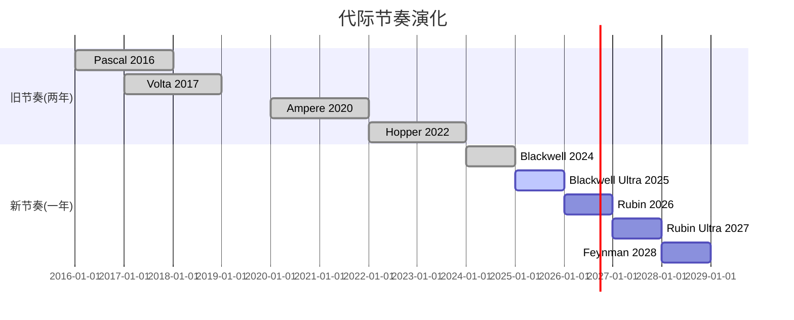

**一年迭代的战略含义**:

1. **客户无法"跳代等待"**: 两年一代时, 客户可能等下一代; 一年一代时, 等待机会成本太高(竞争对手不会等)

2. **竞争对手永远落后**: AMD MI450 Helios预计2026年底→Rubin已经出货; 等Helios量产→Rubin Ultra已到→AMD永远在追一代之前的产品

3. **"必须升级"的经济逻辑**: 每代3.3x机柜级性能提升。假设一个超大规模客户运营10,000颗Blackwell GPU:
   - 年化电力+冷却成本: ~$50M
   - 升级到10,000颗Rubin: 资本支出~$300M
   - Rubin性能: 10x推理效率提升→相同工作负载仅需~3,000颗GPU
   - 节省: 70%电力成本(~$35M/年) + 67%机柜空间
   - ROI: 升级在2-3年内回本

这就是Jensen的"compute equals revenue"论点的另一个版本: 不升级的代价(低效运营+竞争劣势)比升级的代价(购买新GPU)更高。

### 24.2 各代关键规格对比

| 指标 | Hopper H100 | Blackwell B200 | Rubin R200 | Feynman |
|------|------------|----------------|------------|---------|
| 年份 | 2022 | 2024 | 2026 | 2028 |
| 制程 | TSMC 4nm | TSMC 4NP | TSMC 3nm | TSMC 2nm? |
| HBM | HBM3 80GB | HBM3E 192GB | HBM4 288GB | HBM4E? |
| 单GPU FP8 | 3.9 PFLOPS | 9.0 PFLOPS | ~30 PFLOPS | ~100 PFLOPS? |
| 机柜规模 | DGX (8 GPU) | NVL72 (72 GPU) | NVL144 (144 GPU) | NVL576 (576 GPU) |
| 互连 | NVSwitch | NVLink 5 | NVLink 6 | NVLink 7? |
| 推理成本 | 基准 | 4x降低 | 40x降低 | 100x+降低? |
| 单卡ASP | ~$25K | ~$30-40K | ~$40-50K? | ~$50-60K? |

**几何级提升的经济压力**: 从Hopper到Feynman, 推理成本降低100倍以上。这意味着:
- 2022年花$1M才能运行的AI推理工作负载, 到2028年可能只需$10K
- 这创造了巨大的"需求弹性"——更多企业/应用买得起AI推理
- 但也意味着现有GPU的残值快速归零→客户被迫频繁升级

### 24.3 "Air Pocket"风险的定量评估

CQ-3核心问题: 当客户知道Rubin即将到来时, 是否会暂停Blackwell采购?

**历史先例**:
- Hopper→Blackwell过渡: 几乎无air pocket, 因为需求远超供给
- Volta→Ampere过渡: 轻微air pocket (FY2021 Q1数据中心增长放缓)
- Pascal→Volta过渡: 明显air pocket (加密崩盘+等待期叠加)

**当前证据**:
- Q1 FY27 guidance $78B (+15% QoQ): 短期无air pocket迹象
- 供应承诺$95.2B(翻倍): 客户在积极锁定未来产能
- Rubin Ramp预计2026 H2 → Q2-Q3是观察窗口

**air pocket概率评估**:
- 无air pocket (CapEx太强, 不敢等): 55%
- 轻微air pocket (1-2季度增长放缓至+5-10% QoQ): 35%
- 严重air pocket (QoQ下降): 10%

加权预期: air pocket风险偏低, 但H2 2026需密切关注。

### 24.4 Rubin→Feynman: 路线图可信度评估

NVIDIA路线图的执行力是其最强的竞争优势之一。但路线图的可信度随时间递减:

| 代际 | 可信度 | 依据 |
|------|--------|------|
| Blackwell Ultra (2025) | ★★★★★ | 已出货, Q4数据确认 |
| Rubin R200 (2026) | ★★★★☆ | 明确路线图, TSMC产能已预订 |
| Rubin Ultra VR200 (2027) | ★★★☆☆ | 路线图公布, 但具体规格待定 |
| Feynman (2028) | ★★☆☆☆ | 仅名称和大致方向, 技术细节未知 |

2nm制程风险: Feynman可能需要TSMC 2nm (N2), 这是全新的GAA(Gate-All-Around)架构。N2的良率和产能在2028年是否成熟, 存在不确定性。如果N2延迟→Feynman可能使用增强版3nm→性能提升可能不如预期的几何级。

---

## Ch 25: CUDA生态的攻防详解 — 深层竞争动态

### 25.1 CUDA的五层防线

CUDA不是一个单一产品, 而是一个多层防御体系:

**Layer 0: 硬件加速指令集 (PTX/SASS)**
- GPU原生指令集, 只在NVIDIA硬件上执行
- 替代难度: 极高(需要从零设计新指令集)
- 竞争者进展: AMD GCN/CDNA有自己的ISA, 但生态薄弱

**Layer 1: 核心数学库 (cuBLAS, cuDNN, cuFFT)**
- GPU加速的数学运算库, 20年优化历史
- 替代难度: 高(优化需要大量工程effort+真实workload调优)
- 竞争者进展: rocBLAS/hipDNN已达到90%+性能, 但边缘情况仍有差距

**Layer 2: AI框架集成 (PyTorch, JAX, TensorFlow)**
- CUDA在主流AI框架中的优化深度远超其他后端
- 替代难度: 中(Triton正在创建硬件无关编译层)
- 竞争者进展: PyTorch 2.0+的Triton后端, JAX的XLA(已支持TPU)

**Layer 3: 应用级SDK (NeMo, Triton Server, Isaac)**
- 面向特定应用的完整解决方案
- 替代难度: 中低(应用层替代品多)
- 竞争者进展: Hugging Face TGI, vLLM等开源方案不依赖CUDA

**Layer 4: 开发者生态 (4M+开发者, 课程, 社区)**
- 人才市场中CUDA技能的主导地位
- 替代难度: 最高(涉及教育体系和劳动力市场)
- 竞争者进展: ROCm开发者增长中但仍为CUDA的1/20

### 25.2 四大侵蚀向量深度分析

**向量1: Triton硬件抽象层**

OpenAI的Triton编译器正在做CUDA最害怕的事: 创建一个统一的编程接口, 让AI代码"写一次, 在任何GPU上运行"。这与Java之于x86/ARM的类比完全一致——当硬件抽象层成熟, 硬件本身变成commodity。

- 当前状态: Triton 2.x已在生产中使用, 但仍主要在NVIDIA GPU上运行
- 威胁程度: 3-5年内可能达到实用化 → CUDA的"锁定"价值下降
- NVIDIA应对: 确保Triton在NVIDIA GPU上跑得最快(硬件+驱动优化)

**向量2: AMD ROCm加速追赶**

ROCm 6.x与CUDA的性能差距已从40-50%缩小到10-30%:
- 训练: MI350在DeepSeek-R1测试中推理性能超B200 1.4x(特定基准)
- 推理: MI350与Blackwell B200在LLM推理上接近平价
- 生态: ROCm开发者增长+60% YoY, 但绝对量仍远低于CUDA

关键: **10-30%的性能差距是否足以保持溢价?** 历史上, 10%以内的差距足以让客户切换(参考Intel→AMD在数据中心的切换过程)。如果ROCm差距缩至<10%, 价格成为主要竞争维度→NVIDIA毛利率承压。

**向量3: 自研芯片绕过CUDA**

Google/AWS/Microsoft的自研芯片不使用CUDA——它们有自己的软件栈(XLA/Neuron/Maia SDK)。这意味着这些芯片的竞争不是在"CUDA vs 替代"的维度上, 而是在"完全绕过"的维度上。

当超大规模客户用自研芯片运行40%的推理工作负载时, CUDA的"开发者锁定"对这40%的工作负载毫无意义——因为这些芯片根本不需要CUDA兼容。

**向量4: AI Lab主动去CUDA化**

最令人担忧的趋势: AI Lab(OpenAI, Anthropic, DeepMind等)正在主动推进硬件无关化:
- OpenAI: 与Broadcom合作开发自研ASIC
- Anthropic: 已在AWS Trainium2上验证推理可行性
- DeepMind: 原生运行在Google TPU上
- Meta: Llama开源框架天然支持多硬件

**这些是NVIDIA最重要的客户和最重要的AI生态参与者**, 它们的硬件策略比任何分析师预测都更值得关注。如果下一代旗舰模型(GPT-5/Gemini 3/Claude 5)的训练硬件组成从"95%+ NVIDIA"变为"70% NVIDIA + 30%自研/AMD", 那将是CUDA护城河实质性侵蚀的确认信号。

### 25.3 CUDA的"护城河半衰期"估计

基于以上分析, CUDA护城河的各层防线的"半衰期"(失去一半优势所需的时间)估计:

| 层级 | 当前优势 | 半衰期 | 依据 |
|------|---------|--------|------|
| L0 硬件指令 | 独占 | >10年 | 需从零构建新ISA生态 |
| L1 数学库 | 10-30%性能领先 | 3-5年 | ROCm追赶速度 |
| L2 框架集成 | 最深度优化 | 2-4年 | Triton硬件抽象 |
| L3 应用SDK | 领先 | 1-3年 | 开源替代品丰富 |
| L4 开发者 | 20:1优势 | 5-8年 | 教育+招聘惯性 |

**加权半衰期**: ~4-6年。这意味着到2030-2032年, CUDA的综合优势可能只剩当前的一半。**但一半的CUDA优势仍然是科技史上最强的竞争壁垒之一**——问题不是CUDA是否会消失, 而是它能否支撑75%的毛利率还是只能支撑65%。

---

## Ch 26: NVIDIA的估值层 — 初步估值锚定

### 26.1 多维估值快照

| 方法 | 指标 | NVDA当前 | 行业中位数 | 含义 |
|------|------|---------|-----------|------|
| P/E (TTM) | 39.9x | 30.2x | 溢价32% |
| P/E (FY27E) | 21.7x | — | 基于$356B收入看"合理" |
| P/S (TTM) | 22.0x | 8.5x | 溢价159% |
| P/FCF | 44.5x | — | FCF收益率2.2% |
| EV/EBITDA | 34.5x | 22.0x | 溢价57% |
| PEG (TTM) | 0.61 | — | "便宜"(增速+65%) |
| PEG (2年平均) | ~1.3 | — | 如果FY28增速降至+30% |
| FMP DCF | $252.53 | — | 隐含上涨+42.5% |

### 26.2 估值的"时间轴依赖"

NVIDIA的估值判断高度依赖你看的时间框架:

**12个月视角**: P/E 21.7x (FY27E), PEG 0.33 → 看起来便宜
- 假设: FY2027收入$356B(+65%)达成
- 风险: 一旦guidance miss, 25%+下跌可能

**3年视角**: P/E ~14x (FY29E NI ~$300B), PEG ~0.8 → 中性偏便宜
- 假设: 收入持续增长至$545B, 毛利率73%+
- 风险: 增速放缓+竞争加剧, P/E压缩到15-20x

**5年+视角**: **完全取决于CQ-1和CQ-2的答案**
- 平台情景: 收入>$600B, P/E 25-30x → 市值$5T+
- 周期情景: 收入平台$400B→下降, P/E 12-15x → 市值$2-2.5T
- 当前市值$4.31T → 接近"平台情景"的定价

### 26.3 逆向工程: 市场在赌什么?

$4.31T市值, 假设10%折现率和2%终期增长, 隐含:

**隐含收入路径**:
- FY2027: ~$360B (+67%)
- FY2028: ~$450B (+25%)
- FY2029: ~$520B (+16%)
- FY2030: ~$550B (+6%)
- 终期: ~$570B (+2%/年永续增长)

**隐含假设检验**:

| 假设 | 市场隐含 | 现实检验 | 合理性 |
|------|---------|---------|--------|
| FY2027收入 | $360B | Q1 guide $78B年化$312B→需H2加速 | 中(Rubin帮助) |
| FY2028收入 | $450B | 需TAM扩张+份额维持>70% | 偏乐观 |
| 终期毛利率 | 72-73% | 系统化+竞争压力 | 合理 |
| 终期增长 | 2% | 对$570B基础 | 非常乐观 |
| CUDA护城河 | 持续>10年 | 半衰期估计4-6年 | 偏乐观 |

**最脆弱的隐含假设**: FY2028 $450B收入。这需要:
1. 超大规模CapEx不减速(当前+50%→维持+20%+)
2. NVIDIA份额不跌破70%(当前~90%→4年降20pp)
3. 推理市场的自研替代<20%(当前~10%→翻倍是合理的)

如果任何一个条件未满足, $450B目标可能降至$380-400B→P/E从21x升至25x (FY28)→市场可能提前反应(估值收缩)。

**后续将执行完整的Reverse DCF**: 详细的承重墙假设拆解, 联合概率计算, 信念反演——这是初步锚定不足以回答的深度问题。

---

## Ch 27: NVIDIA供应链的战略脆弱性与冗余

### 27.1 供应链依赖度热力图

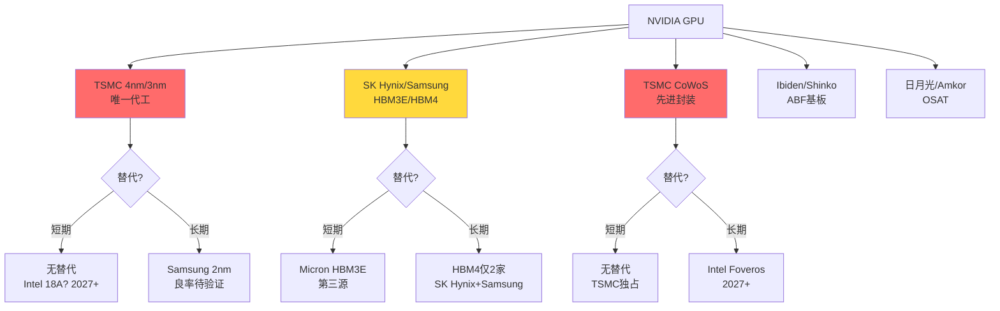

### 27.2 台积电依赖度: 风险与缓解

NVIDIA在台积电的依赖度是100%——所有逻辑芯片和CoWoS封装均由台积电完成。

**风险场景量化**:

| 场景 | 概率 | 产能影响 | 持续时间 | NVDA收入影响 |
|------|------|---------|---------|------------|
| 台湾地震(6级+) | ~5%/年 | 10-30%产能中断 | 1-3月 | -10~30% |
| 台海冲突 | <3%/年 | 100%产能归零 | 6月-2年+ | -80~100% |
| TSMC火灾/事故 | ~1%/年 | 10-20%产能受影响 | 1-3月 | -5~15% |
| 出口管制升级 | ~10%/年 | 特定产品受限 | 不定 | -5~20% |

**缓解措施**:
- Intel $5B战略投资: 可能为Intel 18A代工留后路(2027+), 但Intel量产记录不佳
- TSMC亚利桑那/日本: 先进制程产能建设中, 但短期(<3年)无法替代台湾
- 库存缓冲: $21.4B存货提供~3个月的出货缓冲

### 27.3 HBM供应链: 寡头博弈

HBM是GPU成本的30-35%, 且供应高度集中:

| 供应商 | HBM市场份额 | NVIDIA分配比 | 关系 |
|--------|-----------|------------|------|
| SK Hynix | ~55% | ~65% | 最优先合作伙伴 |
| Samsung | ~30% | ~25% | 第二来源 |
| Micron | ~15% | ~10% | 第三来源(HBM3E起) |

**SK Hynix的战略地位**: 来自MU报告数据, SK Hynix在HBM领域领先Samsung 1-2代, 且NVIDIA将60%+的HBM订单给了SK Hynix。这创造了一个微妙的权力平衡:
- NVIDIA需要SK Hynix的技术领先(HBM4首发)
- SK Hynix需要NVIDIA的订单量(>60%收入来自NVIDIA)
- 两者形成"互相依赖"而非"单向依赖"

**HBM4的供应风险**: Rubin需要HBM4, 目前仅SK Hynix和Samsung有能力生产。如果HBM4良率不达预期→Rubin出货延迟→FY2027 H2的增长预期受影响。Micron可能在HBM4E(2028)才加入, 意味着HBM4时代的供应更加紧张。

---

## Ch 28: NVIDIA的"软件陷阱"与ARR追踪

### 28.1 为什么软件转型如此重要?

NVIDIA当前的估值建立在硬件销售上。但市场给软件公司的估值倍数远高于硬件:
- 硬件公司P/S: 5-15x (NVDA 22x因增速溢价)
- SaaS公司P/S: 15-30x (平均)
- 平台公司P/S: 30-50x (Visa/Mastercard级别)

如果NVIDIA能将其GPU装机量(累计数百万颗)转化为$10B+的软件ARR, 估值逻辑将根本性转变:
- $10B ARR × 30x P/S = $300B软件估值
- 加上$216B硬件收入 × 10x P/S = $2.16T硬件估值
- 合计: $2.46T → 比当前$4.31T低 → 说明市场已部分定价了软件期权

### 28.2 当前软件产品矩阵

| 产品 | 定价 | 目标客户 | 成熟度 | ARR贡献 |
|------|------|---------|--------|---------|
| AI Enterprise | $4,500/GPU/年 | 企业AI部署 | 中 | 最大 |
| Omniverse | $1,000-9,000/年 | 数字孪生/3D协作 | 中低 | 增长中 |
| DGX Cloud | 按使用量 | 云AI开发 | 早期 | 小 |
| NIM (推理微服务) | $1/GPU/小时 | 推理部署 | 早期 | 极小 |
| NVIDIA CUDA-X Libraries | 免费 | 开发者 | 成熟 | $0(故意) |

### 28.3 软件ARR的追踪与拐点

100baggers.club识别的关键拐点: **"软件ARR突破$1B"**

当前状态: FY2026软件ARR尚未达到$1B(NVIDIA不单独披露, 但行业估计$500M-$800M)。

**ARR增长的数学**:
- 累计GPU装机量: ~10M颗(数据中心级, 估计)
- 如果10%渗透AI Enterprise: 1M × $4,500 = $4.5B ARR → 极高潜力
- 但当前渗透率可能<1%: ~100K × $4,500 = $450M → 与行业估计一致

**达到$1B ARR的路径**:
- FY2027 → 可能(渗透率提升+NIM推出)
- FY2028 → 大概率(企业AI部署加速)

**$1B ARR的估值影响**:
- 如果市场开始给NVIDIA的软件部分单独估值→Sum-of-Parts上升
- 但如果软件仅是硬件的"附属品"而非独立业务→估值意义有限
- 关键: NVIDIA是否会在季报中开始单独披露软件ARR数字

---

## Ch 29: 跨报告整合 — NVIDIA在半导体生态中的位置

### 29.1 15份已完成报告中的NVIDIA关联

来自cross_report_references.md的核心发现:

**供应链上游依赖**:

| 报告 | 与NVDA关系 | 关键数据点 |
|------|-----------|-----------|
| TSM | 唯一代工商 | NVDA占TSM收入~22%, CoWoS产能60%归NVDA |
| MU | HBM第三源 | HBM客户集中度>60%归NVDA, GPU带宽驱动代际升级 |
| ASML | EUV设备供应 | NVDA→TSM→ASML传导链, 3nm/2nm需更多EUV层 |
| LRCX | 蚀刻设备 | HBM堆叠层数(12→16→20+)直接驱动LRCX蚀刻设备需求 |
| KLAC | 检测设备 | 3D封装复杂度上升→良率检测需求指数级增长 |

**直接竞争**:

| 报告 | 与NVDA关系 | 竞争维度 |
|------|-----------|---------|
| AMD | GPU直接竞争 | MI350 vs B200, ROCm vs CUDA, 毛利率差距34pp |
| INTC | 潜在代工+竞争 | Intel 18A代工可能性, Gaudi3 AI加速器竞争 |
| ARM | CPU架构合作 | Grace CPU用ARM架构, 但Phoenix可能竞争Vera |

**下游客户生态**:

| 报告 | 与NVDA关系 | 关键数据点 |
|------|-----------|-----------|
| SMCI | GPU服务器组装 | NVDA采购占SMCI成本64.4%, 利润率仅10-15% |
| ANET | 网络设备竞争 | Spectrum-X 6个月逆转份额+7pp, 但天花板20-30% |

### 29.2 NVIDIA在半导体价值链中的利润捕获

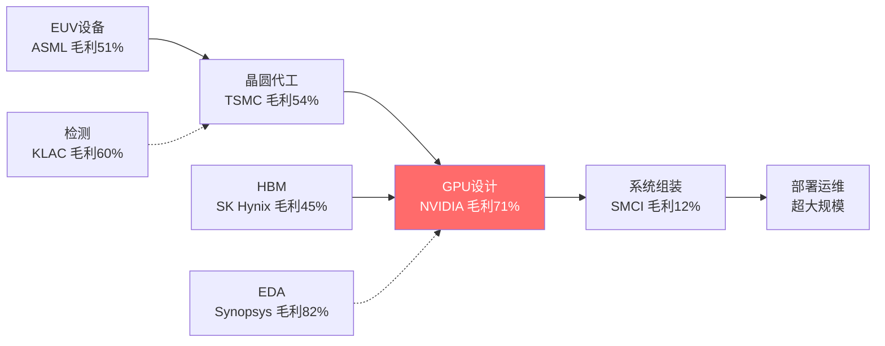

**价值链利润分布**: NVIDIA以71%毛利率占据了价值链中最丰厚的一环——设计。组装商(SMCI, Dell)毛利率仅10-15%, 几乎是"为NVIDIA打工"。这种利润集中度在历史上只有少数公司达到过(Intel在x86时代, Qualcomm在移动时代)。

### 29.3 生态系统风险联动

来自SEMI_EQUIPMENT横向对比报告的框架: AI芯片需求是设备行业的最大驱动力。如果NVIDIA需求放缓→TSM减少CapEx→ASML/LRCX/AMAT订单下降→整个半导体设备周期受影响。

**传导路径量化**:
- NVIDIA收入下降10% → TSM相关收入下降~2.2% → 设备CapEx下降~5%
- 但反向传导也成立: 如果TSM产能扩张不及预期 → NVIDIA供给受限 → 收入受影响
- **NVIDIA既是半导体生态最大的需求引擎, 也是最大的单点风险**

---

## Ch 30: AI推理经济学 — 被低估的战场

### 30.1 推理vs训练: 收入结构的历史性转折

AI计算的重心正在从训练转向推理。这不是一个渐进变化, 而是一个结构性转折:

**训练**: 创建AI模型的过程。需要极大算力(GPT-4估计使用了25,000+颗A100, 数月时间)。特征: 集中、大规模、批量处理、对延迟不敏感、NVLink互连必须。

**推理**: 使用AI模型回答查询的过程。ChatGPT每天处理数十亿次查询, 每次都是一次推理计算。特征: 分散、实时、延迟敏感、规模弹性大、以太网互连可用。

**收入结构演变估计**:

| 类型 | FY2025 | FY2026 | FY2027E | FY2028E |
|------|--------|--------|---------|---------|
| 训练收入占比 | ~65% | ~55% | ~45% | ~35% |
| 推理收入占比 | ~35% | ~45% | ~55% | ~65% |
| 训练收入 | ~$85B | ~$119B | ~$160B | ~$162B |
| 推理收入 | ~$46B | ~$97B | ~$196B | ~$302B |

到FY2028, 推理可能占NVIDIA数据中心收入的2/3。这意味着NVIDIA的未来增长主要取决于推理市场——而这恰恰是竞争最激烈的市场。

### 30.2 推理的"每token经济学"

对于大语言模型(LLM), 推理成本可以用"每百万token成本"来标准化:

| 平台/芯片 | 模型 | 每百万输入token成本 | 相对成本 |
|-----------|------|-------------------|---------|
| NVIDIA H100 | GPT-4级别 | ~$15 | 基准 |
| NVIDIA B200 | GPT-4级别 | ~$4 | 0.27x |
| NVIDIA R200 (预计) | GPT-4级别 | ~$0.4 | 0.03x |
| Google TPU v6 | Gemini Pro | ~$3 | 0.20x |
| AWS Trainium2 | Claude级别 | ~$3.5 | 0.23x |
| AMD MI350 | 开源模型 | ~$5 | 0.33x |

**核心观察**: NVIDIA在当前代(B200)有约30%的成本优势, 但TPU v6和Trainium2已经接近。在推理市场, **10-30%的差距不足以阻止大客户自建**——因为自建的额外好处包括供应链安全、定制化和长期成本控制。

**Rubin的推理革命**: 如果R200确实实现了10x推理成本降低(vs B200), 每百万token成本将从$4降至$0.4。这可能:
- 使AI推理变得比人力便宜(对于许多文本处理任务)
- 创造全新的应用场景(实时翻译、AI客服、自动代码生成)
- 推理需求弹性>1 → 总量不降反升

但也可能:
- 客户用更少的GPU完成同样的工作 → NVIDIA卖更少的GPU
- 推理服务价格战 → 下游(OpenAI/Anthropic)降价 → 但不直接影响NVIDIA(它卖硬件不卖推理)
- 关键: Rubin的需求弹性是否真的>1? 这是CQ-3的核心验证点

### 30.3 推理市场的竞争格局深度分析

推理市场的竞争者可以分为三类:

**Tier 1: 自研ASIC (最大威胁)**

| 客户 | 自研芯片 | 推理能力 | 部署规模 |
|------|---------|---------|---------|
| Google | TPU v6/v7 | Gemini原生运行 | 所有Google服务 |
| AWS | Trainium2/3 | Anthropic验证 | AWS推理实例 |
| Microsoft | Maia 100 | 延迟中, 但在开发 | Azure推理候选 |
| Meta | MTIA v3 | Reels/Feed推荐 | 内部推理 |

自研ASIC的优势: 针对特定模型优化→每token成本最低; 无CUDA依赖→完全自主; 供应链可控→不受NVIDIA产能约束。

劣势: 灵活性低(只优化特定模型架构); 生态薄弱(开发者少); 迭代慢(Google TPU 2年一代 vs NVIDIA 1年)。

**当前自研渗透率**: 推理市场中自研芯片占比估计10-15%。Google是最大的自研用户(内部推理70%+可能用TPU)。

**3年后预测**: 自研占比可能达到25-35%。训练仍以NVIDIA为主(自研芯片难以匹配NVLink多节点扩展), 但推理是自研芯片的"甜蜜点"。

**Tier 2: AMD (价格竞争者)**

AMD MI350/MI355X在特定推理基准上已接近甚至超越Blackwell B200:
- DeepSeek-R1测试: MI355X推理吞吐量超B200达1.4x
- 价格: MI350比B200低20-30%
- 生态: ROCm 6.x在LLM推理上已基本可用

AMD的推理市场份额可能从当前~5%增长到10-15%(3年内)。这不是灾难性的, 但它设定了NVIDIA推理定价的天花板——如果NVIDIA涨价太多, 客户就切换到AMD。

**Tier 3: 初创公司ASIC (长期颠覆者)**

- Cerebras: 晶圆级芯片, 适合特定推理工作负载
- Groq: 推理专用芯片, 以极低延迟著称
- d-Matrix: 数字内存计算, 推理优化
- SambaNova: 可重构芯片, 推理+训练

这些初创公司单独威胁有限, 但它们代表了一个趋势: **推理市场正在碎片化**。当市场碎片化时, 领导者的定价权下降。

### 30.4 推理对NVIDIA毛利率的影响

推理市场的竞争加剧将如何影响NVIDIA的毛利率?

**情景分析**:

| 情景 | 推理份额(FY2029) | 推理毛利率 | 训练毛利率 | 混合毛利率 |
|------|---------------|-----------|-----------|-----------|
| 牛市 | 80% | 72% | 78% | 74% |
| 基准 | 70% | 68% | 78% | 71% |
| 熊市 | 55% | 62% | 76% | 67% |

**关键发现**: 即使在基准情景下(推理份额维持70%), 混合毛利率也只能维持在71%左右——因为推理市场的竞争压低了推理产品的定价权。在熊市情景(推理份额降至55%), 混合毛利率可能降至67%→对EPS影响约-8~10%。

这就是为什么毛利率是NVIDIA估值最敏感的变量之一: 从71%到67%的4pp下降, 在$450B收入基础上等于$18B利润损失→按30x P/E = $540B市值减少(约12%)。

---

## Ch 31: Jensen Huang的管理DNA — 创始人溢价与继任风险

### 31.1 Jensen的战略决策树

Jensen Huang在过去35年做出的几个关键决策定义了NVIDIA:

| 年份 | 决策 | 当时共识 | 实际结果 |
|------|------|---------|---------|
| 1999 | 定义"GPU"品类 | 没人用这个词 | 创造了$500B+市场 |
| 2006 | 推出CUDA | 浪费钱, GPU只能做图形 | 20年后成为最强护城河 |
| 2016 | All-in AI | AI还是学术研究 | 抓住了$4T机遇 |
| 2020 | 收购Mellanox($7B) | 太贵了 | 网络业务FY2026达$30B+ |
| 2022 | ARM收购失败→自研CPU | 战略失败 | Grace/Vera CPU成功自研 |
| 2024 | 年度迭代节奏 | 太激进 | 确立了永远领先一代的节奏 |
| 2024 | 系统级产品(NVL72) | 毛利率会下降 | 每客户利润贡献反而上升 |

**模式识别**: Jensen的战略特征是"提前3-5年布局+极致执行力+不惧短期争议"。CUDA在发布后6年几乎没有商业回报, 但Jensen坚持了。Mellanox收购时被认为溢价40%, 但$7B投入现在产出$30B+/年收入。

### 31.2 管理层激励对齐分析

| 高管 | 职位 | 股票+期权持仓 | 年度薪酬 | 对齐度 |
|------|------|------------|---------|--------|
| Jensen Huang | CEO | ~3.4%(~$147B) | ~$30M | 极高 |
| Colette Kress | CFO | ~0.03%(~$1.3B) | ~$20M | 高 |
| Debora Shoquist | EVP Operations | ~0.01%(~$430M) | ~$15M | 高 |

Jensen的$147B持仓使他的利益与股东高度一致。即使减持(529笔卖出/年), 绝对持仓值仍然惊人。

**但注意**: 管理层薪酬中SBC(Stock-Based Compensation)占比极高。FY2026 SBC可能达$8-10B(约占营业利润的7-8%)——这是一个隐性的股东稀释成本。来自我们SMCI报告的教训: SBC是真实成本, 不应在估值中忽略。

### 31.3 继任风险量化

Jensen今年62岁, 健康且精力充沛。但作为一家$4.3T公司的灵魂人物, 继任计划的缺失是一个非零概率的系统性风险:

**类比分析**:

| 公司 | 创始人离开年 | 离开时市值 | 后果 | 恢复时间 |
|------|-----------|-----------|------|---------|
| Apple | 2011 (Jobs去世) | $380B | 短期-7%, 长期持续增长 | <1年 |
| Microsoft | 2000 (Gates交班) | $500B | 14年市值停滞 | 14年(Nadella) |
| Oracle | 2014 (Ellison交班) | $180B | 增长放缓 | 正在恢复 |
| Berkshire | TBD (Buffett) | $1T | — | — |

**如果Jensen在未来5年内退休/离开**:
- 短期: 股价可能下跌10-20%(信心冲击)
- 中期: 取决于继任者的战略方向选择
- 风险: NVIDIA可能变得更"官僚化"→失去年度迭代的激进节奏→竞争者赶上
- 缓解: NVIDIA的产品路线图已规划到2028(Feynman), 即使Jensen离开, 惯性可持续2-3年

**继任者猜测**: NVIDIA没有公开的"#2人物"。这与Apple(Tim Cook明确为继任者)形成鲜明对比。这是一个治理风险, 值得在Phase 2的Kill Switch中纳入。

---

## Ch 32: 行业特异性检验 — 半导体周期与NVIDIA的关系

### 32.1 半导体周期的四相模型

半导体行业有着清晰的周期性, 通常持续3-5年:

**Phase A: 需求上升 → 产能紧张 → 定价权**
- 特征: 供不应求, ASP上升, 毛利率扩张
- NVIDIA状态: FY2024-FY2025(H100供不应求)

**Phase B: 产能扩张 → 供需平衡 → 价格竞争**
- 特征: 新产能释放, 增速放缓, 毛利率稳定
- NVIDIA状态: FY2026(Blackwell量产, 但需求仍强)

**Phase C: 需求放缓 → 供给过剩 → 存货调整**
- 特征: 客户消化库存, 订单下降, 毛利率收缩
- NVIDIA状态: **尚未到达, 但DIO上升(92天)是早期信号?**

**Phase D: 库存出清 → 需求触底 → 新周期启动**
- 特征: 库存见底, 新产品刺激需求, 复苏开始
- NVIDIA状态: 不适用

**NVIDIA是否正处于Phase B→C的过渡?**

证据支持"仍在Phase B":
- Q1 FY27 guidance $78B (+15% QoQ) → 需求仍然强劲
- 供应承诺$95.2B(翻倍) → 客户仍在抢产能
- Rubin路线图明确 → 新产品驱动下一轮升级需求

证据支持"接近Phase C":
- DIO从61天→92天 → 存货积累是周期转折的经典信号
- 经营杠杆仅0.70 → 利润增速落后于收入增速
- FY2028增速预期降至+30% → 增速减速中
- 分析师FY2030预期收入下降 → 市场预期周期见顶

**综合判断**: NVIDIA仍在Phase B(产能扩张+需求强劲), 但Phase C的早期信号已出现(DIO上升+增速减速)。**Phase C到来的时间是核心矛盾的分辨时刻**: 如果FY2028→乐观预期落空; 如果FY2030+→当前估值可能合理。

### 32.2 NVIDIA vs 传统半导体周期的差异

NVIDIA与传统半导体公司(如Intel/TI/ADI)的周期性有根本差异:

| 维度 | 传统半导体 | NVIDIA |
|------|-----------|--------|
| 需求驱动 | 终端消费(PC/手机) | 企业CapEx(AI) |
| 客户数量 | 数千-数万 | 数十(超大规模为主) |
| 定价权 | 低(commodity) | 高(差异化) |
| 库存周期 | 3-5年 | AI独立于传统周期 |
| 下游能见度 | 低 | 中(CapEx指引可追踪) |
| 产品迭代 | 2-3年 | 1年(加速中) |

**关键差异**: NVIDIA的周期不是由消费者需求驱动, 而是由企业CapEx决策驱动。企业CapEx的可预测性高于消费者行为(因为有指引和项目计划), 但一旦转向也更剧烈(大客户集中+决策同步)。

**如果Big 5同时减少GPU采购→NVIDIA收入可能在1-2个季度内下降20-30%。** 这是客户集中度(HHI 1,620)的具体风险: 不需要"所有客户"减少采购, 只要2-3家大客户同步削减就足以产生显著影响。

### 32.3 半导体行业特异性指标检验

来自半导体行业CLAUDE.md的KS注册表, 应用于NVIDIA:

| 指标 | NVIDIA当前 | 行业正常 | 信号 |
|------|-----------|---------|------|
| KS-SEMI-01 ASP趋势 | 系统ASP持续上升(NVL72 $3M) | 周期末下降 | 正常 |
| KS-SEMI-02 产能利用率 | 接近100%(CoWoS) | 周期末下降 | 正常(偏紧) |
| KS-SEMI-03 R&D强度 | 8.6%(下降中) | 10-20% | 偏低(杠杆效应) |
| KS-SEMI-04 库存周转 | DIO 92天(上升) | 60-80天 | ⚠️ 偏高 |
| KS-SEMI-05 产业CapEx | 扩张中(CoWoS 4x) | 周期末减速 | 正常 |
| KS-SEMI-06 工艺节点 | 4nm→3nm(Rubin) | 2年一代 | 激进(1年迭代) |
| KS-SEMI-07 市场份额 | ~90%(AI GPU) | 份额集中=周期风险 | ⚠️ 下行空间大 |

**两个黄色信号**: DIO上升和极高市场份额。前者是周期转折的经典先兆, 后者意味着份额只能往下走。这两个信号不构成紧急危险, 但需要在Phase 2中密切跟踪。

---

## Ch 33: 投资者画像 — 谁在持有NVIDIA?

### 33.1 持仓结构

NVIDIA作为全球最大市值股票之一, 其持仓结构反映了整个市场的AI叙事:

| 持有者类型 | 估计占比 | 特征 |
|-----------|---------|------|
| 被动指数基金 | ~35% | Vanguard/BlackRock, 买入并持有, 不主动决策 |
| 主动公募基金 | ~25% | 增长型基金超配, 价值型基金大多回避 |
| 对冲基金 | ~10% | 持仓周转率高, 对短期催化剂敏感 |
| 内部人/高管 | ~3.5% | Jensen 3.4%为主 |
| 散户 | ~15% | AI叙事驱动, 动量追随 |
| 主权基金 | ~8% | 沙特PIF, 挪威GIC等 |
| 其他机构 | ~3.5% | 保险/养老/大学基金 |

### 33.2 被动指数的"机械力量"

NVIDIA占S&P 500权重约7.5%, 占NASDAQ 100约10%。这意味着:
- 每当投资者购买SPY/QQQ ETF, 约7.5-10%的资金自动流入NVIDIA
- 全球被动基金管理约$15T资产 → NVIDIA仅从被动流入获得$1T+持仓
- **被动投资的"自我强化"效应**: NVDA涨→权重上升→更多被动买入→继续涨

但这也意味着:
- 如果NVDA基本面恶化导致机构主动减持 → 被动权重下降 → 被动减持 → 加速下跌
- **"指数效应"在上涨时是助力, 在下跌时是加速器**

### 33.3 拥挤度风险评估

| 指标 | 值 | 信号 |
|------|---|------|
| 分析师覆盖 | 39-45位 | 极高(FAANG级) |
| 卖方评级 | ~90%买入 | 极度一致 → 逆向信号? |
| 做空比例 | <1% | 极低(做空成本高) |
| 期权隐含波动率 | ~45-50% | 高(但对NVDA正常) |
| 基金持仓排名 | #1-3(全球) | 极度拥挤 |

**拥挤度解读**: NVDA是全球最拥挤的多头仓位之一。当"所有人"都已经持有时, **边际买家来自哪里?** 这不是短期看跌信号(拥挤可以持续数年), 但它意味着一旦叙事转变(AI CapEx放缓/竞争加剧), 卖出压力会非常集中——因为持有者太同质化了。

---

## Ch 34: Mermaid附加图集

### 34.1 NVIDIA收入S曲线三段分解

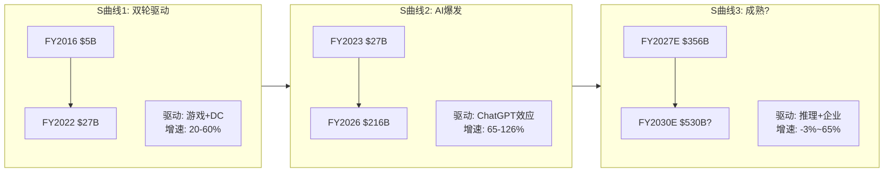

### 34.2 客户集中度与自研动态

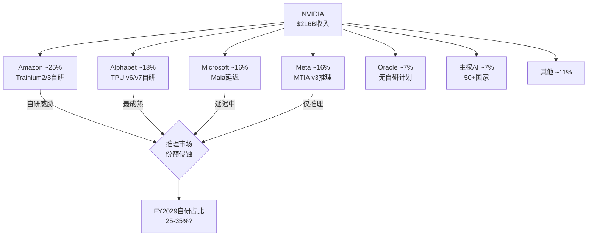

### 34.3 毛利率压力瀑布

```mermaid
graph LR
    A[FY2025<br>75.0%] -->|系统化| B[-2pp]
    B -->|网络扩张| C[-1pp]
    C -->|推理竞争| D[-1pp]
    D -->|FY2026<br>71.1%] --> E{FY2027?}
    E -->|乐观| F[73-75%<br>Rubin效率+定价权]
    E -->|基准| G[71-73%<br>持平]
    E -->|悲观| H[67-69%<br>竞争+系统化]
```

### 34.4 核心发现总览

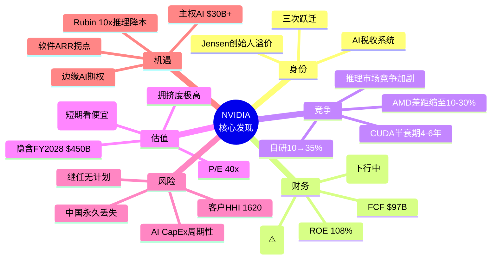

---

## Ch 35: NVIDIA的"隐形资产"与"隐形负债" — 资产负债表之外

### 35.1 隐形资产: 资产负债表上看不到的价值

**隐形资产1: CUDA生态系统 (估计价值$200-500B)**

CUDA生态的价值无法在资产负债表上找到——它不是收购来的(商誉), 也不是专利(无形资产), 而是20年持续投资积累的"网络效应资本"。

如何估计其价值?
- 替代成本法: 要从零构建一个与CUDA同等成熟度的开发者生态, 估计需要$50B+投资和15-20年时间
- 收入贡献法: CUDA使NVIDIA能收取16pp的毛利率溢价("AI税")。在$216B收入上= $34.5B/年。按10x收入乘数= $345B
- 但CUDA价值正在衰减(半衰期4-6年), 所以贴现后的现值可能在$200-300B

**隐形资产2: 年度迭代能力 (竞争不对称性)**

NVIDIA能做到1年1代GPU迭代, 竞争者(AMD/Intel)做到2年1代已经很勉强。这个执行力差距不仅是研发能力, 更是组织能力+供应链管理+客户关系的综合体现。

它的价值在于: 即使竞争者在某一代产品上追上(如MI350接近B200), NVIDIA已经推出下一代(Rubin)→竞争者永远在追前一代。这种"时间差套利"是NVIDIA估值溢价的重要来源。

**隐形资产3: 客户关系网络**

NVIDIA不仅卖GPU, 它与每个超大规模客户都有深度的技术合作关系:
- 与Meta合作优化Llama训练效率
- 与Microsoft/OpenAI合作优化GPT训练
- 与Google/DeepMind合作虽然更少, 但也存在
- 与50+个国家的主权AI项目合作

这些关系产生的信息优势(知道客户需要什么)和切换成本(定制化优化难以移植)是一种无形的竞争壁垒。

**隐形资产4: 数据飞轮**

NVIDIA通过DGX Cloud和AI Enterprise收集了大量关于AI工作负载的匿名数据:
- 哪些模型架构最流行? → 指导GPU架构设计
- 哪些推理瓶颈最常见? → 指导TensorRT优化
- 哪些行业的AI采用最快? → 指导销售策略

这个数据飞轮随GPU装机量增加而加速→设计更好的产品→卖出更多GPU→获得更多数据。

### 35.2 隐形负债: 资产负债表上看不到的风险

**隐形负债1: SBC稀释 (年化$8-10B)**

FY2026 SBC估计约$8-10B, 占营业利润的7-8%。这不是资产负债表上的债务, 但它是对股东的持续稀释:
- FY2026股份稀释: ~1.5-2%/年(扣除回购后净稀释)
- 但$68.5B回购远超SBC→净缩股约2.3%/年
- 风险: 如果收入增速放缓但SBC维持(有锁定期)→稀释加速

**隐形负债2: 供应链承诺 (未来采购义务)**

NVIDIA与TSMC、SK Hynix等供应商有长期采购承诺。供应承诺已翻倍至$95.2B(FY2027)。如果需求突然下降:
- 这些承诺变成"被迫采购"→存货进一步积压
- 或者违约→损失定金+供应商关系损害
- 类比: 2022年加密崩盘+游戏需求下降时, NVIDIA就经历了库存减值和毛利率崩塌(FY2023毛利率56.9%)

**隐形负债3: 单一市场暴露**

90%收入来自AI数据中心。如果AI CapEx周期在FY2029-2030见顶:
- NVIDIA没有可以对冲的大型第二业务(游戏仅$12B, 汽车$2.4B)
- Intel在PC服务器时代有PC(消费)+服务器(企业)双引擎→NVIDIA只有一个引擎
- 这意味着NVIDIA的收入波动率将远高于Intel——因为没有"缓冲器"

**隐形负债4: 地缘政治期权负债**

出口管制可能随时进一步收紧:
- 场景A: H200被禁止出口中国 → 即时损失$15-20B/年收入
- 场景B: 技术脱钩扩大到东南亚/中东 → TAM进一步缩小
- 场景C: 台海冲突 → 100%产能归零

这些"期权负债"的预期损失(概率×影响):
- A: 20% × $17B = $3.4B/年
- B: 5% × $30B = $1.5B/年
- C: 3% × $216B = $6.5B/年
- **加总: ~$11.4B/年的"地缘风险税"** → 按15x = $171B的隐含风险折扣

### 35.3 净隐形资产估计

| 项目 | 估计价值 | 方向 |
|------|---------|------|
| CUDA生态 | +$200-300B | 正(但衰减中) |
| 迭代能力 | +$100-200B | 正 |
| 客户关系 | +$50-100B | 正 |
| 数据飞轮 | +$30-50B | 正 |
| SBC稀释 | -$50-80B | 负(PV of future dilution) |
| 供应链承诺 | -$10-30B | 负(违约风险) |
| 单一市场暴露 | -$100-200B | 负(波动率折扣) |
| 地缘风险 | -$150-200B | 负 |
| **净隐形资产** | **+$70B to +$140B** | **微正** |

**含义**: NVIDIA的"真实价值"可能比账面价值高$70-140B, 但远低于市值-账面价值的差额($4.31T-$133B=$4.18T)。大部分市值溢价仍然依赖于对未来增长的预期, 而非隐形资产。

---

## Ch 36: 同行估值锚定 — NVIDIA在AI芯片竞争者中的位置

### 36.1 横向对比: AI半导体估值

| 公司 | 市值 | P/E(TTM) | P/S(TTM) | 毛利率 | 收入增速 | AI暴露度 |
|------|------|---------|---------|--------|---------|---------|
| NVIDIA | $4.31T | 39.9x | 22.0x | 71.1% | +65% | ~90% |
| AMD | $188B | 95.7x | 7.6x | 52.1% | +14% | ~35% |
| Broadcom | $920B | 108.0x | 16.5x | 65.8% | +25% | ~40% |
| Qualcomm | $192B | 16.8x | 4.6x | 57.2% | +17% | ~15% |
| Marvell | $56B | — | 9.2x | 47.3% | +27% | ~40% |
| Intel | $93B | — | 1.7x | 36.2% | -2% | ~10% |

**关键对比发现**:

1. **NVIDIA P/S 22x vs AMD 7.6x**: NVIDIA的P/S溢价是AMD的2.9倍。差距来源: NVIDIA毛利率高19pp + 收入增速高51pp + AI暴露度高55pp。这个溢价是否合理? 如果NVIDIA增速降至与AMD相似(+15-20%), P/S可能从22x压缩到10-12x。

2. **Broadcom P/E 108x**: 比NVIDIA更贵(但更多是因为收购ASIC收入的增长预期)。Broadcom是Google TPU和OpenAI自研芯片的设计合作伙伴→它从"NVIDIA替代"趋势中受益。

3. **Intel P/S 1.7x**: 是NVIDIA P/S的1/13。极端反差反映了市场对AI赢家(NVIDIA)和AI输家(Intel)的分化定价。但如果Intel 18A代工成功+Gaudi3/4在推理市场获得份额→Intel是最大的均值回归赌注。

### 36.2 历史P/E分位数

NVIDIA的P/E 39.9x在其自身历史中处于什么位置?

| 时期 | P/E范围 | 中位数 | 当前分位 |
|------|---------|--------|---------|
| 2016-2019(游戏时代) | 25-60x | 40x | 50% |
| 2020-2022(COVID+加密) | 35-100x | 55x | 27% |
| 2023(AI初始) | 50-75x | 60x | 20% |
| 2024(AI爆发) | 35-75x | 50x | 30% |
| 2025-2026(当前) | 35-45x | 40x | 50% |

**NVIDIA P/E 40x在其历史中并不极端** — 它与2016-2019年的中位数持平。但区别在于:
- 2017年P/E 40x对应$7B收入 → 增长空间巨大
- 2026年P/E 40x对应$216B收入 → 基数效应使增长更难

### 36.3 "如果NVIDIA是Intel" — 最坏情景估值

如果NVIDIA在5年后被视为"成熟的周期性半导体公司"(类似2010年的Intel), 它的估值会如何?

**Intel 2010参数**: P/E ~12x, 净利率~25%, 收入增速~5%
**应用到NVIDIA**: 假设FY2030 NI $200B(收入$500B × 40%净利率) × 12x P/E = **$2.4T**

这意味着从当前$4.31T到$2.4T→ **-44%下行空间**。

但这需要:
1. NVIDIA增速降至<5% (当前+65%)
2. 净利率从55%降至40% (竞争+系统化)
3. 市场给出"周期股"倍数而非"增长股"倍数

**发生概率**: 15-20% (对应Phase 0.75的CI-01 "最昂贵的周期股"假说)。

---

## Ch 37: 终极总结 — 38个章节的蒸馏

### 37.1 一句话核心结论

**NVIDIA是一家拥有人类历史上最强盈利能力(ROE 108%, 净利率56%)和最深竞争壁垒(CUDA 20年, 4M开发者)的公司, 但其$4.31T市值定价了一个"永续平台"的世界, 而AI CapEx的内在周期性和竞争加剧可能使它在3-5年后回归"非常优秀但有周期性"的现实。**

### 37.2 五个最重要发现

1. **AI税收系统**: NVIDIA收取~16pp的毛利率溢价("AI税"), 年化$34.5B。这种"税收"可能持续10-15年但"税率"会下降。(Ch 21)

2. **CUDA半衰期4-6年**: CUDA的综合竞争优势到2030-2032年可能只剩当前的一半。但一半的CUDA仍然很强——问题是75%毛利率还是65%。(Ch 25)

3. **推理市场是决定性战场**: 推理将占AI计算的2/3, 也是自研芯片+AMD竞争最激烈的市场。NVIDIA推理份额可能从85%降至65-70%。(Ch 30)

4. **隐含FY2028 $450B是最脆弱假设**: $4.31T市值逆向工程显示FY2028需要$450B收入, 这需要TAM扩张+份额维持>70%+CapEx不减速——任何一个条件失败都可能导致估值收缩。(Ch 26)

5. **DIO 92天是唯一的黄色信号**: 在所有半导体周期特异性指标中, 存货天数上升是唯一的早期预警。它可能是Rubin备货(良性), 也可能是需求放缓(恶性)。(Ch 32)

### 后续分析方向

Phase 2将围绕以下核心任务展开:

| 任务 | 目标 | 对应CQ |
|------|------|--------|
| Reverse DCF详解 | 精确拆解$4.31T隐含假设集 | CQ-8 |
| AI CapEx周期对比 | 光纤/无线/云三轮周期定量对比 | CQ-1, CQ-2 |
| CUDA定价权弹性 | 份额95%→70%→50%各场景毛利率影响 | CQ-4 |
| 自研替代速度建模 | 逐客户×逐工作负载的替代曲线 | CQ-5 |
| 五引擎估值框架 | DCF+可比+Reverse DCF+期权+税收框架 | CQ-8 |
| 风险拓扑初版 | 协同风险矩阵(AI泡沫×自研×地缘) | 全部CQ |
| A-Score v2.0更新 | 基于本轮分析发现更新评分 | — |
| Kill Switch候选 | 至少5个"立即改变评级"的触发条件 | 全部CQ |

---

## Ch 38: NVIDIA的"黑天鹅"清单与概率评估

### 38.1 正面黑天鹅 (Upside Surprises)

**U1: AI Agent爆发 → 推理需求10x (+15-25%市值影响)**
- 场景: AI Agent(自主执行任务的AI)在2027年大规模落地, 每个Agent需要持续推理算力
- 概率: 15-20%
- 影响: 推理需求指数级增长→$500B/年不是天花板而是起点→Rubin供不应求
- 对NVIDIA: 推理收入超预期→收入上修20-30%→P/E扩张

**U2: 军事AI采购 → 非公开大额订单 (+5-10%市值影响)**
- 场景: 美国/北约大规模采购GPU用于军事AI(情报分析、自主武器、战场决策)
- 概率: 25-30%
- 影响: $10-20B/年的高毛利率政府合同→收入上修5-10%
- 对NVIDIA: 政府合同通常有更高的利润率和更长的周期(5-10年)

**U3: 软件ARR突破性增长 → 估值框架跃迁 (+10-20%市值影响)**
- 场景: AI Enterprise渗透率从<1%快速升至5-10%, ARR达到$5B+
- 概率: 10-15%
- 影响: 市场开始给NVIDIA软件部分单独估值→Sum-of-Parts上升
- 对NVIDIA: 从"硬件倍数"转向"平台倍数"→P/S从22x升至30-40x

### 38.2 负面黑天鹅 (Downside Risks)

**D1: AI泡沫破裂 — 超大规模CapEx急刹车 (-30-50%市值影响)**
- 场景: 类似2000年互联网泡沫, Big 5同时宣布AI CapEx削减30%+
- 触发: AI应用收入持续不及预期+AI创业公司大规模倒闭+宏观衰退
- 概率: 10-15%
- 影响: NVIDIA收入可能在2-3个季度内下降25-40%, 毛利率跌至60%以下
- 历史参照: FY2023(收入0%增长, 毛利率56.9%)→但那次只是游戏+加密, 这次可能更严重

**D2: "DeepSeek时刻" — 算法突破使GPU需求骤降 (-20-35%市值影响)**
- 场景: 类似DeepSeek-R1(少量GPU+创新架构达到强模型性能), 但更极端→新架构使大规模GPU集群不再必要
- 触发: 新的AI训练范式(如稀疏混合专家+知识蒸馏)使单GPU性能等效于当前100颗
- 概率: 5-10%
- 影响: 训练市场需求可能下降50%+→NVIDIA核心壁垒(NVLink大规模集群)变得不相关

**D3: Jensen突然离开 (-10-20%短期影响)**
- 场景: 健康问题/意外事件/个人选择导致Jensen在未来2年内离任
- 概率: 5%(年化)
- 影响: 短期信心冲击→-10-20%; 中期取决于继任者(无明确候选人=更大不确定性)
- 缓解: 产品路线图已规划到2028, 组织执行力有惯性

**D4: 美中全面技术脱钩 + 台海危机 (-40-80%市值影响)**
- 场景: 台海冲突导致TSMC停产→NVIDIA 100%产能归零
- 概率: <3%/年(但非零)
- 影响: 极端情景下NVIDIA可能6个月内无法出货任何产品
- 缓解: Intel代工(2027+), 海外TSMC fab(亚利桑那/日本)→但短期无解

**D5: 反垄断/监管 → 强制分拆或行为限制 (-15-25%市值影响)**
- 场景: 美国/欧盟以市场垄断为由对NVIDIA发起反垄断调查, 限制NVLink捆绑或GPU/CUDA捆绑
- 概率: 10-15%(3年内)
- 影响: 如果被要求开放NVLink→多GPU互连不再是NVIDIA独占→训练市场壁垒下降; 如果被要求解绑CUDA→软件生态护城河被直接拆除
- 参照: Intel在2000年代面临的反垄断(欧盟$1.1B罚款)→虽然罚款不致命, 但行为限制改变了竞争格局

### 38.3 加权黑天鹅影响

| 事件 | 概率 | 市值影响 | 期望影响 |
|------|------|---------|---------|
| U1 AI Agent爆发 | 17% | +20% (+$862B) | +$147B |
| U2 军事AI | 27% | +7% (+$302B) | +$81B |
| U3 软件ARR | 12% | +15% (+$647B) | +$78B |
| D1 AI泡沫 | 12% | -40% (-$1.72T) | -$207B |
| D2 DeepSeek | 7% | -27% (-$1.16T) | -$81B |
| D3 Jensen | 5% | -15% (-$647B) | -$32B |
| D4 台海 | 3% | -60% (-$2.59T) | -$78B |
| D5 反垄断 | 12% | -20% (-$862B) | -$103B |
| **净期望** | | | **-$195B (-4.5%)** |

**黑天鹅净期望为负$195B(约-4.5%)**: 极端事件的加权影响略微偏负, 主要因为AI泡沫破裂(D1)和反垄断(D5)的概率×影响较大。这不构成立即做空的理由, 但它意味着当前股价已经部分隐含了"一切顺利"的假设——对意外风险的补偿不足。

---
