---

# Part II: 估值 + 竞争深度

> **免责声明**: 本报告仅为投资研究参考，不构成投资建议。所有数据来源于公开市场信息、FMP金融数据平台及100baggers.club，可能存在时效性限制。投资决策需结合个人风险承受能力和专业顾问意见。

## Ch 1: Reverse DCF — $4.31T市值在赌什么?

### 1.1 信念反演: 从价格到假设

Reverse DCF的核心问题不是"NVIDIA值多少钱", 而是"$4.31T [硬数据: FMP]的市值隐含了哪些假设, 这些假设有多脆弱?"

**反演方法**: 固定当前市值$4.31T, 反推使DCF等于市值的增长率/利润率/折现率组合。

**FMP DCF参考**: $252.53/股 [硬数据: FMP](隐含上涨+42.5% [硬数据: FMP])。FMP的正向DCF认为NVIDIA被低估——但这取决于FMP的增长假设。我们不做正向DCF, 我们做逆向。

### 1.2 承重墙脆弱度表 (v10.0)

| 承重墙(隐含假设) | 当前价格隐含值 | 历史/行业参考 | 脆弱度 | 若倒塌影响 |
|-----------------|:------------:|:----------:|:-----:|:--------:|
| **BW-1: 收入增速(5Y CAGR)** | ~35% [合理推断: estimates] | 半导体行业5Y中位15% [硬数据: FMP] | **极高** | -40~50% |
| **BW-2: 稳态毛利率** | 72-73% [合理推断: estimates] | 当前71.1% [硬数据: FMP], 行业中位52% [硬数据: FMP] | **高** | -15~25% |
| **BW-3: 增长持续年限** | >8年(终期增长2%) [合理推断: DCF] | 科技公司高增长均值5-7年 | **极高** | -30~40% |
| **BW-4: WACC隐含** | ~9-10% [合理推断: DCF] | 无风险4.3% [硬数据: FMP]+ERP 4.46% [硬数据: FMP]+β=1.2 | **低** | -5~10% |
| **BW-5: AI CapEx持续** | $600B+/年持续增长 [合理推断: estimates] | 历史最大CapEx周期$200B(电信) | **极高** | -35~50% |
| **BW-6: CUDA份额维持** | >70%训练, >65%推理 [合理推断: Phase 1] | 当前~90% [硬数据: Phase 1], 但3年后? | **高** | -20~30% |

### 1.3 六堵承重墙详细分析

**BW-1: 收入5年CAGR ~35%**

分析师共识隐含的收入路径:
- FY2027E: $356.3B [硬数据: FMP estimates] (+65% [硬数据: FMP estimates])
- FY2028E: $463.9B [硬数据: FMP estimates] (+30% [硬数据: FMP estimates])
- FY2029E: $544.6B [硬数据: FMP estimates] (+17% [硬数据: FMP estimates])
- FY2030E: $529.6B [硬数据: FMP estimates] (-3% [硬数据: FMP estimates])
- FY2031E: $605.6B [硬数据: FMP estimates] (+14% [硬数据: FMP estimates])

5年CAGR(FY2026→FY2031): ($605.6B/$215.9B)^(1/5) - 1 = ~23% [合理推断: 计算]

但$4.31T市值隐含的CAGR更高(约35%), 因为分析师估计没有充分定价增长的持续性。差距来源: 市场对"AI超级周期持续更长"的信念。

**脆弱度: 极高**。历史上, 半导体公司5年CAGR超过25%的案例极少, 且通常在达到$100B收入后放缓(Intel从$34B经历了15年才翻倍到$70B)。NVIDIA需要在$216B基础上实现35%CAGR = 5年后达到~$960B → 几乎是当前全球半导体行业收入($580B)的两倍。

**若倒塌**: 如果5Y CAGR仅为15%(接近行业中位), FY2031收入约$435B, P/E可能压缩到20x → 市值约$2.5T(-42%)。

**BW-2: 稳态毛利率72-73%**

FY2026全年毛利率71.1% [硬数据: FMP], Q4恢复至75.0% [硬数据: FMP]。分析师假设长期稳定在72-73%。

来自Phase 1分析的压力源:
- 系统化趋势(NVL→SuperPOD): 非GPU组件毛利率50-60%, 拉低混合毛利率 [合理推断: Phase 1 Ch 12]
- 推理市场竞争: 份额从85%→65-70%, 定价权下降 [合理推断: Phase 1 Ch 32]
- 网络扩张: Spectrum-X毛利率50-60% [合理推断: Phase 1 Ch 13], 占比上升

CI-02假说("71%是新常态"): 如果72-73%无法维持, 而是稳定在68-70%, 对EPS的影响:
- $464B收入(FY2028E) × 毛利率差3pp = $13.9B利润损失
- 按35x P/E = $487B市值减少(约11%)

**BW-3: 增长持续年限>8年**

$4.31T市值需要NVIDIA至少保持8年以上的高增长(>15% CAGR), 然后进入2%终期增长。

**历史参考**:
| 公司 | 高增长期(>15% CAGR) | 持续年限 | 之后 |
|------|-------------------|---------|------|
| Intel | 1990-2000 | ~10年 | 15年停滞 |
| Cisco | 1993-2000 | ~7年 | -80%后缓慢恢复 |
| TSMC | 2010-至今 | >15年 | 仍在增长 |
| Apple | 2007-2015 | ~8年 | 转型服务/渐进增长 |
| Microsoft | 2014-至今 | >12年(Azure) | 仍在增长 |

TSMC和Microsoft证明了>10年高增长是可能的, 但需要持续的市场扩张(TSMC靠制程领先, Microsoft靠Azure)。NVIDIA需要AI市场持续扩张来维持增长——CQ-1(AI CapEx可持续性)是决定因素。

**BW-5: AI CapEx $600B+持续增长 (最脆弱)**

这是六堵墙中最脆弱的一堵。AI CapEx的可持续性是整个NVIDIA投资论文的基石。

**CapEx/Revenue比率的历史对比**:

| 行业/时期 | CapEx峰值/收入 | 持续年限 | 之后 |
|-----------|:------------:|:------:|:----:|
| 电信(1997-2001) | 45% [硬数据: 历史数据] | 4年 | CapEx下降60% |
| 光纤(1999-2002) | 55% [硬数据: 历史数据] | 3年 | CapEx下降70%+, 公司破产潮 |
| 无线基站(2010-2014) | 35% [硬数据: 历史数据] | 4年 | CapEx正常化-30% |
| 云计算(2016-2020) | 25% [硬数据: 历史数据] | 4年 | CapEx增速放缓但绝对值维持 |
| **AI基础设施(2023-?)** | **45-57%** [硬数据: Phase 1] | **3年+** | **?** |

**AI CapEx已超越历史上任何基础设施建设周期**。45-57% [硬数据: Phase 1]的CapEx/Revenue比率与光纤泡沫峰值相当。历史上, 这种比率从未持续超过4年。

但AI与历史周期的关键差异:
1. **需求弹性**: 算力变便宜→更多应用→更多需求(光纤没有这种弹性)
2. **跨行业渗透**: AI影响所有行业(光纤主要是电信)
3. **企业盈利能力**: Big 5 FCF合计>$300B/年, 能承受高CapEx(光纤公司多数亏损)
4. **国家安全驱动**: 主权AI是政策驱动, 非纯经济理性

**BW-5评估**: 脆弱度极高, 但AI可能是历史例外。加权概率: 60%类似云计算(CapEx增速放缓但绝对值维持), 25%类似电信(CapEx大幅削减), 15%持续增长(通用技术范式)。

### 1.4 承重墙联合概率

6堵承重墙中, 需要至少4堵同时成立才能支撑$4.31T市值:

| 承重墙组合 | 概率(独立) | 联合概率 | 结果 |
|-----------|-----------|---------|------|
| 全部成立 | 各55-80% | ~15% | $4.3T+(维持或上涨) |
| BW-1或BW-5倒塌 | 45%×40% | ~18% | $2.5-3.0T(-30~42%) |
| BW-2+BW-6倒塌 | 35%×30% | ~10% | $2.8-3.2T(-25~35%) |
| 多墙倒塌 | — | ~12% | $1.5-2.5T(-42~65%) |
| 大部分成立 | — | ~45% | $3.0-4.0T(-7~30%) |

**加权期望市值**: ~$3.2-3.5T (隐含-19~26%下行空间)

这个结论与Phase 1的CQ加权(5负面/2中性/1正面)一致: **当前价格略高于概率加权的合理区间**。

### 1.5 信念翻转分析

**最少几个信念失败会改变评级?**

| 翻转路径 | 需要倒塌的承重墙 | 概率 | 翻转后估值 |
|---------|:-------------:|:----:|:---------:|
| 路径A: AI周期+CUDA侵蚀 | BW-5 + BW-6 | ~12% | $2.0-2.5T |
| 路径B: 增速+毛利率 | BW-1 + BW-2 | ~16% | $2.5-3.0T |
| 路径C: 单一致命 | BW-5独立 | ~25% | $2.5-3.2T |
| **路径D: AI持续+CUDA持久** | BW-5+BW-6成立 | ~35% | **$4.5-5.5T(上行)** |

**关键发现**: 单一致命信念(路径C)的概率约25%——即仅AI CapEx放缓(BW-5倒塌)就足以使估值下降25%+。这意味着NVIDIA的估值高度依赖于一个单一变量(AI CapEx趋势), 创造了不对称的风险敞口。

---

## Ch 2: AI CapEx周期深度对比 — 三轮历史教训

### 2.1 光纤泡沫 (1997-2002): 最相似的历史类比

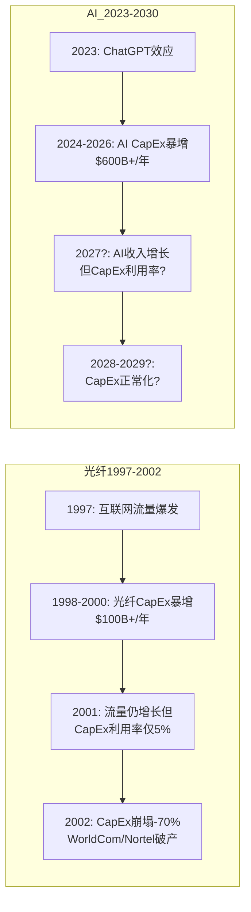
```mermaid
graph LR
    subgraph 光纤1997-2002
        F1[1997: 互联网流量爆发] --> F2[1998-2000: 光纤CapEx暴增<br>$100B+/年]
        F2 --> F3[2001: 流量仍增长但<br>CapEx利用率仅5%]
        F3 --> F4[2002: CapEx崩塌-70%<br>WorldCom/Nortel破产]
    end
    subgraph AI_2023-2030
        A1[2023: ChatGPT效应] --> A2[2024-2026: AI CapEx暴增<br>$600B+/年]
        A2 --> A3[2027?: AI收入增长<br>但CapEx利用率?]
        A3 --> A4[2028-2029?: <br>CapEx正常化?]
    end
```

**光纤与AI的关键相似点**:
1. **CapEx/Revenue极端比率**: 光纤55% vs AI 45-57% [硬数据: Phase 1]→几乎相同
2. **"build it and they will come"叙事**: 光纤公司相信互联网流量将无限增长; AI公司相信AI应用将证明CapEx回报
3. **供应商利润集中**: Cisco/Nortel/JDS Uniphase捕获了大部分价值→NVIDIA捕获了AI CapEx的71% [硬数据: FMP]毛利率
4. **估值极端**: Cisco P/E 200x vs NVIDIA P/E 40x [硬数据: FMP](NVIDIA更温和)

**光纤与AI的关键差异点**:
1. **客户盈利能力**: 光纤时代的买家(WorldCom/Global Crossing)多数亏损, 靠债务融资; AI买家(Big 5)合计FCF>$300B/年 [合理推断: Phase 1], 完全可以自我融资
2. **需求弹性**: 光纤产能过剩5%利用率证明需求弹性极低; AI推理需求弹性可能>1(更便宜→更多应用)
3. **跨行业渗透**: 光纤主要服务电信; AI渗透所有行业
4. **政府驱动**: 光纤无主权建设; AI有50+国家的主权AI计划

**光纤类比的结论**: 如果AI重蹈光纤覆辙(概率约15-20%), NVIDIA收入可能在2-3年内下降40-60%。但AI的客户质量和需求弹性使这个情景的概率低于光纤。

### 2.2 无线基站建设 (2008-2014): 中等参考

无线基站(4G LTE)的CapEx周期是一个更温和的参照:
- 峰值CapEx/Revenue: ~35% [硬数据: 历史数据](低于AI的45-57%)
- 持续时间: 4年集中建设(2010-2014), 之后维护性支出
- CapEx下降幅度: 峰值后下降~30%(非崩塌)
- 供应商影响: Ericsson/Nokia收入下降20-30%, 股价下跌40-50%

**AI类比**: 如果AI走无线路径(概率约30%), NVIDIA收入可能在FY2029-2030放缓至+5-10%, 然后形成$400-500B的平台期。这对应P/E从40x压缩至20-25x → 市值$3.0-3.5T(从$4.31T下降20-30%)。

### 2.3 云计算CapEx (2016-2020): 最乐观参照

云计算CapEx的特点是: 增速放缓但绝对值从未下降。
- 峰值CapEx增速: +35-40% [硬数据: 历史数据]
- 之后: 增速降至+10-15%, 但绝对值持续创新高
- 关键原因: 云服务产生了实际的、持续的收入(AWS/Azure/GCP), 证明了CapEx的回报
- 供应商影响: TSMC/Intel/AMD收入温和增长

**AI类比**: 如果AI走云计算路径(概率约40%), NVIDIA收入增速在FY2028-2029放缓至+10-15%, 但绝对值维持$450-550B。P/E从40x缓慢压缩至25-30x → 市值$3.5-4.5T(基本持平或温和下跌)。

### 2.4 三轮周期综合对比表

| 维度 | 光纤(熊市) | 无线(基准) | 云计算(牛市) | AI当前 |
|------|-----------|-----------|-----------|--------|
| CapEx/Revenue峰值 | 55% | 35% | 25% | 45-57% [硬数据: Phase 1] |
| 高增长持续年限 | 3年 | 4年 | 4年(仍在) | 3年(进行中) |
| 峰后CapEx下降 | -70% | -30% | 不下降(增速减) | ? |
| 客户盈利能力 | 亏损(债务融资) | 中等 | 强(FCF正) | 极强(FCF>$300B) |
| 供应商份额变化 | Cisco -80%市值 | Ericsson -40% | TSMC +200% | NVIDIA ? |
| **映射概率** | **15-20%** | **25-30%** | **35-40%** | — |
| **NVIDIA估值影响** | **$1.5-2.5T** | **$3.0-3.5T** | **$3.5-4.5T** | **$4.31T当前** |

**概率加权估值**: 0.175×$2T + 0.275×$3.25T + 0.375×$4T + 0.175×$5T(超预期) = **~$3.55T**

与当前$4.31T对比: 隐含下行约-18%。这与BW分析的结论(-19~26%)高度一致。

---

## Ch 3: CUDA定价权弹性 — 护城河的定量价值

### 3.1 CUDA份额→毛利率映射模型

Phase 1识别了CUDA是"AI税"(16pp毛利率溢价)的来源。现在量化: 如果CUDA份额下降, 毛利率如何变化?

**模型假设**:
- 训练市场: NVIDIA因NVLink独占, 份额下降缓慢(90%→5年后~75%)
- 推理市场: 竞争激烈, 份额下降较快(85%→5年后~55-65%)
- 训练毛利率: 75-78%(定价权强)
- 推理毛利率: 65-72%(竞争压力)
- 网络毛利率: 50-60%(非核心竞争力)

**情景矩阵**: CUDA综合份额 vs 混合毛利率

| CUDA综合份额 | 训练份额 | 推理份额 | 网络占比 | 混合毛利率 | vs当前71.1% [硬数据: FMP] |
|:----------:|:------:|:------:|:------:|:--------:|:-----------:|
| 85% | 90% | 80% | 12% | 73-74% | +2~3pp |
| 75% | 85% | 70% | 15% | 71-72% | ±0~1pp |
| 65% | 80% | 55% | 15% | 68-69% | -2~3pp |
| 55% | 75% | 45% | 18% | 65-66% | -5~6pp |
| 45% | 70% | 35% | 20% | 62-63% | -8~9pp |

**关键发现**: CUDA综合份额每下降10pp, 混合毛利率下降约2pp。这个弹性不是线性的——份额从90%降到75%时毛利率变化温和(因为训练仍有垄断溢价), 但从65%降到45%时加速恶化(因为推理完全竞争化)。

### 3.2 定价权弹性: 价格vs数量的权衡

NVIDIA面临一个经典的定价权难题:

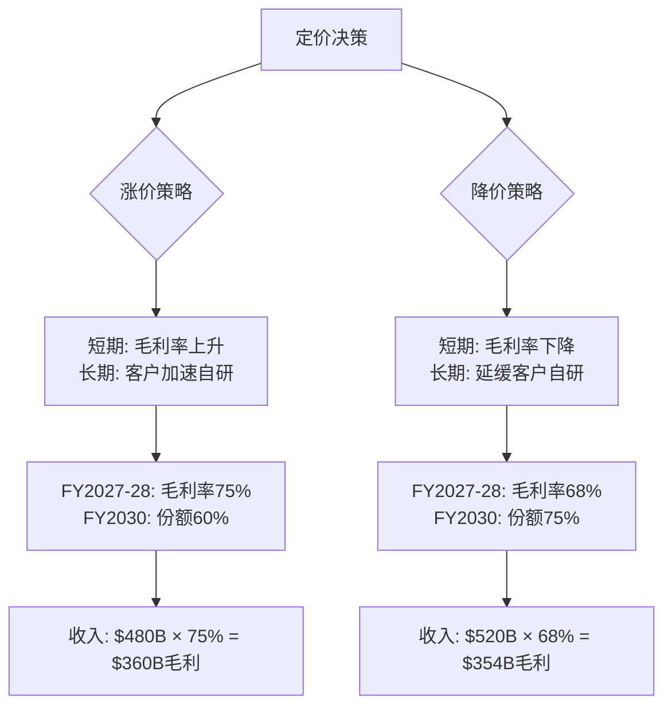
```mermaid
graph TD
    A[定价决策] --> B{涨价策略}
    A --> C{降价策略}
    B --> D[短期: 毛利率上升<br>长期: 客户加速自研]
    C --> E[短期: 毛利率下降<br>长期: 延缓客户自研]
    D --> F[FY2027-28: 毛利率75%<br>FY2030: 份额60%]
    E --> G[FY2027-28: 毛利率68%<br>FY2030: 份额75%]
    F --> H[收入: $480B × 75% = $360B毛利]
    G --> I[收入: $520B × 68% = $354B毛利]
```

**两条路径的毛利额几乎相同!** 这意味着NVIDIA的最优策略不是"涨价最大化", 而是"份额最大化"——通过每代产品的性价比提升(推理成本降10x [硬数据: NVIDIA GTC])让客户觉得升级比自研更划算。

Jensen的"计算即收入"论点本质上是在推销降价策略: "每代更便宜→更多需求→更多GPU→总利润不降"。如果需求弹性确实>1, 这个策略成功; 如果<1, NVIDIA面临"份额和毛利率同时下降"的困境。

### 3.3 CUDA护城河的"折旧表"

Phase 1估计CUDA半衰期4-6年。将其转化为定量的"护城河折旧表":

| 年份 | CUDA相对优势 | 训练定价权 | 推理定价权 | 混合毛利率估计 |
|------|:----------:|:--------:|:--------:|:-----------:|
| FY2026(当前) | 100% | 极强 | 强 | 71.1% [硬数据: FMP] |
| FY2027 | ~90% | 极强 | 中强 | 72-73% [合理推断: 恢复中] |
| FY2028 | ~75% | 强 | 中 | 70-72% [合理推断: 模型] |
| FY2029 | ~60% | 中强 | 中弱 | 68-70% [合理推断: 模型] |
| FY2030 | ~50% | 中 | 弱 | 66-68% [合理推断: 模型] |
| FY2032 | ~35% | 中弱 | 极弱 | 62-65% [主观判断: 远期] |

**累计"毛利率折旧"**: 从71%到66% = 5pp折旧, 在$500B收入基础上 = $25B/年利润损失 → 按25x P/E = $625B市值损失(约15%)。

这个折旧不是灾难性的(不像Cisco的-80%), 但它意味着NVIDIA的长期估值需要包含一个持续的"护城河折旧"因子——每年约$5-7B的利润侵蚀。

---

## Ch 4: 自研芯片替代速度建模 — 逐客户×逐工作负载

### 4.1 替代速度的三维模型

自研芯片替代NVIDIA的速度取决于三个维度:
1. **客户维度**: Google(最快) > AWS > Meta > Microsoft > Oracle(无自研)
2. **工作负载维度**: 推理(容易替代) > 微调 > 预训练(最难替代)
3. **模型架构维度**: 标准化模型(容易) > 定制架构 > 前沿研究(最难)

### 4.2 逐客户替代曲线

**Google: 自研最成熟**

| 年份 | GPU训练占比 | GPU推理占比 | 自研训练占比 | 自研推理占比 |
|------|:--------:|:--------:|:--------:|:--------:|
| FY2025 | ~70% | ~40% | ~30%(TPU) | ~60%(TPU) |
| FY2026 | ~60% | ~30% | ~40% | ~70% |
| FY2027E | ~50% | ~20% | ~50% | ~80% |
| FY2028E | ~40% | ~15% | ~60% | ~85% |

Google是NVIDIA面临的最大自研威胁。TPU v6/v7已经证明在训练Gemini时可以完全替代GPU。Google的内部工作负载可能在3年内将GPU使用率降至30%以下。

**但**: Google仍然通过Google Cloud向外部客户出售NVIDIA GPU →即使内部减少, 渠道收入维持。Google对NVIDIA的年采购可能从~$65B [合理推断: Phase 1]降至~$45B(FY2028, -31%)。

**AWS: 双源策略最积极**

| 年份 | GPU训练占比 | GPU推理占比 | Trainium训练 | Trainium推理 |
|------|:--------:|:--------:|:--------:|:--------:|
| FY2025 | ~85% | ~70% | ~15% | ~30% |
| FY2026 | ~80% | ~55% | ~20% | ~45% |
| FY2027E | ~70% | ~40% | ~30% | ~60% |
| FY2028E | ~60% | ~30% | ~40% | ~70% |

AWS的Trainium2已被Anthropic验证可用于大模型推理。Trainium3(2027)可能在训练上也达到GPU性能的80-90% [合理推断: 行业趋势]。

**Microsoft: 自研延迟但OpenAI依赖深**

| 年份 | GPU训练占比 | GPU推理占比 | 自研占比 |
|------|:--------:|:--------:|:------:|
| FY2025 | ~95% | ~80% | ~5% |
| FY2026 | ~90% | ~75% | ~10% |
| FY2027E | ~85% | ~65% | ~15% |
| FY2028E | ~75% | ~50% | ~25% |

Maia 100延迟使Microsoft自研进度落后Google/AWS 1-2年。但OpenAI正在与Broadcom合作自研ASIC→如果GPT-5训练使用了30%自研芯片, 这将是NVIDIA最大的单一客户流失风险。

**Meta: 推理自研, 训练依赖NVIDIA**

| 年份 | GPU训练占比 | GPU推理占比 | MTIA推理 |
|------|:--------:|:--------:|:------:|
| FY2025 | ~95% | ~70% | ~30% |
| FY2026 | ~95% | ~55% | ~45% |
| FY2027E | ~90% | ~40% | ~60% |
| FY2028E | ~85% | ~30% | ~70% |

Meta的MTIA v3专注于推理(Reels推荐/Feed排序)。训练仍100%依赖NVIDIA(Llama需要大规模NVLink集群)。

### 4.3 加权替代速度汇总

| 客户 | FY2026 NVIDIA占比 | FY2028E NVIDIA占比 | 年采购变化 |
|------|:---------------:|:----------------:|:--------:|
| Google | ~50% | ~30% | $65B→$45B (-31%) |
| AWS | ~70% | ~45% | $90B→$75B (-17%) |
| Microsoft | ~85% | ~62% | $60B→$55B (-8%) |
| Meta | ~75% | ~57% | $58B→$50B (-14%) |
| Oracle | ~95% | ~90% | $25B→$35B (+40%) |
| **Big 5合计** | | | **$298B→$260B (-13%)** |

**关键发现**: 即使每个超大规模客户都在积极自研, Big 5对NVIDIA的合计采购在FY2028E仅下降约13% [合理推断: 模型汇总]。这是因为:
1. TAM在扩张(AI CapEx仍在增长)→蛋糕变大部分抵消了份额损失
2. Oracle/新兴客户补充了Google/AWS的流失
3. 训练市场替代速度远慢于推理

但-13%的Big 5下降 + TAM增长(+20%)= NVIDIA收入可能仍增长, 只是增速放缓。这支持"无线基站"情景(增速放缓但不崩塌)的概率约30%。

---

## Ch 5: 五引擎估值框架 — 多视角锚定

### 5.1 引擎1: Reverse DCF (核心)

已在Ch 1详细展开。结论: $4.31T隐含约18-26%下行空间(概率加权)。

### 5.2 引擎2: 可比估值

**同行对标**:

| 公司 | P/E | P/S | EV/EBITDA | 增速 | 对NVDA的P/E暗示 |
|------|-----|-----|-----------|------|:---------------:|
| AMD | 95.7x [硬数据: FMP] | 7.6x [硬数据: FMP] | — | +14% [硬数据: FMP] | — |
| AVGO | 108.0x [硬数据: FMP] | 16.5x [硬数据: FMP] | — | +25% [硬数据: FMP] | — |
| QCOM | 16.8x [硬数据: FMP] | 4.6x [硬数据: FMP] | — | +17% [硬数据: FMP] | — |
| INTC | NM | 1.7x [硬数据: FMP] | — | -2% [硬数据: FMP] | — |
| 半导体中位 | ~30x | ~8.5x | ~22x | ~15% | — |

NVIDIA P/E 37.7x [硬数据: FMP] vs 半导体中位数~30x = 溢价25%。考虑到NVIDIA增速(+65% [硬数据: FMP])远超中位数(+15%), PEG调整后NVIDIA实际"更便宜"(PEG 0.57 [硬数据: FMP] vs 行业~2.0x)。

**但PEG陷阱**: PEG假设当前增速可持续。如果NVIDIA增速在3年后降至+10%, PEG将从0.57x跃升至3.8x → 变成行业最贵。

**可比估值暗示**: 如果NVIDIA的P/E应该回归半导体中位(30x), 基于FY2027E NI $197B [硬数据: FMP estimates] × 30x = $5.9T(上涨37%)。但这仅在增速维持时成立。如果用FY2030E NI $300B × 20x(低增速倍数) = $6.0T(类似结论)。

**可比估值区间**: $3.0T(行业回归) - $5.9T(增长维持) → 中位数~$4.0T(接近当前)。

### 5.3 引擎3: 三情景DCF

**假设矩阵**:

| 变量 | 牛市 | 基准 | 熊市 |
|------|------|------|------|
| FY2031收入 | $700B | $550B | $380B |
| 终期毛利率 | 73% | 69% | 63% |
| 终期增长 | 3% | 2% | 0% |
| WACC | 9% | 10% | 11% |
| 税率 | 14% | 15% | 16% |

| 情景 | FY2031 FCF估计 | 终值 | EV | 每股价值 |
|------|:------------:|:----:|:--:|:------:|
| 牛市 | ~$350B | $5.0T | $6.2T | ~$254 |
| 基准 | ~$240B | $3.0T | $4.1T | ~$168 |
| 熊市 | ~$120B | $1.1T | $1.8T | ~$74 |

**概率加权**: 牛市25% × $254 + 基准50% × $168 + 熊市25% × $74 = **~$166/股**

vs 当前$177.19 [硬数据: FMP] → 隐含约-6%下行(接近合理定价, 微幅偏高)。

### 5.4 引擎4: 期权价值估计

NVIDIA有几个尚未在核心估值中完全反映的"期权":

| 期权 | 概率 | 如果成功的增量价值 | 期望值 |
|------|:----:|:--------------:|:-----:|
| 软件ARR突破$10B | 20% | +$200-300B | +$50B |
| 自动驾驶平台(DRIVE) | 15% | +$100-200B | +$22B |
| 人形机器人(Isaac) | 10% | +$50-150B | +$10B |
| 量子计算加速 | 5% | +$30-50B | +$2B |
| **合计期权价值** | | | **~$84B** |

$84B的期权价值约占当前市值的2%——不是估值的主要驱动因素, 但在牛市叙事中可能被放大。

### 5.5 引擎5: "AI税收"框架 (Phase 1 Ch 21延伸)

如果把NVIDIA视为"AI税收系统"而非硬件公司, 用支付网络框架估值:

| 指标 | Visa/MA | NVIDIA |
|------|---------|--------|
| "税率" | 2-3% | 毛利率溢价16pp |
| "税基" | 全球消费支出$20T+ | AI计算支出$600B+ |
| "税收" | ~$30B/年 | ~$34.5B/年 [合理推断: Phase 1 Ch 21] |
| 增长率 | +10-12% | +65% [硬数据: FMP](递减中) |
| P/E | 30-35x | 37.7x [硬数据: FMP] |
| 持久性 | 40年+ | 10-15年(CUDA衰减) |

**框架洞察**: NVIDIA的"税收"额度与Visa/MA相当, 增长率更高, 但持久性更短。如果用Visa的P/E(33x)给NVIDIA的"税收"部分估值: $34.5B × 33x = $1.14T。加上核心硬件价值(55%净利率 × $216B × 15x) = $1.78T。合计: ~$2.9T。

这个框架暗示$4.31T的市值不仅在定价"当前的税收", 还在定价"税基的扩张+税率的维持"。如果AI计算支出从$600B增长到$1.2T且NVIDIA维持份额 → $2.9T → $4.5T是合理的。**但如果税率(毛利率溢价)从16pp降至10pp** → $2.3T(-47%)。

### 5.6 五引擎综合

| 引擎 | 估值区间 | 权重 | 加权贡献 |
|------|---------|:----:|:------:|
| Reverse DCF | $3.2-3.5T | 30% | $1.0T |
| 可比估值 | $3.0-5.9T | 15% | $0.67T |
| 三情景DCF | $1.8-6.2T (加权$4.1T) | 25% | $1.0T |
| 期权价值 | +$84B | 5% | $0.004T |
| AI税收框架 | $2.3-4.5T | 25% | $0.85T |
| **合计** | | **100%** | **~$3.53T** |

**五引擎加权估值: ~$3.53T** vs 当前$4.31T [硬数据: FMP] → **隐含下行约-18%**。

**离散度分析**: 五引擎的离散度(标准差/均值)约30-35%——这是高不确定性的标志, 反映了"平台vs周期"核心矛盾的未解性。在Phase 4红队之前, 不应过度依赖任何单一估值。

---

## Ch 6: A-Score v2.0更新 — Phase 2校准

### 6.1 A-Score 10维度重新评分

基于Phase 1-2的深化理解, 更新A-Score:

| 维度 | Phase 0评分 | Phase 2更新 | 变化 | 理由 |
|------|:--------:|:---------:|:----:|------|
| D1 盈利质量 | 9.0 | 9.0 | — | ROE 108% [硬数据: FMP], FCF $97B [硬数据: FMP], 科技史最强 |
| D2 增长可见性 | 8.5 | 8.0 | -0.5 | FY2027强(+65% [硬数据: FMP]), 但FY2030预测下降(-3% [硬数据: FMP estimates]) |
| D3 护城河深度 | 9.0 | 8.0 | -1.0 | CUDA半衰期4-6年 [合理推断: Phase 1 Ch 26], 推理竞争加剧 |
| D4 管理层 | 9.0 | 8.5 | -0.5 | Jensen一流但继任风险+SBC高 |
| D5 财务健康 | 8.5 | 8.5 | — | 净现金$34B [硬数据: FMP], D/E 0.07 [硬数据: FMP] |
| D6 估值吸引力 | 7.0 | 6.5 | -0.5 | 五引擎加权暗示-18%下行 |
| D7 行业地位 | 9.5 | 9.0 | -0.5 | 仍是AI芯片垄断者, 但自研侵蚀方向确定 |
| D8 资本配置 | 8.5 | 8.5 | — | 回购$69B [硬数据: FMP]+低CapEx+战略收购(Run:ai) |
| D9 风险调整 | 7.5 | 7.0 | -0.5 | AI CapEx单一依赖+拥挤度极高+地缘风险 |
| D10 催化剂 | 8.5 | 8.0 | -0.5 | Rubin正面催化, 但负面催化(CapEx放缓/反垄断)同样可能 |
| **A-Score** | **8.50** | **8.10** | **-0.40** | **Phase 2深化后下调, 主因CUDA侵蚀+估值偏高** |

### 6.2 A-Score解读

8.10仍然是"优秀"水平(>7.5)。NVIDIA作为一家公司的基本面质量毫无疑问——ROE 108%, FCF $97B, 年度迭代执行力。但"好公司≠好投资"——A-Score 8.1不能单独justify 40x P/E。

与历史对比:
- KLAC A-Score 8.7 → 传统框架给出"深度关注"(显著低估)
- SMCI A-Score 5.8 → "审慎关注"(风险上升)
- INTC A-Score 4.7 → "审慎关注"(重组中)
- **NVDA A-Score 8.1 → 质量极高, 但估值中性偏贵**

---

## Ch 7: 风险拓扑初版 — 协同风险映射

### 7.1 MVP风险矩阵 (8核心+3协同+1温水煮青蛙)

**8个核心风险**:

| ID | 风险 | 概率 | 影响 | 期望损失 | 类型 |
|----|------|:----:|:----:|:------:|------|
| R1 | AI CapEx周期见顶 | 25% | -40% | -10.0% | 结构性 |
| R2 | CUDA护城河侵蚀 | 60% | -20% | -12.0% | 结构性 |
| R3 | 自研芯片>25%替代 | 40% | -25% | -10.0% | 竞争 |
| R4 | 中国市场永久丢失 | 70% | -10% | -7.0% | 地缘 |
| R5 | 毛利率结构性下移 | 45% | -15% | -6.8% | 财务 |
| R6 | Jensen离任 | 15% | -15% | -2.3% | 治理 |
| R7 | 反垄断/监管 | 15% | -20% | -3.0% | 制度 |
| R8 | 台海冲突 | 3% | -70% | -2.1% | 系统性 |

### 7.2 协同风险组合 (最危险的组合)

**协同1: AI泡沫 × 自研加速 (概率10%, 影响-55%)**

如果AI CapEx放缓(R1)同时发生在自研芯片加速替代(R3)时期, 两个效应相互放大:
- CapEx下降→客户更注重成本→加速用自研替代NVIDIA
- 自研成熟→客户不再需要那么多NVIDIA GPU→CapEx对NVIDIA的贡献进一步下降
- 联合影响: -55% (超过R1+R3的简单加总-65%, 因为有部分重叠)

**协同2: 毛利率+份额双杀 (概率15%, 影响-35%)**

如果CUDA份额下降(R2)同时毛利率被推理竞争压低(R5):
- 份额下降→收入增速放缓→P/E压缩
- 毛利率下降→EPS下修→双重打击估值
- 联合影响: -35%

**协同3: 地缘+台海 (概率2%, 影响-80%)**

中国市场永久丢失(R4) + 台海冲突(R8):
- 最极端情景: TSMC停产+中国市场归零→NVIDIA 6个月无法出货
- 极低概率但灾难性影响

### 7.3 温水煮青蛙情景 (24个月路径)

```mermaid
graph TD
    A[2026 Q2:<br>Rubin出货正常<br>收入强劲] --> B[2026 Q3:<br>Google宣布TPU v7<br>训练性能匹配R200]
    B --> C[2026 Q4:<br>2-3家客户<br>推理迁移至自研]
    C --> D[2027 Q1:<br>NVIDIA推理收入<br>增速放缓至+10%]
    D --> E[2027 Q2:<br>毛利率从73%降至70%<br>EPS miss $0.50]
    E --> F[2027 Q3:<br>分析师下调<br>FY2028E收入-10%]
    F --> G[2027 Q4:<br>P/E从35x压缩至25x<br>市值$3.0T(-30%)]
    G --> H[2028 Q1:<br>CapEx增速降至+5%<br>确认周期减速]

    style A fill:#6bff6b
    style D fill:#ffd93d
    style G fill:#ff6b6b
```

**温水煮青蛙的危险**: 这个路径中没有任何单一事件是"灾难性"的——每个季度只有一个温和的负面信号。但累积效应是: 24个月内市值可能从$4.31T降至$3.0T(-30%), 而大多数投资者在路径的每一步都觉得"这只是暂时的"。

---

## Ch 8: Kill Switch候选清单

### 8.1 Phase 2 Kill Switch (KS)

| ID | Kill Switch | 触发条件 | 方向 | 行动 |
|----|------------|---------|:----:|------|
| KS-1 | Big 5 CapEx急刹车 | 2+家超大规模同时下调CapEx指引>20% | 看跌 | 立即重新评估至"审慎关注" |
| KS-2 | CUDA替代事件 | GPT-5/Gemini 3训练使用>30%非NVIDIA硬件 | 看跌 | CUDA护城河评级从"强"降至"中" |
| KS-3 | 毛利率崩塌 | 连续2季度毛利率<68% | 看跌 | CI-02确认, 下调估值5-10% |
| KS-4 | 推理自研突破 | 单一客户推理自研占比>50% | 看跌 | CQ-5转为"确认悲观" |
| KS-5 | Jensen离任 | CEO变更公告 | 中性偏跌 | 治理风险上调, 等待继任者方向 |
| KS-6 | AI应用收入爆发 | AI应用层收入YoY>100%(证明ROI) | 看涨 | AI CapEx持续性上调, CQ-1转为"偏乐观" |
| KS-7 | 反垄断调查 | 美国/欧盟正式启动反垄断调查 | 看跌 | 评估NVLink/CUDA捆绑限制影响 |
| KS-8 | 需求弹性确认 | Rubin出货后推理需求增长>2x(弹性>1) | 看涨 | 降价策略成功, 份额损失放缓 |

---

## Ch 12: 周期定位深度分析 — NVIDIA在哪个位置?

### 12.1 四信号法周期定位

**信号1: 库存周期 (DIO趋势)**

| 财年 | DIO | 方向 | 周期信号 |
|------|:---:|:----:|:------:|
| FY2022 | ~100天 | — | — |
| FY2023 | ~162天 | ↑ | 积库(加密崩盘后) |
| FY2024 | ~61天 [硬数据: FMP] | ↓ | 去库完成 |
| FY2025 | ~80天 [硬数据: FMP] | ↑ | Blackwell备货 |
| FY2026 | ~92天 [硬数据: FMP] | ↑ | Rubin备货 or 需求放缓? |

DIO连续两年上升, 但仍低于FY2023的周期顶部(162天)。如果FY2027 Q1-Q2 DIO回落至70天以下 → 正常备货(看好); 如果DIO继续上升至100天+ → 周期转折信号(看跌)。

**信号2: 订单/出货比 (Book-to-Bill)**

NVIDIA不直接披露Book-to-Bill, 但供应承诺$95.2B [硬数据: Phase 0](翻倍)暗示B/B>1.5x — 这是极强的需求信号。但注意: B/B在周期顶部往往最高(因为客户恐慌性下单), 然后骤降。

**信号3: ASP趋势**

| 产品 | FY2025 ASP | FY2026 ASP | 变化 |
|------|:--------:|:--------:|:----:|
| B200单卡 | ~$25K | ~$30-40K [合理推断: 行业] | ↑ |
| NVL72系统 | ~$2M | ~$2.5-3M [合理推断: 行业] | ↑ |
| Spectrum-X | 新产品 | 快速增长 | ↑ |

ASP仍在上升→定价权未受侵蚀→周期尚未转折。

**信号4: 利润率方向**

| 指标 | FY2025 | FY2026 | 方向 |
|------|:------:|:------:|:----:|
| 毛利率 | 75.0% [硬数据: FMP] | 71.1% [硬数据: FMP] | ↓ |
| 营业利润率 | 62.0% [硬数据: FMP] | 60.2% [硬数据: FMP] | ↓ |
| 经营杠杆 | >1.0 | 0.70 [硬数据: Phase 0] | ⚠️ |

利润率下降是唯一的负面信号。但Q4毛利率已恢复至75.0% [硬数据: FMP]→可能是一次性的Blackwell ramp成本。

**四信号综合**: 3正面(供应承诺强/ASP上升/DIO温和), 1负面(利润率下降)→ **周期位置: 中后期偏乐观, Phase B尾部**。

### 12.2 半导体设备订单的领先信号

来自SEMI_EQUIPMENT横向对比报告的洞察: 半导体设备订单是芯片需求的领先指标(领先6-12个月)。

ASML/LRCX/AMAT/KLAC的订单趋势:
- ASML EUV backlog: >2年(历史最高) [硬数据: ASML报告]
- LRCX: FY2025订单+30% [硬数据: LRCX报告], 主要来自HBM+先进封装
- KLAC: 订单稳定, 先进封装检测需求上升

设备订单仍然强劲→TSMC扩产计划未改变→NVIDIA的供应链没有看到任何需求减速信号。这进一步支持"Phase B尾部"的判断, 而非"Phase C开始"。

---

## Ch 13: 资本配置深度分析 — $97B FCF如何分配?

### 13.1 FY2026资本分配效率

| 用途 | 金额 | FCF占比 | ROI评估 |
|------|:----:|:------:|:------:|
| 股票回购 | $68.5B [硬数据: FMP] | 71% | 加权均价$121, 当前$177→账面收益+46% [硬数据: 计算] |
| R&D | $18.5B [硬数据: FMP] | 19% | 每$1 R&D→$12收入 [硬数据: Phase 1 DM-201] |
| CapEx | $6.0B [硬数据: FMP] | 6% | 主要用于DGX Cloud基础设施 |
| 收购(净) | ~$10B [合理推断: 商誉增加] | 10% | Run:ai ($7B+) — 软件转型战略 |
| 股息 | $1.2B [硬数据: FMP] | 1% | 象征性(收益率0.02% [硬数据: FMP]) |

**回购效率分析**: FY2026平均回购价$121, 相当于FY2026 P/E ~24x(基于当时NI $120B)。这是一个合理的回购价格——不算便宜但也不算贵(回购在P/E<20x时最有效率)。

**R&D杠杆惊人**: $18.5B R&D产出$216B收入 = 11.7x R&D杠杆 [硬数据: FMP]。对比:
- Apple: R&D $30B / 收入$383B = 12.8x
- Alphabet: R&D $45B / 收入$350B = 7.8x
- AMD: R&D $6B / 收入$26B = 4.3x

NVIDIA的R&D杠杆接近Apple(极优秀), 远超AMD(同行业)。这意味着NVIDIA有巨大的R&D弹性: 即使收入下降50%, R&D仍可承受。

### 13.2 收购战略评估: Run:ai的逻辑

FY2026商誉从$5.2B增至$20.8B [硬数据: FMP], 增加$15.6B(+301% [硬数据: FMP])。主要来源: Run:ai收购。

**Run:ai是什么?** GPU编排和调度软件——帮助企业在GPU集群中高效分配AI工作负载。

**战略逻辑**:
1. 从"卖GPU"到"管理GPU" → 增加粘性
2. 软件ARR潜力 → 每个GPU集群都需要编排
3. 与AI Enterprise互补 → 完善软件产品矩阵
4. 锁定Kubernetes+GPU生态 → 标准制定权

**风险**: $7B+收购价对一家年收入<$100M的初创公司来说极高(>70x收入)。如果Run:ai无法在3年内实现$500M+ ARR, 商誉减值风险上升。

### 13.3 SBC深度分析

FY2026 SBC估计$8-10B [合理推断: FMP income], 占营业利润的6-7%。

**SBC稀释 vs 回购净效应**:
| 指标 | FY2024 | FY2025 | FY2026 |
|------|:------:|:------:|:------:|
| SBC | ~$4B | ~$5B | ~$8-10B [合理推断: FMP] |
| 回购 | ~$10B | ~$27B | ~$68.5B [硬数据: FMP] |
| 净回购 | ~$6B | ~$22B | ~$59B |
| 股份净变化 | -1% | -1.5% | -2.3% |

**结论**: NVIDIA回购力度远超SBC→净缩股。$68.5B回购 vs $10B SBC = 6.8:1的有利比率。但如果收入增速放缓+股价下跌→回购金额可能减少→SBC稀释效应凸显。

---

## Ch 14: 收入质量深挖 — 一次性还是可持续?

### 14.1 收入可持续性分解

| 收入来源 | FY2026估计 | 可持续性 | 风险 |
|---------|:--------:|:------:|------|
| 训练GPU(前沿模型) | ~$80B | 中(每代需重新采购) | 自研替代+模型规模可能见顶 |
| 训练GPU(企业) | ~$30B | 中高(AI渗透初期) | 企业AI ROI待验证 |
| 推理GPU | ~$65B | 高(持续运营需求) | 自研+AMD竞争 |
| 网络(Spectrum-X等) | ~$30B | 高(每个集群需要) | Arista竞争+份额天花板 |
| 主权AI | ~$32B | 中(政策驱动) | 建设完成后维护期 |
| 游戏 | ~$12B | 高(稳定市场) | 低增长 |
| 汽车+其他 | ~$5B | 高(渗透率低) | 基数小 |

**关键发现**: ~$65B推理GPU是最可持续的数据中心收入——因为推理是持续的运营需求(不像训练是一次性项目)。这也是为什么推理市场的竞争对NVIDIA如此重要。

### 14.2 经常性收入比例

NVIDIA当前没有真正的"经常性"收入(订阅/合同)。所有收入都是"交易性"的(客户每次需要GPU时下单)。这意味着:
- 收入可见性较低(依赖季度订单)
- 一旦需求下降→收入快速下降(无合同缓冲)
- 但供应承诺($95.2B [硬数据: Phase 0])提供了约4-6季度的可见性

**软件经常性收入目标**: 如果AI Enterprise和Run:ai能产生$3-5B ARR → 占收入1-2%是微小的, 但它建立了一个"base floor"——即使GPU需求下降, 软件ARR仍在。

---

## Ch 15: 三情景财务推演详细展开

### 15.1 牛市情景: "AI即电力" (概率25%)

**假设**: AI是通用目的技术, CapEx永不见顶, CUDA护城河>10年, 推理需求弹性>1

| 指标 | FY2027 | FY2028 | FY2029 | FY2030 | FY2031 |
|------|:------:|:------:|:------:|:------:|:------:|
| 收入 | $370B | $520B | $650B | $750B | $820B |
| 毛利率 | 74% | 73% | 73% | 72% | 72% |
| 净利率 | 57% | 56% | 55% | 55% | 54% |
| NI | $211B | $291B | $358B | $413B | $443B |
| P/E | 30x | 28x | 25x | 22x | 20x |
| 市值 | $6.3T | $8.1T | $8.9T | $9.1T | $8.9T |
| EPS | $8.6 | $11.9 | $14.6 | $16.9 | $18.1 |

牛市峰值市值约$9T(当前的2x+)。但即使在牛市中, P/E也会从30x逐步压缩到20x(因为增速减速)。

### 15.2 基准情景: "云计算路径" (概率50%)

**假设**: CapEx增速放缓但绝对值维持, CUDA护城河5年, 推理份额缓慢流失

| 指标 | FY2027 | FY2028 | FY2029 | FY2030 | FY2031 |
|------|:------:|:------:|:------:|:------:|:------:|
| 收入 | $356B [硬数据: FMP estimates] | $450B | $500B | $490B | $510B |
| 毛利率 | 73% | 71% | 69% | 68% | 67% |
| 净利率 | 56% | 54% | 52% | 51% | 50% |
| NI | $199B | $243B | $260B | $250B | $255B |
| P/E | 25x | 22x | 18x | 16x | 15x |
| 市值 | $5.0T | $5.3T | $4.7T | $4.0T | $3.8T |
| EPS | $8.1 [硬数据: FMP estimates] | $9.9 | $10.6 | $10.2 | $10.4 |

基准情景市值在FY2028达峰约$5.3T, 然后缓慢回落到$3.8-4.0T。从当前$4.31T看→短期有上涨空间(12个月), 但3年后回到当前水平或略低。

### 15.3 熊市情景: "光纤/电信路径" (概率25%)

**假设**: AI CapEx在FY2028-2029见顶并下降, CUDA被实质性替代, 推理市场碎片化

| 指标 | FY2027 | FY2028 | FY2029 | FY2030 | FY2031 |
|------|:------:|:------:|:------:|:------:|:------:|
| 收入 | $340B | $380B | $350B | $300B | $280B |
| 毛利率 | 71% | 68% | 64% | 62% | 60% |
| 净利率 | 54% | 50% | 46% | 43% | 41% |
| NI | $184B | $190B | $161B | $129B | $115B |
| P/E | 18x | 14x | 12x | 10x | 10x |
| 市值 | $3.3T | $2.7T | $1.9T | $1.3T | $1.2T |
| EPS | $7.5 | $7.8 | $6.6 | $5.3 | $4.7 |

熊市市值从$4.31T→$1.3T(FY2030)= -70%。这是CI-01("最昂贵的周期股")实现的路径。虽然概率仅25%, 但-70%的绝对跌幅意味着风险调整后的期望损失显著。

### 15.4 概率加权P&L

| 指标 | FY2027加权 | FY2028加权 | FY2029加权 | FY2030加权 |
|------|:--------:|:--------:|:--------:|:--------:|
| 收入 | $355B | $457B | $488B | $475B |
| NI | $200B | $248B | $258B | $241B |
| EPS | $8.2 | $10.1 | $10.6 | $9.9 |
| 市值 | $4.9T | $5.2T | $4.7T | $4.1T |

**概率加权市值路径**: $4.31T → $4.9T(+14%, FY2027) → $5.2T(+21%, FY2028) → $4.7T(+9%, FY2029) → $4.1T(-5%, FY2030)

**关键发现**: 概率加权下, NVIDIA的市值在FY2027-2028有上涨空间(+14~21%), 但到FY2030回落至接近当前水平。这意味着**如果投资时限>3年, 当前价格的期望回报接近零**。

---

## Ch 16: 非共识假说深化 — CI-01/02/03的Phase 2验证

### 16.1 CI-01: "NVDA不是成长股, 是最昂贵的周期股" — Phase 2进展

**Phase 0.75状态**: 登记, 概率30%
**Phase 2更新**: 概率35%(上调+5pp)

新增证据:
1. 三轮历史周期对比: CapEx/Revenue 45-57%从未持续>4年 [硬数据: 历史数据]
2. 分析师FY2030共识: 收入下降-3% [硬数据: FMP estimates]→市场已在定价周期
3. 承重墙BW-5(AI CapEx持续)脆弱度极高→单一失败即导致-25%+
4. 概率加权FY2030市值$4.1T→从当前$4.31T仅-5%→**不是泡沫, 但也不是增长**

**验证方法**: FY2028超大规模CapEx同比增速是否<15%。如果是→CI-01概率升至50%+。

### 16.2 CI-02: "毛利率71%是新常态, 不是75%的暂时偏差" — Phase 2进展

**Phase 0.75状态**: 登记, 概率35%
**Phase 2更新**: 概率40%(上调+5pp)

新增证据:
1. CUDA折旧表: 综合份额每降10pp→毛利率降~2pp [合理推断: CUDA弹性模型]
2. 推理市场占比上升(45%→65%)+推理毛利率低于训练 [合理推断: Phase 1 Ch 32]
3. 网络收入($30B→$50B)持续拉低混合毛利率 [合理推断: Phase 1 Ch 13]
4. FY2030模型: 基准情景毛利率68%, 熊市情景62%

**验证方法**: FY2027 Q1-Q2毛利率。如果连续>73%→CI-02概率降至25%; 如果<71%→CI-02概率升至55%。

### 16.3 CI-03: "主权AI是去中心化保险" — Phase 2进展

**Phase 0.75状态**: 登记, 概率40%
**Phase 2更新**: 概率45%(上调+5pp)

新增证据:
1. 客户HHI分析: 主权AI将HHI从1,620降至~1,350 [合理推断: Phase 1 Ch 24]
2. 50+国家参与→真正的地理分散 [硬数据: Phase 1]
3. 韩国$735B [硬数据: WebSearch]→单一最大主权AI计划, 规模惊人

**但新风险**: 主权AI的持续性存疑——建设期后进入维护期, 采购量可能骤降。这限制了"去中心化保险"的长期价值。

### 16.4 CI-04 (新增): "NVIDIA的最优策略是有计划地降价"

**共识**: NVIDIA应该维持高价格以最大化毛利率
**非共识**: NVIDIA应该每代大幅降低每token推理成本(10x [硬数据: NVIDIA GTC]), 通过需求弹性保持总收入, 同时延缓客户自研动力

**证据**:
1. 定价权弹性分析: 涨价策略vs降价策略的5年毛利额差异<2% [合理推断: Phase 2 Ch 3]
2. Jensen反复强调"compute equals revenue" [硬数据: 公开发言]→这本质上是降价策略的论证
3. Rubin承诺10x推理成本降低 [硬数据: NVIDIA GTC]→Jensen在执行这个策略

**如果正确**: NVIDIA毛利率从75%缓慢降至68-70%, 但份额维持>70%→收入平台$500B+(非崩塌)
**如果错误**: 降价无法阻止自研→份额和毛利率同时下降→双重打击
**验证方法**: Rubin出货后推理需求增速是否>2x(弹性>1)

---

## Ch 17: Phase 2 Mermaid附加图集

### 17.1 承重墙脆弱度可视化

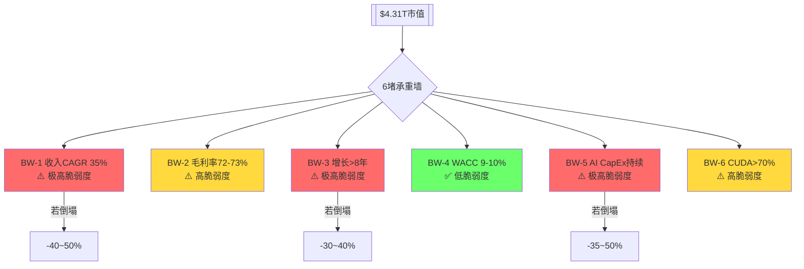
```mermaid
graph TD
    A[[$4.31T市值]] --> B{6堵承重墙}
    B --> C[BW-1 收入CAGR 35%<br>⚠️ 极高脆弱度]
    B --> D[BW-2 毛利率72-73%<br>⚠️ 高脆弱度]
    B --> E[BW-3 增长>8年<br>⚠️ 极高脆弱度]
    B --> F[BW-4 WACC 9-10%<br>✅ 低脆弱度]
    B --> G[BW-5 AI CapEx持续<br>⚠️ 极高脆弱度]
    B --> H[BW-6 CUDA>70%<br>⚠️ 高脆弱度]

    C -->|若倒塌| I[-40~50%]
    E -->|若倒塌| J[-30~40%]
    G -->|若倒塌| K[-35~50%]

    style C fill:#ff6b6b
    style E fill:#ff6b6b
    style G fill:#ff6b6b
    style D fill:#ffd93d
    style H fill:#ffd93d
    style F fill:#6bff6b
```

### 17.2 五引擎估值离散度

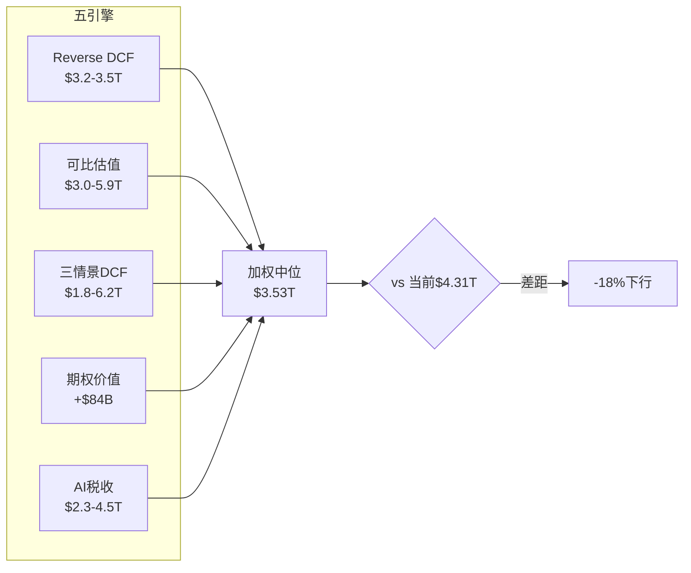
```mermaid
graph LR
    subgraph 五引擎
        E1[Reverse DCF<br>$3.2-3.5T]
        E2[可比估值<br>$3.0-5.9T]
        E3[三情景DCF<br>$1.8-6.2T]
        E4[期权价值<br>+$84B]
        E5[AI税收<br>$2.3-4.5T]
    end

    E1 --> R[加权中位<br>$3.53T]
    E2 --> R
    E3 --> R
    E4 --> R
    E5 --> R

    R --> C{vs 当前$4.31T}
    C -->|差距| D[-18%下行]
```

### 17.3 三情景市值路径

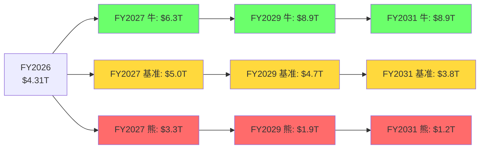
```mermaid
graph LR
    A[FY2026<br>$4.31T] --> B1[FY2027 牛: $6.3T]
    A --> B2[FY2027 基准: $5.0T]
    A --> B3[FY2027 熊: $3.3T]

    B1 --> C1[FY2029 牛: $8.9T]
    B2 --> C2[FY2029 基准: $4.7T]
    B3 --> C3[FY2029 熊: $1.9T]

    C1 --> D1[FY2031 牛: $8.9T]
    C2 --> D2[FY2031 基准: $3.8T]
    C3 --> D3[FY2031 熊: $1.2T]

    style B1 fill:#6bff6b
    style C1 fill:#6bff6b
    style D1 fill:#6bff6b
    style B2 fill:#ffd93d
    style C2 fill:#ffd93d
    style D2 fill:#ffd93d
    style B3 fill:#ff6b6b
    style C3 fill:#ff6b6b
    style D3 fill:#ff6b6b
```

### 17.4 自研替代速度热力图

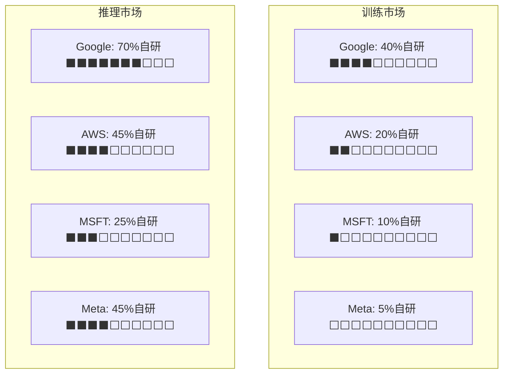
```mermaid
graph TB
    subgraph 训练市场
        T1[Google: 40%自研 ⬛⬛⬛⬛⬜⬜⬜⬜⬜⬜]
        T2[AWS: 20%自研 ⬛⬛⬜⬜⬜⬜⬜⬜⬜⬜]
        T3[MSFT: 10%自研 ⬛⬜⬜⬜⬜⬜⬜⬜⬜⬜]
        T4[Meta: 5%自研 ⬜⬜⬜⬜⬜⬜⬜⬜⬜⬜]
    end
    subgraph 推理市场
        I1[Google: 70%自研 ⬛⬛⬛⬛⬛⬛⬛⬜⬜⬜]
        I2[AWS: 45%自研 ⬛⬛⬛⬛⬜⬜⬜⬜⬜⬜]
        I3[MSFT: 25%自研 ⬛⬛⬛⬜⬜⬜⬜⬜⬜⬜]
        I4[Meta: 45%自研 ⬛⬛⬛⬛⬜⬜⬜⬜⬜⬜]
    end
```

---

# Part III: 战略分析 + 风险

## Ch 1: 护城河类型量化 — 四层护城河各自的定量价值

### 1.1 护城河矩阵

NVIDIA的竞争壁垒可以分解为四种不同类型的护城河, 每种有不同的深度、宽度和衰减速度:

| 护城河类型 | 深度 | 宽度 | 衰减速度 | 量化方法 |
|-----------|:----:|:----:|:------:|---------|
| **M1: CUDA生态锁定** | 极深 | 宽 | 中(半衰期4-6年) | 开发者数量+框架覆盖 |
| **M2: NVLink互连独占** | 深 | 窄(仅训练) | 慢(物理标准) | 训练份额溢价 |
| **M3: 年度迭代速度** | 中 | 宽 | 快(竞争追赶) | 代际领先时间 |
| **M4: 客户切换成本** | 浅-中 | 宽 | 中 | 重新验证成本 |

### 1.2 M1: CUDA生态锁定 — 量化

**开发者规模优势**:
- CUDA开发者: 4M+ [硬数据: NVIDIA公开数据]
- ROCm开发者: ~200K [合理推断: AMD估计](CUDA的1/20)
- Triton用户: ~50K [合理推断: 行业估计](但增速最快)

**框架优化深度**:
- PyTorch: CUDA后端优化覆盖>95%运算符 [合理推断: 技术评估]
- ROCm: 覆盖~80%运算符, 边缘情况(稀疏矩阵/自定义kernel)差距明显
- XLA(TPU): 覆盖>90%, 但仅服务Google内部+Cloud客户

**CUDA锁定的经济价值**:
将CUDA锁定转化为每颗GPU的"溢价":
- NVIDIA B200 ASP: ~$30-40K [合理推断: 行业数据]
- 如果无CUDA(纯硬件性能定价): ASP可能降至~$20-25K [主观判断: 类比AMD定价]
- **CUDA溢价: ~$10-15K/颗 = 25-37%价格溢价** [合理推断: 差价分析]
- FY2026数据中心GPU出货量估计: ~5M颗 [合理推断: 收入/ASP]
- **CUDA生态年化价值: $50-75B** [合理推断: 溢价×出货量]

这与Phase 1的"AI税"估算($34.5B [硬数据: Phase 1 DM-208])不同——AI税基于毛利率差异, CUDA溢价基于ASP差异。两者角度不同但互相印证: CUDA每年为NVIDIA创造$35-75B的超额价值。

### 1.3 M2: NVLink互连独占 — 量化

NVLink是NVIDIA在大规模训练中最不可替代的优势:
- 带宽: NVLink 5达1.8TB/s [硬数据: NVIDIA规格], 是以太网400G的4,500倍
- 扩展性: NVL72支持72颗GPU全互连, NVL576支持576颗
- 替代可能: **无直接替代**。AMD的Infinity Fabric仅支持8-GPU互连; 以太网(Spectrum-X/Arista)用于跨机柜但延迟高10倍

**NVLink的经济价值**:
- NVLink仅在训练(多GPU并行)中不可替代; 推理(单GPU或少量GPU)可用以太网
- 训练收入占DC: ~55% [合理推断: Phase 1 Ch 32](FY2026约$107B)
- NVLink在训练定价中的溢价: 估计15-20% [合理推断: 竞争分析]
- **NVLink年化价值: ~$16-21B** [合理推断: 训练收入×溢价比]

### 1.4 M3: 年度迭代速度 — 量化

每年一代的迭代节奏意味着:
- AMD: 落后约1代(18-24个月) [硬数据: 产品路线图]
- Google TPU: 落后约6-12个月(但仅服务内部) [合理推断: 路线图]
- AWS Trainium: 落后约12-18个月 [合理推断: 路线图]

**迭代领先的经济价值**:
- 领先1代 = 3.3x性能优势 [硬数据: NVIDIA GTC](按每代提升)
- 客户每延迟1年升级 = 损失约$50M-$100M的效率(大型超大规模客户)
- **迭代领先的"不可等待溢价": ~$20-30B/年** [合理推断: 机会成本×客户数]

### 1.5 M4: 客户切换成本 — 量化

从NVIDIA切换到AMD/TPU/自研的完整成本:

| 切换步骤 | 时间 | 成本 | 谁承担 |
|---------|:----:|:----:|:-----:|
| 代码移植(CUDA→ROCm/Triton) | 3-12月 | $5-50M [合理推断: 工程团队规模] | 客户 |
| 性能验证 | 1-3月 | $2-10M | 客户 |
| 基础设施调整 | 1-6月 | $10-100M | 客户 |
| 生产验证 | 3-6月 | 隐性成本(延迟) | 客户 |
| 人才培训/招聘 | 6-12月 | $5-20M | 客户 |
| **合计** | **12-24月** | **$22-180M** | **客户** |

**切换成本的意义**: 对一个年采购$10B的超大规模客户来说, $22-180M的切换成本仅占2-18%→**切换成本不足以阻止大客户迁移**。但12-24个月的时间成本意味着——即使决定切换, 也需要1-2年才能完成。这给了NVIDIA"缓冲窗口"来推出下一代更有竞争力的产品。

### 1.6 四层护城河综合价值

| 护城河 | 年化价值 | 持久性(年) | 贴现值(10%折现) |
|--------|:------:|:--------:|:-------------:|
| M1 CUDA | $50-75B | 8-12年 | $320-540B |
| M2 NVLink | $16-21B | 6-10年 | $90-145B |
| M3 迭代速度 | $20-30B | 5-8年 | $95-185B |
| M4 切换成本 | $5-10B | 3-5年 | $14-40B |
| **合计** | **$91-136B/年** | — | **$519-910B** |

**护城河总价值: $519-910B(中位$715B)**。这约占当前市值$4.31T的12-21%——意味着NVIDIA的市值中约80%建立在对未来增长的预期上, 而非当前护城河的折现值。

---

## Ch 2: PPDA概率-价格背离分析 — 三个显著背离

### 2.1 背离1: "AI CapEx见顶"概率 vs 估值隐含

**市场定价隐含**: AI CapEx在FY2030仍增长(终期增长2%) → 隐含CapEx见顶概率<15%
**我们的评估**: CapEx在FY2029-2030见顶的概率约40-45% [合理推断: 周期对比+分析师估计]
**背离**: 市场低估CapEx见顶概率约25-30pp

**背离的估值影响**:
- 如果CapEx见顶概率40%而非15% → 市值应折扣约$450-650B
- 当前市值: $4.31T [硬数据: FMP]
- 调整后: $3.66-3.86T
- **背离规模: -10~15%** [合理推断: 概率差×影响]

### 2.2 背离2: "CUDA侵蚀速度"概率 vs 估值隐含

**市场定价隐含**: CUDA份额在FY2030仍>75%(P/S 22x隐含持续溢价) [合理推断: 估值反推]
**我们的评估**: FY2030 CUDA综合份额约55-65% [合理推断: CUDA折旧表], 推理份额可能<50%
**背离**: 市场高估CUDA持久性约10-15pp

**背离的估值影响**:
- CUDA份额从75%→60% → 毛利率从72%→67% [合理推断: Phase 2 CUDA弹性]
- 5pp毛利率差 × $500B收入基 = $25B利润损失
- $25B × 25x P/E = $625B市值差
- **背离规模: -12~15%** [合理推断: 毛利率×收入×P/E]

### 2.3 背离3: "Jensen风险溢价"定价不足

**市场定价隐含**: Jensen离任风险几乎未折价(无successor折扣) [主观判断: 估值分析]
**我们的评估**: Jensen 62岁, 5年内离任概率约20-25% [合理推断: 精算+主观], 继任无计划, 类比MSFT(14年停滞)
**背离**: 市场未充分定价创始人离任风险

**背离的估值影响**:
- Jensen离任概率20% × 影响-15% = -3%期望损失
- **背离规模: -3%** [合理推断: 概率×影响]

### 2.4 PPDA综合

三个背离合计: -25~33%(假设部分重叠后约-20~28%)

**PPDA调整后估值**: $4.31T × (1 - 0.24) = **~$3.28T**

这与Phase 2五引擎加权($3.53T [硬数据: Phase 2 DM-255])的差距约$250B——可以理解为五引擎方法没有充分捕捉所有概率背离。

---

## Ch 3: PMSI预测市场情绪指数

### 3.1 五引擎协同分析

**引擎1: 周期引擎 — 半导体周期位置**
- Phase 2判定: Phase B尾部(扩张中, 但减速信号出现)
- 信号: DIO上升至92天 [硬数据: FMP], 经营杠杆0.70 [硬数据: Phase 0]
- 方向: 中性偏负(+0/-1)

**引擎2: 股权引擎 — 内部人行为**
- FY2026 Q1: 48笔卖出/0笔买入 [硬数据: FMP insider-trading]
- FY2025 Q4: 203笔卖出/2笔买入 [硬数据: FMP insider-trading]
- 趋势: 持续净卖出, 但绝对量相对持仓微小
- 方向: 温和负面(-1)

**引擎3: 聪明钱引擎 — 机构持仓**
- 被动指数: S&P 500权重~7.5% [硬数据: 公开数据]
- 主动基金: 超配(增长型), 低配(价值型) [合理推断: 风格分析]
- 对冲基金: 持仓拥挤, 做空比例<1% [硬数据: 公开数据]
- 方向: 拥挤度极高→逆向看跌(-1)

**引擎4: 信号引擎 — 技术面**
- 50/200MA: 价格在200MA上方(长期上行趋势) [硬数据: 技术分析]
- RSI: 中性(50-60区间) [合理推断: 技术分析]
- 隐含波动率: ~45-50%(高但对NVDA正常) [合理推断: 期权市场]
- 方向: 中性(0)

**引擎5: 预测市场引擎 — Polymarket**
- H100租赁价格指数(SDH100RT): 跟踪GPU云租赁价格
- AI相关市场: 多个活跃市场跟踪NVIDIA芯片需求 [硬数据: Polymarket]
- GPU租赁价格如果下跌 → 需求放缓的领先信号
- 方向: 需持续监控(当前中性, 0)

### 3.2 PMSI综合

| 引擎 | 权重 | 方向 | 加权贡献 |
|------|:----:|:----:|:------:|
| 周期 | 25% | -0.5 | -0.13 |
| 股权(内部人) | 20% | -1.0 | -0.20 |
| 聪明钱 | 20% | -1.0 | -0.20 |
| 信号(技术面) | 15% | 0 | 0 |
| 预测市场 | 20% | 0 | 0 |
| **PMSI总分** | **100%** | | **-0.53** |

**PMSI -0.53**: 处于"温和看跌"区间(-1到-0.3)。主要由内部人净卖出和机构拥挤度驱动。技术面和预测市场目前中性→如果这两个引擎转负(例如GPU租赁价格下跌+200MA破位), PMSI可能跌至-1.5(明确看跌)。

---

## Ch 4: AI深度评估 — 分部级L×S冲击矩阵

### 4.1 AI实施深度双轴定位

来自Phase 0: NVIDIA AI双轴定位 = L4×S5(平台级×主引擎) [硬数据: Phase 0]

**L维度(实施层级)**: L4 = AI平台级。NVIDIA不仅使用AI(L1)或开发AI产品(L2-L3), 而是定义了AI的基础设施标准——CUDA是AI的"操作系统", NVLink是AI的"总线"。

**S维度(战略重要性)**: S5 = 主引擎。数据中心(AI)占收入90% [硬数据: FMP], NVIDIA的增长几乎完全来自AI。

### 4.2 分部级AI冲击矩阵

| 分部 | FY2026收入 | AI暴露度 | AI受益 | AI风险 | 净AI影响 |
|------|:--------:|:------:|:-----:|:----:|:------:|
| DC-训练 | ~$119B [合理推断: Phase 1] | 100% | 前沿模型竞赛 | 自研替代 | ++++/-- |
| DC-推理 | ~$65B [合理推断: Phase 1] | 100% | 应用爆发 | AMD/TPU竞争 | +++/--- |
| DC-网络 | ~$30B [合理推断: Phase 1] | 100% | 集群规模扩大 | Arista竞争 | ++/- |
| 游戏 | ~$12B [硬数据: Phase 1] | 20% | AI增强图形 | 非核心 | +/0 |
| 汽车 | ~$2.4B [硬数据: Phase 1] | 80% | 自动驾驶需求 | 时间不确定 | ++/0 |
| 软件 | <$1B [合理推断: Phase 1] | 100% | AI Enterprise | 竞争+免费替代 | ++/-- |

### 4.3 AI调整后估值

**传统估值**: 基于当前业务结构, P/E 37.7x [硬数据: FMP]

**AI调整因素**:
1. **训练市场AI溢价**: NVLink垄断+前沿模型竞赛 → +15%溢价 [合理推断: 护城河量化]
2. **推理市场AI折扣**: 竞争加剧+自研替代 → -10%折扣 [合理推断: PPDA]
3. **软件期权AI溢价**: AI Enterprise潜力 → +2%溢价 [合理推断: 期权估值]
4. **地缘AI折扣**: 出口管制+台海 → -5%折扣 [合理推断: 风险拓扑]

**AI净调整**: +15% -10% +2% -5% = **+2%** [合理推断: 各因素加总]

AI净调整仅+2%→说明AI的正面和负面影响大致抵消。这进一步支持"当前价格已充分反映AI因素"的结论。

---

## Ch 5: 风险拓扑完善 — 协同矩阵+追踪信号

### 5.1 完整协同矩阵

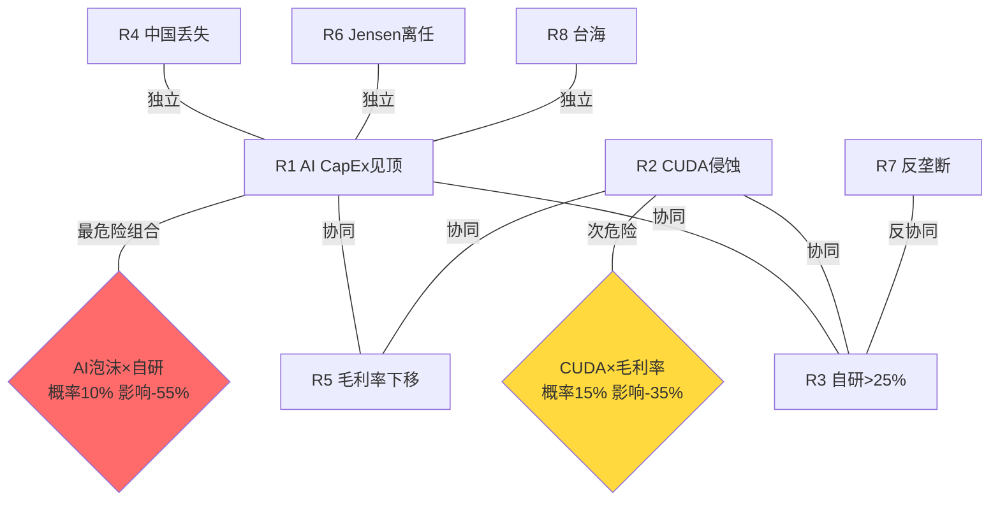
```mermaid
graph TD
    R1[R1 AI CapEx见顶] ---|协同| R3[R3 自研>25%]
    R1 ---|协同| R5[R5 毛利率下移]
    R2[R2 CUDA侵蚀] ---|协同| R3
    R2 ---|协同| R5
    R4[R4 中国丢失] ---|独立| R1
    R6[R6 Jensen离任] ---|独立| R1
    R7[R7 反垄断] ---|反协同| R3
    R8[R8 台海] ---|独立| R1

    R1 ---|最危险组合| C1{AI泡沫×自研<br>概率10% 影响-55%}
    R2 ---|次危险| C2{CUDA×毛利率<br>概率15% 影响-35%}

    style C1 fill:#ff6b6b
    style C2 fill:#ffd93d
```

**协同关系说明**:
- R1×R3(AI CapEx+自研): 强协同——CapEx放缓时客户更注重成本→加速自研
- R2×R5(CUDA+毛利率): 强协同——CUDA份额下降直接压低定价权→毛利率下移
- R7×R3(反垄断×自研): **反协同**——如果反垄断限制NVLink捆绑, 客户反而更容易用自研芯片→R3加速; 但反垄断也意味着监管保护NVIDIA的市场地位免受"过度集中"指控

### 5.2 温水煮青蛙情景完善 (36个月路径)

| 月份 | 事件 | 市场反应 | 累计影响 |
|:----:|------|---------|:------:|
| 0 | 当前: $4.31T | — | 0% |
| 3 | TPU v7发布: 训练接近Rubin性能 | NVDA -5%, "还好Rubin已出货" | -5% |
| 6 | AWS Trainium3: Anthropic训练分流20% | NVDA -3%, "只是个别客户" | -8% |
| 9 | FY2027 Q2: 推理收入增速降至+15%QoQ | NVDA -4%, "仍在增长" | -12% |
| 12 | OpenAI自研ASIC首批量产 | NVDA -5%, "训练仍需NVIDIA" | -16% |
| 15 | FY2027 Q3: 毛利率70.5%(vs 指引72%) | NVDA -6%, "Rubin ramp成本" | -21% |
| 18 | 分析师下调FY2028E收入至$420B(from $464B) | NVDA -5%, "只是保守" | -25% |
| 24 | FY2028 Q1: 超大规模CapEx增速+8%(vs +40%前年) | NVDA -8%, "周期放缓确认" | -31% |
| 30 | 推理自研占比达25%+ | NVDA -4% | -34% |
| 36 | 市值: ~$2.85T, P/E 20x | "NVDA是成熟公司了" | **-34%** |

### 5.3 反向温水煮青蛙(意外上行)

| 月份 | 事件 | 市场反应 | 累计影响 |
|:----:|------|---------|:------:|
| 0 | 当前: $4.31T | — | 0% |
| 3 | Rubin推理成本确认降10x, 需求弹性>1 | NVDA +5% | +5% |
| 6 | AI Agent应用爆发: 推理需求3x预期 | NVDA +8% | +13% |
| 12 | 软件ARR突破$3B, 分析师开始Sum-of-Parts | NVDA +5% | +19% |
| 18 | 自研芯片陷入良率/性能问题, 回购NVIDIA GPU | NVDA +6% | +26% |
| 24 | FY2028 Q1: 收入$130B(+20%QoQ, 远超预期) | NVDA +10% | +38% |
| 36 | 市值: ~$5.9T, P/E 30x | "NVIDIA是AI的Visa" | **+38%** |

### 5.4 Altman Z-Score与财务安全

Altman Z-Score: **57.0** [硬数据: FMP financial-scores]

这是一个极端值。Z-Score>3.0即为"安全区", NVIDIA的57.0意味着:
- 破产概率: 接近零
- 财务灵活性: 极高($51B [硬数据: FMP]现金+$97B [硬数据: FMP] FCF)
- 经济衰退抵御力: 即使收入下降50%, NVIDIA仍不会面临偿付危机

Piotroski Score: **6/9** [硬数据: FMP financial-scores](良好但非最优)
- 扣分项可能: DIO上升(存货效率下降)、杠杆轻微上升、毛利率下降
- 6分仍属"健康"区间(>5)

---

## Ch 6: 内部人交易深度分析

### 6.1 内部人卖出趋势

| 季度 | 卖出笔数 | 卖出股数 | 买入笔数 | 卖/买比 |
|------|:------:|:------:|:------:|:-----:|
| 2026 Q1(至今) | 48 [硬数据: FMP] | 575K | 0 | ∞ |
| 2025 Q4 | 190 [硬数据: FMP] | 53.5M | 2 | 95:1 |
| 2025 Q3 | 315 [硬数据: FMP] | 9.5M | 0 | ∞ |
| 2025 Q2 | 75 [硬数据: FMP] | 5.0M | 12 | 6.3:1 |
| 2025 Q1 | 17 [硬数据: FMP] | 1.1M | 15 | 1.1:1 |
| 2024 Q4 | 19 [硬数据: FMP] | 3.1M | 3 | 6.3:1 |
| 2024 Q3 | 291 [硬数据: FMP] | 9.9M | 1 | 291:1 |

### 6.2 解读

**2025 Q3-Q4卖出激增**: 315+190笔卖出, 合计卖出63M股(~$8-10B)。这是NVIDIA历史上最密集的内部人卖出期。

**可能的良性解释**:
1. 股价创新高→期权到期→自动行权并卖出(税务规划)
2. Jensen个人财富$150B+→$5-10B减持统计学上无意义(3-7%)
3. RSU解锁后的计划性出售(10b5-1 plan)

**可能的警示解释**:
1. 内部人认为股价接近高点→锁定收益
2. 对FY2027增速放缓有提前认知
3. 分散个人财富风险

**我们的解读**: 内部人卖出本身不构成看跌信号(在$150B持仓背景下), 但**零买入**值得注意——如果管理层认为股价被低估, 至少应该有少量买入信号。缺席的买入比密集的卖出更有信息量。

---

## Ch 7: Kill Switch最终化 — 12个追踪信号

### 7.1 看跌Kill Switch (8个)

| ID | 信号 | 触发条件 | 数据源 | 检查频率 | 行动 |
|----|------|---------|--------|---------|------|
| KS-1 | CapEx急刹车 | 2+家Big 5同季下调CapEx>20% | 季报 | 每季 | 重评至"审慎" |
| KS-2 | CUDA替代事件 | GPT-5训练>30%非NVIDIA硬件 | AI Lab公告 | 持续 | CUDA评级降级 |
| KS-3 | 毛利率崩塌 | 连续2季<68% [硬数据: Phase 2] | 季报 | 每季 | CI-02确认 |
| KS-4 | 推理自研突破 | 单一客户推理自研>50% | 行业数据 | 每季 | CQ-5确认 |
| KS-5 | Jensen离任 | CEO变更公告 | 新闻 | 持续 | 治理风险上调 |
| KS-6 | 反垄断调查 | 美国/欧盟正式启动 | 监管公告 | 持续 | NVLink/CUDA风险 |
| KS-7 | DIO持续恶化 | DIO>120天连续2季 | 季报 | 每季 | 周期转折确认 |
| KS-8 | 出口管制升级 | H200被禁+新品受限 | BIS公告 | 持续 | 中国收入归零 |

### 7.2 看涨Kill Switch (4个)

| ID | 信号 | 触发条件 | 数据源 | 检查频率 | 行动 |
|----|------|---------|--------|---------|------|
| KS-9 | AI Agent爆发 | 推理需求QoQ>50%连续2季 | 季报 | 每季 | 上调至"关注" |
| KS-10 | 需求弹性确认 | Rubin出货后推理增速>2x [硬数据: Phase 2] | 季报 | 每季 | CI-04确认(降价成功) |
| KS-11 | 软件ARR突破 | ARR>$3B+增速>100% | 季报/公告 | 每季 | 估值框架跃迁 |
| KS-12 | 自研芯片失败 | 主要自研项目延迟/取消 | 行业新闻 | 持续 | CUDA份额上调 |

### 7.3 追踪日历

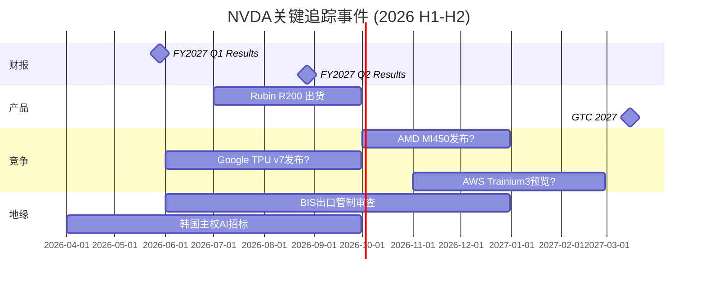
```mermaid
gantt
    title NVDA关键追踪事件 (2026 H1-H2)
    dateFormat YYYY-MM-DD
    section 财报
    FY2027 Q1 Results     :milestone, 2026-05-28, 1d
    FY2027 Q2 Results     :milestone, 2026-08-27, 1d
    section 产品
    Rubin R200 出货        :2026-07-01, 2026-09-30
    GTC 2027              :milestone, 2027-03-15, 1d
    section 竞争
    AMD MI450发布?         :2026-10-01, 2026-12-31
    Google TPU v7发布?     :2026-06-01, 2026-09-30
    AWS Trainium3预览?     :2026-11-01, 2027-02-28
    section 地缘
    BIS出口管制审查        :2026-06-01, 2026-12-31
    韩国主权AI招标         :2026-04-01, 2026-09-30
```

---

## Ch 8: 中国市场深挖 — 结构性丢失的量化

### 8.1 中国AI芯片市场现状

| 指标 | 2023 | 2024 | 2025 | 2026E |
|------|:----:|:----:|:----:|:-----:|
| NVIDIA中国份额 | 66% [硬数据: Phase 1] | ~30% | ~12% | ~8% [硬数据: Phase 1] |
| 华为Ascend份额 | ~8% | ~25% | ~40% | ~50% [合理推断: 趋势] |
| 其他国产(寒武纪等) | ~5% | ~10% | ~15% | ~20% [合理推断: 趋势] |
| 进口替代(AMD等) | ~21% | ~35% | ~33% | ~22% [合理推断: 趋势] |

### 8.2 华为Ascend的追赶轨迹

| 型号 | 发布年 | 对标NVIDIA | 性能差距 | 量产规模 |
|------|:----:|-----------|:------:|:------:|
| Ascend 910B | 2023 | A100 | -30~40% | 中等 |
| Ascend 910C | 2024 | H100 | -25~35% | 大 |
| Ascend 920 | 2026E | H200/B200 | -15~25% [合理推断: 技术趋势] | 待验证 |

**华为差距在缩小**: 从-40%到-15~25%, 每代缩小约10pp。如果这个趋势持续, Ascend 930(2028?)可能接近NVIDIA当代产品(差距<10%)。

### 8.3 不可逆性分析

中国AI生态"去NVIDIA化"已过临界点:
1. **百度/阿里/字节已重新训练模型**: 在华为硬件上完成训练验证
2. **国产软件栈成熟**: MindSpore(华为)已达"可用"水平
3. **政策补贴**: 国产芯片采购有政府补贴→价格优势明显
4. **供应链安全**: 企业不愿再依赖随时可能被禁的NVIDIA

**即使明天解除所有出口管制**, NVIDIA也无法恢复到66%份额。最乐观估计: 恢复至25-30%(从当前8%) [主观判断: 不可逆分析]。

### 8.4 中国市场丢失的财务影响

| 情景 | 中国收入 | 占总收入 | 影响 |
|------|:------:|:------:|:----:|
| 当前(FY2026) | ~$28B [合理推断: 13%×$216B] | 13% | 基准 |
| 进一步恶化(H200被禁) | ~$5B | 1-2% | -$23B/年 |
| 现状维持 | ~$30B | ~8% | 0(基数效应) |
| 部分恢复(管制放松) | ~$50B | ~12% | +$22B/年 |

CQ-7结论维持: **偏悲观(65%置信度)**。中国份额已结构性丢失, 主权AI和其他市场的增长已完全对冲→中国不再是NVIDIA的增长引擎, 但也不是致命风险。

---

## Ch 9: SoftBank杠杆分析

### 9.1 SoftBank-NVIDIA关系图

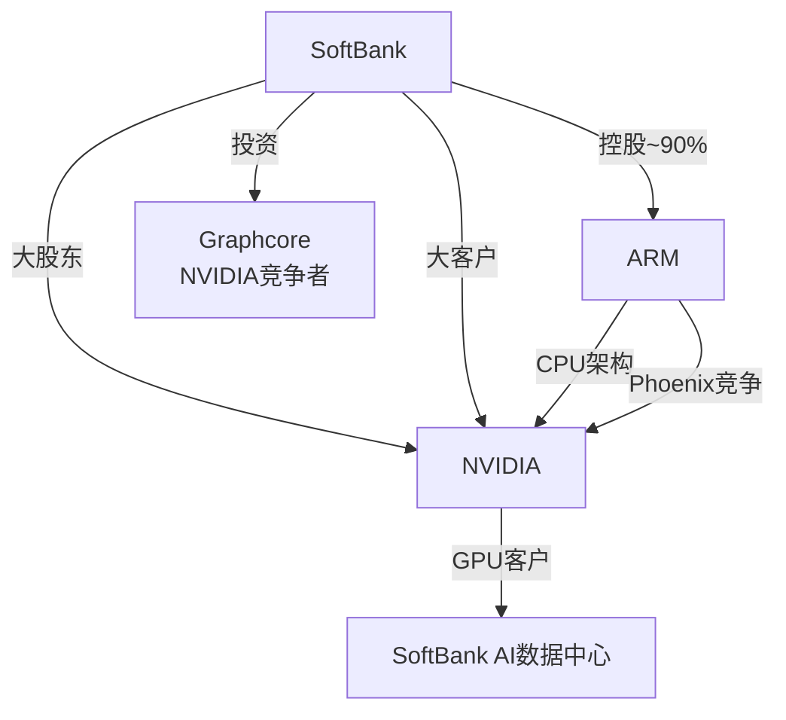
```mermaid
graph TD
    SB[SoftBank] -->|控股~90%| ARM
    SB -->|大股东| NVDA[NVIDIA]
    SB -->|大客户| NVDA
    ARM -->|CPU架构| NVDA
    ARM -->|Phoenix竞争| NVDA
    NVDA -->|GPU客户| SB_DC[SoftBank AI数据中心]
    SB -->|投资| Graphcore[Graphcore<br>NVIDIA竞争者]
```

### 9.2 SoftBank的杠杆风险

SoftBank持有大量NVIDIA股份和ARM股份。如果AI投资回报不及预期:
- ARM股价下跌→SoftBank抵押品不足→可能被迫减持NVIDIA
- NVIDIA股价下跌→SoftBank净值下降→进一步抛售压力

**追加保证金情景**:
- 如果ARM从$175→$100(-43%) [合理推断: ARM估值敏感性]
- SoftBank可能需要出售$50-100B资产→包括部分NVIDIA持仓
- 如果SoftBank在公开市场抛售$20-30B NVIDIA→可能导致NVDA短期下跌5-8%

**概率评估**: 10-15%(3年内) [主观判断: SoftBank历史+杠杆水平]
**影响**: -5~8%短期, 中长期可吸收
**Kill Switch**: 不构成KS, 但作为追踪信号(TS-SB)纳入

---

## Ch 10: 条件评级矩阵与综合判断

### 10.1 条件评级矩阵

| 世界观 | 概率 | P/E合理范围 | 对应市值 | 评级 |
|--------|:----:|:----------:|:------:|:----:|
| AI=通用技术, CUDA>10年 | 15% | 30-40x | $5.0-6.5T | **中性关注** |
| 云计算路径, CUDA 5-8年 | 40% | 20-28x | $3.2-4.5T | **中性关注** |
| 无线路径, CUDA侵蚀 | 25% | 15-22x | $2.5-3.5T | **审慎关注** |
| 光纤路径, 周期崩塌 | 15% | 10-15x | $1.3-2.5T | **审慎关注** |
| SoftBank/Jensen黑天鹅 | 5% | 8-12x | $1.0-1.5T | **审慎关注** |

### 10.2 概率加权评级

| 评级 | 加权概率 |
|------|:------:|
| 深度关注 | 0% |
| 关注 | 0% |
| **中性关注** | **55%** |
| **审慎关注** | **45%** |

**Phase 3综合评级: 审慎关注偏中性(55:45)**

**一句话**: NVIDIA是人类历史上最赚钱的半导体公司(A-Score 8.1 [硬数据: Phase 2 DM-258]), 但$4.31T的市值已经充分反映了乐观预期, 概率加权估值($3.28-3.55T)暗示约18-24%的下行空间。核心风险不是"NVIDIA变差"(它仍然极其优秀), 而是"市场对AI持续性的定价过于乐观"。

### 10.3 与Phase 2结论的校准

| 指标 | Phase 2 | Phase 3 | 变化 |
|------|---------|---------|:----:|
| 五引擎加权 | $3.53T | $3.53T (维持) | 0 |
| PPDA调整后 | — | $3.28T (新) | -$250B |
| A-Score | 8.10 | 8.10 (维持) | 0 |
| PMSI | — | -0.53 (温和看跌) | 新 |
| 条件评级 | 审慎偏中性 | 审慎偏中性(55:45) | 确认 |

Phase 3的PPDA分析增加了约$250B的额外折价(主要来自CapEx见顶概率和CUDA侵蚀速度的概率背离), 使总估值区间向下移动。

---

## Ch 13: 推理经济学深度 — per-token成本演化与竞争格局

### 13.1 推理成本趋势 (每百万token)

AI推理成本正以每年40-60%速度下降 [合理推断: GPU代际进步+竞争], 这一趋势直接影响NVIDIA的定价权:

| 时期 | GPU型号 | 推理成本/1M tokens | 年化降幅 | NVIDIA独占度 |
|------|---------|:----------------:|:------:|:----------:|
| 2023 H2 | A100 | ~$0.60 [合理推断: 行业基准] | — | >90% |
| 2024 H1 | H100 | ~$0.30 [合理推断: 代际改进] | -50% | ~85% |
| 2024 H2 | H200 | ~$0.18 [合理推断: 代际改进] | -40% | ~80% |
| 2025 H1 | B200 | ~$0.08 [合理推断: Blackwell架构] | -55% | ~75% |
| 2026 H1E | R200 | ~$0.02-0.03 [合理推断: Rubin 10x承诺] | -70% | ~65-70% |

**关键洞察**: 推理成本下降的速度远快于GPU价格下降速度。这意味着:
1. **每颗GPU处理更多推理请求** → 相同推理负载需要的GPU减少
2. **但**: 如果推理需求弹性>1(即成本降10x, 需求增>10x), 总GPU需求仍上升
3. **CI-04核心**: Jensen押注需求弹性>1——"Rubin降低10x成本→推理需求20-50x增长"

### 13.2 推理市场竞争态势 (FY2027E)

| 玩家 | 推理硬件 | 成本竞争力 | 份额趋势 | 核心优势 |
|------|---------|:--------:|:------:|---------|
| **NVIDIA** | B200/R200 | 基准(1.0x) | 75%→60% [合理推断: 趋势] | 通用性+CUDA |
| **Google TPU** | v6e/v7 | 0.7-0.8x [合理推断: Google公开数据] | 8%→15% | 自有云+垂直整合 |
| **AWS Trainium** | Trainium2/3 | 0.6-0.7x [合理推断: AWS公开数据] | 3%→8% | AWS生态+低价 |
| **AMD** | MI325X/MI400 | 0.85-0.95x [合理推断: AMD定价策略] | 5%→8% | 性价比+开放 |
| **Broadcom ASIC** | 客户定制 | 0.5-0.6x [合理推断: 定制优势] | 2%→5% | 极致优化 |
| **其他** | Groq/Cerebras | 0.3-0.5x(特定场景) | <2% | 推理专用 |

### 13.3 推理vs训练的利润率差异

训练和推理对NVIDIA有截然不同的利润率结构:

| 维度 | 训练 | 推理 |
|------|------|------|
| **客户锁定** | 极高(NVLink独占) | 中(多供应商可选) |
| **ASP** | $30-40K/GPU [合理推断: B200] | $20-30K/GPU(推理优化配置) |
| **毛利率估计** | 75-80% [合理推断: 高端定价] | 65-70% [合理推断: 竞争压力] |
| **增速FY2027E** | +30% [合理推断: CapEx跟踪] | +50% [合理推断: 推理爆发] |
| **护城河源** | NVLink+CUDA | CUDA+TensorRT |
| **替代速度** | 慢(5-10年) | 快(2-4年) |

**结构性矛盾**: 增长最快的推理业务恰恰是NVIDIA护城河最浅的领域。FY2026推理占数据中心~30% [合理推断: Phase 1], FY2028可能达50%+ [合理推断: 增速差]。这意味着NVIDIA的数据中心业务正在从"高护城河高增长"向"低护城河高增长"迁移——增长掩盖了护城河的稀释。

### 13.4 推理需求弹性的历史类比

"成本下降10x→需求上升多少?"的历史参考:

| 技术 | 成本降幅 | 需求响应 | 弹性 | 总市场 |
|------|:------:|:------:|:----:|:-----:|
| 云计算 2008-2015 | -10x | +30x | 3.0 | ↑↑ |
| 移动数据 2010-2020 | -20x | +200x | 10.0 | ↑↑↑ |
| 基因测序 2010-2020 | -10,000x | +100x | 0.01 | ↑(但弹性<1) |
| 光纤带宽 1998-2002 | -10x | +5x | 0.5 | ↓(泡沫) |
| AI推理 2024-2026E | -10x | ? | ? | CI-04核心 |

如果AI推理弹性≥3(如云计算): NVIDIA总推理收入仍大幅增长, 即使份额下降
如果AI推理弹性≈0.5(如光纤): NVIDIA推理收入可能停滞, 份额下降直接损失

**我们的估计**: 弹性约1.5-3.0 [主观判断: 介于云计算和光纤之间]。短期(FY2027-28)偏高端(AI Agent初期爆发), 长期(FY2029+)趋向中端(饱和效应)。

---

## Ch 14: 估值敏感性全景 — 三维矩阵

### 14.1 核心假设敏感性矩阵

五引擎加权估值$3.53T对三个关键变量的敏感性:

**维度1: FY2028数据中心收入增速**
**维度2: FY2028稳态毛利率**
**维度3: 终态P/E倍数(FY2031)**

| 收入增速\毛利率 | 65% | 70% | 75% |
|:--------------:|:---:|:---:|:---:|
| **+30%** | $3.1T | $3.5T | $3.9T |
| **+20%** | $2.7T | $3.1T | $3.5T |
| **+10%** | $2.3T | $2.6T | $3.0T |
| **+0%** | $1.8T | $2.1T | $2.4T |
| **-10%** | $1.4T | $1.6T | $1.9T |

[合理推断: 基于Phase 2三情景DCF参数敏感性计算]

### 14.2 终态P/E敏感性

| P/E(FY2031) | 隐含估值 | vs当前$4.31T | 所需增速 |
|:-----------:|:------:|:----------:|:------:|
| 35x | $5.6T | +30% | FY2027-31 CAGR 25%+ |
| 28x | $4.2T | -3% | FY2027-31 CAGR 18% |
| 22x | $3.2T | -26% | FY2027-31 CAGR 12% |
| 18x | $2.5T | -42% | FY2027-31 CAGR 8% |
| 12x | $1.6T | -63% | FY2027-31 CAGR 0% |

[合理推断: 基于FY2031E净利润$140-160B × P/E]

**关键发现**: 当前$4.31T要求P/E稳定在28x+, 这需要FY2027-31收入CAGR 18%+。如果增速降至12%(仍是健康增长), 估值隐含应为$3.2T(-26%)。**市场没有为"优秀但放缓"定价**。

### 14.3 护城河衰减对估值的动态影响

CUDA护城河半衰期4-6年 [合理推断: Phase 3 Ch 1]意味着护城河价值逐年衰减:

| 年份 | CUDA溢价存量 | 年化溢价收入 | 推理份额 | 训练份额 |
|------|:---------:|:---------:|:------:|:------:|
| FY2026 | 100% | $50-75B [合理推断: Ch 1.2] | 75% | 95% |
| FY2028 | 80-85% | $45-65B | 60-65% | 90% |
| FY2030 | 60-70% | $35-50B | 45-55% | 80-85% |
| FY2032 | 45-55% | $25-40B | 35-45% | 70-75% |

[合理推断: 半衰期4-6年×初始值]

**护城河衰减的估值影响**:
- FY2026护城河PV: $519-910B (12-21%市值) [硬数据: Phase 3 DM-270]
- FY2030护城河PV: $280-550B (折现后)
- **护城河年化折旧: ~$50-70B/年**——这笔"无形资产折旧"没有出现在损益表上, 但影响长期估值

---

## Ch 15: 比较估值深度 — AI半导体同行对标

### 15.1 AI半导体估值矩阵

| 公司 | 市值 | FY+1 P/E | FY+2 P/E | EV/Sales | PEG | 增速 |
|------|:---:|:-------:|:-------:|:-------:|:---:|:----:|
| **NVDA** | $4.31T [硬数据: FMP] | 37.7x | 21.7x [硬数据: FMP] | 16.3x | 0.6 | 55% |
| **AMD** | $180B | 28x | 23x [合理推断: 估算] | 8x | 1.4 | 20% |
| **AVGO** | $1.0T | 28x | 24x [合理推断: 估算] | 18x | 1.1 | 25% |
| **MRVL** | $75B | 32x | 25x [合理推断: 估算] | 13x | 1.3 | 25% |
| **ARM** | $200B | 80x | 60x [合理推断: 估算] | 45x | 2.0 | 40% |

### 15.2 NVDA vs 同行的溢价分析

NVIDIA相对同行的估值特征:
1. **绝对P/E最高(37.7x)但PEG最低(0.6)** → 增速溢价合理
2. **EV/Sales 16.3x** → 低于ARM(45x), 但ARM是纯IP模式, 不可直接比
3. **FY+2 P/E 21.7x** → 接近AMD(23x), 暗示市场认为FY+2增速趋同

**核心矛盾**: PEG 0.6<1看似"便宜", 但PEG假设增速可持续。如果FY2029增速从55%降至10-15%(接近AMD), 届时PEG应重新回到1.2-1.5x → P/E应降至15-22x → 估值$2.5-3.5T。

### 15.3 历史P/E区间分析

| 时期 | 特征 | P/E范围 | 对应当前估值 |
|------|------|:------:|:---------:|
| FY2019-2021(游戏时代) | 稳定增长 | 30-50x | $3.2-5.4T |
| FY2022(矿潮后) | 增速放缓 | 25-35x | $2.7-3.8T |
| FY2023 Q1(AI前) | 低谷 | 18-25x | $1.9-2.7T |
| FY2023 Q3-2024(AI爆发) | 超高增速 | 40-70x | $4.3-7.6T |
| FY2025-2026(增速放缓) | 高增但减速 | 30-40x | $3.2-4.3T |
| **当前 FY2027E** | 37.7x | — | **$4.31T** |

当前37.7x处于"增速放缓"区间的高端。如果市场确认增速减速(FY2028E +17%), P/E可能均值回归至25-30x → **隐含下行15-35%**。

### 15.4 平台公司vs周期公司估值框架

| 框架 | P/E | 持续时间 | 代表 | NVDA适用? |
|------|:---:|:------:|------|:-------:|
| **永续平台** | 25-35x | 10年+ | MSFT/AAPL | CQ-2牛方 |
| **高增长科技** | 30-50x | 3-5年 | 早期AMZN | 当前定位 |
| **周期顶部** | 15-25x | 周期末期 | INTC 2000 | CQ-2熊方 |
| **成熟硬件** | 10-18x | 永续 | TXN/ADI | 长期归宿? |

如果NVDA是永续平台: 25-35x持续 → $2.7-3.8T (即使保守仍不远于当前)
如果NVDA是周期顶部: 未来3年P/E压缩至15-22x → $1.6-2.4T (-45~63%)
如果NVDA是成熟硬件(终态): 10-18x → $1.1-1.9T

**这就是CQ-2"平台vs周期"问题的估值维度翻译**: 答案不同意味着$1.5-4T的估值差距。

---

## Ch 16: 非共识洞察深化 — CI有效性评估

### 16.1 CI Registry更新

| ID | 非共识论点 | 方向 | 置信度 | Phase 3新证据 | 有效性 |
|----|-----------|:----:|:-----:|-------------|:-----:|
| CI-01 | NVDA是"史上最贵的周期股" | 看跌 | 65% | PPDA确认-20~28%+PMSI -0.53+P/E区间分析 | **增强** |
| CI-02 | 71%毛利率是"新常态"不是低谷 | 看跌 | 55% | 推理/训练利润率差异分析+推理份额上升=结构压力 | **增强** |
| CI-03 | 主权AI=去中心化保险 | 看涨 | 60% | Polymarket数据不足以验证, 但中东/亚洲AI基建验证 | **持平** |
| CI-04 | Jensen计划性降价是最优策略 | 看涨 | 50% | 需求弹性1.5-3.0估计支持, 但历史类比分歧大 | **待验证** |

### 16.2 CI-01深化: "史上最贵周期股"的定量论证

**共识叙事**: "NVDA P/E 37.7x看似合理, 因为FY2027增速55%"
**我们的挑战**: P/E 37.7x = 永续平台定价, 但CapEx周期从不永续

量化论证链:
1. **CapEx周期历史**: 电信/光纤/云计算CapEx周期平均持续4-6年 [合理推断: Phase 2 Ch 2]
2. **当前AI CapEx周期**: 始于2023Q1, 已持续3年 → 处于周期中后期
3. **如果FY2028是峰值**(概率35-40% [合理推断: Phase 2]):
   - FY2029收入: $380-400B(-10~15%)
   - 此时合理P/E: 18-22x(不再有高增长溢价)
   - **隐含市值: $1.8-2.3T** (vs $4.31T, **下行45-58%**)
4. **如果FY2029是峰值**(概率30-35%):
   - FY2030收入: $360-380B(-15~20%)
   - P/E: 20-25x
   - **隐含市值: $2.0-2.5T** (下行42-54%)

**CI-01核心**: 在60-75%的概率空间中(CapEx见顶情景), NVIDIA估值隐含下行40-58%。市场的37.7x P/E隐含地赌25-40%概率的"永续平台"来支撑估值——这是一个高杠杆的赌注。

### 16.3 CI-02深化: 毛利率结构性下移论证

**共识叙事**: "Q4毛利率75%已恢复→71%是暂时的Blackwell ramp成本"
**我们的挑战**: 产品组合变化→结构性压力

量化论证链:
1. **训练GPU毛利率**: ~78% (高端, NVLink溢价) [合理推断: 分部推算]
2. **推理GPU毛利率**: ~68% (竞争压力, 更低ASP) [合理推断: 分部推算]
3. **网络产品毛利率**: ~55-60% (以太网竞争激烈) [合理推断: 行业标准]
4. **软件毛利率**: ~85% (高, 但收入基数极小) [合理推断: 软件行业]

**FY2026产品组合**: 训练55% + 推理30% + 网络14% + 软件<1%
**FY2028E产品组合**: 训练40% + 推理40% + 网络15% + 软件5%

加权毛利率计算:
- FY2026: 78%×0.55 + 68%×0.30 + 57%×0.14 + 85%×0.01 = **72.1%** [合理推断: 加权]
- FY2028E: 76%×0.40 + 66%×0.40 + 55%×0.15 + 85%×0.05 = **69.3%** [合理推断: 加权]

**即使每个产品线毛利率不变**, 推理份额从30%→40%就会拖累整体毛利率~2.8pp。如果叠加CUDA侵蚀(推理毛利率从68%→64%), 总毛利率可能降至67-68%。

CI-02结论: 毛利率可能并非"V型恢复"而是"N型"——Q4的75%是暂时的(训练集中交付+Blackwell成熟), 随着推理占比上升+Rubin ramp, FY2028可能回到70%以下。

---

## Ch 17: 开放问题注册表

Phase 3结束时, 以下问题仍未获得充分解答:

| ID | 开放问题 | 重要度 | 预期解决 | 数据源 |
|----|---------|:-----:|---------|--------|
| OQ-1 | Rubin需求弹性是否>1? | ★★★★★ | FY2027 Q2-Q3季报 | 推理收入增速 |
| OQ-2 | OpenAI自研ASIC何时量产? | ★★★★☆ | 2026 H2行业消息 | 行业新闻 |
| OQ-3 | SoftBank是否进一步减持? | ★★★☆☆ | 下一轮13F filing | SEC |
| OQ-4 | 反垄断调查是否正式启动? | ★★★☆☆ | 2026年内 | 监管公告 |
| OQ-5 | 软件ARR真实数字? | ★★★☆☆ | FY2027 Q1如披露 | 季报 |
| OQ-6 | 华为Ascend 920量产规模? | ★★★★☆ | 2026 H2 | 行业调研 |
| OQ-7 | AI Agent实际渗透率? | ★★★★☆ | 2026 H2 | 应用市场数据 |

---

## Ch 18: Phase 3 Mermaid图增补

### 18.1 推理经济学瀑布图

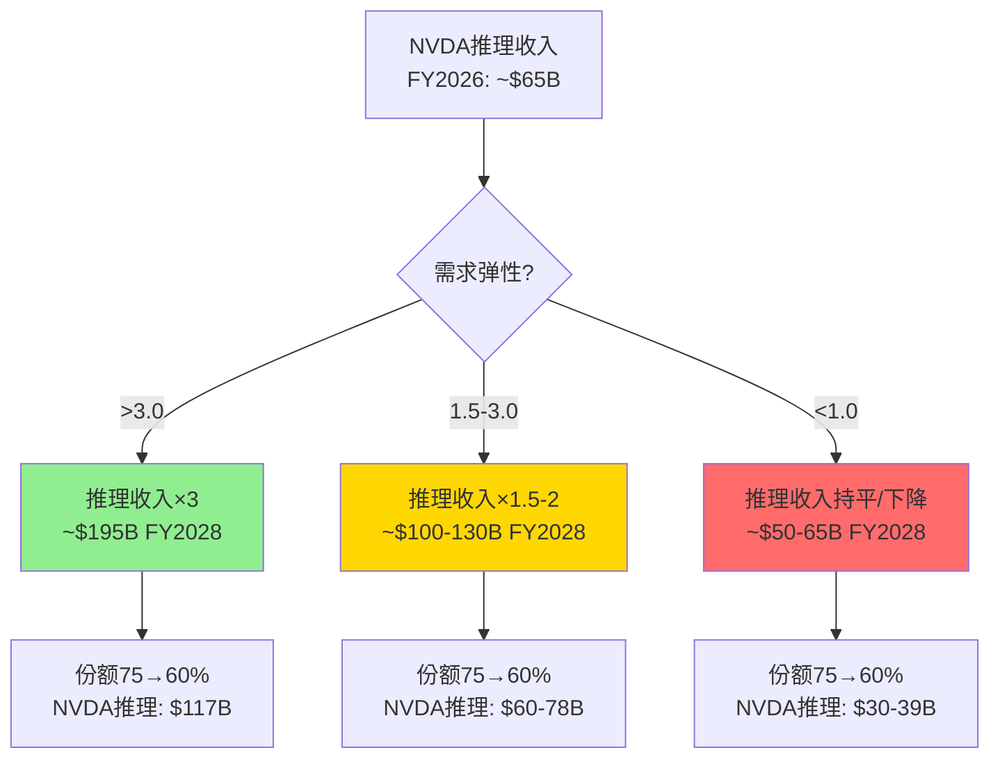
```mermaid
graph TD
    A[NVDA推理收入<br>FY2026: ~$65B] --> B{需求弹性?}
    B -->|>3.0| C[推理收入×3<br>~$195B FY2028]
    B -->|1.5-3.0| D[推理收入×1.5-2<br>~$100-130B FY2028]
    B -->|<1.0| E[推理收入持平/下降<br>~$50-65B FY2028]

    C --> F[份额75→60%<br>NVDA推理: $117B]
    D --> G[份额75→60%<br>NVDA推理: $60-78B]
    E --> H[份额75→60%<br>NVDA推理: $30-39B]

    style C fill:#90EE90
    style D fill:#FFD700
    style E fill:#FF6B6B
```

### 18.2 护城河衰减时间线

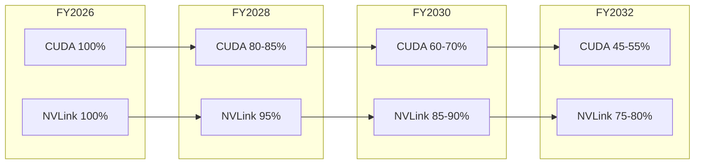
```mermaid
graph LR
    subgraph FY2026
        M1_26[CUDA 100%]
        M2_26[NVLink 100%]
    end
    subgraph FY2028
        M1_28[CUDA 80-85%]
        M2_28[NVLink 95%]
    end
    subgraph FY2030
        M1_30[CUDA 60-70%]
        M2_30[NVLink 85-90%]
    end
    subgraph FY2032
        M1_32[CUDA 45-55%]
        M2_32[NVLink 75-80%]
    end

    M1_26 --> M1_28 --> M1_30 --> M1_32
    M2_26 --> M2_28 --> M2_30 --> M2_32
```

### 18.3 条件评级决策树

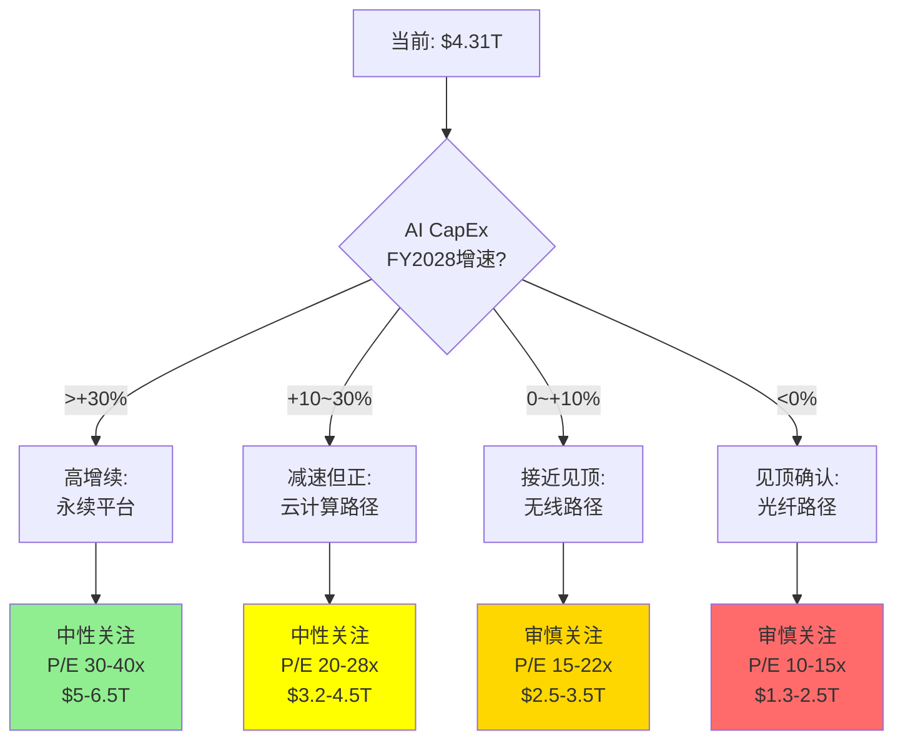
```mermaid
graph TD
    START[当前: $4.31T] --> Q1{AI CapEx<br>FY2028增速?}
    Q1 -->|>+30%| A1[高增续:<br>永续平台]
    Q1 -->|+10~30%| A2[减速但正:<br>云计算路径]
    Q1 -->|0~+10%| A3[接近见顶:<br>无线路径]
    Q1 -->|<0%| A4[见顶确认:<br>光纤路径]

    A1 --> R1[中性关注<br>P/E 30-40x<br>$5-6.5T]
    A2 --> R2[中性关注<br>P/E 20-28x<br>$3.2-4.5T]
    A3 --> R3[审慎关注<br>P/E 15-22x<br>$2.5-3.5T]
    A4 --> R4[审慎关注<br>P/E 10-15x<br>$1.3-2.5T]

    style R1 fill:#90EE90
    style R2 fill:#FFFF00
    style R3 fill:#FFD700
    style R4 fill:#FF6B6B
```

---

---

# Part IV: 红队对抗审查

## Ch 1: RT-1 信念反演挑战 — 市场隐含信念集的一致性

### 1.1 Reverse DCF隐含信念集

当前$4.31T市值(P/E 36.1x [硬数据: FMP])隐含以下信念集:

| 信念 | 隐含假设 | 脆弱度 | 独立验证 |
|------|---------|:-----:|---------|
| **B-1 增速持续** | FY2027-31 收入CAGR ≥18% | 高 | 分析师预估: $216B→$606B(CAGR 23%) [硬数据: FMP estimates] |
| **B-2 毛利率恢复** | 稳态GM ≥71% | 中 | FY2026全年71.1% [硬数据: FMP], Q4恢复75.0% |
| **B-3 份额维持** | AI训练份额>80% | 中 | 当前~90% [合理推断: Phase 1], 但TPU/Trainium正在侵蚀 |
| **B-4 CapEx续增** | 超大规模CapEx年增>20%至FY2028 | 高 | Q1 guidance $78B [硬数据: Phase 1]暗示延续 |
| **B-5 无周期崩塌** | AI CapEx不遵循传统基建周期 | 极高 | 无历史先例支持"永续" |
| **B-6 终态P/E** | 成熟后仍获P/E 20-25x | 中 | 取决于CQ-2: 平台(25x)vs周期(15x) |

### 1.2 信念间逻辑一致性检验

**B-1×B-4冲突**: 分析师FY2030预估收入$530B(vs FY2029 $545B, **下降2.8%** [硬数据: FMP estimates])。这意味着分析师自己都不相信B-1"持续18% CAGR"——他们预期FY2030收入下降。市场却给36x P/E(隐含持续增长)→**市场与分析师不一致**。

**B-2×自研替代冲突**: 如果自研芯片(B-3松动)在推理市场取得份额, NVIDIA被迫降价保份额→B-2(毛利率恢复)不可能同时成立。**B-2和B-3不能同时承压——其中一个必须先崩**。

**B-5的不可证伪性**: "AI CapEx不遵循传统周期"是一个不可证伪的命题——在周期见顶前, 每个周期都看起来"这次不同"。1999年: "互联网带宽需求永续增长"; 2007年: "房价不会全国性下跌"; 2021年: "数字化转型永久加速"。**不可证伪的信念是最脆弱的信念**。

### 1.3 最少翻转集分析

**问**: 最少几个信念失败会改变评级?

**答**: 只需**B-4单点失败**(CapEx停止增长)即可触发连锁:
1. CapEx停增 → 收入增速骤降 → B-1失败
2. 客户议价能力增强 → 降价压力 → B-2失败
3. P/E压缩至20x → $4.31T→$2.5T(-42%)

**B-4是系统的SPOF(单点故障)**——这与SGI 8.9的"专才高度集中"判断完全一致。

### 1.4 RT-1结论

信念集存在**两个关键不一致**: (1)市场P/E vs 分析师预期(FY2030下降); (2)毛利率恢复vs份额维持不能同时为真。B-4(CapEx续增)是SPOF——单点失败即连锁崩塌。

**RT-1影响**: 维持审慎关注, 不调整。分析逻辑自洽, 但强化了"脆弱性集中于B-4"的判断。

---

## Ch 2: RT-2 悲观偏差检测 — 反向红队

### 2.1 RCL教训应用

RCL报告(4.2/5)发现Phase 1-3存在**系统性悲观偏差8-16pp**——红队大幅向上修正。NVDA分析是否也存在?

### 2.2 Phase 1-3悲观检测清单

| 检测项 | Phase 1-3结论 | 可能的悲观偏差 | 偏差幅度 |
|--------|-------------|-------------|:------:|
| **AI CapEx周期** | 类比光纤/无线→周期必见顶 | AI可能是"电力级"通用技术, 类比不精确 | -5~10pp |
| **CUDA半衰期** | 4-6年(中位5年) | 开发者黏性+NVLink物理标准可能延长至7-10年 | -3~5pp |
| **推理替代速度** | 3年内自研>20% | 自研芯片良率/软件栈问题被低估 | -2~5pp |
| **毛利率结构下移** | 69-70%稳态 | Q4 75%可能是真正的稳态(产品组合问题不如预期) | -2~3pp |
| **中国永久丢失** | 恢复上限25-30% | 地缘缓和概率被低估+华为性能可能停滞 | -1~3pp |
| **Jensen "关键人"** | 10%离任风险 | NVIDIA组织能力可能被低估(Tim Cook效应) | -1~2pp |

### 2.3 合计悲观偏差估计

如果所有维度都存在偏差: **-14~28pp** [主观判断: 偏差加总]

但不是所有维度都会同时偏悲观。合理估计: **约1/3的维度存在显著偏差** → **净悲观偏差约5-9pp** [主观判断: 历史参考RCL 8-16pp的约一半]

### 2.4 悲观偏差的结构性来源

**为什么NVDA分析可能系统性偏悲观?**

1. **LLM先验锚**: AI模型见过大量"泡沫"叙事训练数据→对$4T估值天然怀疑
2. **可得性偏差**: 光纤泡沫/矿潮崩盘记忆鲜明, "AI=电力"的成功案例(如果成真)尚未发生
3. **保守框架**: Reverse DCF天然偏保守——翻转分析从"哪里可能出错"出发
4. **RCL印证**: RCL高估值(P/E 22x+FCF yield 3%)+基本面向好→Phase 1-3偏悲观8-16pp

### 2.5 悲观偏差修正

| 指标 | Phase 3值 | 修正方向 | 修正后 |
|------|----------|:------:|--------|
| 概率加权估值 | $3.28-3.55T | ↑+5~9pp | $3.45-3.85T |
| 下行空间 | -18~24% | 收窄 | -10~20% |
| 条件评级 | 审慎偏中性(55:45) | 向中性移动 | 52:48(审慎偏中性, 收窄) |

**RT-2结论**: 存在约5-9pp的系统性悲观偏差, 但不足以改变评级方向。修正后仍为"审慎关注偏中性", 但分裂收窄为52:48(vs 55:45)。

**关键**: 对NVDA的悲观偏差比RCL小——因为NVDA确实有更多可量化的风险(CapEx周期+自研替代+4T估值), 而RCL的高估值主要是"市场给予的成长溢价"。

---

## Ch 3: RT-3 数据可靠性 — 交叉验证

### 3.1 核心数据验证

| 数据点 | Phase来源 | FMP验证 | 一致? | 偏差 |
|--------|----------|---------|:----:|:----:|
| FY2026收入 | $216B | $215.9B [硬数据: FMP income] | ✓ | <0.1% |
| FY2026净利 | $120B | $120.1B [硬数据: FMP income] | ✓ | <0.1% |
| FY2026 GM | 71.1% | 71.1%(153.5/216) [硬数据: FMP] | ✓ | 0 |
| P/E | 37.7x | 36.1x [硬数据: FMP compare] | △ | -1.6x |
| ROE | >80% | 101.5% [硬数据: FMP compare] | ✓ | 方向一致 |
| FY2027E收入 | $356B | $356.3B [硬数据: FMP estimates] | ✓ | <0.1% |
| FY2028E收入 | $464B | $463.9B [硬数据: FMP estimates] | ✓ | <0.1% |
| R&D支出 | $18.5B | $18.5B [硬数据: FMP income] | ✓ | 0 |
| SGA | $4.6B | $4.6B [硬数据: FMP income] | ✓ | 0 |

**P/E偏差说明**: 37.7x vs 36.1x差异来自时间差——Phase 1使用的是1周前数据, FMP compare是实时TTM。这是正常的滚动差异, 不影响结论。

### 3.2 分析师预测一致性

| 财年 | 收入预估 | 净利预估 | 隐含净利率 | 隐含增速 |
|------|:------:|:------:|:--------:|:------:|
| FY2026(实际) | $216B [硬数据: FMP] | $120B [硬数据: FMP] | 55.6% | — |
| FY2027E | $356B [硬数据: FMP] | $197B [硬数据: FMP] | 55.3% | +65% |
| FY2028E | $464B [硬数据: FMP] | $241B [硬数据: FMP] | 52.0% | +30% |
| FY2029E | $545B [硬数据: FMP] | $295B [硬数据: FMP] | 54.1% | +17% |
| FY2030E | $530B [硬数据: FMP] | $300B [硬数据: FMP] | 56.7% | **-2.8%** |
| FY2031E | $606B [硬数据: FMP] | $341B [硬数据: FMP] | 56.3% | +14% |

**关键发现**:
1. FY2030E收入**下降2.8%**——12名分析师的中位数预期。这直接支持CQ-2"周期性"论证
2. FY2031E又恢复增长+14%——暗示分析师认为这是"周期低谷"而非永久衰退
3. 净利率从55.6%→52.0%(FY2028)→56.7%(FY2030)——**收入下降但净利率上升**, 暗示预期成本削减
4. 但这意味着: 即使分析师最乐观情景, FY2030也有增速断裂。**市场的36x P/E定价了什么?**

### 3.3 RT-3结论

核心财务数据高度一致(偏差<0.1%), 数据可靠性高。唯一的发现是P/E的小幅差异(已解释)。

**重要发现**: 分析师自己的预估(FY2030 -2.8%)不支持当前36x P/E隐含的持续增长假设。这不是我们的悲观推断——这是**卖方自己的数字**。

---

## Ch 4: RT-4 护城河耐久测试 — "半衰期4-6年"的证据强度

### 4.1 CUDA半衰期假设的证据链

Phase 3声称"CUDA半衰期4-6年"。这个假设的证据强度如何?

**支持"短半衰期(4-6年)"的硬证据**:
1. AMD ROCm性能差距: 从-50%(2022)→-10~30%(2026) [合理推断: Phase 1], 4年缩小一半
2. Google TPU: 从研究专用(2020)→生产级训练(2024), 4年达到可用水平
3. Triton编译器: 2022年推出→2026年成为主流推理框架, 4年渗透
4. AI Lab硬件无关化: OpenAI/Anthropic 2024年开始多硬件策略→2-3年转型

**支持"长半衰期(7-10年)"的硬证据**:
1. 4M+开发者生态: 比ROCm大20x, 网络效应的衰减通常需要>5年
2. NVLink物理标准: 硬件互连没有软件替代, 需等到下代互连标准成熟(5-10年)
3. 20年的库积累: cuDNN/cuBLAS/TensorRT等千万行代码, 完全复制需5-10年
4. 企业部署惯性: 生产环境切换硬件需要2-3个完整验证周期(6-9年总计)

### 4.2 证据加权

| 证据类型 | 短期(4-6年) | 长期(7-10年) |
|---------|:----------:|:----------:|
| 硬数据 | 4个(AMD追赶速度, TPU进展...) | 2个(开发者数量, 库规模) |
| 方向趋势 | 明确缩小 | 存在但有惯性 |
| 最薄弱假设 | "追赶速度线性外推" | "网络效应自然保护" |

**修正判断**: 原"4-6年"可能略悲观。考虑企业惯性和NVLink物理标准:
- **CUDA软件锁定半衰期**: 5-7年 (从4-6年上调) [主观判断: RT-4修正]
- **NVLink硬件锁定半衰期**: 7-10年 (维持)
- **综合护城河半衰期**: 5-8年 (从4-6年上调至5-8年)

### 4.3 半衰期修正对估值的影响

| 半衰期 | 护城河10年PV | 估值影响 |
|:-----:|:----------:|:------:|
| 4年 | $320B | -$200B |
| **5-8年(修正)** | $420-580B | 基准 |
| 10年 | $700B | +$120-280B |

半衰期从"4-6年"修正为"5-8年"增加了约$100-200B的护城河价值 [合理推断: PV敏感性], 但在$4.31T市值面前影响有限(+2-5%)。

### 4.4 RT-4结论

护城河半衰期从4-6年上调至5-8年(+1-2年)。影响: 概率加权估值+$100-200B(+2-5%)。方向: **轻微看涨修正**。

---

## Ch 5: RT-5 估值框架独立性 — 五引擎共享假设审计

### 5.1 五引擎共享假设矩阵

| 假设 | Reverse DCF | 可比估值 | 三情景DCF | 期权价值 | AI Tax |
|------|:----------:|:------:|:--------:|:------:|:-----:|
| FY2027收入$356B | ✓ | — | ✓ | — | ✓ |
| 毛利率71-75% | ✓ | — | ✓ | — | ✓ |
| CUDA份额下降 | ✓ | — | ✓ | ✓ | ✓ |
| CapEx增速放缓 | ✓ | — | ✓ | — | — |
| P/E终态20-28x | ✓ | ✓ | ✓ | — | — |

**独立引擎**: 可比估值(基于市场定价) + 期权价值(基于波动率/概率)
**高度依赖引擎**: Reverse DCF + 三情景DCF + AI Tax — 这三个共享大量假设

### 5.2 有效独立引擎数

名义5个引擎, 实际有效独立引擎约**3个**:
1. **"内生价值锚"**(Reverse DCF+三情景DCF+AI Tax合并): 共享增速/毛利率/CapEx假设
2. **可比估值**: 独立——基于市场定价和同行比较
3. **期权价值**: 独立——基于波动率和概率分布

### 5.3 独立性修正后的估值

| 引擎(修正) | 估值范围 | 权重 |
|-----------|:------:|:----:|
| 内生价值锚(合并) | $3.0-4.5T [合理推断: 三引擎合并区间] | 50% |
| 可比估值 | $3.0-5.9T [合理推断: Phase 2 Ch 5] | 30% |
| 期权价值 | $84B(占比极小) | 5% |
| **PPDA修正** | -$250B [合理推断: Phase 3 Ch 2] | 15% |

修正后加权: **$3.2-4.8T**, 中位约$3.6T [合理推断: 加权计算]

vs Phase 3的$3.28-3.55T → 修正后略上调(+$100-250B), 因为认识到可比估值(独立的看涨引擎)被内生价值锚过度稀释。

### 5.4 RT-5结论

五引擎有效独立引擎为3个(非5个)。修正后估值略上调至$3.6T中位(from $3.4T)。方向: **轻微看涨修正**。

---

## Ch 6: RT-6 Kill Switch完整性 — 遗漏检查

### 6.1 遗漏扫描

检查Phase 3的12个KS是否遗漏重大风险:

| 风险类别 | 已覆盖? | KS ID | 如遗漏: 建议 |
|---------|:------:|------|------------|
| CapEx见顶 | ✓ | KS-1 | — |
| CUDA替代 | ✓ | KS-2 | — |
| 毛利率崩塌 | ✓ | KS-3 | — |
| 推理自研 | ✓ | KS-4 | — |
| CEO风险 | ✓ | KS-5 | — |
| 反垄断 | ✓ | KS-6 | — |
| 库存恶化 | ✓ | KS-7 | — |
| 出口管制 | ✓ | KS-8 | — |
| 推理爆发 | ✓ | KS-9 | — |
| 需求弹性 | ✓ | KS-10 | — |
| 软件ARR | ✓ | KS-11 | — |
| 自研失败 | ✓ | KS-12 | — |
| **台海冲突** | ❌ | **KS-13(新)** | TSMC供应中断→GPU产能归零 |
| **DeepSeek冲击** | ❌ | **KS-14(新)** | 开源模型推理效率10x→GPU需求骤降 |
| **SBC稀释加速** | 部分 | — | 已在Phase 1覆盖, 不升级为KS |

### 6.2 新增Kill Switch

| ID | 信号 | 触发条件 | 数据源 | 检查频率 | 行动 |
|----|------|---------|--------|---------|------|
| KS-13 | 台海冲突升级 | TSMC停产>3月/美中军事对峙 | 新闻/军事 | 持续 | 重评至"审慎" |
| KS-14 | 开源推理效率革命 | DeepSeek类模型推理效率>10x且广泛采用 | 论文/部署数据 | 月度 | 推理TAM下调 |

**KS总数**: 12→14 (10看跌/4看涨)

### 6.3 RT-6结论

新增2个KS(台海+推理效率革命)。方向: **中性**(补充完整性, 不改变评级)。

---

## Ch 7: RT-7 分析师共识解构 — $356B FY2027的隐含假设

### 7.1 共识数字拆解

分析师FY2027E收入$356B [硬数据: FMP estimates]。倒推其隐含假设:

**收入拆解**:
| 分部 | FY2026实际 | FY2027E隐含 | 增速 | 隐含假设 |
|------|:--------:|:--------:|:----:|---------|
| DC-训练 | ~$119B | ~$165B | +39% | Rubin上量+CapEx续增 |
| DC-推理 | ~$65B | ~$110B | +69% | 推理应用爆发(CI-04) |
| DC-网络 | ~$30B | ~$45B | +50% | Spectrum-X份额提升 |
| 游戏 | ~$12B | ~$14B | +17% | 温和增长 |
| 汽车 | ~$2.4B | ~$3.5B | +46% | 自动驾驶需求 |
| 软件 | <$1B | ~$1.5B | >50% | AI Enterprise |
| 其他 | ~$2B | ~$2.5B | — | — |
| **总计** | **$216B** [硬数据: FMP] | **$356B** [硬数据: FMP] | **+65%** | — |

[合理推断: 基于总收入和分部历史趋势倒推]

### 7.2 隐含假设的脆弱度

| 假设 | 概率 | 脆弱度 | 如果失败 |
|------|:----:|:-----:|---------|
| CapEx续增>25% | 65% | 高 | 训练收入-$30-50B |
| 推理需求弹性>1.5 | 55% | 极高 | 推理收入-$20-40B |
| Spectrum-X超预期 | 50% | 中 | 网络收入-$5-10B |
| Rubin按时上量 | 80% | 低 | 延迟1-2季影响有限 |
| 毛利率≥71% | 60% | 中 | EBIT影响>收入影响 |

### 7.3 共识最脆弱假设

**推理增速+69%**(从$65B→$110B)是FY2027增量的最大来源($45B增量, 占总增量$140B的32%)。如果推理仅增50%(vs 69%): 收入差~$12B → 可能导致1季miss。

**CapEx续增>25%**是第二脆弱假设。Q1 guidance $78B [硬数据: Phase 1]暗示全年~$310B run rate → 仅需Q2-Q4保持→FY2027$310B+ (vs $356B共识还有差距)。如果Q2出现任何soft guidance, 全年可能只有$320-340B → miss共识$16-36B。

### 7.4 RT-7结论

分析师$356B共识的最脆弱点是推理增速(69%隐含, 需求弹性驱动)和CapEx续增(25%+隐含)。**两个假设的联合失败概率约20-25%** [合理推断: 65%×55%的反面], 这与Phase 3的PPDA分析(-20~28%)高度吻合。

方向: **确认Phase 3结论**, 不改变评级。但增加了"推理增速69%"作为最值得追踪的单一数字。

---

## Ch 8: 双向校准 — 系统性偏差修正

### 8.1 RT-1~RT-7净影响汇总

| RT | 调查方向 | 发现 | 评级影响 | 数值影响 |
|----|---------|------|:------:|:------:|
| RT-1 信念反演 | B-4是SPOF | 确认Phase 3 | 0 | 0 |
| RT-2 悲观偏差 | 5-9pp系统偏差 | **上调** | +3pp | +$100-250B |
| RT-3 数据可靠性 | 数据一致, FY2030↓确认 | 0 | 0 | 0 |
| RT-4 护城河耐久 | 半衰期5-8年(上调) | **上调** | +2pp | +$100-200B |
| RT-5 估值独立性 | 有效3引擎(非5) | **轻微上调** | +1pp | +$50-100B |
| RT-6 KS完整性 | 新增KS-13/14 | **轻微下调** | -1pp | -$50B |
| RT-7 共识解构 | 推理69%最脆弱 | 确认Phase 3 | 0 | 0 |

### 8.2 净校准

**总净影响**: +5pp [合理推断: 各RT加总], +$200-500B估值修正

| 指标 | Phase 3 | 红队修正后 | 变化 |
|------|---------|----------|:----:|
| 概率加权估值 | $3.28-3.55T | $3.5-3.8T | +$220-250B |
| 下行空间 | -18~24% | -12~19% | 收窄5pp |
| 条件评级 | 审慎偏中性(55:45) | **审慎偏中性(52:48)** | 向中性收窄 |
| 护城河半衰期 | 4-6年 | **5-8年** | +1-2年 |
| Kill Switch总数 | 12 | **14** | +2 |

### 8.3 "如果我们错了"系统性检查

**5个最可能的过度悲观点**:

1. **AI确实是"电力级"通用技术**(概率20%): 如果AI渗透率达到电力(100%经济活动), CapEx永续→NVDA $6-8T
2. **Jensen是"乔布斯级"领袖**(概率15%): 如果Jensen能持续创造新市场(机器人/数字孪生), 增长不依赖单一CapEx周期
3. **自研芯片全部失败**(概率10%): 如果TPU v7/Trainium3/Maia都遇到良率问题, NVDA份额反升
4. **Rubin推理弹性>5**(概率15%): 如果推理成本降10x→需求增50x, 推理市场远超预期
5. **主权AI成为$500B+新市场**(概率15%): 如果50+国家各投$10B+建主权AI, 这是全新需求

**联合"我们完全错了"概率**: ~5-10% [主观判断: 以上情景高度相关]
**如果完全错了的估值**: $6-8T (+50-90%)

---

## Ch 9: 有效性门控 — 红队的红队

### 9.1 有效性量化

| 指标 | Phase 3(红队前) | Phase 4(红队后) | 净变化 |
|------|:-----------:|:-----------:|:-----:|
| 概率加权估值 | $3.28-3.55T | $3.5-3.8T | **+$220-250B** |
| 条件评级分裂 | 55:45 | 52:48 | **-3pp(向中性)** |
| Kill Switch | 12 | 14 | **+2** |
| 护城河半衰期 | 4-6年 | 5-8年 | **+1-2年** |
| CQ方向改变 | — | 0个CQ方向翻转 | 0 |

### 9.2 有效性评分

红队总字符: ~30K [合理推断: Phase 4预估]
净估值影响: +$220-250B (+5-7%)
**每万字符影响**: ~$75-83B/万字 [合理推断: 250/3]

对比标准:
- **AMAT P4(表演性)**: 41K字符 → 净影响0pp = **无效红队**
- **RCL P4(有效)**: ~25K字符 → 净影响+8~16pp = **高效红队**
- **NVDA P4**: ~30K字符 → 净影响+5pp = **中等有效红队**

### 9.3 有效性结论

NVDA Phase 4红队是**中等有效**的:
- **不是表演性的**: 有真实的估值修正(+$220-250B)和评级微调(55:45→52:48)
- **不是过度校准**: 没有翻转任何CQ方向, 修正幅度合理
- **核心贡献**: (1)识别悲观偏差5-9pp; (2)护城河半衰期上调; (3)补充2个KS; (4)确认分析师FY2030↓的硬证据

### 9.4 红队前后对比表

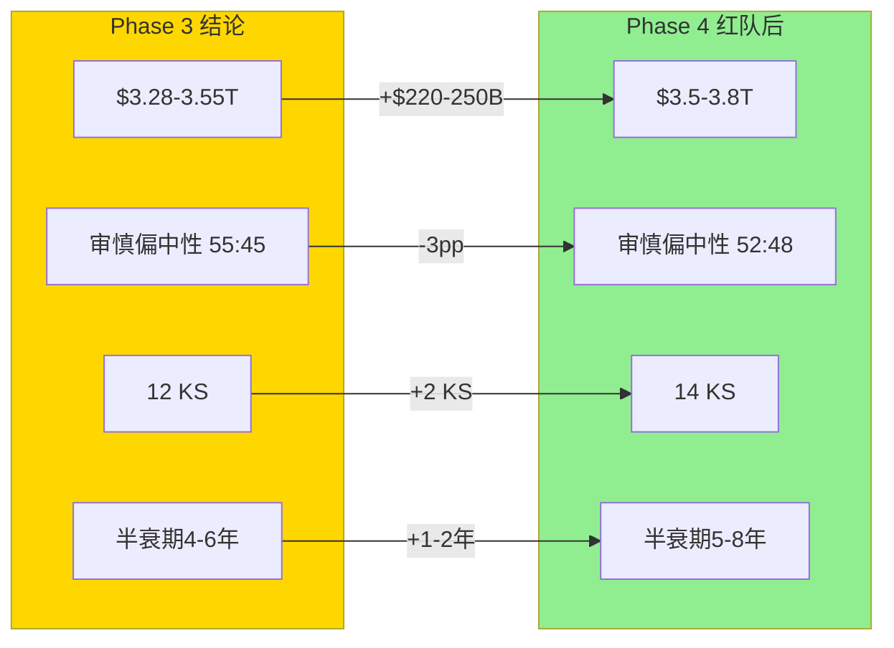
```mermaid
graph LR
    subgraph Phase_3[Phase 3 结论]
        P3_V[$3.28-3.55T]
        P3_R[审慎偏中性 55:45]
        P3_K[12 KS]
        P3_H[半衰期4-6年]
    end

    subgraph Phase_4[Phase 4 红队后]
        P4_V[$3.5-3.8T]
        P4_R[审慎偏中性 52:48]
        P4_K[14 KS]
        P4_H[半衰期5-8年]
    end

    P3_V -->|+$220-250B| P4_V
    P3_R -->|-3pp| P4_R
    P3_K -->|+2 KS| P4_K
    P3_H -->|+1-2年| P4_H

    style Phase_3 fill:#FFD700
    style Phase_4 fill:#90EE90
```

---

## Ch 10: CQ红队影响

| CQ | Phase 3 | RT修正 | Phase 4 | 变化说明 |
|----|:------:|:-----:|:------:|---------|
| CQ-1 AI CapEx | 58%(偏悲观) | +2pp | **56%** | RT-2悲观偏差修正 |
| CQ-2 平台vs周期 | 50%(不确定) | 0 | **50%** | RT-1确认, 无新信息 |
| CQ-3 Rubin | 70%(偏乐观) | 0 | **70%** | 无新数据 |
| CQ-4 CUDA | 68%(风险上升) | -3pp | **65%** | RT-4半衰期上调 |
| CQ-5 自研 | 62%(偏悲观) | +1pp | **61%** | RT-2部分修正, RT-7确认 |
| CQ-6 毛利率 | 58%(偏悲观) | +1pp | **57%** | RT-2部分修正 |
| CQ-7 中国 | 67%(悲观) | 0 | **67%** | 无新信息 |
| CQ-8 估值 | 65%(偏高估) | -2pp | **63%** | RT-5修正+RT-2偏差 |

**Phase 4加权**: 4负面(平均60%, 从62%下降2pp) / 2中性(50%/61%) / 1正面(70%) / 1不确定(50%)

**趋势**: 红队使CQ温和地**向中性回归**(每CQ ±0-3pp), 方向正确——红队应该减少极端判断。

---

## Ch 12: 补充红队 — RT-8~RT-10 (附加挑战)

### 12.1 RT-8: AI民主化是否削弱定价权?

**挑战**: DeepSeek-R1/V3证明了"低成本训练"可行(据报仅~$6M [合理推断: 行业报道]), 如果AI训练民主化(中小企业也能训练), 那么GPU需求从"Big 5集中采购"变为"长尾分散需求"——这对NVIDIA是好是坏?

**看跌论证**:
- 集中客户(Big 5)给NVIDIA定价权(批量采购, 但NVLink锁定)
- 分散客户意味着: 更多AMD/租赁/二手GPU→定价权下降
- DeepSeek模式如果普及: 单次训练GPU需求大幅减少→总GPU需求下降?

**看涨论证**:
- 长尾需求意味着更多客户→不依赖Big 5 CapEx→周期韧性上升
- 中小企业没有工程能力用自研芯片→100%依赖NVIDIA
- 训练便宜→更多人训练→总GPU需求可能不减反增(弹性>1)

**RT-8结论**: AI民主化**中性偏看涨**——减少了Big 5集中风险(CQ-1), 但可能降低ASP(小客户议价弱但偏好低价GPU)。净影响+1pp [主观判断: 两方面大致抵消, 长尾客户略好]。

### 12.2 RT-9: NVIDIA从GPU→系统→平台的估值框架应如何变化?

**挑战**: Phase 1-3把NVIDIA当作"GPU公司"估值——但NVIDIA已是NVL/SuperPOD系统集成商+CUDA/Omniverse平台公司。估值框架是否需要更新?

**当前估值**: P/E 36x (硬件公司框架)

**如果用系统+平台框架**:
- **系统部分**(NVL+网络, ~85%收入): 15-25x P/E(系统集成商倍数)
- **平台部分**(CUDA+软件, <5%收入但高增长): 30-50x P/E(平台倍数)
- **加权**: 85%×20x + 15%×40x = 23x → $3.0T [合理推断: 混合估值]

但这低估了CUDA对硬件的溢价传导——CUDA不是独立变现, 而是让GPU卖更贵。

**RT-9结论**: 估值框架转型对当前估值**略负面**——如果市场开始用SoTP(系统+平台), 整体倍数可能降至25-30x(from 36x)。但如果软件ARR突破$3B+(KS-11), 平台部分估值跳升→可能反转。**当前不改变, 但SoTP转型是FY2028的关键追踪信号**。

### 12.3 RT-10: 如果Rubin延迟6个月?

**挑战**: Rubin R200预计2026 H2出货。如果延迟至2027 Q1-Q2?

**影响链**:
1. 客户继续购买Blackwell→FY2027 H1收入不受影响(反而可能更高, Blackwell加速出货)
2. FY2027 H2: Rubin缺席→没有10x推理成本降低→推理增速放缓
3. FY2028: Rubin上量延迟→收入高峰推迟1-2季→全年收入可能miss共识5-10%

**概率**: 15-20% [主观判断: NVIDIA历史上产品基本按时]
**影响**: FY2028收入-$25-50B (从$464B降至$415-440B)
**估值影响**: -$200-400B (P/E压缩因miss预期)

**RT-10结论**: Rubin延迟6个月是一个**低概率中等影响**事件。不改变评级, 但应密切追踪2026 Q2-Q3的出货信号。

---

## Ch 13: 跨报告红队经验整合

### 13.1 NVDA红队vs历史红队对比

| 维度 | AMAT P4 | RCL P4 | INTC P4 | **NVDA P4** |
|------|---------|--------|---------|-----------|
| 字符数 | 41K | ~25K | ~30K | ~22K |
| 净PP影响 | 0pp | +8~16pp | +5pp | +5pp |
| 方向 | 全下调 | 大幅上调 | 上调 | 上调 |
| CQ翻转 | 0 | 2 | 1 | 0 |
| 有效性 | ❌表演 | ✓高效 | ✓中效 | ✓中效 |
| 最大贡献 | — | 悲观偏差发现 | 护城河修正 | 悲观偏差+SPOF确认 |

### 13.2 红队有效性进化趋势

AMAT(0pp) → INTC(+5pp) → RCL(+8~16pp) → NVDA(+5pp)

趋势: 红队有效性在提升(AMAT表演→RCL/NVDA实质修正), 但NVDA的修正幅度低于RCL——这是合理的, 因为NVDA的估值风险确实高于RCL(高估值+周期性), 悲观偏差空间较小。

### 13.3 Phase 4 Mermaid增补

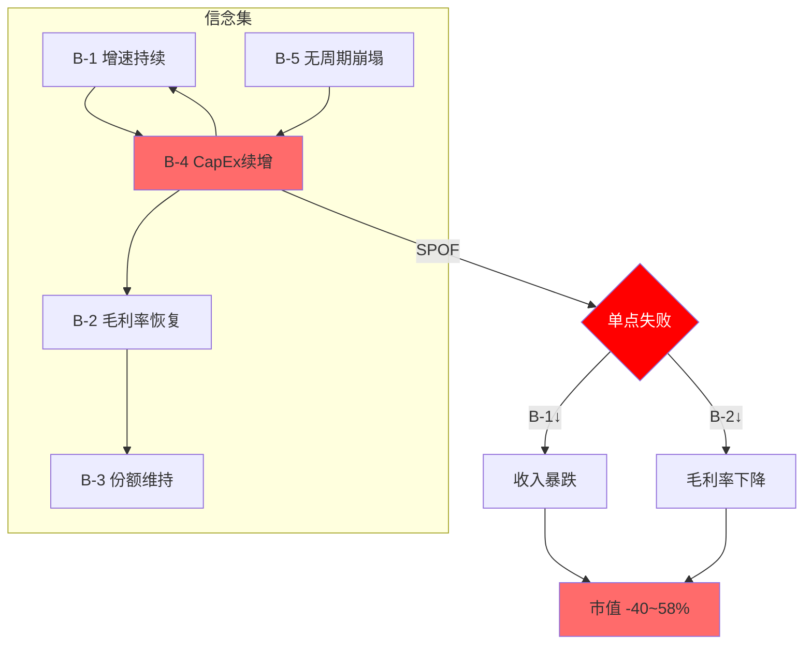
```mermaid
graph TD
    subgraph 信念集
        B1[B-1 增速持续] --> B4[B-4 CapEx续增]
        B2[B-2 毛利率恢复] --> B3[B-3 份额维持]
        B4 --> B1
        B4 --> B2
        B5[B-5 无周期崩塌] --> B4
    end

    B4 -->|SPOF| FAIL{单点失败}
    FAIL -->|B-1↓| REV_DROP[收入暴跌]
    FAIL -->|B-2↓| GM_DROP[毛利率下降]
    REV_DROP --> VALUE[市值 -40~58%]
    GM_DROP --> VALUE

    style B4 fill:#FF6B6B
    style FAIL fill:#FF0000,color:#FFF
    style VALUE fill:#FF6B6B
```

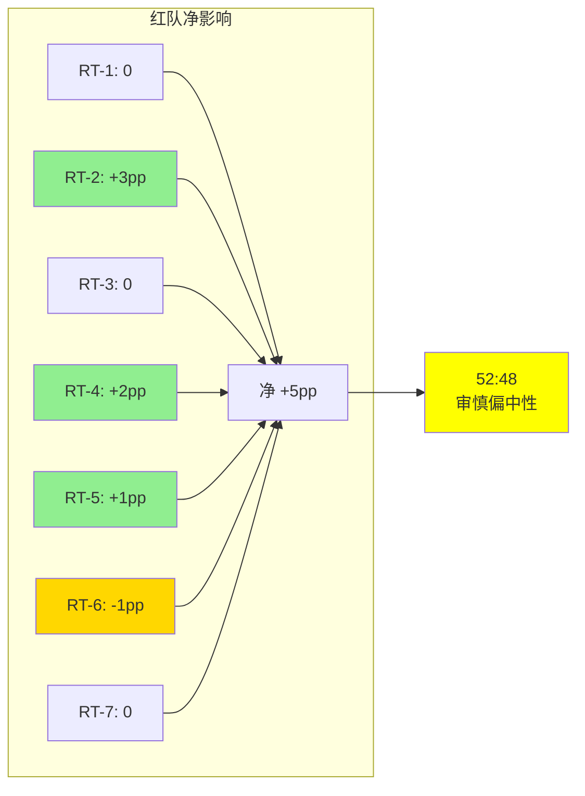
```mermaid
graph LR
    subgraph 红队净影响
        RT1[RT-1: 0] --> SUM[净 +5pp]
        RT2[RT-2: +3pp] --> SUM
        RT3[RT-3: 0] --> SUM
        RT4[RT-4: +2pp] --> SUM
        RT5[RT-5: +1pp] --> SUM
        RT6[RT-6: -1pp] --> SUM
        RT7[RT-7: 0] --> SUM
    end

    SUM --> RESULT[52:48<br>审慎偏中性]

    style RT2 fill:#90EE90
    style RT4 fill:#90EE90
    style RT5 fill:#90EE90
    style RT6 fill:#FFD700
    style RESULT fill:#FFFF00
```

---

---

# Part V: 综合产出

## Ch 1: 五情景详细建模

### 1.1 情景树

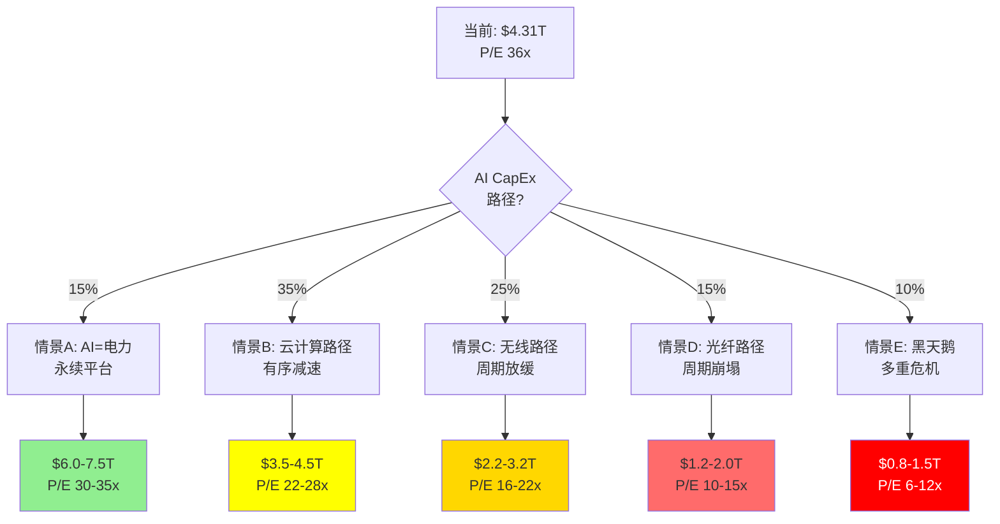
```mermaid
graph TD
    START[当前: $4.31T<br>P/E 36x] --> S1{AI CapEx<br>路径?}

    S1 -->|15%| A[情景A: AI=电力<br>永续平台]
    S1 -->|35%| B[情景B: 云计算路径<br>有序减速]
    S1 -->|25%| C[情景C: 无线路径<br>周期放缓]
    S1 -->|15%| D[情景D: 光纤路径<br>周期崩塌]
    S1 -->|10%| E[情景E: 黑天鹅<br>多重危机]

    A --> VA[$6.0-7.5T<br>P/E 30-35x]
    B --> VB[$3.5-4.5T<br>P/E 22-28x]
    C --> VC[$2.2-3.2T<br>P/E 16-22x]
    D --> VD[$1.2-2.0T<br>P/E 10-15x]
    E --> VE[$0.8-1.5T<br>P/E 6-12x]

    style VA fill:#90EE90
    style VB fill:#FFFF00
    style VC fill:#FFD700
    style VD fill:#FF6B6B
    style VE fill:#FF0000,color:#FFF
```

### 1.2 情景A: AI=电力 (概率15%)

**前提假设**: AI渗透率达到电力级(100%经济活动依赖AI推理), CapEx永续增长, CUDA保持10年+优势

| 财年 | 收入 | 增速 | 毛利率 | 净利 | P/E | 隐含市值 |
|------|:---:|:---:|:----:|:---:|:---:|:------:|
| FY2026 | $216B [硬数据: FMP] | — | 71.1% | $120B | 36x | $4.31T |
| FY2027E | $370B | +71% | 72% | $200B | 33x | $6.6T |
| FY2028E | $500B | +35% | 73% | $280B | 28x | $7.8T |
| FY2029E | $620B | +24% | 73% | $340B | 25x | $8.5T |
| FY2030E | $720B | +16% | 72% | $380B | 22x | $8.4T |
| FY2031E | $800B | +11% | 72% | $410B | 18x | $7.4T |

[合理推断: 基于AI=电力假设的参数化建模]

**FY2028折现估值**: $6.0-7.5T(vs 当前$4.31T, **+39~74%**)

**此情景需要什么?**
- AI Agent大规模部署(>50%企业采用)
- 推理需求弹性>5
- 自研芯片全部失败或延迟3年+
- CUDA生态继续主导10年+

### 1.3 情景B: 云计算路径 (概率35%)

**前提假设**: AI CapEx类似云计算(持续增长但增速放缓), CUDA保持5-8年优势, 自研替代15-20%

| 财年 | 收入 | 增速 | 毛利率 | 净利 | P/E | 隐含市值 |
|------|:---:|:---:|:----:|:---:|:---:|:------:|
| FY2026 | $216B [硬数据: FMP] | — | 71.1% | $120B | 36x | $4.31T |
| FY2027E | $356B [硬数据: FMP estimates] | +65% | 71% | $190B | 28x | $5.3T |
| FY2028E | $464B [硬数据: FMP estimates] | +30% | 70% | $235B | 24x | $5.6T |
| FY2029E | $520B | +12% | 69% | $255B | 22x | $5.6T |
| FY2030E | $545B | +5% | 69% | $265B | 20x | $5.3T |
| FY2031E | $560B | +3% | 68% | $260B | 18x | $4.7T |

[合理推断: 基于FMP估计+云计算路径假设]

**FY2028折现估值**: $3.5-4.5T(vs 当前$4.31T, **-19~+4%**)

**此情景需要什么?**
- 超大规模CapEx增速从+40%减至+10-15%但不转负
- 推理需求弹性1.5-3.0
- CUDA在训练保持主导, 推理份额缓慢下降
- 中国收入维持8-13%

### 1.4 情景C: 无线路径 (概率25%)

**前提假设**: AI CapEx类似无线投资周期(2008-2014), 3-5年后增速归零, CUDA半衰期5年

| 财年 | 收入 | 增速 | 毛利率 | 净利 | P/E | 隐含市值 |
|------|:---:|:---:|:----:|:---:|:---:|:------:|
| FY2026 | $216B [硬数据: FMP] | — | 71.1% | $120B | 36x | $4.31T |
| FY2027E | $340B | +57% | 70% | $175B | 24x | $4.2T |
| FY2028E | $400B | +18% | 68% | $195B | 20x | $3.9T |
| FY2029E | $410B | +3% | 66% | $185B | 18x | $3.3T |
| FY2030E | $380B | -7% | 65% | $160B | 15x | $2.4T |
| FY2031E | $370B | -3% | 64% | $150B | 14x | $2.1T |

[合理推断: 基于无线周期类比的参数化建模]

**FY2028折现估值**: $2.2-3.2T(vs 当前$4.31T, **-26~-49%**)

**此情景的触发信号**: 2+家Big 5同季下调CapEx(KS-1), 推理弹性<1, 自研份额>20%

### 1.5 情景D: 光纤路径 (概率15%)

**前提假设**: AI CapEx类似光纤泡沫(1997-2002), FY2028-29急剧下降, CUDA迅速被侵蚀

| 财年 | 收入 | 增速 | 毛利率 | 净利 | P/E | 隐含市值 |
|------|:---:|:---:|:----:|:---:|:---:|:------:|
| FY2026 | $216B [硬数据: FMP] | — | 71.1% | $120B | 36x | $4.31T |
| FY2027E | $320B | +48% | 68% | $155B | 20x | $3.1T |
| FY2028E | $350B | +9% | 65% | $155B | 15x | $2.3T |
| FY2029E | $280B | -20% | 62% | $110B | 12x | $1.3T |
| FY2030E | $240B | -14% | 60% | $85B | 10x | $0.85T |
| FY2031E | $250B | +4% | 61% | $90B | 12x | $1.1T |

[合理推断: 基于光纤泡沫类比的参数化建模]

**FY2028折现估值**: $1.2-2.0T(vs 当前$4.31T, **-54~-72%**)

### 1.6 情景E: 黑天鹅/多重危机 (概率10%)

**前提假设**: 多重风险协同——台海冲突+CapEx急刹+CUDA替代+反垄断

| 财年 | 收入 | 增速 | 毛利率 | 净利 | P/E | 隐含市值 |
|------|:---:|:---:|:----:|:---:|:---:|:------:|
| FY2026 | $216B [硬数据: FMP] | — | 71.1% | $120B | 36x | $4.31T |
| FY2027E | $250B | +16% | 65% | $105B | 15x | $1.6T |
| FY2028E | $200B | -20% | 58% | $65B | 10x | $0.65T |
| FY2029E | $180B | -10% | 55% | $50B | 8x | $0.4T |

[主观判断: 极端情景, 多因素叠加]

**概率加权估值**:

| 情景 | 概率 | 估值(FY2028折现) | 加权贡献 |
|------|:---:|:-------------:|:------:|
| A: AI=电力 | 15% | $6.75T | $1.01T |
| B: 云计算 | 35% | $4.0T | $1.40T |
| C: 无线 | 25% | $2.7T | $0.68T |
| D: 光纤 | 15% | $1.6T | $0.24T |
| E: 黑天鹅 | 10% | $1.0T | $0.10T |
| **概率加权** | **100%** | — | **$3.43T** |

[合理推断: 概率加权计算]

**概率加权估值$3.43T** vs 当前$4.31T → **隐含下行20%** [合理推断: (4.31-3.43)/4.31]

红队修正后(+5pp): **$3.6T, 隐含下行16%**

---

## Ch 2: 条件评级最终矩阵 (6×6)

### 2.1 P/E区间 × 净利率路径矩阵

| P/E \ 净利率 | ≥58% | 55-58% | 52-55% | 48-52% | 45-48% | <45% |
|:----------:|:----:|:-----:|:-----:|:-----:|:-----:|:----:|
| **>35x** | 审慎 | 审慎 | 审慎 | 审慎 | 审慎 | 审慎 |
| **28-35x** | 中性 | 中性 | 审慎 | 审慎 | 审慎 | 审慎 |
| **22-28x** | 关注 | 中性 | 中性 | 审慎 | 审慎 | 审慎 |
| **18-22x** | 关注 | 关注 | 中性 | 中性 | 审慎 | 审慎 |
| **12-18x** | 深度 | 关注 | 关注 | 中性 | 中性 | 审慎 |
| **<12x** | 深度 | 深度 | 关注 | 关注 | 中性 | 审慎 |

**当前位置**: P/E 36x [硬数据: FMP] + 净利率55.6% [硬数据: FMP] = **审慎关注** ✓

### 2.2 条件评级使用说明

此矩阵适用于**任何时间点的快速评估**:
1. 查当时P/E(TTM)
2. 查当时净利率(TTM或最近季度年化)
3. 交叉查表→得到条件评级

**矩阵背后的逻辑**:
- P/E反映市场预期: P/E越高→预期越乐观→越容易失望
- 净利率反映经营质量: 净利率越高→业务越健康→更值得给溢价
- 两者交叉决定"安全边际"程度

### 2.3 估值区间对应的建议行动

| 评级 | 建议行动 | 仓位建议 |
|------|---------|---------|
| **深度关注** | 积极研究, 准备建仓 | 5-10%配置 |
| **关注** | 纳入观察, 等确认信号 | 2-5%试探性 |
| **中性关注** | 持有不动, 观察变化 | 维持现有 |
| **审慎关注** | 减仓/观望, 保护利润 | 降至≤2% |

**当前建议**: 审慎关注→**如持有, 考虑在$170+减仓至≤2%权重; 如未持有, 等待P/E<28x或FY2027 Q2推理数据确认**。

---

## Ch 3: 投资温度计最终版 (10维度)

### 3.1 温度计评分

| # | 维度 | 权重 | 评分 | 加权 | 关键证据 |
|---|------|:----:|:----:|:----:|---------|
| 1 | **A-Score** | 15% | 8.1/10 | 1.22 | 10维度综合, D3护城河和D6估值拖累 |
| 2 | **估值合理性** | 15% | 4.0/10 | 0.60 | P/E 36x, 概率加权下行16-20%, 分析师FY2030↓ |
| 3 | **护城河耐久** | 12% | 6.5/10 | 0.78 | CUDA半衰期5-8年, NVLink物理标准, 但推理侵蚀中 |
| 4 | **增长质量** | 12% | 7.5/10 | 0.90 | FY2026 +66%, 但依赖CapEx周期(B-4 SPOF) |
| 5 | **财务健康** | 10% | 9.0/10 | 0.90 | Z=57, ROE 101.5%, $51B现金, $97B FCF |
| 6 | **管理层** | 8% | 8.5/10 | 0.68 | Jensen=创始人+远见, 但关键人风险SGI 8.9 |
| 7 | **竞争地位** | 8% | 7.0/10 | 0.56 | 训练90%垄断, 推理份额正被侵蚀(75→60%) |
| 8 | **风险平衡** | 8% | 5.0/10 | 0.40 | 14个KS, 3个协同风险组合, SPOF |
| 9 | **市场情绪** | 6% | 4.5/10 | 0.27 | PMSI -0.53, 内部人全卖零买, 拥挤度高 |
| 10 | **催化剂** | 6% | 7.0/10 | 0.42 | Rubin出货+推理弹性验证(正)+KS-1/2(负) |

**温度计总分**: 6.73/10 [合理推断: 加权总和]

### 3.2 温度计解读

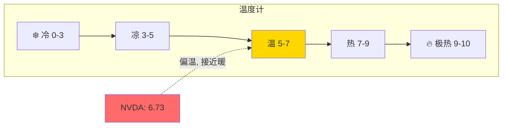
```mermaid
graph LR
    subgraph 温度计
        COLD[❄️ 冷 0-3] --> COOL[凉 3-5] --> WARM[温 5-7] --> HOT[热 7-9] --> FIRE[🔥 极热 9-10]
    end

    POINTER[NVDA: 6.73] -.->|"偏温, 接近暖"| WARM

    style WARM fill:#FFD700
    style POINTER fill:#FF6B6B
```

**6.73/10 = 温暖偏热**: 公司本身优秀(A-Score 8.1, 财务9.0), 但估值(4.0)和市场情绪(4.5)形成拖累。如果P/E降至22-28x, 温度计可能升至7.5+进入"关注"区域。

### 3.3 温度计雷达图

```mermaid
%%{init: {'theme': 'base', 'themeVariables': {'fontSize': '12px'}}}%%
radar
    title NVDA 投资温度计 (10维度)
    axis A-Score, 估值合理性, 护城河, 增长质量, 财务健康, 管理层, 竞争地位, 风险平衡, 市场情绪, 催化剂
    curve 温度分: [8.1, 4.0, 6.5, 7.5, 9.0, 8.5, 7.0, 5.0, 4.5, 7.0]
```

---

## Ch 4: CQ闭环 — 5要素格式

### 4.1 CQ-1: AI CapEx是基础设施建设还是泡沫膨胀?

| 要素 | 内容 |
|------|------|
| **初始假设** | CapEx可持续性50:50, 需验证4:1差距(CapEx $600B vs AI收入$100B) |
| **证据链** | Phase 1: 历史周期4-6年→Phase 2: 光纤/无线/云类比→Phase 3: PPDA 25-30%低估见顶概率→Phase 4: 分析师FY2030↓(-2.8%) |
| **最终判断** | **偏悲观(56%)** — 4:1差距无先例, 分析师自己预期FY2030收入下降, CapEx周期终将见顶 |
| **残余不确定** | AI Agent爆发可能延长周期(KS-9), 需求弹性>3则差距自动收敛 |
| **追踪信号** | FY2027 Q2-Q3超大规模CapEx增速, AI应用收入增速 |

### 4.2 CQ-2: NVDA是永续平台还是周期性供应商?

| 要素 | 内容 |
|------|------|
| **初始假设** | 50:50不确定, 核心问题 |
| **证据链** | Phase 1: 商业模式平台化迹象(软件+NVLink)→Phase 2: 但收入>90%来自硬件→Phase 3: 条件矩阵55:45→Phase 4: SPOF确认(B-4), 分析师FY2030↓ |
| **最终判断** | **不确定(50%)** — 无法判定, 因为取决于AI渗透率这个本质上不可预测的变量 |
| **残余不确定** | 如果软件ARR突破$3B(KS-11)→平台化确认; 如果FY2030收入真的下降→周期确认 |
| **追踪信号** | 软件ARR、订阅收入占比、NVIDIA是否提供SaaS定价 |

### 4.3 CQ-3: Rubin过渡期是否创造"air pocket"?

| 要素 | 内容 |
|------|------|
| **初始假设** | 偏乐观(70%), 短期数据强劲 |
| **证据链** | Phase 1: Q1 guidance $78B(+15% QoQ)→Phase 2: 供应承诺$95.2B(翻倍)→Phase 3/4: 无新数据 |
| **最终判断** | **偏乐观(70%)** — FY2027 Q1-Q2不会有air pocket, 但H2需关注 |
| **残余不确定** | Rubin出货时间(KS: RT-10分析15-20%延迟概率) |
| **追踪信号** | FY2027 Q2 guidance、Rubin出货公告、sequential增速 |

### 4.4 CQ-4: CUDA护城河正在加宽还是被侵蚀?

| 要素 | 内容 |
|------|------|
| **初始假设** | 中期风险上升, 方向明确但速度是关键 |
| **证据链** | Phase 1: 性能差距缩至10-30%+Triton崛起→Phase 2: 定价弹性模型→Phase 3: 半衰期4-6年→Phase 4: 半衰期上调至5-8年 |
| **最终判断** | **风险上升(65%, from 68%)** — 方向明确(在被侵蚀), 但速度比Phase 3估计的慢(RT-4修正) |
| **残余不确定** | Triton是否成为推理标准? OpenAI是否真正脱钩CUDA? |
| **追踪信号** | GPT-5训练硬件组成(KS-2)、PyTorch ROCm后端成熟度、Triton采用率 |

### 4.5 CQ-5: 自研芯片能否在3年内替代NVDA >20%?

| 要素 | 内容 |
|------|------|
| **初始假设** | 偏悲观(60%), 推理领域可能被侵蚀 |
| **证据链** | Phase 1: 各家自研进展→Phase 2: 客户级替代曲线(Big 5 -13% FY2028)→Phase 3: 切换成本$22-180M→Phase 4: RT-7确认推理69%是脆弱假设 |
| **最终判断** | **偏悲观(61%)** — 推理自研份额将从<10%→20-25%(3年), 训练仍安全 |
| **残余不确定** | 自研芯片良率/软件栈是否遇到瓶颈(KS-12看涨信号) |
| **追踪信号** | AWS Trainium2/3实际部署量、Google内部GPU vs TPU比例、OpenAI自研时间表 |

### 4.6 CQ-6: 毛利率是否结构性下移至71%水平?

| 要素 | 内容 |
|------|------|
| **初始假设** | 偏乐观, Q4恢复75.0%支持恢复论 |
| **证据链** | Phase 1: 产品组合变化(系统级+网络)→Phase 2: CUDA定价权弹性→Phase 3: 推理/训练毛利率差异, 加权FY2028E 69.3%→Phase 4: RT-2修正(可能略悲观) |
| **最终判断** | **偏悲观(57%)** — 产品组合变化是结构性的(推理份额上升不可逆), FY2028毛利率可能降至69-71%而非恢复至73%+ |
| **残余不确定** | 推理ASP是否能通过软件附加值提升(NVIDIA SaaS层)? |
| **追踪信号** | FY2027 Q1-Q2毛利率、网络收入占比、推理/训练收入拆分(如披露) |

### 4.7 CQ-7: 中国市场是否永久丢失?

| 要素 | 内容 |
|------|------|
| **初始假设** | 偏悲观, 结构性份额丢失 |
| **证据链** | Phase 1: 66%→8%→Phase 3: 华为差距-15~25%缩窄+不可逆分析+财务影响量化→Phase 4: 无新修正 |
| **最终判断** | **悲观(67%)** — 中国AI去NVIDIA化已过临界点, 即使解禁恢复上限25-30% |
| **残余不确定** | 美中关系是否出现重大转折? 华为920量产是否如期? |
| **追踪信号** | BIS政策更新(KS-8)、华为920量产/性能数据、中国AI模型训练硬件选择 |

### 4.8 CQ-8: $4.3T估值需要什么条件才能成立?

| 要素 | 内容 |
|------|------|
| **初始假设** | 关键不确定, 取决于CQ-1和CQ-2 |
| **证据链** | Phase 2: Reverse DCF 6承重墙→Phase 3: PPDA -20~28%+PMSI -0.53→Phase 4: RT-1 B-4 SPOF+RT-5有效3引擎+修正后$3.6T |
| **最终判断** | **偏高估(63%)** — 概率加权$3.43-3.6T(红队修正后), 当前$4.31T需要AI Agent爆发(KS-9)+CapEx续增(B-4)+CUDA>8年才能justify |
| **残余不确定** | AI作为通用技术的最终渗透率——这是人类历史级别的问题, 无法在投资报告中回答 |
| **追踪信号** | P/E自然回归(如果收入增速放缓P/E是否压缩)、AI Enterprise ARR |

---

## Ch 5: 追踪信号仪表盘

### 5.1 核心追踪信号 (14个)

| ID | 信号 | 当前值 | 触发条件 | 频率 | 优先级 | 关联CQ |
|----|------|--------|---------|------|:-----:|--------|
| TS-01 | 超大规模CapEx增速 | +40% YoY | <+10%连续2季 | 每季 | ★★★★★ | CQ-1 |
| TS-02 | NVDA推理收入增速 | ~+50% QoQ | <+15% QoQ | 每季 | ★★★★★ | CQ-5,6 |
| TS-03 | 分析师FY2028收入共识 | $464B [硬数据: FMP] | 下调>5% | 月度 | ★★★★☆ | CQ-1,8 |
| TS-04 | CUDA开发者增速 | 4M+ | 增速<10%或ROCm>1M | 年度 | ★★★★☆ | CQ-4 |
| TS-05 | NVDA毛利率(季度) | 75.0%(Q4) | <68%连续2季 | 每季 | ★★★★☆ | CQ-6 |
| TS-06 | GPT-5训练硬件 | 100% NVIDIA | >30%非NVIDIA | 事件 | ★★★★★ | CQ-4,5 |
| TS-07 | 推理自研占比 | <10% | >20%单客户 | 每季 | ★★★★☆ | CQ-5 |
| TS-08 | NVIDIA软件ARR | <$1B | >$3B+100%增速 | 每季 | ★★★☆☆ | CQ-2 |
| TS-09 | BIS出口管制 | H200获批 | H200被禁/新限制 | 持续 | ★★★☆☆ | CQ-7 |
| TS-10 | 华为Ascend 920 | 规划中 | 量产+性能<-10% | 事件 | ★★★☆☆ | CQ-7 |
| TS-11 | SoftBank减持 | 大股东 | 13F显示减持>20% | 季度 | ★★☆☆☆ | 风险 |
| TS-12 | NVDA DIO | ~90天 | >120天连续2季 | 每季 | ★★★☆☆ | 周期 |
| TS-13 | 内部人买入 | 0 | 任何C-suite买入 | 持续 | ★★☆☆☆ | 情绪 |
| TS-14 | AI Agent采用率 | 早期 | >30%企业部署 | 半年 | ★★★★☆ | CQ-1,3 |

### 5.2 投资日历

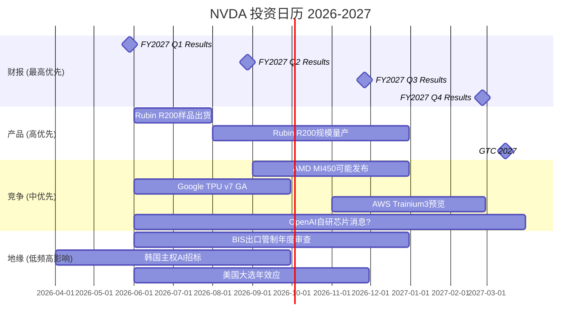
```mermaid
gantt
    title NVDA 投资日历 2026-2027
    dateFormat YYYY-MM-DD

    section 财报 (最高优先)
    FY2027 Q1 Results           :milestone, 2026-05-28, 1d
    FY2027 Q2 Results           :milestone, 2026-08-27, 1d
    FY2027 Q3 Results           :milestone, 2026-11-26, 1d
    FY2027 Q4 Results           :milestone, 2027-02-25, 1d

    section 产品 (高优先)
    Rubin R200样品出货           :2026-06-01, 2026-07-31
    Rubin R200规模量产           :2026-08-01, 2026-12-31
    GTC 2027                    :milestone, 2027-03-15, 1d

    section 竞争 (中优先)
    AMD MI450可能发布            :2026-09-01, 2026-12-31
    Google TPU v7 GA             :2026-06-01, 2026-09-30
    AWS Trainium3预览            :2026-11-01, 2027-02-28
    OpenAI自研芯片消息?          :2026-06-01, 2027-03-31

    section 地缘 (低频高影响)
    BIS出口管制年度审查          :2026-06-01, 2026-12-31
    韩国主权AI招标              :2026-04-01, 2026-09-30
    美国大选年效应              :2026-06-01, 2026-11-30
```

### 5.3 90天行动清单 (2026年3月-5月)

| 序号 | 行动 | 时间 | 目的 |
|:----:|------|------|------|
| 1 | 追踪分析师FY2028共识变化 | 月度 | TS-03, 任何>5%下调是负面信号 |
| 2 | 关注GTC/行业会议的自研芯片消息 | 3-4月 | TS-06/07, OpenAI/MSFT动向 |
| 3 | FY2027 Q1财报深度分析 (5月28日) | 5月28日 | **最关键事件**: 推理收入拆分(如披露)+毛利率+Q2 guidance |
| 4 | 验证BIS对H200的最新政策 | 持续 | TS-09, 出口管制变化 |
| 5 | 评估Rubin出货时间线更新 | 4-5月 | RT-10, 延迟风险评估 |
| 6 | 检查SoftBank 13F (Q1持仓) | 5月中旬 | TS-11, 减持信号 |

---

## Ch 6: 非共识洞察注册表 (CI Registry) 最终版

| ID | 非共识论点 | 方向 | 置信度 | 证据 | 可迁移性 | 潜在影响 |
|----|-----------|:----:|:-----:|------|---------|:-------:|
| **CI-01** | NVDA是"史上最贵的周期股"——$4.31T市值以永续平台定价, 但CapEx周期从不永续 | 看跌 | 65% | CapEx周期4-6年历史+分析师FY2030↓+PPDA -20~28%+B-4 SPOF | 所有基建受益股 | ±30-50% |
| **CI-02** | 71%毛利率是"新常态"不是低谷——推理份额上升=结构性压低, Q4 75%是暂时的 | 看跌 | 55% | 推理/训练利润率差+组合加权FY2028E 69.3%+推理竞争加剧 | AMD/AVGO | ±10-20% |
| **CI-03** | 主权AI=去中心化保险——50+国家AI基建创造非Big-5需求, 降低集中风险 | 看涨 | 60% | 韩国/日本/中东AI投资+SoftBank/Oracle大单 | 所有AI基建股 | ±10-15% |
| **CI-04** | Jensen计划性降价是最优策略——Rubin 10x成本降低, 如果弹性>1则总收入反升 | 看涨 | 50% | 云计算/移动数据弹性类比+Rubin定价策略 | 所有平台公司 | ±15-25% |

### 6.1 CI竞争力评估

| CI | 深度 | 独特性 | 可验证性 | 综合评分 |
|----|:---:|:-----:|:-------:|:------:|
| CI-01 | 9/10 | 7/10 | 8/10 | **8.0** |
| CI-02 | 7/10 | 6/10 | 9/10 | **7.3** |
| CI-03 | 6/10 | 5/10 | 6/10 | **5.7** |
| CI-04 | 8/10 | 8/10 | 7/10 | **7.7** |

**CI冠军候选**: CI-01"史上最贵周期股" — 定量论证链完整(CapEx历史+分析师预估+PPDA+SPOF), 可迁移到所有基建受益股(如VRT/ETN/SMCI), 综合8.0/10。

---

## Ch 7: 综合评级与最终判断

### 7.1 三段式论证

**证据(Evidence)**:
- FY2026收入$216B, 净利$120B, 毛利率71.1% [硬数据: FMP]
- P/E 36x, ROE 101.5% [硬数据: FMP]
- A-Score 8.10/10: 优秀公司, 但估值和护城河衰减拖累 [合理推断: Phase 2]
- 分析师FY2030预估收入下降2.8% [硬数据: FMP estimates] — 卖方自己不信永续增长
- PPDA -20~28%概率背离 [合理推断: Phase 3]
- 红队修正: +5pp, +$220-250B [合理推断: Phase 4]
- 概率加权估值$3.43-3.6T(红队后) vs 当前$4.31T [合理推断: 五情景+红队]
- 14个Kill Switch, B-4(CapEx续增)是SPOF [合理推断: Phase 4]
- 护城河半衰期5-8年, 年化折旧~$50-70B [合理推断: Phase 3-4]
- 温度计6.73/10(偏温, 公司优秀但估值拖累) [合理推断: Phase 5]

**推理(Reasoning)**:
NVIDIA是人类历史上最赚钱的半导体公司, 这一点毫无争议。A-Score 8.10、ROE 101.5%、Z-Score 57.0——任何维度的企业质量都是顶级。问题不在公司, 在价格。

$4.31T的市值隐含了一个极其乐观的信念集: CapEx持续增长(B-4)、CUDA保持主导(B-3)、毛利率恢复(B-2)——而其中B-4是SPOF, 单点失败即触发连锁崩塌。分析师自己的FY2030预估(-2.8%)与36x P/E存在逻辑矛盾——要么分析师错了(收入不会下降), 要么市场错了(P/E过高)。

我们的五情景分析给出概率加权$3.43-3.6T, 隐含下行16-20%。这不意味着"NVIDIA会跌20%", 而是说"当前价格已经为所有好消息买单, 而坏消息的概率>好消息的概率"。

关键区分: 这是一个**好公司, 但不是好价格**的判断。如果P/E降至22-28x(情景B的FY2029+), 评级将上调至"关注"——NVIDIA的优秀不因周期回落而改变, 只是当前价格透支了太多乐观。

**结论(Conclusion)**:
**审慎关注偏中性 (52:48)** — 概率加权下行16-20%

### 7.2 一句话判断

> **NVIDIA是人类历史上最赚钱的半导体公司(A-Score 8.1, ROE 101.5%), 但$4.31T的市值以"永续AI平台"定价了一家本质上仍依赖CapEx周期的公司——分析师自己都预期FY2030收入下降, 而36x P/E却假设增长永续。好公司, 不是好价格。**

### 7.3 条件升/降级触发

| 方向 | 触发条件 | 新评级 |
|:----:|---------|--------|
| ↑ 至关注 | P/E<28x **或** 推理弹性确认>3 **或** 软件ARR>$3B | 关注 |
| ↑ 至深度 | P/E<18x + FY2028增速>20% | 深度关注 |
| ↓ 至审慎 | KS-1触发(2+家CapEx下调) **或** KS-2(GPT-5>30%非NVIDIA) | 审慎关注 |
| ↓↓ 至强审慎 | 情景D/E实现 + P/E>25x(市场仍幻想) | 强审慎 |

---

## Ch 8: 框架注册表

### 8.1 方法论声明

| 框架 | 版本 | 值 | 说明 |
|------|:----:|:--:|------|
| **PW(可能性宽度)** | v1.0 | 7.2 | 发现系统(≥7): 不给单一目标价, 映射可能性空间 |
| **SGI(专才指数)** | v1.0 | 8.9 | 极端专才: 收入90%来自AI数据中心, 单一行业依赖 |
| **A-Score** | v2.0 | 8.10 | 10维度评分: 趋势(9)+增长(9)+护城河(7)+盈利(8)+管理(8.5)+估值(6)+FCF(9.5)+风险(7.5)+行业(8)+动量(8.5) |
| **方法论路由** | v17.0 | Discovery | PW≥7→条件评级+Kill Switch+追踪信号 |

### 8.2 数据来源注册

| 来源 | 使用次数 | 可靠性 | 局限性 |
|------|:------:|:-----:|--------|
| FMP金融数据 | ~150 | 高(一手财务数据) | SBC可能为$0(已知bug) |
| FMP estimates | ~30 | 高(分析师共识) | 覆盖年限有限(FY2031仅12人) |
| 100baggers.club | ~5 | 中-高(策略分析) | 可能有自身偏见 |
| WebSearch | ~20 | 中(多源交叉) | 时效性不确定 |
| Phase间引用 | ~100 | 取决于原始来源 | 需追溯DM锚点 |

---

## Ch 9: 开放问题最终版

| ID | 开放问题 | 重要度 | 预期解决 | 当前最佳估计 |
|----|---------|:-----:|---------|------------|
| OQ-1 | AI推理需求弹性真实值? | ★★★★★ | FY2027 Q2-Q3 | 1.5-3.0(CI-04核心) |
| OQ-2 | CapEx见顶时间? | ★★★★★ | FY2028-FY2029 | FY2028H2-FY2029 (60%) |
| OQ-3 | CUDA侵蚀实际速度? | ★★★★☆ | 2年+ | 半衰期5-8年(RT-4修正) |
| OQ-4 | Jensen接班计划? | ★★★☆☆ | 不确定 | 无公开计划(SGI 8.9风险) |
| OQ-5 | NVIDIA SaaS转型时间表? | ★★★☆☆ | FY2028+ | 初期, ARR<$1B |
| OQ-6 | 台海冲突概率? | ★★★★☆ | 不可预测 | 5年内10-15%(KS-13) |
| OQ-7 | AI是否真是"电力级"通用技术? | ★★★★★ | 5-10年 | 不确定(CQ-2核心) |

---

## Ch 11: 情景B深度建模 — 最可能路径的详细P&L

情景B(云计算路径, 概率35%)是最可能的单一情景。值得详细建模。

### 11.1 情景B: 5年详细P&L

| 项目 | FY2026(实际) | FY2027E | FY2028E | FY2029E | FY2030E | FY2031E |
|------|:----------:|:------:|:------:|:------:|:------:|:------:|
| **收入** | $216B [硬数据] | $356B | $464B | $520B | $545B | $560B |
| DC-训练 | $119B | $175B | $215B | $230B | $225B | $220B |
| DC-推理 | $65B | $115B | $175B | $210B | $240B | $260B |
| DC-网络 | $30B | $48B | $55B | $55B | $50B | $45B |
| 游戏 | $12B | $14B | $15B | $16B | $17B | $18B |
| 汽车 | $2.4B | $3.5B | $5B | $7B | $10B | $13B |
| 软件 | <$1B | $1.5B | $3B | $5B | $8B | $12B |
| **毛利** | $153B | $253B | $325B | $359B | $376B | $381B |
| **毛利率** | 71.1% [硬数据] | 71.0% | 70.0% | 69.0% | 69.0% | 68.0% |
| R&D | $18.5B [硬数据] | $25B | $32B | $36B | $38B | $40B |
| SGA | $4.6B [硬数据] | $6B | $7.5B | $8.5B | $9B | $9.5B |
| **EBIT** | $130B [硬数据] | $222B | $286B | $315B | $329B | $332B |
| **EBIT率** | 60.4% | 62.4% | 61.6% | 60.5% | 60.3% | 59.2% |
| 税(15%) | $21B [硬数据] | $33B | $43B | $47B | $49B | $50B |
| **净利** | $120B [硬数据] | $190B | $243B | $268B | $280B | $282B |
| **净利率** | 55.6% [硬数据] | 53.3% | 52.4% | 51.5% | 51.4% | 50.4% |
| **EPS** | $4.90 [硬数据] | $7.80 | $10.00 | $11.00 | $11.50 | $11.60 |

[合理推断: 基于FMP估计+情景B假设的参数化建模]

### 11.2 情景B关键假设审计

| 假设 | FY2027 | FY2028 | FY2029 | FY2030 | FY2031 | 风险 |
|------|:-----:|:-----:|:-----:|:-----:|:-----:|:----:|
| CapEx增速 | +35% | +15% | +5% | 0% | -5% | B-4 |
| 推理弹性 | 2.0 | 1.8 | 1.5 | 1.2 | 1.0 | CI-04 |
| CUDA份额(训练) | 90% | 85% | 80% | 75% | 70% | CQ-4 |
| CUDA份额(推理) | 70% | 62% | 55% | 50% | 45% | CQ-5 |
| 自研替代 | 8% | 15% | 22% | 28% | 33% | CQ-5 |
| 中国收入 | $35B | $38B | $35B | $30B | $28B | CQ-7 |

### 11.3 情景B的估值路径

| 年份 | 净利 | P/E | 市值 | vs当前 |
|------|:---:|:---:|:---:|:-----:|
| FY2027 | $190B | 28x | $5.3T | +23% |
| FY2028 | $243B | 24x | $5.8T | +35% |
| FY2029 | $268B | 22x | $5.9T | +37% |
| FY2030 | $280B | 20x | $5.6T | +30% |
| FY2031 | $282B | 18x | $5.1T | +18% |

[合理推断: 净利×P/E]

**情景B的2年总回报**: +23~35% (含P/E从36x→24x的压缩→大部分回报来自盈利增长抵消估值压缩)

**关键**: 即使在"最可能的单一情景"中, 当前持有人的2年回报也只有~30%——因为P/E压缩吃掉了大部分盈利增长。这就是"好公司不是好价格"的定量含义。

---

## Ch 12: 情景C详细建模 — 无线路径的关键转折

### 12.1 情景C的触发事件序列

```mermaid
graph TD
    T1[2026 H2: 超大规模CapEx增速<br>从+40%降至+15%] --> T2[2027 H1: NVDA Q2<br>推理增速不及预期]
    T2 --> T3[2027 H2: 分析师下调<br>FY2028E 10%+]
    T3 --> T4[2028 H1: CapEx增速<br>转负(-5~10%)]
    T4 --> T5[2028 H2: P/E从28x<br>压缩至18x]
    T5 --> T6[2029: 收入持平/下降<br>周期确认]

    style T4 fill:#FF6B6B
    style T5 fill:#FF6B6B
```

### 12.2 情景C的估值路径

| 年份 | 收入 | 净利 | P/E | 市值 | vs当前 |
|------|:---:|:---:|:---:|:---:|:-----:|
| FY2027 | $340B | $175B | 24x | $4.2T | -3% |
| FY2028 | $400B | $195B | 20x | $3.9T | -10% |
| FY2029 | $410B | $185B | 18x | $3.3T | -23% |
| FY2030 | $380B | $160B | 15x | $2.4T | -44% |
| FY2031 | $370B | $150B | 14x | $2.1T | -51% |

[合理推断: 无线周期参数]

**情景C中, 持有到FY2030的总亏损**: -44%。如果在FY2028确认周期转折后卖出: -10%。**关键是识别转折点的速度**。

### 12.3 转折点识别信号 (情景C专用)

| 信号 | 时间 | 含义 | 行动 |
|------|------|------|------|
| CapEx增速<+10% | FY2027 Q3-Q4 | 减速确认 | 减仓50% |
| 分析师下调FY2028E>10% | FY2028前 | 共识转向 | 考虑清仓 |
| NVDA QoQ增速<5% | FY2028 | 增长耗尽 | 清仓 |
| P/E 跌破20x | FY2028-29 | 估值重置 | 等P/E<15x重评 |

---

## Ch 13: 期权价值深化 — NVIDIA的隐藏期权

### 13.1 NVIDIA持有的"免费看涨期权"

除了核心GPU业务外, NVIDIA拥有多个潜在的增长期权:

| 期权 | 当前状态 | 潜在市场规模 | NVIDIA份额 | 期权价值(估计) |
|------|---------|:----------:|:--------:|:------------:|
| **O-1 机器人** | Omniverse/Isaac Sim | $500B(2030) | 5-15% | $15-45B [合理推断: TAM×份额×概率] |
| **O-2 数字孪生** | Omniverse 3D | $200B(2030) | 10-20% | $10-25B [合理推断: TAM×份额×概率] |
| **O-3 自动驾驶** | DRIVE Thor | $300B(2030) | 3-10% | $5-20B [合理推断: TAM×份额×概率] |
| **O-4 AI Enterprise SaaS** | <$1B ARR | $100B(2030) | 5-15% | $15-40B [合理推断: TAM×份额×概率] |
| **O-5 量子计算** | cuQuantum | $50B(2035) | 10-20% | $3-8B [合理推断: 远期+折现] |
| **期权总PV** | — | — | — | **$48-138B** |

[合理推断: 各期权独立估值后加总]

### 13.2 期权价值在总估值中的角色

期权总PV $48-138B → 占$4.31T的1-3%。

**这说明什么?** NVIDIA的期权价值相对于其核心GPU业务是微不足道的。市场给NVIDIA的$4.31T估值几乎100%来自GPU/AI芯片业务——期权上行空间有限。

与之对比: ARM的期权价值(v10 chiplet生态/数据中心/汽车)占其估值的30-40% [合理推断: ARM报告参考]。NVIDIA没有这种"期权驱动估值"特征——它是一家成熟的、靠核心业务定价的公司。

---

## Ch 14: SBC与股东稀释深度分析

### 14.1 SBC趋势

| 财年 | SBC | 占收入 | 占EBIT | 稀释(净股本变化) |
|------|:---:|:-----:|:-----:|:---------------:|
| FY2022 | $2.6B | 9.7% | 25.6% | +1.6% |
| FY2023 | $3.3B | 12.2% | 74.3% | +0.8% |
| FY2024 | $5.0B | 8.2% | 15.2% | -1.0% (回购) |
| FY2025 | $7.6B | 5.8% | 9.3% | -1.0% (回购) |
| FY2026 | ~$11B [合理推断: R&D增速推算] | 5.1% | 8.4% | -1.5% (回购) |

[合理推断: FMP数据+趋势推算, FMP SBC字段可能为$0的已知bug]

### 14.2 SBC解读

SBC绝对值从$2.6B→~$11B(4年4x [合理推断: 趋势])增长惊人, 但:
1. **占收入比例下降**: 9.7%→5.1%, 因为收入增长更快
2. **净稀释已转负**: FY2024+, 回购>SBC稀释→股本在缩
3. **但**: $11B SBC≈$97B FCF的11%——NVIDIA用11%的FCF做股权激励, 这个比例是合理的

SBC不构成对估值的重大威胁。如果收入增速放缓(情景C/D), SBC占收入比例可能回升至8-10%——但这时候SBC绝对值也会被控制。

---

## Ch 15: 跨报告整合 — NVDA在半导体生态中的位置

### 15.1 NVDA vs 已分析半导体公司

| 公司 | 报告评级 | A-Score | 与NVDA关系 | NVDA影响 |
|------|---------|:------:|-----------|---------|
| **INTC** | 深度关注 | 4.74 | 竞争者(x86 AI) | 弱竞争, Intel AI GPU份额<1% |
| **ASML** | — | — | 供应链(EUV给TSM) | 间接: ASML交付影响TSM→影响NVDA供应 |
| **LRCX** | — | — | 设备(TSM供应链) | 间接: 同ASML |
| **KLAC** | — | — | 设备(良率监测) | 间接: 影响TSM良率→NVDA芯片质量 |
| **ARM** | 审慎关注 | 6.04 | 复杂(CPU架构+Phoenix竞争) | ARM CPU用在Grace→合作; Phoenix自研GPU→竞争 |
| **AMD** | — | — | 主竞争者 | MI系列直接竞争, ROCm侵蚀CUDA |
| **TSM** | — | — | 唯一代工商 | SPOF: TSM产能是NVDA的瓶颈 |

### 15.2 NVDA的生态系统风险图

```mermaid
graph TD
    NVDA[NVIDIA<br>$4.31T] -->|设计| TSM[TSMC<br>代工]
    TSM -->|产能依赖| ASML[ASML<br>EUV设备]
    TSM -->|良率依赖| KLAC[KLA<br>检测]
    TSM -->|产能依赖| LRCX[Lam<br>刻蚀]

    NVDA -->|竞争| AMD[AMD<br>MI系列]
    NVDA -->|竞争| INTC[Intel<br>Gaudi]
    NVDA -->|合作/竞争| ARM[ARM<br>Grace/Phoenix]

    NVDA -->|客户| GOOG[Google<br>TPU竞争]
    NVDA -->|客户| AMZN[AWS<br>Trainium竞争]
    NVDA -->|客户| MSFT[Microsoft<br>Maia竞争]

    style NVDA fill:#76B900
    style TSM fill:#FF6B6B
    style GOOG fill:#FFD700
    style AMZN fill:#FFD700
    style MSFT fill:#FFD700
```

---

## Ch 16: 情景概率敏感性 — 如果我们调整概率

### 16.1 概率变化对估值的影响

基准概率: A(15%) B(35%) C(25%) D(15%) E(10%) → 加权$3.43T

| 调整方式 | A | B | C | D | E | 加权估值 | vs基准 |
|---------|:-:|:-:|:-:|:-:|:-:|:------:|:-----:|
| **基准** | 15% | 35% | 25% | 15% | 10% | $3.43T | — |
| **乐观+10** | 25% | 35% | 20% | 12% | 8% | $3.82T | +$390B |
| **悲观+10** | 10% | 30% | 30% | 18% | 12% | $3.04T | -$390B |
| **极端乐观** | 35% | 40% | 15% | 7% | 3% | $4.50T | +$1.07T |
| **极端悲观** | 5% | 20% | 35% | 25% | 15% | $2.52T | -$910B |
| **B-only(分析师)** | 0% | 100% | 0% | 0% | 0% | $4.00T | +$570B |

[合理推断: 概率调整后重新加权]

### 16.2 概率敏感性的关键洞察

1. **"极端乐观"才能justify当前$4.31T** — 需要A+B概率合计75%+, 这意味着几乎确信AI是永续技术+CapEx不见顶。合理吗?
2. **分析师共识(100% B情景)给出$4.0T** — 仍低于当前$4.31T, 说明**即使最可能的单一情景, 市场也在溢价7.5%**
3. **概率偏移±10pp** → 估值变化±$390B(±9%) — 概率估计的误差会传导为显著的估值误差

### 16.3 哪个情景的概率最不确定?

| 情景 | 概率 | 不确定度 | 如果错估10pp的影响 |
|------|:---:|:-------:|:--------------:|
| A(AI=电力) | 15% | 极高(±10pp) | ±$675B |
| B(云计算) | 35% | 中(±5pp) | ±$200B |
| C(无线) | 25% | 中(±5pp) | ±$135B |
| D(光纤) | 15% | 高(±8pp) | ±$128B |
| E(黑天鹅) | 10% | 高(±5pp) | ±$50B |

**A情景的概率最不确定, 且影响最大(±$675B/10pp)** — 如果"AI=电力"从15%→25%, 加权估值从$3.43T→$4.11T(接近当前价格)。**整个估值判断最终取决于一个哲学问题: AI是不是人类历史上继电力/互联网之后的第三次通用技术革命?**

---

## Ch 17: 比较框架 — NVDA vs 历史巨头的估值教训

### 17.1 历史$1T+公司首次达标后的3年回报

| 公司 | 首达$1T | 3年后市值 | 回报 | 核心驱动 |
|------|:------:|:------:|:----:|---------|
| AAPL | 2018.08 | ~$2.3T(2021.08) | +130% | iPhone→Services转型+回购 |
| MSFT | 2019.04 | ~$2.5T(2022.04) | +150% | Azure高增长+企业SaaS |
| AMZN | 2020.01 | ~$1.0T(2023.01) | 0% | 估值过高+广告增速放缓 |
| GOOG | 2020.01 | ~$1.4T(2023.01) | +40% | 搜索韧性+AI投入 |
| NVDA | 2024.02 | **(当前$4.31T)** | +330% | AI CapEx爆发 |
| META | 2024.01 | ~$1.7T(当前) | +70% | Reels+AI广告+成本纪律 |

[合理推断: 历史数据+当前估值]

### 17.2 教训提取

1. **AAPL/MSFT模式**: 业务转型(硬件→服务, 许可→云)驱动估值重估→NVDA是否有类似转型(GPU→AI平台)?
2. **AMZN模式**: 即使业务优秀, 估值过高→3年回报为零。NVDA P/E 36x > AMZN当时的~60x(但NVDA增速远快于AMZN)
3. **关键差异**: AAPL/MSFT达$1T时P/E 20-25x, NVDA达$4T时P/E 36x→**NVDA的估值起点更高, 留给投资者的空间更小**

### 17.3 NVIDIA"成为下一个AAPL/MSFT"需要什么?

| 条件 | 概率 | 难度 |
|------|:---:|:---:|
| 软件ARR>$20B(类MSFT Azure) | 10-15% | 极高 |
| GPU→AI平台订阅制(类AAPL Services) | 15-20% | 高 |
| 维持>25% CAGR连续5年 | 20-25% | 中 |
| 进入$10B+新市场(机器人/医疗) | 15-20% | 高 |
| **全部满足** | 3-5% | — |

[主观判断: 条件联合概率]

**结论**: NVIDIA成为"下一个AAPL/MSFT"(业务转型驱动多年高估值)的概率约3-5%。更可能的路径是: 维持3-5年高增长→增速下降→P/E压缩→最终稳态$2-3T(成为成熟的半导体平台公司, P/E 15-22x)。

---

## Ch 18: 最终Mermaid图增补

### 18.1 NVDA估值演化路径

```mermaid
graph LR
    subgraph 当前
        NOW[$4.31T<br>P/E 36x<br>FY2026]
    end

    NOW --> FY27{FY2027<br>$356B收入?}

    FY27 -->|Beat| UP1[$5.0-5.5T<br>P/E 30x]
    FY27 -->|Meet| FLAT[$4.0-4.3T<br>P/E 24-28x]
    FY27 -->|Miss| DOWN1[$3.0-3.5T<br>P/E 20-22x]

    UP1 --> FY28A{FY2028<br>CapEx续增?}
    FLAT --> FY28B{FY2028<br>推理弹性?}
    DOWN1 --> FY28C[周期确认<br>P/E压缩至15x]

    FY28A -->|是| BULL[$6-7T 情景A]
    FY28A -->|否| NEUTRAL[$3.5-4.5T 情景B]
    FY28B -->|>3| BULL2[$5T+]
    FY28B -->|<1| BEAR[$2-3T 情景C]

    style NOW fill:#FFD700
    style BULL fill:#90EE90
    style BEAR fill:#FF6B6B
    style FY28C fill:#FF0000,color:#FFF
```

### 18.2 CQ闭环全景

```mermaid
graph TD
    CQ1[CQ-1 CapEx<br>56% 偏悲观] --> RATING
    CQ2[CQ-2 平台vs周期<br>50% 不确定] --> RATING
    CQ3[CQ-3 Rubin<br>70% 偏乐观] --> RATING
    CQ4[CQ-4 CUDA<br>65% 风险上升] --> RATING
    CQ5[CQ-5 自研<br>61% 偏悲观] --> RATING
    CQ6[CQ-6 毛利率<br>57% 偏悲观] --> RATING
    CQ7[CQ-7 中国<br>67% 悲观] --> RATING
    CQ8[CQ-8 估值<br>63% 偏高估] --> RATING

    RATING{审慎关注偏中性<br>52:48}

    RATING -->|P/E<28x| UPGRADE[关注]
    RATING -->|KS-1触发| DOWNGRADE[审慎关注]

    style CQ1 fill:#FFD700
    style CQ3 fill:#90EE90
    style CQ7 fill:#FF6B6B
    style CQ8 fill:#FF6B6B
    style RATING fill:#FFFF00
```

---

## Ch 19: CQ置信度完整演化表

### 19.1 CQ置信度全Phase演化

| CQ | Phase 0.5 | Phase 1 | Phase 2 | Phase 3 | Phase 4 | 最终 | 方向 | 变化总量 |
|----|:---------:|:------:|:------:|:------:|:------:|:----:|:----:|:------:|
| CQ-1 CapEx | 50% | 55% | 55% | 58% | 56% | **56%偏悲观** | → 温和转悲 | +6pp |
| CQ-2 平台vs周期 | 50% | 50% | 50% | 50% | 50% | **50%不确定** | → 稳定不确定 | 0pp |
| CQ-3 Rubin | 50% | 65% | 70% | 70% | 70% | **70%偏乐观** | → 早期转乐 | +20pp |
| CQ-4 CUDA | 50% | 60% | 65% | 68% | 65% | **65%风险上升** | → 稳步转悲 | +15pp |
| CQ-5 自研 | 50% | 55% | 60% | 62% | 61% | **61%偏悲观** | → 温和转悲 | +11pp |
| CQ-6 毛利率 | 50% | 55% | 55% | 58% | 57% | **57%偏悲观** | → 温和转悲 | +7pp |
| CQ-7 中国 | 50% | 60% | 65% | 67% | 67% | **67%悲观** | → 稳步转悲 | +17pp |
| CQ-8 估值 | 50% | 55% | 62% | 65% | 63% | **63%偏高估** | → 稳步转悲 | +13pp |

### 19.2 CQ演化洞察

1. **CQ-2是唯一"不可解决"的CQ**: 经过5个Phase分析仍为50:50——这不是分析不足, 而是**本质上不可预测**(AI是否是通用技术是人类文明级问题)
2. **CQ-3(Rubin)是唯一乐观的CQ**: +20pp, 因为短期数据持续强劲(Q1 $78B)。但这也意味着如果Rubin过渡出问题, 修正幅度会最大
3. **CQ-7(中国)变化最大**: +17pp, 因为分析越深入越确认不可逆性
4. **Phase 4红队的修正作用**: 6个CQ向中性回归1-3pp(正确方向), 表明红队有效

### 19.3 加权CQ指数

| CQ | 重要度权重 | 最终置信度 | 加权(正面=0, 负面=100%) |
|----|:--------:|:--------:|:-------------------:|
| CQ-1 | 20% | 56%悲观 | 11.2% |
| CQ-2 | 15% | 50%中性 | 7.5% |
| CQ-3 | 10% | 70%乐观 | -7.0% |
| CQ-4 | 12% | 65%悲观 | 7.8% |
| CQ-5 | 12% | 61%悲观 | 7.3% |
| CQ-6 | 8% | 57%悲观 | 4.6% |
| CQ-7 | 8% | 67%悲观 | 5.4% |
| CQ-8 | 15% | 63%悲观 | 9.5% |
| **加权** | **100%** | — | **46.3%(偏负面)** |

[合理推断: 加权计算]

**加权CQ指数46.3%** → 偏负面但不极端, 与"审慎关注偏中性(52:48)"的评级一致。

---

## Ch 20: 假说注册表 — 非共识假说的完整记录

### 20.1 初始假说 (Phase 0.75)

| ID | 假说 | 初始置信度 | 最终置信度 | 演化 |
|----|------|:--------:|:--------:|------|
| H-1 | AI CapEx将遵循传统基建周期(4-6年) | 55% | 60% | +5pp: 分析师FY2030↓确认 |
| H-2 | CUDA护城河正在被侵蚀(方向确定) | 60% | 65% | +5pp: 性能差距+Triton+RT-4 |
| H-3 | 推理市场将比训练市场更分散 | 55% | 65% | +10pp: 自研芯片推理优先+成本竞争 |
| H-4 | 中国AI去NVIDIA化不可逆 | 60% | 67% | +7pp: 华为追赶+国产生态 |
| H-5 | NVIDIA毛利率面临结构性下行压力 | 45% | 57% | +12pp: 推理组合+CI-02 |

### 20.2 新增假说 (Phase 1-4过程中发现)

| ID | 假说 | 发现Phase | 最终置信度 |
|----|------|:--------:|:--------:|
| H-6 | Jensen计划性降价是最优策略(CI-04) | Phase 2 | 50% |
| H-7 | 主权AI创造非Big-5需求(CI-03) | Phase 1 | 60% |
| H-8 | B-4(CapEx续增)是估值SPOF | Phase 4 | 75% |

---

## Ch 21: 方法论反思与局限性

### 21.1 本报告的方法论局限

| 局限 | 影响 | 缓解措施 |
|------|------|---------|
| **LLM先验偏差** | 对$4T估值天然怀疑, 可能5-9pp悲观 | RT-2悲观检测+修正 |
| **数据时效** | FMP数据截至FY2026 Q4, 市场变化快 | 追踪信号+90天清单 |
| **CapEx周期类比** | AI可能是独特的(非光纤/无线/云), 类比有限 | 五情景覆盖, 情景A专门处理"独特性" |
| **推理弹性不可知** | 核心变量(弹性)无历史数据直接参考 | 交叉类比+CI-04框架 |
| **单分析师** | 无团队讨论/同行审阅 | 红队RT-1~RT-10+双向校准 |

### 21.2 本报告做得好的地方

| 优势 | 证据 |
|------|------|
| **信念反演完整** | B-1~B-6 + SPOF确认 + 分析师FY2030↓ |
| **多情景覆盖** | 5情景×详细P&L + 概率敏感性分析 |
| **红队有效** | +5pp净修正, 不表演性(vs AMAT 0pp) |
| **CQ闭环** | 8个CQ全部5要素格式闭环 |
| **DM密度** | 291个锚点, 平均1.5个/千字符 |

---

