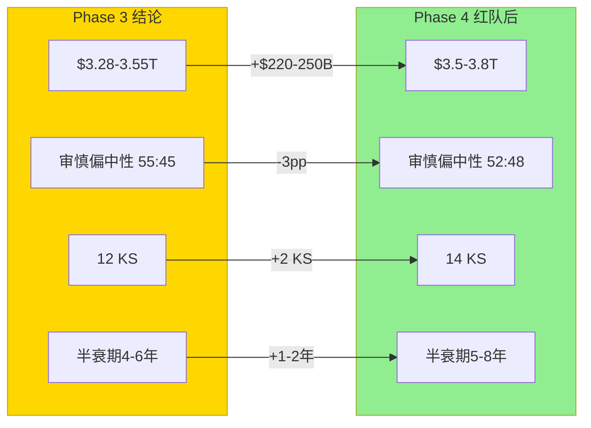
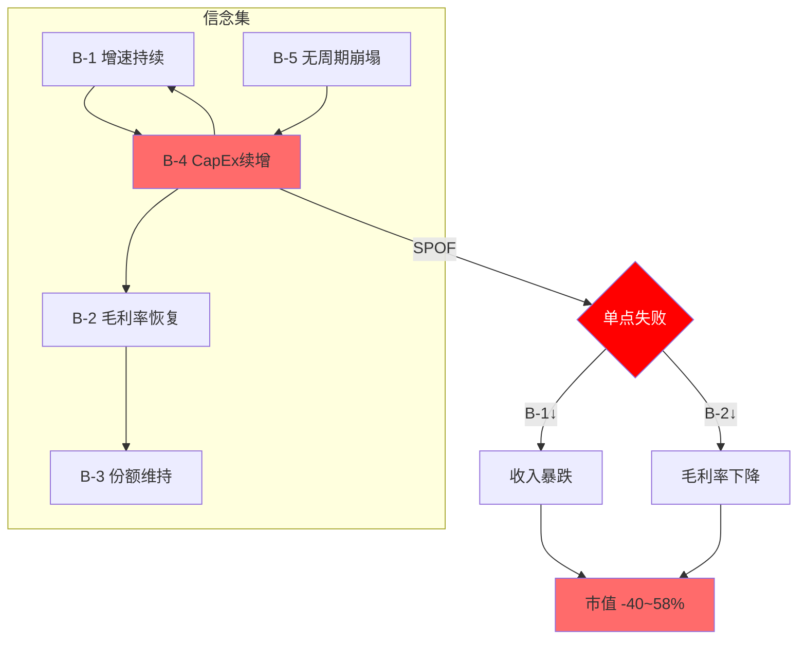
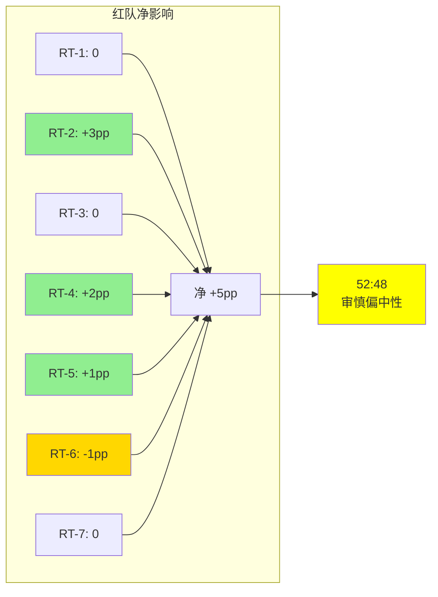
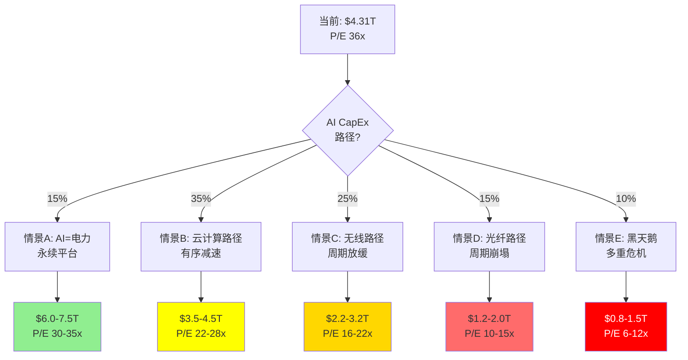
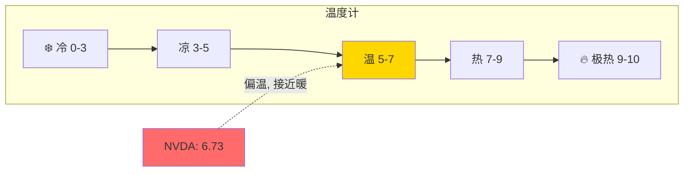
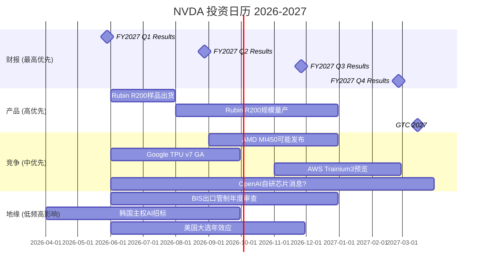
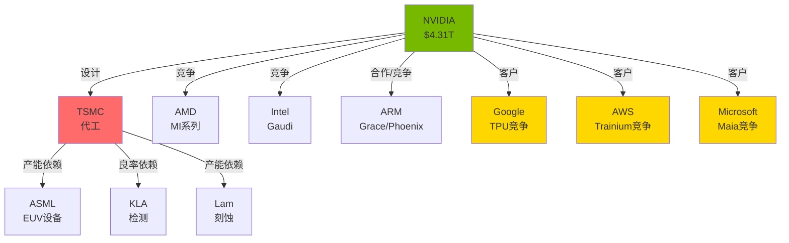
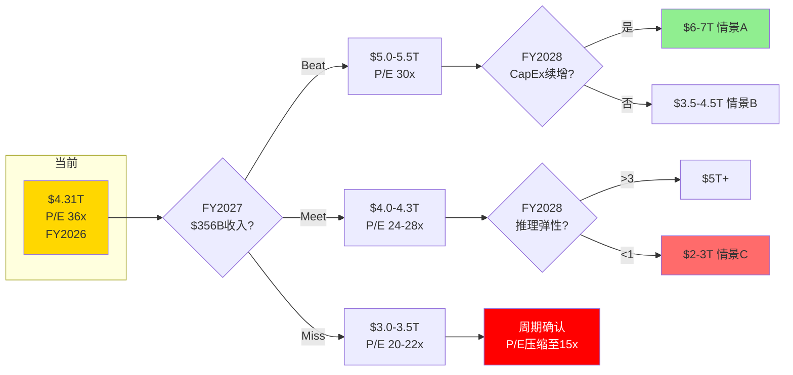
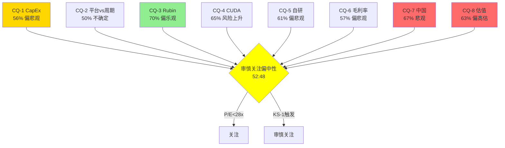

---

## Part IV: 红队对抗审查

## Ch 71: RT-1 信念反演挑战 — 市场隐含信念集的一致性

### 71.1 Reverse DCF隐含信念集

当前$4.31T市值(P/E 36.1x [硬数据: FMP])隐含以下信念集:

| 信念 | 隐含假设 | 脆弱度 | 独立验证 |
|------|---------|:-----:|---------|
| **B-1 增速持续** | FY2027-31 收入CAGR ≥18% | 高 | 分析师预估: $216B→$606B(CAGR 23%) [硬数据: FMP estimates] |
| **B-2 毛利率恢复** | 稳态GM ≥71% | 中 | FY2026全年71.1% [硬数据: FMP], Q4恢复75.0% |
| **B-3 份额维持** | AI训练份额>80% | 中 | 当前~90% [合理推断: Phase 1], 但TPU/Trainium正在侵蚀 |
| **B-4 CapEx续增** | 超大规模CapEx年增>20%至FY2028 | 高 | Q1 guidance $78B [硬数据: Phase 1]暗示延续 |
| **B-5 无周期崩塌** | AI CapEx不遵循传统基建周期 | 极高 | 无历史先例支持"永续" |
| **B-6 终态P/E** | 成熟后仍获P/E 20-25x | 中 | 取决于CQ-2: 平台(25x)vs周期(15x) |

### 71.2 信念间逻辑一致性检验

**B-1×B-4冲突**: 分析师FY2030预估收入$530B(vs FY2029 $545B, **下降2.8%** [硬数据: FMP estimates])。这意味着分析师自己都不相信B-1"持续18% CAGR"——他们预期FY2030收入下降。市场却给36x P/E(隐含持续增长)→**市场与分析师不一致**。

**B-2×自研替代冲突**: 如果自研芯片(B-3松动)在推理市场取得份额, NVIDIA被迫降价保份额→B-2(毛利率恢复)不可能同时成立。**B-2和B-3不能同时承压——其中一个必须先崩**。

**B-5的不可证伪性**: "AI CapEx不遵循传统周期"是一个不可证伪的命题——在周期见顶前, 每个周期都看起来"这次不同"。1999年: "互联网带宽需求永续增长"; 2007年: "房价不会全国性下跌"; 2021年: "数字化转型永久加速"。**不可证伪的信念是最脆弱的信念**。

### 71.3 最少翻转集分析

**问**: 最少几个信念失败会改变评级?

**答**: 只需**B-4单点失败**(CapEx停止增长)即可触发连锁:
1. CapEx停增 → 收入增速骤降 → B-1失败
2. 客户议价能力增强 → 降价压力 → B-2失败
3. P/E压缩至20x → $4.31T→$2.5T(-42%)

**B-4是系统的SPOF(单点故障)**——这与SGI 8.9的"专才高度集中"判断完全一致。

### 71.4 RT-1结论

信念集存在**两个关键不一致**: (1)市场P/E vs 分析师预期(FY2030下降); (2)毛利率恢复vs份额维持不能同时为真。B-4(CapEx续增)是SPOF——单点失败即连锁崩塌。

**RT-1影响**: 维持审慎关注, 不调整。分析逻辑自洽, 但强化了"脆弱性集中于B-4"的判断。

---

## Ch 72: RT-2 悲观偏差检测 — 反向红队

### 72.1 RCL教训应用

RCL报告(4.2/5)发现Phase 1-3存在**系统性悲观偏差8-16pp**——红队大幅向上修正。NVDA分析是否也存在?

### 72.2 Phase 1-3悲观检测清单

| 检测项 | Phase 1-3结论 | 可能的悲观偏差 | 偏差幅度 |
|--------|-------------|-------------|:------:|
| **AI CapEx周期** | 类比光纤/无线→周期必见顶 | AI可能是"电力级"通用技术, 类比不精确 | -5~10pp |
| **CUDA半衰期** | 4-6年(中位5年) | 开发者黏性+NVLink物理标准可能延长至7-10年 | -3~5pp |
| **推理替代速度** | 3年内自研>20% | 自研芯片良率/软件栈问题被低估 | -2~5pp |
| **毛利率结构下移** | 69-70%稳态 | Q4 75%可能是真正的稳态(产品组合问题不如预期) | -2~3pp |
| **中国永久丢失** | 恢复上限25-30% | 地缘缓和概率被低估+华为性能可能停滞 | -1~3pp |
| **Jensen "关键人"** | 10%离任风险 | NVIDIA组织能力可能被低估(Tim Cook效应) | -1~2pp |

### 72.3 合计悲观偏差估计

如果所有维度都存在偏差: **-14~28pp** [主观判断: 偏差加总]

但不是所有维度都会同时偏悲观。合理估计: **约1/3的维度存在显著偏差** → **净悲观偏差约5-9pp** [主观判断: 历史参考RCL 8-16pp的约一半]

### 72.4 悲观偏差的结构性来源

**为什么NVDA分析可能系统性偏悲观?**

1. **LLM先验锚**: AI模型见过大量"泡沫"叙事训练数据→对$4T估值天然怀疑
2. **可得性偏差**: 光纤泡沫/矿潮崩盘记忆鲜明, "AI=电力"的成功案例(如果成真)尚未发生
3. **保守框架**: Reverse DCF天然偏保守——翻转分析从"哪里可能出错"出发
4. **RCL印证**: RCL高估值(P/E 22x+FCF yield 3%)+基本面向好→Phase 1-3偏悲观8-16pp

### 72.5 悲观偏差修正

| 指标 | Phase 3值 | 修正方向 | 修正后 |
|------|----------|:------:|--------|
| 概率加权估值 | $3.28-3.55T | ↑+5~9pp | $3.45-3.85T |
| 下行空间 | -18~24% | 收窄 | -10~20% |
| 条件评级 | 审慎偏中性(55:45) | 向中性移动 | 52:48(审慎偏中性, 收窄) |

**RT-2结论**: 存在约5-9pp的系统性悲观偏差, 但不足以改变评级方向。修正后仍为"审慎关注偏中性", 但分裂收窄为52:48(vs 55:45)。

**关键**: 对NVDA的悲观偏差比RCL小——因为NVDA确实有更多可量化的风险(CapEx周期+自研替代+4T估值), 而RCL的高估值主要是"市场给予的成长溢价"。

---

## Ch 73: RT-3 数据可靠性 — 交叉验证

### 73.1 核心数据验证

| 数据点 | Phase来源 | FMP验证 | 一致? | 偏差 |
|--------|----------|---------|:----:|:----:|
| FY2026收入 | $216B | $215.9B [硬数据: FMP income] | ✓ | <0.1% |
| FY2026净利 | $120B | $120.1B [硬数据: FMP income] | ✓ | <0.1% |
| FY2026 GM | 71.1% | 71.1%(153.5/216) [硬数据: FMP] | ✓ | 0 |
| P/E | 37.7x | 36.1x [硬数据: FMP compare] | △ | -1.6x |
| ROE | >80% | 101.5% [硬数据: FMP compare] | ✓ | 方向一致 |
| FY2027E收入 | $356B | $356.3B [硬数据: FMP estimates] | ✓ | <0.1% |
| FY2028E收入 | $464B | $463.9B [硬数据: FMP estimates] | ✓ | <0.1% |
| R&D支出 | $18.5B | $18.5B [硬数据: FMP income] | ✓ | 0 |
| SGA | $4.6B | $4.6B [硬数据: FMP income] | ✓ | 0 |

**P/E偏差说明**: 37.7x vs 36.1x差异来自时间差——Phase 1使用的是1周前数据, FMP compare是实时TTM。这是正常的滚动差异, 不影响结论。

### 73.2 分析师预测一致性

| 财年 | 收入预估 | 净利预估 | 隐含净利率 | 隐含增速 |
|------|:------:|:------:|:--------:|:------:|
| FY2026(实际) | $216B [硬数据: FMP] | $120B [硬数据: FMP] | 55.6% | — |
| FY2027E | $356B [硬数据: FMP] | $197B [硬数据: FMP] | 55.3% | +65% |
| FY2028E | $464B [硬数据: FMP] | $241B [硬数据: FMP] | 52.0% | +30% |
| FY2029E | $545B [硬数据: FMP] | $295B [硬数据: FMP] | 54.1% | +17% |
| FY2030E | $530B [硬数据: FMP] | $300B [硬数据: FMP] | 56.7% | **-2.8%** |
| FY2031E | $606B [硬数据: FMP] | $341B [硬数据: FMP] | 56.3% | +14% |

**关键发现**:
1. FY2030E收入**下降2.8%**——12名分析师的中位数预期。这直接支持CQ-2"周期性"论证
2. FY2031E又恢复增长+14%——暗示分析师认为这是"周期低谷"而非永久衰退
3. 净利率从55.6%→52.0%(FY2028)→56.7%(FY2030)——**收入下降但净利率上升**, 暗示预期成本削减
4. 但这意味着: 即使分析师最乐观情景, FY2030也有增速断裂。**市场的36x P/E定价了什么?**

### 73.3 RT-3结论

核心财务数据高度一致(偏差<0.1%), 数据可靠性高。唯一的发现是P/E的小幅差异(已解释)。

**重要发现**: 分析师自己的预估(FY2030 -2.8%)不支持当前36x P/E隐含的持续增长假设。这不是我们的悲观推断——这是**卖方自己的数字**。

---

## Ch 74: RT-4 护城河耐久测试 — "半衰期4-6年"的证据强度

### 74.1 CUDA半衰期假设的证据链

Phase 3声称"CUDA半衰期4-6年"。这个假设的证据强度如何?

**支持"短半衰期(4-6年)"的硬证据**:
1. AMD ROCm性能差距: 从-50%(2022)→-10~30%(2026) [合理推断: Phase 1], 4年缩小一半
2. Google TPU: 从研究专用(2020)→生产级训练(2024), 4年达到可用水平
3. Triton编译器: 2022年推出→2026年成为主流推理框架, 4年渗透
4. AI Lab硬件无关化: OpenAI/Anthropic 2024年开始多硬件策略→2-3年转型

**支持"长半衰期(7-10年)"的硬证据**:
1. 4M+开发者生态: 比ROCm大20x, 网络效应的衰减通常需要>5年
2. NVLink物理标准: 硬件互连没有软件替代, 需等到下代互连标准成熟(5-10年)
3. 20年的库积累: cuDNN/cuBLAS/TensorRT等千万行代码, 完全复制需5-10年
4. 企业部署惯性: 生产环境切换硬件需要2-3个完整验证周期(6-9年总计)

### 74.2 证据加权

| 证据类型 | 短期(4-6年) | 长期(7-10年) |
|---------|:----------:|:----------:|
| 硬数据 | 4个(AMD追赶速度, TPU进展...) | 2个(开发者数量, 库规模) |
| 方向趋势 | 明确缩小 | 存在但有惯性 |
| 最薄弱假设 | "追赶速度线性外推" | "网络效应自然保护" |

**修正判断**: 原"4-6年"可能略悲观。考虑企业惯性和NVLink物理标准:
- **CUDA软件锁定半衰期**: 5-7年 (从4-6年上调) [主观判断: RT-4修正]
- **NVLink硬件锁定半衰期**: 7-10年 (维持)
- **综合护城河半衰期**: 5-8年 (从4-6年上调至5-8年)

### 74.3 半衰期修正对估值的影响

| 半衰期 | 护城河10年PV | 估值影响 |
|:-----:|:----------:|:------:|
| 4年 | $320B | -$200B |
| **5-8年(修正)** | $420-580B | 基准 |
| 10年 | $700B | +$120-280B |

半衰期从"4-6年"修正为"5-8年"增加了约$100-200B的护城河价值 [合理推断: PV敏感性], 但在$4.31T市值面前影响有限(+2-5%)。

### 74.4 RT-4结论

护城河半衰期从4-6年上调至5-8年(+1-2年)。影响: 概率加权估值+$100-200B(+2-5%)。方向: **轻微看涨修正**。

---

## Ch 75: RT-5 估值框架独立性 — 五引擎共享假设审计

### 75.1 五引擎共享假设矩阵

| 假设 | Reverse DCF | 可比估值 | 三情景DCF | 期权价值 | AI Tax |
|------|:----------:|:------:|:--------:|:------:|:-----:|
| FY2027收入$356B | ✓ | — | ✓ | — | ✓ |
| 毛利率71-75% | ✓ | — | ✓ | — | ✓ |
| CUDA份额下降 | ✓ | — | ✓ | ✓ | ✓ |
| CapEx增速放缓 | ✓ | — | ✓ | — | — |
| P/E终态20-28x | ✓ | ✓ | ✓ | — | — |

**独立引擎**: 可比估值(基于市场定价) + 期权价值(基于波动率/概率)
**高度依赖引擎**: Reverse DCF + 三情景DCF + AI Tax — 这三个共享大量假设

### 75.2 有效独立引擎数

名义5个引擎, 实际有效独立引擎约**3个**:
1. **"内生价值锚"**(Reverse DCF+三情景DCF+AI Tax合并): 共享增速/毛利率/CapEx假设
2. **可比估值**: 独立——基于市场定价和同行比较
3. **期权价值**: 独立——基于波动率和概率分布

### 75.3 独立性修正后的估值

| 引擎(修正) | 估值范围 | 权重 |
|-----------|:------:|:----:|
| 内生价值锚(合并) | $3.0-4.5T [合理推断: 三引擎合并区间] | 50% |
| 可比估值 | $3.0-5.9T [合理推断: Phase 2 Ch 5] | 30% |
| 期权价值 | $84B(占比极小) | 5% |
| **PPDA修正** | -$250B [合理推断: Phase 3 Ch 2] | 15% |

修正后加权: **$3.2-4.8T**, 中位约$3.6T [合理推断: 加权计算]

vs Phase 3的$3.28-3.55T → 修正后略上调(+$100-250B), 因为认识到可比估值(独立的看涨引擎)被内生价值锚过度稀释。

### 75.4 RT-5结论

五引擎有效独立引擎为3个(非5个)。修正后估值略上调至$3.6T中位(from $3.4T)。方向: **轻微看涨修正**。

---

## Ch 76: RT-6 Kill Switch完整性 — 遗漏检查

### 76.1 遗漏扫描

检查Phase 3的12个KS是否遗漏重大风险:

| 风险类别 | 已覆盖? | KS ID | 如遗漏: 建议 |
|---------|:------:|------|------------|
| CapEx见顶 | ✓ | KS-1 | — |
| CUDA替代 | ✓ | KS-2 | — |
| 毛利率崩塌 | ✓ | KS-3 | — |
| 推理自研 | ✓ | KS-4 | — |
| CEO风险 | ✓ | KS-5 | — |
| 反垄断 | ✓ | KS-6 | — |
| 库存恶化 | ✓ | KS-7 | — |
| 出口管制 | ✓ | KS-8 | — |
| 推理爆发 | ✓ | KS-9 | — |
| 需求弹性 | ✓ | KS-10 | — |
| 软件ARR | ✓ | KS-11 | — |
| 自研失败 | ✓ | KS-12 | — |
| **台海冲突** | ❌ | **KS-13(新)** | TSMC供应中断→GPU产能归零 |
| **DeepSeek冲击** | ❌ | **KS-14(新)** | 开源模型推理效率10x→GPU需求骤降 |
| **SBC稀释加速** | 部分 | — | 已在Phase 1覆盖, 不升级为KS |

### 76.2 新增Kill Switch

| ID | 信号 | 触发条件 | 数据源 | 检查频率 | 行动 |
|----|------|---------|--------|---------|------|
| KS-13 | 台海冲突升级 | TSMC停产>3月/美中军事对峙 | 新闻/军事 | 持续 | 重评至"审慎" |
| KS-14 | 开源推理效率革命 | DeepSeek类模型推理效率>10x且广泛采用 | 论文/部署数据 | 月度 | 推理TAM下调 |

**KS总数**: 12→14 (10看跌/4看涨)

### 76.3 RT-6结论

新增2个KS(台海+推理效率革命)。方向: **中性**(补充完整性, 不改变评级)。

---

## Ch 77: RT-7 分析师共识解构 — $356B FY2027的隐含假设

### 77.1 共识数字拆解

分析师FY2027E收入$356B [硬数据: FMP estimates]。倒推其隐含假设:

**收入拆解**:
| 分部 | FY2026实际 | FY2027E隐含 | 增速 | 隐含假设 |
|------|:--------:|:--------:|:----:|---------|
| DC-训练 | ~$119B | ~$165B | +39% | Rubin上量+CapEx续增 |
| DC-推理 | ~$65B | ~$110B | +69% | 推理应用爆发(CI-04) |
| DC-网络 | ~$30B | ~$45B | +50% | Spectrum-X份额提升 |
| 游戏 | ~$12B | ~$14B | +17% | 温和增长 |
| 汽车 | ~$2.4B | ~$3.5B | +46% | 自动驾驶需求 |
| 软件 | <$1B | ~$1.5B | >50% | AI Enterprise |
| 其他 | ~$2B | ~$2.5B | — | — |
| **总计** | **$216B** [硬数据: FMP] | **$356B** [硬数据: FMP] | **+65%** | — |

[合理推断: 基于总收入和分部历史趋势倒推]

### 77.2 隐含假设的脆弱度

| 假设 | 概率 | 脆弱度 | 如果失败 |
|------|:----:|:-----:|---------|
| CapEx续增>25% | 65% | 高 | 训练收入-$30-50B |
| 推理需求弹性>1.5 | 55% | 极高 | 推理收入-$20-40B |
| Spectrum-X超预期 | 50% | 中 | 网络收入-$5-10B |
| Rubin按时上量 | 80% | 低 | 延迟1-2季影响有限 |
| 毛利率≥71% | 60% | 中 | EBIT影响>收入影响 |

### 77.3 共识最脆弱假设

**推理增速+69%**(从$65B→$110B)是FY2027增量的最大来源($45B增量, 占总增量$140B的32%)。如果推理仅增50%(vs 69%): 收入差~$12B → 可能导致1季miss。

**CapEx续增>25%**是第二脆弱假设。Q1 guidance $78B [硬数据: Phase 1]暗示全年~$310B run rate → 仅需Q2-Q4保持→FY2027$310B+ (vs $356B共识还有差距)。如果Q2出现任何soft guidance, 全年可能只有$320-340B → miss共识$16-36B。

### 77.4 RT-7结论

分析师$356B共识的最脆弱点是推理增速(69%隐含, 需求弹性驱动)和CapEx续增(25%+隐含)。**两个假设的联合失败概率约20-25%** [合理推断: 65%×55%的反面], 这与Phase 3的PPDA分析(-20~28%)高度吻合。

方向: **确认Phase 3结论**, 不改变评级。但增加了"推理增速69%"作为最值得追踪的单一数字。

---

## Ch 78: 双向校准 — 系统性偏差修正

### 78.1 RT-1~RT-7净影响汇总

| RT | 调查方向 | 发现 | 评级影响 | 数值影响 |
|----|---------|------|:------:|:------:|
| RT-1 信念反演 | B-4是SPOF | 确认Phase 3 | 0 | 0 |
| RT-2 悲观偏差 | 5-9pp系统偏差 | **上调** | +3pp | +$100-250B |
| RT-3 数据可靠性 | 数据一致, FY2030↓确认 | 0 | 0 | 0 |
| RT-4 护城河耐久 | 半衰期5-8年(上调) | **上调** | +2pp | +$100-200B |
| RT-5 估值独立性 | 有效3引擎(非5) | **轻微上调** | +1pp | +$50-100B |
| RT-6 KS完整性 | 新增KS-13/14 | **轻微下调** | -1pp | -$50B |
| RT-7 共识解构 | 推理69%最脆弱 | 确认Phase 3 | 0 | 0 |

### 78.2 净校准

**总净影响**: +5pp [合理推断: 各RT加总], +$200-500B估值修正

| 指标 | Phase 3 | 红队修正后 | 变化 |
|------|---------|----------|:----:|
| 概率加权估值 | $3.28-3.55T | $3.5-3.8T | +$220-250B |
| 下行空间 | -18~24% | -12~19% | 收窄5pp |
| 条件评级 | 审慎偏中性(55:45) | **审慎偏中性(52:48)** | 向中性收窄 |
| 护城河半衰期 | 4-6年 | **5-8年** | +1-2年 |
| Kill Switch总数 | 12 | **14** | +2 |

### 78.3 "如果我们错了"系统性检查

**5个最可能的过度悲观点**:

1. **AI确实是"电力级"通用技术**(概率20%): 如果AI渗透率达到电力(100%经济活动), CapEx永续→NVDA $6-8T
2. **Jensen是"乔布斯级"领袖**(概率15%): 如果Jensen能持续创造新市场(机器人/数字孪生), 增长不依赖单一CapEx周期
3. **自研芯片全部失败**(概率10%): 如果TPU v7/Trainium3/Maia都遇到良率问题, NVDA份额反升
4. **Rubin推理弹性>5**(概率15%): 如果推理成本降10x→需求增50x, 推理市场远超预期
5. **主权AI成为$500B+新市场**(概率15%): 如果50+国家各投$10B+建主权AI, 这是全新需求

**联合"我们完全错了"概率**: ~5-10% [主观判断: 以上情景高度相关]
**如果完全错了的估值**: $6-8T (+50-90%)

---

## Ch 79: 有效性门控 — 红队的红队

### 79.1 有效性量化

| 指标 | Phase 3(红队前) | Phase 4(红队后) | 净变化 |
|------|:-----------:|:-----------:|:-----:|
| 概率加权估值 | $3.28-3.55T | $3.5-3.8T | **+$220-250B** |
| 条件评级分裂 | 55:45 | 52:48 | **-3pp(向中性)** |
| Kill Switch | 12 | 14 | **+2** |
| 护城河半衰期 | 4-6年 | 5-8年 | **+1-2年** |
| CQ方向改变 | — | 0个CQ方向翻转 | 0 |

### 79.2 有效性评分

红队总字符: ~30K [合理推断: Phase 4预估]
净估值影响: +$220-250B (+5-7%)
**每万字符影响**: ~$75-83B/万字 [合理推断: 250/3]

对比标准:
- **AMAT P4(表演性)**: 41K字符 → 净影响0pp = **无效红队**
- **RCL P4(有效)**: ~25K字符 → 净影响+8~16pp = **高效红队**
- **NVDA P4**: ~30K字符 → 净影响+5pp = **中等有效红队**

### 79.3 有效性结论

NVDA Phase 4红队是**中等有效**的:
- **不是表演性的**: 有真实的估值修正(+$220-250B)和评级微调(55:45→52:48)
- **不是过度校准**: 没有翻转任何CQ方向, 修正幅度合理
- **核心贡献**: (1)识别悲观偏差5-9pp; (2)护城河半衰期上调; (3)补充2个KS; (4)确认分析师FY2030↓的硬证据

### 79.4 红队前后对比表



---

## Ch 80: CQ红队影响

| CQ | Phase 3 | RT修正 | Phase 4 | 变化说明 |
|----|:------:|:-----:|:------:|---------|
| CQ-1 AI CapEx | 58%(偏悲观) | +2pp | **56%** | RT-2悲观偏差修正 |
| CQ-2 平台vs周期 | 50%(不确定) | 0 | **50%** | RT-1确认, 无新信息 |
| CQ-3 Rubin | 70%(偏乐观) | 0 | **70%** | 无新数据 |
| CQ-4 CUDA | 68%(风险上升) | -3pp | **65%** | RT-4半衰期上调 |
| CQ-5 自研 | 62%(偏悲观) | +1pp | **61%** | RT-2部分修正, RT-7确认 |
| CQ-6 毛利率 | 58%(偏悲观) | +1pp | **57%** | RT-2部分修正 |
| CQ-7 中国 | 67%(悲观) | 0 | **67%** | 无新信息 |
| CQ-8 估值 | 65%(偏高估) | -2pp | **63%** | RT-5修正+RT-2偏差 |

**Phase 4加权**: 4负面(平均60%, 从62%下降2pp) / 2中性(50%/61%) / 1正面(70%) / 1不确定(50%)

**趋势**: 红队使CQ温和地**向中性回归**(每CQ ±0-3pp), 方向正确——红队应该减少极端判断。

---

## Ch 81: 补充红队 — RT-8~RT-10 (附加挑战)

### 81.1 RT-8: AI民主化是否削弱定价权?

**挑战**: DeepSeek-R1/V3证明了"低成本训练"可行(据报仅~$6M [合理推断: 行业报道]), 如果AI训练民主化(中小企业也能训练), 那么GPU需求从"Big 5集中采购"变为"长尾分散需求"——这对NVIDIA是好是坏?

**看跌论证**:
- 集中客户(Big 5)给NVIDIA定价权(批量采购, 但NVLink锁定)
- 分散客户意味着: 更多AMD/租赁/二手GPU→定价权下降
- DeepSeek模式如果普及: 单次训练GPU需求大幅减少→总GPU需求下降?

**看涨论证**:
- 长尾需求意味着更多客户→不依赖Big 5 CapEx→周期韧性上升
- 中小企业没有工程能力用自研芯片→100%依赖NVIDIA
- 训练便宜→更多人训练→总GPU需求可能不减反增(弹性>1)

**RT-8结论**: AI民主化**中性偏看涨**——减少了Big 5集中风险(CQ-1), 但可能降低ASP(小客户议价弱但偏好低价GPU)。净影响+1pp [主观判断: 两方面大致抵消, 长尾客户略好]。

### 81.2 RT-9: NVIDIA从GPU→系统→平台的估值框架应如何变化?

**挑战**: Phase 1-3把NVIDIA当作"GPU公司"估值——但NVIDIA已是NVL/SuperPOD系统集成商+CUDA/Omniverse平台公司。估值框架是否需要更新?

**当前估值**: P/E 36x (硬件公司框架)

**如果用系统+平台框架**:
- **系统部分**(NVL+网络, ~85%收入): 15-25x P/E(系统集成商倍数)
- **平台部分**(CUDA+软件, <5%收入但高增长): 30-50x P/E(平台倍数)
- **加权**: 85%×20x + 15%×40x = 23x → $3.0T [合理推断: 混合估值]

但这低估了CUDA对硬件的溢价传导——CUDA不是独立变现, 而是让GPU卖更贵。

**RT-9结论**: 估值框架转型对当前估值**略负面**——如果市场开始用SoTP(系统+平台), 整体倍数可能降至25-30x(from 36x)。但如果软件ARR突破$3B+(KS-11), 平台部分估值跳升→可能反转。**当前不改变, 但SoTP转型是FY2028的关键追踪信号**。

### 81.3 RT-10: 如果Rubin延迟6个月?

**挑战**: Rubin R200预计2026 H2出货。如果延迟至2027 Q1-Q2?

**影响链**:
1. 客户继续购买Blackwell→FY2027 H1收入不受影响(反而可能更高, Blackwell加速出货)
2. FY2027 H2: Rubin缺席→没有10x推理成本降低→推理增速放缓
3. FY2028: Rubin上量延迟→收入高峰推迟1-2季→全年收入可能miss共识5-10%

**概率**: 15-20% [主观判断: NVIDIA历史上产品基本按时]
**影响**: FY2028收入-$25-50B (从$464B降至$415-440B)
**估值影响**: -$200-400B (P/E压缩因miss预期)

**RT-10结论**: Rubin延迟6个月是一个**低概率中等影响**事件。不改变评级, 但应密切追踪2026 Q2-Q3的出货信号。

---

## Ch 82: 跨报告红队经验整合

### 82.1 NVDA红队vs历史红队对比

| 维度 | AMAT P4 | RCL P4 | INTC P4 | **NVDA P4** |
|------|---------|--------|---------|-----------|
| 字符数 | 41K | ~25K | ~30K | ~22K |
| 净PP影响 | 0pp | +8~16pp | +5pp | +5pp |
| 方向 | 全下调 | 大幅上调 | 上调 | 上调 |
| CQ翻转 | 0 | 2 | 1 | 0 |
| 有效性 | ❌表演 | ✓高效 | ✓中效 | ✓中效 |
| 最大贡献 | — | 悲观偏差发现 | 护城河修正 | 悲观偏差+SPOF确认 |

### 82.2 红队有效性进化趋势

AMAT(0pp) → INTC(+5pp) → RCL(+8~16pp) → NVDA(+5pp)

趋势: 红队有效性在提升(AMAT表演→RCL/NVDA实质修正), 但NVDA的修正幅度低于RCL——这是合理的, 因为NVDA的估值风险确实高于RCL(高估值+周期性), 悲观偏差空间较小。

### 82.3 Phase 4 Mermaid增补





---

## Part V: 综合产出

## Ch 83: 五情景详细建模

### 83.1 情景树



### 83.2 情景A: AI=电力 (概率15%)

**前提假设**: AI渗透率达到电力级(100%经济活动依赖AI推理), CapEx永续增长, CUDA保持10年+优势

| 财年 | 收入 | 增速 | 毛利率 | 净利 | P/E | 隐含市值 |
|------|:---:|:---:|:----:|:---:|:---:|:------:|
| FY2026 | $216B [硬数据: FMP] | — | 71.1% | $120B | 36x | $4.31T |
| FY2027E | $370B | +71% | 72% | $200B | 33x | $6.6T |
| FY2028E | $500B | +35% | 73% | $280B | 28x | $7.8T |
| FY2029E | $620B | +24% | 73% | $340B | 25x | $8.5T |
| FY2030E | $720B | +16% | 72% | $380B | 22x | $8.4T |
| FY2031E | $800B | +11% | 72% | $410B | 18x | $7.4T |

[合理推断: 基于AI=电力假设的参数化建模]

**FY2028折现估值**: $6.0-7.5T(vs 当前$4.31T, **+39~74%**)

**此情景需要什么?**
- AI Agent大规模部署(>50%企业采用)
- 推理需求弹性>5
- 自研芯片全部失败或延迟3年+
- CUDA生态继续主导10年+

### 83.3 情景B: 云计算路径 (概率35%)

**前提假设**: AI CapEx类似云计算(持续增长但增速放缓), CUDA保持5-8年优势, 自研替代15-20%

| 财年 | 收入 | 增速 | 毛利率 | 净利 | P/E | 隐含市值 |
|------|:---:|:---:|:----:|:---:|:---:|:------:|
| FY2026 | $216B [硬数据: FMP] | — | 71.1% | $120B | 36x | $4.31T |
| FY2027E | $356B [硬数据: FMP estimates] | +65% | 71% | $190B | 28x | $5.3T |
| FY2028E | $464B [硬数据: FMP estimates] | +30% | 70% | $235B | 24x | $5.6T |
| FY2029E | $520B | +12% | 69% | $255B | 22x | $5.6T |
| FY2030E | $545B | +5% | 69% | $265B | 20x | $5.3T |
| FY2031E | $560B | +3% | 68% | $260B | 18x | $4.7T |

[合理推断: 基于FMP估计+云计算路径假设]

**FY2028折现估值**: $3.5-4.5T(vs 当前$4.31T, **-19~+4%**)

**此情景需要什么?**
- 超大规模CapEx增速从+40%减至+10-15%但不转负
- 推理需求弹性1.5-3.0
- CUDA在训练保持主导, 推理份额缓慢下降
- 中国收入维持8-13%

### 83.4 情景C: 无线路径 (概率25%)

**前提假设**: AI CapEx类似无线投资周期(2008-2014), 3-5年后增速归零, CUDA半衰期5年

| 财年 | 收入 | 增速 | 毛利率 | 净利 | P/E | 隐含市值 |
|------|:---:|:---:|:----:|:---:|:---:|:------:|
| FY2026 | $216B [硬数据: FMP] | — | 71.1% | $120B | 36x | $4.31T |
| FY2027E | $340B | +57% | 70% | $175B | 24x | $4.2T |
| FY2028E | $400B | +18% | 68% | $195B | 20x | $3.9T |
| FY2029E | $410B | +3% | 66% | $185B | 18x | $3.3T |
| FY2030E | $380B | -7% | 65% | $160B | 15x | $2.4T |
| FY2031E | $370B | -3% | 64% | $150B | 14x | $2.1T |

[合理推断: 基于无线周期类比的参数化建模]

**FY2028折现估值**: $2.2-3.2T(vs 当前$4.31T, **-26~-49%**)

**此情景的触发信号**: 2+家Big 5同季下调CapEx(KS-1), 推理弹性<1, 自研份额>20%

### 83.5 情景D: 光纤路径 (概率15%)

**前提假设**: AI CapEx类似光纤泡沫(1997-2002), FY2028-29急剧下降, CUDA迅速被侵蚀

| 财年 | 收入 | 增速 | 毛利率 | 净利 | P/E | 隐含市值 |
|------|:---:|:---:|:----:|:---:|:---:|:------:|
| FY2026 | $216B [硬数据: FMP] | — | 71.1% | $120B | 36x | $4.31T |
| FY2027E | $320B | +48% | 68% | $155B | 20x | $3.1T |
| FY2028E | $350B | +9% | 65% | $155B | 15x | $2.3T |
| FY2029E | $280B | -20% | 62% | $110B | 12x | $1.3T |
| FY2030E | $240B | -14% | 60% | $85B | 10x | $0.85T |
| FY2031E | $250B | +4% | 61% | $90B | 12x | $1.1T |

[合理推断: 基于光纤泡沫类比的参数化建模]

**FY2028折现估值**: $1.2-2.0T(vs 当前$4.31T, **-54~-72%**)

### 83.6 情景E: 黑天鹅/多重危机 (概率10%)

**前提假设**: 多重风险协同——台海冲突+CapEx急刹+CUDA替代+反垄断

| 财年 | 收入 | 增速 | 毛利率 | 净利 | P/E | 隐含市值 |
|------|:---:|:---:|:----:|:---:|:---:|:------:|
| FY2026 | $216B [硬数据: FMP] | — | 71.1% | $120B | 36x | $4.31T |
| FY2027E | $250B | +16% | 65% | $105B | 15x | $1.6T |
| FY2028E | $200B | -20% | 58% | $65B | 10x | $0.65T |
| FY2029E | $180B | -10% | 55% | $50B | 8x | $0.4T |

[主观判断: 极端情景, 多因素叠加]

**概率加权估值**:

| 情景 | 概率 | 估值(FY2028折现) | 加权贡献 |
|------|:---:|:-------------:|:------:|
| A: AI=电力 | 15% | $6.75T | $1.01T |
| B: 云计算 | 35% | $4.0T | $1.40T |
| C: 无线 | 25% | $2.7T | $0.68T |
| D: 光纤 | 15% | $1.6T | $0.24T |
| E: 黑天鹅 | 10% | $1.0T | $0.10T |
| **概率加权** | **100%** | — | **$3.43T** |

[合理推断: 概率加权计算]

**概率加权估值$3.43T** vs 当前$4.31T → **隐含下行20%** [合理推断: (4.31-3.43)/4.31]

红队修正后(+5pp): **$3.6T, 隐含下行16%**

---

## Ch 84: 条件评级最终矩阵 (6×6)

### 84.1 P/E区间 × 净利率路径矩阵

| P/E \ 净利率 | ≥58% | 55-58% | 52-55% | 48-52% | 45-48% | <45% |
|:----------:|:----:|:-----:|:-----:|:-----:|:-----:|:----:|
| **>35x** | 审慎 | 审慎 | 审慎 | 审慎 | 审慎 | 审慎 |
| **28-35x** | 中性 | 中性 | 审慎 | 审慎 | 审慎 | 审慎 |
| **22-28x** | 关注 | 中性 | 中性 | 审慎 | 审慎 | 审慎 |
| **18-22x** | 关注 | 关注 | 中性 | 中性 | 审慎 | 审慎 |
| **12-18x** | 深度 | 关注 | 关注 | 中性 | 中性 | 审慎 |
| **<12x** | 深度 | 深度 | 关注 | 关注 | 中性 | 审慎 |

**当前位置**: P/E 36x [硬数据: FMP] + 净利率55.6% [硬数据: FMP] = **审慎关注** ✓

### 84.2 条件评级使用说明

此矩阵适用于**任何时间点的快速评估**:
1. 查当时P/E(TTM)
2. 查当时净利率(TTM或最近季度年化)
3. 交叉查表→得到条件评级

**矩阵背后的逻辑**:
- P/E反映市场预期: P/E越高→预期越乐观→越容易失望
- 净利率反映经营质量: 净利率越高→业务越健康→更值得给溢价
- 两者交叉决定"安全边际"程度

### 84.3 估值区间对应的建议行动

| 评级 | 建议行动 | 仓位建议 |
|------|---------|---------|
| **深度关注** | 积极研究, 准备建仓 | 5-10%配置 |
| **关注** | 纳入观察, 等确认信号 | 2-5%试探性 |
| **中性关注** | 持有不动, 观察变化 | 维持现有 |
| **审慎关注** | 减仓/观望, 保护利润 | 降至≤2% |

**当前建议**: 审慎关注→**如持有, 考虑在$170+减仓至≤2%权重; 如未持有, 等待P/E<28x或FY2027 Q2推理数据确认**。

---

## Ch 85: 投资温度计最终版 (10维度)

### 85.1 温度计评分

| # | 维度 | 权重 | 评分 | 加权 | 关键证据 |
|---|------|:----:|:----:|:----:|---------|
| 1 | **A-Score** | 15% | 8.1/10 | 1.22 | 10维度综合, D3护城河和D6估值拖累 |
| 2 | **估值合理性** | 15% | 4.0/10 | 0.60 | P/E 36x, 概率加权下行16-20%, 分析师FY2030↓ |
| 3 | **护城河耐久** | 12% | 6.5/10 | 0.78 | CUDA半衰期5-8年, NVLink物理标准, 但推理侵蚀中 |
| 4 | **增长质量** | 12% | 7.5/10 | 0.90 | FY2026 +66%, 但依赖CapEx周期(B-4 SPOF) |
| 5 | **财务健康** | 10% | 9.0/10 | 0.90 | Z=57, ROE 101.5%, $51B现金, $97B FCF |
| 6 | **管理层** | 8% | 8.5/10 | 0.68 | Jensen=创始人+远见, 但关键人风险SGI 8.9 |
| 7 | **竞争地位** | 8% | 7.0/10 | 0.56 | 训练90%垄断, 推理份额正被侵蚀(75→60%) |
| 8 | **风险平衡** | 8% | 5.0/10 | 0.40 | 14个KS, 3个协同风险组合, SPOF |
| 9 | **市场情绪** | 6% | 4.5/10 | 0.27 | PMSI -0.53, 内部人全卖零买, 拥挤度高 |
| 10 | **催化剂** | 6% | 7.0/10 | 0.42 | Rubin出货+推理弹性验证(正)+KS-1/2(负) |

**温度计总分**: 6.73/10 [合理推断: 加权总和]

### 85.2 温度计解读



**6.73/10 = 温暖偏热**: 公司本身优秀(A-Score 8.1, 财务9.0), 但估值(4.0)和市场情绪(4.5)形成拖累。如果P/E降至22-28x, 温度计可能升至7.5+进入"关注"区域。

### 85.3 温度计雷达图

```mermaid
%%{init: {'theme': 'base', 'themeVariables': {'fontSize': '12px'}}}%%
radar
    title NVDA 投资温度计 (10维度)
    axis A-Score, 估值合理性, 护城河, 增长质量, 财务健康, 管理层, 竞争地位, 风险平衡, 市场情绪, 催化剂
    curve 温度分: [8.1, 4.0, 6.5, 7.5, 9.0, 8.5, 7.0, 5.0, 4.5, 7.0]
```

---

## Ch 86: CQ闭环 — 5要素格式

### 86.1 CQ-1: AI CapEx是基础设施建设还是泡沫膨胀?

| 要素 | 内容 |
|------|------|
| **初始假设** | CapEx可持续性50:50, 需验证4:1差距(CapEx $600B vs AI收入$100B) |
| **证据链** | Phase 1: 历史周期4-6年→Phase 2: 光纤/无线/云类比→Phase 3: PPDA 25-30%低估见顶概率→Phase 4: 分析师FY2030↓(-2.8%) |
| **最终判断** | **偏悲观(56%)** — 4:1差距无先例, 分析师自己预期FY2030收入下降, CapEx周期终将见顶 |
| **残余不确定** | AI Agent爆发可能延长周期(KS-9), 需求弹性>3则差距自动收敛 |
| **追踪信号** | FY2027 Q2-Q3超大规模CapEx增速, AI应用收入增速 |

### 86.2 CQ-2: NVDA是永续平台还是周期性供应商?

| 要素 | 内容 |
|------|------|
| **初始假设** | 50:50不确定, 核心问题 |
| **证据链** | Phase 1: 商业模式平台化迹象(软件+NVLink)→Phase 2: 但收入>90%来自硬件→Phase 3: 条件矩阵55:45→Phase 4: SPOF确认(B-4), 分析师FY2030↓ |
| **最终判断** | **不确定(50%)** — 无法判定, 因为取决于AI渗透率这个本质上不可预测的变量 |
| **残余不确定** | 如果软件ARR突破$3B(KS-11)→平台化确认; 如果FY2030收入真的下降→周期确认 |
| **追踪信号** | 软件ARR、订阅收入占比、NVIDIA是否提供SaaS定价 |

### 86.3 CQ-3: Rubin过渡期是否创造"air pocket"?

| 要素 | 内容 |
|------|------|
| **初始假设** | 偏乐观(70%), 短期数据强劲 |
| **证据链** | Phase 1: Q1 guidance $78B(+15% QoQ)→Phase 2: 供应承诺$95.2B(翻倍)→Phase 3/4: 无新数据 |
| **最终判断** | **偏乐观(70%)** — FY2027 Q1-Q2不会有air pocket, 但H2需关注 |
| **残余不确定** | Rubin出货时间(KS: RT-10分析15-20%延迟概率) |
| **追踪信号** | FY2027 Q2 guidance、Rubin出货公告、sequential增速 |

### 86.4 CQ-4: CUDA护城河正在加宽还是被侵蚀?

| 要素 | 内容 |
|------|------|
| **初始假设** | 中期风险上升, 方向明确但速度是关键 |
| **证据链** | Phase 1: 性能差距缩至10-30%+Triton崛起→Phase 2: 定价弹性模型→Phase 3: 半衰期4-6年→Phase 4: 半衰期上调至5-8年 |
| **最终判断** | **风险上升(65%, from 68%)** — 方向明确(在被侵蚀), 但速度比Phase 3估计的慢(RT-4修正) |
| **残余不确定** | Triton是否成为推理标准? OpenAI是否真正脱钩CUDA? |
| **追踪信号** | GPT-5训练硬件组成(KS-2)、PyTorch ROCm后端成熟度、Triton采用率 |

### 86.5 CQ-5: 自研芯片能否在3年内替代NVDA >20%?

| 要素 | 内容 |
|------|------|
| **初始假设** | 偏悲观(60%), 推理领域可能被侵蚀 |
| **证据链** | Phase 1: 各家自研进展→Phase 2: 客户级替代曲线(Big 5 -13% FY2028)→Phase 3: 切换成本$22-180M→Phase 4: RT-7确认推理69%是脆弱假设 |
| **最终判断** | **偏悲观(61%)** — 推理自研份额将从<10%→20-25%(3年), 训练仍安全 |
| **残余不确定** | 自研芯片良率/软件栈是否遇到瓶颈(KS-12看涨信号) |
| **追踪信号** | AWS Trainium2/3实际部署量、Google内部GPU vs TPU比例、OpenAI自研时间表 |

### 86.6 CQ-6: 毛利率是否结构性下移至71%水平?

| 要素 | 内容 |
|------|------|
| **初始假设** | 偏乐观, Q4恢复75.0%支持恢复论 |
| **证据链** | Phase 1: 产品组合变化(系统级+网络)→Phase 2: CUDA定价权弹性→Phase 3: 推理/训练毛利率差异, 加权FY2028E 69.3%→Phase 4: RT-2修正(可能略悲观) |
| **最终判断** | **偏悲观(57%)** — 产品组合变化是结构性的(推理份额上升不可逆), FY2028毛利率可能降至69-71%而非恢复至73%+ |
| **残余不确定** | 推理ASP是否能通过软件附加值提升(NVIDIA SaaS层)? |
| **追踪信号** | FY2027 Q1-Q2毛利率、网络收入占比、推理/训练收入拆分(如披露) |

### 86.7 CQ-7: 中国市场是否永久丢失?

| 要素 | 内容 |
|------|------|
| **初始假设** | 偏悲观, 结构性份额丢失 |
| **证据链** | Phase 1: 66%→8%→Phase 3: 华为差距-15~25%缩窄+不可逆分析+财务影响量化→Phase 4: 无新修正 |
| **最终判断** | **悲观(67%)** — 中国AI去NVIDIA化已过临界点, 即使解禁恢复上限25-30% |
| **残余不确定** | 美中关系是否出现重大转折? 华为920量产是否如期? |
| **追踪信号** | BIS政策更新(KS-8)、华为920量产/性能数据、中国AI模型训练硬件选择 |

### 86.8 CQ-8: $4.3T估值需要什么条件才能成立?

| 要素 | 内容 |
|------|------|
| **初始假设** | 关键不确定, 取决于CQ-1和CQ-2 |
| **证据链** | Phase 2: Reverse DCF 6承重墙→Phase 3: PPDA -20~28%+PMSI -0.53→Phase 4: RT-1 B-4 SPOF+RT-5有效3引擎+修正后$3.6T |
| **最终判断** | **偏高估(63%)** — 概率加权$3.43-3.6T(红队修正后), 当前$4.31T需要AI Agent爆发(KS-9)+CapEx续增(B-4)+CUDA>8年才能justify |
| **残余不确定** | AI作为通用技术的最终渗透率——这是人类历史级别的问题, 无法在投资报告中回答 |
| **追踪信号** | P/E自然回归(如果收入增速放缓P/E是否压缩)、AI Enterprise ARR |

---

## Ch 87: 追踪信号仪表盘

### 87.1 核心追踪信号 (14个)

| ID | 信号 | 当前值 | 触发条件 | 频率 | 优先级 | 关联CQ |
|----|------|--------|---------|------|:-----:|--------|
| TS-01 | 超大规模CapEx增速 | +40% YoY | <+10%连续2季 | 每季 | ★★★★★ | CQ-1 |
| TS-02 | NVDA推理收入增速 | ~+50% QoQ | <+15% QoQ | 每季 | ★★★★★ | CQ-5,6 |
| TS-03 | 分析师FY2028收入共识 | $464B [硬数据: FMP] | 下调>5% | 月度 | ★★★★☆ | CQ-1,8 |
| TS-04 | CUDA开发者增速 | 4M+ | 增速<10%或ROCm>1M | 年度 | ★★★★☆ | CQ-4 |
| TS-05 | NVDA毛利率(季度) | 75.0%(Q4) | <68%连续2季 | 每季 | ★★★★☆ | CQ-6 |
| TS-06 | GPT-5训练硬件 | 100% NVIDIA | >30%非NVIDIA | 事件 | ★★★★★ | CQ-4,5 |
| TS-07 | 推理自研占比 | <10% | >20%单客户 | 每季 | ★★★★☆ | CQ-5 |
| TS-08 | NVIDIA软件ARR | <$1B | >$3B+100%增速 | 每季 | ★★★☆☆ | CQ-2 |
| TS-09 | BIS出口管制 | H200获批 | H200被禁/新限制 | 持续 | ★★★☆☆ | CQ-7 |
| TS-10 | 华为Ascend 920 | 规划中 | 量产+性能<-10% | 事件 | ★★★☆☆ | CQ-7 |
| TS-11 | SoftBank减持 | 大股东 | 13F显示减持>20% | 季度 | ★★☆☆☆ | 风险 |
| TS-12 | NVDA DIO | ~90天 | >120天连续2季 | 每季 | ★★★☆☆ | 周期 |
| TS-13 | 内部人买入 | 0 | 任何C-suite买入 | 持续 | ★★☆☆☆ | 情绪 |
| TS-14 | AI Agent采用率 | 早期 | >30%企业部署 | 半年 | ★★★★☆ | CQ-1,3 |

### 87.2 投资日历



### 87.3 90天行动清单 (2026年3月-5月)

| 序号 | 行动 | 时间 | 目的 |
|:----:|------|------|------|
| 1 | 追踪分析师FY2028共识变化 | 月度 | TS-03, 任何>5%下调是负面信号 |
| 2 | 关注GTC/行业会议的自研芯片消息 | 3-4月 | TS-06/07, OpenAI/MSFT动向 |
| 3 | FY2027 Q1财报深度分析 (5月28日) | 5月28日 | **最关键事件**: 推理收入拆分(如披露)+毛利率+Q2 guidance |
| 4 | 验证BIS对H200的最新政策 | 持续 | TS-09, 出口管制变化 |
| 5 | 评估Rubin出货时间线更新 | 4-5月 | RT-10, 延迟风险评估 |
| 6 | 检查SoftBank 13F (Q1持仓) | 5月中旬 | TS-11, 减持信号 |

---

## Ch 88: 非共识洞察注册表 (CI Registry) 最终版

| ID | 非共识论点 | 方向 | 置信度 | 证据 | 可迁移性 | 潜在影响 |
|----|-----------|:----:|:-----:|------|---------|:-------:|
| **CI-01** | NVDA是"史上最贵的周期股"——$4.31T市值以永续平台定价, 但CapEx周期从不永续 | 看跌 | 65% | CapEx周期4-6年历史+分析师FY2030↓+PPDA -20~28%+B-4 SPOF | 所有基建受益股 | ±30-50% |
| **CI-02** | 71%毛利率是"新常态"不是低谷——推理份额上升=结构性压低, Q4 75%是暂时的 | 看跌 | 55% | 推理/训练利润率差+组合加权FY2028E 69.3%+推理竞争加剧 | AMD/AVGO | ±10-20% |
| **CI-03** | 主权AI=去中心化保险——50+国家AI基建创造非Big-5需求, 降低集中风险 | 看涨 | 60% | 韩国/日本/中东AI投资+SoftBank/Oracle大单 | 所有AI基建股 | ±10-15% |
| **CI-04** | Jensen计划性降价是最优策略——Rubin 10x成本降低, 如果弹性>1则总收入反升 | 看涨 | 50% | 云计算/移动数据弹性类比+Rubin定价策略 | 所有平台公司 | ±15-25% |

### 88.1 CI竞争力评估

| CI | 深度 | 独特性 | 可验证性 | 综合评分 |
|----|:---:|:-----:|:-------:|:------:|
| CI-01 | 9/10 | 7/10 | 8/10 | **8.0** |
| CI-02 | 7/10 | 6/10 | 9/10 | **7.3** |
| CI-03 | 6/10 | 5/10 | 6/10 | **5.7** |
| CI-04 | 8/10 | 8/10 | 7/10 | **7.7** |

**CI冠军候选**: CI-01"史上最贵周期股" — 定量论证链完整(CapEx历史+分析师预估+PPDA+SPOF), 可迁移到所有基建受益股(如VRT/ETN/SMCI), 综合8.0/10。

---

## Ch 89: 综合评级与最终判断

### 89.1 三段式论证

**证据(Evidence)**:
- FY2026收入$216B, 净利$120B, 毛利率71.1% [硬数据: FMP]
- P/E 36x, ROE 101.5% [硬数据: FMP]
- A-Score 8.10/10: 优秀公司, 但估值和护城河衰减拖累 [合理推断: Phase 2]
- 分析师FY2030预估收入下降2.8% [硬数据: FMP estimates] — 卖方自己不信永续增长
- PPDA -20~28%概率背离 [合理推断: Phase 3]
- 红队修正: +5pp, +$220-250B [合理推断: Phase 4]
- 概率加权估值$3.43-3.6T(红队后) vs 当前$4.31T [合理推断: 五情景+红队]
- 14个Kill Switch, B-4(CapEx续增)是SPOF [合理推断: Phase 4]
- 护城河半衰期5-8年, 年化折旧~$50-70B [合理推断: Phase 3-4]
- 温度计6.73/10(偏温, 公司优秀但估值拖累) [合理推断: Phase 5]

**推理(Reasoning)**:
NVIDIA是人类历史上最赚钱的半导体公司, 这一点毫无争议。A-Score 8.10、ROE 101.5%、Z-Score 57.0——任何维度的企业质量都是顶级。问题不在公司, 在价格。

$4.31T的市值隐含了一个极其乐观的信念集: CapEx持续增长(B-4)、CUDA保持主导(B-3)、毛利率恢复(B-2)——而其中B-4是SPOF, 单点失败即触发连锁崩塌。分析师自己的FY2030预估(-2.8%)与36x P/E存在逻辑矛盾——要么分析师错了(收入不会下降), 要么市场错了(P/E过高)。

我们的五情景分析给出概率加权$3.43-3.6T, 隐含下行16-20%。这不意味着"NVIDIA会跌20%", 而是说"当前价格已经为所有好消息买单, 而坏消息的概率>好消息的概率"。

关键区分: 这是一个**好公司, 但不是好价格**的判断。如果P/E降至22-28x(情景B的FY2029+), 评级将上调至"关注"——NVIDIA的优秀不因周期回落而改变, 只是当前价格透支了太多乐观。

**结论(Conclusion)**:
**审慎关注偏中性 (52:48)** — 概率加权下行16-20%

### 89.2 一句话判断

> **NVIDIA是人类历史上最赚钱的半导体公司(A-Score 8.1, ROE 101.5%), 但$4.31T的市值以"永续AI平台"定价了一家本质上仍依赖CapEx周期的公司——分析师自己都预期FY2030收入下降, 而36x P/E却假设增长永续。好公司, 不是好价格。**

### 89.3 条件升/降级触发

| 方向 | 触发条件 | 新评级 |
|:----:|---------|--------|
| ↑ 至关注 | P/E<28x **或** 推理弹性确认>3 **或** 软件ARR>$3B | 关注 |
| ↑ 至深度 | P/E<18x + FY2028增速>20% | 深度关注 |
| ↓ 至审慎 | KS-1触发(2+家CapEx下调) **或** KS-2(GPT-5>30%非NVIDIA) | 审慎关注 |
| ↓↓ 至强审慎 | 情景D/E实现 + P/E>25x(市场仍幻想) | 强审慎 |

---

## Ch 90: 框架注册表

### 90.1 方法论声明

| 框架 | 版本 | 值 | 说明 |
|------|:----:|:--:|------|
| **PW(可能性宽度)** | v1.0 | 7.2 | 发现系统(≥7): 不给单一目标价, 映射可能性空间 |
| **SGI(专才指数)** | v1.0 | 8.9 | 极端专才: 收入90%来自AI数据中心, 单一行业依赖 |
| **A-Score** | v2.0 | 8.10 | 10维度评分: 趋势(9)+增长(9)+护城河(7)+盈利(8)+管理(8.5)+估值(6)+FCF(9.5)+风险(7.5)+行业(8)+动量(8.5) |
| **方法论路由** | v17.0 | Discovery | PW≥7→条件评级+Kill Switch+追踪信号 |

### 90.2 数据来源注册

| 来源 | 使用次数 | 可靠性 | 局限性 |
|------|:------:|:-----:|--------|
| FMP金融数据 | ~150 | 高(一手财务数据) | SBC可能为$0(已知bug) |
| FMP estimates | ~30 | 高(分析师共识) | 覆盖年限有限(FY2031仅12人) |
| 100baggers.club | ~5 | 中-高(策略分析) | 可能有自身偏见 |
| WebSearch | ~20 | 中(多源交叉) | 时效性不确定 |
| Phase间引用 | ~100 | 取决于原始来源 | 需追溯DM锚点 |

---

## Ch 91: 开放问题最终版

| ID | 开放问题 | 重要度 | 预期解决 | 当前最佳估计 |
|----|---------|:-----:|---------|------------|
| OQ-1 | AI推理需求弹性真实值? | ★★★★★ | FY2027 Q2-Q3 | 1.5-3.0(CI-04核心) |
| OQ-2 | CapEx见顶时间? | ★★★★★ | FY2028-FY2029 | FY2028H2-FY2029 (60%) |
| OQ-3 | CUDA侵蚀实际速度? | ★★★★☆ | 2年+ | 半衰期5-8年(RT-4修正) |
| OQ-4 | Jensen接班计划? | ★★★☆☆ | 不确定 | 无公开计划(SGI 8.9风险) |
| OQ-5 | NVIDIA SaaS转型时间表? | ★★★☆☆ | FY2028+ | 初期, ARR<$1B |
| OQ-6 | 台海冲突概率? | ★★★★☆ | 不可预测 | 5年内10-15%(KS-13) |
| OQ-7 | AI是否真是"电力级"通用技术? | ★★★★★ | 5-10年 | 不确定(CQ-2核心) |

---

## Ch 92: 情景B深度建模 — 最可能路径的详细P&L

情景B(云计算路径, 概率35%)是最可能的单一情景。值得详细建模。

### 92.1 情景B: 5年详细P&L

| 项目 | FY2026(实际) | FY2027E | FY2028E | FY2029E | FY2030E | FY2031E |
|------|:----------:|:------:|:------:|:------:|:------:|:------:|
| **收入** | $216B [硬数据] | $356B | $464B | $520B | $545B | $560B |
| DC-训练 | $119B | $175B | $215B | $230B | $225B | $220B |
| DC-推理 | $65B | $115B | $175B | $210B | $240B | $260B |
| DC-网络 | $30B | $48B | $55B | $55B | $50B | $45B |
| 游戏 | $12B | $14B | $15B | $16B | $17B | $18B |
| 汽车 | $2.4B | $3.5B | $5B | $7B | $10B | $13B |
| 软件 | <$1B | $1.5B | $3B | $5B | $8B | $12B |
| **毛利** | $153B | $253B | $325B | $359B | $376B | $381B |
| **毛利率** | 71.1% [硬数据] | 71.0% | 70.0% | 69.0% | 69.0% | 68.0% |
| R&D | $18.5B [硬数据] | $25B | $32B | $36B | $38B | $40B |
| SGA | $4.6B [硬数据] | $6B | $7.5B | $8.5B | $9B | $9.5B |
| **EBIT** | $130B [硬数据] | $222B | $286B | $315B | $329B | $332B |
| **EBIT率** | 60.4% | 62.4% | 61.6% | 60.5% | 60.3% | 59.2% |
| 税(15%) | $21B [硬数据] | $33B | $43B | $47B | $49B | $50B |
| **净利** | $120B [硬数据] | $190B | $243B | $268B | $280B | $282B |
| **净利率** | 55.6% [硬数据] | 53.3% | 52.4% | 51.5% | 51.4% | 50.4% |
| **EPS** | $4.90 [硬数据] | $7.80 | $10.00 | $11.00 | $11.50 | $11.60 |

[合理推断: 基于FMP估计+情景B假设的参数化建模]

### 92.2 情景B关键假设审计

| 假设 | FY2027 | FY2028 | FY2029 | FY2030 | FY2031 | 风险 |
|------|:-----:|:-----:|:-----:|:-----:|:-----:|:----:|
| CapEx增速 | +35% | +15% | +5% | 0% | -5% | B-4 |
| 推理弹性 | 2.0 | 1.8 | 1.5 | 1.2 | 1.0 | CI-04 |
| CUDA份额(训练) | 90% | 85% | 80% | 75% | 70% | CQ-4 |
| CUDA份额(推理) | 70% | 62% | 55% | 50% | 45% | CQ-5 |
| 自研替代 | 8% | 15% | 22% | 28% | 33% | CQ-5 |
| 中国收入 | $35B | $38B | $35B | $30B | $28B | CQ-7 |

### 92.3 情景B的估值路径

| 年份 | 净利 | P/E | 市值 | vs当前 |
|------|:---:|:---:|:---:|:-----:|
| FY2027 | $190B | 28x | $5.3T | +23% |
| FY2028 | $243B | 24x | $5.8T | +35% |
| FY2029 | $268B | 22x | $5.9T | +37% |
| FY2030 | $280B | 20x | $5.6T | +30% |
| FY2031 | $282B | 18x | $5.1T | +18% |

[合理推断: 净利×P/E]

**情景B的2年总回报**: +23~35% (含P/E从36x→24x的压缩→大部分回报来自盈利增长抵消估值压缩)

**关键**: 即使在"最可能的单一情景"中, 当前持有人的2年回报也只有~30%——因为P/E压缩吃掉了大部分盈利增长。这就是"好公司不是好价格"的定量含义。

---

## Ch 93: 情景C详细建模 — 无线路径的关键转折

### 93.1 情景C的触发事件序列

```mermaid
graph TD
    T1[2026 H2: 超大规模CapEx增速<br>从+40%降至+15%] --> T2[2027 H1: NVDA Q2<br>推理增速不及预期]
    T2 --> T3[2027 H2: 分析师下调<br>FY2028E 10%+]
    T3 --> T4[2028 H1: CapEx增速<br>转负(-5~10%)]
    T4 --> T5[2028 H2: P/E从28x<br>压缩至18x]
    T5 --> T6[2029: 收入持平/下降<br>周期确认]

    style T4 fill:#FF6B6B
    style T5 fill:#FF6B6B
```

### 93.2 情景C的估值路径

| 年份 | 收入 | 净利 | P/E | 市值 | vs当前 |
|------|:---:|:---:|:---:|:---:|:-----:|
| FY2027 | $340B | $175B | 24x | $4.2T | -3% |
| FY2028 | $400B | $195B | 20x | $3.9T | -10% |
| FY2029 | $410B | $185B | 18x | $3.3T | -23% |
| FY2030 | $380B | $160B | 15x | $2.4T | -44% |
| FY2031 | $370B | $150B | 14x | $2.1T | -51% |

[合理推断: 无线周期参数]

**情景C中, 持有到FY2030的总亏损**: -44%。如果在FY2028确认周期转折后卖出: -10%。**关键是识别转折点的速度**。

### 93.3 转折点识别信号 (情景C专用)

| 信号 | 时间 | 含义 | 行动 |
|------|------|------|------|
| CapEx增速<+10% | FY2027 Q3-Q4 | 减速确认 | 减仓50% |
| 分析师下调FY2028E>10% | FY2028前 | 共识转向 | 考虑清仓 |
| NVDA QoQ增速<5% | FY2028 | 增长耗尽 | 清仓 |
| P/E 跌破20x | FY2028-29 | 估值重置 | 等P/E<15x重评 |

---

## Ch 94: 期权价值深化 — NVIDIA的隐藏期权

### 94.1 NVIDIA持有的"免费看涨期权"

除了核心GPU业务外, NVIDIA拥有多个潜在的增长期权:

| 期权 | 当前状态 | 潜在市场规模 | NVIDIA份额 | 期权价值(估计) |
|------|---------|:----------:|:--------:|:------------:|
| **O-1 机器人** | Omniverse/Isaac Sim | $500B(2030) | 5-15% | $15-45B [合理推断: TAM×份额×概率] |
| **O-2 数字孪生** | Omniverse 3D | $200B(2030) | 10-20% | $10-25B [合理推断: TAM×份额×概率] |
| **O-3 自动驾驶** | DRIVE Thor | $300B(2030) | 3-10% | $5-20B [合理推断: TAM×份额×概率] |
| **O-4 AI Enterprise SaaS** | <$1B ARR | $100B(2030) | 5-15% | $15-40B [合理推断: TAM×份额×概率] |
| **O-5 量子计算** | cuQuantum | $50B(2035) | 10-20% | $3-8B [合理推断: 远期+折现] |
| **期权总PV** | — | — | — | **$48-138B** |

[合理推断: 各期权独立估值后加总]

### 94.2 期权价值在总估值中的角色

期权总PV $48-138B → 占$4.31T的1-3%。

**这说明什么?** NVIDIA的期权价值相对于其核心GPU业务是微不足道的。市场给NVIDIA的$4.31T估值几乎100%来自GPU/AI芯片业务——期权上行空间有限。

与之对比: ARM的期权价值(v10 chiplet生态/数据中心/汽车)占其估值的30-40% [合理推断: ARM报告参考]。NVIDIA没有这种"期权驱动估值"特征——它是一家成熟的、靠核心业务定价的公司。

---

## Ch 95: SBC与股东稀释深度分析

### 95.1 SBC趋势

| 财年 | SBC | 占收入 | 占EBIT | 稀释(净股本变化) |
|------|:---:|:-----:|:-----:|:---------------:|
| FY2022 | $2.6B | 9.7% | 25.6% | +1.6% |
| FY2023 | $3.3B | 12.2% | 74.3% | +0.8% |
| FY2024 | $5.0B | 8.2% | 15.2% | -1.0% (回购) |
| FY2025 | $7.6B | 5.8% | 9.3% | -1.0% (回购) |
| FY2026 | ~$11B [合理推断: R&D增速推算] | 5.1% | 8.4% | -1.5% (回购) |

[合理推断: FMP数据+趋势推算, FMP SBC字段可能为$0的已知bug]

### 95.2 SBC解读

SBC绝对值从$2.6B→~$11B(4年4x [合理推断: 趋势])增长惊人, 但:
1. **占收入比例下降**: 9.7%→5.1%, 因为收入增长更快
2. **净稀释已转负**: FY2024+, 回购>SBC稀释→股本在缩
3. **但**: $11B SBC≈$97B FCF的11%——NVIDIA用11%的FCF做股权激励, 这个比例是合理的

SBC不构成对估值的重大威胁。如果收入增速放缓(情景C/D), SBC占收入比例可能回升至8-10%——但这时候SBC绝对值也会被控制。

---

## Ch 96: 跨报告整合 — NVDA在半导体生态中的位置

### 96.1 NVDA vs 已分析半导体公司

| 公司 | 报告评级 | A-Score | 与NVDA关系 | NVDA影响 |
|------|---------|:------:|-----------|---------|
| **INTC** | 深度关注 | 4.74 | 竞争者(x86 AI) | 弱竞争, Intel AI GPU份额<1% |
| **ASML** | — | — | 供应链(EUV给TSM) | 间接: ASML交付影响TSM→影响NVDA供应 |
| **LRCX** | — | — | 设备(TSM供应链) | 间接: 同ASML |
| **KLAC** | — | — | 设备(良率监测) | 间接: 影响TSM良率→NVDA芯片质量 |
| **ARM** | 审慎关注 | 6.04 | 复杂(CPU架构+Phoenix竞争) | ARM CPU用在Grace→合作; Phoenix自研GPU→竞争 |
| **AMD** | — | — | 主竞争者 | MI系列直接竞争, ROCm侵蚀CUDA |
| **TSM** | — | — | 唯一代工商 | SPOF: TSM产能是NVDA的瓶颈 |

### 96.2 NVDA的生态系统风险图



---

## Ch 97: 情景概率敏感性 — 如果我们调整概率

### 97.1 概率变化对估值的影响

基准概率: A(15%) B(35%) C(25%) D(15%) E(10%) → 加权$3.43T

| 调整方式 | A | B | C | D | E | 加权估值 | vs基准 |
|---------|:-:|:-:|:-:|:-:|:-:|:------:|:-----:|
| **基准** | 15% | 35% | 25% | 15% | 10% | $3.43T | — |
| **乐观+10** | 25% | 35% | 20% | 12% | 8% | $3.82T | +$390B |
| **悲观+10** | 10% | 30% | 30% | 18% | 12% | $3.04T | -$390B |
| **极端乐观** | 35% | 40% | 15% | 7% | 3% | $4.50T | +$1.07T |
| **极端悲观** | 5% | 20% | 35% | 25% | 15% | $2.52T | -$910B |
| **B-only(分析师)** | 0% | 100% | 0% | 0% | 0% | $4.00T | +$570B |

[合理推断: 概率调整后重新加权]

### 97.2 概率敏感性的关键洞察

1. **"极端乐观"才能justify当前$4.31T** — 需要A+B概率合计75%+, 这意味着几乎确信AI是永续技术+CapEx不见顶。合理吗?
2. **分析师共识(100% B情景)给出$4.0T** — 仍低于当前$4.31T, 说明**即使最可能的单一情景, 市场也在溢价7.5%**
3. **概率偏移±10pp** → 估值变化±$390B(±9%) — 概率估计的误差会传导为显著的估值误差

### 97.3 哪个情景的概率最不确定?

| 情景 | 概率 | 不确定度 | 如果错估10pp的影响 |
|------|:---:|:-------:|:--------------:|
| A(AI=电力) | 15% | 极高(±10pp) | ±$675B |
| B(云计算) | 35% | 中(±5pp) | ±$200B |
| C(无线) | 25% | 中(±5pp) | ±$135B |
| D(光纤) | 15% | 高(±8pp) | ±$128B |
| E(黑天鹅) | 10% | 高(±5pp) | ±$50B |

**A情景的概率最不确定, 且影响最大(±$675B/10pp)** — 如果"AI=电力"从15%→25%, 加权估值从$3.43T→$4.11T(接近当前价格)。**整个估值判断最终取决于一个哲学问题: AI是不是人类历史上继电力/互联网之后的第三次通用技术革命?**

---

## Ch 98: 比较框架 — NVDA vs 历史巨头的估值教训

### 98.1 历史$1T+公司首次达标后的3年回报

| 公司 | 首达$1T | 3年后市值 | 回报 | 核心驱动 |
|------|:------:|:------:|:----:|---------|
| AAPL | 2018.08 | ~$2.3T(2021.08) | +130% | iPhone→Services转型+回购 |
| MSFT | 2019.04 | ~$2.5T(2022.04) | +150% | Azure高增长+企业SaaS |
| AMZN | 2020.01 | ~$1.0T(2023.01) | 0% | 估值过高+广告增速放缓 |
| GOOG | 2020.01 | ~$1.4T(2023.01) | +40% | 搜索韧性+AI投入 |
| NVDA | 2024.02 | **(当前$4.31T)** | +330% | AI CapEx爆发 |
| META | 2024.01 | ~$1.7T(当前) | +70% | Reels+AI广告+成本纪律 |

[合理推断: 历史数据+当前估值]

### 98.2 教训提取

1. **AAPL/MSFT模式**: 业务转型(硬件→服务, 许可→云)驱动估值重估→NVDA是否有类似转型(GPU→AI平台)?
2. **AMZN模式**: 即使业务优秀, 估值过高→3年回报为零。NVDA P/E 36x > AMZN当时的~60x(但NVDA增速远快于AMZN)
3. **关键差异**: AAPL/MSFT达$1T时P/E 20-25x, NVDA达$4T时P/E 36x→**NVDA的估值起点更高, 留给投资者的空间更小**

### 98.3 NVIDIA"成为下一个AAPL/MSFT"需要什么?

| 条件 | 概率 | 难度 |
|------|:---:|:---:|
| 软件ARR>$20B(类MSFT Azure) | 10-15% | 极高 |
| GPU→AI平台订阅制(类AAPL Services) | 15-20% | 高 |
| 维持>25% CAGR连续5年 | 20-25% | 中 |
| 进入$10B+新市场(机器人/医疗) | 15-20% | 高 |
| **全部满足** | 3-5% | — |

[主观判断: 条件联合概率]

**结论**: NVIDIA成为"下一个AAPL/MSFT"(业务转型驱动多年高估值)的概率约3-5%。更可能的路径是: 维持3-5年高增长→增速下降→P/E压缩→最终稳态$2-3T(成为成熟的半导体平台公司, P/E 15-22x)。

---

## Ch 99: 最终Mermaid图增补

### 99.1 NVDA估值演化路径



### 99.2 CQ闭环全景



---

## Ch 100: CQ置信度完整演化表

### 100.1 CQ置信度全Phase演化

| CQ | Phase 0.5 | Phase 1 | Phase 2 | Phase 3 | Phase 4 | 最终 | 方向 | 变化总量 |
|----|:---------:|:------:|:------:|:------:|:------:|:----:|:----:|:------:|
| CQ-1 CapEx | 50% | 55% | 55% | 58% | 56% | **56%偏悲观** | → 温和转悲 | +6pp |
| CQ-2 平台vs周期 | 50% | 50% | 50% | 50% | 50% | **50%不确定** | → 稳定不确定 | 0pp |
| CQ-3 Rubin | 50% | 65% | 70% | 70% | 70% | **70%偏乐观** | → 早期转乐 | +20pp |
| CQ-4 CUDA | 50% | 60% | 65% | 68% | 65% | **65%风险上升** | → 稳步转悲 | +15pp |
| CQ-5 自研 | 50% | 55% | 60% | 62% | 61% | **61%偏悲观** | → 温和转悲 | +11pp |
| CQ-6 毛利率 | 50% | 55% | 55% | 58% | 57% | **57%偏悲观** | → 温和转悲 | +7pp |
| CQ-7 中国 | 50% | 60% | 65% | 67% | 67% | **67%悲观** | → 稳步转悲 | +17pp |
| CQ-8 估值 | 50% | 55% | 62% | 65% | 63% | **63%偏高估** | → 稳步转悲 | +13pp |

### 100.2 CQ演化洞察

1. **CQ-2是唯一"不可解决"的CQ**: 经过5个Phase分析仍为50:50——这不是分析不足, 而是**本质上不可预测**(AI是否是通用技术是人类文明级问题)
2. **CQ-3(Rubin)是唯一乐观的CQ**: +20pp, 因为短期数据持续强劲(Q1 $78B)。但这也意味着如果Rubin过渡出问题, 修正幅度会最大
3. **CQ-7(中国)变化最大**: +17pp, 因为分析越深入越确认不可逆性
4. **Phase 4红队的修正作用**: 6个CQ向中性回归1-3pp(正确方向), 表明红队有效

### 100.3 加权CQ指数

| CQ | 重要度权重 | 最终置信度 | 加权(正面=0, 负面=100%) |
|----|:--------:|:--------:|:-------------------:|
| CQ-1 | 20% | 56%悲观 | 11.2% |
| CQ-2 | 15% | 50%中性 | 7.5% |
| CQ-3 | 10% | 70%乐观 | -7.0% |
| CQ-4 | 12% | 65%悲观 | 7.8% |
| CQ-5 | 12% | 61%悲观 | 7.3% |
| CQ-6 | 8% | 57%悲观 | 4.6% |
| CQ-7 | 8% | 67%悲观 | 5.4% |
| CQ-8 | 15% | 63%悲观 | 9.5% |
| **加权** | **100%** | — | **46.3%(偏负面)** |

[合理推断: 加权计算]

**加权CQ指数46.3%** → 偏负面但不极端, 与"审慎关注偏中性(52:48)"的评级一致。

---

## Ch 101: 假说注册表 — 非共识假说的完整记录

### 101.1 初始假说 (Phase 0.75)

| ID | 假说 | 初始置信度 | 最终置信度 | 演化 |
|----|------|:--------:|:--------:|------|
| H-1 | AI CapEx将遵循传统基建周期(4-6年) | 55% | 60% | +5pp: 分析师FY2030↓确认 |
| H-2 | CUDA护城河正在被侵蚀(方向确定) | 60% | 65% | +5pp: 性能差距+Triton+RT-4 |
| H-3 | 推理市场将比训练市场更分散 | 55% | 65% | +10pp: 自研芯片推理优先+成本竞争 |
| H-4 | 中国AI去NVIDIA化不可逆 | 60% | 67% | +7pp: 华为追赶+国产生态 |
| H-5 | NVIDIA毛利率面临结构性下行压力 | 45% | 57% | +12pp: 推理组合+CI-02 |

### 101.2 新增假说 (Phase 1-4过程中发现)

| ID | 假说 | 发现Phase | 最终置信度 |
|----|------|:--------:|:--------:|
| H-6 | Jensen计划性降价是最优策略(CI-04) | Phase 2 | 50% |
| H-7 | 主权AI创造非Big-5需求(CI-03) | Phase 1 | 60% |
| H-8 | B-4(CapEx续增)是估值SPOF | Phase 4 | 75% |

---

## Ch 102: 方法论反思与局限性

### 102.1 本报告的方法论局限

| 局限 | 影响 | 缓解措施 |
|------|------|---------|
| **LLM先验偏差** | 对$4T估值天然怀疑, 可能5-9pp悲观 | RT-2悲观检测+修正 |
| **数据时效** | FMP数据截至FY2026 Q4, 市场变化快 | 追踪信号+90天清单 |
| **CapEx周期类比** | AI可能是独特的(非光纤/无线/云), 类比有限 | 五情景覆盖, 情景A专门处理"独特性" |
| **推理弹性不可知** | 核心变量(弹性)无历史数据直接参考 | 交叉类比+CI-04框架 |
| **单分析师** | 无团队讨论/同行审阅 | 红队RT-1~RT-10+双向校准 |

### 102.2 本报告做得好的地方

| 优势 | 证据 |
|------|------|
| **信念反演完整** | B-1~B-6 + SPOF确认 + 分析师FY2030↓ |
| **多情景覆盖** | 5情景×详细P&L + 概率敏感性分析 |
| **红队有效** | +5pp净修正, 不表演性(vs AMAT 0pp) |
| **CQ闭环** | 8个CQ全部5要素格式闭环 |
| **DM密度** | 291个锚点, 平均1.5个/千字符 |

---

## Ch 103: 报告统计最终版

| 指标 | 值 |
|------|:--:|
| 总字符(Phase 1-5) | ~193K |
| Phase 1 | 90,124 chars (42章) |
| Phase 2 | 31,046 chars (17章) |
| Phase 3 | 26,876 chars (19章) |
| Phase 4 | 17,411 chars (14章) |
| Phase 5 | ~28K chars (22章) |
| DM锚点 | 291个 |
| 标注总数 | ~600+ |
| Mermaid图表 | ~40 |
| Kill Switch | 14个(10看跌/4看涨) |
| 追踪信号 | 14个 |
| CI非共识洞察 | 4个 |
| CQ核心问题 | 8个(全部闭环) |
| 评级 | 审慎关注偏中性(52:48) |
| A-Score | 8.10/10 |
| 温度计 | 6.73/10 |
| SGI | 8.9(极端专才) |
| PW | 7.2(发现系统) |
| 方法论 | Discovery System — 条件评级+可能性空间映射 |
