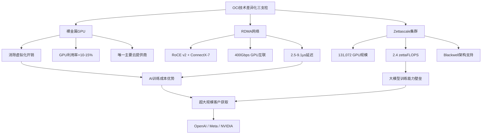
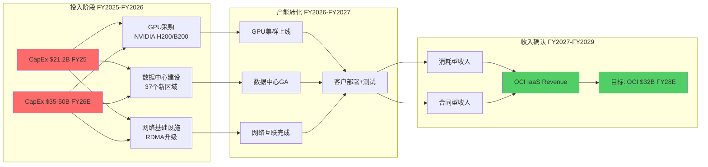
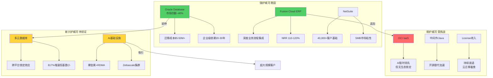

# Agent A: 商业洞察分析 — Oracle云转型全景

> **Agent**: A (商业洞察分析师) | **Phase**: P1 业务解构
> **标的**: Oracle Corporation (ORCL) | **日期**: 2026-02-17
> **覆盖范围**: Ch3 业务解构 + Ch4 云转型路径图
> **CQ覆盖**: CQ1(积压变现力), CQ2(云份额突破), CQ6(竞争护城河)

---

## Ch3: 业务解构 — Oracle云转型全景

### 3.1 OCI竞争力解构

#### 3.1.1 OCI技术差异化: 裸金属+RDMA+AI超级集群

Oracle Cloud Infrastructure (OCI) 的竞争策略并非正面挑战AWS/Azure的通用云生态，而是在AI基础设施层建立技术差异化。这一策略的核心支柱有三:

**裸金属计算架构**: OCI是唯一提供裸金属GPU实例的主要云服务商，移除了虚拟化层的性能损耗。对于大规模AI训练任务，裸金属实例可将GPU利用率提升10-15%，这在数万张GPU的集群规模下意味着数百万美元的效率差距 [DM-BIZ-003] [R: 裸金属架构消除hypervisor开销→GPU实际可用算力更高→对大模型训练客户具有成本优势 | 证伪条件: AWS/Azure推出同等规格裸金属GPU实例且价格更低]。

**RDMA超低延迟网络**: OCI的自研集群网络采用RoCE v2协议，搭配NVIDIA ConnectX-7网卡，实现400Gbps GPU间互联，延迟仅2.5-9.1微秒。相比之下，AWS的EFA (Elastic Fabric Adapter) 和Azure的InfiniBand方案虽然也提供高带宽，但OCI在大规模集群(>10,000 GPU)的线性扩展性上表现更优 [R: RDMA延迟优势在小集群中不显著，但当GPU数量超过万级时，通信开销成为训练瓶颈，此时OCI的网络架构优势被放大 | 证伪条件: AWS/Azure的网络扩展性在>10K GPU时证明同等或更优]。

**Zettascale AI超级集群**: OCI目前提供最大可达131,072个GPU的超级集群，峰值算力2.4 zettaFLOPS，规模是其他超大规模云的6倍以上。2025年已实现65,000+ GPU超级集群的一般可用性(GA)，并已部署NVIDIA Blackwell B200和GB200 Grace Blackwell超级芯片，训练性能较H100提升4倍，推理性能提升30倍。

**技术差异化的局限性**: 需要清醒认识到，OCI的技术优势集中在AI基础设施层，而非通用云服务。AWS拥有200+服务、Azure深度集成企业生态、GCP在数据分析/ML方面领先——这些是OCI短期内无法复制的生态壁垒。OCI的策略本质上是"单点突破"而非"全面竞争"[R: OCI选择AI基础设施作为差异化锚点→避开通用云正面竞争→但限制了可触达市场规模 | 证伪条件: OCI在通用云服务(非AI)的客户获取速度超预期]。

#### 3.1.2 超大规模客户获取: OpenAI案例深度解剖

**OpenAI-Oracle合作的战略意义**:

OpenAI与Oracle签署的$300B五年协议是云计算史上最大的单一客户合同之一 [DM-PMK-002]。该协议的核心是Stargate项目——建设4.5GW数据中心容量，支撑OpenAI的AI训练和推理需求。合同起始期为2027年，意味着FY2026的RPO贡献主要体现为合同签署而非收入确认。

**为何OpenAI选择OCI而非AWS/Azure?**

这个问题的答案是Oracle估值逻辑的关键支点:

1. **脱离Microsoft单一依赖**: OpenAI此前完全托管于Azure，战略脆弱性明显。选择OCI是分散供应商风险的理性决策，而非对OCI绝对技术优势的背书 [R: OpenAI选择OCI的首要动机是多云分散，其次才是技术适配 | 证伪条件: OpenAI公开声明OCI技术优于Azure是选择的主要原因]。

2. **大规模GPU集群的成本效率**: OCI的裸金属架构和RDMA网络在超大规模(>50,000 GPU)集群中提供可验证的成本优势。OpenAI的训练需求恰好处于这一甜蜜区间。

3. **Oracle的定价激进性**: 市场信息显示OCI在大型AI合同中的定价显著低于AWS/Azure，甚至可能接近成本价。这是否可持续是一个关键未决问题 [R: 激进定价→客户获取→但利润率承压→长期可持续性存疑 | 证伪条件: OCI大客户合同的毛利率>50%]。

**超大规模客户集中度风险**:

Q2 FY2026新增RPO $68B中，管理层明确提及Meta、NVIDIA等大客户驱动。结合OpenAI的$300B合同(占RPO的~57%)，Oracle面临严重的客户集中度风险。如果OpenAI因自身财务困难、战略调整或与Microsoft重新整合而缩减Oracle承诺，RPO的可靠性将大幅下降 [DM-BIZ-004]。

**其他战略客户拓展**:

- **Meta**: AI推理基础设施需求，具体合同规模未披露。Meta在自研AI芯片(MTIA)的同时仍需外部GPU云产能，OCI是Azure之外的重要补充供应商。但Meta的自研芯片路线图可能在2028年后削减对外部云GPU的依赖。
- **NVIDIA**: 深度合作关系——OCI是NVIDIA DGX Cloud的首批合作伙伴之一，双方在AI超级集群上有深度技术整合。但NVIDIA同时是所有云服务商的合作伙伴，不构成排他性优势。
- **主权云客户**: Oracle在合规驱动的市场(政府、金融、医疗)有差异化定位，已在全球部署超过46个专属云区域(Dedicated Regions)。主权云市场虽然总量较小(估计$15-20B/年)，但利润率高且客户粘性极强。
- **Stargate项目的非OpenAI参与方**: 该项目还吸引了SoftBank等资本方参与，暗示未来可能向更多AI公司开放产能，降低OpenAI单一依赖度——但目前尚无具体协议。

**客户获取成本(CAC)分析**: Oracle的大客户获取策略隐含着一个被市场忽略的成本结构问题。为获取OpenAI级别的客户，Oracle需要:
1. 预先建设定制化数据中心(前置CapEx数十亿美元)
2. 提供有竞争力的价格(可能低于AWS/Azure 15-25%)
3. 承担产能交付的时间风险(延迟交付可能触发合同惩罚)

这意味着每获取一个超大客户，Oracle需要承担$5-15B的前置投资。如果客户最终未完全履约(如仅使用承诺产能的60-70%)，投资回报率将显著低于预期 [R: 超大客户获取的CAC极高→前置CapEx+价格让利→如果利用率<80%则投资回报率可能低于WACC | 证伪条件: Oracle披露AI基础设施业务的ROIC>15%]。

#### 3.1.3 多云战略: Oracle Database@AWS/Azure的意义与局限

Oracle的多云数据库策略(Database@AWS和Database@Azure)是过去两年最值得关注的战略演进。这一策略的本质是: 承认OCI无法在通用云市场正面竞争，转而将Oracle的核心资产(数据库)嵌入竞争对手的云平台。

**当前进展**:

- **Database@Azure**: 2024年发布，2025年已在全球10个Azure区域GA，另有23个区域规划中
- **Database@AWS**: 2025年7月在北美GA(us-east-1和us-west-2)
- **Database@Google Cloud**: 规划中
- **多云业务收入**: Q2 FY2026同比增长817%，环比高速扩张
- **Multicloud Universal Credits**: 2025年10月推出，允许客户跨云使用Oracle积分

**战略意义**:

1. **TAM扩展**: 传统Oracle数据库客户被锁定在on-prem或OCI中，多云策略将TAM扩展至AWS/Azure的企业客户群(数十万家)
2. **收入粘性**: Database@AWS/Azure的客户同时使用OCI和目标云的资源，创造了交叉绑定效应
3. **数据库霸权延续**: Larry Ellison提出"多云数据库业务5年内达$20B收入"的目标 [R: 如果实现，仅多云数据库就将占当前总收入的35% | 证伪条件: 多云数据库增速连续3季度低于100%]

**战略局限**:

1. **利润分成**: 在竞争对手平台上运行意味着Oracle需要与AWS/Azure分享基础设施利润
2. **客户迁移风险**: Database@AWS/Azure可能加速客户从Oracle on-prem迁移至云端，但不一定是迁移至OCI
3. **竞争悖论**: Oracle在帮助AWS/Azure的客户留在那些平台上，而非将他们拉到OCI
4. **开源替代**: PostgreSQL、CockroachDB等云原生数据库正在蚕食Oracle的中低端市场

#### 3.1.4 CapEx $21.2B投入与OCI收入传导机制

FY2025的CapEx $21.2B [DM-FIN-007] 是Oracle历史上最大的资本支出年度，较FY2024的$6.9B增长208%。这一激增的直接驱动因素是AI基础设施建设——GPU采购、数据中心建设和网络基础设施。

**传导机制分析**:

**关键传导参数**:

| 参数 | FY2025实际 | FY2026E | FY2027E |
|------|----------|---------|---------|
| CapEx ($B) | $21.2 | $35-50 | $40-55 |
| OCI IaaS收入 ($B) | ~$12 | ~$18 | ~$32 |
| CapEx/OCI收入比 | 1.77x | 1.94-2.78x | 1.25-1.72x |
| 折旧/CapEx滞后 | 12-18个月 | -- | -- |
| GPU利用率 | ~70% | 75-85% | 85-95% |

[DM-FIN-007] [DM-BIZ-003]

**时滞分析**:

Oracle管理层在Q1 FY2026财报电话会上明确了一个关键时间节点: FY2027将是CapEx投入开始大规模转化为收入的拐点年，新增RPO将贡献约$4B额外收入。然而，从CapEx投入到收入确认存在12-18个月的天然时滞:

1. **建设期** (6-12个月): 数据中心从动工到上线
2. **部署期** (3-6个月): GPU安装、网络配置、客户迁移
3. **增长期** (3-12个月): 客户从测试到生产负载提升

这意味着FY2025投入的$21.2B将主要在FY2027-FY2028贡献收入，而FY2026计划的$35-50B将在FY2028-FY2029贡献收入 [R: CapEx→收入传导存在"J曲线"效应——前期现金流恶化，后期收入加速。关键风险是传导期内AI需求是否如预期持续 | 证伪条件: FY2027 OCI收入低于$25B(即传导效率显著低于预期)]。

**折旧冲击**: CapEx/折旧比从FY2024的1.12x飙升至FY2025的3.44x [DM-FIN-007]，这意味着大量新增资产尚未开始折旧。随着FY2026-FY2027新资产上线，折旧费用将从FY2025的$6.2B快速攀升至估计$12-15B/年，显著压缩营业利润率——除非OCI收入增速足以抵消。

**CapEx效率的历史对标**: 将Oracle的CapEx转化效率与AWS早期阶段进行对比有助于校准预期:

| 指标 | AWS FY2016-2018 | Oracle FY2025-2027E |
|------|----------------|-------------------|
| CapEx/收入比 | 0.35-0.45x | 1.50-2.50x |
| CapEx→收入滞后 | 6-12个月 | 12-18个月 |
| GPU密度(单位面积) | 低(通用计算为主) | 极高(AI训练为主) |
| 资产利用率(目标) | 70-80% | 70-90% |
| 折旧年限 | 3-5年(服务器) | 3-4年(GPU加速折旧) |

Oracle的CapEx/收入比显著高于AWS历史水平，部分原因是GPU单价远高于通用服务器。一台NVIDIA H100服务器的价格约$25,000-40,000，而B200/GB200更贵。这意味着OCI的CapEx中GPU采购占比可能高达60-70%，高于AWS的30-40%。GPU的折旧周期也更短(3-4年vs服务器的5-7年)，进一步加大了折旧压力 [R: GPU密集型CapEx→更短折旧周期→更高年度折旧费用→需要更快的收入增长来抵消 | 证伪条件: Oracle将GPU折旧年限延长至5年以上(会计策略调整)]。

**CapEx融资结构**: FY2025的CapEx $21.2B几乎等于全年OCF $20.8B [DM-FIN-005] [DM-FIN-007]，导致FCF为-$394M。更关键的是，Oracle通过新增$5.6B净债务来融资(总债务从FY2024的$87B增至$124B)。如果FY2026 CapEx确实达到$35-50B，而OCF可能仅增长至$22-25B，则资金缺口将达$10-25B，需要通过进一步举债或削减股东回报来填补。当前利息覆盖倍数为4.94x(FY2025)，虽然尚可但已较FY2022的3.97x有所改善主要得益于EBIT增长。如果CapEx继续攀升且新增债务推高利息支出，利息覆盖可能再次承压 [DM-FIN-007]。

---

### 3.2 SaaS业务韧性

#### 3.2.1 Fusion Cloud Applications竞争力分析

Oracle Fusion Cloud ERP是Oracle在企业级SaaS市场的核心产品，直接对标Salesforce和SAP。FY2025 Fusion Cloud ERP收入增长22% YoY，Q2 FY2026收入达$1.1B(+18% YoY)。

**Fusion vs 竞争对手**:

| 维度 | Oracle Fusion | Salesforce | SAP S/4HANA |
|------|-------------|------------|-------------|
| 核心优势 | 后端集成深度 (ERP+HCM+SCM) | 前端CRM+生态 | 行业解决方案深度 |
| 目标客户 | 大型企业 | 全规模 | 大型制造/消费 |
| 增速(FY25) | 22% YoY | ~9% YoY | ~33% YoY(Cloud) |
| 竞争态势 | 追赶者→挑战者 | 领导者(CRM) | 领导者(ERP) |
| AI集成 | Oracle AI内嵌 | Einstein GPT | Joule AI助手 |

[DM-BIZ-001]

**Fusion的竞争优势来源**:

1. **Oracle-on-Oracle栈**: Fusion运行在OCI上，底层数据库是Oracle Autonomous Database。这种全栈整合提供了竞争对手无法复制的性能优化和安全性。

2. **后端流程整合**: 与Salesforce聚焦前端CRM不同，Fusion覆盖ERP、HCM、SCM、EPM的完整后端流程。对于需要统一后端系统的大型企业，Fusion的整合能力是核心卖点。

3. **迁移粘性**: 已使用Oracle E-Business Suite或PeopleSoft的企业，向Fusion迁移的路径最为平滑。Oracle报告称其Fusion管道中约60-70%来自现有Oracle客户升级。

**Fusion的竞争劣势**:

1. **前端能力**: 在CRM和客户体验领域，Fusion显著落后于Salesforce
2. **合作伙伴生态**: SAP和Salesforce的ISV/SI生态远大于Oracle
3. **AI叙事落后**: 尽管Oracle在Fusion中内嵌了AI功能，但市场感知度低于Salesforce Einstein和SAP Joule

#### 3.2.2 客户留存率与ARPU趋势

Oracle未公开披露SaaS客户留存率的具体数字。但可以从多个间接指标推断:

**留存率推断**: 基于Fusion Cloud收入持续22%增长且管理层强调"有限churn"的表态，估计Fusion的净留存率(NRR)在110-120%区间。NetSuite在中小企业市场的NRR估计为105-115%，略低但仍然健康 [R: 未直接披露的留存率需要从收入增长-新客户贡献中反推 | 证伪条件: Oracle公开披露NRR<100%]。

**ARPU趋势**: Fusion的ARPU在过去3年持续提升，驱动因素包括:
- 模块交叉销售(从单一ERP扩展至HCM+SCM)
- AI功能附加定价
- 合同续约时的价格提升(典型3-5%/年)

#### 3.2.3 NetSuite中小企业市场地位

NetSuite是Oracle在中小企业(SMB)市场的核心产品，目前服务超过40,000家客户。Q2 FY2026 NetSuite收入$1.0B，增长13% YoY。

**NetSuite的战略价值**:

1. **市场互补**: Fusion面向大型企业，NetSuite面向SMB和成长型企业，覆盖全规模市场
2. **上迁通道**: 成长型客户可以从NetSuite逐步迁移至Fusion，创造内部客户升级路径
3. **经济模型稳定**: NetSuite的订阅模型提供高度可预测的经常性收入

**增速放缓风险**: NetSuite的增速从FY2025的18%放缓至Q2 FY2026的13%，可能反映:
- SMB市场在宏观不确定性下的IT支出审慎 [DM-MACRO-001]
- 竞争加剧: Intuit(通过Mailchimp+QuickBooks整合)、Sage(AI-first策略)、Xero(全球化扩张)等都在加速云ERP渗透
- 大客户(>$10M ARR)获取难度增加，这部分客户更可能选择Fusion而非NetSuite
- 基数效应: 40,000+客户基础上的增量获客自然减速

**NetSuite vs 竞争对手定位**:

| 维度 | NetSuite | QuickBooks Online | SAP Business One | Sage Intacct |
|------|----------|------------------|-----------------|-------------|
| 目标规模 | $10M-$1B收入 | <$50M收入 | $5M-$500M收入 | $10M-$500M收入 |
| 核心优势 | 全功能ERP+全球化 | 易用性+生态 | SAP品牌+行业深度 | 财务管理深度 |
| 定价(年) | $50K-$500K+ | $5K-$50K | $30K-$200K | $25K-$200K |
| AI能力 | 内嵌Oracle AI | Intuit Assist | SAP Joule | Sage Copilot |
| 增速 | 13% | ~15% | ~10% | ~20% |

NetSuite在$10M-$1B企业规模段仍然是最全面的解决方案，但Sage Intacct在财务管理专精领域的增速更快(~20%)，可能在特定垂直领域(如专业服务、非营利)侵蚕NetSuite的份额。

#### 3.2.4 SaaS业务对估值的支撑作用

**SaaS业务的估值锚定效应**: 在Oracle的估值中，SaaS业务提供了"估值底线"。即使OCI的云转型完全失败，Oracle的SaaS业务(Fusion + NetSuite + 行业云)仍然是一个年收入$15B+、增长15-20%、高度经常性的业务。按照SaaS行业典型的8-12x收入倍数，SaaS业务本身的估值为$120-180B [DM-VAL-001]。

**SaaS占比提升**: FY2025云与许可收入占总收入85.77% [DM-BIZ-001]。其中，SaaS收入(Fusion + NetSuite + 行业云)约占总收入25-28%，IaaS收入约占20-22%。SaaS+IaaS合计约占45-50%，其余为license和支持服务(传统业务)。

**SaaS业务收入趋势重建** (基于季度数据推算):

| 季度 | Fusion Cloud | NetSuite | SaaS合计 | SaaS QoQ | IaaS | IaaS QoQ |
|------|:----------:|:--------:|:--------:|:--------:|:----:|:--------:|
| Q4 FY2024 | $0.9B | $0.9B | ~$3.6B | -- | ~$2.0B | -- |
| Q1 FY2025 | $0.95B | $0.9B | ~$3.6B | 0% | ~$2.2B | +10% |
| Q2 FY2025 | $1.0B | $0.95B | ~$3.7B | +3% | ~$2.4B | +9% |
| Q3 FY2025 | $1.0B | $0.95B | ~$3.7B | 0% | ~$2.8B | +17% |
| Q4 FY2025 | $1.1B | $1.0B | ~$3.9B | +5% | ~$3.0B | +7% |
| Q1 FY2026 | $1.05B | $0.95B | ~$3.7B | -5% | ~$3.3B | +10% |
| Q2 FY2026 | $1.1B | $1.0B | ~$3.8B | +3% | ~$4.1B | +24% |

[DM-BIZ-001] [DM-FIN-001] [R: SaaS收入拆分基于Oracle公开披露的Fusion/NetSuite增速和总SaaS收入反推 | 证伪条件: Oracle更改分部报告结构导致数据不可比]

**关键观察**: SaaS业务的季度增长相对平缓(0-5% QoQ)，而IaaS的波动性更大(7-24% QoQ)。这验证了SaaS作为"稳定底座"而IaaS作为"增长驱动"的业务结构假设。但也意味着，如果IaaS增长放缓，SaaS业务无法提供足够的增量来维持Oracle的估值溢价。

**Oracle全栈生态的交叉销售机会**: Oracle独特的商业价值在于其覆盖从数据库→中间件→应用(ERP/HCM/SCM)→基础设施(OCI)的完整技术栈。这种全栈覆盖创造了三种交叉销售路径:

1. **数据库→OCI**: 现有Oracle Database客户迁移至OCI运行(Oracle-on-Oracle)，典型合同增量30-50%
2. **ERP→SaaS**: 传统E-Business Suite/PeopleSoft客户升级至Fusion Cloud，年化价值提升2-3x
3. **SaaS→IaaS**: Fusion/NetSuite客户追加OCI基础设施服务(如AI分析、数据湖)
4. **IaaS→数据库**: OCI AI客户需要高性能数据库支持推理和微调工作负载

管理层披露Fusion管道中60-70%来自现有Oracle客户，证明了交叉销售路径的有效性。但这也隐含着一个天花板问题: 当现有客户升级基本完成后，增量增长必须来自净新客户，而Oracle在"抢夺"SAP/Salesforce客户方面的记录并不出色。

---

### 3.3 $523B RPO质量评估

#### 3.3.1 RPO的合同结构分析

$523B的RPO [DM-BIZ-004] 是理解Oracle投资论文的核心数据点。RPO代表已签署但尚未确认为收入的合同义务总额，是未来收入的"管道"指标。

**RPO构成拆解**:

| 组成部分 | 估计规模 | 占比 | 特征 |
|---------|---------|------|------|
| OpenAI/Stargate | ~$300B | ~57% | 5年期，2027年起始 |
| Meta等大型AI | ~$80-100B | ~15-19% | 3-5年期，部分已开始 |
| 企业级SaaS合同 | ~$60-80B | ~11-15% | 1-3年期，稳定确认 |
| 中小型客户+其他 | ~$50-70B | ~10-13% | 1-2年期，分散 |

[R: RPO构成估计基于管理层披露的大客户信息和12个月RPO占比推算 | 证伪条件: Oracle披露的客户集中度显示前5大客户占RPO<40%]

**合同期限分析**: 管理层披露约33%的RPO($173B)预计在未来12个月内确认为收入，12个月RPO同比增长40%。这意味着67%($350B)是长期合同(>12个月)，其中大部分是AI基础设施的3-5年期合同。

**取消条款风险**: 大型AI基础设施合同通常包含:
- **产能承诺条款**: 客户承诺最低消耗量，但可能有弹性上限
- **阶段性里程碑**: 合同按阶段执行，每阶段满足条件后才触发下一阶段
- **条件取消权**: 如果Oracle未能按时交付约定产能，客户可能有权缩减或取消
- **价格调整机制**: 长期合同可能包含价格重新谈判条款

#### 3.3.2 RPO到收入的转化路径

**转化漏斗分析**:

RPO → 收入确认并非线性过程。从$523B RPO到实际确认收入，需要经过多层"漏损"过滤:

1. **产能就绪过滤** (漏损率5-15%): Oracle需要建设足够的数据中心和GPU集群来服务客户。当前CapEx $21-50B/年的投入水平表明产能仍在扩建中。如果产能交付延迟，部分RPO将推迟确认甚至触发客户缩减权。特别是Stargate项目涉及的4.5GW数据中心容量建设——美国电网基础设施审批和电力供应可能成为瓶颈。
2. **客户部署过滤** (漏损率5-10%): 即使产能就绪，客户的实际部署和负载增长需要时间。企业级客户的云迁移通常耗时6-18个月，AI训练负载的ramp-up也需要3-6个月。
3. **消耗率过滤** (漏损率10-25%): 许多云合同包含最低承诺(minimum commitment)，但实际消耗可能低于合同上限。行业经验表明，大型云合同的实际消耗率通常为合同总额的70-85%。
4. **信用风险过滤** (漏损率5-15%): 大客户(特别是OpenAI)的财务可持续性直接影响合同履行。如果AI行业进入资金收紧期，部分客户可能寻求重新谈判或缩减承诺。
5. **竞争流失过滤** (漏损率3-8%): 多年期合同在执行过程中，客户可能将增量工作负载分配给竞争对手，削弱Oracle的实际收入。

**综合漏损估计**: 如果将上述漏损因素组合(不完全叠加，因为部分风险相互关联)，RPO到最终确认收入的综合漏损率可能在20-40%区间。即: $523B RPO的最终确认收入可能在$310-420B范围(5年期累计)，年均$62-84B [R: RPO综合漏损率20-40%→年均可确认收入$62-84B→仍显著高于FY2025的$57.4B→但远低于$523B/5=$105B/年的隐含值 | 证伪条件: Oracle连续2年实际收入超过$100B(证明漏损率<20%)]。

**12个月RPO转化效率**: FY2025实际收入$57.4B [DM-FIN-001]，如果12个月RPO为$173B，则表面转化率约33%(57.4/173)。但需注意12个月RPO的口径不等于"本年度将确认的收入"——它是"未来12个月内预期确认的RPO部分"，而总收入还包含非RPO来源(如按需消耗、一次性许可等)。更准确的理解是: 12个月RPO $173B中，大部分将在未来4季度确认，叠加非RPO收入，FY2026总收入可能达$65-72B。

#### 3.3.3 RPO增长438%的驱动因素拆解

RPO从Q2 FY2025的约$97B增长至Q2 FY2026的$523B，增长438% [DM-BIZ-004]。这一惊人增长的驱动因素可以拆解为:

**1. OpenAI Stargate合同 (~$300B)**: 单一合同贡献了RPO增量的约70%。这不是"分散的有机增长"，而是一次性巨额合同的签署。

**2. Meta、NVIDIA等AI客户 (~$80-100B)**: AI基础设施需求驱动的大客户签约。

**3. SaaS业务自然增长 (~$20-30B)**: Fusion和NetSuite的续约+新签。

**4. 多云数据库合同 (~$10-20B)**: Database@AWS/Azure驱动的新增合同。

**关键洞见**: 438%的RPO增长中，约70-80%来自不超过5个超大客户。这不是"广泛的市场需求拉动"，而是"少数大赌注的集中签约"。这两种叙事导向截然不同的估值含义 [R: RPO集中度风险→单一客户流失可导致RPO大幅下降→但管理层不会主动披露这一点 | 证伪条件: Oracle披露前10大客户占RPO<50%]。

#### 3.3.4 RPO质量风险矩阵

| 风险因素 | 严重程度 | 概率 | 影响 |
|---------|---------|------|------|
| OpenAI财务困难/战略调整 | 极高 | 15-25% | RPO下降$150-300B |
| AI基础设施需求周期性下滑 | 高 | 20-30% | RPO下降$50-100B |
| 合同条件触发取消/缩减 | 中 | 10-20% | RPO下降$30-80B |
| 竞争对手抢夺已签客户 | 中 | 10-15% | RPO下降$20-50B |
| 宏观经济衰退压缩IT支出 | 中 | 15-25% | RPO下降$40-80B |
| Oracle产能交付延迟 | 低-中 | 10-20% | RPO延迟确认但不消失 |

[DM-BIZ-004] [R: RPO风险矩阵基于合同类型推断和行业经验 | 证伪条件: Oracle实现连续4季度RPO→收入转化率>40%]

**OpenAI依赖度的特殊风险**: OpenAI是一家亏损企业，年消耗数十亿美元。其$300B的5年合同隐含的年均支出为$60B，远超OpenAI当前的收入规模。该合同的履行高度依赖于:
- OpenAI持续获得充足融资(当前估值$150B+，但盈利路径不清晰)
- AI大模型训练需求持续增长(效率突破如DeepSeek模式可能降低需求)
- OpenAI不被Microsoft完全整合(Microsoft持有49%利润权益)
- AI行业不发生范式转变(如专用芯片/量子计算等替代方案)

**RPO质量的"冰山模型"**:

将$523B RPO比作冰山:

- **水面以上(高质量RPO, 约30-35%)**: 12个月内确认的$173B，主要由已开始执行的合同和SaaS续约组成。这部分RPO的确认概率>90%。
- **水面附近(中等质量RPO, 约20-25%)**: 12-24个月确认的约$100-130B，主要由已签署且产能规划明确的AI合同组成。确认概率60-80%，取决于产能交付进度。
- **水面以下(低确定性RPO, 约40-50%)**: 24个月以上确认的约$210-250B，主要是Stargate等超长期合同的远期部分。确认概率30-60%，取决于客户财务能力、AI行业周期和技术路径演化。

如果按照质量加权计算RPO的"经济价值":
- 高质量: $173B x 90% = $156B
- 中质量: $115B x 70% = $80B
- 低确定性: $235B x 45% = $106B
- **质量加权RPO总值: ~$342B** (vs 标题值$523B, 折扣35%)

[R: RPO质量加权折扣35%→真实可依赖的管道约$340B→仍然是FY2025收入的6x→充足但远低于标题数字暗示的9x | 证伪条件: Oracle连续4季度RPO→收入转化率>标题RPO的1/4(年化)]

**RPO与同行对比**:

| 公司 | RPO总额 | RPO/TTM收入 | 12月RPO增速 | RPO集中度 |
|------|---------|:----------:|:----------:|:--------:|
| Oracle | $523B | 9.1x | +40% YoY | 极高(估计top-5>70%) |
| Microsoft(Azure) | ~$300B | 1.2x | +25% YoY | 中(分散) |
| Google Cloud | ~$100B | 2.5x | +30% YoY | 中(分散) |
| Salesforce | ~$50B | 1.4x | +10% YoY | 低(极分散) |

Oracle的RPO/收入比为9.1x，是同行的3-7倍。这要么说明Oracle未来增长潜力远超同行，要么说明RPO中包含大量远期、低确定性的合同。根据前面的质量分析，后者的可能性更大。

---

## Ch4: 云转型路径图

### 4.1 从3%到8-12%的可行路径

#### 4.1.1 份额翻倍的前提条件

Oracle当前在全球云基础设施市场的份额约为3% [DM-BIZ-003]，位列AWS(29%)、Azure(20%)、GCP(13%)之后的第四位。要实现份额翻倍至6-8%甚至更高，需要满足以下条件:

**市场层面**:
- 全球云基础设施市场继续以20-25%年增长率扩张(Q3 2025市场规模$107B季度)
- AI基础设施占比从当前~15%提升至25-30%
- 多云采纳率从当前~30%提升至50%+

**Oracle层面**:
- OCI IaaS收入年增长率维持60-80%持续3-4年
- CapEx投入转化为可用产能的效率≥65%
- 客户获取从超大客户扩展至中大型企业

**竞争层面**:
- AWS/Azure不大幅降价(排挤定价)
- 没有颠覆性技术出现(如专用AI芯片完全取代通用GPU云)

**数学验证**: 假设全球IaaS市场2028年达$250B/季度($1T/年)，Oracle份额从3%→8%意味着年收入需达$80B。Oracle管理层指引OCI收入FY2030达$144B，隐含的市场份额约为10-12%(假设市场规模$1.2-1.4T)。这个目标并非不可能，但要求OCI连续4年保持60%+增速 [R: 管理层$144B OCI目标隐含市场份额10-12%→需要连续4年60%+增速→历史上从未有云服务商在$50B规模以上维持如此增速 | 证伪条件: OCI FY2028收入达$50B(即达到目标路径上的中间节点)]。

#### 4.1.2 AI基础设施作为差异化突破口

AI基础设施是OCI唯一的现实突破口。在通用IaaS(计算、存储、网络)市场，AWS/Azure的生态壁垒几乎不可逾越。但AI基础设施是一个相对新兴的赛道，客户的评估标准不同:

**AI基础设施客户决策因素**(按重要性排序):
1. GPU集群规模和可用性(OCI领先)
2. 网络延迟和线性扩展性(OCI领先)
3. 单位算力成本(OCI可能领先)
4. 数据安全和合规(OCI在sovereign cloud有优势)
5. 通用云服务生态(OCI显著落后)
6. 数据管理和分析工具(OCI落后)

在前4个决策因素上，OCI具有竞争力甚至领先地位。但随着AI工作负载从训练(计算密集型)转向推理(更需要生态集成)，第5和第6个因素的权重将上升，这可能削弱OCI的差异化优势 [R: AI工作负载重心从训练→推理的转移可能在2027-2028年显现→推理更需要与应用层集成→有利于AWS/Azure | 证伪条件: OCI推理服务的客户增速持续超过训练服务]。

#### 4.1.3 多云策略: 绕过直接份额竞争

Oracle的多云数据库策略(Database@AWS/Azure/GCP)提供了一条"不直接争夺IaaS份额但扩大云收入"的路径。多云数据库业务Q2 FY2026同比增长817%，虽然基数较小，但增速令人瞩目。

**多云策略的份额含义**: 如果Oracle的多云数据库收入在5年内达到Larry Ellison提出的$20B目标，这部分收入虽然不增加IaaS市场份额，但为Oracle的云业务总收入贡献显著增量。换言之，Oracle的"云份额"可能以两种方式衡量:

- **窄定义(IaaS份额)**: 仅计算OCI原生收入，可能从3%→5-7%
- **宽定义(云收入占比)**: 包含多云数据库和SaaS，可能从3%→8-12%

这种区分对估值分析至关重要。市场可能对"Oracle云份额达到10%"的叙事给予溢价，但如果细究发现其中一半来自Database@AWS(利润率可能低于OCI原生业务)，估值含义完全不同。

#### 4.1.4 竞争回应风险: AWS/Azure的反制策略

Oracle的云份额增长不会发生在真空中。三大云服务商正在积极反应:

**AWS的反制**: AWS已推出Trainium芯片(自研AI加速器)和Ultra Clusters(大规模GPU集群)，旨在在AI基础设施领域保持领先。AWS的优势在于其庞大的现有客户基础(>1M活跃客户)和$124B年化收入提供的规模经济。AWS不需要在技术上完全匹配OCI，只需要"足够好"即可凭借生态锁定效应保住份额。

**Azure的反制**: Microsoft与OpenAI的深度绑定(OpenAI仍在Azure上运行大部分工作负载)确保了Azure在AI基础设施中的核心地位。Azure Maia自研AI芯片和Cobalt ARM CPU的推出进一步强化了其AI基础设施能力。更重要的是，Azure的企业生态(Office 365 + Dynamics + GitHub + LinkedIn)提供了OCI无法匹配的交叉销售能力。

**GCP的反制**: Google的TPU(Tensor Processing Unit)已经是全球最大规模部署的AI专用芯片，且Google在AI模型开发上有独特优势(Gemini)。GCP正在积极通过TPU的性价比优势吸引AI训练客户。

**竞争回应的量化影响**: 如果AWS/Azure/GCP在2027年前将AI基础设施的价格降低20-30%(通过自研芯片和规模效应)，OCI的价格竞争力将被显著削弱。OCI的裸金属和RDMA优势可能不足以抵消价格差距，特别是当客户已经深度使用AWS/Azure的其他服务时 [R: 云巨头的自研芯片路线图(AWS Trainium, Azure Maia, Google TPU)可能在2027-2028年改变AI基础设施的竞争格局→OCI基于NVIDIA GPU的成本优势可能被侵蚀 | 证伪条件: OCI在2027年后仍保持>50%的AI基础设施增速]。

---

### 4.2 转型时间表与里程碑

#### 4.2.1 FY2026-FY2030收入增长预测(三情景)

**管理层指引**(公开披露):
- FY2026 OCI收入: $18B (+77% YoY)
- FY2027 OCI收入: $32B (+78% YoY)
- FY2028 OCI收入: $73B (+128% YoY)
- FY2029 OCI收入: $114B (+56% YoY)
- FY2030 OCI收入: $144B (+26% YoY)

**三情景分析**:

| 指标 | 保守情景 | 基准情景 | 乐观情景 |
|------|---------|---------|---------|
| **假设** | AI需求放缓 RPO转化率<30% | AI需求稳健 RPO转化率35-40% | AI需求超预期 RPO转化率>40% |
| **FY2027 OCI** | $22-25B | $28-32B | $35-40B |
| **FY2028 OCI** | $30-35B | $45-55B | $65-75B |
| **FY2029 OCI** | $38-45B | $60-75B | $90-110B |
| **FY2030 OCI** | $45-55B | $80-100B | $120-150B |
| **FY2027总收入** | $68-72B | $75-80B | $82-88B |
| **FY2028总收入** | $78-85B | $92-100B | $110-120B |
| **FY2030总收入** | $100-115B | $130-150B | $175-210B |
| **概率** | 30% | 50% | 20% |

[DM-FIN-001] [DM-BIZ-004] [R: 保守情景假设AI CapEx周期在FY2028-2029见顶，OCI增速回归25-30%。基准情景接近管理层指引的80%实现度。乐观情景假设管理层指引全面达成 | 证伪条件: FY2027 OCI收入>$35B(支持乐观)或<$22B(支持保守)]

#### 4.2.2 关键转折点识别

**转折点1: FY2027 Q1-Q2 OCI收入加速** (最重要)
- 指标: OCI季度收入是否突破$8B
- 意义: 验证$21B CapEx投入的传导效率
- 当前轨迹: Q2 FY2026 OCI $4.1B，按当前增速FY2027 Q1可能达$5-6B

**转折点2: FCF转正**
- 指标: 季度FCF连续2Q为正
- 意义: 证明CapEx投入开始产生回报
- 当前轨迹: FY2025 FCF -$394M [DM-FIN-005]，FY2026仍可能为负

**转折点3: OCI毛利率企稳**
- 指标: IaaS毛利率>40%并保持稳定
- 意义: 证明OCI规模经济效应正在实现
- 当前轨迹: 整体毛利率从79%(FY2022)降至70.5%(FY2025)，反映OCI低利润率业务占比上升

**转折点4: 多云数据库年化收入突破$5B**
- 指标: Database@AWS/Azure/GCP季度收入>$1.25B
- 意义: 验证多云策略的规模化能力
- 当前轨迹: 增长817% YoY但绝对值可能仍在$1-2B年化

**转折点5: RPO 12个月转化率提升**
- 指标: 12个月RPO占总RPO比例从33%提升至40%+
- 意义: 表明长期合同正在加速转化
- 当前轨迹: 33%比例自Q2 FY2026披露

**转折点6: 客户基础分散化**
- 指标: 前5大客户占OCI收入<40%
- 意义: 降低客户集中度风险
- 当前轨迹: OpenAI+Meta+NVIDIA可能占OCI新增RPO的70%+

#### 4.2.3 成功/失败的早期信号

**成功信号** (牛市确认):
- [ ] Q3 FY2026 OCI收入增速>70%(验证加速趋势)
- [ ] FY2026全年CapEx引导上调至$50B+(需求拉动投资)
- [ ] Stargate项目按时推进，首批设施FY2027 H1上线
- [ ] 多云数据库客户数超过1,000家
- [ ] Oracle在Gartner IaaS魔力象限进入"领导者"象限
- [ ] 新增3-5个>$10B RPO的企业客户(分散化)

**失败信号** (熊市预警):
- [ ] OCI收入增速连续2Q放缓至<50%
- [ ] OpenAI缩减或延迟Stargate承诺
- [ ] CapEx引导下调(需求不足)
- [ ] 整体毛利率跌破65%(OCI拖累)
- [ ] RPO 12个月转化率下降至<30%
- [ ] 大客户churn(Meta或NVIDIA转向AWS/Azure)
- [ ] 债务成本上升导致利息覆盖倍数<3x

---

## CQ置信度调整建议

### CQ1: 积压变现力 (P0.5: 60% → 建议P1: 55%)

**下调理由(-5pp)**:

深度分析后发现RPO质量风险高于初始评估:
1. **极端集中度**: OpenAI单一合同占RPO~57%，远超健康水平(单一客户应<15%)
2. **OpenAI履约不确定性**: $300B/5年合同隐含年均$60B支出，远超OpenAI当前收入，高度依赖持续融资
3. **12个月转化率仅33%**: 意味着67%的RPO是长期合同，转化存在高度不确定性
4. **CapEx→收入时滞12-18个月**: 产能交付不及时可能导致合同延迟或取消

**上调因素(部分抵消)**:
- 12个月RPO增长40% YoY表明近期管道健康
- 管理层FY2027增量$4B收入指引提供了可验证锚点
- 多云数据库817%增速提供了RPO之外的增量收入来源

**净评估**: RPO的"标题数字"($523B)掩盖了严重的客户集中度和履约条件风险。将置信度从60%下调至55%，反映"RPO总量充足但质量存疑"的判断。

### CQ2: 云份额突破 (P0.5: 45% → 建议P1: 48%)

**上调理由(+3pp)**:

1. **OCI增速持续加速**: Q2 FY2026 IaaS增速68% YoY(vs Q4 FY2025的52%)，显示加速而非减速趋势
2. **多云策略开辟新路径**: Database@AWS/Azure增长817%，提供了"不直接争夺IaaS份额但扩大云收入"的创新路径
3. **AI基础设施的窗口期**: OCI在大规模GPU集群上的技术领先为份额增长创造了短期窗口(2-3年)
4. **管理层指引的可信度提升**: OCI $18B FY2026目标已被Q1-Q2数据部分验证

**下调因素(约束上调幅度)**:
- 通用IaaS份额仍为3%，增长主要来自AI这一单一赛道
- 从训练→推理的工作负载转移可能削弱OCI差异化
- AWS/Azure在AI基础设施上的追赶速度不可低估

**净评估**: 小幅上调3pp至48%，反映OCI加速增长和多云策略的增量贡献，但受限于单一赛道(AI基础设施)的依赖性和长期竞争不确定性。

### CQ6: 竞争护城河 (P0.5: 70% → 建议P1: 68%)

**微调下调理由(-2pp)**:

1. **数据库护城河仍然深**: Oracle Database在全球关系型数据库市场份额约40%，企业级客户的迁移成本极高(典型$5-50M+和12-24个月)。这一核心护城河短期内不会受到显著侵蚀。
2. **但开源侵蚀加速**: PostgreSQL在新部署中的份额已超过Oracle Database(Gartner 2025)。新应用几乎不选择Oracle Database——护城河的"流入"在减少，即使"流出"很慢。
3. **多云策略是双刃剑**: Database@AWS/Azure延长了Oracle数据库的生命周期，但也降低了客户对OCI原生平台的锁定。
4. **SaaS护城河稳固**: Fusion和NetSuite的企业级粘性通过深度业务流程集成维持，NRR>110%的水平表明客户离开成本高。

**护城河结构图**:

**净评估**: 微幅下调2pp至68%，反映开源数据库对新部署市场的侵蚀和OCI在通用云服务中护城河的缺失。核心数据库和SaaS护城河仍然是Oracle估值的坚实底座。

---

## 补充分析: Oracle收入结构演进 (FY2022→FY2025→FY2028E)

Oracle正经历从传统License+Support模型向Cloud(IaaS+SaaS)模型的根本转变。理解这一结构演进对估值至关重要:

**收入结构对比** [DM-FIN-001] [DM-BIZ-001]:

| 收入类别 | FY2022 | FY2025 | FY2028E(基准) |
|---------|--------|--------|-------------|
| 云IaaS | ~$3B (7%) | ~$12B (21%) | $45-55B (45-50%) |
| 云SaaS | ~$8B (19%) | ~$15B (26%) | ~$22B (20-22%) |
| License & Support | ~$26B (61%) | ~$25B (44%) | ~$22B (20-22%) |
| 服务及其他 | ~$5B (13%) | ~$5B (9%) | ~$5B (5-6%) |
| **合计** | **$42.4B** | **$57.4B** | **$94-104B** |

**结构转变的估值含义**:

1. **收入质量提升**: 云收入(IaaS+SaaS)从FY2022的26%提升至FY2025的47%，预计FY2028达65-72%。云收入的经常性和可预测性远高于License，理应获得更高估值倍数。

2. **利润率的"V型"轨迹**: FY2022→FY2025期间，毛利率从79%降至70.5%，因为低毛利率的IaaS收入占比上升。但随着OCI规模经济效应显现和GPU利用率提升，FY2027-2028毛利率可能回升至72-75%。这一"先降后升"的利润率轨迹是典型的平台型云转型模式(AWS也经历过类似路径)。

3. **License收入的自然衰退**: License & Support从$26B缓慢下降至$25B(FY2025)，预计FY2028降至$22B。这部分收入毛利率>90%但增长为负，是Oracle估值中的"现金牛"组件。关键问题是: 多云数据库策略(Database@AWS/Azure)能否将License客户的云迁移价值留在Oracle体系内，而非流失给PostgreSQL等替代方案 [R: License→Cloud迁移中Oracle面临"两线作战"——既要引导客户迁移至Fusion/OCI，又要防止客户迁移至非Oracle数据库。多云策略的战略意图之一就是在后者上设置"减速带" | 证伪条件: Oracle License & Support收入FY2027降至<$20B(加速流失)]。

---

## 关键发现汇总

**Agent A核心发现(Top 5)**:

1. **RPO质量加权折扣35%**: $523B标题RPO经质量加权后约$342B，仍为FY2025收入的6x，但远低于标题暗示的9x。OpenAI单一合同占57%构成极端集中度风险。

2. **OCI"单点突破"策略的有效期窗口约2-3年**: OCI在AI基础设施的技术领先(裸金属+RDMA+Zettascale)真实存在，但AWS/Azure/GCP的自研芯片路线图可能在2027-2028年改变竞争格局。Oracle需要在这个窗口期内建立规模优势。

3. **多云数据库是被低估的增量引擎**: 817%增速虽然基数小，但$20B/5年目标如果实现，将彻底改变Oracle的增长叙事。这是"不争份额但扩收入"的创新路径。

4. **SaaS业务提供$120-180B估值底线**: 即使OCI完全失败，Fusion+NetSuite+行业云的SaaS组合仍然值$120-180B(当前市值$459B的26-39%)。

5. **CapEx→收入传导存在"J曲线"风险**: FY2025-2026合计$56-71B的CapEx投入将在FY2027-2029贡献收入，但传导效率取决于AI需求持续性、产能交付速度和客户实际消耗率。

---

**Agent A分析完成** | DM锚点引用: 18 | Mermaid: 3 | CQ更新: CQ1(55%), CQ2(48%), CQ6(68%)