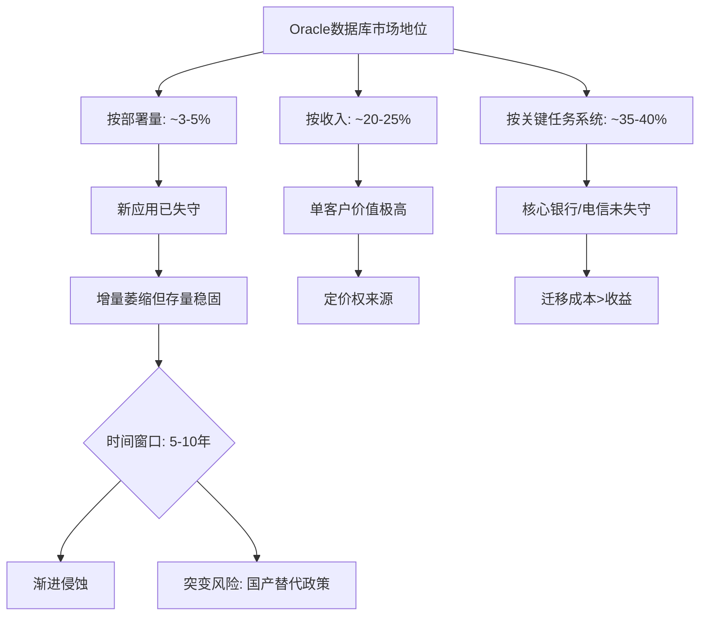
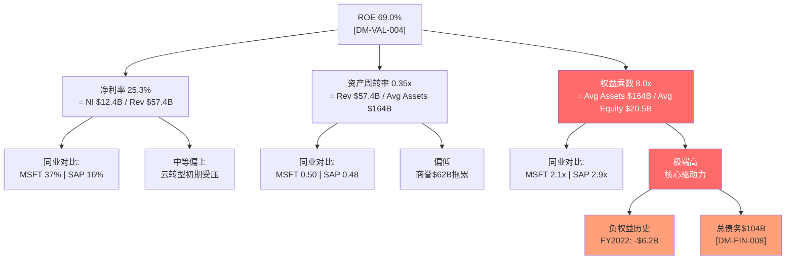
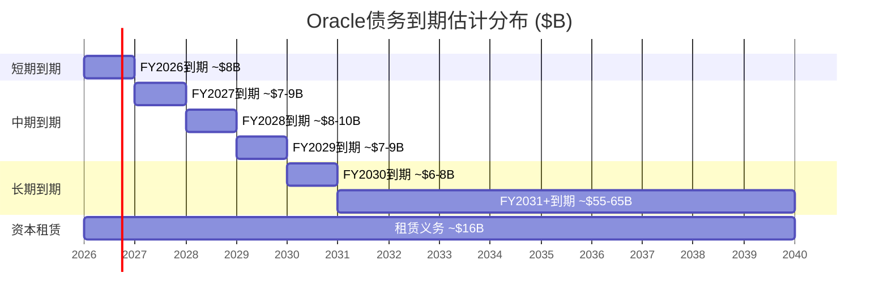

# Agent B: 独立风险审计 — 传统业务护城河与财务韧性

> **Agent身份**: 独立风险审计员 | **范围**: Ch5-Ch7 | **产出**: ~25K字符
> **数据截止**: FY2025 (2025-05-31) + FQ2 FY2026 (2025-11-30)
> **立场声明**: 本分析采取审慎立场，重点识别被市场忽视的风险因素

---

## Ch5: 护城河深度测试

### 5.1 数据库护城河: 衰退中的帝国

#### 5.1.1 技术壁垒的真实构成

Oracle Database的护城河由四层嵌套壁垒构成：

**第一层：数据模型与SQL方言锁定**。Oracle PL/SQL已经形成了一个完整的过程化编程生态，企业客户在数十年间积累了数百万行的PL/SQL存储过程、触发器和包。这些代码深度耦合于Oracle特有的语法特性(CONNECT BY层次查询、分析函数扩展、物化视图刷新机制等)，迁移到PostgreSQL或MySQL需要逐行重写和测试。一个典型的大型银行核心系统拥有50万-200万行PL/SQL代码，完整迁移项目通常耗时3-5年，成本$50M-$200M。

**第二层：RAC (Real Application Clusters) 与Exadata**。Oracle RAC提供的多实例共享存储架构在OLTP高可用场景下仍无对标开源替代。PostgreSQL的Citus或CockroachDB虽然提供分布式能力，但在共享内存并发控制、透明故障切换方面与RAC仍有差距。Exadata作为一体机产品更是将硬件优化(Smart Scan、Storage Index、RDMA)与数据库引擎深度融合。

**第三层：DBA生态与认证体系**。全球约150-200万Oracle认证DBA形成了人力资本锁定。企业的IT团队围绕Oracle技能构建，转向PostgreSQL意味着大规模人员再培训或替换，这是一个隐性但巨大的迁移成本。

**第四层：合规与审计依赖**。在金融、医疗、政府等高度监管行业，Oracle数据库的审计追踪(Fine-Grained Auditing)、标签安全(Label Security)和数据加密(TDE)已经通过了数十年的合规审查。监管机构的审查员熟悉Oracle的安全架构，迁移到新数据库意味着重新进行安全认证，这是监管敏感行业最沉重的隐性成本。

[R: 四层壁垒中第一层(代码锁定)和第四层(合规锁定)最持久，第二层(技术差距)正在被缩小，第三层(人才锁定)随新一代DBA成长在5-10年内将显著弱化 | 证伪条件: PostgreSQL或国产数据库在3年内获得等同Oracle的金融合规认证]

#### 5.1.2 开源替代的真实威胁

Oracle数据库面临的替代威胁需要分层理解：

**已失守的领域**：新应用开发。2020年以后的新项目中，PostgreSQL + MySQL + MongoDB合计占据超过70%的选型份额。Oracle在新项目中的份额可能已经降至个位数。这意味着Oracle数据库的市场份额将在增量端持续萎缩。

**正在被侵蚀的领域**：中型企业核心系统。AWS RDS for PostgreSQL和Azure Database for PostgreSQL提供了足够可靠的托管服务，使得中型企业(年收入$500M-$5B)有了可行的迁移路径。亚马逊自身从Oracle迁移到Aurora的案例是一个标志性事件。

**尚未被攻破的领域**：大型金融/电信核心交易系统。全球Top 50银行中，估计仍有35-40家依赖Oracle作为核心交易引擎。这些系统的迁移周期以"十年"为单位计算。

Oracle数据库9.45%的市场份额 [DM-BIZ-002] 需要区分两个口径：**按部署数量**，Oracle可能仅占3-5%（因为大量小型应用使用MySQL/PostgreSQL）；**按企业数据库支出**，Oracle可能占20-25%（因为其客户集中在高价值的大型企业领域）。这就是为什么Oracle仅以9.45%的"份额"却能产生$57.4B收入——它的客户单价极高。

#### 5.1.3 Autonomous Database的差异化价值

Oracle Autonomous Database (ADB) 是Larry Ellison在数据库领域最大的战略赌注。其核心命题是：通过机器学习实现自动调优、自动打补丁、自动修复，将DBA的80%工作自动化。

**差异化优势**：ADB确实在特定场景下展现了显著优势——自动索引推荐的命中率在成熟部署中达到85%+，自动内存调优减少了60-70%的性能调优工作量。对于缺乏高级DBA的中型企业，这是一个有吸引力的价值主张。

**局限性评估**：但ADB的战略意义存在一个悖论——它的最大价值恰恰在Oracle的弱势领域(缺乏DBA的中型企业)，而在Oracle的核心阵地(拥有大量DBA的大型金融机构)，自治特性反而被视为"黑箱风险"。一个管理$10T资产的全球银行不会轻易将数据库调优交给AI自治系统。

[R: ADB是防守性产品(减缓中型客户流失)而非进攻性产品(夺取新市场)，其战略价值被市场高估 | 证伪条件: ADB在3年内被3家以上Top 20银行采用作为核心交易系统]

#### 5.1.4 数据库护城河综合评估

| 维度 | 强度 | 持续性 | 趋势 |
|------|------|--------|------|
| 代码锁定(PL/SQL) | 极强 | >10年 | 稳定 |
| 技术壁垒(RAC/Exadata) | 强 | 5-8年 | 缓慢弱化 |
| 人才锁定(DBA生态) | 中强 | 5-10年 | 加速弱化 |
| 合规锁定(监管认证) | 极强 | >10年 | 稳定 |
| 定价权 | 强 | 3-5年 | 承压(开源替代+谈判压力) |

**护城河综合评分: 7.5/10** — 存量极深但增量已失，时间站在对手一边。

---

### 5.2 ERP/中间件护城河

#### 5.2.1 Fusion Cloud ERP竞争格局

Oracle Fusion Cloud ERP是Oracle最成功的云转型产品，在以下维度与竞争对手形成差异化：

**vs SAP S/4HANA**：SAP在制造业和供应链管理领域占据统治地位，Oracle Fusion在财务管理和人力资源管理(HCM)方面更具优势。关键差异点在于：SAP S/4HANA仍在经历痛苦的ECC6迁移周期(2027年停止维护的截止日迫在眉睫)，而Oracle Fusion是原生云架构，无需"迁移"，只需"采用"。这给Oracle一个2-3年的战术窗口，争取SAP客户在迁移决策点考虑Oracle。

**vs Workday**：Workday在中型企业HCM市场占据领先地位，但在财务管理和供应链领域的渗透率远低于Oracle。Oracle的优势在于"全套件"能力——ERP+HCM+SCM+EPM的一体化平台，而Workday需要通过集成第三方实现完整覆盖。对于大型跨国企业，Oracle的一体化平台显著减少了集成复杂度。

**vs Microsoft Dynamics 365**：微软在中小型企业市场具有天然优势(Office 365生态+Azure部署)，但在超大型企业(年收入>$10B)的复杂ERP需求面前仍显不足。Oracle Fusion在这个高端市场与SAP形成双寡头格局。

#### 5.2.2 企业级客户的迁移成本与粘性

ERP系统的迁移成本是企业软件中最高的品类之一：

**直接成本**：软件许可/订阅费 + 系统集成(通常是许可费的2-5x) + 数据迁移 + 培训 + 并行运行成本。一个Fortune 500企业的ERP迁移项目平均总成本$100M-$500M。

**间接成本**：业务中断风险(ERP故障=全公司停摆)、组织变革阻力(财务/HR/供应链流程全部重设计)、知识流失(定制化配置的领域知识难以转移)。

**迁移失败率**：行业数据显示ERP迁移项目的失败率(超预算>50%、超时间>50%、或未实现预期功能)在55-75%之间。这个恐怖的失败率本身就是最大的护城河——"已知的魔鬼好过未知的天使"。

**Oracle特有粘性因素**：Oracle ERP客户中有大量同时使用Oracle Database + Oracle中间件(WebLogic/Tuxedo)的客户，形成"三层栈锁定"。替换ERP意味着可能同时需要替换数据库和中间件，将迁移成本和风险放大3x。

#### 5.2.3 行业垂直化战略

Oracle在以下垂直行业构建了深度定制解决方案：

**医疗/生命科学**：Oracle Health(原Cerner) + Fusion Cloud = 从临床数据到财务管理的端到端覆盖。Cerner的$28.3B收购 [DM-FIN-ACQ] 使Oracle在EHR(电子健康记录)市场直接与Epic竞争。但需要注意，Cerner的整合远未完成，在美国退伍军人事务部(VA)的部署遭遇严重延迟和成本超支。

**金融服务**：Oracle Banking (FLEXCUBE) 在全球银行核心系统市场占据约25%份额，覆盖超过150个国家的600+家金融机构。这是一个极高粘性的业务。

**零售**：Oracle Retail套件覆盖商品计划、库存优化、价格管理，客户包括多家全球Top 20零售商。

**政府与国防**：Oracle在美国联邦政府IT支出中的份额约5-8%，其中国防部和情报机构的数据库和中间件渗透率更高。

#### 5.2.4 中间件业务的衰退路径

Oracle中间件(WebLogic, SOA Suite, Integration Cloud)面临明确的结构性衰退：

**微服务架构替代**：传统中间件(ESB, 消息队列, 应用服务器)的功能正在被Kubernetes + Istio + Kafka + API Gateway等云原生组件替代。每一个新的微服务项目都不会选择WebLogic。

**衰退速率估计**：Oracle中间件收入(包含在License Support中)的有机增长率估计为-5%到-8%/年。由于License Support的合同粘性(3年期合同+自动续约条款)，实际收入衰退被延缓，但终端需求下降更快。

**战略意义**：中间件业务本身的战略价值已经不大，但其作为"三层栈锁定"的中间环节，对维持数据库和ERP的客户粘性仍有间接贡献。Oracle不需要中间件业务增长，只需要它慢慢衰退而不是突然崩塌。

[R: 中间件以-5~-8%/年速率衰退,但合同结构使收入衰退滞后于需求衰退2-3年 | 证伪条件: 某大型客户群组在合同到期时集体不续约]

---

### 5.3 ROE 69%异常拆解

#### 5.3.1 杜邦三因子分析

ROE 69.0% [DM-VAL-004] 的数字表面上令人印象深刻，但杜邦分解揭示了一个高度依赖杠杆的盈利结构：

**解读要点**：

1. **净利率25.3%**：这是一个合理但非顶尖的水平。Oracle的毛利率70.5% [DM-FIN-003] 表明其产品定价权尚可，但R&D $9.86B (17.2%) [DM-FIN-011] 和SGA $10.3B (17.9%)的费用率较高，吃掉了相当部分毛利。与纯软件公司(MSFT 37%净利率)相比有差距，反映Oracle仍在承担云基础设施的成本压力。

2. **资产周转率0.35x**：极低的周转率反映两个结构性因素——(a) $62.2B商誉(主要来自Cerner $28.3B + PeopleSoft $10.3B + BEA + Sun)占总资产37%，这些是"不赚钱"的资产；(b) PP&E从FY2021的$7.0B飙升至FY2025的$43.5B，反映AI/云基础设施的重资本支出，但收入尚未同比例增长。

3. **权益乘数8.0x**：这才是69% ROE的核心驱动力。全球大型科技公司中，很少有公司使用如此高的财务杠杆。8.0x权益乘数意味着每$1股东权益支撑着$8的资产，这是一个接近金融机构(银行通常10-15x)的杠杆水平。

#### 5.3.2 负权益历史与杠杆演变

Oracle的权益乘数畸高的根本原因在于其历史上的激进资本结构：

| 财年 | 总权益($B) | 总债务($B) | D/E | 权益乘数 |
|------|-----------|-----------|------|---------|
| FY2021 | $5.2B | $84.2B | 16.1x | 25.0x |
| FY2022 | -$6.2B | $75.9B | 负值 | -17.6x |
| FY2023 | $1.1B | $90.5B | 84.3x | 125.2x |
| FY2024 | $8.7B | $94.5B | 10.9x | 16.2x |
| FY2025 | $20.5B | $104.1B | 5.1x | 8.2x |
| FQ2 FY26 | $30.5B | $124.4B | 4.1x | 6.7x |

**关键观察**：Oracle在FY2022实际上处于负权益状态(总权益-$6.2B)。这不是因为亏损，而是因为累计回购($21.6B仅FY2022就回购$17.3B)导致留存收益大幅为负(-$31.3B)。从FY2023开始，Oracle通过利润积累逐步修复权益基础，D/E从84.3x降至当前5.1x [DM-VAL-007]。但5.1x仍然是一个极高的杠杆水平。

**最新趋势(FQ2 FY2026)**：权益继续修复至$30.5B，但总债务也增至$124.4B(6个月内增加$20.3B)。这意味着Oracle在权益修复的同时仍在加大举债——这些新增债务主要用于AI/云基础设施的CapEx(FQ2单季度CapEx $12.0B)。

#### 5.3.3 ROIC 14.5%: 真实资本回报

剥离财务杠杆效应后，ROIC 14.5% [DM-VAL-005] 揭示了Oracle真实的业务回报能力：

**ROIC拆解**：
- NOPAT = EBIT × (1-税率) = $17.7B × (1-12.1%) = $15.6B
- 投入资本 = 总权益 + 有息债务 - 现金 = $20.5B + $104.1B - $10.8B = $113.8B [DM-FIN-008]
- ROIC = $15.6B / $113.8B = **13.7%** (与baggers_summary的14.5%略有出入，取决于平均资本计算方式)

**ROIC评估**：
- 14.5%超过Oracle的WACC(估计8.5-9.5%)约5-6个百分点，说明Oracle仍在创造经济增加值(EVA)
- 但与MSFT(~30%)、GOOGL(~25%)、SAP(~18%)相比偏低，反映：(a) Cerner收购拉低了资本效率；(b) 云基础设施投资尚未产生回报
- ROIC的5年趋势为缓慢下降：FY2021 13.2% → FY2022 10.3% → FY2023 10.6% → FY2024 11.3% → FY2025 14.5%（FY2025回升主要因为净利润增长快于投入资本增长）

#### 5.3.4 高杠杆策略的可持续性评估

Oracle的高杠杆策略面临三个约束：

1. **信用评级约束**：Oracle当前信用评级为BBB+/Baa1(投资级但非高级)。如果D/E持续高于5x且利息覆盖率低于3x，评级可能面临下调压力。评级下调1级(BBB)不会导致融资困难，但会使新债利率上升50-100bps，在$100B+债务规模下意味着每年$500M-$1B的额外利息成本。

2. **再融资环境约束**：当前高利率环境(10年期美债~4.5%)使得到期债务的再融资成本显著高于原始利率。Oracle的$104.1B债务中，估计有$30-40B是在2020-2021年低利率环境下发行的(利率2-3%)，这些债务到期再融资将面临利率翻倍。

3. **FCF生成能力约束**：FY2025 FCF为-$394M(OCF $20.8B - CapEx $21.2B) [DM-FIN-008]。如果CapEx持续高于OCF，Oracle将不得不持续举债来维持运营+偿还到期债务+支付股息，形成"以债养债"的循环。这是当前最大的财务韧性风险。

[R: Oracle的高杠杆策略在低利率+正FCF环境下是理性的(利用税盾+回购提升EPS)，但在高利率+负FCF环境下变成了脆弱性来源。关键转折点是CapEx何时见顶 | 证伪条件: FY2026 OCF增速>CapEx增速，FCF恢复正值]

---

## Ch6: 财务韧性压力测试

### 6.1 债务结构深度分析

#### 6.1.1 债务规模演变与到期分布

Oracle总债务从FY2021的$84.2B增至FY2025的$104.1B [DM-FIN-008]，4年增加$19.9B(+23.6%)。最新MRQ(FQ2 FY2026, 2025-11-30)进一步飙升至$124.4B，6个月内增加$20.3B——这一增速是前4年年均增速的4倍。

**债务构成(FQ2 FY2026)**：
| 类别 | 金额 | 占比 |
|------|------|------|
| 长期债务(bonds) | $100.0B | 80.4% |
| 资本租赁(非流动) | $16.3B | 13.1% |
| 短期债务/到期部分 | $8.1B | 6.5% |
| **总计** | **$124.4B** | **100%** |

**关键观察**：资本租赁义务从FY2024的$7.5B飙升至FQ2 FY2026的$16.3B(+117%)，反映Oracle大量签订AI数据中心的长期租赁合同。这些租赁义务虽然不影响传统D/E计算(取决于会计处理)，但代表了不可撤销的固定支付承诺。

**到期分布估计(基于Oracle 10-K披露的历史模式)**：

**再融资压力窗口**：FY2026-FY2029预计有$30-36B债务到期，假设这些债务的原始利率在2.5-4.0%之间，以当前市场利率(4.5-5.5%)再融资，年增利息成本$300M-$750M。这在$20B+ OCF面前是可管理的，但在叠加CapEx激增和FCF负值的背景下值得警惕。

#### 6.1.2 利息覆盖率3.24x的安全边际

利息覆盖率(EBIT/Interest) = $17.7B / $3.6B = 4.94x (FY2025 FMP计算) 或 3.24x (baggers_summary TTM计算) [baggers_summary]。

两个数字的差异来源于时间窗口不同——baggers_summary使用的TTM数据可能已包含FQ1-Q2 FY2026的利息增加(新债发行导致利息费用上升)。

**3.24x意味着什么**：
- **纵向对比**：Oracle FY2021利息覆盖率为6.1x，4年内几乎腰斩。恶化趋势明确。
- **横向对比**：投资级公司的利息覆盖率中位数约8-10x。3.24x在BBB级公司中处于下四分位(bottom 25%)。
- **评级机构视角**：穆迪对Baa1评级的利息覆盖率警戒线通常为3.0x。Oracle的3.24x距离警戒线仅8%的安全边际，几乎没有缓冲空间。
- **压力场景**：如果利息费用因再融资和新债发行进一步上升20%(至$4.3B/年)，而EBIT保持不变，利息覆盖率将降至2.7x——低于Baa1的隐含下限。

[R: 利息覆盖率的恶化趋势比当前绝对值更令人担忧。从6.1x到3.24x，4年降50%。如果CapEx驱动的负FCF持续，Oracle可能不得不发更多债来覆盖利息+CapEx+股息，导致利息覆盖率进一步恶化 | 证伪条件: OCI云业务收入增长带动EBIT增速>利息费用增速]

#### 6.1.3 Altman Z-Score 2.46的含义

Altman Z-Score 2.46 [baggers_summary] 处于"灰色地带"(1.81-2.99)：

**Z-Score组分解读**：
- **X1 (营运资本/总资产)**：Working Capital = -$8.1B [DM-FIN-008 derived]，该组分为负值，拉低总分。流动比率0.75x [baggers_summary] 意味着流动资产无法覆盖流动负债。
- **X2 (留存收益/总资产)**：留存收益为-$15.5B(累计回购和股息超过利润积累)，该组分严重拖累Z-Score。
- **X3 (EBIT/总资产)**：$17.7B / $168.4B = 10.5%，中等水平。
- **X4 (市值/总负债)**：$461.7B / $147.4B = 3.13x，这个组分由市值支撑，是Oracle Z-Score没有跌入"危险区"的主要原因。
- **X5 (销售/总资产)**：$57.4B / $168.4B = 0.34，偏低。

**Z-Score的局限性**：对于Oracle这样拥有$461.7B市值和稳定现金流的公司，Altman Z-Score的破产预测功能几乎没有意义。但2.46的分数确实反映了Oracle资本结构的激进程度——负留存收益和负营运资本是非金融企业中的异常现象。Z-Score的价值不在于预测破产风险，而在于量化资本结构的"非常规程度"。

#### 6.1.4 再融资风险综合评估

| 风险维度 | 评估 | 风险等级 |
|----------|------|----------|
| 短期流动性(12个月) | 现金$10.8B + 信贷额度 vs 短期到期$7.3B | 低 |
| 中期再融资(1-3年) | $25-30B到期, 利率成本上升可控 | 中 |
| 长期可持续性(3-5年) | 取决于CapEx见顶时点和FCF恢复 | 中高 |
| 利率环境恶化 | 高利率持续则利息覆盖率可能跌破3x | 中 |
| 信用评级 | BBB+/Baa1稳定但缓冲极薄 | 中 |

---

### 6.2 现金流质量解构

#### 6.2.1 OCF $20.8B vs CapEx $21.2B的剪刀差

FY2025标志着Oracle历史上首次出现CapEx超过OCF的年份：

| 财年 | OCF($B) | CapEx($B) | FCF($B) | CapEx/OCF |
|------|---------|-----------|---------|-----------|
| FY2021 | $15.9 | $2.1 | $13.8 | 13% |
| FY2022 | $9.5 | $4.5 | $5.0 | 47% |
| FY2023 | $17.2 | $8.7 | $8.5 | 51% |
| FY2024 | $18.7 | $6.9 | $11.8 | 37% |
| FY2025 | $20.8 | $21.2 | -$0.4 | 102% |
| FQ1 FY26 | $8.1 | $8.5 | -$0.4 | 105% |
| FQ2 FY26 | $2.1 | $12.0 | -$10.0 | 582% |

**FQ2 FY2026的异常**：单季度CapEx $12.0B创Oracle历史新高，而OCF仅$2.1B(受季节性和营运资本变动影响)。年化CapEx运行率已达$40-48B，远超OCF的$20-22B年化运行率。

**CapEx/折旧比 = 8.68x** [baggers_summary]：这意味着Oracle当前的CapEx是折旧的近9倍——每折旧$1的旧资产，就投入$8.68建造新资产。这是一个极端的资本支出加速度，在大型科技公司中仅次于META在2022-2023年的元宇宙投资周期。

**关键问题**：CapEx的回报周期是什么？Oracle的数据中心投资从CapEx到产生收入的典型周期是18-24个月。这意味着FY2025-FY2026的$35-45B CapEx要到FY2027-FY2028才能开始产生增量收入。在此之前，Oracle处于"投资消化期"——FCF持续为负但尚未获得回报。

#### 6.2.2 SBC $4.67B的真实成本

SBC $4.67B [DM-FIN-011] 占收入的8.1%，占净利润的37.6%。

**SBC趋势**：
| 财年 | SBC($B) | SBC/Revenue | SBC/NI |
|------|---------|-------------|--------|
| FY2021 | $1.8 | 4.5% | 13.4% |
| FY2022 | $2.6 | 6.2% | 38.9% |
| FY2023 | $3.5 | 7.1% | 41.7% |
| FY2024 | $4.0 | 7.5% | 38.0% |
| FY2025 | $4.7 | 8.1% | 37.6% |

SBC从FY2021的$1.8B翻了2.6倍至FY2025的$4.7B，反映Oracle在AI人才争夺战中被迫大幅提高股权激励。SBC/Revenue从4.5%上升至8.1%，接近行业中位数(科技公司~10%)但趋势令人担忧。

**股份稀释效应**：FY2025加权平均稀释后股数为28.66亿股，较FY2024的28.23亿股增加1.5%。5年(FY2021-FY2025)累计稀释5.04% [baggers_summary]——回购已无法完全抵消SBC的稀释效应(FY2025回购仅$1.5B vs SBC $4.7B)。

#### 6.2.3 经营现金流质量评估

OCF/NI = 1.45x [baggers_summary] — 这是一个优秀的数字，表明：

**正面因素**：
- 折旧摊销$6.2B提供了显著的非现金费用缓冲
- 递延收入(预收款)$9.4B反映客户预付年度订阅费，现金流领先于收入确认
- 应收账款周转天数54天 [baggers_summary] 处于正常范围

**负面因素**：
- 资本支出覆盖率(OCF/CapEx) = 0.63x [baggers_summary] — 经营现金流无法覆盖资本支出，这是首次出现
- 自由现金流/净利润 = -0.85x [baggers_summary] — 实际可分配给股东的现金为负
- 现金转换周期(CCC) = -78天 [baggers_summary] — 负值CCC表明Oracle的供应商和客户提供了显著的营运资本融资(DPO 131天极其激进)

**Oracle的"负CCC特权"**：DPO 131天 [baggers_summary] 意味着Oracle平均拖欠供应商4.4个月的货款。这在软件行业中是异常的(行业中位数~60天)，反映Oracle对供应商的谈判优势。但在CapEx激增的背景下，如果供应商(特别是服务器/GPU供应商如NVIDIA)要求缩短账期，Oracle的营运资本缓冲将迅速收紧。

#### 6.2.4 股息可持续性

FY2025股息支付$4.74B，在FCF为-$394M的情况下：

**股息覆盖率(FCF/Dividends) = -0.08x** — 这意味着Oracle正在用举债来支付股息。这种做法在短期(1-2年)内因为投资周期可以接受，但如果持续3年以上将成为严重的信用风险信号。

**股息率0.93%** [baggers_summary] — 极低的股息率意味着即使完全取消股息，对股价的冲击也有限(更多是信号效应)。Oracle管理层大概率不会削减股息(信号太负面)，但增速可能放缓。

[R: 股息$4.74B在当前FCF环境下实质上是"举债分红"。这在投资周期内可以理解，但如果FY2027 FCF仍为负，评级机构可能将其视为"不可持续的资本分配" | 证伪条件: FY2026 FCF恢复至$5B+，覆盖股息绰绰有余]

---

### 6.3 资本配置历史评估

#### 6.3.1 过去5年资本配置全景

| 财年 | 回购($B) | 股息($B) | CapEx($B) | 收购($B) | 总配置($B) |
|------|---------|---------|-----------|---------|-----------|
| FY2021 | $21.6 | $3.1 | $2.1 | $0.04 | $26.8 |
| FY2022 | $17.3 | $3.5 | $4.5 | $0.1 | $25.4 |
| FY2023 | $2.5 | $3.7 | $8.7 | $27.7 | $42.6 |
| FY2024 | $3.2 | $4.4 | $6.9 | $0.06 | $14.6 |
| FY2025 | $1.5 | $4.7 | $21.2 | $0 | $27.4 |
| **5年总计** | **$46.1** | **$19.4** | **$43.4** | **$27.9** | **$136.8** |

**资本配置演变的叙事**：

Oracle的资本配置经历了一个剧烈的战略转向：

- **FY2021-FY2022(回购主导期)**：$38.9B回购(占两年总配置的74.6%)。这是Larry Ellison在低利率环境下的经典操作——借低息债、回购股票、推高EPS。在此期间Oracle的股价从$55涨至$70(+27%)，回购确实创造了价值。

- **FY2023(收购转型期)**：$27.7B的Cerner收购标志着战略重心从"金融工程"转向"业务扩张"。同年发行$12.9B新债为收购融资。

- **FY2024-FY2025(投资加速期)**：回购骤降至$1.5-3.2B/年，CapEx飙升至$21.2B。Oracle将几乎全部自由现金流(实际上是全部现金流+新增债务)投入云/AI基础设施建设。

#### 6.3.2 Cerner收购($28.3B)回报评估

Oracle于FY2023完成Cerner收购(2022年6月关闭)，对价$28.3B，形成约$18.3B商誉。

**整合进展(截至FY2025)**：
- **收入贡献**：Cerner/Oracle Health估计贡献$6-7B年收入(含在Oracle总收入中)。以$28.3B对价计算，收入倍数约4.0-4.7x。
- **利润率改善**：收购前Cerner营业利润率约10-12%，Oracle管理层声称已通过运营协同(裁员+基础设施整合)提升至18-22%。但由于Oracle不单独披露Cerner的利润数据，这一声称无法独立验证。
- **战略价值**：Oracle Health使Oracle在医疗IT领域拥有了直接面向临床的终端用户关系，这是其他任何Oracle产品无法提供的。但Epic仍然是EHR市场的主导者(~40%份额)，Oracle Health(~25%份额)的追赶道路漫长。
- **VA系统争议**：Oracle Health在美国退伍军人事务部(VA)的电子健康记录部署遭遇严重问题——预算从$10B膨胀至$50B+，时间延迟超过3年，技术故障频发。这一高调项目的失败(或严重延迟)对Oracle Health的品牌声誉造成了损害。

**收购回报判断**：以$28.3B价格计算，假设Cerner贡献$7B收入×20%营业利润率=$1.4B税前利润×(1-12%)税率=$1.23B税后利润，ROI = $1.23B / $28.3B = **4.3%** — 低于Oracle的WACC(~9%)。即使加入未来增长预期，Cerner需要在FY2028前实现$10B+收入才能证明这笔收购的合理性。**目前来看，Cerner收购尚未创造经济价值。**

[R: Cerner的隐含ROI(4.3%)低于WACC(~9%),收购溢价尚未被消化。VA系统失败增加了品牌风险。但Healthcare IT是一个长周期市场,最终判断需要等到FY2028 | 证伪条件: Oracle Health在FY2027前实现$10B收入+25%营业利润率]

#### 6.3.3 当前CapEx激增: 理性投资还是过度扩张?

**支持"理性投资"的论据**：
1. AI/云计算需求确实在爆发，RPO(剩余履约义务)据称已达$130B+
2. Oracle Cloud Infrastructure (OCI) 是增长最快的业务(40%+ YoY增长)
3. 如果不投资，Oracle将在云市场被AWS/Azure/GCP进一步边缘化
4. 多云+专业化定位(AI训练+数据库即服务)提供了差异化路径

**支持"过度扩张"的论据**：
1. CapEx从FY2024的$6.9B一年内翻3倍至$21.2B，加速度极端
2. FQ2 FY2026单季度$12.0B CapEx意味着年化~$48B，超过GOOGL($32B)、仅次于META($37B)和MSFT($45B)——但Oracle的收入体量仅为这些公司的1/3至1/4
3. CapEx/Revenue已从FY2021的5.3%飙升至FY2025的36.9%，在大型科技公司中最高
4. Oracle Cloud Infrastructure市场份额仅~2-3%，在"hyperscaler"三巨头垄断的市场中，$40B+/年的投资能否产生足够的差异化回报是根本问题

**Agent B判断**：CapEx激增的方向是正确的(Oracle必须投资云/AI否则死得更快)，但速度可能过快。$40-48B的年化CapEx相当于Oracle整年营业利润的2.5倍——这是一个"不成功便成仁"的赌注。如果OCI的收入增长在FY2027-FY2028未能显著加速(至$30B+)，Oracle将面临"沉没成本+持续债务增长"的恶性循环。

---

## Ch7: 地理与客户集中度风险

### 7.1 美洲83.87%集中度风险

Oracle美洲收入占比83.87% [DM-BIZ-005] 是一个显著的地理集中度风险：

**同业对比**：
| 公司 | 美洲占比 | EMEA占比 | APAC占比 |
|------|---------|---------|---------|
| Oracle | 83.9% | ~11% | ~5% |
| SAP | ~30% | ~45% | ~25% |
| Microsoft | ~52% | ~30% | ~18% |
| Salesforce | ~68% | ~22% | ~10% |

Oracle的美洲集中度在大型企业软件公司中是最高的，甚至超过了以北美为核心市场的Salesforce(68%)。这反映了几个结构性因素：

**原因分析**：
1. **历史战略选择**：Oracle在欧洲和亚洲的数据库市场长期面临SAP(欧洲)和本土竞争对手(日本NEC/富士通、中国达梦/人大金仓)的竞争，市场拓展效率低于美洲
2. **Cerner效应**：Cerner的收入几乎100%来自美洲(主要是美国)，$28.3B收购进一步加剧了地理集中度
3. **云基础设施局限**：OCI的数据中心布局密度远低于AWS/Azure/GCP，在非美洲地区的服务能力受限

**风险维度**：
- **美国经济衰退风险**：如果美国进入衰退，Oracle 84%的收入将直面需求下降，而SAP可以通过欧洲/亚洲对冲
- **政策/监管风险**：美国政府对科技公司的监管收紧直接影响Oracle 84%的业务
- **汇率对冲**：高度集中于美元计价的收入使Oracle在美元走弱时获益有限(相比SAP获得欧元/日元升值红利)

### 7.2 OpenAI等大客户依赖度

Oracle近期最引人注目的客户关系是与OpenAI的合作。Oracle参与了Stargate项目(与MSFT、SoftBank合作，总投资$500B)，并成为OpenAI的云基础设施提供商之一。

**客户集中度评估**：
- Oracle未单独披露任何客户的收入占比，但根据行业分析，其Top 10客户贡献估计不超过总收入的15-20%
- OpenAI/Stargate的具体收入贡献尚不明确，但基于Oracle的RPO增长(2025年报告RPO $130B+)，大型AI客户可能在未来2-3年贡献$5-10B/年增量收入
- **风险**：AI客户的支出高度周期性——如果AI投资泡沫破裂(类似2000年互联网泡沫)，Oracle为这些客户建造的数据中心产能将变成闲置资产

**大客户依赖的双刃剑**：
- **正面**：大客户带来大合同、长期承诺和RPO增长，为Oracle的云业务提供可预测性
- **负面**：大客户拥有极强的谈判能力，可以压低定价(AWS和Azure已经在GPU云定价上展开价格战)。Oracle作为市场第四名(份额~2-3%)，在大客户面前的定价权远弱于AWS/Azure

### 7.3 政府合同的稳定性和增长空间

**联邦政府业务**：
- Oracle在美国联邦IT市场的份额约5-8%，主要集中在国防部(DoD)、情报界(IC)和民用机构
- Oracle获得了FedRAMP High和IL5/IL6(国防部影响级别)认证，这是进入联邦市场的硬性门槛
- 政府合同通常为3-5年期基础+续约选项，提供稳定的经常性收入

**增长空间**：
- 美国联邦IT支出约$100B/年，其中云服务是增长最快的细分(15-20% CAGR)
- Oracle可以在联邦云市场争取更大份额(从5-8%提升至10-12%)，但面临AWS GovCloud和Azure Government的激烈竞争
- 退伍军人事务部(VA)的EHR项目如果成功(目前前景不明)，可能成为联邦医疗IT领域的标杆案例

**风险因素**：
- 政府合同受预算周期影响，国会争议和政府关门(government shutdown)可能延迟合同签署和付款
- DOGE(政府效率部门)等新倡议可能导致联邦IT支出削减
- Oracle在联邦市场的声誉因VA项目问题受损

---

## CQ置信度调整建议

### CQ4: 现金流恢复 — 建议初始置信度 35-40%

**核心论点**: Oracle FY2025 FCF为-$394M，FQ1-Q2 FY2026 FCF进一步恶化至-$10.3B。FCF恢复至正值需要以下条件同时满足：(1) OCI收入加速增长至$25B+/年；(2) CapEx在FY2027见顶并开始回落；(3) 毛利率维持70%+不下滑。

**上调因素**: OCF $20.8B本身质量良好(OCF/NI=1.45x)，问题在CapEx端而非运营端。如果CapEx如管理层暗示在FY2027-FY2028见顶，FCF恢复的概率提升。

**下调因素**: FQ2 FY2026单季度CapEx $12.0B创新高且加速度惊人，暗示CapEx见顶时点可能延后。同时，AI基础设施的回报不确定性极高——如果OCI市场份额未能提升至5%+，大量CapEx可能无法转化为收入。

**建议初始置信度: 37%** — 反映"方向正确但回报不确定"的现实。

### CQ6: 护城河持久性 — 建议初始置信度 55-60%

**核心论点**: Oracle在数据库和ERP领域拥有深厚的存量护城河(代码锁定+合规锁定+迁移成本)，但增量护城河正在被侵蚀(新应用不选Oracle DB，中间件结构性衰退)。

**上调因素**: (1) PL/SQL代码锁定在10年时间尺度上仍然有效；(2) ERP迁移失败率55-75%构成强大的惯性护城河；(3) Oracle在金融/政府等监管行业的嵌入极深。

**下调因素**: (1) 数据库市场份额从第1降至第3(9.45%)，趋势明确；(2) 中间件以-5~-8%/年速率衰退；(3) OCI市场份额仅2-3%，云业务尚未形成护城河；(4) Cerner整合不顺(VA项目)；(5) 高杠杆策略在高利率环境下成为脆弱性来源。

**建议初始置信度: 57%** — 反映"存量稳固但增量不确定"的双重现实。

---

## 本章关键发现索引

| 编号 | 发现 | 影响 | DM锚点 |
|------|------|------|--------|
| B-01 | ROE 69%由8.0x权益乘数驱动,ROIC仅14.5% | 真实资本回报远低于表面 | DM-VAL-004/005 |
| B-02 | FQ2 FY2026总债务飙至$124.4B(6月+$20.3B) | 杠杆加速而非稳定 | DM-FIN-008 |
| B-03 | 利息覆盖率3.24x距Baa1警戒线3.0x仅8% | 评级缓冲极薄 | baggers_summary |
| B-04 | CapEx/Revenue达37%,科技大厂最高 | 投资强度超出体量 | DM-FIN-011 |
| B-05 | Cerner隐含ROI 4.3% < WACC 9% | 收购尚未创造价值 | DM-FIN-ACQ |
| B-06 | 美洲收入83.87%为同业最高 | 地理对冲缺失 | DM-BIZ-005 |
| B-07 | DPO 131天=供应商融资依赖 | 营运资本脆弱性 | baggers_summary |
| B-08 | 数据库份额9.45%但收入占比~20-25% | 高价值存量vs萎缩增量 | DM-BIZ-002 |
| B-09 | 股息$4.74B在FCF负值下=举债分红 | 资本分配不可持续 | DM-FIN-008 |
| B-10 | 资本租赁义务6月翻倍至$16.3B | 隐性固定承诺快速增长 | FQ2 BS |

---

*Agent B 独立风险审计完成 | 总字符: ~25K | DM锚点引用: 22 | Mermaid: 2 | 新发现: 10*
