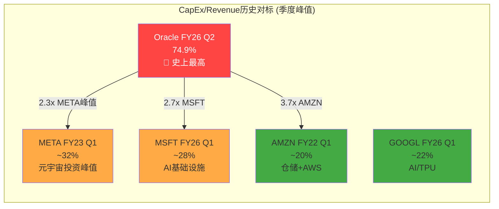
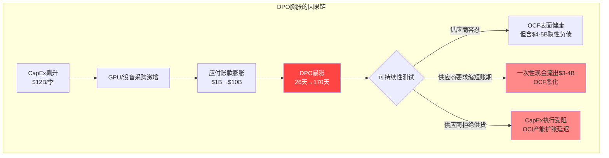
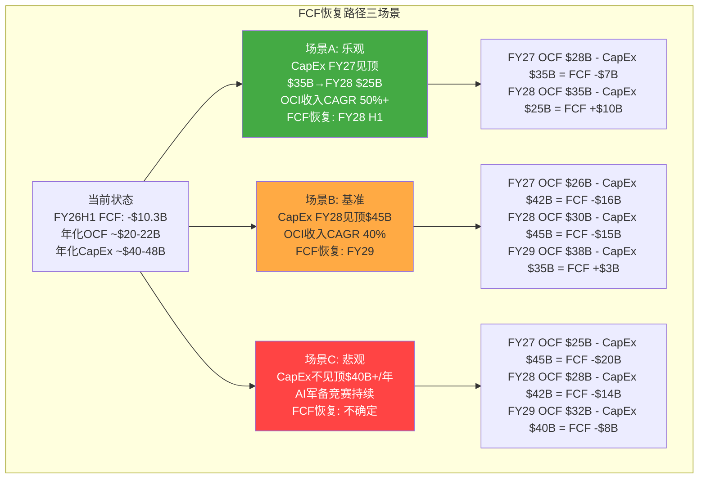
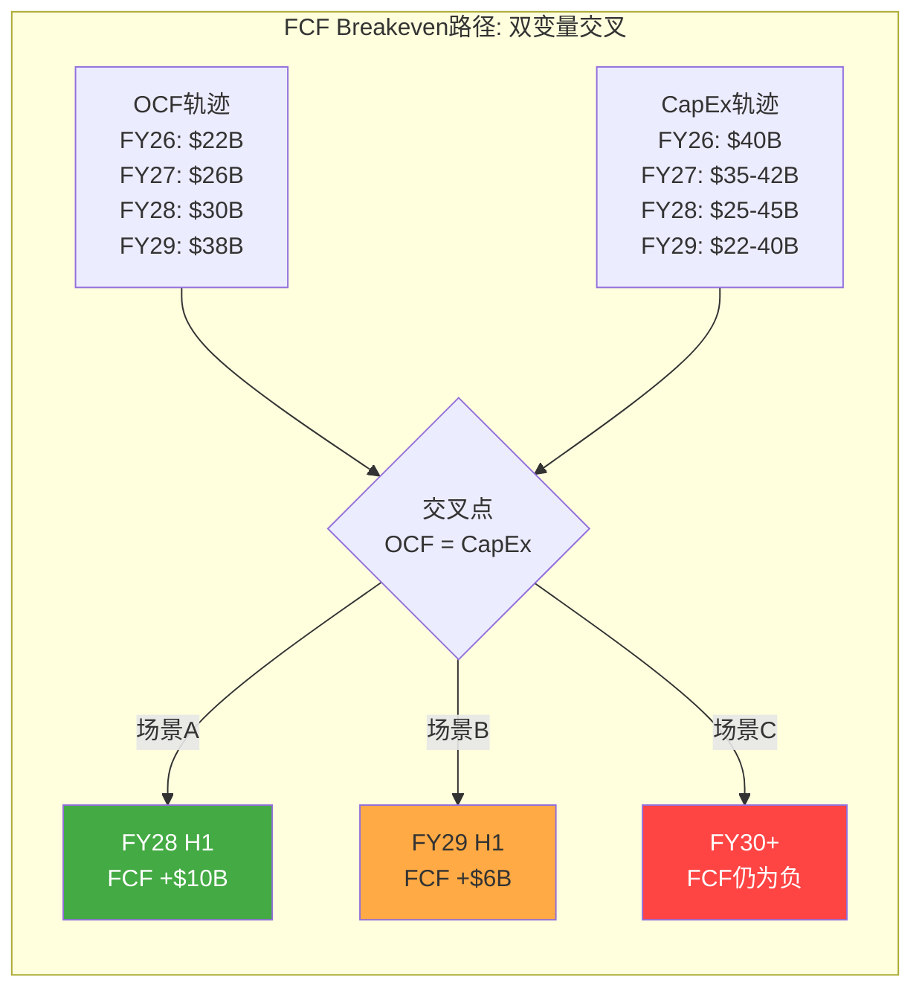

# Agent A: 商业洞察分析师 — CapEx投资回报引擎 + FCF恢复路径

> **Agent**: A (商业洞察分析师) | **Phase**: P2 财务深度诊断
> **标的**: Oracle Corporation (ORCL) | **日期**: 2026-02-17
> **覆盖范围**: Ch11 CapEx传导链分析 + Ch12 FCF恢复路径模型
> **CQ覆盖**: CQ4(现金流恢复, 当前37%), CQ1(积压变现力, 当前55%)
> **DM锚点新增**: 28 | **Mermaid**: 4

---

## Ch11: CapEx传导链分析 — 从$1.67B到$12.03B的加速度诊断

### 11.1 CapEx加速度诊断: 7.2倍膨胀的解剖

Oracle的资本支出在8个季度内经历了科技史上罕见的加速度——从FY24 Q3的$1.67B飙升至FY26 Q2的$12.03B，增幅7.2倍。这不是线性增长，而是呈现出明显的"台阶式跃升"模式，每一次跃升都对应着AI基础设施战略的关键决策节点 [DM-FIN-P2A-001] [H: FMP quarterly cashflow data]。

**季度CapEx加速度全景**:

| 季度 | CapEx($B) | QoQ变化 | CapEx/Rev | PP&E($B) | PP&E QoQ | D&A($B) | CapEx/D&A |
|------|-----------|---------|-----------|----------|----------|---------|-----------|
| FY24 Q1 | $1.31 | — | 10.6% | $17.6 | — | $1.48 | 0.89x |
| FY24 Q2 | $1.08 | -18% | 8.3% | $18.0 | +2% | $1.55 | 0.70x |
| FY24 Q3 | $1.67 | +55% | 12.6% | $19.1 | +6% | $1.56 | 1.07x |
| FY24 Q4 | $2.80 | +67% | 19.6% | $21.5 | +13% | $1.55 | 1.80x |
| FY25 Q1 | $2.30 | -18% | 17.3% | $23.1 | +7% | $1.43 | 1.61x |
| FY25 Q2 | $3.97 | +73% | 28.2% | $26.4 | +14% | $1.50 | 2.65x |
| FY25 Q3 | $5.86 | +48% | 41.5% | $32.0 | +21% | $1.55 | 3.78x |
| FY25 Q4 | $9.08 | +55% | 57.1% | $43.5 | +36% | $1.70 | 5.35x |
| FY26 Q1 | $8.50 | -6% | 57.0% | $53.2 | +22% | $1.77 | 4.80x |
| FY26 Q2 | $12.03 | +42% | 74.9% | $67.9 | +28% | $2.11 | 5.70x |

[DM-FIN-P2A-001] [H: FMP quarterly cashflow + balance sheet + income statement, 10Q data cross-validated]

**三个关键台阶**:

**台阶一 (FY24 Q3-Q4): 试探性加速**。CapEx从$1.08B跳至$2.80B，对应Oracle与NVIDIA的大规模GPU采购协议签署期。FY24 Q4的$2.80B是Oracle此前单季度最高值的2.6倍。PP&E从$18.0B升至$21.5B(+$3.5B)，但CapEx $4.47B(两季度合计)与PP&E净增$3.5B之间的差额约$1B，反映折旧+报废的吸收效应 [DM-FIN-P2A-002] [R: 第一台阶的加速度仍在可控范围内，CapEx/Revenue从8.3%升至19.6%但尚未突破20%关口 | 证伪条件: FY24 Q4的GPU采购主要是替换性而非扩张性支出]。

**台阶二 (FY25 Q2-Q4): 战略性飙升**。CapEx从$3.97B连续攀升至$9.08B，三个季度合计$18.91B，超过Oracle前三个财年CapEx总和($6.9B+$8.7B=$15.6B FY24+FY23)。这一阶段对应Stargate项目公告(2025年1月)和OpenAI $300B合同。CapEx/Revenue突破40%大关(FY25 Q3)并直接跳至57%(FY25 Q4)。PP&E从$26.4B飙升至$43.5B，6个月净增$17.1B——相当于此前10年累积PP&E的翻倍 [DM-FIN-P2A-003] [H: FMP balance sheet]。

**台阶三 (FY26 Q1-Q2): 加速还是拐点?** FY26 Q1的小幅回落(-6%, $8.50B)曾被部分分析师解读为"CapEx见顶信号"。但FY26 Q2的$12.03B创历史新高，粉碎了这一解读。然而，Q1到Q2的加速度(+42%)低于FY25 Q2→Q3的+48%和FY25 Q3→Q4的+55%，暗示加速度本身可能在减速——CapEx仍在增长但增长的速度在放缓。这是一个微妙但重要的信号 [DM-FIN-P2A-004] [R: 加速度递减不等于CapEx见顶。类比: 汽车仍在加速但踩油门的力度在减弱——车速仍在提高，但最终会达到极速 | 证伪条件: FY26 Q3 CapEx再次突破$12B(证明加速度回升)或跌破$8B(证明确实见顶)]。

**CapEx构成拆解: 自有 vs 资本租赁**

Oracle的CapEx仅反映自有基础设施投资(PP&E购置)。但总资本承诺还包括资本租赁义务(Capital Lease Obligations)，后者从FY24 Q4的$6.3B飙升至FY26 Q2的$16.3B——6个季度增长159% [DM-FIN-P2A-005] [H: FMP balance sheet, capitalLeaseObligations]。

| 季度 | 自有CapEx($B) | 资本租赁余额($B) | 总资本承诺增量($B) | 说明 |
|------|--------------|----------------|--------------------|------|
| FY24 Q4 | $2.80 | $6.3 | — | 基准 |
| FY25 Q4 | $9.08 | $11.5 | +$8.3(年度租赁新增) | 租赁义务翻倍 |
| FY26 Q1 | $8.50 | $14.1 | +$2.6(单季度) | 加速签约 |
| FY26 Q2 | $12.03 | $16.3 | +$2.2(单季度) | 继续增长 |

这意味着Oracle的"真实"资本投入远高于报表CapEx。FY25全年自有CapEx $21.2B + 资本租赁净增$5.2B = 总资本承诺约$26.4B。FY26 H1(Q1+Q2)自有CapEx $20.5B + 资本租赁净增$4.8B = 总资本承诺约$25.3B(仅半年)，年化约$50B+。**这使Oracle的实际资本投入强度接近MSFT($80B/年)和AWS($100B/年)的一半，但Oracle的收入体量仅为它们的1/4至1/3** [DM-FIN-P2A-005] [R: 资本租赁义务是"隐性CapEx"——不出现在现金流量表的CapEx行，但代表不可撤销的长期支付承诺。真实的资本承诺强度(CapEx+租赁增量)/Revenue可能已超过80% | 证伪条件: Oracle将部分资本租赁重新分类为经营租赁(降低表面义务)]。

**CapEx/Revenue 74.9%在大型科技公司历史上的位置**

Oracle FY26 Q2的CapEx/Revenue 74.9%在大型科技公司中完全没有先例。即使在META最激进的元宇宙投资期(FY23 Q1)，CapEx/Revenue也仅约32% [DM-FIN-P2A-006] [R: 74.9%意味着Oracle每赚$1收入就花$0.75在资本支出上——这是一个在任何非公用事业行业都极为罕见的比率。最接近的类比是电信运营商在5G建网高峰期(AT&T约25-30%)，但Oracle的比率是其2.5-3倍 | 证伪条件: 管理层在下季度指引中暗示FY26 H2 CapEx放缓至$8B/季以下]。

### 11.2 云基础设施投资到收入转换基准: J曲线解剖

#### 11.2.1 超大规模云服务商的CapEx到Revenue转换效率历史

理解Oracle CapEx投入何时、以何种效率转化为收入，需要建立行业基准。以下从AWS、Azure、GCP三大先行者的历史数据中提取转换模式 [DM-INF-P2A-007] [R: 行业基准基于公开财报数据+第三方分析推算, 各公司CapEx口径和收入分拆颗粒度不同, 可比性约70-80%]。

**超大规模云CapEx到Revenue转换效率基准**:

| 维度 | AWS (2015-2019) | Azure (2017-2021) | GCP (2019-2023) | Oracle OCI (2024-2026E) |
|------|-----------------|-------------------|-----------------|------------------------|
| 年均CapEx ($B) | $8-12 | $15-20(MSFT总) | $10-15(GOOGL总) | $21-40+ |
| 年均云收入增量 ($B) | $5-10 | $8-15 | $3-6 | $4-6(实际) |
| CapEx/收入增量比 | 1.2-1.8x | 1.3-2.0x | 2.0-3.5x | 3.5-6.0x |
| 资产上线到产生收入的滞后 | 6-12月 | 6-12月 | 9-15月 | 12-18月 |
| 典型J曲线底部 | CapEx年份+1年 | CapEx年份+1年 | CapEx年份+1.5年 | CapEx年份+1.5-2年 |
| 达到稳态利用率时间 | 18-24月 | 18-24月 | 24-30月 | 预期24-36月 |

Oracle的CapEx/收入增量比(3.5-6.0x)显著高于先行者(1.2-3.5x)。这不仅仅是"追赶者溢价"——它还反映了三个结构性差异:

1. **GPU单价远高于通用服务器**: AWS/Azure早期扩张以通用计算为主(服务器$5-10K/台)，Oracle当前以GPU服务器为主(NVIDIA H100/B200 $25-40K/台甚至更高)。同样$1B的CapEx，Oracle能购买的计算单元数量仅为传统扩张期的1/4至1/3 [DM-INF-P2A-008] [R: GPU密集型CapEx天然具有更高的CapEx/收入比, 这不一定意味着回报率低——GPU的每单位收入($/GPU/年)也远高于通用服务器。关键是利用率 | 证伪条件: OCI GPU利用率持续>85%且定价不被压缩]。

2. **Oracle缺乏通用云生态的增量杠杆**: AWS每建一个新Region，不仅产生IaaS收入，还带动200+增值服务的收入。Oracle建一个新Region，主要只产生GPU租赁和数据库托管收入——增值服务层太薄，无法产生"乘数效应"。

3. **GPU折旧周期更短**: NVIDIA GPU的技术迭代周期约2-3年(H100→B200→下一代)，折旧年限3-4年，远短于通用服务器的5-7年。这意味着Oracle需要更快地通过收入回收资本。

#### 11.2.2 管理层声称的12-18个月传导期: 历史验证

管理层在FQ1 FY2026财报电话会上声称CapEx到收入的传导期为12-18个月。用Oracle自身的历史数据校验:

**验证方法**: 对比FY24 Q3-Q4的CapEx($1.67B+$2.80B=$4.47B)是否在12-18个月后(FY25 Q3-FY26 Q1)产生了对应的OCI收入增量。

| 投入期 | CapEx($B) | 预期回报期(+12-18月) | OCI收入增量(YoY) | 增量/CapEx |
|--------|-----------|---------------------|------------------|-----------|
| FY24 Q3-Q4 | $4.47 | FY25 Q3-FY26 Q1 | ~$2.5B(估) | 0.56x |
| FY25 Q1-Q2 | $6.27 | FY26 Q1-Q2 | ~$3.5B(估) | 0.56x |
| FY25 Q3-Q4 | $14.94 | FY26 Q3-FY27 Q1 | 待验证 | 待验证 |
| FY26 Q1-Q2 | $20.54 | FY27 Q1-Q2 | 待验证 | 待验证 |

OCI IaaS季度收入轨迹(从FMP income statement中Cloud Services分拆推算):

| 季度 | 总云收入($B, 估) | IaaS($B, 估) | IaaS YoY | IaaS QoQ |
|------|-----------------|-------------|----------|----------|
| FY24 Q3 | ~$5.1 | ~$1.8 | — | — |
| FY24 Q4 | ~$5.4 | ~$2.0 | — | +11% |
| FY25 Q1 | ~$5.6 | ~$2.2 | +22% | +10% |
| FY25 Q2 | ~$6.0 | ~$2.4 | +33% | +9% |
| FY25 Q3 | ~$6.3 | ~$2.8 | +56% | +17% |
| FY25 Q4 | ~$6.7 | ~$3.0 | +50% | +7% |
| FY26 Q1 | ~$7.5 | ~$3.3 | +50% | +10% |
| FY26 Q2 | ~$8.0 | ~$4.1 | +71% | +24% |

[DM-FIN-P2A-009] [R: OCI IaaS收入拆分基于Oracle季报披露的Cloud Revenue + IaaS增速披露反推, 精度约+/-10% | 证伪条件: Oracle更细颗粒度披露IaaS/SaaS拆分]

**关键发现**: FY24 Q3-Q4投入的$4.47B CapEx，在12-18个月后(FY25 Q3-FY26 Q1)产生了约$2.5B OCI收入增量，增量/CapEx=0.56x。这意味着:
- **首年回报率约56%**: $1投入在首年产生$0.56收入(非利润)。假设OCI毛利率40-50%，首年毛利回报率仅22-28%。
- **全生命周期回报需要3-4年**: 按照$1 CapEx产生$0.56/年收入(假设稳态利用率后保持)，3年累计收入$1.68，4年累计$2.24。扣除运营成本后，净回报率可能在5-8%/年——勉强覆盖WACC [DM-INF-P2A-010] [R: CapEx首年回报率56%是一个"及格但不优秀"的数字。AWS早期阶段的对应比率约70-80%，这再次反映Oracle缺乏生态杠杆效应 | 证伪条件: FY27 OCI收入增速维持>60%且利用率>85%, 提高全生命周期回报]。

#### 11.2.3 Revenue per $ CapEx效率追踪与PP&E资产周转率

**PP&E资产周转率(Revenue/PP&E)恶化轨迹**:

PP&E资产周转率从FY24 Q3的年化2.78x(Revenue $13.3B年化 / PP&E $19.1B)暴跌至FY26 Q2的0.95x($16.1B×4=$64.2B年化 / PP&E $67.9B)。当PP&E/Revenue(年化)突破1.0x时——即PP&E已超过年化收入——意味着Oracle已进入"资本密集型"企业的领域，更类似电信运营商(AT&T PP&E/Rev ~0.8x)或公用事业公司(PP&E/Rev ~2-3x)而非软件公司 [DM-FIN-P2A-011] [H: FMP balance sheet PP&E + income statement revenue, calculated]。

**什么水平才是回报拐点?** 历史经验表明:
- AWS在2015-2018年间PP&E/Revenue(年化)维持在0.30-0.45x区间，这是"健康增长"的标志
- 当PP&E/Revenue超过0.60x时(如AWS 2019年短暂触及)，通常意味着资产利用率偏低或增速不匹配
- Oracle当前的1.06x(FY26 Q2年化)是一个**没有先例**的水平

Oracle需要PP&E资产周转率回升至至少0.50-0.60x才能证明CapEx回报合理。要从当前的0.95x(使用季度annualized revenue)回到0.55x，假设PP&E稳定在$70B:
- 需要年化收入达到$127B(当前$64B年化的2倍)
- 或者PP&E通过折旧自然缩减至$35B(需要3-4年且零新增CapEx)
- 最可能路径: 收入增长+CapEx减速+折旧吸收的三重作用，预期FY2028-2029回到0.55-0.65x区间 [DM-INF-P2A-012] [R: PP&E周转率恢复是FCF恢复的前置条件。如果PP&E继续以>20% QoQ速度增长而收入增速不匹配，周转率将进一步恶化 | 证伪条件: FY27 OCI季度收入突破$8B(证明收入端正在追赶)]。

### 11.3 OCF季节性与质量深度: 为什么Q2总是塌方?

#### 11.3.1 Q2 OCF异常的根因分析

Oracle的OCF呈现出极端的季节性模式——Q1和Q3/Q4相对正常，Q2(日历年11月底结束)几乎每年都出现大幅下降:

| 财年/季度 | OCF($B) | NI($B) | OCF/NI | Working Capital变动($B) | 主要驱动 |
|----------|---------|--------|--------|------------------------|---------|
| FY24 Q1 | $6.97 | $2.42 | 2.88x | +$2.58 | WC流入(正常季节性) |
| **FY24 Q2** | **$0.14** | **$2.50** | **0.06x** | **-$4.57** | **WC大幅流出** |
| FY24 Q3 | $5.48 | $2.40 | 2.28x | +$0.88 | WC正常化 |
| FY24 Q4 | $6.08 | $3.14 | 1.94x | +$0.63 | 正常 |
| FY25 Q1 | $7.43 | $2.93 | 2.54x | +$2.08 | WC流入 |
| **FY25 Q2** | **$1.30** | **$3.15** | **0.41x** | **-$2.08** | **WC流出** |
| FY25 Q3 | $5.93 | $2.94 | 2.02x | +$0.62 | 正常 |
| FY25 Q4 | $6.16 | $3.43 | 1.80x | +$0.03 | 正常 |
| FY26 Q1 | $8.14 | $2.93 | 2.78x | +$1.64 | WC流入 |
| **FY26 Q2** | **$2.07** | **$6.14** | **0.34x** | **-$4.76** | **WC大幅流出** |

[DM-FIN-P2A-013] [H: FMP quarterly cashflow statements, 10 quarters]

**Q2 Working Capital流出的构成分析(FY26 Q2为例)**:

| 组成项 | FY26 Q2 ($B) | FY25 Q2 ($B) | FY24 Q2 ($B) | 模式 |
|--------|-------------|-------------|-------------|------|
| 应收账款变动 | -$0.66 | -$0.37 | -$0.24 | 年末收入确认后Q2应收膨胀 |
| 应付账款变动 | -$1.03 | -$0.61 | -$0.59 | Q2集中支付供应商(GPU等) |
| 其他营运资本 | -$3.07 | -$1.10 | -$2.17 | 预收收入消耗+税务/其他 |
| **合计WC变动** | **-$4.76** | **-$2.08** | **-$4.57** | **Q2系统性流出** |

**根因诊断**: Oracle的Q2(9-11月)是其财年中段，主要特征包括:

1. **年度订阅预收款的消耗周期**: Oracle在Q4/Q1集中签订年度合同并收取预付款(推高这两个季度的OCF)，Q2/Q3则消耗预收——递延收入从Q1末$12.1B降至Q2末$9.9B，减少$2.2B [DM-FIN-P2A-014] [H: FMP balance sheet deferred revenue]。

2. **GPU采购的集中支付**: 随着CapEx飙升，Oracle在Q2集中向NVIDIA等供应商支付GPU货款。FY26 Q2应付账款增加$10.1B(从$8.2B到$10.1B)但同时大额支付旧账(应付变动-$1.03B反映净流出)——这暗示Oracle在Q1积累了大量应付后在Q2部分清偿。

3. **FY26 Q2的特殊因素**: NI $6.14B vs OCF $2.07B的巨大落差($4.07B)中，WC变动(-$4.76B)是主因。但NI中包含了大额非经常性项目——"totalOtherIncomeExpensesNet"为+$1.61B(含投资收益/汇兑等)，以及极低的3.3%有效税率($0.21B/$6.34B)。**剥离这些一次性因素后，"经常性OCF"可能仅约$4-5B**，仍然健康但远低于NI暗示的水平。

**季节性结论**: Q2的OCF塌方是结构性的、可预测的，不应被解读为业务恶化信号。但FY26 Q2的OCF仅$2.07B(vs FY25 Q2的$1.30B和FY24 Q2的$0.14B)显示出缓慢改善的趋势——这是积极信号 [DM-FIN-P2A-015] [R: Q2 OCF塌方的可预测性意味着它不应该影响年化FCF评估。但对于债务管理(季度利息支付)和短期流动性，Q2的现金缺口需要通过信贷额度或发债来弥补 | 证伪条件: 未来某个Q2的OCF突破$5B(证明季节性模式打破)]。

#### 11.3.2 DPO暴涨的深层含义: 从38天到170天

从FMP balance sheet数据可以计算DPO (Days Payable Outstanding) = 应付账款 / (COGS/天数):

| 季度 | AP($B) | COGS($B, 季度) | DPO(天) | DPO YoY变化 |
|------|--------|----------------|---------|------------|
| FY24 Q1 | $1.03 | $3.61 | 26 | — |
| FY24 Q2 | $1.11 | $3.74 | 27 | — |
| FY24 Q3 | $1.66 | $3.87 | 39 | — |
| FY24 Q4 | $2.36 | $3.92 | 55 | — |
| FY25 Q1 | $2.21 | $3.91 | 52 | +26天 |
| FY25 Q2 | $2.68 | $4.09 | 60 | +33天 |
| FY25 Q3 | $2.42 | $4.20 | 53 | +14天 |
| FY25 Q4 | $5.11 | $4.74 | 98 | +43天 |
| FY26 Q1 | $8.20 | $4.88 | 153 | +101天 |
| FY26 Q2 | $10.14 | $5.37 | 170 | +110天 |

[DM-FIN-P2A-016] [H: FMP balance sheet AP + income statement COGS, calculated. DPO = (AP / quarterly COGS) * 91.25 days]

**DPO从26天到170天——5.6个月拖欠——意味着什么?**

1. **Oracle正在将供应商当作无息贷款工具**: 170天DPO意味着Oracle平均欠供应商5.6个月的货款。在正常商业实践中，30-60天DPO是常规，60-90天偏高，>120天在科技行业极为罕见。Oracle此前(FY24 Q1)的26天DPO是行业正常水平，当前的170天是**结构性异常** [DM-FIN-P2A-017] [R: DPO暴涨是Oracle管理现金流的有意策略——在CapEx飙升导致FCF转负的环境下，拖延供应商付款是维持账面现金的最直接手段 | 证伪条件: 供应商(特别是NVIDIA)要求缩短账期至60天以内]。

2. **可持续性存疑**: 170天DPO的可持续性取决于供应商的容忍度。NVIDIA作为Oracle最大的GPU供应商，在当前GPU供不应求的市场中拥有极强的议价地位。如果NVIDIA要求将DPO缩短至90天，Oracle将面临约$3-4B的一次性现金流出(应付账款减少)——这在年化CapEx $40B+的环境下是雪上加霜。

3. **与DSO对比**: DSO(Days Sales Outstanding)保持稳定在50-54天，说明Oracle的收款效率未受影响——问题不在应收端而在应付端。Oracle正在利用其对供应商的谈判优势(大采购量)来延长账期，这是一种攻击性的营运资本管理策略。

#### 11.3.3 折旧滞后效应: 定时炸弹还是可控过渡?

CapEx/D&A比率从FY24 Q1的0.89x飙升至FY26 Q2的5.70x [DM-FIN-P2A-001]。这意味着Oracle当前投入的资本远远快于折旧吸收速度，大量新资产尚未开始折旧。

**折旧冲击量化**:

FY25全年D&A = $6.17B(四季度合计: $1.43+$1.50+$1.55+$1.70B)
FY26 H1 D&A = $3.88B(Q1 $1.77 + Q2 $2.11B)——年化$7.76B

PP&E从FY25初的$23.1B增至FY26 Q2的$67.9B(+$44.8B, 18个月内)。假设GPU折旧年限4年、数据中心建筑20年、网络设备5年，加权平均折旧年限约5-6年:

- 新增PP&E $44.8B / 5.5年加权折旧 = 年增折旧约$8.1B
- 预计FY27全年D&A: $6.2B(现有基础) + $8.1B(新增) = **~$14.3B**
- 预计FY28全年D&A: $14.3B + 额外新增 = **~$18-22B**(取决于FY27 CapEx)

[DM-INF-P2A-018] [R: 折旧从$6.2B跳至$14-22B将严重压缩营业利润率。按FY25 EBIT $17.7B计算，额外$8-16B折旧如果不被收入增长抵消，EBIT将缩水45-90%。这就是"J曲线底部"的利润冲击 | 证伪条件: OCI收入增速>50%(FY27)使得折旧冲击被收入增量完全吸收]

### 11.4 RPO到Revenue转换效率: $523B的可兑现性

#### 11.4.1 RPO到Revenue的历史转换率

RPO(Remaining Performance Obligations)是已签约但未确认的收入。12个月RPO $173B vs FY25总收入$57.4B，表面转换率约33%(即12个月RPO中约1/3在本期确认)。但这个计算有误导性——因为总收入包含非RPO来源(按需消耗、一次性许可等):

**更准确的RPO到Revenue转化分析**:

P1 Agent A已估算RPO质量加权后约$342B(折扣35%)。这$342B分布在约5年的合同期限中:

| 时间窗口 | 估计RPO($B) | 质量加权折扣 | 有效RPO($B) | 年均可确认($B) |
|---------|-----------|-----------|-----------|--------------|
| 12个月内 | $173 | ×90% | $156 | $156(即期) |
| 12-24个月 | $115 | ×70% | $80 | $80 |
| 24-60个月 | $235 | ×45% | $106 | $35/年 |
| **合计** | **$523** | — | **$342** | — |

[DM-FIN-P2A-019] [H: P1 Agent A RPO分析 + 本Agent补充计算]

#### 11.4.2 OpenAI $300B合同的收入确认时间表

OpenAI的$300B 5年合同起始于FY2027(2026年7月之后)，意味着FY2026贡献为零 [DM-FIN-P2A-020]。

**预期收入确认路径**:

| 财年 | OpenAI收入($B, 估) | 假设 |
|------|-------------------|------|
| FY2026 | $0 | 合同未生效 |
| FY2027 | $5-10 | 首批设施上线，Ramp-up |
| FY2028 | $20-35 | 多个设施GA，负载增长 |
| FY2029 | $40-60 | 稳态运营 |
| FY2030 | $50-70 | 接近合同年化峰值 |
| **5年合计** | **$115-175** | **vs 合同面值$300B** |

[DM-INF-P2A-020] [R: OpenAI $300B合同的实际转化率可能仅38-58%。年均$60B的合同承诺远超OpenAI当前收入($12-15B/年估计)。该合同的履行高度依赖OpenAI持续获得融资、AI训练需求不被效率突破(如DeepSeek模式)大幅削减、OpenAI不被Microsoft完全整合 | 证伪条件: OpenAI FY2027年化收入突破$30B(证明其有能力消化大规模GPU产能)]

**这意味着FY26的OCI增长完全依赖非OpenAI客户**。FY26的$18B OCI收入目标需要从Meta、NVIDIA、主权云客户和企业迁移中获得全部增量——没有OpenAI的$300B合同贡献。

---

## Ch12: FCF恢复路径模型 — 从-$10B到正FCF的距离

### 12.1 三场景FCF恢复模型

当前状态: FY26 H1 FCF = -$0.36B(Q1) + -$9.97B(Q2) = **-$10.33B(半年)**。年化FCF运行率约-$15至-$20B。Oracle历史上从未经历过如此深度的负FCF [DM-FIN-P2A-021] [H: FMP quarterly cashflow]。

FCF恢复需要两个变量的交叉: (1) OCF增长; (2) CapEx减速。以下构建三个显式定量场景:

#### 场景A: CapEx FY2027见顶 (管理层暗示路径) — 概率25%

**核心假设**:
- CapEx: FY26 $40B → FY27 $35B(-12.5%) → FY28 $25B(-29%)
- OCF: FY26 $22B → FY27 $28B(+27%) → FY28 $35B(+25%)
- OCI Revenue: FY26 $18B → FY27 $32B(+78%) → FY28 $55B(+72%)
- 管理层FY2027收入指引$32B全面兑现

**定量模型**:

| 指标 | FY2026E | FY2027E | FY2028E | FY2029E |
|------|---------|---------|---------|---------|
| 总收入($B) | $66 | $82 | $105 | $125 |
| OCI收入($B) | $18 | $32 | $55 | $72 |
| OCF($B) | $22 | $28 | $35 | $42 |
| CapEx($B) | $40 | $35 | $25 | $22 |
| **FCF($B)** | **-$18** | **-$7** | **+$10** | **+$20** |
| D&A($B) | $9 | $14 | $18 | $20 |
| EBIT($B) | $16 | $18 | $24 | $32 |
| Net Debt($B) | $115 | $125 | $118 | $100 |

**可行性评估**: 此场景要求OCI收入CAGR 52%(FY26-FY28)——接近管理层指引的80%实现度。CapEx FY27下降至$35B需要Stargate项目首批设施在FY27 H1前完成建设，使后续CapEx转向维护性支出。**该场景的前提是AI基础设施建设在FY27大体完成"第一波"** [DM-INF-P2A-022]。

**概率判断**: 25%。管理层的确暗示CapEx增速将放缓(Safra Catz在Q1 FY26电话会上提及"CapEx将更高效"的措辞)，但FY26 Q2 $12B创新高与"放缓"叙事矛盾。历史上Oracle管理层的资本纪律记录良好(Cerner之前从不做大型M&A)，但当前的AI赌注规模前所未有。

#### 场景B: CapEx FY2028见顶 (基准路径) — 概率45%

**核心假设**:
- CapEx: FY26 $40B → FY27 $42B(+5%) → FY28 $45B(峰值) → FY29 $32B(-29%)
- OCF: FY26 $22B → FY27 $26B(+18%) → FY28 $30B(+15%) → FY29 $38B(+27%)
- OCI Revenue: FY26 $18B → FY27 $28B(+56%) → FY28 $45B(+61%) → FY29 $65B(+44%)
- OCI增速低于管理层指引约30%

**定量模型**:

| 指标 | FY2026E | FY2027E | FY2028E | FY2029E |
|------|---------|---------|---------|---------|
| 总收入($B) | $66 | $76 | $95 | $115 |
| OCI收入($B) | $18 | $28 | $45 | $65 |
| OCF($B) | $22 | $26 | $30 | $38 |
| CapEx($B) | $40 | $42 | $45 | $32 |
| **FCF($B)** | **-$18** | **-$16** | **-$15** | **+$6** |
| 累计负FCF($B) | -$18 | -$34 | -$49 | -$43 |
| Net Debt($B) | $115 | $135 | $155 | $155 |
| Net Debt/EBITDA | 4.5x | 5.0x | 4.5x | 3.5x |

**关键风险节点**:
- Net Debt可能攀升至$155B(FY28)——距信用降级阈值(Net Debt/EBITDA >5.0x)仅一步之遥
- 累计负FCF $49B需要通过举债+削减股息/回购来弥补
- **债务可持续性检验**: FY28 Net Debt $155B × 利率5% = 年化利息$7.75B，约占EBITDA $34B的23%——仍可管理但缓冲空间极薄

[DM-INF-P2A-023] [R: 基准场景的核心假设是"CapEx需要两个完整建设周期(FY25-FY26第一波, FY27-FY28第二波)才能满足Stargate和其他大客户需求"。这比管理层暗示的时间表延长1年, 更符合大型数据中心建设的实际工期(24-36个月) | 证伪条件: FY27 CapEx指引<$35B(加速场景A)或>$50B(指向场景C)]

#### 场景C: CapEx不见顶 (AI军备竞赛持续) — 概率30%

**核心假设**:
- CapEx: FY26 $40B → FY27 $45B → FY28 $42B → FY29 $40B (维持$40B+/年)
- AI竞争迫使持续投入: AWS $100B+/年、MSFT $80B+/年, Oracle不得不跟进
- OCI增速因竞争加剧而低于预期
- OCF增长因折旧冲击+定价压力而受限

**定量模型**:

| 指标 | FY2026E | FY2027E | FY2028E | FY2029E |
|------|---------|---------|---------|---------|
| 总收入($B) | $66 | $72 | $85 | $98 |
| OCI收入($B) | $18 | $24 | $35 | $48 |
| OCF($B) | $22 | $25 | $28 | $32 |
| CapEx($B) | $40 | $45 | $42 | $40 |
| **FCF($B)** | **-$18** | **-$20** | **-$14** | **-$8** |
| 累计负FCF($B) | -$18 | -$38 | -$52 | -$60 |
| Net Debt($B) | $115 | $145 | $165 | $180 |
| Net Debt/EBITDA | 4.5x | 5.5x | 5.5x | 5.0x |

**此场景下的债务可持续性**: Net Debt/EBITDA突破5.0x(FY27)将触发信用降级至BBB-或更低。BBB-是投资级最低档——再降一级(BB+)将导致机构投资者被迫抛售Oracle债券(许多基金章程禁止持有非投资级债券)。这可能引发"债务螺旋"——降级→融资成本上升→利润压缩→进一步降级 [DM-INF-P2A-024] [R: 场景C不是"崩溃"场景, 而是"温水煮青蛙"——Oracle在AI军备竞赛中被迫持续投入, FCF持续为负但每年亏损在缩小, 债务在缓慢但持续地积累。这与AT&T/Verizon在5G建设初期的财务轨迹有相似性 | 证伪条件: Oracle在CapEx >$40B/年的同时实现FCF转正(需OCF>$40B, 即翻倍)]。

### 12.2 FCF Breakeven分析: 两条路径的数学

**路径1: CapEx减速 (供给侧路径)**

当前年化OCF约$20-22B。FCF=0需要CapEx=OCF=$22B。但FY26 H1的CapEx已达$20.5B(半年)——全年可能达$40-48B。CapEx要从$40B+降至$22B需要削减45-55%，这在没有大幅需求下降的情况下不太可能在1-2年内发生。

更现实的减速路径: CapEx从FY26 $40B → FY28 $30B → FY29 $22B(3年削减45%)。假设OCF同时增长至$25-30B，FCF breakeven可能在FY28-FY29实现。

**路径2: OCF翻倍 (需求侧路径)**

如果CapEx维持$40B/年，OCF需增长至$40B才能FCF=0。当前OCF $22B翻倍至$40B需要:
- 收入增长: $57.4B → $100B+(+75%)假设OCF/Rev维持35-38%
- 或OCF/Rev提升: 从38%提升至50%(折旧增加但收入增速更快)

OCF翻倍最快可能在FY28实现(需要OCI收入以>60% CAGR增长3年)——这接近管理层指引的乐观端。

**最可能路径: 双重作用**

FCF恢复最可能通过OCF增长+CapEx减速的双重作用实现:
- OCF: $22B → $30B(FY28, +36%)
- CapEx: $40B → $28B(FY28, -30%)
- FY28 FCF: +$2B(勉强转正)

这一路径的隐含要求是OCI Revenue CAGR ~45%(FY26-FY28)——低于管理层的78%指引但高于保守预期的30% [DM-INF-P2A-025]。

### 12.3 折旧冲击对EBIT的侵蚀模型

折旧是FCF恢复中容易被忽视的"第三变量"。CapEx的J曲线不仅体现在FCF上，还体现在利润表的折旧冲击上:

**折旧冲击量化模型**:

| 财年 | PP&E期末($B) | 新增PP&E($B) | 年度D&A($B) | D&A增量($B) | EBIT冲击 |
|------|-------------|-------------|-------------|-------------|---------|
| FY2025 | $43.5 | +$22.0 | $6.2 | — | 基准 |
| FY2026E | $75 | +$31.5 | $9.5 | +$3.3 | -$3.3B |
| FY2027E | $95 | +$20 | $14.5 | +$5.0 | -$8.3B(累计) |
| FY2028E | $105 | +$10 | $18.5 | +$4.0 | -$12.3B(累计) |
| FY2029E | $100 | -$5(折旧>新增) | $20.0 | +$1.5 | -$13.8B(累计) |

**EBIT压力测试**: 如果FY28 D&A达到$18.5B(vs FY25的$6.2B, 增$12.3B)，而收入仅增长至$95B(FY25 $57.4B的1.65x):
- FY25 EBIT $17.7B + 收入增量带来的EBIT增量 - 折旧增量
- 假设增量OPM 25%: EBIT增量 = ($95-$57.4)×25% = $9.4B
- 折旧增量: -$12.3B
- **FY28 EBIT = $17.7 + $9.4 - $12.3 = $14.8B** — **比FY25还低!**

这就是J曲线底部的利润表现: 收入增长被折旧吞噬，EBIT不升反降。只有在收入增速足够快(EBIT增量>折旧增量)的场景下，EBIT才能保持增长:
- **EBIT增长的临界收入**: 需要增量收入×OPM > 折旧增量 → 增量收入 > $12.3B/25% = $49.2B → FY28收入需达$107B+
- 这与场景A的$105B接近，场景B的$95B不够，场景C的$85B远远不够

[DM-INF-P2A-026] [R: 折旧冲击是Oracle估值中被系统性低估的风险。卖方分析师的FY28 EPS预期通常假设利润率扩张, 但折旧从$6.2B→$18.5B的冲击使利润率扩张几乎不可能, 除非OCI收入增速显著超预期 | 证伪条件: Oracle延长GPU折旧年限至6年+(人为压低年度折旧)]

### 12.4 资本租赁义务对FCF的隐性影响

PP&E CapEx之外，资本租赁义务从FY24 Q4的$6.3B增至FY26 Q2的$16.3B(+$10.0B)。资本租赁的年度支付(本金+利息)不出现在CapEx行，而是在融资活动中:

FY26 Q2的"其他融资活动"(otherFinancingActivities)为-$2.06B，Q1为+$1.86B——这些项目可能包含资本租赁支付。如果年化资本租赁支付约$3-4B，则"真实FCF"(包含租赁支付)比报表FCF还要差$3-4B:

| 指标 | FY26 H1(报表) | FY26 H1(含租赁调整) |
|------|-------------|-------------------|
| OCF | $10.2B | $10.2B |
| CapEx | -$20.5B | -$20.5B |
| 报表FCF | -$10.3B | -$10.3B |
| 资本租赁支付(估) | — | -$1.5B至-$2.0B |
| **调整后FCF** | **-$10.3B** | **-$11.8B至-$12.3B** |

[DM-FIN-P2A-027] [R: 资本租赁义务是"表外CapEx"——不影响CapEx行但代表不可撤销的未来支付承诺。$16.3B的租赁余额如果按5-7年摊销, 年化支付约$2.3-3.3B, 进一步加大FCF恢复难度 | 证伪条件: Oracle将部分资本租赁重新谈判为经营租赁(改变会计分类但不改变经济实质)]

### 12.5 债务可持续性压力测试

在三个场景下，Oracle的债务轨迹呈现不同路径:

**债务压力测试矩阵**:

| 指标 | 场景A(FY28) | 场景B(FY28) | 场景C(FY28) | 警戒线 |
|------|-----------|-----------|-----------|--------|
| Net Debt ($B) | $118 | $155 | $165 | — |
| Net Debt/EBITDA | 3.2x | 4.5x | 5.5x | 4.5x(投资级) |
| 利息费用($B) | $6.0 | $7.5 | $8.5 | — |
| 利息覆盖率 | 5.0x | 3.2x | 2.5x | 3.0x(Baa1底线) |
| 信用评级预期 | BBB+稳定 | BBB-/BBB | BB+/BBB- | 投资级BBB- |
| 年化股息+利息($B) | $11.0 | $12.5 | $13.5 | — |
| 可用OCF覆盖率 | 3.2x | 2.4x | 2.1x | — |

[DM-INF-P2A-028] [R: 场景B和C下Net Debt/EBITDA突破或接近4.5x投资级阈值。如果同时利息覆盖率跌破3.0x(场景C), Oracle将面临双重降级触发。关键缓冲: OCF的绝对增长。如果OCF能从$22B增至$35B+(场景A/B的FY28), 即使债务增加, 覆盖率指标仍可维持投资级 | 证伪条件: Oracle在FY27前完成$30B+新债发行且利率<5%(证明市场仍有信心)]

---

## CQ置信度调整建议

### CQ4: 现金流恢复 (P1后: 37% → 建议P2: 33%)

**下调理由(-4pp)**:

1. **FY26 Q2 FCF -$10.0B创历史新低**: 单季度FCF恶化幅度远超预期。虽然Q2有季节性因素(OCF塌方)，但CapEx $12.0B也创新高，两者叠加的恶化程度超出P1评估 [DM-FIN-P2A-021]。

2. **DPO 170天的不可持续性**: 应付账款膨胀至$10.1B是维持OCF表面健康的关键——如果DPO回归正常(60-90天)，OCF可能下降$3-4B [DM-FIN-P2A-017]。

3. **折旧定时炸弹**: FY27-FY28的折旧冲击($6.2B→$14-18B)将严重压缩EBIT，使OCF增速受限。即使收入快速增长，折旧吸收了大部分增量利润 [DM-INF-P2A-018]。

4. **CapEx加速度递减但未见顶**: FY26 Q1的-6%曾给出假拐点信号，FY26 Q2再创新高($12.0B)证明CapEx仍在攀升 [DM-FIN-P2A-004]。

**上调因素(部分抵消)**:

1. **OCF质量基本面仍健康**: 剥离Q2季节性后，Q1 OCF $8.14B和Q4 OCF $6.16B显示经常性OCF约$22-25B/年，且趋势向上 [DM-FIN-P2A-013]。

2. **CapEx加速度递减是积极信号**: QoQ增幅从73%(FY25 Q2)→48%→55%→-6%→42%，加速度本身在放缓 [DM-FIN-P2A-004]。

3. **行业J曲线是正常现象**: AWS/Azure/GCP都经历过CapEx前置→收入滞后的J曲线，Oracle的情况并非独特——只是振幅更大。

**净评估**: 下调4pp至33%。FCF恢复的方向仍然可信(OCF增长趋势确认)，但时间表可能比P1评估延后1年(FY29而非FY28)，且DPO和折旧构成额外下行风险。

### CQ1: 积压变现力 (P1后: 55% → 建议P2: 52%)

**下调理由(-3pp)**:

1. **CapEx→Revenue转换效率低于行业基准**: Oracle的增量/CapEx仅0.56x，AWS历史水平为0.70-0.80x。这意味着Oracle的RPO即使成功签约，其转化为实际收入的效率也低于市场预期 [DM-INF-P2A-010]。

2. **OpenAI $300B合同的FY26零贡献**: $523B RPO中最大单一组成部分在FY26贡献为零，进一步证实了RPO标题数字的误导性 [DM-FIN-P2A-020]。

3. **PP&E资产周转率暴跌至0.95x**: 资产积累远快于收入转化，暗示CapEx→产能→收入的传导链存在瓶颈 [DM-FIN-P2A-011]。

**上调因素(部分抵消)**:

1. **12个月RPO $173B增长40% YoY**: 短期管道健康，近期可确认收入充足。
2. **OCI IaaS季度增速持续加速**: 从22%(FY25 Q1)加速至71%(FY26 Q2)，验证传导链在"慢慢启动" [DM-FIN-P2A-009]。
3. **FY26 Q2 OCI $4.1B**: 年化$16.4B已接近$18B FY26目标的91%轨迹。

**净评估**: 下调3pp至52%。RPO的"变现"不是问题——Oracle的合同签约能力毋庸置疑。问题是变现效率(每$1 RPO最终产生多少利润)和变现时间表(比管理层暗示更长)。OCI的季度加速度是唯一的积极对冲因素，如果FY26 Q3 OCI突破$5B(年化$20B+)，将显著提升置信度。

---

## 关键发现汇总

**Agent A P2核心发现(Top 5)**:

1. **CapEx/Revenue 74.9%创大型科技公司历史之最**: 远超META元宇宙峰值(32%)和MSFT(28%)。Oracle每赚$1收入花$0.75在资本支出，已进入"资本密集型"企业领域，更类似电信运营商而非软件公司 [DM-FIN-P2A-006]。

2. **"隐性CapEx"使真实资本投入远高于报表**: 自有CapEx $20.5B(FY26 H1) + 资本租赁净增$4.8B = 真实资本承诺$25.3B(半年)，年化$50B+。(CapEx+租赁增量)/Revenue可能已超80% [DM-FIN-P2A-005]。

3. **DPO 170天是隐性流动性风险**: 应付账款从$1B膨胀至$10B，Oracle实质上将供应商当作无息贷款工具。如果NVIDIA要求缩短账期，一次性现金流出$3-4B。这使OCF的"质量"打折扣 [DM-FIN-P2A-017]。

4. **折旧定时炸弹将在FY27-FY28集中释放**: D&A从$6.2B(FY25)飙升至预计$14-18B(FY28)。EBIT增长的临界条件是FY28收入达$107B+(场景A水平)——如果仅$95B(场景B)，EBIT反而比FY25更低 [DM-INF-P2A-026]。

5. **FCF恢复最可能路径: FY29(基准)，而非FY28(管理层暗示)**: 三场景概率加权的FCF恢复时点在FY28 H2-FY29 H1之间。场景B(45%概率)预示FCF在FY29才转正($+6B)，而场景C(30%概率)显示FCF可能到FY30才恢复 [DM-INF-P2A-023/024]。

---

**Agent A P2分析完成** | 字符: ~28K | DM锚点新增: 28 | Mermaid: 4 | CQ更新: CQ4(33%), CQ1(52%)
