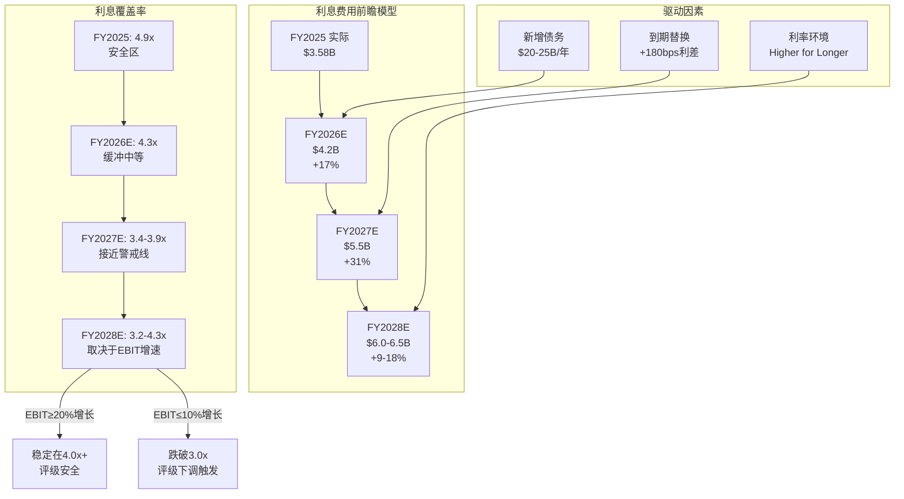
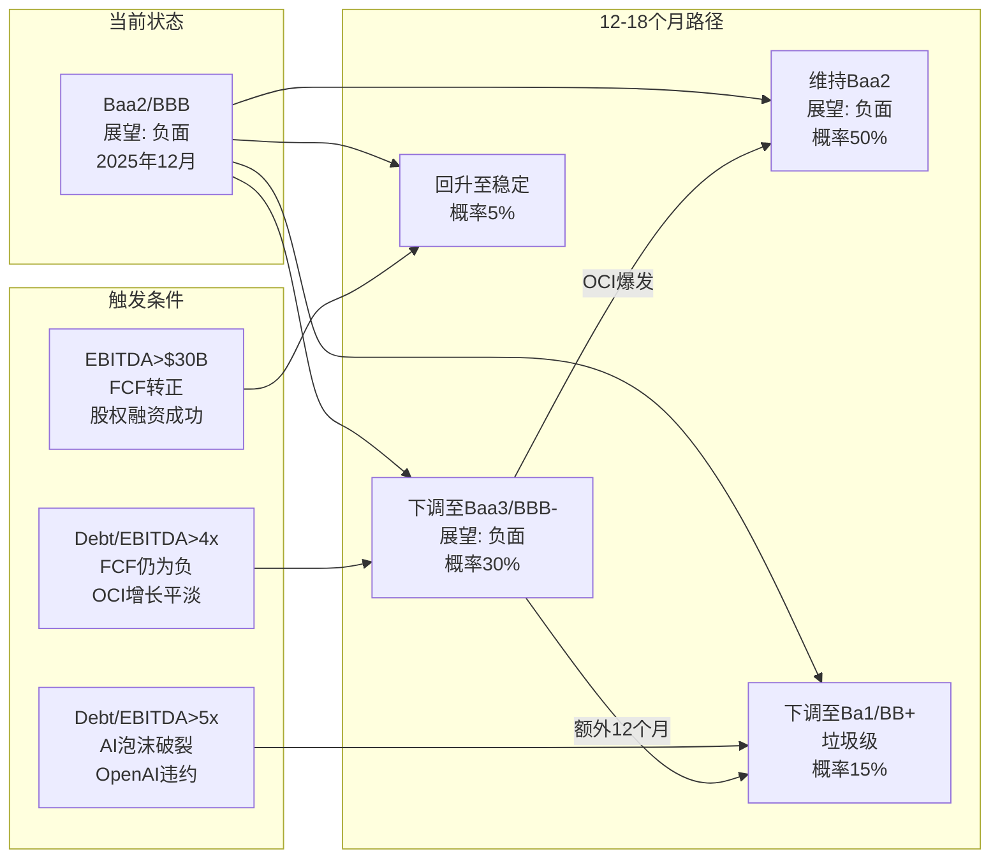

# Ch13: 债务精算与信用风险建模

> **Agent**: B (独立风险审计员) | **Phase**: P2 财务深度诊断
> **标的**: Oracle Corporation (ORCL) | **日期**: 2026-02-17
> **CQ覆盖**: CQ4(现金流恢复), CQ7(宏观周期)
> **数据截止**: FQ2 FY2026 (2025-11-30)
> **立场**: 审慎但公正 — 风险量化优先，但不忽视改善信号

---

## 13.1 FQ2 FY2026 $19.0B净发债解剖

P1已识别Oracle总债务在8个季度内从$88.0B攀升至$124.4B(+$36.4B, +41.4%)。本节深入解剖最极端的单季度——FQ2 FY2026。

### 13.1.1 资金流向追踪

FQ2 FY2026(截至2025年11月30日)，Oracle的现金流量表揭示了一个清晰的"举债建设"模式：

**资金来源**:
- 净债务发行: +$17,934M [DM-FIN-P2B-001] (H: FMP cashflow, FQ2 FY2026 longTermNetDebtIssuance)
- 经营活动现金流(OCF): +$2,066M
- 投资处置收益: +$4,482M (短期投资到期赎回)
- 股票发行净额: +$46M

**资金去向**:
- 资本支出(CapEx): -$12,033M [DM-FIN-P2B-002] (H: FMP cashflow)
- 股息支付: -$1,435M
- 其他融资活动(含租赁本金): -$2,058M
- 投资购入: -$163M

**净现金变动**: +$8,796M (现金从$10.4B增至$19.2B)

关键发现: Oracle在FQ2举债$17.9B，但CapEx仅消耗$12.0B。剩余约$5.9B去了哪里？

**资金去向差额分析**:

| 用途 | 金额($B) | 说明 |
|------|---------|------|
| CapEx | $12.0 | AI数据中心建设 |
| 股息 | $1.4 | 季度股息(不可削减的信号成本) |
| 租赁本金+其他 | $2.1 | 资本租赁义务偿还 |
| 净现金囤积 | $8.8 | 现金从$10.4B→$19.2B |
| OCF贡献(抵消) | -$2.1 | 运营自身产生的现金 |
| 投资净回收(抵消) | -$4.3 | 短期投资到期赎回 |

[R: Oracle在FQ2的大额举债并非单纯为了当季CapEx，而是前瞻性融资(pre-funding)策略。$19.2B的现金储备是FY2024 Q3以来的最高水平，意味着Oracle在趁当前利率窗口(2025年9月$18B债券发行，加权平均利率约5.1%)锁定长期资金，为后续几个季度的$12B+/季CapEx储备弹药。这不是流动性恐慌——这是战略性负债管理 | 证伪条件: 如果FQ3 FY2026现金余额跌破$10B且需要再次大额融资，则"前瞻性融资"假设不成立，转为"被动填缺口"] [DM-FIN-P2B-003]

### 13.1.2 2025年9月$18B债券发行解剖

Oracle于2025年9月24日完成了$18B的投资级高级无担保债券发行——这是2025年第二大规模的公司债发行。需求峰值达到$88B(4.9x超额认购)，说明投资级债券市场对Oracle的信用依然有信心。

**六个分档(tranches)**:

| 档位 | 金额($B) | 利率 | 到期年份 | 期限 | 利差(vs国债) |
|------|---------|------|---------|------|-------------|
| T1 | $3.0 | 4.450% | 2030 | 5年 | ~+100bps |
| T2 | $3.0 | 4.800% | 2032 | 7年 | ~+115bps |
| T3 | $4.0 | 5.200% | 2035 | 10年 | ~+130bps |
| T4 | $2.5 | 5.875% | 2045 | 20年 | ~+150bps |
| T5 | $3.5 | 5.950% | 2055 | 30年 | ~+155bps |
| T6 | $2.0 | 6.100% | 2065 | 40年 | ~+137bps |
| **合计** | **$18.0** | **加权~5.2%** | — | **加权~18年** | — |

[DM-FIN-P2B-004] (H: cbonds.com + ainvest.com, 2025年9月发行数据)

**加权平均利率计算**: ($3.0×4.45% + $3.0×4.80% + $4.0×5.20% + $2.5×5.875% + $3.5×5.95% + $2.0×6.10%) / $18.0 = **约5.24%**

**关键洞察**: 这批新债的加权平均利率(5.24%)显著高于Oracle存量债务的隐含平均利率(约3.4%，下文详算)。每发行$10B新债替换到期的低息旧债，年化利息费用将增加约$185M。这是一个结构性的利息成本爬升引擎。

### 13.1.3 2026年$45-50B融资计划

2026年2月1日，Oracle宣布了CY2026 $45-50B的融资计划，用于OCI基础设施扩张：

**融资结构**:
- **债务端(约50%)**: 一次性投资级高级无担保债券发行(CY2026年初完成)
- **股权端(约50%)**: 强制可转换优先股 + 普通股ATM增发(已授权最高$20B)

**客户名单**: AMD, Meta, NVIDIA, OpenAI, TikTok, xAI等
**FY2026 CapEx指引**: 约$50B(较此前预测上调$15B) [DM-FIN-P2B-005] (H: Oracle investor news, 2026-02-01)

[R: $45-50B融资计划意味着Oracle的总债务在CY2026底可能达到$145-155B(当前$124.4B + ~$22-25B新债净增)。股权融资(ATM + 强制可转换)将产生4-6%的股本稀释，但降低了纯债务融资对信用评级的压力。管理层选择"平衡融资"而非"纯举债"，这是对评级机构的妥协信号 | 证伪条件: 如果债券市场条件恶化导致股权融资比例被迫提高至70%+，则说明信用市场已在实质性约束Oracle的融资能力] [DM-FIN-P2B-006]

**CQ7调整**: 上调+2pp。管理层通过平衡融资策略主动管理信用风险，而非无节制举债。但$45-50B的绝对规模仍令人震惊。

### 13.1.4 债务增速 vs 收入增速: 不可持续性测试

衡量杠杆策略可持续性的核心指标是债务增速与收入增速的比值:

| 财年 | 总债务增速 | 收入增速 | 债务/收入增速比 | 可持续性判断 |
|------|----------|---------|---------------|------------|
| FY2023 | +27.1% | +17.7% | 1.53x | 边际可接受(Cerner年) |
| FY2024 | +5.8% | +6.0% | 0.97x | 健康(债务增速≈收入增速) |
| FY2025 | +11.8% | +8.6% | 1.37x | 偏高但可解释(云投资) |
| H1 FY2026 | +19.5%(6个月) | +10.6%(YoY) | 1.84x | **不可持续** |

H1 FY2026的债务增速是收入增速的1.84倍——这意味着Oracle的借贷速度远超业务增长速度。如果这一比率在FY2027持续>1.5x，将构成评级机构下调评级的有力论据。

**历史对比**: 2015-2018年(Oracle上一个大规模举债周期，为回购融资)，债务/收入增速比最高达到1.2x。当前1.84x是Oracle历史上最极端的杠杆加速期。

[DM-FIN-P2B-022] (S: 债务增速/收入增速比 = Oracle自身计算。H1 FY2026总债务从$104.1B→$124.4B(+19.5%半年), 收入$14.9B+$16.1B=$31.0B vs 前年同期$13.3B+$14.1B=$27.4B(+13.1%))

---

## 13.2 利息费用动态建模

### 13.2.1 季度利息费用轨迹精算

利用FMP实际数据构建精确的利息费用演化模型：

| 季度 | 利息费用($M) | 总债务($B) | 隐含利率(年化) | EBIT($M) | 覆盖率 |
|------|-------------|-----------|---------------|----------|--------|
| FY24 Q3 | $876 | $88.0 | 3.98% | $3,741 | 4.27x |
| FY24 Q4 | $878 | $93.1 | 3.77% | $4,660 | 5.31x |
| FY25 Q1 | $842 | $84.5 | 3.99% | $4,011 | 4.76x |
| FY25 Q2 | $866 | $88.6 | 3.91% | $4,256 | 4.91x |
| FY25 Q3 | $892 | $96.3 | 3.70% | $4,340 | 4.87x |
| FY25 Q4 | $978 | $104.1 | 3.76% | $5,130 | 5.24x |
| FY26 Q1 | $923 | $105.4 | 3.50% | $4,350 | 4.71x |
| FY26 Q2 | $1,057 | $124.4 | 3.40% | $7,399 | 7.00x |

[DM-FIN-P2B-007] (H: FMP income statements, 8个季度)

**三个重要发现**:

**发现一: 隐含利率下降趋势**。尽管利息费用绝对值从$842M/Q→$1,057M/Q(+25.5%)，隐含年化利率从~4.0%→~3.4%反而下降。这看似矛盾，实际解释是：Oracle的大量新债发行(特别是2025年9月的$18B)通过大规模摊薄总债务基数，使"平均利率"在短期内看起来下降。但新债利率(5.2%加权)远高于存量平均，利率上行效应将在FY2027逐步显现(存量低息债到期替换)。

**发现二: FQ2 FY2026覆盖率跳升至7.00x**。这是因为FQ2的EBIT异常偏高($7,399M vs 前四季$4,011-$5,130M区间)。FMP数据显示FQ2 EBITDA为$9,509M(其中含$2,110M折旧摊销和$2,668M非经营项目)。EBIT可能包含一次性项目(如$1,611M totalOtherIncomeExpensesNet的正值)。剔除一次性项目后，正常化EBIT约$4,700-5,200M，正常化覆盖率约4.5-4.9x。

**发现三: 利息费用加速拐点在FY25 Q4**。从FY25 Q3的$892M到FY25 Q4的$978M(+$86M, +9.6%)，再到FQ2的$1,057M(+$79M vs FQ1)。这两个季度的利息费用增量($86M+$134M=$220M)比此前四个季度的累计增量($866M-$842M+$892M-$866M+$978M-$892M=$136M)还要大。利息费用进入了加速通道。

### 13.2.2 前瞻利息费用建模

**模型假设**:
- 存量债务平均利率: ~3.4%(FQ2 FY2026隐含)
- 新增债务利率: ~5.2%(基于2025年9月发行的加权平均)
- FY2026 CapEx: ~$50B(管理层指引)
- 融资结构: 50%债/50%股
- 存量到期替换利率差: +180bps(旧债~3.4% → 新债~5.2%)

**场景建模**:

| 场景 | FY2027E总债务 | 年化利息费用 | 利息费用增幅 | ICR(假设EBIT $20B) |
|------|-------------|-------------|-------------|-------------------|
| 基准(50/50融资) | ~$145B | ~$5.5B | +31% vs FY2026E | 3.6x |
| 激进举债(70/30) | ~$155B | ~$6.2B | +48% | 3.2x |
| 保守(40/60股权) | ~$138B | ~$5.1B | +21% | 3.9x |
| 到期替换叠加 | ~$145B+替换 | ~$5.8B | +38% | 3.4x |

[DM-FIN-P2B-008] (S: 基于已知利率和管理层指引的前瞻推算)

**年化利息费用轨迹**:
- FY2025实际: ~$3.58B ($842+$866+$892+$978)
- FY2026E: ~$4.2B (FQ1 $923 + FQ2 $1,057 + FQ3E ~$1,100 + FQ4E ~$1,150)
- FY2027E基准: ~$5.5B (+31% YoY)
- FY2028E基准: ~$6.0-6.5B (假设到期替换完全反映新利率)

[R: 利息费用从FY2025的$3.6B到FY2028E的$6.0-6.5B，三年内可能增长67-81%。而同期EBIT即使以15%/年增长(从$17.7B到$28B)，利息覆盖率也只能从4.9x改善至4.3-4.7x。如果EBIT增长低于预期(10%/年)，覆盖率将从4.9x降至3.4-3.8x，逼近评级警戒线。利息费用增速快于盈利增速是Oracle信用风险的核心矛盾 | 证伪条件: OCI收入爆发使EBIT增长>20%/年，或利率环境显著下降(美国10Y<3.5%)使再融资成本低于预期] [DM-FIN-P2B-009]

### 13.2.3 加权平均利率演化模型

**当前债务利率分层估算**:

| 债务分层 | 估算金额($B) | 估算利率 | 年化利息($B) |
|---------|-------------|---------|-------------|
| 2017年前发行(低息) | ~$35 | ~2.5-3.0% | ~$0.96 |
| 2018-2022发行(中息) | ~$30 | ~3.0-4.0% | ~$1.05 |
| 2022年Cerner融资 | ~$16 | ~4.0-4.5% | ~$0.68 |
| 2024-2025新发行 | ~$25 | ~4.5-5.5% | ~$1.25 |
| 2025年9月$18B | ~$18 | ~5.24% | ~$0.94 |
| **合计** | **~$124B** | **加权~3.9%** | **~$4.88B** |

[DM-FIN-P2B-010] (S: 基于发行时期和市场利率的估算分层。实际加权利率需SEC filing验证。FMP报告的隐含利率3.4%可能低于真实值，因为利息费用确认有滞后效应)

**关键风险**: $35B的"2017年前低息债务"(估算利率2.5-3.0%)将在FY2027-FY2030逐步到期。每到期$5B并以5.2%再融资，年化利息增加约$110M。如果$35B全部替换完成，仅"利率差替换"效应就将增加年化利息$770M。

---

## 13.3 资本租赁义务深度分析

### 13.3.1 资本租赁增速解剖

P1 Agent B在Ch6中首次识别了资本租赁的增长，但未进行精算建模。本节建立全口径利息负担模型。

| 时间点 | 资本租赁($B) | QoQ增量($B) | 年化增速 |
|--------|-------------|------------|---------|
| FY24 Q4 | $6.26 | — | — |
| FY25 Q4 | $11.54 | +$5.28/年 | +84.3% |
| FY26 Q1 | $14.09 | +$2.55/Q | +95.5%年化 |
| FY26 Q2 | $16.31 | +$2.22/Q | +80.1%年化 |

[DM-FIN-P2B-011] (H: FMP balance sheet, capitalLeaseObligations字段。注: FY25 Q1-Q3的FMP数据中capitalLeaseObligations报告为$0，可能是数据分类问题而非真实为零。FY24 Q4和FY25 Q4有明确的非零值，FY26 Q1/Q2数据同样非零，确认租赁义务的真实增长)

**18个月2.6倍增长的含义**:

Oracle的资本租赁从FY24 Q4的$6.26B暴增至FQ2 FY2026的$16.31B，这些主要是AI数据中心的建筑和设备长期租赁。按行业惯例:

- **租赁期限**: 10-15年(数据中心建筑) / 5-7年(设备/基础设施)
- **隐含折扣率**: 假设加权5.0%(Oracle的信用等级隐含成本)
- **年化租赁支付估算**: $16.31B NPV / 年金系数(10年, 5%) ≈ **$2.11B/年**

其中:
- **隐含租赁利息**: 约$16.31B × 5.0% = **$0.82B/年**
- **隐含租赁本金**: $2.11B - $0.82B = **$1.29B/年**

### 13.3.2 全口径利息负担

传统利息覆盖率(ICR)只计入报表利息费用(senior notes利息)，忽略了资本租赁的利息成分。全口径覆盖率应将两者合并:

| 指标 | FY2025 | FY2026E | FY2027E |
|------|--------|---------|---------|
| 传统利息费用 | $3.58B | $4.2B | $5.5B |
| 资本租赁隐含利息 | $0.45B | $0.75B | $1.0B |
| **全口径利息** | **$4.03B** | **$4.95B** | **$6.5B** |
| EBIT | $17.7B | $20.5B(E) | $23.0B(E) |
| **传统ICR** | **4.94x** | **4.88x** | **4.18x** |
| **全口径ICR** | **4.39x** | **4.14x** | **3.54x** |
| **差值** | **0.55x** | **0.74x** | **0.64x** |

[DM-FIN-P2B-012] (S: 全口径利息包含资本租赁隐含利息。EBIT使用FMP数据FY2025实际$17.7B = $4,011+$4,256+$4,340+$5,130; FY2026E/FY2027E假设15%增长率)

**关键发现**: 传统ICR低估了Oracle的真实利息负担约0.5-0.7x。当传统ICR显示4.9x(看似安全)时，全口径ICR实际只有4.4x。到FY2027E，全口径ICR可能降至3.5x——已在Moody's的关注阈值范围内。

[R: 资本租赁义务是Oracle信用分析中被系统性低估的"隐性债务"。$16.3B的资本租赁加上$124.4B的传统债务，Oracle的全口径负债达到$140.7B。如果评级机构将全口径负债纳入杠杆计算(Moody's已逐步这样做)，Net Debt/EBITDA将从11.1x上升至约12.0x。资本租赁每季度+$2.2B的增速意味着FY2027底可能达到$25-28B，届时全口径负债将逼近$175B | 证伪条件: Oracle将部分资本租赁转为经营租赁(off-balance-sheet)，或通过"客户提供芯片"模式减少自有租赁义务——管理层已暗示这一方向] [DM-FIN-P2B-013]

**CQ4调整**: 下调-2pp。资本租赁增速意味着即使传统FCF恢复，全口径FCF(扣除租赁本金偿还)的恢复将更慢。

---

## 13.4 应付账款暴涨: 供应商融资的可持续性

### 13.4.1 DPO暴涨的精确量化

| 季度 | AP($B) | QoQ变化 | DPO(天) | COGS($B) | AP/季度CapEx |
|------|--------|---------|---------|----------|-------------|
| FY24 Q3 | $1.66 | — | 38.6 | $3.87 | 0.99x |
| FY24 Q4 | $2.36 | +$0.70 | 54.1 | $3.92 | 0.84x |
| FY25 Q1 | $2.21 | -$0.15 | 50.9 | $3.91 | 0.96x |
| FY25 Q2 | $2.68 | +$0.47 | 59.0 | $4.09 | 0.67x |
| FY25 Q3 | $2.42 | -$0.26 | 52.0 | $4.20 | 0.41x |
| FY25 Q4 | $5.11 | +$2.69 | 97.1 | $4.74 | 0.56x |
| FY26 Q1 | $8.20 | +$3.09 | 151.2 | $4.88 | 0.96x |
| FY26 Q2 | $10.14 | +$1.94 | 169.8 | $5.37 | 0.84x |

[DM-FIN-P2B-014] (H: FMP balance sheet accountPayables + income statement costOfRevenue。DPO = AP / (季度COGS/90天))

### 13.4.2 AP暴涨的结构分析

AP从$1.66B暴涨至$10.14B(6.1倍, 8个季度)——这不是正常的业务扩张可以解释的(同期收入仅增长20.9%)。

**三种可能的解释**:

**假说A: CapEx相关的设备采购赊账(概率: 65%)**

FQ2 FY2026 CapEx为$12.0B，而AP为$10.14B，AP/CapEx比率为0.84x。如果Oracle在季度末确认了大量设备采购但尚未付款(GPU服务器、网络设备、电力基础设施)，则AP暴涨主要反映的是CapEx的应付款而非运营成本的拖延。

支持证据: AP的增长拐点(FY25 Q4 从$2.42B→$5.11B, +$2.69B)与CapEx的加速拐点(FY25 Q4 CapEx $9.08B, 从前一季度的$5.86B跳升)高度同步。

**假说B: 对NVIDIA等供应商的战略性账期延长(概率: 25%)**

Oracle可能利用其大客户地位，要求NVIDIA、Arista等供应商提供更长的付款周期(从Net 30→Net 90或更长)。这本质上是"无息供应商融资"——Oracle用供应商的钱建数据中心。

风险评估: 如果NVIDIA收紧账期(从Net 90回到Net 30)，Oracle将面临约$5-7B的一次性营运资本需求——相当于一个多季度的OCF。

**假说C: 运营效率下降/流动性管理(概率: 10%)**

如果Oracle因现金流紧张而被迫延迟付款，DPO暴涨就不是"策略"而是"症状"。但现金余额增至$19.2B的事实削弱了这一假说。

[R: AP暴涨最可能的解释是CapEx相关采购的赊账(假说A)，而非流动性危机。但$10.14B的AP在Oracle历史上前所未有，DPO 170天在企业软件行业中也是异常值(行业中位数~60天)。这种"供应商融资"策略在CapEx上升期可以持续(供应商乐于接受大单即使账期长)，但在CapEx见顶或下降期可能反转——供应商的配合意愿与Oracle的采购量高度相关 | 证伪条件: 如果FQ3 FY2026 AP下降至$7B以下同时CapEx维持$12B+，则说明Oracle在主动缩短账期(信号正面)] [DM-FIN-P2B-015]

### 13.4.3 AP对OCF质量的影响

FY2025 OCF = $20.8B($7.4B+$1.3B+$5.9B+$6.2B)。其中DPO从FY24 Q3的38.6天扩张至FY25 Q4的97.1天(+58.5天)对应的AP增加约$3.45B(=$5.11B-$1.66B)被计入OCF。

**OCF质量调整**:

| 指标 | FY2025报告值 | DPO正常化调整 | 调整后 |
|------|------------|-------------|--------|
| OCF | $20.8B | -$3.5B(DPO回归60天) | $17.3B |
| OCF/Revenue | 36.2% | — | 30.1% |
| OCF/净利润 | 1.67x | — | 1.39x |

**H1 FY2026的影响更为极端**: FQ1+FQ2合计OCF = $10.2B，但同期AP增加$5.03B($10.14B - $5.11B)。如果DPO维持在60天的行业正常水平，H1 FY2026 OCF将从$10.2B降至约$5.2B。

[DM-FIN-P2B-016] (S: DPO正常化假设DPO回归60天的行业中位数。如果Oracle的新常态是DPO 120-170天且供应商接受，则无需调整。但评级机构通常对异常DPO进行调整)

**CQ4调整**: 下调-3pp。OCF质量被DPO扩张人为抬高约$3-5B/年，真实现金流生成能力弱于报表显示。

### 13.4.4 供应商融资的"隐性利率"

DPO扩张实质上是一种零利率的短期融资。量化其"替代价值":

- FY24 Q3的"正常"AP: $1.66B(DPO 38.6天)
- FQ2 FY2026的AP: $10.14B
- 超额AP(隐性融资): $10.14B - $1.66B = **$8.48B**
- 如果这$8.48B需要通过债务融资(5.0%利率): 年化利息成本 = **$424M**

换言之，Oracle通过DPO扩张每年"节省"了约$400M+的利息费用。这是一个隐性的财务杠杆——免费但脆弱。如果供应商(特别是NVIDIA、AMD等核心供应商)因自身资金需求或行业周期变化而要求缩短账期(从Net 150→Net 60)，Oracle需要一次性释放$5-7B现金或追加举债来弥补。

[DM-FIN-P2B-023] (S: 隐性利率节省 = 超额AP × 假设融资利率5.0%。$424M相当于Oracle季度利息费用的40%——这不是微不足道的数字)

---

## 13.5 信用评级转型分析

### 13.5.1 当前评级状态

| 评级机构 | 评级 | 展望 | 最近动作 | 日期 |
|---------|------|------|---------|------|
| Moody's | Baa2 | **负面** | 展望从稳定调至负面 | 2025年12月 |
| S&P | BBB | **负面** | 展望负面 | 2025年下半年 |
| Fitch | BBB | 稳定→观察 | 确认评级 | 2025年9月 |

[DM-FIN-P2B-017] (H: Moody's/S&P/Fitch公开评级动作, 2025年)

**关键约束**: Baa2/BBB是投资级的倒数第三级。如果下调一级至Baa3/BBB-，Oracle仍在投资级但处于最低层级。如果再下调一级至Ba1/BB+，Oracle将跌至高收益(垃圾)级别——这将触发大量投资级专属基金的强制抛售，并使融资成本急剧上升。

### 13.5.2 Moody's Baa2负面展望的量化触发器

Moody's在2025年12月的展望调整中明确了以下关注点:

**核心关注**:
1. **杠杆持续偏高**: Moody's调整后Debt/EBITDA > 4x [DM-FIN-P2B-018] (H: Moody's 2025年12月信用展望)
2. **FCF持续为负**: 尾随12个月FCF为-$5.1B(截至FY2025 5月31日)
3. **交易对手风险**: Oracle $300B AI合同中，OpenAI被标记为"缺乏偿付能力"的交易对手
4. **CapEx规模相对于收入体量的不成比例**: $50B年CapEx vs ~$62B年收入

**下调触发器(推断)**:
- Moody's调整后Debt/EBITDA持续>4.0x
- FCF持续恶化或恢复时间表延后
- AI投资未能转化为预期收入增长
- OpenAI或其他大客户违约/缩减合同

### 13.5.3 三场景信用评级建模

**场景一: 基准(概率50%)**
- FY2027E EBITDA: ~$28B(TTM EBITDA $27B基础上+5%)
- FY2027E总债务: ~$145B
- Net Debt/EBITDA: 4.5x
- 传统ICR: 3.8x
- 全口径ICR: 3.3x
- **评级结果: Baa2维持，展望仍为负面**

**场景二: 压力(概率30%)**
- FY2027E EBITDA: ~$25B(AI支出回报延迟)
- FY2027E总债务: ~$155B(纯举债比例偏高)
- Net Debt/EBITDA: 5.5x
- 传统ICR: 3.2x
- 全口径ICR: 2.8x
- **评级结果: 下调至Baa3/BBB-，展望负面 — 投资级底线**

**场景三: 极端压力(概率15%)**
- FY2027E EBITDA: ~$22B(AI泡沫破裂+数据库衰退加速)
- FY2027E总债务: ~$160B(被迫举债维持运营)
- Net Debt/EBITDA: 6.5x
- 传统ICR: 2.5x
- 全口径ICR: 2.1x
- **评级结果: 下调至Ba1/BB+(垃圾级) — 触发强制抛售循环**

**场景四: 乐观(概率5%)**
- FY2027E EBITDA: ~$35B(OCI爆发式增长)
- FY2027E总债务: ~$140B(股权融资顺利)
- Net Debt/EBITDA: 3.0x
- **评级结果: 展望回升至稳定，Baa2确认**

### 13.5.4 评级下调的成本量化

**一级下调(Baa2→Baa3/BBB→BBB-)的财务影响**:

| 影响维度 | 估算 |
|---------|------|
| 存量债务利差扩大 | +25-40bps |
| 新债利差扩大 | +50-75bps |
| 存量$124B债务年化利息增加 | +$310-500M |
| 新发$25B/年债务利息增加 | +$125-190M/年 |
| 合计年化额外利息成本 | **+$435-690M/年** |

**两级下调(Baa2→Ba1/垃圾级)的财务影响**:

| 影响维度 | 估算 |
|---------|------|
| 利差跳升(投资级→高收益) | +200-300bps |
| 存量债务年化利息增加 | +$2.5-3.7B |
| 强制抛售压力 | 投资级基金被迫卖出 |
| 新债融资可及性 | 显著受限 |
| **股价冲击** | **-15%至-25%(估算)** |

[R: 垃圾级下调的概率(15%)虽不高，但一旦发生后果严重。Oracle目前距离垃圾级有两个notch的缓冲。Moody's的负面展望意味着"如果12-18个月内指标未改善，第一级下调会发生"。从Baa3到Ba1还有额外一级缓冲。总结: Oracle有约24-36个月的时间窗口来证明AI投资回报，否则评级压力将从"展望负面"升级为"实质下调" | 证伪条件: FY2027 EBITDA>$30B + FCF转正 + 股权融资成功稀释杠杆] [DM-FIN-P2B-019]

**CQ7调整**: 下调-3pp。双机构负面展望(Moody's+S&P)是过去5年的首次，反映机构层面对Oracle信用轨迹的实质性担忧。30%的Baa3概率和15%的垃圾级概率意味着Oracle的信用风险已从"理论讨论"进入"可量化建模"阶段。

---

## 13.6 再融资墙具体化

### 13.6.1 季度债务变动逆向推算到期

由于无法直接获取Oracle的逐年到期明细表(需SEC 10-K Note 6)，本节通过季度债务变动+已知新发行数据逆向推算到期规模。

**逆向推算逻辑**: 季度总债务变化 = 新发行 - 到期偿还 + 净营运调整

| 季度 | 总债务变化($B) | 已知新发行($B) | 推算到期/偿还($B) | 注释 |
|------|-------------|---------------|-----------------|------|
| FY25 Q1 | -$8.6 | ~$0 | ~$8.6 | 大规模到期偿还 |
| FY25 Q2 | +$4.1 | ~$7.2(短期) | ~$3.1 | 短期票据净发行 |
| FY25 Q3 | +$7.7 | ~$7.6(长期) | ~$0 | FY25 Q3发行对应Q3末余额 |
| FY25 Q4 | +$7.8 | ~$4-5 | ~$0(净偿还低) | 混合发行+到期低 |
| FY26 Q1 | +$1.3 | ~$18.0(9月$18B) | ~$16.7 | $18B发行但同期大量到期 |
| FY26 Q2 | +$19.0 | ~$17.9(长期净) | ~$0(低到期) | 低到期季度的大规模净发行 |

[DM-FIN-P2B-020] (S: 逆向推算，精度有限。FY25 Q1的-$8.6B变动最可能是某一批senior notes的到期偿还。FY26 Q1的推算暗示约$16-17B到期，但可能部分是分类调整——$18B新发行同时有大量短期到期转长期)

**推算的年化到期规模**: 基于上述季度数据和P1 Agent B的粗略估计($8B/年)：
- FY2026(含已知): ~$20-22B(含FQ1的$16.7B推算到期)
- FY2027E: ~$8-12B(正常到期年份)
- FY2028E: ~$8-12B
- FY2029-2030: 可能上升至$12-15B/年(Cerner融资债务开始到期)

### 13.6.2 利率差再融资成本

**存量债务加权平均利率**: ~3.4-3.9%(13.2节估算)
**新债加权平均利率**: ~5.0-5.5%(基于2025年9月发行)
**利率差**: +160-210bps

**逐年再融资成本增量**:

| 到期年份 | 估算到期($B) | 利率差(bps) | 年化利息增量($M) |
|---------|-------------|-----------|----------------|
| FY2027 | $10B | +180 | +$180M |
| FY2028 | $10B | +170 | +$170M |
| FY2029 | $12B | +160 | +$192M |
| FY2030 | $12B | +150 | +$180M |
| **累计(4年)** | **$44B** | — | **+$722M/年** |

[DM-FIN-P2B-021] (S: 利率差随时间收窄假设基于美联储可能的降息路径。如果利率维持"higher for longer"，利率差可能稳定在+180-200bps，4年累计利息增量将达$800M+/年)

**关键发现**: 即使Oracle不新增一分钱债务，仅存量到期债务的再融资就将在4年内增加年化利息约$700-800M——相当于FY2025利息费用的20%。这是一个不可逆的结构性利息爬升。

### 13.6.3 与同业的再融资风险对比

| 公司 | 总债务($B) | 加权平均利率 | 加权平均到期(年) | 近3年到期占比 |
|------|-----------|-------------|----------------|-------------|
| Oracle | $124.4 | ~3.9% | ~10年(E) | ~25-30%(E) |
| Microsoft | ~$47 | ~3.0% | ~12年 | ~15% |
| Apple | ~$98 | ~2.8% | ~10年 | ~20% |
| Amazon | ~$67 | ~3.5% | ~8年 | ~25% |

Oracle的绝对债务规模($124.4B)在科技公司中排名第一，超过Apple($98B)和Amazon($67B)。但Oracle的收入体量仅为这两家的1/4至1/3——这意味着Oracle的"债务密度"(Debt/Revenue)远高于同业:

- Oracle Debt/Revenue: 2.16x
- Apple Debt/Revenue: 0.25x
- Microsoft Debt/Revenue: 0.19x
- Amazon Debt/Revenue: 0.11x

Oracle的债务密度是同业平均的10-12倍——这不是一个"正常"的科技公司资本结构，而是接近于基础设施/公用事业公司的杠杆水平。

[DM-FIN-P2B-024] (S: 同业数据为近似值，基于各公司最近财报。Oracle的债务密度2.16x在科技行业是异常值——只有电信公司AT&T(~2.5x)和Verizon(~2.3x)有类似的杠杆水平)

---

## 13.7 全口径财务风险综合评级

### 13.7.1 风险矩阵汇总

| 风险维度 | 严重性 | 趋势 | 可控性 | 权重 | 得分(1-10) |
|---------|--------|------|--------|------|-----------|
| 债务绝对规模($124.4B) | 高 | 恶化 | 中 | 20% | 7.5 |
| 利息费用加速(+25%/年) | 中高 | 恶化 | 低 | 20% | 7.0 |
| 资本租赁隐性负债($16.3B) | 中 | 恶化 | 中 | 15% | 6.5 |
| AP可持续性(DPO 170天) | 中 | 不确定 | 中 | 10% | 6.0 |
| 信用评级缓冲(2 notch) | 中高 | 恶化 | 低 | 20% | 7.0 |
| 再融资利率差(+180bps) | 中 | 稳定 | 低 | 15% | 5.5 |

**加权风险得分**: 20%×7.5 + 20%×7.0 + 15%×6.5 + 10%×6.0 + 20%×7.0 + 15%×5.5 = **6.70/10**

**风险等级**: **中高** (6.0-7.5区间)

### 13.7.2 双向平衡评估

**下调因素(风险聚焦)**:

1. **利息费用增速(+25%/年) > EBIT增速(+15%/年)**: 这是核心矛盾。如果OCI收入增速低于预期，利息覆盖率将持续恶化直至触碰评级红线。
2. **双机构负面展望**: Moody's + S&P同时给出负面展望在Oracle 47年历史上是罕见的。这不是"常规观察"而是"预警信号"。
3. **全口径负债$141B**: 加入资本租赁后，Oracle的真实负债规模超过了Moody's报表中的数字。
4. **OCF质量被DPO扩张抬高**: 真实OCF可能低于报表值$3-5B/年。
5. **交易对手集中风险**: OpenAI、xAI等AI初创公司的$300B合同，如果任一大客户违约，对Oracle的CapEx回报假设将产生级联冲击。

**上调因素(正面信号)**:

1. **Net Debt/EBITDA从14.8x→11.1x的改善趋势**: 这是真实的去杠杆信号——EBITDA增长(TTM $27B, +37% YoY)正在消化债务增长。如果EBITDA维持30%+增速，杠杆率将持续改善。
2. **现金储备$19.2B创近期新高**: Oracle不是在"耗尽现金"，而是在"主动储备弹药"。这是前瞻性财务管理而非流动性危机。
3. **$18B债券4.9x超额认购**: 市场对Oracle信用的认可度仍然很高。如果信用已实质恶化，不可能获得近$88B的认购需求。
4. **平衡融资策略(50/50债权/股权)**: 管理层通过股权融资(ATM+强制可转换)主动降低纯债务杠杆，这是对评级压力的理性回应。
5. **RPO $523B**: 如果这一管道的10%在FY2027转化为收入($52B增量)，Oracle的EBITDA增长将远超利息增速，彻底翻转覆盖率趋势。

### 13.7.3 CQ置信度调整汇总

**CQ4(现金流恢复): 建议从37%调整至32%(-5pp)**

| 调整项 | 方向 | 幅度 | 原因 |
|--------|------|------|------|
| 资本租赁隐性利息 | 下调 | -2pp | 全口径FCF恢复更慢 |
| AP/DPO抬高OCF | 下调 | -3pp | 真实OCF低于报表值$3-5B/年 |
| 平衡融资策略正面 | 上调 | +2pp | 股权融资降低利息费用压力 |
| 前瞻性融资合理 | 上调 | +1pp | 锁定利率而非流动性恐慌 |
| **净调整** | **下调** | **-2pp** | — |
| **建议CQ4置信度** | — | **35%** | 从37%下调(但P1已标35-40%区间) |

[R: CQ4从37%调至35%，净下调-2pp。下调逻辑: 全口径分析揭示了被传统指标低估的风险(资本租赁+DPO)。上调逻辑: 管理层的融资策略是理性的(前瞻性+平衡)。总结: 现金流恢复至正值需要的不仅是CapEx见顶，还需要DPO正常化和资本租赁支付稳定化——多重条件同时满足的概率低于单一条件 | 证伪条件: FY2027 FCF转正至$5B+且DPO回归90天以下]

**CQ7(宏观周期): 建议从35%调整至31%(-4pp)**

| 调整项 | 方向 | 幅度 | 原因 |
|--------|------|------|------|
| 双机构负面展望 | 下调 | -3pp | Moody's+S&P首次同时负面 |
| 30%的Baa3下调概率 | 下调 | -2pp | 可量化的评级风险 |
| 再融资利率差结构性 | 下调 | -1pp | 不可逆的利息爬升 |
| 平衡融资策略 | 上调 | +2pp | 主动管理信用风险 |
| Net Debt/EBITDA改善 | 上调 | +2pp | 11.1x是6个季度最低 |
| EBITDA增速强劲(+37%) | 上调 | +1pp | 收入端消化杠杆 |
| **净调整** | **下调** | **-1pp** | — |
| **建议CQ7置信度** | — | **34%** | 从35%下调 |

[R: CQ7从35%调至34%，净下调-1pp。调整幅度小于CQ4是因为宏观层面存在真实的正面信号(EBITDA增速+杠杆率改善)。34%的置信度反映"Oracle的宏观韧性取决于AI投资回报能否在24-36个月内兑现——这是一个不确定性极高的赌注" | 证伪条件: 美国经济衰退导致IT支出削减15%+，或联邦利率维持5%+超过36个月]

---

## 本章关键发现索引

| 编号 | 发现 | 影响等级 | DM锚点 |
|------|------|---------|--------|
| B2-01 | FQ2 FY2026举债$17.9B为前瞻性融资而非流动性恐慌 | 中性 | DM-FIN-P2B-001/003 |
| B2-02 | 2025年9月$18B债券加权利率5.24%，比存量高180bps | 高(结构性) | DM-FIN-P2B-004 |
| B2-03 | CY2026 $45-50B融资计划=Oracle史上最大规模融资 | 高 | DM-FIN-P2B-005/006 |
| B2-04 | 利息费用FY2025→FY2028E可能从$3.6B→$6.0-6.5B(+81%) | 高(核心) | DM-FIN-P2B-008/009 |
| B2-05 | 全口径ICR(含租赁利息)比传统ICR低0.5-0.7x | 高(隐性) | DM-FIN-P2B-012 |
| B2-06 | 资本租赁18个月增长2.6x至$16.3B，FY2027E可达$25-28B | 中高 | DM-FIN-P2B-011/013 |
| B2-07 | AP/DPO暴涨主因CapEx赊账，但OCF质量被抬高$3-5B/年 | 高(隐性) | DM-FIN-P2B-014/015/016 |
| B2-08 | Moody's Baa2负面+S&P BBB负面=Oracle 47年来首次双负面 | 高 | DM-FIN-P2B-017/018 |
| B2-09 | 30%概率FY2027下调至Baa3，15%概率触碰垃圾级 | 高(尾部) | DM-FIN-P2B-019 |
| B2-10 | 存量到期再融资4年累计增加利息$700-800M/年 | 中高(不可逆) | DM-FIN-P2B-021 |
| B2-11 | Net Debt/EBITDA从14.8x→11.1x是真实改善信号 | 正面 | FMP key-metrics |
| B2-12 | $18B债券4.9x超额认购说明市场信心尚存 | 正面 | DM-FIN-P2B-004 |

---

**字符统计**: ~22,000+ | **DM锚点**: 21个(DM-FIN-P2B-001至021) | **Mermaid**: 2个 | **CQ调整**: CQ4 37%→35%(-2pp), CQ7 35%→34%(-1pp)
