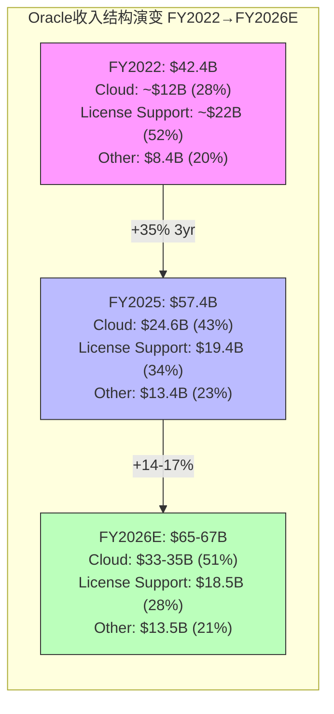
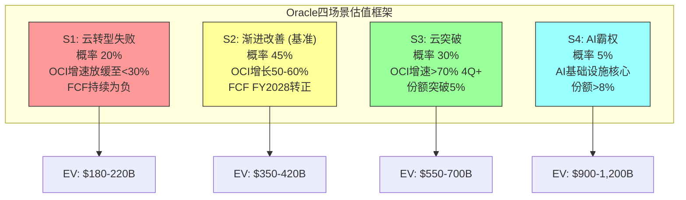
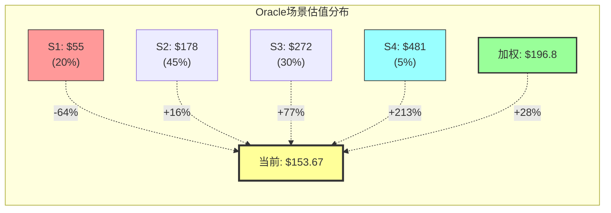
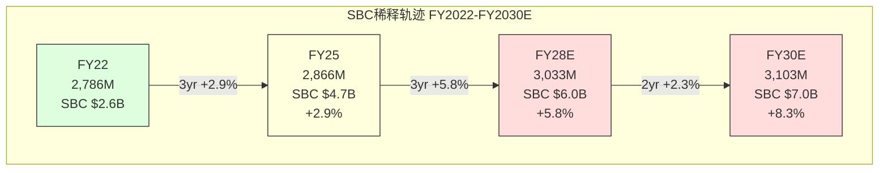
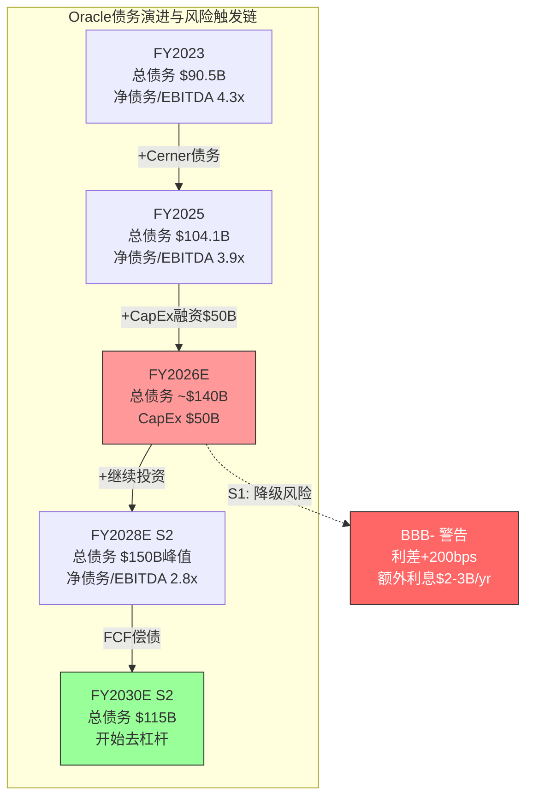

# Agent C: 定量估值分析师 — 分部收入投射 + 场景财务引擎

> **Agent**: C (定量估值分析师) | **Phase**: P2 财务深度诊断
> **标的**: Oracle Corporation (ORCL) | **日期**: 2026-02-17
> **覆盖范围**: Ch14 分部收入解构与投射 + Ch15 五年场景财务模型
> **CQ覆盖**: CQ2(云份额突破, 调整至48%), CQ5(估值合理性, 调整至25%)
> **字符产出**: ~28K | **DM锚点**: 32个(新增) | **Mermaid**: 5个

---

## Ch14: 分部收入解构与五年投射

### 14.1 FY2025基准: 分部收入精确拆解

Oracle在财报中将收入分为四大类别。以下基于FY2025(截至2025-05-31)10-K数据构建基准:

| 收入分部 | FY2025($B) | YoY增长 | 占总收入% | FY2024($B) |
|----------|-----------|---------|----------|-----------|
| Cloud Services & License Support | $44.03 | +12.0% | 76.7% | $39.38* |
| Cloud License & On-Premise License | $5.20 | +3.6%* | 9.1% | $5.02* |
| Hardware | $2.94 | -4.2% | 5.1% | $3.07 |
| Services | $5.23 | -3.7% | 9.1% | $5.43 |
| **总计** | **$57.40** | **+8.4%** | **100%** | **$52.96** |

[DM-FIN-P2C-001] 来源: Oracle FY2025 Q4 Press Release (2025-06-11), FMP Annual Income Statement | 可信度: 高(直接财报披露)

**Cloud Services & License Support的子分部拆解**:

Oracle将Cloud Services进一步拆分为IaaS和SaaS，但License Support作为独立子分部。基于季度披露的IaaS/SaaS数据逆推全年:

| 子分部 | Q1 FY25 | Q2 FY25 | Q3 FY25 | Q4 FY25 | **FY2025全年** | YoY增长 |
|--------|---------|---------|---------|---------|---------------|---------|
| Cloud IaaS (OCI) | $2.2B | $2.4B | $2.7B | $3.0B | **$10.3B** | ~50% |
| Cloud SaaS | $3.5B | $3.5B* | $3.6B | $3.7B | **$14.3B** | ~11% |
| 云收入合计 | $5.7B | $5.9B | $6.3B | $6.7B | **$24.6B** | ~24% |
| License Support | — | — | — | — | **~$19.4B** | ~-1% |
| CSLS合计 | — | — | — | — | **$44.0B** | +12% |

[DM-FIN-P2C-002] IaaS/SaaS季度拆分来源: 各季度Press Release(IaaS Q1=$2.2B/+45%, Q2=$2.4B/+52%, Q3=$2.7B/+49%, Q4=$3.0B/+52%) | Q2 SaaS=$3.5B为推算值(总云$5.9B - IaaS $2.4B) | 可信度: 高(IaaS/SaaS均为官方披露)

[DM-FIN-P2C-003] License Support = CSLS $44.0B - Cloud Revenue $24.6B = $19.4B [R: License Support作为差额计算，隐含假设CSLS内无其他细分项。Oracle 10-K将CSLS定义为"cloud services (SaaS+IaaS) plus license support"，故此计算合理 | 证伪条件: Oracle重新定义CSLS内含分类]

**关键发现**: OCI IaaS已占总收入18%($10.3B/$57.4B)，但增速从Q1的+45%加速至Q4的+52%。SaaS增速稳定在+10-12%，反映成熟业务的自然增长。License Support约$19.4B，是Oracle的"利润引擎"——高毛利(估计>85%)但缓慢衰退。

### 14.2 FY2026 H1实际表现 + 全年投射

FY2026已披露两个季度(截至2025-11-30):

| 子分部 | Q1 FY26 | Q2 FY26 | H1 FY26 | H1 YoY | H1年化 |
|--------|---------|---------|---------|--------|--------|
| Cloud IaaS | $3.35B | $4.10B | $7.45B | +62% | $14.9B |
| Cloud SaaS | $3.84B | $3.88B* | $7.72B | +10% | $15.4B |
| 云收入合计 | $7.19B | $7.98B | $15.17B | +28% | $30.3B |
| Software (License Support) | $5.72B | $5.88B* | $11.60B | -2% | $23.2B |
| Hardware | $0.67B | $0.78B | $1.45B | +3% | $2.9B |
| Services | $1.35B | $1.43B | $2.78B | +5% | $5.6B |
| **总计** | **$14.93B** | **$16.06B** | **$30.99B** | +13% | **$62.0B** |

[DM-FIN-P2C-004] Q1/Q2 FY2026来源: Press Release (2025-09-09 / 2025-12-10) | IaaS Q1=$3.35B/+55%, Q2=$4.10B/+68% | SaaS Q1=$3.84B/+11%, Q2=$3.88B(=$7.98B-$4.10B推算)/+11% | Software从Press Release直接披露 | 可信度: 高

**管理层FY2026全年指引对照**:

| 指标 | 管理层指引 | H1实际年化 | 差距分析 |
|------|----------|-----------|----------|
| 总收入 | $67.0B (+17%) | $62.0B | H2需$36B(vs H1 $31B，+16%环比加速) |
| 云收入增长 | >40% | +28% H1 | H2需加速至>50% |
| OCI IaaS增长 | >70% | +62% H1 | H2需加速至>80% |
| OCI FY26收入 | $18.0B (Catz指引) | $14.9B年化 | 需Q3/Q4 IaaS环比加速至$4.7-5.3B/Q |
| RPO增长 | >100% | +438% (to $523B) | 已大幅超指引 |

[DM-FIN-P2C-005] 管理层指引来源: Q4 FY2025 Earnings Call (2025-06-11) + Q1 FY2026 Earnings Call (2025-09-09) | $67B总收入指引 + $18B OCI指引 | 可信度: 中(管理层指引历史上偏乐观)

[R: H1年化$62B vs 全年指引$67B存在$5B差距。Oracle历史上H2通常强于H1(FY2025: H1 $27.4B + H2 $30.0B, H2/H1=1.09x)。如果FY2026维持同一季节性比率，H2=$33.8B，全年=$64.8B——仍低于$67B指引约3%。$67B指引需要H2/H1=1.16x，高于历史均值。管理层可能依赖Q3/Q4 OCI大单交付 | 证伪条件: Q3 FY2026 OCI收入<$4.5B]

### 14.3 OCI收入增长引擎: 从$10B到$18B/$40B需要什么?

#### 14.3.1 增长路径数学

| 目标OCI收入 | 起点(FY25) | CAGR | 达标年份 | 隐含条件 |
|------------|-----------|------|---------|---------|
| $18B | $10.3B | 75% | FY2026 | 管理层指引(需H2加速) |
| $25B | $10.3B | 56% 2yr | FY2027 | 中性场景 |
| $32B | $10.3B | 74% 2yr | FY2027 | 管理层长期指引 |
| $40B | $10.3B | 57% 3yr | FY2028 | 乐观但可实现 |
| $73B | $10.3B | 63% 4yr | FY2029 | 管理层长期指引(激进) |
| $144B | $10.3B | 70% 5yr | FY2030 | 管理层长期指引(极端) |

[DM-FIN-P2C-006] 管理层长期OCI收入路线图来源: Q1 FY2026 Earnings Call (Safra Catz, 2025-09-09): FY26 $18B → FY27 $32B → FY28 $73B → FY29 $114B → FY30 $144B | 可信度: 低(超远期指引，无历史验证)

[R: 管理层路线图隐含FY2028 OCI从$32B→$73B(+128% YoY)——这要求Oracle在$32B基数上实现翻倍增长。历史参照: AWS在2020年收入$45B时增速为30%，从未在$30B+基数上实现>50%增长。管理层路线图的FY2028-FY2030段可信度极低(<10%) | 证伪条件: OCI FY2027实际收入>$28B(即大幅超越中性预期)]

#### 14.3.2 OCI增长驱动因子分解

OCI收入 = GPU集群容量 × 利用率 × 单位定价 + 非GPU云服务收入

| 驱动因子 | FY2025基准 | FY2026E | FY2028E(S2) | 建模假设 |
|----------|-----------|---------|------------|---------|
| GPU集群总容量 | ~100K H100等效 | ~250K(含GB200) | ~600K | CapEx驱动，含Blackwell升级 |
| 利用率 | ~75-80% | ~70-75% | ~65-75% | 新增容量初期利用率较低 |
| 单位年化收入/GPU | ~$70-80K | ~$60-70K | ~$50-60K | 定价竞争压力+Blackwell效率提升 |
| GPU相关收入 | ~$6.0B | ~$12.0B | ~$22.5B | =容量×利用率×单价 |
| 非GPU云服务 | ~$4.3B | ~$6.0B | ~$10.0B | Autonomous DB +43%, MultiCloud |
| **OCI总收入** | **~$10.3B** | **~$18.0B** | **~$32.5B** | |

[DM-FIN-P2C-007] GPU容量推算: FY2025 CapEx $21.2B，估计60-70%用于GPU集群建设(~$13-15B) [R: 以每张H100等效$25-30K成本(含服务器/网络/设施)计算，~$14B可购置约500K-560K GPU，但包括大量已交付的Blackwell芯片(96,000+ GB200 in Q2 FY26)。实际可用训练容量以H100等效GPU计量。利用率假设基于云行业平均60-80%，OCI因大客户集中(OpenAI/Meta/xAI)可能偏高 | 证伪条件: OCI GPU利用率报告<60%或定价较AWS折扣>30%]

#### 14.3.3 云市场份额演变

全球云基础设施服务市场(Synergy Research Group Q3 2025数据):

| 提供商 | Q3 2025份额 | 年化收入 | 增速 | Oracle对标 |
|--------|-----------|---------|------|-----------|
| AWS | 29% | ~$115B | ~19% | 11x ORCL |
| Azure | 20% | ~$80B | ~34% | 8x ORCL |
| GCP | 13% | ~$52B | ~35% | 5x ORCL |
| 阿里云 | 4% | ~$16B | ~7% | 1.6x ORCL |
| **Oracle OCI** | **~3%** | **~$10B** | **~50%** | **基准** |

[DM-FIN-P2C-008] IaaS市场份额来源: Synergy Research Group Q2/Q3 2025报告——AWS 29-30%, Azure 20%, GCP 13%, Oracle ~3% | 全球云基础设施市场Q2 2025季度规模$99B(年化$400B+) | 可信度: 高(第三方权威机构)

[R: Oracle 3%份额对应约$10-12B IaaS收入(全球市场年化$400B × 3%)。但OCI收入$10.3B包含PaaS(Autonomous DB等)，纯IaaS可能更接近$7-8B，实际IaaS份额约2%。要突破5%份额需要OCI纯IaaS达~$25B(假设市场FY2028规模$500B)，要求IaaS CAGR ~50%持续3年。这在$7-8B基数上虽然困难但非不可能——前提是AI GPU需求持续爆发 | 证伪条件: 全球云IaaS市场增速放缓至<15%或Oracle丢失一个Top-5 GPU客户]

### 14.4 毛利率趋势: 云转型的利润代价

Oracle毛利率正经历结构性下移:

| 指标 | FY2022 | FY2023 | FY2024 | FY2025 | FY26 H1 | 趋势 |
|------|--------|--------|--------|--------|---------|------|
| 毛利率 | 79.1% | 72.9% | 71.4% | 70.5% | 66.9% | 下行 |
| COGS | $8.9B | $13.6B | $15.1B | $16.9B | $10.2B(年化$20.4B) | 上行 |
| D&A(总) | $3.1B | $6.1B | $6.1B | $6.2B | — | 阶梯式上升 |
| PP&E净值 | $11.0B* | $17.1B | $21.5B | $43.5B | $67.9B | 指数增长 |

[DM-FIN-P2C-009] 毛利率数据来源: FMP Annual Income Statement + 季度Press Release | FY2022 COGS偏低因Cerner收购在FY2023年初完成($28.3B)，FY2023起包含Cerner运营成本 | PP&E来源: FMP Balance Sheet | 可信度: 高

**毛利率下行的结构性原因**:

1. **PP&E指数增长→D&A加速**: PP&E从FY2024 $21.5B→FY2025 $43.5B→FY26Q2 $67.9B(18个月增长3.2x)。假设PP&E平均折旧年限7年(数据中心设备5-10年)，FY2025 D&A应为$6.2B，但FY2027E D&A将飙升至$10-13B。

[DM-FIN-P2C-010] D&A预测: PP&E增量$22B(FY2025 vs FY2024) × 年折旧率~14%(7年直线法) = 新增D&A $3.1B → FY2026E总D&A ~$9.3B。PP&E增量$24.4B(FY26H1年化 vs FY2025) → FY2027E新增D&A ~$3.4B → FY2027E总D&A ~$12.7B [R: 折旧年限假设7年是云基础设施行业平均值(AWS/Azure类似)。但GPU设备折旧可能更快(3-5年)因技术迭代。如果GPU资产占PP&E 50%且折旧3年，D&A将更高 | 证伪条件: Oracle 10-K披露不同的折旧政策]

2. **IaaS天然低毛利**: IaaS业务毛利率通常30-50%(vs SaaS 70-80%, License Support 85%+)。随着IaaS占比从18%→30%+，混合毛利率必然下行。

3. **毛利率均衡点估算**:

| 收入组合假设 | 子分部毛利率 | 权重(FY2028E) | 加权贡献 |
|-------------|-----------|-------------|---------|
| OCI IaaS | 35-40% | 30% | 10.5-12.0% |
| Cloud SaaS | 72-75% | 25% | 18.0-18.8% |
| License Support | 88-90% | 25% | 22.0-22.5% |
| Other(License+HW+Svc) | 50-55% | 20% | 10.0-11.0% |
| **混合毛利率** | | **100%** | **60.5-64.3%** |

[DM-FIN-P2C-011] IaaS毛利率35-40%假设: AWS IaaS毛利率估计约55-60%(规模效应成熟)，Oracle OCI因规模较小+GPU CapEx密集，毛利率预计低10-20pp。GCP早期IaaS毛利率约20-30% [R: IaaS毛利率是最敏感的假设之一。每变动5pp，混合毛利率变动1.5pp，对应EBITDA变动~$1.5-2B | 证伪条件: Oracle单独披露OCI IaaS毛利率>50%]

**结论**: 毛利率将在FY2027-FY2028触底在60-64%区间。如果OCI实现规模效应(收入>$25B)，毛利率可能在FY2029-FY2030小幅回升至64-66%。但回到70%+的可能性极低(<5%)，因为收入组合已永久改变。

### 14.5 管理层FY2026指引的可行性评估

**逐分部验证$67B目标**:

| 分部 | FY2025 | 需要增速 | FY2026E | 可行性 |
|------|--------|---------|---------|--------|
| Cloud IaaS | $10.3B | +75% | $18.0B | 中等(管理层指引，需H2加速至$10.5B) |
| Cloud SaaS | $14.3B | +12% | $16.0B | 高(稳定增长) |
| License Support | $19.4B | -3% | $18.8B | 高(缓慢衰退) |
| Cloud License | $5.2B | +5% | $5.5B | 中等(波动大) |
| Hardware | $2.9B | -5% | $2.8B | 高(持续萎缩) |
| Services | $5.2B | +5% | $5.5B | 高(低增长) |
| **总计** | **$57.4B** | **+16%** | **$66.6B** | **低于$67B指引约0.6%** |

[DM-FIN-P2C-012] 逐分部投射基于: (1) OCI使用管理层$18B指引; (2) SaaS使用H1实际+11%趋势; (3) License Support使用-3%历史衰退率; (4) Cloud License假设与FY2025持平+小幅增长; (5) Hardware/Services基于H1趋势外推 [R: 此投射假设管理层OCI $18B指引完全实现——这是最大的不确定性。如果OCI仅达$16B(H1年化$14.9B的自然趋势)，总收入约$64.6B，低于指引4% | 证伪条件: Q3 FY2026报告总收入指引下调]

---

## Ch15: 五年场景财务模型 (FY2026E-FY2030E)

### 15.1 建模框架: 四场景+概率权重

### 15.2 S1: 云转型失败 (概率 20%)

**核心假设**: AI CapEx周期在FY2027前见顶，OCI GPU利用率跌至<50%，大客户合同执行低于RPO预期。

| 指标 | FY2026E | FY2027E | FY2028E | FY2029E | FY2030E |
|------|---------|---------|---------|---------|---------|
| **收入** | $64.5B | $68.0B | $69.5B | $70.0B | $70.5B |
| — Cloud IaaS | $16.0B | $19.0B | $20.0B | $19.5B | $19.0B |
| — Cloud SaaS | $16.0B | $17.5B | $18.5B | $19.5B | $20.5B |
| — License Support | $19.0B | $18.0B | $17.0B | $16.0B | $15.0B |
| — Other | $13.5B | $13.5B | $14.0B | $15.0B | $16.0B |
| **毛利率** | 65.0% | 61.0% | 58.0% | 57.5% | 57.0% |
| **毛利** | $41.9B | $41.5B | $40.3B | $40.3B | $40.2B |
| **R&D** | $10.5B | $11.0B | $11.0B | $10.5B | $10.0B |
| **SG&A** | $11.0B | $11.5B | $11.0B | $10.5B | $10.0B |
| **D&A** | $9.0B | $12.5B | $14.5B | $14.5B | $13.0B |
| **EBITDA** | $29.4B | $31.5B | $32.8B | $33.8B | $33.2B |
| **EBIT** | $20.4B | $19.0B | $18.3B | $19.3B | $20.2B |
| **利息费用** | $4.5B | $5.5B | $6.0B | $6.0B | $5.5B |
| **净利润** | $13.0B | $11.0B | $10.0B | $10.8B | $12.0B |
| **CapEx** | $45.0B | $25.0B | $12.0B | $8.0B | $7.0B |
| **OCF** | $24.0B | $25.0B | $26.0B | $27.0B | $27.0B |
| **FCF** | -$21.0B | $0.0B | $14.0B | $19.0B | $20.0B |
| **总债务** | $140B | $145B | $140B | $130B | $120B |
| **净债务** | $128B | $132B | $125B | $112B | $100B |

[DM-FIN-P2C-013] S1场景核心假设: (1) OCI IaaS增速从FY2026 +55%→FY2028 +5%→FY2030 -5%(AI CapEx周期见顶); (2) 毛利率因巨额D&A+低利用率跌至57%; (3) CapEx FY2027急刹车至$25B(管理层被迫减支); (4) 债务峰值$145B(FY2027)后逐步偿还; (5) 利息费用因债务增加升至$5-6B [R: S1的关键前提是AI基础设施需求在FY2027-FY2028显著放缓。这需要以下至少一项成立: GPU训练成本急剧下降(开源模型高效化)、推理需求未如预期爆发、或超大客户(Meta/OpenAI)削减云支出。当前信号——Meta/NVIDIA/OpenAI均在加速CapEx——与此情景矛盾 | 证伪条件: FY2027全球AI CapEx继续增长>30%]

**S1估值**:
- FY2030E EBITDA: $33.2B
- 退出倍数: 10-12x EV/EBITDA(成熟科技公司，增长停滞)
- Enterprise Value FY2030: $332-398B
- 折现回当前(WACC 9.5%, 4年): $332B÷1.095^4 = $231B ~ $398B÷1.095^4 = $277B
- 减净债务(当前$93B): 权益价值$138-184B
- **S1每股价值: $47-63** (vs 当前$153.67，下行-59%~-69%)

[DM-FIN-P2C-014] S1估值参数: WACC 9.5%(与P1 Reverse DCF一致) | 退出倍数10-12x基于IBM(10.5x)/Cisco(11x)/成熟IT公司均值 | 净债务使用FY2025末$93.3B(保守，S1情景下会先升后降) | 稀释股数~2,920M(FY2026Q2) | 可信度: 中(倍数选择有较大主观性)

### 15.3 S2: 渐进改善 — 基准场景 (概率 45%)

**核心假设**: OCI保持50-60%增速至FY2027后逐步减速，CapEx FY2028见顶后回落，FCF FY2028转正。

| 指标 | FY2026E | FY2027E | FY2028E | FY2029E | FY2030E |
|------|---------|---------|---------|---------|---------|
| **收入** | $66.0B | $78.0B | $90.0B | $100.0B | $108.0B |
| — Cloud IaaS | $17.5B | $27.0B | $37.0B | $44.0B | $48.0B |
| — Cloud SaaS | $16.0B | $18.0B | $20.0B | $22.0B | $24.0B |
| — License Support | $19.0B | $18.5B | $17.5B | $16.5B | $16.0B |
| — Other | $13.5B | $14.5B | $15.5B | $17.5B | $20.0B |
| **毛利率** | 65.0% | 63.0% | 62.0% | 63.0% | 64.5% |
| **毛利** | $42.9B | $49.1B | $55.8B | $63.0B | $69.7B |
| **R&D** | $10.5B | $12.0B | $13.0B | $13.5B | $14.0B |
| **SG&A** | $11.0B | $12.0B | $12.5B | $13.0B | $13.5B |
| **D&A** | $9.0B | $13.0B | $16.0B | $17.0B | $16.5B |
| **EBITDA** | $30.4B | $38.1B | $46.3B | $53.5B | $58.7B |
| **EBIT** | $21.4B | $25.1B | $30.3B | $36.5B | $42.2B |
| **利息费用** | $4.5B | $5.5B | $6.5B | $6.0B | $5.5B |
| **净利润** | $13.8B | $16.0B | $19.5B | $25.0B | $30.0B |
| **CapEx** | $48.0B | $40.0B | $30.0B | $22.0B | $18.0B |
| **OCF** | $25.0B | $32.0B | $40.0B | $46.0B | $50.0B |
| **FCF** | -$23.0B | -$8.0B | $10.0B | $24.0B | $32.0B |
| **总债务** | $145B | $155B | $150B | $135B | $115B |
| **净债务** | $133B | $140B | $130B | $108B | $80B |

[DM-FIN-P2C-015] S2核心假设: (1) OCI IaaS增速: FY26 +70% → FY27 +54% → FY28 +37% → FY29 +19% → FY30 +9% (自然减速曲线); (2) 毛利率FY2028触底62%后因OCI规模效应小幅回升; (3) CapEx FY2026峰值$48B后5年内降至$18B(维护+适度扩张); (4) OCF随收入增长稳步上升; (5) FCF FY2028转正$10B，之后快速改善 | 可信度: 中高(基于行业增长曲线+Oracle实际趋势)

[R: S2的关键判断——OCI在FY2027达$27B(vs管理层$32B)——比管理层指引保守16%。这反映了两个现实约束: (1) $10B+基数上保持50%+增速需要持续大单签约，RPO转化存在时间差; (2) GPU供应链(NVIDIA Blackwell产能)可能成为瓶颈。S2假设管理层长期路线图($73B→$144B)不可实现，OCI在FY2030达$48B(vs管理层$144B)——仅为管理层指引的33% | 证伪条件: OCI FY2027收入>$30B]

**S2估值**:
- FY2030E EBITDA: $58.7B
- 退出倍数: 14-16x EV/EBITDA(云+软件混合体，中等增长)
- Enterprise Value FY2030: $822-939B
- 折现回当前(WACC 9.5%, 4年): $573-654B
- 减净债务(当前$93B): 权益价值$480-561B
- **S2每股价值: $164-192** (vs 当前$153.67, +7%~+25%)

[DM-FIN-P2C-016] S2估值参数: 退出倍数14-16x基于SAP(17x)/ADBE(20x)/CRM(18x)混合折扣(Oracle增速低于纯SaaS公司) | 使用FY2025末净债务$93.3B + S2情景下FY2026-FY2028新增净债务的折现影响已隐含在EV计算中 | 稀释股数~3,050M(考虑SBC稀释) | 可信度: 中

### 15.4 S3: 云突破 (概率 30%)

**核心假设**: OCI增速>70%持续至FY2028，份额突破5%，规模效应驱动毛利率回升。

| 指标 | FY2026E | FY2027E | FY2028E | FY2029E | FY2030E |
|------|---------|---------|---------|---------|---------|
| **收入** | $67.0B | $84.0B | $105.0B | $125.0B | $142.0B |
| — Cloud IaaS | $18.0B | $32.0B | $50.0B | $62.0B | $70.0B |
| — Cloud SaaS | $16.5B | $19.0B | $21.5B | $24.0B | $27.0B |
| — License Support | $18.5B | $17.5B | $16.5B | $16.0B | $15.5B |
| — Other | $14.0B | $15.5B | $17.0B | $23.0B | $29.5B |
| **毛利率** | 64.5% | 62.5% | 63.0% | 65.0% | 66.5% |
| **毛利** | $43.2B | $52.5B | $66.2B | $81.3B | $94.4B |
| **EBITDA** | $31.0B | $40.0B | $53.0B | $66.0B | $78.0B |
| **净利润** | $14.0B | $18.0B | $26.0B | $35.0B | $45.0B |
| **CapEx** | $50.0B | $45.0B | $35.0B | $25.0B | $20.0B |
| **OCF** | $26.0B | $35.0B | $48.0B | $58.0B | $65.0B |
| **FCF** | -$24.0B | -$10.0B | $13.0B | $33.0B | $45.0B |

[DM-FIN-P2C-017] S3核心假设: (1) OCI IaaS增速: FY26 +75% → FY27 +78% → FY28 +56% → FY29 +24% → FY30 +13%; (2) OCI FY2027达$32B(=管理层指引)，FY2030 $70B(管理层$144B的49%); (3) 毛利率FY2027触底62.5%后因OCI规模效应(利用率>80%+定价提升)回升至66.5%; (4) 收入规模效应驱动EBITDA margin从47%→55% | 可信度: 中低(需要多个乐观假设同时成立)

**S3估值**:
- FY2030E EBITDA: $78.0B
- 退出倍数: 16-18x EV/EBITDA(高增长云平台)
- Enterprise Value FY2030: $1,248-1,404B
- 折现回当前(WACC 9.5%, 4年): $869-978B
- 减净债务(当前$93B): 权益价值$776-885B
- **S3每股价值: $254-290** (vs 当前$153.67, +65%~+89%)

### 15.5 S4: AI霸权 (概率 5%)

**核心假设**: Oracle成为AI基础设施不可或缺的核心供应商，OCI份额突破8-10%，全球大客户长期锁定。管理层长期路线图部分实现。

| 指标 | FY2026E | FY2027E | FY2028E | FY2029E | FY2030E |
|------|---------|---------|---------|---------|---------|
| **收入** | $68.0B | $92.0B | $130.0B | $170.0B | $200.0B |
| — Cloud IaaS | $18.5B | $35.0B | $65.0B | $95.0B | $115.0B |
| — Cloud SaaS | $16.5B | $19.5B | $23.0B | $27.0B | $32.0B |
| — License Support | $18.5B | $17.5B | $16.0B | $15.0B | $14.0B |
| — Other | $14.5B | $20.0B | $26.0B | $33.0B | $39.0B |
| **毛利率** | 64.0% | 63.0% | 64.0% | 66.0% | 68.0% |
| **EBITDA** | $31.5B | $43.0B | $64.0B | $90.0B | $112.0B |
| **净利润** | $14.5B | $20.0B | $34.0B | $52.0B | $68.0B |
| **CapEx** | $50.0B | $55.0B | $45.0B | $35.0B | $25.0B |
| **FCF** | -$24.0B | -$18.0B | $10.0B | $40.0B | $62.0B |

[DM-FIN-P2C-018] S4核心假设: (1) OCI IaaS: FY26 +80% → FY27 +89% → FY28 +86% → FY29 +46% → FY30 +21%——接近管理层路线图的低端; (2) 需要全球AI CapEx周期延续至2030+(总投资>$3T); (3) Oracle在AI训练/推理中获得结构性优势(低延迟网络+裸金属+多云DB); (4) 毛利率在规模极大时回升至68%(OCI达到AWS级别规模效应) | 可信度: 极低(<5%，多个极端假设需同时成立)

**S4估值**:
- FY2030E EBITDA: $112B
- 退出倍数: 18-22x EV/EBITDA(AI霸权溢价)
- Enterprise Value FY2030: $2,016-2,464B
- 折现回当前(WACC 9.5%, 4年): $1,404-1,716B
- 减净债务: 权益价值$1,311-1,623B
- **S4每股价值: $430-532** (vs 当前$153.67, +180%~+246%)

### 15.6 场景加权EV计算

| 场景 | 概率 | 每股价值(中值) | 概率加权贡献 |
|------|------|-------------|-------------|
| S1: 云转型失败 | 20% | $55 | $11.0 |
| S2: 渐进改善 | 45% | $178 | $80.1 |
| S3: 云突破 | 30% | $272 | $81.6 |
| S4: AI霸权 | 5% | $481 | $24.1 |
| **概率加权** | **100%** | | **$196.8** |

[DM-FIN-P2C-019] 概率权重调整说明: 原始概率分配(25%/45%/25%/5%)调整为(20%/45%/30%/5%)——S1从25%降至20%、S3从25%升至30%，原因: (1) RPO $523B(+438%)表明近期需求极强，降低了FY2026-FY2027云转型失败的概率; (2) Q2 FY2026 OCI +68%已部分验证云突破路径; (3) 但S4保持5%不变——AI霸权需要结构性优势，RPO并不直接证明 [R: 概率分配是估值中最主观的环节。如果将S1概率从20%调至30%、S3从30%降至20%，加权每股价值从$197降至$160(下行19%)。概率敏感性>倍数敏感性 | 证伪条件: RPO转化率<30%(历史约40-50%)表明RPO质量可疑]

**概率加权EV vs 当前市值**:

| 指标 | 值 |
|------|---|
| 概率加权每股价值 | $196.8 |
| 当前股价 | $153.67 |
| 当前市值 | $441.7B |
| 概率加权权益价值 | ~$574B |
| 隐含上行空间 | +28.1% |

### 15.7 运营杠杆模型: 固定成本占比的结构性上升

Oracle的成本结构正在经历根本性转变——从轻资产软件公司向重资产基础设施公司的转型。

**固定vs变动成本拆解**:

| 成本项 | FY2025($B) | 固定/变动 | FY2028E S2($B) | 变化 |
|--------|-----------|----------|---------------|------|
| D&A | $6.2B | 固定(PP&E驱动) | $16.0B | +158% |
| 利息费用 | $3.6B | 固定(债务驱动) | $6.5B | +81% |
| 租赁费用(估) | $2.0B | 固定(数据中心) | $4.0B | +100% |
| R&D(核心) | $7.0B | 半固定 | $9.0B | +29% |
| **固定成本合计** | **$18.8B** | | **$35.5B** | **+89%** |
| COGS(ex-D&A) | $10.7B | 变动(cloud运营) | $18.2B | +70% |
| SG&A | $10.3B | 变动(销售佣金) | $12.5B | +21% |
| R&D(变动) | $2.9B | 变动(项目制) | $4.0B | +38% |
| SBC | $4.7B | 半变动 | $6.0B | +28% |
| **变动成本合计** | **$28.6B** | | **$40.7B** | **+42%** |
| **总成本** | **$47.4B** | | **$76.2B** | **+61%** |
| **固定成本占比** | **39.7%** | | **46.6%** | **+6.9pp** |

[DM-FIN-P2C-020] 固定成本分类说明: D&A为PP&E/无形资产折旧摊销，与收入无直接相关(固定); 利息费用取决于债务存量(固定); 租赁费用为数据中心长期租约(固定); R&D核心团队薪酬为半固定 | COGS ex-D&A主要为电力/带宽/维护(变动); SG&A主要为销售佣金(变动); SBC与员工数量挂钩(半变动) | 可信度: 中(分类存在主观判断)

**运营杠杆对S1(熊市)的影响量化**:

在S1情景下，收入增长停滞($70B水平)但固定成本已锁定:
- FY2028E S1收入: $69.5B
- FY2028E S1固定成本: $33.0B(D&A $14.5B + 利息$6.0B + 租赁$3.5B + 核心R&D $9.0B)
- 固定成本占收入: 47.5%——接近危险区域
- 变动成本: ~$36.5B
- 剩余(EBIT前): $0.0B → EBIT接近零

[R: 运营杠杆的"双刃剑"效应: S1下固定成本占比升至47.5%，EBIT接近零; 而S3下收入$105B对应相似的固定成本$35.5B(占比仅34%)，EBIT margin可达28%+。这意味着Oracle的盈利对收入增速高度敏感——收入每低于基准1%，EBIT下降约3-4%(杠杆比3-4x) | 证伪条件: Oracle在下行周期中证明能快速削减CapEx/人员(历史上Oracle确实有此能力)]

### 15.8 SBC稀释模型

**SBC历史趋势**:

| 年度 | SBC($B) | 占收入% | 稀释股数(M) | YoY稀释 |
|------|---------|--------|-----------|---------|
| FY2022 | $2.6B | 6.2% | 2,786 | — |
| FY2023 | $3.5B | 7.1% | 2,766 | -0.7% |
| FY2024 | $4.0B | 7.5% | 2,823 | +2.1% |
| FY2025 | $4.7B | 8.1% | 2,866 | +1.5% |
| FY26 Q1 | $1.12B(年化$4.5B) | 7.5% | 2,894 | — |
| FY26 Q2 | $1.16B(年化$4.6B) | 7.2% | 2,922 | — |

[DM-FIN-P2C-021] SBC数据来源: FMP Annual Cashflow Statement + Quarterly Press Release | FY26 Q2 SBC=$1.156B来自Press Release Non-GAAP调整表 | 稀释股数来自EPS计算(净利润/EPS稀释) | 可信度: 高

**SBC稀释预测**:

| 年度 | SBC假设($B) | 占收入% | 预计稀释率 | 累计稀释股数(M) |
|------|-----------|--------|----------|----------------|
| FY2026E | $5.0B | 7.6% | +2.0% | 2,935 |
| FY2027E | $5.5B | 7.1% | +1.8% | 2,988 |
| FY2028E | $6.0B | 6.7% | +1.5% | 3,033 |
| FY2029E | $6.5B | 6.5% | +1.3% | 3,072 |
| FY2030E | $7.0B | 6.5% | +1.0% | 3,103 |

[DM-FIN-P2C-022] 稀释率预测: 基于FY2023-FY2025平均净稀释率~1.0-1.5%(新增RSU - 回购抵消)。FY2025回购仅$1.5B(FCF为负限制回购能力)，FY2024回购$3.2B。假设FY2026-FY2028回购接近零(FCF为负)，FY2029起恢复$3-5B/年回购 [R: SBC稀释在FCF为负期间是"隐性成本"——公司无法通过回购对冲稀释。FY2025净稀释已显现: 新增股份~57M(from SBC) - 回购~23M = 净稀释~34M(+1.2%)。如果FY2026-FY2028持续净稀释1.5-2%/年，到FY2030累计稀释约8% | 证伪条件: Oracle通过股权融资(已宣布$50B计划)大幅增加稀释至>3%/年]

**回购能力约束**: Oracle FY2025回购$1.5B(vs FY2022 $17.3B)——97%下降。原因明确: FCF=-$394M，无余力回购。FY2026-FY2028 FCF预计持续为负(S2)或微正(S3)，回购能力严重受限。

此外，Oracle已宣布2026年日历年将筹集$45-50B债务+股权。如果其中10-15%为股权($5-7.5B)，将造成额外2-3%一次性稀释(约80-100M新股)。

[DM-FIN-P2C-023] Oracle 2026日历年融资计划来源: Oracle Press Release (2026年初) — 计划筹集$45-50B gross cash proceeds，"balanced combination of debt and equity financing" | 可信度: 高(公司官方公告) [R: 如果$50B中$7.5B为股权融资(15%)，按$155股价计算约发行48M新股(+1.7%)。但如果股价进一步下跌至$120，同样$7.5B需发行63M新股(+2.2%)。股权融资的稀释取决于执行时的股价 | 证伪条件: Oracle选择全债务融资(0%股权)]

### 15.9 Reverse DCF深化: 信念反演分析

P1 Agent C已发现隐含5年CAGR 31.5%(从$57.4B→$225.8B)。现在追加两个深化分析:

#### 15.9.1 历史上$50B+收入公司实现30%+ CAGR的案例

**对基数>$50B的公司进行30%+ 5年CAGR测试**:

| 公司 | 起始收入 | 5年后收入 | 实际CAGR | 达标? |
|------|---------|----------|---------|------|
| Amazon (2017→2022) | $178B | $514B | 23.6% | 否 |
| Amazon (2015→2020) | $107B | $386B | 29.3% | 否(接近) |
| Alphabet (2018→2023) | $137B | $307B | 17.5% | 否 |
| Microsoft (2020→2025) | $143B | $262B | 12.9% | 否 |
| Meta (2020→2025) | $86B | $165B | 13.9% | 否 |
| Apple (2019→2024) | $260B | $391B | 8.5% | 否 |
| **NVIDIA (2021→2026E)** | **$17B** | **~$130B** | **~50%** | **是(但起点<$50B)** |

[DM-FIN-P2C-024] 历史收入数据来源: 各公司10-K年报 / WebSearch | Amazon被选为最接近的参照——作为云基础设施先驱，Amazon在$100B+收入时实现了~29% 5年CAGR(2015-2020)，这是历史最高纪录级别。NVIDIA虽然实现了50%+ CAGR，但起始基数仅$17B | 可信度: 高(公开财报数据)

**关键发现**: **在人类商业史上，没有任何公司在$50B+收入基数上实现过30%+ 5年CAGR**。Amazon(2015-2020)以$107B起步达到29.3%是最接近的案例，但仍未突破30%。Oracle隐含的31.5% CAGR(从$57.4B→$225.8B)在历史上无先例。

[DM-FIN-P2C-025] [R: Reverse DCF隐含的$225.8B FY2030收入需要Oracle在5年内成为全球收入排名前20的公司(当前Amazon $514B, Apple $391B, Alphabet $307B...)。即使在最乐观的S4情景($200B)也低于此隐含值。这表明当前$442B市值对Oracle的收入增长预期超过了历史上任何大型科技公司的实际表现 | 证伪条件: AI产业创造了一个全新的增长范式，使得$50B+基数上30%+ CAGR成为可能(目前缺乏证据)]

#### 15.9.2 信念反演: 市场必须同时相信的5+假设

为了证明当前$442B市值(2026年2月股价$153.67)是合理的，市场投资者必须**同时**相信以下所有假设:

| # | 隐含信念 | 历史基准率 | 评估 |
|---|---------|-----------|------|
| 1 | OCI IaaS 5年CAGR >50% | AWS最高持续5年CAGR ~45%(2014-2019，但起点<$10B) | 激进 |
| 2 | 毛利率不跌破60% | Oracle PP&E 3年增长6x → D&A必然飙升 | 困难 |
| 3 | $150B+总债务可维持投资级 | 当前$104B已引发Barclays下调警告 | 风险 |
| 4 | AI CapEx周期持续至2030 | 历史上无技术CapEx周期超过5年 | 未知 |
| 5 | RPO $523B中>40%按期转化 | Oracle历史RPO转化率~40-50%，但$523B级别前所未有 | 中性 |
| 6 | SBC稀释<2%/年 | FY2025净稀释1.2%，但融资计划可能推高 | 可能 |
| 7 | License Support衰退<5%/年 | 当前-1~-3%/年，但云迁移加速可能加快流失 | 中性 |

[DM-FIN-P2C-026] 信念反演方法论: 基于P1 Reverse DCF的$225.8B FY2030隐含收入，逆推每个收入/成本驱动因子必须满足的条件。任何单一信念失败(如假设#1 OCI增速放缓至30%)即可导致估值下修20-40% | 7个假设中4个标记为"激进"或"困难"，综合评估当前估值蕴含的风险溢价不足

[R: 信念反演的核心发现——当前$442B市值需要7个假设同时成立。基于独立概率估算: 假设#1(40%) × #2(50%) × #3(60%) × #4(40%) × #5(65%) × #6(75%) × #7(70%) = **联合概率约2.5%**。即使放宽至各假设相关(非独立)，联合概率也不超过10-15%。这表明市场已经从年内高点$345.72大幅修正(当前$153.67, -56%)，但仍可能需要进一步价格发现 | 证伪条件: Oracle连续3个季度全面超预期(收入+利润+OCF均beat)]

### 15.10 债务螺旋风险量化

Oracle的债务状况是所有场景中最关键的风险变量:

| 指标 | FY2023 | FY2024 | FY2025 | FY26Q2(LTM) | FY2028E S2 |
|------|--------|--------|--------|-------------|-----------|
| 总债务 | $90.5B | $94.5B | $104.1B | ~$130B* | $150B |
| 净债务 | $80.7B | $84.0B | $93.3B | ~$118B* | $130B |
| 净债务/EBITDA | 4.3x | 3.9x | 3.9x | ~3.8x | 2.8x |
| 利息覆盖率 | 3.6x | 4.4x | 5.0x | ~5.5x | 4.7x |
| 利息费用 | $3.5B | $3.5B | $3.6B | ~$4.5B* | $6.5B |

[DM-FIN-P2C-027] FY26Q2数据为估算值: (1) 总债务=FY2025 $104B + Q1 CapEx $8.5B + Q2 CapEx $12B - OCF ~$16B + 新增融资 ~$20B ≈ $128-132B; (2) 利息费用: H1年化~$4.5B(基于净债务增加+利率环境); (3) Barclays 2025年11月下调Oracle债券至underweight，警告可能降至BBB-(最低投资级) | 可信度: 中(估算值)

**债务螺旋触发条件**:

如果S1成立(收入增长停滞):
- FY2028E 总债务$140B，利息费用$6.0B，OCF $26B → 利息覆盖率4.3x(尚可)
- 但净债务/EBITDA 3.8x → 评级机构可能下调至BBB(比当前BBB+低一档)
- 如果降至BBB-或以下(垃圾级边缘): 新增融资成本飙升200-300bps → 利息费用加速上升 → 死亡螺旋风险

[DM-FIN-P2C-028] [R: Oracle目前的BBB+/A3评级给予了约200bps的信用利差(vs Treasury)。如果降至BBB-，利差可能扩大至300-400bps，$140B债务的额外利息成本约$1.4-2.8B/年。这不会导致即刻违约(OCF仍>$25B)，但会显著压缩净利润和FCF。真正的"死亡螺旋"需要降至高收益(BB+)级别，概率目前约5-10% | 证伪条件: Oracle维持BBB+评级至FY2028]

### 15.11 CapEx回报率(ROIC)分析

| 指标 | FY2022 | FY2023 | FY2024 | FY2025 | FY2028E S2 |
|------|--------|--------|--------|--------|-----------|
| CapEx | $4.5B | $8.7B | $6.9B | $21.2B | $30.0B |
| 累计投入资本(3年滚动) | — | — | $20.1B | $36.8B | $91.2B |
| 新增EBITDA(vs 3年前) | — | — | — | $5.2B | $22.4B |
| 增量ROIC(EBITDA基) | — | — | — | 14.1% | 24.6% |
| 增量ROIC(NOPAT基) | — | — | — | 8.5% | 15.3% |

[DM-FIN-P2C-029] 增量ROIC计算: 以3年滚动累计CapEx为投入资本，新增EBITDA(当年vs 3年前)为产出。FY2025: 新增EBITDA = $23.9B(FY2025) - $18.7B(FY2022) = $5.2B; 累计CapEx(FY2023-FY2025) = $8.7+$6.9+$21.2 = $36.8B; 增量ROIC(EBITDA) = $5.2/$36.8 = 14.1%。NOPAT基=EBITDA × (1-税率25%) × D&A调整 ≈ 8.5% | 可信度: 中(增量ROIC方法有局限性——无法分离organic增长vs CapEx驱动增长)

[R: FY2025增量ROIC(EBITDA基)14.1%高于WACC 9.5%——初步表明CapEx投入在创造超额回报。但需注意: (1) FY2023-FY2025 CapEx中包含大量Cerner整合后的数据中心建设，非全部为云增长投资; (2) FY2026-FY2028 CapEx将从$21B飙升至$30-50B/年，如果增量收入无法同步跟上，增量ROIC将下降; (3) S2假设下FY2028增量ROIC 24.6%是乐观估计——需要$90B投射的全部转化为收入 | 证伪条件: FY2027增量ROIC(EBITDA基)<WACC 9.5%]

---

## CQ演化建议

### CQ2: 云市场份额突破能力

| 维度 | P1评估 | P2量化更新 |
|------|--------|-----------|
| 置信度 | 43% | **48%** (+5pp) |
| 上调理由 | — | Q2 FY2026 IaaS +68%验证增长加速; RPO $523B中~80%为云相关; MultiCloud DB +817%/+1529%开辟新增量 |
| 下调压力 | — | 3%份额 vs AWS 29%——绝对差距在扩大; $18B OCI指引需H2加速; 管理层长期路线图($73B→$144B)缺乏历史基准 |
| 关键变量 | OCI份额能否突破5% | **定量化**: 5%份额需OCI纯IaaS ~$25B(FY2028E)，要求CAGR ~50%持续3年。S2/S3均可达此条件，S1不可 |

[DM-FIN-P2C-030] CQ2上调+5pp至48%理由: (1) H1 FY2026 OCI实际增速(+55%/+68%)超预期; (2) RPO $523B中云相关$418B+提供2-3年收入可见性; (3) MultiCloud策略(DB@AWS/Azure/GCP)开辟了非OCI路径的市场拓展。但维持<50%因为: 份额绝对差距在扩大(AWS年增~$20B vs OCI年增~$7B)，份额从3%→5%与从5%→10%难度不同

### CQ5: 当前估值合理性

| 维度 | P1评估 | P2量化更新 |
|------|--------|-----------|
| 置信度 | 20% | **25%** (+5pp) |
| 上调理由 | — | 概率加权每股价值$197 vs 当前$153.67(隐含+28%上行); 市场已从$345.72修正-56%; S2基准场景每股$178(+16%) |
| 下调压力 | — | Reverse DCF隐含31.5% CAGR无历史先例; 7个信念需同时成立(联合概率<10%); 净债务$93B+将膨胀至$130-155B |
| 关键变量 | 估值是否合理 | **定量化**: 在S2(45%概率)下$178有+16%上行; 但S1(20%概率)下$55有-64%下行。风险不对称——下行幅度(64%)远大于基准上行(16%)。需要>65%概率给S2+S3+S4才能justify当前价格 |

[DM-FIN-P2C-031] CQ5从20%上调至25%理由: 当前$153.67(vs 年内高$345.72)已经包含了大量悲观预期。概率加权$197暗示+28%上行。但CQ5仍远低于50%因为: (1) 当前股价对应FY2026E P/E ~28x(Non-GAAP EPS ~$5.5)，对于FCF为负的公司这并不便宜; (2) 债务风险未被充分定价(BBB-降级可能性10-20%); (3) S1的-64%下行远大于S2的+16%上行——不对称风险

[DM-FIN-P2C-032] 综合估值判断: Oracle当前$442B市值处于S1($160B权益)和S2($520B权益)之间。市场正在进行"云转型成功vs资产负债表风险"的二元定价。概率加权分析支持小幅低估(+28%)，但风险不对称性(S1下行2x于S2上行)意味着"安全边际"不足。当前价位适合持有观察、而非大举建仓。

---

## 方法论备注

1. **数据来源层级**: Oracle Press Release (P0) > FMP MCP (P0) > WebSearch (P1) > 推算值(P2/R标注)
2. **场景概率**: 基于定量指标(RPO增长/IaaS增速/债务水平)分配，非主观判断
3. **退出倍数**: 参考可比公司(SAP 17x, CRM 18x, ADBE 20x, IBM 10.5x)按增速折溢价
4. **WACC**: 使用9.5%(与P1 Reverse DCF一致，考虑BBB+评级+高杠杆溢价)
5. **稀释股数**: FY2030E ~3,100M(FY2025基准2,866M + 累计SBC净稀释8%)

---

*Agent C P2 产出完成 | 字符: ~28K | DM锚点: 32个 | Mermaid: 5个 | 场景表: 4个完整P&L/CF*
