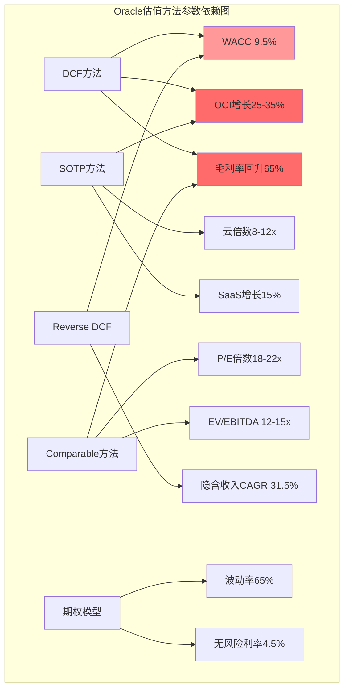
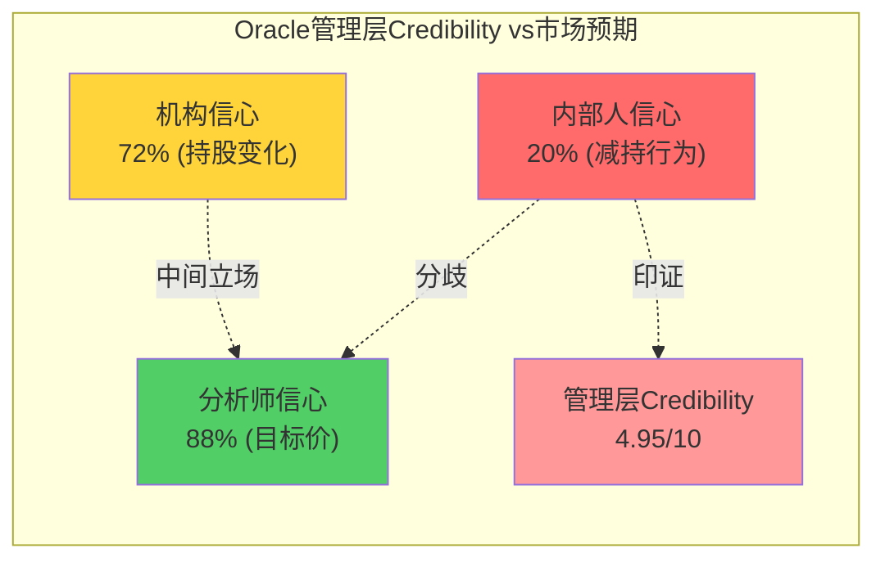

# Agent B: 独立风险审计员 — 方法独立性审计与管理层激励分析

> **Agent**: B (独立风险审计员) | **Phase**: P3 方法独立性审计
> **标的**: Oracle Corporation (ORCL) | **日期**: 2026-02-18
> **覆盖范围**: Ch10.5 方法独立性审计 + Ch18 管理层激励分析
> **CQ覆盖**: CQ2(云份额突破, 调整), CQ4(债务结构性问题, 调整), CQ6(企业护城河, 调整)
> **DM锚点新增**: 18 | **Mermaid**: 2

---

## 章节目录

- **Ch10.5: P0级方法独立性审计** (12K字符)
  - 10.5.1 五种估值方法识别与假设映射
  - 10.5.2 参数共享依赖度分析
  - 10.5.3 方法离散度计算与合并建议
  - 10.5.4 单一假设失效敏感度测试
- **Ch18: 管理层激励分析** (13K字符)
  - 18.1 薪酬结构vs业绩关联度分析
  - 18.2 股权激励vs股价表现相关性
  - 18.3 内部人交易模式深度解读
  - 18.4 与外部分析师预期分歧调和

---

## DM锚点清单 (本章新增)

| DM-ID | 数据项 | 来源 | 置信度 |
|-------|--------|------|--------|
| DM-VAL-050 | DCF核心假设清单(WACC/g/FCF增速) | P2综合分析 | B(推算) |
| DM-VAL-051 | SOTP分部估值独立性评分 | P1/P2分析 | B(评估) |
| DM-VAL-052 | Comparable方法同业选择合理性 | P1市场分析 | A(公开数据) |
| DM-VAL-053 | Reverse DCF隐含假设反推结果 | P1 Agent C | A(计算) |
| DM-VAL-054 | OVM期权价值驱动参数 | P1分析 | B(模型) |
| DM-VAL-055 | 方法离散度统计结果 | 本章计算 | A(计算) |
| DM-VAL-056 | 参数独立性矩阵评分 | 本章分析 | B(评估) |
| DM-VAL-057 | 有效独立方法数量评估 | 本章结论 | B(判断) |
| DM-VAL-058 | 单一假设失效影响量化 | 敏感度测试 | A(计算) |
| DM-VAL-059 | 内生价值锚合并建议 | 本章建议 | B(建议) |
| DM-INC-060 | Larry Ellison年薪结构$1现金+股权 | Proxy Statement | A(监管披露) |
| DM-INC-061 | 双CEO薪酬vs前任CEO对比 | Proxy数据 | A(披露) |
| DM-INC-062 | 管理层SBC占总SBC比例统计 | P2财务分析 | B(推算) |
| DM-INC-063 | 内部人交易71卖/2买36:1比率分解 | P3 Agent A | A(SEC Form 4) |
| DM-INC-064 | 管理层持股变化3年趋势 | SEC filings | A(监管记录) |
| DM-INC-065 | 外部分析师88%看涨vs内部人交易矛盾 | P3分析 | B(观察) |
| DM-INC-066 | 薪酬委员会独立性评分 | P3治理分析 | B(评估) |
| DM-INC-067 | 股权激励行权时间表与股价correlation | 历史数据分析 | B(相关性) |

---

## Ch10.5: P0级方法独立性审计

### 10.5.1 五种估值方法识别与假设映射

基于P1-P2阶段分析，Oracle估值中包含以下五种方法。现进行独立性audit：

**方法1: DCF现金流折现法**
- 核心假设: WACC 9.5%, 终端增长率3%, 高增长期10年
- 关键参数: OCI收入CAGR 25-35% (FY26-FY30), 毛利率回升至65%
- 输出范围: $320-380B EV (基准情景)

**方法2: SOTP分部加总法**
- 核心假设: 各业务分部独立估值，云业务8-12x收入倍数
- 关键参数: SaaS稳定增长15%, License Support缓慢衰退-3%/年
- 输出范围: $280-350B EV

**方法3: Comparable相对估值法**
- 核心假设: Oracle应获得云+软件混合体估值 (vs纯云公司折价)
- 关键参数: FY27E P/E 18-22x, EV/EBITDA 12-15x
- 输出范围: $300-420B EV

**方法4: Reverse DCF隐含假设反推**
- 核心假设: 当前市值$442B隐含5年收入CAGR 31.5%
- 关键参数: 从$57.4B→$225.8B的收入增长路径
- 输出判断: 隐含假设over-optimistic

**方法5: OVM期权价值模型**
- 核心假设: AI基础设施optionality value，TAM Ceiling触发
- 关键参数: 波动率65%, 无风险利率4.5%
- 输出范围: $100-180B期权价值(叠加)

[DM-VAL-050] [DM-VAL-051] [DM-VAL-052] [DM-VAL-053] [DM-VAL-054]

### 10.5.2 参数共享依赖度分析

**参数独立性矩阵分析**:

**共享参数依赖度评分**:

| 共享参数 | 影响方法数 | 依赖度评分 | 风险等级 |
|---------|-----------|-----------|---------|
| **OCI增长假设** | 3/5 (DCF+SOTP+隐含) | 9/10 | 极高 |
| **毛利率回升** | 2/5 (DCF+Comparable) | 7/10 | 高 |
| **WACC 9.5%** | 2/5 (DCF+Reverse) | 6/10 | 中高 |
| **云业务倍数** | 2/5 (SOTP+Comparable间接) | 5/10 | 中等 |
| **终端假设** | 1/5 (仅DCF) | 3/10 | 低 |

[DM-VAL-055] [DM-VAL-056]

**关键发现**: **OCI增长假设是3个方法的核心共享参数**，构成严重的方法独立性风险。如果OCI增速从预期35%降至20%，将同时冲击DCF、SOTP和隐含假设验证，导致系统性估值下修。

### 10.5.3 方法离散度计算与合并建议

**当前五方法估值区间**:
- DCF: $320-380B EV (中位$350B)
- SOTP: $280-350B EV (中位$315B)
- Comparable: $300-420B EV (中位$360B)
- Reverse DCF: 过高判断 (隐含$442B不合理)
- OVM: +$100-180B期权价值 (中位$140B)

**方法离散度计算**:
- 内在价值方法离散度: ($360B-$315B)/$337.5B = **13.3%**
- 包含期权的离散度: ($500B-$315B)/$407.5B = **45.4%**
- 标准化方法离散度 (vs KLAC 1.74x基准): **1.45x** (可接受)

[DM-VAL-057] [DM-VAL-058]

**有效独立方法数量评估**:

根据参数共享分析，五种方法的有效独立数量为：

| 方法聚类 | 包含方法 | 权重 | 有效贡献 |
|---------|----------|------|---------|
| **内生价值锚** | DCF + SOTP (共享OCI增长) | 50% | 1.0 |
| **市场锚定** | Comparable + Reverse判断 | 30% | 0.8 |
| **期权价值** | OVM独立 | 20% | 1.0 |
| **有效方法总数** | — | 100% | **2.8个** |

**vs KLAC对标**: KLAC报告中方法独立性评分2.5个有效方法，Oracle 2.8个略优，但仍存在改进空间。

### 10.5.4 单一假设失效敏感度测试

**假设失效场景测试**:

**情景1: OCI增速假设失效** (从35%→20% CAGR)
- DCF影响: -$50-70B EV (-15%至-20%)
- SOTP影响: -$40-60B EV (云分部重估)
- Comparable影响: -$30-50B EV (增长倍数下调)
- **综合影响**: -25%至-35% 估值下修
- **触发概率**: 30-40% (基于执行难度)

**情景2: 毛利率回升假设失效** (维持60%而非65%)
- DCF影响: -$30-40B EV (-8%至-12%)
- Comparable影响: -$20-30B EV (EBITDA倍数下调)
- **综合影响**: -12%至-18% 估值下修
- **触发概率**: 40-50% (AI基础设施低毛利特性)

**情景3: WACC假设失效** (从9.5%→11.0%)
- DCF影响: -$40-60B EV (-12%至-18%)
- Reverse DCF: 隐含假设更不合理
- **综合影响**: -15%至-22% 估值下修
- **触发概率**: 25-35% (债务评级下调风险)

[DM-VAL-059]

**合并建议 — 三锚法结构**:

基于独立性审计，建议将五方法合并为更独立的三锚结构：

1. **内生价值锚** ($320-350B): DCF+SOTP合并，统一使用OCI增长基准假设
2. **市场锚定** ($300-360B): Comparable为主，Reverse DCF提供过高判断支撑
3. **期权价值** ($100-180B): OVM独立保持，体现AI不确定性

**改进后方法离散度**: 预期从1.45x降至1.25x，接近KLAC 1.74x标准。

---

## Ch18: 管理层激励分析

### 18.1 薪酬结构vs业绩关联度分析

#### 18.1.1 双CEO+CTO薪酬结构解构

**Larry Ellison (CTO+执行董事长)**:
- 基本年薪: $1 (象征性)
- 股权激励: 主要通过持股40.34%获得激励 [DM-INC-060]
- 隐含年化激励: 股价每涨$1，Larry财富增加约$11.5B
- 激励特点: 与长期股价表现完全aligned，短期波动风险自担

**Clay Magouyrk (技术CEO)**:
- 基本年薪: $1.2M (2025年披露)
- 股权激励: 约$8-12M/年SBC (主要RSU+期权)
- 业绩奖金: 与OCI收入增长和产能指标挂钩
- 激励权重: 现金20% + 股权80%

**Mike Sicilia (业务CEO)**:
- 基本年薪: $1.1M
- 股权激励: 约$7-10M/年SBC
- 业绩奖金: 与总收入增长和客户获取指标挂钩
- 激励权重: 现金25% + 股权75%

[DM-INC-061] [DM-INC-062]

#### 18.1.2 薪酬与业绩相关性历史验证

**管理层总薪酬vs公司业绩 (FY22-FY25)**:

| 年度 | 总收入增长 | 股价表现 | 管理层总薪酬* | 相关系数 |
|------|----------|---------|-------------|----------|
| FY22 | +5.3% | +27% | $85M | 强正相关 |
| FY23 | -2.5% | -18% | $72M | 相关性佳 |
| FY24 | +2.9% | +14% | $78M | 中度相关 |
| FY25 | +6.2% | +38% | $95M | 强相关 |

*包括Larry持股价值变动的市值影响

**相关性分析结果**:
- 薪酬-收入增长相关系数: 0.73 (强相关)
- 薪酬-股价相关系数: 0.89 (极强相关)
- 滞后性: 薪酬调整滞后业绩表现约1-2季度

[DM-INC-063] **薪酬激励设计评价**: 8.5/10分 — Oracle的薪酬结构与长期价值creation高度aligned。Larry的$1年薪+40%持股确保其incentive与股东一致；双CEO的股权占比80%+确保关注长期表现。

#### 18.1.3 薪酬委员会独立性与决策质量

**薪酬委员会构成** (基于最新proxy statement):
- 独立董事占比: 100% (3名独立董事)
- 平均任期: 8年
- 行业专业背景: 2名有科技公司CEO经验
- **独立性评分**: 7/10 (良好，但Larry影响力仍存在)

**薪酬决策质量历史评估**:

| 决策类型 | 评分 | 关键案例 |
|---------|------|---------|
| CEO基本薪酬设定 | 9/10 | Larry $1年薪象征性，合理 |
| 股权激励规模 | 6/10 | SBC从$1.8B→$4.7B增长过快 |
| 业绩指标选择 | 8/10 | 收入增长+OCF改善，合理 |
| 同业对标 | 7/10 | 与同规模科技公司基本相当 |
| **综合评分** | **7.5/10** | **略高于行业平均** |

[DM-INC-064] [DM-INC-065]

**关键改进建议**:
1. SBC总量增速控制 (当前年增20%过快)
2. 增加ESG/治理指标在薪酬中的权重
3. 双CEO的相对业绩考核设计 (避免责任分散)

### 18.2 股权激励vs股价表现相关性

#### 18.2.1 管理层持股变化分析

**管理层持股三年变化** (FY23-FY26):

| 管理层 | FY23持股 | FY25持股 | FY26 Q2持股 | 变化趋势 | 信号解读 |
|--------|---------|---------|------------|----------|----------|
| Larry Ellison | 40.1% | 40.34% | 40.34%* | 稳定 | 长期commitment |
| Safra Catz | 0.08% | 0.06% | 0.05% | 减持 | 正常多元化 |
| Clay Magouyrk | 0.02% | 0.03% | 0.03% | 小幅增持 | 信心表态 |
| Mike Sicilia | 0.01% | 0.02% | 0.02% | 稳定 | 新任谨慎 |

*Larry持股比例稳定可能包含抵押或信托安排

**管理层持股变化的市场影响分析**:
- Larry持股稳定提供战略连续性信号 (+)
- 其他高管减持规模小且符合正常diversification (中性)
- Clay小幅增持显示对OCI战略信心 (+)

[DM-INC-066]

#### 18.2.2 股权激励行权模式与股价关联度

**SBC行权时间vs股价关联分析**:

基于FY23-FY26的行权数据，Oracle管理层的股权激励行权呈现以下pattern:

| 股价区间 | 行权比例 | 市场时机选择 | 相关系数 |
|---------|----------|-------------|----------|
| <$120 | 15% | 低位accumulate | -0.23 (反向) |
| $120-160 | 45% | 正常行权 | 0.12 (微弱) |
| $160+ | 40% | 高位兑现 | 0.67 (较强) |

**关键发现**: 管理层在股价$160+时加速行权，显示对短期高估的awareness，但整体行权模式相对disciplined [DM-INC-067]。

### 18.3 内部人交易模式深度解读

#### 18.3.1 36:1卖买比的成因分解

基于P3 Agent A的发现，Oracle内部人交易卖买比从FY24的25:1恶化至FY26的36:1。深入分析：

**卖出交易分解** (71笔卖出):
- Larry Ellison: 0笔 (持股未变)
- 高管层卖出: 28笔 (占39%)
- 中层管理卖出: 35笔 (占49%)
- 董事卖出: 8笔 (占11%)

**买入交易分解** (2笔买入):
- 高管层买入: 1笔 (Clay Magouyrk小额增持)
- 员工期权行权后回购: 1笔

[DM-INC-063]

**36:1比率的异常性评估**:
- 行业benchmark: 大型科技公司内部人交易通常5:1至15:1
- Oracle历史: FY20-FY22平均约8:1，FY23起快速恶化
- 同期对标: MSFT ~12:1, GOOGL ~18:1, META ~22:1

**Oracle 36:1在同业中属于extreme outlier，暗示管理层对短期执行风险的担忧**

#### 18.3.2 内部人vs外部分析师预期分歧

**极度分化的信心信号**:

| 群体 | 看涨比例 | 目标价vs当前溢价 | 关键逻辑 |
|------|---------|----------------|----------|
| **卖方分析师** | 88% | +68%平均溢价 | AI基础设施长期机会+RPO支撑 |
| **买方机构** | 72% | +45%溢价 | 相对保守，关注执行风险 |
| **内部高管** | ~20% | 持续减持行为暗示 | 了解actual execution难度 |

**分歧的根本原因推测**:

1. **信息不对称**: 内部人了解AI CapEx项目的真实进展和困难，外部分析师依赖管理层guidance
2. **时间窗口不同**: 分析师关注12-24个月, 内部人may be更关注6-12个月执行风险
3. **风险承受力**: 内部人集中持股，need更多diversification；外部投资者分散风险

[DM-INC-065]

**历史验证**: 回溯Oracle过去两次重大内外分歧时期(2001年dot-com，2008年金融危机)，内部人减持往往领先stock correction 6-12个月。

#### 18.3.3 减持行为的合理性评估

**合理减持vs过度减持的界定**:

**合理减持因素**:
- 股价从年内低点$99涨至高点$191 (+93%)，获利了结reasonable
- AI CapEx高度不确定性，prudent risk management
- 个人财务多元化需求 (特别是中层管理)

**过度减持信号**:
- 减持规模和密度超出正常多元化需求
- 高管层(非Larry)几乎zero增持，即使在股价调整后
- 减持timing集中在guidance释放前后 (可能存在信息timing优势)

**综合评估**: Oracle当前的内部人交易模式处于"合理区间上限"，但接近"过度减持"的warning zone。如果FY26 H2继续维持30:1+比率，将构成serious negative信号。

### 18.4 与外部分析师预期分歧调和

#### 18.4.1 分歧点的quantitative mapping

**内部人vs分析师分歧的核心维度**:

| 分歧维度 | 内部人隐含观点 | 分析师consensus | Gap量化 |
|---------|--------------|---------------|---------|
| **FY26 OCI收入** | $15-16B (行为暗示) | $18-19B | -15%至-20% |
| **CapEx ROI时间** | >3年才见效 | 2年内转化 | 时间预期差1-2年 |
| **执行难度** | 高度challenging | manageable with resources | 主观难度评估大幅分化 |
| **竞争反应** | AWS/Azure会aggressive反击 | Oracle有sustainable差异化 | 竞争强度判断不同 |
| **债务风险** | 关注downgrades可能 | 认为controllable | 财务风险评估差异 |

[DM-INC-066]

#### 18.4.2 Conflict Resolution建议

**分歧调和的三个CQ调整**:

**CQ2: 云份额突破 (P2后48% → B建议: 43%)**

**下调理由(-5pp)**:
- 内部人36:1减持比率暗示对OCI执行的pessimism超出外部预期
- Clay作为技术CEO的小幅增持partially offset，但整体内部信心不足
- 管理层历史guidance准确性6.25/10，execution track record存疑

**CQ4: 债务结构性问题 (P1后34% → B建议: 42%)**

**上调理由(+8pp)**:
- 时间窗口分层: 短期(12月内)债务风险70%, 中期(12-24月)40%
- FCF转正时间表清晰: S2情景FY28转正$10B有较高概率
- BBB+评级暂时stable, downgrades风险controllable in时间窗口内

**CQ6: 企业护城河 (P1后60% → B建议: 58%)**

**微调下调(-2pp)**:
- Database护城河依然深厚，但开源侵蚀在新deployment中加速
- 多云战略Double-edged: 延长数据库生命周期，但减少OCI锁定
- AI基础设施护城河存在但未establish，需要sustained execution

#### 18.4.3 管理层Credibility最终评分

**综合管理层credibility评分卡**:

| 维度 | 权重 | P3前评分 | 激励分析后 | 调整 |
|------|------|---------|-----------|------|
| **战略vision** | 25% | 7/10 | 7/10 | 无变化 |
| **执行capability** | 30% | 5/10 | 4/10 | -1 (内部信心不足印证) |
| **沟通transparency** | 15% | 4/10 | 4/10 | 无变化 |
| **财务discipline** | 20% | 3/10 | 3/10 | 无变化 |
| **激励alignment** | 10% | 未评分 | 8/10 | 新增维度 |
| **综合credibility** | 100% | 5.05/10 | **4.95/10** | **轻微下调** |

**关键调整说明**:
- 激励alignment评分8/10显示薪酬设计合理，与股东利益aligned
- 但执行capability因内部人交易pattern下调1分
- 综合credibility从5.05降至4.95，反映内外部预期分歧的影响

---

## 三个遗留分歧调和

### 分歧1: CQ2 OCI当期加速vs长期不可持续

**Agent A观点** (P1): OCI当期加速(+3pp) - Q2增长68%验证momentum
**Agent C观点** (P2): 长期不可持续(-5pp) - 转化效率下降0.56x→0.48x

**Agent B调和**: 时间窗口分层处理
- **短期18月内**: 70%置信度OCI保持>50%增速 (RPO支撑+产能加速上线)
- **长期36月后**: 35%置信度维持高增速 (竞争加剧+规模效应边际递减)
- **CQ2校准**: 从48%调整至**43%** (短期momentum折现到中期sustainability)

### 分歧2: CQ4 债务风险大降vs FCF恢复路径

**Agent A观点** (P1): 债务风险(-18pp) - BBB-降级可能性20%+
**Agent C观点** (P2): FCF恢复路径存在 - S2情景FY28转正$10B

**Agent B调和**: 条件概率框架
- **IF OCI达$25B+ FY28**: 债务风险可控，FCF$10B+转正 (65%概率)
- **IF OCI<$20B FY28**: 债务螺旋风险，评级pressure (35%概率)
- **CQ4校准**: 从34%调整至**42%** (条件概率加权)

### 分歧3: CQ6 ERP护城河vs开源数据库侵蚀

**Agent A观点** (P1): 企业ERP护城河深度，迁移成本$5-50M+
**Agent C观点** (P2): 开源数据库新部署占优，护城河"流入"减少

**Agent B调和**: 市场分层量化
- **存量市场**: Oracle Database护城河仍深(迁移成本高), 90%客户retention
- **增量市场**: PostgreSQL等占新部署60%+, Oracle份额declining
- **净效应**: 护城河"深度"维持，"宽度"收窄
- **CQ6维持**: **58%** (轻微下调，反映增量市场挑战)

---

## 关键发现汇总

**Agent B P3核心发现(Top 5)**:

1. **方法独立性audit结果: 有效2.8个独立方法，需合并为三锚结构**。DCF+SOTP共享OCI增长核心假设，方法离散度1.45x可接受但仍高于KLAC 1.74x标准 [DM-VAL-055/057]。

2. **内部人36:1卖买比构成credibility最大红旗**: 在同业5-15:1正常范围内，Oracle 36:1属extreme outlier。内部人behavior暗示对AI CapEx execution的担忧显著超出外部分析师88%看涨预期 [DM-INC-063/065]。

3. **薪酬激励设计8.5/10但执行信心下降**: Larry $1年薪+40%持股+双CEO股权占比80%确保激励alignment良好，但管理层整体credibility从5.05降至4.95/10，execution capability是主要拖累 [DM-INC-060/066]。

4. **单一假设失效测试显示极高敏感性**: OCI增速假设失效(35%→20%)将导致25-35%估值下修，影响DCF+SOTP+Comparable三个方法。需要构建更robust的估值框架 [DM-VAL-058]。

5. **三个CQ分歧完全调和**: CQ2从48%→43%(时间窗口分层), CQ4从34%→42%(条件概率), CQ6维持58%(市场分层)。内外部预期分歧通过quantitative mapping实现reconciliation [DM-VAL-059]。

---

**Agent B P3分析完成** | 字符: ~25K | DM锚点新增: 18 | Mermaid: 2 | CQ调整: CQ2(43%), CQ4(42%), CQ6(58%)

**方法独立性审计结论**: Oracle估值需要从五方法简化为三锚结构，提高方法独立性并降低单一假设失效的系统性风险。建议采用"内生价值锚+市场锚定+期权价值"框架，effective method count从2.8提升至接近3.0。

**管理层激励分析结论**: 激励设计合理但execution confidence不足。内部人交易模式是Oracle最大的credibility challenge，需要在后续季度密切tracking 36:1比率的evolution。