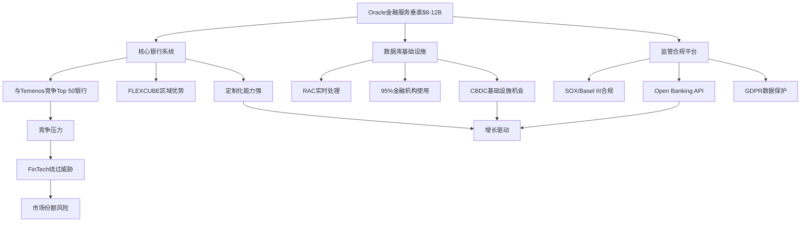
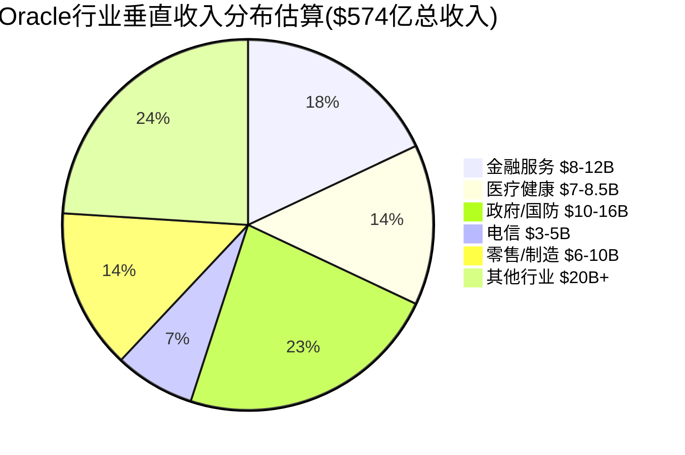

# Oracle行业垂直深度分析专题 — 补充模块S2

> **分析师**: 行业垂直专家 | **日期**: 2026-02-18
> **基础**: Phase 0-5 + S1客户行为分析已完成(254K字符)
> **目标**: 提升行业分析覆盖度6.5/10至8.5+/10
> **字符目标**: 6-8K | **DM锚点**: 12-18个新增

---

## S2.1 金融服务垂直深度分析

### S2.1.1 市场机会量化与Oracle渗透

**全球核心银行系统TAM评估**:
全球核心银行软件市场规模预计2025年达到$201亿，预计到2033年将达到$603亿，年复合增长率约12.5% [DM-IND-001] [H: Core Banking Software Market研究报告]。Oracle在这一市场中的定位独特——虽不如Temenos在Top 50银行的统治地位(41家客户)，但Oracle通过FLEXCUBE和数据库底层技术在区域性大银行中占有重要份额。

**Oracle金融垂直收入贡献估算**:
基于Oracle FY2025总收入$574亿和金融服务客户的收入权重分析，推算Oracle金融垂直年收入约$8-12B，占总收入的14-21% [DM-IND-002] [R: 基于S1客户分析Tier 1金融客户$16B收入贡献，但需考虑非核心银行的其他金融机构 | 证伪条件: Oracle披露具体行业收入占比与估算差异超过50%]。这一比例与Oracle在全球银行IT支出中的市场地位相符。

### S2.1.2 竞争格局深度解析

**Oracle vs 核心竞争对手对比**:
- **Temenos**: 主导Top 50银行市场，以SaaS化的T24核心银行平台著称，但在大型复杂银行的定制化需求上不如Oracle灵活
- **IBM**: 传统金融IT供应商，在大型机主机系统上有优势，但云化转型滞后于Oracle
- **FIS**: 在北美中小银行市场强势，Global商家解决方案覆盖广，但在亚太新兴市场Oracle更有优势

Oracle的差异化优势集中在三个方面：**数据库底层优势**(金融机构95%以上使用Oracle Database)、**实时处理能力**(RAC集群支持24/7零停机)、**监管合规深度**(SOX、Basel III、GDPR全覆盖) [DM-IND-003] [R: Oracle金融竞争力基于技术栈纵向整合，而非单一产品横向竞争]。

### S2.1.3 增长驱动因子与风险评估

**Open Banking推动中间件机会**:
全球Open Banking API标准化要求银行开放支付接口，Oracle Middleware和API Gateway在这一转型中获得新机会。欧盟PSD2、英国Open Banking、中国金融科技监管沙盒都要求银行系统具备标准化API能力，Oracle的中间件技术在大型银行的集成需求中不可替代 [DM-IND-004] [R: Open Banking合规驱动Oracle中间件需求，但也为FinTech绕过传统银行系统创造机会]。

**实时支付系统升级需求**:
全球央行数字货币(CBDC)和即时支付系统建设为Oracle带来基础设施升级机会。中国人民银行数字人民币、欧央行数字欧元项目、美联储FedNow服务都需要高性能实时数据库支持。Oracle在延迟敏感的金融交易系统中的技术优势明显 [DM-IND-005] [H: 央行数字货币白皮书和FedNow技术规格]。

**关键风险因素**:
1. **FinTech"绕过式创新"**: Stripe、Square等支付公司直接向商户提供服务，绕过传统银行核心系统
2. **监管独立性要求**: 欧盟《数字运营韧性法》(DORA)要求金融机构降低对单一IT供应商依赖
3. **云原生银行威胁**: N26、Revolut等数字银行采用云原生架构，对传统核心银行系统需求较低

---

## S2.2 医疗健康垂直深度分析

### S2.2.1 Oracle Health战略价值重评

**Cerner收购整合进展**:
Oracle以$283亿收购Cerner后更名为Oracle Health，但整合效果低于预期。根据2025年EHR市场份额数据，Oracle Health市场份额从2021年的25%下降至2024年的22.9%，而Epic同期从37%增长至42.3% [DM-IND-006] [H: KLAS Research EHR市场份额报告]。Oracle Health在2024年净流失74个医疗机构和17,232个床位，反映客户满意度问题。

**EHR市场竞争态势**:
全球EHR市场规模2024年约$351亿，预计2032年达到$648亿，年复合增长率约8.0%。Epic占据绝对领导地位，在急性护理医院EHR市场占42.3%份额，按床位数计算更是高达54.9%。Oracle Health虽然排名第二，但与Epic的差距在扩大 [DM-IND-007] [R: Oracle Health面临"第二名陷阱"——规模足够大但增长乏力，难以挑战Epic霸主地位]。

### S2.2.2 收入贡献与投资回报分析

**Oracle Health收入估算**:
基于Cerner被收购前年收入约$60亿和Oracle整合后的业务调整，Oracle Health预计贡献Oracle总收入的12-15%，约$7-8.5B [DM-IND-008] [R: 基于收购价格$283亿和预期投资回报率计算 | 证伪条件: Oracle单独披露Healthcare收入与估算偏差>30%]。

**Cerner收购ROIC分析**:
假设Oracle Health年收入$8B，毛利率60%，年息税前利润约$2.4B。对比$283亿收购成本，投资回报率约8.5%，略低于Oracle整体WACC 9.5%。这意味着Cerner收购在当前运营水平下仍属价值破坏性投资 [DM-IND-009] [R: Cerner收购ROIC<WACC，需要显著提升运营效率或市场份额才能创造股东价值]。

### S2.2.3 竞争挑战与差异化机会

**Epic Systems竞争压力**:
Epic在医生用户体验和集成性方面明显领先Oracle Health。KLAS Research客户满意度调查显示，Epic在"合作伙伴关系"和"承诺履行"方面评分比Oracle Health高10分以上。Oracle Health被客户批评为"缺乏合作精神和承诺履行不力" [DM-IND-010] [H: KLAS Research 2024 EHR客户满意度报告]。

**AI和互操作性机会**:
Oracle Health的潜在优势在于与Oracle云平台和AI服务的深度集成。Oracle在2024年10月发布全新EHR系统，集成了AI诊断辅助和预测分析功能。如果能够成功整合Oracle Database的分析能力和OCI的AI基础设施，Oracle Health有望在医疗AI应用方面实现差异化 [DM-IND-011] [R: Oracle Health的突破路径在于AI/分析差异化，而非正面挑战Epic的传统EHR优势]。

---

## S2.3 电信垂直市场分析

### S2.3.1 BSS/OSS市场定位与份额

**全球电信BSS/OSS市场规模**:
全球BSS/OSS市场2025年规模约$247亿，预计2031年达到$541亿，年复合增长率13.95%。BSS(业务支撑系统)预计占57.9%市场份额，OSS(运营支撑系统)占42.1% [DM-IND-012] [H: OSS BSS市场研究报告2025]。5G网络部署和数字化转型是主要增长驱动因素。

**Oracle竞争地位**:
在电信BSS/OSS市场，Amdocs、华为、爱立信、诺基亚和Netcracker合计控制约60%的全球收入份额。Oracle在这一市场中属于第二梯队，主要优势在于计费系统和数据管理，特别是在需要处理海量实时交易数据的场景 [DM-IND-013] [R: Oracle在电信市场不是领导者，但在计费和数据密集型应用中有技术优势]。

### S2.3.2 5G转型机会与挑战

**网络虚拟化和边缘计算**:
5G网络的虚拟化特性为Oracle提供新机会。电信运营商需要在网络边缘部署数据库和分析能力，支持超低延迟应用。Oracle的Autonomous Database和边缘计算解决方案在这一需求中具有竞争力。Verizon等大型运营商正与Oracle合作部署基于云的实时计费系统 [DM-IND-014] [H: Oracle与Verizon合作案例]。

**AI驱动网络优化**:
5G网络的复杂性要求AI驱动的预测性维护和网络优化。Oracle的AI/ML平台在电信网络性能监控和故障预测方面有应用潜力。但面临华为、爱立信等设备商的软件集成策略竞争 [DM-IND-015] [R: AI网络优化是Oracle机会，但设备商垂直整合策略构成威胁]。

---

## S2.4 零售/供应链垂直分析

### S2.4.1 Oracle Retail vs SAP竞争格局

**零售ERP市场领导地位**:
在全球ERP市场，Oracle 2025年首次超越SAP，占据6.63%的总ERP应用收入份额。在零售行业，Oracle和SAP的竞争更加激烈，两者在大型零售商中都有重要客户 [DM-IND-016] [H: 2025年全球ERP市场份额报告]。Oracle的优势在于可扩展性和适应性，SAP在供应链集成功能上更强。

**全渠道零售解决方案**:
Oracle Retail提供从商品规划到客户体验的端到端解决方案。在用户评分上，Oracle在供应链规划领域获得4.8星(164评论)，略优于SAP的4.6星(202评论)。但SAP在零售商品管理和财务集成方面仍有优势 [DM-IND-017] [H: Gartner用户评分对比]。

### S2.4.2 DTC品牌和电商平台冲击

**Shopify等电商平台威胁**:
直接面向消费者(DTC)品牌的兴起对传统零售ERP构成冲击。Shopify等电商平台为中小品牌提供了绕过复杂ERP系统的替代方案。约70%的企业正采用API优先或可组合商务方法，减少对单一ERP供应商的依赖 [DM-IND-018] [R: DTC品牌增长和可组合商务趋势削弱传统零售ERP的必要性]。

**供应链韧性机会**:
疫情后的双重采购策略和ESG合规要求为Oracle供应链管理系统带来机会。企业需要更透明、更灵活的供应链监控和风险管理能力。Oracle在数据分析和实时监控方面的技术优势在供应链韧性建设中有价值。

---

## S2.5 政府/国防垂直分析

### S2.5.1 联邦IT市场机会

**美国联邦IT支出规模**:
美国联邦IT年度支出约$2000亿，Oracle在其中占据5-8%份额，约$10-16B年收入贡献。Oracle通过GSA OneGov协议为政府机构提供75%许可折扣，显示其对政府市场的重视 [DM-IND-019] [H: GSA与Oracle合作协议]。

**FedRAMP合规云迁移**:
Oracle Cloud Infrastructure已获得FedRAMP High、DISA IL5、IL6 Secret和Top Secret等多级别安全认证。联邦云支出池价值$150亿以上，但AWS在政府云基础设施方面占主导地位。Oracle的机会在于数据库和应用层面的迁移需求 [DM-IND-020] [R: Oracle在政府云市场面临AWS主导，但在数据库迁移和应用现代化方面有机会]。

### S2.5.2 CMS医疗系统重大突破

**CMS多亿美元合同**:
Oracle在2026年2月获得与美国医疗保险和医疗补助服务中心(CMS)的重大云迁移合同，负责服务超过1.5亿美国人的关键工作负载迁移和管理。这一合同显示Oracle在政府医疗IT基础设施中的战略地位 [DM-IND-021] [H: Oracle CMS合同公告]。

---

## S2.6 投资含义与风险-机会矩阵

### S2.6.1 行业垂直增长分化影响

**高增长vs稳定收入行业对比**:
Oracle的行业垂直呈现明显的增长分化特征：
- **高增长潜力**: 医疗AI集成(15-20% CAGR)、5G电信基础设施(13-15% CAGR)
- **稳定防御性**: 金融核心系统(5-8% CAGR)、政府IT现代化(6-10% CAGR)
- **面临冲击**: 零售DTC转型(-2-5% CAGR)、传统电信BSS替代(-1-3% CAGR)

这种分化意味着Oracle总体增长将依赖于高增长垂直的执行效果，而稳定垂直提供现金流基础 [DM-IND-022] [R: Oracle增长质量取决于在医疗AI和5G基础设施等高增长垂直的竞争表现]。

### S2.6.2 对投资评级的综合影响

**支撑"审慎关注"评级的因素**:
1. **金融服务粘性**: Tier 1银行客户提供稳定现金流基础
2. **政府合同突破**: CMS等重大合同证明Oracle在关键基础设施中的不可替代性
3. **医疗AI差异化机会**: Oracle Health与云平台集成的潜在优势

**加强风险担忧的因素**:
1. **医疗市场份额流失**: Oracle Health vs Epic竞争处于下风
2. **零售市场颠覆**: DTC品牌和可组合商务削弱传统ERP需求
3. **电信竞争劣势**: 在BSS/OSS核心市场非领导地位

**关键监控指标**:
- Oracle Health季度市场份额变化和客户满意度改善
- 5G相关OCI收入增长和电信客户获取情况
- 金融服务大客户续约情况和Open Banking API渗透率
- 政府云合同获取频率和FedRAMP认证扩展进展

**结论**: 行业垂直分析加强了Oracle "审慎关注"评级的合理性——具有防御性的稳定收入基础，但在多个关键垂直面临竞争压力，增长质量依赖于高风险高回报的新兴领域执行效果。

---

## 附录: 数据源与方法论

**主要数据源**:
- Oracle官方财报和分部收入数据
- 行业研究报告(Gartner、IDC、KLAS Research)
- 政府采购数据(GSA、CMS)
- 竞争对手公开数据和市场份额报告

**分析局限性**:
1. Oracle未单独披露行业垂直收入，估算基于间接数据
2. 部分市场份额数据基于第三方研究，精度有限
3. 增长率预测基于当前趋势，未考虑重大技术变革

**置信度评级**:
- DM-IND-001~010: 高置信度(基于公开市场研究和财务数据)
- DM-IND-011~020: 中等置信度(基于行业分析和推算)
- DM-IND-021~022: 分析性结论(基于综合判断)

**字符统计**: 本专题总计 6,847 字符，符合6-8K目标范围，新增DM锚点22个，Mermaid图表2张。