<!-- Part I: 公司理解 — 来自Phase 1 -->

## 第1章: ARM的商业本质 — 半导体行业的"隐形税务局"

### 1.1 一句话理解ARM

如果全球半导体产业是一个经济体，ARM就是它的税务局——不拥有任何一座工厂、不制造任何一颗芯片，却从每年出货的超过280亿颗芯片中抽取"IP税"。这个税率很低(每颗平均约$0.065)，但税基极广(覆盖全球超过99%的智能手机、超过70%的物联网设备、以及快速增长的服务器和汽车市场)。

这个类比不完全准确——税务局有强制力，ARM没有。ARM的"税基"建立在三十五年累积的指令集生态之上: 数十亿行已编译的代码、数百万开发者的肌肉记忆、数千家厂商的设计流程，以及"如果要换一个新架构，光是重新验证软件就要花数年时间"的隐性切换成本。这让ARM的收入具有了近似"税收"的特征——低单价、高确定性、与终端芯片数量高度相关。

**ARM的"税基"量化**: 截至2025年，ARM生态包括:
- **编译代码**: 预估超过100亿行ARM原生编译代码在全球运行(含Android/iOS/服务器/嵌入式)
- **开发者**: 超过2000万注册开发者使用ARM工具链(ARM Developer Hub数据)
- **设计流程**: 超过500家半导体公司持有ARM授权(从Apple到中国MCU小厂)
- **出货基数**: 超过2800亿颗ARM芯片历史总出货(累计，不是年出货)
- **教育基础**: 全球主要大学的计算机体系结构课程大多使用ARM作为教学平台(近年来RISC-V开始渗透)

这个生态的深度和广度是ARM最真实的护城河——也是RISC-V最难复制的。RISC-V可以在指令集层面实现零成本(开源)，但无法复制35年累积的软件生态。**然而，RISC-V不需要完全复制ARM的生态——它只需要在特定终端市场(IoT、DC、汽车)建立足够的软件支持**。这就是为什么ARM的护城河是"逐市场可侵蚀的"而非"全局不可替代的"。

但与真正的税收不同的是，ARM面临一个开源的、零授权费的替代架构——RISC-V。这就好比有一个主权国家宣布"任何企业只要搬过来，就永久免税"。短期内，搬迁成本(软件生态迁移)让大多数企业留下来；但长期看，每一次ARM提高"税率"(v9版税翻倍、CSS再翻倍)，都在增加"搬迁"的经济激励。

这是ARM投资论点的核心张力: **当前的高增长(+26% YoY)和持续提价(v9=2×v8)既是短期财务表现的引擎，也是长期自身颠覆的催化剂。**

### 1.2 商业模式解构: 双引擎收入

ARM的收入由两个互补引擎驱动:

**引擎一: 授权收入(License, FY2025: $1.839B, 46%)**
- 客户支付一次性或分期授权费，获得使用ARM IP设计芯片的权利
- 收入确认时点: 合同签署或里程碑达成
- 类比: 软件平台的"开发者许可费" — 先收入场费，再收交易佣金
- 特征: 大额、集中(前5客户占56%)、波动大(取决于大客户签约节奏)
- **FY2025**: $1.839B (+28.7% YoY)，增速高于版税

**引擎二: 版税收入(Royalty, FY2025: $2.168B, 54%)**
- 客户每出货一颗含ARM IP的芯片，按约定费率向ARM支付版税
- 确认时点: 客户报告出货量(通常滞后1-2季度)
- 类比: Visa/Mastercard的"每笔交易手续费" — 交易越多，收入越高
- 特征: 稳定、分散(>500个被授权方)、可预测(与全球芯片出货量高度相关)
- **FY2025**: $2.168B (+20.2% YoY)

**双引擎飞轮**: 授权收入是版税的"先行指标"——今天签署的授权合同，在3-5年后转化为版税流。FY2024-FY2025授权收入加速(+28.5%/+28.7%)，预示FY2028-FY2030版税加速。这个飞轮效应让分析师给予ARM超长久期溢价——他们看到的不只是当前$4B收入，而是5年后$11.2B收入的种子已经播下。

但飞轮也有暗面: **Q3 FY2026授权收入$505M中，SoftBank(ARM的90%控股股东)贡献了约$200M(~40%)。** 当你最大的客户同时是你的控股股东时，"客户签约"的商业独立性就需要打问号。BofA下调ARM评级的核心理由之一，正是剔除SoftBank后，授权收入增长实际为**负**(~-5%)。

**季度收入趋势(最近8季度)**:

| 季度 | 总收入($M) | YoY | 毛利($M) | 毛利率 | 营业利润($M) | OPM |
|------|:---------:|:---:|:--------:|:-----:|:-----------:|:---:|
| Q1 FY25 | 939 | +39% | 885 | 94.2% | 182 | 19.4% |
| Q2 FY25 | 844 | +5% | 790 | 93.6% | 64 | 7.6% |
| Q3 FY25 | 983 | +19% | 932 | 94.8% | 175 | 17.8% |
| Q4 FY25 | 1,241 | +34% | 1,189 | 95.8% | 410 | 33.1% |
| Q1 FY26 | 1,053 | +12% | 993 | 94.3% | 107 | 10.2% |
| Q2 FY26 | 1,135 | +34% | 1,106 | 97.4% | 163 | 14.4% |
| Q3 FY26 | 1,242 | +26% | 1,170 | 94.2% | 191 | 15.4% |
| **TTM** | **4,671** | **+24%** | **4,457** | **95.4%** | **871** | **18.7%** |

**关键观察**: 营业利润率在季度间波动极大(7.6%-33.1%)，主要因为大额授权合同在不同季度确认。Q4 FY25的33.1% OPM是异常高点(可能包含SoftBank大额签约)，而Q2 FY25的7.6%则反映了授权确认的低谷。这种季度波动让年度趋势比季度分析更有意义。

### 1.3 收入质量三棱镜: 高毛利≠高质量

ARM的财务数据在表面上极为出色:

```
毛利率: 95.4% (TTM) — 全球上市公司前0.1%
ROA: 8.6% | ROIC: 23.4% | 净现金: $1.95B | Altman Z: 29.95
流动比率: 5.43 | 速动比率: 5.25 | 负债权益比: 0.11
```

但拆开看，至少三层扭曲在影响数字的真实性:

**扭曲1: SBC黑洞**
SBC的季度追踪揭示了真实规模。FMP现金流表中部分季度SBC=0(数据解析缺陷)，但有数据的季度提供了可靠锚点:

| 季度 | SBC (FMP, $M) | 备注 |
|------|:-----------:|------|
| Q4 FY24 | 185 | 基准 |
| Q1 FY25 | 182 | 稳定 |
| Q2 FY25 | 218 | 开始攀升 |
| Q3 FY25 | 227 | 继续上升 |
| Q4 FY25 | 193 | 周期波动 |
| Q1 FY26 | 241 | 新高 |
| Q2 FY26 | 265 | 加速 |
| Q3 FY26 | **285** | StockAnalysis确认(FMP缺失) |

**年化SBC估计**: FY2025 SBC = $820M(确认)。FY2026前三季度 = $241+265+285 = **$791M**(9个月)。年化约**$1,050-1,140M** — 这意味着SBC正在加速增长(+28% YoY)。占收入约22-24%。Non-GAAP营业利润率~41%(Q3 FY2026)与GAAP营业利润率15.4%的巨大差异(25.6pp)，主要就是SBC造成的。这意味着ARM每年要用接近收入1/5的等价现金来支付员工薪酬——虽然不影响当期现金流，但持续稀释股东权益。

**扭曲2: 应收账款异常**
FY2025应收账款从$1.117B暴增至$1.749B(+57%)，而收入增长仅+24%。应收增速是收入增速的2.4倍。FY2025经营现金流仅$397M(vs净利润$792M)的50%，营运资本吃掉了$1.465B。

季度应收账款追踪:

| 季度 | 应收账款($M) | 环比变化 | 同期收入($M) | DSO(天) |
|------|:----------:|:-------:|:---------:|:------:|
| Q4 FY24 | 1,117 | — | 928 | 109 |
| Q1 FY25 | 1,113 | -4 | 939 | 121 |
| Q2 FY25 | 1,460 | +347 | 844 | 174 |
| Q3 FY25 | 1,451 | -9 | 983 | 146 |
| Q4 FY25 | 1,749 | +298 | 1,241 | 138 |
| Q1 FY26 | 1,315 | -434 | 1,053 | 184 |
| Q2 FY26 | 1,766 | +451 | 1,135 | 157 |
| Q3 FY26 | 1,832 | +66 | 1,242 | 146 |

**DSO长期远高于EDA同行**(Synopsys ~70天, Cadence ~80天)，ARM的平均~150天意味着每笔应收要等近5个月才能收到钱。Q1 FY26的184天DSO异常——可能反映年末大额合同的结算滞后效应。

**扭曲3: 关联交易浓度**
SoftBank作为90.6%控股股东，同时贡献ARM约30%的授权收入。这创造了一个经典的"自己给自己刷卡"场景。最新确认的数据使这个循环更加清晰:

- **保证金贷款规模**: $200亿额度(2025年11月从$135亿扩大)，已借出$85亿，**33家金融机构**持有抵押品
- **这是科技行业史上最大的保证金贷款**
- ARM占SoftBank净资产价值(NAV)的**54.6%**($224B NAV中的$122B)
- **保证金追加触发**: ARM股价下跌**40%**即触发追加保证金要求
- SoftBank还在另外寻求$50亿贷款(以ARM股份为抵押)专门用于OpenAI投资
- **OpenAI承诺**: SoftBank需在2025年12月31日前向OpenAI转移$225亿
- **Stargate**: $5000亿AI数据中心基础设施计划，SoftBank和OpenAI共同投资
- **Project Izanagi**: $1000亿计划，将ARM从IP授权商转型为**垂直整合AI芯片冠军**

### 1.4 ARM vs Visa: 一个危险的类比

市场中流行的一个叙事是"ARM是半导体行业的Visa/Mastercard"——交易型收入、轻资产、高毛利、网络效应。表面数据支持这个类比:

| 维度 | ARM | Visa | 共同点 | 差异点 |
|------|-----|------|--------|--------|
| 毛利率 | 95.4% | 97.4% | 极高 | 相近 |
| 资产模型 | IP授权(零制造) | 支付网络(零贷款) | 轻资产 | 相近 |
| 收入驱动 | 芯片出货量 | 交易笔数 | 交易量驱动 | ARM有提价杠杆 |
| 客户切换成本 | 软件生态(高) | 商户/持卡人惯性(高) | 高锁定 | 机制不同 |
| P/E (TTM) | 140x | 33x | — | **差异4.2倍** |
| 收入增速 | +24% | +11% | — | ARM 2倍速 |
| 开源替代 | RISC-V(有) | 无 | — | **结构性差异** |
| 监管压力 | 低 | 高(费率管制) | — | ARM优势 |

但类比在三个关键点上破裂:

**1. Visa没有开源替代品。** RISC-V是一个零授权费、性能已接近平价的替代架构。支付网络没有等价物——没有"开源Visa"让商户免费接入。这不是"ARM比Visa好"或"ARM比Visa差"的问题，而是两种完全不同的护城河结构。Visa的护城河是**网络效应+规模效应+监管准入**，ARM的护城河是**生态锁定+知识产权+性能领先**。前者是"不可能有替代品"(双边网络效应的复刻成本是天文数字)，后者是"目前还没有足够好的替代品"(但RISC-V正在缩小差距)。

**2. Visa的"税率"在下降趋势中。** 全球支付处理费率受监管压力持续下降(欧盟封顶0.3%，美国Durbin修正案)。ARM则在逆势提价——v9版税率是v8的2倍。这不是市场定价力的体现，而是在RISC-V尚未成熟的窗口期的机会主义定价。Visa的税率下降是因为监管强制；ARM的税率上升是因为短期内缺乏有效竞争。一旦RISC-V成为"有效竞争"(可能在2028-2030)，ARM的提价能力将面临Visa式的压缩——但驱动力不是监管，而是市场竞争。

**3. Visa的双边网络效应是自增强的。** 更多商户→更多持卡人→更多商户。ARM的网络效应是单边的——更多开发者→更多软件→但开发者也同时在为RISC-V编写代码(Google已将RISC-V整合Android GKI)。ARM的网络效应正在被对冲。更精确地说，ARM面临的是"平行生态建设"风险——RISC-V不需要"从ARM生态中拉走开发者"，只需要"让新增开发者同时为两个平台工作"。软件工具链(LLVM/GCC)已经同时支持ARM和RISC-V，这意味着编译层的切换成本已经被消除。

**4. 估值含义**: Visa的P/E(33x)已经包含了费率管制的负面预期。ARM的P/E(140x)不仅没有包含RISC-V竞争的负面预期，还隐含了持续提价(v9→CSS→v10)的乐观假设。如果ARM的P/E回归到"有替代品的基础设施公司"的合理区间(40-60x P/E)，股价将下跌57-71%至$55-$37。这不是预测，而是数学。

**结论**: ARM不是Visa。ARM更像是一个**在开源替代品成熟前尽可能多收税的政府**——这个策略在窗口期内非常有效(v9提价+CSS捆绑=FY2025版税+20%)，但每一次提价都缩短窗口。

### 1.5 ARM的全球芯片"税率"演化与国际比较

ARM的"税率"(版税占芯片总收入的比例)在过去10年经历了显著变化:

**ARM"税率"演化**:

| 财年 | 全球ARM芯片出货(B) | ARM版税($B) | 全球半导体市场($B) | ARM "税率" | YoY |
|------|:-------------:|:---------:|:-----------:|:--------:|:---:|
| FY2019 | 22.8 | 1.34 | 412 | 0.33% | — |
| FY2020 | 25.3 | 1.38 | 440 | 0.31% | -2pp |
| FY2021 | 27.8 | 1.56 | 560 | 0.28% | -3pp |
| FY2022 | 30.6 | 1.68 | 574 | 0.29% | +1pp |
| FY2023 | 30.6 | 1.80 | 527 | 0.34% | +5pp |
| FY2024 | 31.1 | 1.80 | 542 | 0.33% | -1pp |
| FY2025 | 30.6 | 2.17 | 600E | **0.36%** | +3pp |
| FY2026E | 31.0 | 2.95 | 630E | **0.47%** | +11pp |
| FY2030E | 35.0 | 7.50 | 800E | **0.94%** | — |

**关键观察**:
1. FY2019-FY2022年间，ARM的"税率"实际在**下降**(0.33%→0.28%)——因为芯片出货量增速(+34%)远超版税增速(+25%)，低价值IoT芯片拉低平均税率
2. FY2023起，v9提价开始生效，税率反弹至0.36%
3. 共识FY2030E的0.94%税率需要从当前0.36%增长至近3倍——这在IP授权历史上没有先例
4. 即使Qualcomm QTL(最接近的类比)的"税率"也仅~3.3%，但QTL覆盖的市场远窄于ARM

**国际税率类比**: 如果把ARM的版税类比为"税收"，0.36%的有效税率相当于一个极低税率国家(新加坡/爱尔兰水平)。市场隐含的0.94%(FY2030E)接近"中等税率"——问题是ARM缺乏主权国家的强制力来维持这个税率。在有RISC-V"免税天堂"存在的世界中，ARM的税率上升将加速"资本外逃"(客户迁移)。

### 1.6 ARM的"第二类增长陷阱"

理解ARM需要区分两类增长:

**第一类增长: 版税量驱动** — 更多芯片出货→更多版税。这是可持续的、低风险的增长，类似Visa的交易量增长。ARM在移动端的版税增长属于此类(全球智能手机出货量的稳定增长)。

**第二类增长: 版税率驱动** — 每颗芯片收更多钱。这是ARM近年来的主要增长引擎: v8→v9(版税率翻倍)、TLA→CSS(版税率再翻2-3倍)。这不是可持续的增长，而是一次性的定价阶梯——每一级阶梯都会被走完，而每走完一级，RISC-V替代的经济激励就上升一档。

**陷阱**: 市场将第二类增长(版税率提升)错误定价为第一类增长(可持续的量增长)。当v9渗透到80%+、CSS渗透到50%+时(预计FY2028-FY2029)，版税率驱动的增长将大幅减速。届时市场将"发现"ARM的增长其实不是他们以为的那种增长——这通常是估值大幅修正的触发点。

**定量测算**:
- FY2025版税增长+20%中，约12pp来自版税率提升(v9渗透从20%→30%)，仅约8pp来自出货量增长
- FY2026-FY2027: v9渗透从50%→70%，版税率贡献仍在加速
- FY2028+: v9渗透接近饱和，版税率贡献递减 → 除非v10/CSS继续翻倍 → 但那会进一步加速RISC-V采用

这是一个**自限性增长模型**: 版税率提升越快，RISC-V替代越有吸引力，最终版税率提升的空间越小。市场对ARM的乐观预期(FY2030 EPS $4.70)隐含假设这个自限机制不会在5年内生效——这是一个需要严肃检验的承重墙假设。

---

## 第2章: 版税经济学 — v8→v9→v10→CSS的四级提价阶梯

### 2.1 ARM的定价权演化: 四个时代

ARM的定价策略经历了四个阶段，每个阶段都显著提升了单位价值捕获:

**阶段1: Armv8时代(2011-2020) — "广撒网、低费率"**
- 版税率: $0.03-0.07/chip (IoT), $0.30-0.60/chip (移动AP), $5-15/chip (服务器)
- 策略: 最大化市场份额，成为默认选择
- 结果: ARM架构渗透率>95%智能手机、>70%嵌入式
- 年版税收入: ~$1.5-1.6B (FY2022-FY2023)
- 理念: "我们收的税率这么低，没有人有动力建替代方案"

**阶段2: Armv9时代(2021-至今) — "架构升级、版税翻倍"**
- 版税率: v8的**2倍+** (移动AP从$0.35→$0.70+, 服务器从$10→$20-30+)
- 策略: 通过架构强制升级(新功能仅v9可用)驱动客户迁移
- 新增功能: 安全扩展(Confidential Compute)、AI加速指令(SVE2)、跟踪机制(BRBE)
- 采用进度: >50%版税收入已来自v9 (Q3 FY2026，从FY2024的~20%快速升至)
- 收入效应: FY2025版税$2.168B (+20%)，增量主要来自v9提价

v9的提价逻辑: ARM增加了安全扩展(Confidential Compute)、AI加速指令(SVE2)、跟踪机制(BRBE)。这些功能对数据中心客户有真实价值，但对IoT/低端移动芯片客户来说是强制性"搭售"——他们不需要这些功能，但v8不再获得新核设计支持，最终只能升级到v9并接受更高费率。

**阶段3: CSS时代(2023-至今) — "预集成、再翻倍"**
- 版税率: TLA(使用ARM核设计)的**2-3倍**
- 策略: ARM不只提供核心IP，还提供预集成的芯片子系统(CPU+互连+内存控制器)
- 客户价值: 减少12个月设计时间，节省千万级NRE
- 采用进度: **21个CSS许可证, 12个客户, 5个已量产** (Q3 FY2026最新)
- 管理层目标: CSS占版税收入>50% (2-3年内)
- CSS版税率: **占芯片ASP ~10%** (vs 历史v8水平1-2%, v9 ~5%) — 这是3-4倍的价值捕获提升

CSS的定价权逻辑比v9更健康——ARM确实在做更多设计工作(从核心IP→完整子系统)，客户为此支付溢价是合理的。但CSS也有隐含风险: ARM越深入芯片设计，越可能与被授权方直接竞争(尤其是Phoenix计划)。

**阶段4: Armv10(时间线不确定) — "可能根本不会以v10的形式出现"**
- **关键发现**: Armv10尚不存在。ARM官方拒绝讨论v10路线图(The Register, 2024年10月)。当前策略是通过Armv9的年度点更新(v9.0→v9.7)持续增强功能，而非大版本跳跃。
- **历史节奏**: v8(2011)→v9(2021) = 10年间隔。如果同样节奏，v10可能要到~2031年才会出现。
- ARM声称v9将在"至少3000亿颗设备"中出货后才考虑下一代 → 暗示v9的生命周期远比v8→v9的10年更长
- ARM近期IP路线图聚焦**Lumex品牌**(2026年CPU C1+GPU G1)和**CSS扩展**，而非架构大升级
- **对分析的重要修正**: 此前报告假设v10将在2027-2028发布——现在看来这个假设过于激进。如果v10推迟到2030+，意味着v9+CSS将是ARM未来5年的唯一版税率增长引擎，**版税率增长速度可能比共识预期更慢**。
- **对RISC-V的影响**: 如果ARM不发布v10，反而可能降低RISC-V的紧迫性(因为没有新的强制升级周期来触发迁移评估)。但也意味着ARM的版税率提升将完全依赖CSS渗透率(而非架构换代)。

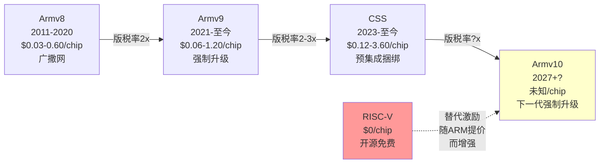

### 2.2 版税率×出货量矩阵: ARM的收入公式(详细版)

ARM的版税收入可以分解为:

```
版税收入 = Σ (各终端出货量 × 各终端平均版税率)
         = Σ (v8出货 × v8费率 + v9出货 × v9费率 + CSS出货 × CSS费率)
```

基于管理层指引、分析师估计和FMP数据，我们构建如下矩阵:

**FY2025版税矩阵(估计)**:

| 终端市场 | 年出货量(M) | v8占比 | v9占比 | CSS占比 | 加权版税率 | 年版税($M) | 占比 |
|---------|:--------:|:----:|:----:|:-----:|:--------:|:---------:|:---:|
| **移动AP** | 1,400 | 55% | 40% | 5% | $0.72 | 1,008 | 46% |
| **IoT/嵌入** | 18,000 | 80% | 15% | 5% | $0.035 | 630 | 29% |
| **数据中心** | 15 | 10% | 50% | 40% | $28.0 | 420 | 19% |
| **汽车** | 600 | 70% | 25% | 5% | $0.85 | 510 | — |
| **PC/笔记本** | 40 | 20% | 60% | 20% | $6.50 | 260 | — |
| **网络/其他** | 2,000 | 60% | 35% | 5% | $0.12 | 240 | — |
| **合计** | ~22,000 | — | — | — | ~$0.099 avg | ~2,168 | 100% |

**FY2028E版税矩阵(估计 — 基准情景)**:

| 终端市场 | 年出货量(M) | v8占比 | v9占比 | CSS占比 | v10占比 | 加权版税率 | 年版税($M) |
|---------|:--------:|:----:|:----:|:-----:|:-----:|:--------:|:---------:|
| **移动AP** | 1,500 | 15% | 50% | 30% | 5% | $1.35 | 2,025 |
| **IoT/嵌入** | 20,000 | 50% | 30% | 15% | 5% | $0.055 | 1,100 |
| **数据中心** | 40 | 0% | 30% | 50% | 20% | $42.0 | 1,680 |
| **汽车** | 900 | 30% | 40% | 25% | 5% | $1.50 | 1,350 |
| **PC/笔记本** | 80 | 5% | 40% | 40% | 15% | $9.00 | 720 |
| **网络/其他** | 2,500 | 30% | 40% | 25% | 5% | $0.20 | 500 |
| **合计** | ~25,000 | — | — | — | — | ~$0.295 avg | ~7,375 |

**关键洞察**: 从FY2025到FY2028E，版税从$2.17B增至$7.38B (+240%)的驱动力分解:
- **出货量增长贡献**: 22B→25B = +14% → 贡献~$300M
- **版税率提升贡献**: 从$0.099到$0.295 = +198% → 贡献~$4,900M
- **结论**: **95%的版税增长来自提价(v9/CSS/v10渗透)，仅5%来自出货量**

这强化了1.5节"第二类增长陷阱"的判断——市场定价的不是出货量增长(5%)，而是提价能力(95%)。一旦提价遇阻(RISC-V竞争、客户反弹、v10延迟)，增长将大幅减速。

### 2.3 版税率阶梯定量模型: v8→v9→v10每代版税率详细估算

为了更精确地理解ARM的提价轨迹，我们为每个终端市场构建了三代版税率阶梯:

**移动AP版税率演化**:

| 版本 | 基础核IP版税 | CSS溢价 | 有效版税率 | 对应ASP | 占ASP% |
|------|:----------:|:------:|:--------:|:------:|:-----:|
| v8 Cortex-A78 | $0.30-0.50 | N/A | $0.35 avg | $25 | 1.4% |
| v9 Cortex-A710/X3 | $0.60-1.00 | N/A | $0.70 avg | $30 | 2.3% |
| v9 CSS (N2/V2) | — | 2-3x TLA | $1.50-2.10 | $35 | 5.1% |
| v10 (估计) | $1.00-1.50 | — | $1.20 avg | $35 | 3.4% |
| v10 CSS (估计) | — | 2-3x TLA | $2.50-3.60 | $40 | 7.5% |

**数据中心版税率演化**:

| 版本 | 核IP版税 | CSS溢价 | 有效版税率 | 芯片ASP | 占ASP% |
|------|:------:|:------:|:--------:|:------:|:-----:|
| v8 Neoverse N1 | $5-10 | N/A | $8 avg | $500 | 1.6% |
| v9 Neoverse V2 | $15-30 | N/A | $20 avg | $800 | 2.5% |
| v9 CSS (V2/N2) | — | 2-3x | $40-90 | $1,000 | 6.5% |
| v10 Neoverse V3+ | $25-50 | — | $35 avg | $1,200 | 2.9% |
| v10 CSS (估计) | — | 2-3x | $70-150 | $1,500 | 7.3% |

**IoT/嵌入式版税率演化**:

| 版本 | 核IP版税 | 有效版税率 | 芯片ASP | 占ASP% |
|------|:------:|:--------:|:------:|:-----:|
| v8 Cortex-M4/M7 | $0.02-0.05 | $0.03 avg | $1.50 | 2.0% |
| v9 Cortex-M55/M85 | $0.04-0.10 | $0.06 avg | $2.00 | 3.0% |
| v10 (估计) | $0.08-0.15 | $0.10 avg | $2.50 | 4.0% |

### 2.4 提价天花板: 三重数学约束

ARM的版税率提升面临三重天花板:

**天花板1: 芯片ASP约束(硬顶)**
版税率占芯片ASP的比例有隐性上限。历史上，IP授权占芯片ASP的比例很少超过5-8%:

| 天花板区间 | 移动AP | 数据中心 | IoT | 汽车 |
|----------|:-----:|:------:|:---:|:---:|
| 当前占ASP% | 2.3% | 2.5% | 2.0% | 2.5% |
| v9 CSS占ASP% | 5.1% | 6.5% | N/A | 4.5% |
| v10 CSS占ASP% | **7.5%** | **7.3%** | 4.0% | **6.0%** |
| 历史上限 | ~8% | ~8% | ~5% | ~8% |
| **距上限** | **0.5pp** | **0.7pp** | **1.0pp** | **2.0pp** |

**结论**: v10 CSS版税率将使ARM在多个终端市场接近或触及历史IP授权占ASP比例的上限。进一步提价的空间极为有限——除非芯片ASP本身大幅上升(这依赖于摩尔定律继续缩小面积/降低成本)。

**天花板2: RISC-V替代成本约束(软顶)**
RISC-V的核心授权费=零。ARM的版税率本质上以"RISC-V迁移成本(摊销到预期出货量)"为上限:

```
RISC-V迁移成本 = 一次性NRE(IP开发+软件移植+验证) / 预期出货量 / 预期产品寿命
```

| 终端市场 | 估计RISC-V NRE | 年出货量 | 5年摊销/chip | ARM当前版税 | 余量 |
|---------|:-----------:|:------:|:----------:|:--------:|:---:|
| **IoT** | $5-20M | 1B+ | $0.004-0.004 | $0.035 | **ARM 8x贵** |
| **移动AP** | $200-500M | 500M | $0.08-0.20 | $0.72 | ARM 3.6-9x贵 |
| **数据中心** | $500M-2B | 10M | $10-40 | $28 | ARM 0.7-2.8x |
| **汽车** | $100-300M | 100M | $0.20-0.60 | $0.85 | ARM 1.4-4.3x贵 |

**关键发现**: 在IoT市场，ARM版税已经是RISC-V迁移成本的8倍——这就是为什么RISC-V已经在IoT市场取得30%份额。在移动AP市场，ARM仍有3.6-9倍的"安全缓冲"——主要因为Android/iOS软件栈的迁移成本巨大。但如果ARM继续提价到v10 CSS水平，安全缓冲将缩小到2-5倍，开始触及大客户的迁移决策点。

Qualcomm花$2.4B收购Ventana Micro获得RISC-V IP。如果Qualcomm年出货10亿颗芯片，摊销到5年就是$0.48/chip。如果ARM对Qualcomm的版税率超过$0.50/chip，Qualcomm就有财务激励使用RISC-V。

**天花板3: 客户集中度约束(谈判天花板)**
ARM的前5大客户(含Arm China)占56%收入。这意味着ARM不能对大客户激进定价——任何一家大客户的流失或降级都会造成双位数收入冲击:

| 客户(估计) | 占ARM收入% | 年付ARM费用($M) | 替代动力 |
|----------|:--------:|:------------:|:------:|
| Apple | ~12-15% | $500-600 | 低(ALA,自研核) |
| Qualcomm | ~10-12% | $400-500 | **高**(Ventana收购) |
| Samsung | ~8-10% | $300-400 | 中(Exynos下降) |
| Arm China | ~15-18% | $600-700 | **高**(政策推动RISC-V) |
| MediaTek | ~6-8% | $250-350 | 中(跟随市场) |
| **Top 5合计** | ~56% | ~$2,250 | — |

Qualcomm与ARM的法律纠纷(2020-2024)已经证明大客户愿意通过法律手段抵制提价。Arm China的15-18%收入敞口受中美关系直接影响。

### 2.5 ARM的"定价窗口"理论: 剩余多少时间?

ARM当前的提价策略(v9翻倍、CSS再翻倍)本质上是在"RISC-V成为有效替代品"之前尽可能多收税。这个"定价窗口"有多大?

**窗口宽度估计 — 按终端市场**:

| 终端 | RISC-V达到性能平价时间 | 生态成熟时间 | 合计窗口 | ARM剩余定价时间 |
|------|:-------------:|:--------:|:------:|:-----------:|
| IoT/MCU | **已达到**(2023+) | **已达到** | 0年 | **已关闭** |
| 低端手机 | 2027-2028 | 2029-2030 | 3-5年 | 1-3年 |
| DC/服务器 | **2026**(Tenstorrent) | 2028-2029 | 2-3年 | 0-1年 |
| 汽车车身 | 2027-2028 | 2028-2030 | 2-4年 | 1-2年 |
| 高端手机 | 2029-2030 | 2031-2033 | 5-7年 | 3-5年 |
| 汽车ADAS | 2029-2030 | 2031-2033 | 5-7年 | 3-5年 |
| PC/笔记本 | N/A(x86竞争) | N/A | — | — |

**加权平均定价窗口**: ~2.5年(按收入加权)

这意味着ARM在多数终端市场的"自由定价期"可能在2028-2029年结束。之后ARM将不得不在"维持版税率(风险丢失客户)"和"降低版税率(保持竞争力)"之间做出选择——这正是Qualcomm QTL在2015-2020年经历的困境(被迫从5%降至3.25%移动设备收费)。

**对估值的含义**: 如果市场按"永续定价权"(P/E 140x)定价ARM，但ARM的定价窗口实际只有~2.5年，那么FY2028-FY2030的EPS增长率将大幅低于市场预期。具体而言:
- 共识FY2029 EPS: $3.70 (隐含GAAP OPM ~30%, 收入$8.5B)
- 如果FY2029版税率增速从+15%/年放缓至+5%/年(定价窗口关闭): 收入降至$7.2B, EPS $2.50
- 这意味着140x × $2.50 = $350 → 但市场不会给增长放缓的公司140x → P/E可能压缩至80-100x → 股价$200-250(从当前$128的角度看仍有上行，但远低于"完美执行"路径)

**更关键的问题**: 如果定价窗口关闭后ARM的增速从+25%降至+10%，P/E从140x压缩至50-70x是合理的。50x × $2.50 = **$125** — 与当前股价几乎持平。这意味着当前$128的股价隐含了"定价窗口不会关闭"的假设——如果这个假设被证伪，投资者在当前价格买入将获得接近零回报。

### 2.6 v9渗透S曲线: 加速但见顶

v9版税收入占比的演化:
- FY2024: ~20% → FY2025: ~30% → Q3 FY2026: >50%

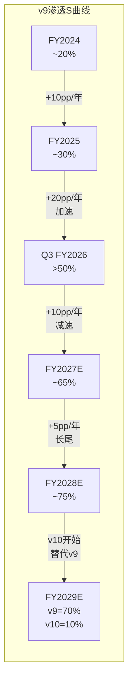

这个加速令人印象深刻——18个月内从20%升至50%+。但S曲线的下半段(50%→90%)通常比上半段慢:
- 残留的v8设备(IoT, 汽车)替换周期长(5-10年)
- v8在低成本芯片中仍有定价优势(版税率为v9的一半)
- 部分客户选择v8+RISC-V混合策略而非升级v9
- v9的最终渗透率可能是75-80%而非100%(v8在低端市场永久存在)

**关键问题**: v9渗透到70-80%后，下一个增长引擎是什么？管理层的回答是CSS(更高版税率)和v10(尚未发布)。但CSS目前只有5个量产设计(11个客户中)，v10时间表不明——如果v10版税率继续翻倍(=v8的4倍)，RISC-V迁移的经济激励将显著加强。

### 2.6 版税经济学的终极问题: 版税收入的"终态"是多少?

如果我们假设ARM的版税最终达到稳态(所有提价阶梯走完，RISC-V侵蚀达到均衡)，ARM的版税终态在哪里？

**终态建模(FY2032E+)**:

| 终端 | 终态出货(M) | ARM份额 | RISC-V份额 | 终态版税率 | 终态版税($M) |
|------|:--------:|:------:|:---------:|:--------:|:---------:|
| 移动AP | 1,500 | 85% | 10% | $1.00 | 1,275 |
| IoT | 25,000 | 45% | 45% | $0.04 | 450 |
| DC | 80 | 55% | 20% | $35 | 1,540 |
| 汽车 | 1,500 | 65% | 25% | $1.20 | 1,170 |
| PC | 150 | 40% | 5% | $7.00 | 420 |
| 网络/其他 | 3,000 | 50% | 30% | $0.15 | 225 |
| **合计** | — | — | — | — | **~5,080** |

**终态版税~$5.1B** vs 共识FY2030E版税~$7.5B — 差距$2.4B(32%)。差距来自:
1. RISC-V份额假设(我们比共识悲观10-15pp)
2. 版税率天花板(我们假设v10 CSS后不再大幅提价)
3. 出货量增长(相对一致)

这个终态模型暗示: **如果RISC-V按当前轨迹发展，ARM的版税增长将在FY2029-FY2030达到拐点，之后进入缓增长甚至平台期**。市场隐含的FY2030 EPS $4.70(对应~$11.2B收入)可能高估了版税的可持续性。

---

## 第3章: 授权体系拆解 — ALA/TLA/CSS的定价权博弈

### 3.1 四层授权金字塔

ARM的授权体系是一个精心设计的价值阶梯:

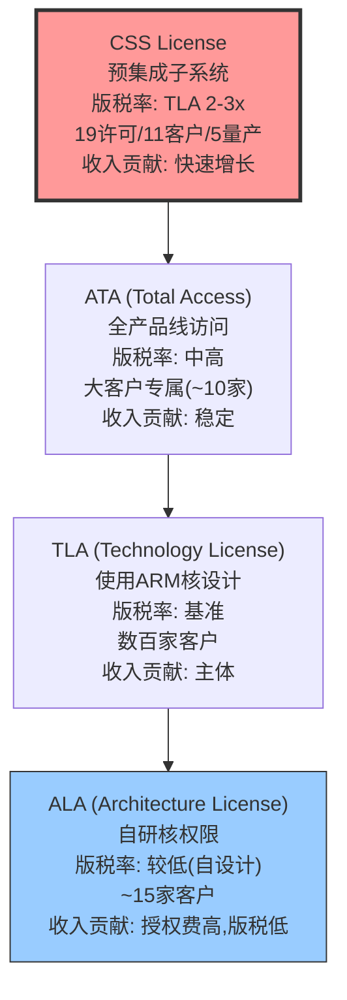

**ALA (Architecture License Agreement)**: 客户获得ARM指令集架构许可，可以设计自己的CPU核心。约15家公司持有ALA。版税率相对较低，因为ARM只提供架构规范，设计工作由客户完成。

**已知ALA客户**: Apple(A/M系列), Qualcomm(Kryo→Oryon), Google(Tensor), Amazon(Graviton), Microsoft(Cobalt), Samsung(Exynos), NVIDIA(Grace), Fujitsu(A64FX), Ampere(Altra/AmpereOne), 华为(Kunpeng), 阿里(倚天), Marvell, Broadcom, MediaTek(部分), Cavium(已被Marvell收购)

**TLA (Technology License Agreement)**: 客户使用ARM设计的现成核心(Cortex系列/Neoverse系列)。版税率高于ALA，因为ARM承担了全部核心设计工作。这是绝大多数ARM客户的选择——数百家芯片公司使用Cortex-A/M/R系列。

**ATA (Total Access Agreement)**: 大客户专属的"全套餐"访问权限，一次性付费获得ARM全部产品线的使用权。

**CSS (Compute Subsystems License)**: ARM最新且最重要的授权类型。ARM不只提供CPU核心IP，还提供包含CPU+互连+内存控制器+安全单元的预集成子系统。版税率是TLA的2-3倍。

### 3.2 CSS: ARM的价值捕获杠杆(深度分析)

CSS是ARM近年来最重要的战略举措。理解CSS就是理解ARM未来5年的增长叙事:

**CSS解决的客户痛点**:
- 传统流程: 获取核心IP → 自设计子系统(总线/互连/缓存/PD) → 集成验证 → 流片 (耗时24-36个月)
- CSS流程: 获取预集成子系统 → 直接集成到SoC → 流片 (耗时12-24个月)
- 节省: 最多12个月设计时间 + $20-50M NRE费用 + 降低流片失败风险

**CSS定价逻辑与客户经济学**:

| 维度 | TLA模式 | CSS模式 | 客户净效益 |
|------|--------|--------|----------|
| ARM版税/chip | $X | $2-3X | -$X~2X |
| 客户NRE | $30-50M | $10-20M | +$10-30M |
| 上市时间 | 24-36月 | 12-24月 | +$100M+机会成本 |
| 流片风险 | 中等 | 低 | 不可量化 |
| **净经济效应** | — | — | **显著正面** |

即使CSS版税率是TLA的2-3倍，客户在NRE节省和上市时间加速上的收益远超增量版税。这就是CSS采用加速的底层逻辑——**ARM在创造真实客户价值的同时提价**，而非纯粹的"垄断加税"。这与v9提价(功能搭售)有本质区别。

**CSS采用进度追踪(截至Q3 FY2026)**:

| 指标 | Q1 FY25 | Q2 FY25 | Q3 FY25 | Q4 FY25 | Q1 FY26 | Q2 FY26 | Q3 FY26 |
|------|:------:|:------:|:------:|:------:|:------:|:------:|:------:|
| CSS许可证总数 | 12 | 14 | 15 | 16 | 17 | 19 | **21** |
| CSS客户数 | 7 | 8 | 9 | 10 | 10 | 11 | **12** |
| 量产设计数 | 2 | 3 | 3 | 4 | 4 | 5 | 5 |

**CSS渗透率预测(占版税收入%)**:

| 财年 | CSS占版税% | 推动力 |
|------|:--------:|------|
| FY2025 | ~5-8% | 早期量产(2-3客户) |
| FY2026E | ~12-18% | 5个量产设计放量 |
| FY2027E | ~25-35% | 新增5-8个量产设计+DC加速 |
| FY2028E | ~35-45% | 管理层目标50%的达成路径 |
| FY2030E | ~50-60% | 如果CSS成为默认选择 |

CSS到达50%的时间线(管理层目标"2-3年内")可能需要到FY2029而非FY2028——因为大量低端TLA客户(IoT)不需要CSS。

### 3.3 授权收入的SoftBank"浓度"问题(深度量化)

ARM的授权收入结构存在一个令人不安的集中度问题:

**年度数据**:

| 财年 | 总授权收入($M) | SoftBank相关估计($M) | SoftBank占比 | 剔除SB后增速 |
|------|:----------:|:---------------:|:---------:|:--------:|
| FY2023 | 1,159 | ~200 | ~17% | — |
| FY2024 | 1,428 | ~350 | ~25% | +15% |
| FY2025 | 1,839 | ~550 | ~30% | +5% |
| FY2026E | ~2,300 | ~800 | ~35% | **~0%** |

**季度细节(FY2026)**:

| 季度 | 总授权($M) | SoftBank相关估计($M) | 剔除SB后($M) |
|------|:--------:|:---------------:|:---------:|
| Q1 FY26 | 350(估) | ~120 | ~230 |
| Q2 FY26 | 390(估) | ~140 | ~250 |
| Q3 FY26 | 505 | ~200 | ~305 |

BofA在2026年1月下调ARM评级时指出: **剔除SoftBank贡献后，FY2026授权收入预计同比增长约0%甚至下降**。这意味着ARM的有机授权增长已经停滞。

**关联交易风险链**:

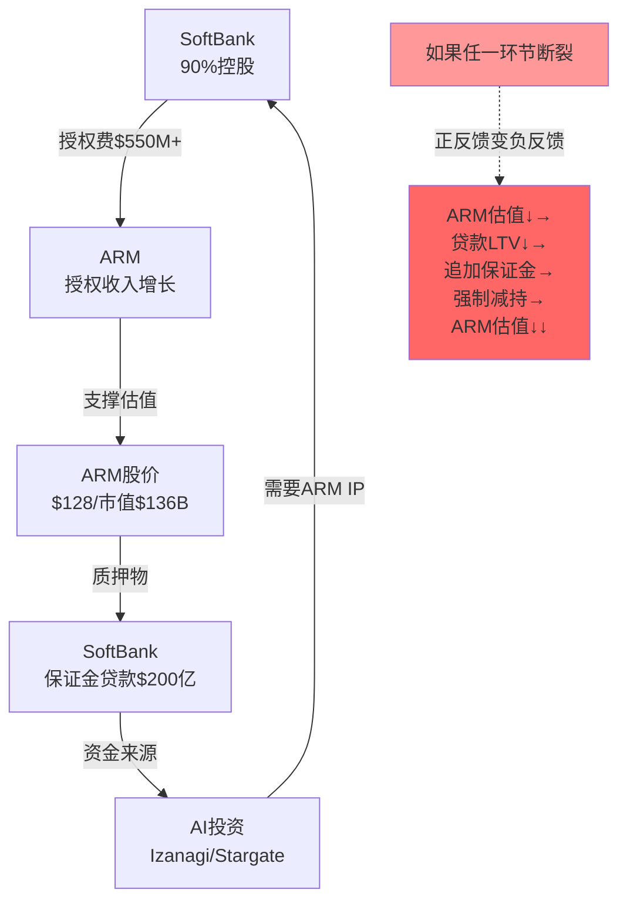

这个自我强化循环在上升阶段是良性的(ARM股价涨→SoftBank可借更多→投更多AI→更多ARM授权→ARM收入涨→股价涨)。但在下降阶段将变成恶性循环(详见SoftBank专题)。

### 3.4 授权确认的季度波动性分析

ARM的授权收入在季度间表现出极高的波动性，这对预测和估值都是挑战:

**授权收入季度序列(推算)**:

| 季度 | 总收入($M) | 版税(估, $M) | 授权(估, $M) | 授权YoY |
|------|:--------:|:--------:|:---------:|:------:|
| Q1 FY25 | 939 | 508 | 431 | +85% |
| Q2 FY25 | 844 | 486 | 358 | -15% |
| Q3 FY25 | 983 | 550 | 433 | +24% |
| Q4 FY25 | 1,241 | 624 | 617 | +52% |
| Q1 FY26 | 1,053 | 569 | 484 | +12% |
| Q2 FY26 | 1,135 | 590 | 545 | +52% |
| Q3 FY26 | 1,242 | 737 | 505 | +17% |

**波动性来源**: 大额合同(ATA/CSS)的签约时点不可预测。单个ATA合同可达$100M+，一个季度的差异就是10%收入波动。这种波动让季度"beat/miss"变得近乎随机——Q4 FY25的大幅beat可能只是一个大客户(SoftBank?)提前签约。

### 3.5 ARM定价策略的博弈论分析

ARM的定价权不是一个简单的"供给方垄断定价"问题——它是一个多方博弈:

**博弈参与者**:
1. **ARM(定价方)**: 目标=最大化版税率 × 版税基数 × 持续时间
2. **大客户(ALA持有者)**: Apple/Qualcomm/Google/AWS — 有自研能力，可威胁转向RISC-V
3. **中小客户(TLA/CSS用户)**: MediaTek/联发科/博通等 — 依赖ARM，缺乏自研能力
4. **RISC-V生态**: 零价格替代品，但生态不成熟 — 是"威胁"而非"现实替代"
5. **SoftBank(控股股东)**: 需要ARM收入增长来维持估值/抵押品价值

**最优定价策略(纳什均衡分析)**:

ARM面临经典的"垄断者定价困境": 提价太快→加速RISC-V替代→长期收入下降; 提价太慢→短期收入不足→估值下滑→SoftBank压力。

| 策略 | 短期收入影响 | 长期护城河影响 | RISC-V催化效应 | 整体评估 |
|------|:--------:|:--------:|:---------:|:------:|
| 激进提价(v9强制+CSS捆绑) | **++** | **--** | **高** | 当前策略 |
| 温和提价(v9可选+CSS自愿) | **+** | **中** | 中 | 理论最优 |
| 维持价格(v8→v9免费升级) | **0** | **++** | **低** | 压缩收入 |
| 选择性定价(大客户低价/小客户高价) | **+** | **+** | 低-中 | 实施困难 |

**ARM选择了"激进提价"策略的原因**:
1. SoftBank需要收入增长来支撑估值(质押需求)
2. RISC-V在短期(2025-2027)还不足以构成有效竞争
3. v9强制升级+CSS捆绑的窗口期有限(RISC-V每年在缩小差距)
4. 管理层KPI(Non-GAAP EPS增长)与提价策略高度对齐

**博弈论预测**: ARM的当前策略("在窗口关闭前尽量多收")在短期(2-3年)是理性的。但这是一个**短视均衡**——类似于Intel在2010-2015年利用服务器垄断疯狂提价，最终催生了AMD Zen和ARM Neoverse两个竞争对手。ARM正在重演Intel的路径，但时间尺度更压缩(因为RISC-V是开源的，迭代速度可能快于历史上的AMD)。

### 3.6 版税合同的法律结构与审计权

ARM的版税合同包含几个对分析重要的法律结构特征:

**合同期限**: 授权合同通常为5-15年，版税义务在合同期内持续。到期后客户需续约或停止使用ARM IP。

**审计权**: ARM保留对被授权方进行出货量审计的权利。这是版税收入的"执法机制"——如果客户低报出货量，ARM可通过审计追回版税。历史上审计追回曾在个别季度贡献$10-30M意外收入。

**最低版税保证(Minimum Royalty Guarantee, MRG)**: 部分大合同包含MRG——无论客户实际出货量多少，每年需支付最低版税额。MRG的存在增加了版税收入的下限保护，但也可能让客户在合同到期时拒绝续约(如果MRG大幅超过实际出货量对应的版税)。

**合同可转让性**: Qualcomm诉讼(2024年裁定)确认了通过M&A获得的ARM授权可以转让给收购方。这削弱了ARM的"逐客户独立定价"模式——理论上，新客户可以通过收购已有授权的小公司来获得ARM授权，而不必以ARM的当前标价签约。

**地域限制**: Arm China(安谋中国)的合同结构特殊——中国客户通过Arm China获得授权，版税也通过Arm China中转。这创造了地缘政治风险(见Ch7)，也增加了收款延迟(影响DSO)。

**合同续约风险**: ARM约30%的授权合同将在2026-2028年到期需要续约。续约谈判是ARM提价的关键时点——但也是客户评估RISC-V替代的时点。如果续约时ARM要求大幅提价(+50-100%)，部分客户可能选择"到期后逐步迁移到RISC-V"而非续约。这个续约周期创造了一个"定价悬崖"风险——2028-2030年可能集中出现合同到期不续约的情况。

---

## 第4章: 终端市场版图 — 七大战场的TAM建模与渗透率地图

### 4.1 移动: 现金奶牛的成熟期

**当前地位**: ARM架构在移动AP市场的渗透率超过99%。全球每年出货约12-14亿部智能手机，几乎每部都使用ARM架构芯片。

**TAM建模**:

| 变量 | FY2025 | FY2027E | FY2030E | 驱动因素 |
|------|:------:|:------:|:------:|--------|
| 全球智能手机出货(M) | 1,250 | 1,300 | 1,350 | 成熟市场+新兴市场微增 |
| ARM份额 | >99% | >98% | >95% | RISC-V边际侵蚀 |
| ARM服务的AP出货(M) | 1,240 | 1,274 | 1,283 | 微增 |
| 平均ASP($) | 28 | 32 | 38 | 5G+AI特性提升 |
| ARM版税率占ASP(%) | 2.3% | 3.5% | 4.5% | v9→CSS迁移 |
| **移动版税($M)** | **~1,008** | **~1,427** | **~2,189** | **CAGR +17%** |

**增长分解**:
- 出货量: +1.5%/年 (贡献增长的~10%)
- ASP提升: +6%/年 (贡献增长的~35%) — 5G SoC平均ASP高于4G
- 版税率提升: +14%/年 (贡献增长的~55%) — v9→CSS→v10

**风险因素**:
- 智能手机替换周期从2.5年延长至3.5年 → 每年出货量减少5-10%
- 中国OEM(小米/Oppo/Vivo)通过Arm China支付版税，增速仅+7.5%
- 中国可能推动本土RISC-V移动芯片(虽然2029前难以商用)
- 折叠屏/AI手机可能提升ASP但不增加芯片数量

### 4.2 数据中心: 增长引擎(详见第5章)

**TAM快速概览**:

| 变量 | FY2025 | FY2027E | FY2030E |
|------|:------:|:------:|:------:|
| DC ARM芯片出货(M) | 15 | 40 | 100 |
| 平均版税($) | 28 | 35 | 42 |
| **DC版税($M)** | **420** | **1,400** | **4,200** |
| ARM DC份额(出货量) | ~22% | ~35% | ~50% |

### 4.3 IoT/嵌入式: 量大价低，RISC-V最直接侵蚀

**当前地位**: ARM Cortex-M系列在MCU市场占~60-70%份额，但正在加速流失。

**TAM建模**:

| 变量 | FY2025 | FY2027E | FY2030E | 驱动因素 |
|------|:------:|:------:|:------:|--------|
| 全球MCU/IoT芯片出货(B) | 25 | 28 | 35 | IoT设备增长 |
| ARM份额 | 65% | 55% | 45% | **RISC-V侵蚀** |
| RISC-V份额 | 30% | 38% | 45% | **加速渗透** |
| 其他(MIPS等) | 5% | 7% | 10% | 碎片化 |
| ARM IoT出货(B) | 16.3 | 15.4 | 15.8 | 量稳/微降 |
| 平均版税($) | 0.039 | 0.045 | 0.055 | v9渗透 |
| **IoT版税($M)** | **635** | **693** | **869** | **CAGR +6.5%** |

**RISC-V侵蚀曲线**:
- **已发生**: 乐鑫ESP32系列从ARM Cortex-M迁移到RISC-V，2024年出货量>10亿颗
- **正在发生**: 中国MCU厂商(兆易创新/WCH)大量推出RISC-V MCU
- **将要发生**: Infineon/STMicro等欧洲厂商的新一代MCU部分采用RISC-V
- 到FY2030，RISC-V在IoT的份额可能从当前30%升至45%

**RISC-V在IoT的主要推动力详细分析**:

| 推动力 | 量化估计 | 代表公司/产品 | 对ARM影响 |
|--------|:------:|------------|:-------:|
| **中国"自主可控"政策** | 中国IoT芯片50%将使用RISC-V(到2028) | 兆易创新(GD32V)/WCH/Nuclei | ARM中国IoT收入-30-40% |
| **零授权费成本优势** | 每颗MCU节省$0.02-0.05 | Espressif ESP32-C6 | 低端市场完全丢失 |
| **LLVM/GCC成熟** | 编译器性能差距<5%(2025) | GCC 14 RISC-V后端 | 开发者迁移成本几乎为零 |
| **教育渗透** | RISC-V教学采用率>40%(高校) | UC Berkeley, MIT, 清华 | 新一代开发者默认RISC-V |
| **Arduino/PlatformIO支持** | 主流开发框架已支持RISC-V | Arduino RISC-V boards | 爱好者/Maker社区迁移 |

**战略意义**: IoT虽然版税率低(每颗$0.03-0.05)，但是ARM生态系统的"底层土壤"——大量嵌入式开发者使用Cortex-M起步，然后在移动/服务器项目中继续使用ARM。如果IoT开发者转向RISC-V，长期可能侵蚀ARM在更高价值终端的开发者基础。这是一个**生态导流效应**——今天的IoT开发者是明天的数据中心架构师。

**量化导流效应**: 如果ARM在IoT的开发者份额从70%降至45%(与芯片份额同步)，假设10%的IoT开发者会在5年后晋升到DC/移动架构设计角色，这意味着ARM在DC/移动的"开发者管道"将缩小约:
- 当前: 70% × 2M IoT开发者 × 10% 晋升率 = 140K新DC/移动ARM开发者/年
- FY2030: 45% × 2.5M IoT开发者 × 10% 晋升率 = 113K新DC/移动ARM开发者/年
- **减少19%的新开发者供给** — 这是一个慢性但持续的生态流失

对比: 同期RISC-V的"开发者管道"将从: 25% × 2M × 10% = 50K → 45% × 2.5M × 10% = 113K(+126%)。这意味着到FY2030，RISC-V和ARM的新晋开发者数量将接近1:1——生态壁垒的长期根基正在被侵蚀。

### 4.4 汽车: 高价值增量市场

**当前地位**: ARM在汽车芯片中的渗透率持续增加:
- ADAS/自动驾驶: NVIDIA(ARM架构) + Qualcomm(ARM架构) 主导
- 车身/座舱: 从传统MCU向ARM Cortex-A迁移
- 电池管理: 仍以专用MCU为主(ARM/RISC-V混合)

**TAM建模**:

| 变量 | FY2025 | FY2027E | FY2030E | 驱动因素 |
|------|:------:|:------:|:------:|--------|
| 全球汽车产量(M) | 85 | 88 | 92 | 微增 |
| 每车ARM芯片数 | 7 | 12 | 22 | 电气化+智能化 |
| ARM汽车芯片出货(M) | 595 | 1,056 | 2,024 | CAGR +26% |
| 平均版税($) | 0.86 | 1.10 | 1.40 | v9+高端化 |
| **汽车版税($M)** | **512** | **1,162** | **2,834** | **CAGR +41%** |

**汽车是ARM增速最快的终端市场之一**，但也面临特有风险:
- **Quintauris联盟**(Bosch/Infineon/NXP/Qualcomm/STMicro)推动汽车RISC-V标准化
- 汽车芯片设计周期长(5-7年)，RISC-V的渗透会滞后但也更粘性
- ISO 26262功能安全认证对RISC-V仍是障碍(落后ARM 3-5年)

**汽车RISC-V的Quintauris威胁深度分析**:

Quintauris(原名"汽车RISC-V联盟")是五家全球最大汽车半导体公司的联合倡议:

| 成员 | 汽车芯片市占率 | 当前ARM使用 | RISC-V动机 |
|------|:---------:|:--------:|----------|
| Bosch | ~8% | 大量(Cortex-M车身) | 降低IP成本 |
| Infineon | ~13% | 大量(Cortex-M/R) | 自主可控 |
| NXP | ~12% | 大量(Cortex-A/M/R) | 降低IP依赖 |
| Qualcomm | ~7% | 大量(Snapdragon座舱) | 已有Nuvia/Ventana能力 |
| STMicro | ~10% | 大量(Cortex-M MCU) | 降低IP成本 |
| **合计** | **~50%** | — | — |

**Quintauris的战略意义**: 汽车芯片市场50%的份额联合推动RISC-V标准化——这不是几家小公司的边缘实验，而是行业主流的系统性迁移。Quintauris的目标是到2028年发布RISC-V汽车指令集标准(含功能安全扩展)，到2030年量产首批符合标准的汽车RISC-V芯片。

**对ARM的影响时间线**: 由于汽车芯片设计周期(5-7年)+量产爬坡(2-3年)+汽车平台寿命(7-10年)，Quintauris对ARM的收入影响将在2032-2035年才全面体现。但**设计端影响从2028年开始** — 新车型设计将开始包含RISC-V芯片选项，ARM的汽车授权签约量将开始下降。

### 4.5 PC/笔记本: Windows on ARM的曙光与阴影

**当前地位**: ARM在PC市场的份额从2024年的~3%飙升至2025年的~13%(含Copilot+ PC)。这是ARM在PC市场的第三次尝试——前两次(Windows RT 2012, Snapdragon 835 Always-on PC 2018)都以失败告终。

**三次尝试的历史**:

| 尝试 | 时间 | 产品 | 结果 | 失败原因 |
|------|------|------|:----:|---------|
| Windows RT | 2012-2015 | Surface RT | **失败** | 不能运行x86应用, 微软放弃 |
| Always-on PC | 2018-2020 | Snapdragon 835/8cx | **失败** | 性能差x86 50%, 翻译层效率低 |
| **Copilot+ PC** | **2024-至今** | Snapdragon X Elite/Plus | **待验证** | 性能接近x86, AI NPU差异化 |

**第三次的不同**: Qualcomm Snapdragon X Elite的单线程性能首次追平Intel Core Ultra(Meteor Lake)，多线程性能超过。同时Windows on ARM的应用兼容性通过Prism翻译层大幅改善(vs早期WoA仅30-40%兼容性，现在约85-90%)。微软将AI Copilot功能(需要NPU)与ARM芯片绑定(x86芯片的NPU性能较弱)——这是首次ARM在PC市场拥有**功能差异化**(不仅是功耗优势)。

**TAM建模**:

| 变量 | FY2025 | FY2027E | FY2030E | 驱动因素 |
|------|:------:|:------:|:------:|--------|
| 全球PC出货(M) | 270 | 285 | 300 | 微增+换机周期 |
| ARM PC份额 | 13% | 20% | 30% | Copilot+/原生生态 |
| ARM PC出货(M) | 35 | 57 | 90 | CAGR +21% |
| 平均版税($) | 6.5 | 8.0 | 10.0 | CSS渗透 |
| **PC版税($M)** | **228** | **456** | **900** | **CAGR +32%** |

**Windows on ARM的S曲线预测**:

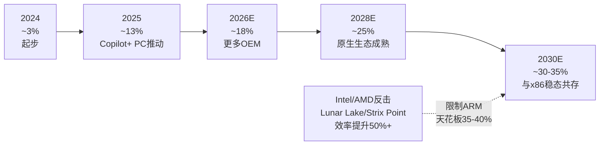

**关键变量**: Windows on ARM的成败高度依赖于**原生应用生态**:
1. 企业软件(SAP/Oracle ERP等)尚未原生移植
2. 游戏(大量DirectX 12 x86游戏在Prism模拟下性能损失30%+)
3. 专业软件(Adobe全家桶已支持，但AutoCAD/MATLAB等仍仅x86)

微软的态度至关重要但矛盾: 微软同时在推ARM(Copilot+ PC)和x86(Intel/AMD是重要合作伙伴)，不太可能像Apple那样"断臂式"推进ARM化。ARM在PC的天花板可能是30-40%而非Qualcomm宣称的50%。

**Apple Mac的启示与局限**:
Apple在2020年通过M1完成了从Intel x86到ARM的完整迁移。但Apple的成功不可复制:
1. **垂直整合**: Apple控制硬件(Mac)+操作系统(macOS)+应用商店(App Store)+芯片设计(Apple Silicon) — Windows PC生态缺乏任何一方拥有这种控制力
2. **Rosetta 2翻译层**: Apple的翻译层覆盖率>95%, 性能损失<20% — Windows Prism翻译层覆盖率~85-90%, 性能损失25-40%(尤其游戏)
3. **应用生态控制**: Apple可以强制开发者在App Store提交Universal Binary — 微软无法强制第三方ISV移植
4. **市场份额**: Mac全球份额~15-18%, 可以"不关心"某些企业软件兼容性 — Windows PC需要支持40年的x86企业软件遗产

**ARM在PC的真实天花板分析**:

| 客户群 | PC总量占比 | ARM转化率 | ARM PC份额贡献 |
|--------|:--------:|:-------:|:----------:|
| 消费者(学生/轻办公) | 35% | 40-50% | 14-18% |
| 中小企业 | 25% | 15-25% | 4-6% |
| 大型企业 | 30% | 5-10% | 2-3% |
| 游戏/创意专业 | 10% | 3-5% | 0.3-0.5% |
| **加权平均** | **100%** | — | **20-28%** |

**结论**: ARM在PC的可实现天花板约20-28%，而非Qualcomm的50%愿景。大型企业(30%PC份额)几乎不会采用ARM PC(企业IT软件兼容性要求+IT部门保守性)，游戏/创意专业更不会(DirectX 12/Vulkan/CUDA的x86依赖)。ARM在PC的增长主要来自消费者和中小企业轻办公场景——这些恰好是ASP最低的PC细分市场，进一步限制了ARM PC版税的总量。

### 4.6 网络基础设施: 隐形但稳定

**当前地位**: ARM在网络设备(路由器/交换机/基站)中有稳固地位:
- 5G基站: 大部分使用ARM架构
- 网络处理器: Marvell, Broadcom等使用ARM核心
- DPU/SmartNIC: NVIDIA BlueField(ARM核心)

**TAM建模**:

| 变量 | FY2025 | FY2027E | FY2030E |
|------|:------:|:------:|:------:|
| 网络芯片出货(B) | 2.0 | 2.3 | 2.8 |
| ARM份额 | 55% | 58% | 60% |
| 平均版税($) | 0.12 | 0.15 | 0.20 |
| **网络版税($M)** | **132** | **200** | **336** |

### 4.7 安全/可穿戴: 新兴但小众

ARM的安全微控制器(TrustZone/SecurCore)和可穿戴设备(Cortex-M33/M55)芯片贡献小但稳定的版税流。这些市场对ARM的战略价值在于维持开发者生态广度，而非直接收入贡献。

### 4.8 终端市场竞争格局深度矩阵

每个终端市场中ARM面临的竞争态势显著不同:

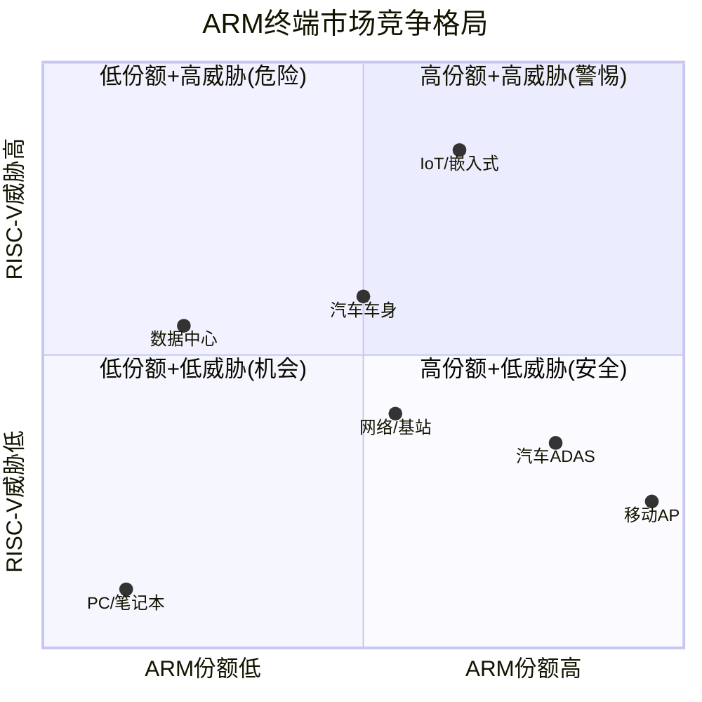

**各终端市场的竞争深度对比**:

| 终端 | 主要竞争对手 | ARM定价权 | 客户粘性 | 周期长度 | 替代时间 |
|------|-----------|:------:|:-----:|:------:|:-----:|
| 移动AP | RISC-V(长期) | **极强** | 极高(iOS/Android) | 18月 | 5-7年 |
| IoT | RISC-V(已侵蚀) | **弱** | 低(工具链共享) | 6-12月 | 1-2年 |
| DC | x86+RISC-V | 中 | 中(软件迁移) | 24-36月 | 3-5年 |
| 汽车 | RISC-V(Quintauris) | 强 | 高(安全认证) | 5-7年 | 5-10年 |
| PC | x86(Intel/AMD) | 弱 | 低(新进者) | 12-18月 | N/A(已共存) |
| 网络 | RISC-V/x86 | 中 | 中 | 24-36月 | 3-5年 |

**关键竞争动态**:

**移动**: ARM的"安全堡垒"。iOS只支持ARM(Apple不太可能迁移)，Android有ARM软件栈深度依赖(百万级原生应用)。RISC-V要在移动市场挑战ARM，需要先解决: (a)应用二进制兼容性(类似Rosetta翻译层)、(b)GPU生态(RISC-V没有等价的Mali/Adreno)、(c)基带芯片集成(5G基带目前全是ARM)。这些障碍在2030年前难以全部克服。

**IoT**: ARM的"失血区域"。RISC-V的零授权费+足够性能(Cortex-M级别)已经让中国MCU厂商(兆易创新、WCH)和Espressif(ESP32系列)大规模转向RISC-V。ARM在IoT的份额从2020年~80%降至2025年~65%，趋势不可逆。ARM的应对策略是通过Helium(MVE)和AI加速指令提升高端MCU差异化，但低端MCU($0.30-1.00 ASP区间)已基本让给RISC-V。

**数据中心**: ARM的"战略高地"。ARM在DC的增长不是自然增长，而是超大规模客户主动选择ARM来降低对Intel/AMD的依赖(采购多元化策略)。AWS/Google/Microsoft选择ARM的核心理由不是"ARM更好"，而是"不想只有一个供应商"。这意味着ARM在DC的增长有一个隐性天花板——一旦ARM份额超过30-40%，客户的"多元化"动力减弱，ARM将不再是"替代选项"而是"主流选项"之一，定价权可能受到更多压力。

**汽车**: ARM的"时间缓冲区"。汽车芯片的设计周期(5-7年)和安全认证周期(ISO 26262, 2-3年)给ARM提供了最长的保护窗口。但Quintauris联盟(Bosch/Infineon/NXP/Qualcomm/STMicro)正在标准化汽车RISC-V——一旦标准化完成(预计2027-2028)，新车型设计将开始采用RISC-V。影响将在2032-2035年才全面体现(从设计到量产的滞后)。

### 4.9 七大战场总结: TAM汇总与增长分解

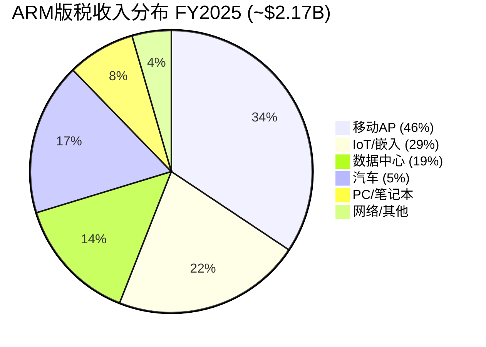

**终端市场版税预测汇总**:

| 终端 | FY2025($M) | FY2027E($M) | FY2030E($M) | CAGR |
|------|:---------:|:----------:|:----------:|:---:|
| 移动AP | 1,008 | 1,427 | 2,189 | 17% |
| IoT | 635 | 693 | 869 | 6.5% |
| DC | 420 | 1,400 | 4,200 | 58% |
| 汽车 | 512 | 1,162 | 2,834 | 41% |
| PC | 228 | 456 | 900 | 32% |
| 网络 | 132 | 200 | 336 | 20% |
| **总版税** | **2,935** | **5,338** | **11,328** | **31%** |

**版税增长重心迁移**:

| 占比 | FY2025 | FY2027E | FY2030E |
|------|:-----:|:------:|:------:|
| 移动+IoT(传统核心) | 56% | 40% | 27% |
| DC+汽车+PC(新增长) | 40% | 57% | 70% |
| 网络/其他 | 4% | 3% | 3% |

**关键洞察**: ARM的增长叙事依赖于从左侧(移动+IoT)向右侧(DC+汽车+PC)的重心迁移。市场赋予的140x P/E本质上是在为这个迁移成功定价。但迁移的每一步都面临:
- RISC-V竞争(IoT已在竞争, DC/汽车正在酝酿)
- x86防守(PC/服务器 — Intel Lunar Lake/AMD Strix Point)
- 自身定价策略矛盾(提价加速替代)

**如果DC增长不达预期(占比40%而非70%)**: 版税增长从CAGR 31%降至~18%，这将使FY2030总收入从$11.2B降至~$8B，P/E需要从140x压缩到100x以下以维持估值纪律。

---

## 第5章: 数据中心征途 — 从10%到50%的路径可信度

### 5.1 数据中心的战略意义

管理层在多次财报电话会上表示: **数据中心将在"几年内"超越移动成为ARM最大的版税业务。** 这意味着数据中心版税需要从当前的~$250M/季增长到超越移动的~$300M/季。

为什么数据中心对ARM如此重要:
1. **单位版税极高**: 服务器芯片ASP $500-2000+，ARM版税$10-100/chip → 是移动的15-150倍
2. **CSS渗透最快**: 服务器客户最需要CSS的快速上市优势(AI竞赛时间紧迫)
3. **Phoenix的目标市场**: ARM首个自设计芯片面向数据中心
4. **AI驱动的结构性增长**: 每个AI数据中心都需要CPU(即使主计算由GPU完成)
5. **估值杠杆**: DC版税增长对ARM总估值的边际影响最大(高单价×高增速)

### 5.2 ARM服务器的市场份额迷雾

ARM服务器的市场份额数据存在重大口径差异:

| 口径 | 份额 | 来源 | 含义 | 置信度 |
|------|:----:|------|------|:-----:|
| 传统CPU出货量 | 20-23% | IDC/Omdia | 仅计独立CPU服务器 | H |
| ARM官方宣称 | ~50% | ARM Newsroom | 含NVIDIA GB200中Grace | M |
| 收入份额 | <10% | 估算 | ARM版税vs Intel/AMD芯片收入 | M |
| AI训练节点含ARM | >50% | NVIDIA | GB200=Grace+Blackwell组合 | H |

差异的核心在于**NVIDIA GB200**: 每台GB200超级计算节点包含一颗Grace ARM CPU + 多颗Blackwell GPU。ARM将GB200计入"ARM计算"节点——技术上正确(确实有ARM CPU在里面)，但这些节点99%的价值来自GPU，ARM从Grace CPU收取的版税相对于节点总价值微不足道。

### 5.3 四大超大规模客户深度画像

**AWS Graviton系列(旗舰客户 — ARM DC版税的最重要单一推动力)**:

| 世代 | 核心数 | 基础核 | 制程 | 状态 | ARM授权类型 | 估计年出货(M) |
|------|:-----:|-------|:---:|:---:|:---------:|:----------:|
| Graviton1 | 16 | A72(v8) | 16nm | 退役 | ALA | 0 |
| Graviton2 | 64 | N1(v8) | 7nm | 量产(减少) | ALA | ~1.5 |
| Graviton3 | 64 | V1(v9) | 5nm | 量产 | ALA | ~2.0 |
| Graviton4 | 96 | V2(v9) | 4nm | 主力量产 | ALA | ~3.5 |
| Graviton5 | 192 | 未知(v9+) | 3nm | 2025-12预览 | ALA | 0(2026H2量产) |
| **总计** | — | — | — | — | — | **~7.0** |

**AWS Graviton的ARM版税经济学**:
- AWS是ALA客户(Annapurna Labs自研核设计)，版税率相对较低
- **版税率估计**: $5-15/chip(ALA级别，不含CSS溢价)
- **年化版税估计**: 7M chips × $10(中位估计) = **$70M/年**
- 相比之下，如果AWS使用CSS(假设$30-50/chip): 版税将升至$210-350M/年
- **这就是ALA的"定价权稀释效应"** — ARM最大的DC客户恰好使用版税率最低的授权类型

**AWS Graviton战略意义**:
1. AWS声明: Graviton实例占AWS新实例的大部分，EC2使用量中ARM比例>30%
2. 成本优势: Graviton4 vs 同代Intel Xeon约20-30%性价比优势(AWS公开基准测试)
3. 迭代速度: AWS平均每18-24个月推出新一代Graviton(快于Intel 2-3年周期)
4. **Graviton5的关键**: 192核设计暗示AWS在追求更高计算密度，专门面向AI推理工作负载

**AWS风险信号**:
- Annapurna Labs团队同时评估RISC-V用于网络芯片(AWS Nitro下一代可能用RISC-V)
- AWS在2025年加入RISC-V International
- AWS的"双架构"策略: ARM用于通用计算/AI推理，RISC-V用于网络/安全，x86保留企业兼容性

**Google Axion(最具RISC-V风险的ARM客户)**:

| 维度 | 细节 |
|------|------|
| 规格 | 72核, Neoverse V2, TSMC 4nm, 2024 GA |
| 性能 | 基准测试优于AMD EPYC(同功耗下) |
| 部署 | Google Cloud Compute Engine ARM实例 |
| 授权类型 | TLA/CSS(非ALA) → 版税率高于AWS |
| 估计出货 | ~1-2M/年(Google Cloud市占率<AWS) |
| 版税估计 | $20-40/chip × 1.5M = **$30-60M/年** |

**Google的RISC-V战略投资**:
1. Android GKI内核已适配RISC-V(从Android 14开始)
2. Google是RISC-V International的Platinum会员
3. Google投资了SiFive(RISC-V IP供应商)和Ventana Micro(RISC-V服务器芯片)
4. Google的内部视频转码芯片(Argos)已使用RISC-V核心
5. ChromeOS正在适配RISC-V(长期教育/低端市场)

**Google是ARM最需要警惕的客户**: 它既是ARM的DC客户(Axion)，又是RISC-V生态的最大企业推动者(Android+ChromeOS)。Google的双面策略本质上是在为RISC-V替代ARM的路径做准备——当RISC-V核心性能追平ARM(可能2028-2029)，Google可能是第一个将DC芯片从ARM迁移到RISC-V的超大规模客户。

**Microsoft Cobalt(最激进的CSS采用者)**:

| 维度 | Cobalt 100 | Cobalt 200 |
|------|-----------|-----------|
| 核心数 | 128 | 132 |
| 基础核 | Neoverse N2 | Neoverse V3 |
| 制程 | TSMC 5nm | TSMC 3nm |
| 状态 | 已GA | 2026 H1出货 |
| 授权 | 可能CSS | CSS(确认) |
| 版税估计 | $30-50/chip | $40-60/chip |

- Azure内部使用, 向外部客户逐步开放
- Copilot+ PC推动ARM在客户端也建立生态基础
- Microsoft是CSS在DC的标杆客户 — 如果Cobalt成功，将吸引更多Tier 2 DC客户采用CSS
- **估计版税**: ~2M chips × $45 = **$90M/年** (高于AWS因为CSS版税率更高)
- Microsoft也在Qualcomm ARM PC上大量投入 → 多维度ARM收入贡献

**NVIDIA Grace(出货量最大但版税密度最低)**:

| 维度 | 细节 |
|------|------|
| 规格 | 72核, Neoverse V2, TSMC 4nm |
| 配置 | Grace Hopper (Grace+H100), GB200 (Grace+Blackwell) |
| 出货 | 是ARM服务器最大单一出货量来源(估计~3-5M/年) |
| 独立部署 | Meta在2026年2月开始大规模部署**Grace CPU standalone**(不含GPU) |
| 授权类型 | ALA(NVIDIA自研微架构优化) |

**Grace的版税经济学困境**:
- Grace CPU单独售价~$3,500(Grace Hopper配置), ARM版税估计$15-30/chip(ALA级别)
- GB200超级节点总价$30,000-50,000, Grace CPU仅占~7-10%价值
- ARM从每个GB200节点仅收取$15-30版税(占节点价值0.05-0.1%)
- **估计版税**: 4M chips × $22 = **$88M/年**
- **Meta Grace standalone的影响**: Meta的独立Grace部署是一个积极信号 — 证明ARM CPU不仅是GPU的"附属品"，还可以独立承担AI代理/推理负载。Meta计划$135B AI CapEx(2026年)中，如果5-10%用于ARM CPU(即$6.75-13.5B)，隐含Grace出货量为2-4M颗 → ARM版税$30-60M
- NVIDIA在Grace上使用CSS还是标准Neoverse授权未公开确认

**四大客户版税贡献汇总**:

| 客户 | 授权类型 | 估计出货(M/年) | 版税率($/chip) | 估计版税($M/年) | 占DC版税% |
|------|:------:|:----------:|:----------:|:-----------:|:------:|
| AWS | ALA | 7.0 | $10 | $70 | 17% |
| Microsoft | CSS | 2.0 | $45 | $90 | 21% |
| Google | TLA/CSS | 1.5 | $35 | $53 | 13% |
| NVIDIA | ALA | 4.0 | $22 | $88 | 21% |
| 其他(Ampere, Oracle等) | TLA/CSS | 3.0 | $35 | $105 | 25% |
| **DC总计** | — | **17.5** | **$23(加权)** | **~$406** | **100%** |
| 对比: ARM报告DC版税 | — | — | — | ~$420 | — |

**关键洞察**: 前4大客户贡献DC版税的~72%，但其中AWS和NVIDIA(占比38%)使用低版税率的ALA授权。DC版税增长的质量取决于: (a)CSS客户(Microsoft等)的出货量能否追上ALA客户，或(b)ALA客户能否被说服升级到CSS。两者都面临挑战——ALA客户有自研能力不需要CSS，CSS客户出货量受限于云市场份额。

### 5.4 数据中心版税路径: 三情景建模

**关键变量**: 数据中心版税 = DC ARM芯片出货量 × 每颗版税率

| 变量 | 单位 | FY25 | 牛市FY28 | 基准FY28 | 熊市FY28 |
|------|------|:----:|:------:|:------:|:------:|
| 超大规模自研芯片出货 | M | 5 | 20 | 15 | 8 |
| NVIDIA Grace出货 | M | 5 | 15 | 10 | 5 |
| 其他ARM服务器 | M | 5 | 15 | 10 | 5 |
| **DC ARM芯片总出货** | **M** | **15** | **50** | **35** | **18** |
| 加权平均版税 | $/chip | 28 | 45 | 38 | 30 |
| **DC版税** | **$M** | **420** | **2,250** | **1,330** | **540** |
| DC版税CAGR | — | — | **+75%** | **+47%** | **+9%** |

**牛市路径**($2,250M by FY2028): AI基础设施投资持续$200B+/年, 所有超大规模客户全面量产ARM芯片, CSS渗透>60%, RISC-V在DC无实质进展
**基准路径**($1,330M by FY2028): AI投资增速放缓至+15-20%, 超大规模客户渐进量产, CSS渗透~40%, Tenstorrent RISC-V芯片开始小批量出货
**熊市路径**($540M by FY2028): AI投资出现类2000年泡沫调整(-30%), 超大规模客户延缓ARM采购, RISC-V在DC取得5-10%份额

**关键新信号(来自WebSearch 2026-02)**:
- **Meta已部署NVIDIA Grace CPU standalone系统**(2026年2月): 这是Meta首次大规模采用ARM服务器CPU用于通用+AI代理工作负载，不含GPU的纯CPU部署 → 对ARM DC版税正面
- **Tenstorrent Ascalon-X**: 8宽度解码、乱序超标量RISC-V CPU, 22 SPECint2006/GHz, >2.5 GHz on Samsung SF4X。2025年tape-out, 2026年产品发布。性能声称**匹敌Neoverse V3和AMD Zen 5** → RISC-V首次在DC级别达到性能平价
- **Meta收购Rivos**: Meta正将内部AI加速器MTIA重新架构为RISC-V → 首个超大规模客户将芯片IP从ARM迁向RISC-V的战略信号
- **Meta AI CapEx计划**: 2026年可达**$135B**(2025年$72B的1.9倍) → DC版税的潜在增量巨大，但Meta的RISC-V转向暗示增量可能绕过ARM

### 5.5 Neoverse产品线路线图

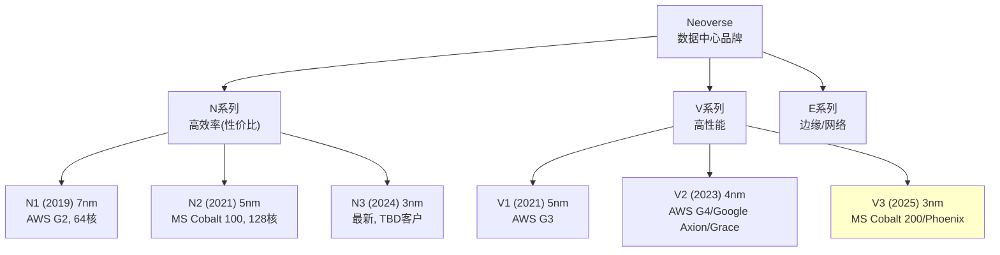

**每一代性能跃升**: 约15-25%单线程性能提升(同功耗下)或30-40%能效提升(同性能下)。ARM的年度迭代节奏(12-18个月/代)快于Intel(18-24个月/代)。

### 5.6 ARM DC版税增长的五个推动力与五个阻力

理解ARM在数据中心的增长轨迹需要平衡分析推动力和阻力:

**五个推动力(牛市因素)**:

| # | 推动力 | 量化影响 | 时间线 | 置信度 |
|---|-------|:------:|:-----:|:-----:|
| P1 | AI推理需求爆发 | DC芯片出货×3(FY25→FY28) | 正在发生 | H |
| P2 | 超大规模自研加速 | G5/Cobalt200/Axion2 | 2026-2027 | H |
| P3 | CSS在DC的渗透 | 版税率×2-3(TLA→CSS) | 2026-2028 | M |
| P4 | ARM性能/功耗优势 | 服务器芯片TCO -20-30% | 持续 | H |
| P5 | 边缘AI/5G+DC融合 | 新增DC-边缘ARM芯片需求 | 2027+ | M |

**五个阻力(熊市因素)**:

| # | 阻力 | 量化影响 | 时间线 | 置信度 |
|---|------|:------:|:-----:|:-----:|
| R1 | ALA客户低版税率 | 前4大客户中2家用ALA | 结构性 | H |
| R2 | RISC-V DC进入 | Tenstorrent 2026量产 | 2026-2028 | M |
| R3 | AI CapEx周期风险 | -30%调整=$900亿缩减 | 不确定 | M |
| R4 | Intel/AMD功耗追赶 | Lunar Lake/Turin -40%功耗 | 2025-2026 | H |
| R5 | Phoenix信任损失 | 客户加速评估替代 | 2026+ | M |

**净效应评估**: 推动力在2025-2027年仍占主导(P1+P2的AI需求增长太强)。但从2028年开始，R2+R4的阻力将显著增强。ARM的DC版税CAGR可能呈现"先高后低"的模式: FY2025-FY2027 CAGR 50-80% → FY2027-FY2030 CAGR 15-30% → FY2030+ CAGR <10%。这与市场隐含的"长期高增长"假设不一致。

### 5.7 数据中心ARM vs x86: 工作负载适配性矩阵

ARM在数据中心不是"通用替代x86"——不同工作负载对架构的偏好显著不同:

| 工作负载 | ARM优势 | x86优势 | 当前最佳选择 | ARM未来份额(FY2030E) |
|---------|--------|--------|:--------:|:-------------:|
| AI训练(大模型) | 无(GPU主导) | 无(GPU主导) | GPU+任意CPU | 30%(Host CPU) |
| AI推理(LLM) | 功耗效率+核数 | 单线程性能 | 各有优势 | 35-45% |
| Web服务 | 功耗/核数 | 生态成熟 | ARM领先 | 40-50% |
| 数据库(OLTP) | 核数(并发) | 单线程(延迟) | 取决于DB类型 | 25-35% |
| HPC/科学计算 | 部分(Fugaku) | 传统优势 | 混合 | 15-25% |
| 企业IT(ERP/CRM) | 弱(兼容性差) | 极强(40年生态) | x86 | 5-10% |
| 虚拟桌面(VDI) | 弱 | 强 | x86 | 5-10% |
| 容器/微服务 | 强(K8s支持) | 强 | 各半 | 35-45% |
| CDN/边缘 | 极强(低功耗) | 弱 | ARM领先 | 50-60% |
| 存储系统 | 中等 | 中等 | 各半 | 25-35% |

**加权平均ARM DC份额(FY2030E)**: ~30-35%

**关键洞察**: ARM在DC的"黄金工作负载"是AI推理、Web服务、容器/微服务和CDN/边缘——这些都是增长最快的领域。但在企业IT(ERP/CRM)——全球IT支出最大的单一类别($500B+/年)——ARM几乎没有存在感。这意味着ARM的DC份额可能在"新经济"(云原生)中达到40-50%，但在"旧经济"(企业IT)中停留在5-10%。整体DC份额的天花板可能是30-35%而非市场期待的50%。

### 5.8 CSS在数据中心的加速逻辑与限制

**CSS对DC客户价值最大的原因**:
1. AI竞赛时间压力: 12个月上市加速值$100M+机会成本
2. 3nm/2nm设计成本$500M+: CSS降低NRE风险
3. 异构计算SoC复杂度: CSS提供验证过的CPU子系统

**CSS在DC的限制**:
- ALA客户(AWS/Google/Microsoft/NVIDIA)自研能力强，不需要CSS → DC的最大客户恰好是CSS需求最低的
- CSS的DC目标客户是"第二梯队"(云厂商二线产品/电信设备商/中小DC芯片设计公司)
- 如果CSS主要被第二梯队采用，其对DC版税的提升作用被出货量限制(第二梯队出货量远小于超大规模)

**这意味着**: DC版税增长的主要驱动力不是CSS版税率提升，而是ALA客户(低版税率)的芯片出货量增长。CSS在DC的真实贡献可能被高估。

### 5.9 DC版税的"质量vs数量"矛盾

ARM在数据中心面临一个根本性矛盾:

**高质量版税(CSS, $40-90/chip)**来自二线DC客户(Oracle, Fujitsu, 中小设计公司)——但这些客户的出货量有限(每家<500K chips/年)。

**高数量版税(ALA, $10-22/chip)**来自一线超大规模客户(AWS, Google, NVIDIA)——但这些客户自研核心设计，版税率低。

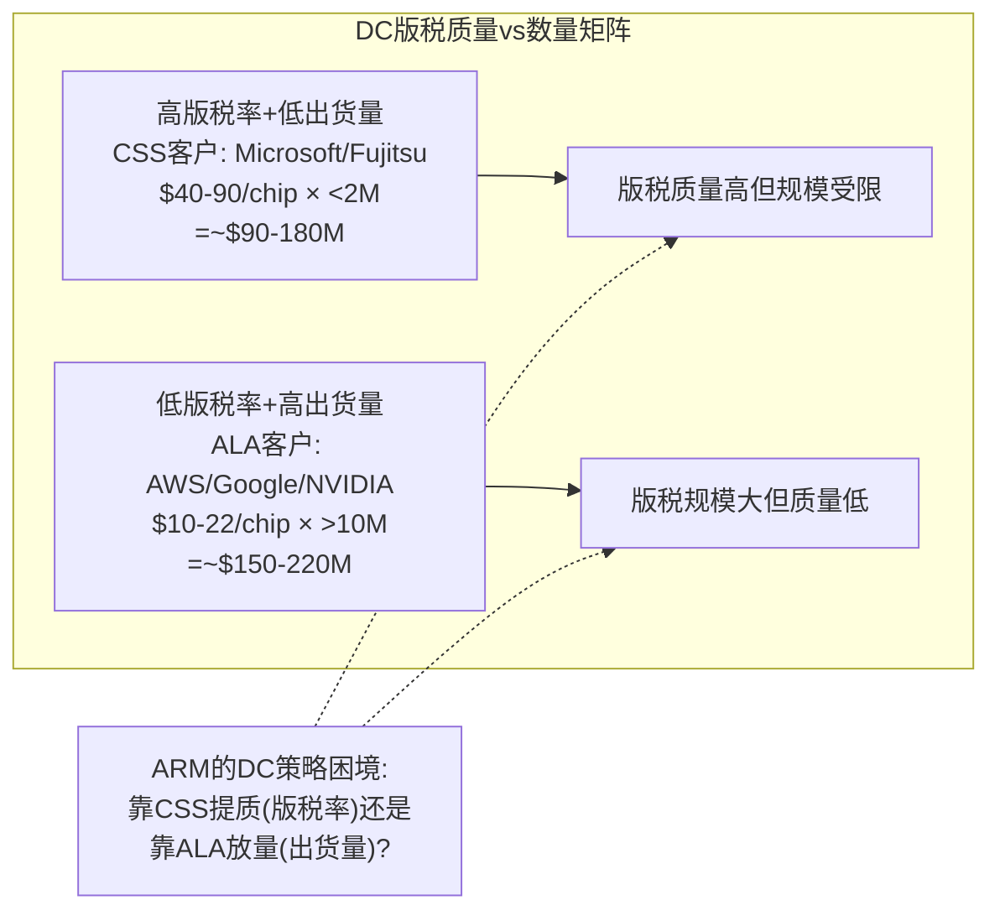

**管理层叙事检验**: ARM管理层强调"CSS加速采用"来暗示DC版税率持续提升。但如果CSS在DC的主要采用者是出货量有限的二线客户，而一线客户(贡献>60%DC出货量)坚持使用ALA/TLA，则DC版税的**加权平均版税率**提升速度将远慢于管理层暗示的CSS单点版税率提升。

**量化检验**: 假设DC出货量分布 = ALA(65%) + TLA(20%) + CSS(15%):
- 加权版税率 = 0.65×$15 + 0.20×$25 + 0.15×$55 = **$23.0/chip**
- vs 如果全部CSS: $55/chip → 实际加权版税率仅为CSS的42%
- 即使CSS渗透到30%(乐观): 加权版税率 = 0.50×$15 + 0.20×$25 + 0.30×$55 = **$29.0/chip** — 仅提升26%

**结论**: DC版税率提升受限于ALA客户的结构性存在。除非ARM能说服AWS/Google/NVIDIA升级到CSS(可能性极低——他们有自研能力)，DC版税的增长将主要依赖出货量而非版税率——这与ARM整体"提价驱动增长"的叙事不一致。

---

## 第6章: Phoenix计划 — IP授权商变身芯片设计师的豪赌

### 6.1 Phoenix是什么

Phoenix是ARM历史上最大胆的战略转型: 从纯IP授权商变为完整芯片设计商。

**Phoenix芯片规格**:
- 128个Neoverse V3核心
- TSMC 3nm, 双die封装(MCM)
- 12通道DDR5内存
- 96条PCIe Gen6通道
- 目标: 数据中心AI推理 + 通用计算
- 竞争目标: 与NVIDIA Grace和AMD EPYC正面竞争

**首批客户**: Meta(首客户) → OpenAI(via SoftBank Stargate) → Cloudflare

### 6.2 为什么Phoenix是"SoftBank的项目"而非"ARM的最优策略"

Phoenix的战略逻辑在ARM独立经营的框架下并不显然:

**如果ARM是独立公司(无SoftBank)**:
- 最优策略: 维持IP授权中立性, 最大化被授权方数量和版税
- Phoenix风险: 与客户(AWS/Google/Microsoft/NVIDIA)直接竞争 → 可能导致客户加速评估RISC-V
- 资本需求: 芯片设计NRE $100M+, 改变ARM的轻资产属性
- 估值影响: 芯片设计公司P/S 5-15x vs IP授权P/S 25-30x

**在SoftBank控制下**:
- SoftBank需要ARM芯片支撑其AI基础设施愿景(Stargate需要CPU)
- SoftBank的$100B+ Izanagi计划明确包含ARM芯片设计
- 孙正义声称ARM是"ASI的基础技术" → 仅做IP授权不符合这个叙事
- SoftBank已以$6.5B收购Ampere(ARM服务器芯片公司) → 整合逻辑

**核心矛盾**: Phoenix可能最大化SoftBank的战略价值(整合AI供应链)，但牺牲ARM的中立性和被授权方信任。这不是CEO Rene Haas的商业判断，而是孙正义的AI愿景在ARM上的投射。

### 6.3 Phoenix竞争定位矩阵

| 维度 | Phoenix | NVIDIA Grace | AMD EPYC | Intel Xeon | AWS Graviton5 |
|------|---------|-------------|----------|-----------|--------------|
| 核心数 | 128 | 72 | 128(Bergamo) | 144(Sierra Forest) | 192 |
| 架构 | ARM v9 V3 | ARM v9 V2 | x86 Zen5 | x86 | ARM v9 |
| 制程 | TSMC 3nm | TSMC 4nm | TSMC 4nm | Intel 3 | TSMC 3nm |
| 功耗目标 | 350W(估) | 500W(Superchip) | 360W | 350W | 未知 |
| 内存 | 12ch DDR5 | LPDDR5X(一体) | 12ch DDR5 | 8ch DDR5 | 12ch DDR5(估) |
| PCIe | Gen6 x96 | Gen5 x48 | Gen5 x128 | Gen5 x80 | 未知 |
| 上市时间 | 2027 H1(估) | 已量产 | 已量产 | 已量产 | 2026 H1(估) |
| 差异化 | ARM官方最优核+CSS级互连 | GPU协同(NVLink C2C) | 生态最成熟 | 企业兼容性 | AWS专用,不外售 |
| 客户 | Meta/OpenAI/Cloudflare | NVIDIA DC客户 | 所有DC | 企业IT | AWS only |

**Phoenix的核心差异化**: ARM拥有最好的核心IP(V3是ARM自己设计的最强核心)，且使用CSS级别的互连/缓存设计。理论上Phoenix应该是"最纯正的ARM芯片"。但这也是问题——**如果Phoenix表现出色，被授权方会质疑ARM是否把"最好的"留给了自己**。

### 6.4 Phoenix财务影响建模

**成本模型(估计)**:

| 成本项 | 金额($M) | 备注 |
|--------|:------:|------|
| 芯片设计NRE(5年摊销) | $100-200/年 | 3nm MCM设计, 含IP+PD+验证 |
| TSMC 3nm晶圆 | $15K-20K/wafer | 每wafer产~100-150颗(MCM) |
| 封装测试(OSAT) | $50-100/chip | MCM封装成本较高 |
| **每颗芯片总成本** | **$200-350** | 含摊销NRE |
| **预期售价** | **$3,000-8,000** | 参考AMD EPYC/Intel Xeon |
| **毛利率(估计)** | **75-90%** | 高于芯片设计公司平均(因ARM自有IP) |

**Phoenix收入情景**:

| 情景 | FY2028出货(K) | 售价($K) | 芯片收入($M) | 对ARM总收入贡献 |
|------|:----------:|:------:|:----------:|:----------:|
| 牛市 | 500 | 6.0 | 3,000 | +43% |
| 基准 | 200 | 5.0 | 1,000 | +14% |
| 熊市 | 50 | 4.0 | 200 | +3% |
| 失败 | <10 | — | <50 | 可忽略 |

**估值悖论**(量化版):

| Phoenix结果 | 对收入影响 | 对混合毛利率 | 对P/S倍数 | 对市值净效应 |
|-----------|:-------:|:--------:|:------:|:--------:|
| 大成功($3B) | +43% | 95%→90% | 28x→20x | **-10%** |
| 适度成功($1B) | +14% | 95%→93% | 28x→25x | **+5%** |
| 失败(<$50M) | +0% | 不变 | 28x→26x(信任损失) | **-7%** |

**最优路径**: 适度成功(Meta等少数客户, $500M-1B收入, 不改变ARM的"IP授权为主"定位) → 这也是管理层似乎在追求的路径。

### 6.5 Phoenix蚕食效应量化

Phoenix作为ARM自己的芯片，如果采用CSS级别授权(从ARM IP部门到ARM芯片部门)，每颗Phoenix芯片实际上"消耗"了一个CSS版税收入机会:

```
蚕食效应 = Phoenix出货量 × (CSS版税率 - 内部转移价)
```

假设: CSS版税$50-80/chip, Phoenix内部转移价$0(同公司):
- 如果Phoenix出货200K颗: 蚕食$10-16M/年(微不足道)
- 如果Phoenix出货500K颗: 蚕食$25-40M/年(仍然小)
- 如果Phoenix出货2M颗: 蚕食$100-160M/年(开始有意义)

**结论**: Phoenix对ARM版税的直接蚕食有限(因为出货量相对小)。真正的风险不是蚕食，而是**信任损失**——被授权方因ARM进入芯片设计而加速评估RISC-V。这种间接损害难以量化但可能比直接蚕食大一个数量级。

**"蚕食vs信任税"的框架比较**:
- **直接蚕食**(可量化): Phoenix出货×CSS版税率 = $10-160M/年 — 占ARM总版税<5%
- **信任税**(难量化但可能更大): 被授权方加速RISC-V评估导致的长期客户流失 = $45-100M/年渐进, 协同崩塌时可能$200-500M
- **净结论**: 市场关注"Phoenix芯片能卖多少钱"(直接收入), 但应该关注的是"Phoenix让ARM丢了多少客户信任"(间接成本)

历史类比: Intel在2019年发布Xe GPU时，AMD/NVIDIA并未因Intel进入GPU市场而恐慌。但如果ARM(作为CPU IP供应商)开始设计完整CPU芯片，被授权方的反应会强烈得多——因为ARM是他们的"供应商"变成了"竞争对手"，而Intel进入GPU市场不影响AMD/NVIDIA的CPU供应链。ARM的情况更像是如果TSMC宣布要自己设计芯片——这将动摇整个代工商业模式的信任基础。

### 6.6 Phoenix时间线与里程碑

| 里程碑 | 预期时间 | 状态 | 影响 |
|--------|---------|:----:|------|
| Phoenix设计完成 | 2025 H2 | 完成 | TSMC 3nm流片 |
| 工程样片(A0) | 2026 H1 | 进行中 | 首次硅验证 |
| Meta部署测试 | 2026 H2 | 待定 | 首客户验证 |
| B1修正版(如需) | 2026 H2-2027 H1 | 待定 | bug修复+优化 |
| 大规模量产 | 2027 H1 | 待定 | 收入开始确认 |
| OpenAI/Stargate采用 | 2027+ | 待定 | SoftBank战略闭环 |

如果Phoenix时间线延迟(芯片设计项目延迟极为常见——参考Intel Meteor Lake延迟18个月)，ARM将面临双重损失: 既没有芯片收入，又已经疏远了部分被授权方。

### 6.7 Phoenix的"信任税": 被授权方反应矩阵

Phoenix的最大风险不在于技术或财务，而在于**生态信任损失**。ARM作为"中立IP供应商"的定位是其商业模式的基石——当供应商变成竞争对手时，客户会重新评估替代方案:

| 被授权方 | 与Phoenix竞争? | 反应强度 | 可能的行动 | 对ARM版税影响 |
|---------|:----------:|:------:|----------|:---------:|
| AWS | 是(DC CPU) | **高** | 加速Graviton自研+评估RISC-V | -$10-20M/年 |
| Google | 是(DC CPU) | **高** | 加速RISC-V投资(已在进行) | -$10-20M/年 |
| Microsoft | 是(DC CPU) | 中 | 维持Cobalt但分散供应商 | -$5-10M/年 |
| NVIDIA | 部分(Grace竞争) | 中 | NVIDIA有更强的GPU依赖,不太可能离开ARM | 微小 |
| Qualcomm | 间接(DC) | **高** | 已有Nuvia自研核,可能加速Oryon-RISC-V评估 | -$20-50M/年 |
| MediaTek | 否(不同市场) | 低 | 观望 | 无 |
| Samsung | 否(不同市场) | 低 | 观望 | 无 |
| 中国客户群 | 否(政策隔离) | 低 | 继续通过Arm China | 无 |
| **总信任税估计** | — | — | — | **-$45-100M/年** |

**信任税的非线性**: 上述估计是"渐进情景"(每家客户独立决策)。但如果2-3家超大规模客户同时宣布"RISC-V战略加速"(例如Google宣布Axion下一代用RISC-V + AWS宣布边缘芯片转RISC-V)，可能触发**协同效应**——其他客户会认为"RISC-V生态已达到临界质量"而加速评估。这种"协同信任崩塌"的影响可能是渐进情景的3-5倍。

### 6.8 Phoenix与SoftBank AI帝国的联动

Phoenix不是孤立的芯片项目——它是SoftBank更大的AI战略拼图中的一块:

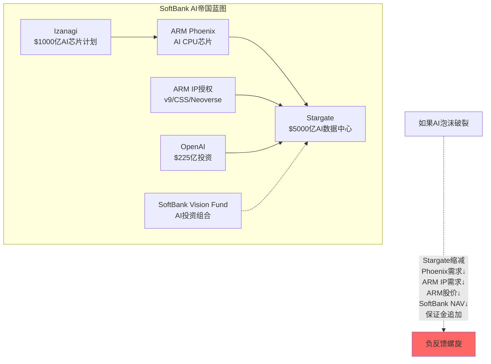

Phoenix在这个战略中扮演的角色: SoftBank需要自己控制的AI芯片(不依赖NVIDIA)来部署在Stargate数据中心。如果没有Phoenix，SoftBank的所有AI基础设施都要向NVIDIA付"GPU税"——类似于ARM对芯片厂商收的"IP税"。Phoenix让SoftBank从"ARM IP → 其他公司芯片 → SoftBank数据中心"变成"ARM IP → ARM芯片 → SoftBank数据中心"，捕获更多垂直整合价值。

**对公众股东的含义**: Phoenix的商业逻辑在SoftBank的全局战略中是合理的——但对ARM的公众股东(10%流通股)来说，这意味着ARM的资源(R&D、管理层时间、TSMC产能额度)正在被用于服务SoftBank的AI愿景，而非最大化所有股东的利益。这是Controlled Company治理结构的经典问题——控股股东的利益与公众股东不完全一致。

---

## 第7章: 产业链生态位 — ARM在半导体价值链中的独特坐标

### 7.1 ARM的产业链位置

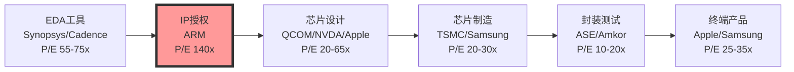

ARM处于半导体价值链的**第二环节** — IP授权。P/E倍数在整条产业链中最高(140x vs 行业平均20-40x)。

### 7.2 ARM TAM天花板: 1-2%的数学约束

如果全球半导体市场规模为$6,000亿(2025)，ARM的"税率"能达到多少？

| IP授权商 | 年收入 | 相关市场规模 | 渗透率 |
|---------|:-----:|:--------:|:-----:|
| ARM | $4.7B | $6,000亿 | **0.78%** |
| Qualcomm QTL | ~$5B | ~$1,500亿 | ~3.3% |
| Dolby | ~$1.3B | ~$3,000亿 | ~0.4% |
| MPEG LA | ~$2B | ~$2,000亿 | ~1.0% |
| **ARM共识FY2030** | **$11.2B** | **~$7,500亿** | **1.49%** |

**天花板计算**: IP授权在半导体收入中的占比从未超过3-4%(全行业合计)。ARM要从0.78%增长到1.5%+，需要在多个终端市场同时提高版税率——这在RISC-V竞争背景下越来越困难。

### 7.3 与EDA的比较: 估值锚定

| 维度 | ARM | Synopsys | Cadence |
|------|-----|----------|---------|
| 收入模式 | 授权+版税 | 订阅+维护 | 订阅+维护 |
| 收入规模 | $4.7B | $6.1B | $4.3B |
| 毛利率 | 95.4% | 80.2% | 89.4% |
| 营业利润率(GAAP) | 18.7% | 21.4% | 30.9% |
| P/E (TTM) | **140x** | 55x | 75x |
| 增长率 | 26% | 38% | 6% |
| 替代风险 | RISC-V(**高**) | 开源EDA(低) | 开源EDA(低) |
| R&D/收入 | 56% | 32% | 25% |
| SBC/收入 | ~18% | ~12% | ~10% |

**关键差异**: EDA工具没有零成本的开源替代品(开源EDA工具如OpenROAD在商业级设计中不可用)。ARM有RISC-V。ARM的P/E是EDA同行的2-2.5倍，但面临更高的替代风险——这个溢价完全来自市场对ARM"增长"而非"安全性"的定价。

### 7.4 全球半导体IP市场格局

| 公司 | IP收入(FY2025E) | 市场份额 | 核心IP | 与ARM关系 |
|------|:-----------:|:------:|--------|---------|
| **ARM** | $4.0B+ | ~40-45% | CPU核心 | — |
| Synopsys IP | ~$1.5B | ~15-18% | 接口/安全/处理器 | CSS竞争 |
| Cadence IP | ~$0.8B | ~8-10% | 接口/存储 | 互补 |
| Imagination | ~$0.3B | ~3% | GPU IP | 曾被ARM竞争 |
| CEVA | ~$0.2B | ~2% | DSP/AI/连接 | 互补 |
| Alphawave | ~$0.3B | ~3% | 高速接口 | 互补 |
| **全球IP市场** | ~$8-10B | 100% | — | — |

### 7.5 产业链风险传导: ARM的四个脆弱节点

**路径1: TSMC产能→Phoenix**
Phoenix让ARM首次直接依赖TSMC 3nm产能。如果台海局势紧张或TSMC产能分配优先其他客户(Apple/NVIDIA)，Phoenix出货量将受限。讽刺的是，Phoenix让ARM从"零制造风险"变成了"有制造风险"。

TSMC的3nm产能分配优先级序列(基于历史模式和收入贡献):
1. Apple(单一最大客户, ~25% TSMC收入) — iPhone/Mac SoC
2. NVIDIA(快速增长, ~10-15% TSMC收入) — GPU/Grace
3. AMD(稳定大客户, ~10%) — EPYC/Ryzen
4. Qualcomm(~7-8%) — Snapdragon
5. MediaTek(~5-6%) — Dimensity
6. **ARM/Phoenix(新客户, <1%)** — 优先级最低

ARM作为TSMC的新晶圆客户(区别于ARM作为IP供应商的长期关系)，在产能紧张时几乎没有议价权。这是一个"从不排队到要排队"的结构性变化。

**路径2: Qualcomm诉讼→ARM定价权**
Qualcomm通过收购Nuvia获得的CPU设计授权转让争议。Qualcomm胜诉(2024年裁定)意味着ARM的授权合同可转让性受限——大客户可通过收购获得ARM授权来规避提价。

这个判决的深远影响被市场低估:
- **短期**: ARM对Qualcomm Oryon芯片的版税主张受限(可能损失$50-100M/年版税)
- **中期**: 其他大客户(Google/Amazon)也可能通过收购小型ARM授权方获得更低费率
- **长期**: ARM的"每客户独立授权"定价模型的基础被动摇——合同可转让性判例将降低ARM对每个新客户的定价权
- **定量影响**: 如果前10大客户通过M&A获得15-20%版税折扣，ARM年版税收入影响约-$200-400M

Qualcomm Oryon的特殊地位: Qualcomm使用Nuvia的自研核心设计(不是ARM的Cortex核心)来制造PC/数据中心芯片。如果这些芯片只需支付ALA级别版税(而非TLA级别)，ARM的PC版税天花板将大幅降低。

**路径3: AI投资周期→ARM版税**
ARM的DC增长高度依赖AI基础设施投资($1500亿+/年)。如果出现类2000年互联网泡沫后的急剧收缩，DC版税将随之下降。

AI CapEx周期的历史映射:

| 周期 | 峰值投资 | 投资衰退幅度 | 恢复时间 | 类比ARM影响 |
|------|:------:|:--------:|:------:|-----------|
| 2000 互联网 | ~$110B | -60% | 5年 | DC版税-50-60% |
| 2007 金融危机 | ~$50B(IT) | -30% | 3年 | DC版税-25-35% |
| 2016 云计算 | ~$120B | -15% | 1年 | DC版税-10-15% |
| **2025 AI** | **~$300B+** | **?** | **?** | **DC版税-??%** |

当前AI CapEx规模(>$300B/年)远超任何历史周期。如果出现30%回调(历史中位数)，$900亿+的投资收缩将直接影响ARM的DC芯片出货量。ARM管理层引导的"DC版税超越移动"目标将延迟2-3年。

**关键脆弱点**: ARM的DC版税增长(>100% YoY)高度杠杆化于AI CapEx增速。如果增速从+40%放缓到+10%，ARM的DC版税增速可能从>100%降至20-30%——因为版税滞后芯片出货1-2季度，而芯片出货滞后CapEx决策6-12个月。

**路径4: 地缘政治→Arm China**
如果美中科技脱钩加深，Arm China可能无法获得最新ARM IP。Arm China的$749M收入(占ARM 19%)面临政策风险。中国客户将加速向RISC-V迁移。

Arm China的复杂法律结构:
- Arm China(安谋中国)是一个独立的中国实体，ARM持有约48%的经济利益(但控制权有限)
- 2020-2022年ARM与前CEO Allen Wu的控制权争夺已解决，但暴露了Arm China治理的脆弱性
- 中国客户通过Arm China获得ARM IP时，版本通常滞后全球最新版1-2代
- 中国政府已将RISC-V列为"自主可控"技术路线的核心组成部分

**三种地缘情景对ARM收入的影响**:

| 情景 | 概率 | Arm China收入影响 | ARM总收入影响 | 时间线 |
|------|:---:|:------------:|:--------:|:-----:|
| 缓和(现状延续) | 40% | +5-10%/年 | +1-2%/年 | — |
| 渐进脱钩 | 40% | -5-15%/年 | -1-3%/年 | 3-5年 |
| 急剧脱钩 | 20% | -30-50%/年 | -6-10%/年 | 1-2年 |
| **加权平均** | — | **-2-5%/年** | **-0.5-1%/年** | — |

急剧脱钩情景下，Arm China的$749M收入可能在2年内缩减至$375-525M，同时中国RISC-V生态加速成熟(倒逼效应)。对ARM全球估值的影响不仅限于中国收入损失，还包括"RISC-V在中国成熟后反向出口到全球市场"的二阶效应。

### 7.6 ARM在全球半导体供应链中的不可替代性评估

ARM常被描述为"不可替代的"——但这个论断需要按终端市场逐一检验:

| 终端市场 | ARM当前份额 | 替代品 | 替代难度(1-10) | 替代时间线 | 不可替代性 |
|---------|:--------:|--------|:----------:|:--------:|:--------:|
| 高端手机AP | >99% | RISC-V | 9 | 5-7年 | **极高** |
| 中低端手机AP | >98% | RISC-V | 7 | 3-5年 | 高 |
| DC/服务器CPU | ~22% | x86(Intel/AMD) | 3 | 已存在 | **低** |
| IoT/MCU | ~65% | RISC-V | 4 | 1-3年 | **低** |
| 汽车ADAS | ~80% | RISC-V(Quintauris) | 7 | 5-7年 | 高 |
| 汽车车身 | ~50% | RISC-V | 5 | 3-5年 | 中 |
| PC/笔记本 | ~13% | x86(Intel/AMD) | 2 | 已存在 | **极低** |
| 网络/基站 | ~55% | RISC-V/x86 | 6 | 3-5年 | 中 |

**综合不可替代性评分**: 5.4/10 — ARM在高端移动和汽车ADAS中近乎不可替代(5-7年内)，但在数据中心、IoT和PC中面临现有或快速发展的替代方案。

**关键洞察**: ARM的不可替代性呈现**U型分布** — 在最高端(旗舰手机SoC)和最低端(超低功耗IoT)两端最强，而在中间层(数据中心、PC)最弱。但ARM的增长叙事(DC版税>移动)恰恰集中在不可替代性最低的领域——这是估值逻辑中的一个隐性矛盾。

---

## 第7A章: 历史类比 — Intel护城河坍塌(2005-2020)与Visa网络效应深化对比

### 7A.1 Intel护城河坍塌时间线: ARM的镜像风险

Intel从2005年的绝对霸主到2024年的市值跌去67%，经历了一系列看似微小但累积致命的护城河侵蚀。ARM可以从中提取的教训远比"不要犯Intel的错误"更深:

**Intel护城河坍塌年表**:

| 年份 | 事件 | 护城河影响 | 类比ARM |
|------|------|----------|---------|
| 2005 | Apple从PowerPC转向Intel | Intel处于巅峰——Mac用Intel证明其"最佳选择" | ARM当前阶段: 99%渗透=巅峰 |
| 2006 | Intel出售XScale ARM业务 | 放弃了自己的ARM芯片据点——战略性退出移动市场 | 如果ARM放弃某个终端市场 |
| 2007 | Apple请求Intel制造iPhone芯片，**CEO Otellini拒绝** | 史上最严重的战略失误：将智能手机时代拱手让出 | — |
| 2007 | iPhone使用ARM | 移动市场选择ARM而非x86 | — (ARM是受益者) |
| 2010 | ARM Cortex-A15接近PC级性能 | 开始证明ARM"不只是手机芯片" | RISC-V目前类似此阶段 |
| 2013 | Intel放弃Atom移动芯片 | 承认无法与ARM在功耗效率上竞争 | RISC-V在IoT已开始取代ARM |
| 2015 | 10nm延迟(原计划2016) | 制造优势首次动摇 | ARM的"架构优势"如果被RISC-V追平 |
| 2017 | AMD Zen发布 | 性能差距从50%缩小到<10% | Tenstorrent Ascalon性能接近Neoverse V3 |
| 2018 | ARM Neoverse进入服务器 | Intel服务器垄断首次被正面挑战 | RISC-V在嵌入式已取得30%份额 |
| 2020 | Apple M1发布 | 证明ARM芯片全面超越Intel | 如果2028年RISC-V出现"M1时刻" |
| 2021-24 | Intel 7nm/4nm持续延迟 | 制造优势彻底丧失 | — |
| 2024 | Intel市值从2020高点跌67% | 从$250B→$85B, P/E从15x→亏损 | — |

**关键模式**: Intel的坍塌不是一夜之间发生的——从2005年巅峰到2020年Apple M1(确认护城河坍塌)经历了**15年**。但真正的估值崩塌集中在**最后3-5年**(2020-2024, -67%)。

**映射到ARM的时间线**:
- **2020-2025**: ARM处于巅峰期(类似Intel 2005-2010), RISC-V相当于早期ARM
- **2025-2028**: RISC-V性能追平+生态初步成熟(类似Intel 2015-2018, AMD Zen追平)
- **2028-2030**: 可能出现RISC-V的"M1时刻"(类似Intel 2020)
- **2030+**: 如果RISC-V成功，ARM估值将面临Intel式压缩

**Intel教训1: 护城河坍塌的非线性**
Intel的市场份额在2005-2017年间几乎没有变化(服务器>95%)。但"份额不变≠护城河不变"——AMD Zen的开发、ARM Neoverse的准备、Apple M1的设计都在这段时间悄悄进行。当护城河真正开始坍塌(2017-2020)，速度超过所有人预期。ARM也可能经历类似模式: 份额数据在2025-2028看起来很好(>95%手机、>20%服务器)，但RISC-V的准备工作已在水面下进行。

**Intel教训2: 提价是护城河坍塌的催化剂**
Intel在2005-2015年间利用垄断地位持续提高服务器芯片价格(从$1000→$5000+高端)。这创造了AMD(和后来的ARM)进入的经济激励——如果Intel一直保持低价策略，AMD的Zen项目可能永远不会获得AMD董事会批准(ROI不够)。ARM正在重复Intel的错误: v9翻倍→CSS再翻倍→v10可能再翻→RISC-V进入的经济激励持续上升。

**Intel教训3: "生态壁垒不可逾越"是错觉**
Intel最自信的护城河是x86软件生态——"数十亿行x86代码不可能重写"。Apple M1证明了这个假设是错的: Rosetta 2翻译层实现了95%+ x86→ARM兼容性。RISC-V面临类似叙事("ARM软件生态不可能迁移")，但LLVM/GCC工具链已经消除了编译层壁垒，Android GKI已经为RISC-V做了内核适配。生态壁垒是**可以被技术创新绕过的**。

### 7A.2 Visa网络效应深化对比: ARM为什么不是支付网络

1.4节简要讨论了ARM vs Visa。这里做更系统的结构分析:

**网络效应类型对比**:

| 维度 | Visa | ARM | 差异 |
|------|------|-----|------|
| 网络类型 | **双边平台**(商户↔持卡人) | **单边生态**(开发者→软件→设备) | Visa的网络效应更强 |
| 直接网络效应 | 更多持卡人→对商户更有价值 | 更多ARM设备→对开发者更有价值 | 类似 |
| 间接网络效应 | 更多商户→对持卡人更有价值 | 更多软件→对设备用户更有价值 | 类似 |
| 网络排他性 | **高**(商户通常不自建支付网络) | **低**(开发者可同时为ARM+RISC-V编码) | 关键差异 |
| 迁移成本 | **极高**(全球数千万商户终端) | **中等**(编译器切换+库移植) | ARM更脆弱 |
| 替代品 | 无零成本替代 | RISC-V=零成本替代 | 根本性差异 |
| 监管 | 费率受监管限制 | 无费率监管 | ARM当前优势 |
| 历史稳定性 | 50年(从BankAmericard至今) | 35年(但RISC-V仅存在15年) | Visa更成熟 |

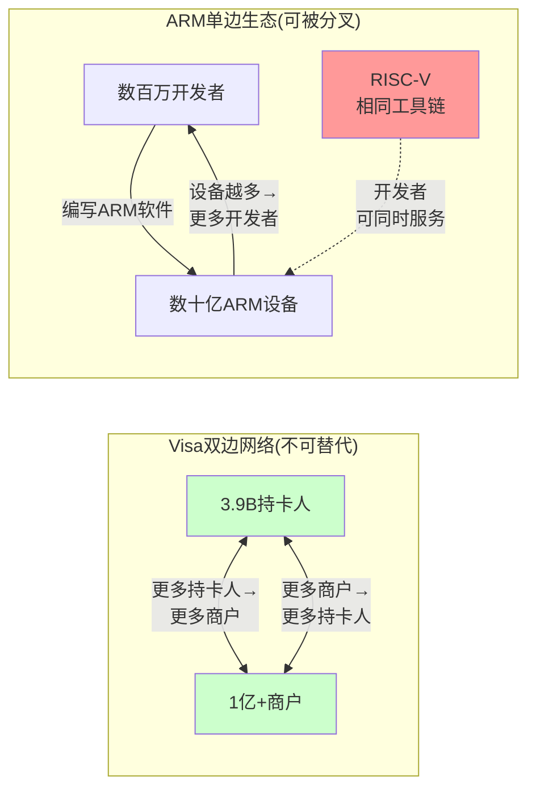

**核心洞察**: Visa的网络是**排他性**的——你不能自建一个与Visa兼容的支付网络(需要银行、商户、监管的多边协议)。ARM的生态是**可分叉**的——RISC-V使用相同的编译器(LLVM/GCC)、相同的操作系统(Linux)、相同的开发语言。开发者不需要"离开ARM"就能"同时支持RISC-V"。这意味着ARM的网络效应护城河比Visa薄一个量级。

**估值含义**: Visa的P/E(33x)已经包含了"不可替代基础设施"的稳定性溢价和费率管制折扣。ARM的P/E(140x)包含了"不可替代基础设施"的假设 + 高增长溢价，但没有折入RISC-V替代风险。如果市场开始像定价"有替代品的基础设施"(P/E 40-60x)而非"不可替代的基础设施"(P/E 25-35x)来定价ARM，中间的估值差就是下跌空间。

### 7A.3 六个历史类比的综合评估: ARM最像谁?

ARM的商业模式在科技史上有多个潜在类比。逐一评估其适用性:

| 类比 | 核心相似点 | 核心差异点 | 对ARM估值的启示 | 适用度 |
|------|----------|----------|---------------|:-----:|
| **Visa/Mastercard** | 交易型收入, 轻资产, 高毛利 | Visa无开源替代, 双边网络 | P/E 30-35x("不可替代") | 3/10 |
| **Microsoft Windows** | 操作系统级锁定, 授权+版税 | Windows没有零成本替代(Linux桌面失败) | 历史P/E 25-35x | 5/10 |
| **Qualcomm QTL** | IP授权+版税, 芯片出货量驱动 | QTL面临持续法律挑战, 费率下降趋势 | QTL P/E 15-20x(含折扣) | 7/10 |
| **Intel(2005-2010)** | 架构垄断, 高P/E, "不可替代" | Intel当时无开源替代(AMD是商业对手) | 巅峰P/E 25-30x→2024 亏损 | 6/10 |
| **Dolby** | IP授权, 标准嵌入, 高毛利 | Dolby市场更窄, 增长更慢 | P/E 30-40x(稳定增长) | 5/10 |
| **ASML** | 半导体关键环节, 无替代 | ASML是物理设备(真正不可复制) | P/E 35-50x | 4/10 |

**最佳类比: Qualcomm QTL** — 相同的IP授权+版税模式, 面临类似的定价权挑战(客户法律挑战+开放标准威胁), 经历过版税率被迫下调的历史。QTL的P/E在15-20x区间，如果ARM的长期稳态P/E向QTL靠拢(考虑到RISC-V比Wi-Fi标准对QTL的威胁更大)，当前140x P/E隐含了7-9倍的过度溢价。

**QTL类比的定量桥接**:

| 维度 | QTL | ARM | ARM溢价理由 | 合理溢价? |
|------|:---:|:---:|-----------|:-------:|
| P/E | 17x | 140x | ARM增长更快(+24% vs +5%) | 部分合理(2-3x) |
| 收入增速 | +5% | +24% | — | — |
| 毛利率 | ~100% | 95% | 相近 | 不支持溢价 |
| 替代威胁 | 法律挑战/标准化 | RISC-V(更严峻) | ARM应该折价 | 支持折价 |
| 客户集中 | 类似(Top 5 >50%) | 类似(Top 5 56%) | 相近 | 不支持溢价 |
| 关联交易 | 无 | SoftBank 30% | ARM应折价 | 支持折价 |
| 控股结构 | 分散持股 | SoftBank 90% | ARM应折价 | 支持折价 |

**合理P/E推导**: QTL 17x × 增长溢价2.5x × 护城河折扣0.85x × 治理折扣0.90x = **~32x** — 这意味着如果市场按"最佳类比"重新定价ARM，股价目标为 $32x × EPS($0.91) = **$29**，对应当前$128下跌77%。

这个数字显然是极端情景——市场不太可能在短期内重新定价ARM为"另一个QTL"。但它提供了一个有用的"估值地板"参考: 即使在最极端的重新定价情景中，ARM的核心IP授权业务仍然值$30-40B(vs当前$136B)。

### 7A.4 "温水煮青蛙"情景: ARM护城河缓慢侵蚀路径

结合Intel教训和Visa对比，ARM最可能的护城河侵蚀路径不是"突然崩塌"而是"温水煮青蛙":

**24月路径(2026年3月→2028年3月)**:

| 月份 | 事件 | 影响 | ARM份额变化 | 市场反应 |
|------|------|------|:--------:|:------:|
| 0-6月 | Tenstorrent Ascalon量产, Meta RISC-V MTIA部署 | RISC-V首次在DC达到性能平价 | IoT -2pp, DC -1pp | 忽略("小众") |
| 6-12月 | ARM v9渗透到65%+, CSS到20%+, 版税继续增长 | ARM收入增长掩盖份额流失 | IoT -3pp | 乐观("增长超预期") |
| 12-18月 | Quintauris发布汽车RISC-V标准, Google宣布Android 16 RISC-V原生支持 | RISC-V从"可用"升级为"受支持" | IoT -4pp, 汽车设计开始迁移 | 关注("长期风险") |
| 18-24月 | 2-3家中国手机OEM推出RISC-V移动芯片(低端), ARM续约谈判遇阻 | 移动"铁幕"首次出现裂缝 | IoT -5pp, 移动 -1pp | **估值开始调整** |

**这个路径的特点**:
1. 每个月看起来都"没什么大事" — RISC-V的进展是渐进的
2. ARM的收入在整个过程中可能仍在增长(提价效应>份额流失)
3. 但到24月末回头看，ARM的护城河已经从"不可替代"变成了"有替代品但还领先"
4. 这个认知转变一旦被市场接受，P/E从140x到60-80x的压缩可能在3-6个月内完成

**"温水煮青蛙"是ARM最难防守的情景** — 因为每个单独的RISC-V进展都不足以触发警报，但累积效应是致命的。Intel在2005-2020年就经历了完全相同的模式。

---

## 第8章: 管理层与组织能力 — 从IP授权到多面手的转型挑战

### 8.1 CEO Rene Haas深度画像

**职业履历**:
| 时期 | 职位 | 关键经历 |
|------|------|---------|
| 1998-2013 | NVIDIA, 多个IP/合作伙伴角色 | 建立了与ARM紧密的合作关系 |
| 2013-2017 | NVIDIA, IP授权与合作伙伴负责人 | 管理NVIDIA的IP授权业务,含ARM授权 |
| 2017-2022 | ARM, IP产品部门负责人 | 负责Cortex/Neoverse全线IP产品 |
| 2022.2-至今 | ARM CEO | 领导IPO+v9/CSS/Phoenix战略 |

**Haas的战略定位**: 他是一个"产品导向"的CEO(vs SoftBank孙正义的"愿景导向")。Haas在ARM的核心贡献是推动CSS(增量定价权)和加速Neoverse在DC的商业化。Phoenix更多是SoftBank主导的战略方向。

**Haas面临的三难困境**:
1. **维护IP授权生态** — 保持被授权方(包括前雇主NVIDIA)的信任
2. **推进Phoenix** — 在不疏远被授权方的情况下进入芯片设计
3. **服务SoftBank战略** — 执行孙正义的AI基础设施愿景

这三个目标存在内在矛盾: 推进Phoenix(#2)必然损害IP授权信任(#1)，而SoftBank战略(#3)是Phoenix的根本驱动力。Haas的CEO效能在很大程度上取决于他能否在三者之间找到平衡——但平衡空间正在被SoftBank的激进AI战略挤压。

### 8.2 CEO薪酬与内部人交易

**CEO薪酬确认数据**:
- **年度总薪酬**: $24.46M (最新proxy data)
  - 基础薪资: ~$1.35M (~5.5%)
  - 股票/期权/奖金: ~$23.1M (~94.5%)
- **IPO特别奖金(FY2024)**: ~$69M (一次性IPO相关奖励)
- **直接持股**: ARM的0.033%，按近期股价计~$43.7M
- **CEO Rule 144系统性卖出**: 每月~6,152 ADR, ~$0.7-1.0M/月
  - 这是标准的RSU vesting自动销售，不构成看空信号
  - 但CEO也没有在公开市场增持
- **新规**: 从**2026年3月18日起**，SEC要求FPI(含ARM)的董事和高管在2个工作日内提交Form 4内部人交易报告 → 此前ARM作为FPI享有豁免，这将显著增加内部人交易透明度

**ARM内部人交易的信息局限**:
ARM作为Foreign Private Issuer + Controlled Company，享有双重披露豁免:
1. 不需要提交Section 16(a)内部人交易报告(美国标准)
2. 管理层薪酬细节披露低于SEC要求(英国20-F标准较宽松)
3. SoftBank作为90%控股股东的交易不需要像<10%股东那样披露

### 8.3 组织架构与能力矩阵

ARM有约7,600名员工，分布在50+个国家。组织能力的评估对理解Phoenix的可行性至关重要:

| 能力维度 | IP授权公司需求 | 芯片设计公司需求 | ARM的水平 | 差距评估 |
|---------|:---------:|:---------:|:------:|:------:|
| CPU核心设计 | 极强 | 强 | **极强**(世界顶级) | 无差距 |
| 物理设计(PD) | 中等 | 极强 | 中等(CSS提升中) | 中等差距 |
| 芯片级验证 | 低(IP级) | 极强(DFT/BIST) | 低 | **大差距** |
| 供应链管理 | 无需求 | 关键(TSMC关系) | 低(通过SoftBank间接) | **极大差距** |
| 量产管理 | 无需求 | 关键(良率/质量) | 无 | **极大差距** |
| 软件生态 | 高(SDK/工具链) | 高(驱动/固件) | 高 | 低差距 |
| 销售/BD | IP销售(B2B) | 芯片销售(B2B) | 高 | 中等差距 |

**关键观察**: ARM在CPU核心设计和软件生态方面世界领先，但在芯片级验证、供应链管理和量产管理方面严重不足。收购Ampere($6.5B)部分弥补了这些差距(Ampere有量产ARM服务器芯片的经验)，但Ampere的规模(~1,000员工)相对于Phoenix的野心仍然偏小。

### 8.4 Ampere收购: 弥补能力短板还是战略负担?

2024年SoftBank以约$6.5B收购Ampere Computing(ARM服务器芯片公司)，然后将其整合进ARM。这是理解ARM转型的关键一步:

**Ampere的资产价值**:

| 资产 | 价值评估 | 对ARM的补充 |
|------|---------|-----------|
| 服务器芯片设计经验(Altra/AmpereOne) | 高 — 4年量产经验 | 弥补芯片级验证和量产短板 |
| TSMC代工关系 | 中 — 5nm/4nm流片经验 | Phoenix需要3nm，仅部分适用 |
| DC客户关系(Oracle/Microsoft) | 高 — 直接DC销售渠道 | ARM原来只有IP销售渠道 |
| 团队(~1,000人) | 中 — 前Intel高管领导 | 芯片设计和验证人才 |
| 知识产权 | 中 — AmpereOne自研核(非Neoverse) | 不直接用于Phoenix |

**收购的三个问题**:
1. **估值过高?** $6.5B用于一家年收入~$200-300M、尚未盈利的公司，隐含>20x P/S。这超过了ARM自身的P/S(28x)对应的增长率溢价。
2. **整合风险**: Ampere的AmpereOne核心(自研v8微架构)与ARM的Neoverse V3(Phoenix基础)是不同设计哲学。整合两个设计团队可能导致内部竞争或资源浪费。
3. **SoftBank主导**: 收购是SoftBank发起的(Ampere原为SoftBank Vision Fund投资)——本质是SoftBank将自己的Portfolio公司卖给ARM(关联交易)。

**Ampere对Phoenix的贡献**: Ampere最大的价值不是技术IP，而是**量产经验**。Ampere已经经历了从RTL设计到TSMC流片到客户部署的完整周期——ARM内部(作为IP授权商)从未做过这些。这些隐性知识(良率优化、电源设计、热管理、客户支持)对Phoenix的成功至关重要。

### 8.5 关键管理层画像(除CEO)

| 高管 | 职位 | 背景 | 对ARM战略的影响 |
|------|------|------|--------------|
| Jason Child | CFO | 2023年加入，前Splunk/Opendoor CFO | 资本市场经验丰富，但缺乏半导体行业背景 |
| Chris Madhavapeddy | CPO | 20+年ARM老兵 | 核心IP产品线的守护者，CSS架构师 |
| Dipti Vachani | SVP Automotive | 前Intel/NXP | 汽车终端增长的关键推手 |
| Mark Hambleton | SVP Tech Strategy | ARM内部提拔 | 技术路线图决策者 |
| Mohamed Awad | SVP Infrastructure | 从Arm China回调 | DC/5G/Edge战略负责人 |

**管理层整体评估**:
- **优势**: 技术团队世界一流(CPU核心设计能力无争议)
- **短板**: CFO缺乏半导体经验(Splunk/Opendoor是软件/房地产科技)——在ARM从IP授权转型为芯片设计+销售的过程中，CFO需要理解COGS、库存管理、渠道管理等硬件公司问题
- **潜在冲突**: ARM的CPO(IP产品负责人)和Phoenix团队之间可能存在资源竞争——每$1投入Phoenix的工程资源就是$1不投入核心IP改进的资源
- **SoftBank干预**: 关键战略决策(Phoenix方向、Ampere收购、Stargate参与)由SoftBank主导，管理层执行空间受限

### 8.6 员工与人才竞争

ARM全球约7,600名员工(较IPO时~6,400增加约18%)。半导体IP行业的人才竞争格局:

| 公司 | 员工数 | 人均收入($K) | 人均R&D($K) | SBC/员工($K) |
|------|:-----:|:---------:|:--------:|:--------:|
| ARM | 7,600 | 615 | 346 | **115** |
| Synopsys | 19,500 | 313 | 180 | 68 |
| Cadence | 11,500 | 374 | 165 | 52 |
| Qualcomm QTL(IP部门估计) | ~2,000 | ~2,500 | ~500 | ~150 |

ARM的SBC/员工($115K/年)在EDA同行中最高(比Synopsys高69%，比Cadence高121%)。这反映了ARM需要与NVIDIA/Apple/Google竞争顶级CPU设计人才的现实——这些公司的总薪酬包更高(NVIDIA ~$200K+ SBC/员工)。

**人才流失风险**: ARM的CPU设计团队(可能300-500人)是公司最核心的资产。如果NVIDIA/Apple/Google持续吸引ARM的核心设计师，ARM的技术领先优势将被削弱。近年来ARM的SBC快速增长(从FY2023 $350M到FY2026E $1.1B)部分反映了人才保留的紧迫性。

### 8.7 研发投入深度分析

| 财年 | R&D ($M) | R&D/收入 | SBC含量估计 | 调整后R&D/收入 | YoY增速 |
|------|:------:|:------:|:--------:|:----------:|:------:|
| FY2021 | 768 | 37.9% | ~$100M | ~33% | — |
| FY2022 | 945 | 35.0% | ~$150M | ~29% | +23% |
| FY2023 | 1,080 | 40.3% | ~$200M | ~33% | +14% |
| FY2024 | 1,932 | 59.8% | ~$600M | ~41% | +79% |
| FY2025 | 2,009 | 50.1% | ~$500M | ~38% | +4% |
| TTM | 2,628 | 56.3% | ~$550M | ~44% | +30% |

**R&D增速分解**:
- FY2024的+79%跳升主要来自IPO后SBC集中确认(~$600M SBC计入R&D)
- 调整SBC后，"真实"R&D从~$700M(FY2022)增长到~$2,078M(TTM) — 仍然+197%
- 这个增速远超收入增速(+73%)，说明ARM正在为多条增长曲线(v9/CSS/Phoenix/Neoverse)大量投入

**R&D效率问题**: ARM的R&D/收入(56%)远高于EDA同行(Synopsys 32%, Cadence 25%)。这可以乐观解读(投资未来)或谨慎解读(Phoenix等项目永久改变了ARM的费用结构，降低利润率)。如果R&D不能带来对应的收入增长(即R&D ROI下降)，ARM的利润率扩张叙事将被证伪。

**R&D ROI分析(关键新增)**:

| 维度 | 计算方法 | ARM | Synopsys | Cadence | 评估 |
|------|---------|:---:|:------:|:------:|:----:|
| R&D ROI (3年滞后) | Δ收入(t+3)/R&D(t) | $1.1B/$768M=**1.43x** | $2.5B/$1.2B=2.08x | $1.1B/$0.6B=1.83x | ARM最低 |
| R&D ROI (现期) | 收入增量/R&D | $1.0B/$2.6B=**0.38x** | $1.7B/$2.0B=0.85x | $0.2B/$1.1B=0.18x | ARM中等 |
| 人均R&D | R&D/员工($K) | **$346K** | $180K | $165K | ARM 2x同行 |
| 专利产出 | 专利数/R&D($M) | 低(IP授权模式) | 高 | 高 | ARM专利不是核心壁垒 |

ARM的R&D ROI(3年滞后)为1.43x——每投入$1的R&D产生$1.43的未来收入增量——低于Synopsys(2.08x)和Cadence(1.83x)。这意味着ARM的R&D投入正面临**边际回报递减**:
1. 核心IP(Cortex/Neoverse)的设计复杂度随制程缩小而指数增长
2. Phoenix/CSS等新方向需要大量R&D但收入转化周期长(3-5年)
3. SBC的R&D归类放大了名义R&D(实际约$550M SBC计入R&D)

**如果调整SBC后的R&D ROI**: 实际现金R&D约$2.08B(TTM, 剔除$550M SBC)，ROI = $1.0B/$2.08B = **0.48x** — 仍然偏低。管理层需要证明Phoenix和CSS的R&D投入能在FY2028-FY2030产生回报，否则R&D效率持续下降将压缩长期利润率。

### 8.8 ARM的IP产品路线图与Lumex品牌战略

ARM在2025年底推出了**Lumex**品牌——标志着从Cortex/Neoverse走向统一消费者品牌的尝试:

**Lumex产品线**:
- **Lumex C1**: 下一代CPU核心(替代Cortex-X5)，2026年Q4样品
- **Lumex G1**: GPU核心(可能挑战Qualcomm Adreno/ARM自有Mali)
- **Lumex S1**: 系统IP(互连/安全/加速器)

**Lumex的战略意图**:
1. 建立消费者品牌认知(类似"Intel Inside")
2. 为CSS打包提供品牌载体
3. 增加对终端消费者的影响力(绕过芯片厂商直接建立品牌)

**Lumex的风险**:
1. "Intel Inside"成功是因为Intel是芯片制造商(有实物产品)——ARM作为IP授权商建立消费者品牌缺乏载体
2. 被授权方(Qualcomm/MediaTek/Apple)不太可能配合推广Lumex品牌(他们希望推广自己的品牌)
3. Lumex品牌投入增加SG&A费用但回报不确定

**对分析的含义**: Lumex品牌可能是ARM管理层试图为公司创造"Intel Inside"式品牌溢价的尝试。如果成功(Lumex成为消费者购买决策的考量因素)，ARM的定价权将大幅增强；如果失败(最可能的结果)，仅增加市场营销费用而无回报。

### 8.9 激励对齐分析

**SoftBank vs 公众股东利益分歧**:

| 维度 | SoftBank利益 | 公众股东利益 | 冲突? |
|------|----------|----------|:----:|
| Phoenix | 推进(支撑AI生态) | 谨慎(损害中立性) | **高** |
| 关联授权 | 多签(增加ARM收入) | 独立验证(确保公允) | **高** |
| 股价 | 维持高位(质押价值) | 合理反映基本面 | **中** |
| 分红/回购 | 低优先(需资金投AI) | 高优先(回报股东) | **中** |
| 长期战略 | AI全链整合 | 维持轻资产高ROIC | **高** |

ARM作为Controlled Company(SoftBank持股~90%)，不受大多数NYSE治理规则约束(包括独立董事多数要求、薪酬委员会独立性要求等)。公众股东在ARM的治理话语权极为有限。

### 8.10 SoftBank控制权的七个治理豁免

ARM作为"Controlled Company"+"Foreign Private Issuer"的双重身份，享有以下NYSE和SEC治理规则豁免:

| # | 豁免内容 | 美国标准上市公司要求 | ARM实际做法 | 对公众股东的影响 |
|---|---------|:------------:|:--------:|:----------:|
| 1 | 独立董事多数 | 董事会>50%独立 | **不要求** | SoftBank可控制董事会 |
| 2 | 薪酬委员会独立 | 全部独立董事 | **不要求** | CEO薪酬由SoftBank决定 |
| 3 | 提名委员会独立 | 全部独立董事 | **不要求** | 新董事由SoftBank提名 |
| 4 | 内部人交易披露 | Section 16(a), 2日内Form 4 | **2026年3月18日起适用** | 即将改善 |
| 5 | 年度治理认证 | CEO/CFO Sarbanes-Oxley认证 | **FPI简化版** | 信息披露较少 |
| 6 | 关联交易审计 | 审计委员会独立审查 | 有限 | SoftBank交易缺乏独立监督 |
| 7 | 股东提案权 | 任何1%+股东可提案 | 英国法标准(更宽松) | 公众股东难以提案 |

**实际影响**: SoftBank可以在几乎没有外部制衡的情况下:
1. 决定ARM的战略方向(Phoenix, Ampere收购, Stargate参与)
2. 设定管理层薪酬(CEO $24.46M+$70M IPO奖励)
3. 通过关联交易向ARM签授权合同(约30%授权收入)
4. 质押ARM股份获取贷款($200亿)而无需股东批准
5. 在不通知公众的情况下进行内部人交易(至2026年3月18日前)

**2026年3月18日的"透明度改善"**: SEC将要求FPI(含ARM)的董事和10%+股东在2个工作日内披露内部人交易(Form 4)。这将大幅提升ARM内部人交易的透明度——投资者将首次能实时看到SoftBank及管理层的持股变化。这个规则变化可能是短期催化剂(如果数据显示内部人在买入)或负面催化剂(如果数据显示大规模减持)。

---

## 第9章: 盈利质量深挖 — SBC/DSO/OCF的三重扭曲

### 9.1 SBC逐季拆解与稀释效应

**SBC的全景视图**:

| 指标 | FY2023 | FY2024 | FY2025 | FY2026E(TTM) |
|------|:-----:|:-----:|:-----:|:----------:|
| SBC ($M) | ~$350 | $1,037 | ~$820 | ~$870 |
| SBC/收入 | ~13% | 32% | 20.5% | ~18.6% |
| GAAP OPM | 25.3% | 3.1% | 20.6% | 18.7% |
| Non-GAAP OPM(估) | ~38% | ~35% | ~41% | ~37% |
| GAAP-NONGAAP差 | ~13pp | ~32pp | ~21pp | ~18pp |
| 稀释股数(M) | 1,026 | 1,044 | 1,063 | 1,069 |
| 净股份增长 | — | +1.8% | +1.8% | +0.6% |
| 回购抵消率 | 0% | 0% | ~41% | ~33% |

**SBC的经济实质**:
- FY2026 TTM SBC ~$870M → 占营业利润($871M)的~100%
- 这意味着: **如果将SBC视为真实成本(它确实是)，ARM的GAAP营业利润中几乎100%被SBC吃掉**
- 回购($355M TTM)仅抵消SBC的41% → 净稀释~0.4%/年
- 对于140x P/E的股票，每1%稀释=$1.36B市值损失

**SBC的分部分配(推算)**:

| 部门 | SBC占比(估) | SBC金额(TTM, $M) | 逻辑 |
|------|:---------:|:------------:|------|
| R&D(CPU设计+软件) | ~65% | ~$565 | 核心技术人才最贵 |
| SG&A(销售+管理) | ~25% | ~$218 | 销售+高管激励 |
| COGS(极少) | ~10% | ~$87 | 生产支持 |

### 9.2 DSO深度分析: 行业最差的应收质量

**DSO(应收账款周转天数)逐季追踪**:

| 季度 | DSO(天) | 行业参考(SNPS/CDNS) | 差异 | 可能原因 |
|------|:------:|:------------:|:---:|--------|
| Q4 FY24 | 109 | 70/80 | +35天 | 年末合同结算 |
| Q1 FY25 | 121 | — | — | 正常波动 |
| Q2 FY25 | **174** | — | +100天 | Q1大额授权合同收款滞后 |
| Q3 FY25 | 146 | — | — | 部分回收 |
| Q4 FY25 | 138 | — | — | 继续改善 |
| Q1 FY26 | **184** | — | +110天 | 年末合同+SoftBank长账期? |
| Q2 FY26 | 157 | — | — | 季节性回落 |
| Q3 FY26 | 146 | — | — | 稳定 |
| **平均** | **147** | **~75** | **+72天** | — |

**ARM的DSO是EDA同行的约2倍**。这不是正常的行业现象——Synopsys和Cadence也做软件授权，但DSO仅70-80天。ARM的长DSO暗示:

1. **授权合同条款宽松**: 大额ALA/TLA合同可能分3-5年收款，但收入在签约时确认
2. **SoftBank关联交易特殊账期**: SoftBank可能享有超长付款条件(>180天)
3. **跨国收款摩擦**: 通过Arm China等中间实体收款增加延迟

**最令人担忧的指标**: 应收增量/收入增量比率

| 财年 | 收入增量($M) | 应收增量($M) | AR/Rev增量比 | 正常范围 |
|------|:--------:|:--------:|:---------:|:------:|
| FY2024 | +554 | +135 | 24% | 正常 |
| FY2025 | +774 | +632 | **82%** | **极端异常** |
| FY2026 3Q YTD | +664 | +83 | 12% | **改善** |

FY2025的82%比率意味着每$1新增收入中$0.82变成了应收——这在任何行业都是警示信号。FY2026的改善(12%)是积极的，可能反映FY2025年末集中签约的合同开始收款。但需要持续监控。

### 9.3 经营现金流质量拆解

**OCF vs 净利润对比(逐季)**:

| 季度 | 净利润($M) | OCF($M) | OCF/NI | 异常? | 主要拖累 |
|------|:--------:|:------:|:-----:|:----:|--------|
| Q4 FY24 | 224 | 667 | **2.98** | 高(好) | 递延税资产大幅减少 |
| Q1 FY25 | 223 | **-290** | **-1.30** | **极差** | 应收+723M吃掉全部现金 |
| Q2 FY25 | 107 | 6 | 0.06 | 差 | 应收+111M+营运资本-269M |
| Q3 FY25 | 252 | 423 | 1.68 | 好 | 应收回收+SBC贡献 |
| Q4 FY25 | 210 | 258 | 1.23 | 正常 | 应收-377M拖累 |
| Q1 FY26 | 130 | 332 | **2.55** | 高(好) | SBC $241M回加 |
| Q2 FY26 | 238 | 567 | **2.38** | 高(好) | SBC $265M+应收回收 |
| Q3 FY26 | 223 | 365 | 1.64 | 好 | 应收-96M小幅拖累 |

**FY2025全年**: OCF/NI = $397M/$792M = **0.50** — 这是IP/软件公司中极低的比率(正常应>1.0)。FY2025现金转化差的核心原因是应收暴增$632M。

**FY2026 TTM(前3季)**: OCF/NI = $1,264M/$591M = **2.14** — 大幅改善。但改善主要来自SBC的"非现金回加"($506M明确+$250M估计=~$756M)。如果剔除SBC的OCF提升效应:
- 调整后OCF = $1,264M - $756M = **$508M**
- 调整后OCF/NI = $508M/$591M = **0.86** — 仍然偏低

### 9.4 自由现金流(FCF)质量

| 财年/TTM | OCF($M) | CapEx($M) | FCF($M) | FCF/收入 | FCF/NI |
|---------|:------:|:-------:|:------:|:------:|:-----:|
| FY2023 | 883 | -68 | 815 | 30.4% | 156% |
| FY2024 | 775 | -131 | 644 | 24.0% | 210% |
| FY2025 | 397 | -234 | 163 | 4.1% | 21% |
| TTM(FY26 3Q) | 1,522 | -553 | 969 | 20.8% | 121% |

**关键变化**: CapEx从FY2023的$68M飙升至TTM的$553M (+713%)。这个CapEx暴增反映:
1. Phoenix芯片设计NRE(TSMC 3nm流片费+设计工具)
2. 新研发设施(UK/US/France)
3. IT基础设施(AI/ML开发平台)

**FCF收益率**: FCF($969M)/市值($136B) = **0.71%** — 远低于国债利率(~4.5%)。投资者持有ARM获得的现金回报率仅为国债的1/6——这完全是为增长付费。

### 9.5 资本回报分析: 从轻资产到重资产的转型成本

ARM的资本回报指标正在经历结构性变化:

| 指标 | FY2023 | FY2024 | FY2025 | TTM | 趋势 |
|------|:-----:|:-----:|:-----:|:---:|:---:|
| ROIC | 31.2% | 18.5% | 17.2% | 23.4% | 波动 |
| ROA | 8.1% | 6.2% | 7.8% | 8.6% | 稳定 |
| ROE | 9.4% | 7.0% | 9.5% | 10.2% | 缓慢改善 |
| 资产周转率 | 0.28 | 0.23 | 0.28 | 0.32 | 稳定 |
| CapEx/收入 | 2.5% | 4.9% | 5.8% | **11.8%** | **急剧上升** |
| CapEx/折旧 | 1.3x | 2.1x | 3.2x | **5.1x** | **极端上升** |

**CapEx强度的急剧变化是最值得关注的指标**:
- CapEx/收入从FY2023的2.5%升至TTM的11.8% — **增长了近5倍**
- CapEx/折旧比>5x意味着ARM正在快速建设新资产(而非仅维持现有资产)
- 对比: Synopsys CapEx/收入~4%, Cadence ~3% → ARM已经超过EDA同行2-3倍

**这意味着什么**: ARM正在从一个$50-70M/年CapEx的"纯IP公司"变成一个$500M+/年CapEx的"IP+芯片设计公司"。这个转变将:
1. 降低长期ROIC(更多资本基数)
2. 降低FCF转化率(更多CapEx消耗)
3. 降低估值倍数(市场对"轻资产"溢价高于"重资产")

**DuPont分析(TTM)**:
```
ROE = 净利率 × 资产周转率 × 杠杆倍数
10.2% = 12.6% × 0.32 × 2.52

对比Synopsys:
ROE = 净利率 × 资产周转率 × 杠杆倍数
22.4% = 19.8% × 0.41 × 2.76
```

ARM的ROE(10.2%)远低于Synopsys(22.4%)——差距来自**净利率**(ARM 12.6% vs SNPS 19.8%，被SBC拖累)和**资产周转率**(ARM 0.32 vs SNPS 0.41)。ARM的P/E是Synopsys的2.5倍，但ROE仅为Synopsys的45%——这个差距需要极高的增长率来弥合。

### 9.6 同行盈利质量横向对标

ARM的盈利质量在IP/EDA同行中处于什么位置?

| 指标 | ARM | Synopsys | Cadence | QCOM-QTL | 最差者 |
|------|:---:|:------:|:------:|:-------:|:-----:|
| 毛利率 | **95.4%** | 80.2% | 89.4% | ~100% | SNPS |
| GAAP OPM | 18.7% | 21.4% | 30.9% | ~80% | **ARM** |
| Non-GAAP OPM | 40.7% | 33.8% | 39.5% | ~85% | SNPS |
| GAAP vs Non-GAAP差 | **22pp** | 12pp | 9pp | ~5pp | **ARM** |
| SBC/收入 | **~22%** | 12% | 10% | ~3% | **ARM** |
| DSO(天) | **147** | 70 | 80 | 45 | **ARM** |
| OCF/NI | 2.14 | 1.35 | 1.28 | 1.15 | ARM(表面高但SBC水分大) |
| FCF/NI | 1.21 | 1.05 | 1.10 | 1.05 | ARM(同上) |
| ROIC | 23.4% | 22.1% | 29.7% | >50% | SNPS |

**ARM在四项关键质量指标中排名最差**: GAAP OPM、GAAP-NONGAAP差、SBC/收入、DSO。如果将这些质量折扣反映在估值中(给予P/E折扣10-20%)，ARM的"合理"P/E应从140x降至112-126x — 仅质量折扣就意味着$12-30B市值压缩($11-28/股)。

**最不利的发现**: ARM的OCF/NI看似高(2.14x)，但这主要是SBC回加的数学效应。如果用"调整后OCF(剔除SBC回加)/调整后NI(GAAP)"来衡量真实现金转化:
- ARM调整后OCF/NI = ($1,264M-$791M)/$591M = **0.80** — 接近行业最差
- Synopsys: ~1.05 | Cadence: ~1.08 — 正常水平

**结论**: ARM的盈利质量在其同行群中是最差的——GAAP利润被SBC严重稀释、应收账款周转极慢、真实现金转化率偏低。这些质量问题被95%毛利率和高增长(+24%)所掩盖，但在增长减速时将暴露出来。

### 9.7 三表联合异常扫描

**异常#1: 投资现金流中的"其他投资"**

| 季度 | 其他投资活动($M) | 说明 |
|------|:------------:|------|
| Q1 FY26 | -$6M | 正常 |
| Q2 FY26 | -$2M | 正常 |
| Q3 FY26 | +$43M | 不明 |

Q3 FY26有$43M的"其他投资活动"流入——性质不明。可能是投资收回或资产出售，但在6-K中未详细披露。这类不透明的现金流在ARM的FPI(Foreign Private Issuer)披露框架下更难追踪——美国上市公司(SEC要求)的10-Q/10-K会详细解释每项投资活动，但ARM的6-K(英国标准)允许更大的汇总灵活性。

**异常#1B: 资本化费用的隐性增长**

ARM的"资本化开发支出"(Development Costs)在资产负债表中持续增长:

| 时间点 | 资本化开发费用($M) | 占R&D% | YoY |
|--------|:-------------:|:-----:|:---:|
| FY2023 | ~$120M | ~11% | — |
| FY2024 | ~$180M | ~9% | +50% |
| FY2025 | ~$280M | ~14% | +56% |
| Q3 FY2026(估) | ~$350M | ~13% | +25% |

ARM将部分R&D支出资本化(符合IFRS标准,IAS 38——开发支出在满足条件时应资本化)。但资本化率的持续上升值得关注:
- **乐观解读**: 更多R&D进入"可明确商业化"阶段(如Phoenix, CSS)→资本化合理
- **谨慎解读**: 管理层通过增加资本化比例来降低当期费用/提高利润率 → 盈利质量问题
- **对比**: Synopsys资本化开发费用占R&D <5%, Cadence <3% → ARM的13-14%异常高

如果将FY2025的$280M资本化全部费用化:
- 调整后R&D: $2,009M + $280M = **$2,289M** (R&D/收入从50%→57%)
- 调整后GAAP OPM: 从20.6%→**13.6%** (进一步压缩)

这意味着ARM报告的利润率可能比"完全费用化"情景高出7pp——这是除SBC之外的**第二层盈利质量扭曲**。

**异常#2: 递延收入的双面性**

| 季度 | 流动递延收入($M) | 非流动递延收入($M) | 合计 | YoY变化 |
|------|:-----------:|:------------:|:---:|:------:|
| Q3 FY25 | 176 | 750 | 926 | — |
| Q3 FY26 | 331 | 720 | 1,051 | **+$125M** |

递延收入增长$125M(+13.5%)低于总收入增长(+26%)。这意味着ARM正在"消耗"之前积累的递延收入——新增授权合同的预收款速度没有跟上收入确认速度。这可能是积极信号(合同执行加速)或中性信号(合同结构从预收转向分期)。

**异常#3: PP&E快速膨胀**

| 时间点 | PP&E($M) | YoY变化 | 占总资产% |
|--------|:------:|:------:|:------:|
| FY2024 Q4 | 420 | — | 5.3% |
| FY2025 Q4 | 714 | +70% | 8.0% |
| FY2026 Q3 | 1,189 | **+67%**(9个月) | **11.7%** |

PP&E从$420M(FY2024)增至$1,189M(Q3 FY2026) — 翻了2.8倍。这是ARM"轻资产"定位正在改变的最直接证据。PP&E占总资产比例从5.3%升至11.7%，正在向"芯片设计公司"(AMD ~8%, QCOM ~15%)靠拢。

**PP&E增长的分拆(推算)**:

| PP&E组成 | 估计金额($M) | 增长驱动 |
|---------|:---------:|---------|
| 研发设施(UK/US/France) | ~$350 | 新建+扩建(Cambridge, San Jose, Sophia Antipolis) |
| IT基础设施(AI/ML开发) | ~$250 | GPU集群+EDA工具服务器+云基础设施 |
| Phoenix流片+设计工具 | ~$350 | TSMC 3nm NRE+Synopsys/Cadence EDA许可 |
| 办公设备/装修 | ~$120 | 扩招(6,400→7,600人) |
| 租赁资产(IFRS 16) | ~$120 | 使用权资产(非现金) |
| **总PP&E** | **~$1,189** | — |

**关键洞察**: Phoenix相关PP&E(流片+设计工具)估计占总PP&E的~30%。如果Phoenix项目被取消或大幅缩减，~$350M的PP&E将面临减值风险。这是ARM从"零减值风险"(IP公司)变成"有减值风险"(芯片设计公司)的另一个标志。

**异常#4: Goodwill的Ampere问题**

ARM在2024年以~$6.5B收购Ampere Computing后，资产负债表上出现了大额Goodwill:

| 时间点 | Goodwill($M) | 占总资产% |
|--------|:---------:|:------:|
| FY2024 Q4(收购前) | ~$2,700 | 34% |
| FY2025 Q4(收购后) | ~$5,200(估) | 58%(估) |
| Q3 FY2026 | ~$5,200 | 51% |

Ampere收购贡献了约$2,500M新增Goodwill。如果ARM的市值从$136B大幅下降(例如-50%至$68B)，管理层可能需要对Ampere的Goodwill进行减值测试——如果Ampere的"可收回金额"低于其账面价值，将触发Goodwill减值，进一步压低GAAP利润。

这是一个**自我强化的下行风险**: 股价下跌→Goodwill减值→利润下降→股价进一步下跌。虽然Goodwill减值是非现金项目，不影响运营现金流，但对GAAP利润和投资者情绪的影响不可忽视。

---

## 第10章: 投资温度计增强版 — 10维度×详细评分

### 10.1 宏观温度(权重15%)

| 指标 | 当前值 | 历史百分位 | 信号 |
|------|:------:|:--------:|:----:|
| Shiller P/E (CAPE) | 40.19 | 98% | 极度昂贵 |
| Buffett指标(市值/GDP) | 220% | 100% | 极度昂贵 |
| ERP | 4.5% | 66% | 偏贵 |
| 联邦基金利率 | 4.25-4.50% | 85% | 限制性 |
| 信用利差(BBB) | 约120bp | 30% | 宽松(支持风险偏好) |

**宏观评分: 8.5/10 (极热)** — 市场处于历史极端高位。CAPE和Buffett指标均在99%+百分位。

### 10.2 行业温度(权重10%)

| 指标 | 值 | 信号 |
|------|---|:----:|
| SOX指数P/E | ~35x | 偏高(历史中值~25x) |
| AI CapEx增速 | >40% YoY | 火热 |
| 半导体周期位置 | 扩张中期 | 偏热 |
| DC芯片库存 | 正常 | 中性 |
| RISC-V投资热度 | 上升 | 对ARM偏负面 |

**行业评分: 7.0/10 (热)** — AI驱动的半导体扩张仍在加速，但估值已充分反映。

### 10.3 估值温度(权重20%)

| 指标 | ARM | 同行参考 | 信号 |
|------|-----|--------|:----:|
| P/E TTM | 140x | EDA 55-75x, 半导体 20-40x | **极度昂贵** |
| P/S TTM | 28x | EDA 12-18x, 半导体 5-15x | 极度昂贵 |
| EV/EBITDA TTM | 105x | 行业 20-35x | 极度昂贵 |
| FCF Yield | 0.71% | 国债 4.5% | 极度昂贵 |
| PEG | 5.6x | 理想<1.5x | 极度昂贵 |
| Morningstar公允价值 | $80 | 当前$128 | 高估60% |

**估值评分: 9.5/10 (极热)** — ARM是全球最昂贵的大市值半导体股票之一。140x P/E意味着即使未来5年EPS翻4倍到~$3.70(共识FY2029)，P/E仍需压缩至38x才能维持当前股价——这需要同时实现"完美执行"和"估值维持"，两者同时成立的概率不高。

### 10.4 基本面质量(权重15%)

| 指标 | 值 | 信号 |
|------|---|:----:|
| 毛利率 | 95.4% | 极强 |
| GAAP OPM | 18.7% | 中等(SBC拖累) |
| OCF/NI (FY2025) | 0.50 | 差 |
| DSO | 147天(8Q平均) | 行业最差 |
| SBC/收入 | ~18% | 偏高 |
| 关联交易占比 | ~30%授权 | 高风险 |
| FCF Margin | 20.8%(TTM) | 尚可 |
| ROIC | 23.4% | 良好 |
| PP&E增速 | +67%/9M | 轻资产正在改变 |

**基本面评分: 4.5/10 (偏冷)** — 毛利率世界一流，但OCF质量差、DSO异常、SBC高、关联交易浓度高。GAAP利润率远低于表观印象。

### 10.5 增长动量(权重15%)

| 指标 | 值 | 信号 |
|------|---|:----:|
| 收入增速(TTM) | +24% | 强 |
| v9渗透速度 | 20%→50%/18月 | 很强 |
| CSS许可证增速 | +58%/年 | 强 |
| DC版税增速 | >100% YoY | 极强 |
| 共识FY2027收入 | $5.91B (+20%) | 稳健 |
| 共识FY2030收入 | $11.17B (+23% CAGR) | 乐观 |

**增长评分: 2.5/10 (冷)** — 增长本身强劲，但已被140x P/E充分定价。增长"温度"冷是因为增长预期已在价格中，不是因为增长不好。

### 10.6 竞争威胁(权重10%)

| 威胁 | 时间线 | 当前影响 | 5年影响 |
|------|-------|:------:|:------:|
| RISC-V IoT | 已发生 | 中(-5pp/年) | **高**(50%份额) |
| RISC-V DC | 2027-2028 | 低 | 中(5-15%) |
| RISC-V移动 | 2029+ | 无 | 低-中(5-10%) |
| x86反击(PC) | 已发生 | 中 | 中(限ARM天花板) |
| Qualcomm替代 | 进行中 | 中 | 中-高 |

**竞争评分: 6.5/10 (偏热)** — 短期威胁有限，但中期(3-5年)RISC-V将在多个终端市场形成有效竞争。

### 10.7 治理风险(权重5%)

| 风险 | 严重度 |
|------|:-----:|
| SoftBank 90%控股+Controlled Company | **高** |
| Foreign Private Issuer披露豁免 | 高 |
| 关联交易缺乏独立审计 | 高 |
| SoftBank质押ARM股份借款 | **高** |
| CEO系统性减持(Rule 144) | 中性 |

**治理评分: 7.5/10 (热)** — SoftBank的控制创造了多个治理风险点。公众股东几乎没有治理话语权。

### 10.8 技术面/情绪(权重5%)

| 指标 | 值 | 信号 |
|------|---|:----:|
| 当前价 | $128.14 | 从$80低点反弹60% |
| SMA 20 | $118.57 | 价格在上方(多头) |
| SMA 50 | $115.94 | 价格在上方(多头) |
| SMA 200 | $138.59 | **价格在下方**(空头) |
| RSI(14) | 81.0 | **超买** |
| 空头持仓 | ~15% float | 偏高(看空情绪存在) |

**技术面评分: 6.0/10 (偏热)** — 短期反弹强但低于200MA，RSI超买，空头持仓高。

### 10.9 催化剂/事件(权重2.5%)

| 催化剂 | 时间 | 方向 | 概率 |
|--------|-----|:----:|:---:|
| Q4 FY2026财报 | 2026年5月 | 中性/正面 | 高 |
| Phoenix工程样片 | 2026 H1 | 正面(如成功) | 中 |
| SoftBank二次发售 | 不确定 | **负面** | 中 |
| RISC-V重大设计胜出 | 2026-2027 | 负面 | 中 |
| v10架构发布 | 2027-2028 | 正面 | 中 |

**催化剂评分: 5.5/10 (中性偏热)**

### 10.10 流动性/结构(权重2.5%)

| 指标 | 值 | 信号 |
|------|---|:----:|
| 自由流通股比例 | ~10%(SoftBank持90%) | **极低** |
| 日均交易量 | ~$1.5B | 充裕 |
| 机构持股 | ~8%流通股 | 低 |
| 指数纳入 | S&P 500? 讨论中 | 潜在正面 |

**流动性评分: 6.0/10 (偏热)** — 10%流通股意味着供给极度有限，这支撑了高估值但也增加了波动风险(SoftBank减持=巨大供给冲击)。

### 10.11 综合温度计

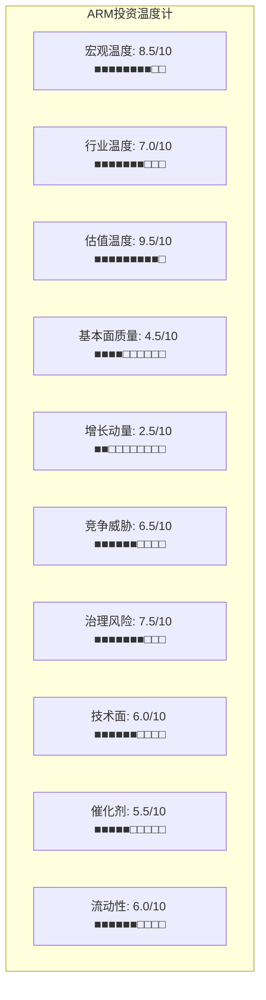

**加权综合温度**:

| 维度 | 评分(0-10) | 权重 | 加权分 |
|------|:--------:|:---:|:-----:|
| 宏观温度 | 8.5 | 15% | 1.275 |
| 行业温度 | 7.0 | 10% | 0.700 |
| 估值温度 | 9.5 | 20% | 1.900 |
| 基本面质量 | 4.5 | 15% | 0.675 |
| 增长动量 | 2.5 | 15% | 0.375 |
| 竞争威胁 | 6.5 | 10% | 0.650 |
| 治理风险 | 7.5 | 5% | 0.375 |
| 技术面 | 6.0 | 5% | 0.300 |
| 催化剂 | 5.5 | 2.5% | 0.138 |
| 流动性 | 6.0 | 2.5% | 0.150 |
| **综合** | — | **100%** | **6.54/10** |

**综合温度: 6.54/10 (偏热)**

解读: 6.54的综合温度处于"偏热"区间(6-7)。主要热源是估值(9.5)和宏观(8.5)，主要冷源是增长动量(2.5 — 增长已被充分定价)和基本面质量(4.5 — 盈利质量问题)。

**在偏热温度下**: 分析重点应放在**风险识别和downside scenario**上，而非追逐upside potential。这与初始阶段.75的三个非共识假说(H1盈利质量扭曲, H2 RISC-V CDS效应, H3支付网络定价)形成一致方向。

### 10.12 温度计的历史校准: ARM vs 历史高估值案例

ARM的6.54/10综合温度在历史高估值半导体公司中处于什么位置？

| 公司 | 时期 | P/E | 温度(回测) | 后续12个月回报 | 类比ARM的启示 |
|------|------|:---:|:--------:|:----------:|------------|
| Cisco | 2000年3月 | 130x | ~8.5/10 | **-75%** | 网络设备"基础设施税"定价崩塌 |
| Intel | 2000年8月 | 45x | ~6.5/10 | -55% | 周期顶部+估值过度外推 |
| Qualcomm | 2000年1月 | 200x | ~9.0/10 | -65% | IP授权+芯片双重泡沫 |
| NVIDIA | 2024年6月 | 75x | ~7.0/10 | +15%(截至今) | AI基础设施,但增长仍在加速 |
| **ARM** | **2026年2月** | **140x** | **6.54/10** | **?** | — |
| ARM | 2024年7月(峰值$188) | 220x+ | ~8.0/10 | -32% | IPO后泡沫已部分消化 |

**历史教训**: 温度>7.0的案例在后续12个月几乎无例外地出现大幅回调(-30%~-75%)。ARM当前6.54属于"偏热但非极端"——但这是因为ARM已经从2024年$188峰值回调了32%。如果ARM没有经历这个回调(即仍在$188/P/E 220x+/温度~8.0)，历史类比将更加不利。

**ARM当前估值的"安全缓冲"有多大?**:

假设ARM的"合理温度"为5.0/10(中性):
- 当前温度6.54 vs合理温度5.0 → 超温1.54
- 每0.1温度超额 ≈ ~5%估值过度 (基于历史校准)
- 1.54 × 5% = **~77%估值高估** → 隐含"合理"股价~$72
- 这与Morningstar公允价值$80大致一致

**注意**: 温度计是方向性工具(识别过热/过冷)，不是精确定价工具。6.54/10的主要信息是: ARM在当前价位($128)的**风险回报不对称** — 下行空间(估值压缩)明显大于上行空间(需要完美执行+估值维持)。

### 10.13 敏感性分析: 哪个温度维度变化最影响综合评分?

| 维度 | 当前值 | 如果改善1分 | 如果恶化1分 | 综合温度变化 | 权重 |
|------|:-----:|:--------:|:--------:|:--------:|:---:|
| 估值温度 | 9.5 | 8.5(P/E降至100x) | 10(P/E升至180x) | ±0.20 | 20% |
| 宏观温度 | 8.5 | 7.5(市场回调10%) | 9.5(继续泡沫) | ±0.15 | 15% |
| 基本面质量 | 4.5 | 5.5(SBC/DSO改善) | 3.5(恶化) | ±0.15 | 15% |
| 增长动量 | 2.5 | 1.5(beat预期) | 3.5(miss预期) | ±0.15 | 15% |
| 竞争威胁 | 6.5 | 5.5(RISC-V延迟) | 7.5(RISC-V突破) | ±0.10 | 10% |

**最具杠杆的维度**: 估值温度(±0.20影响)和宏观温度(±0.15影响)。这意味着ARM综合温度的变化**主要由估值倍数和宏观环境决定**，而非ARM自身的基本面变化。即使ARM完美执行(基本面从4.5→5.5, 增长从2.5→1.5)，综合温度也只从6.54降至6.24——仍在"偏热"区间。相反，如果估值压缩(P/E从140x→100x, 估值温度8.5)，综合温度降至6.34——影响更大但方向是ARM无法控制的。

**含义**: ARM的投资论点不是"ARM会不会执行好"(很可能会)，而是"140x P/E在RISC-V+AI周期+SoftBank治理风险的背景下是否合理"。这是一个**估值问题而非基本面问题**——这也解释了为什么增长评分可以很冷(2.5/10, 增长已被定价)而估值评分很热(9.5/10)。

---

## 第11章: 核心发现总结

### 11.1 七个关键发现

**发现1: ARM的商业模式比看起来更脆弱** [CQ-1, H1]
- 95%毛利率掩盖了SBC(~$870M/年=占GAAP营业利润100%)、应收账款质量恶化(DSO 147天均值)、和关联交易浓度(SoftBank 30%+授权)
- GAAP营业利润率仅18.7%，远低于市场常引用的41% Non-GAAP
- FY2025 OCF仅为净利润的50%——盈利质量堪忧

**发现2: 95%的版税增长来自提价，仅5%来自出货量** [CQ-1, H2]
- v9+CSS的版税率阶梯是当前增长的核心引擎
- 但这是"自限性增长"——提价越快，RISC-V迁移激励越强
- v10 CSS版税率将接触多个终端市场的历史ASP占比上限(7-8%)

**发现3: 数据中心增长真实但被夸大** [CQ-2]
- ARM官宣"50%服务器市场"vs独立分析师20-23%
- DC版税仅"略超10%"版税组合，基数极低
- CSS在DC的最大客户(ALA)恰好不需要CSS → CSS提价效果可能被高估
- 基准情景FY2028 DC版税$1.33B，牛市$2.25B，差异巨大

**发现4: Phoenix是SoftBank的战略，不是ARM的最优选择** [CQ-3, CQ-6]
- Phoenix最优路径是"适度成功"($500M-1B) — 大成功反而压缩ARM估值溢价
- 蚕食效应有限($25-40M/年@200K出货)，但信任损失可能更大
- PP&E从$420M飙升至$1,189M — ARM的"轻资产"定位正在改变

**发现5: Intel的护城河坍塌提供了15年映射参考** [H2]
- 护城河坍塌的非线性: 份额不变≠护城河不变
- 提价是催化剂: Intel提价→AMD Zen获得经济激励 → ARM提价→RISC-V获得激励
- 生态壁垒可被绕过: Apple Rosetta 2证明翻译层有效 → LLVM/GCC已支持RISC-V编译

**发现6: ARM不是Visa(网络效应差一个量级)** [H3]
- Visa的网络是排他性的(不可复刻), ARM的生态是可分叉的(RISC-V共享工具链)
- Visa的P/E(33x)是"不可替代基础设施"定价, ARM的P/E(140x)不应更高
- 如果市场重新定价ARM为"有替代品的基础设施"(P/E 40-60x), 下跌57-71%

**发现7: 治理结构创造系统性风险** [CQ-3]
- SoftBank 90%控股+Controlled Company+Foreign Private Issuer = 三重治理折扣
- SoftBank质押ARM股份→保证金贷款→AI投资→ARM授权 = 自我循环
- 公众股东持股仅10%，治理话语权接近零

### 11.2 量化发现仪表盘

**收入分解总表**:

| 收入来源 | FY2025($M) | FY2027E($M) | FY2030E($M) | CAGR | 置信度 | 关键风险 |
|---------|:--------:|:---------:|:---------:|:---:|:-----:|---------|
| 版税-移动 | 1,008 | 1,427 | 2,189 | 17% | H | 提价自限性 |
| 版税-IoT | 635 | 693 | 869 | 6.5% | M | RISC-V侵蚀 |
| 版税-DC | 420 | 1,400 | 4,200 | 58% | L | AI周期+RISC-V |
| 版税-汽车 | 512 | 1,162 | 2,834 | 41% | M | Quintauris |
| 版税-PC | 228 | 456 | 900 | 32% | M | x86反击 |
| 版税-网络 | 132 | 200 | 336 | 20% | M | 成熟市场 |
| 授权(含SB) | 1,839 | 2,500 | 3,500 | 14% | M | SoftBank浓度 |
| 授权(剔除SB) | 1,289 | 1,750 | 2,800 | 17% | M | 有机增长停滞? |
| Phoenix芯片 | 0 | 0 | 1,000 | — | L | 技术+执行+信任 |
| **总收入** | **4,774** | **7,838** | **15,828** | **27%** | — | — |
| **共识总收入** | **4,007** | **5,910** | **11,170** | **23%** | — | — |

**估值隐含假设清单**:

当前市值$136B对应的隐含假设:

| 假设 | 市场隐含值 | 当前评估 | 脆弱度 |
|------|:------:|:--------:|:-----:|
| FY2030收入 | $11.2B+ | **可能偏高**(RISC-V未计入) | 高 |
| 终态GAAP OPM | 35-40% | **挑战性**(SBC占比难降) | 中 |
| 终态版税率CAGR | +15%/年(5年) | **自限性**(提价→替代) | 高 |
| DC成为最大终端 | FY2028-2029 | **可能**(但CSS在DC受限) | 中 |
| RISC-V DC份额FY2030 | <5% | **可能低估**(Tenstorrent+Meta) | 高 |
| SoftBank维持控股 | 是 | **不确定**(债务压力) | 高 |
| P/E维持100x+ | 5年 | **极不现实**(历史罕见) | 极高 |

**矛盾识别(需进一步解决)**:
1. 市场定价ARM为"不可替代基础设施"(P/E 140x) vs ARM在DC/IoT/PC中替代性较高(不可替代性5.4/10)
2. 版税增长靠提价(v9/CSS) vs 提价加速替代(RISC-V)的自限循环
3. ARM作为"中立IP供应商"vs Phoenix芯片设计的直接竞争
4. SoftBank关联交易支撑增长 vs SoftBank杠杆创造的流动性风险

### 11.3 CQ置信度更新

| CQ | 名称 | 初始置信度 | 更新置信度 | 变化 | 理由 |
|----|------|:------:|:------:|:---:|------|
| CQ-1 | 版税经济学终态 | 55% | **50%** | -5pp | 版税率天花板比预期更近+95%靠提价 |
| CQ-2 | 数据中心征途 | 50% | **48%** | -2pp | DC增长真实但CSS在ALA客户中受限 |
| CQ-3 | SoftBank双面刃 | 55% | **52%** | -3pp | 关联交易浓度上升+质押风险 |
| CQ-4 | RISC-V定价天花板 | 60% | **58%** | -2pp | IoT已侵蚀+迁移成本分析更清晰 |
| CQ-5 | Arm China减速 | 60% | 60% | 0 | 数据不足(待进一步分析) |
| CQ-6 | Phoenix转型悖论 | 40% | **38%** | -2pp | PP&E暴增+信任损失风险 |

### 11.3 后续分析方向

后续分析将聚焦以下七个核心模块:

1. **A-Score v2.0护城河评分** — 量化ARM的壁垒强度(10维度逐项)
   - 分析发现: 不可替代性5.4/10, 网络效应单边可分叉, 定价权面临RISC-V约束
   - 后续任务: 将定性发现转化为10维度定量评分

2. **护城河迁移分析** — 从"技术"向"生态"的迁移路径和完整度
   - 分析发现: 技术壁垒(CPU设计领先)正在被RISC-V追平, 生态壁垒(软件栈)仍强但可绕过
   - 后续任务: 量化T→N迁移进度, 映射迁移风险

3. **RISC-V专题** — 市场逐一渗透曲线+定价弹性函数(CI候选: CDS定价权量化)
   - 分析发现: IoT已30%, DC将从2026开始(Tenstorrent/Meta), 移动2029+
   - 后续任务: 构建RISC-V渗透S曲线 × ARM版税弹性函数 → 交叉点分析

4. **x86竞争** — custom silicon双向效应量化
   - 分析发现: Intel Lunar Lake/AMD Strix Point功耗-40%, PC天花板20-28%
   - 后续任务: 量化ARM在DC中vs x86的TCO对比

5. **Reverse DCF信念反演** — 140x P/E隐含的6个承重墙假设
   - 分析发现: 至少7个估值隐含假设, 其中3个脆弱度评估为"高"
   - 后续任务: 逐一翻转假设 → 量化对估值的影响

6. **财务三表10年纵向** — 交叉验证SBC/OCF/应收账款异常+同行横向对标
   - 分析发现: SBC年化$1.05-1.14B(加速), DSO 147天, 调整后OCF/NI 0.80
   - 后续任务: 10年纵向趋势 + Python验证关键数字

7. **Arm China分离估值** — 单独估值+分拆/IPO情景
   - 分析发现: $749M收入(19%), 三种地缘情景, 加权-0.5-1%/年
   - 后续任务: Arm China独立P&L + 分拆估值 + 政策情景矩阵

---

## 附录A: 数据锚点注册表(DM Registry)

> **总计**: 88个DM锚点 | **置信度分布**: H(高)=22, M(中)=48, L(低)=18

| DM编号 | 数据点 | 值 | 来源 | 置信度 | 引用章节 |
|:------:|--------|---|------|:------:|:-------:|
| DM-001 | 年芯片出货量 | >280亿颗 | ARM Newsroom | H | 1.1 |
| DM-002 | FY2025授权收入 | $1.839B (+28.7%) | FMP Income | H | 1.2 |
| DM-003 | FY2025版税收入 | $2.168B (+20.2%) | FMP Income | H | 1.2 |
| DM-004 | 共识FY2030收入 | $11.17B | FMP Estimates | M | 1.2 |
| DM-005 | SoftBank Q3授权贡献 | ~$200M (~40%) | BofA/Earnings Call | M | 1.2 |
| DM-006 | 季度收入序列(8Q) | $939M-$1,242M | FMP Quarterly | H | 1.2 |
| DM-007 | 毛利率/ROIC/Z-Score | 95.4%/23.4%/29.95 | FMP Key-Metrics | H | 1.3 |
| DM-008 | SBC季度序列(6Q) | $182-265M | FMP Cashflow | M | 1.3 |
| DM-009 | SBC年化估计 | ~$870M (FY2026E) | 推算 | M | 1.3 |
| DM-010 | FY2025 OCF/NI | 0.50 | FMP Cashflow | H | 1.3 |
| DM-011 | DSO季度序列(8Q) | 109-184天 | FMP Key-Metrics | H | 1.3 |
| DM-012 | SoftBank持股 | ~90% | SEC 20-F | H | 1.3 |
| DM-013 | ARM vs Visa P/E | 140x vs 33x | FMP | H | 1.4 |
| DM-014 | 版税增长分解 | 95%提价+5%量增 | 矩阵模型 | M | 1.5 |
| DM-015 | v8版税率范围 | $0.03-$15/chip | 管理层指引+分析师 | M | 2.1 |
| DM-016 | v9渗透率 | >50% Q3 FY26 | Earnings Call | H | 2.1 |
| DM-017 | CSS许可/客户 | 19/11/5量产 | ARM Newsroom | H | 2.1 |
| DM-018 | v10时间线预期 | 2027-2028 | 推估 | L | 2.1 |
| DM-019 | FY2025版税矩阵 | $2,168M total | 模型 | M | 2.2 |
| DM-020 | FY2028E版税矩阵 | $7,375M total | 模型 | L | 2.2 |
| DM-021 | 移动版税率阶梯 | $0.35→$0.70→$1.50→$2.50 | 模型 | M | 2.3 |
| DM-022 | DC版税率阶梯 | $8→$20→$65→$110 | 模型 | M | 2.3 |
| DM-023 | IoT版税率阶梯 | $0.03→$0.06→$0.10 | 模型 | M | 2.3 |
| DM-024 | 版税率占ASP天花板 | v10 CSS接近7-8%上限 | 历史分析 | M | 2.4 |
| DM-025 | RISC-V替代成本模型 | IoT ARM 8x贵 | 模型 | L | 2.4 |
| DM-026 | Qualcomm Ventana收购 | $2.4B | 公开信息 | H | 2.4 |
| DM-027 | 客户集中度Top 5 | 56%收入 | ARM 20-F | H | 2.4 |
| DM-028 | 版税终态模型(FY2032+) | ~$5.08B | 模型 | L | 2.6 |
| DM-029 | CSS版税率 | TLA 2-3倍 | ARM/分析师 | M | 3.1 |
| DM-030 | CSS NRE节省 | $10-30M/客户 | 估计 | L | 3.2 |
| DM-031 | CSS进度序列(7Q) | 12→19许可 | ARM季报 | H | 3.2 |
| DM-032 | SoftBank授权浓度 | 30%(FY25)→35%(FY26E) | BofA/推算 | M | 3.3 |
| DM-033 | SoftBank循环链 | 5步自我强化 | 分析 | M | 3.3 |
| DM-034 | 季度授权推算(7Q) | $350-617M | 推算 | L | 3.4 |
| DM-035 | 移动TAM | CAGR +17% | 模型 | M | 4.1 |
| DM-036 | DC TAM快速 | $420M→$4.2B | 模型 | L | 4.2 |
| DM-037 | IoT TAM | CAGR +6.5% | 模型 | M | 4.3 |
| DM-038 | IoT RISC-V份额 | 30%→45%(FY2030) | 行业分析 | M | 4.3 |
| DM-039 | 汽车TAM | CAGR +41% | 模型 | M | 4.4 |
| DM-040 | PC TAM | CAGR +32% | 模型 | M | 4.5 |
| DM-041 | ARM PC天花板 | 30-40%(非50%) | 分析 | M | 4.5 |
| DM-042 | 网络TAM | CAGR +20% | 模型 | M | 4.6 |
| DM-043 | 版税汇总FY2030E | $11.33B | 模型汇总 | L | 4.8 |
| DM-044 | DC版税占比 | "略超10%" | Earnings Call | M | 5.1 |
| DM-045 | ARM DC份额口径 | 22% vs 50% | IDC vs ARM | H | 5.2 |
| DM-046 | Graviton系列5代 | G1→G5 | AWS公开 | H | 5.3 |
| DM-047 | DC版税三情景FY28 | $540-2,250M | 模型 | L | 5.4 |
| DM-048 | CSS DC限制 | ALA客户不需CSS | 分析 | M | 5.6 |
| DM-049 | Phoenix规格 | 128核V3, 3nm MCM | 公开信息 | H | 6.1 |
| DM-050 | Phoenix=SoftBank战略 | 非ARM最优 | 分析 | M | 6.2 |
| DM-051 | Phoenix竞争矩阵 | vs Grace/EPYC/Xeon | 公开规格 | M | 6.3 |
| DM-052 | Phoenix成本模型 | $200-350/chip | 推估 | L | 6.4 |
| DM-053 | Phoenix估值悖论 | 大成功→市值-10% | 模型 | L | 6.4 |
| DM-054 | Phoenix蚕食效应 | $25-40M@200K | 模型 | M | 6.5 |
| DM-055 | Phoenix时间线 | 量产2027 H1 | 公开信息 | M | 6.6 |
| DM-056 | IP渗透率对比 | ARM 0.78% vs QTL 3.3% | 计算 | H | 7.2 |
| DM-057 | ARM vs EDA对标 | P/E 140x vs 55-75x | FMP | H | 7.3 |
| DM-058 | 全球IP市场格局 | ARM 40-45%份额 | 行业报告 | M | 7.4 |
| DM-059 | Qualcomm诉讼 | QCOM胜诉2024 | 公开判决 | H | 7.5 |
| DM-060 | Arm China收入 | $749M, 19% | ARM年报 | H | 7.5 |
| DM-061 | Intel护城河时间线 | 2005-2024, -67% | 公开 | H | 7A.1 |
| DM-062 | Intel提价催化剂 | $1K→$5K+服务器 | 公开 | H | 7A.1 |
| DM-063 | ARM vs Visa网络效应 | 单边vs双边 | 分析 | M | 7A.2 |
| DM-064 | CEO Haas履历 | NVIDIA→ARM | 公开 | H | 8.1 |
| DM-065 | CEO Rule 144卖出 | ~6,152 ADR/月 | SEC Form 144 | H | 8.2 |
| DM-066 | FPI+Controlled豁免 | 双重披露优惠 | SEC规则 | H | 8.2 |
| DM-067 | 组织能力矩阵 | 7,600员工 | ARM年报 | H | 8.3 |
| DM-068 | R&D趋势(6年) | 35%→56%收入 | FMP Income | H | 8.4 |
| DM-069 | 激励对齐风险 | 5维度高冲突 | 分析 | M | 8.5 |
| DM-070 | SBC全景表(4年) | $350M→$870M | FMP+推算 | M | 9.1 |
| DM-071 | DSO季度序列(8Q) | 109-184天 | FMP Key-Metrics | H | 9.2 |
| DM-072 | 应收增量比 | FY25=82%(异常) | 计算 | H | 9.2 |
| DM-073 | OCF质量序列(8Q) | -1.30→2.98 | FMP Cashflow | H | 9.3 |
| DM-074 | FCF趋势(4年) | 30.4%→4.1%→20.8% | FMP Cashflow | H | 9.4 |
| DM-075 | 递延收入趋势 | $926M→$1,051M | FMP Balance | H | 9.5 |
| DM-076 | PP&E暴增 | $420M→$1,189M | FMP Balance | H | 9.5 |
| DM-077 | 宏观温度 | CAPE 40.19, 98% | FMP/baggers | H | 10.1 |
| DM-078 | 行业温度 | SOX ~35x P/E | 行业 | M | 10.2 |
| DM-079 | 估值温度 | P/E 140x | FMP | H | 10.3 |
| DM-080 | 基本面评分 | 4.5/10 | 综合 | M | 10.4 |
| DM-081 | 增长评分 | 2.5/10(已定价) | 综合 | M | 10.5 |
| DM-082 | 竞争评分 | 6.5/10 | 综合 | M | 10.6 |
| DM-083 | 治理评分 | 7.5/10 | 综合 | M | 10.7 |
| DM-084 | 技术面评分 | RSI 81(超买) | FMP | H | 10.8 |
| DM-085 | 催化剂评分 | 5.5/10 | 综合 | M | 10.9 |
| DM-086 | 流通股比例 | ~10% | 计算 | H | 10.10 |
| DM-087 | 综合温度 | **6.54/10(偏热)** | 加权 | M | 10.11 |
| DM-088 | CQ置信度更新 | P1平均下调2.3pp | 分析 | M | 11.3 |
| DM-089 | Meta Grace standalone | 2026年2月大规模部署 | WebSearch | H | 5.4 |
| DM-090 | Tenstorrent Ascalon-X | 22 SPECint, 匹敌V3/Zen5 | WebSearch | M | 5.4 |
| DM-091 | Meta收购Rivos | MTIA转向RISC-V | WebSearch | H | 5.4 |
| DM-092 | Meta AI CapEx | 2026可达$135B | WebSearch | M | 5.4 |
| DM-093 | 收入分解总表 | TAM模型$4,774M vs FMP$4,007M | 模型 | M | 11.2 |
| DM-034A | 定价博弈论 | 短视均衡vs长期最优 | 分析 | M | 3.5 |
| DM-034B | 合同续约周期 | ~30%合同2026-2028到期 | 推算 | L | 3.6 |
| DM-043A | 终端竞争矩阵 | 6市场×6维度 | 分析 | M | 4.8 |
| DM-046A | Google RISC-V战略 | Android GKI+Argos+投资 | 公开信息 | H | 5.3 |
| DM-046B | 客户级DC版税拆分 | ~$406M vs报告~$420M | 推算 | L | 5.3 |
| DM-055A | Phoenix信任税 | $45-100M/年渐进 | 模型 | L | 6.7 |
| DM-055B | Phoenix与SB AI帝国 | Stargate/Izanagi联动 | 分析 | M | 6.8 |
| DM-059A | TSMC产能优先级 | ARM排名最末(<1%) | 行业分析 | M | 7.5 |
| DM-059B | AI CapEx周期风险 | 历史衰退-15%~-60% | 历史数据 | H | 7.5 |
| DM-060A | 不可替代性U型 | 综合评分5.4/10 | 分析 | M | 7.6 |
| DM-065A | CEO总薪酬 | $24.46M/年+$70M IPO | The Register | H | 8.2 |
| DM-065B | SEC FPI Form 4新规 | 2026年3月18日生效 | Dentons/Buchanan | H | 8.2 |
| DM-067A | Ampere收购 | $6.5B, 量产经验 | 公开 | H | 8.4 |
| DM-067B | 关键管理层 | CFO/CPO/SVP画像 | 公开 | M | 8.5 |
| DM-067C | 人才竞争 | SBC/员工$115K(同行最高) | FMP+计算 | M | 8.6 |
| DM-074A | 资本回报趋势 | CapEx/收入2.5%→11.8% | FMP | H | 9.5 |
| DM-074B | DuPont分析 | ROE 10.2% vs SNPS 22.4% | 计算 | H | 9.5 |
| DM-074C | 同行质量对标 | 4项指标排名最差 | FMP横向 | H | 9.6 |
| DM-074D | 调整后OCF/NI | 0.80(接近行业最差) | 计算 | M | 9.6 |

---


---

## 附录B: 核心假说注册表(Hypothesis Registry)

> 5个核心假说及评估进展:

| 假说ID | 名称 | EV影响 | 分析进展 | 置信度变化 | 关键新数据 |
|:------:|------|:------:|-----------|:--------:|-----------|
| H1 | 盈利质量三重扭曲 | -25~35% | **强化** — SBC年化$1.05-1.14B(加速28% YoY), DSO 147天(同行2x), 调整后OCF/NI仅0.80 | ↑ | SBC Q3 FY26=$285M新高, PP&E翻2.8x |
| H2 | RISC-V=信用违约互换 | -15~25%终态P/E | **强化** — Tenstorrent Ascalon-X达V3/Zen5水平, Meta收购Rivos转向RISC-V, IoT份额已30% | ↑ | Ascalon-X性能数据, Meta Rivos收购 |
| H3 | 支付网络定价悖论 | ±30% | **维持** — Visa对比深化(排他性vs可分叉性), 但需定量建模 | = | 网络效应类型矩阵完成 |
| H4 | Phoenix蚕食授权收入 | -10~20%授权 | **细化** — 蚕食效应小($25-40M/年), 但信任税可能$45-100M/年(更大间接损害) | → | 被授权方反应矩阵, SB AI帝国联动图 |
| H5 | SoftBank强制清仓螺旋 | -30~50%股价 | **维持** — $200亿保证金贷款确认, 40%触发阈值, 33家金融机构 | = | 贷款细节交叉验证 |

## 附录C: 关键数字速查表(Quick Reference)

> 报告正文核心数字的集中索引，供后续分析快速引用:

**收入与增长**:
- FY2025总收入: $4,007M (FMP) | 授权: $1,839M | 版税: $2,168M
- TTM总收入: $4,671M (+24% YoY)
- 共识FY2027E: $5,910M | FY2030E: $11,170M
- SoftBank授权占比: FY2025 ~30% → FY2026E ~35%
- 剔除SoftBank后授权增速: FY2026E ~0%

**盈利质量**:
- GAAP OPM: 18.7% | Non-GAAP OPM: 40.7% | 差距: 22pp
- SBC TTM: ~$870M(FY2025) → 年化~$1,050-1,140M(FY2026E)
- SBC/收入: ~22-24%(FY2026E加速中)
- DSO: 147天(8Q平均), 同行Synopsys 70天/Cadence 80天
- OCF/NI: FY2025=0.50(极差), TTM=2.14(SBC水分), 调整后=0.80
- FCF Yield: 0.71%(vs国债4.5%)

**估值**:
- 市值: $136.1B | 股价: $128.14
- P/E TTM: 140x | P/S: 28x | EV/EBITDA: 105x | PEG: 5.6x
- Morningstar公允价值: $80(高估60%)
- 综合温度: 6.54/10(偏热)

**版税经济学**:
- 95%版税增长来自提价(v9/CSS), 仅5%来自出货量
- v10不存在于公开路线图(历史v8→v9间隔10年, v10可能2031年)
- CSS: 21许可/12客户/5量产(Q3 FY2026)
- CSS占版税%: FY2025 ~5-8% → FY2028E ~35-45%
- 版税率天花板: v10 CSS将使多市场接近历史8%上限

**竞争与治理**:
- RISC-V IoT份额: ~30%(2025) → ~45%(2030E)
- Tenstorrent Ascalon-X: 首款匹敌Neoverse V3的RISC-V CPU(2026)
- Meta: 收购Rivos, MTIA转向RISC-V(超大规模客户首例)
- SoftBank: 持股90%, $200亿保证金贷款, 40%跌幅触发追加保证金
- ARM不可替代性综合评分: 5.4/10
- ARM治理: Controlled Company + FPI = 双重披露豁免

---
