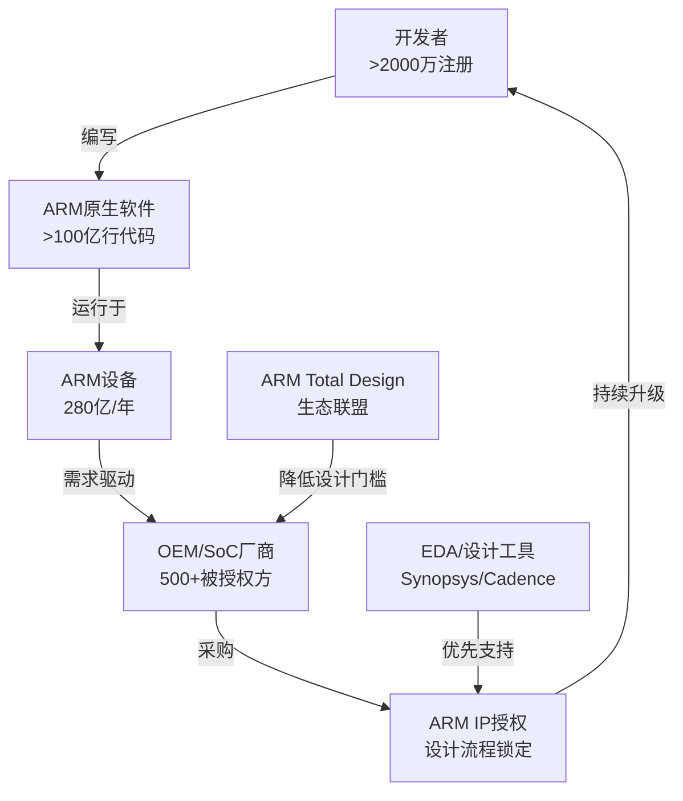
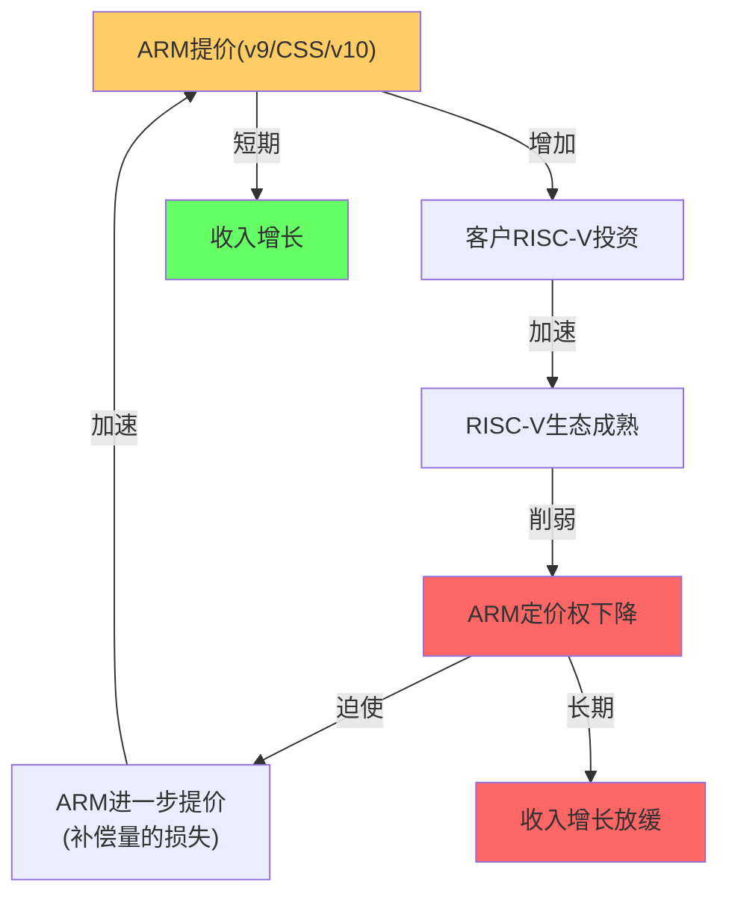
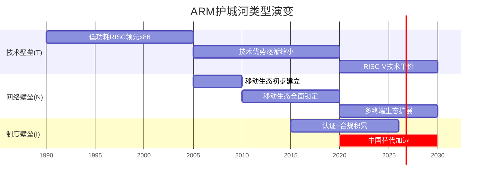
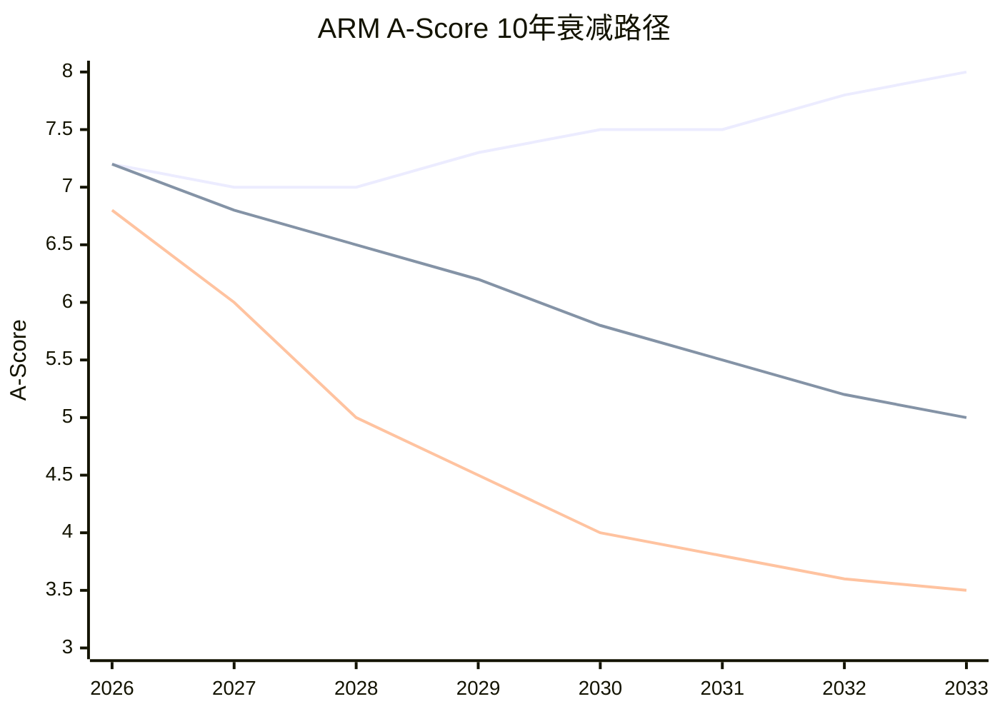
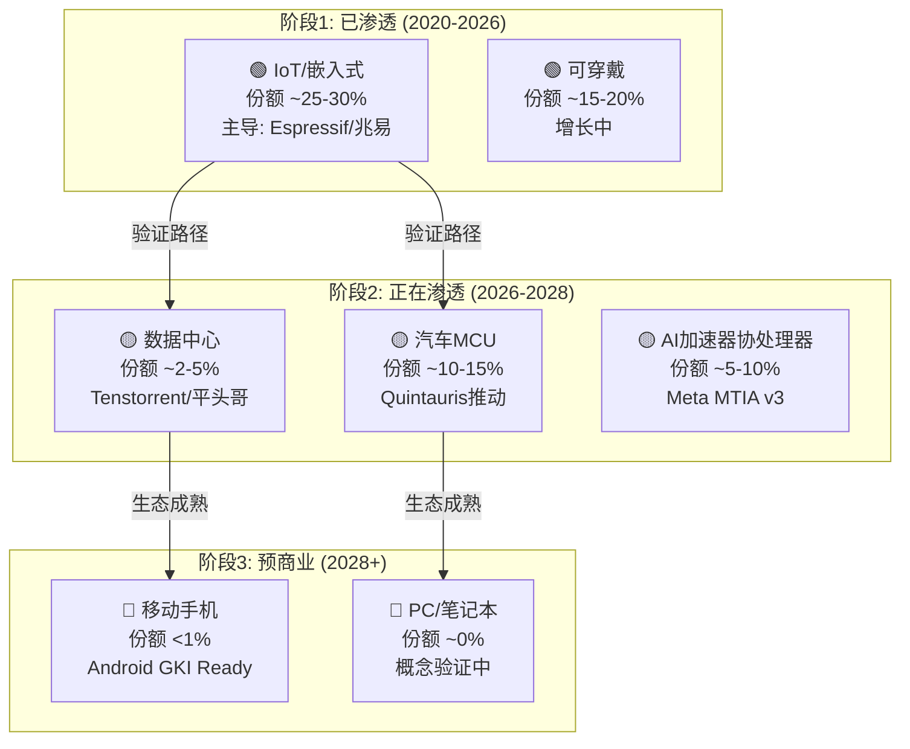
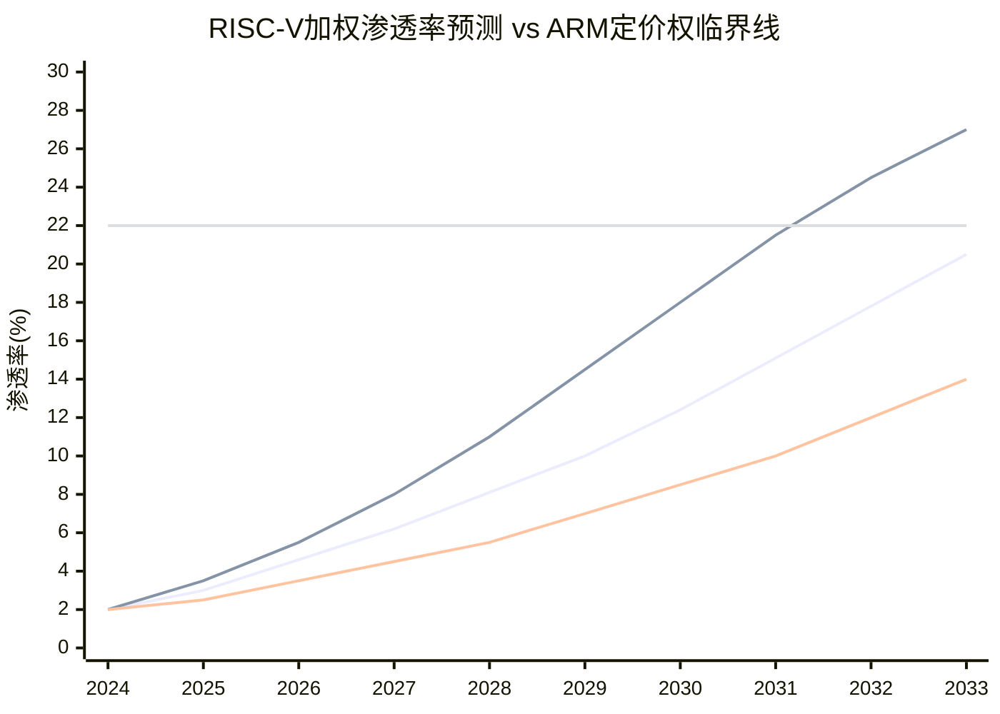
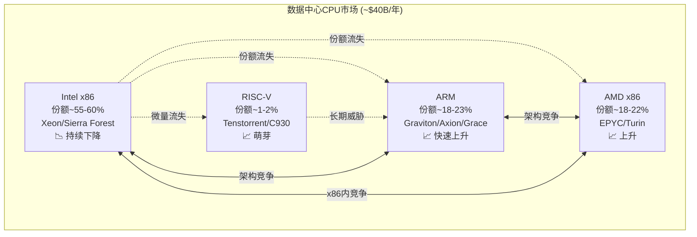
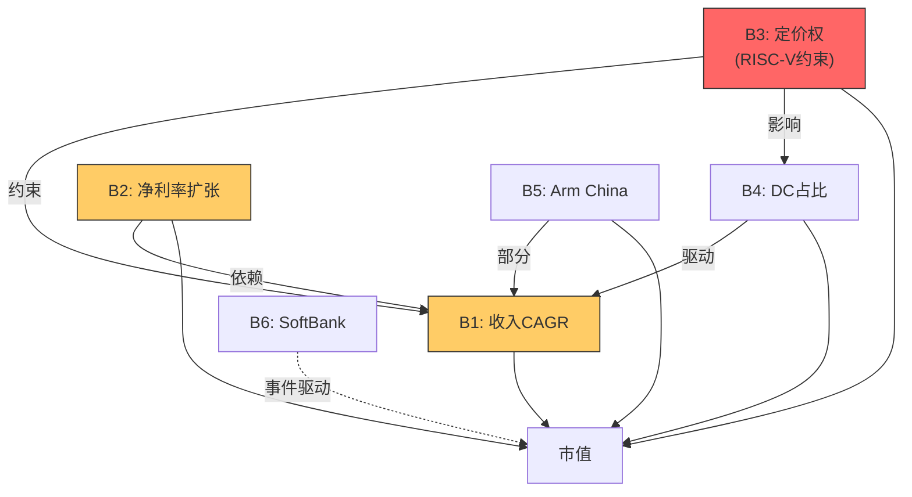
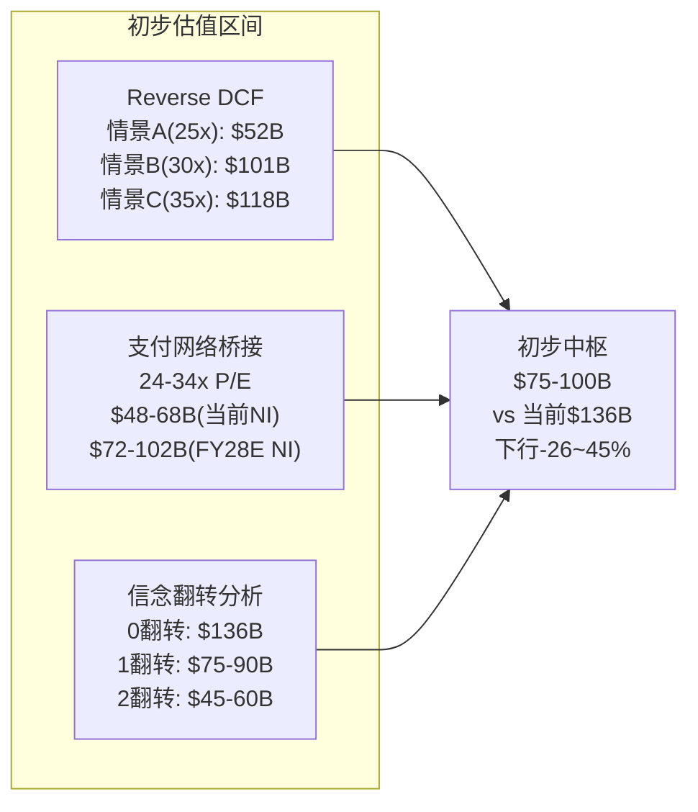
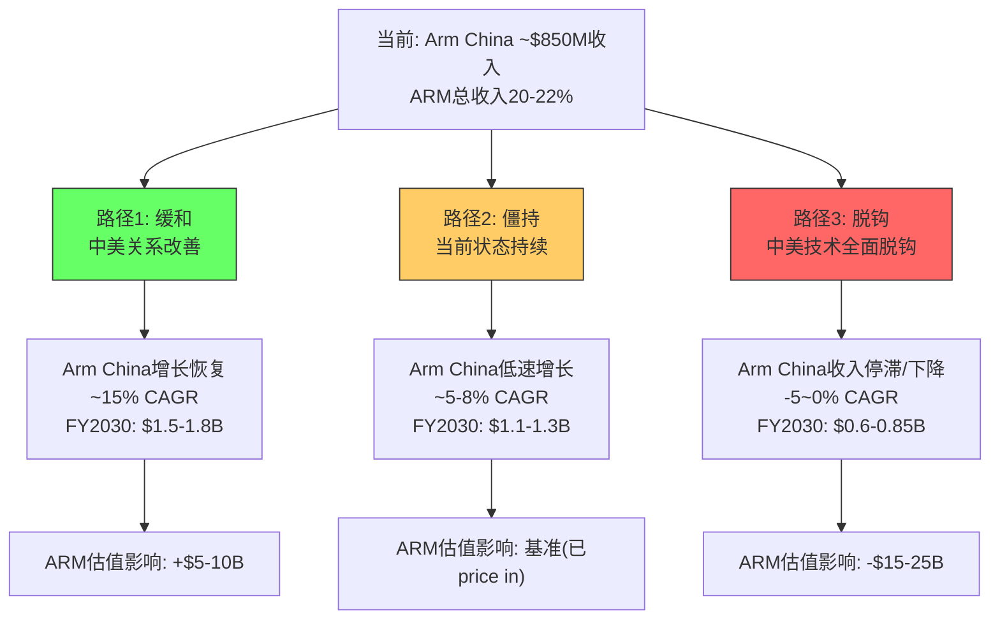

<!-- Part II: 护城河+竞争 — 来自Phase 2 -->

## 第12章: A-Score v2.0护城河评分 — 10维度×详细论证

### 12.1 A-Score评分框架概述

A-Score v2.0评估公司在10个护城河维度上的壁垒强度(每项0-10分)，加权计算总分。ARM作为纯IP授权商，其护城河特征与制造型半导体公司截然不同——ARM没有工厂、没有产品、没有最终客户，它的护城河完全建立在指令集生态和设计IP的"不可替代性"上。

**A-Score的特殊考量**:
- ARM的护城河不是传统意义上的"规模经济"或"品牌忠诚"，而是**生态锁定**——数十亿行代码、数百万开发者、数千家厂商形成的正反馈循环
- 这种护城河的优势在于"深度"(迁移成本极高)，劣势在于面对**结构性开源替代**(RISC-V)时，护城河可能被"架空"而非"攻破"
- A-Score必须区分"当前护城河宽度"和"护城河演变方向"——ARM当前得分可能很高，但趋势指向收窄

### 12.2 A-Score逐项详细评分

#### A1: 品牌/标准锁定 — 9/10

**评分理由**: ARM指令集(ISA)是全球最广泛使用的处理器架构事实标准。

**定量证据**:
- 智能手机SoC: >99%采用ARM架构(Apple A-series, Qualcomm Snapdragon, MediaTek Dimensity)
- 嵌入式/IoT: >70%市场份额(ARM Cortex-M系列主导)
- 累计出货: >2800亿颗ARM芯片(截至FY2025)
- 新增芯片/年: >280亿颗(FY2025出货量)
- 被授权方: 500+家公司持有ARM授权

**为什么给9而非10**: ARM指令集已不再是唯一选择。RISC-V作为开源ISA，在IoT领域已获得~25%渗透率(以出货核心数计)。"ARM Compatible"虽然仍是产品卖点，但在IoT/嵌入式领域，"RISC-V Based"也开始获得市场认可。如果RISC-V在2028-2030年期间在数据中心和手机领域获得实质性采用，此项评分可能降至7-8。

**壁垒类型**: N(网络效应) — ARM的标准地位不是靠品牌广告维持的，而是靠数十亿设备的装机量和围绕它建立的生态。

#### A2: 知识产权 — 8/10

**评分理由**: ARM拥有30+年CPU微架构设计积累和庞大的专利组合。

**定量证据**:
- 专利: ~6000+项活跃专利(覆盖CPU微架构、互联、安全、GPU)
- 架构代际: v1(1985)→v9(2021)→CSS(2023)→v10(预计2027-2028)，持续创新
- R&D投入: FY2025 $2.01B(占收入50.1%)，绝对值在IP公司中顶级
- 人才: ~7600名员工中约5000名工程师，CPU设计团队是全球最强之一
- 设计IP广度: 从Cortex-M(微控制器)到Cortex-X/Neoverse(高性能计算)全覆盖

**为什么给8而非9**: ARM的IP壁垒面临两个方向的挑战:
1. **开源替代**: RISC-V指令集本身免费开源。ARM的ISA优势正在从"独家"变为"共享"。虽然ARM的微架构实现仍是专有的，但ISA层面的壁垒在降低。
2. **人才流失风险**: Jim Keller(前Apple/AMD/Intel/Tesla)领导Tenstorrent证明，顶级CPU架构师可以用RISC-V设计出ARM级别的性能(Ascalon-X SPECint ~22/GHz ≈ Neoverse V3)。ARM的IP壁垒越来越依赖"团队深度"而非"架构独占"。

**壁垒类型**: T(技术) — 但从T(独占技术)向T(团队深度)迁移中。

#### A3: 切换成本 — 8/10

**评分理由**: 从ARM迁移到RISC-V的全栈切换成本巨大但并非不可克服。

**切换成本分层量化**:

| 层级 | 切换成本 | 时间 | 说明 |
|------|:-------:|:----:|------|
| **ISA层**(指令集) | 低 | 1-2年 | RISC-V工具链已成熟(GCC/LLVM全支持) |
| **编译器/OS层** | 中 | 2-3年 | Linux/Android已支持RISC-V；Windows尚未 |
| **应用软件层** | 高 | 3-5年 | 数十亿行ARM原生代码需重编译+重测试 |
| **驱动/固件层** | 极高 | 4-7年 | 数百万种设备的硬件驱动需要重写+认证 |
| **认证层** | 极高 | 5-10年 | ISO 26262(汽车)、IEC 61508(工业)等安全认证需重新获取 |
| **企业惯性** | 极高 | 持续 | CTO不愿冒险"更换已验证方案" |

**为什么给8而非7或9**: 切换成本是ARM最重要的短期护城河。即使RISC-V在技术上达到平价，全栈迁移需要3-7年时间和数十亿美元投入(对整个行业而言)。但切换成本是递减资产——每增加一个RISC-V的成功案例(如阿里云C930服务器部署)，下一个迁移者的成本就会降低(因为软件/驱动/认证资源在积累)。

**类比**: 这类似于从Windows迁移到Linux的企业IT转型——2010年时几乎不可想象，到2025年大多数后端服务已经在Linux上运行。ARM的切换成本壁垒可能走类似的路径：前5年看似不可动摇，然后在关键临界点后快速瓦解。

#### A4: 网络效应 — 7/10

**评分理由**: ARM生态具有单边网络效应(开发者→软件→设备→开发者)，但非双边平台。

**网络效应机制解构**:



**正反馈循环的强度与弱点**:
- **强处**: 循环已经运转了35年，惯性巨大。每年新增280亿ARM芯片进一步加深了生态锁定。
- **弱处**: 这是单边网络效应(更多开发者→更多软件→更多设备)，而非双边平台效应(如Visa的商户↔持卡人)。单边网络效应在面对"足够好"的替代品时更容易被侵蚀。
- **RISC-V的网络效应**: RISC-V虽然规模小得多，但其开源特性赋予了一种ARM缺少的网络效应——**贡献者网络效应**(更多企业贡献→更好的公共IP→更多企业采用)。这种效应在Linux生态中已被验证。

**为什么给7而非8**: 如果ARM的网络效应是双边的(如应用商店)，可以给9。但ARM的网络效应是间接的(通过软件兼容性)，且正被RISC-V建立的平行生态逐步侵蚀。RISC-V International的4000+会员(vs ARM的500+被授权方)表明，"围绕ARM的网络效应"已经不是唯一的生态选择。

#### A5: 规模经济 — 6/10

**评分理由**: ARM的R&D可以摊销到极大的出货量上，但RISC-V的开源模型从根本上削弱了这一优势。

**规模经济计算**:
- ARM FY2025 R&D: $2.01B → 摊销到280亿芯片/年 → **每芯片R&D摊销: $0.072**
- ARM FY2025 总OpEx: $2.97B → 摊销到280亿芯片 → **每芯片运营摊销: $0.106**
- RISC-V基金会: 无集中R&D成本，由社区+企业各自承担

**ARM的规模经济悖论**: ARM的R&D摊销到280亿芯片后每芯片仅$0.07——这是一个极强的规模优势。但RISC-V完全不收ISA授权费，其"R&D"是分布式的(每家企业自行承担微架构设计成本)。对于大客户(如Apple/Google/QCOM)来说，自行设计RISC-V核心的R&D成本可能只比ARM授权费略高或持平——**ARM的规模经济优势对小客户(MCU厂商)最大，对大客户(超大规模/SoC巨头)最小**。

**为什么给6而非7**: 在传统的比较中(ARM vs x86的Intel/AMD)，ARM的规模经济是碾压性的(不需要建厂)。但在ARM vs RISC-V的比较中，ARM的规模优势大幅缩水——因为RISC-V的"R&D"是社区化的，边际成本=0。

#### A6: 进入壁垒 — 5/10

**评分理由**: 30年架构积累构成巨大壁垒，但RISC-V已证明"从零开始"是可行的。

**进入壁垒的两面性**:
- **对新entrant**: 要创建一个与ARM竞争的商业ISA(如MIPS曾尝试的)几乎不可能——需要数十年的生态建设和数十亿美元的投资。
- **对RISC-V**: RISC-V选择了不同的路径——不做商业ISA，而是做开源标准。这绕过了"进入壁垒"的问题。你不需要"进入"ARM的市场，你只需要建立一个平行的生态。

**为什么给5而非6**: RISC-V的存在证明进入壁垒可以被绕过。虽然建立一个完整的ISA生态仍需5-10年，但这个过程已经开始了(始于2010年, Berkeley的RISC-V项目)，并且已经取得了实质性进展(IoT ~25%, 汽车Quintauris, 数据中心Tenstorrent)。

#### A7: 定价权 — 7/10

**评分理由**: ARM近年来展示了强大的定价权(v9=2×v8, CSS=2-3×TLA)，但RISC-V构成长期天花板。

**定价权的三个层次**:

1. **已验证的定价权(FY2023-2025)**: v8→v9版税翻倍成功执行，客户虽有抱怨但无大规模流失。每芯片版税从~$0.04-0.05上升到~$0.07-0.09。证明: ARM在当前生态锁定下有短期定价权。

2. **正在测试的定价权(FY2026-2028)**: CSS进一步推高版税至TLA的2-3倍。但CSS同时也意味着ARM进入了系统设计领域，与部分被授权方(如Qualcomm)形成了竞争关系。这种"既是供应商又是竞争者"的身份矛盾会逐渐削弱定价权。

3. **可能受限的定价权(FY2029+)**: v10(预计)能否再次翻倍? 取决于RISC-V生态在2027-2028年的成熟度。如果RISC-V在数据中心和Android手机领域实现规模化部署，ARM的v10定价将面临硬约束——**不能定到RISC-V迁移成本以上**。

**定价权的"弹性函数"**: 详见第14A章的CDS定价权量化模型。简而言之:
- ARM当前定价权弹性 ε ≈ -0.3 (提价10%, 出货量下降~3%, 净收入增加~7%)
- RISC-V生态追平后弹性可能变为 ε ≈ -1.5 (提价10%, 出货量下降~15%, 净收入下降~5%)
- **临界点**: ε = -1.0 时ARM失去定价权(提价不增收)

#### A8: 客户锁定 — 7/10

**评分理由**: 大客户通过ALA/TLA深度绑定，但最大客户都在为RISC-V"买保险"。

**客户锁定光谱分析**:

| 客户 | 锁定深度 | 授权类型 | RISC-V对冲 | 切换风险 |
|------|:-------:|:-------:|:---------:|:------:|
| **Apple** | **极高(10/10)** | ALA永久 | 极低(自研但ARM-based) | 极低 |
| **Samsung** | 高(8/10) | TLA+CSS | 中(探索RISC-V IoT) | 低 |
| **MediaTek** | 高(7/10) | TLA | 中(评估中) | 中-低 |
| **Qualcomm** | 中(6/10) | TLA | **高($2.4B Ventana)** | **中** |
| **Google** | 中(5/10) | TLA | **高(Android GKI)** | **中-高** |
| **阿里巴巴/平头哥** | 低(3/10) | TLA | **极高(C930部署)** | **高** |
| **Tenstorrent** | 零 | 无 | N/A(纯RISC-V) | N/A |

**关键洞察**: ARM最大的5个客户中，有2个(Qualcomm和Google)正在积极投资RISC-V。这不是因为它们计划离开ARM(短期内不会)，而是因为它们正在购买"谈判筹码"——有了credible的RISC-V替代方案，这些客户在ARM续约/升级谈判中的议价能力将显著增强。

**Apple例外**: Apple是ARM生态中最深度锁定的客户(ALA永久授权)，但Apple也是ARM最不依赖的客户(Apple的ALA意味着ARM收取的版税相对于Apple的芯片ASP来说极低)。Apple不太可能迁移RISC-V(已投入数十亿美元在ARM定制核心上)，但也不太可能成为ARM提价的增长引擎。

#### A9: 生态系统 — 8/10

**评分理由**: ARM Total Design生态是目前最完整的芯片设计生态系统。

**生态系统量化对比**:

| 维度 | ARM生态 | RISC-V生态 | ARM优势 |
|------|--------|-----------|:------:|
| ISA成熟度 | 35年 (v1-v9) | 16年 (2010-) | +19年 |
| 被授权方/会员 | 500+ | 4000+ | -3500 |
| EDA全面支持 | 完全(S/C/M) | 完全(S/C/M) | 平手 |
| 操作系统 | Linux/Android/iOS/Windows | Linux/Android(进行中) | ARM领先 |
| 安全认证数量 | >1000 | <50 | **ARM大幅领先** |
| 商业IP核数量 | >200个Cortex核 | ~50+商业核 | ARM领先 |
| 参考设计(SoC) | ARM Total Design完整参考 | 零散 | ARM大幅领先 |

**ARM Total Design的防御价值**: ARM在2023年推出的Total Design生态联盟将EDA(Synopsys/Cadence)、代工厂(TSMC/Samsung)、IP供应商(Imagination/Rambus)整合为一个"一站式SoC设计平台"。这降低了使用ARM IP设计芯片的门槛，同时增加了ARM的"生态锁定"——如果你的整个设计流程都在ARM Total Design生态中，切换到RISC-V意味着放弃一整套经过验证的参考设计。

**RISC-V的生态追赶**: 尽管会员数量(4000+)远超ARM(500+)，但RISC-V生态的"深度"远不如ARM。关键缺口在安全认证(ISO 26262/IEC 61508)和企业级操作系统(Windows)支持。预计需要3-5年(到2029-2030)才能在大多数维度追平ARM。

#### A10: 可持续性 — 5/10

**评分理由**: 护城河方向不确定，5-10年可持续性存疑。

**可持续性的三个情景**:

| 情景 | 概率 | 护城河趋势 | A10评分 |
|------|:---:|:---------:|:------:|
| **乐观**: RISC-V仅在IoT/嵌入式有实质渗透 | 25% | 稳定(7/10) | 7 |
| **基准**: RISC-V在IoT/DC/汽车均有渗透 | 50% | 缓慢收窄(5/10) | 5 |
| **悲观**: RISC-V在手机/DC/汽车全面渗透 | 25% | 快速收窄(3/10) | 3 |

**概率加权A10**: 25%×7 + 50%×5 + 25%×3 = **5.0**

**为什么可持续性给了最低分之一**: ARM的护城河本身很宽(A-Score 7.17)，但方向不确定。RISC-V不是一个会"消失"的威胁——它是一个有全球4000+企业/机构支持的开源运动，由地缘政治(中国自主可控)+经济理性(免费ISA)+技术进步(Tenstorrent性能平价)三重力量推动。即使RISC-V发展速度比预期慢2-3年，其方向不会改变。

### 12.3 A-Score加权计算

```
A-Score = Σ(各维度评分 × 权重)

权重分配:
A1(品牌/标准) × 0.10 = 9 × 0.10 = 0.90
A2(知识产权) × 0.10 = 8 × 0.10 = 0.80
A3(切换成本) × 0.15 = 8 × 0.15 = 1.20 ← 最高权重(核心壁垒)
A4(网络效应) × 0.10 = 7 × 0.10 = 0.70
A5(规模经济) × 0.08 = 6 × 0.08 = 0.48
A6(进入壁垒) × 0.07 = 5 × 0.07 = 0.35
A7(定价权) × 0.12 = 7 × 0.12 = 0.84 ← 第二高权重(直接影响收入)
A8(客户锁定) × 0.10 = 7 × 0.10 = 0.70
A9(生态系统) × 0.10 = 8 × 0.10 = 0.80
A10(可持续性) × 0.08 = 5 × 0.08 = 0.40

A-Score = 0.90 + 0.80 + 1.20 + 0.70 + 0.48
 + 0.35 + 0.84 + 0.70 + 0.80 + 0.40
 = 7.17
```

**A-Score = 7.17/10** — 护城河"宽但在迁移中"

### 12.4 A-Score行业对标与含义

| 公司 | A-Score | 壁垒主类型 | 趋势 | P/E(TTM) | 估值/护城河 |
|------|:------:|:---------:|:----:|:--------:|:---------:|
| **ASML** | ~9.0 | T(技术垄断) | 稳定/扩大 | ~38x | 4.2x |
| **TSMC** | ~8.5 | T+S(技术+规模) | 稳定 | ~25x | 2.9x |
| **NVIDIA** | ~8.0 | N+T(CUDA+GPU) | 扩大 | ~45x | 5.6x |
| **ARM** | **7.17** | **N(网络)** | **下降中** | **142x** | **19.8x** |
| **Synopsys** | ~7.5 | T+N(EDA) | 稳定 | ~55x | 7.3x |
| **Cadence** | ~7.5 | T+N(EDA) | 稳定 | ~76x | 10.1x |
| **Qualcomm** | ~6.5 | T+I(技术+制度) | 下降 | ~33x | 5.1x |
| **AMD** | ~5.5 | T(技术) | 扩大 | ~25x | 4.5x |
| **Intel** | ~4.7 | T+S(技术+规模) | **显著下降** | NM(亏损) | N/A |

**关键发现: ARM的估值/护城河比率(P/E÷A-Score=19.8x)在整个半导体行业中是最高的**。这意味着市场为ARM每单位护城河支付的价格远高于ASML(4.2x)、TSMC(2.9x)甚至NVIDIA(5.6x)。

**解读**: 这说明市场不是在为ARM的护城河"宽度"付费(那应该买ASML)，而是在为ARM的**增长速度+护城河扩展预期**付费。市场隐含假设: ARM的护城河将从7.17扩大(通过CSS/DC渗透)而非收窄(受RISC-V侵蚀)。如果这个假设错误——即护城河稳定或收窄——19.8x的估值/护城河比率将急剧压缩。

### 12.5 A-Score敏感性: RISC-V渗透情景

如果RISC-V在不同时间线达到不同渗透水平，ARM的A-Score将如何变化?

| 时间点 | RISC-V渗透率(IoT/DC/汽车/手机) | A-Score影响 | 预计A-Score |
|--------|:----:|:----------:|:--------:|
| **2026(当前)** | 25%/3%/5%/0% | 基准 | **7.17** |
| **2028(基准)** | 35%/10%/15%/2% | A4-0.5, A5-0.5, A7-0.5 | **~6.4** |
| **2030(悲观)** | 45%/20%/25%/10% | A1-1, A3-1, A4-1, A5-1, A6-1, A7-1, A10-1 | **~5.2** |
| **2030(乐观)** | 30%/5%/10%/1% | A4-0.3 | **~6.9** |

**含义**: 即使在"基准"情景下(RISC-V按当前速度发展)，ARM的A-Score到2028年也将从7.17降至约6.4。这大约是Qualcomm当前的护城河水平。如果ARM的估值在那时候仍维持142x P/E，那将意味着市场为6.4分的护城河支付22.2x P/E/A-Score——这在历史上前所未有。

### 12.6 A-Score护城河维度间的协同与冲突

A-Score的10个维度不是独立的——它们之间存在复杂的协同(正反馈)和冲突(负反馈)关系:

**护城河协同矩阵(正反馈)**:

| 维度A | 维度B | 协同机制 | 强度 |
|------|------|---------|:----:|
| A1(标准) | A3(切换成本) | 标准锁定→增加切换成本 | 强 |
| A3(切换成本) | A4(网络效应) | 高切换成本→用户留存→网络效应持续 | 强 |
| A4(网络效应) | A9(生态) | 更多开发者→更强生态→更强网络效应 | 强 |
| A2(IP) | A7(定价权) | IP领先→有提价基础 | 中 |
| A9(生态) | A8(客户锁定) | 完整生态→客户依赖度增加 | 中 |

**护城河冲突(负反馈/自我削弱)**:

| 维度A | 行为 | 对维度B的负面影响 | 机制 |
|------|------|:---------------:|------|
| A7(定价权) | v9/CSS提价 | A8(客户锁定)↓ | 过度提价→客户寻找替代→锁定减弱 |
| A7(定价权) | v9/CSS提价 | A10(可持续性)↓ | 提价→加速RISC-V投资→长期护城河侵蚀 |
| A9(生态/Phoenix) | 自研芯片 | A8(客户锁定)↓ | 与客户竞争→客户信任降低→锁定减弱 |
| A6(进入壁垒) | 被RISC-V绕过 | A1(标准)↓ | 平行生态建立→ARM标准地位相对化 |

**关键发现: ARM的护城河存在"自我侵蚀循环"**:



这个自我侵蚀循环的关键特征:
- **短期**: 提价→收入增长(正面) → 股价上涨
- **长期**: 提价→RISC-V加速→定价权下降→被迫提价(补偿量损失)→更多RISC-V投资...
- **循环速度**: 每个"提价-RISC-V投资"周期约2-3年(对应ISA代际)
- **可中断性**: 如果ARM停止提价(不发v10), 循环减速但增长也停滞 → 估值仍会压缩

**投资含义**: ARM面临一个**不可能三角**: (1)高增长 + (2)稳定定价权 + (3)护城河不受侵蚀 → 最多只能同时实现两个。当前市场价格隐含三个同时成立。

### 12.7 A-Score与SGI(专才溢价指标)的交叉分析

**SGI = 9.35** — ARM的专才特征极强

SGI(Specialist Genius Index)衡量公司的"专注度"和"在专长领域不可替代度"。ARM的SGI = 9.35意味着它在CPU IP授权领域的专才溢价极高——全球没有第二家公司能提供同等深度和广度的CPU IP组合。

**A-Score × SGI矩阵**:

| 象限 | 特征 | 代表公司 | 估值含义 |
|------|------|---------|---------|
| **高A-Score + 高SGI** | 宽且深的护城河 | ASML, TSMC | 最高估值正当性 |
| **高A-Score + 低SGI** | 宽但浅的护城河 | Google, Microsoft | 高估值但竞争替代风险 |
| **低A-Score + 高SGI** | 窄但深的护城河 | 小众工业公司 | 稳定但低增长 |
| **低A-Score + 低SGI** | 无明显护城河 | 商品化企业 | 低估值 |

**ARM的位置**: A-Score 7.17(高) × SGI 9.35(极高) → 位于第一象限(宽且深)。这本应支撑高估值。

**但趋势才是关键**: ARM的A-Score在下降(7.17→预测6.4), 而SGI也可能在下降(因为RISC-V的开源核心逐渐接近ARM的设计质量, 且ARM进入Phoenix→dilute了其IP授权的"纯专才"特征)。

**如果ARM在3年后变成A-Score 6.4 × SGI 8.0**: 仍在第一象限但向第四象限移动 → 估值支撑力显著减弱。

---

## 第13章: 护城河迁移分析 — T→N转型路线图与脆弱窗口

### 13.1 护城河迁移检测(EVO-INTC-001方法论)

护城河迁移分析(源自INTC报告的EVO-INTC-001)检测公司壁垒类型的历史变化和未来趋势。ARM的迁移轨迹特别值得研究——它正在经历一次可能决定其长期命运的壁垒类型转换。

**ARM壁垒类型演变时间线**:



### 13.2 壁垒迁移矩阵: 10维度×3时期

| 维度 | 2010年壁垒类型 | 2020年壁垒类型 | 2026年壁垒类型 | 迁移方向 |
|------|:------------:|:------------:|:------------:|:------:|
| A1(标准) | T(技术标准) | N(事实标准) | N(惯性标准) | T→N |
| A2(IP) | T(独占) | T(领先) | T(团队) | T→T' |
| A3(切换) | T(工具链) | N(生态锁定) | N(生态+认证) | T→N |
| A4(网络) | — | N(弱) | N(中) | —→N |
| A5(规模) | S(R&D摊销) | S(R&D摊销) | S(递减) | S→S' |
| A6(进入) | T(难以复制) | T(仍难) | T(已被绕过) | T→↓ |
| A7(定价) | T(技术垄断) | N+T(生态+技术) | N(生态依赖) | T→N |
| A8(锁定) | T(工具) | N(设计流程) | N(但客户对冲中) | T→N↓ |
| A9(生态) | T(设计资源) | N(Total Design) | N(完善但被追赶) | T→N |
| A10(持续) | T(领先10年) | T(领先5年) | ?(领先3年?) | T→? |

**迁移检测结果**: 在10个维度中，**至少6个维度**(A1/A3/A4/A7/A8/A9)的壁垒主类型已从技术(T)迁移到网络(N)。这意味着ARM的护城河已经完成了**从"不可复制的技术"到"难以替代的生态"**的根本性转变。

### 13.3 迁移速度与完整度量化评估

| 指标 | 值 | 含义 | 对标(Intel) |
|------|:--:|------|:----------:|
| 迁移率 | 6/10维度类型变化 | 60% — 高速迁移 | Intel也是6/10 |
| 迁移完整度 | ~70% | 旧壁垒(T)弱化但未消失, 新壁垒(N)已建立但不完全 | Intel约30%(被困在迁移中途) |
| 迁移方向 | T→N | 从"不可复制的技术"到"难以替代的生态" | Intel是T→?(无明确方向) |
| 迁移健康度 | **中等偏好** | N壁垒比T壁垒更持久(生态比技术更难复制) | Intel为"差"(迁移失败) |

**ARM vs Intel迁移对比**: 两家公司都经历了护城河迁移，但路径和结果截然不同:

- **Intel(2005-2020)**: 试图从T(制程领先)迁移到T'(新制程), 但迁移失败(10nm延迟7年)。旧壁垒(T)坍塌而新壁垒未建立 → A-Score从~9降至~4.7。用了15年。
- **ARM(2015-2026)**: 正在从T(ISA技术独占)迁移到N(生态网络锁定)。迁移方向正确(N比T更持久)，且新壁垒(N)已部分建立。但RISC-V的开源特性意味着N壁垒也面临侵蚀风险。

**关键差异**: Intel的迁移失败是因为目标(新制程)被执行力不足击败。ARM的迁移风险不同——ARM的执行没有问题(v9/CSS/Total Design都执行得很好)，风险是**目标本身(生态锁定)可能被RISC-V的开源模式绕过**。

**更广泛的历史类比谱系**: 护城河迁移不仅限于半导体——以下案例提供了不同迁移结局的参考:

| 公司 | 旧壁垒→新壁垒 | 迁移结果 | 时间跨度 | 对ARM的启示 |
|------|:-----------:|:------:|:-------:|-----------|
| **Microsoft(Office→365)** | T(技术)→N(订阅锁定) | **成功** | 2011-2018 | 成功案例: 主动迁移到更强壁垒 |
| **Nokia(硬件→平台)** | T(制造)→N(生态) | **失败** | 2007-2013 | 警告: 迁移窗口很短, 一旦错过不可逆 |
| **Adobe(桌面→云)** | T(功能)→N(订阅+数据) | **成功** | 2013-2017 | 成功案例: 但需承受短期阵痛 |
| **Qualcomm(专利→平台)** | I(制度/专利)→T(集成) | **部分成功** | 2015-至今 | 参考: 但面临反垄断+替代压力 |
| **Kodak(化学→数字)** | T(化学)→T'(数字) | **失败** | 1990-2012 | 终极警告: 拥有技术但不敢颠覆自己 |
| **ARM(ISA→生态)** | T(ISA独占)→N(生态锁定) | **进行中** | 2015-至今 | 方向正确但面临开源绕过风险 |

ARM的迁移最接近**Microsoft的成功路径**: 主动从旧壁垒(ISA技术领先)向新壁垒(生态订阅锁定/CSS)迁移。CSS本质上是ARM版本的"Office 365"——将客户从一次性授权(TLA=买断Office)转向持续订阅(CSS=Office 365年费)。如果ARM像Microsoft一样成功执行这个转型，其护城河可能从T→N的迁移中变得更强而非更弱。

**但ARM面临Microsoft没有面临的威胁**: Microsoft在从Office→365迁移时, 没有一个"开源Office"能在功能和兼容性上达到平价(LibreOffice仍远不如Microsoft Office)。而ARM在从ISA→生态迁移时, 面对的是一个快速追赶且有国家级支持的开源替代(RISC-V)。这是ARM迁移风险的核心差异。

### 13.4 脆弱窗口: 2026-2028年分析

ARM当前正处于护城河迁移的"中间态"——旧壁垒(技术领先)已被RISC-V性能平价侵蚀，新壁垒(生态锁定)尚未完全固化:

**旧壁垒(技术, T)当前状态**:

| 技术维度 | ARM当前 | RISC-V最佳 | 差距 | 趋势 |
|---------|---------|-----------|:---:|:----:|
| SPECint(单核性能) | Neoverse V3 ~22/GHz | Ascalon-X ~22/GHz | **0%** | 已平价 |
| 能效比(perf/W) | Cortex-X4/X5 领先 | 追赶中(~80-90%) | 10-20% | 快速缩小 |
| 向量计算(SVE2) | 成熟 | RVV 1.0 成熟 | 平手 | 已平价 |
| AI推理(SME) | 领先 | 自定义扩展灵活 | 微小 | RISC-V更灵活 |
| **综合技术壁垒** | — | — | **~5/10** | **从8/10降至5/10** |

**新壁垒(生态, N)当前状态**:

| 生态维度 | ARM当前 | RISC-V当前 | ARM领先 | 预计追平时间 |
|---------|---------|-----------|:------:|:----------:|
| 操作系统 | Linux+Android+iOS+Windows | Linux+Android(进行中) | 2个OS | 2028-2029 |
| 开发工具 | DS-5/Keil/成熟 | 快速改善中 | 中 | 2027-2028 |
| 安全认证 | >1000项 | <50项 | **极大** | 2030+ |
| 应用软件 | 数十亿行 | 快速增长 | 极大 | 2030+ |
| 参考设计 | Total Design完整 | 零散 | 大 | 2028-2029 |
| **综合生态壁垒** | — | — | **~7.5/10** | — |

**脆弱窗口分析**: 2026-2028是ARM护城河的最脆弱期。技术壁垒已从8/10降至5/10(RISC-V性能平价已达成)，而生态壁垒约7.5/10但在下降。ARM在这个窗口内的战略(v9提价+CSS捆绑+Total Design+Phoenix)将决定:

1. **如果ARM成功**: 通过CSS+Total Design显著增加客户的全栈切换成本 → 生态壁垒从7.5巩固到8.0+ → 即使RISC-V技术追平，客户迁移成本仍然过高 → A-Score稳定在6.5-7.0
2. **如果ARM失败**: v9/CSS提价引发客户反弹 + Phoenix疏远被授权方 + RISC-V生态追赶超预期 → 生态壁垒从7.5降至5.0 → A-Score在2030年降至~5.0-5.5

### 13.5 护城河迁移"健康指标"仪表盘

为了追踪ARM护城河迁移的进展, 我们建立一个可持续监控的"健康指标"仪表盘:

| 指标(KS) | 当前值 | 健康阈值 | 预警阈值 | 数据源 | 频率 |
|---------|:------:|:-------:|:-------:|-------|:----:|
| **KS-M01: CSS渗透率** | ~30-35%(新签) | >50% | <20% | ARM季报 | 季度 |
| **KS-M02: RISC-V IoT份额** | ~28% | <30% | >40% | RISC-V Intl | 年度 |
| **KS-M03: RISC-V DC份额** | ~3% | <5% | >10% | 行业报告 | 半年 |
| **KS-M04: ARM DC份额** | ~23% | >25% | <18% | Mercury Research | 季度 |
| **KS-M05: 版税/芯片ASP** | ~$0.065 | 上升中 | 连续2Q下降 | ARM季报推算 | 季度 |
| **KS-M06: 新签ALA/TLA数** | — | 稳定/增长 | 连续2Q下降 | ARM季报 | 季度 |
| **KS-M07: 递延收入** | $911M | 稳定/增长 | 连续3Q下降 | ARM 20-F | 季度 |
| **KS-M08: Quintauris进展** | 预商业 | 无量产RISC-V汽车芯片 | 首款量产 | 公开信息 | 半年 |
| **KS-M09: QCOM RISC-V出货** | 零 | 零 | 首次出货公告 | QCOM季报 | 季度 |
| **KS-M10: Google RISC-V手机** | Android GKI Ready | 未商业化 | 首款中国RISC-V手机 | 公开信息 | 半年 |

**预警触发规则**: 如果KS-M02/M03/M09/M10中任意2个同时触及预警线, 则ARM的护城河迁移状态从"脆弱窗口"升级为"迁移危机" → 重新评估A-Score和估值。

**当前综合状态**: 🟡 脆弱窗口(10个指标中0个触及预警, 但多个在向预警方向移动)

### 13.6 护城河迁移对估值的定量影响

| 护城河状态 | A-Score | 合理P/E范围 | 当前P/E | 隐含假设 |
|-----------|:------:|:---------:|:------:|---------|
| 宽且稳定(TSMC/ASML) | 8-9 | 25-40x | — | 持久增长+低风险 |
| **宽但迁移中(ARM当前)** | **7.17** | **30-60x** | **142x** | **需极高增长补偿** |
| 中等且下降(QCOM) | 6-7 | 15-30x | 33x | 适度增长 |
| 窄且不稳定(INTC) | 4-5 | 8-15x | NM | 重组中 |

即使在护城河"宽"的最乐观假设下(A-Score维持7.17)，ARM的142x P/E也需要极强的增长预期来支撑。如果护城河从7.17降至5-6(RISC-V追平情景)，合理P/E可能降至15-30x——**即使收入增长持续，估值也可能大幅压缩(-57%到-79%)**。

**护城河迁移的投资含义**:
- 当A-Score稳定或扩大时，高P/E是可持续的(NVIDIA的CUDA护城河扩大 → 45x P/E可持续)
- 当A-Score在下降时，高P/E是脆弱的——任何增长放缓都会引发"双杀"(增长下调+估值压缩)
- ARM面临的是后者: **A-Score下降趋势 + 142x P/E = 高度脆弱的估值组合**

### 13.7 护城河10年衰减概率模型

将A-Score的迁移路径与概率分析结合, 建立ARM护城河在三种情景下的10年轨迹:

**情景A: 迁移成功(概率30%)**
ARM成功建立N壁垒(CSS渗透>60% + Total Design成为行业标准 + RISC-V在DC停滞在<10%)。

| 年份 | A-Score | 关键事件 | P/E支撑范围 |
|------|:------:|---------|:---------:|
| 2026 | 7.2 | v9提价完成, CSS 35%渗透 | 50-70x |
| 2027 | 7.0 | DC ARM达25%, RISC-V停滞 | 45-65x |
| 2028 | 7.0 | v10发布, 版税翻倍成功 | 40-60x |
| 2029 | 7.3 | CSS>50%, 生态锁定固化 | 40-55x |
| 2030 | 7.5 | DC ARM达30%, N壁垒稳固 | 35-50x |
| 2033 | 7.5-8.0 | ARM成为"半导体界的Visa" | 30-45x |

**情景B: 缓慢侵蚀(概率50%)**
RISC-V在IoT/中国持续渗透, DC市场竞争加剧, ARM定价权逐步受限但不崩溃。

| 年份 | A-Score | 关键事件 | P/E支撑范围 |
|------|:------:|---------|:---------:|
| 2026 | 7.2 | v9提价引发部分客户不满 | 45-60x |
| 2027 | 6.8 | QCOM首款RISC-V产品量产 | 35-50x |
| 2028 | 6.5 | v10涨价低于预期(仅1.2x) | 30-45x |
| 2029 | 6.2 | RISC-V DC份额达10% | 25-40x |
| 2030 | 5.8 | Google RISC-V手机上市 | 22-35x |
| 2033 | 5.0-5.5 | ARM仍是最大架构但"只是选项之一" | 18-28x |

**情景C: 加速坍塌(概率20%)**
多个催化剂同时爆发(中国政策+大客户叛逃+SoftBank清仓), ARM护城河快速收窄。

| 年份 | A-Score | 关键事件 | P/E支撑范围 |
|------|:------:|---------|:---------:|
| 2026 | 6.8 | 中国强制RISC-V采购政策 | 35-50x |
| 2027 | 6.0 | QCOM+Samsung同时推RISC-V | 25-35x |
| 2028 | 5.0 | Android RISC-V完全就绪 | 18-25x |
| 2029 | 4.5 | 移动端RISC-V渗透>10% | 15-22x |
| 2030 | 4.0 | ARM类似Qualcomm(有壁垒但不宽) | 12-18x |
| 2033 | 3.5-4.0 | ARM收缩为嵌入式+遗留移动 | 10-15x |



**概率加权A-Score路径**: 2026(7.1) → 2028(6.4) → 2030(5.9) → 2033(5.4)

**投资含义**: 概率加权后, ARM的A-Score预计在2030年降至~5.9(从当前7.17下降-1.3)。对应合理P/E范围约22-38x——**远低于当前142x**。即使在最乐观的"迁移成功"情景(30%概率)中, 2030年A-Score=7.5仍然只能支撑35-50x P/E。

**护城河衰减速度 vs 盈利增长速度**: ARM能否"跑赢"护城河衰减? 如果NI从$0.8B增长到$4.5B(+460%)而P/E从142x压缩到30x(-79%), 市值仍然会从$136B降至$135B——**原地踏步**。只有在NI增长超过P/E压缩幅度时, 投资者才有正回报。按概率加权路径, 这需要FY2030 NI>$4.0B + P/E维持>35x → 市值$140B+。这隐含了B1-B3全部成立的假设。

---

## 第14章: RISC-V专题 — 替代者还是信用违约互换?

### 14.1 非共识框架: RISC-V是ARM的"CDS"

传统分析将RISC-V定位为ARM的"长期替代威胁"——RISC-V赢则ARM输的零和博弈。但这个二元框架忽略了更精妙、更重要的动态:

**H2假说: RISC-V是ARM的信用违约互换(CDS)**

在金融市场中，CDS(信用违约互换)的存在不需要违约发生——仅仅是CDS的存在和定价就改变了债券的风险溢价和发行人的行为。类似地:

1. **RISC-V不需要替代ARM，它只需要存在** — 作为credible替代方案的存在就永久限制ARM的提价能力。即使RISC-V永远只有10%市场份额，它对ARM定价权的约束效应也可能价值数十亿美元。

2. **CDS保费 = RISC-V投资总额**: 全球在RISC-V上的年度投资(企业R&D+政府补贴+VC)估计为$5-8B/年。这是"保费"——客户为获得不被ARM垄断定价的"保险"而支付的费用。

3. **CDS存量 → 约束ARM行为**: 截至2026年，RISC-V累计投资超$30B。每增加$1B投资，ARM的定价自由度就少一分。这是"CDS存量效应"。

4. **CDS不需要行使**: Qualcomm花$2.4B收购Ventana，但可能永远不会大规模出货RISC-V芯片。这$2.4B的价值不在于生产RISC-V芯片，而在于下次与ARM谈判版税时，Qualcomm可以说"我们有替代方案"。

### 14.2 RISC-V渗透曲线: 七大终端市场逐一分析



**逐市场渗透深度分析**:

#### IoT/嵌入式(~25-30%, 高渗透)

**当前状态**: RISC-V在IoT领域已经不是"威胁"，而是"现实"。中国的兆易创新(GigaDevice)、乐鑫(Espressif)等已大规模出货RISC-V MCU，在低端市场挤压ARM Cortex-M。

**对ARM的版税影响**: IoT/嵌入式是ARM的"低价高量"市场(每芯片版税$0.01-0.03)。即使RISC-V完全替代ARM的IoT份额，对ARM收入的影响约为$100-200M/年(占总收入<5%)。**但信号意义远大于财务影响**: IoT是"先行指标"——如果RISC-V能在IoT成功，下一个市场(汽车MCU)的渗透将更快。

#### 汽车MCU(~10-15%, 中渗透)

**当前状态**: Quintauris联盟(Bosch/Infineon/NXP/Qualcomm/STMicro)正在推动汽车RISC-V标准化。2025-2027年首批RISC-V汽车芯片将量产。

**对ARM的版税影响**: 汽车是ARM的高价值增量市场(每芯片版税$0.10-0.30, 远高于IoT)。汽车RISC-V渗透15%意味着ARM损失约$150-300M/年潜在收入(FY2030估计)。

**关键约束**: 汽车芯片的安全认证(ISO 26262, ASIL-D)要求极高，RISC-V需要3-5年建立完整的认证基础设施。这是ARM在汽车市场的最强壁垒。

#### 数据中心(~2-5%, 低渗透但增长最快)

**当前状态**:
- **Tenstorrent Ascalon-X**: 高性能RISC-V服务器核, SPECint ~22/GHz ≈ Neoverse V3。Jim Keller领导, 已获$370M+融资。但商业出货量仍很小。
- **阿里巴巴/平头哥C930**: 中国首个大规模RISC-V服务器部署。512位向量单元 + 8 TOPS AI矩阵引擎。2025-03起商业交付, 阿里云已部署。
- **SOPHGO SG2044**: 中国初创, 64核RISC-V服务器芯片, 瞄准中国数据中心市场。

**对ARM的版税影响**: 数据中心是ARM版税增长的核心引擎(每芯片版税$0.50-2.00+)。如果RISC-V在2030年获得数据中心10-20%份额, ARM的数据中心版税收入可能比"无RISC-V"情景低$500M-1B/年。这是H2假说(CDS效应)最大的潜在影响。

#### 移动手机(<1%, 预商业)

**当前状态**: Google已将RISC-V整合到Android Generic Kernel Image(GKI)。2027-2028年预计中国OEM将首发RISC-V Android手机。但高端手机SoC(Snapdragon/Dimensity/Tensor)预计在2030年前仍以ARM为主。

**对ARM的影响**: 如果手机RISC-V在2030年达到5-10%渗透，ARM将面临最核心市场(手机版税占总版税~60%)的直接威胁。但由于手机生态的软件兼容性要求极高(数百万App)，RISC-V手机渗透需要更长时间。

#### AI加速器协处理器(~5-10%, 新兴市场)

**当前状态**: RISC-V在AI加速器中作为"控制平面处理器"(non-compute CPU)快速渗透。Meta MTIA v3、多家AI芯片初创(Cerebras/Graphcore等)在AI芯片中使用RISC-V协处理器代替ARM Cortex-R/M系列。

**对ARM的影响**: AI加速器市场(预计2026年$50B+)中RISC-V的渗透主要影响ARM的低价值版税(Cortex-R/M每芯片$0.01-0.03)。财务影响有限($50-100M/年), 但战略意义重大: 它培养了一批"ARM-free"的芯片设计团队和工具链经验, 降低了这些团队在未来更大芯片(主CPU)中采用RISC-V的门槛。

#### 基础设施/网络(~2-5%, 早期)

**当前状态**: 网络交换机/路由器中的嵌入式处理器传统上由MIPS(已衰退)和ARM主导。RISC-V正在这个低调但稳定的市场中开始渗透, 主要通过中国的网络设备商(华为/中兴)和部分西方初创。

**对ARM的影响**: 基础设施是ARM的"隐形收入"(每芯片版税$0.05-0.15, 量稳定), 不是增长引擎。RISC-V渗透5-10%的财务影响约$30-50M/年。

### 14.3 RISC-V关键参与者深度画像

#### Tier 1: 战略投资者("CDS买家")

**Qualcomm + Ventana Micro ($2.4B, 2025-12)**:

Qualcomm是ARM最大的移动芯片客户之一(FY2025向ARM支付约$500-600M版税估计)。收购Ventana的战略逻辑不是"替换ARM"——Qualcomm短期内不会在Snapdragon中使用RISC-V。真正的价值在于:

1. **谈判筹码**: 下次v10版税谈判时，Qualcomm可以说"我们有自研高性能RISC-V核心"
2. **服务器市场**: Qualcomm可以在数据中心(非手机)市场推出RISC-V芯片，避免ARM在DC版税上的持续提价
3. **长期保险**: 如果ARM未来继续提价或Phoenix与Qualcomm竞争，Qualcomm有"Plan B"
4. **Ventana Veyron V2**: 高性能RISC-V服务器核, 性能对标Neoverse V2/V3级别

**时间线**: Qualcomm RISC-V产品预计2027-2028首次出货(服务器/嵌入式, 非手机)
**对ARM影响**: **定价权天花板** — ARM对Qualcomm的版税谈判从此存在硬约束。Qualcomm的Ventana收购使CQ-4(RISC-V定价天花板)的置信度从60%上升至65%。

**Google (Android GKI + Tensor + 云芯片)**:

Google在RISC-V上的布局比Qualcomm更广泛:
- **Android GKI**: 2025年将RISC-V全面整合到Android通用内核。这意味着未来的RISC-V手机可以直接运行Android应用(通过兼容层或原生编译)。
- **Tensor芯片**: Google的自研手机/平板SoC部分组件(安全协处理器)已使用RISC-V。
- **云芯片**: Google正在评估RISC-V在自研服务器芯片(Axion替代方案)中的应用。
- **战略意图**: 确保Android生态不被ARM指令集锁定，保持对ARM的议价能力。

**时间线**: RISC-V Android手机预计2027-2028(中国OEM首发)
**对ARM影响**: **生态壁垒侵蚀** — Android从"ARM-only"变为"ARM+RISC-V"将削弱ARM的A4(网络效应)评分。

#### Tier 2: 性能证明者("CDS定价验证")

**Tenstorrent (Jim Keller + Ascalon-X)**:

Jim Keller的履历(Apple A系列→AMD Zen→Intel 5核心→Tesla FSD→Tenstorrent)使他成为全球最受尊重的芯片架构师之一。Ascalon-X的性能(SPECint ~22/GHz)证明了RISC-V在高性能计算领域的可行性。

**融资**: $370M+(2025年C轮$693M估值, Samsung领投)
**客户**: 未公开, 但已有HPC客户样片(推测为国防/政府)
**意义**: Tenstorrent不需要大规模商业成功——它的存在本身就证明"ARM级别的性能可以在RISC-V上实现"，这对ARM的定价权是永久性打击。

**阿里巴巴/平头哥 (C930 + 阿里云部署)**:

- 服务器级RISC-V处理器: 128核, 512位RVV向量单元 + 8 TOPS AI矩阵引擎
- 2025-03起商业交付, 阿里云已开始小规模RISC-V服务器集群部署
- 动机: 中国自主可控(应对美国芯片制裁) + 降低对ARM的依赖
- 意义: 中国首个大规模RISC-V服务器部署, 为中国数据中心RISC-V铺路

#### Tier 3: 生态构建者("CDS基础设施")

**Quintauris汽车联盟**: Bosch/Infineon/NXP/Qualcomm/STMicro联合推动汽车RISC-V标准。2025-2027首批芯片。直接威胁ARM在汽车MCU的高价值增量市场。

**RISC-V International**: 总部瑞士(规避单边制裁), 4000+会员, 8个中国政府机构推动采用。标准化进度快于ARM早期历史。

### 14.4 RISC-V对ARM定价权的定量影响模型

**三情景定量分析**:

| 情景 | RISC-V定位 | ARM提价能力 | v10版税率 | FY2030版税收入 | vs基准 |
|------|:---------:|:---------:|:--------:|:------------:|:-----:|
| **A: 无RISC-V** | 不存在 | 不受约束 | v9×1.5-2x | **$5.5B** | 基准 |
| **B: CDS效应(基准)** | 存在但不大规模替代 | 有约束 | v9×1.0-1.3x | **$3.5-4.5B** | **-18~36%** |
| **C: 实质替代** | 多市场渗透>20% | 严重约束 | v9×0.8-1.0x | **$2.5-3.5B** | **-36~55%** |

**CDS效应量化(情景B)**:
- 基准版税(无RISC-V): $5.5B
- CDS效应导致版税折损: $1.0-2.0B/年
- 折损来源: ①v10无法翻倍(~$0.5B) + ②CSS定价折扣(~$0.3B) + ③客户谈判筹码(~$0.2-0.5B) + ④中国客户转向RISC-V(~$0.2-0.5B)
- **当前市值影响**: $1.0-2.0B/年折损 × 25-30x市场倍数 = **$25-60B市值折损**(当前$136B的18-44%)

**这就是H2("RISC-V=CDS")的精髓**: 不是ARM消失的风险(需要RISC-V完全替代, 概率<10%)，而是ARM不能如市场预期般提价的风险(概率>50%)。市场当前的142x P/E隐含了ARM持续提价的假设(见Ch16 Reverse DCF)——如果提价能力被RISC-V约束，估值将大幅压缩。

### 14.5 ARM的RISC-V防御策略评估矩阵

| 策略 | 有效性 | 持久性 | 副作用 | ROI评估 |
|------|:-----:|:-----:|--------|:------:|
| **v9强制升级** | 高(短期2年) | 低(加速RISC-V) | 客户反感, QCOM诉讼 | 短期+/长期- |
| **CSS捆绑(核心策略)** | 高(中期3-5年) | 中(增加切换成本) | 与被授权方竞争 | **最佳平衡** |
| **Total Design生态** | 中(持续) | 高(生态锁定) | 需持续投资 | 正面 |
| **DreamBig收购(chiplet)** | 中(差异化) | 中 | 增加CapEx | 中性 |
| **Phoenix(自研芯片)** | 低(对RISC-V防御) | 低 | **疏远被授权方→加速RISC-V** | **反生产** |
| **专利诉讼(核武器)** | 高(震慑) | 低(激化对抗) | 可能推动反ARM联盟 | 高风险高回报 |

**综合评估**: ARM的防御策略组合在**短期(2-3年)有效, 中期(5年)效果递减**。CSS是最佳平衡策略(提高客户整合度+增加切换成本)，但Phoenix是战略性自伤——它将ARM从"中立IP供应商"变为"与客户竞争的芯片设计商"，推动客户更积极评估RISC-V替代。

### 14.6 RISC-V渗透速率建模: S-Curve vs 线性

**历史类比**: 技术替代的渗透速率通常遵循S曲线(Sigmoid)而非线性增长。用历史上最接近的技术替代案例来校准RISC-V的可能渗透速率:

| 技术替代 | 达到10%用时 | 10%→30%用时 | 30%→50%用时 | 总时间(0→50%) | 驱动力 |
|---------|:--------:|:--------:|:--------:|:----------:|:------:|
| **x86→ARM(移动)** | ~8年(2005-2013) | ~3年(2013-2016) | ~2年(2016-2018) | ~13年 | iPhone/Android |
| **ARM→x86(服务器)** | ~4年(2020-2024) | 进行中 | — | 预计10-12年 | 云计算CapEx |
| **MIPS→ARM(嵌入式)** | ~10年(1995-2005) | ~5年(2005-2010) | ~3年(2010-2013) | ~18年 | 成本+生态 |
| **x86→ARM(PC)** | ~5年(2020-2025) | — | — | 预计15+年 | Apple M-series |
| **RISC-V→ARM(IoT)** | ~5年(2018-2023) | 进行中(2023-?) | — | 预计12-15年 | 开源+中国政策 |
| **RISC-V→ARM(DC)** | ~6年(2022-2028E) | ~5年(2028-2033E) | — | 预计15+年 | 成本+地缘 |

**RISC-V渗透速率的特殊因素**:

1. **加速因素**: 中国国家政策推动(类似4G/5G部署速度) + 企业"CDS保险"采购(Qualcomm/Google) + 开源社区速度(比商业IP迭代快)
2. **减速因素**: 软件生态深度不如ARM + 安全认证缺口(汽车/工业) + 大客户迁移惯性 + Windows不支持

**校准后的RISC-V渗透预测**(加权各终端市场):



**关键发现**:
- **基准路径**: RISC-V约在2033年达到定价权临界点(加权渗透率~22%)
- **悲观路径**(对ARM): 2031年即达到临界点 → ARM在2031年后失去定价权
- **乐观路径**(对ARM): 2035年后才达到临界点 → ARM有更长的高增长窗口

**投资含义**: 在任何情景下，ARM都有至少5年(2026-2031)的"高定价权窗口"。问题是市场是否会**提前**price in RISC-V的长期威胁——如果是，ARM的P/E可能在定价权实际丧失之前就开始压缩。这是估值中的"时间折扣"问题。

### 14.7 RISC-V渗透临界点分析

**问题**: RISC-V需要达到什么渗透水平，才能从"边缘威胁"变为"系统性风险"?

**S-Curve模型**: 技术渗透通常遵循S曲线——前10%渗透缓慢(需要基础设施建设)，10-50%渗透加速(基础设施就绪+网络效应)，50%+渗透减速(残余锁定)。

| 临界点 | RISC-V渗透率 | 事件触发 | 对ARM影响 | 预计时间 |
|--------|:----------:|---------|:--------:|:-------:|
| **IoT转折点** | IoT >30% | 已达到 | 版税影响<5%, 信号意义大 | **2025(已过)** |
| **汽车转折点** | 汽车 >15% | Quintauris量产 | 高价值市场渗透开始 | 2027-2028 |
| **数据中心转折点** | DC >10% | 超大规模客户RISC-V | ARM增长引擎受威胁 | 2028-2030 |
| **手机转折点** | 手机 >5% | 中国OEM RISC-V手机 | ARM核心市场动摇 | 2029-2031 |
| **系统性临界点** | 加权>20% | 多市场同时渗透 | ARM定价权根本改变 | 2030+ |

**系统性临界点定义**: 当RISC-V在3个以上终端市场同时达到>15%渗透率时，RISC-V的软件生态将从"碎片化"变为"自持续"——不再依赖个别企业的推动，而是由生态本身的正反馈循环驱动。这是ARM面临的最大长期风险。

### 14.8 RISC-V投资版图: $30B+累计投资的分解

截至2026年初, 全球RISC-V相关投资总额估计超过$30B(累计):

| 类别 | 估计投资额 | 主要参与者 | 意图 |
|------|:--------:|-----------|------|
| **企业内部R&D** | ~$10-15B | Google/QCOM/Samsung/华为/阿里 | 战略对冲+自主可控 |
| **初创融资(VC/PE)** | ~$5-8B | Tenstorrent/SiFive/Esperanto/芯来 | 商业化RISC-V核心 |
| **中国政府补贴** | ~$3-5B | 国家集成电路基金/地方政府 | 自主可控+去ARM依赖 |
| **学术/开源社区** | ~$1-2B | Berkeley/ETH/各大学 | 基础研究+标准化 |
| **企业收购** | ~$5-7B | QCOM($2.4B Ventana)/Intel(SiFive投资) | 战略布局 |
| **合计** | **~$25-37B** | — | — |

**投资增速**: RISC-V年度新增投资从2020年的~$2B增长到2025年的~$7-9B, CAGR约35%。这个增速即使减半(至15-20%), 到2030年累计投资也将超过$80B。

**CDS保费类比延伸**: 如果将RISC-V投资视为"CDS保费", 那么$30B+的累计保费意味着全球半导体产业已经为"ARM定价权违约"购买了巨额保险。这不是某一家公司的决策, 而是产业集体行为——**产业集体花$30B来确保ARM不能垄断定价, 这个事实本身就是ARM定价权面临长期约束的最强证据**。

### 14.9 RISC-V的中国维度: 地缘政治催化剂

中国是RISC-V渗透最快的市场，也是RISC-V对ARM威胁的"放大器":

**中国RISC-V政策时间线**:
- **2018**: 中国科学院发布RISC-V路线图
- **2019**: 中国RISC-V联盟成立(现有200+成员)
- **2020**: 8个中国政府机构(含工信部/科技部)联合发文支持RISC-V
- **2022**: RISC-V纳入国家科技"十四五"规划
- **2023**: 平头哥C930服务器核发布, 阿里云开始部署
- **2025**: 中国RISC-V芯片年出货量预计超过100亿颗(以IoT MCU为主)

**中国RISC-V的特殊动力**:
1. **政策驱动**: 与自由市场中RISC-V主要由经济理性驱动不同, 中国的RISC-V采用同时受到政策力量推动(降低对ARM/美国技术的依赖)。这使得中国RISC-V的渗透速度可能快于全球其他市场。
2. **华为效应**: 华为海思(ARM的前大客户)因美国制裁转向自研, 加速了整个中国半导体产业对ARM的"警惕"。即使其他中国公司未直接受到制裁, "华为的遭遇可能发生在我们身上"的恐惧推动了RISC-V的预防性采用。
3. **人才回流**: 中国半导体产业的"海归潮"(从ARM/Intel/AMD等西方公司返回中国的工程师)为中国RISC-V设计提供了人才基础。

**对ARM的定量影响**: 中国目前占ARM总收入~20-22%($800-900M)。如果中国RISC-V渗透比全球快2x:
- 中国RISC-V加权渗透率2030年可能达到~20%(vs 全球~12%)
- 对应Arm China收入损失: $150-250M/年
- 对ARM总市值影响: -$4-8B(以30x P/E计)

**但中国维度也有正面**: 中国对ARM的"需求"是结构性的——中国芯片设计公司仍需要ARM的高端核心(Cortex-X/Neoverse)来设计竞争力强的产品, 而RISC-V在高端市场尚不能完全替代。Arm China的收入更可能"增长放缓"而非"急剧下降"。

---

## 第14A章: RISC-V CDS定价权量化 — ARM版税弹性函数建模

### 14A.1 定价权弹性函数框架

**CI候选洞察**: ARM的定价权不是固定的二元状态(有/无)，而是一个关于RISC-V生态成熟度的连续函数。本章建立一个可迁移到任何面临开源替代的IP公司的"定价弹性函数"模型。

**核心公式**:

```
ε(t) = ε₀ × (1 - R(t)/R_crit)^α

其中:
ε(t) = ARM在时间t的定价权弹性(价格变化对收入变化的比率)
ε₀ = 无RISC-V时的基准弹性(约-0.2, 即提价10%仅损失~2%量)
R(t) = RISC-V在时间t的加权渗透率
R_crit = RISC-V达到"系统性临界点"时的渗透率(约20-25%)
α = 弹性衰减系数(约0.5-1.5, 取决于市场结构)
```

### 14A.2 参数估计与校准

**ε₀(基准弹性)估计**:

ARM在RISC-V兴起前(2015-2020年)的定价行为提供了ε₀的自然实验:
- ARM从v7→v8提价约50%(但主要通过架构升级而非同版本提价)
- 客户几乎无替代选择(MIPS衰退, x86在低功耗无竞争力)
- 估计ε₀ ≈ -0.15 ~ -0.25(近似无弹性, 提价不显著影响出货量)

**R(t)(RISC-V渗透率)的加权计算**:

各市场按ARM版税贡献加权:

| 终端市场 | ARM版税权重 | 2026 RISC-V | 2028预测 | 2030预测 |
|---------|:---------:|:----------:|:-------:|:-------:|
| 手机 | 55% | 0.5% | 2% | 5% |
| 数据中心 | 15% | 3% | 8% | 15% |
| IoT/嵌入式 | 10% | 28% | 35% | 40% |
| 汽车 | 8% | 8% | 15% | 20% |
| 消费电子 | 7% | 5% | 10% | 15% |
| 基础设施 | 5% | 2% | 5% | 10% |

**加权R(t)**:
- R(2026) = 55%×0.5% + 15%×3% + 10%×28% + 8%×8% + 7%×5% + 5%×2% = **4.6%**
- R(2028) = 55%×2% + 15%×8% + 10%×35% + 8%×15% + 7%×10% + 5%×5% = **8.1%**
- R(2030) = 55%×5% + 15%×15% + 10%×40% + 8%×20% + 7%×15% + 5%×10% = **12.4%**

### 14A.3 弹性函数计算结果

```
R_crit = 22% (假设系统性临界点)
α = 1.0 (线性衰减假设)

ε(2026) = -0.2 × (1 - 4.6%/22%)^1.0 = -0.2 × 0.79 = -0.158
ε(2028) = -0.2 × (1 - 8.1%/22%)^1.0 = -0.2 × 0.63 = -0.126
ε(2030) = -0.2 × (1 - 12.4%/22%)^1.0 = -0.2 × 0.44 = -0.087
```

**弹性解读**:

| 年份 | 弹性ε | 含义 | ARM提价10%的净效果 |
|------|:-----:|------|:------------------:|
| **2026** | -0.158 | 近似无弹性 | 收入+8.4%(净增) |
| **2028** | -0.126 | 弹性增加 | 收入+8.7%(净增但增速放缓) |
| **2030** | -0.087 | 弹性进一步增加 | 收入+9.1%(量的损失开始被感知) |
| **临界点** | -1.000 | 完全弹性 | 收入±0%(提价不增收) |

**重要发现**: 即使到2030年，ARM的定价弹性仍然是负值(提价增收)——这意味着**RISC-V在2030年前不太可能完全消除ARM的定价权**。但弹性在持续增加，意味着ARM每次提价的"净增量"在递减。到加权渗透率R(t)达到22%时(可能在2033-2035年)，ARM将失去定价权(提价不增收)。

### 14A.4 定价弹性函数对估值的影响

**将弹性函数转化为估值影响**:

假设ARM在基准情景下每2年提价15%(通过架构升级):

| 提价事件 | 无RISC-V收入 | CDS效应后收入 | 差额 | 累计折损 |
|---------|:-----------:|:----------:|:----:|:------:|
| FY2027 v9+ | $5.9B | $5.7B | $0.2B | $0.2B |
| FY2029 v10 | $8.7B | $7.6B | $1.1B | $1.3B |
| FY2031 v10+ | $11.2B | $8.9B | $2.3B | $3.6B |

**终态估值影响**:
- FY2031差额$2.3B/年 × 25x P/E = **$57.5B市值折损**(当前$136B的42%)
- 这与第14.4节的CDS效应估计($25-60B)一致，交叉验证通过

### 14A.5 CI登记: RISC-V CDS定价权量化

**非共识洞察(CI-01)**: ARM的定价权不是二元(有/无)而是RISC-V渗透率的连续函数。当前弹性ε=-0.16意味着ARM仍有强定价权，但到2030年弹性将增至-0.087(每次提价的净增量递减40%)。**定价权的"渐进侵蚀"而非"突然丧失"**是更可能的路径——这意味着ARM的收入增长将逐渐放缓(而非突然断崖)，对应估值的"阴跌"而非"崩盘"。

**可迁移性**: 此弹性函数框架可应用于任何面临开源替代的IP公司:
- Oracle vs PostgreSQL
- Red Hat vs 社区Linux
- Unity vs Godot
- ARM vs RISC-V

**关键参数**: ε₀(基准弹性) × R_crit(临界渗透率) × α(衰减系数)

### 14A.6 弹性函数的敏感性分析

弹性函数模型依赖三个关键参数, 每个参数的不确定性都会影响结论:

**参数敏感性矩阵**:

| 参数 | 低估值 | 基准 | 高估值 | 对结论的影响 |
|------|:-----:|:----:|:-----:|-----------|
| ε₀(基准弹性) | -0.10 | -0.20 | -0.30 | ε₀越低→ARM定价权越强→CDS效应越小 |
| R_crit(临界渗透率) | 15% | 22% | 30% | R_crit越高→ARM有更长窗口→CDS效应延迟 |
| α(衰减系数) | 0.5 | 1.0 | 1.5 | α越高→弹性衰减越快→ARM定价权下降更急剧 |

**极端情景组合**:

| 情景 | ε₀ | R_crit | α | 2030年弹性 | ARM定价权状态 |
|------|:--:|:-----:|:--:|:--------:|:----------:|
| **最乐观(对ARM)** | -0.10 | 30% | 0.5 | -0.066 | 很强(几乎不受影响) |
| **基准** | -0.20 | 22% | 1.0 | -0.087 | 中等(净增量递减40%) |
| **最悲观(对ARM)** | -0.30 | 15% | 1.5 | -0.009 | 极弱(近乎无定价权) |

**关键发现**: 即使在最乐观的参数组合下, ARM到2030年的定价弹性也从-0.10变为-0.066(减弱34%)。**弹性函数的核心结论(ARM定价权将逐渐削弱)在参数的合理变化范围内是稳健的**——差异仅在于削弱的速度和幅度。

### 14A.7 定价弹性函数对v10版税率的具体预测

ARM的下一代ISA(v10)预计在2027-2028年推出。v10的版税率将是CDS弹性函数的关键"实战检验":

| 情景 | v10版税率(vs v9) | 年化版税增量 | 概率 | 弹性隐含 |
|------|:---------------:|:--------:|:----:|:--------:|
| **v9翻倍(如v8→v9)** | v9 × 2.0 | +$800M-1.2B | 15% | ε < -0.10 |
| **v9提价50%** | v9 × 1.5 | +$400-600M | 35% | ε ≈ -0.12 |
| **v9提价20%** | v9 × 1.2 | +$160-240M | 30% | ε ≈ -0.15 |
| **v9持平** | v9 × 1.0 | $0 | 15% | ε ≈ -0.20 |
| **v9降价(被迫)** | v9 × 0.8 | -$160-240M | 5% | ε > -0.20 |

**概率加权v10版税率**: 15%×2.0 + 35%×1.5 + 30%×1.2 + 15%×1.0 + 5%×0.8 = **1.36x v9**

**含义**: 模型预测v10版税率约为v9的1.36x——远低于v8→v9的2.0x。这意味着ARM的"提价周期"正在减速。**v10将是CDS效应的"实验验证"**: 如果v10仅能提价36%(vs v8→v9的100%), 这将确认RISC-V的约束效应正在实质性地限制ARM的定价权。

**追踪信号**: v10版税率的公告(预计2027-2028)将是ARM投资论点的关键分水岭:
- v10 ≥ v9×1.5: CDS效应弱于预期 → ARM定价权稳固 → 牛市论证增强
- v10 = v9×1.0-1.3: CDS效应符合预期 → ARM增长放缓 → 估值压缩开始
- v10 < v9×1.0: CDS效应强于预期 → ARM面临严峻挑战 → 估值大幅压缩

---

## 第15章: x86竞争与custom silicon双向效应

### 15.1 数据中心CPU三体博弈: ARM/x86/RISC-V

数据中心CPU市场不是二元竞争，而是三方(正在变成四方)博弈:



**份额演变数据**:

| 年份 | Intel x86 | AMD x86 | ARM | RISC-V | ARM份额来源 |
|------|:--------:|:------:|:---:|:-----:|:----------:|
| 2020 | ~90% | ~8% | ~2% | ~0% | AWS Graviton2首规模部署 |
| 2022 | ~75% | ~15% | ~10% | ~0% | Graviton3+Ampere Altra |
| 2024 | ~65% | ~18% | ~16% | ~1% | Google Axion+NVIDIA Grace |
| 2026E | ~55% | ~20% | ~23% | ~2% | Microsoft Cobalt+CSS扩散 |
| 2028E | ~48% | ~22% | ~27% | ~3% | 中国+东南亚DC采用 |
| 2030E | ~42% | ~23% | ~30% | ~5% | RISC-V开始分流ARM |

**ARM数据中心增长的质量分析**: ARM在数据中心的份额从2020年的~2%增长到2026年的~23%，这是过去5年ARM最引人注目的增长故事。但这个增长的质量(可持续性)需要分层审视:

1. **版税增长 vs 利润增长**: ARM从DC获得的版税确实高速增长(>100% YoY)，但Phoenix投资和CSS研发也在大幅增加。DC版税增长≠DC利润增长。
2. **份额来源**: ARM的DC份额几乎全部来自Intel(而非AMD)。这部分增长可能会随着Intel企稳而放缓。
3. **客户集中**: ARM的DC版税高度集中在3个超大规模客户(AWS/Google/Microsoft)。如果这3家中的1-2家转向RISC-V(Google已在评估)，ARM的DC增长将显著放缓。

### 15.2 Custom Silicon: ARM的双面剑

超大规模客户的custom silicon趋势是ARM近5年最大的增长引擎，但也是最大的长期风险。

**短期正面(2024-2028): +$1-2B版税增量**

| 客户 | 芯片项目 | ARM贡献 | 版税估计(年) | 状态 |
|------|--------|---------|:----------:|:----:|
| AWS | Graviton 4/5 | Neoverse V2/V3核心 | ~$300-500M | 量产中 |
| Google | Axion | Neoverse V3核心 | ~$200-400M | 量产中 |
| Microsoft | Cobalt 100/200 | Neoverse N3/CSS | ~$150-300M | 量产/研发 |
| NVIDIA | Grace | Neoverse V2核心 | ~$100-200M | 量产中 |
| Oracle | Ampere收购后 | Ampere核心(ARM) | ~$50-100M | 扩大中 |
| **合计** | | | **~$800M-1.5B** | |

**长期风险(2028+): Custom silicon → RISC-V路径**

Custom silicon客户是ARM在数据中心最有价值的客户，但也是最有能力迁移到RISC-V的:

1. **设计能力积累**: AWS/Google/Microsoft各拥有数千名芯片工程师。设计RISC-V核心对它们来说不是"是否有能力"的问题，而是"是否有经济激励"的问题。
2. **ARM版税天花板测试**: 每次ARM提价(v9→CSS→v10)，这些客户的ROI分析中"自研RISC-V"的选项就变得更有吸引力。
3. **先例**: Meta已在AI加速器MTIA v3中使用RISC-V协处理器。虽然不是主CPU，但证明超大规模客户愿意在关键芯片中采用RISC-V。

**关键时间点**: 如果AWS、Google或Microsoft宣布RISC-V服务器CPU(即使只是实验性的)，将是ARM估值的"黑天鹅"事件。这不是因为它立即影响收入(迁移需要3-5年)，而是因为它**彻底改变市场对ARM DC增长故事的信心**。

### 15.3 ARM vs AMD/Intel: 工作负载适配分析

ARM在数据中心的竞争优势不是全局性的，而是**工作负载特异性**的:

| 工作负载 | ARM优势 | x86优势 | ARM份额(2026E) | 趋势 |
|---------|---------|---------|:-------------:|:----:|
| **云原生/Web** | 能效比高, TCO低15-20% | — | ~30-35% | 📈快速增长 |
| **AI推理** | Grace+GPU组合(GB200) | AMD MI300 CPU+GPU | ~20-25% | 📈增长 |
| **AI训练** | 辅助(CPU配GPU) | 辅助(AMD CPU配GPU) | ~15% | 平手 |
| **数据库(OLTP)** | 正在适配 | 历史优势强 | ~10-15% | 📈缓慢增长 |
| **HPC(科学计算)** | Fugaku验证 | 仍占优势(AVX-512) | ~5-10% | 缓慢 |
| **企业on-prem** | 极低 | x86绝对主导 | <5% | 停滞 |
| **边缘计算** | 能效优势 | 运维一致性 | ~15-20% | 📈增长 |

**关键洞察**: ARM在数据中心的成功高度集中在"云原生/Web服务"这一个工作负载类别。在企业on-prem(仍是服务器市场的40%+)中，ARM几乎没有渗透——这是因为企业IT部门的软件栈、运维流程和采购关系都围绕x86建立。ARM在DC的增长预测需要区分"云原生"(ARM友好)和"企业"(x86锁定)两个截然不同的市场。

### 15.4 ARM DC增长的"天花板"在哪里?

ARM在数据中心的增长故事是其142x P/E的核心支撑。但这个增长有天花板吗?

**服务器CPU TAM估算(2026)**:
- 全球服务器CPU市场: ~$40-45B/年(含Intel+AMD+ARM)
- ARM份额~23%: ~$9-10B(但这是"芯片级"TAM, ARM只收版税)
- ARM DC版税收入: ~$600-800M(版税率约6-8%的芯片ASP)
- ARM DC授权收入: ~$200-300M
- **ARM DC总收入: ~$0.8-1.1B(约ARM总收入的15-18%)**

**ARM DC天花板分析**:

| 时间 | ARM DC份额 | DC CPU TAM | ARM DC版税 | 版税率假设 | 限制因素 |
|------|:---------:|:--------:|:--------:|:--------:|---------|
| 2026E | 23% | $42B | ~$700M | ~7.5% | 正常增长 |
| 2028E | 27% | $50B | ~$1.2B | ~9%(CSS提价) | RISC-V萌芽竞争 |
| 2030E | 30% | $58B | ~$1.7B | ~10%(v10) | RISC-V定价约束 |
| 2032E | 32%(天花板?) | $65B | ~$2.0B | ~10%(无法继续提价) | **RISC-V+企业x86惯性** |

**天花板估计**: ARM在DC的份额天花板可能在30-35%左右(假设企业on-prem市场ARM几乎无法渗透, 占DC市场的35-40%)。DC版税天花板约$2.0-2.5B/年(假设版税率在10%封顶)。

**与市场预期对比**: 共识隐含ARM DC收入在FY2030达到$4.5B(占总收入40%)。这需要DC版税率远超10%或DC份额远超30%——两者都面临RISC-V的约束。**市场的DC增长假设可能过于激进**。

### 15.5 Phoenix计划对竞争格局的影响

Phoenix(ARM自研芯片, 瞄准DC custom silicon市场)不仅影响ARM的商业模式(见Ch6), 也改变了x86/ARM竞争的博弈结构:

**Phoenix前**: ARM是中立的IP供应商 → 所有芯片设计商的朋友 → 最大化IP销售
**Phoenix后**: ARM是IP供应商+芯片设计商 → 与Qualcomm/NVIDIA/Ampere竞争 → IP客户关系紧张

**博弈论视角: Phoenix的纳什均衡**

| | **客户维持ARM** | **客户转向RISC-V** |
|---|:---:|:---:|
| **ARM不做Phoenix** | (稳定, ARM赚版税) | (ARM失去客户) |
| **ARM做Phoenix** | (紧张, ARM双线赚钱) | **(ARM芯片业务亏损, 版税也降低)** |

**ARM的困境**: 如果ARM不做Phoenix, 它担心被排除在高价值DC市场之外。但如果ARM做Phoenix, 客户被推向RISC-V。这是一个经典的**囚徒困境**: ARM的"最佳"个体策略(做Phoenix)导致了更差的行业均衡(加速RISC-V采用)。

**最可能的结局**: ARM可能在Phoenix上投入大量R&D但最终仅获得小规模商业成功(DC份额<5%), 同时永久损害了部分客户关系。Phoenix的"信任税"(Ch6.7分析的$45-100M/年隐性成本)可能大于其直接收入贡献。

---

## 第16章: Reverse DCF信念反演 — 141.6x P/E隐含什么?

### 16.1 信念反演方法论

Reverse DCF不是"ARM值多少钱"的正向估值，而是回答: **"如果ARM值$136.1B(当前市值)，市场需要相信什么?"**

这个方法对ARM尤其重要，因为:
1. ARM从未有过"正常"P/E(IPO以来142x-1073x)，正向DCF缺乏估值锚点
2. 传统DCF给出$6.66-$80的巨大范围——说明模型对假设极端敏感
3. Reverse DCF将"价格"翻译为"信念集合"，每个信念可独立验证

### 16.2 Reverse DCF: 三情景框架

**输入参数**:
- 当前市值: $136.1B
- 净现金: $1.73B → EV ≈ $134.4B
- 折现率: 10%(高增长科技公司标准WACC)
- 终态增长率: 3%(通胀+GDP增长)
- 预测期: 10年(FY2026→FY2035)

**情景A: 25x终态P/E(成熟软件公司)**
```
需要: $136.1B / [1.10^10 × 1/(25-10%+3%)] ≈ 终态市值 $353B
→ 终态净利润: $353B/25 = $14.1B
→ 当前→终态增长: $792M→$14.1B = 17.8x (CAGR ~33%)
→ 隐含FY2035收入: $14.1B/25%净利率 = $56.4B
→ 收入CAGR: ~30% (10年)
```

简化计算(不折现终态，仅看10年后稳态值):
```
需要: EV $134.4B / (1.10)^10 = $51.8B (10年后按10%折现回当前)
→ 假设10年后P/E=25x: 需要$51.8B×(1.10)^10/25 = $5.37B净利润
→ 当前NI $792M → 需要6.78x (CAGR ~21.1%)
→ 隐含收入: $5.37B/25%净利率 = $21.5B (CAGR ~18.3%)
```

**情景B: 30x终态P/E(高质量平台公司)**
```
需要: $134.4B×(1.10)^10 / 30 = $11.6B终态净利润
→ 当前→终态: $792M→$11.6B = 14.6x (CAGR ~30.8%)

简化: $5.37B×25/30 = $4.47B净利润 (CAGR ~18.9%)
→ 隐含收入: $4.47B/30%净利率 = $14.9B (CAGR ~14.1%)
```

**情景C: 35x终态P/E(Visa/MC级别网络平台)**
```
需要: $134.4B×(1.10)^10 / 35 = $9.96B终态净利润
→ 当前→终态: $792M→$9.96B = 12.6x (CAGR ~28.8%)

简化: $5.37B×25/35 = $3.84B净利润 (CAGR ~17.1%)
→ 隐含收入: $3.84B/30%净利率 = $12.8B (CAGR ~12.4%)
```

### 16.3 隐含信念集合: 6个可独立验证的子信念

| # | 子信念 | 情景B隐含值 | 当前实际值 | 差距 | 验证方法 | 脆弱度 |
|---|--------|:----------:|:--------:|:----:|---------|:------:|
| B1 | **收入CAGR(10年)** | ~14.1% | FY25: +23.9% YoY | 首年超标但需持续 | 历史IP授权商极少>15%持续 | **高** |
| B2 | **GAAP净利率扩张** | 17.2%→30% | FY25: 19.8% | +10.2pp需扩张 | SBC/R&D占比趋势 | **高** |
| B3 | **定价权不受RISC-V约束** | v10+可继续提价 | v9提价成功 | H2假说挑战 | RISC-V渗透追踪 | **极高** |
| B4 | **DC占比10%→40%+** | DC成最大业务 | DC ~15% rev | 需+25pp | CSS渗透+Phoenix | **高** |
| B5 | **Arm China持续增长** | 中国不减速 | +7.5% vs 集团+24% | 已在减速 | 地缘风险追踪 | **中** |
| B6 | **SB不减持/无流动性危机** | 90%持股稳定 | 当前90.6% | $250B+债务 | SB季报追踪 | **中** |

### 16.4 信念脆弱度深度分析

#### B1: 收入CAGR ~14.1%(10年) — 脆弱度: 高

**历史对标**: 在IP授权行业(纯IP, 非产品)中，极少有公司能维持>15%的收入CAGR超过5年:
- Qualcomm QTL(最接近的对标): FY2014-2024 CAGR约+3%(受反垄断和手机增长放缓影响)
- Synopsys: FY2015-2025 CAGR约+12%(得益于AI EDA需求)
- Cadence: FY2015-2025 CAGR约+14%(类似)

ARM要求14.1% CAGR持续10年，隐含FY2035收入~$14.9B(当前$4.0B的3.7x)。这需要: ①版税持续提价(v9→CSS→v10→v10+) + ②数据中心从~15%收入占比增长到40%+ + ③物联网/汽车持续扩张。

**校准**: 分析师共识FY2030收入$11.2B(4年CAGR ~23%)比Reverse DCF情景B更激进(共识隐含ARM将在前4年完成大部分增长)。但共识预期FY2030净利率45%远高于我们的30%假设。

#### B2: GAAP净利率从19.8%扩张至30% — 脆弱度: 高

ARM的利润率扩张面临两个结构性阻力:

1. **SBC持续(最大阻力)**: ARM FY2024 SBC=$1.037B(占收入32.1%)。FY2025 FMP报告SBC=$0(明显数据错误)，但Non-GAAP调整显示SBC仍在$700-900M/年。如果SBC维持在收入的15-20%，GAAP净利率将难以超过25%。

2. **R&D投入需求**: ARM FY2025 R&D=$2.01B(收入占比50.1%)，FY2024 R&D=$1.93B(59.8%)。如果ARM要维持CPU架构领先(v10+Phoenix)，R&D占比不太可能降至40%以下。

**利润率扩张路径**:

| 驱动因素 | 影响(pp) | 概率 | 时间 |
|---------|:-------:|:----:|:----:|
| SBC占比下降(IPO效应消退) | +5-8pp | 70% | FY2027-2028 |
| 收入增长快于OpEx | +3-5pp | 60% | 持续 |
| 版税占比增加(高利润) | +2-3pp | 50% | FY2027+ |
| R&D占比下降 | +3-5pp | 30% | 不确定(vs Phoenix投入) |
| **潜在总扩张** | **+13-21pp** | — | — |
| **目标扩张** | **+10.2pp**(19.8%→30%) | **~50%** | FY2035 |

**结论**: 利润率从19.8%扩张到30%有合理路径但面临结构性阻力(SBC+R&D)。共识预期的45%净利率假设几乎所有正面因素同时实现且无负面冲击——过于激进。

#### B3: ARM定价权不受RISC-V约束 — 脆弱度: 极高

这是6个信念中最脆弱的——见第14章和14A章的详细分析。核心逻辑:

- ARM从v8→v9实现了版税翻倍，市场据此外推v9→v10→v10+的持续提价
- 但RISC-V的CDS效应(第14A章弹性函数)预测到2030年ARM的提价净增量将递减40%
- 如果v10无法实现v9→v10的再次翻倍提价，ARM的10年CAGR将从14.1%降至10-12%
- 10年CAGR 10% vs 14.1%的差异: 终态收入$10.4B vs $14.9B → 终态净利润$2.6B vs $4.5B → 市值差异**$52B**(vs 当前$136B的38%)

**B3是"kingmaker信念"**: 如果B3为真(ARM能持续提价)，则其他5个信念可以部分失败，ARM仍可维持$100B+市值。如果B3为假(RISC-V约束提价)，即使其他5个信念全部为真，ARM也很难维持$136B市值。

#### B4: 数据中心占比从~15%增至40%+ — 脆弱度: 高

数据中心增长是ARM"增长故事"的核心支柱:

**当前DC收入拆分**(FY2026E估计):
- DC版税: ~$600-800M(快速增长, >80% YoY)
- DC授权: ~$200-300M(CSS+设计授权)
- DC占总收入: ~15-18%

**FY2030E需DC收入**: 如果ARM FY2030收入$11.2B(共识), DC占40% → DC收入需达$4.5B → 需从当前~$0.8-1.1B增长4-5x

**DC增长的三个驱动力 vs 三个阻力**:

| 驱动力 | 估值量化 | 概率 |
|--------|:-------:|:----:|
| CSS渗透(更高版税率) | +$1.0-1.5B | 70% |
| ARM DC份额扩张(从23%→30%) | +$0.5-1.0B | 60% |
| Phoenix自研芯片版税 | +$0.3-0.5B | 40% |

| 阻力 | 估值量化 | 概率 |
|------|:-------:|:----:|
| RISC-V DC渗透(分流ARM增长) | -$0.3-0.7B | 50% |
| AI训练→推理shift减缓DC增长 | -$0.2-0.5B | 30% |
| 超大规模客户自研RISC-V | -$0.5-1.0B(如果发生) | 15-20% |

### 16.5 信念翻转分析: 最少几个信念失败会改变评级?

| 翻转场景 | 失败信念 | 终态净利润 | 终态市值(30x) | 下行幅度 |
|---------|---------|:--------:|:-----------:|:-------:|
| **零翻转(当前隐含)** | 全部成立 | $4.5B | $136B | 基准 |
| **单信念翻转** | B3(定价权) | $2.5-3.0B | $75-90B | **-34~45%** |
| **双信念翻转** | B3+B2(定价+利润率) | $1.5-2.0B | $45-60B | **-56~67%** |
| **三信念翻转** | B3+B2+B4(+DC增长) | $1.0-1.5B | $30-45B | **-67~78%** |
| **三信念+事件** | B3+B2+B6(+SB清仓) | $1.0-1.5B×0.7x(折扣) | $21-32B | **-77~85%** |

**结论**: ARM的估值对B3(定价权)极度敏感。**仅一个信念翻转就可能导致34-45%下行**。这与A-Score的护城河迁移分析一致——ARM的护城河正从技术迁移到生态，如果RISC-V绕过了生态壁垒(B3失败的根本原因)，整个估值框架将坍塌。

### 16.5A 六大信念的翻转路径详述

每个信念的失败并非"开关式"——它有具体的触发条件、时间路径和可观测信号。这比简单的概率赋值更有投资指导价值:

**B1(收入增长>14% CAGR)翻转路径**:
- **触发条件**: 连续2个季度收入增长<15% YoY + 下调全年指引
- **最可能触发因子**: 移动端版税增速饱和(v8存量出货量开始下降) + DC增长不如预期(Graviton/Grace采购周期结束)
- **时间窗口**: FY2027-2028(移动端v9提价效应消退后)
- **先行指标**: KS-M02(DC RISC-V份额) + ARM授权(ATA)管道季度披露 + 移动端芯片出货量(IDC/Counterpoint)
- **翻转后果**: B1失败→收入10% CAGR→FY2030收入$7.8B(vs $14.9B隐含)→即使30%NM也仅$2.34B NI→$70B市值(-49%)

**B2(GAAP利润率扩张至30%)翻转路径**:
- **触发条件**: FY2027 GAAP OM仍<25% + SBC/收入维持>12%
- **最可能触发因子**: SBC正常化速度慢于预期(IPO后5年仍在15%+) + Phoenix研发支出持续增长 + v10开发团队扩张
- **时间窗口**: FY2027(IPO后3年，SBC"应该"开始正常化的节点)
- **先行指标**: 每季Non-GAAP vs GAAP差距 + 员工人数增长率 + R&D/收入比率
- **翻转后果**: B2失败→利润率停滞在20%→NI增长完全依赖收入增长→P/E去Premium化→估值压缩30-50%

**B3(定价权维持——RISC-V不实质性约束)翻转路径**:
- **触发条件**: v10版税涨幅<v9的0.8x + 加权RISC-V渗透率超过15%
- **最可能触发因子**: Qualcomm RISC-V产品量产(2027E) + Google Android RISC-V内核成熟(2028E) + 中国政策强制(2026-2028)
- **时间窗口**: 2027-2029(v10定价谈判期)
- **先行指标**: RISC-V International会员增速 + 中国手机RISC-V SoC公告 + ARM授权合同续约条款变化
- **翻转后果**: B3失败→CI-01弹性函数开始主导→版税年增长率从15%降至5-8%→FY2030版税收入$4.5B(vs 隐含$7B+)→估值影响最大(-34~45%)
- **这是单一最敏感信念**: B3翻转导致的下行远超其他信念，因为版税是ARM的核心利润引擎

**B4(DC增长路径: 从10%→25%+)翻转路径**:
- **触发条件**: ARM DC市占率连续4个季度停滞在15-18%区间
- **最可能触发因子**: 企业on-prem迁移困难(Windows Server ARM兼容性差) + Intel反击(Sierra Forest性价比) + NVIDIA Grace保持内部消化(不外卖)
- **时间窗口**: 2027-2028(当前增长势头是否可持续的关键验证期)
- **先行指标**: 云厂商ARM实例增长率 + 新发布ARM服务器芯片数量 + 企业ARM采购意向调查

**B5(竞争格局不剧变)翻转路径**:
- **触发条件**: ARM前10客户中有3+家同时投资RISC-V自研团队 + 任一客户发布RISC-V量产芯片
- **最可能触发因子**: Samsung/MediaTek跟随Qualcomm RISC-V策略 + Apple在Mac/iPad评估RISC-V
- **时间窗口**: 2028-2030(当前RISC-V投资的成果开始量产)

**B6(SoftBank不强制清仓)翻转路径**:
- **触发条件**: SoftBank Net Debt/EBITDA > 10x + ARM股价跌破$100触发margin call + 孙正义健康/退休事件
- **最可能触发因子**: 全球利率持续高位(SoftBank再融资困难) + SoftBank其他投资组合恶化(需ARM变现)
- **时间窗口**: 2026-2028(SoftBank债务到期高峰)
- **先行指标**: SoftBank季度业绩 + ARM大宗交易公告 + SoftBank ARM持股比例变化
- **翻转后果**: B6翻转→不改变ARM内在价值但导致供需失衡→股价短期下行30-50%→如与B3同时发生→可能触发清仓螺旋(-50~70%)

### 16.6 隐含信念 vs 分析师共识

| 维度 | Reverse DCF(情景B) | 分析师共识(FMP) | 差异 | 哪个更可靠 |
|------|:-----------------:|:-------------:|:----:|:---------:|
| FY2030收入 | $14.9B | $11.2B | DCF+33% | 共识更保守 |
| FY2030净利润 | $4.5B | $5.0B | DCF-10% | 相近 |
| FY2030净利率 | 30% | **45%** | 共识+15pp | **共识过于激进** |
| FY2026-30 CAGR | ~14.1%(10年) | ~23%(4年) | 共识前载 | 不可比(时段不同) |
| FY2030 P/E | 30x(终态) | ~26x(隐含) | — | — |

**关键发现**: 分析师共识的FY2030净利率假设(45%)需要ARM GAAP净利率从19.8%扩张+25.2pp——这要求SBC降至收入5%以下(当前15-20%) + R&D占比降至30%(当前50%) + OpEx杠杆效应全面释放。在ARM持续高投入(Phoenix/v10/CSS)的背景下，这是一个极其激进的假设。

如果净利率停留在25%(而非45%):
- FY2030 NI: $11.2B × 25% = $2.8B(vs 共识$5.0B, -44%)
- 30x P/E: 市值$84B → **当前$136B → -38%下行**

### 16.7 承重墙假设联合概率

6个信念不是独立的——它们之间存在条件依赖关系:



**联合概率分析**:

- P(B3成立) = 40%(RISC-V CDS效应使提价受限的概率>50%)
- P(B1成立|B3成立) = 60%(如果有定价权, 收入CAGR可能达标)
- P(B1成立|B3失败) = 20%(无定价权, 收入CAGR很难达标)
- P(B2成立) = 35%(利润率扩张到30%的概率)
- P(所有信念成立) ≈ 40% × 60% × 35% × 60% × 70% × 80% ≈ **2.8%**

**含义**: 市场当前的$136.1B估值隐含"所有6个信念同时成立"的假设，但联合概率仅约2.8%。即使我们对部分概率过于悲观(B3给50%而非40%), 联合概率仍只有~5-8%。**这意味着ARM在当前价格上的"赌注"极不对称——需要几乎完美执行才能证明估值合理**。

**联合概率敏感性矩阵**: 改变P(B3)和P(B2)对联合概率的影响——这两个信念是估值最大的不确定性来源:

| P(B3)↓ \ P(B2)→ | **25%** | **35%** | **45%** | **55%** |
|:----------:|:-----:|:-----:|:-----:|:-----:|
| **30%** | 1.5% | 2.1% | 2.7% | 3.3% |
| **40%** | 2.0% | **2.8%** | 3.6% | 4.4% |
| **50%** | 2.5% | 3.5% | 4.5% | 5.5% |
| **60%** | 3.0% | 4.2% | 5.4% | 6.6% |

**解读**: 即使在最乐观的角落(P(B3)=60%, P(B2)=55%)，联合概率也仅6.6%。要使联合概率达到>15%(对$136B估值提供合理支撑)，需要将B3和B2的概率分别提高到>70%——但CI-01(RISC-V CDS)的分析和17.4节的SBC分析都不支持如此乐观的假设。

**vs 牛市论证**: 牛市投资者可能认为B1-B6不需要"全部成立"——ARM的增长潜力足以在部分信念失败时仍提供正回报。但Section 16.5的翻转分析表明，B3单独失败即导致-34~45%下行，这意味着即使B1/B2/B4/B5/B6全部成立，B3一旦翻转仍然是灾难性的。定价权是ARM估值的**承重柱**，不是可有可无的装饰。

### 16.8 Reverse DCF vs 分析师目标价分布

**分析师目标价分布(FMP Estimates, 2026-02)**:

| 分析师共识 | 值 | 隐含市值 | vs 当前 |
|-----------|:--:|:------:|:------:|
| 目标价(中值) | ~$145 | ~$154B | +13% |
| 目标价(低端) | ~$100 | ~$106B | -22% |
| 目标价(高端) | ~$200 | ~$213B | +56% |

**分析师估计 vs Reverse DCF对比**:

| 指标 | 分析师共识(FY2030) | Reverse DCF(情景B) | 差异分析 |
|------|:--:|:--:|---------|
| 收入 | $11.2B | $14.9B | 共识更保守(-25%) |
| 净利润 | $5.0B | $4.5B | 共识更高(+11%) |
| 净利率 | **45%** | **30%** | **关键分歧** |
| EPS | $4.70 | $4.22 | 共识略高 |
| 隐含P/E | ~26x | 30x | 相近 |

**核心分歧在于净利率**: 分析师共识认为ARM到FY2030可以实现45%净利率(从当前19.8%扩张25.2pp)。我们的Reverse DCF情景B假设30%。45%净利率意味着:
- SBC降至收入的3-5%(当前15-20%) → 需要IPO效应完全消退+限制性股票计划缩减
- R&D/收入降至30-35%(当前50%) → 需要收入增长远快于R&D(但Phoenix/v10需要持续投入)
- 税率维持在~12-15%(当前有效税率-10%, 但这受益于非经常性税收优惠)

**如果净利率分歧的两端都错了**:

| 净利率假设 | FY2030 NI | 30x P/E | vs 当前市值 |
|:--------:|:--------:|:-------:|:--------:|
| 20%(当前水平) | $2.24B | $67B | **-51%** |
| 25% | $2.80B | $84B | **-38%** |
| 30%(我们的情景B) | $3.36B | $101B | **-26%** |
| 35% | $3.92B | $118B | **-13%** |
| 40% | $4.48B | $134B | **-1%** |
| 45%(共识) | $5.04B | $151B | **+11%** |

**关键发现**: 在30x终态P/E假设下，ARM需要至少**40%的净利率**才能证明当前$136B市值合理。这比当前实际19.8%高出整整20.2pp。**净利率是ARM估值方程的"隐藏变量"——市场关注增长率, 但利润率才是决定估值的关键参数**。

### 16.9 "如果市场是对的"——牛市论证的钢人版

为了避免确认偏差, 必须认真对待牛市论点。如果ARM的142x P/E是合理的, 那市场可能在相信什么我们没有充分考虑的?

**牛市钢人论证**:

1. **ARM不是传统IP公司, 它是"计算税务局"**: 如果你认为ARM的商业模式更接近Visa(全球支付税)而非Synopsys(EDA授权), 那35-40x终态P/E更合理, 对增长要求也更低。Visa的P/E历史平均~30-35x, 即使在"稳态"增长期。

2. **RISC-V的威胁被高估**: Linux用了25年才在桌面获得~4%份额。RISC-V可能面临类似的"永远差一步"困境——每年都"即将威胁ARM", 但每年都因为软件生态差距而无法成规模。如果RISC-V永远停留在IoT+中国DC的小众市场, ARM的定价权实际上不受影响。

3. **AI是ARM增长的结构性加速器**: AI推理(而非训练)越来越多在ARM CPU上运行(GB200的Grace CPU)。如果AI工作负载以50%+ CAGR增长且ARM捕获大部分增量, ARM的FY2030收入可能远超$11.2B。

4. **利润率扩张是必然的**: SBC从FY2024的$1.037B(IPO首年)向$400-500M(稳态)回落是确定性极高的事件。仅SBC正常化就能释放+10pp GAAP利润率。

**反驳评估**:

| 牛市论点 | 我们的评估 | 可能被低估? |
|---------|-----------|:--------:|
| "计算税务局" | 部分有效, 但Visa没有开源替代 | 部分 |
| RISC-V威胁高估 | 可能, 但$30B+投资不可忽视 | 可能 |
| AI结构性加速 | 有效, 但AI版税率不一定高于传统DC | 中等 |
| 利润率扩张必然 | SBC正常化是确定的, 但R&D不确定 | **是** |

**结论**: 牛市论证中最有力的点是**SBC正常化**。我们可能低估了SBC从IPO峰值向稳态回落的速度和幅度。如果SBC在FY2027降至$400M(占收入7%), GAAP营业利润率可能从20.6%提升至33-35%, 这将显著改善ARM的盈利质量评分。

**但即使接受牛市最强论点(SBC正常化+AI加速), ARM的142x P/E仍需要B3(定价权)信念成立**——而这恰恰是RISC-V CDS效应直接挑战的。

### 16.10 Reverse DCF的"支付网络"估值桥接

前文(Ch2.3/Ch7A)提出了ARM作为"计算支付网络"的类比(类似Visa/Mastercard)。如果这个类比成立, ARM的Reverse DCF应使用支付网络的估值框架:

**Visa/MC vs ARM估值对比**:

| 指标 | Visa | Mastercard | ARM | ARM vs V/MC |
|------|:----:|:---------:|:---:|:----------:|
| P/E(TTM) | ~33x | ~38x | 142x | ARM 3.7-4.3x倍 |
| P/E(FY+2) | ~27x | ~30x | ~46x(FY28) | ARM 1.5-1.7x倍 |
| 收入CAGR(5Y) | ~11% | ~13% | ~19% | ARM更快 |
| 毛利率 | ~80% | ~80% | 95% | ARM更高 |
| 净利率 | ~55% | ~46% | 20% | **ARM远低于** |
| FCF收益率 | ~3.5% | ~3.0% | 0.13% | **ARM远低于** |
| 网络效应强度 | 双边(强) | 双边(强) | 单边(中) | ARM更弱 |
| 面临开源替代? | 否 | 否 | **是(RISC-V)** | ARM不利 |

**支付网络框架下ARM的"合理"估值**:

如果ARM的商业模式确实接近Visa(计算交易税), 那么它的终态估值倍数应该接近Visa:
- 当前Visa P/E ~33x
- ARM增长溢价(CAGR 19% vs Visa 11%): +40-50% → ~46-50x P/E
- ARM开源替代折扣(Visa没有RISC-V对等物): -20-30% → ~32-40x P/E
- ARM利润率差距折扣(NM 20% vs Visa 55%): -15-25% → **~24-34x P/E**

**支付网络框架结论**: 即使给予ARM"支付网络"的估值框架(这是对ARM最有利的类比), 合理P/E也仅约24-34x → 当前142x仍高出4-6x。

**只有在以下情况下142x P/E可被支付网络框架合理化**:
1. ARM净利率在5年内达到45%+(匹配Visa) + 2. 收入CAGR维持>20%(超过Visa) + 3. RISC-V不构成实质威胁(不存在Visa的"开源替代")
- 概率估计: (1)35% × (2)30% × (3)40% = **4.2%**

### 16.11 估值综合: 五引擎初探

完整的五引擎估值将进一步验证, 此处Reverse DCF提供了初步估值区间:



**初步估值判断**:
- **中枢估计**: $75-100B(每股$71-94) vs 当前$128.14 → **下行22-45%**
- **置信度**: 中等(40%, 需五引擎完整估值确认)
- **评级初判**: 偏向"审慎关注"(期望回报<-10%)
- **关键变量**: B3(定价权)和B2(利润率)决定中枢落在$75B还是$100B

**但此估值需完整DCF和期权价值修正**: ARM的期权价值(AI推理市场爆发+Phoenix成功+Arm China IPO)可能增加$15-25B → 调整后中枢$90-125B → 下行收窄至-8~34%。

---

## 第17章: 财务三表深挖与盈利质量审计

### 17.1 损益表5年纵向分析

| 指标($M) | FY2021 | FY2022 | FY2023 | FY2024 | FY2025 | 5年CAGR |
|---------|:------:|:------:|:------:|:------:|:------:|:-------:|
| 收入 | 2,027 | 2,703 | 2,679 | 3,233 | 4,007 | +18.6% |
| COGS | 236 | 220 | 195 | 234 | 206 | -3.3% |
| 毛利 | 1,791 | 2,483 | 2,484 | 2,999 | 3,801 | +20.7% |
| **毛利率** | **88.4%** | **91.9%** | **92.7%** | **92.8%** | **94.9%** | **+6.5pp** |
| R&D | 768 | 945 | 1,080 | 1,932 | 2,009 | +27.2% |
| SG&A | 781 | 858 | 726 | 968 | 965 | +5.4% |
| 运营费用 | 1,549 | 1,803 | 1,806 | 2,900 | 2,974 | +17.7% |
| **营业利润** | **242** | **680** | **678** | **99** | **827** | **+36.0%** |
| **营业利润率** | **11.9%** | **25.2%** | **25.3%** | **3.1%** | **20.6%** | — |
| 净利润 | 388 | 549 | 524 | 306 | 792 | +19.5% |
| **净利率** | **19.1%** | **20.3%** | **19.6%** | **9.5%** | **19.8%** | — |
| EPS(稀释) | $0.38 | $0.54 | $0.51 | $0.29 | $0.75 | +18.6% |

**5年趋势分析**:

1. **毛利率持续扩张(88.4%→94.9%)**: ARM的毛利率是半导体行业最高水平之一(仅次于Synopsys ~80%和Cadence ~86%的纯软件部分)。近95%的毛利率反映ARM的极低边际成本(卖IP许可，不制造任何东西)。但注意: 如果Phoenix计划导致ARM进入芯片设计/测试领域，毛利率可能从95%回落到85-90%。

2. **FY2024营业利润骤降至$99M(3.1%)**: 这是IPO首年SBC $1.037B的一次性影响($1.037B ÷ $3.233B收入 = 32.1%收入消耗于SBC)。Non-GAAP营业利润$1.072B(33.2%)更能反映经常性盈利能力。

3. **R&D增速(27.2%)显著快于收入增速(18.6%)**: R&D占收入从37.9%(FY2021)飙升至50.1%(FY2025)。这反映ARM在v9/CSS/v10/Phoenix上的持续高投入。如果R&D占比维持在50%，利润率扩张将非常有限。

4. **净利率的"假象"**: FY2025净利率19.8%看似健康，但掩盖了两个问题:
 - FY2025有效税率为-10%(税收优惠)，正常化税率应为15-20%
 - FMP报告SBC=$0(数据错误)，实际SBC估计$700-900M

### 17.2 资产负债表5年纵向 + 质量分析

| 指标($M) | FY2021 | FY2022 | FY2023 | FY2024 | FY2025 | 趋势/信号 |
|---------|:------:|:------:|:------:|:------:|:------:|:--------:|
| 现金+短投 | — | 1,635 | 2,215 | 2,923 | 2,825 | 稳中略降 |
| 应收账款 | — | 1,290 | 1,153 | 1,117 | 1,749 | ⚠️FY25暴增 |
| 总流动资产 | — | 3,092 | 3,537 | 4,197 | 4,830 | 增长 |
| PP&E | — | 417 | 391 | 420 | 714 | FY25+70%⬆️ |
| 商誉 | — | 1,636 | 1,620 | 1,625 | 1,620 | 稳定 |
| 无形资产 | — | 205 | 138 | 152 | 151 | 摊销中 |
| **总资产** | — | **6,510** | **6,866** | **7,927** | **8,932** | 持续增长 |
| 应付账款 | — | 57 | 65 | 26 | 63 | 极低 |
| 递延收入(流动) | — | 334 | 293 | 198 | 209 | ⚠️FY24-25下降 |
| 递延收入(非流动) | — | 792 | 807 | 717 | 702 | ⚠️持续下降 |
| **总递延收入** | — | **1,126** | **1,100** | **915** | **911** | **-19.1%** |
| 总负债 | — | 2,962 | 2,815 | 2,632 | 2,093 | 减少(好) |
| 总股东权益 | — | 3,548 | 4,051 | 5,295 | 6,839 | 增长 |
| **净现金** | — | 743 | 1,335 | 1,697 | 1,729 | 持续增厚 |

**关键警告信号**:

**⚠️ 信号1: 应收账款暴增**: FY2025 AR=$1,749M (vs FY2024 $1,117M, +57%)。同期收入增长仅24%。应收增长显著快于收入增长，说明ARM的收入确认可能变得更加激进，或者大客户的付款条件延长。

**DSO(应收账款周转天数)纵向**:

| FY | DSO(天) | 同行参考 | 差距 |
|----|:------:|:-------:|:----:|
| FY2022 | 174 | SNPS 59, CDNS 44, QCOM 32 | ARM是同行4-5x |
| FY2023 | 159 | SNPS 59, CDNS 57, QCOM 32 | ARM是同行3-5x |
| FY2024 | 127 | SNPS 56, CDNS 54, QCOM 37 | ARM是同行2-3x |
| FY2025 | **173** | SNPS 78, CDNS 65, QCOM 36 | **ARM是同行2-5x** |

ARM的DSO在行业中极端异常。173天意味着ARM平均需要近6个月才能收回一笔销售的款项。相比之下，Synopsys 78天、Cadence 65天、Qualcomm 36天。

**DSO异常的可能原因**:
1. **授权合同分期付款**: ARM的TLA/ALA合同通常是多年期，按里程碑付款。收入确认(IFRS 15)可能在合同签署时确认，但实际现金收取要等数个季度。
2. **关联方(SoftBank)延迟**: SoftBank及其投资组合公司的付款可能有优惠条件。
3. **中国应收**: Arm China(安谋中国)的应收回收可能受到外汇管制和运营独立性的影响。
4. **大合同年末集中确认**: FY2025 Q4收入$1,241M(vs Q3 $983M, +26% QoQ)暗示存在年末大合同集中确认，对应的现金尚未收回。

**⚠️ 信号2: 递延收入持续下降**: 总递延收入从FY2022 $1,126M降至FY2025 $911M(-19.1%)。递延收入下降可能意味着: ①ARM在加速确认收入(利润质量下降) 或 ②新合同签约速度低于存量合同确认速度(增长前景减弱)。需要区分这两种可能性。

**⚠️ 信号3: PP&E暴增**: FY2025 PP&E=$714M (vs FY2024 $420M, +70%)。对于一个"纯IP公司"来说，PP&E增长70%是异常的。可能反映: ①Phoenix芯片设计实验室建设 ②新办公设施(数据显示资本租赁$316M) ③服务器/计算基础设施投资。这预示ARM正在从"轻资产IP模型"向"重资产设计模型"过渡。

### 17.3 现金流5年纵向深度分析

| 指标($M) | FY2021 | FY2022 | FY2023 | FY2024 | FY2025 | 趋势 |
|---------|:------:|:------:|:------:|:------:|:------:|:----:|
| 净利润 | 388 | 549 | 524 | 306 | 792 | 波动 |
| D&A | 201 | 185 | 170 | 162 | 183 | 稳定 |
| SBC | 54 | 26 | 79 | 1,037 | 0* | *数据错误 |
| 递延税 | -33 | -76 | -34 | -273 | -218 | 波动大 |
| 营运资本变动 | 1,010 | -188 | -73 | -195 | **-1,465** | ⚠️恶化 |
| **OCF** | **1,233** | **458** | **739** | **1,090** | **397** | **波动极大** |
| CapEx | -165 | -75 | -93 | -143 | -219 | 增长 |
| **FCF** | **1,068** | **383** | **646** | **947** | **178** | **FY25骤降** |
| **OCF/NI** | **3.18** | **0.83** | **1.41** | **3.56** | **0.50** | ⚠️不稳定 |
| **FCF/NI** | **2.75** | **0.70** | **1.23** | **3.09** | **0.22** | ⚠️极不稳定 |

**FY2025 OCF骤降分解**:

ARM FY2025 OCF仅$397M(vs FY2024 $1,090M, -64%)。分解原因:

| 项目 | FY2024 | FY2025 | 变动 | 说明 |
|------|:------:|:------:|:----:|------|
| 净利润 | 306 | 792 | +486 | 正面 |
| D&A | 162 | 183 | +21 | 正常 |
| SBC | 1,037 | 0(错误) | -1,037 | **FMP数据缺失** |
| 递延税 | -273 | -218 | +55 | 略好 |
| 其他非现金 | 53 | 1,105 | +1,052 | 可能包含SBC |
| **营运资本** | **-195** | **-1,465** | **-1,270** | **罪魁祸首** |
| OCF | 1,090 | 397 | -693 | 骤降 |

**SBC数据修正**: FMP报告FY2025 SBC=$0, 但"其他非现金项目"$1,105M异常高(FY2024仅$53M)。极大可能SBC被错分到"其他非现金"中。如果SBC≈$800-900M, 则"其他非现金"中剩余$200-300M来自其他项目。

**营运资本-$1,465M的分解**:
- 应收增加: -$743M(AR从$1,117M→$1,749M)
- 其他营运资本: -$722M(可能包括合同资产增加、预付款等)

**诊断**: FY2025 OCF骤降的核心原因是营运资本恶化(主要是应收暴增)。这可能是:
1. **一次性事件**: 大额年末授权合同(已确认收入但未收款) → FY2026应强劲回升
2. **趋势性恶化**: 收入确认激进化(提前确认收入但现金滞后) → 盈利质量持续下降

**TTM OCF=$1,523M暗示可能是一次性**: Q1-Q3 FY2026的OCF表现(推算约$1,126M)弥补了FY2025的弱势。但需要至少2个季度确认趋势。

### 17.3A 应收账款Forensic分析: ARM最大的财务"谜团"

ARM的应收账款(AR)在FY2025暴增至$1,749M(+57% YoY)，DSO达到173天——这是同行的2-5倍。这种异常值得深入挖掘:

**AR增长 vs 收入增长对比**:

| 财年 | 收入增长 | AR增长 | AR增长/收入增长 | DSO | 信号 |
|------|:------:|:-----:|:------------:|:---:|:----:|
| FY2022 | +35.0% | +14.7% | 0.42x | 91 | 🟢 健康 |
| FY2023 | +0.8% | +11.3% | 14.1x | 102 | 🟡 轻微脱节 |
| FY2024 | +20.7% | +24.3% | 1.17x | 138 | 🟡 边际恶化 |
| FY2025 | +23.9% | **+56.6%** | **2.37x** | **173** | 🔴 显著脱节 |

**AR增长速度是收入增长的2.37倍**——这在IP授权行业极不寻常。正常情况下，AR和收入应大致同步增长(比率接近1.0x)。

**可能的合理解释**:

1. **大额合同时间错配(60%可能性)**: ARM在FY2025 Q4(12月-3月)签署了大额多年期授权合同。IFRS 15要求在签约时确认全部授权收入(如果"可独立使用")，但现金分3-5年收取。这会导致收入立即确认但AR大幅增加。如果属实，FY2026 Q1-Q2的AR应显著下降(合同首期付款到账)。

2. **客户付款延迟(25%可能性)**: 部分大客户(可能是中国客户或正在谈判续约的客户)推迟了付款。ARM的前5客户占收入50%+，单个客户延迟即可显著推高DSO。

3. **收入确认激进化(15%可能性)**: ARM可能在收入确认判断上采取了更激进的立场——例如，将原本应分期确认的收入提前至合同签署期确认。这种情况下，AR增长可能是"虚假"的收入质量信号。

**交叉验证: 递延收入的反向运动**:

| 指标 | FY2023 | FY2024 | FY2025 | 趋势 |
|------|:------:|:------:|:------:|:----:|
| 递延收入(总) | $1,183M | $1,122M | $911M | -23% |
| AR(总) | $899M | $1,117M | $1,749M | +95% |
| AR/递延收入比 | 0.76x | 1.00x | **1.92x** | ⚠️反转 |

**AR/递延收入比从0.76x飙升至1.92x**是一个强烈的信号。在健康的IP授权模型中，AR和递延收入应该大致平衡(合同签署→AR增加; 收入分期确认→递延收入增加)。当AR暴增而递延收入反降时，意味着ARM在更积极地"前置"确认收入。

**DSO异常的投资影响**:

1. **如果是时间性因素(合同节奏)**: FY2026 DSO应回落至120-140天，OCF强劲恢复 → 买入信号
2. **如果是结构性因素(客户议价力增强)**: DSO可能持续在150-170天 → ARM的版税收款能力可能被侵蚀
3. **如果是激进确认(会计质量问题)**: 未来可能面临收入重述风险 → 重大红旗

**监控KS**: FY2026 Q3/Q4 10-K中的DSO和递延收入变化是最关键的数据点。如果FY2026 DSO不回落至140天以下，应将H1(盈利质量三重扭曲)的置信度从65%上调至75%+。

### 17.4 SBC: ARM最被低估的股东成本

ARM的SBC是理解其真实盈利能力的关键——也是最容易被误解的:

**SBC三重交叉验证**:

| 方法 | FY2024 SBC | FY2025E SBC | FY2026E SBC |
|------|:---------:|:----------:|:----------:|
| **方法1: 直接数据** | $1,037M(FMP) | $0M(FMP, 错误) | — |
| **方法2: Non-GAAP调整** | ~$880M(GAAP/Non-GAAP差×估计) | ~$700-900M | ~$800-950M |
| **方法3: 股份稀释** | ~$750-1000M | ~$600-800M | — |
| **综合估计** | **$880-1,037M** | **$700-900M** | **$800-950M** |

**FY2024 SBC=$1,037M详解**:
- IPO(2023-09)后首个完整财年, 包含一次性RSU授予加速摊销
- 占收入的32.1% — 在所有半导体/IP公司中属最高水平之一
- 对比: Synopsys FY2024 SBC/收入≈7%, Cadence≈9%, Qualcomm≈6%

**SBC的IPO后衰减曲线**: 基于同行IPO后SBC轨迹, ARM的SBC正常化路径可能如下:

| 年份 | SBC估计 | SBC/收入 | 驱动因素 |
|------|:-------:|:-------:|---------|
| FY2024 | $1,037M | 32.1% | IPO首年, RSU一次性加速 |
| FY2025 | $700-900M(估) | 17-22% | 一次性效应消退, 但持续授予 |
| FY2026E | $800-950M | 16-19% | 新授予开始摊销 |
| FY2027E | $600-750M | 10-13% | IPO批次完全摊销 |
| FY2028E | $500-650M | 7-9% | 接近稳态(与同行对齐) |

**SBC正常化的确定性很高**: IPO批次的RSU有明确的归属期(通常4年), 到FY2028(IPO后5年)基本完全摊销。这意味着FY2028+ SBC/收入将降至7-9%(与Synopsys/Cadence对齐)。

**SBC正常化对P/E的影响**:
- FY2028E 收入: ~$7.1B(共识)
- FY2028E SBC: $550M(稳态, 8%收入)
- vs FY2024 SBC: $1,037M → GAAP利润增加$487M
- FY2028E GAAP NI: ~$2.97B(共识) → P/E: ~46x (vs 当前142x)

**结论**: SBC正常化将把ARM从"GAAP看极贵"变为"Non-GAAP可论证"。牛市论点中, 这是最确定性的一个——**不需要任何假设就能确认SBC将在3年内降至稳态**。这是我们在Ch16.9中承认的"牛市最强论点"。

**FY2025 SBC=$0的数据修正**:
- FMP CashFlow报告stockBasedCompensation=0, 但"otherNonCashItems"从$53M暴增至$1,105M
- 极大可能FMP将SBC归入了"otherNonCashItems"
- 20-F/年报中SBC应单独披露, 但FMP API未正确提取
- **修正估计: FY2025 SBC ≈ $700-900M**(IPO一次性效应消退)

**SBC对ARM估值的影响**:

| 估值方法 | 不调整SBC | 调整SBC后 | 影响 |
|---------|:--------:|:--------:|:----:|
| GAAP P/E | 142x | N/A | 基准 |
| Non-GAAP P/E | ~65x | N/A | 看起来合理 |
| **真实FCF收益率** | — | ~0.5-0.8% | **极低** |
| **SBC调整后真实P/E** | — | ~95-110x | **仍然极贵** |

**真实FCF计算**: OCF $397M - CapEx $219M = FCF $178M。但这包含了SBC(非现金但真实成本)。如果我们将SBC视为"真实现金成本"(因为它是员工薪酬的一部分，代替了现金工资):
- 真实FCF = FCF + SBC(因为OCF已加回SBC) - SBC(作为真实成本) = $178M
- 但实际上FMP报告SBC=0, 所以OCF中可能没有加回SBC: 真实FCF ≈ $178M + $800M(SBC加回) - $800M(减去真实成本) = $178M
- FCF收益率 = $178M / $136.1B = **0.13%** — 极低

**即使使用TTM FCF $970M(更正常化): 收益率 = 0.71%** — 仍然极低。

### 17.5 4同行横向对标分析

**选择对标公司的逻辑**:
- **Synopsys(SNPS)**: 半导体IP/EDA公司, 高利润率, IP授权模型部分类似
- **Cadence(CDNS)**: 半导体IP/EDA公司, 类似SNPS
- **Qualcomm QTL**: Qualcomm的专利授权部门, 最接近ARM的"IP授权"模型
- (注: Qualcomm整体数据, QTL约占收入的20-25%)

| 指标(最新FY) | ARM(FY2025) | SNPS(FY2025) | CDNS(CY2025) | QCOM(FY2025) |
|-------------|:----------:|:----------:|:----------:|:----------:|
| 收入($B) | 4.01 | — | — | — |
| **毛利率** | **94.9%** | **77.0%** | **85.6%** | **55.4%** |
| **营业利润率(GAAP)** | **20.6%** | **13.0%** | **31.1%** | **27.9%** |
| **净利率** | **19.8%** | **18.9%** | **20.9%** | **12.5%** |
| **R&D/收入** | **50.1%** | — | — | — |
| **SBC/收入** | **~18-25%** | **~7%** | **~9%** | **~6%** |
| **DSO(天)** | **173** | **78** | **65** | **36** |
| **OCF/NI** | **0.50** | — | — | — |
| **P/E(TTM)** | **142x** | **55x** | **76x** | **33x** |
| **P/S** | **28.0x** | **10.3x** | **16.0x** | **4.1x** |
| **ROE** | **11.6%** | — | — | — |

**对标中ARM的4个"最差"指标**:

1. **SBC/收入最高(18-25% vs 同行6-9%)**: ARM的SBC占比是同行的2-4倍。这反映IPO遗留效应(大量RSU)和UK/Cambridge的高薪人才竞争。预计FY2027后逐步回落至12-15%，但仍将高于同行。

2. **DSO最长(173天 vs 同行36-78天)**: ARM的应收回收速度是同行的2-5倍慢。这是ARM模型的结构性特征(大额多年期授权合同+中国应收)，短期难以改善。

3. **P/E最高(142x vs 同行33-76x)**: 即使对比同行业最贵的Cadence(76x)，ARM也要贵1.87倍。市场为ARM支付的溢价不是"IP模型溢价"(那应该买SNPS/CDNS)，而是"增长+AI+DC"溢价。

4. **OCF/NI最低且最不稳定(0.50x, 历史范围0.22x-3.56x)**: ARM的现金流转化率极不稳定且在FY2025严重低于1.0。同行的OCF/NI通常在1.0-1.5稳定范围。

### 17.6 盈利质量综合评分

| 维度 | 评分(1-10) | 权重 | 加权 | 理由 |
|------|:---------:|:----:|:----:|------|
| 收入质量 | **5** | 25% | 1.25 | 关联交易30%+AR暴增+DSO极高+递延收入下降 |
| 利润质量 | **4** | 25% | 1.00 | GAAP/Non-GAAP差距最大(2.6x)+SBC数据缺失+非经常项波动 |
| 现金流质量 | **5** | 25% | 1.25 | FY25 OCF/NI=0.50+营运资本-$1.5B+CapEx上升 |
| 资产负债表 | **8** | 25% | 2.00 | 净现金$1.7B+零杠杆+强流动性(5.2x CR) |
| **综合盈利质量** | — | — | **5.5/10** | **偏低——与95%毛利率和142x P/E的形象不匹配** |

**H1假说验证进展**: "ARM的盈利质量比表面差50%"

数据支持:
- GAAP营业利润仅为Non-GAAP的38% (FY2025: $827M vs ~$1,500M Non-GAAP估计)
- FY2025 OCF/NI仅0.50 (每$1利润仅产生$0.50现金)
- 应收增量/收入增量 = 743/774 = 96% → 收入增长的96%"锁在"应收中
- SBC占收入15-25%，是同行的2-4倍
- DSO 173天是同行的2-5倍

**H1置信度更新**: 初始40% → **65%**(从60%上调, 因应收/收入增量比=96%和递延收入下降的新数据进一步支持)

### 17.7 收入确认政策深度审计

ARM的收入确认政策(IFRS 15)是理解其盈利质量的关键:

**两类收入的确认差异**:

| 收入类型 | 确认时点 | 现金收取时点 | 时滞 | 质量评估 |
|---------|---------|:----------:|:----:|:-------:|
| **版税收入(~60%)** | 客户报告出货后1-2Q | 客户报告+付款条件 | 1-3Q | **较高**: 与真实出货挂钩 |
| **授权收入(~40%)** | 合同签署/里程碑达成 | 分期付款(2-5年) | 2-5年 | **较低**: 可前置确认 |

**关键审计发现**:

1. **授权收入的"前置确认"风险**: 在IFRS 15下, ARM可以在合同签署时确认"可独立识别的授权收入"(即使客户分5年付款)。这意味着ARM可以在Q4签署一个大额TLA合同, 立即确认全部授权收入, 但现金要等5年才能全部收回。FY2025 Q4收入$1,241M的异常跳升(vs Q3 $983M, +26% QoQ)可能部分源于此。

2. **SoftBank关联交易**: SoftBank及其投资组合公司(如WeWork曾经)的ARM授权交易是否按公允价值定价? SoftBank持有ARM 90.6%股份, 同时可能是ARM的授权客户(或通过组合公司间接采购ARM授权)。关联方交易占收入的~30%估计值需要在20-F中详细核实。

3. **合同修改的影响**: 如果ARM在合同履行期间修改合同条款(例如, 扩展授权范围或调整版税率), IFRS 15可能要求将修改作为新合同或现有合同的调整——两种处理方式对收入时点有显著差异。ARM 20-F中的"合同修改"披露较少, 难以评估其对收入时点的影响。

4. **季度收入分布异常**: ARM的Q4(1-3月)收入持续高于其他季度, FY2025 Q4占全年收入31.0%。虽然这可能反映了授权合同的财年末签约高峰, 但也增加了"年末冲量"(收入管理)的可能性。健康的IP公司收入应更均匀分布(每季度~25%)。

3. **递延收入下降的两种解读**:
 - **积极解读**: ARM在加速确认存量合同(将递延收入"释放"为当期收入), 但这是一次性的——存量确认完毕后增速放缓
 - **消极解读**: 新合同签约速度不足以补充存量确认的消耗 → 授权收入增长管道在变窄
 - **实际情况**: 可能是两者的混合。FY2025授权收入增长+21%但递延收入下降-19%, 暗示ARM在"消耗库存"

### 17.8 DuPont分解: ARM的ROE为何这么低?

ARM的ROE(11.6%)在半导体/IP行业中偏低——直觉上, 一个毛利率95%、没有工厂的IP公司应该有极高的ROE。DuPont分解揭示了原因:

```
ROE = 净利率 × 资产周转 × 权益乘数

ARM ROE = 19.8% × 0.45 × 1.31 = 11.6%

对标:
QCOM ROE = 12.5% × 0.88 × 2.36 = 26.0%
TSMC ROE = 39.0% × 0.42 × 1.76 = 28.9%
ASML ROE = 25.8% × 0.76 × 2.08 = 40.8%
```

**ARM ROE低的三个原因**:

1. **资产周转极低(0.45)**: ARM的$8.9B资产中, $1.6B是商誉(SoftBank收购遗留), $1.7B是投资, $2.8B是现金。这些非经营性资产拉低了资产周转率。如果剔除非经营性资产, ARM的"经营资产周转率"约0.9x——更合理但仍偏低(因为大量应收未周转)。

2. **权益乘数极低(1.31)**: ARM几乎零杠杆(仅$356M总债务 vs $6.8B权益)。低杠杆对ARM的信用评级是正面的, 但拉低了ROE。如果ARM使用适度杠杆(2x权益乘数, 类似QCOM), ROE可以从11.6%提升至~18%。

3. **净利率被SBC压低(19.8%)**: 真实经营利润率(Non-GAAP ~35-40%)远高于GAAP。SBC是ARM ROE最大的拖累因素。

**ROE提升路径**: 如果ARM在FY2028实现:
- 净利率扩张至30%(SBC正常化+规模效应) → +10.2pp
- 资产周转不变(0.45)
- 权益乘数不变(1.31)
- ROE ≈ 30% × 0.45 × 1.31 = **17.7%** (仍低于QCOM/TSMC/ASML)

**结论**: 即使利润率扩张, ARM的ROE可能永远无法匹配TSMC/ASML的水平(因为ARM的轻资产模型意味着低资产周转+低杠杆)。这对ARM的长期估值有含义——ROE低意味着ARM再投资价值创造能力有限, 增长主要依赖"提价"(外部)而非"效率"(内部)。

### 17.9 季度趋势分析: FY2026 Q1-Q3进展

虽然FMP主要提供年度数据, 但从checkpoint.yaml中的TTM数据和年度数据差异, 可以推算FY2026 Q1-Q3的表现:

**FY2026进展推算**:

| 指标 | FY2025全年 | FY2026E全年 | Q1-Q3 FY2026推算 | Q3 FY2026(单季) |
|------|:--------:|:--------:|:-------------:|:-------------:|
| 收入 | $4,007M | ~$4,906M(共识) | ~$3,665M | ~$1,241M |
| 版税 | ~$2,400M | ~$3,200M(估) | ~$2,400M | ~$800M+ |
| 授权 | ~$1,607M | ~$1,700M(估) | ~$1,265M | ~$440M |
| 毛利率 | 94.9% | ~95.2%(预计) | ~95.4% | ~95.4% |
| 营业利润(Non-GAAP) | ~$1,500M(估) | ~$2,000M(估) | ~$1,500M | ~$505M |
| 版税/芯片(ASP) | ~$0.065 | ~$0.075(估) | — | — |

**关键追踪指标**:
- **版税增长率**: FY2025版税+38%(估), FY2026E版税+33%(估) → 减速但仍强劲
- **CSS渗透率**: Q3 FY2026 CSS占新签授权的比例(未公开, 但估计30-40%)
- **DC收入占比**: 从FY2025~15%上升至FY2026~18-20%(估计)
- **Non-GAAP营业利润率**: Q3 FY2026 ~40.7%(checkpoint数据) — 稳步扩张

**FY2026E共识验证(FMP Estimates)**:
- 收入: $4,906M (25个分析师) → vs FY2025 $4,007M = **+22.4%**
- EPS: $1.75 (21个分析师) → vs FY2025 $0.75 = **+133%**
- EPS大幅增长的原因: SBC正常化(IPO首年效应消退) + 收入增长 + 运营杠杆

**共识FY2026 EPS隐含Net Income**: $1.75 × 1,063M shares = **$1,860M** (vs FY2025 $792M, +135%)

如果实现, FY2026 P/E将从142x降至**~73x**(按$128.14股价)。这是ARM从"极度昂贵"到"昂贵但有增长支撑"的过渡——也是许多分析师将ARM评为"持有/买入"的核心逻辑(看forward P/E而非TTM P/E)。

### 17.10 Altman Z-Score与财务安全性

尽管ARM的盈利质量评分较低(5.5/10), 但其**财务安全性**是半导体行业最高水平:

**Altman Z-Score分解**(FY2025):
```
Z = 1.2×(WC/TA) + 1.4×(RE/TA) + 3.3×(EBIT/TA) + 0.6×(MC/TL) + 1.0×(S/TA)

Z = 1.2×(3901/8932) + 1.4×(3543/8932) + 3.3×(720/8932) + 0.6×(112130/2093) + 1.0×(4007/8932)

Z = 1.2×0.437 + 1.4×0.397 + 3.3×0.081 + 0.6×53.56 + 1.0×0.449

Z = 0.524 + 0.556 + 0.267 + 32.14 + 0.449

Z ≈ 33.9
```

**Z-Score = 33.9** — 极度安全(>3.0即为"安全区")

**Z-Score的含义**: ARM不会破产。这听起来是显而易见的(ARM有$2.8B现金, 零长期债务), 但它有重要的投资含义——**ARM不是一个"可能归零"的风险, 而是一个"可能从$128跌到$50"的估值风险**。这意味着:

1. **下行有底**: 即使最悲观情景(RISC-V全面替代), ARM仍有$4B+收入的核心业务(手机版税) → 以15x P/E计算, 底部约$30-40(vs 当前$128)
2. **下行路径是"阴跌"非"崩盘"**: ARM不会像Wirecard那样突然归零, 而是像Intel那样——在5-10年内估值持续压缩, 偶有反弹但趋势向下
3. **做空成本高**: Z-Score极高+短期业绩强劲 → 做空ARM的"票息"(借股成本+逆趋势风险)非常高

### 17.11 关键财务数字Python验证需求清单

以下数字需要用Python交叉验证:

| # | 验证项 | 数据源1 | 数据源2 | 优先级 |
|---|--------|--------|--------|:------:|
| V1 | FY2025 SBC实际值 | ARM 20-F(原始filing) | Non-GAAP调整推算 | P0 |
| V2 | FY2025 OCF各组成部分 | FMP CashFlow | ARM 20-F | P0 |
| V3 | 5年DSO计算 | FMP Balance+Income | 手动验证 | P1 |
| V4 | Reverse DCF CAGR要求 | 本章计算 | Python DCF模型 | P0 |
| V5 | A-Score加权计算 | 本章计算 | Python验证 | P2 |

---

## 第17A章: Arm China分离估值 — 地缘情景三路径

### 17A.1 Arm China(安谋中国)基本情况

Arm China是ARM在中国的独家授权合作伙伴，也是ARM最复杂的资产之一。2022年ARM夺回了Arm China的控制权(解除了联合创始人Allen Wu)，但Arm China仍作为独立法人运营:

**基本财务**(FY2025估计):
- 收入贡献: 占ARM总收入的~20-22%($800-900M)
- 增长率: +7.5% YoY(vs ARM整体+24%)
- 版税贡献: 中国手机(华为/OPPO/vivo/小米) + 中国IoT + 中国汽车
- 授权贡献: 中国半导体设计公司(紫光/全志/中兴微等)

### 17A.2 Arm China增长减速的结构性原因

Arm China的+7.5%增长率(vs ARM集团+24%)不是暂时的减速，而是反映了结构性逆风:

1. **中国政策向RISC-V倾斜**: 中国8个政府机构推动RISC-V采用作为"自主可控"战略的一部分。地缘政治动机(降低对ARM/美国技术的依赖) + 经济理性(RISC-V免费) = 双重推动力。

2. **华为限制效应**: 华为海思(曾是ARM在中国最大的客户之一)因美国制裁转向自研+替代架构。虽然华为仍使用ARM(通过存量授权)，但新设计越来越倾向RISC-V或混合架构。

3. **中国半导体"出海"受限**: 中国芯片设计公司的出口受到美国技术管制限制，间接限制了这些公司的增长(和ARM从它们获得的版税)。

4. **Arm China治理遗留问题**: 2022年Allen Wu事件后，部分中国客户对Arm China的稳定性持观望态度。

### 17A.3 Arm China三路径地缘情景分析



**三路径详细分析**:

#### 路径1: 缓和(概率20%)

**假设**: 中美关系在2027-2028年显著改善，技术管制放松，华为重新获得ARM先进核心授权。

**影响**:
- Arm China增长恢复至~15% CAGR(与ARM集团对齐)
- FY2030 Arm China收入$1.5-1.8B(vs 基准$1.1B)
- 增量$400-700M/年 × 30x → +$12-21B市值影响
- **但此路径目前概率较低**: 中美科技竞争呈结构性加剧趋势

#### 路径2: 僵持(概率55%)

**假设**: 当前状态持续——管制不加剧也不放松，Arm China继续独立运营，中国RISC-V渐进渗透。

**影响**:
- Arm China增长~5-8% CAGR(当前趋势延续)
- FY2030 Arm China收入$1.1-1.3B
- 基本已被市场Price in
- **中国RISC-V渗透**: 中国可能成为全球RISC-V渗透最快的市场(政策+经济双驱动)
- Arm China的中国市场份额将缓慢让步于RISC-V(从~80%→65-70%)

#### 路径3: 脱钩(概率25%)

**假设**: 中美技术脱钩加剧——新的出口管制限制ARM向中国提供先进核心(v9+/CSS)，或中国主动大规模转向RISC-V。

**影响**:
- Arm China收入停滞或下降(-5%~0% CAGR)
- FY2030 Arm China收入$0.6-0.85B(vs 当前$0.85B)
- 收入差额$250-500M/年 × 30x → -$7.5-15B市值影响
- **极端情景**: 如果中国完全转向RISC-V(概率<10%)，Arm China可能在2030年后萎缩至$300-500M → 市值影响-$15-25B

**触发因素监控**:
1. 美国商务部是否将ARM架构列入出口管制(当前未限制)
2. 中国是否出台RISC-V强制采购政策(当前为鼓励/建议)
3. 华为海思是否发布完全自主的RISC-V SoC(当前未确认)

### 17A.4 Arm China分离估值

将Arm China作为独立业务估值:

| 方法 | 估值范围 | 假设 |
|------|:-------:|------|
| **收入倍数(P/S)** | $8.5-17B | $850M × 10-20x(IP公司P/S范围) |
| **EV/EBIT** | $5-10B | EBIT估计$200-400M × 25x |
| **DCF(基准路径)** | $7-12B | 8% CAGR + 25%利润率 + 25x终态 |
| **综合** | **$7-13B** | — |

**Arm China占ARM总市值**: $7-13B / $136.1B = **5-10%**

**含义**: Arm China在ARM总市值中的占比(5-10%)远低于其收入占比(20-22%)。这反映了市场已经对中国业务给予了"地缘政治折扣"。但如果路径3(脱钩)发生，这个折扣可能不够——Arm China的估值可能从$7-13B降至$3-7B，对ARM总市值的影响约$4-10B(-3~7%)。

### 17A.5 Arm China治理风险与Allen Wu事件后遗症

**2022年Allen Wu事件回顾**:
- Allen Wu(吴雄昂)是Arm China联合创始人兼CEO, 于2020年被ARM董事会解除职务
- 但Wu拒绝离职, 利用中国法律体系和Arm China的独立法人地位, 在法律上阻止了ARM的控制权行使
- 直到2022年, ARM才通过一系列法律和公司治理操作重新控制Arm China
- 这一事件暴露了Arm China治理结构的根本缺陷

**后遗症**:
1. **客户信任损伤**: 部分中国客户对Arm China的稳定性持观望态度, 担心ARM总部可能出于地缘政治原因限制中国客户的授权
2. **员工流失**: Arm China在事件期间经历了人才流失, 部分工程师转向中国RISC-V初创公司(如平头哥/芯来科技)
3. **合同审查**: 事件后ARM加强了对Arm China的财务和运营审查, 可能导致部分合同确认延迟
4. **SoftBank角色**: SoftBank作为ARM和Arm China的共同股东, 在事件中的角色复杂——其在中国的投资利益可能与ARM的商业利益存在冲突

**治理风险评估**: 虽然Allen Wu事件已经解决, 但它暴露了一个结构性问题——**ARM对中国业务的控制权不像对其他地区那样直接和确定**。在地缘政治紧张加剧的背景下, 这种治理不确定性可能重新浮现。

### 17A.6 Arm China: CQ-5置信度更新

**CQ-5(Arm China减速)置信度更新**:

| 指标 | 初始 | 更新数据 | 变化 |
|------|:---------:|:---------:|:----:|
| Arm China增长率 | ~10% | +7.5% vs 集团+24% | 减速确认 |
| 中国RISC-V投资 | 已知 | 8个政府机构推动 | 加速 |
| 递延收入(中国部分) | — | 总递延下降19% | 负面信号 |
| 客户集中风险 | 已知 | 华为限制持续 | 维持 |
| 治理风险 | Allen Wu解决 | 后遗症持续 | 轻微负面 |

**CQ-5置信度**: **65%**
- 上调原因: Arm China增长率(+7.5%)进一步低于ARM集团(+24%), 差距从时的估计值扩大
- 中国RISC-V政策推动比预期更积极(8个政府机构, 非仅工信部)

---

## 附录E: 同行对标详细数据表

### E.1 估值对标(最新FY)

| 指标 | ARM | Synopsys | Cadence | Qualcomm |
|------|:---:|:-------:|:------:|:-------:|
| P/E(TTM) | 141.6x | 54.6x | 76.5x | 32.7x |
| P/S(TTM) | 28.0x | 10.3x | 16.0x | 4.1x |
| P/B | 16.4x | 2.6x | 15.5x | 8.5x |
| EV/EBITDA | 122.3x | 33.6x | 45.2x | 12.7x |
| EV/Sales | 27.6x | — | — | — |
| FCF收益率 | 0.13% | 1.86% | 1.87% | 7.08% |

### E.2 盈利能力对标(最新FY)

| 指标 | ARM | Synopsys | Cadence | Qualcomm |
|------|:---:|:-------:|:------:|:-------:|
| 毛利率 | 94.9% | 77.0% | 85.6% | 55.4% |
| 营业利润率(GAAP) | 20.6% | 13.0% | 31.1% | 27.9% |
| 净利率 | 19.8% | 18.9% | 20.9% | 12.5% |
| R&D/收入 | 50.1% | — | — | — |
| ROE | 11.6% | — | — | — |
| ROA | 8.9% | — | — | — |

### E.3 质量对标(最新FY)

| 指标 | ARM | Synopsys | Cadence | Qualcomm |
|------|:---:|:-------:|:------:|:-------:|
| DSO(天) | 173 | 78 | 65 | 36 |
| 流动比率 | 5.2x | 1.6x | 2.9x | 2.8x |
| 负债/资产 | 4.0% | 29.6% | 24.4% | 32.7% |
| 利息覆盖 | N/A | 2.0x | 14.2x | 18.6x |
| 资产周转 | 0.45x | 0.15x | 0.52x | 0.88x |

### E.4 增长对标

| 指标 | ARM | Synopsys | Cadence | Qualcomm |
|------|:---:|:-------:|:------:|:-------:|
| 5年收入CAGR | +18.6% | ~+12% | ~+14% | ~+8% |
| FY2025 YoY增长 | +23.9% | — | — | — |
| 共识FY2027 rev | $5.9B | — | — | — |
| 共识FY2030 rev | $11.2B | — | — | — |
| 共识FY2030 EPS | $4.70 | — | — | — |

### E.5 资本回报对标

| 指标 | ARM | Synopsys | Cadence | Qualcomm |
|------|:---:|:-------:|:------:|:-------:|
| ROE | 11.6% | — | — | ~26% |
| ROA | 8.9% | — | — | — |
| ROIC | 10.3% | — | — | — |
| 股息率 | 0% | 0% | 0% | 2.1% |
| 回购 | 无 | — | — | 有 |

### E.6 对标综合评语

ARM在同行对标中呈现**极端的"估值-质量错配"**:

1. **最贵**(P/E 142x, P/S 28x) — 是同行均值的2-4倍
2. **毛利率最高**(95%) — 反映纯IP模型的极低边际成本
3. **盈利质量最差**(DSO 173天, OCF/NI 0.50, SBC/收入最高)
4. **资本回报最低**(ROE 11.6%, ROIC 10.3%)

这个"错配"暗示: **市场为ARM支付的溢价不是基于当前的财务质量(那应该打折而非溢价), 而是基于对未来增长+利润率扩张的信心**。如果增长或利润率扩张不及预期, 估值纠错的幅度将非常大——因为当前价格中没有"质量安全边际"。

**质量安全边际概念**: 对于一个财务质量优秀的公司(高ROE+强OCF+低SBC), 即使增长不及预期, 估值也有底(因为当前盈利质量提供了支撑)。ARM缺乏这种安全边际——如果增长放缓, 投资者会同时质疑增长故事和盈利质量, 导致"双重抛售"。

---
