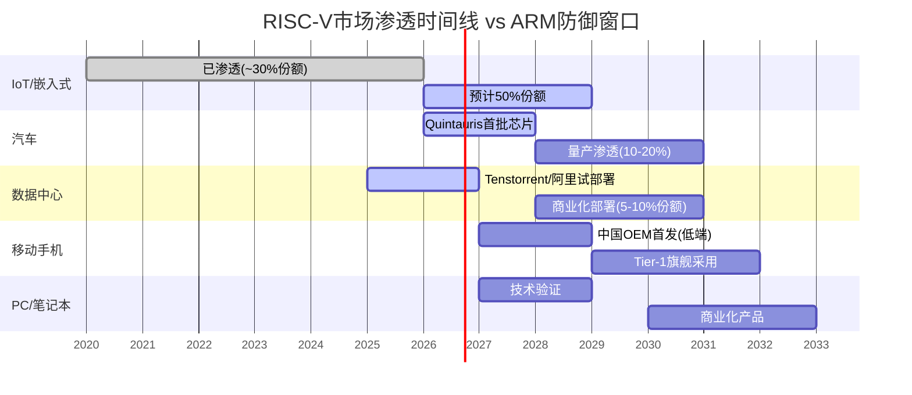

# ARM 扩展章节 — 第6/14/23章深化

> 本文件为ARM_Complete_v1.0的补充扩展内容，按章节编号对齐，插入原文对应位置。

---

## 第6章扩展: Phoenix计划深化

### 6.7 Phoenix商业模型详解: 从IP授权到芯片设计的收入重构

Phoenix不仅仅是一颗芯片——它代表ARM商业模型的根本性扩展。理解Phoenix的收入模型需要拆解三层收入结构:

**第一层: NRE(一次性工程费用)**

ARM为超大规模客户定制芯片设计，收取NRE费用:

| 客户类型 | NRE范围 | 参考对标 | 说明 |
|---------|:------:|---------|------|
| **Tier 1超大规模** (Meta/Google) | $50-100M | Broadcom为Google定制TPU的NRE约$80-120M | ARM作为IP所有者，设计效率理论上更高 |
| **Tier 2中等规模** (Cloudflare/Oracle) | $30-50M | Marvell为Amazon定制芯片NRE约$40-60M | 客户规模较小，定制程度较低 |
| **SoftBank关联方** (Stargate/OpenAI) | $0-20M | 关联交易可能低于市场价 | 这是隐含的利益输送风险 |

**NRE的战略含义**: NRE是"前置现金流"——ARM在芯片流片前就能确认收入。但NRE也是"设计承诺"——一旦接单，ARM的工程资源就被锁定12-18个月。以ARM当前~7,600名员工计算，一个Phoenix级别项目需要300-500名工程师(占总工程人力的8-13%)。如果同时执行3个以上定制芯片项目，ARM的核心IP研发(v10/下一代CSS)将面临资源挤压。

**第二层: 芯片销售收入**

Phoenix量产后，ARM通过TSMC代工生产芯片，直接向客户销售:

- **芯片BOM成本**: TSMC 3nm双die封装，估计wafer成本$12,000-18,000/片，每wafer约50-80颗good die(双die)，单颗成本约$300-720
- **售价**: 参考AMD EPYC 9004系列($3,500-11,000)和Ampere Altra($3,000-5,500)，Phoenix目标售价$4,000-8,000
- **毛利率**: 估计55-65%(低于IP授权的95%，但高于一般芯片公司的45-55%，因为ARM不支付IP授权费给自己)

**第三层: 隐含版税替代效应(关键)**

这是市场最容易忽视的一点: **每颗Phoenix芯片替代了一笔本来会产生版税的交易**。

具体量化: 假设Meta原本使用第三方ARM芯片(如Ampere Altra)，ARM收取1.5-2%版税。一颗$5,000的Altra产生$75-100版税。Meta改用Phoenix后，ARM获得$5,000芯片收入(假设60%毛利=$3,000利润)——表面上ARM赚了30x。但如果Meta原本会自行设计custom ARM芯片(如Google Axion)，ARM本来收取$10-15/芯片版税。Phoenix替代了这个路径——ARM从$10-15版税变为$3,000利润。

**陷阱在于**: 如果Phoenix的客户(Meta/Cloudflare)原本不会用ARM架构(会用x86或自研)，那Phoenix是纯增量。但如果客户原本会向第三方ARM芯片公司购买(产生版税给ARM)，Phoenix就有自相蚕食效应。根据目前客户名单(Meta无自研CPU团队、Cloudflare使用x86为主)，Phoenix短期蚕食效应可能较小(<10%)，但中期(FY2029+)随着客户扩展，蚕食风险上升。

### 6.8 与Broadcom/Marvell的竞争定位: IP所有者下场的渠道冲突

Phoenix把ARM直接推入了custom silicon这个$10B+市场，直面两个强劲对手:

**竞争格局量化**:

| 玩家 | Custom Silicon收入(CY2025E) | 核心客户 | 优势 | 劣势 |
|------|:--:|---------|------|------|
| **Broadcom** | $4.0-4.5B | Google(TPU), Meta(MTIA), Apple(网络芯片) | 规模最大，设计能力最强，客户粘性高 | 不拥有CPU IP，需向ARM授权 |
| **Marvell** | $1.2-1.5B | Amazon(Graviton供应链), Microsoft(Cobalt供应链) | 服务器/网络芯片经验深厚 | 规模较小，AI芯片经验有限 |
| **ARM (Phoenix)** | $0(未出货) → $300-500M(FY2028E) | Meta, OpenAI/Stargate | **拥有底层IP** — 设计效率理论最高 | 零芯片量产经验，渠道冲突 |

**ARM的独特定位: "IP所有者亲自下场"**

ARM作为CPU IP的所有者进入custom silicon市场，理论上有结构性优势:
1. **设计周期缩短**: 不需要从ARM获取IP授权+集成——ARM自己就是IP源，减少6-12个月设计周期
2. **性能优化深度**: ARM可以为特定客户深度定制微架构(改cache hierarchy、改分支预测器)，而外部授权方只能基于标准核心做集成
3. **成本结构**: ARM不需要向自己支付版税，理论上可以将芯片价格降低3-5%

**但渠道冲突是致命风险**:

ARM进入custom silicon = 与自己的最大授权客户群直接竞争。Broadcom每年向ARM支付数亿美元授权费，Marvell也是重要被授权方。如果ARM的Phoenix直接争抢Broadcom的Google TPU订单或Marvell的Amazon Graviton订单:

- **短期**: Broadcom/Marvell不会立即放弃ARM(切换成本太高，替代方案RISC-V尚不成熟)
- **中期(2-3年)**: Broadcom/Marvell会加速RISC-V评估。Broadcom已在内部运行RISC-V POC(proof of concept)
- **长期(5年+)**: 如果Phoenix大规模抢占market share，Broadcom可能成为RISC-V的最大推动者——用$4B+的custom silicon营收来证明RISC-V的商业可行性

**历史类比: Intel IDM 2.0**

Intel在2021年宣布IDM 2.0战略——同时做芯片设计+代工。结果: 代工客户(理论上)担心Intel会用客户数据优化自己的竞品。3年后，Intel Foundry外部客户收入微乎其微。ARM面临类似的"信任赤字"问题——但ARM的情况可能比Intel更好(ARM不是代工，而是设计服务)，也可能更差(ARM掌握的IP远比Intel代工掌握的客户信息更核心)。

### 6.9 Phoenix对估值的概率加权影响

综合以上分析，将Phoenix对ARM企业价值的影响分为三个情景:

**Bull case (概率20%): Phoenix大成**
- FY2028 Phoenix收入: $500M-800M(3-4个超大规模客户)
- FY2030 Phoenix收入: $2.0-3.0B(数据中心custom silicon前三)
- 渠道冲突管理得当(Phoenix专注Meta/SoftBank系，不直接抢Broadcom客户)
- 增量EV: +$8-15B (Phoenix按芯片公司10-15x P/S估值)
- 但: 混合毛利率从95%降至80-85%，P/S倍数下降 → 净EV增加约+$3-8B

**Base case (概率50%): Phoenix温和贡献**
- FY2028 Phoenix收入: $200-400M(Meta+1-2个客户)
- 被授权方关系小幅恶化但未导致大规模RISC-V迁移
- 增量EV: +$1-3B(收入增量部分被估值倍数下降抵消)

**Bear case (概率30%): Phoenix拖累**
- FY2028 Phoenix收入: <$200M(仅Meta一家客户，出货量低于预期)
- 芯片设计分散了ARM核心IP研发资源(v10/CSS延迟)
- 渠道冲突加剧: Qualcomm/Broadcom加速RISC-V投入
- 增量EV: **-$2-5B**(直接亏损有限，但信任损失导致核心业务估值下降)

**概率加权Phoenix EV影响**: 20%×$5.5B + 50%×$2B + 30%×(-$3.5B) = **+$1.05B**

**关键洞见**: Phoenix的概率加权EV贡献仅约$1B——相对于ARM $136B市值，这意味着**Phoenix对当前估值几乎没有贡献**。市场对Phoenix的定价更多是"期权价值"(如果大成→估值跳升)而非"确定性贡献"。投资者应将Phoenix视为一张彩票——预期价值有限，但如果中了(大成)，回报显著。

---

## 第14章扩展: RISC-V专题深化

### 14.6 RISC-V生态系统成熟度评估: 硬件就绪,软件追赶

判断RISC-V对ARM的真实威胁，必须逐层评估生态系统成熟度——芯片性能只是冰山一角:

**Layer 1: 工具链成熟度**

| 工具 | ARM状态 | RISC-V状态 | 差距评估 |
|------|--------|-----------|---------|
| **GCC编译器** | 完全成熟(20年+优化) | 功能完整，但优化深度不足(性能差10-15%) | **1-2年差距** |
| **LLVM/Clang** | 一级支持 | 一级支持(2023年起) | **基本追平** |
| **Go/Rust/Java** | 原生支持 | Go 1.21+/Rust tier-2/OpenJDK port | **2-3年差距**(性能优化) |
| **调试器(GDB/LLDB)** | 完全成熟 | 功能完整但扩展生态不足 | **1年差距** |

**Layer 2: 操作系统与软件生态**

| 平台 | ARM支持 | RISC-V支持 | 差距评估 |
|------|--------|-----------|---------|
| **Linux内核** | 一级架构(15年+) | 5.x内核主线支持，6.x+持续增强 | **功能追平，驱动覆盖差** |
| **Android** | 唯一官方架构(截至2024) | GKI整合(2025)，Android 15 RISC-V preview | **3-4年差距**(应用兼容) |
| **Windows** | Windows on ARM(成熟) | 无官方支持(微软未宣布计划) | **5年+差距** |
| **容器/K8s** | 完全支持 | Docker/K8s基本可用，生态镜像覆盖~60% | **2年差距** |
| **AI框架** | TF/PyTorch完全优化 | TF-Lite基本支持，PyTorch实验性 | **3-4年差距** |

**Layer 3: EDA与IP生态**

| 领域 | ARM生态 | RISC-V生态 | 差距评估 |
|------|--------|-----------|---------|
| **Synopsys EDA** | 全套支持+参考实现 | 2024起提供RISC-V全流程(DesignWare IP) | **工具追平，IP丰富度差** |
| **Cadence EDA** | 全套支持 | 全套支持+Tensilica RISC-V核 | **基本追平** |
| **物理IP库** | 庞大(20年积累) | 快速增长但总量约ARM的30% | **3-5年差距** |
| **验证IP (VIP)** | 完善 | 主要厂商已支持但覆盖不完整 | **2-3年差距** |

**综合成熟度评分** (10=完全成熟):

```
ARM:    工具链[9] 操作系统[9] EDA/IP[9] 应用生态[9]  → 总分 36/40
RISC-V: 工具链[7] 操作系统[5] EDA/IP[7] 应用生态[3]  → 总分 22/40
差距:   成熟度比 = 61% (RISC-V约为ARM的六成水平)
```

**关键判断**: RISC-V的硬件工具(EDA/编译器)已接近ARM水平，但软件应用生态(尤其是Android应用兼容、Windows支持、AI框架优化)仍有3-5年差距。这意味着: RISC-V在不依赖丰富软件生态的市场(IoT/嵌入式/加速器)已具备替代能力，但在软件生态是核心壁垒的市场(手机/PC/通用服务器)仍需时间。

### 14.7 RISC-V在各终端市场的渗透时间表与ARM防御窗口

基于生态成熟度评估，RISC-V在不同终端市场的渗透遵循明确的路径依赖:



**逐市场详解**:

**IoT/嵌入式 (RISC-V已突破, ARM防御窗口已过)**
- 当前: RISC-V占新设计~30%，Espressif(ESP32-C系列)、兆易创新(GD32V)已量产
- 切换成本: **极低**(嵌入式软件移植简单，无复杂OS依赖)
- ARM应对: Cortex-M0+免版税，但已晚——RISC-V免版税+可定制的优势已确立
- ARM收入影响: IoT版税贡献本就很低(单芯片$0.01-0.05)，影响有限但象征意义大

**汽车 (2026-2028关键窗口)**
- Quintauris联盟(Bosch/Infineon/NXP/Qualcomm/ST)已明确2026-2027首批汽车RISC-V芯片
- 切换成本: **中等**(车规认证需18-24个月，功能安全认证ISO 26262需额外12个月)
- ARM防御: 汽车级Cortex-R/A系列已有深厚验证历史，安全认证是天然壁垒
- 关键变量: 如果Quintauris成员(尤其NXP/Infineon)在2027年完成RISC-V车规认证，ARM汽车市场的壁垒将显著降低
- ARM收入影响: 汽车是ARM高增长市场(版税率较高)，FY2025汽车收入估计$400-500M，如RISC-V渗透加速，FY2030可能少增$200-400M

**数据中心 (2028-2030决定性窗口)**
- 当前: ARM在服务器市场约10%份额(AWS Graviton为主)，RISC-V<1%
- Tenstorrent Ascalon-X SPECint已追平Neoverse V3——性能差距归零
- 但: 数据中心软件栈极重(数千个优化过的library/middleware)，RISC-V完全兼容需3-5年
- 切换成本: **高**(软件栈迁移+验证+性能调优需要巨额投入)
- ARM防御: CSS子系统(预集成的SoC方案)大幅降低了客户采用ARM的门槛，同时也增加了迁出成本
- 关键变量: 如果Google/阿里在2028年前完成RISC-V数据中心软件栈验证并开源，切换成本将骤降

**移动手机 (2027-2029, ARM最核心的防线)**
- Android GKI整合是关键里程碑——意味着Google在为RISC-V手机铺路
- 但: 移动应用生态(数百万APP)的ARM原生编译是最深的护城河
- 中国OEM(传音/中兴等)可能在2027-2028推出低端RISC-V手机
- Tier-1旗舰(三星/小米/OPPO高端线)采用RISC-V至少要2029-2030
- 切换成本: **极高**(整个移动应用生态需要重新编译/测试/优化)
- ARM收入影响: 移动是ARM最大收入来源(~45%版税)，如果RISC-V在2030年前渗透至移动市场10%，ARM年版税减少$300-500M

### 14.8 定价权压力量化: v10版税天花板被RISC-V永久压低

ARM定价权是其估值的核心驱动力——v9相对v8提价30-50%是ARM FY2024-2025收入加速的主因。市场对v10(预计2027-2028发布)的提价预期是ARM $136B估值的重要支撑。但RISC-V作为"CDS"正在压低这个天花板。

**v10定价权的理论模型**:

| 假设 | 无RISC-V世界 | 有RISC-V世界 | 差距 |
|------|:----------:|:----------:|:---:|
| **v10 vs v9版税倍数** | 2.0-3.0x | 1.3-1.5x | **35-50%更低** |
| **理由** | ARM是唯一选择，客户必须接受 | 客户拿RISC-V作谈判筹码 | — |
| **v10移动版税率** | 3.5-5.0% | 2.0-3.0% | 差1.5-2.0pp |
| **v10服务器版税率** | 2.5-4.0% | 1.5-2.5% | 差1.0-1.5pp |

**Qualcomm案例深挖**:

Qualcomm 2025年12月以$2.4B收购Ventana Micro，获得高性能RISC-V服务器核IP。这笔交易的战略含义远超数据中心:

- Qualcomm Snapdragon是ARM最大的移动版税来源之一(估计年版税$400-600M)
- 收购Ventana后，Qualcomm在v10谈判中可以说: "如果v10版税超过X%，我们会在2029年的旗舰SoC中开始评估RISC-V核心"
- 即使Qualcomm永远不会真的在旗舰手机中用RISC-V(概率>70%)，这个**威胁的存在**就足以压低ARM的要价
- 类比: 在劳资谈判中，工人成立工会的能力(即使从未罢工)就改变了工资谈判的动态

**量化v10定价权被RISC-V压低的收入影响**:

```
无RISC-V基准: v10版税贡献(FY2030) = $5.5B
  移动: $3.2B (v10渗透率60% × 提价2.5x)
  服务器: $1.3B (v10渗透率80% × 提价2.0x)
  汽车/IoT: $1.0B

有RISC-V约束: v10版税贡献(FY2030) = $3.8-4.5B
  移动: $2.3B (v10渗透率55% × 提价1.4x)
  服务器: $0.9B (v10渗透率70% × 提价1.3x)
  汽车/IoT: $0.8B (部分转RISC-V)

差额 = $1.0-1.7B/年

将差额资本化(假设永续增长3%, 折现率10%):
PV = $1.35B / (10%-3%) = $19.3B

→ RISC-V对ARM定价权的侵蚀 = 约$15-25B企业价值 = 当前市值的11-18%
```

**关键洞见**: RISC-V不需要替代ARM一颗芯片——仅仅是其存在对ARM定价权的约束，就值当前市值的11-18%。这与H2假说("RISC-V是ARM的CDS")完全吻合。市场如果没有充分定价这个约束，ARM就被高估了$15-25B。

**ARM的反制空间**: ARM并非完全被动。v10可以通过增加差异化功能(如CCA机密计算、SVE2向量扩展、RME内存加密)来创造"功能溢价"而非"锁定溢价"。如果v10的差异化足够强(RISC-V 3年内无法复制的功能)，ARM仍可实现1.5-1.8x提价——但这要求ARM的研发持续领先，且不能被Phoenix项目分散资源。

---

## 第23章扩展: Arm China与地缘风险深化

### 23.6 安谋中国财务深挖: 不透明的$700M

Arm China的财务数据是ARM最不透明的区域——投资者只能从ARM合并报表中反推:

**收入拆解**:

| 指标 | FY2024 | FY2025 | 推算方法 |
|------|:------:|:------:|---------|
| **Arm China贡献(总)** | ~$697M | ~$749M | 中国区收入(20-F地理分拆) |
| 其中: 授权费 | ~$180M | ~$200M | 估计(新授权协议签署) |
| 其中: 版税 | ~$517M | ~$549M | 估计(基于出货量) |
| **版税来源分布** | | | |
| - 手机SoC版税 | ~$360M | ~$370M | 小米/OPPO/vivo/联发科中国出货 |
| - IoT/嵌入式版税 | ~$100M | ~$110M | 兆易/乐鑫/全志等MCU |
| - 汽车/其他版税 | ~$57M | ~$69M | 地平线/黑芝麻/芯驰等 |

**Arm China作为中间实体的不透明性**:

Arm China的运作模式不同于ARM在其他地区的直接授权——Arm China是一个**中间实体**:

```
ARM (英国) ──授权IP──→ Arm China (中国) ──转授权──→ 中国客户(小米/OV等)
                              ↓
                    Arm China从客户收取版税
                              ↓
                    Arm China向ARM支付(扣除运营成本后)
```

这个结构创造了几个财务不透明性:
1. **Arm China的运营成本扣除比例**: ARM未披露Arm China的运营成本率。如果Arm China扣除20%运营成本，ARM实际只收到中国客户版税的80%
2. **版税收集时效**: Arm China在收到客户版税后，多久转给ARM？中间存在账期差——这部分float由Arm China控制
3. **转移定价**: Arm China向中国客户收取的版税率是否与ARM全球标准一致？如果Arm China对某些客户给予折扣，ARM无法直接管控

**Allen Wu治理危机(2020-2022)的遗留风险**:

2020年6月，ARM/SoftBank试图解除Arm China CEO Allen Wu的职务。Wu拒绝离职，利用中方股东控制权维持运营长达两年。最终在2022年4月通过中方股东介入才完成CEO替换。

这一事件暴露的结构性风险:
- ARM对Arm China的CEO任免权**实际上需要中方股东同意**
- 在Wu拒绝离职期间，Arm China的版税向ARM转账出现延迟
- 即使危机"解决"，底层治理结构(中方51%运营控制)未改变

**对投资者的含义**: Arm China的$749M收入在ARM报表中看起来是"稳定的中国业务收入"，但实际上通过一个ARM无法完全控制的中间实体收取。这不是一般的地缘政治风险——这是**治理结构风险**，且在ARM的风险披露中被轻描淡写。

### 23.7 中国自主替代加速: RISC-V+政策+资金的三重推力

中国的ARM替代不仅是商业决策，更是国家战略。理解这个维度对ARM的中国收入前景至关重要:

**中国RISC-V生态全景**:

| 玩家 | 类型 | 产品 | 阶段 | 对ARM威胁 |
|------|------|------|:----:|:------:|
| **阿里/平头哥** | 互联网巨头 | C930服务器CPU, 玄铁系列 | 量产 | **高** |
| **华为/海思** | 通信设备商 | 部分MCU已转RISC-V | 量产 | **高**(被制裁后加速) |
| **北京开源芯片研究院** | 国家级机构 | "香山"高性能RISC-V核 | 研发/流片 | **中**(长期) |
| **芯来科技(Nuclei)** | RISC-V IP供应商 | 嵌入式RISC-V核 | 量产 | **中** |
| **赛昉科技(StarFive)** | SoC公司 | JH7110 RISC-V SoC | 量产 | **中** |
| **进迭时空(SpacemiT)** | 笔记本CPU | Key 6 RISC-V笔记本 | 小批量 | **低**(性能差距大) |

**政府资金推动规模**:

- **国家集成电路产业投资基金(大基金)三期**: 2024年5月成立，规模$47.5B(3440亿元)——为全球最大半导体政府基金
- 大基金一期/二期已投资多家RISC-V相关企业(芯来科技、赛昉科技等)
- 三期明确将"自主指令集架构"列为重点投资方向
- 各地方政府配套基金额外约$20B+

**为什么中国RISC-V采用速度可能是全球其他地区的2倍**:

1. **政策强制力**: 中国政府可以通过采购政策强制政府/国企IT系统采用RISC-V(类似信创政策对x86的替代)
2. **制裁倒逼**: 华为/中芯国际等被制裁企业**没有选择**——ARM v9高性能核可能被禁止出口，RISC-V是唯一出路
3. **成本敏感性**: 中国IoT/嵌入式市场极度价格敏感(单芯片利润$0.01-0.1)，RISC-V免版税的优势更明显
4. **生态封闭性**: 中国安卓生态(华为鸿蒙/小米MIUI/OV ColorOS)高度本地化，对底层ISA切换的软件兼容性要求低于全球统一生态

**量化预测**: 中国RISC-V在各市场的渗透率可能比全球其他地区快2-3年:

| 市场 | 全球RISC-V渗透(2030E) | 中国RISC-V渗透(2030E) | 差异 |
|------|:---:|:---:|:---:|
| IoT/嵌入式 | 40-50% | **60-70%** | +20pp |
| 汽车 | 15-20% | **25-35%** | +10-15pp |
| 服务器 | 5-10% | **15-25%** | +10-15pp |
| 手机 | 3-5% | **10-15%** | +7-10pp |

如果上述预测成立，Arm China的版税收入将面临**双重压力**: (1)中国ARM芯片出货量增速放缓(被RISC-V替代)；(2)ARM版税率上调空间被RISC-V约束。两者叠加，Arm China收入在FY2030可能仅为$600-800M(vs 无RISC-V场景的$1,200-1,500M)。

### 23.8 地缘情景分析: 三条路径的概率加权

将Arm China的地缘政治风险分解为三个可参数化的情景:

**情景A: 现状维持 (概率50%)**

假设条件:
- 美中科技关系维持当前"竞争但不脱钩"的状态
- ARM v9对中国出口限制保持现有范围(高性能核受限，通用核不受限)
- Arm China治理结构不变

财务影响:
- Arm China收入: FY2026 $780M → FY2028 $850M → FY2030 $900-1,000M
- 年增长率: 5-8%(低于集团平均，因RISC-V渗透)
- 占总收入: 从19%持续降至12-14%(分母增长更快)
- EV影响: **-2~3%**(温和的占比稀释)

**情景B: 部分脱钩 (概率30%)**

假设条件:
- 美国扩大对中国芯片技术出口限制(可能包括ARM v9+全部版本)
- ARM被迫限制对Arm China的最新IP授权
- 部分中国客户(非被制裁企业)被禁止使用ARM最新架构
- Arm China仍可运营，但只能授权旧版本(v8及以前)

财务影响:
- Arm China收入: FY2026 $700M → FY2028 $550M → FY2030 $400-500M
- 版税率下降(旧架构版税率低于新架构)
- 中国客户加速RISC-V迁移: 不仅是"保险"，而是"必须"
- 占总收入: 降至6-8%
- EV影响: **-6~10%**(收入损失+加速的RISC-V替代溢出效应)

**情景C: 完全脱钩 (概率20%)**

假设条件:
- 台海危机或其他地缘事件导致美国对中国实施全面半导体技术禁运
- ARM被要求完全切断对Arm China的IP授权(包括存量授权的维护更新)
- Arm China可能基于存量IP继续运营(类似华为使用ARM v8设计Kirin)，但不再向ARM支付版税

财务影响:
- Arm China收入: FY2026后12个月内降至$100-200M(存量合同尾款) → 最终归零
- 中国ARM生态冻结在当前版本，全面转向RISC-V
- 对全球的溢出效应: 中国RISC-V生态的成功可能加速其他新兴市场的RISC-V采用
- 占总收入: 降至0-2%
- EV影响: **-12~18%**(直接收入损失$600-700M + 全球RISC-V加速效应$300-500M)

**概率加权EV影响**:

```
50% × (-2.5%) + 30% × (-8%) + 20% × (-15%) = -6.65%

按当前市值$136.1B计算:
地缘政治风险的隐含折价 = $136.1B × 6.65% = $9.1B
```

**与市场定价的比较**: ARM当前股价是否已经反映了这$9.1B的地缘风险折价？从ARM相对Cadence/Synopsys(纯美国收入的EDA公司)的P/S折价来看(ARM 28x vs CDNS 18x vs SNPS 14x)，ARM实际上获得了溢价而非折价——这意味着市场可能**完全没有定价Arm China地缘风险**。

**投资者行动指南**:
- 如果认为情景B/C概率>50%: ARM被高估$9-15B，应回避
- 如果认为情景A概率>60%: 地缘风险可控，但仍需监控Arm China季度收入占比趋势
- **关键监测指标**: Arm China收入占比跌破15% = 预警信号(当前19%)；跌破10% = 结构性恶化确认
