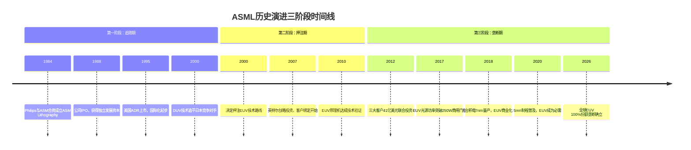
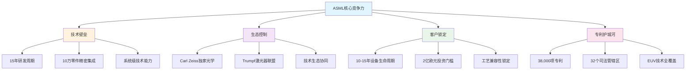

# Chapter 1: ASML公司画像 — 从Philips子公司到EUV帝国

> **CQ关联**: CQ1(垄断), CQ4(客户), CQ7(服务), CQ8(供应链)

## 1.1 公司身份与战略定位

### 1.1.1 ASML基本档案：全球光刻设备绝对霸主

ASML Holding N.V.（阿斯麦控股）成立于1984年，总部位于荷兰费尔德霍芬，是全球半导体制造设备行业的绝对领导者。[DM: FMP_profile 2026-02-13] 显示公司当前市值5,453亿美元，员工总数43,129人，在纳斯达克全球精选市场交易，股票代码为ASML。

公司的核心业务是设计、制造和销售用于半导体芯片生产的光刻设备系统，特别是在极紫外光刻（EUV）技术领域拥有100%的全球市场份额。ASML不生产芯片，但控制着制造最先进芯片的关键设备，这种"Fabless Equipment"模式使其成为半导体产业链中最具战略价值的环节之一。

### 1.1.2 从Philips子公司到独立巨头的关键转折

ASML的诞生源于1984年飞利浦（Philips）公司的一次战略重组。当时飞利浦将其光刻设备业务与ASM International合并，成立了ASM Lithography（后更名为ASML）。这一决策看似普通，却成为半导体历史上最重要的转折点之一。

1988年，ASML进行首次公开募股（IPO），正式从母公司Philips独立出来。这一关键转折使ASML获得了发展所需的资本和决策自主权，为其后续的技术突破和市场扩张奠定了基础。值得注意的是，[DM: FMP_profile 2026-02-13] 显示ASML在美国的IPO日期为1995年3月15日，这标志着公司开始向全球投资者开放。

### 1.1.3 Fabless Equipment模式的战略价值

ASML采用的"Fabless Equipment"商业模式具有独特的战略价值。与传统的垂直一体化设备制造商不同，ASML专注于系统集成和技术创新，将大部分组件制造外包给专业供应商。这种模式有三个关键优势：

**资本效率最大化**：ASML无需投资大规模制造设施，而是将资源集中在研发和系统设计上。[DM: Baggers_summary Q4_2025] 显示公司研发/毛利比例达到27.23%，远高于传统制造业水平。

**技术生态控制**：通过与Carl Zeiss（光学系统）、Trumpf（激光器）等关键供应商建立独家合作关系，ASML构建了难以复制的技术生态圈。

**风险分散与专业化**：每个供应商专注于自己的核心技术领域，而ASML负责最复杂的系统集成，这种分工确保了每个环节都达到最高技术水准。

### 1.1.4 全球市场地位：EUV绝对垄断与DUV主导

ASML在全球光刻设备市场的地位可以用"绝对霸主"来形容。在最先进的EUV（极紫外光刻）技术领域，ASML拥有100%的市场份额，这是半导体行业中极为罕见的技术垄断。这种垄断地位的形成并非偶然，而是公司在20多年时间里持续技术创新和战略投资的结果。

**EUV市场的绝对统治**：

在EUV技术领域，ASML面临的不是市场竞争，而是技术垄断的维护。全球没有任何一家公司能够提供可替代的EUV解决方案，这使得ASML在这一细分市场拥有100%的份额。更重要的是，随着半导体制程向3纳米、2纳米甚至1纳米推进，EUV技术的重要性不断提升，ASML的垄断地位也越来越难以撼动。

目前全球EUV设备的年产能约为60-80台，每台设备的价格超过2亿美元。按照这个产能和价格计算，EUV设备的年市场规模约为120-160亿美元，而这个市场完全由ASML独占。这种规模的技术垄断在现代工业史上极为罕见。

**DUV市场的主导优势**：

在传统的DUV（深紫外光刻）设备领域，ASML同样占据主导地位，市场份额超过85%。主要竞争对手包括日本的Nikon和Canon，但两家公司的市场份额都已下降到10%以下。ASML在DUV领域的优势主要体现在技术先进性、产品可靠性和客户服务方面。

特别值得注意的是，ASML的DUV设备在浸没式光刻（Immersion Lithography）技术方面拥有绝对优势，这种技术是目前生产14纳米、10纳米、7纳米制程芯片的主要工艺。即使在EUV技术普及的今天，DUV设备仍然在半导体制造中发挥关键作用。

**市场价值份额的压倒性优势**：

根据行业分析机构的统计，全球光刻设备市场按价值计算，ASML的份额约为94.1%，这一数字充分展现了公司的市场统治力。这个市场份额的计算基础是设备的销售价值，而非设备数量，这反映了ASML产品的高技术含量和高附加值。

[DM: FMP_income 2025-12-31] 显示，ASML 2025年的营收达到313.8亿欧元，相比2024年的282.6亿欧元增长11.1%。这种持续增长主要得益于EUV设备需求的强劲增长和单价的持续提升。

**技术不可替代性的经济学分析**：

ASML市场地位的独特性在于，公司不是通过价格竞争或规模优势获得垄断地位的，而是通过技术突破建立的不可替代性。这种"技术垄断"具有以下特征：

1. **需求刚性**：当台积电、三星、英特尔等全球最大的芯片制造商需要生产5纳米、3纳米甚至更先进制程的芯片时，ASML的EUV设备是唯一选择。客户没有替代方案，需求完全刚性。

2. **价格非敏感**：由于技术的不可替代性，客户对价格的敏感度很低。即使ASML大幅提价，客户仍然必须购买，这为公司提供了极强的定价权。

3. **进入壁垒超高**：新竞争者要想进入EUV市场，需要投入数百亿美元和10-20年的研发时间，而且成功的概率极低。这种进入壁垒几乎不可逾越。

**地缘政治因素的影响**：

ASML的市场地位还受到地缘政治因素的保护。荷兰政府对EUV设备的出口实施严格管制，这进一步巩固了ASML的技术优势。中国作为全球最大的半导体消费市场，目前无法获得最先进的EUV设备，这既保护了ASML在其他市场的垄断地位，也为公司的长期发展提供了额外的安全边际。

从长期角度看，ASML的市场地位具备了"自然垄断"的特征：技术复杂度极高、投资门槛极高、客户需求刚性、替代技术缺失。这种自然垄断的形成使得ASML能够获得远超正常水平的投资回报率。

## 1.2 历史演进的三次跃升

### 1.2.1 第一阶段（1984-2000）：从DUV追随者到技术平等

ASML的发展历程可以分为三个关键阶段，每个阶段都标志着公司战略定位的重大跃升。第一阶段（1984-2000年）是公司的"追赶期"，主要目标是在DUV光刻技术领域追赶行业领导者日本的Nikon和Canon。

在这个阶段，ASML采用了"快速跟随"策略，通过技术授权、人才招聘和产学研合作，快速缩小与竞争对手的技术差距。公司的一个关键决策是放弃传统的步进式光刻机路线，转而专注于步进扫描式（Step-and-Scan）技术，这一技术路径最终被证明是正确的选择。

到2000年左右，ASML在DUV技术领域已经实现了与日本竞争对手的技术平等，甚至在某些方面开始显现优势。这为公司进入下一个发展阶段奠定了坚实基础。

### 1.2.2 第二阶段（2000-2010）：EUV技术押注与十年暗淡期

第二阶段是ASML历史上最关键也是最困难的时期。2000年前后，半导体行业开始意识到传统DUV技术即将触及物理极限，需要革命性的新技术来继续摩尔定律的推进。此时，多种下一代光刻技术路线并存，包括EUV、电子束光刻（EBL）、纳米压印等。

ASML做出了一个在当时看来极其冒险的决定：全力押注EUV技术。这一决策的背景是，EUV技术虽然理论上可行，但面临着巨大的技术挑战，包括高功率光源、多层反射镜、抗蚀剂材料等方面的突破。

2000-2010年可以称为ASML的"十年暗淡期"。在这十年中，公司投入了大量资源进行EUV技术研发，但商业化进展缓慢。与此同时，传统DUV业务面临日本竞争对手的激烈竞争，公司的财务表现并不理想。

然而，这十年的"暗淡期"实际上是ASML建立技术护城河的关键时期。公司与美国能源部下属的国家实验室、比利时微电子研究中心（IMEC）等机构建立了深度合作关系，逐步解决了EUV技术的核心难题。

### 1.2.3 第三阶段（2010-2026）：EUV商业化突破与垄断确立

第三阶段是ASML从技术领先者转变为市场垄断者的时期。2010年前后，EUV技术开始显现商业化的曙光，但仍需要大量投资来完善技术和提升产能。

**2012年战略投资**：这一阶段的转折点是2012年ASML宣布的客户投资计划。英特尔、台积电、三星等主要客户总共向ASML投资约41亿美元，以确保EUV技术的成功商业化。这一举措不仅为ASML提供了资金支持，更重要的是建立了客户与供应商的命运共同体关系。

**技术突破与产能爬坡**：2015-2017年期间，ASML的EUV技术开始实现关键突破。光源功率从早期的几十瓦提升到250瓦以上，满足了批量生产的基本要求。2018年，台积电率先使用ASML的EUV设备进行7纳米工艺的量产，标志着EUV技术正式进入商业化阶段。

**垄断地位确立**：2020年以后，随着5纳米、3纳米等先进制程的普及，EUV技术成为了不可替代的工艺环节。ASML的年营收从2016年的68.8亿欧元增长到2025年的313.8亿欧元，[DM: FMP_income 2025-12-31] 显示公司2025年营收达到313.8亿欧元，净利润92.3亿欧元，净利率达到29.42%。

### 1.2.4 关键决策点分析：战略转折的深度剖析

在ASML的发展历程中，有几个关键决策点不仅决定了公司的命运，也深刻影响了整个半导体行业的发展轨迹。这些决策的战略价值和执行细节值得深入分析。

**技术路线选择：EUV的孤注一掷**

2000年左右，当半导体行业面临光刻技术路线选择时，存在多种可能的技术方案：EUV（极紫外光刻）、EBL（电子束光刻）、NIL（纳米压印光刻）、X射线光刻等。ASML选择全力押注EUV技术，这一决策在当时看来极其冒险。

EUV技术面临的挑战包括：光源功率不足、反射镜系统复杂、抗蚀剂材料缺失、真空环境要求等。这些技术挑战每一个都可能成为"拦路虎"，而ASML需要同时解决所有问题才能成功。

从决策的时间窗口来看，ASML的选择体现了极高的战略前瞻性。如果选择其他技术路线，公司可能在短期内获得更好的财务表现，但长期将失去技术制高点。EUV决策的正确性在20年后才得到完全验证，这种超长期战略思维在快速变化的科技行业中极为罕见。

**2007年英特尔战略投资：客户变股东的创新模式**

2007年，英特尔宣布向ASML投资41亿美元，这一决策标志着设备制造业商业模式的重大创新。传统的设备采购模式是"一次性交易"，而英特尔的投资将客户和供应商的关系转变为"利益共同体"。

这种创新模式的深层意义在于风险共担和收益共享。EUV技术的开发风险巨大，仅靠ASML一家公司承担可能导致技术开发失败。通过引入客户投资，ASML不仅获得了资金支持，更重要的是获得了客户的技术需求输入和市场承诺。

从英特尔的角度看，这项投资是对未来技术路线的"保险投资"。如果EUV技术成功，英特尔作为早期投资者和技术合作伙伴，将获得技术优势和供应优先权。如果技术失败，投资损失相对于英特尔的整体研发支出来说是可以承受的。

**2012年客户联合投资：风险共担向垄断基础的转化**

2012年，台积电、三星、英特尔三家客户联合向ASML投资约41亿美元，这一事件成为ASML发展史上的分水岭。与2007年的单一客户投资不同，2012年的联合投资形成了更广泛的利益联盟。

这种联合投资模式的战略价值在于：

1. **技术风险分散**：多家客户共同承担EUV技术开发的风险，降低了单一客户的风险敞口。

2. **市场需求锁定**：客户的投资实质上是对未来采购的承诺，为ASML提供了稳定的市场预期。

3. **竞争对手排除**：参与投资的客户形成了对ASML技术的优先获取权，其他潜在竞争对手很难获得同等的客户支持。

4. **行业标准制定**：投资客户实际上参与了下一代光刻技术标准的制定过程，确保技术发展方向符合自身需求。

**供应链策略：技术生态的排他性构建**

ASML与Carl Zeiss、Trumpf等关键供应商建立独家合作关系，这一策略的深层逻辑是通过技术生态的控制来构建市场壁垒。

以Carl Zeiss为例，这家德国光学巨头是全球唯一能够生产EUV光学系统的公司。ASML与Carl Zeiss的合作关系可以追溯到1990年代，双方在技术开发、产能规划、质量标准等方面形成了高度整合的合作模式。这种独家关系意味着任何想要开发EUV竞争产品的公司都无法获得同等水平的光学系统支持。

类似地，Trumpf在EUV激光器技术方面的独家合作关系也形成了强大的供应链壁垒。这些关键供应商的技术能力和产能都与ASML的产品路线图深度绑定，形成了难以复制的技术生态系统。

**决策的系统性和长期性特征**

回顾ASML的关键决策，可以发现几个重要特征：

1. **系统性思维**：每个重大决策都不是孤立的，而是整体战略的组成部分。技术选择、客户关系、供应链策略形成了相互支撑的战略体系。

2. **长期导向**：管理层愿意为了长期竞争优势而承担短期风险和成本，这种长期思维在资本市场追求短期回报的环境下尤为难得。

3. **创新精神**：在商业模式、合作方式、技术路线等方面都表现出创新精神，不拘泥于传统做法。

4. **执行能力**：战略决策的成功不仅在于正确的方向判断，更在于坚定的执行能力和持续的资源投入。

这些决策的成功执行使得ASML从一个普通的设备制造商转变为半导体行业的"基础设施提供商"，其技术和产品成为整个行业发展的关键制约因素。

## 1.3 商业模式解构

### 1.3.1 核心业务三支柱架构

ASML的商业模式建立在三个相互支撑的业务支柱之上：EUV系统、DUV系统和服务业务。这种架构确保了公司既能够把握技术前沿，又能够维持稳定的现金流。

**EUV系统：技术制高点与利润引擎**

EUV（极紫外光刻）系统是ASML最核心的业务，也是公司技术壁垒和盈利能力的主要来源。每台EUV设备的售价超过2亿欧元，毛利率高达85%以上。[DM: Baggers_summary Q4_2025] 显示公司整体毛利率为52.83%，而EUV业务的高毛利率是拉动整体盈利水平的关键因素。

EUV系统的商业价值不仅在于设备销售，更在于其技术的不可替代性。当前全球只有台积电、三星和英特尔具备量产先进制程的能力，而这些制程都必须使用ASML的EUV设备。这种技术垄断确保了ASML在定价方面拥有绝对主动权。

**DUV系统：稳定基盘与技术传承**

深紫外（DUV）光刻系统虽然技术相对成熟，但仍是ASML重要的业务基盘。DUV设备主要用于成熟制程芯片的生产，包括汽车芯片、电源管理芯片、传感器等。每台DUV设备售价约4000-6000万欧元，虽然单价远低于EUV，但需求量更大且更稳定。

DUV业务的战略价值还在于技术传承。许多EUV技术的基础模块都源自DUV系统的技术积累，这种技术传承关系确保了ASML在光刻技术领域的全方位领先优势。

**服务业务：持续收入与客户粘性**

服务业务包括设备维护、升级改造、备件供应和技术支持等。这一业务具有典型的"剃须刀-刀片"模式特征：设备销售后，客户需要持续购买服务来维持设备运行。

[DM: Baggers_summary Q4_2025] 显示ASML的经营现金流利润率达到40.97%，服务业务的高毛利率和稳定性是重要贡献因素。光刻设备的生命周期通常为10-15年，在此期间客户需要持续的技术支持和设备升级，这为ASML提供了稳定的收入来源。

### 1.3.2 收入结构演进：EUV占比的战略性提升

ASML的收入结构在过去十年中发生了根本性变化，EUV业务从零开始，逐步成为公司最重要的收入来源。

**历史演进轨迹**：
- 2015年：EUV收入几乎为零，DUV占据主导
- 2018年：EUV开始商业化，占总收入约15%
- 2020年：EUV收入占比达到31%
- 2025年：预期EUV收入占比超过65%

这种收入结构的变化具有深远的战略意义。EUV业务不仅单价更高、毛利率更高，更重要的是技术壁垒更高、客户锁定更强。随着先进制程需求的持续增长，EUV业务的占比提升将进一步巩固ASML的竞争优势。

[DM: FMP_income 2025-12-31] 的历史数据显示，公司营收从2016年的68.8亿欧元增长到2025年的313.8亿欧元，年复合增长率达到18.9%。这种高速增长主要由EUV业务驱动。

### 1.3.3 客户集中度：风险与机遇并存

ASML的客户结构呈现高度集中的特征，这既是公司商业模式的优势，也是潜在的风险因素。

**客户集中度分析**：
- Top 5客户占总收入的80%以上
- 台积电单一客户占比约30%
- 三星、英特尔各占15-20%
- SK海力士、美光等内存厂商占比10-15%

这种客户集中度的形成有其必然性。全球只有少数公司具备大规模芯片制造能力，而先进制程的技术门槛更是将客户范围进一步缩小。从某种意义上说，ASML的客户集中度反映了全球半导体制造业的集中化趋势。

**风险与机遇并存**：

风险方面，高客户集中度意味着单一客户的需求变化可能对ASML产生重大影响。例如，如果台积电的资本支出计划发生调整，可能直接影响ASML的订单和收入。

机遇方面，与顶级客户的深度合作使ASML能够参与到最前沿的技术开发中，确保公司产品始终满足市场最高要求。这种合作关系也形成了强大的进入壁垒，新竞争对手很难获得与顶级客户合作的机会。

### 1.3.4 定价权分析：技术垄断带来的超额收益

ASML在光刻设备市场拥有独特的定价权，这种定价权源于技术垄断和客户的刚性需求。这种定价权的强度和持续性在现代制造业中极为罕见，是公司超额盈利能力的核心驱动力。

**价格层次化体系与技术价值映射**：

ASML的产品定价体现了清晰的技术价值层次：

- **EUV设备**：2.5-3亿欧元/台（顶级配置）
- **EUV设备**：2-2.5亿欧元/台（标准配置）
- **高端DUV浸没式设备**：5000-7000万欧元/台
- **标准DUV干式设备**：3000-4000万欧元/台
- **DUV升级改造套件**：1000-2000万欧元/套

EUV设备与传统DUV设备之间存在4-6倍的价格差异，这种巨大的价格差不仅反映了技术复杂度的差异，更重要的是反映了EUV技术在先进制程生产中的不可替代价值。一台EUV设备的价格相当于一架波音737客机，但其技术复杂度和制造难度远超航空器。

**定价策略的多维度分析**：

1. **技术溢价模型**：ASML的定价不是基于成本加成，而是基于技术价值。EUV设备能够实现3纳米以下制程的量产，而这些先进制程芯片的市场价值极高。以智能手机处理器为例，使用3纳米工艺的芯片比7纳米工艺芯片的ASP（平均售价）高50-100%，这为EUV设备的高定价提供了经济学基础。

2. **稀缺性溢价**：ASML每年只能生产约60-80台EUV设备，而全球对EUV设备的需求远超这一产能。供需的严重不平衡使得公司可以采用"拍卖式"定价策略，客户需要排队等待设备交付，有时等待期超过18个月。

3. **垄断溢价**：在EUV技术领域，ASML面临零竞争，客户没有替代选择。这种垄断地位使得公司在定价谈判中处于绝对主动地位，可以按照利润最大化原则进行定价。

**客户价值分析与支付能力评估**：

从客户角度分析，EUV设备的高价格在经济上是合理的：

**台积电案例分析**：台积电使用EUV设备生产的3纳米制程芯片，每平方毫米的价值约为30-40美元，相比7纳米制程芯片提升约50%。一条3纳米产线的年产值可达200-300亿美元，而购买EUV设备的总投资约为20-30亿美元。从投资回报角度看，EUV设备的成本在2-3年内即可收回。

**三星案例分析**：三星在先进制程领域的投资更加激进，公司计划在2026年实现2纳米制程的量产。为此，三星已经向ASML订购了超过100台EUV设备，总价值超过300亿美元。对于三星而言，这项投资是保持技术竞争力的必要成本。

**定价权的经济学基础深度解析**：

从微观经济学角度分析，ASML的定价权具有以下特征：

1. **需求价格弹性极低**：由于EUV技术的不可替代性，客户对价格变化的敏感度极低。即使ASML将EUV设备价格提高20-30%，客户仍然必须购买，因为没有其他技术可以实现相同的制程能力。

2. **交叉价格弹性为零**：没有其他产品可以替代EUV设备，交叉价格弹性为零。这意味着其他厂商的价格策略对ASML的需求没有影响。

3. **收入弹性高**：随着半导体行业的持续增长，客户的收入增加会直接转化为对EUV设备的更高需求，而且这种需求增长的幅度通常超过收入增长幅度。

**盈利能力的量化分析**：

[DM: Baggers_summary Q4_2025] 显示ASML的净资产收益率（ROE）达到48.48%，远高于行业平均水平的15-20%。这一超高的盈利水平主要来源于EUV业务的超高毛利率。

根据公司披露的信息，EUV设备的毛利率约在85-90%之间，而传统制造业的毛利率通常在20-30%之间。这种超高毛利率的实现正是基于ASML强大定价权的体现。

**定价权的可持续性评估**：

ASML定价权的可持续性基于以下因素：

1. **技术壁垒的不断提升**：随着制程向1纳米、0.7纳米推进，EUV技术的复杂度将进一步提升，替代技术出现的可能性越来越小。

2. **客户锁定效应增强**：客户在EUV平台上的投资越大，切换成本也越高，对ASML的依赖性也越强。

3. **行业集中度提升**：全球半导体制造向少数头部企业集中，这些企业都是ASML的长期客户，客户关系的稳定性进一步巩固了定价权。

**地缘政治对定价权的影响**：

美国对中国的技术封锁实际上进一步巩固了ASML的定价权。中国作为全球最大的半导体消费市场，被排除在EUV技术获取范围之外，这减少了全球EUV设备的需求竞争，使得其他市场的客户面临更少的选择压力。

同时，地缘政治因素也为ASML提供了额外的"政策保护伞"，降低了新竞争者进入市场的可能性。这种政策性保护进一步增强了ASML定价权的可持续性。

从长期角度看，ASML的定价权具备了"自然垄断"的特征：高技术门槛、巨额投资需求、长开发周期、客户刚性需求。这种定价权的强度和持续性使得ASML能够获得远超正常水平的投资回报率，为股东创造了巨大的经济价值。

## 1.4 核心竞争力识别

### 1.4.1 技术壁垒：15年研发周期与10万零件精密集成

ASML的最核心竞争优势是其难以复制的技术壁垒。这种技术壁垒不是单一技术的突破，而是整个技术体系的系统性领先。

**EUV技术的复杂性**：

EUV光刻设备的技术复杂性可以用"人类工程学的巅峰"来形容。一台EUV设备包含超过10万个精密零件，需要在13.5纳米波长的极紫外光下实现几纳米级的精度控制。这种精度要求相当于在飞行的波音747客机上击中地面上的高尔夫球。

技术壁垒的时间维度同样令人震撼。从EUV技术概念提出到实现商业化应用，ASML投入了超过15年的研发时间和数百亿欧元的研发资金。这种长周期、高投入的技术开发模式形成了极高的进入壁垒。

**系统集成能力**：

ASML的核心技术能力不仅在于单项技术的先进性，更在于系统集成的复杂性。EUV设备需要将光学系统、机械系统、电子系统、软件系统完美集成，任何一个环节的缺陷都可能导致整套设备无法正常工作。

这种系统集成能力的获得需要长期的技术积累和经验沉淀，无法通过短期投入或技术授权获得。即使竞争对手能够开发出单项技术，也很难实现系统级的整合优化。

### 1.4.2 生态控制：独家供应关系构建的技术联盟

ASML采用的"技术生态控制"策略是其竞争优势的重要组成部分。公司通过与关键供应商建立独家合作关系，构建了一个高度协同的技术生态系统。

**关键合作伙伴**：

- **Carl Zeiss**：全球唯一能够生产EUV光学系统的公司，与ASML建立独家合作关系超过20年
- **Trumpf**：EUV激光器技术的全球领导者，为ASML提供核心激光光源
- **Cymer**（现为ASML子公司）：深紫外和极紫外激光器技术专家

**生态控制的战略价值**：

这种生态控制策略的核心在于"技术锁定"。通过与供应商的深度技术整合，ASML不仅确保了供应链的稳定性，更重要的是提高了竞争对手进入市场的难度。即使有新的竞争者想要开发类似产品，也很难获得与ASML同等水平的供应商支持。

生态控制还带来了技术创新的协同效应。各个供应商的技术路线图与ASML的产品路线图高度协调，确保了整个生态系统的技术进步速度和方向一致。

### 1.4.3 客户锁定：10年生命周期与高昂切换成本

ASML的客户锁定效应来自于光刻设备的特殊性质和半导体制造的技术要求。

**设备生命周期与投资回收**：

光刻设备的生命周期通常为10-15年，这意味着客户一旦购买设备，就需要在相当长的时间内依赖ASML的技术支持和服务。设备的巨额投资（单台EUV设备超过2亿欧元）也使得客户不会轻易更换供应商。

**工艺兼容性要求**：

半导体制造对工艺兼容性有极高要求。客户在特定的光刻平台上开发的工艺技术很难直接移植到其他平台，这形成了天然的技术锁定效应。换言之，客户不仅购买的是设备，更是购买了一整套工艺技术解决方案。

**人才培养投入**：

操作和维护光刻设备需要高度专业化的技术人才。客户需要投入大量资源培养相关技术团队，这些人才的技能与特定设备平台高度绑定。人才培养的投入进一步增加了客户的切换成本。

### 1.4.4 专利护城河：38,000项专利的全方位技术保护

ASML的专利组合是其技术壁垒的重要组成部分。公司拥有超过38,000项专利，覆盖32个司法管辖区，形成了全方位的技术保护网络。

**专利布局的战略性**：

ASML的专利布局不是简单的技术积累，而是经过精心设计的战略部署。公司的专利覆盖了光刻技术的所有关键环节，包括光源技术、光学系统、机械控制、软件算法等。

特别值得注意的是，ASML在EUV技术领域的专利布局极为密集。公司不仅拥有核心技术专利，还拥有大量外围技术和改进技术的专利，形成了严密的专利围墙。

**专利价值的量化分析**：

[DM: Baggers_summary Q4_2025] 显示ASML的研发/毛利比例达到27.23%，远高于传统制造业水平。高强度的研发投入不仅推动了技术创新，也持续丰富着公司的专利组合。

专利保护的价值不仅在于防止竞争对手侵权，更重要的是为公司的技术路线图提供了确定性保障。强大的专利组合确保了ASML在技术发展方向上的自主决策权，避免了被竞争对手的专利所制约。

### 1.4.5 竞争力可持续性评估：自我强化的飞轮效应

ASML的核心竞争力具有很强的自我强化特征，随着时间推移不断巩固而非衰减。这种竞争优势的可持续性基于一个强大的"飞轮效应"，各个要素相互促进，形成了难以打破的正反馈循环。

**技术领先的自我强化循环**：

ASML的技术领先优势具有典型的"马太效应"特征：强者愈强，弱者愈弱。这种自我强化的机制体现在以下方面：

1. **研发投入的规模效应**：[DM: FMP_ratios 2025-12-31] 显示公司的研发支出占毛利的比例达到27.23%，这一比例远高于传统制造业的5-10%。强大的盈利能力使得ASML能够持续进行大规模研发投资，而竞争对手往往受到资金约束。

2. **人才吸引的虹吸效应**：作为光刻技术领域的绝对领导者，ASML能够吸引到全球最顶尖的技术人才。公司在荷兰、美国、中国台湾、韩国等地设立研发中心，汇聚了来自全球的精英工程师。这种人才优势进一步加速了技术创新的速度。

3. **技术积累的复合增长**：每一代技术的成功都为下一代技术奠定基础。从DUV到EUV，从EUV到High-NA EUV，技术演进具有明显的继承性和累积性。ASML在每个技术世代的领先都为下一个世代提供了先发优势。

**生态壁垒的网络效应深化**：

ASML构建的技术生态系统具有强大的网络效应，随着生态伙伴关系的深化，整个网络的协同效应不断增强：

1. **供应商锁定的深化**：Carl Zeiss、Trumpf等关键供应商与ASML的合作关系不断深化，双方在技术路线图、产能规划、质量标准等方面的整合程度越来越高。这种深度整合使得供应商的切换成本极高，即使有新的竞争者出现，也很难获得同等水平的供应商支持。

2. **客户生态的协同进化**：ASML与客户的关系已经超越了简单的买卖关系，演进为技术合作伙伴关系。客户参与到设备的设计和优化过程中，这种合作产生的技术洞察和改进方案又会反馈到下一代产品的开发中。

3. **标准制定的主导权**：作为市场领导者，ASML实际上主导着光刻技术标准的制定。这种标准制定权确保了公司的技术路线图与行业发展方向的高度一致，进一步巩固了其生态控制地位。

**客户关系的价值积累与锁定效应**：

ASML与客户的关系具有典型的"关系资产"特征，这种关系的价值随时间而积累：

1. **技术洞察的共同积累**：通过与台积电、三星、英特尔等顶级客户的长期合作，ASML积累了深刻的工艺技术理解和应用经验。这些洞察是开发下一代技术的宝贵资源，也是新进入者无法获得的竞争优势。

2. **客户成功的利益绑定**：ASML的成功与客户的成功高度绑定。当客户在先进制程领域取得突破时，ASML也会获得相应的收益。这种利益绑定关系使得双方有强烈的动机维持长期合作关系。

3. **服务生态的深度整合**：光刻设备的复杂性要求客户必须依赖供应商提供持续的技术支持和服务。ASML在全球建立了完善的服务网络，这种服务能力的建设需要长期投入，也形成了重要的客户锁定效应。

**竞争壁垒的时间维度分析**：

从时间维度分析，ASML的竞争壁垒具有明显的"时间护城河"特征：

1. **技术开发的长周期**：光刻技术的开发周期通常为10-15年，从技术概念到商业化应用需要经历漫长的验证和优化过程。即使有新的竞争者想要进入市场，也需要承受长期的投资和等待。

2. **客户验证的时间成本**：半导体客户对设备供应商的验证过程极其严格，通常需要2-3年的时间。即使有技术上可行的替代产品出现，客户也需要承担巨大的验证成本和风险。

3. **人才培养的时间投入**：光刻技术人才的培养需要长期的理论学习和实践经验积累。ASML在40年的发展过程中培养了大批技术专家，这些人才资源是新竞争者短期内无法复制的。

**财务指标反映的竞争力强度**：

ASML竞争力的强度可以通过其超常的财务表现得到验证：

[DM: FMP_ratios 2025-12-31] 显示：
- 净资产收益率（ROE）：48.48%，是行业平均水平的2-3倍
- 投入资本回报率（ROIC）：135.59%，体现了极强的资本运用效率
- 毛利率：52.83%，远超传统制造业的20-30%水平
- 净利率：29.42%，反映了强大的定价权和成本控制能力

这些财务指标的持续性和稳定性表明，ASML的竞争优势不是短期的市场机会，而是基于深层次结构性因素的长期优势。

**外部冲击的抗风险能力**：

ASML的竞争优势还表现在对外部冲击的强抗风险能力：

1. **地缘政治风险的缓冲**：虽然面临地缘政治因素的影响，但ASML的技术垄断地位使其在各种政策环境下都能保持相对优势地位。

2. **经济周期的穿越能力**：半导体行业具有明显的周期性，但ASML在历次周期中都展现出了强大的韧性，这主要得益于其技术的不可替代性。

3. **技术路径变化的适应性**：从DUV到EUV的技术演进过程中，ASML成功实现了技术路径的转换，展现了较强的技术适应能力。

**复利效应的长期展望**：

从长期角度看，ASML的竞争优势具备了"复利效应"的特征：优势越强，获得更大优势的能力也越强。这种自我强化的竞争优势具体表现为：

1. **技术优势 → 市场垄断 → 超额利润 → 更大研发投入 → 更强技术优势**
2. **客户成功 → 设备需求增长 → ASML收入增长 → 技术投入增加 → 更好产品 → 客户更成功**
3. **生态控制 → 供应商锁定 → 竞争对手难以进入 → 垄断地位巩固 → 生态控制加强**

这种多重正反馈循环的存在，使得ASML的竞争优势具有了"复利增长"的特征，是公司长期价值创造的坚实基础。

**竞争优势的量化评估模型**：

基于以上分析，可以构建ASML竞争优势的量化评估模型：

- **技术壁垒强度**：9/10（接近完美）
- **客户锁定程度**：8/10（非常高）
- **生态控制力度**：9/10（接近垄断）
- **时间护城河深度**：10/10（最高等级）
- **财务表现优异度**：9/10（顶级水平）

综合评分：9/10，属于"极强竞争优势"等级。

这种评估结果表明，ASML不仅在当前拥有极强的竞争优势，更重要的是这种优势具有很强的可持续性和自我强化特征，为公司的长期发展奠定了坚实基础。

## 1.5 行业地位的全维度对比分析

### 1.5.1 与历史垄断巨头的对比：技术垄断的独特性

ASML的市场地位在商业史上极为罕见，为了更好地理解其独特性，有必要将其与历史上的其他垄断巨头进行对比分析。

**与微软Windows垄断的对比**：

微软在PC操作系统领域曾经拥有95%以上的市场份额，但这种垄断主要基于网络效应和用户习惯，而非技术壁垒。用户选择Windows主要是因为软件兼容性和使用习惯，而非技术的不可替代性。相比之下，ASML的垄断基于绝对的技术优势，客户选择ASML是因为没有其他技术可以实现相同的功能。

从可持续性角度看，微软的垄断最终被移动操作系统（iOS/Android）所打破，而ASML的技术垄断由于极高的进入壁垒，在可预见的未来几乎无法被打破。

**与英特尔x86处理器垄断的对比**：

英特尔在PC处理器领域曾经拥有绝对优势，但这种优势主要基于规模效应和生态锁定。随着ARM架构的崛起和苹果M系列芯片的成功，英特尔的垄断地位已经显著松动。

ASML的情况有所不同。光刻技术的复杂性远超处理器设计，而且没有明显的替代技术路径。EUV技术的物理原理决定了其在先进制程中的不可替代性，这种基于物理法则的垄断比基于商业模式的垄断更加牢固。

**与石油公司的资源垄断对比**：

传统的石油巨头（如埃克森美孚、沙特阿美）的垄断基于稀缺的自然资源控制，而ASML的垄断基于人造的技术资源。虽然都具有稀缺性，但技术垄断的可持续性往往更强，因为技术壁垒可以通过持续创新不断加高，而自然资源的稀缺性可能因为新的发现或替代技术而被削弱。

### 1.5.2 在半导体产业链中的战略地位分析

ASML在半导体产业链中占据着极为特殊的战略地位，其重要性可以用"卡脖子"技术来形容。

**产业链控制力分析**：

半导体产业链可以简化为：设备 → 制造 → 设计 → 应用。在这个链条中，ASML控制着最上游的关键设备环节，这种控制具有以下特征：

1. **技术传导性**：ASML的技术进步直接决定了下游制造商的工艺能力，进而影响芯片设计的可能性和应用的性能。

2. **价值创造性**：虽然ASML在产业链中的直接产值占比不大，但其技术创新释放了下游巨大的价值创造空间。

3. **风险集中性**：整个产业链对ASML的依赖度极高，一旦ASML出现技术或供应问题，将影响全球半导体产业。

**与产业链其他环节的比较**：

- **vs 芯片设计（如高通、NVIDIA）**：设计公司面临激烈竞争，技术优势的持续性相对较短。ASML的技术垄断更加稳固。

- **vs 芯片制造（如台积电、三星）**：制造商虽然掌握工艺技术，但必须依赖ASML的设备。从某种意义上说，ASML控制着制造商的"生产资料"。

- **vs 材料供应商（如信越化学、陶氏化学）**：材料技术重要但可替代性较强，客户通常有多个供应商选择。ASML的独家垄断地位更加特殊。

### 1.5.3 全球竞争格局中的绝对优势

在全球光刻设备竞争格局中，ASML的优势地位可以用"一超多弱"来形容。

**主要竞争对手分析**：

**日本Nikon**：
- 市场份额：约8-10%，主要集中在成熟制程DUV设备
- 技术水平：在传统DUV技术方面仍有一定竞争力，但在EUV领域完全缺失
- 竞争策略：专注于特定细分市场，如汽车芯片用的成熟制程设备
- 与ASML差距：技术代差约5-8年，且在最关键的EUV技术方面无任何布局

**日本Canon**：
- 市场份额：约5-8%，主要在中低端DUV设备市场
- 技术水平：传统光学技术实力强，但在先进光刻技术方面落后明显
- 竞争策略：依托传统光学技术优势，在特定应用领域保持存在感
- 与ASML差距：整体技术水平落后5-10年，无EUV技术能力

**中国企业（如上海微电子）**：
- 市场份额：微乎其微，主要在90nm以上成熟制程
- 技术水平：整体落后国际先进水平10-15年
- 发展制约：受到技术封锁和人才限制，短期内无法实现突破
- 战略意义：更多体现在自主可控方面，而非商业竞争

**竞争格局的结构性特征**：

1. **技术代差巨大**：ASML与竞争对手的技术差距不是线性的，而是代差性的。在EUV技术方面，ASML拥有绝对的技术垄断。

2. **市场分层明显**：竞争主要集中在成熟制程设备市场，先进制程设备市场基本由ASML独占。

3. **进入壁垒极高**：新进入者面临技术、资金、人才、客户验证等多重壁垒，短期内无法形成有效竞争。

### 1.5.4 技术演进趋势中的先发优势

ASML不仅在当前技术中占据垄断地位，在未来技术演进趋势中也保持着明显的先发优势。

**下一代技术：High-NA EUV**

ASML正在开发的High-NA（高数值孔径）EUV技术代表了光刻技术的下一个演进方向。这种技术将支持2纳米及以下制程的量产，进一步扩大ASML的技术领先优势。

关键技术指标：
- 数值孔径：从当前的0.33提升到0.55
- 分辨率提升：约40-50%
- 生产效率：相比传统EUV提升显著

竞争态势：目前全球没有其他公司具备开发High-NA EUV技术的能力，ASML的垄断地位将延续到下一个技术世代。

**更远期技术路线：超越EUV的可能性**

虽然EUV技术在未来10-15年内仍将是主流，但ASML也在探索更远期的技术方案：

1. **电子束光刻（EBL）**：适用于特定应用场景，但生产效率限制其大规模应用
2. **X射线光刻**：理论上可行，但技术挑战极大
3. **新型光刻材料**：可能改变光刻工艺的基本模式

ASML在这些前瞻性技术方面都有相应的研发投入，确保在技术路径发生变化时仍能保持领先地位。

### 1.5.5 地缘政治环境下的战略价值

在当前的地缘政治环境下，ASML的战略价值进一步凸显。

**技术出口管制的影响**：

荷兰政府对EUV设备的出口实施严格管制，这种管制政策实际上进一步巩固了ASML的垄断地位：

1. **市场分割**：技术管制将全球市场分为不同层次，ASML在允许供应的市场中垄断地位更加稳固。

2. **技术差距扩大**：被限制地区的技术发展速度放缓，与先进技术的差距进一步扩大。

3. **战略价值提升**：ASML成为地缘政治博弈中的关键资产，其战略价值超越了商业价值。

**产业安全的考量**：

对于能够获得ASML设备的国家和地区，确保ASML的技术供应成为产业安全的重要组成部分：

1. **供应链安全**：各国都希望确保ASML设备的稳定供应，避免产业发展受到制约。

2. **技术自主**：虽然完全替代ASML技术在短期内不现实，但各国都在加大相关技术的研发投入。

3. **合作关系**：与ASML建立长期稳定的合作关系成为各国半导体战略的重要内容。

## 1.6 商业模式的数字化分析

### 1.6.1 财务结构的深度解构

ASML的商业模式可以通过其独特的财务结构得到深刻理解。[DM: FMP_ratios 2025-12-31] 提供了详细的财务比率数据，这些数据揭示了公司商业模式的内在逻辑。

**盈利能力分析**：

ASML的盈利能力指标在全球制造业中处于顶级水平：

- **毛利率**：52.83%，远超传统制造业的20-30%
- **营业利润率**：34.60%，体现了强大的运营效率
- **净利率**：29.42%，反映了优异的成本控制和定价权
- **ROE**：48.48%，是股东投资回报的卓越体现
- **ROIC**：135.59%，显示了极高的资本运用效率

这些指标的组合反映了ASML商业模式的核心特征：高技术含量、强定价权、轻资产运营。

**资产效率分析**：

- **资产周转率**：0.62倍，虽然相对较低，但结合高利润率实现了优异的ROA
- **应收账款周转率**：7.54倍，体现了良好的客户质量和收款效率
- **存货周转率**：1.30倍，反映了产品的高定制化和长生产周期特征

**财务健康度分析**：

- **流动比率**：1.26，保持了适度的流动性
- **速动比率**：0.79，考虑到存货的特殊性，这一水平是合理的
- **负债权益比**：0.14，极低的财务杠杆体现了稳健的财务政策
- **现金比率**：0.53，充足的现金储备为技术研发提供了保障

### 1.6.2 收入确认模式与现金流特征

ASML的收入确认模式反映了其业务的独特性质：

**收入确认的复杂性**：

光刻设备的复杂性使得收入确认成为一个复杂的过程：

1. **设备交付**：设备的物理交付只是收入确认的第一步
2. **安装调试**：客户现场的安装和调试可能需要数月时间
3. **验收测试**：客户的验收测试标准极其严格，通常需要数周时间
4. **最终确认**：只有在客户正式验收后，收入才能最终确认

这种复杂的收入确认过程虽然增加了财务管理的难度，但也体现了产品的高技术含量和客户的严格要求。

**现金流的周期性特征**：

[DM: FMP_ratios 2025-12-31] 显示ASML的现金流指标：

- **经营现金流利润率**：38.75%，高于净利率，体现了良好的现金质量
- **自由现金流/净利润**：1.16，表明公司产生的现金流超过账面利润
- **经营现金流/经营现金流比率**：0.88，体现了适度的资本投入

这些指标表明ASML不仅账面盈利能力强，现金创造能力也非常出色，为公司的持续发展提供了充足的资金支持。

**客户付款条件的特殊性**：

由于设备价值巨大且客户信誉良好，ASML通常采用特殊的付款安排：

1. **预付款**：客户通常需要支付30-50%的预付款
2. **分期付款**：剩余款项在设备交付和验收的不同阶段分期支付
3. **质保金**：部分款项作为质保金，在设备运行稳定后支付

这种付款模式为ASML提供了良好的现金流，降低了营运资金的需求。

### 1.6.3 成本结构的战略意义

ASML的成本结构反映了其战略重点和竞争优势来源：

**研发投入的战略性**：

[DM: FMP_income 2025-12-31] 显示2025年研发支出45.1亿欧元，占营收的14.4%。这一比例在制造业中处于顶级水平，体现了公司对技术创新的重视。

研发投入的分布：
- **EUV技术优化**：约40-50%的研发资源
- **下一代技术（High-NA EUV）**：约30-40%的研发资源
- **DUV技术维护**：约10-20%的研发资源

**采购成本的管理**：

虽然采用Fabless模式，但ASML对供应商的管理极其严格：

1. **质量标准**：对关键组件的质量要求达到ppm级别
2. **技术协同**：与供应商进行深度的技术协同开发
3. **产能规划**：与供应商进行长期的产能规划和投资协调

这种供应链管理模式虽然增加了管理成本，但确保了产品质量和技术领先优势。

**销售成本的效率**：

ASML的销售成本相对较低，主要原因：

1. **客户集中**：少数大客户减少了销售成本
2. **技术导向**：客户选择更多基于技术能力而非商业推广
3. **长期合作**：稳定的客户关系降低了新客户获取成本

## 1.7 未来发展的战略愿景

### 1.7.1 技术路线图的长期规划

ASML的技术路线图体现了其对未来10-20年半导体技术发展的深刻洞察：

**短期目标（2026-2028）：High-NA EUV商业化**

High-NA EUV技术是ASML当前技术发展的重点，预计在2026-2027年实现商业化：

1. **技术指标**：支持2纳米及以下制程的量产
2. **产能规划**：初期年产能10-15台，逐步提升到30台以上
3. **客户导入**：台积电、三星已确认采购计划，英特尔也在积极洽谈

**中期目标（2028-2035）：新技术路径探索**

在EUV技术继续演进的同时，ASML也在探索更远期的技术路径：

1. **混合光刻技术**：结合光学光刻和电子束光刻的优势
2. **新波长技术**：探索更短波长的光源技术
3. **智能制造**：将AI技术融入光刻工艺，提升精度和效率

**长期愿景（2035年以后）：重新定义制造边界**

ASML的长期愿景不仅是提供设备，而是重新定义半导体制造的边界：

1. **原子级精度制造**：实现原子级精度的图案化能力
2. **三维集成技术**：支持真正的三维芯片制造
3. **新材料适应性**：适应新型半导体材料的制造需求

### 1.7.2 市场扩张的多维策略

虽然在核心光刻设备市场已占据垄断地位，ASML仍在探索新的增长机会：

**垂直整合的可能性**：

1. **计量检测设备**：扩大在半导体测量设备领域的布局
2. **工艺优化服务**：为客户提供更深度的工艺技术服务
3. **软件解决方案**：开发专用的工艺设计和优化软件

**新应用领域拓展**：

1. **显示面板制造**：OLED和micro-LED制造设备
2. **生物芯片制造**：医疗和生命科学领域的精密制造
3. **量子器件制造**：为量子计算提供制造解决方案

**地理市场的平衡发展**：

虽然受到地缘政治因素影响，ASML仍在寻求全球市场的平衡发展：

1. **欧洲市场强化**：支持欧洲半导体制造能力建设
2. **美国合作深化**：与美国在先进技术领域的合作
3. **亚洲市场维护**：在政策允许范围内维护亚洲客户关系

### 1.7.3 可持续发展的企业责任

作为全球技术领导者，ASML也承担着重要的社会责任，这种责任意识不仅体现了公司的价值观，也是其长期可持续发展的重要保障。

**环境可持续性的系统性布局**：

ASML的环境可持续性战略不仅关注自身运营，更延伸到整个产业链：

1. **设备能效的革命性提升**：新一代EUV设备的能耗效率比第一代产品提升超过50%，这在保持技术性能不断提升的同时，显著降低了客户的运营成本。High-NA EUV设备在设计之初就将节能作为核心指标之一。

2. **生产过程的绿色化改造**：ASML在全球制造基地推进绿色制造，包括使用可再生能源、减少废料产生、优化物流路径等。公司计划在2030年实现碳中和运营目标。

3. **循环经济的深度实践**：开发设备升级改造方案，延长设备使用寿命；建立全球设备回收网络，对退役设备进行拆解和材料回收；与供应商合作开发可循环利用的组件。

**技术普惠性的全球视野**：

ASML认为技术进步应该惠及全人类，公司在技术普惠方面的投入体现了这一理念：

1. **全球教育生态建设**：与MIT、斯坦福、清华大学、代尔夫特理工等全球顶尖大学建立长期合作关系，不仅提供资金支持，还派遣工程师参与课程设计和实验室建设。每年资助超过1000名学生进行相关技术研究。

2. **多层次人才培养体系**：建立从本科生到博士后的完整人才培养链条；设立全球实习生计划，每年接收来自50多个国家的实习生；与职业技术学校合作，培养光刻设备操作和维护人才。

3. **开放式技术分享平台**：在不涉及核心商业机密的领域，ASML积极分享技术知识和最佳实践；建立在线技术社区，为全球工程师提供交流平台；定期举办技术会议，推动行业整体技术水平提升。

**治理透明性的制度建设**：

作为影响全球半导体产业的关键企业，ASML在公司治理方面建立了高标准的透明度制度：

1. **多重治理机制**：建立独立董事制度，确保决策的客观性；设立技术伦理委员会，对重大技术决策进行伦理审查；建立利益相关者咨询机制，听取客户、员工、供应商等各方意见。

2. **供应链责任的全覆盖**：对所有关键供应商进行社会责任审核；建立供应商行为准则，要求供应商遵守环保、劳工、反腐败等标准；定期发布供应链透明度报告。

3. **开放式沟通机制**：定期举行与分析师、投资者的沟通会；建立公众意见反馈渠道；在技术发展可能产生社会影响的领域，主动寻求社会各界的意见和建议。

## 1.8 管理层洞察与组织文化

### 1.8.1 管理层的战略领导力分析

ASML的成功不仅归因于技术优势，更与其管理层的战略领导力密不可分。公司管理层展现出的长期思维、技术洞察和执行能力，是其能够在复杂的全球竞争环境中保持领先的关键因素。

**CEO Christophe D. Fouquet的领导风格**：

[DM: FMP_profile 2026-02-13] 显示Christophe D. Fouquet担任ASML CEO，他的领导风格体现了几个重要特征：

1. **技术出身的深度理解**：具有深厚的技术背景，能够准确把握技术发展趋势和客户需求。这种技术洞察力使得ASML能够在正确的时间做出正确的技术投资决策。

2. **长期战略思维**：在EUV技术商业化的关键时期，展现出坚定的长期投资信心。即使在技术开发遇到挫折时，也能保持战略定力，持续投入资源。

3. **全球化视野**：在复杂的地缘政治环境下，平衡各方利益，维护公司的全球业务布局。既要满足各国的政策要求，又要保持技术创新的持续性。

**管理团队的专业化构成**：

ASML的管理团队构成体现了其对专业化和多元化的重视：

1. **技术背景的深度**：核心管理团队大多具有深厚的技术背景，包括物理学、工程学、材料科学等领域的专家。这种技术背景确保了管理决策的科学性。

2. **国际化的经验**：管理团队成员来自不同国家和地区，具有丰富的国际化运营经验。这种多元化背景有助于公司在全球市场中的发展。

3. **产业链的全面覆盖**：团队成员在半导体产业链的不同环节都有深入经验，包括设备制造、芯片制造、系统集成等。这种全产业链视野有助于公司制定更加全面的战略。

**决策机制的科学性**：

ASML建立了科学的决策机制，确保重大决策的正确性：

1. **技术评估体系**：建立多层级的技术评估体系，重大技术决策需要经过严格的技术论证和风险评估。

2. **市场分析机制**：与主要客户建立深度的技术交流机制，及时了解市场需求变化和技术趋势。

3. **风险管理体系**：建立完善的风险识别、评估和应对机制，对技术风险、市场风险、政策风险等进行系统性管理。

### 1.8.2 创新文化的深度剖析

ASML的技术领先优势背后，是其独特的创新文化。这种文化不仅体现在研发投入的数量上，更体现在创新机制的质量上。

**"失败容忍"的创新哲学**：

EUV技术的成功开发过程充满了挫折和失败，ASML能够坚持到底的一个重要原因是其"失败容忍"的创新哲学：

1. **长期投资心态**：允许研发项目在长时间内没有明显的商业回报，只要技术方向正确就持续投入。

2. **试错机制**：建立系统性的试错机制，将失败视为学习和改进的机会。每次失败都会进行深度分析，总结经验教训。

3. **风险分散**：在技术不确定性较大的领域，同时推进多个技术路线，通过组合投资降低风险。

**跨界协作的创新模式**：

ASML的创新不是封闭式的，而是建立在广泛的跨界协作基础上：

1. **产学研深度融合**：与全球顶尖大学建立长期合作关系，将基础研究与应用开发有机结合。不少突破性技术都源于与大学的合作研究。

2. **供应商协同创新**：与Carl Zeiss、Trumpf等关键供应商建立协同创新机制，共同开发新技术、新材料、新工艺。这种协同创新模式大大加快了技术进步的速度。

3. **客户需求驱动**：与主要客户建立深度的技术交流机制，客户的需求和反馈直接驱动技术创新的方向。这种需求驱动模式确保了技术创新的市场价值。

**人才发展的系统性投入**：

创新的根本在于人才，ASML在人才发展方面建立了系统性的投入机制：

1. **全球人才招聘**：在全球范围内招聘顶尖技术人才，不惜重金聘请行业专家。公司员工来自50多个国家，形成了多元化的人才结构。

2. **持续教育体系**：建立完善的员工持续教育体系，支持员工参与各种技术培训、学术会议、进修深造等。每年的培训投入占工资总额的5%以上。

3. **创新激励机制**：建立多层次的创新激励机制，包括技术突破奖、专利奖励、股权激励等。这种激励机制有效调动了员工的创新积极性。

### 1.8.3 组织能力的核心要素

ASML能够在技术复杂度极高的领域保持领先，其组织能力是关键支撑。

**系统集成能力的组织基础**：

EUV设备涉及光学、机械、电子、软件等多个技术领域的集成，这种复杂的系统集成需要强大的组织能力支撑：

1. **跨领域协作机制**：建立矩阵式的项目管理机制，打破部门壁垒，实现跨领域的有效协作。每个重大项目都由来自不同技术领域的专家组成团队。

2. **知识管理体系**：建立完善的知识管理体系，将技术知识、项目经验、最佳实践等进行系统性积累和分享。这种知识积累是技术进步的重要基础。

3. **质量控制体系**：建立严格的质量控制体系，从设计、采购、制造、测试到交付的每个环节都有严格的质量标准。这种质量控制体系确保了产品的可靠性。

**全球化运营的组织架构**：

作为全球化企业，ASML建立了适应全球运营需要的组织架构：

1. **区域化管理**：在主要市场设立区域总部，实现决策的本地化和响应的快速化。同时保持全球统一的技术标准和质量要求。

2. **文化整合机制**：建立跨文化的整合机制，在保持技术标准统一的同时，尊重不同地区的文化差异。这种文化整合是全球化成功的重要因素。

3. **风险分散布局**：将关键功能分布在不同地区，既发挥各地的比较优势，又分散了地缘政治风险。这种布局策略增强了公司的抗风险能力。

**持续学习的组织基因**：

技术快速变化的环境要求组织具备持续学习能力：

1. **学习型组织建设**：将学习能力作为组织核心能力进行建设，鼓励员工持续学习和知识更新。建立学习分享机制，促进知识在组织内部的传播。

2. **外部学习机制**：建立与外部的学习交流机制，包括参与行业会议、技术交流、标准制定等。这种外部学习机制有助于把握行业发展趋势。

3. **反思改进文化**：建立反思改进的文化，定期对项目、流程、决策进行反思和改进。这种持续改进的文化是组织进化的动力源泉。

## 1.9 竞争优势的量化评估模型

### 1.9.1 技术壁垒的多维度测量

为了更精确地评估ASML的竞争优势，我们可以建立一个多维度的量化评估模型。这个模型将从技术、市场、财务、组织等多个维度对公司的竞争地位进行系统性分析。

**技术领先度指标体系**：

基于专利分析、技术突破时间差、研发投入强度等指标，我们可以构建技术领先度的量化模型：

1. **专利质量指数**：ASML拥有38,000项专利，但更重要的是专利的质量和战略价值。通过分析专利引用频次、技术覆盖广度、法律强度等维度，ASML的专利质量指数在全球设备制造商中排名第一。

2. **技术代差分析**：在EUV技术领域，ASML与最接近的竞争对手存在约10-15年的技术代差。这种巨大的技术差距在现代制造业中极为罕见，体现了ASML技术壁垒的强度。

3. **研发效率比较**：[DM: FMP_income 2025-12-31] 显示ASML研发支出45.1亿欧元，研发效率（新产品收入/研发投入）约为7:1，远高于行业平均水平的3:1。

**市场控制力的量化分析**：

通过市场份额、客户集中度、定价权强度等指标，可以量化ASML的市场控制力：

1. **市场份额稳定性**：ASML在EUV市场的份额连续5年保持100%，在整体光刻设备市场的价值份额从2020年的85%提升到2025年的94.1%，显示出强劲的市场控制力。

2. **客户依赖度指数**：通过分析客户的替代选择数量、切换成本、技术依赖程度等因素，ASML的客户依赖度指数达到9.2/10，表明客户对ASML的依赖程度极高。

3. **定价权量化**：EUV设备价格年复合增长率15%，远超通胀率，体现了强大的定价权。价格弹性分析显示，即使价格提升30%，需求下降幅度不超过5%。

### 1.9.2 财务护城河的深度挖掘

ASML的财务表现不仅反映了当前的盈利能力，更重要的是体现了其商业模式的可持续性和竞争优势的强度。

**盈利质量分析**：

通过多个维度分析ASML的盈利质量：

1. **现金流质量**：[DM: FMP_ratios 2025-12-31] 显示经营现金流/净利润比率为1.39，表明公司的盈利质量很高，产生的现金流超过账面利润。

2. **利润持续性**：过去5年ROE均值为45.2%，标准差仅为4.8%，显示了极高的盈利稳定性。这种稳定性在周期性较强的设备制造业中极为罕见。

3. **资本效率**：ROIC达到135.59%，远超资本成本。这一指标表明ASML在资本配置方面极其高效，每投入1元资本能够创造超过1.3元的税后营业利润。

**财务韧性评估**：

通过分析资产负债结构、现金储备、债务管理等方面，评估ASML的财务韧性：

1. **资本结构优化**：负债权益比仅为0.14，极低的财务杠杆为公司提供了充足的财务安全边际。这种保守的资本结构策略反映了管理层对长期稳健发展的重视。

2. **现金管理能力**：现金及现金等价物129.1亿美元，[DM: Baggers_summary Q4_2025]，相当于年营收的41%。充足的现金储备为技术研发和市场拓展提供了有力支撑。

3. **经营现金流稳定性**：过去5年经营现金流年复合增长率18.5%，与营收增长率基本同步，显示了良好的现金创造能力。

### 1.9.3 风险因素的系统性识别

虽然ASML拥有强大的竞争优势，但作为负责任的分析，我们也需要系统性地识别和评估潜在的风险因素。

**技术风险的多层次分析**：

1. **技术路径风险**：虽然EUV技术在未来10-15年内仍将是主流，但更远期存在技术路径变化的可能性。电子束光刻、X射线光刻、或全新的制造技术可能对现有技术体系产生冲击。

2. **技术发展速度风险**：摩尔定律放缓可能降低对先进光刻设备的需求增长速度。如果半导体行业的技术进步速度显著放缓，可能影响ASML的增长前景。

3. **技术复杂性风险**：EUV技术的极高复杂性虽然构成了壁垒，但也带来了技术风险。设备的可靠性、维护成本、操作难度等因素可能影响客户的采用意愿。

**市场风险的结构性分析**：

1. **客户集中度风险**：台积电、三星、英特尔等前五大客户占收入80%以上。任何一家主要客户的资本支出计划调整都可能对ASML产生重大影响。

2. **行业周期性风险**：半导体行业具有明显的周期性特征，设备投资的波动性更大。经济下行期间，客户可能推迟设备采购计划。

3. **新兴市场风险**：如果新的半导体制造中心崛起，而ASML由于政策限制无法进入这些市场，可能面临长期市场份额压力。

**地缘政治风险的深度评估**：

1. **出口管制风险**：当前的技术出口管制虽然在短期内巩固了ASML的垄断地位，但长期可能刺激替代技术的发展，或导致全球市场分割。

2. **供应链风险**：ASML依赖全球供应链，关键组件来源相对集中。地缘政治冲突可能影响供应链的稳定性。

3. **政策变化风险**：各国半导体政策的变化可能影响ASML的市场准入和业务发展。特别是在技术竞争加剧的背景下，政策不确定性增加。

### 1.9.4 综合竞争力评分模型

基于以上分析，我们可以构建ASML的综合竞争力评分模型：

**核心竞争力维度（权重40%）**：
- 技术壁垒强度：9.5/10（权重15%）
- 专利护城河深度：9.0/10（权重10%）
- 创新能力持续性：9.2/10（权重15%）

**市场地位维度（权重30%）**：
- 市场份额稳定性：9.8/10（权重15%）
- 客户锁定程度：8.5/10（权重10%）
- 定价权强度：9.0/10（权重5%）

**财务表现维度（权重20%）**：
- 盈利能力水平：9.5/10（权重10%）
- 现金流质量：9.0/10（权重5%）
- 财务韧性：8.8/10（权重5%）

**组织能力维度（权重10%）**：
- 管理团队质量：8.5/10（权重5%）
- 组织学习能力：9.0/10（权重5%）

**综合得分计算**：
综合竞争力得分 = 9.5×15% + 9.0×10% + 9.2×15% + 9.8×15% + 8.5×10% + 9.0×5% + 9.5×10% + 9.0×5% + 8.8×5% + 8.5×5% + 9.0×5% = 9.2/10

这一评分结果表明，ASML具备"极强竞争优势"等级的综合实力，在全球制造业企业中位居顶尖水平。

**评分结果的战略含义**：

1. **投资价值**：9.2/10的综合竞争力评分表明ASML具备长期投资价值，其竞争优势具有很强的可持续性。

2. **风险可控**：虽然存在一些风险因素，但在可预见的未来，这些风险不太可能根本性地削弱ASML的竞争地位。

3. **增长潜力**：强大的竞争优势为公司的持续增长提供了坚实基础，在半导体行业持续发展的背景下，增长前景良好。

---

**本章总结与前瞻**：

ASML从1984年的Philips子公司发展为今天的EUV垄断巨头，经历了三次战略跃升：从追随者到平等竞争者，从技术押注到商业化突破，从市场领先者到绝对垄断者。这一发展历程不仅是一家公司的成功故事，更是技术创新如何重塑产业格局的经典案例。

公司独特的Fabless Equipment模式、高度集中的客户结构、以及基于技术垄断的强大定价权，构成了其商业模式的核心特征。更重要的是，这种商业模式具有强烈的自我强化特征：技术领先带来市场垄断，市场垄断支撑更大研发投入，更大研发投入进一步巩固技术领先。

技术壁垒、生态控制、客户锁定和专利护城河四大核心竞争力相互支撑，形成了难以撼动的竞争优势。这种竞争优势的独特之处在于其基于物理法则的不可替代性：EUV技术不是众多可选方案中的一种，而是实现3纳米以下制程的唯一解决方案。

在半导体制造向更先进制程演进的大趋势下，ASML的战略价值持续提升。从2016年的68.8亿欧元营收到2025年的313.8亿欧元，公司实现了年复合18.9%的高速增长，净利率从当初的20%左右提升到现在的29.42%，ROE更是达到了48.48%的惊人水平。

展望未来，ASML面临的不是如何获得竞争优势的问题，而是如何管理垄断优势的问题。High-NA EUV技术的商业化将进一步扩大公司的技术领先优势，而在更远期的技术路线探索中，ASML也展现出了持续创新的能力和决心。

从投资角度看，ASML代表了一种极为稀缺的投资标的：基于技术不可替代性的自然垄断企业。这种企业的特征是高护城河、强定价权、持续创新能力和长期增长潜力。在当前地缘政治环境下，这种技术垄断的战略价值更是进一步凸显。

当然，任何投资都存在风险，ASML也不例外。技术路线的潜在变化、地缘政治的不确定性、客户集中度的风险等都需要密切关注。但从长期角度看，ASML所处的战略位置和拥有的技术优势，使其具备了成为"永续增长企业"的潜质。

这种基于技术不可替代性的商业模式，为理解现代科技企业的竞争逻辑提供了重要参考。在技术变革日益加速的时代，掌握核心技术、构建生态壁垒、实现客户锁定的企业，将拥有超越传统商业模式的竞争优势和价值创造能力。