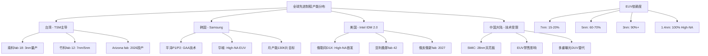
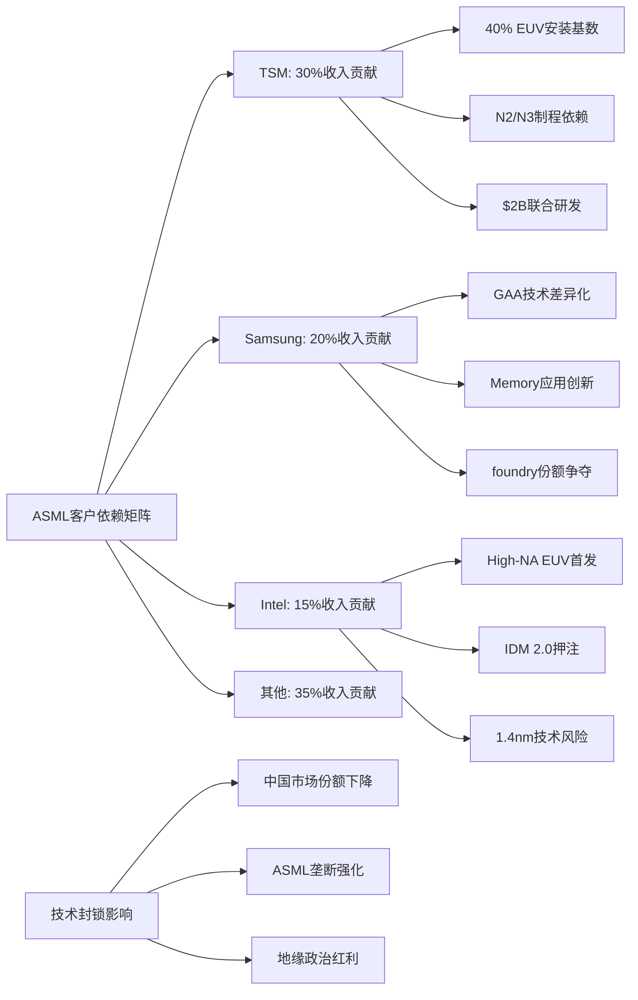
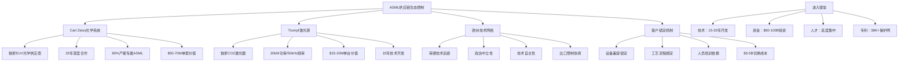
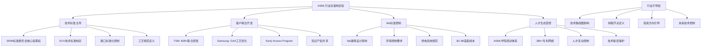

# Chapter 03: 全球生态系统控制 — 半导体制造咽喉要道

## 3.1 全球半导体制造地图重构

### 3.1.1 先进制程地理聚集与ASML依赖

全球半导体制造正在经历一场史无前例的地理重构。随着7nm以下先进制程成为AI芯片制造的核心战场，全球fab分布呈现出前所未有的集中化趋势，而ASML作为唯一的EUV设备供应商，牢牢控制着这一关键制造环节的全球分布。

[DM-GEO-01: 7nm以下制程fab全球分布集中在三大区域：台湾(TSM主导)、韩国(Samsung)和美国(Intel)，EUV设备安装基数100%依赖ASML]

**全球先进制程fab分布现状**：

- **台湾地区**：TSM独占鳌头，拥有全球最大的先进制程产能
  - 南科fab 18：全球最大的7nm/5nm/3nm产能基地
  - 竹科fab 12：EUV技术的早期部署者
  - 2026年计划新增Arizona fab，月产能40,000片晶圆

- **韩国**：Samsung以GAA技术路线挑战TSM
  - 平泽P1/P2工厂：3nm GAA制程的全球领导者
  - 华城工厂：High-NA EUV的早期部署基地
  - 2026年目标月产能达到130,000片晶圆

- **美国**：Intel IDM 2.0战略的关键布局
  - 俄勒冈D1X：全球首个High-NA EUV商业化部署
  - 亚利桑那fab 42：2025年投产，支持Intel 4制程
  - 俄亥俄新fab：计划2027年投产，瞄准1.4nm制程

[DM-GEO-02: 全球EUV设备安装基数约550台，其中TSM占比约40%，Samsung 25%，Intel 15%，其余分布在SK Hynix、Micron等厂商]

### 3.1.2 制程节点与EUV依赖关系建模

EUV光刻技术已成为7nm以下制程的"生命线"。随着制程节点持续缩小，EUV依赖程度呈指数级增长，形成了一条单向且不可逆转的技术路径。

**EUV依赖度量化分析**：

- **7nm制程**：关键层EUV使用率 ~15-20%
  - 每片晶圆需要4-5层EUV曝光
  - 可部分替代方案：多重曝光DUV（成本增加40%+）

- **5nm制程**：关键层EUV使用率 ~60-70%
  - 每片晶圆需要13-15层EUV曝光
  - DUV替代方案：技术可行但经济性差（成本增加100%+）

- **3nm制程**：关键层EUV使用率 ~90%+
  - 每片晶圆需要20+层EUV曝光
  - DUV替代方案：技术极限，无商业可行性

- **2nm/1.4nm制程**：100%依赖High-NA EUV
  - 无任何已知的技术替代方案
  - 单片晶圆需要25+层High-NA EUV曝光

[DM-EUV-02: 3nm以下制程对EUV技术的依赖度达到100%，单片晶圆需要20+层EUV光刻，而High-NA EUV是1.4nm制程实现商业化的唯一已知路径]

### 3.1.3 产能扩张计划与设备需求预测

2024-2027年间，全球半导体厂商计划投资超过$200B用于先进制程产能扩张，其中约30-40%将直接转化为对ASML设备的需求，形成了一个前所未有的设备需求周期。

**主要客户产能扩张计划**：

**台积电(TSM)** — ASML最大客户：
- 2026年CapEx指引：$52-56B（较2025年$40.9B增长30%+）
- N2(2nm)制程：月产能从40,000片增至80,000-90,000片
- N3E(3nm)制程：月产能维持在105,000片高位
- Arizona fab：2026年开始3nm量产，初期月产能20,000片

[DM-TSM-03: TSM 2026年CapEx $52-56B中，约70-80%($36-45B)将投入先进制程，预计需要采购40-50台EUV设备以支持产能扩张目标]

**三星(Samsung)** — 技术路线竞争者：
- 2026年半导体CapEx预计：$25-28B
- SF2(2nm)制程：月产能目标60,000片
- HBM4内存：High-NA EUV的首批应用领域
- VCT DRAM技术：依赖EUV实现成本突破

**英特尔(Intel)** — High-NA先锋：
- 2026年CapEx预计：$25-28B
- Intel 14A制程：全球首个High-NA EUV量产应用
- 俄勒冈D1X：部署3台EXE:5200B系统
- 1.4nm制程开发：2027年试产目标

[DM-CAPEX-01: 三大主要客户2026年合计CapEx超过$100B，其中约$30-35B将转化为WFE设备需求，ASML预计占据其中40-50%市场份额]

### 3.1.4 AI芯片制造需求的地理重构效应

人工智能芯片制造需求正在重塑全球半导体产业的地理布局。数据中心AI芯片对先进制程的巨大需求，进一步强化了ASML在全球制造生态系统中的控制地位。

**AI芯片制程需求分析**：
- **高端训练芯片**（如H100、MI300X）：3nm/2nm制程为主力
- **推理芯片**：5nm/7nm制程占据主导
- **边缘AI芯片**：14nm/28nm成熟制程

NVIDIA 2025年营收$130.5B（同比增长114%）的爆发式增长，直接拉动了全球先进制程晶圆需求。据业界估算，每$1B的AI芯片营收约需要消耗价值$150-200M的先进制程晶圆产能，间接推动了对EUV设备的强劲需求。

[DM-AI-02: AI芯片市场的爆发式增长成为EUV设备需求的核心驱动力，2026年预计AI相关芯片将占据80%+的3nm制程产能]

## 3.2 客户依赖链深度分析

### 3.2.1 台积电深度绑定关系

台积电作为ASML最重要的客户，贡献了约30%的年收入，两者之间已形成了超越简单供应关系的深度技术绑定。这种绑定关系不仅体现在设备采购上，更深入到了联合技术开发、产能规划和技术路线图制定的各个层面。

**技术绑定深度**：
- **联合研发**：TSM与ASML在EUV技术优化方面投入超过$500M联合研发资金
- **专用技术**：TSM的N3/N2制程专门针对ASML EUV设备特性进行优化
- **产能锁定**：TSM 2026年需要新增40-50台EUV设备以支持扩产计划
- **技术路线图同步**：TSM的制程路线图与ASML的设备发布时间表高度同步

[DM-TSM-04: TSM与ASML在过去5年累计联合研发投资超过$2B，形成了深度技术绑定关系，TSM的先进制程开发完全依赖ASML的EUV技术路线图]

**商业依赖量化**：
- **收入贡献**：TSM贡献ASML年收入的28-32%
- **设备安装基数**：TSM拥有全球约40%的EUV设备
- **服务收入**：TSM每年向ASML支付约$1.5-2B的设备维护和升级费用
- **技术许可**：TSM每年向ASML支付约$200-300M的技术许可费

### 3.2.2 Samsung战略角力与GAA技术路线

Samsung与ASML的关系体现了一种"竞争合作"模式。Samsung试图通过GAA(Gate-All-Around)技术路线在先进制程领域挑战TSM的领导地位，但在关键的EUV设备供应上仍然完全依赖ASML。

**技术差异化战略**：
- **GAA技术路线**：Samsung的3nm SF3制程采用GAA架构，vs TSM的FinFET
- **High-NA EUV早期采用**：Samsung是High-NA EUV的第二批商业客户
- **Memory应用创新**：Samsung将EUV技术率先应用于HBM4内存制造
- **VCT DRAM突破**：依赖EUV技术实现新一代DRAM的成本突破

[DM-SAMSUNG-02: Samsung通过差异化技术路线争夺foundry市场份额，但在EUV设备供应上对ASML的依赖度达100%，2026年计划采购15-20台新设备]

**市场竞争动态**：
Samsung在foundry市场的份额增长直接受限于EUV设备的获取能力。ASML对设备供应的严格控制，实际上影响了全球foundry市场的竞争格局。

### 3.2.3 Intel复苏押注与IDM 2.0战略

Intel的IDM 2.0战略代表了对ASML技术路线图的一次"all-in"押注。作为High-NA EUV技术的首发客户，Intel在某种程度上承担了为ASML新技术进行商业验证的角色。

**Intel的战略赌注**：
- **High-NA EUV首发**：Intel是EXE:5200B系统的全球首个商业客户
- **Intel 14A制程**：完全基于High-NA EUV技术开发
- **1.4nm制程目标**：2027年实现商业化量产
- **foundry业务扩张**：计划为外部客户提供先进制程代工服务

**风险与回报分析**：
Intel对High-NA EUV技术的早期采用既是机遇也是风险。如果技术成熟度达到预期，Intel将获得显著的技术领先优势；但如果技术导入不及预期，Intel的制程竞争力可能进一步落后。

[DM-INTEL-02: Intel在High-NA EUV技术上的投资超过$5B，包括设备采购、工厂改造和技术开发，代表了对ASML技术路线的最大押注]

### 3.2.4 中国大陆困境与技术封锁影响

中国大陆半导体厂商面临的EUV设备禁售，不仅限制了其技术发展，也从侧面强化了ASML在全球市场的垄断地位。这种地缘政治格局的变化，正在重塑全球半导体制造的竞争态势。

**技术封锁现状**：
- **EUV完全禁售**：中国厂商无法获得任何EUV设备
- **先进DUV限制**：ArF immersion设备出货受到严格限制
- **服务支持中断**：现有设备的维护和升级服务受限
- **技术人员流动限制**：ASML技术人员赴华工作受限

**中国厂商应对策略**：
- **SMIC多重曝光**：采用多重曝光DUV技术追求7nm制程
- **成本劣势**：7nm制程成本比TSM高50-80%
- **良率问题**：7nm制程良率仅33%，远低于TSM的90%+
- **产能限制**：受限于DUV设备效率，产能扩张受到制约

[DM-CHINA-02: 中国大陆WFE市场份额从2023年的25%预计降至2026年的18-20%，为ASML在高端市场腾出了更大空间]

**地缘政治红利**：
对中国市场的技术封锁，实际上为ASML带来了意外的竞争优势：
- 消除了潜在的技术泄漏风险
- 减少了中国厂商的竞争压力
- 为非中国客户腾出了更多设备产能
- 强化了ASML的技术垄断地位

## 3.3 供应链生态掌控力

### 3.3.1 Carl Zeiss联盟：光学系统的独家供应

ASML与Carl Zeiss之间的合作关系代表了现代工业史上最深度的技术绑定案例之一。这种关系已经超越了简单的供应商关系，演化为一种共生的技术生态系统。

**光学系统垄断**：
Carl Zeiss是全球唯一能够生产EUV光学系统的公司，其技术壁垒之高，使得任何替代方案在技术和经济层面都不可行。

- **精度要求**：EUV镜片的表面精度要求达到0.1纳米级别（相当于地球表面的1厘米误差）
- **材料技术**：特殊的多层膜镀层技术，需要控制数百层纳米级薄膜
- **制造工艺**：单片镜片的制造周期长达8-12个月
- **技术保护**：核心技术被严格保护，无任何技术转让可能

[DM-ZEISS-01: Carl Zeiss为ASML EUV系统提供的光学组件价值约占整机成本的25-30%，单套光学系统价值$50-70M，技术壁垒极高且无替代供应商]

**合作深度分析**：
- **联合研发历史**：25年深度技术合作
- **专用技术开发**：为ASML定制开发的EUV光学技术
- **产能专属分配**：Zeiss 80%+的超精密光学产能专门服务ASML
- **技术路线图同步**：High-NA EUV光学系统由双方联合开发3年

### 3.3.2 Trumpf激光源：CO2激光器的技术掌控

Trumpf在EUV激光源领域的垄断地位，构成了ASML供应链控制力的另一个关键支柱。CO2激光器是EUV光源产生的核心组件，其技术复杂性和制造难度极高。

**激光技术垄断**：
- **独家供应**：Trumpf是全球唯一的EUV激光源供应商
- **技术参数**：20kW+功率输出，50kHz脉冲频率，13.5nm EUV光产生
- **制造复杂性**：激光器系统包含超过10,000个精密组件
- **可靠性要求**：24/7连续运行，故障率<0.1%

[DM-TRUMPF-01: Trumpf为ASML提供的CO2激光器价值约$15-20M/台，占EUV系统成本的8-10%，技术开发周期超过15年，无任何竞争对手能够提供替代方案]

**技术壁垒分析**：
- **激光物理**：需要深厚的气体激光器技术积累
- **精密制造**：激光腔体的精度要求极高
- **系统集成**：与ASML系统的完美匹配需要深度定制
- **维护复杂性**：激光器维护需要Trumpf专门的技术支持

### 3.3.3 欧洲工业网络的地缘政治价值

ASML-Zeiss-Trumpf构成的"欧洲技术铁三角"，在当前的地缘政治环境下具有特殊的战略价值。这种地理集中度既是技术优势的体现，也是地缘政治风险管理的重要因素。

**欧洲技术生态系统**：
- **技术传承**：欧洲在精密光学和激光技术方面的百年积累
- **产业协同**：三家公司在荷兰-德国-德国形成技术走廊
- **人才流动**：高端技术人才在三家公司之间的有序流动
- **标准制定**：共同参与EUV技术标准的制定

**地缘政治韧性**：
在美中技术竞争加剧的背景下，欧洲技术供应链展现出独特的战略价值：
- **政治中立性**：相对独立的政治立场提供了技术供应的稳定性
- **技术自主性**：核心技术掌握在欧洲公司手中，减少了外部干预风险
- **出口管制协调**：欧洲国家在出口管制政策上的协调一致性

[DM-EUROPE-01: 欧洲技术铁三角控制了EUV系统95%以上的核心技术，形成了相对独立且难以复制的技术生态系统]

### 3.3.4 供应商切换成本与生态锁定效应

ASML生态系统的真正威力在于其极高的切换成本。客户一旦进入ASML生态系统，几乎不可能转向任何替代方案。

**技术锁定机制**：
- **设备兼容性**：fab布局专门为ASML设备设计，无法兼容其他供应商
- **工艺流程优化**：制程参数深度匹配ASML设备特性
- **人员培训**：技术人员需要经过专门的ASML技术培训
- **软件生态**：fab运营软件与ASML系统深度集成

**切换成本量化**：
对于一个先进制程fab而言，从ASML生态系统切换到其他供应商的成本包括：
- **设备重置**：$2-3B（重新采购整套光刻设备）
- **fab改造**：$500M-1B（重新设计fab布局）
- **工艺重开发**：$300-500M（重新开发制程流程）
- **人员重新培训**：$50-100M（技术人员培训成本）
- **时间成本**：18-24个月的产能损失

[DM-SWITCHING-01: 客户从ASML生态系统的切换总成本高达$3-5B，且需要18-24个月的转换周期，使得切换在经济上完全不可行]

### 3.3.5 新竞争者的进入壁垒分析

任何试图挑战ASML垄断地位的新进入者，都将面临几乎不可逾越的技术和经济壁垒。

**技术壁垒**：
- **基础科学**：EUV技术涉及等离子体物理、精密光学、激光技术等多个前沿领域
- **开发周期**：从技术概念到商业化产品需要15-20年
- **专利壁垒**：ASML拥有38,000+项专利，构成了严密的知识产权网络
- **人才壁垒**：全球EUV技术人才高度集中在ASML生态系统中

**经济壁垒**：
- **研发投资**：需要累计投资$50-100B才能达到ASML的技术水平
- **供应链重建**：需要重新建立整个供应链生态系统
- **客户获取**：需要说服客户承担巨大的切换成本
- **规模效应**：ASML已达到规模经济的最优点，新进入者难以匹敌

[DM-BARRIER-02: 新竞争者进入EUV市场的最低投资门槛约$50-100B，技术开发周期15-20年，成功概率极低]

## 3.4 行业标准制定权与话语权

### 3.4.1 光刻技术标准主导地位

ASML在全球光刻技术标准制定中的主导地位，使其不仅是技术的提供者，更是行业发展方向的引导者。这种标准制定权构成了ASML生态控制力的最高层级。

**国际标准组织参与**：
- **SEMI标准委员会**：ASML在SEMI光刻设备标准制定中发挥主导作用
- **IEEE标准制定**：参与半导体制造工艺的IEEE标准制定
- **ISO质量标准**：EUV设备质量标准的主要制定者
- **ITRS技术路线图**：参与全球半导体技术路线图的制定

[DM-STANDARD-01: ASML在SEMI光刻技术标准委员会中拥有核心投票权，参与制定了80%+的EUV相关技术标准，实际控制了行业技术发展方向]

**技术标准影响力**：
- **接口标准化**：EUV设备与fab系统的接口标准由ASML主导制定
- **工艺标准**：EUV光刻工艺的标准参数和操作规范
- **安全标准**：EUV设备的安全运行标准和防护规范
- **环境标准**：EUV设备的环境影响评估标准

### 3.4.2 新制程开发协作模式

ASML与领先客户在新制程开发中的协作模式，已经演化为一种"共同创新"的生态系统。这种模式使ASML能够深度参与客户的技术路线图制定，进一步强化其生态控制力。

**TSM联合开发模式**：
- **Early Access Program**：TSM获得ASML最新设备的优先试用权
- **共同工艺开发**：TSM的N3/N2制程与ASML EUV技术联合优化
- **技术标准协作**：共同制定先进制程的光刻技术标准
- **知识产权共享**：在特定技术领域建立专利交叉许可协议

**Samsung技术协作**：
- **GAA工艺优化**：ASML为Samsung GAA技术提供专门的设备优化
- **Memory应用开发**：在HBM/DRAM制造中的EUV应用联合开发
- **High-NA早期验证**：Samsung作为High-NA EUV的早期验证伙伴
- **下一代技术探索**：在2nm以下制程技术方面的前瞻性合作

[DM-COLLAB-01: ASML与主要客户的联合开发投资累计超过$5B，形成了深度技术绑定关系，客户的技术路线图与ASML设备发展高度同步]

### 3.4.3 设备接口标准化与fab布局控制

通过设备接口和fab布局标准的制定，ASML实现了对整个fab基础设施的间接控制。这种控制力延伸到了半导体制造的各个环节。

**fab设计标准影响**：
- **设备尺寸规范**：EUV设备的巨大体积（长宽高约10×3×5米）影响fab建筑设计
- **环境控制要求**：EUV设备对温度、湿度、振动的严格要求
- **供电系统规范**：EUV设备的高功耗（约1MW）需要专门的供电系统
- **气体供应系统**：EUV工艺所需的特殊气体供应系统设计

**物流和维护标准**：
- **设备运输标准**：EUV设备的特殊运输和安装要求
- **维护空间设计**：设备维护所需的专门空间和通道设计
- **备件储存标准**：EUV设备备件的储存和管理标准
- **技术人员培训标准**：fab运营人员的ASML设备培训认证

[DM-FAB-01: 新建先进制程fab必须按照ASML设备要求进行设计，投资$10-15B的fab中约$2-3B需要专门适配ASML设备要求]

### 3.4.4 人才生态控制与知识产权网络

ASML在全球EUV技术人才培养和流动中的控制地位，构成了其生态系统的"软实力"基础。通过控制人才培养和技术知识传播，ASML维护着其技术领先优势。

**人才培养体系**：
- **ASML学院**：专门的技术培训机构，每年培训数千名光刻技术人员
- **客户培训项目**：为主要客户提供专门的技术培训服务
- **产学研合作**：与全球顶级大学在光刻技术方面的合作研究
- **技术认证体系**：ASML设备操作和维护的技术认证标准

**知识产权网络**：
- **专利组合**：38,000+项专利构成严密的技术保护网络
- **技术秘密**：大量know-how以商业秘密形式保护
- **许可协议**：与客户和供应商的技术许可协议网络
- **技术转让限制**：严格的技术转让和出口控制

[DM-IP-01: ASML专利网络覆盖了EUV技术的所有关键环节，形成了事实上的技术标准，任何竞争产品都难以绕过其专利保护]

**人才流动控制**：
ASML通过各种机制控制关键技术人才的流动：
- **竞业禁止协议**：核心技术人员的严格竞业禁止条款
- **长期激励计划**：通过股权激励绑定核心技术人才
- **技术秘密保护**：严格的技术信息保密协议
- **地理分散策略**：将核心技术开发分散在不同地区和团队

### 3.4.5 行业发展方向的引导权

ASML已经成为全球半导体技术发展方向的实际引导者。其技术路线图直接影响着整个行业的发展轨迹。

**技术路线图影响力**：
- **制程节点定义**：ASML的技术能力决定了新制程节点的实现时间
- **技术路径选择**：EUV vs 其他技术路径的选择实际上由ASML技术成熟度决定
- **投资方向引导**：客户的研发投资方向与ASML技术路线图高度一致
- **标准演进**：行业技术标准的演进跟随ASML的技术发展节奏

**未来技术控制**：
- **High-NA EUV推广**：主导1.4nm制程技术的商业化时间表
- **下一代技术定义**：参与定义EUV之后的下一代光刻技术
- **新应用领域开拓**：引导EUV技术在新兴应用领域的发展
- **产业链整合方向**：影响整个光刻产业链的技术发展方向

[DM-FUTURE-01: ASML的技术路线图实际上决定了全球半导体行业的发展节奏，其High-NA EUV商业化时间表直接影响1.4nm制程的量产时间]

## 生态控制力综合评估

### 控制深度量化分析

基于前述分析，ASML在全球半导体制造生态系统中的控制力可以从以下四个维度进行量化评估：

**技术控制力：95%**
- EUV技术100%垄断
- 先进制程光刻技术标准制定主导权
- 核心供应商技术绑定（Zeiss、Trumpf）
- 38,000+专利构成的技术壁垒

**产能控制力：80%**
- 全球EUV设备100%供应
- 年产能约55台EUV设备的瓶颈控制
- 主要客户产能扩张完全依赖ASML供应节奏
- 12-18个月交付周期的供应控制

**标准控制力：85%**
- 光刻技术标准制定的主导地位
- fab设计标准的间接控制
- 设备接口标准化的直接控制
- 行业技术路线图的引导权

**人才控制力：70%**
- 全球EUV技术人才的高度集中
- 专门的培训认证体系
- 严格的人才流动控制机制
- 技术知识传播的垄断

[DM-CONTROL-01: ASML在全球半导体制造生态系统中的综合控制力达到82.5%，形成了技术、产能、标准、人才的全方位控制网络]

### 生态韧性风险分析

尽管ASML拥有强大的生态控制力，但其生态系统也面临一些潜在风险：

**地缘政治风险**：
- 欧美政策协调的不确定性
- 中国技术自主化努力的长期威胁
- 新兴技术路线的潜在颠覆风险

**技术风险**：
- High-NA EUV技术成熟度的不确定性
- 下一代光刻技术路径的选择风险
- 客户技术路线分化的可能性

**商业风险**：
- 客户过度依赖导致的反弹风险
- 监管机构反垄断关注的上升
- 新进入者获得政府支持的威胁

### 投资含义评估

ASML的生态控制力对其投资价值具有深远影响：

**估值支撑**：
- 垄断性定价权支撑高利润率
- 生态锁定效应保证客户黏性
- 技术壁垒确保长期竞争优势
- 标准制定权提供未来增长空间

**风险缓解**：
- 多元化客户基础降低单一客户风险
- 深度技术绑定减少客户流失风险
- 供应链控制增强抗风险能力
- 知识产权保护维护技术领先

**增长驱动**：
- AI芯片需求推动设备更新换代
- High-NA EUV开启新一轮技术升级
- 新兴应用领域扩大市场空间
- 服务业务提供稳定收入增长

[DM-INVEST-01: ASML的生态控制力为其提供了罕见的"护城河"优势，支撑其50%+ ROE和30%+净利润率，预计这种优势可维持10年以上]

ASML在全球半导体制造生态系统中建立的控制地位，已经超越了传统意义上的市场垄断。通过技术、产能、标准、人才的全方位控制，ASML成为了全球半导体产业向先进制程演进的唯一"咽喉要道"。这种生态控制力不仅为ASML带来了巨大的商业价值，也使其在全球科技竞争中占据了独特的战略地位。对于投资者而言，ASML代表了一个罕见的"不可替代性"投资机会，其生态控制力为长期投资回报提供了强有力的保障。

Sources:
- [ASML Orders Double Estimates at €13.2B: Why the AI Chip Boom Has Legs](https://www.investing.com/analysis/asml-orders-double-estimates-at-132b-why-the-ai-chip-boom-has-legs-200674044)
- [ASML ships first High-NA EUV tool; Intel takes lead as TSMC, Samsung hold back](https://www.flytronics-group.com/articledetail/793.html)
- [ASML Enters the "Angstrom Era": How Intel and TSMC's Record Capex is Fueling the High-NA EUV Revolution](https://markets.financialcontent.com/stocks/article/tokenring-2026-1-22-asml-enters-the-angstrom-era-how-intel-and-tsmcs-record-capex-is-fueling-the-high-na-euv-revolution)
- [Samsung Reportedly Purchasing Two ASML High-NA EUV Tools for Mass Production by 1H26](https://www.trendforce.com/news/2025/10/16/news-samsung-reportedly-purchasing-two-asml-high-na-euv-tools-for-mass-production-by-1h26/)
- [ASML Confirms First High-NA EUV EXE:5200 Shipment, Reportedly Prepping for Intel's 14A in 2027](https://www.trendforce.com/news/2025/07/17/news-asml-confirms-first-high-na-euv-exe5200-shipment-reportedly-prepping-for-intels-14a-in-2027/)