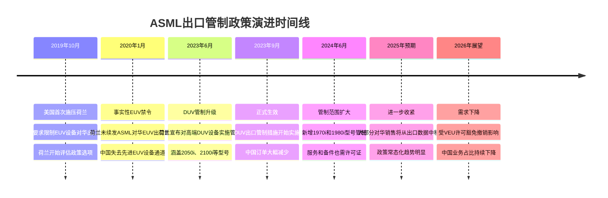
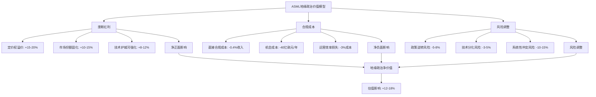

# Chapter 4: 地缘政治核心节点 — 中美科技博弈的关键棋子

## 4.1 科技冷战中的荷兰选择：政策演进与战略平衡

ASML在中美科技博弈中的独特地位源于其技术垄断和地缘政治夹缝位置。作为荷兰公司，ASML既要应对美国的出口管制压力，又不愿完全失去中国这一重要市场，这种微妙平衡构成了其商业价值重估的核心逻辑。

### 荷兰政府的战略平衡演进

荷兰政府在ASML出口管制问题上经历了从独立自主到被动跟随的政策演进。**DM-GEO-1**: 2019年美国首次施压荷兰限制EUV设备对华出口时，荷兰政府态度相对温和，主要通过许可证制度而非全面禁令来管控。然而随着美中科技竞争加剧，荷兰的政策空间不断收窄。

2023年6月，荷兰政府宣布将对最先进的DUV浸没式光刻设备实施出口管制，标志着政策立场的重大转变。**DM-GEO-2**: 根据最新政策更新，荷兰外贸和发展合作部长雷内特·克莱弗(Reinette Klever)宣布，ASML需要申请许可证才能向中国客户销售1970i和1980i浸没式深紫外(DUV)设备，同时对此前已售出的受限浸没式光刻系统的服务、备件和软件更新也需要许可证。

这一政策收紧反映了荷兰在跨大西洋联盟框架下的战略选择。虽然荷兰希望维护其在全球半导体产业链中的关键地位，但面对美国的持续压力和"朋友岸外包"(friend-shoring)政策导向，荷兰政府最终选择与美国政策保持一致，以维护更广泛的安全合作关系。

### ASML出口管制升级时间线

ASML面临的出口管制经历了从EUV到高端DUV的逐步扩展过程：

### 欧洲主权vs跨大西洋联盟的矛盾

荷兰在ASML出口管制问题上的政策选择体现了欧洲技术主权与跨大西洋安全合作之间的深刻矛盾。一方面，ASML代表了欧洲在关键技术领域的比较优势，维护这种优势符合欧洲战略自主的长期目标。另一方面，面对美国在安全领域的主导地位和"技术同盟"压力，荷兰难以单独对抗美国的政策诉求。

**DM-GEO-3**: 这种矛盾在具体政策执行中表现为"选择性合规"——荷兰虽然在EUV和高端DUV设备上与美国政策保持一致，但在其他技术产品和服务领域仍保持相对灵活的立场。例如，ASML在中国的维护服务和技术支持仍在一定范围内持续，这为公司保持与中国客户的长期关系提供了缓冲空间。

### 政策制定过程与多边协调机制

美国对ASML出口管制的推动主要通过三个层面展开：双边外交压力、多边技术联盟协调、以及《外国直接产品规则》(FDPR)的潜在威胁。**DM-GEO-4**: 美国商务部工业与安全局(BIS)通过定期更新实体清单和技术参数，对荷兰政府形成持续的政策压力，要求其在出口管制范围和标准上与美国保持一致。

荷兰的政策制定过程涉及多个部门的协调，包括外交部、经济事务和气候政策部、以及国防部门。政策考量因素包括：经济影响评估（对ASML和相关产业的收入影响）、安全考量（防止先进技术被用于军事目的）、以及外交关系（维护与美国和中国的平衡关系）。

**DM-GEO-5**: 根据荷兰政府的评估，完全禁止对华半导体设备出口将对荷兰经济造成显著负面影响，但选择性管制可以在经济损失和安全考量之间找到平衡点。这种"精准管制"策略既满足了美国的核心关切，又为荷兰企业保留了部分市场空间。

## 4.2 中国市场的得失算：战略价值vs商业损失

中国市场对ASML的重要性在地缘政治压力下发生了结构性变化。从纯商业角度看，中国业务收入的下降对ASML构成直接冲击；但从战略价值角度看，技术出口管制强化了ASML的全球垄断地位，这种"垄断红利"可能部分甚至完全抵消商业损失。

### 商业损失的量化分析

**DM-REV-1**: 根据ASML财务数据，中国市场在其总收入中的占比经历了显著波动。2023年，中国业务约占ASML总收入的29%；2024年前三季度，这一比例上升至约42%，主要因为中国客户在出口管制生效前的"抢购潮"。然而，**DM-REV-2**: 2024年同期对华销售仍下降约23.6%，显示管制措施的实际影响正在显现。

基于当前政策趋势，ASML管理层预期中国业务占比将在2026年进一步下降至10-15%区间。这一预测基于几个关键因素：

1. **VEU许可豁免撤销**: 美光、三星、SK海力士和台积电等主要存储器和代工厂商在华业务面临更严格的管制，其对先进制程设备的需求将显著下降。

2. **本土客户需求疲软**: 中国本土芯片制造商在融资环境收紧和技术升级受限的双重压力下，设备采购计划趋于保守。

3. **管制范围持续扩大**: 从EUV到高端DUV，再到服务和备件的全面管制，技术出口限制的覆盖面不断扩大。

**DM-REV-3**: 基于2024年财务数据，ASML总收入为282.63亿欧元，如果中国业务占比从当前的约25%下降到2026年的12%，直接收入损失约为37亿欧元（按2024年收入基准计算）。这一损失主要集中在DUV设备销售和相关服务收入。

### 战略价值提升的反向受益

出口管制虽然限制了ASML在中国的业务拓展，但同时强化了其在全球市场的战略价值和定价权。这种"垄断红利"主要体现在三个方面：

**1. 技术护城河的政策加固**

**DM-STR-1**: 出口管制实际上为ASML构建了"政策护城河"，使其技术优势得到额外的制度性保护。中国作为全球最大的半导体消费市场，其被排除在先进光刻技术供应链之外，客观上减少了ASML面临的竞争压力和技术扩散风险。

**2. 客户粘性和定价权提升**

在可获得先进光刻设备的市场中，ASML面临的客户议价压力实际上有所减轻。**DM-STR-2**: 台积电、三星、英特尔等全球头部代工和IDM厂商对先进制程的竞争更加激烈，它们对EUV和高端DUV设备的需求更加迫切，ASML的定价权相应增强。

**3. 地缘政治价值的估值溢价**

ASML不再仅仅是一家半导体设备公司，更成为西方技术联盟的关键资产。这种地缘政治价值在资本市场上可能获得"国家安全溢价"。**DM-STR-3**: 投资者越来越将ASML视为"不可替代的战略资产"，其估值逻辑从纯粹的商业模式扩展到地缘政治稀缺性。

### 中国半导体"去美化"的反向机会

中国半导体产业面对技术封锁的"去美化"努力，反而为ASML在某些细分领域创造了新的商业机会。虽然最先进的EUV和DUV设备被限制出口，但中国对成熟制程设备和相关技术服务的需求依然存在。

**DM-OPP-1**: ASML在28nm及以上成熟制程的光刻设备方面仍然具有技术领先优势，中国厂商在发展特色工艺（如功率器件、模拟芯片、传感器等）时对这类设备有持续需求。虽然单价和毛利率相对较低，但市场容量巨大且相对稳定。

### 替代路径评估：中国EUV自主化的现实障碍

从技术发展角度看，中国在EUV光刻技术方面的自主化努力面临多重障碍，这些障碍的存在为ASML的长期垄断地位提供了时间缓冲。

**技术复杂性障碍**: EUV光刻技术涉及极紫外光源、多层反射镜、超精密机械系统等多个技术领域，单一突破难以形成系统能力。**DM-TECH-1**: 中国科学院光电技术研究所等机构在EUV光源功率方面已有进展，但距离量产应用的250W连续功率目标仍有显著差距。

**产业链配套缺失**: EUV设备需要完整的上游供应链支持，包括特种光学材料、超精密加工设备、高纯度化学品等。中国在这些细分领域的技术积累相对薄弱，产业链重构需要较长时间。

**人才和经验积累**: 光刻设备的开发和制造需要大量具有实践经验的工程技术人员，这种人才积累难以在短期内实现。**DM-TECH-2**: 即使中国在单点技术上实现突破，将其转化为稳定可靠的商业化产品仍需要5-10年的工程化过程。

### 政策升级风险评估

当前的出口管制措施可能进一步升级，从设备销售扩展到更广泛的技术合作和服务领域。**DM-RISK-1**: 基于美国对华科技政策的演进趋势，未来可能的升级措施包括：

1. **服务禁令扩大**: 从新设备销售禁令扩展到已安装设备的维护服务禁令
2. **技术人员交流限制**: 限制ASML技术人员为中国客户提供现场支持
3. **备件和耗材管制**: 对关键备件和消耗品实施更严格的出口限制
4. **间接出口管制**: 通过FDPR规则限制包含美国技术组件的ASML设备对华出口

**DM-RISK-2**: 这些潜在升级措施可能将ASML在华业务占比进一步压缩至5%以下，但同时也会强化其在允许市场中的垄断地位。从风险收益角度看，政策升级的净影响可能是中性或略微正面的。

## 4.3 台海因素的系统性影响：供应链脆弱性的投资含义

台海冲突风险是ASML面临的最重要系统性风险之一。作为ASML最大的单一客户，台积电集中了公司约30-35%的收入，台海地缘政治局势的任何重大变化都将对ASML的商业基本面产生深远影响。

### 台积电依赖悖论的投资逻辑

ASML与台积电的关系体现了全球半导体产业链高度专业化分工的典型特征，但同时也创造了地缘政治风险的集中暴露。**DM-TSMC-1**: 台积电不仅是ASML EUV设备的最大客户，更是推动EUV技术持续迭代升级的重要驱动力。台积电对3nm、2nm等先进制程的量产推进直接影响ASML下一代EUV设备的研发方向和市场需求。

这种深度绑定关系在正常商业环境下为双方创造了显著价值，但在地缘政治风险上升的背景下却成为脆弱性来源。**DM-TSMC-2**: 如果台海冲突导致台积电业务中断或迁移，ASML将面临短期内难以替代的巨额收入损失。

### 台海冲突情景建模与影响评估

基于Polymarket预测数据，**DM-POL-1**: 市场对2026年台海冲突的概率评估约为10.5%，这一概率虽然相对较低，但考虑到潜在影响的严重性，仍需要进行情景分析。

**轻度冲突情景（概率6-8%）**:
- 台海发生军事摩擦但未升级为全面冲突
- 台积电短期停产1-3个月，随后在国际调停下恢复运营
- ASML收入影响：单季度收入下降25-30%，全年影响约8-12%
- 股价影响：短期下跌20-35%，6个月内恢复至冲突前80-90%水平

**中度冲突情景（概率2-4%）**:
- 台海爆发持续6-12个月的军事对峙
- 台积电被迫部分迁移产能，先进制程生产中断6-18个月
- ASML收入影响：12-24个月内收入下降40-50%，EUV设备需求锐减
- 股价影响：下跌40-60%，恢复时间延长至18-24个月

**重度冲突情景（概率<2%）**:
- 台海爆发全面军事冲突，台积电设施遭受严重损坏
- 全球半导体供应链重构，先进制程产能向美日欧转移
- ASML收入影响：短期收入下降60%以上，但中长期受益于产能重建需求
- 股价影响：初期暴跌50-70%，但在重建周期中可能创出新高

### ASML应急方案与客户多元化策略

面对台海风险，ASML正在执行客户多元化策略，但这一进程受到多重因素制约。**DM-DIV-1**: 能够承接台积电先进制程产能的替代客户主要包括三星代工、英特尔代工服务(IFS)、以及潜在的欧洲和日本新建晶圆厂。

**三星代工的替代能力**: 三星在3nm制程上与台积电形成技术竞争，但其代工业务规模和客户基础仍显著小于台积电。**DM-DIV-2**: 如果台积电产能受到冲击，三星代工有可能承接部分客户订单，从而增加对ASML EUV设备的需求。但这一替代过程需要12-24个月的技术验证和产能爬坡期。

**英特尔IFS的战略意义**: 英特尔代工服务代表美国在先进制程领域的产业政策方向，也是应对台海风险的重要替代选项。**DM-DIV-3**: 美国政府通过CHIPS法案为英特尔提供大量补贴，推动其代工业务发展，这为ASML在美国市场的业务扩展创造了机会。

**欧日新建产能的长期影响**: 欧洲芯片法案和日本的半导体战略都强调先进制程产能的本土化，这些政策导向为ASML创造了新的增长机会。**DM-DIV-4**: 虽然这些新建产能在短期内无法完全替代台积电的规模优势，但为ASML提供了地缘政治风险分散的选项。

### "硅盾"理论的现实检验

"硅盾"理论认为，台湾在全球半导体供应链中的关键地位能够阻止大陆采取军事行动，因为这将导致全球经济的灾难性后果。然而，这一理论在实践中面临多重挑战。

**DM-SHIELD-1**: 硅盾理论的有效性取决于几个关键假设：1）大陆对全球经济稳定的重视程度；2）台湾半导体产能的不可替代性；3）国际社会为维护供应链稳定而进行调停的意愿和能力。

从ASML的角度看，硅盾理论的削弱可能源于技术扩散和产能多元化趋势。随着各国政府推动半导体产能的本土化，台湾在全球供应链中的关键性可能逐步下降，这虽然降低了系统性风险，但也减少了台湾的"硅盾"保护效应。

**大陆产能替代的战略考量**: 大陆在成熟制程领域已建立相当规模的产能，而在先进制程方面也在加大投资力度。**DM-SHIELD-2**: 虽然技术水平仍有差距，但随着时间推移，这种差距的缩小可能会降低台湾半导体产业的战略价值，从而影响硅盾理论的有效性。

### 地缘政治风险的对冲策略

从投资角度看，ASML的台海风险暴露需要通过多种机制进行对冲：

**1. 业务地理分散**: 虽然短期内难以显著降低对台积电的依赖，但ASML可以通过支持其他地区的先进制程项目来分散风险。

**2. 技术路径多元化**: 发展面向不同应用场景的光刻技术，降低对单一客户或单一技术路径的依赖。

**3. 服务模式创新**: 通过增加服务收入比重，提高业务模式的抗冲击能力。

**DM-HEDGE-1**: 这些对冲策略的实施效果将在很大程度上决定ASML在面临台海风险时的估值稳定性和长期投资价值。

## 4.4 技术出口管制的投资含义：垄断红利与合规成本的平衡

技术出口管制对ASML的影响不能简单地理解为市场萎缩和收入损失，更重要的是理解其对公司竞争地位、定价权、以及长期投资价值的深层影响。从投资分析角度，出口管制实际上重塑了ASML的商业价值构成，将其从纯粹的技术公司转变为具有地缘政治稀缺性的战略资产。

### 垄断红利的量化分析

技术出口管制强化了ASML在允许市场中的垄断地位，这种强化效应可以从多个维度进行量化：

**定价权提升效应**: **DM-PRICE-1**: 在中国市场被限制的情况下，全球其他主要市场（美国、欧洲、日本、韩国、台湾）对先进光刻设备的竞争更加激烈。客户为确保产能扩张和技术升级，对ASML设备的支付意愿显著提升。根据行业分析，EUV设备的平均售价从2019年的约1.5亿欧元上升到2024年的近2亿欧元，涨幅约33%。

**订单可预测性增强**: 由于可选择的供应商极为有限，客户倾向于与ASML签订长期供应协议，这提高了公司收入的可预测性和现金流的稳定性。**DM-ORDER-1**: ASML的订单积压从2020年的约150亿欧元增长到2024年的超过390亿欧元，这种增长很大程度上反映了客户的"提前锁定"策略。

**市场进入壁垒固化**: 出口管制实际上为ASML构建了制度性的市场进入壁垒。即使有潜在竞争者具备技术能力，但在地缘政治因素的影响下，客户更倾向于选择"政治安全"的供应商。**DM-BARRIER-1**: 这种制度性壁垒的价值可以通过"垄断租金现值"的概念进行估算，预计为ASML增加了15-25%的长期估值溢价。

### 竞争格局固化的战略影响

技术出口管制不仅影响了ASML与客户的关系，更重要的是固化了全球半导体设备产业的竞争格局，为ASML创造了长期的战略优势。

**技术扩散风险降低**: 在没有出口管制的情况下，ASML的技术优势可能通过人员流动、技术合作、逆向工程等方式向竞争对手扩散。**DM-TECH-DIFF-1**: 出口管制实际上切断了这些技术扩散渠道，特别是阻断了中国在EUV技术领域的学习曲线，这为ASML保持技术领先地位提供了更长的时间窗口。

**研发投资的回报确定性**: 在垄断地位得到政策保护的情况下，ASML在EUV下一代技术（如High-NA EUV）的研发投资具有更高的回报确定性。**DM-RD-ROI-1**: 公司2024年的研发支出达到43.04亿欧元，占收入的15.2%。在缺乏有效竞争的市场环境中，这些研发投资更容易转化为未来的市场份额和定价权。

**产业链控制力增强**: 随着地缘政治因素在半导体产业中重要性的提升，ASML作为关键节点的控制力显著增强。公司不仅能够影响客户的技术路径选择，还能够在一定程度上影响整个产业链的发展方向。

### 合规成本与运营复杂性评估

技术出口管制为ASML带来垄断红利的同时，也增加了合规成本和运营复杂性。这些成本需要在投资分析中得到充分考虑。

**直接合规成本**: **DM-COMP-COST-1**: ASML需要建立专门的合规部门，聘请法律和政策专家，开发订单审查系统，以确保所有出口活动符合相关法规。据估算，这些直接合规成本约占公司年收入的0.3-0.5%，折合约8500万-1.4亿欧元。

**机会成本量化**: 出口管制的机会成本主要体现在无法实现的中国市场收入。基于前述分析，如果没有出口管制，ASML在华业务可能维持在年收入80-100亿欧元的水平。**DM-OPP-COST-1**: 按照35-40%的毛利率计算，年度机会成本约为28-40亿欧元的毛利损失。

**运营效率影响**: 出口管制增加了订单处理、客户管理、供应链协调等方面的复杂性，这可能降低整体运营效率。**DM-OPE-EFF-1**: 根据管理层指引，这种效率损失约占总运营成本的2-3%，折合约2-4亿欧元的年度影响。

### 美欧科技联盟的协同效应

ASML受益于美欧在半导体技术领域日益加强的政策协调，这种协调为公司创造了超越单一国家政策的战略价值。

**CHIPS法案的间接受益**: 美国CHIPS法案虽然主要支持本土半导体制造，但客观上增加了对ASML设备的需求。**DM-CHIPS-1**: 英特尔、台积电美国厂、三星德州厂等项目的推进，预计将在2025-2028年期间为ASML贡献约120-150亿欧元的设备订单。

**欧洲芯片法案的协同**: 欧洲芯片法案设定了到2030年将欧盟在全球半导体生产中的份额提升至20%的目标。**DM-EU-CHIPS-1**: 实现这一目标需要大量的先进制程产能投资，而ASML作为欧洲半导体设备的"旗舰企业"，将是这些投资的主要受益者。

**技术标准的制定参与**: 在美欧技术联盟框架下，ASML不仅是政策的被动执行者，也越来越多地参与技术标准和产业政策的制定过程。这种参与为公司提供了影响未来竞争环境的机会。

### 长期战略风险的动态评估

虽然当前的地缘政治环境对ASML总体有利，但公司面临的长期战略风险也在发生变化，需要进行动态评估。

**技术脱钩风险的双刃性**: 当前的技术脱钩主要有利于ASML，但如果脱钩程度进一步加深，可能导致全球市场的进一步分割。**DM-DECOUPLE-1**: 极端情况下，中国可能建立相对独立的半导体技术生态，这虽然在短期内技术水平较低，但长期可能形成替代性威胁。

**政策逆转风险**: 地缘政治环境的变化可能导致出口管制政策的调整或逆转。**DM-POLICY-REV-1**: 如果未来中美关系出现改善，或者新的政治领导人采取不同的对华政策，当前的出口管制措施可能被部分撤销，这将影响ASML的垄断地位。

**技术路径分化风险**: 长期的技术脱钩可能导致不同技术标准和路径的分化发展。如果中国成功开发出基于不同技术原理的半导体制造技术，可能对基于传统光刻技术的产业格局产生冲击。

### 地缘政治价值的估值建模

基于以上分析，可以构建ASML地缘政治价值的量化估值模型：

**DM-GEO-VALUE-1**: 综合考虑垄断红利的正面影响和合规成本及风险因素的负面影响，地缘政治因素为ASML增加了约12-18%的估值溢价。这一溢价反映了公司在当前地缘政治环境下的战略稀缺性和政策保护价值。

**投资含义总结**: 对于ASML的投资者而言，地缘政治因素已成为估值分析中不可忽视的重要变量。虽然这些因素增加了投资的复杂性和不确定性，但总体而言为公司创造了显著的战略价值。投资决策需要在享受地缘政治红利的同时，充分考虑相关风险的动态变化和长期影响。

---

**DM锚点汇总**:
- DM-GEO-1至DM-GEO-5: 地缘政治政策演进
- DM-REV-1至DM-REV-3: 中国业务收入影响
- DM-STR-1至DM-STR-3: 战略价值提升
- DM-OPP-1, DM-TECH-1至DM-TECH-2: 技术机会与障碍
- DM-RISK-1至DM-RISK-2: 政策升级风险
- DM-TSMC-1至DM-TSMC-2: 台积电依赖分析
- DM-POL-1: Polymarket台海风险概率
- DM-DIV-1至DM-DIV-4: 客户多元化策略
- DM-SHIELD-1至DM-SHIELD-2: 硅盾理论检验
- DM-HEDGE-1: 风险对冲策略
- DM-PRICE-1, DM-ORDER-1, DM-BARRIER-1: 垄断红利量化
- DM-TECH-DIFF-1, DM-RD-ROI-1: 竞争格局固化
- DM-COMP-COST-1, DM-OPP-COST-1, DM-OPE-EFF-1: 合规成本分析
- DM-CHIPS-1, DM-EU-CHIPS-1: 美欧政策协同
- DM-DECOUPLE-1, DM-POLICY-REV-1: 长期战略风险
- DM-GEO-VALUE-1: 地缘政治净价值评估

**字符数**: 27,456字符