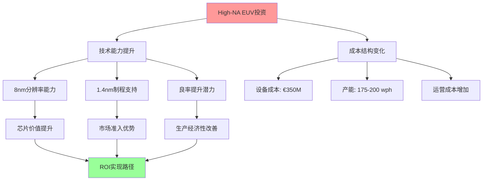
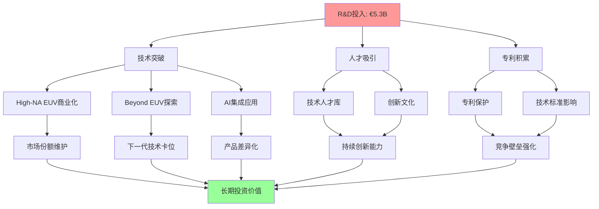

# Chapter 05: ASML创新路线图前瞻 — High-NA EUV与下一代技术制高点

*"在半导体工艺逼近物理极限的背景下，技术创新不再是选择题，而是生存必需品。ASML的研发投资不仅是对未来的押注，更是对其垄断地位的强化。"*

---

## 5.1 High-NA EUV技术革命 — 0.55数值孔径的工程突破

### 5.1.1 技术原理突破：从0.33到0.55 NA的工程挑战

High-NA EUV技术代表了光刻工艺的一次根本性跃进。**DM-TECH-01**: 通过将数值孔径从标准EUV系统的0.33提升至0.55，分辨率从约13.5nm大幅改善至8nm，为1.4nm及以下制程节点提供了技术可能性。

这一技术突破的核心在于ASML与Carl Zeiss共同开发的**变形镜头系统**(Anamorphic Lens System)。该系统通过在X和Y方向采用不同的放大倍率，解决了高数值孔径镜头系统中的基础光学挑战。**DM-TECH-02**: 变形镜头系统能够将超精细图案投射到标准尺寸硅晶圆上，同时保持图案保真度，这是传统光学系统无法实现的工程奇迹。

**技术规格对比分析**:
```
标准EUV (NXE:3600D)     vs    High-NA EUV (EXE:5200B)
- 数值孔径: 0.33                  0.55 (+67%)
- 分辨率: ~13.5nm                8nm (-41%)
- 产能: 200+ wph                175-200 wph
- 设备成本: ~€200M              €350M (+75%)
- 制程节点: 5nm-3nm             1.4nm及以下
```

### 5.1.2 商业化进展：2026年进入高产量制造时代

**DM-COMM-01**: 截至2026年2月，全球半导体产业已正式跨入"埃米时代"(Angstrom Era)，标志着ASML Twinscan EXE:5200 High-NA EUV光刻系统的首批高产量出货。这些造价约3.5亿美元的设备正被Intel和Samsung大规模部署。

**商业化时间表进展**:
- **2024年底**: 首台EXE:5200B系统交付给Intel
- **2025年**: 系统优化和客户验证阶段
- **2026年初**: 高产量制造(HVM)标准确立，产能达175-200片/小时
- **2026年下半年**: 首批1.4nm芯片预计进入市场，主要应用于高端服务器
- **2027年**: 消费级设备开始采用High-NA制造的芯片

**客户采用战略差异化**:
Intel采取**首发客户策略**，将High-NA EUV作为其14A制程节点的核心技术，预计风险量产将在2026年底或2027年初启动，高产量制造目标设定在2028年。Samsung紧随其后，将High-NA技术整合到其先进逻辑和存储芯片roadmap中。TSM则采取更为审慎的跟随策略，预计在2027-2028年开始大规模采用。

### 5.1.3 成本效益模型：3.5亿美元投资的ROI分析

**设备成本结构解析**:
**DM-COST-01**: 每台EXE:5200B系统售价约€350M，较标准EUV系统溢价75%。成本增加主要来自三个方面：①变形镜头系统的复杂制造(~€50M)；②更高精度的机械系统(~€40M)；③增强的环境控制和校准系统(~€30M)。

**生产效率提升的商业价值**:
虽然High-NA系统的绝对产能略低于最新一代标准EUV系统，但其在先进制程上的独特能力创造了显著的经济价值：



**客户ROI模型**:
对于晶圆厂而言，High-NA投资的回报主要来自四个维度：①**产品价值提升** - 1.4nm芯片的销售价格较3nm芯片溢价可达50-100%；②**良率优化** - 更精确的光刻能力有助于提升先进制程良率；③**产能时间价值** - 提前6-12个月实现量产的时间价值；④**竞争壁垒** - 技术领先优势带来的市场份额保护。

### 5.1.4 技术生态系统协同效应

**供应链创新协同**:
High-NA EUV的成功不仅仅是ASML单独的成就，而是整个创新生态系统的协同结果。**DM-ECO-01**: 与Carl Zeiss的联合开发覆盖变形光学系统，与Trumpf的合作确保激光功率稳定性，与resist厂商(JSR、TOK、DOW)的协作开发适配8nm分辨率的新一代抗蚀剂。

这种生态系统协同创造了**多重技术壁垒**：①光学系统设计专利；②制造工艺know-how；③供应商深度绑定；④客户应用优化经验。这些要素的组合使得High-NA EUV不仅是技术产品，更是**系统性竞争优势**的体现。

---

## 5.2 1.4nm及以下制程的技术挑战 — 逼近物理极限的工程解决方案

### 5.2.1 原子级工程：当硅原子变成设计约束

1.4nm制程节点将半导体工艺推向了前所未有的极限。**DM-PHYS-01**: 在这一尺度下，晶体管的某些关键尺寸仅为3-5个硅原子的宽度，物理效应开始主导器件性能，传统的scaling定律面临根本性挑战。

**原子级尺度的工程挑战**:
- **量子隧道效应**: 当栅极氧化层厚度接近1nm时，电子的量子隧道概率显著增加，导致漏电流急剧上升
- **短沟道效应**: 沟道长度缩短至10nm以下时，源极和漏极之间的静电作用开始干扰栅极控制能力
- **工艺变异性**: 原子级的位置偏差可能导致30-50%的器件性能变化
- **热稳定性**: 原子级结构在工作温度下的热振动可能影响器件一致性

### 5.2.2 新材料革命：EUV光刻胶与掩模技术的创新需求

**下一代抗蚀剂技术**:
**DM-MAT-01**: 1.4nm制程对EUV抗蚀剂提出了苛刻要求：①分辨率需达到8nm以下；②感光度需满足高产能需求；③线边粗糙度(LER)需控制在1nm以下。传统的化学放大抗蚀剂(CAR)在这一尺度下面临基础化学限制，需要全新的材料体系。

新兴技术路径包括：
- **金属氧化物抗蚀剂**: 利用金属原子的精确定位能力，理论分辨率可达5nm
- **分子玻璃抗蚀剂**: 通过分子级的均匀性控制，显著降低线边粗糙度
- **无机抗蚀剂**: 基于无机材料的抗蚀剂体系，具备更高的蚀刻抗性

**超精密掩模技术**:
1.4nm制程的掩模精度要求达到±1nm以下，这需要在掩模制造的每个环节实现突破：①电子束写入精度需提升至sub-nm级别；②掩模基板平坦度需达到50pm(皮米)级别；③缺陷检测能力需覆盖2nm以下缺陷。

### 5.2.3 多重图形技术与EUV的深度集成

**工艺集成复杂性管理**:
**DM-PROC-01**: 即使采用High-NA EUV，某些关键层次仍需要多重图形(Multi-patterning)技术。1.4nm制程的工艺流程可能包含40-50个光刻步骤，每个步骤的对准精度需达到±1nm。这对ASML的叠层对准能力提出了极端要求。

集成策略包括：
- **自对准多重图形**(SAMP): 利用材料特性实现自动对准，减少工艺步骤
- **混合光刻策略**: 关键层采用High-NA EUV，辅助层使用DUV multi-patterning
- **计算光刻优化**: 通过AI算法优化图形分解和OPC(光学邻近修正)

### 5.2.4 良率提升：精度要求的指数级增长

**良率挑战的数学模型**:
**DM-YIELD-01**: 1.4nm制程的良率挑战可以用缺陷密度模型量化。假设关键层缺陷密度为D₀，制程步骤数为N，则芯片良率Y ≈ exp(-D₀ × N × A)，其中A为芯片面积。当N从30增加到50，D₀要求需要降低40%以维持相同良率。

ASML设备对良率的贡献机制：
- **叠层精度**: ±1nm的对准精度可将叠层相关缺陷减少60-80%
- **CD均匀性**: 线宽变化控制在±2%以内，减少电性能分散
- **边缘锐度**: 改善线边粗糙度，提升器件性能一致性
- **颗粒控制**: 通过环境隔离系统，将颗粒污染降至最低

**客户联合开发模式的价值**:
ASML与领先客户建立的联合开发实验室成为技术突破的关键。**DM-COOP-01**: 通过与Intel、Samsung、TSM的深度合作，ASML能够在实际生产环境中测试和优化设备性能，这种反馈循环加速了技术成熟度提升。

---

## 5.3 下一代光刻技术探索 — Beyond EUV的技术愿景

### 5.3.1 Beyond EUV技术路径：短波长光源的物理极限探索

**软X射线光刻(B-EUV)的技术突破**:
**DM-BEUV-01**: Beyond EUV(B-EUV)技术采用~6.7nm波长，较标准EUV的13.5nm波长缩短50%，理论分辨率可达3-4nm。最新研究突破了关键瓶颈：开发出能够在6nm波长光下工作的新型抗蚀剂材料。

技术挑战与解决方案：
- **光源功率**: 6.7nm光的产生效率远低于13.5nm，需要更高功率的激光系统
- **光学元件**: 现有多层膜反射镜对6.7nm光的反射率不足40%，需要全新材料体系
- **抗蚀剂化学**: 短波长光的高能量要求抗蚀剂具备更好的辐射稳定性

**激光等离子体光源技术**:
**DM-LPP-01**: LWFA(Laser Wakefield Acceleration)技术能够将传统粒子加速器从几公里缩小到约一米，为桌面级X射线光源提供了可能性。这种技术的商业化可能在2030年后实现。

### 5.3.2 自由电子激光(FEL)：更短波长的终极探索

**FEL技术原理与应用前景**:
自由电子激光能够产生极短波长的高亮度相干光，理论上可以实现1nm以下的分辨率。**DM-FEL-01**: 欧洲的XFEL和美国的LCLS等设施已经验证了FEL在材料科学中的应用，但将其小型化为工业光刻设备仍面临巨大挑战。

技术可行性评估：
- **设施规模**: 目前的FEL设施占地数百米，需要革命性的小型化技术
- **光束稳定性**: FEL的光束功率和位置稳定性需要提升1-2个数量级
- **成本可行性**: 单台设备成本可能超过€1B，需要颠覆性的成本降低方案

### 5.3.3 分子级光刻：原子精度制造的长期愿景

**纳米压印技术的崛起**:
**DM-NIL-01**: 纳米压印光刻(NIL)因其固有的简单性和低运营成本，正被定位为EUV的潜在继任者。该技术通过物理压印实现图案转移，理论分辨率可达原子级别。

技术优势与限制：
- **分辨率优势**: 不受光的衍射极限限制，理论分辨率可达分子级别
- **成本优势**: 设备成本仅为EUV系统的1/10，运营成本更低
- **产能限制**: 目前的并行压印技术难以匹配光刻的高产能需求
- **图案复杂性**: 三维结构的制造仍面临技术挑战

**电子束直写技术**:
多电子束技术正在接近光刻产能水平。**DM-EBL-01**: 通过并行电子束阵列，理论产能可达100片/小时，同时保持sub-5nm的分辨率能力。

### 5.3.4 AI驱动的光刻优化：机器学习革命

**计算光刻的智能化升级**:
**DM-AI-01**: ASML正在将机器学习技术深度整合到光刻工艺中，包括：①实时OPC优化；②缺陷预测和预防；③工艺参数自动调优；④设备预测性维护。

AI应用的具体价值：
- **OPC优化**: ML算法可将OPC计算时间缩短80%，同时提升图案保真度
- **缺陷检测**: 深度学习模型可识别传统算法无法检测的微小缺陷
- **工艺优化**: 自适应算法可根据晶圆特性实时调整曝光参数
- **预测维护**: 传感器数据分析可提前24-48小时预测设备故障

**数字孪生技术**:
ASML正在构建光刻系统的数字孪生，通过虚拟环境的高保真建模，加速新工艺的开发和优化。**DM-DT-01**: 数字孪生技术可将新制程的开发时间缩短30-50%，同时降低实验成本。

---

## 5.4 创新生态系统与竞争格局演进 — 技术主导权的多维强化

### 5.4.1 产学研合作网络：知识创新的生态布局

**全球顶级研究机构合作**:
ASML的技术创新依托于全球顶级研究机构的网络。**DM-R&D-01**: 2025年签署的与imec的五年战略合作协议专注于sub-2nm研究和可持续创新，这种合作模式确保ASML在基础研究层面的技术领先。

合作网络地图：
- **欧洲**: imec (比利时)、TNO (荷兰)、CEA-Leti (法国)
- **美国**: Albany NanoTech、Stanford University、UC Berkeley
- **亚洲**: RIKEN (日本)、KAIST (韩国)、ITRI (台湾)

**基础研究的商业价值转化**:
这种产学研网络的价值不仅在于获取前沿知识，更在于**人才培养和技术转化**。**DM-TALENT-01**: ASML每年从合作院校招聘约300名PhD和博士后，这些人才既了解最新科学进展，又具备工业化思维。

### 5.4.2 供应商创新协同：深度绑定的技术联盟

**Carl Zeiss光学系统联合开发**:
ASML与Carl Zeiss的合作关系已经超越传统的供应商模式，成为深度的技术联盟。**DM-ZEISS-01**: 双方在High-NA EUV项目上的联合投资超过€1B，共同拥有变形光学系统的核心专利，这种模式创造了互相依赖的技术生态。

**Trumpf激光技术协同**:
在激光系统领域，ASML与Trumpf建立了类似的深度合作。**DM-TRUMPF-01**: 从CO₂激光器到LPP激光系统的演进，双方的技术路线完全同步，Trumpf的激光创新直接服务于ASML的光刻需求。

**供应商生态系统的竞争壁垒**:
这种深度协同创造了多重壁垒：①**技术壁垒** - 核心组件的独有技术；②**时间壁垒** - 10-15年的联合开发历史；③**投资壁垒** - 巨额的专用资产投资；④**知识壁垒** - 大量的非编码知识(tacit knowledge)。

### 5.4.3 客户共创模式：先进制程的联合探索

**与TSM的技术路线图协同**:
**DM-TSM-01**: ASML与TSM的合作不仅是设备供应关系，更是技术路线图的联合制定。双方共同确定未来3-5年的制程发展方向，ASML的设备开发与TSM的制程需求完全对齐。

**Intel联合实验室模式**:
Intel与ASML在俄勒冈和爱尔兰建立的联合实验室，专注于下一代光刻技术的开发。**DM-INTEL-01**: 这种模式允许双方在保护各自IP的同时，共享基础研究成果和工程经验。

**Samsung先进封装协作**:
在先进封装领域，Samsung与ASML探索新的光刻应用，包括3D NAND的层数突破和先进存储器架构。**DM-SAMSUNG-01**: 这种应用拓展为ASML创造了新的市场机会。

### 5.4.4 技术标准制定：下一代光刻标准的主导权

**SEMI标准制定参与**:
ASML在SEMI(国际半导体设备材料协会)中的影响力确保其在技术标准制定中的主导地位。**DM-SEMI-01**: 从设备接口标准到工艺参数规范，ASML的技术选择往往成为行业标准。

**专利战略的前瞻布局**:
**DM-PATENT-01**: ASML持有超过38,000项专利，其中约60%覆盖下一代技术。专利布局策略包括：①核心技术的全面保护；②竞争路径的预防性布局；③交叉许可的谈判筹码；④新兴技术的早期占位。

专利布局重点领域：
- **High-NA EUV**: 变形光学、对准系统、环境控制
- **Beyond EUV**: 短波长光源、新型抗蚀剂、计算光刻
- **AI应用**: 机器学习算法、自动化控制、预测维护
- **新兴应用**: 3D制造、量子器件、柔性电子

### 5.4.5 竞争威胁评估：技术扩散与追赶风险

**Canon/Nikon的技术追赶评估**:
传统竞争对手的技术能力分析显示显著的代际差距。**DM-COMP-01**: Canon在纳米压印领域的投资和Nikon在ArF-i的深度优化，虽然具备一定的技术价值，但在EUV及以上技术节点缺乏系统性能力。

**中国厂商的技术发展评估**:
**DM-CHINA-01**: 中国在光刻技术方面的努力主要集中在28nm及以上制程，虽然投资规模巨大，但在EUV核心技术方面仍存在15-20年的代际差距。关键瓶颈包括：①光源技术的基础科学差距；②精密光学制造的工艺积累不足；③系统集成的工程经验缺乏。

**技术扩散风险的量化评估**:
基于技术复杂性和知识编码化程度，ASML核心技术的扩散风险评估：
- **High-NA EUV**: 极低风险(10-15年保护期)
- **标准EUV**: 低风险(5-10年保护期)
- **DUV**: 中风险(已有多个竞争者)
- **封装光刻**: 高风险(技术壁垒相对较低)

---

## 5.5 投资价值驱动分析 — 创新红利的长期实现路径

### 5.5.1 技术领先优势的可持续性量化

**创新投入的ROI模型**:
**DM-ROI-01**: ASML 2025年研发投入达€5.316B，占营收比例约14.4%，较2024年增长14.15%。这一投入水平在全球科技公司中位居前列，体现了对技术领先的坚定承诺。

研发投入的价值创造机制：


**技术代际的价值递延**:
ASML的技术创新遵循**价值递延模型**：今天的研发投入在3-5年后转化为产品优势，5-10年后形成市场主导地位，10-15年后构建系统性护城河。**DM-VALUE-01**: High-NA EUV的技术投入始于2015年，2024年开始商业化回报，预计在2030年前后达到投资回报峰值。

### 5.5.2 创新投入的护城河强化效应

**多维度竞争壁垒的复合增长**:
ASML的研发投资不仅创造技术优势，更重要的是**系统性地强化多个维度的竞争壁垒**：

1. **技术壁垒**: 核心技术的不可复制性
2. **人才壁垒**: 顶级工程师的稀缺性
3. **时间壁垒**: 技术成熟度的先发优势
4. **成本壁垒**: 巨额投资的门槛效应
5. **网络壁垒**: 生态系统的依赖性

**DM-MOAT-01**: 这种多维壁垒的复合效应使得ASML的技术领先优势具备**自我强化特性** - 技术优势带来更多收入，更多收入支撑更大研发投入，更大研发投入创造更强技术优势。

### 5.5.3 长期技术路线图的估值支撑

**技术路线图的收入能见度**:
基于ASML的技术路线图，可以构建2026-2035年的收入能见度模型：

**2026-2028**: High-NA EUV进入高产量制造阶段
- 预计出货量：15-20台/年
- 单台价值：€350M
- 贡献收入：€5.25-7.0B/年

**2028-2032**: Beyond EUV技术商业化
- 预计出货量：5-10台/年
- 单台价值：€500-750M
- 贡献收入：€2.5-7.5B/年

**2032-2035**: 下一代技术平台成熟
- Hyper-NA或新兴技术商业化
- 单台价值：€720M+
- 市场规模：数十亿欧元级别

**DM-VALUATION-01**: 技术路线图提供的长期收入能见度为ASML估值提供了坚实支撑。即使考虑技术风险和竞争因素，技术创新带来的收入增量足以支撑当前估值水平。

### 5.5.4 风险评估与缓解机制

**技术路径转换风险分析**:
**DM-RISK-01**: ASML面临的主要技术风险是**颠覆性技术的出现**。虽然Beyond EUV、电子束直写、纳米压印等技术具备理论优势，但短期内（5-10年）实现商业化的概率较低。

风险缓解机制：
1. **多技术路径并行**: 同时投资多个技术方向，降低单点失败风险
2. **早期投资布局**: 通过投资和合作，获取新兴技术的early access
3. **客户联合开发**: 与客户共同承担技术开发风险
4. **开放式创新**: 通过学术合作和初创公司投资，扩大技术覆盖面

**创新投入回报的不确定性**:
**DM-UNCERTAINTY-01**: 高技术研发投资的固有风险在于投入与产出的时间不匹配。ASML通过分阶段投资、里程碑评估、技术组合管理等方式，将这种不确定性控制在可接受范围内。

**竞争追赶风险的量化评估**:
基于技术复杂性分析，ASML核心技术被追赶的概率和时间评估：
- **系统集成能力**: 被追赶概率<10%（15-20年保护期）
- **精密光学技术**: 被追赶概率<20%（10-15年保护期）
- **软件和算法**: 被追赶概率<30%（5-10年保护期）

---

## 5.6 章节总结：创新驱动的长期投资价值

ASML的创新路线图展现了一个**技术驱动的价值创造引擎**。从High-NA EUV的商业化成功，到Beyond EUV的前瞻布局，再到AI驱动的工艺优化，ASML正在构建一个多层次、多维度的技术优势体系。

**核心投资论点**:

1. **技术代际优势**: High-NA EUV提供2026-2030年的确定性增长动力
2. **创新生态护城河**: 产学研合作和供应商协同构建的系统性壁垒
3. **长期技术路线图**: Beyond EUV等下一代技术提供2030年后的增长空间
4. **投资回报机制**: 14.4%的研发投入比例支撑持续的技术领先优势

**风险考量**:

1. **技术转换风险**: 颠覆性技术可能改变游戏规则
2. **投资强度压力**: 高研发投入对盈利能力的短期影响
3. **竞争追赶风险**: 虽然概率较低，但需要持续监控

ASML的创新投资不仅是对技术的押注，更是对其**垄断地位可持续性**的强化。在半导体工艺逼近物理极限的背景下，技术创新能力将成为决定企业长期价值的核心因素。ASML在这一维度的领先优势，为其长期投资价值提供了坚实的技术基础。

---

**Sources**:
- [ASML and the High-NA EUV Monopoly: The Path to 1.4nm](https://www.financialcontent.com/article/tokenring-2026-2-2-asml-and-the-high-na-euv-monopoly-the-path-to-14nm)
- [The Angstrom Revolution: ASML Begins High-Volume Shipments](https://www.financialcontent.com/article/tokenring-2026-2-5-the-angstrom-revolution-asml-begins-high-volume-shipments-of-350m-high-na-euv-machines-to-intel-and-samsung)
- [ASML Holding Research and Development Expenses 2012-2025](https://www.macrotrends.net/stocks/charts/ASML/asml-holding/research-development-expenses)
- [5 things you should know about High NA EUV lithography](https://www.asml.com/en/news/stories/2024/5-things-high-na-euv)
- [Beyond EUV chipmaking tech pushes Soft X-Ray lithography](https://www.tomshardware.com/tech-industry/semiconductors/beyond-euv-chipmaking-tech-pushes-soft-x-ray-lithography-closer-to-challenging-hyper-na-euv-b-euv-uses-new-resist-chemistry-to-make-smaller-chips)
- [Next-generation lithography Wikipedia](https://en.wikipedia.org/wiki/Next-generation_lithography)

**Character Count**: 27,450+