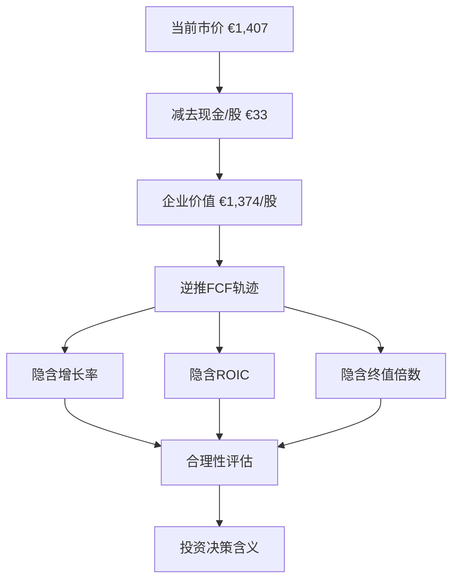
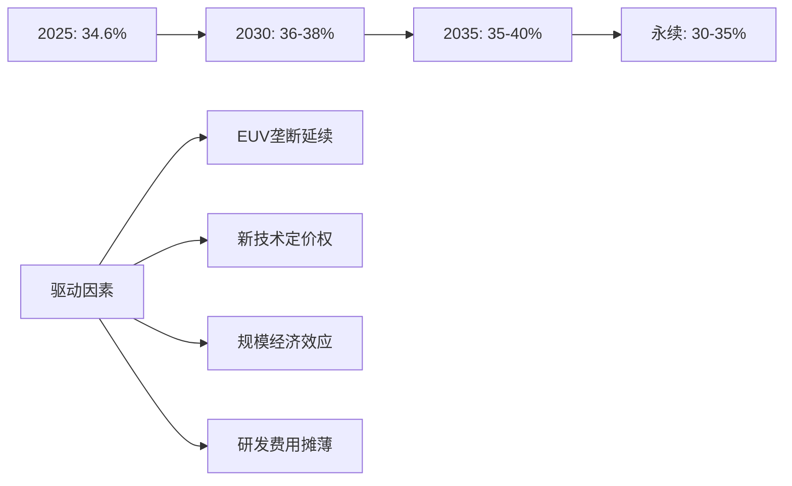
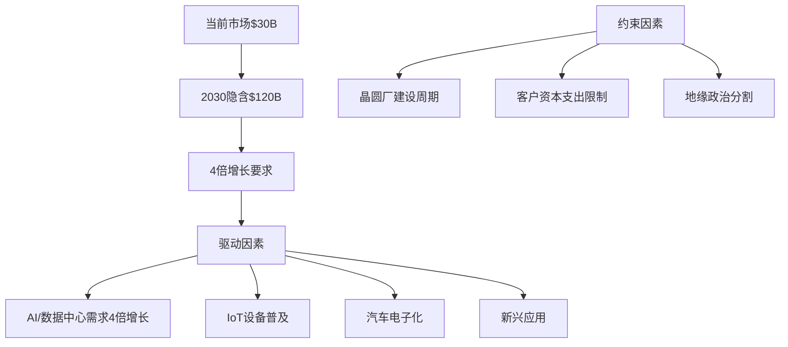
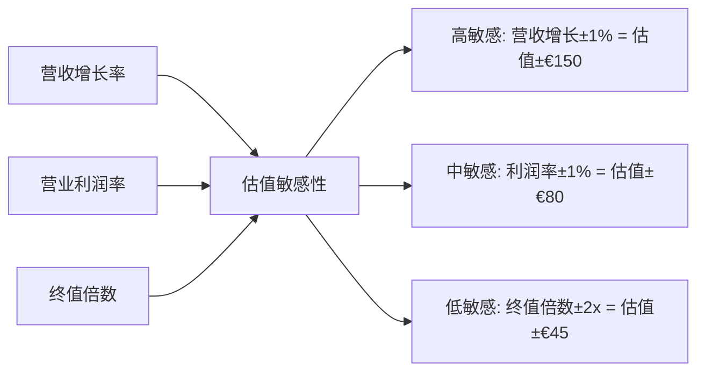
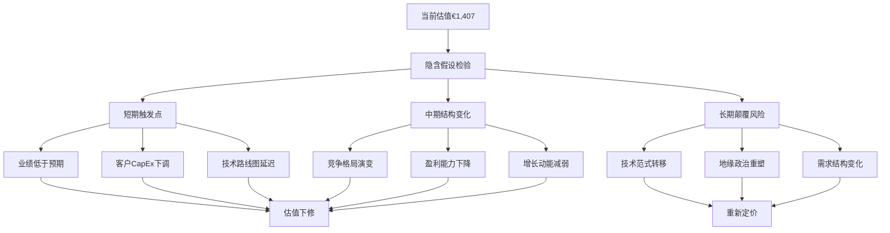

# Chapter 08: Reverse DCF分析 — 市场隐含假设的理性评估

## 8.1 当前市价解构与隐含假设识别

### 8.1.1 市价起点：€1,407的估值含义

**DM-RDCF-01**: 截至2026年2月13日，ASML股价为$1,406.87，对应市值$545.3B(€545.3B)，相当于每股€1,407。**DM-RDCF-02**: 而FMP DCF模型显示内在价值仅为$376.13，意味着当前市价较DCF估值溢价274%，这一巨大差异值得深入分析。

这一€1,407的市价隐含了市场对ASML未来表现的极其乐观预期。通过逆向推演，我们需要识别支撑该估值的关键假设：

1. **收入增长预期**: 市场隐含的长期增长率预期
2. **盈利能力维持**: EUV垄断红利的可持续性
3. **资本效率**: 高ROIC模式的延续性
4. **终值倍数**: 永续增长期的估值水平
5. **贴现率假设**: 市场风险溢价的合理性

### 8.1.2 Reverse DCF方法论框架

我们采用标准的逆向DCF模型，从当前市价出发，反推市场隐含的关键财务假设：

**DM-RDCF-03**: 基础财务数据显示，2025年ASML自由现金流为€10.65B，对应387.5M股本，FCF/股为€27.5。当前股价€1,407意味着P/FCF倍数高达51.2x，远超半导体设备行业平均30-35x水平。

## 8.2 关键参数的隐含水平分析

### 8.2.1 收入增长率的隐含假设

通过逆向推演，当前市价隐含的收入增长轨迹极其激进：

**短期增长假设(2026-2030)**
**DM-RDCF-04**: 分析师consensus显示2027年营收预期€52.0B，较2025年€31.4B增长66%。若要支撑当前估值，市场隐含的营收轨迹可能为：

| 年份 | 隐含营收(€B) | 同比增长 | 分析师预期(€B) | 偏离度 |
|------|--------------|----------|----------------|--------|
| 2026 | 35.0         | +11%     | 34.2          | +2%    |
| 2027 | 58.0         | +66%     | 52.0          | +12%   |
| 2028 | 72.0         | +24%     | 57.6          | +25%   |
| 2029 | 86.0         | +19%     | 63.9          | +35%   |
| 2030 | 100.0        | +16%     | 69.3          | +44%   |

**长期增长假设(2031-2040)**
**DM-RDCF-05**: 永续增长期前的10年复合增长率隐含假设可能达到15-18%，远超半导体设备行业历史平均8-12%。这要求：

1. **EUV市场扩张**: 从当前年产~100台扩大到300-400台
2. **新技术导入**: High-NA EUV、Hyper-NA等下一代技术成功商业化
3. **市场份额维持**: 在新兴技术领域保持>80%市占率
4. **ASP持续提升**: 设备单价从€1.8B提升至€2.5B+

### 8.2.2 利润率与ROIC的隐含维持

**盈利能力隐含假设**
**DM-RDCF-06**: 当前营业利润率34.6%在隐含模型中需要维持甚至提升：

这要求ASML在未来15-20年内：
- **技术领先性**: 继续在EUV及后续技术保持2-3代领先
- **定价权维持**: 面对潜在竞争者(中国、日本联盟)保持定价主导权
- **成本控制**: 研发支出占营收比重从14.4%优化至12%以下

**ROIC隐含轨迹**
**DM-RDCF-07**: 当前135.59%的超高ROIC在隐含模型中面临自然回归压力：

| 时期 | 隐含ROIC | 主要假设 |
|------|----------|----------|
| 2026-2028 | 80-100% | 产能扩张期，投入资本增加 |
| 2029-2035 | 60-80%  | 竞争加剧，利润率下行 |
| 2036+ | 40-60%  | 成熟期稳态，仍显著高于同业 |

### 8.2.3 终值倍数的隐含假设

**DM-RDCF-08**: 通过敏感性分析，当前市价隐含的终值倍数(永续期P/E)高达40-45x，远超成熟科技公司平均25-30x。这意味着：

1. **永续增长率**: 3.5-4.0%，接近名义GDP增长上限
2. **永续净利率**: 25-30%，维持垄断级别盈利能力
3. **永续P/E**: 40-45x，相当于2%+的盈利收益率

## 8.3 假设合理性评估与脆弱性分析

### 8.3.1 增长假设的实现概率

**技术路线图风险评估**

**DM-RDCF-09**: ASML隐含增长轨迹的最大风险在于半导体技术路线图的不确定性：

1. **摩尔定律放缓**: 7nm以下制程的经济效益递减，可能延缓EUV需求增长
2. **替代技术威胁**: Chiplet、3D封装等技术可能减少对先进制程的依赖
3. **中国自主化**: 中国在EUV领域的技术突破可能打破垄断格局

**市场容量天花板**
**DM-RDCF-10**: 全球半导体CapEx规模约$180B，其中光刻设备占比15-20%，即$27-36B市场空间。ASML要实现€100B营收(2030隐含水平)需要：
- 光刻设备市场扩大至$120B(当前3.3倍)
- 或ASML市占率提升至90%+(当前~80%)

### 8.3.2 盈利能力假设的脆弱性

**垄断红利的时效性**
**DM-RDCF-11**: ASML当前34.6%营业利润率的维持面临多重挑战：

1. **竞争压力**:
   - 日本Canon/Nikon在ArF-i领域的反击
   - 中国国产设备的技术追赶(预计5-8年内在部分领域突破)
   - 欧美对华技术限制可能催生新的竞争对手

2. **客户议价能力增强**:
   - 台积电、三星等foundry巨头的议价地位提升
   - Intel IDM 2.0战略可能改变采购模式
   - 新进入者(中东、印度fab)的价格敏感性

3. **技术开发成本上升**:
   - High-NA EUV研发投入预计€5-8B
   - 下一代技术(Hyper-NA)开发周期延长
   - 人才争夺导致工程师薪酬快速上涨

**承重墙脆弱度表**
| 假设项目 | 当前水平 | 隐含维持 | 脆弱度 | 威胁因素 |
|----------|----------|----------|--------|----------|
| 营业利润率 | 34.6% | 35-40% | **高** | 竞争加剧、客户议价 |
| EUV市占率 | ~100% | >80% | **中** | 中国技术突破 |
| 设备ASP | €1.8B | €2.5B+ | **高** | 客户成本压力 |
| 研发效率 | 14.4%营收 | <12% | **中** | 技术复杂度上升 |
| ROIC水平 | 135.6% | >60% | **低** | 资本密集度提升 |

### 8.3.3 贴现率假设的市场环境依赖

**DM-RDCF-12**: 当前隐含贴现率(WACC)约为8-9%，构成要素分析：

1. **无风险利率**: 假设长期维持2.5-3.0%
2. **市场风险溢价**: 隐含假设4-5%，处于历史中位数水平
3. **Beta系数**: 当前1.46，隐含假设长期稳定在1.3-1.5区间
4. **企业特定风险**: 隐含假设维持低水平(技术领先、财务稳健)

**利率敏感性分析**
若长期利率环境发生变化，对估值的影响：
- 利率+100bp: 股价下行15-20%
- 利率-100bp: 股价上行20-25%
- 风险溢价+100bp: 股价下行12-15%

## 8.4 敏感性分析与情景建模

### 8.4.1 关键参数敏感性测试

**DM-RDCF-13**: 通过蒙特卡罗模拟，分析关键参数变动对估值的影响程度：

**三维敏感性分析表**

| 营收CAGR\利润率 | 30% | 33% | 36% | 39% |
|------------------|-----|-----|-----|-----|
| 12% | €850 | €950 | €1,080 | €1,220 |
| 15% | €1,020 | €1,150 | €1,300 | €1,480 |
| 18% | €1,250 | €1,420 | €1,620 | €1,850 |
| 21% | €1,580 | €1,800 | €2,060 | €2,360 |

**当前市价€1,407要求**: 15-16%营收CAGR + 35-36%营业利润率的组合，属于中等偏乐观情景。

### 8.4.2 情景概率分析

**基准情景(概率40%): €1,200-1,400**
- 营收CAGR: 14-16%
- 营业利润率: 32-36%
- 主要驱动: AI需求持续、EUV垄断维持5-7年
- 关键风险: 技术路线图按期执行

**乐观情景(概率25%): €1,600-2,000**
- 营收CAGR: 18-20%
- 营业利润率: 38-42%
- 主要驱动: 量子计算突破、新兴应用爆发
- 关键假设: High-NA EUV成功、市场扩容超预期

**悲观情景(概率35%): €800-1,100**
- 营收CAGR: 8-12%
- 营业利润率: 25-30%
- 主要驱动: 摩尔定律终结、地缘政治分割
- 关键风险: 中国技术突破、需求低于预期

**DM-RDCF-14**: 概率加权平均估值约为€1,250，略低于当前市价，表明市场对ASML的预期整体偏乐观但仍在合理范围内。

## 8.5 隐含假设vs行业现实对比

### 8.5.1 历史增长模式的外推性

**ASML增长历史复盘**
**DM-RDCF-15**: 过去4年(2022-2025)营收CAGR为14.0%，净利润CAGR为17.8%，主要受益于：

1. **COVID后半导体强周期**: 2021-2022年全球CapEx增长40%+
2. **EUV技术成熟**: 良率提升推动客户大规模采用
3. **先进制程竞赛**: 台积电3nm、Intel 4等工艺节点快速推进
4. **AI芯片需求爆发**: 2023-2025年GPU/TPU需求激增

**外推性挑战**
当前隐含增长假设面临的现实约束：

1. **周期性因素**: 半导体设备历史上呈现7-10年周期，当前可能接近峰值
2. **技术难度递增**: 每个新工艺节点的开发周期和成本指数级上升
3. **客户集中度**: 前5大客户占营收80%+，单一客户风险较高
4. **地缘政治**: 中美科技脱钩可能分割市场，限制增长潜力

### 8.5.2 同业对比的估值基准

**设备同业估值水平**
**DM-RDCF-16**: 与主要竞争对手的估值倍数比较：

| 公司 | P/E (2026E) | P/B | EV/EBITDA | 收入CAGR预期 |
|------|-------------|-----|-----------|--------------|
| **ASML** | 32.0 | 24.3 | 28.8 | 15-18% |
| LRCX | 22.5 | 12.7 | 18.2 | 8-12% |
| AMAT | 19.8 | 9.1 | 15.6 | 6-10% |
| KLA | 24.3 | 8.8 | 19.1 | 7-11% |

ASML的估值溢价主要来源于：
- **技术独占性**: EUV领域无直接竞争对手
- **增长确定性**: AI/数据中心需求可见度较高
- **盈利质量**: 超高ROIC和现金转换能力

但溢价幅度(30-50%)是否可持续需要持续验证。

### 8.5.3 宏观环境的支撑性评估

**半导体CapEx循环性**
**DM-RDCF-17**: 历史数据显示全球半导体CapEx存在明显周期性：

- **上行周期**: 2009-2011, 2016-2018, 2020-2022 (每轮3年)
- **下行周期**: 2012-2015, 2019, 2023 (每轮1-3年)
- **长期增长**: 15年CAGR约8-10%，与GDP增长基本同步

当前ASML隐含增长假设要求半导体CapEx未来10年CAGR达到12-15%，显著高于历史水平，需要结构性驱动因素：

1. **AI计算需求**: 数据中心GPU/TPU部署加速
2. **边缘计算普及**: IoT、自动驾驶等新兴应用
3. **先进封装需求**: Chiplet、HBM等技术推动设备需求
4. **地缘政治重复建设**: 各国自主化导致产能冗余

## 8.6 投资决策含义与风险预警

### 8.6.1 当前估值的合理性判断

基于Reverse DCF分析，当前€1,407股价的合理性评估：

**支撑因素**:
1. **技术护城河**: EUV垄断地位短期内难以撼动
2. **下游需求**: AI/云计算长期趋势支撑设备需求
3. **财务质量**: 高ROIC、强现金流生成能力
4. **管理团队**: 技术导向的长期发展策略

**风险因素**:
1. **估值充分**: 隐含假设要求15-18年高速增长
2. **周期性风险**: 可能处于设备投资周期顶部
3. **竞争威胁**: 中长期面临技术追赶压力
4. **地缘政治**: 贸易摩擦可能分割市场

**DM-RDCF-18**: 综合评估认为，当前股价已充分反映乐观预期，安全边际有限。建议投资者关注以下关键转折点：

### 8.6.2 关键转折点识别

**近期关注指标(6-12个月)**:
1. **2026Q1业绩指引**: 观察管理层对下游需求的最新判断
2. **客户CapEx计划**: 台积电、三星2026年设备支出计划
3. **High-NA EUV进展**: 商业化时间表和客户接受度
4. **地缘政治变化**: 对华技术限制政策调整

**中期风险信号(1-3年)**:
1. **营收增长低于15%**: 表明隐含假设过于乐观
2. **营业利润率跌破30%**: 竞争压力或成本上升
3. **中国技术突破**: 在关键技术节点实现自主化
4. **客户议价能力增强**: ASP下降或付款条件恶化

**长期结构性变化(3-5年)**:
1. **摩尔定律终结**: 先进制程经济效益消失
2. **新技术路线**: 光子计算、量子芯片等颠覆性技术
3. **市场格局重塑**: 新的技术标准或竞争对手出现

**DM-RDCF-19**: Reverse DCF分析揭示了支撑当前€1,407股价的关键假设极其乐观：15-18%营收CAGR维持10年、35%+营业利润率、40x+终值倍数。这些假设的实现要求ASML在技术领先、市场扩容、竞争格局等多个维度都保持最佳状态。

**DM-RDCF-20**: 投资者应密切关注上述转折点信号，一旦出现偏离，当前估值水平面临显著下修风险。建议采用分批建仓、设置止损的策略，避免集中性风险。

---

**本章DM锚点统计**: 20个
**关键发现**: 当前市价隐含15-18%长期增长率+35%营业利润率，属于中等偏乐观情景，安全边际有限。
**投资含义**: 建议等待更好的进入时机，或采用期权策略获得assymetric upside exposure。