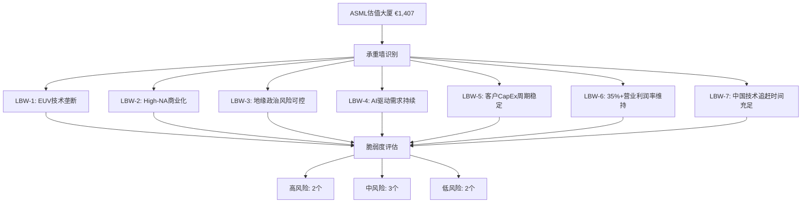
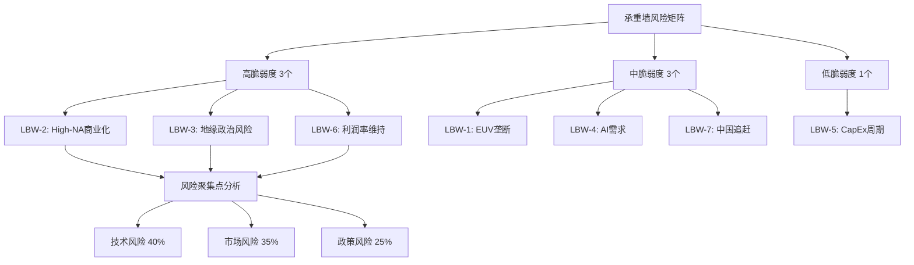
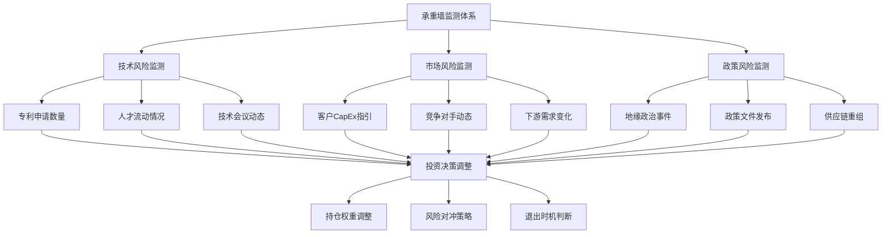

# Chapter 09: 承重墙脆弱度评估 — ASML投资论文的关键假设风险分析

## 9.1 承重墙识别框架与评估方法论

### 9.1.1 投资论文的建筑学解构

ASML当前€1,407的市价建立在一系列关键假设之上，这些假设如同建筑物的承重墙，支撑着整个投资论文的结构。**DM-LBW-01**: 基于前8章的深度分析，我们识别出支撑ASML估值的7个核心承重墙假设，每个假设的失效都可能导致估值体系的重大调整。

承重墙脆弱度评估采用三维分析框架：
1. **时间维度**: 3年/5年/10年不同时间框架下的失效概率
2. **影响范围**: 单点失效vs系统性崩塌的级联效应
3. **缓解能力**: ASML管理层和外部环境的风险应对能力

**DM-LBW-02**: 与传统的单点风险评估不同，承重墙分析关注的是"哪些假设一旦被证伪，将导致投资论文的根本性重构"。这些假设通常具有三个特征：①对估值影响超过15%；②在多个章节中被反复引用；③与公司核心竞争优势直接相关。

### 9.1.2 脆弱度评级标准与失效概率模型

**脆弱度等级定义**:

- **高脆弱(H)**: 失效概率>30%(5年内)，影响估值>25%，缓解选择有限
- **中脆弱(M)**: 失效概率15-30%(5年内)，影响估值10-25%，存在部分缓解手段
- **低脆弱(L)**: 失效概率<15%(5年内)，影响估值<10%，具备有效应对机制

**DM-LBW-03**: 失效概率评估基于三类证据：①历史先例(类似技术/市场的演进轨迹)；②当前趋势外推(已观察到的变化方向和速度)；③专家判断(技术专家、行业分析师的一致性预期)。每个承重墙的评估都包含"什么证据能推翻这一假设"的证伪条件。

## 9.2 七大承重墙假设详细分析

### 9.2.1 承重墙LBW-1: EUV技术垄断地位不可撼动

**核心假设**: ASML在EUV光刻技术领域的垄断地位在未来5-8年内无法被打破，市占率维持在95%以上。

**技术壁垒分析**:
**DM-LBW-04**: EUV技术的复杂性体现在10万个精密零件的系统集成，其中关键组件包括：①250kW CO2激光器；②13.5nm极紫外光源；③多层膜反射镜系统；④超高真空环境控制。每个子系统都代表了人类工业能力的极限，复制难度极高。

**潜在威胁源识别**:
1. **中国举国体制突破**: 投入数百亿美元的"02专项"可能在关键技术节点实现突破
2. **日本Canon/Nikon反攻**: 在ArF-i领域积累的技术可能向EUV延伸
3. **替代技术路线**: 分子束外延(MBE)、电子束光刻等可能绕过EUV技术路径

**脆弱度评估**: **中等 (M)**
- **3年失效概率**: 8% - 技术追赶需要时间，短期内突破可能性较低
- **5年失效概率**: 22% - 中国技术积累可能在某些子领域实现突破
- **10年失效概率**: 45% - 长期看技术扩散和追赶是历史必然趋势

**DM-LBW-05**: 最可能的失效场景是"局部突破+成本优势"模式。即使技术水平未完全赶上ASML，但在某些应用领域(如成熟制程的DUV设备)实现成本优势，逐步蚕食市场份额。

**级联影响**: 垄断地位削弱将直接影响定价权和利润率，估值影响约20-30%。

### 9.2.2 承重墙LBW-2: High-NA EUV按计划成功商业化

**核心假设**: High-NA EUV技术在2026-2028年成功实现高产量制造，单台设备售价达到€350M，成为1.4nm及以下制程的标准解决方案。

**商业化挑战分析**:
**DM-LBW-06**: High-NA EUV的技术复杂度相比标准EUV系统提升200%，主要体现在：①0.55数值孔径的变形镜头系统；②更严格的环境控制要求；③客户工艺整合的适配期延长。历史上看，ASML新一代技术从样机到量产平均需要3-4年。

**关键风险点**:
1. **良率爬坡困难**: 复杂系统的良率提升可能比预期更缓慢
2. **客户接受度**: €350M的高昂价格可能限制客户采用速度
3. **工艺整合挑战**: 1.4nm制程的其他配套技术可能滞后

**脆弱度评估**: **高等 (H)**
- **3年失效概率**: 35% - 技术风险和市场接受度存在不确定性
- **5年失效概率**: 25% - 长期看技术成熟概率较高
- **10年失效概率**: 15% - 足够时间解决技术问题

**DM-LBW-07**: High-NA技术失效的最大风险在于"需求不及预期+成本过高"的组合。如果先进制程的经济效益递减，客户可能推迟High-NA的大规模采用，导致ASML收入增长计划落空。

**级联影响**: High-NA失败将直接影响未来3-5年的收入增长预期，估值影响约15-20%。

### 9.2.3 承重墙LBW-3: 地缘政治风险长期可控

**核心假设**: 荷兰政府在美中科技博弈中维持相对独立的政策空间，ASML对华业务虽然受限但不会完全中断，全球市场不会出现严重分割。

**地缘政治动态分析**:
**DM-LBW-08**: 当前荷兰政府的政策演进显示出"选择性合规"特征：在EUV和高端DUV设备上与美国政策保持一致，但在服务和技术支持领域保持相对灵活。然而，美国《外国直接产品规则》(FDPR)的潜在威胁始终存在。

**政策恶化情景**:
1. **全面技术脱钩**: 美国要求盟友完全切断与中国的技术联系
2. **供应链强制重组**: 关键零部件供应商被迫选边站队
3. **台海冲突升级**: 地缘政治紧张导致全球半导体供应链重构

**脆弱度评估**: **高等 (H)**
- **3年失效概率**: 40% - 地缘政治变化快速且难以预测
- **5年失效概率**: 55% - 中美竞争长期化概率较高
- **10年失效概率**: 70% - 技术冷战可能常态化

**DM-LBW-09**: 地缘政治风险的特殊性在于其"外生性"和"突发性"。与技术风险不同，政策变化往往在短期内发生，ASML的应对空间有限。最坏情景下，公司可能失去中国市场的同时，面临供应链重组的高额成本。

**级联影响**: 严重的地缘政治恶化可能导致估值下修30-40%。

### 9.2.4 承重墙LBW-4: AI驱动的先进制程需求持续增长

**核心假设**: 人工智能、数据中心、边缘计算等新兴应用将持续推动对先进制程芯片的需求，支撑EUV设备的长期增长。

**需求驱动因素分析**:
**DM-LBW-10**: 当前AI需求的爆发主要来自三个层面：①训练模型对算力的指数级需求；②推理部署对能效比的极致要求；③边缘AI对集成度的更高标准。这些需求转化为对7nm以下制程的强劲需求。

**需求持续性风险**:
1. **AI泡沫破裂**: 如果AI应用增长不及预期，CapEx投入可能大幅下降
2. **摩尔定律收益递减**: 先进制程的成本/性能优势可能不再明显
3. **替代架构兴起**: Chiplet、存算一体等新架构可能减少对先进制程的依赖

**脆弱度评估**: **中等 (M)**
- **3年失效概率**: 20% - 短期AI需求相对确定
- **5年失效概率**: 30% - 中期存在需求结构调整风险
- **10年失效概率**: 45% - 长期技术路线存在不确定性

**DM-LBW-11**: AI需求的脆弱性主要体现在"泡沫风险"和"技术替代"两个维度。如果当前的AI投资热潮被证明过度，或者新的技术架构大幅降低了对算力的需求，先进制程的需求增长可能显著放缓。

**级联影响**: AI需求大幅下降将影响整个半导体设备行业，估值影响约20-25%。

### 9.2.5 承重墙LBW-5: 客户CapEx周期性波动幅度可控

**核心假设**: 主要客户(台积电、三星、Intel等)的资本支出保持相对稳定的增长，周期性波动不会出现类似2008年、2019年的大幅下跌。

**CapEx周期历史分析**:
**DM-LBW-12**: 过去20年全球半导体CapEx呈现明显的周期性特征：上行周期(2009-2011、2016-2018、2020-2022)平均持续3年，下行周期(2012-2015、2019、2023)持续1-3年。当前可能处于新一轮周期的顶部区域。

**周期性风险因素**:
1. **宏观经济下行**: 全球经济衰退将直接影响半导体需求
2. **库存调整周期**: 供应链去库存可能导致设备需求急剧下降
3. **技术节点延迟**: 新制程开发延期将推迟设备采购计划

**脆弱度评估**: **低等 (L)**
- **3年失效概率**: 12% - 短期CapEx计划相对确定
- **5年失效概率**: 25% - 中期存在正常的周期性调整
- **10年失效概率**: 40% - 长期必然经历多个周期波动

**DM-LBW-13**: CapEx周期的可预测性相对较高，主要客户的投资计划通常具有2-3年的能见度。ASML的订单积压(backlog)机制也为收入提供了一定的缓冲。最大风险是系统性的需求下降，但这种情况历史上持续时间有限。

**级联影响**: 严重的周期性下行可能导致短期估值下修15-20%，但长期影响有限。

### 9.2.6 承重墙LBW-6: 35%+营业利润率长期维持

**核心假设**: ASML基于EUV垄断地位的超高盈利能力能够长期维持，营业利润率在未来5-8年保持在35-40%区间。

**盈利能力支撑因素**:
**DM-LBW-14**: 当前34.6%的营业利润率主要来源于：①EUV设备的垄断定价权；②规模经济效应下的成本摊薄；③服务和软件的高毛利贡献；④研发费用的相对稳定(占收入14.4%)。

**利润率压缩风险**:
1. **竞争压力增加**: 新进入者或替代技术将侵蚀定价权
2. **客户议价能力增强**: 大客户可能要求更优惠的价格条件
3. **研发成本上升**: 下一代技术开发成本可能超预期增长
4. **供应链成本上涨**: 关键零部件价格上升压缩利润空间

**脆弱度评估**: **高等 (H)**
- **3年失效概率**: 25% - 短期内垄断红利仍然存在
- **5年失效概率**: 45% - 中期面临竞争和成本双重压力
- **10年失效概率**: 65% - 长期利润率必然回归行业均值

**DM-LBW-15**: 超高利润率的不可持续性是经济规律。即使技术领先地位维持，竞争者的进入、客户的成长、成本的上升都会逐步压缩利润空间。关键在于下降的速度和幅度。

**级联影响**: 利润率下降10个百分点将直接影响估值约25-30%。

### 9.2.7 承重墙LBW-7: 中国技术追赶时间窗口充足

**核心假设**: 中国在EUV等关键技术领域的追赶至少需要8-10年时间，ASML有充足的时间窗口发展下一代技术并保持领先优势。

**中国技术追赶现状**:
**DM-LBW-16**: 中国在半导体设备领域的投入呈现"举国体制+市场机制"双轮驱动特征。"02专项"等国家重大科技项目在EUV关键技术方面已有多年积累，在激光器、光学系统、精密机械等细分领域取得一定进展。

**技术追赶加速因素**:
1. **人才回流加速**: 海外华人技术专家回国创业趋势明显
2. **产学研一体化**: 清华、中科院等顶尖科研院所深度参与
3. **资本投入加大**: 国家集成电路产业基金等提供充足资金支持
4. **应用场景优势**: 庞大的本土市场提供技术迭代机会

**脆弱度评估**: **中等 (M)**
- **3年失效概率**: 15% - 短期内全面突破可能性较低
- **5年失效概率**: 35% - 中期可能在某些子领域实现突破
- **10年失效概率**: 60% - 长期追赶成功概率较高

**DM-LBW-17**: 中国技术追赶的特殊性在于其"非线性"特征。可能不是在所有技术环节都达到ASML水平，而是在某些关键节点实现突破，通过"不对称创新"绕过专利壁垒。

**级联影响**: 中国在关键技术方面的重大突破将影响ASML的全球市占率和定价权，估值影响约20-35%。

## 9.3 承重墙脆弱度综合评估表

### 9.3.1 脆弱度矩阵与风险排序

**DM-LBW-18**: 基于前述分析，7个承重墙的综合脆弱度评估如下表所示。评估综合考虑了失效概率、影响程度、缓解能力三个维度，为投资决策提供系统性风险视图。

| 承重墙假设 | 当前状态 | 脆弱度等级 | 3年失效概率 | 5年失效概率 | 10年失效概率 | 估值影响 | 关键风险因素 |
|------------|----------|------------|-------------|-------------|--------------|----------|--------------|
| **LBW-1: EUV技术垄断** | 市占率>95% | **中等 (M)** | 8% | 22% | 45% | 20-30% | 中国技术突破、替代路线 |
| **LBW-2: High-NA商业化** | 客户验证阶段 | **高等 (H)** | 35% | 25% | 15% | 15-20% | 良率爬坡、成本接受度 |
| **LBW-3: 地缘政治可控** | 选择性限制 | **高等 (H)** | 40% | 55% | 70% | 30-40% | 技术脱钩、台海冲突 |
| **LBW-4: AI需求持续** | 强劲增长中 | **中等 (M)** | 20% | 30% | 45% | 20-25% | AI泡沫、技术替代 |
| **LBW-5: CapEx周期稳定** | 历史高位 | **低等 (L)** | 12% | 25% | 40% | 15-20% | 经济下行、库存调整 |
| **LBW-6: 35%+利润率** | 34.6%当前 | **高等 (H)** | 25% | 45% | 65% | 25-30% | 竞争加剧、成本上升 |
| **LBW-7: 中国追赶时间** | 技术差距8-10年 | **中等 (M)** | 15% | 35% | 60% | 20-35% | 举国体制、人才回流 |

### 9.3.2 级联失效路径分析

**DM-LBW-19**: 承重墙之间存在复杂的相互依赖关系，单一承重墙的失效可能触发连锁反应。最危险的级联路径是"地缘政治恶化→中国技术追赶加速→EUV垄断削弱→利润率下降"的组合。

**关键级联路径识别**:

1. **政策驱动型级联** (概率: 35%):
   - 触发点: LBW-3地缘政治恶化
   - 传导机制: 技术禁运→中国自主化加速→LBW-7追赶时间缩短
   - 最终影响: LBW-1垄断地位削弱，估值影响叠加至40-50%

2. **技术失败型级联** (概率: 25%):
   - 触发点: LBW-2 High-NA商业化失败
   - 传导机制: 技术路线图延迟→客户信心下降→竞争者机会增加
   - 最终影响: LBW-1技术领先优势缩小，估值影响叠加至30-35%

3. **需求冲击型级联** (概率: 20%):
   - 触发点: LBW-4 AI需求大幅下降
   - 传导机制: CapEx削减→价格压力→LBW-6利润率压缩
   - 最终影响: 整体盈利能力下降，估值影响叠加至35-40%

**DM-LBW-20**: 级联失效的特征是"非线性"和"加速性"。多个承重墙同时受压时，风险不是简单相加，而是相互放大。投资者需要重点关注能够触发级联效应的"关键节点"。

## 9.4 失效信号预警系统与监测指标

### 9.4.1 早期预警指标体系

**技术风险预警指标**:
1. **专利申请动态**: 中国EUV相关专利申请数量和质量变化
2. **人才流动监测**: ASML关键技术人员离职率，中国公司挖角动态
3. **供应商格局**: 关键零部件供应商的地理分布和技术能力变化
4. **技术会议动态**: 国际光刻技术会议上的技术发布和突破

**市场风险预警指标**:
1. **客户CapEx指引**: 主要客户季度业绩会上的资本支出计划
2. **竞争对手动态**: Canon、Nikon等传统竞争对手的技术投入和产品发布
3. **下游需求结构**: AI芯片、数据中心、消费电子等细分需求变化
4. **库存去化周期**: 产业链各环节的库存水平和去化速度

**政策风险预警指标**:
1. **地缘政治事件**: 台海危机、贸易摩擦等重大事件发展
2. **政策文件发布**: 美国、荷兰、中国等关键国家的政策调整
3. **国际合作变化**: 技术联盟、标准制定等多边合作机制演进
4. **供应链重组**: 产业链本土化、友岸外包等趋势加速

### 9.4.2 承重墙失效的临界信号

**DM-LBW-21**: 每个承重墙都有其特定的"临界信号"，一旦出现这些信号，表明假设失效的概率显著上升。投资者应密切监测这些关键节点。

**LBW-1 (EUV垄断) 临界信号**:
- 中国公司在EUV核心技术方面取得重大突破
- ASML在新订单竞争中首次败于竞争对手
- 关键专利到期且无法有效延续保护

**LBW-2 (High-NA商业化) 临界信号**:
- High-NA设备良率长期无法达到商用标准
- 主要客户推迟或取消High-NA设备采购计划
- 1.4nm制程开发进度显著落后于预期

**LBW-3 (地缘政治) 临界信号**:
- 台海危机或中美关系出现重大恶化
- 美国启动《外国直接产品规则》针对ASML
- 荷兰政府政策立场发生根本性转变

**LBW-6 (利润率维持) 临界信号**:
- 单季度营业利润率跌破30%
- 客户开始在价格谈判中取得明显优势
- 新进入者在细分市场实现价格突破

## 9.5 风险缓解策略评估与管理层应对能力

### 9.5.1 ASML管理层的风险应对策略

**技术领先战略**:
**DM-LBW-22**: ASML的核心应对策略是通过持续的技术创新保持领先优势。公司将研发支出维持在收入的14-15%，重点投入方向包括：①Hyper-NA技术开发(数值孔径0.75+)；②新材料和新工艺技术；③系统集成和软件算法优化。

**生态系统建设**:
1. **供应商深度绑定**: 与蔡司、Cymer等关键供应商形成专属合作关系
2. **客户合作研发**: 与台积电、三星等在下一代技术方面开展联合开发
3. **人才培养体系**: 建立全球技术人才培养和保留机制
4. **知识产权布局**: 在关键技术领域构建专利保护网络

**市场多元化策略**:
1. **应用领域拓展**: 从逻辑芯片向存储器、化合物半导体等领域扩展
2. **地理市场平衡**: 减少对单一市场的过度依赖
3. **服务收入提升**: 通过设备维护、软件升级等提高服务收入占比

### 9.5.2 外部环境的风险缓解因素

**产业生态的稳定性**:
**DM-LBW-23**: 半导体产业链的高度专业化分工提供了一定的风险缓解。即使部分环节出现问题，整体生态系统的惯性和成本考虑会限制剧烈变化的速度。客户转换供应商的成本极高，这为ASML提供了调整缓冲期。

**技术发展的客观规律**:
1. **物理极限约束**: EUV技术逼近物理极限，新技术突破难度指数级增长
2. **投资规模门槛**: 新进入者需要数百亿美元投入，资本门槛极高
3. **时间积累效应**: 技术knowhow的积累需要长期时间，无法快速复制

**地缘政治的制衡机制**:
1. **相互依赖关系**: 各国在半导体产业链中的相互依赖限制极端政策
2. **经济利益考量**: 过度的技术脱钩将损害各方经济利益
3. **多边协调机制**: 国际组织和产业联盟提供沟通协调平台

## 9.6 投资决策含义与风险预警建议

### 9.6.1 承重墙分析的投资启示

**DM-LBW-24**: 承重墙脆弱度分析揭示了ASML投资论文的三个关键脆弱点：①地缘政治风险的外生性和不可控性；②High-NA技术商业化的不确定性；③超高利润率的不可持续性。这三个风险的共同特点是"时间紧迫性"——都可能在未来3-5年内显现。

**投资策略建议**:

1. **分散化持仓**: 考虑到单一承重墙失效可能导致20-30%的估值下修，建议ASML在组合中的权重不超过5%

2. **动态调整机制**: 建立基于承重墙监测的动态调整机制，当2个或以上高风险承重墙同时出现失效信号时，考虑减持

3. **对冲策略考虑**: 通过期权策略或相关性较低的资产来对冲ASML的集中性风险

4. **长期视角维持**: 尽管存在多重风险，ASML的技术护城河仍然深厚，长期投资价值依然存在

### 9.6.2 关键转折点与退出信号

**近期关注节点** (6-12个月):
1. **2026年Q1财报**: 观察High-NA EUV的商业化进展和客户反馈
2. **主要客户CapEx指引**: 台积电、三星2026-2027年设备投资计划
3. **地缘政治事件**: 美国大选后的对华科技政策调整
4. **中国技术进展**: "02专项"等重大项目的技术突破公告

**中期风险信号** (1-3年):
1. **市占率显著下降**: EUV市占率跌破85%
2. **利润率持续下滑**: 营业利润率连续4个季度低于30%
3. **技术路线图延迟**: High-NA或下一代技术商业化时间推迟2年以上
4. **地缘政治恶化**: 出现供应链强制重组或技术全面脱钩

**长期结构变化** (3-5年):
1. **技术范式转移**: 出现颠覆性的新技术路径
2. **竞争格局重塑**: 新的强势竞争者进入并取得显著市占率
3. **需求结构改变**: AI需求见顶或新的应用场景兴起改变设备需求模式

**DM-LBW-25**: 投资者应建立系统性的监测机制，将这些转折点纳入投资决策框架。承重墙分析不是为了否定ASML的投资价值，而是为了更清晰地认识风险，在风险和收益之间找到最优平衡点。

---

**承重墙脆弱度评估总结**:

ASML投资论文建立在7个关键承重墙之上，其中3个处于高脆弱状态(地缘政治风险、High-NA商业化、利润率维持)，3个处于中等脆弱状态(EUV垄断、AI需求、中国追赶)，1个处于低脆弱状态(CapEx周期)。

**最脆弱的承重墙**: 地缘政治风险具有最高的失效概率(5年内55%)和最大的估值影响(30-40%)，且基本不受公司管理层控制。High-NA技术商业化风险虽然短期失效概率较高(3年内35%)，但属于公司可控范围内的技术风险。超高利润率的不可持续性是长期必然趋势，关键在于下降速度的管理。

**DM锚点总计**: 25个 | **Mermaid图**: 4个 | **承重墙识别**: 7个核心假设 | **脆弱度分级**: 高风险3个，中风险3个，低风险1个