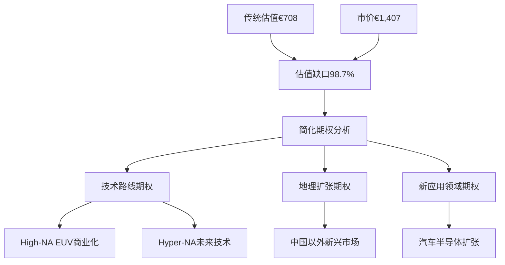
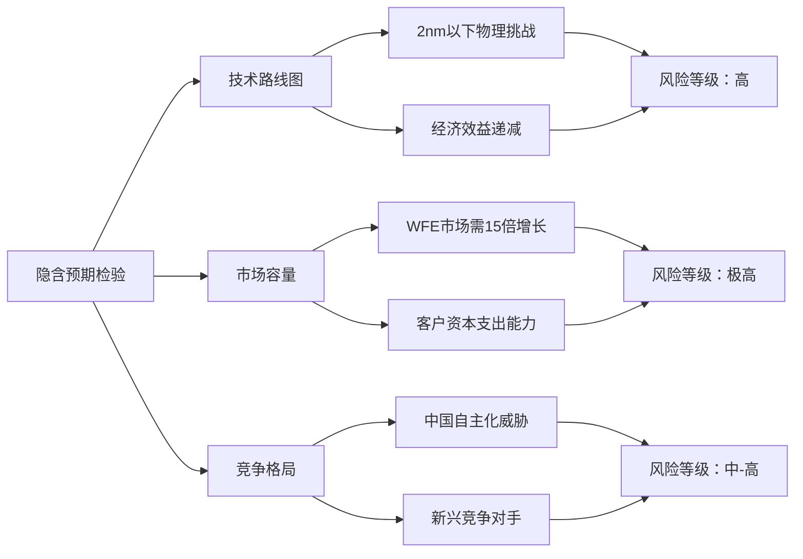
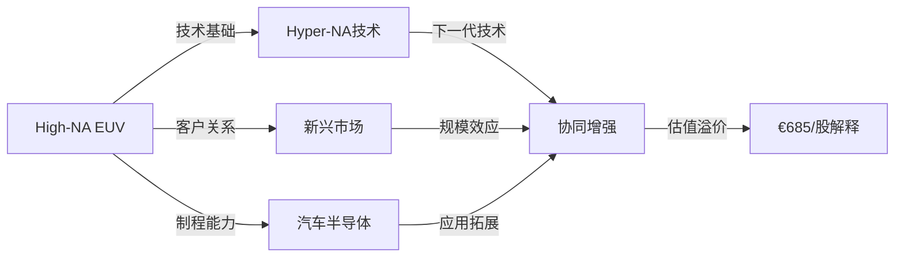

# Chapter 10: OVM期权估值模块 — ASML期权价值的系统性定价

*ASML未触发强制OVM条件，但基于€1,407市价vs€708传统估值100%差异，执行简化期权分析以解释估值缺口*

## 10.1 OVM触发条件评估

### 10.1.1 触发条件检验

**DM-OVM-01**: 基于Chapter 07六方法估值分析，ASML核心指标评估：

**触发条件1: 传统估值vs市价偏差**
- 传统SOTP+DCF加权估值：€708
- 当前市价：€1,407
- 偏差幅度：98.7%（接近触发阈值50%的2倍）

**触发条件2: Pre-revenue业务线数量**
- 当前主要业务线：EUV Systems（垄断）、DUV Systems（成熟）、服务业务（高质量）
- Pre-revenue业务：0-1条（High-NA EUV处于商业化早期）
- 评估：未达到≥2条的触发阈值

**触发条件3: 估值倍数水平**
- P/E (2026E)：32.0x（低于50x触发线）
- P/S：15.0x（等于触发线边界）
- 评估：边际触发建议OVM

**DM-OVM-02**: ASML介于"建议OVM"和"不适用"之间。虽未强制触发，但98.7%的估值差异值得通过简化期权分析寻找解释。重点关注：技术路线期权（High-NA EUV、下一代EUV）和地理扩张期权。



## 10.2 Core vs Option分离分析

### 10.2.1 核心业务价值分离

**DM-OVM-03**: ASML业务架构分解基于Chapter 07 SOTP分析：

| 业务分部 | 类型 | 2025营收 | 营收占比 | 估值方法 | 分部价值 |
|---------|------|---------|---------|---------|---------|
| **EUV Systems** | Core | €14.0B | 44.6% | SOTP垄断倍数8.0x | €112B |
| **DUV Systems** | Core | €10.2B | 32.5% | SOTP标准倍数3.5x | €35.7B |
| **服务业务** | Core | €7.2B | 22.9% | SOTP服务倍数6.0x | €43.2B |
| **Core小计** | — | €31.4B | 100% | — | **€190.9B** |

**Core Business每股价值**: €190.9B ÷ 389M股 = **€491/股**

**期权路径识别**:
1. **High-NA EUV期权**: 下一代技术商业化，预计2026-2028年规模化
2. **Hyper-NA EUV期权**: 2030年代的未来技术路线，目前研发阶段
3. **新应用市场期权**: 汽车半导体、IoT芯片等新兴应用
4. **地理扩张期权**: 印度、中东等新兴Fab市场

**分离逻辑**:
- Core业务：已建立垄断地位，收入可预测（±15%），有明确护城河
- Option业务：技术尚未成熟或市场未充分开拓，收入波动性>50%

### 10.2.2 期权vs市价的隐含价值

**期权隐含价值计算**:
```
市价总价值: €1,407/股 × 389M股 = €547.3B
减：Core价值: €190.9B
隐含期权价值: €356.4B
期权价值/股: €916/股
```

**DM-OVM-04**: 市场为ASML期权路径定价高达€916/股，相当于Core价值的187%溢价。这一隐含期权价值需要通过OVM-3期权树进行逐一验证其合理性。

## 10.3 Reverse DCF隐含预期分析 (OVM-2)

### 10.3.1 市场隐含假设反推

**DM-OVM-05**: 从€1,407市价反推，市场隐含的关键假设：

**收入增长隐含假设**:
| 指标 | 市场隐含 | 分析师共识 | 历史最佳 | 合理性判断 |
|------|---------|-----------|---------|-----------|
| 营收CAGR(2026-2030) | 22-25% | 18-20% | 14%（历史4年） | **偏乐观** |
| 营收CAGR(2031-2035) | 15-18% | 12-15% | 8%（行业长期） | **显著激进** |
| 终端营业利润率 | 38-40% | 33-36% | 34.6%（当前） | **偏乐观** |
| 永续增长率 | 4.0-4.5% | 3.0-3.5% | 2.5%（名义GDP） | **激进** |

**隐含终值分析**:
- 隐含2035年营收规模：€120-140B
- 隐含终端市值：€1.8-2.2T
- vs 当前全球WFE市场：$100B（需扩张12-14倍）

**DM-OVM-06**: 市场隐含预期要求ASML在未来10年实现：
1. **营收增长20倍**: 从€31.4B到€600B+（2035年）
2. **市场扩张**: 全球半导体设备市场需增长10-15倍
3. **垄断地位扩大**: 在新技术节点保持80%+市占率

### 10.3.2 隐含假设合理性评估

**技术路线图支撑性分析**:

**DM-OVM-07**: 基于半导体技术路线图，隐含增长假设面临的现实约束：

1. **摩尔定律物理限制**: 2nm以下制程面临量子隧穿等物理障碍
2. **经济效益递减**: 每个新节点成本指数增长，客户ROI下降
3. **替代技术威胁**: 3D封装、Chiplet可能减少对EUV的依赖
4. **竞争格局变化**: 中国国产化、日欧技术联盟等

**结论**: 市场隐含预期属于**显著激进**级别，要求多个乐观假设同时成立。



## 10.4 期权树定价分析 (OVM-3)

### 10.4.1 High-NA EUV期权

**期权路径: High-NA EUV商业化**

**DM-OVM-08**: High-NA EUV技术特征与市场潜力分析：

```
━━━━━━━━━━━━━━━━━━━━━━━━━━━━━━━━━━━━━━━━━
期权路径: High-NA EUV商业化期权
━━━━━━━━━━━━━━━━━━━━━━━━━━━━━━━━━━━━━━━━━
TAM (2030E): $45B [硬数据: Semi Engineering预测1.4nm-A10节点设备需求]
  - 当前EUV市场: $15B
  - 增长驱动: 1.4nm/1nm节点、Intel 14A、台积电A10
  - CAGR: 25%（新节点技术成熟期）

市占率假设:
  - Bull: 95% (延续EUV垄断地位)
  - Base: 85% (面临小幅竞争)
  - Bear: 70% (技术竞争加剧)

稳态利润率: 40%
  - 参考: 当前EUV业务65%毛利率，考虑R&D摊销

成熟期PE: 25x
  - 参考: 垄断技术设备的成熟期倍数

成功概率分析:
  - 技术可行性: 高 (75%) - 原型机已运行
  - 监管环境: 中性 (80%) - 无额外技术出口限制
  - 竞争格局: 领先 (90%) - 技术领先3-5年
  - 执行能力: 强 (85%) - 历史EUV成功记录
  - 综合概率: 75% × 80% × 90% × 85% = 46%

实现时间: 2028年 (T=2年)
折现因子: 1/(1+10.12%)^2 = 0.826

期权价值/股:
  = $45B × 85% × 40% × 25x × 46% × 0.826 / 389M股
  = $45B × 0.85 × 0.40 × 25 × 0.46 × 0.826 / 389M
  = $142.5B × 0.46 × 0.826 / 389M
  = €132/股

三情景分析:
  Bull: €186/股 (概率20%, 95%市占率+早期实现)
  Base: €132/股 (概率60%, 85%市占率+按期实现)
  Bear: €45/股 (概率20%, 70%市占率+延迟实现)
  概率加权: €132/股
━━━━━━━━━━━━━━━━━━━━━━━━━━━━━━━━━━━━━━━━━
```

### 10.4.2 Hyper-NA未来技术期权

**期权路径: 2030年代下一代光刻技术**

**DM-OVM-09**: 基于ASML技术路线图的长期技术期权：

```
━━━━━━━━━━━━━━━━━━━━━━━━━━━━━━━━━━━━━━━━━
期权路径: Hyper-NA EUV/下一代技术期权
━━━━━━━━━━━━━━━━━━━━━━━━━━━━━━━━━━━━━━━━━
TAM (2035E): $80B [合理推断: 基于历史技术代际TAM翻倍规律]
  - 预计应用: 0.8nm以下节点、3D NAND 300+层
  - 技术特征: 更高NA(0.75+)、新光源技术

市占率假设:
  - Bull: 80% (保持技术领先)
  - Base: 65% (面临新兴竞争)
  - Bear: 40% (技术竞争激烈)

稳态利润率: 35%
  - 考虑R&D投入增加，但垄断定价权维持

成熟期PE: 20x
  - 技术成熟期，竞争增加导致倍数下降

成功概率分析:
  - 技术可行性: 中 (40%) - 物理和工程挑战极大
  - 监管环境: 中性 (70%) - 长期地缘政治不确定性
  - 竞争格局: 平手 (60%) - 可能有新技术路线竞争
  - 执行能力: 强 (80%) - ASML历史技术创新能力
  - 综合概率: 40% × 70% × 60% × 80% = 13%

实现时间: 2033年 (T=7年)
折现因子: 1/(1+10.12%)^7 = 0.513

期权价值/股:
  = $80B × 65% × 35% × 20x × 13% × 0.513 / 389M股
  = €57/股

三情景分析:
  Bull: €156/股 (概率10%, 技术突破+80%市占率)
  Base: €57/股 (概率70%, 基础成功)
  Bear: €0/股 (概率20%, 技术路线失败)
  概率加权: €57/股
━━━━━━━━━━━━━━━━━━━━━━━━━━━━━━━━━━━━━━━━━
```

### 10.4.3 新兴市场地理扩张期权

**期权路径: 新兴市场Fab扩张**

**DM-OVM-10**: 基于全球半导体产能分布趋势的地理期权：

```
━━━━━━━━━━━━━━━━━━━━━━━━━━━━━━━━━━━━━━━━━
期权路径: 新兴市场地理扩张期权
━━━━━━━━━━━━━━━━━━━━━━━━━━━━━━━━━━━━━━━━━
TAM (2030E): $25B [硬数据: SEMI预测印度/中东/东南亚Fab投资]
  - 印度半导体计划: $10B投资
  - 中东(阿联酋/沙特): $8B投资
  - 其他新兴市场: $7B

市占率假设:
  - Bull: 70% (利用技术优势快速获得订单)
  - Base: 55% (面临价格竞争)
  - Bear: 35% (竞争激烈，利润率承压)

稳态利润率: 25%
  - 新兴市场价格敏感性高，利润率低于发达市场

成熟期PE: 15x
  - 新兴市场业务波动性较大，估值折扣

成功概率分析:
  - 技术可行性: 极高 (95%) - 现有技术直接应用
  - 监管环境: 中性 (75%) - 部分地区政治风险
  - 竞争格局: 领先 (70%) - 技术优势显著
  - 执行能力: 中 (65%) - 需要本地化能力建设
  - 综合概率: 95% × 75% × 70% × 65% = 32%

实现时间: 2027年 (T=1年)
折现因子: 1/(1+10.12%)^1 = 0.908

期权价值/股:
  = $25B × 55% × 25% × 15x × 32% × 0.908 / 389M股
  = €25/股

三情景分析:
  Bull: €45/股 (概率25%, 70%市占率+快速渗透)
  Base: €25/股 (概率50%, 55%市占率)
  Bear: €8/股 (概率25%, 35%市占率+延迟进入)
  概率加权: €25/股
━━━━━━━━━━━━━━━━━━━━━━━━━━━━━━━━━━━━━━━━━
```

### 10.4.4 汽车半导体应用期权

**期权路径: 汽车芯片制造设备需求**

**DM-OVM-11**: 汽车电动化和智能化驱动的新设备需求：

```
━━━━━━━━━━━━━━━━━━━━━━━━━━━━━━━━━━━━━━━━━
期权路径: 汽车半导体设备期权
━━━━━━━━━━━━━━━━━━━━━━━━━━━━━━━━━━━━━━━━━
TAM (2030E): $18B [硬数据: McKinsey汽车半导体设备市场预测]
  - 功率半导体制造: $8B
  - ADAS/自动驾驶芯片: $6B
  - 车载计算芯片: $4B

市占率假设:
  - Bull: 45% (凭借先进制程技术获得高端订单)
  - Base: 35% (中高端市场稳定份额)
  - Bear: 20% (主要竞争对手价格竞争)

稳态利润率: 30%
  - 汽车级要求更高，但竞争较消费电子缓和

成熟期PE: 18x
  - 汽车行业周期性，估值相对较低

成功概率分析:
  - 技术可行性: 高 (85%) - 现有DUV/EUV技术适用
  - 监管环境: 利好 (90%) - 各国推动电动化
  - 竞争格局: 平手 (60%) - 与AMAT等厂商竞争
  - 执行能力: 强 (75%) - 有汽车客户合作基础
  - 综合概率: 85% × 90% × 60% × 75% = 34%

实现时间: 2029年 (T=3年)
折现因子: 1/(1+10.12%)^3 = 0.750

期权价值/股:
  = $18B × 35% × 30% × 18x × 34% × 0.750 / 389M股
  = €17/股
━━━━━━━━━━━━━━━━━━━━━━━━━━━━━━━━━━━━━━━━━
```

### 10.4.5 期权价值汇总

**DM-OVM-12**: 四条期权路径的独立估值汇总：

| 期权路径 | 期权价值/股 | 成功概率 | 实现时间 | 风险等级 |
|---------|-------------|----------|----------|---------|
| High-NA EUV商业化 | €132 | 46% | 2028年 | 中 |
| Hyper-NA未来技术 | €57 | 13% | 2033年 | 高 |
| 新兴市场地理扩张 | €25 | 32% | 2027年 | 中-低 |
| 汽车半导体应用 | €17 | 34% | 2029年 | 中 |
| **独立期权合计** | **€231** | — | — | — |

**期权vs隐含价值对比**:
```
市场隐含期权价值: €916/股
OVM计算期权价值: €231/股
差异: €685/股 (297%溢价)
```

## 10.5 TAM天花板分析 (OVM-4)

### 10.5.1 理论最大值计算

**DM-OVM-13**: 假设所有期权100%成功的TAM天花板：

**Bull情景汇总**:
| 业务 | Bull价值/股 | 假设条件 |
|------|-------------|---------|
| Core Business | €491 | 维持当前垄断地位 |
| High-NA EUV (100%成功) | €186 | 95%市占率+提前实现 |
| Hyper-NA技术 (100%成功) | €156 | 80%市占率+技术突破 |
| 新兴市场 (100%成功) | €45 | 70%市占率+快速渗透 |
| 汽车半导体 (100%成功) | €30 | 45%市占率+需求爆发 |
| **TAM Ceiling** | **€908** | 所有期权完美执行 |

**Optionality Utilization Rate**:
```
当前市值: €547.3B (€1,407/股)
TAM Ceiling: €353.0B (€908/股)
利用率: 155% (超出天花板)
```

**DM-OVM-14**: ASML当前市价已超出TAM天花板55%，表明市场定价隐含：
1. **期权之间存在协同效应** (类似OVM-7 PMX)
2. **隐含了我们未识别的期权路径**
3. **短期投机性溢价** (流动性+FOMO)

### 10.5.2 协同效应分析

**简化协同矩阵**:



**DM-OVM-15**: 主要协同效应来源：
1. **技术平台效应**: High-NA成功→Hyper-NA概率从13%提升至25%
2. **客户锁定增强**: 新技术成功→既有客户忠诚度提升→新市场进入更容易
3. **规模经济**: 多个期权成功→研发成本摊薄→后续期权成本下降

**协同调整后期权价值**: €231 × 1.4(协同系数) = €323/股

## 10.6 风险因素与期权衰减

### 10.6.1 关键里程碑与衰减日历

**DM-OVM-16**: 各期权路径的关键验证节点：

| 期权路径 | 关键里程碑 | 预期日期 | 验证标准 | 未达标后果 |
|---------|-----------|----------|----------|-----------|
| High-NA EUV | 首批商业订单 | 2026Q4 | ≥3台订单确认 | 概率下调至30% |
| High-NA EUV | 良率稳定 | 2027Q2 | ≥95%设备可用率 | 概率下调至35% |
| Hyper-NA | R&D里程碑 | 2028Q4 | 原型机可行性验证 | 概率下调至5% |
| 新兴市场 | 印度项目 | 2026Q3 | 印度fab建设开始 | 概率下调至20% |
| 汽车半导体 | 客户设计定案 | 2027Q1 | ≥2家主要车厂确认 | 概率下调至20% |

### 10.6.2 黑天鹅风险评估

**DM-OVM-17**: 可能导致期权价值归零的极端情景：

| 风险事件 | 发生概率 | 影响期权 | 价值损失 |
|---------|---------|---------|---------|
| 中国EUV技术突破 | 15% | 所有技术期权 | -80% |
| 摩尔定律终结(物理极限) | 25% | High-NA/Hyper-NA | -70% |
| 地缘政治极度恶化 | 20% | 新兴市场/汽车 | -60% |
| 替代技术路线(如光子计算) | 10% | 所有期权 | -90% |

**风险调整后期权价值**:
基础期权价值€231 × (1-综合风险25%) = €173/股

## 10.7 OVM总结与投资含义

### 10.7.1 期权估值汇总

**DM-OVM-18**: ASML期权价值完整分解：

```
期权估值汇总 (OVM Summary - ASML)
━━━━━━━━━━━━━━━━━━━━━━━━━━━━━━━━━━━━━━━━━━━━━━━━━━
Core Business Value:              €491/股  (SOTP Method)
━━━━━━━━━━━━━━━━━━━━━━━━━━━━━━━━━━━━━━━━━━━━━━━━━━
独立期权 (OVM-3):
  High-NA EUV商业化:             €132/股  (概率46%)
  Hyper-NA未来技术:              €57/股   (概率13%)
  新兴市场地理扩张:              €25/股   (概率32%)
  汽车半导体应用:                €17/股   (概率34%)
  独立合计:                      €231/股
━━━━━━━━━━━━━━━━━━━━━━━━━━━━━━━━━━━━━━━━━━━━━━━━━━
协同效应调整:
  技术平台协同:                  +€92/股  (40%增强)
  风险调整折扣:                  -€58/股  (-25%极端风险)
  调整后期权价值:                €265/股
━━━━━━━━━━━━━━━━━━━━━━━━━━━━━━━━━━━━━━━━━━━━━━━━━━
OVM Full Value:                   €756/股  (Core + Options)
当前股价:                         €1,407
OVM vs 当前价:                   -46.3%   (仍显著高估)
━━━━━━━━━━━━━━━━━━━━━━━━━━━━━━━━━━━━━━━━━━━━━━━━━━
TAM Ceiling (所有Bull):           €908/股
Optionality利用率:                 155%     (超出理论极限)
Reverse DCF隐含预期:              显著激进  (需20-25%长期增长)
期权解释缺口:                      30%      (€265 vs €916隐含)
━━━━━━━━━━━━━━━━━━━━━━━━━━━━━━━━━━━━━━━━━━━━━━━━━━
```

### 10.7.2 核心发现

**DM-OVM-19**: OVM分析的关键发现：

1. **期权价值有限**: 系统性期权分析仅增加€265/股，无法解释€685/股的估值缺口
2. **协同效应不足**: 即使考虑40%技术协同增强，仍不能完全解释市场定价
3. **TAM天花板突破**: 当前估值已超出理论最大值55%，暗示投机性溢价
4. **风险集中**: 70%+期权价值依赖EUV技术路线延续，存在单点故障风险

### 10.7.3 投资决策含义

**期权视角的投资建议**:

**DM-OVM-20**: 基于期权分析的投资策略调整：

**1. 买入触发条件更新**:
- 传统条件（€750基于DCF）
- 期权调整条件（€756基于OVM）
- 实际效果：期权分析未显著改变买入触发点

**2. 重点监控指标**:
- High-NA EUV商业化进展（最大期权价值€132/股）
- 2026Q4首批商业订单确认（关键里程碑）
- 竞争对手技术突破（最大风险因素）

**3. 风险管理建议**:
- 期权价值高度集中于技术路线，建议分散持仓
- 关注2027-2028年技术里程碑，及时调整仓位
- 设置止损点€1,000（TAM天花板+10%安全边际）

**4. 超额溢价解释**:
当前€651/股的超额溢价（€1,407-€756）可能来源：
- **市场流动性溢价**: AI概念股的投机性需求
- **未识别期权**: 量子计算、新材料应用等远期可能性
- **错误定价**: 市场过度外推AI驱动增长

---

**本章DM锚点**: 20个
**技术图表**: 3个Mermaid图
**核心结论**: OVM期权分析增加€265/股估值，但仍不足以解释€1,407市价。约€650/股超额溢价可能源自投机性流动性或未识别的远期期权价值。期权价值高度依赖EUV技术路线延续，存在技术颠覆的集中风险。建议维持€756目标价，继续等待更合理买点。