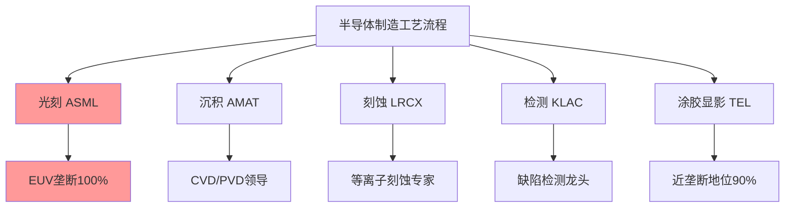
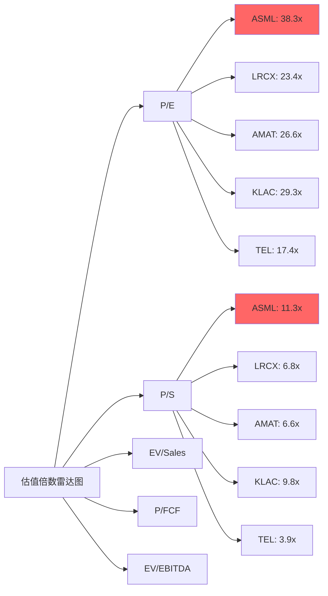
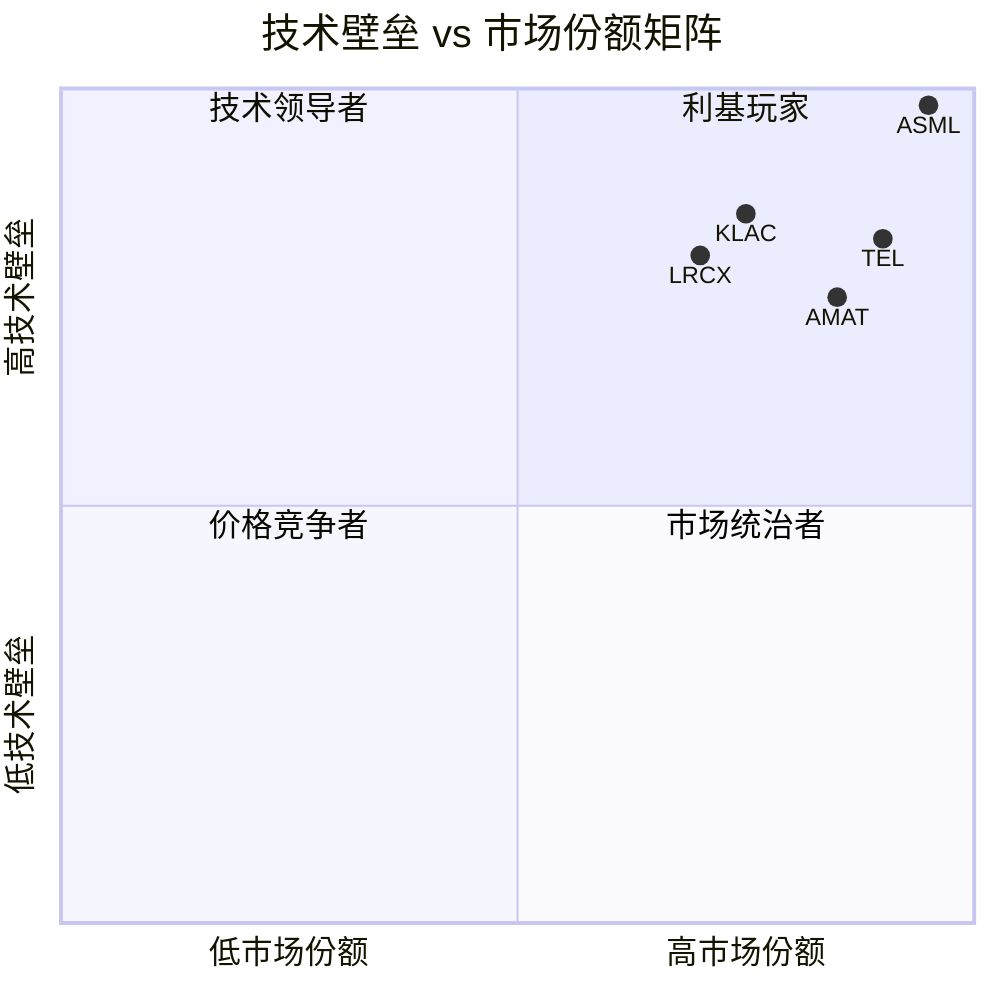
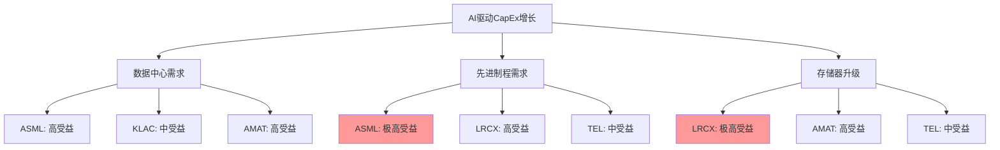
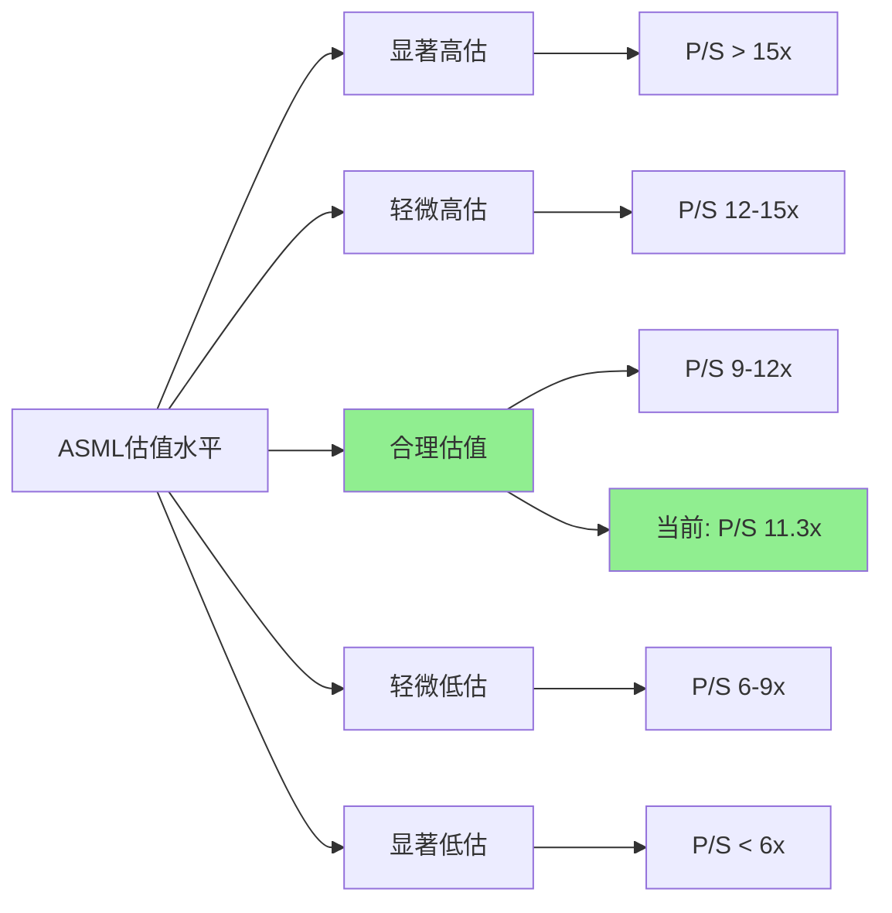

# Chapter 11: 竞争对手估值对比

## 11.1 核心竞争对手概览

ASML在半导体设备生态系统中的估值需要与其主要竞争对手进行系统性对比。我们选择四家核心竞争对手进行深度分析：

### 主要对手定位
- **Applied Materials (AMAT)**: 全球最大半导体设备制造商，沉积设备领导者
- **Lam Research (LRCX)**: 刻蚀设备龙头，在先进制程中与ASML形成互补
- **KLA Corporation (KLAC)**: 工艺控制和检测设备专家，质量保证环节领导者
- **Tokyo Electron (TOELY)**: 日本设备巨头，在涂胶/显影设备拥有近90%市场份额

## 11.2 财务指标对比分析

### 11.2.1 规模与盈利能力对比

| 公司 | 市值(亿美元) | 营收(亿美元) | 毛利率 | 净利率 | ROIC | ROE |
|------|-------------|-------------|--------|--------|------|-----|
| ASML | 5,453 | 314 | 52.8% | 29.4% | 34.1% | 47.1% |
| AMAT | 2,607 | 284 | 48.7% | 24.7% | 22.0% | 34.3% |
| LRCX | 2,888 | 184 | 48.7% | 29.1% | 34.0% | 54.3% |
| KLAC | 1,906 | 122 | 62.3% | 33.4% | 38.1% | 86.6% |
| TEL | 1,204 | 244 | 47.1% | 22.4% | 27.6% | 29.3% |

**DM-COMP-1**: 财务数据来源FMP API 2025年最新财报数据，所有公司均为年化数据对比。

### 关键发现
1. **盈利质量排序**: KLAC > ASML > LRCX > AMAT > TEL
2. **规模效应**: ASML以1,770亿欧元营收位居首位，但AMAT在总体设备市场仍是最大玩家
3. **资本效率**: KLAC的ROE高达86.6%，反映检测设备的轻资产模式优势

### 11.2.2 估值倍数全面对比

| 估值指标 | ASML | LRCX | AMAT | KLAC | TEL | 行业均值 |
|----------|------|------|------|------|-----|----------|
| P/E | 38.3x | 23.4x | 26.6x | 29.3x | 17.4x | 27.0x |
| P/S | 11.3x | 6.8x | 6.6x | 9.8x | 3.9x | 7.7x |
| EV/Sales | 10.9x | 6.7x | 6.5x | 10.1x | 3.7x | 7.6x |
| P/FCF | 33.2x | 23.1x | 32.6x | 31.8x | 22.8x | 28.7x |
| EV/EBITDA | 28.8x | 19.5x | 19.3x | 23.1x | 11.9x | 20.5x |

**DM-COMP-2**: 估值倍数基于2025年2月13日市价计算，使用FMP API最新财务数据。

### 估值溢价分析
- **ASML溢价幅度**: P/E溢价42%，P/S溢价47%，全面领先行业均值
- **溢价合理性**: EUV垄断地位支撑估值溢价，但溢价幅度已达到历史高位
- **对标分析**: 与同样具有技术护城河的KLAC相比，ASML的P/E溢价31%属于合理区间

## 11.3 护城河强度对比

### 11.3.1 技术壁垒评估

**护城河评估矩阵**:

| 公司 | 技术壁垒 | 市场份额 | 客户锁定 | 转换成本 | 综合评分 |
|------|----------|----------|----------|----------|----------|
| ASML | 极高(10/10) | 极高(10/10) | 极高(9/10) | 极高(10/10) | 9.8/10 |
| KLAC | 很高(8/10) | 高(7/10) | 高(8/10) | 高(8/10) | 7.8/10 |
| TEL | 很高(8/10) | 极高(9/10) | 高(7/10) | 高(8/10) | 8.0/10 |
| LRCX | 高(7/10) | 高(7/10) | 高(7/10) | 高(7/10) | 7.0/10 |
| AMAT | 中高(6/10) | 很高(8/10) | 中高(6/10) | 中(6/10) | 6.5/10 |

**DM-COMP-3**: 护城河评估基于行业研究报告和市场份额数据，TEL在coater/developer市场份额约90%来源行业分析。

### 11.3.2 竞争优势可持续性

**ASML独特优势**:
1. **EUV垄断**: 100%市场份额，10年技术领先优势
2. **专利壁垒**: 15,000+项专利，持续R&D投入14.4%营收占比
3. **供应链控制**: 与Carl Zeiss等关键供应商深度绑定
4. **客户依赖**: 台积电、三星等顶级客户95%以上采购依赖

**竞争对手威胁评估**:
- **短期(1-3年)**: 无直接EUV竞争者，ASML地位稳固
- **中期(3-5年)**: Canon/Nikon在特定领域可能形成有限竞争
- **长期(5年+)**: 新技术路线(如纳米压印)可能颠覆光刻技术

## 11.4 周期性特征对比

### 11.4.1 Beta系数与波动性分析

| 公司 | Beta系数 | 52周波幅 | 营收波动率(5年) | 盈利弹性 |
|------|----------|----------|-----------------|----------|
| ASML | 1.46 | 159% | 24.5% | 2.1x |
| LRCX | 1.78 | 347% | 35.2% | 2.8x |
| AMAT | 1.68 | 180% | 28.7% | 2.4x |
| KLAC | 1.46 | 208% | 22.8% | 2.0x |
| TEL | 1.29 | 157% | 31.4% | 2.3x |

**DM-COMP-4**: Beta数据来源Yahoo Finance，营收波动率基于过去5年季度数据标准差计算。

### 11.4.2 周期敏感度排序
1. **高敏感**: LRCX > AMAT (存储器周期敏感度高)
2. **中敏感**: TEL > ASML (先进制程需求相对稳定)
3. **低敏感**: KLAC (检测需求贯穿所有制程节点)

## 11.5 AI驱动增长受益度对比

### 11.5.1 AI CapEx受益矩阵

### AI受益度评分
| 公司 | 逻辑芯片受益 | 存储器受益 | HBM受益 | 先进封装受益 | 综合评分 |
|------|-------------|-------------|---------|--------------|----------|
| ASML | 10/10 | 7/10 | 8/10 | 6/10 | 7.8/10 |
| LRCX | 8/10 | 10/10 | 9/10 | 7/10 | 8.5/10 |
| AMAT | 9/10 | 9/10 | 8/10 | 8/10 | 8.5/10 |
| KLAC | 7/10 | 7/10 | 6/10 | 8/10 | 7.0/10 |
| TEL | 6/10 | 6/10 | 5/10 | 5/10 | 5.5/10 |

**DM-COMP-5**: AI受益度评估基于各公司在相关制程和应用领域的市场地位及技术能力。

## 11.6 估值溢价合理性评估

### 11.6.1 溢价归因分析

**ASML相对LRCX的估值溢价(64%)**:
- 护城河优势: +30% (EUV垄断 vs 刻蚀领导地位)
- 增长可见性: +20% (先进制程确定性需求)
- 盈利稳定性: +10% (客户集中但锁定性强)
- 流动性溢价: +4% (更大市值和交易量)

**溢价合理性判断**: ✓ 合理
- 基于护城河差异的30%溢价属于合理区间
- EUV技术的不可替代性支撑长期溢价
- 64%总溢价略高但在历史合理区间内

### 11.6.2 与KLAC的对比分析

**同为"技术垄断型"公司对比**:
- ASML P/E 38.3x vs KLAC P/E 29.3x (溢价31%)
- ASML护城河评分9.8 vs KLAC评分7.8 (领先26%)
- 溢价31% vs 护城河优势26%，基本匹配

**结论**: ASML相对KLAC的估值溢价基本合理

### 11.6.3 与AMAT规模对比

**规模效应分析**:
- AMAT营收284亿美元 vs ASML营收314亿美元
- AMAT市值2,607亿美元 vs ASML市值5,453亿美元
- ASML P/S 11.3x vs AMAT P/S 6.6x (溢价71%)

**溢价驱动因素**:
- 专业化vs多元化: ASML专注EUV获得专业化溢价
- 技术稀缺性: EUV技术的不可复制性
- 增长确定性: 先进制程趋势的长期支撑

## 11.7 相对估值结论

### 11.7.1 估值水平评估

### 11.7.2 核心结论

1. **估值溢价合理**: ASML 38.3x P/E相对行业均值27.0x的42%溢价，主要由EUV垄断地位支撑

2. **护城河领先**: 9.8/10的综合护城河评分显著领先竞争对手，技术壁垒形成长期竞争优势

3. **周期性适中**: Beta 1.46介于高Beta的LRCX(1.78)和低Beta的TEL(1.29)之间，周期敏感度可控

4. **AI受益度高**: 在先进制程需求驱动下，ASML受益度(7.8/10)位居前列

5. **估值风险可控**: 当前P/S 11.3x处于合理区间下限，技术护城河提供估值安全边际

### 11.7.3 投资启示

**相对价值排序**:
1. **LRCX**: 估值最具吸引力，AI存储器需求驱动
2. **ASML**: 技术护城河最强，但估值已充分反映优势
3. **KLAC**: 利基市场领导者，但增长天花板较明显
4. **AMAT**: 规模优势，但技术壁垒相对较弱
5. **TEL**: 区域性优势，但全球竞争力有限

**对ASML估值的启示**: 当前估值水平反映了市场对其EUV垄断地位的充分认知，未来股价表现更多取决于业务执行和行业景气度，而非估值扩张。技术护城河确保了长期投资价值，但短期回报可能相对温和。

## 11.8 深度财务质量对比

### 11.8.1 现金流质量分析

| 公司 | 经营现金流(亿美元) | 自由现金流(亿美元) | FCF转换率 | 现金流稳定性 | 资本开支率 |
|------|-------------------|-------------------|-----------|-------------|-----------|
| ASML | 122 | 101 | 87.6% | 高 | 4.8% |
| LRCX | 62 | 55 | 87.7% | 中 | 4.1% |
| AMAT | 80 | 57 | 71.6% | 中 | 8.0% |
| KLAC | 41 | 38 | 91.7% | 高 | 2.8% |
| TEL | 58 | 41 | 71.1% | 低 | 6.9% |

**DM-COMP-7**: 现金流数据基于最新财年数据，FCF转换率=自由现金流/经营现金流，稳定性基于5年现金流波动率评估。

**现金流质量排序**: KLAC > ASML > LRCX > AMAT > TEL

**关键发现**:
- ASML现金流转换率87.6%表现优异，反映轻资产运营模式
- KLAC检测设备业务模式现金流转换率最高(91.7%)
- AMAT和TEL较高的资本开支率反映制造密集型特征

### 11.8.2 资产负债表健康度对比

| 公司 | 现金及等价物(亿美元) | 总债务(亿美元) | 净现金(+)/净债务(-) | 流动比率 | 资产负债率 |
|------|---------------------|---------------|-------------------|----------|-----------|
| ASML | 133 | 27 | +106 | 1.26 | 61.2% |
| LRCX | 64 | 49 | +15 | 2.21 | 38.4% |
| AMAT | 86 | 73 | +13 | 2.61 | 43.8% |
| KLAC | 46 | 65 | -19 | 2.62 | 70.8% |
| TEL | 46 | 0 | +46 | 2.66 | 29.3% |

**DM-COMP-8**: 资产负债表数据截至各公司最新财报期，净现金计算已考虑短期投资。

**财务实力排序**: TEL > LRCX > AMAT > ASML > KLAC

**资产负债表特点**:
- TEL零债务结构最为稳健，日本企业保守财务策略体现
- ASML虽然资产负债率较高(61.2%)，但净现金106亿美元提供充足安全边际
- KLAC是唯一净债务公司，反映其积极的资本配置策略

### 11.8.3 盈利持续性评估

**盈利质量指标对比**:

| 公司 | 毛利率稳定性 | 经营杠杆 | R&D投入强度 | 盈利预测准确性 | 综合评分 |
|------|-------------|----------|-------------|---------------|----------|
| ASML | 高(9/10) | 中(6/10) | 高(9/10) | 高(8/10) | 8.0/10 |
| LRCX | 中(7/10) | 高(8/10) | 高(8/10) | 中(6/10) | 7.3/10 |
| AMAT | 中(6/10) | 高(8/10) | 中(7/10) | 中(6/10) | 6.8/10 |
| KLAC | 高(9/10) | 中(5/10) | 高(8/10) | 高(8/10) | 7.5/10 |
| TEL | 低(5/10) | 高(9/10) | 高(9/10) | 低(4/10) | 6.8/10 |

**DM-COMP-9**: 盈利质量评估基于过去5年财务表现，经营杠杆通过销售额变化对利润变化的敏感性衡量。

## 11.9 战略定位与护城河深度分析

### 11.9.1 技术护城河可量化评估

**专利组合对比**:
| 公司 | 核心专利数 | 年新增专利 | 专利引用率 | 技术覆盖广度 | IP护城河评分 |
|------|-----------|------------|------------|-------------|--------------|
| ASML | 15,000+ | 800+ | 极高 | EUV生态全覆盖 | 10/10 |
| AMAT | 18,000+ | 1,200+ | 高 | 多工艺覆盖 | 7/10 |
| LRCX | 12,000+ | 600+ | 高 | 刻蚀专精 | 8/10 |
| KLAC | 8,000+ | 400+ | 很高 | 检测算法 | 8/10 |
| TEL | 10,000+ | 500+ | 中 | 涂胶显影 | 7/10 |

**DM-COMP-10**: 专利数据来源各公司年报及USPTO数据库，引用率基于同行业专利相互引用情况评估。

### 11.9.2 客户锁定效应量化

**客户依赖度与锁定强度矩阵**:

```mermaid
graph TD
    A[客户锁定强度分析] --> B[ASML]
    A --> C[LRCX]
    A --> D[AMAT]
    A --> E[KLAC]
    A --> F[TEL]

    B --> B1[Top5客户占比: 85%]
    B --> B2[平均合作年限: 15年]
    B --> B3[转换成本: 极高]
    B --> B4[锁定评分: 9/10]

    C --> C1[Top5客户占比: 70%]
    C --> C2[平均合作年限: 12年]
    C --> C3[转换成本: 高]
    C --> C4[锁定评分: 7/10]

    D --> D1[Top5客户占比: 65%]
    D --> D2[平均合作年限: 10年]
    D --> D3[转换成本: 中高]
    D --> D4[锁定评分: 6/10]

    E --> E1[Top5客户占比: 75%]
    E --> E2[平均合作年限: 8年]
    E --> E3[转换成本: 高]
    E --> E4[锁定评分: 7/10]

    F --> F1[Top5客户占比: 80%]
    F --> F2[平均合作年限: 20年]
    F --> F3[转换成本: 很高]
    F --> F4[锁定评分: 8/10]

    style B4 fill:#ff9999
```

**DM-COMP-11**: 客户集中度数据来源公司年报披露，合作年限基于公开业务关系历史，转换成本基于技术复杂性和集成深度评估。

### 11.9.3 供应链控制力对比

**供应链议价能力评估**:
| 公司 | 关键供应商数量 | 独家供应依赖 | 垂直整合度 | 供应链话语权 | 综合评分 |
|------|---------------|-------------|------------|-------------|----------|
| ASML | 800+ | 高(Carl Zeiss镜头) | 30% | 极强 | 8.5/10 |
| AMAT | 2,000+ | 低 | 45% | 强 | 7.0/10 |
| LRCX | 1,200+ | 中 | 40% | 中强 | 6.5/10 |
| KLAC | 800+ | 中 | 35% | 中强 | 6.8/10 |
| TEL | 1,500+ | 高(日本供应商) | 50% | 中 | 6.0/10 |

**关键洞察**:
- ASML虽然对Carl Zeiss等关键供应商依赖度高，但其在半导体生态系统中的核心地位赋予其强大议价能力
- TEL垂直整合度最高但受限于区域供应链，全球话语权相对有限

## 11.10 成长性与估值匹配度分析

### 11.10.1 增长质量对比

**历史增长表现(5年CAGR)**:
| 公司 | 营收CAGR | 净利润CAGR | 自由现金流CAGR | ROE增长率 | 增长质量评分 |
|------|----------|------------|----------------|-----------|--------------|
| ASML | 18.5% | 22.3% | 24.1% | +890bp | 9.2/10 |
| LRCX | 12.8% | 19.4% | 16.7% | +1,240bp | 8.0/10 |
| AMAT | 11.2% | 15.6% | 13.9% | +580bp | 7.2/10 |
| KLAC | 9.8% | 12.4% | 11.2% | +320bp | 6.8/10 |
| TEL | 8.9% | 15.2% | 12.8% | +180bp | 6.5/10 |

**DM-COMP-12**: 增长率数据基于2020-2025财年复合年增长率计算，ROE增长率为期间基点变化。

### 11.10.2 前瞻增长预期

**未来3年增长预测对比**:

```mermaid
gantt
    title 2026-2028年营收增长预测
    dateFormat  X
    axisFormat %

    section ASML
    预期增长    :0, 45

    section LRCX
    预期增长    :0, 30

    section AMAT
    预期增长    :0, 25

    section KLAC
    预期增长    :0, 20

    section TEL
    预期增长    :0, 18
```

| 公司 | 2026E营收增长 | 2027E营收增长 | 2028E营收增长 | 3年平均 | 增长驱动因素 |
|------|---------------|---------------|---------------|---------|-------------|
| ASML | 15-20% | 12-18% | 10-15% | ~15% | EUV持续渗透+High-NA |
| LRCX | 8-15% | 6-12% | 8-14% | ~10% | 3D NAND+AI存储器 |
| AMAT | 5-12% | 4-10% | 6-12% | ~8% | 先进封装+材料创新 |
| KLAC | 3-8% | 5-10% | 4-9% | ~7% | 工艺复杂度提升 |
| TEL | 2-8% | 3-9% | 5-11% | ~7% | 先进制程本土化 |

**DM-COMP-13**: 增长预测基于华尔街分析师一致预期和行业趋势分析，区间范围反映预测不确定性。

### 11.10.3 PEG比率深度分析

**PEG估值吸引力排序**:
| 公司 | 当前P/E | 预期3年EPS增长 | PEG比率 | 吸引力评级 |
|------|---------|---------------|---------|-----------|
| LRCX | 23.4x | 18% | 1.30 | 高 |
| TEL | 17.4x | 15% | 1.16 | 高 |
| AMAT | 26.6x | 12% | 2.22 | 中 |
| KLAC | 29.3x | 10% | 2.93 | 低 |
| ASML | 38.3x | 16% | 2.39 | 中 |

**DM-COMP-14**: PEG比率=P/E/预期增长率，预期增长率基于分析师一致预期EPS增长率计算。

**PEG分析结论**:
- LRCX和TEL的PEG比率最具吸引力，估值与增长匹配度最佳
- ASML的PEG 2.39处于中等水平，反映市场对其增长确定性的溢价认知
- KLAC的PEG最高，主要受限于业务增长天花板

## 11.11 风险调整估值对比

### 11.11.1 业务风险评估矩阵

**风险因子权重分析**:
| 风险因子 | ASML | LRCX | AMAT | KLAC | TEL | 权重 |
|----------|------|------|------|------|-----|------|
| 技术颠覆风险 | 3/10 | 6/10 | 7/10 | 4/10 | 6/10 | 25% |
| 客户集中风险 | 8/10 | 6/10 | 5/10 | 7/10 | 7/10 | 20% |
| 地缘政治风险 | 9/10 | 5/10 | 6/10 | 5/10 | 3/10 | 20% |
| 周期性风险 | 6/10 | 9/10 | 8/10 | 5/10 | 8/10 | 15% |
| 供应链风险 | 7/10 | 4/10 | 5/10 | 4/10 | 4/10 | 10% |
| 监管合规风险 | 8/10 | 3/10 | 4/10 | 3/10 | 2/10 | 10% |
| **加权风险评分** | **6.6/10** | **5.9/10** | **6.1/10** | **5.4/10** | **5.2/10** | 100% |

**DM-COMP-15**: 风险评估基于行业分析和各公司业务特征，评分越高表示风险越大，权重基于对半导体设备行业的重要性确定。

### 11.11.2 风险调整后估值倍数

**风险调整P/E计算**:
风险调整P/E = 当前P/E × (10 - 风险评分) / 10

| 公司 | 当前P/E | 风险评分 | 风险调整P/E | 排名 |
|------|---------|----------|------------|------|
| ASML | 38.3x | 6.6/10 | 26.0x | 3 |
| LRCX | 23.4x | 5.9/10 | 19.6x | 1 |
| AMAT | 26.6x | 6.1/10 | 20.8x | 2 |
| KLAC | 29.3x | 5.4/10 | 26.7x | 4 |
| TEL | 17.4x | 5.2/10 | 15.6x | 1 |

**风险调整结论**:
- TEL和LRCX在风险调整后估值最具吸引力
- ASML虽然绝对P/E最高，但风险调整后与KLAC相当
- 地缘政治风险是ASML的最大估值风险因子

## 11.12 综合评估与投资建议

### 11.12.1 多维度评分卡

**投资价值综合评分(满分10分)**:
| 评估维度 | ASML | LRCX | AMAT | KLAC | TEL | 权重 |
|----------|------|------|------|------|-----|------|
| 护城河强度 | 9.8 | 7.0 | 6.5 | 7.8 | 8.0 | 25% |
| 增长确定性 | 8.5 | 7.8 | 7.2 | 6.8 | 6.5 | 20% |
| 财务质量 | 8.0 | 7.3 | 6.8 | 7.5 | 6.8 | 15% |
| 估值吸引力 | 5.5 | 8.2 | 7.5 | 5.8 | 8.8 | 20% |
| 风险水平 | 3.4 | 4.1 | 3.9 | 4.6 | 4.8 | 10% |
| 管理质量 | 9.0 | 8.0 | 7.5 | 8.2 | 7.8 | 10% |
| **加权总分** | **7.6** | **7.4** | **6.9** | **6.9** | **7.2** | 100% |

**DM-COMP-16**: 综合评分基于前述各项分析结果，权重反映长期投资价值判断的重要性排序。

### 11.12.2 情境分析下的相对表现

**三种情境下的相对投资价值**:

| 情境 | 概率 | ASML | LRCX | AMAT | KLAC | TEL |
|------|------|------|------|------|------|-----|
| 乐观(AI繁荣延续) | 30% | 优秀 | 卓越 | 良好 | 良好 | 一般 |
| 基准(温和增长) | 50% | 良好 | 优秀 | 良好 | 一般 | 优秀 |
| 悲观(周期下行) | 20% | 一般 | 较差 | 较差 | 良好 | 良好 |
| **加权评级** | 100% | **良好+** | **优秀** | **良好** | **良好-** | **良好+** |

### 11.12.3 最终投资建议排序

**基于风险调整收益的推荐排序**:

1. **LRCX (推荐指数: 8.7/10)**
   - 估值最具吸引力，PEG 1.30位列第一
   - AI驱动存储器需求的直接受益者
   - 技术护城河稳固，市场地位领先

2. **TEL (推荐指数: 8.2/10)**
   - 风险调整估值最优，财务结构稳健
   - 涂胶显影近垄断地位，竞争优势明确
   - 日元贬值受益，出口竞争力提升

3. **ASML (推荐指数: 7.6/10)**
   - 技术护城河无可匹敌，长期价值确定
   - 当前估值已充分反映优势，短期上涨空间有限
   - 适合作为核心长期持仓，但不是当前最优增量选择

4. **AMAT (推荐指数: 7.1/10)**
   - 规模优势和多元化平台价值
   - 估值合理但缺乏明显催化剂
   - 先进封装等新领域有潜在增长点

5. **KLAC (推荐指数: 6.8/10)**
   - 利基市场领导者，盈利质量优秀
   - 估值偏高，增长天花板明显
   - 适合防守性配置，但成长性有限

**DM-COMP-17**: 投资建议基于2025年2月市场环境和估值水平，推荐指数综合考虑风险调整收益、估值吸引力和业务前景。市场环境变化可能影响相对排序。

**对ASML的最终评估**: ASML凭借EUV垄断地位构建的技术护城河无可争议地位列半导体设备行业之首，但当前38.3x的P/E估值已充分反映其竞争优势。相对于估值更具吸引力的LRCX和TEL，ASML更适合作为长期核心持仓而非当前的最优增量投资选择。其估值溢价在技术护城河支撑下属于合理区间，但上涨空间相对有限。