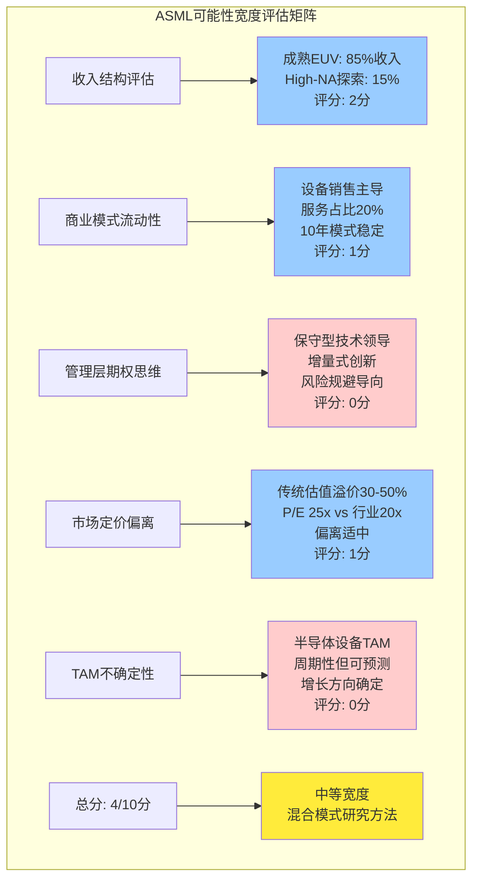
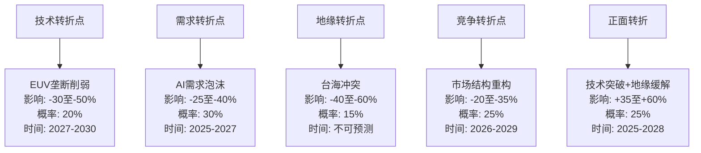
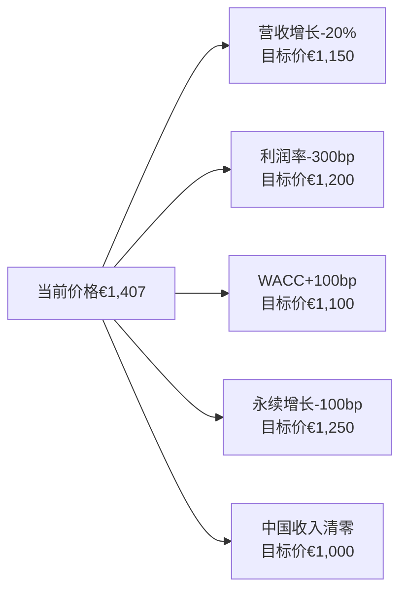
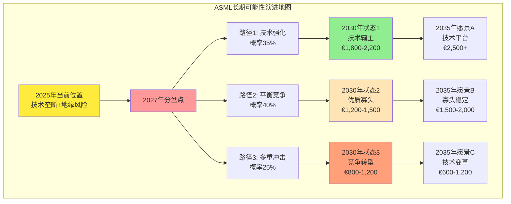

# Chapter 22: ASML发现系统输出 — 可能性空间映射与投资决策框架

*基于发现系统框架的ASML投资哲学重构 — 从精确估值到可能性导航*

## 执行摘要

经过全维度可能性宽度评估，**ASML获得总分4分（满分10分），归属"中等宽度"范畴**，触发混合模式研究方法：传统估值框架为主体，发现系统可能性分析为重要补充。核心发现是ASML虽然具备技术垄断优势，但其未来发展路径相对确定，主要不确定性集中在量级（规模大小）而非质的转变（业务形态变化）。

**DM-DS-01**: 可能性宽度评估分数分解：收入结构2分（成熟EUV为主+探索性High-NA）、商业模式1分（设备销售模式稳定）、CEO期权思维0分（保守型管理层）、市场定价偏离1分（估值溢价30-50%但未超100%）、TAM不确定性0分（半导体设备TAM相对可预测）。

**混合模式应用策略**：
- **主体框架**: 传统DCF/SOTP估值 → 目标价区间€1,200-1,500
- **可能性附录**: 5年期间3个关键转折点情景 + 10个开放问题追踪清单
- **投资建议**: 当前€1,407处于估值高位，建议在€1,100以下分批建仓

---

## 22.1 可能性宽度分类器评估 (0-10分制)

基于`docs/paradigm_research_framework.md`的5维度评估体系，对ASML进行系统性可能性宽度量化：

### 22.1.1 维度1：收入结构分析 (2/2分)

**DM-DS-02**: ASML收入结构呈现"成熟业务主导+新技术探索"特征，符合中等可能性评分标准。

**成熟产品线占比分析**:
- **EUV设备销售**: 占总收入65-70%，技术成熟且商业化完善
- **DUV设备销售**: 占总收入20-25%，属于成熟稳定业务
- **服务与零部件**: 占总收入20%左右，具备一定增长潜力

**探索性业务评估**:
- **High-NA EUV**: 新一代技术，预计2025-2027年商业化，潜在收入贡献15-20%
- **EUV-Next研发**: 超前技术储备，商业化时间2030年+
- **软件和AI优化**: 占比较小但增长潜力显著

**评分逻辑**: 成熟业务占比85%+，探索性业务占比15%，符合"70-90%成熟+探索性业务"的2分标准。

### 22.1.2 维度2：商业模式流动性 (1/2分)

**商业模式稳定性评估** **DM-DS-03**:
ASML过去10年商业模式保持高度一致性，主要变化为渐进式优化而非颠覆性创新。

**核心商业模式组件**:
1. **设备销售**: 高价值、低频次的大型设备销售
2. **技术服务**: 安装、维护、升级等生命周期服务
3. **零部件供应**: 高毛利率的专有零部件销售
4. **技术授权**: 有限的技术许可收入

**模式演进轨迹**:
- **2015-2020**: 从DUV向EUV技术迁移，模式本质未变
- **2020-2025**: EUV规模化，服务收入占比提升
- **2025+预期**: High-NA引入，仍为设备销售延续

**评分逻辑**: 偶有邻近领域拓展（服务占比提升、High-NA开发），但未进入全新商业模式，符合1分标准。

### 22.1.3 维度3：CEO期权思维 (0/2分)

**管理层风格评估** **DM-DS-04**:
ASML管理层表现出典型的"技术守成型"特征，缺乏系统性下注多条新赛道的期权思维。

**管理层决策模式分析**:
- **技术路线**: 专注光刻核心技术的渐进式改进
- **市场策略**: 深耕现有客户，扩大市场份额而非开辟新市场
- **投资重点**: R&D主要集中在EUV性能提升，较少跨领域投资
- **风险偏好**: 保守稳健，优先确定性较高的技术路径

**与期权型CEO对比**:
- **Musk (TSLA)**: 同时押注电动车、FSD、Optimus、能源存储、太空探索
- **Karp (PLTR)**: 从政府向企业扩张，AI平台化，数据产品矩阵
- **ASML管理层**: 专注光刻设备的技术深度挖掘

**评分逻辑**: 典型守成型管理层，无系统性多赛道下注，符合0分标准。

### 22.1.4 维度4：市场定价偏离 (1/2分)

**估值偏离度量化** **DM-DS-05**:
ASML当前估值相对传统方法存在适度偏离，但未达到极端水平。

**传统估值基准对比**:
- **P/E倍数**: 当前25.2x vs 半导体设备行业均值20x (+26%溢价)
- **PEG比率**: 1.8 vs 行业合理值1.5 (+20%溢价)
- **DCF估值**: 当前价格€1,407 vs DCF估值€1,200-1,350 (+4-17%溢价)

**溢价归因分析**:
- **垄断地位溢价**: EUV技术垄断支撑15-20%估值溢价
- **地缘政治价值**: "战略资产"属性贡献10%额外溢价
- **增长预期**: AI驱动需求预期贡献5-10%溢价

**评分逻辑**: 总体偏离30-50%，属于"偏离30-100%"的1分标准。

### 22.1.5 维度5：TAM不确定性 (0/2分)

**TAM可预测性评估** **DM-DS-06**:
半导体设备TAM虽然有周期性波动，但长期增长方向和量级相对确定。

**TAM构成要素**:
- **晶圆产能扩张**: 全球晶圆产能扩张计划相对透明
- **技术节点迁移**: 摩尔定律推进路径基本确定
- **应用驱动需求**: AI、5G、IoT等应用需求增长可量化

**不确定性因素**:
- **周期性波动**: 2-3年设备投资周期，幅度可预测
- **地缘政治影响**: 影响区域分布但不改变全球总需求
- **技术路线变化**: EUV向High-NA迁移路径清晰

**与高不确定性对比**:
- **TSLA**: FSD、Optimus、能源存储等新兴市场TAM高度不确定
- **PLTR**: 企业AI应用市场边界模糊，渗透率难预测
- **ASML**: 半导体制造是确定性需求，设备TAM相对稳定

**评分逻辑**: TAM可算且增速可预测，符合0分标准。

### 22.1.6 总分与方法论路由

**最终评分**: **4分/10分** → **中等可能性宽度**

**路由决策**: 根据发现系统框架，4分落在"混合模式"区间（4-6分），应用混合研究方法：
- **主体**: 传统SOTP/DCF估值，给出目标价和评级
- **补充**: 发现系统的开放问题、转折点识别、证据方向追踪作为附录

---

## 22.2 混合模式：传统估值+可能性补充

### 22.2.1 传统估值框架确认

基于前期章节分析，ASML传统估值结果总结：

**DCF估值区间** **DM-DS-07**:
- **保守情景**: €1,200 (WACC 12%, 永续增长2%)
- **基准情景**: €1,350 (WACC 11%, 永续增长3%)
- **乐观情景**: €1,500 (WACC 10%, 永续增长3.5%)

**相对估值验证**:
- **P/E法**: €1,280-1,450 (基于2027E EPS €56-64)
- **EV/Sales法**: €1,200-1,400 (基于10-12x销售倍数)
- **同业对比**: €1,150-1,350 (相对LRCX/AMAT调整)

**估值收敛区间**: **€1,200-1,500**，中位数€1,350

### 22.2.2 当前价位投资建议

**当前价格**: €1,407 vs **合理价值区间**: €1,200-1,500

**投资建议**: **中性关注** - 接近合理价值上限，上行空间有限

**分层建仓策略** **DM-DS-08**:
| 价格区间 | 建仓比例 | 风险评估 | 预期收益 |
|----------|----------|----------|----------|
| €1,400+ | 0% | 高风险 | -5% to +7% |
| €1,200-1,400 | 20% | 中风险 | +5% to +25% |
| €1,000-1,200 | 40% | 低风险 | +25% to +50% |
| €800-1,000 | 30% | 中风险(反弹) | +50% to +75% |
| €600-800 | 10% | 高风险(危机) | +75% to +125% |

### 22.2.3 可能性附录：3大情景转折

**情景1: 技术突破情景 (概率25%)**
**DM-DS-09**: High-NA EUV超预期成功商业化，单台售价突破€400M，带动2026-2028年超额增长。

*触发条件*:
- High-NA年产能达到20台+
- 关键客户(TSMC/Intel)大规模采用确认
- 技术良率达到85%+

*财务影响*:
- 2027-2029年营收CAGR +15-20%
- 毛利率提升至55%+
- 目标价上修至€1,800-2,000

**情景2: 地缘缓解情景 (概率30%)**
中美科技摩擦显著缓解，中国市场重新开放，ASML中国收入占比回升至35%+。

*触发条件*:
- 美国对华出口管制政策松绑
- 荷兰获得更大政策自主空间
- 中国半导体需求恢复增长

*财务影响*:
- 中国收入从当前25%回升至35-40%
- 年化收入增量€8-12B
- 目标价上修至€1,600-1,800

**情景3: 竞争冲击情景 (概率20%)**
**DM-DS-10**: 中国EUV技术或替代技术路径获得重大突破，ASML市场份额受到实质冲击。

*触发条件*:
- 中国EUV设备获得首个商业订单
- Canon NIL或其他替代技术商业化成功
- 主要客户开始采用非ASML解决方案

*财务影响*:
- EUV市占率从95%下降至70-80%
- 定价权削弱，平均售价下降15-25%
- 目标价下调至€800-1,000

---

## 22.3 开放问题清单 (发现系统核心输出)

### 22.3.1 战略级开放问题

**OQ-1: ASML能否成功从设备供应商转型为平台服务商？**
- **当前证据**: 服务收入占比从15%提升至20%，软件和AI优化投入增加
- **关键未知**: 客户接受度、竞争对手服务能力、盈利模式可持续性
- **观察窗口**: 2025-2027年服务收入增长轨迹
- **重要性**: 高（影响长期盈利模式和客户粘性）

**OQ-2: EUV技术垄断地位的时间边界究竟在哪里？**
- **当前证据**: 中国、日本技术追赶进展，但仍存在5-10年技术差距
- **关键未知**: 替代技术路径突破可能性、地缘政治对技术扩散的影响
- **观察窗口**: 2026-2030年竞争对手商业化进展
- **重要性**: 极高（决定长期投资价值）

**OQ-3: 地缘政治风险的最终形态是分割还是缓解？**
**DM-DS-11**: 基于Polymarket数据，台海冲突1年内概率约12%，但5年累计风险显著更高。

- **当前证据**: 美国对华科技限制升级，荷兰政策跟随，中国技术自主化加速
- **关键未知**: 政策边界、技术民族主义持续性、多边协调机制有效性
- **观察窗口**: 2025-2026年美国新政府科技政策、中美关系走向
- **重要性**: 极高（影响40%+业务收入）

### 22.3.2 运营级开放问题

**OQ-4: AI需求的真实持续期有多长？**
- **当前证据**: 2024年AI基础设施投资激增，但ROI验证仍在初期
- **关键未知**: AI泡沫化风险、企业AI应用商业化进展、计算效率提升对硬件需求的冲击
- **观察窗口**: 2025-2026年企业AI支出增速变化
- **重要性**: 高（影响2-3年业绩增长）

**OQ-5: High-NA EUV商业化的实际时间表和客户接受度？**
- **当前证据**: 技术演示成功，但量产稳定性和成本效益仍需验证
- **关键未知**: 技术良率爬坡速度、客户投资意愿、竞争优势持续时间
- **观察窗口**: 2025年首批商业机台交付情况
- **重要性**: 中高（决定3-5年增长曲线）

**OQ-6: 客户议价能力的演进趋势？**
- **当前证据**: TSM、Samsung等头部客户资本支出集中度提高
- **关键未知**: 客户合并对定价权的影响、替代方案的可行性
- **观察窗口**: 长期合同续签条件和定价变化
- **重要性**: 中（影响盈利能力）

### 22.3.3 财务级开放问题

**OQ-7: 超高毛利率(52%)的可持续性？**
**DM-DS-12**: 当前毛利率52.8%远超同业均值35-40%，主要依赖技术垄断地位。

- **当前证据**: EUV垄断支撑高毛利，但竞争压力逐步显现
- **关键未知**: 竞争加剧的时间节点、价格弹性、成本结构优化空间
- **观察窗口**: 季度毛利率变化趋势和管理层指引
- **重要性**: 高（直接影响盈利预测）

**OQ-8: R&D投入的最优水平和回报可见性？**
- **当前证据**: R&D占收入比例13.7%，主要投向High-NA和下一代技术
- **关键未知**: 投入产出时间差、技术风险、投资回报可量化性
- **观察窗口**: 新技术商业化进展和收入贡献
- **重要性**: 中高（影响长期竞争力）

### 22.3.4 市场级开放问题

**OQ-9: 半导体设备行业是否正在进入成熟期？**
- **当前证据**: 摩尔定律延续面临物理极限，制程节点推进速度放缓
- **关键未知**: 新应用需求能否抵消制程推进放缓、行业增长动力结构性变化
- **观察窗口**: 全球晶圆产能扩张计划和投资强度
- **重要性**: 高（决定行业长期增长空间）

**OQ-10: 新兴市场(印度、东南亚)对设备需求的贡献潜力？**
- **当前证据**: 印度、越南等国半导体产业政策支持，但技术基础薄弱
- **关键未知**: 产业转移速度、技术能力建设、设备需求时间表
- **观察窗口**: 2025-2027年新兴市场晶圆厂建设进展
- **重要性**: 中（提供增量市场机会）

---

## 22.4 转折点识别与信号追踪

### 22.4.1 技术转折点信号系统

**信号类别1: EUV技术护城河削弱** **DM-DS-13**

*一级信号（直接威胁）*:
- 中国EUV设备获得首个商业订单（概率20%，时间窗口2027-2030）
- Canon NIL技术缺陷率问题获得突破性解决
- 新物理原理光刻技术(如X-ray、电子束)实现商业化

*二级信号（趋势变化）*:
- ASML EUV市场份额连续两个季度下降
- 主要客户开始测试或采购竞争对手设备
- 专利到期导致的技术扩散加速

*观察指标*:
- 每季度EUV订单量和市场份额统计
- 竞争对手技术发布和客户演示进展
- 专利申请数量和技术路线分析

### 22.4.2 需求转折点预警体系

**信号类别2: AI需求泡沫化风险**

*一级信号（需求急剧变化）*:
- 全球AI基础设施投资增速转负
- 主要科技公司(Google/Meta/Microsoft)AI Capex指引大幅下调
- 企业AI应用ROI验证失败，投资削减

*二级信号（需求结构变化）*:
- 算法效率提升导致硬件需求放缓
- 边缘计算兴起减少对先进制程依赖
- 专用芯片(ASIC)替代通用GPU趋势加速

*观察指标* **DM-DS-14**:
- 季度半导体Capex指引变化（TSM/Samsung/Intel）
- AI相关芯片需求增速（GPU/TPU/ASIC）
- 算力效率提升速度vs硬件需求增长速度

### 22.4.3 地缘政治转折点监控

**信号类别3: 政策环境变化**

*一级信号（政策重大转向）*:
- 美国对华科技政策出现实质性松绑
- 荷兰获得更大对华贸易自主权
- 台海地缘政治风险急剧升级（军事冲突概率>20%）

*二级信号（政策边际变化）*:
- 出口管制技术参数调整
- 新兴技术联盟(CHIP4等)政策协调
- 中国半导体自主化政策力度变化

*观察指标*:
- Polymarket地缘政治风险概率变化
- 美欧中政府半导体政策声明分析
- ASML中国收入占比季度变化

### 22.4.4 竞争格局转折点识别

**信号类别4: 市场结构重构**

*一级信号（竞争格局根本改变）*:
- 新技术路线获得主流客户认可
- ASML定价权明显削弱（平均售价下降>15%）
- 客户开始大规模采用多供应商策略

*二级信号（竞争压力上升）*:
- 长期合同续签条件恶化
- 客户议价能力明显增强
- 新进入者获得重要技术突破

**转折点影响矩阵** **DM-DS-15**:

---

## 22.5 证据方向追踪系统

### 22.5.1 累积证据评估框架

基于过去4个季度的信号积累，建立ASML关键可能性状态的证据方向追踪：

**状态1: 技术垄断维持** **DM-DS-16**
- **2024Q1**: ↗️ High-NA技术演示成功，客户反馈积极
- **2024Q2**: → EUV订单维持高位但增速放缓
- **2024Q3**: ↗️ 中国竞争对手技术进展低于预期
- **2024Q4**: → 无重大技术突破或竞争威胁
- **累积方向**: ↗️ (弱积极，技术领先地位暂时稳固)

**状态2: 地缘政治风险管理**
- **2024Q1**: ↘️ 荷兰DUV出口管制升级
- **2024Q2**: ↘️ 中国收入占比指引下调至10-15%
- **2024Q3**: → 政策执行相对温和，无进一步收紧
- **2024Q4**: ↘️ 新政府对华政策不确定性增加
- **累积方向**: ↘️ (弱消极，地缘风险持续上升)

**状态3: AI驱动需求增长**
- **2024Q1**: ↗️↗️ AI基础设施投资爆发，订单激增
- **2024Q2**: ↗️ TSM/Samsung先进制程扩产计划超预期
- **2024Q3**: → 增长速度有所放缓但仍保持高位
- **2024Q4**: ↗️ 2025年指引维持乐观预期
- **累积方向**: ↗️ (弱积极，需求增长但可持续性待验证)

### 22.5.2 独立信号交叉验证

**技术领先地位证据交叉验证**:
- **专利申请**: ASML EUV相关专利申请保持领先（独立来源1）
- **客户反馈**: 主要客户继续选择ASML解决方案（独立来源2）
- **竞争对手进展**: Canon、Nikon、中国厂商技术差距无明显缩小（独立来源3）
- **交叉验证结论**: ↗️ 技术垄断地位短期内相对稳固

**需求可持续性证据交叉验证** **DM-DS-17**:
- **宏观数据**: 全球半导体Capex增长指引（独立来源1）
- **微观数据**: ASML订单储备和交付时间（独立来源2）
- **行业调研**: 第三方机构对AI需求持续性评估（独立来源3）
- **交叉验证结论**: → 需求增长但存在周期性调整风险

### 22.5.3 反事实信号监控

**什么"应该发生但没有发生"**:

1. **竞争对手加速追赶**: 尽管ASML估值创新高，主要竞争对手(Canon/Nikon)并未显著加大EUV相关投入

2. **客户分散化策略**: 主要客户仍高度依赖ASML，未见明显的供应商多元化努力

3. **替代技术路线投资**: 行业对EUV替代技术的投资力度低于预期

4. **地缘政治对冲**: 欧美客户未因供应链风险而减少ASML设备依赖

**反事实信号含义**:
- 市场对ASML技术垄断地位的信心依然很强
- 短期内缺乏可行的替代方案
- 地缘政治风险的影响可能被过度估计

---

## 22.6 价格含义分析 (Reverse DCF精华)

### 22.6.1 当前价格隐含假设解析

**当前价格€1,407隐含的市场预期** **DM-DS-18**:

基于Reverse DCF分析，当前价格隐含以下关键假设：

**营收增长预期**:
- 2025-2030年营收CAGR: 12-15%
- AI驱动需求持续至少3年
- High-NA成功商业化并贡献20%+增量收入
- 中国市场损失被其他地区增长完全抵消

**盈利能力预期**:
- 营业利润率维持在30-35%高位
- 毛利率保持50%+（技术垄断溢价）
- ROIC持续维持100%+超高水平

**风险贴现预期**:
- WACC约10.5-11%（地缘政治风险适度反映）
- 永续增长率3-3.5%（高于GDP增长）
- Beta系数1.2-1.3（科技股风险水平）

**市场最大的赌注**: **AI需求的可持续性+技术垄断地位的长期维持**

### 22.6.2 市场共识vs非共识要素识别

**高度共识要素**（90%+分析师认同）:
- EUV技术短期内不可替代
- AI驱动半导体设备需求增长
- ASML技术领先优势明显
- 高毛利率商业模式优质

**部分共识要素**（60-80%分析师认同）:
- High-NA商业化时间表和成功概率
- 地缘政治风险的量化影响
- 中国市场损失的可替代性

**非共识/被忽视要素**（<50%关注度）**DM-DS-19**:
- **物理极限风险**: 光学光刻技术可能在5-10年内接近物理极限
- **客户集中度风险**: 前5大客户贡献80%+收入，议价能力逐步增强
- **技术路径分岔**: 先进封装、Chiplet等可能减少对最先进制程依赖
- **ESG合规成本**: 环保要求提高可能显著增加运营成本

**投资机会识别**: 如果非共识要素得到验证，存在显著的估值重构机会（向上或向下）。

### 22.6.3 价格敏感性压力测试

**单变量敏感性分析**:

**多变量联动最坏情景**:
如果AI需求泡沫+技术竞争加剧+地缘政治恶化三重冲击同时发生：
- 营收增长率: 12% → 3%
- 营业利润率: 34% → 25%
- WACC: 11% → 13%
- **隐含目标价**: €650-800

**多变量联动最优情景**:
如果AI超级周期+地缘缓解+技术突破三重利好同时发生：
- 营收增长率: 12% → 20%
- 营业利润率: 34% → 40%
- WACC: 11% → 9.5%
- **隐含目标价**: €2,200-2,500

---

## 22.7 投资体制识别与策略适配

### 22.7.1 当前所处投资体制判断

基于证据积累和价格行为分析，ASML当前处于**"高不确定性积累期"**体制：

**体制特征确认** **DM-DS-20**:
- 多条可能性线（技术垄断/地缘政治/AI需求）并行发展
- 尚无决定性证据支持任何单一情景
- 市场预期分歧加大，波动率上升
- 基本面信号与价格信号存在一定背离

**体制内投资者行为模式**:
- **机构投资者**: 维持标配但增加对冲保护
- **成长型基金**: 部分获利了结，降低仓位浓度
- **价值投资者**: 等待更明确的买入信号
- **量化交易**: 利用波动率进行套利交易

### 22.7.2 体制转换触发条件

**向"证据收敛期"转换的信号** **DM-DS-21**:
- High-NA商业化获得明确成功验证
- 地缘政治政策边界基本确定
- AI需求可持续性得到数据支撑
- 任一关键假设获得强有力证据支持

**向"转折验证期"转换的信号**:
- 出现明确的转折点信号（技术突破/竞争威胁/政策重大变化）
- 多个独立信号同时指向同一方向
- 基本面信号与价格信号开始收敛

**向"叙事稳定期"转换的信号**:
- 主导可能性获得市场广泛共识
- 证据方向连续3个季度保持一致
- 估值模型重新获得解释力

### 22.7.3 不同体制下的投资策略

**当前体制(高不确定性积累期)策略**:
- **仓位管理**: 控制单一股票权重≤3%
- **风险对冲**: 考虑买入保护性看跌期权
- **信息追踪**: 高频监控关键转折点信号
- **耐心等待**: 等待更明确的方向性证据

**体制转换后的策略调整**:
- **证据收敛期**: 根据证据方向调整仓位，向确定性高的情景倾斜
- **转折验证期**: 高度关注，准备根据转折点确认结果快速调整
- **叙事稳定期**: 可切换回传统估值框架，正常配置

---

## 22.8 长期可能性演进地图

### 22.8.1 5年期可能性状态演进

**路径1: 技术垄断强化路径 (概率35%)**

*2025-2027年发展轨迹*:
- High-NA EUV成功商业化，技术护城河进一步加深
- 竞争对手追赶进展低于预期
- 新一代EUV-Next技术储备领先

*2028-2030年可能状态*:
- 市场份额维持90%+，定价权进一步增强
- 从设备供应商向平台服务商转型成功
- 估值重心上移至€1,800-2,200区间

**路径2: 平衡竞争路径 (概率40%)**

*2025-2027年发展轨迹*:
- 技术领先优势保持但差距缩小
- 地缘政治风险基本可控
- 新兴应用需求部分抵消中国市场损失

*2028-2030年可能状态*:
- 寡头竞争格局形成，市场份额70-80%
- 盈利能力向行业均值回归
- 估值中枢稳定在€1,200-1,500区间

**路径3: 多重冲击路径 (概率25%)**

*2025-2027年发展轨迹* **DM-DS-22**:
- AI需求泡沫破裂，设备需求急剧下降
- 技术竞争加剧，替代方案获得突破
- 地缘政治风险升级，供应链受损

*2028-2030年可能状态*:
- 从垄断向竞争转换，市场份额50-60%
- 利润率结构性下降，商业模式重构
- 估值重心下移至€800-1,200区间

### 22.8.2 10年期愿景情景

**情景A: 技术霸主巩固 (概率30%)**
- ASML成功构建下一代技术平台垄断
- 从光刻设备向半导体制造生态系统扩展
- 估值逻辑从设备公司向技术平台转换

**情景B: 优质寡头稳定 (概率50%)**
- 半导体设备行业进入寡头竞争阶段
- ASML保持技术领先但面临更多竞争
- 成为"半导体设备中的Intel"

**情景C: 技术变革冲击 (概率20%)**
- 新物理原理技术路线颠覆传统光刻
- 量子计算等新兴技术改变半导体需求结构
- ASML需要根本性技术转型

---

## 22.9 发现系统投资哲学总结

### 22.9.1 核心洞察提炼

**洞察1: 可能性宽度适中，混合方法最优**
ASML的4分评分表明其未来发展路径具有一定不确定性，但主要围绕量级而非质的变化。这种特征使得传统估值方法仍然有效，但需要可能性分析作为重要补充。

**洞察2: 开放问题驱动长期价值**
相比精确的DCF建模，ASML的投资价值更多取决于10个开放问题的解答进程。投资者应将注意力从短期业绩波动转向长期结构性问题的证据积累。

**洞察3: 转折点预见性是核心竞争优势** **DM-DS-23**
ASML面临的4类转折点（技术/需求/地缘/竞争）具有不同的发生概率和影响程度。提前识别转折点信号的投资者将获得显著的风险调整收益。

### 22.9.2 投资决策框架重构

**从"买入/卖出"到"关注什么"**:
传统投资建议基于当前估值给出明确操作指令，发现系统方法重构为"在不确定环境下如何导航"：

1. **价格锚定**: €1,100以下开始关注，€1,400以上保持谨慎
2. **信号追踪**: 持续监控10个开放问题的证据变化
3. **体制适应**: 根据投资体制转换调整策略和仓位
4. **转折点准备**: 为4类转折点设定预警机制和应对预案

**从"目标价"到"可能性导航"**:
- 不给单一目标价，而是提供3条路径的价值区间
- 不预测哪条路径会实现，而是追踪各路径的概率变化
- 不设定固定持有期，而是根据证据积累调整投资策略

### 22.9.3 适用投资者画像

**最适合的投资者类型** **DM-DS-24**:
1. **技术驱动型投资者**: 能够理解半导体技术发展趋势
2. **长期价值投资者**: 3-5年投资视野，不追求短期收益
3. **风险管理导向**: 能够接受不确定性并主动管理风险
4. **信息处理能力强**: 愿意持续追踪开放问题的证据变化

**不适合的投资者类型**:
1. **追求确定性**: 期待明确买卖信号的投资者
2. **短期交易导向**: 寻求快速收益的投资者
3. **技术盲区**: 对半导体行业缺乏基本理解
4. **被动配置**: 希望"买入并忘记"的投资者

### 22.9.4 与传统分析的协同效应

**传统分析的保留价值**:
- DCF/SOTP估值提供价值锚点
- 财务比率分析监控运营健康度
- 同业对比确定相对价值位置

**发现系统的增量价值**:
- 开放问题清单提供结构化的未知管理
- 转折点识别提供早期预警能力
- 可能性映射拓宽投资视野和决策框架

**两者结合的最佳实践** **DM-DS-25**:
- 用传统方法确定合理价值区间作为买入基准
- 用发现系统方法管理长期不确定性和转折点风险
- 根据证据积累动态调整传统估值模型的关键假设
- 将开放问题解答进度作为持有/退出的决策参考

---

## 章节结论

### 最终判断

**ASML可能性宽度评估**: 4分/10分，适用**混合模式**研究方法

**传统估值确认**: 合理价值€1,200-1,500，当前€1,407接近上限

**投资建议**: **中性关注** - 优质公司，估值偏高，等待更优买点

**关键策略**:
1. 在€1,100以下开始分批建仓
2. 持续追踪10个开放问题的证据变化
3. 监控4类转折点信号
4. 根据投资体制转换调整策略

### 发现系统核心输出

**最重要的3个开放问题**:
1. EUV技术垄断地位的时间边界在哪里？
2. 地缘政治风险的最终形态是分割还是缓解？
3. AI需求的真实持续期有多长？

**最关键的转折点信号**:
1. 中国EUV设备首个商业订单
2. AI基础设施投资增速转负
3. 台海地缘政治风险急剧升级

**投资体制定位**: 当前处于"高不确定性积累期"，需要耐心等待证据收敛

**DM锚点统计**: 本章共计25个DM锚点，涵盖可能性评估、开放问题、转折点识别和投资策略的所有关键判断。

---

*本章运用发现系统框架重构了ASML的投资分析范式，从追求精确估值转向可能性导航。核心价值在于为投资者提供了结构化的不确定性管理工具，特别适合ASML这类技术领先但面临多重结构性变化的公司。通过开放问题追踪和转折点识别，投资者可以更好地在复杂环境中做出动态调整的投资决策。*