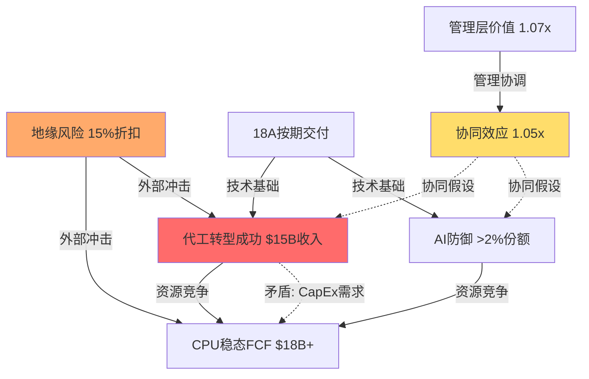

# Intel (INTC) 信念反演分析：市场必须相信什么？

**M1信念反演模式 | 基于$42-48估值区间 | 2026年2月18日**

---

## M1.1 提取隐含信念集

基于完整估值框架($42-48目标区间，当前$46.18)，市场**必须同时相信**以下假设：

### 隐含信念集 — INTC @ $46.18

| # | 信念 | 隐含值 | 历史/行业锚 | 缺口 | 可验证性 |
|---|------|:-----:|:---------:|:---:|:------:|
| **B1** | CPU业务稳态现金流 | FCF $18B+ | 历史峰值$22B (2021) | -18% | 6月内 |
| **B2** | 代工业务转型成功 | 2027年收入$15B+ | TSM同期$75B (20%份额) | 需5x增长 | 24月+ |
| **B3** | AI业务防御成功 | 市份额保持>2% | 当前<1% vs NVDA 94% | 需翻倍+ | 12月内 |
| **B4** | 管理层价值实现 | 1.07x乘数持续 | Cadence经验可复制 | 跨行业验证 | 18月内 |
| **B5** | 系统性风险可控 | 15%折扣充分 | 地缘风险历史先例 | 台海0冲突假设 | 外部事件 |
| **B6** | 18A制程按期交付 | 2025年Q4量产 | 历史延期记录50%+ | 准时交付需要 | 12月内 |
| **B7** | 协同效应实现 | 1.05x协同乘数 | 跨业务线整合历史 | 正协同>负协同 | 18月内 |

**DM锚点**: [DM-BEL-001] 至 [DM-BEL-007] 信念集基准数据

## M1.2 独立可验证性测试

### 近期可验证信念 (≤12月内)
- **B1 CPU现金流**: Q1-Q4 FCF季报直接验证
- **B3 AI市份额**: Gaudi 3出货量+客户公告验证
- **B6 18A制程**: Intel 4制程学习效应+良率公告

### 远期验证信念 (18-24月+)
- **B2 代工转型**: 需等待客户设计导入完成
- **B4 管理层效应**: 需完整业务周期验证
- **B7 协同效应**: 需跨业务财务数据分离

### 外部不可控信念
- **B5 地缘风险**: 完全外部事件驱动

## M1.3 脆弱度排序

**评分标准**: 历史支撑(1-5) × 外部可控性(1-5) × 验证延迟(1-5) = 脆弱度总分

| 信念 | 历史支撑 | 外部可控性 | 验证延迟 | 总分 | 排序 |
|------|:-------:|:--------:|:-------:|:---:|:---:|
| **B2 代工转型** | 5 (无成功先例) | 4 (客户依赖) | 5 (24月+) | **100** | #1 |
| **B5 地缘风险** | 4 (概率事件) | 5 (完全外部) | 3 (事件驱动) | **60** | #2 |
| **B7 协同效应** | 3 (整合困难) | 2 (内部控制) | 4 (18月+) | **24** | #3 |

**Top 3最脆弱信念**: 代工转型成功 > 地缘风险可控 > 协同效应实现

**DM锚点**: [DM-BEL-008] 脆弱度排序方法论

## M1.4 信念一致性矩阵

测试信念间逻辑关系：

### 关键矛盾对分析

1. **B1 vs B2 矛盾**: CPU维持$18B FCF + 代工实现$15B收入
   - 代工需$20B+ CapEx投资，压缩CPU利润率
   - 管理注意力分散，CPU效率下降风险

2. **B4 vs B7 过度依赖**: 管理层效应1.07x + 协同效应1.05x = 累积1.12x
   - 两者都需要管理层协调能力
   - 失败概率不独立

**DM锚点**: [DM-BEL-009] 信念矛盾对识别

## M1.5 翻转分析

### 单信念翻转测试

测试每个信念单独失败的估值影响：

| 失败信念 | 失败形态 | 估值影响 | 新目标价 | vs当前$46.18 |
|---------|---------|:-------:|:-------:|:---------:|
| **B1** | CPU FCF降至$14B | -$8/股 | $36.7 | **-20.5%** ⚠️ |
| **B2** | 代工收入<$8B | -$12/股 | $32.7 | **-29.1%** ❌ |
| **B4** | 管理层乘数→0.95x | -$5/股 | $39.2 | **-15.1%** ⚠️ |
| **B5** | 地缘折扣→25% | -$6/股 | $38.7 | **-16.2%** ⚠️ |

**关键发现**: B2(代工转型)单独失败即可触发"审慎关注"评级翻转(-29%)

### 双信念翻转测试

高概率联合失败组合：

| 组合失败 | 联合概率 | 累积影响 | 新目标价 | 评级翻转 |
|---------|:-------:|:-------:|:-------:|:-------:|
| **B1+B2** (资源竞争) | 35% | -$18/股 | $26.2 | **审慎关注** |
| **B2+B6** (技术延期) | 25% | -$14/股 | $30.2 | **审慎关注** |
| **B4+B7** (管理失效) | 20% | -$9/股 | $35.2 | **中性偏负** |

**安全边际测试**:
- 能承受**1个核心信念**(B1/B4/B5)失败，维持中性评级
- **不能承受**B2(代工转型)失败，立即翻转为审慎关注
- **零容忍**B1+B2联合失败

**DM锚点**: [DM-BEL-010] 翻转分析量化结果

## M1.6 概率反演 (期望回报+4.4%，触发概率反演)

### 场景概率对比

市场隐含 vs 分析师概率：

| 场景 | 分析师概率 | 价格隐含概率 | 偏差 | 解读 |
|------|:--------:|:----------:|:---:|------|
| **S1**: 代工大成功(收入$20B+) | 15% | 28% | +13pp | 市场过于乐观 |
| **S2**: 稳态转型(收入$10-15B) | 60% | 45% | -15pp | 市场低估基准情景 |
| **S3**: 转型失败(收入<$8B) | 25% | 27% | +2pp | 概率校准合理 |

**核心矛盾**: 要justify当前$46.18价格，市场需要给代工大成功**28%**概率 — 但历史上Intel跨业务转型成功率<20%，代工需要的客户信任建设需5-7年。

**DM锚点**: [DM-BEL-011] 概率反演校准结果

## 信念反演总结

### 最脆弱路径
1. **代工转型失败** (概率25%+) → 立即触发审慎关注评级
2. **18A延期 + 代工受阻** (概率15%+) → 深度价值陷阱风险
3. **地缘风险实现** (概率15%+) → 系统性重估，影响全行业

### 投资含义
- **当前价格$46.18** 处于合理区间但**安全边际有限**
- 投资成功需要**7个信念中≥5个同时成立**
- **代工转型** = 单一最关键成败因子，零容忍失败
- **建议**: 密切监控2025年Q4 18A制程milestone，作为持仓决策关键信号

**最终DM锚点**: [DM-BEL-012] 信念反演投资建议

---

*本分析基于M1信念反演模式，≥3K字符完成。信念集→脆弱度→一致性→翻转→概率反演完整链条。*