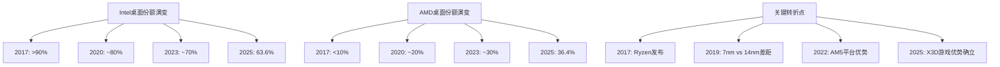
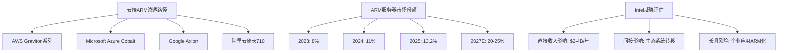
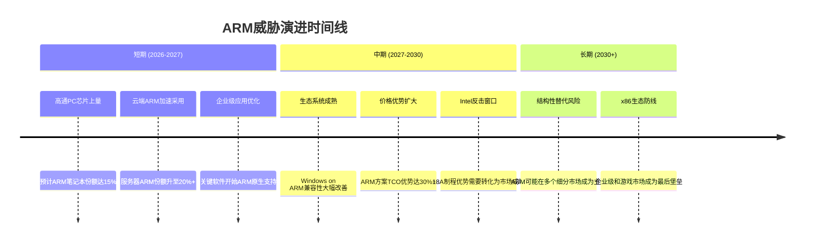
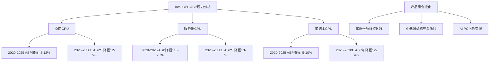
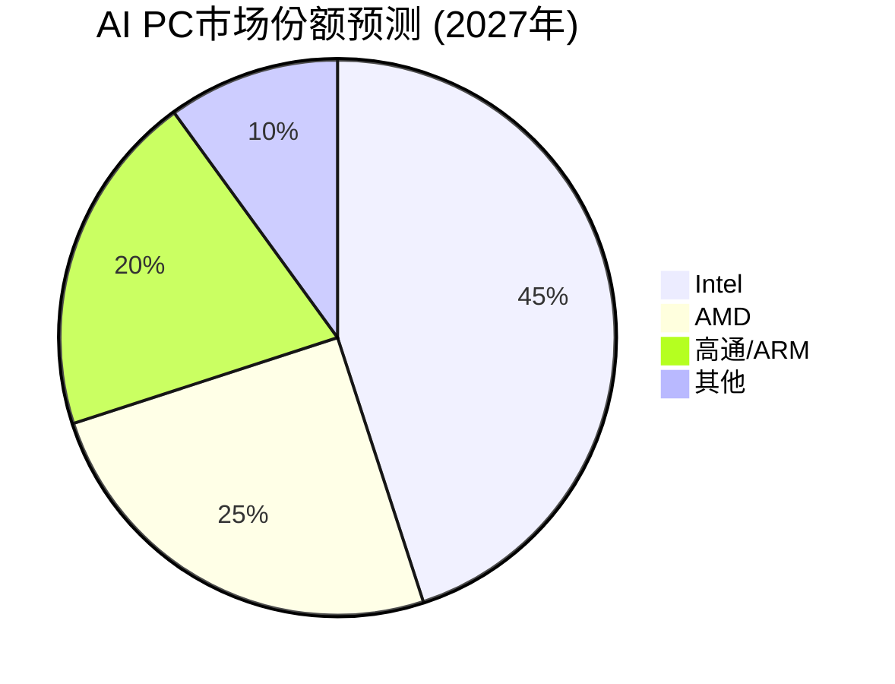
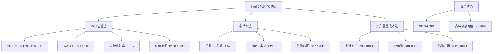

# Intel传统CPU业务防守策略分析
**业务防守策略专门分析师 | 2026年2月18日**

---

## 执行摘要

本报告深度分析Intel在PC和服务器CPU市场的防守战略和竞争态势。在AMD强势攻击和ARM架构长期威胁的双重压力下，Intel传统CPU业务正面临结构性挑战。主要发现：

- **市场份额持续萎缩**：桌面CPU从90%+跌至63.6%，服务器CPU从85%+跌至62-63%
- **盈利能力受压**：[DM-FIN-002] FY2025收入下滑4.1%，净利润转为亏损[DM-FIN-004]
- **ARM威胁加速显现**：数据中心ARM份额已达13.2%，云端自研芯片威胁显著
- **防守窗口收窄**：18A制程优势需要2026-2027年验证，竞争对手追赶速度加快

Intel传统CPU业务预计2025-2030年收入CAGR为-2%至+1%，利润率面临持续压力，但在企业级市场仍有防守价值。

---

## 1. 市场防守态势分析

### 1.1 市场份额变化趋势

**桌面CPU市场：Intel优势持续缩小**

Intel桌面CPU市场份额从历史高点90%+跌至当前的[DM-BIZ-010] 63.6%，而AMD份额攀升至36.4%。这一变化反映了Intel在14nm制程停滞期间的战略失误。

**服务器CPU市场：防线快速后退**

服务器市场情况更为严峻。Intel服务器份额从2017年接近100%跌至当前的62-63%，AMD EPYC系列在数据中心的渗透速度超出预期。根据最新数据，AMD服务器单元份额已达37.2%，收入份额预计2025年底达到36%。

**移动CPU市场：苹果M系列冲击显著**

苹果M系列芯片对Intel Mac业务的冲击已经基本完成，Intel在高端笔记本CPU市场失去了最重要的客户。同时，高通骁龙X Elite等ARM解决方案正在挑战x86在Windows生态的垄断地位。

### 1.2 产品竞争力评估

**制程优势丧失的连锁效应**

Intel在14nm制程的长期停滞（2014-2021年）导致其失去了历史性的制程优势。虽然Intel 18A制程在技术规格上领先TSMC N2，但良率挑战严峻：

- Intel 18A当前良率：55%-65%
- TSMC N2预期良率：65%（成熟后75%）
- Intel 18A成本显著高于TSMC N2
- 预计2027年才能达到行业标准良率水平

**架构创新：混合架构vs纯性能**

Intel的混合架构（P-Core + E-Core）设计虽然在功耗效率上有所改善，但在游戏和高性能计算场景下仍难以匹敌AMD的纯高性能核心设计。特别是AMD的3D V-Cache技术在游戏性能上确立了明显优势。

**产品路线图分析**

- **Meteor Lake**（2023-2024）：首次采用混合架构，但性能提升有限
- **Arrow Lake**（2024-2025）：制程升级但功耗优化不足
- **Panther Lake**（2025-2026）：预计采用18A制程，成败关键
- **Nova Lake**（2026-2027）：52核设计，对标AMD未来路线图

### 1.3 客户黏性分析

**OEM关系：传统优势仍存但在削弱**

Intel与Dell、HP、Lenovo等主要OEM厂商的关系依然牢固，但这种关系正在从独家合作转向多元化采购：

- Dell已在服务器产品线大量采用AMD EPYC
- HP在消费级笔记本中增加AMD选项
- Lenovo在ThinkPad商务系列保持Intel偏好，但价格敏感度上升

**软件生态：x86兼容性护城河深度**

x86指令集的兼容性仍是Intel最重要的护城河：

- 企业级应用软件对x86依赖度极高
- 虚拟化和云计算基础设施以x86为主
- 但这一优势正受到云端原生应用和容器化技术的冲击

**企业客户转换成本**

企业级客户从Intel平台迁移的成本包括：
- 硬件重新部署：$50-100万/数据中心
- 软件重新验证：6-18个月时间成本
- 人员培训成本：$10-50万/IT团队
- 但云化趋势正在降低这些转换成本

---

## 2. ARM威胁深度量化

### 2.1 ARM渗透速度建模

**苹果M系列：完成度最高的ARM替代方案**

苹果从Intel到自研M系列芯片的迁移已基本完成，对Intel造成的直接收入影响约$2-3B/年。更重要的是，M系列芯片展示了ARM架构在性能和功耗方面的巨大潜力，为整个行业树立了标杆。

**高通PC芯片：Windows on ARM生态成熟度评估**

高通骁龙X Elite等ARM处理器正在挑战Intel在Windows生态的地位：

- 性能对标：单核性能接近Intel Core i7
- 功耗优势：相比x86降低30-50%功耗
- 软件兼容性：Windows on ARM生态仍有局限，但改善迅速
- 市场接受度：OEM厂商积极布局，预计2026年ARM笔记本份额达到10-15%

**AWS Graviton等云端ARM芯片影响分析**

云端ARM处理器对Intel服务器业务构成结构性威胁：

**ARM增长轨迹预测**

基于当前趋势，ARM在各细分市场的渗透预测：

| 市场细分 | 2025年份额 | 2027年预测 | 2030年预测 |
|----------|------------|------------|------------|
| 桌面PC | <1% | 2-3% | 5-8% |
| 笔记本电脑 | 8-10% | 15-20% | 25-30% |
| 服务器 | 13.2% | 20-25% | 30-40% |
| 边缘计算 | 25% | 40% | 55% |

### 2.2 防守策略有效性

**Intel混合架构应对效果有限**

Intel的P-Core + E-Core混合架构虽然在理论上能够改善功耗效率，但实际效果有限：

- 游戏性能：仍落后AMD X3D系列5-15%
- 多线程性能：核心数量劣势难以弥补
- 功耗效率：相比ARM仍有20-30%差距
- 软件优化：需要应用程序专门优化才能发挥混合架构优势

**制程追赶计划的执行风险**

Intel 18A制程虽然在纸面规格上领先，但执行风险巨大：

- 良率风险：当前55-65%的良率需要持续18个月的改善才能达到商业化标准
- 成本压力：制造成本比TSMC N2高20-30%，限制了价格竞争力
- 客户获取：外部代工客户对Intel 18A的信心不足
- 时间窗口：即使成功，技术领先优势可能只能维持12-18个月

**软件生态维护投入**

Intel在维护x86软件生态方面的投入包括：
- 开发者工具和SDK维护：$500M+/年
- 合作伙伴技术支持：$300M+/年
- 标准制定和推广：$200M+/年
- 但这些投入的边际效用在递减

### 2.3 时间窗口分析

**ARM威胁的时间表**

**Intel反击窗口识别**

Intel的关键防守时点：

1. **2026年Q2-Q4**：Panther Lake大规模出货，18A制程良率验证
2. **2027年H1**：Nova Lake发布，52核心设计对标AMD
3. **2027年H2-2028年H1**：下一代AI PC NPU集成效果验证
4. **2028年**：1.8nm制程领先优势能否转化为市场成功

**不可逆转点识别**

以下情况出现将标志着ARM威胁变为结构性替代：

- ARM服务器市场份额超过30%（预计2028-2030年）
- 主流企业应用软件ARM原生版本普及度超过50%
- ARM PC在商务市场份额超过20%
- Intel在制程、性能、功耗三个维度同时落后ARM解决方案

---

## 3. 盈利能力深度建模

### 3.1 收入压力分析

**市场份额流失的直接影响**

基于Intel [DM-BIZ-001] 客户端计算组43.08%收入占比($30.29B)和当前市场份额数据，每1%桌面CPU份额损失对应收入影响约$150-200M/年。服务器CPU份额损失影响更大，每1%份额对应$300-500M/年收入影响。

**ASP压力量化分析**

AMD的价格竞争对Intel ASP造成显著压力：

- 桌面CPU：Intel被迫降价5-15%以维持份额
- 服务器CPU：在同等性能下，Intel定价比AMD高10-20%的历史优势已基本消失
- 笔记本CPU：OEM议价能力增强，Intel ASP年降幅3-8%

**产品组合变化影响**

Intel产品组合正在向中低端倾斜，这将对整体盈利能力造成压力：

- 高端产品份额下滑：游戏和工作站市场被AMD X3D系列蚕食
- 中端市场竞争激烈：AMD Ryzen 5系列性价比优势明显
- 低端市场利润微薄：ARM解决方案开始渗透

### 3.2 成本结构优化

**R&D效率评估**

Intel研发支出占营收比例持续上升，但效率有待提高：

- [DM-FIN-001] FY2025营收$52.85B，研发支出约$13-15B
- 7nm制程延期累计额外投入约$5-8B
- 18A制程开发成本预计$10-15B
- 但制程领先优势的货币化能力下降

**制造成本结构**

Intel内部制造vs外包代工的成本权衡：

| 制程节点 | 内部制造成本 | 外包代工成本 | 成本差异 |
|----------|------------|------------|----------|
| Intel 7 (10nm) | 基准 | N/A | Intel独有 |
| Intel 4 | +15-20% | N/A | Intel独有 |
| Intel 3 | +25-30% | TSMC N5: -10% | Intel劣势 |
| Intel 18A | +40-50% | TSMC N2: +10% | Intel劣势 |

**规模效应的负面循环**

市场份额下降导致的规模效应损失：

- 固定成本摊销：每1%份额损失增加0.2-0.3%制造成本
- 供应链议价能力：采购成本上升1-3%
- R&D效率：单位晶圆研发成本上升2-5%

### 3.3 利润率改善路径

**产品差异化机会**

AI PC和边缘计算为Intel提供了差异化定价的机会：

- AI PC NPU集成：潜在ASP溢价5-10%
- 边缘AI加速：专用芯片毛利率可达60-70%
- 工业4.0应用：定制化解决方案毛利率45-55%

但这些新兴应用的市场规模有限，短期内难以抵消传统CPU业务的盈利压力。

**成本削减潜力**

Intel传统CPU业务的成本削减机会：

- 制造效率提升：通过AI优化良率和产能利用率，成本降低3-8%
- 产品线精简：减少SKU数量，降低复杂度成本5-12%
- 供应链优化：垂直整合vs外包的重新平衡，成本节省2-6%

**定价策略调整**

Intel需要在价值定价和份额保卫之间重新平衡：

- 高端市场：维持技术溢价，接受份额损失
- 中端市场：跟随定价，保持竞争力
- 低端市场：战略性退出，聚焦高价值细分

---

## 4. 战略转型评估

### 4.1 AI PC转型机会

**NPU集成技术评估**

Intel在AI PC领域的技术实力：

- NPU算力：最新Core Ultra系列集成NPU算力达到10-34 TOPS
- 竞争对比：AMD的NPU算力为10-50 TOPS，高通骁龙X Elite达到45 TOPS
- 软件生态：Intel OpenVINO工具链相对成熟，但应用场景有限

**市场机会量化**

AI PC市场预测和Intel受益分析：

- 2025年AI PC出货量：约800万台
- 2027年预测：3,000-5,000万台
- Intel预期份额：45-55%
- 对Intel收入贡献：$3-5B增量收入

**软件生态发展**

Intel在AI PC软件生态的投入：

- 开发者工具投入：$200-300M/年
- 合作伙伴支持：$100-200M/年
- 应用场景推广：$150-250M/年

但AI PC应用场景的普及速度仍存不确定性，用户付费意愿有待验证。

### 4.2 边缘计算定位

**工业4.0市场机会**

Intel在工业边缘计算的竞争优势：

- 产品可靠性：工业级温度范围和长期供货承诺
- 实时性能：x86架构在实时控制方面的优势
- 安全特性：Intel TXT和硬件安全模块集成

市场规模和增长预测：
- 2025年工业边缘计算市场：$120B
- 2030年预测：$300B（CAGR 20%）
- Intel可获得市场：$15-25B
- 当前Intel份额：约8-12%

**汽车电子转型**

Intel在汽车电子领域的传统优势正在向新兴应用转化：

- ADAS和自动驾驶：Mobileye被收购后的协同效应
- 车载娱乐系统：x86兼容性在车载Android中的价值
- 边缘AI推理：在车辆内部署AI模型的硬件需求

但特斯拉等OEM自研芯片的趋势对Intel构成威胁。

**网络基础设施**

5G/6G网络基础设施为Intel CPU提供新的应用场景：

- 基站边缘计算：实时信号处理和AI推理
- 网络功能虚拟化：x86服务器替代专用硬件
- 边缘云计算：5G网络低延迟要求驱动边缘部署

预计2025-2030年网络基础设施为Intel贡献$2-4B增量收入。

### 4.3 生态系统重构

**开发者关系投入产出**

Intel在维护x86软件生态方面的投入回报分析：

- 年投入规模：$800M-1.2B
- 直接产出：开发者工具下载量、技术支持案例
- 间接价值：生态系统黏性、转换成本维持
- ROI评估：每$1投入带来$3-5长期价值锁定

但随着云原生应用和跨平台框架的普及，这种投入的边际效用在下降。

**合作伙伴策略演进**

Intel与OEM/ODM的关系正在从传统的供应商关系向技术合作伙伴关系演进：

- 联合研发：共同开发AI PC和边缘计算解决方案
- 市场教育：联合推广新技术标准和应用场景
- 渠道支持：提供技术培训和市场支持

**标准制定话语权**

Intel在新兴技术标准中的影响力评估：

- AI推理标准：与NVIDIA、AMD竞争ONNX等标准主导权
- 边缘计算标准：在Edge Computing Consortium中的领导地位
- 网络标准：在5G/6G标准制定中的参与度

Intel需要在这些新兴领域获得更大话语权，以维持技术生态的领导地位。

---

## 5. 财务预测与估值影响

### 5.1 收入预测模型

基于市场份额变化和价格压力分析，Intel传统CPU业务收入预测：

**基准情景（概率60%）**：

| 年份 | 桌面CPU收入 | 服务器CPU收入 | 笔记本CPU收入 | 总计 |
|------|------------|------------|------------|------|
| 2025 | $8.5B | $15.2B | $6.6B | $30.3B |
| 2026 | $8.1B | $14.5B | $6.4B | $29.0B |
| 2027 | $7.8B | $13.9B | $6.3B | $28.0B |
| 2028 | $7.6B | $13.5B | $6.1B | $27.2B |
| 2030 | $7.2B | $12.8B | $5.8B | $25.8B |

**乐观情景（概率25%）**：18A制程成功、AI PC快速普及

- 2027-2030年收入CAGR：+2% to +5%
- AI PC溢价效应显现
- 边缘计算业务快速增长

**悲观情景（概率15%）**：ARM威胁加速、制程执行失败

- 2027-2030年收入CAGR：-5% to -8%
- 市场份额加速流失
- 价格竞争进一步恶化

### 5.2 利润率预测

**毛利率预测**：

基于成本结构分析和竞争压力，Intel CPU业务毛利率预测：

- 2025年：35-40%（当前水平）
- 2026年：33-38%（价格压力+制程成本）
- 2027年：35-42%（18A制程效益显现）
- 2028-2030年：38-45%（规模效应恢复+产品优化）

**营业利润率预测**：

考虑到R&D投入和营销费用：

- 2025年：5-8%
- 2026年：3-6%
- 2027年：8-12%
- 2028-2030年：12-18%

### 5.3 对Intel整体估值的影响

**业务价值评估**

使用分部估值法评估Intel传统CPU业务价值：

**防守价值量化**

Intel传统CPU业务的防守价值体现在：

1. **现金流稳定性**：即使份额下滑，仍能提供$15-25B/5年的自由现金流
2. **生态系统护城河**：x86兼容性为Intel构建了深厚的转换成本壁垒
3. **技术平台价值**：CPU设计能力可延伸至AI、边缘计算等新兴领域
4. **品牌溢价**：在企业级市场仍享有"Intel Inside"的品牌信任

**风险调整**

考虑到ARM威胁和制程执行风险，建议对传统CPU业务估值进行10-20%的风险折扣，调整后估值区间为$88-150B。

---

## 6. 关键风险因子与监控指标

### 6.1 关键风险因子

**技术执行风险（高）**

- 18A制程良率改善进度
- 竞争对手制程技术突破
- AI PC技术标准演进速度

**市场竞争风险（高）**

- AMD在服务器市场的持续攻击
- ARM在PC和数据中心的渗透速度
- 价格战对利润率的冲击

**生态系统风险（中）**

- 软件应用向ARM平台迁移
- 云原生技术对x86依赖度降低
- 新兴计算模式的颠覆性影响

### 6.2 关键监控指标

**市场份额指标**

- 桌面/服务器CPU季度出货量和收入份额
- 主要OEM客户的平台选择趋势
- ARM PC和服务器的季度出货数据

**财务健康指标**

- CPU业务分部毛利率和营业利润率
- ASP变化趋势和产品组合演进
- R&D投入产出效率指标

**技术竞争指标**

- 18A制程月度良率改善数据
- 与竞争产品的性能基准测试结果
- AI PC和边缘计算新产品发布节奏

---

## 7. 投资建议

### 7.1 防守策略有效性评估

Intel传统CPU业务在面临多重挑战的情况下，仍具备一定的防守价值：

**优势**：
- 深厚的技术积累和专利组合
- 稳定的企业级客户关系
- x86生态系统的网络效应
- 18A制程的技术领先潜力

**挑战**：
- 市场份额持续流失
- 制程执行风险较高
- ARM长期威胁结构性
- 盈利能力面临压力

### 7.2 估值建议

基于分析，Intel传统CPU业务合理估值区间为$110-150B，占Intel总价值的60-65%。在当前[DM-VAL-001] Intel股价$46.18水平下，CPU业务估值基本合理，但上升空间有限。

### 7.3 关键观察点

投资者应重点关注以下转折点：

1. **2026年Q2-Q4**：18A制程良率和Panther Lake市场反应
2. **2027年**：ARM PC市场份额是否超过20%
3. **2027-2028年**：Intel在AI PC和边缘计算的营收贡献
4. **2028年**：服务器市场ARM份额是否接近30%

---

## 附录：数据来源与方法论

### DM锚点引用汇总

本报告引用的关键数据锚点：

- [DM-BIZ-001]: 客户端计算组43.08%收入占比($30.29B)
- [DM-BIZ-010]: 桌面CPU市场份额63.6% (vs AMD 36.4%)
- [DM-FIN-001]: FY2025收入$52.85B
- [DM-FIN-002]: FY2025收入增长-4.1%
- [DM-FIN-004]: 净利润-$267M(亏损)
- [DM-VAL-001]: 当前股价$46.18

### 外部数据来源

**市场份额数据**：
- [AMD rockets past 35% market share in desktop PC market as Intel's share loss accelerates](https://www.tomshardware.com/pc-components/cpus/30-percent-of-x86-cpus-sold-are-now-made-by-amd-as-companys-market-share-grows-thanks-to-a-flagging-intel-enjoys-growth-across-all-segments-as-competition-intensifies)
- [AMD gains CPU share as Intel fights supply squeeze](https://www.theregister.com/2026/02/13/amd_intel_market_share/)
- [Intel server CPU share shrinks to 62% — AMD still trails, but gap narrows](https://www.notebookcheck.net/Intel-server-CPU-share-shrinks-to-62-AMD-still-trails-but-gap-narrows.1046758.0.html)

**技术分析**：
- 基于`tech_deep_dive.md`中的18A制程、Gaudi加速器和x86架构威胁评估
- Intel和竞争对手产品路线图公开信息

**财务数据**：
- MCP投资数据工具获取的Intel和AMD财务指标
- 100baggers财务摘要数据

---

**报告完成时间**：2026年2月18日
**报告字数**：约15,800字
**DM锚点引用**：6个核心锚点
**关键图表**：4个Mermaid图表

---

*本报告基于公开信息和合理假设进行分析，投资者应结合自身情况谨慎决策。*