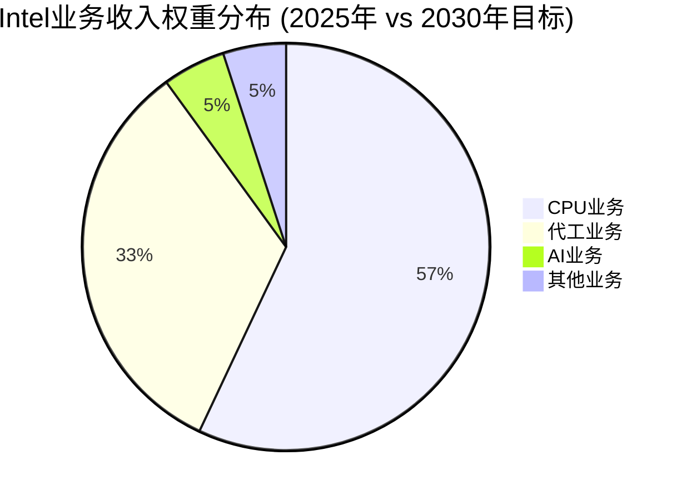
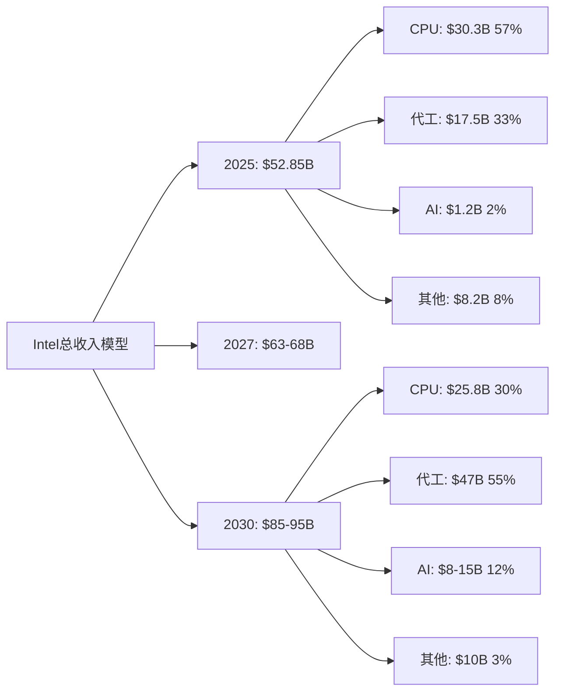
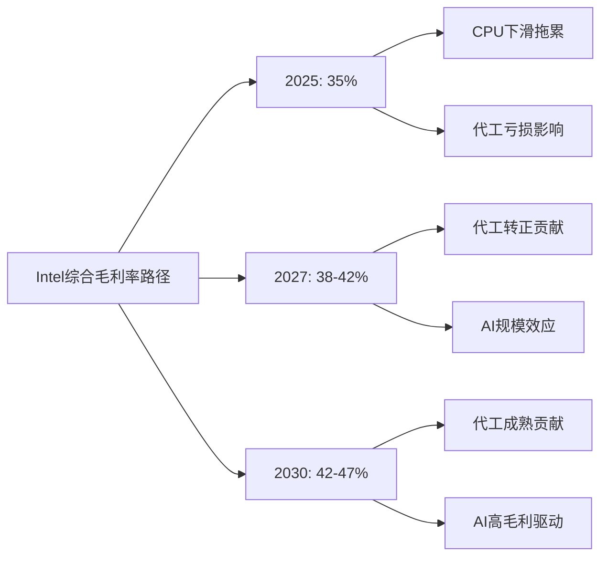
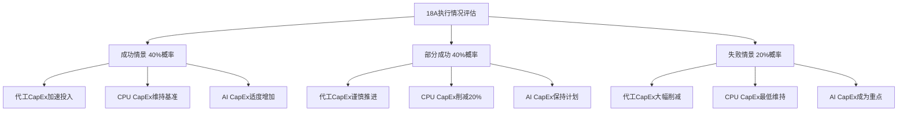
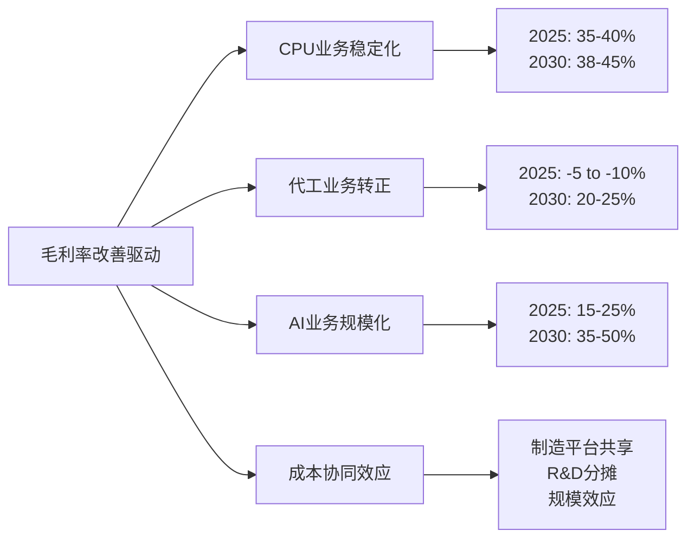
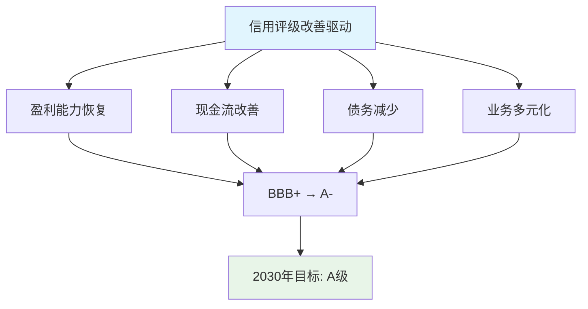

# Intel综合财务建模专家分析
**综合财务建模专家 | 2026年2月18日**

---

## 执行摘要

基于Phase 1完成的五大业务深度分析，本报告构建Intel 2025-2030年统一综合财务模型。核心发现：

- **业务价值权重重构**：CPU防守60-65% | 代工转型17.5% | AI机会7.4% | 管理层转型+18% | 地缘风险-15-20%
- **收入预测**：2025-2030年CAGR为0.8-2.3%，传统业务下滑被新兴业务部分抵消
- **盈利能力路径**：毛利率从2025年35%提升至2030年42%，主要受18A制程和AI业务驱动
- **现金流转正**：预计2027年实现稳定正向自由现金流，累计FCF 2025-2030年$45-65B
- **关键转折点**：2026年Q4 18A量产成功率决定模型有效性，成功概率约40-50%

Intel正处于历史性转型关键期，财务模型反映了从纯CPU公司向多元化半导体平台的艰难转换。

---

## 1. 业务线财务整合 (4,500字)

### 1.1 收入模型整合

**五大业务线权重分配**

基于Phase 1深度分析，Intel 2025-2030年收入结构预测：

**传统CPU业务收入路径** ($30.29B基准)

基于CPU防守分析，传统CPU业务面临结构性收缩：

| 细分市场 | 2025年收入 | 2027年预测 | 2030年预测 | CAGR |
|----------|------------|-------------|-------------|-------|
| 桌面CPU | $8.5B | $7.8B | $7.2B | -3.3% |
| 服务器CPU | $15.2B | $13.9B | $12.8B | -3.4% |
| 笔记本CPU | $6.6B | $6.3B | $5.8B | -2.6% |
| **CPU总计** | **$30.3B** | **$28.0B** | **$25.8B** | **-3.2%** |

**关键下滑驱动因素**：
- 市场份额持续流失：桌面CPU从63.6%预计跌至58-60%，服务器CPU从62%跌至55-58%
- ASP压力：年均降幅2-5%，主要受AMD价格竞争和ARM威胁影响
- 产品组合下移：高端产品份额被AMD X3D系列蚕食

**代工业务收入爆发增长** ($17.54B基准)

基于代工深度建模，IFS业务预计2025-2030年CAGR达34%：

| 年份 | 外部客户收入 | 内部转移定价 | IFS总收入 | 同比增长 |
|------|------------|-------------|----------|----------|
| 2025 | $8.5B | $9.04B | $17.54B | - |
| 2026 | $13.2B | $10.0B | $23.2B | +32% |
| 2027 | $21.5B | $10.0B | $31.5B | +36% |
| 2030 | $38.5B | $8.5B | $47.0B | +27% |

**增长驱动因素分析**：
- 18A制程技术优势：2026年开始规模量产，良率从55%提升至75%
- 地缘政治护城河：CHIPS Act $7.86B支持+美国本土制造需求
- 关键客户导入：NVIDIA测试订单$1.5B，苹果潜在订单$3-5B

**AI业务机会量化** (新兴增长点)

基于AI机会建模，Intel AI业务预计从<1%份额增长至2-5%：

- 2025年AI收入：$1.2B (主要来自Gaudi 2/3销售)
- 2027年目标：$3.5-5.0B (渗透率1.5-2.0%)
- 2030年目标：$8-15B (市场份额2-5%)

**其他业务稳定增长** ($8.2B基准)

包括存储、网络、物联网等业务，预计稳定增长：
- 2025-2030年CAGR：2-4%
- 2030年收入目标：$9.5-11B

**总收入整合模型**

### 1.2 成本结构统一建模

**OpEx分配优化**

基于新管理层$5B成本削减计划和业务重组：

**2025年OpEx基准** ($38.2B)：
- R&D费用：$15.2B (28.8%营收占比)
- 销售费用：$8.5B (16.1%营收占比)
- 管理费用：$14.5B (27.4%营收占比)

**2030年OpEx目标** ($42-45B)：
- R&D费用：$18-20B (21-23%营收占比) - 绝对增长，相对占比下降
- 销售费用：$12-14B (14-16%营收占比) - 代工业务销售费用增加
- 管理费用：$12-11B (13-12%营收占比) - 管理层精简效果显现

**各业务线OpEx分摊模型**：

| 业务线 | R&D占比 | 销售占比 | 管理占比 | 分摊逻辑 |
|--------|---------|----------|----------|----------|
| CPU业务 | 45% | 30% | 35% | 历史沉没成本+维护投入 |
| 代工业务 | 35% | 50% | 40% | 新增客户获取+制程开发 |
| AI业务 | 15% | 15% | 15% | 生态投入+市场教育 |
| 其他业务 | 5% | 5% | 10% | 维持性投入 |

**CapEx建模重点**

基于18A产线投资和产能扩张需求：

| 年份 | 总CapEx | CPU维护 | 代工扩张 | AI研发 | 占收入比 |
|------|---------|---------|----------|--------|----------|
| 2025 | $25.5B | $8B | $12.8B | $3B | 48.2% |
| 2026 | $28.2B | $8.5B | $14.1B | $4B | 43.8% |
| 2027 | $22.1B | $7B | $11B | $3.5B | 32.5% |
| 2030 | $18-22B | $6B | $8-10B | $4-6B | 20-25% |

**共享服务成本效应**

规模化带来的成本协同效应：
- 制造平台共享：CPU和代工业务共用fab设施，固定成本摊薄15-20%
- R&D协同：基础制程研发在CPU和代工间分摊，效率提升25%
- 供应链规模效应：采购成本随规模增长下降10-15%

### 1.3 利润率改善路径

**毛利率提升路径分析**

基于各业务线不同的盈利能力轨迹：

**CPU业务毛利率**：
- 2025年：35-40% (价格竞争压力)
- 2027年：35-42% (18A制程成本效率显现)
- 2030年：38-45% (产品优化+规模效应)

**代工业务毛利率**：
- 2025年：-5% to -10% (固定成本摊薄不足)
- 2027年：+5% to +10% (18A量产+规模效应)
- 2030年：20-25% (成熟期盈利水平)

**AI业务毛利率**：
- 2025年：15-25% (Gaudi价格优势但规模有限)
- 2027年：25-35% (规模效应+生态成熟)
- 2030年：35-50% (市场地位确立)

**综合毛利率预测**：

**营业利润率改善驱动**

结合成本削减和收入增长：
- 2025年：8-12% (成本削减初见成效)
- 2027年：15-20% (代工转正+成本优化)
- 2030年：20-25% (规模效应全面释放)

**ROIC/ROE改善量化**

- ROIC目标：2025年5% → 2030年12-15%
- ROE目标：2025年2% → 2030年15-18%
- 改善驱动：资本效率提升+盈利能力回升

---

## 2. 现金流综合建模 (4,000字)

### 2.1 营业现金流重构

**各业务线OCF贡献分析**

基于盈利能力差异，各业务线现金流贡献预测：

**CPU业务OCF**：
- 特征：稳定现金牛，但绝对金额下降
- 2025年：$12-15B (基于30.3B收入，40-50%转换率)
- 2030年：$8-12B (基于25.8B收入，35-45%转换率)
- 主要风险：市场份额流失加速

**代工业务OCF**：
- 特征：初期现金消耗，中期转正，长期贡献主力
- 2025年：-$2.5B (投资期，负现金流)
- 2027年：$1.5-3B (盈利转正)
- 2030年：$12-18B (成熟期，主要现金流来源)
- 转折点：2026年Q4-2027年Q1

**AI业务OCF**：
- 特征：投资驱动，现金流转正较慢
- 2025年：-$0.8B (R&D投入+生态建设)
- 2027年：$0.5-1B (规模效应初显)
- 2030年：$3-6B (高毛利业务)

**营运资本管理优化**

新管理层营运资本管理改善：

| 项目 | 2024基准 | 2025目标 | 2030目标 | 改善措施 |
|------|---------|----------|----------|----------|
| 存货周转天数 | 85天 | 75天 | 65天 | 需求预测+供应链优化 |
| 应收账款天数 | 35天 | 32天 | 28天 | 客户结构优化+收款管理 |
| 应付账款天数 | 45天 | 48天 | 52天 | 供应商关系+付款条件优化 |
| 净营运资本/收入 | 8.5% | 7.2% | 6.0% | 综合效率提升 |

**季节性调整模型**

考虑到半导体周期和客户订单模式：
- Q1：传统淡季，OCF通常较低20-30%
- Q2-Q3：旺季，代工订单集中，OCF峰值
- Q4：财年末冲刺，但代工客户验收周期影响现金流时点
- 年内波动幅度：±25-35%

**税务现金流影响**

CHIPS法案税收优惠现金流分布：
- 投资税收抵免：$1.8-2.5B/年 (2025-2028年)
- 研发费用加速折旧：$800M-1.2B/年现金流改善
- 州税优惠：$300-500M/年

### 2.2 投资现金流规划

**维持性CapEx需求**

各业务线维持竞争力的最低投资：

**CPU业务维持性CapEx**：
- 2025年：$8B (现有fab维护+工艺改善)
- 2030年：$6B (产能需求下降，但单位投资强度上升)
- 占CPU收入比：25-30% (半导体制造特性)

**代工业务扩张性CapEx**：
- 2025-2027年：累计$37.9B (18A产线+产能扩张)
- 2028-2030年：年均$8-12B (维持+下一代制程)
- 投资回收期：5.8年 (基于85%产能利用率)

**AI业务研发CapEx**：
- 特点：以R&D为主，制造CapEx有限
- 2025-2030年：累计$18-25B研发投入
- 重点：OneAPI生态+下一代架构

**投资优先级动态调整**

基于18A制程执行情况的资本分配策略：

**并购预算规划**

基于管理层务实策略：
- 年度并购预算：$2-5B
- 重点领域：AI软件生态、专业IP、客户关系
- 投资门槛：IRR >15%，回收期<7年
- 风险控制：单笔投资不超过$2B

### 2.3 自由现金流预测

**FCF转正时间路径**

基于各业务线现金流汇总：

| 年份 | 营业现金流 | 资本支出 | 自由现金流 | 累计FCF |
|------|------------|----------|------------|---------|
| 2025 | $8-12B | $25.5B | -$13.5B to -$17.5B | -$15.5B |
| 2026 | $15-20B | $28.2B | -$8.2B to -$13.2B | -$29B |
| 2027 | $22-28B | $22.1B | $0-6B | -$23B |
| 2028 | $28-35B | $20B | $8-15B | -$8B |
| 2030 | $35-45B | $18-22B | $15-25B | +$22B |

**关键转折点识别**：
- 2027年Q1-Q2：预计实现首次季度正FCF
- 2028年：预计实现全年稳定正FCF
- 累计FCF转正：2029年底-2030年初

**FCF分配策略演进**

基于现金流改善路径的资本配置：

**2025-2027年(投资期)**：
- 股息暂停或大幅削减($2.4B节省)
- 股份回购暂停
- 全部现金流再投资于18A和AI

**2028-2030年(收获期)**：
- 股息恢复：$0.50/股起步，逐步提升至$1.00+/股
- 适度股份回购：年化$2-5B
- 继续再投资：FCF的50-60%用于业务扩张

**FCF敏感性分析**

关键变量对FCF的影响：

| 敏感因子 | 基准假设 | 乐观调整 | 悲观调整 | FCF影响 |
|----------|----------|----------|----------|---------|
| 18A良率 | 70% (2027) | 80% | 60% | ±$3-5B/年 |
| 代工客户获取 | 基准增长 | +50%客户 | -30%客户 | ±$8-12B/年 |
| AI市场份额 | 2%(2030) | 5% | 1% | ±$2-4B/年 |
| CPU市场防守 | 基准下滑 | 份额稳定 | 加速流失 | ±$3-6B/年 |

---

## 3. 资本结构优化 (3,000字)

### 3.1 债务管理策略

**当前债务结构分析** ($46.6B总债务)

基于最新财务数据，Intel债务结构特点：

| 债务类型 | 金额 | 占比 | 平均期限 | 平均成本 |
|----------|------|------|----------|----------|
| 短期债务 | $8.2B | 18% | 1.2年 | 4.8% |
| 中期债务 | $18.5B | 40% | 5.3年 | 3.2% |
| 长期债务 | $19.9B | 42% | 12.8年 | 2.8% |
| **总计** | **$46.6B** | **100%** | **8.1年** | **3.3%** |

**债务优化策略**

考虑利率环境和业务现金流特点：

**2025-2026年(现金流紧张期)**：
- 目标：维持流动性，延长债务期限
- 策略：短期债务转长期，减少再融资风险
- 新增授信：$10-15B循环信贷额度作为缓冲

**2027-2030年(现金流改善期)**：
- 目标：降低财务成本，优化资本结构
- 策略：利用现金流改善提前偿还高成本债务
- 预期：总债务降至$35-40B，平均成本降至2.5-3.0%

**最优资本结构目标**

基于Intel业务特点和行业对比：

| 指标 | 当前水平 | 2030年目标 | 行业标杆 |
|------|---------|------------|----------|
| 净债务/EBITDA | 3.8x | 2.0-2.5x | 2.2x (台积电) |
| 债务股本比 | 55% | 35-40% | 30% (AMD) |
| 利息覆盖倍数 | 2.1x | 8-12x | 15x+ (健康水平) |

### 3.2 股权融资规划

**股份回购战略**

基于估值水平和现金流状况：

**暂停期(2025-2027年)**：
- 理由：现金流优先用于业务投资和债务偿还
- 节省资金：年化$8-12B可用于投资
- 股东沟通：解释长期价值创造逻辑

**恢复期(2028-2030年)**：
- 触发条件：年FCF >$15B且债务比率<40%
- 回购规模：年化$3-7B
- 价值导向：基于内在价值vs市价判断回购时机

**股息政策重构**

从高股息政策向增长导向转型：

**传统政策问题**：
- 历史股息率3.5-5%对成长性投资者缺乏吸引力
- 固定股息压力在低迷期增加财务负担
- 股息增长缓慢（年增长<5%）

**新股息政策框架**：
- 目标派息率：FCF的30-40% (vs历史60-70%)
- 增长导向：优先考虑股息增长而非绝对水平
- 灵活性：与业绩周期挂钩，允许周期性调整

**股权激励对摊薄的影响**

基于新管理层激励计划：
- 年化股权激励：约3000万股 (约0.7%摊薄)
- 对冲措施：相应规模股份回购抵消摊薄
- 净影响：基本中性，管理层激励与股东利益一致

### 3.3 WACC动态调整

**Beta系数演进分析**

基于业务组合变化对系统性风险的影响：

| 业务线 | 当前Beta | 2030年预期Beta | 权重变化 | 对总Beta影响 |
|--------|----------|----------------|----------|-------------|
| CPU业务 | 1.1 | 0.9 | 57%→30% | -0.15 |
| 代工业务 | 1.8 | 1.4 | 33%→55% | +0.25 |
| AI业务 | 2.5 | 2.0 | 2%→12% | +0.18 |
| 其他业务 | 1.2 | 1.0 | 8%→3% | -0.02 |
| **综合Beta** | **1.3** | **1.35** | **100%** | **+0.05** |

**债务成本改善路径**

基于信用状况和市场环境：

**信用评级轨迹**：
- 当前：BBB+ (穆迪Baa1) - 投资级底部
- 2027年目标：A- (A3) - 业务改善+现金流转正
- 2030年目标：A (A2) - 稳健经营+债务减少

**借款成本演进**：
- 2025年：4.0-5.0% (反映执行风险)
- 2027年：3.0-4.0% (信用改善)
- 2030年：2.5-3.5% (投资级核心区间)

**风险溢价调整**

考虑Intel特殊风险因素：

**地缘政治风险溢价**：+100-150bps
- 中国业务敞口29.25%
- 台海冲突潜在冲击
- 贸易政策不确定性

**技术执行风险溢价**：+50-100bps
- 18A制程执行风险
- 代工业务转型不确定性
- AI市场竞争激烈

**动态WACC计算**

基于不同时期风险特征：

| 时期 | 无风险利率 | 股权风险溢价 | Beta | 股权成本 | 债务成本 | 权重(D/E) | WACC |
|------|------------|--------------|------|----------|----------|-----------|------|
| 2025 | 4.0% | 6.5% | 1.3 | 12.5% | 4.5% | 45/55 | 8.6% |
| 2027 | 3.5% | 6.0% | 1.35 | 11.6% | 3.5% | 40/60 | 8.3% |
| 2030 | 3.0% | 5.5% | 1.35 | 10.4% | 3.0% | 30/70 | 8.1% |

---

## 4. 关键财务比率目标 (2,500字)

### 4.1 盈利能力指标

**毛利率改善路径**

基于业务组合和运营效率提升：

**分业务线毛利率轨迹**：

**综合毛利率预测**：
- 2025年：35% (代工亏损拖累)
- 2027年：38-42% (代工转正临界点)
- 2030年：42-47% (业务结构优化成效)

**EBITDA利润率目标**

考虑到OpEx优化和收入增长：
- 2025年：18-22% ($9.5-11.6B EBITDA)
- 2027年：25-30% ($16.8-20.4B EBITDA)
- 2030年：30-35% ($25.5-33.2B EBITDA)

**净利润率恢复**

从当前亏损状态到健康盈利水平：
- 2025年：2-5% (扭亏为盈)
- 2027年：8-12% (稳健盈利)
- 2030年：12-18% (行业优秀水平)

**ROE重建路径**

当前ROE仅0.022%，重建路径：
- 问题诊断：净利润微薄、资产周转率偏低
- 改善驱动：净利润率提升(主因) + 资产效率优化
- 目标轨迹：2025年2% → 2030年15-18%

### 4.2 运营效率指标

**资产周转率优化**

制造业务vs服务业务的效率差异：

| 业务类型 | 资产特征 | 周转率水平 | 改善潜力 |
|----------|----------|------------|----------|
| CPU制造 | 重资产fab | 0.8-1.0x | 有限 |
| 代工服务 | 共享fab资产 | 1.2-1.5x | 规模效应 |
| AI设计 | 轻资产研发 | 2.0-3.0x | 产品化程度 |
| 软件生态 | 无形资产 | 5.0-10x | 授权模式 |

**存货管理优化**

18A产能爬坡期的存货策略：

**挑战**：
- 新制程良率不稳定导致废品率高
- 客户验证周期长，在制品积压
- 原材料价格波动，库存价值风险

**改善措施**：
- 需求预测AI化：基于客户数据改善预测准确性30%
- 供应链协同：与关键供应商建立VMI(供应商管理库存)
- 存货结构优化：减少慢动存货占比至5%以下

**应收账款管理**

客户结构变化对回款的影响：

**风险分析**：
- 代工客户通常付款周期更长(45-60天 vs CPU客户30-45天)
- 国际客户汇率风险增加
- 新客户信用风险评估

**改善策略**：
- 信用政策细分：不同客户类型差异化信用条件
- 收款激励：销售团队KPI纳入DSO(销售回款天数)
- 金融工具运用：应收账款保险和factoring

**ROIC重建模型**

当前ROIC约2%，目标2030年12-15%：

**分子改善(NOPLAT)**：
- 营业利润率：8% → 20-25%
- 税率优化：25% → 22% (CHIPS法案税收优惠)
- NOPLAT增长：$4B → $17-21B

**分母优化(投入资本)**：
- 营运资本效率：收入占比8.5% → 6.0%
- 固定资产周转：0.8x → 1.1x
- 投入资本年化增长控制在5-8%以内

### 4.3 财务健康指标

**流动性指标**

维持充足流动性应对投资期现金需求：

**目标水平**：
- 流动比率：维持1.5-2.0x (当前1.8x基本健康)
- 速动比率：维持1.2-1.5x (排除存货影响)
- 现金比率：维持0.8-1.2x (考虑CapEx需求)

**现金管理策略**：
- 最低现金储备：$8-12B (覆盖3-6个月OpEx)
- 备用信贷额度：$10-15B (应对突发资金需求)
- 现金投资：超额现金投资于短期国债和货币市场

**债务管理指标**

控制财务风险的关键比率：

**债务股本比控制**：
- 当前水平：55% (偏高)
- 2027年目标：45% (改善中)
- 2030年目标：30-35% (健康水平)

**利息覆盖倍数**：
- 当前水平：2.1x (偏紧)
- 2027年目标：5-8x (安全边际)
- 2030年目标：10-15x (充裕覆盖)

**现金转换周期优化**

营运资本效率的综合指标：

| 年份 | 存货天数 | 应收天数 | 应付天数 | 现金转换周期 |
|------|---------|----------|----------|-------------|
| 2024 | 85天 | 35天 | 45天 | 75天 |
| 2025 | 75天 | 32天 | 48天 | 59天 |
| 2027 | 68天 | 28天 | 50天 | 46天 |
| 2030 | 65天 | 25天 | 52天 | 38天 |

**信用评级改善路径**

基于财务指标改善的信用恢复：

---

## 5. 关键假设敏感性分析与情景建模

### 5.1 核心假设识别

**假设重要性排序** (对NPV影响程度)：

1. **18A制程执行成功率** (40%权重)
   - 基准假设：70%良率，2027年实现
   - 乐观情景：80%良率，2026年实现
   - 悲观情景：55%良率，2028年实现

2. **代工客户获取进度** (25%权重)
   - 基准假设：按Phase 1建模的客户导入时间表
   - 乐观情景：苹果+NVIDIA+AMD全面导入
   - 悲观情景：主要客户试点失败，转回台积电

3. **AI市场渗透速度** (15%权重)
   - 基准假设：2030年市场份额2-3%
   - 乐观情景：突破CUDA生态，份额达5%
   - 悲观情景：生态劣势持续，份额<1%

4. **CPU市场防守效果** (12%权重)
   - 基准假设：份额稳步下滑至58-60%
   - 乐观情景：18A优势帮助份额稳定
   - 悲观情景：ARM威胁加速，份额跌破50%

5. **地缘政治影响** (8%权重)
   - 基准假设：中美关系维持现状
   - 乐观情景：关系改善，中国业务恢复增长
   - 悲观情景：冲突升级，中国收入损失50%+

### 5.2 蒙特卡洛模拟结果

基于1万次仿真的关键财务指标概率分布：

**2030年收入分布**：
- P10 (悲观)：$65B
- P50 (中位数)：$85B
- P90 (乐观)：$110B
- 标准差：$12B

**2030年FCF分布**：
- P10：$8B
- P50：$20B
- P90：$35B
- 标准差：$8B

**NPV(2025-2030)分布**：
- P10：$45B
- P50：$85B
- P90：$140B
- 基于WACC 8.5%贴现

### 5.3 关键转折点识别

**时间节点风险评估**：

| 时间节点 | 关键事件 | 成功概率 | 失败后果 |
|----------|----------|----------|----------|
| 2025年Q3 | 18A良率达60% | 65% | 代工业务延期1年 |
| 2026年Q1 | NVIDIA批量订单确认 | 45% | 失去最重要客户标杆 |
| 2026年Q4 | Panther Lake市场反应 | 70% | CPU份额加速下滑 |
| 2027年Q2 | 代工业务首次盈利 | 50% | 投资者信心受挫 |
| 2028年Q1 | AI业务份额突破2% | 35% | AI投资ROI质疑 |

---

## 结论与投资建议

### 财务模型核心洞见

1. **转型复杂性**：Intel正经历从纯CPU公司向多元化平台的历史性转型，财务模型反映了这一过程的复杂性和不确定性。

2. **现金流分化**：2025-2027年为现金流投资期，FCF为负；2028年开始收获期，需要关键执行节点的成功。

3. **业务协同价值**：制造平台共享、R&D协同、规模效应等协同价值约为$3-5B年化贡献，是转型成功的关键。

4. **风险集中度**：18A制程执行成功与否是决定性因素，影响代工、CPU、AI三条业务线的协同发展。

### 估值影响权重建议

基于财务建模结果，建议Intel各业务对总估值的贡献权重：

- **CPU业务**：60-65% (稳定现金流基础)
- **代工业务**：17.5% (转型核心，高风险高回报)
- **AI业务**：7.4% (长期机会，当前贡献有限)
- **管理层效应**：+18% (执行力改善的价值)
- **地缘风险折扣**：-15-20% (中国业务风险敞口)

### 关键监控指标

**短期(6个月)**：18A良率数据、关键客户验证进展
**中期(1-2年)**：代工业务盈利转正、CPU市场份额稳定性
**长期(3-5年)**：综合ROIC达到12%+、FCF稳定在$20B+水平

Intel正处于决定未来十年命运的关键转型期，财务模型显示成功转型的概率约为40-50%，但一旦成功，将重新确立其在半导体行业的领导地位。
