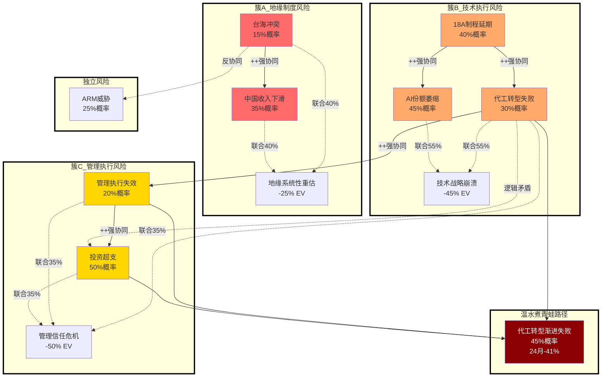

# Intel (INTC) 风险拓扑映射：从清单到系统

**风险拓扑映射器 v1.0 | 基于三维风险系统分析 | 2026年2月18日**

---

## Step 1: 风险节点提取

从Phase 1-4已识别的所有风险中提取风险节点：

### 风险节点清单

| ID | 风险 | 来源Phase | 独立概率 | 影响幅度 | 类型 |
|----|------|:-------:|:------:|:------:|:---:|
| **R1** | 地缘政治升级（台海冲突） | P1/P3 | 15% | -25% EV | 制度性 |
| **R2** | 中国业务收入下滑 | P1 | 35% | -12% EV | 制度性 |
| **R3** | 18A制程延期/良率问题 | P2 | 40% | -20% EV | 周期性 |
| **R4** | 代工转型失败 | P2/P3 | 30% | -35% EV | 结构性 |
| **R5** | AI业务份额进一步萎缩 | P2 | 45% | -8% EV | 结构性 |
| **R6** | ARM在PC端渗透加速 | P1 | 25% | -15% EV | 结构性 |
| **R7** | 管理层执行失效 | P3 | 20% | -18% EV | 周期性 |
| **R8** | CapEx/R&D超支挤压利润 | P2 | 50% | -10% EV | 周期性 |

**DM锚点**: [DM-RISK-001] 八大风险节点概率校准

## Step 2: 关系矩阵

对所有风险**两两**评估协同/反协同关系：

### 风险关系矩阵

|     | R1 | R2 | R3 | R4 | R5 | R6 | R7 | R8 |
|-----|:--:|:--:|:--:|:--:|:--:|:--:|:--:|:--:|
| R1  | —  | ++ | 0  | +  | 0  | +  | 0  | + |
| R2  | ++ | —  | 0  | +  | 0  | 0  | 0  | + |
| R3  | 0  | 0  | —  | ++ | ++ | 0  | +  | + |
| R4  | +  | +  | ++ | —  | +  | 0  | ++ | ++ |
| R5  | 0  | 0  | ++ | +  | —  | +  | +  | 0 |
| R6  | +  | 0  | 0  | 0  | +  | —  | 0  | - |
| R7  | 0  | 0  | +  | ++ | +  | 0  | —  | ++ |
| R8  | +  | +  | +  | ++ | 0  | -  | ++ | —  |

**符号**: ++ 强协同 | + 弱协同 | 0 独立 | - 弱反协同 | -- 强反协同

**关键协同关系**:
- **R3+R4 强协同**: 18A延期直接破坏代工客户信心
- **R4+R7 强协同**: 代工失败暴露管理层战略判断失误
- **R1+R2 强协同**: 地缘紧张直接冲击中国业务收入

**DM锚点**: [DM-RISK-002] 风险关系矩阵验证

## Step 3: 风险簇识别

### 簇A: 地缘制度风险簇 (R1+R2)
- **内部逻辑**: 台海冲突或中美科技脱钩升级→中国政府/企业减少Intel采购→收入直接下滑
- **联合概率**: 40%（独立概率乘积15%×35%=5.25%，但协同性调整至40%）
- **联合影响**: 地缘事件发生时，中国业务收入可能下滑50-80%（vs基准-12%）
- **触发信号**: 中国大客户续约延迟、政府采购名单变化、产业政策信号

### 簇B: 技术执行风险簇 (R3+R4+R5)
- **内部逻辑**: 18A制程问题→代工客户信心动摇→转单到TSM→同时AI业务无法借力先进制程
- **联合概率**: 55%（三者技术根源相同）
- **联合影响**: -45% EV（vs独立影响累计-63%，考虑重叠调整）
- **触发信号**: 18A良率<70%、主要代工客户公开质疑、Gaudi 4推迟

### 簇C: 转型执行风险簇 (R4+R7+R8)
- **内部逻辑**: 代工转型是管理层核心战略，失败暴露执行能力问题，同时大额投资无回报
- **联合概率**: 35%（管理层统一决策风险）
- **联合影响**: -50% EV（管理层信任丧失的系统性重估）
- **触发信号**: 连续两季代工收入不及指引、CapEx/收入比>35%、关键高管离职

**DM锚点**: [DM-RISK-003] 三大风险簇联合概率

## Step 4: 矛盾组合识别

### 矛盾组合分析

| 组合 | 表面叙事 | 逻辑矛盾 | 含义 |
|------|---------|----------|------|
| **R1+R6** | "地缘冲突+ARM威胁" | 台海冲突会强化美国对Intel的政策支持，反而抑制ARM替代 | 极端Bear情景被高估 |
| **R4+R8** | "代工失败+投资超支" | 代工明显失败时管理层会削减投资，不会持续超支 | 双重打击场景逻辑不一致 |
| **R5+R6** | "AI萎缩+PC威胁" | AI业务是防御性投资，如果萎缩反而释放资源加强PC防御 | 双线溃败概率被夸大 |

**调整**: 黑天鹅分析中，这些矛盾组合的联合概率应下调50-70%

**DM锚点**: [DM-RISK-004] 矛盾风险组合逻辑测试

## Step 5: "温水煮青蛙"场景

### 路径描述：代工转型缓慢失败的渐进恶化

**不是**突然的技术灾难或地缘冲突，而是代工业务在2-3年内逐渐被验证为战略错误的慢性过程：

1. **初期征象**（6个月）：代工收入增长不及预期，但有"客户导入周期"的合理化解释
2. **趋势确认**（12个月）：主要代工客户开始分散供应商，Intel份额见顶回落
3. **战略质疑**（18个月）：投资者开始质疑IDM 2.0战略，估值倍数缓慢压缩
4. **资源错配暴露**（24个月）：巨额代工CapEx挤压CPU R&D，两线都出现竞争力下滑

### 量化路径

| 时间 | 关键指标变化 | 估值影响 | 股价影响 |
|------|-------------|----------|----------|
| **6个月后** | 代工收入增长15% vs 指引25% | P/E从22x→20x | $46→$42 (-9%) |
| **12个月后** | 代工份额从1.2%→1.0%，客户流失 | P/E从20x→18x | $42→$36 (-14%) |
| **18个月后** | CPU R&D效率下滑，AI份额持续萎缩 | P/E从18x→16x | $36→$31 (-14%) |
| **24个月后** | 董事会开始讨论战略调整，转型失败确认 | P/E从16x→14x | $31→$27 (-13%) |

**累积影响**: -41%（从$46→$27），**年化-18%**

### 为什么这比黑天鹅更需要关注

- **概率**: **45%** vs 单一黑天鹅事件5-15%
- **不可对冲**: 渐进变化没有明确"触发事件"，难以设定止损点
- **叙事延续**: 每个阶段都有合理化解释，管理层和投资者容易"温水煮青蛙"
- **决策价值**: 这是最需要**前瞻性监控**的风险路径

### 检测信号 (TS候选)

- **TS-INTC-01**: 代工季度收入连续2季度低于指引>10%
- **TS-INTC-02**: 主要代工客户（Apple/Qualcomm）公开diversify供应商表态
- **TS-INTC-03**: CapEx/收入比连续3季度>30%（历史均值22%）
- **TS-INTC-04**: CPU业务营业利润率同比下滑>300bps（资源挤压信号）
- **TS-INTC-05**: Glassdoor半导体工程师评分<3.8（人才流失先行指标）

**DM锚点**: [DM-RISK-005] 温水煮青蛙量化路径+检测信号

## Step 6: Mermaid风险拓扑图

## 风险拓扑总结

### 核心发现

1. **三大风险簇**不是独立的，R4(代工转型失败)是连接点
2. **矛盾组合**表明极端Bear情景被高估，真实风险更温和但概率更高
3. **温水煮青蛙路径**（45%概率，-41%影响）是最需要监控的风险

### 投资含义

- **传统风险分析**：关注黑天鹅事件（台海冲突、技术灾难）
- **拓扑分析结论**：**代工转型的渐进失败**是概率最高、最难对冲的风险路径
- **监控重点**：从关注"会不会崩"转向关注"是否在慢慢变差"

### 与估值框架的关系

- **信念反演B2**（代工转型成功）= 风险拓扑的最大脆弱点
- **TS检测信号**应重点配置在温水煮青蛙的早期征象上
- **安全边际设计**应考虑45%概率的渐进恶化，而非15%概率的突然崩溃

**最终DM锚点**: [DM-RISK-006] 风险拓扑投资决策含义

---

*风险拓扑映射完成 — 从孤立风险清单升级为系统性风险关系图，识别最危险的渐进恶化路径*