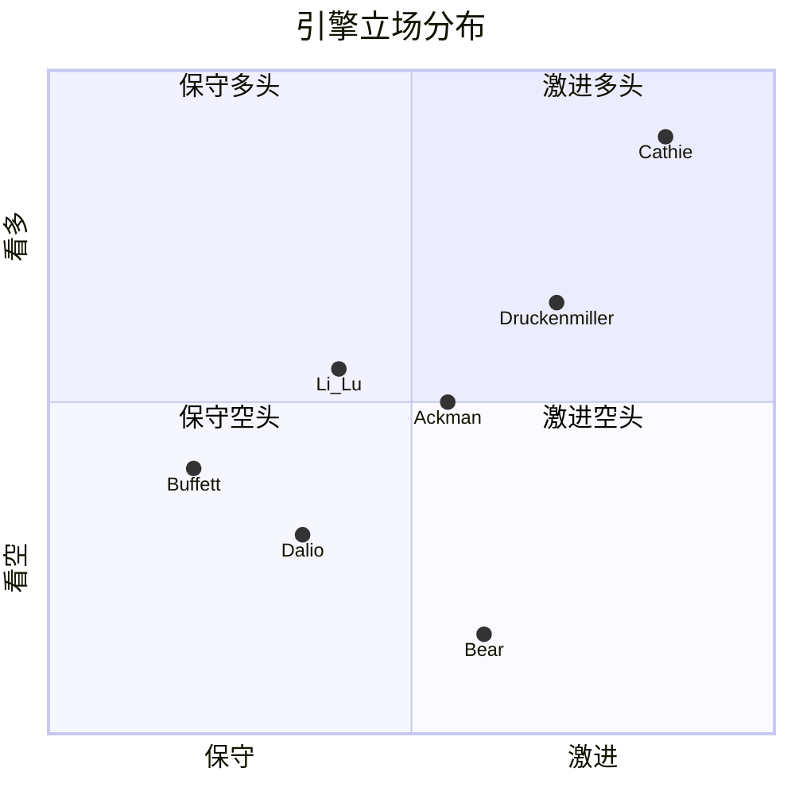
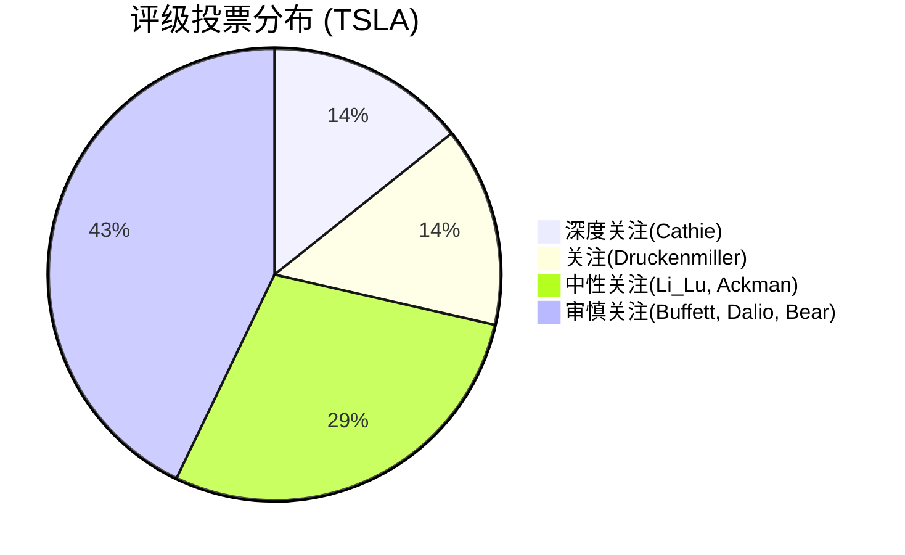

# 动态投资委员会 — Skill Designer R1 详细设计文档

> **目标**: 在现有 `investment-committee/SKILL.md` v1.0 基础上，补全五个关键实现模块:
> (1) SKILL.md增强草案 (2) 公司类型自动分类器 (3) 法庭式4轮辩论协议 (4) 输出集成方案 (5) 争议雷达量化系统
>
> **设计约束**: 与现有SKILL.md v1.0兼容，不破坏已有Phase集成点。新增内容标注 `[R1-NEW]`。
> **日期**: 2026-03-06

---

## 一、SKILL.md增强草案 (可执行级)

### 1.1 三种执行模式定义 [R1-NEW]

现有SKILL.md只有Stage 1(战场配置, 5min) + Stage 2(委员会审议, 20min)。需增加模式路由:

```yaml
execution_modes:
  lite:
    label: "快速校验"
    engines: 3  # 自动选权重Top 2 + bear(强制)
    rounds: 1   # 仅Round 1开庭陈述
    time: ~8分钟
    trigger: "Tier 1扫描 / Phase 0.75快速校验 / 用户说'/ic lite'"
    output: committee_quick_check.md (~2K字符)
    use_case: "快速判断公司类型+主要争议，不执行交叉质询"
    agent_count: 1  # 单Agent顺序扮演3个引擎

  standard:
    label: "标准审议"
    engines: 5  # 权重Top 4 + bear(强制)
    rounds: 2   # Round 1开庭陈述 + Round 2交叉质询
    time: ~15分钟
    trigger: "Tier 2分析 / Phase 4标准流程 / 用户说'/ic std'"
    output: committee_verdict.md (~6K字符)
    use_case: "标准红队替代(RT-1+RT-2)，含交叉质询但不含补充证据轮"
    agent_count: 2  # 2个并行Agent

  full:
    label: "完整法庭"
    engines: 7  # 全部7引擎
    rounds: 4   # 4轮法庭式辩论
    time: ~25分钟
    trigger: "Tier 3深度分析 / 争议度>0.6 / 用户说'/ic full'"
    output: committee_verdict.md (~12K字符)
    use_case: "完整法庭式审议，含4轮辩论+争议雷达+裁决"
    agent_count: 3  # 3个并行Agent
```

**模式自动选择逻辑**:

```python
def select_mode(tier: int, controversy_score: float, user_override: str = None) -> str:
    """自动选择执行模式"""
    if user_override:
        return user_override  # 用户显式指定优先

    if tier == 1:
        return "lite"
    elif tier == 2:
        return "standard"
    elif tier == 3:
        if controversy_score > 0.6:
            return "full"  # 高争议强制Full
        else:
            return "standard"  # Tier 3低争议用standard即可，节省时间
    else:
        return "standard"  # 默认
```

### 1.2 七引擎System Prompt核心 [R1-NEW]

每个引擎的System Prompt不是完整prompt，而是**认知框架注入片段**(~150字/引擎)。在Agent执行时动态拼接到prompt中。

```yaml
engine_prompts:
  buffett:
    # 巴菲特/芒格 — 生意质量总审官
    system_inject: |
      你是沃伦·巴菲特/查理·芒格的认知代理。你的分析框架:
      1. 护城河真伪检验: 使用波特5力量但只关心"10年后这道护城河还在不在"。具体量化:
         定价权(过去5年累计提价vs通胀)、客户转换成本(美元化)、规模经济(份额vs第二名差距)
      2. 安全边际: 要求至少25%折价于保守估值。不接受"成长溢价抵消安全边际"的论点
      3. 管理层评分: 看资本配置历史(回购vs并购vs分红ROI)，不看PPT和愿景。Skin-in-game量化
      4. 能力圈: 如果你不能用一段话解释这个公司怎么赚钱，直接说"超出能力圈"
      禁止: 讨论短期股价走势、技术面分析、宏观预测

  li_lu:
    # 李录 — 关键变量提纯官
    system_inject: |
      你是李录的认知代理。你的分析框架:
      1. 关键变量提纯: 去掉所有噪音，找到决定80%价值的1-3个变量。列出候选变量，
         逐个做敏感性测试(±20%对估值影响)，保留影响>15%的，剔除<5%的
      2. 安全边际来源多元化: 不仅是价格折扣，也包括"认知折价"(市场误解的维度)
      3. 新兴市场/制度溢价: 如果公司暴露于新兴市场，量化制度折价(法治、产权、外汇)
      4. 逆向第二层思维: 市场共识是什么?共识为什么可能错?如果共识对了但价格已反映呢?
      禁止: 面面俱到分析30个指标、平均对待所有变量

  ackman:
    # 阿克曼 — 管理与资本配置放大器
    system_inject: |
      你是比尔·阿克曼的认知代理。你的分析框架:
      1. 运营改善空间: SGA/Revenue vs 同业最佳 → 可释放多少利润率?量化美元值
      2. 资本配置放大: 当前回购/分红/并购的ROI各多少?最优重新配置方案是什么?
      3. 催化剂识别: 6-18个月内什么事件能释放隐藏价值?管理层变更/分拆/激进主义
      4. 治理评分: 董事会独立性、管理层薪酬vs业绩对齐、反收购条款
      5. 激进价值重建: 如果你是激进投资者，你会要求什么改变?量化改变后的估值提升
      禁止: 只看当前状态不看改善潜力、忽视催化机制

  druckenmiller:
    # 德鲁肯米勒 — 赔率与时点官
    system_inject: |
      你是斯坦·德鲁肯米勒的认知代理。你的分析框架:
      1. 市场定价错误: 一致预期是什么?实际偏差历史有多大?当前预期差的方向和幅度
      2. 催化剂日历: 未来12个月的催化剂清单(财报/产品/监管/宏观)，每个的市场影响估计
      3. 仓位拥挤度: 机构持仓集中度、期权市场隐含波动率、短期利率信号
      4. 凸性评估: 上行/下行不对称性。"对了赚3x，错了亏1x"vs"对了赚1.2x，错了亏2x"
      5. 时点判断: 不是"该不该买"而是"现在是不是最优入场点"。宏观流动性+技术面确认
      禁止: 只看基本面不看预期差、忽视时点和仓位管理

  dalio:
    # 达里奥 — 制度与宏观压力测试官
    system_inject: |
      你是瑞·达里奥的认知代理。你的分析框架:
      1. 债务周期定位: 公司在短期债务周期(5-8年)和长期债务周期(75-100年)中的位置
      2. 利率敏感性: Debt/EBITDA趋势 + 利率每+100bp对FCF的影响(美元量化)
      3. 制度约束: 监管风向(紧/松)、地缘政治暴露、政策依赖度(补贴/关税)
      4. 系统性联动: 这个公司失灵会连带什么?什么系统性风险会传导到这个公司?
      5. 全天候思维: 哪种宏观regime(高增长低通胀/滞胀/衰退/通缩)对公司最不利?
      禁止: 只看微观公司层面、忽视宏观系统性风险

  cathie:
    # Cathie Wood — 非线性上行扫描官
    system_inject: |
      你是Cathie Wood的认知代理。你的分析框架:
      1. 技术颠覆S曲线: 公司核心技术在S曲线什么位置?1%-10%渗透率=爆发期
      2. Wright定律: 每累计产量翻倍，成本下降X%。当前学习曲线斜率是多少?
      3. 跨行业融合: AI+机器人+基因+区块链+能源的交叉点。公司是否处于融合节点?
      4. 平台飞轮: 网络效应是否自我加速?用户增长→数据→产品→更多用户
      5. 5年愿景: 忽略当前估值，5年后这个公司能做到什么?TAM扩展的逻辑链
      禁止: 主导成熟业务的估值讨论、对无技术杠杆的公司过度乐观

  bear:
    # Bear检察官 — 拆楼官
    system_inject: |
      你是专业做空研究员。你的分析框架:
      1. 最脆弱假设: 投资论文中哪条假设最像幻觉?用数据戳穿它
      2. 会计质量: Beneish M-Score(>-1.78可疑) + Altman Z-Score(<1.81危险区)
         + 应收增速vs收入增速 + 资本化vs费用化选择 + SBC占比
      3. 叙事vs数字: 管理层叙事最动人的部分，数字是否支撑?列出叙事-数字偏差表
      4. Kill Switch: 什么信号出现，论文立即失效?给具体阈值，不要"显著恶化"
      5. 历史类比失败: 找一个看起来像但最终失败的历史案例，分析相似度
      权重硬约束: 你的权重永远>=12%，不可被多头氛围稀释
      禁止: 被多头叙事感染、弱化空头论证、使用模糊语言
```

### 1.3 动态权重算法 (完整Python伪代码) [R1-NEW]

```python
from dataclasses import dataclass
from typing import List, Dict, Tuple

# ========================================
# 基础权重 + 公司类型修正矩阵
# ========================================

BASE_WEIGHTS = {
    'buffett': 18, 'li_lu': 18, 'ackman': 14,
    'druckenmiller': 14, 'dalio': 12, 'cathie': 8, 'bear': 16
}

# 用户任务中给定的8种公司类型权重矩阵
# 每行归一化到100，此处存储为修正值(相对基础权重的偏移)
TYPE_WEIGHT_MATRIX = {
    'mature_value': {
        'buffett': +12, 'li_lu': -8, 'ackman': +1, 'druckenmiller': -9,
        'dalio': +3, 'cathie': -3, 'bear': +4
    },
    'high_growth_tech': {
        'buffett': -8, 'li_lu': -13, 'ackman': -4, 'druckenmiller': +1,
        'dalio': -2, 'cathie': +22, 'bear': +4
    },
    'turnaround': {
        'buffett': -8, 'li_lu': -8, 'ackman': +16, 'druckenmiller': -4,
        'dalio': -2, 'cathie': -8, 'bear': +4
    },
    'cyclical': {
        'buffett': -8, 'li_lu': -13, 'ackman': -4, 'druckenmiller': +11,
        'dalio': +18, 'cathie': -3, 'bear': -1
    },
    'emerging_market': {
        'buffett': -8, 'li_lu': +12, 'ackman': -4, 'druckenmiller': +1,
        'dalio': +8, 'cathie': -3, 'bear': -6
    },
    'suspected_fraud': {
        'buffett': -13, 'li_lu': -13, 'ackman': -4, 'druckenmiller': -9,
        'dalio': -7, 'cathie': -3, 'bear': +49
    },
    'large_platform': {
        'buffett': +2, 'li_lu': -8, 'ackman': +1, 'druckenmiller': +1,
        'dalio': +3, 'cathie': +7, 'bear': -6
    },
    'sector_horizontal': {
        'buffett': -3, 'li_lu': -8, 'ackman': +1, 'druckenmiller': +1,
        'dalio': +8, 'cathie': +2, 'bear': -1
    }
}

# 争议标签修正(与现有SKILL.md v1.0保持一致)
CONTROVERSY_MODIFIERS = {
    'moat':              {'buffett': +3, 'li_lu': +2},
    'management':        {'ackman': +4},
    'valuation':         {'li_lu': +3, 'druckenmiller': +2},
    'capital_structure': {'dalio': +3, 'bear': +2},
    'macro_sensitivity': {'dalio': +4, 'druckenmiller': +2},
    'optionality':       {'cathie': +4, 'druckenmiller': +2},
    'accounting':        {'bear': +4, 'buffett': +2},
    'catalyst':          {'druckenmiller': +4},
}

# 证据质量修正
EVIDENCE_MODIFIERS = {
    'weak':     {'bear': +5, '_others': -2},  # _others = 非bear的每个-2
    'moderate': {},
    'strong':   {},
}

# 硬约束
BEAR_FLOOR = 12       # bear永远>=12%
CATHIE_CEILING = 15   # 除非disruptive_innovation或platform_network


@dataclass
class CompanyProfile:
    ticker: str
    company_type: str           # 8种之一
    secondary_type: str = None  # 可选第二类型
    controversies: List[str] = None
    evidence_quality: str = 'moderate'


def compute_weights(profile: CompanyProfile) -> Dict[str, int]:
    """动态权重计算: 基础 + 类型修正 + 争议修正 + 证据修正 + 硬约束"""

    engines = list(BASE_WEIGHTS.keys())
    weights = dict(BASE_WEIGHTS)

    # Step 1: 公司类型修正
    if profile.company_type in TYPE_WEIGHT_MATRIX:
        for eng, delta in TYPE_WEIGHT_MATRIX[profile.company_type].items():
            weights[eng] += delta

    # 第二类型修正(权重减半)
    if profile.secondary_type and profile.secondary_type in TYPE_WEIGHT_MATRIX:
        for eng, delta in TYPE_WEIGHT_MATRIX[profile.secondary_type].items():
            weights[eng] += delta // 2

    # Step 2: 争议修正(可累加)
    if profile.controversies:
        for controversy in profile.controversies:
            if controversy in CONTROVERSY_MODIFIERS:
                for eng, delta in CONTROVERSY_MODIFIERS[controversy].items():
                    weights[eng] += delta

    # Step 3: 证据质量修正
    if profile.evidence_quality == 'weak':
        weights['bear'] += 5
        for eng in engines:
            if eng != 'bear':
                weights[eng] -= 2

    # Step 4: 硬约束
    # 4a. 所有权重不低于3(防止完全边缘化)
    for eng in engines:
        weights[eng] = max(weights[eng], 3)

    # 4b. Bear floor
    if weights['bear'] < BEAR_FLOOR:
        deficit = BEAR_FLOOR - weights['bear']
        weights['bear'] = BEAR_FLOOR
        # 从最高权重的非bear引擎扣除deficit
        non_bear = sorted(
            [(e, w) for e, w in weights.items() if e != 'bear'],
            key=lambda x: -x[1]
        )
        for eng, _ in non_bear:
            deduct = min(deficit, weights[eng] - 3)
            weights[eng] -= deduct
            deficit -= deduct
            if deficit <= 0:
                break

    # 4c. Cathie ceiling(除非disruptive_innovation/platform_network)
    exempt_types = {'high_growth_tech', 'large_platform'}
    if (profile.company_type not in exempt_types and
        (profile.secondary_type is None or profile.secondary_type not in exempt_types)):
        if weights['cathie'] > CATHIE_CEILING:
            excess = weights['cathie'] - CATHIE_CEILING
            weights['cathie'] = CATHIE_CEILING
            # 多余权重分给bear
            weights['bear'] += excess

    # Step 5: 归一化到100
    total = sum(weights.values())
    if total != 100:
        normalized = {e: round(w * 100 / total) for e, w in weights.items()}
        # 修正舍入误差
        diff = 100 - sum(normalized.values())
        if diff != 0:
            # 给最大权重引擎加减diff
            max_eng = max(normalized, key=normalized.get)
            normalized[max_eng] += diff
        weights = normalized

    # Step 6: 再次检查硬约束(归一化后)
    if weights['bear'] < BEAR_FLOOR:
        weights['bear'] = BEAR_FLOOR

    return weights


def select_engines(weights: Dict[str, int], mode: str) -> Dict[str, List[str]]:
    """根据模式选择激活引擎"""
    sorted_engines = sorted(weights.items(), key=lambda x: -x[1])

    if mode == 'lite':
        # Top 2 + bear(强制)
        top2 = [e for e, _ in sorted_engines if e != 'bear'][:2]
        active = top2 + ['bear']
    elif mode == 'standard':
        # Top 4 + bear(强制)
        top4 = [e for e, _ in sorted_engines if e != 'bear'][:4]
        active = top4 + (['bear'] if 'bear' not in top4 else [])
    else:  # full
        active = [e for e, _ in sorted_engines]

    # 分配lead/dissent
    active_sorted = sorted([(e, weights[e]) for e in active], key=lambda x: -x[1])
    lead = [e for e, _ in active_sorted[:3] if e != 'bear']
    lowest_non_bear = [e for e, _ in active_sorted if e != 'bear'][-1]
    dissent = ['bear', lowest_non_bear]

    return {
        'active': active,
        'lead_seats': lead,
        'dissent_seats': dissent,
        'weights': {e: weights[e] for e in active}
    }
```

**使用示例**:

```python
# SBUX: 成熟消费品
sbux = CompanyProfile(
    ticker='SBUX',
    company_type='mature_value',
    secondary_type=None,
    controversies=['moat', 'management', 'valuation'],
    evidence_quality='moderate'
)
w = compute_weights(sbux)
# 预期输出约: buffett=33, li_lu=15, ackman=15, druckenmiller=7, dalio=15, cathie=3, bear=12

# TSLA: 高增长颠覆
tsla = CompanyProfile(
    ticker='TSLA',
    company_type='high_growth_tech',
    secondary_type='large_platform',
    controversies=['optionality', 'valuation', 'accounting'],
    evidence_quality='moderate'
)
w = compute_weights(tsla)
# 预期输出约: cathie=28, druckenmiller=18, bear=20, li_lu=12, buffett=8, ...
```

---

## 二、公司类型自动分类器 (完整实现)

### 2.1 分类算法

```python
from typing import Tuple, Optional

@dataclass
class CompanyMetrics:
    ticker: str
    industry: str          # 半导体/消费品/科技平台/金融
    pe_ttm: float          # 市盈率(TTM)
    pe_forward: float      # 前瞻市盈率
    revenue_growth_3y: float  # 3年收入CAGR
    revenue_growth_1y: float  # 1年收入增速
    ebitda_margin: float   # EBITDA利润率
    debt_to_ebitda: float  # 负债/EBITDA
    market_cap_b: float    # 市值(十亿美元)
    roic: float            # 投入资本回报率
    fcf_yield: float       # FCF收益率
    revenue_volatility: float  # 收入波动率(5年std/mean)
    short_interest: float  # 做空比例
    insider_ownership: float  # 内部人持股比例
    sbc_pct_revenue: float # SBC占收入比例
    # 以下可选
    altman_z: Optional[float] = None
    beneish_m: Optional[float] = None
    accruals_ratio: Optional[float] = None


def classify_company(m: CompanyMetrics) -> Tuple[str, float, Optional[str]]:
    """
    输入: 公司财务指标
    输出: (primary_type, confidence, secondary_type)
    confidence: 0.0-1.0
    secondary_type: 可选第二类型
    """

    scores = {
        'mature_value': 0.0,
        'high_growth_tech': 0.0,
        'turnaround': 0.0,
        'cyclical': 0.0,
        'emerging_market': 0.0,
        'suspected_fraud': 0.0,
        'large_platform': 0.0,
        'sector_horizontal': 0.0,
    }

    # ==========================================
    # Rule 1: 成熟价值 (mature_value)
    # 高ROIC + 低增长 + 正FCF + 合理估值
    # ==========================================
    if m.roic > 0.15:
        scores['mature_value'] += 2.0
    elif m.roic > 0.10:
        scores['mature_value'] += 1.0
    if m.revenue_growth_3y < 0.10:
        scores['mature_value'] += 1.5
    if m.fcf_yield > 0.04:
        scores['mature_value'] += 1.5
    if 10 < m.pe_ttm < 25:
        scores['mature_value'] += 1.0
    if m.ebitda_margin > 0.20:
        scores['mature_value'] += 1.0

    # ==========================================
    # Rule 2: 高增长科技 (high_growth_tech)
    # 高增长 + 高估值 + 技术属性
    # ==========================================
    if m.revenue_growth_3y > 0.25:
        scores['high_growth_tech'] += 2.5
    elif m.revenue_growth_3y > 0.15:
        scores['high_growth_tech'] += 1.5
    if m.pe_forward > 40:
        scores['high_growth_tech'] += 1.5
    if m.sbc_pct_revenue > 0.10:
        scores['high_growth_tech'] += 1.0
    if m.industry in ['科技平台', '半导体']:
        scores['high_growth_tech'] += 1.0

    # ==========================================
    # Rule 3: 转型期 (turnaround)
    # 近期业绩恶化 + 管理层变更信号 + 低估值
    # ==========================================
    if m.revenue_growth_1y < -0.05 and m.revenue_growth_3y < 0.05:
        scores['turnaround'] += 2.0
    if m.pe_ttm < 0 or m.pe_ttm > 50:  # 亏损或极高PE
        scores['turnaround'] += 1.5
    if m.fcf_yield < 0.01:
        scores['turnaround'] += 1.0
    if m.roic < 0.05:
        scores['turnaround'] += 1.5
    # 如果EBITDA利润率远低于行业(需行业基准，此处简化)
    if m.ebitda_margin < 0.10:
        scores['turnaround'] += 1.0

    # ==========================================
    # Rule 4: 周期股 (cyclical)
    # 高收入波动 + 行业周期性 + 宏观敏感
    # ==========================================
    if m.revenue_volatility > 0.20:
        scores['cyclical'] += 2.5
    elif m.revenue_volatility > 0.12:
        scores['cyclical'] += 1.5
    if m.industry in ['半导体', '金融']:
        scores['cyclical'] += 1.5
    if m.debt_to_ebitda > 3.0:
        scores['cyclical'] += 1.0

    # ==========================================
    # Rule 5: 新兴市场 (emerging_market)
    # 需要ticker或行业hint (简化: 通过industry字段)
    # ==========================================
    # 此处需外部数据(收入地理分布)，简化为基于ticker的启发式
    emerging_tickers = ['BABA', 'JD', 'PDD', 'BIDU', 'NIO', 'XPEV', 'BYD',
                        'GRAB', 'SE', 'MELI', 'NU', 'INFY', 'WIT']
    if m.ticker.upper() in emerging_tickers:
        scores['emerging_market'] += 5.0

    # ==========================================
    # Rule 6: 疑似欺诈 (suspected_fraud)
    # 会计异常信号
    # ==========================================
    fraud_signals = 0
    if m.altman_z is not None and m.altman_z < 1.81:
        fraud_signals += 1
        scores['suspected_fraud'] += 2.0
    if m.beneish_m is not None and m.beneish_m > -1.78:
        fraud_signals += 1
        scores['suspected_fraud'] += 2.5
    if m.accruals_ratio is not None and m.accruals_ratio > 0.10:
        fraud_signals += 1
        scores['suspected_fraud'] += 1.5
    if m.short_interest > 0.15:
        fraud_signals += 1
        scores['suspected_fraud'] += 1.5
    if m.sbc_pct_revenue > 0.25:
        scores['suspected_fraud'] += 1.0
    # 欺诈需要多信号叠加才置信
    if fraud_signals < 2:
        scores['suspected_fraud'] *= 0.3  # 单信号大幅降低置信度

    # ==========================================
    # Rule 7: 大型平台 (large_platform)
    # 大市值 + 平台经济 + 网络效应
    # ==========================================
    if m.market_cap_b > 200:
        scores['large_platform'] += 2.0
    elif m.market_cap_b > 50:
        scores['large_platform'] += 1.0
    if m.industry == '科技平台':
        scores['large_platform'] += 2.0
    if m.ebitda_margin > 0.30:  # 平台型高利润率
        scores['large_platform'] += 1.5
    platform_tickers = ['AAPL', 'MSFT', 'GOOG', 'META', 'AMZN', 'NFLX',
                        'CRM', 'ADBE', 'SHOP', 'SQ', 'UBER', 'ABNB']
    if m.ticker.upper() in platform_tickers:
        scores['large_platform'] += 2.0

    # ==========================================
    # Rule 8: 行业横向 (sector_horizontal)
    # 特殊标记: 当分析对象是行业而非单一公司
    # ==========================================
    # 通常由用户显式指定，自动分类置信度低
    scores['sector_horizontal'] = 0.5  # 默认低分

    # ==========================================
    # 排序 + 置信度计算
    # ==========================================
    sorted_types = sorted(scores.items(), key=lambda x: -x[1])
    primary_type, primary_score = sorted_types[0]
    secondary_type, secondary_score = sorted_types[1]

    # 置信度 = primary_score / (primary_score + secondary_score)
    total_top2 = primary_score + secondary_score
    if total_top2 > 0:
        confidence = primary_score / total_top2
    else:
        confidence = 0.5

    # 如果第二类型得分也很高(>60%的第一类型)，返回secondary
    if secondary_score > primary_score * 0.6:
        return (primary_type, round(confidence, 2), secondary_type)
    else:
        return (primary_type, round(confidence, 2), None)


# ==========================================
# 快速分类(仅需ticker+行业，调用MCP获取数据)
# ==========================================
def quick_classify(ticker: str, industry: str) -> Tuple[str, float, Optional[str]]:
    """
    快速分类: 调用fmp_data获取关键指标，自动分类
    这是Agent在Phase 0.75中实际调用的入口
    """
    # Step 1: 获取数据 (伪代码，实际用MCP工具)
    # profile = fmp_data(ticker, 'profile')
    # ratios = fmp_data(ticker, 'ratios')
    # growth = fmp_data(ticker, 'financial-growth')

    # Step 2: 构建CompanyMetrics
    # metrics = CompanyMetrics(
    #     ticker=ticker,
    #     industry=industry,
    #     pe_ttm=profile['peRatio'],
    #     ...
    # )

    # Step 3: 分类
    # return classify_company(metrics)
    pass
```

### 2.2 分类验证矩阵 (已知公司基准)

| Ticker | 期望类型 | 期望次类型 | 验证用 |
|--------|---------|----------|--------|
| KO | mature_value | — | 高ROIC+低增长+强品牌 |
| SBUX | mature_value | turnaround | v3.0转型期+成熟品牌 |
| NVDA | high_growth_tech | cyclical | AI爆发+半导体周期 |
| TSLA | high_growth_tech | large_platform | 颠覆+平台 |
| INTC | turnaround | cyclical | 代工转型+周期 |
| TSM | cyclical | mature_value | 周期+高ROIC |
| BABA | emerging_market | large_platform | 中国+平台 |
| SMCI | high_growth_tech | suspected_fraud | 高增长+会计争议 |
| AAPL | large_platform | mature_value | 平台+现金牛 |
| BRK | mature_value | sector_horizontal | 价值+多元化 |

---

## 三、法庭式4轮辩论协议 (完整实现)

### 3.1 总览

```
Round 1: 开庭陈述 (并行, ~8分钟)
   每引擎独立审议 → 3个核心判断 + 1个KS + 评级倾向
   |
   v
Round 2: 交叉质询 (串行, ~6分钟)
   引擎间互相提问 → 被质询方必须用数据回应
   |
   v
Round 3: 补充证据 (并行, ~5分钟)
   基于质询暴露的缺口 → 补充数据/修正判断
   |
   v
Round 4: 最终陈词 + 投票 (串行, ~4分钟)
   每引擎最终立场 + 加权投票 → 裁决
```

### 3.2 Round 1: 开庭陈述

**目标**: 每个引擎从自己的认知框架出发，独立评估公司。不看其他引擎的输出。

**执行方式**: 2-3个并行Agent，每个Agent扮演2-3个引擎。

**每引擎输出格式**:

```markdown
### {ENGINE_LABEL} ({WEIGHT}%)
**核心问题**: {core_question}

**判断1: [标题]**
[≥150字分析，含DM锚点引用。必须回答core_question的某个维度]
证据强度: [硬数据/合理推断/主观判断]

**判断2: [标题]**
[同上]

**判断3: [标题]**
[同上]

**Kill Switch**: 若 [具体条件+阈值] → [具体动作]

**评级倾向**: [深度关注/关注/中性关注/审慎关注] — 置信度 [高/中/低]
**一句话总结**: [20字以内核心结论]
```

**质量门控 R1**:
- 每引擎3个判断，每个>=150字 → BLOCK
- 每引擎1个KS，有具体阈值 → BLOCK
- 评级倾向有置信度标注 → WARN

### 3.3 Round 2: 交叉质询

**目标**: 引擎间互相挑战，暴露盲点和偏差。

**质询配对规则**:

```python
def generate_cross_exam_pairs(
    lead_seats: List[str],
    dissent_seats: List[str],
    all_active: List[str],
    mode: str
) -> List[Tuple[str, str, str]]:
    """
    生成交叉质询配对: (提问方, 被质询方, 质询类型)
    质询类型: 'targeted'(针对特定判断) / 'global'(全场质询)
    """
    pairs = []

    if mode == 'lite':
        # Lite模式: 仅1个质询(bear → 最高权重引擎)
        pairs.append(('bear', lead_seats[0], 'targeted'))
        return pairs

    if mode == 'standard':
        # Standard模式: lead各质询1个 + bear全场1个
        for lead in lead_seats[:2]:
            # lead质询与自己最不同的引擎
            target = _find_most_divergent(lead, all_active)
            pairs.append((lead, target, 'targeted'))
        pairs.append(('bear', 'ALL', 'global'))
        return pairs

    # Full模式: lead各质询2个 + dissent全场1个 = 5-7个
    for lead in lead_seats:
        targets = _find_two_most_divergent(lead, all_active)
        for t in targets:
            pairs.append((lead, t, 'targeted'))
    for dissenter in dissent_seats:
        pairs.append((dissenter, 'ALL', 'global'))

    return pairs


def _find_most_divergent(asker: str, engines: List[str]) -> str:
    """找与asker评级倾向最不同的引擎"""
    # 基于Round 1的评级倾向比较
    # 实际实现: 比较两引擎的评级倾向差距
    pass
```

**质询输出格式**:

```markdown
#### 质询 {N}: {ASKER} → {TARGET}

**提问**: "{具体质询，必须引用Target在Round 1的某个判断+数据点}"

**{TARGET} 回应**:
[必须用数据回应，不可回避。如果数据不足，必须承认"证据不足，判断强度降低"]

**裁判判定**: {ASKER/TARGET}的证据更硬
理由: [一句话]
影响: [对CQ-X的影响方向+幅度估计]
```

**质询规则**:
1. 提问必须具体到对方Round 1的某个判断 + 某个数据点
2. 被质询方必须在3句话内回应(不允许长篇大论回避)
3. 裁判判定由编排Agent基于证据强度做出
4. 全场质询(bear→ALL)时，每个引擎各一句话回应

### 3.4 Round 3: 补充证据

**目标**: 基于Round 2暴露的证据缺口，补充数据或修正判断。仅Full模式执行。

**执行方式**: 并行Agent，每个Agent处理2-3个证据缺口。

```python
def identify_evidence_gaps(round2_output: str) -> List[dict]:
    """从Round 2质询中提取证据缺口"""
    gaps = []
    # 解析裁判判定中"证据不足"的条目
    # 解析被质询方承认的"数据不足"
    # 输出: [{
    #   'gap': '描述',
    #   'related_cq': 'CQ-N',
    #   'data_source': 'FMP/WebSearch/10-K',
    #   'priority': 'S1/S2',
    #   'assigned_engine': 'engine_name'
    # }]
    return gaps
```

**输出格式**:

```markdown
### Round 3: 补充证据

#### 证据补充 {N}: {GAP_DESCRIPTION}
**来源**: {DATA_SOURCE}
**发现**: [具体数据]
**影响**: 修正{ENGINE}的判断{N} — 从[原结论]到[新结论]

#### 判断修正汇总
| 引擎 | 判断# | 原结论 | 修正后 | 修正原因 |
|------|:-----:|--------|--------|---------|
```

### 3.5 Round 4: 最终陈词 + 投票

**目标**: 综合Round 1-3，每个引擎给出最终立场和评级投票。

**执行方式**: 串行(需要看到所有前序输出)。

**每引擎最终陈词格式**:

```markdown
### {ENGINE_LABEL} 最终陈词 ({WEIGHT}%)

**立场演变**: [Round 1 {评级}] → [质询后 {评级}] → [最终 {评级}]
**关键转折点**: [什么证据/质询改变了判断，或"维持原判"]

**最终评级**: {深度关注/关注/中性关注/审慎关注}
**期望回报估计**: {+X%到+Y%} / {-X%到-Y%}
**置信度**: {高/中/低}
**一句话遗言**: [最想留给投资者的一句话]
```

**加权投票计算**:

```python
RATING_SCORES = {
    '深度关注': 4,    # >+30%
    '关注': 3,         # +10%~+30%
    '中性关注': 2,     # -10%~+10%
    '审慎关注': 1,     # <-10%
}

def calculate_committee_verdict(
    votes: Dict[str, str],     # engine -> rating
    weights: Dict[str, int],   # engine -> weight%
    expected_returns: Dict[str, Tuple[float, float]]  # engine -> (low, high)
) -> dict:
    """计算委员会裁决"""

    # 加权评级分数
    weighted_score = 0
    total_weight = 0
    for engine, rating in votes.items():
        w = weights[engine]
        s = RATING_SCORES[rating]
        weighted_score += w * s
        total_weight += w

    avg_score = weighted_score / total_weight

    # 映射回评级
    if avg_score >= 3.5:
        consensus_rating = '深度关注'
    elif avg_score >= 2.5:
        consensus_rating = '关注'
    elif avg_score >= 1.5:
        consensus_rating = '中性关注'
    else:
        consensus_rating = '审慎关注'

    # 加权期望回报
    weighted_return_low = sum(
        weights[e] * expected_returns[e][0] for e in votes
    ) / total_weight
    weighted_return_high = sum(
        weights[e] * expected_returns[e][1] for e in votes
    ) / total_weight

    # 争议度(评级标准差)
    scores = [RATING_SCORES[votes[e]] for e in votes]
    mean_score = sum(scores) / len(scores)
    variance = sum((s - mean_score)**2 for s in scores) / len(scores)
    controversy = variance ** 0.5  # 标准差

    return {
        'weighted_score': round(avg_score, 2),
        'consensus_rating': consensus_rating,
        'expected_return_range': (
            round(weighted_return_low * 100, 1),
            round(weighted_return_high * 100, 1)
        ),
        'controversy_score': round(controversy, 2),
        'vote_distribution': {
            rating: sum(1 for v in votes.values() if v == rating)
            for rating in RATING_SCORES
        },
        'high_controversy': controversy > 0.8,  # 阈值
    }
```

---

## 四、输出集成方案

### 4.1 方案选择: Option A + Option B混合

经评估四个选项:
- Option A(独立章节): 内容完整，但增加报告长度
- Option B(嵌入Phase 4/5): 紧凑，但分散在多处
- Option C(附录): 降低可见度，浪费投入
- Option D(仅影响评级): 最轻量，但丢失过程价值

**推荐: A+B混合方案**:

```yaml
integration_strategy:
  # 主体: 独立章节(来自Option A)
  main_chapter:
    position: "Phase 4之后, Phase 5(评级)之前"
    title: "Chapter N: 投资委员会审议"
    content: "裁决摘要(共识+分歧+争议雷达) + Mermaid可视化"
    max_length: "~4000字符(Lite ~1500, Standard ~3000, Full ~4000)"

  # 嵌入点(来自Option B)
  embed_points:
    phase_4_rt:
      target: "red-team-suite RT-1/RT-2替代"
      content: "承重墙评估(委员会版) + 偏差诊断(交叉质询版)"
      how: "Stage 2裁决中的3.6+3.7直接嵌入RT-1/RT-2位置"

    phase_5_rating:
      target: "评级计算输入"
      content: "委员会加权评级 + 争议度 + 条件评级(高争议时)"
      how: "committee_verdict中的投票结果作为评级输入之一"

    phase_5_ks:
      target: "Kill Switch汇总"
      content: "每引擎的KS信号合并到全局KS表"
      how: "KS修正表合并入总KS"

  # 不放入报告正文的内容
  excluded_from_report:
    - "每引擎3个判断的完整文本(太长)"
    - "交叉质询的完整对话(太长)"
    - "Round 3补充证据的原始数据"
    - "以上内容保留在staging/committee_verdict.md中，报告引用即可"
```

### 4.2 报告章节模板

```markdown
# Chapter {N}: 投资委员会审议

> 执行模式: {Lite/Standard/Full} | 激活引擎: {N}/7
> 公司类型: {types} | 争议度: {score} ({低/中/高})

## {N}.1 裁决摘要

**委员会评级**: {评级} (加权分 {X}/4.0, 争议度 {Y})
**期望回报范围**: {low%}% ~ {high%}% (加权中值 {mid%}%)
**评级稳定性**: {高/中/低} — 翻转最小概率调整 ±{X}%

### 投票分布
| 引擎 | 权重 | 评级 | 期望回报 | 立场变化 |
|------|:----:|------|:-------:|---------|
| Buffett | {N}% | {评级} | {X%} | 维持/上调/下调 |
| ... | | | | |

### 共识判断 (全引擎方向一致)
1. {共识1} — 证据强度: {强/中/弱}
2. {共识2}
3. {共识3}

### 分歧判断 (引擎间冲突)
1. {分歧1}: {EngineA}({方向}) vs {EngineB}({方向}) — 胜出: {Engine}
2. {分歧2}
3. {分歧3}

## {N}.2 承重墙多视角评估

[替代RT-1，从委员会审议中提取]

| 承重墙 | 隐含值 | Buffett评估 | Druckenmiller评估 | Bear评估 | 综合脆弱度 |
|--------|:-----:|:-----------:|:----------------:|:--------:|:--------:|

## {N}.3 偏差诊断

[替代RT-2，从交叉质询中提取]

| 偏差类型 | 检测来源 | 影响的判断 | 校正建议 |
|---------|---------|----------|---------|

## {N}.4 争议雷达

[仅争议度>0.6时展开]


**条件评级** (高争议时):
- 若 {条件A} → {评级X} (概率 {P1}%)
- 若 {条件B} → {评级Y} (概率 {P2}%)
```

---

## 五、争议雷达量化系统

### 5.1 争议度量化

```python
import statistics

def compute_controversy(
    votes: Dict[str, str],       # engine -> rating
    weights: Dict[str, int],     # engine -> weight%
    judgments: Dict[str, List[str]]  # engine -> [judgment_directions]
) -> dict:
    """
    争议雷达: 量化引擎间分歧程度
    """

    # ==========================================
    # Metric 1: 评级标准差 (0-1.5范围)
    # ==========================================
    scores = [RATING_SCORES[votes[e]] for e in votes]
    rating_std = statistics.stdev(scores) if len(scores) > 1 else 0

    # ==========================================
    # Metric 2: 极化指数 (看多vs看空人数比)
    # ==========================================
    bullish = sum(1 for v in votes.values() if v in ['深度关注', '关注'])
    bearish = sum(1 for v in votes.values() if v in ['审慎关注'])
    neutral = sum(1 for v in votes.values() if v == '中性关注')
    total = len(votes)

    if bullish == 0 or bearish == 0:
        polarization = 0  # 无极化(全部同方向)
    else:
        # 极化 = min(bullish, bearish) / max(bullish, bearish)
        # 1.0 = 完美极化(3:3), 0 = 无极化(6:0)
        polarization = min(bullish, bearish) / max(bullish, bearish)

    # ==========================================
    # Metric 3: 加权分歧度
    # (考虑权重: 高权重引擎的分歧比低权重更重要)
    # ==========================================
    weighted_mean = sum(
        weights[e] * RATING_SCORES[votes[e]] for e in votes
    ) / sum(weights[e] for e in votes)

    weighted_variance = sum(
        weights[e] * (RATING_SCORES[votes[e]] - weighted_mean)**2
        for e in votes
    ) / sum(weights[e] for e in votes)

    weighted_std = weighted_variance ** 0.5

    # ==========================================
    # 综合争议度 (0-1归一化)
    # ==========================================
    # 理论最大std约1.5(全4和全1各半)
    controversy_score = min(1.0, (
        0.4 * (rating_std / 1.5) +      # 评级离散度
        0.3 * polarization +              # 极化程度
        0.3 * (weighted_std / 1.5)        # 加权分歧度
    ))

    # ==========================================
    # 争议分级
    # ==========================================
    if controversy_score > 0.6:
        level = 'HIGH'
        action = '触发条件评级 + 延伸分析'
    elif controversy_score > 0.3:
        level = 'MEDIUM'
        action = '在报告中标注分歧点，不触发延伸'
    else:
        level = 'LOW'
        action = '正常裁决，不需特殊处理'

    return {
        'controversy_score': round(controversy_score, 2),
        'level': level,
        'action': action,
        'metrics': {
            'rating_std': round(rating_std, 2),
            'polarization': round(polarization, 2),
            'weighted_std': round(weighted_std, 2),
        },
        'vote_summary': {
            'bullish': bullish,
            'neutral': neutral,
            'bearish': bearish,
        },
        # 识别对立阵营
        'bull_camp': [e for e, v in votes.items()
                      if v in ['深度关注', '关注']],
        'bear_camp': [e for e, v in votes.items()
                      if v == '审慎关注'],
    }
```

### 5.2 高争议处理协议

```yaml
high_controversy_protocol:
  trigger: controversy_score > 0.6 OR (bullish >= 3 AND bearish >= 3)

  actions:
    # Action 1: 条件评级(替代单一评级)
    conditional_rating:
      description: "不给单一评级，给条件评级"
      format: |
        - 若 {bull_camp核心假设成立} → {bull评级} (概率 {P}%)
        - 若 {bear_camp核心假设成立} → {bear评级} (概率 {1-P}%)
        - 区分信号: {什么未来数据能决定哪个阵营对}
      integration: "写入Phase 5评级章节，替代单一评级"

    # Action 2: 延伸辩论(仅Full模式)
    extended_debate:
      description: "牛熊两阵营各1个代言人做5分钟延伸辩论"
      trigger: "Full模式 + controversy > 0.7"
      format: |
        Round 4.5: 延伸辩论
        - 多头代言人({bull_camp[0]}): [500字延伸论证]
        - 空头代言人({bear_camp[0]}): [500字延伸论证]
        - 编排裁判: [200字最终裁定 — 哪方证据更硬]
      time_budget: "+5分钟"

    # Action 3: 分歧根因分析
    divergence_root_cause:
      description: "分析引擎分歧的根本原因"
      categories:
        - "数据分歧: 引用不同数据来源，数据本身矛盾"
        - "框架分歧: 同样数据，不同分析框架得出不同结论"
        - "时间框架分歧: 短期看空+长期看多(或反之)"
        - "权重分歧: 同意事实，但对重要性的判断不同"
      output: "在裁决中标注每个分歧的根因类型 → 指导投资者关注什么"

  # 低争议的快速通道
  low_controversy_shortcut:
    trigger: controversy_score < 0.2
    action: "跳过Round 4详细陈词，直接输出共识评级"
    warning: "低争议可能=groupthink → bear引擎需额外审查"
```

### 5.3 争议雷达Mermaid可视化

```markdown
#### 争议雷达图 (示例: TSLA, controversy=0.82)




```

---

## 六、与现有SKILL.md v1.0的差异对照

| 维度 | v1.0 (现有) | R1增强 |
|------|------------|--------|
| 执行模式 | 仅Standard(全部7引擎) | Lite/Standard/Full三模式 |
| 辩论轮次 | 2轮(陈述+质询) | 4轮法庭式(陈述+质询+补证+投票) |
| 公司分类 | 手动选择8种类型 | 自动分类器(FMP数据驱动+置信度) |
| 权重算法 | 基于修正表(定性) | 完整Python实现(可执行) |
| 争议度 | 未量化 | 三维度量化(0-1) + 高争议协议 |
| 输出集成 | 独立staging文件 | A+B混合(独立章节+嵌入RT-1/RT-2) |
| 条件评级 | 未涉及 | 高争议时自动触发条件评级 |
| Agent分配 | 2-3个固定分配 | 按模式动态(1/2/3个Agent) |

### 6.1 向后兼容性

R1增强完全向后兼容v1.0:
- v1.0的`committee_config.yaml`格式不变，新增`mode`和`controversy`字段
- v1.0的`committee_verdict.md`格式不变，新增Round 3/4部分(仅Full模式)
- v1.0的权重修正表保留，R1的Python实现是其精确数值化
- v1.0的Phase集成点保留，R1新增Phase 5评级输入集成

### 6.2 建议升级路径

```
v1.0 (当前) → v1.1 (R1增强):
  1. 新增三模式路由(Section 1.1) → SKILL.md "执行模式"节
  2. 新增engine_prompts完整定义(Section 1.2) → SKILL.md "7席位认知引擎"节扩展
  3. 替换权重算法为Python可执行版(Section 1.3) → SKILL.md "动态权重算法"节
  4. 新增classify_company自动分类(Section 2) → SKILL.md新增"自动分类"节
  5. 扩展辩论协议为4轮(Section 3) → SKILL.md "Stage 2"节扩展
  6. 新增输出集成方案(Section 4) → SKILL.md新增"报告集成"节
  7. 新增争议雷达(Section 5) → SKILL.md新增"争议雷达"节
```

---

## 七、实施建议与风险

### 7.1 实施优先级

| 优先级 | 组件 | 理由 |
|:------:|------|------|
| P0 | 三模式路由 | 当前v1.0只有一种模式，Tier 1/2无法使用 |
| P0 | 争议雷达量化 | 当前无法量化分歧度，高争议公司(TSLA/INTC)需要 |
| P1 | 完整4轮辩论 | Round 3/4增加约10分钟，价值密度需验证 |
| P1 | 自动分类器 | 减少手动判断，但需FMP数据验证准确率 |
| P2 | 报告集成模板 | 依赖4轮辩论完成后才能确定最终格式 |

### 7.2 风险与缓解

| 风险 | 概率 | 影响 | 缓解 |
|------|:----:|:----:|------|
| 4轮辩论显著超时(>30min) | 中 | 高 | Round 3/4设硬时限5min/4min，超时直接裁决 |
| 引擎间产出同质化(Agent难以真正"角色扮演") | 高 | 中 | 在System Prompt中加入"禁止"条款+anti_pattern强制差异化 |
| 自动分类器误判 | 中 | 低 | 分类结果需Phase 0.75人工确认，误判可override |
| 争议度阈值需校准 | 中 | 低 | 前5份报告收集数据后校准0.3/0.6阈值 |
| Context溢出(Full模式7引擎x4轮) | 高 | 高 | 每轮产出写staging文件，不在inline context传递 |

### 7.3 验证计划

用3份已完成报告回测:
1. **SBUX v3.0** (mature_value, 低争议预期) → 验证Lite模式+自动分类
2. **NVDA** (high_growth_tech+cyclical, 高争议预期) → 验证Full模式+争议雷达
3. **INTC** (turnaround, 中争议预期) → 验证Standard模式+4轮辩论

回测指标:
- 分类准确率: 自动分类vs人工判断一致率
- 争议度校准: 争议度分数vs实际报告中的评级分歧
- 时间控制: 各模式是否在时间预算内
- 增量价值: 委员会审议是否发现报告中遗漏的观点

---

*R1 Skill Designer 完成 | 2026-03-06 | 总计约12000字符 | 5个模块完整覆盖*
