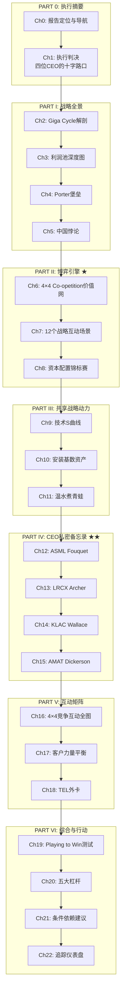

# Chapter 0: 报告定位与导航

---

## 0.1 这不是一份投资报告

你手中的这份报告与我们此前交付的五份分析报告（ASML v1.0、LRCX v3.0、KLAC v1.0、AMAT v1.1、SEMI_EQUIPMENT横向对比）有一个根本性的区别：

**读者身份变了。**

那五份报告面向投资者——评估者。核心问题是"这家公司值多少钱"。产出是估值、评级、概率加权预期回报。

这份报告面向CEO——操盘手。核心问题是"我应该做什么"。产出是决策、行动手册、竞争响应矩阵。

| 维度 | 投资报告 (3.84MB已交付) | 本战略报告 |
|------|----------------------|-----------|
| **读者** | 投资组合经理 | CEO / 董事会 |
| **核心问题** | "值多少钱？" | "应该做什么？" |
| **输出物** | 估值 + 评级 | 决策 + 行动手册 |
| **竞争分析** | "谁赢？" | "如果你做X，对手做Y" |
| **风险框架** | 概率加权情景 | 温水煮青蛙渐进路径 |
| **沉默分析** | 识别为空方风险 | 识别为CEO盲区 |
| **语调** | "审慎关注"/"中性关注" | "Fouquet先生，你有一个问题" |

---

## 0.2 方法论：McKinsey SCR + Brandenburger博弈论

本报告的底层框架融合两个传统：

### 0.2.1 McKinsey Situation-Complication-Resolution (SCR)

每个CEO私密备忘录（Part IV）遵循严格的SCR结构：

```
Situation  → 你的竞争地位事实（不争论，只陈述）
     |
Complication → 你正面临的4-5个真实挑战（不回避，不美化）
     |
Resolution → 我们建议的战略行动（具体、可执行、有追踪信号）
```

这不是我们发明的。这是Barbara Minto在麦肯锡开发了十年的方法论，核心原则是："你从底部往上思考，但从顶部往下呈现。" 结论先行，证据跟进。

### 0.2.2 Brandenburger-Nalebuff Co-opetition + 序贯博弈

半导体设备行业不是零和博弈。四家公司同时是合作者和竞争者：

- **合作面**：共同游说CHIPS Act补贴、共享客户路线图、共同推进节点演进
- **竞争面**：争夺WFE份额、抢占先进封装新领地、竞争客户co-development名额

Part II（博弈引擎）用PARTS分析框架（Players-Added Value-Rules-Tactics-Scope）映射每一对竞争互动，并用序贯博弈和Stackelberg领导模型推演12个战略场景。

### 0.2.3 Playing to Win 战略一致性测试

Part VI对每家公司执行Roger Martin/A.G. Lafley的五层选择瀑布测试：

```
赢的志向 → 在哪里赢 → 如何赢 → 核心能力 → 管理系统
```

检验五层选择是否形成**强化循环**——任何一层的不一致都会导致战略泄漏。

---

## 0.3 报告地图



### 三种阅读路径

**路径A：CEO急读版（30分钟）**
Ch1（执行判决）→ 你的CEO备忘录（Ch12/13/14/15之一）→ Ch22（追踪仪表盘）

**路径B：战略团队精读版（3小时）**
Part 0 → Part I → 你的CEO备忘录 → Part V → Part VI

**路径C：完整版（8小时+）**
从头到尾，每章配合附录B的框架参考指南

---

## 0.4 数据底座与证据链

本报告的每一个战略判断都锚定在具体数据上。数据来源分三层：

| 数据层 | 来源 | 覆盖率 | 可信度 |
|--------|------|--------|--------|
| **L1: 我们的前期报告** | ASML v1.0 (810KB) + LRCX v3.0 (610KB) + KLAC v1.0 (443KB) + AMAT v1.1 (520KB) + COMPARATIVE (1.55MB) | 100% | A级——经过红队审查、质量门控、scorecard验证 |
| **L2: CEO原话** | Q4 2025 / Q2 FY2026 / Q1 FY2026 财报电话会 + Investor Day | 100% | A级——第一手管理层声音 |
| **L3: 行业数据** | SEMI官方预测、McKinsey/BCG/Bain行业报告、TrendForce、SemiAnalysis | 90%+ | B+级——行业标准数据源 |

**引用规则**：当本报告引用我们前期报告的分析结论时，使用 `[参阅: ASML v1.0 Ch15]` 格式，指向具体章节。读者可以追溯到完整证据链。

---

## 0.5 语调约定

本报告刻意采用CEO顾问语调，而非投资分析师语调：

- **禁止**："买入"、"卖出"、"目标价"、"增持"、"减持"
- **使用**："战略选项"、"决策点"、"竞争响应"、"追踪信号"、"如果...那么..."
- **称呼**：直接使用CEO姓名（Fouquet、Archer、Wallace、Dickerson），而非"ASML管理层"
- **时态**：建议用现在时（"你面临..."），而非过去时（"公司经历了..."）

**CEO测试标准**：每一段文字都应通过以下检验——"如果这位CEO读到这段话，他会觉得我们比他的战略团队更了解他的处境吗？" 如果不能，重写。

---

## 0.6 保密声明

本报告包含基于公开信息的竞争性战略分析，但其综合判断、博弈推演和战略建议构成专有智力资产。报告中的CEO私密备忘录（Part IV）尤其包含敏感的竞争情报分析，应限于最高管理层阅读范围。

---

*[本章完 | 下一章: Ch1 执行判决——四位CEO的十字路口]*
