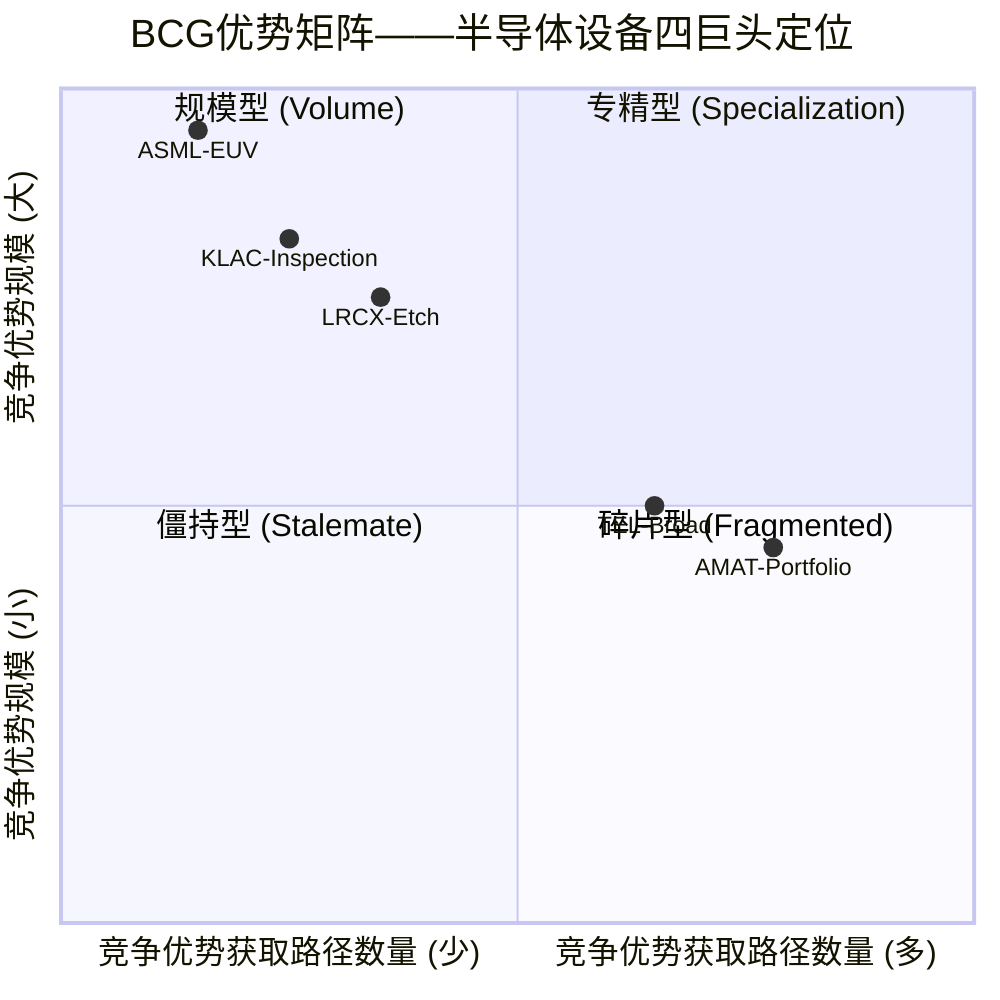
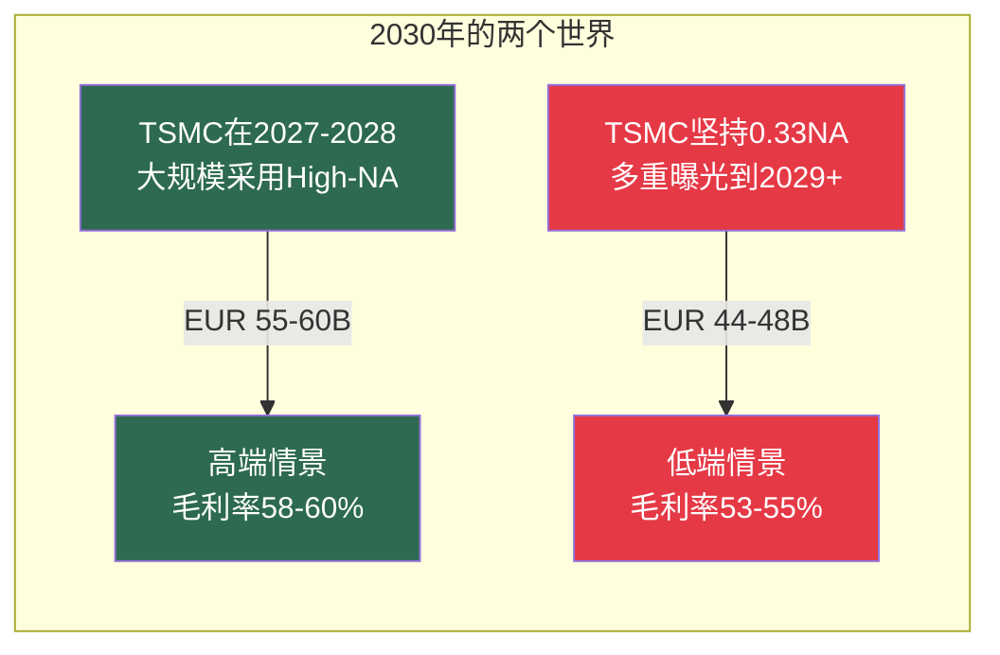
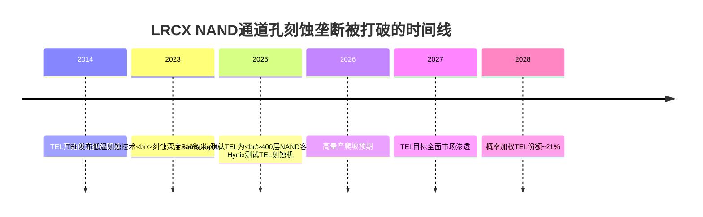
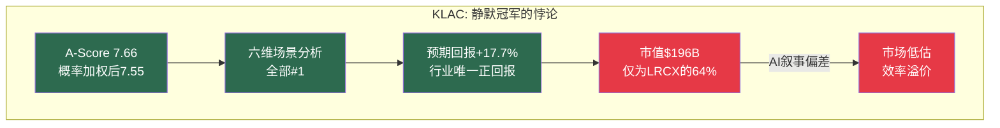
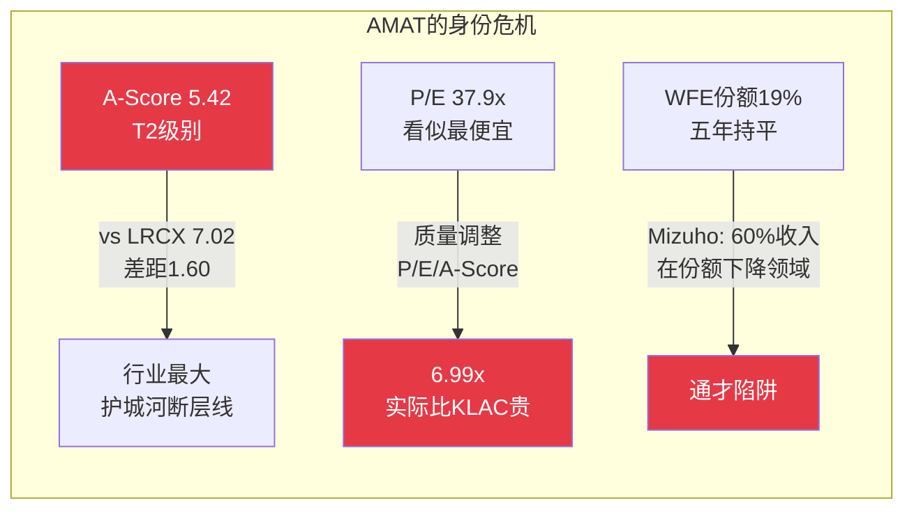
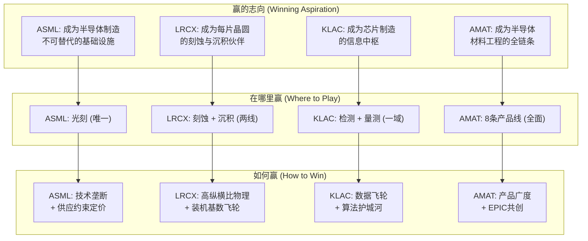

# Chapter 1: 执行判决——四位CEO的十字路口

> *"战略的本质不是选择做什么，而是选择不做什么。"*
> *— Michael Porter*

---

## 1.1 一张图看清格局

在深入每位CEO的具体处境之前，先看一张让整个行业的战略张力一目了然的矩阵。

**这张图揭示了半导体设备行业最深层的战略真相**：ASML、KLAC和LRCX都处于"专精型"象限——大优势、少路径——这是工业企业最理想的战略位置。AMAT则漂移到了象限交界处——优势不够大（没有垄断级别的单一市场）、路径太多（8条产品线分散资源）。

这不是一个估值问题。这是一个**身份问题**。

---

## 1.2 执行判决：四份一句话诊断

### 致 Christophe Fouquet (ASML CEO)

> **"你的效率议程是正确的，但还不够——TSMC对High-NA的犹豫是你2030年目标的存亡之战。"**

**处境摘要**：

你继承了Peter Wennink打造的人类工业史上最强垄断——100% EUV市场份额，零替代品，物理定律级别的护城河。你的2030年目标是EUR 44-60B收入。你2025年做到了EUR 32.7B。

问题不在于你能不能做到。问题在于**哪个版本的2030年会到来**。

**你的沉默区**：你从不直接回应TSMC对High-NA的公开犹豫。TSMC是你最大的客户（收入占比30-35%），他们公开表示倾向于在更便宜的0.33 NA工具上使用多重曝光。如果TSMC延迟High-NA采用两年，你的2030年高端情景（EUR 60B）将变得不可实现。

**你需要在2026年做的三件事**：
1. 制定一个不依赖TSMC在2028年前采用High-NA的Plan B
2. 构建从51-53%（2026指引）到56-60%（2030目标）的毛利率桥接叙事
3. 将效率议程从"减少官僚主义"升级为"供应链韧性"——你的全部生产集中在Veldhoven

[参阅: ASML v1.0 Ch5, Ch8, Ch15] [参阅: SEMI_EQUIPMENT Ch9 A-Score 8.12]

---

### 致 Tim Archer (LRCX CEO)

> **"你的十年NAND刻蚀垄断首次被突破——低温刻蚀防御是第一优先级。"**

**处境摘要**：

你领导着全球刻蚀设备的冠军——45%市场份额，100K+装机腔体，$7.2B的CSBG年金收入。你的"五年翻倍"目标（2025 Investor Day）暗含~15% CAGR，是四家公司中最激进的财务目标。

但有一件事改变了一切：**TEL获得了你NAND通道孔刻蚀的第一个量产POR。**

**你从不点名TEL。** 在你的财报电话会上，竞争对手始终以"aggregate"形式被讨论，从不具名。这种沉默传递了一个信号：你要么认为TEL威胁可控（在此情况下，市场需要听到你的防御计划），要么认为公开讨论会放大威胁（在此情况下，你的沉默本身就是一种策略信号）。

**关键数学**：即使TEL在2028年拿到25-35%的NAND通道孔份额，你的该领域收入仍从$500M（2023）增长到~$1.4B（2028），因为TAM从$500M扩大到$2B。**真正的威胁不是收入损失，而是定价权侵蚀**——从独家供应商变为双寡头，ASP可能压缩5-10%，这个影响辐射到你整个刻蚀产品组合。

**你需要在2026年做的三件事**：
1. 为CSBG设定一个比"1.5x by 2028"更有雄心的愿景——这是你最强的战略资产，投资Equipment Intelligence和Dextro让它从收入引擎升级为利润引擎
2. 制定并可能公开你的低温刻蚀防御策略——沉默正在被市场解读为脆弱
3. 重新评估在P/E 49x水平的回购——2.03%隐含IRR低于无风险利率，将$1-1.5B从回购转向研发（CFET/Equipment Intelligence商业化/先进封装刻蚀）

[参阅: LRCX v3.0 Ch5, Ch15-16, Ch20] [参阅: SEMI_EQUIPMENT Ch16]

---

### 致 Rick Wallace (KLAC CEO)

> **"你拥有行业最强护城河加行业最弱继任计划——3月12日Investor Day是你的时刻。"**

**处境摘要**：

你是四位CEO中任期最长的——从2006年1月至今，20年。你建造了半导体设备行业中最接近"软件公司"的商业模式：62%毛利率、2.8% CapEx/Revenue（在软件公司范围内）、9.7x固定资产周转率（在软件公司范围内）。你的A-Score 7.66，概率调整后与ASML的差距从0.46缩小到0.25。

你在我们横向对比的六维度场景分析中取得了**全项第一的clean sweep**——概率加权预期回报、牛市回报、熊市保护、风险调整系数、遗憾最小化、基准情景回报符号。这在横向对比分析中极为罕见。

但你有两个不说的事：

1. **继任计划**。20年CEO任期之后，市场已经开始定价key-man风险，即使你本人没有讨论过。你3月12日的Investor Day应该直接回应这个问题——不是宣布退休，而是展示你的管理团队深度。

2. **先进封装利润率**。你的先进封装收入（$950M，同比+70%）是增长最快的向量。但你从未确认封装检测工具是否承载着与核心业务相同的62%+毛利率。市场的熊方叙事正是建立在"封装利润率低于核心"的假设上。

**你需要在2026年做的三件事**：
1. 在3月12日Investor Day上回应继任问题——展示管理层深度即可，不需要宣布时间表
2. 确认先进封装利润率与核心业务的可比性——消除熊方最强的单一论点
3. 利用你的"静默冠军"身份——市场给了你$196B的市值（LRCX的64%），而你在每个风险调整维度都优于LRCX。在Investor Day上展示这个不对称，用数据让市场自己重新定价

[参阅: KLAC v1.0 Ch2-3, Ch6] [参阅: SEMI_EQUIPMENT Ch9, Ch16, Ch17]

---

### 致 Gary Dickerson (AMAT CEO)

> **"EPIC是正确的战略，但optics错误——市场给你打了30-40%的估值折价，因为看不到ROI。"**

**处境摘要**：

你领导着半导体设备行业中组合最广、收入最大（FY2025 ~$27.2B）的公司。你有8条产品线、跨越所有工艺步骤。你的GAA收入正在翻倍至$5B。你的$5B EPIC中心将在2026年春天开业，Samsung已宣布为创始成员。

但市场不买账。

**你面临的核心矛盾**：你的A-Score（5.42）与LRCX（7.02）之间的1.60分差距是整个对比分析中**最大的断层线**。这不是一个边际差距——这是Tier 1（ASML/KLAC/LRCX）与Tier 2（AMAT）之间的结构性分水岭。而你的P/E（37.9x）看似最低，但质量调整后（P/E ÷ A-Score = 6.99x），实际上比KLAC（6.40x）更贵。

**"便宜"和"低估"是完全不同的概念。**

EPIC中心是你唯一能打破这个均衡的武器。但当前市场给EPIC的定价接近零——因为你没有给出公开的ROI框架。$5B是半导体设备行业历史上最大的单一CapEx项目，但你没有告诉市场：什么时候回本？通过什么机制？Samsung之后谁是下一个？

**你需要在2026年做的四件事**：
1. 为EPIC制定公开的ROI框架——里程碑、客户承诺数量、收入归因时间表
2. 争取TSMC和/或Intel加入EPIC——Samsung alone不构成网络效应，TSMC参与将改变market的对EPIC定价
3. 考虑分部报告结构改革——将AI增长故事（GAA、先进封装、HBM）与ICAPS消化故事分离呈现，让市场能够分别定价
4. 如果ICAPS拖累持续到2027年仍无恢复迹象，认真评估ICAPS业务组合优化——剥离还是整合？

[参阅: AMAT v1.1 Ch3-5, Ch9, Ch16-17] [参阅: SEMI_EQUIPMENT Ch9, Ch16]

---

## 1.3 四家公司的战略DNA对照

### Playing to Win 一致性评分

| 公司 | 志向-赛场一致性 | 赛场-方法一致性 | 方法-能力一致性 | 能力-系统一致性 | 总一致性 |
|------|:---:|:---:|:---:|:---:|:---:|
| **ASML** | 10/10 | 10/10 | 10/10 | 9/10 | **39/40** |
| **KLAC** | 9/10 | 9/10 | 9/10 | 8/10 | **35/40** |
| **LRCX** | 8/10 | 8/10 | 8/10 | 7/10 | **31/40** |
| **AMAT** | 7/10 | 5/10 | 6/10 | 6/10 | **24/40** |

**ASML是教科书级的战略一致性**：每一层选择都强化其他层。赢的志向（不可替代的基础设施）决定了赛场（只做光刻），决定了方法（技术垄断），决定了能力（精密光学+EUV光源+计算光刻），决定了系统（20%+ R&D强度，深度Zeiss合作关系）。改变任何一层都会瓦解整个系统。

**AMAT的问题恰好相反**：赢的志向（全链条材料工程）要求赛场（8条产品线），但方法（产品广度）与能力（每条线$450M研发 vs LRCX/KLAC集中$1.3-2.1B）不匹配。EPIC中心是试图用能力层（共创平台）来弥补方法层（广度 vs 深度）的结构性弱点。

---

## 1.4 战略紧迫度排序

不是每个CEO的"十字路口"紧迫度相同。以下是按战略决策窗口期排序的优先级：

| 排序 | CEO | 最紧迫决策 | 窗口期 | 不作为的后果 |
|:---:|------|-----------|--------|------------|
| **1** | **Wallace (KLAC)** | 3月12日Investor Day：继任+封装利润率 | **9天** | 继任叙事失控、封装折价固化 |
| **2** | **Dickerson (AMAT)** | EPIC开业：第二/第三创始成员确认 | 2026春 | Samsung单独=无网络效应，EPIC估值=0 |
| **3** | **Archer (LRCX)** | 低温刻蚀防御策略：公开还是沉默 | 2026 H1 | TEL高量产爬坡后沉默=默认示弱 |
| **4** | **Fouquet (ASML)** | TSMC High-NA讨论：加速还是接受延迟 | 2026 H2 | 2030目标可信度受损但有时间修正 |

---

## 1.5 共享战略动力预览

在进入Part I的详细分析之前，这里预览四家公司共同面临的四个结构性力量：

### 力量1：Giga Cycle——$156B WFE新纪录在即

WFE从2024年$107B到2027年$156B（+46%三年），由AI基础设施投资驱动。这不是传统周期——4-5个技术转型同时发生（High-NA EUV、GAA、背面供电、先进封装、HBM），设备步骤数量每代增加15-25%。设备密度的结构性上升意味着即使晶圆开工数增长放缓，设备收入仍能增长。

### 力量2：利润池极端集中

半导体行业前5%的公司贡献了100%的经济利润（McKinsey 2024）。设备公司作为供应商理论上应该被隔离——但实际上，它们的收入越来越依赖缩减中的超级客户群（TSMC/Samsung/Intel/Micron占WFE的60-70%+）。

### 力量3：中国悖论

中国在2024年购买了ASML 70%的DUV系统，同时加速国产替代至35%自给率。中国同时是最大客户和最快成长的竞争对手。设备公司有3-5年的峰值中国收入窗口——之后国产替代将有意义地压缩成熟节点利润率。

### 力量4：温水煮青蛙

四条渐进衰退路径没有一个会在任何单一季度触发止损，但5年累计效应可以重塑竞争格局：
- AI CapEx高原（2028-2030）
- 中国钳形攻势（成熟端替代 + 先进端封锁）
- 客户集中螺旋（60-70%收入来自3-4家）
- 定价权侵蚀（$400M High-NA工具 = 客户抵抗的临界点）

这四个力量将在Part I（Ch2-5）中逐一展开。

---

## 1.6 行动矩阵汇总

| CEO | 第一优先级 | 第二优先级 | 第三优先级 | 追踪信号 |
|-----|-----------|-----------|-----------|---------|
| **Fouquet** | TSMC High-NA Plan B | 毛利率桥接叙事 | 供应链韧性 | TSMC High-NA订单（H2 2026）/ 毛利率每季轨迹 |
| **Archer** | 低温刻蚀防御策略 | CSBG利润引擎化 | 回购→研发再平衡 | TEL NAND POR数量 / CSBG ARPU季度增长 |
| **Wallace** | 3/12 Investor Day: 继任+封装 | 静默冠军叙事构建 | AI SaaS路线图 | 先进封装利润率确认 / 继任计划信号 |
| **Dickerson** | EPIC第二创始成员 | 分部报告改革 | ICAPS战略评估 | EPIC合作伙伴数量 / GAA $5B验证 / ICAPS复苏信号 |

---

## 1.7 一个隐含的战略判断

如果你是一位同时持有四家公司股票的资产配置者，我们的前期横向对比分析中有一个结论需要在CEO语境中重新表述：

**"ASML + KLAC等权双持"不仅是最优投资组合——它也揭示了半导体设备行业中两种获胜方式的不可调和性。**

ASML赢在"确定性"维度（护城河深度、增长前景、估值合理性、催化剂密度），KLAC赢在"效率"维度（经济质量、资本效率、风险韧性、周期防御）。它们的获胜维度**不重叠**——这意味着没有任何单一战略可以同时最大化两者。

对CEO的暗示：**你不可能同时做ASML和KLAC。** 选择你的战场——是追求不可替代性（ASML模式：一个产品做到100%），还是追求效率（KLAC模式：一个领域做到60%+但每美元收入产出最多利润）。AMAT的困境恰恰在于试图两者兼得。

---

*[本章完 | 下一章: Ch2 Giga Cycle解剖——一个持续到2028年的超级周期]*
